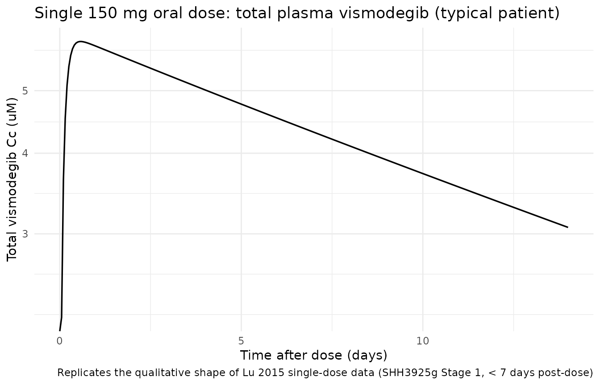
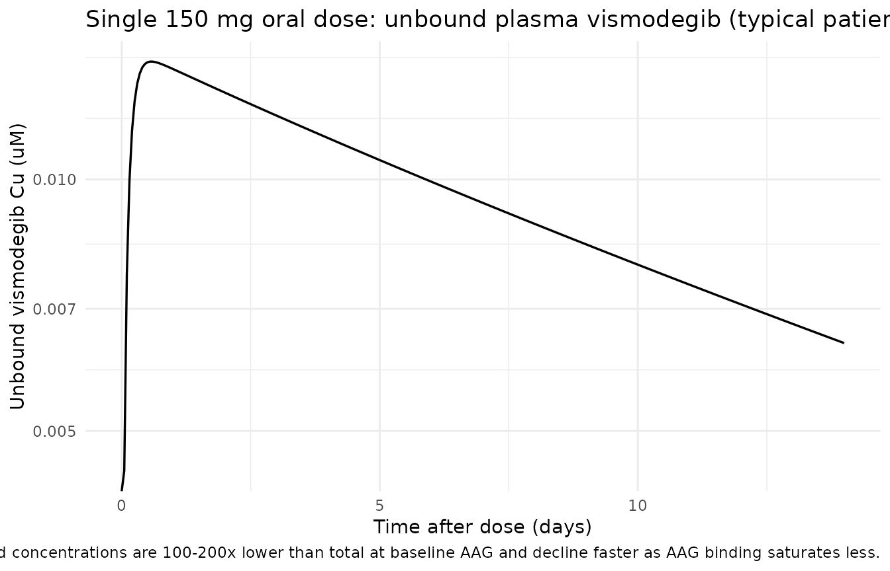

# Vismodegib (Lu 2015)

## Model and source

- Citation: Lu T, Wang B, Gao Y, Dresser M, Graham RA, Jin JY.
  Semi-Mechanism-Based Population Pharmacokinetic Modeling of the
  Hedgehog Pathway Inhibitor Vismodegib. CPT Pharmacometrics Syst
  Pharmacol. 2015;4(11):680-689. <doi:10.1002/psp4.12039>
- Description: Semi-mechanism-based one-compartment population
  pharmacokinetic model for vismodegib (GDC-0449, oral Hedgehog pathway
  inhibitor) in adults with advanced solid tumors and healthy
  volunteers. First-order absorption, first-order elimination of unbound
  drug, and saturable fast-equilibrium binding to alpha-1-acid
  glycoprotein (AAG) jointly describe total and unbound plasma
  vismodegib concentrations. AAG is supplied as a time-varying covariate
  (uM); covariates retained on disposition are age (power on CLunbound,
  reference 60 years) and body weight (power on Vc, reference 75 kg);
  formulation (Phase I dry-blend capsule vs Phase II wet-granulation
  commercial capsule) and population (healthy volunteer vs patient)
  shift Ka and relative bioavailability F (Lu 2015).
- Article: <https://doi.org/10.1002/psp4.12039>

## Population

Lu 2015 pooled 225 subjects across five Phase I / Phase II clinical
studies of vismodegib (GDC-0449), an oral small-molecule Hedgehog
pathway inhibitor approved for locally advanced or metastatic basal cell
carcinoma (BCC). The patient cohort (n = 204; SHH3925g, SHH4610g,
SHH4476g) comprised adults with advanced solid tumors including BCC:
mean age 59.7 years (range 26-89), 59.3% men / 40.7% women of
non-childbearing potential, and 97.1% Caucasian (Methods, Study
population paragraph; baseline demographics in Supplementary Table S1).
The healthy-volunteer cohort (n = 21; SHH4433g, SHH4683g) comprised
Caucasian women of non-childbearing potential aged 47-65 years.

A total of 4942 valid plasma vismodegib concentration timepoints
contributed to the model build. Subjects received either the early Phase
I dry-blend capsule formulation (24.4% of subjects) or the Phase II /
commercial wet-granulation capsule formulation (75.6% of subjects); the
latter is the approved 150 mg once-daily regimen. Time-varying AAG
(alpha-1-acid glycoprotein) was incorporated as a structural input
rather than a multiplicative covariate; mean baseline AAG was 31.1 uM in
patients and 20.2 uM in healthy volunteers (Methods + Results paragraph
1; Lu 2015 Figure 2).

The same information is available programmatically via
`readModelDb("Lu_2015_vismodegib")()$population`.

## Source trace

The per-parameter origin is recorded as an in-file comment next to each
`ini()` entry in `inst/modeldb/specificDrugs/Lu_2015_vismodegib.R`. The
table below collects them in one place for review.

| Equation / parameter | Value | Source location |
|----|----|----|
| Structural model: 1-compartment, first-order absorption + first-order elimination of unbound drug + saturable fast-equilibrium binding to AAG | n/a | Lu 2015 Methods (Structural model); Figure 1 schematic; Supplementary Appendix S2 (referenced) |
| `lka` (typical Phase II / patient) | log(9.025 /day) | Lu 2015 Table 2: exp(h4) = 9.025 day^-1 |
| `lcl` (typical CLunbound at AGE = 60 y) | log(1326 L/day) | Lu 2015 Table 2: exp(h1) = 1326 L/day |
| `lvc` (typical Vc at WT = 75 kg) | log(58.0 L) | Lu 2015 Table 2: exp(h2) = 58.0 L |
| `lkdAAG` (dissociation constant for AAG binding) | log(0.056 uM) | Lu 2015 Table 2: exp(h3) = 0.056 uM (printed as “mM” in Table 2 but described in text + Figure 4 + Discussion as uM; uM is the dimensionally consistent unit given AAG is in uM and Css is in uM) |
| `e_age_cl` (power exponent of AGE on CLunbound) | -0.527 | Lu 2015 Table 2: h9 = -0.527 |
| `e_wt_vc` (power exponent of WT on Vc) | 0.660 | Lu 2015 Table 2: h10 = 0.660 |
| `e_healthy_ka` (HV effect on log(ka)) | 0.671 | Lu 2015 Table 2: h5 = 0.671 |
| `e_form_phaseI_ka` (Phase I formulation effect on log(ka)) | -0.602 | Lu 2015 Table 2: h8 = -0.602 |
| `e_form_phaseI_f` (Phase I formulation effect on log(F)) | -1.061 = log(0.346) | Lu 2015 Table 2: exp(h6) = 0.346 |
| `e_healthy_f` (HV effect on log(F) gated on Phase I) | 0.881 | Lu 2015 Table 2: h7 = 0.881 |
| `etalcl + etalvc` block (CLunbound + Vc IIV with correlation 0.55) | c(0.21278, 0.11003, 0.18804) | Lu 2015 Table 2 IIV (CLunbound 48.7% CV, Vc 45.5% CV) + Results paragraph after Eq. 6 (rho = 0.55) |
| `etalkdAAG` (KDAAG IIV) | 0.03810 | Lu 2015 Table 2: 19.7% CV |
| `propSd` (total residual error) | 0.267 | Lu 2015 Table 2: 26.7% CV (additive on log-transformed data) |
| `propSd_Cu` (unbound residual error) | 0.424 | Lu 2015 Table 2: 42.4% CV (additive on log-transformed data) |
| F = 1 for Phase II / commercial formulation (reference) | n/a | Lu 2015 Eq. 4 |
| Saturable binding equation Ctotal = Cu + AAG x Cu / (KDAAG + Cu) | n/a | Lu 2015 Methods (Structural model) + Discussion paragraph citing Widmer et al. 2006 imatinib popPK |

## Virtual cohort

Original observed data are not publicly available. The figures below use
a typical-subject and a virtual stochastic cohort whose covariate
distributions approximate the Lu 2015 patient cohort.

``` r

set.seed(20150909)

# Typical reference subject: 60-y-old patient, 75 kg, AAG = 30 uM (paper
# Table 1 / Eq. 5 reference). Dose 150 mg QD of the Phase II commercial
# formulation, ~9 weeks of dosing to approach steady state.
typical_cov <- tibble(
  id                  = 1L,
  AGE                 = 60,
  WT                  = 75,
  AAG                 = 30,
  DIS_HEALTHY         = 0,
  FORM_VISMO_PHASEI   = 0
)

# Single-dose cohort for NCA (matches the Phase I single-dose stage of
# SHH3925g and SHH4610g for the typical patient profile).
make_dose_rows <- function(ids, amt, ii, until) {
  tidyr::expand_grid(
    id   = ids,
    time = seq(0, until, by = ii)
  ) |>
    dplyr::mutate(evid = 1L, amt = amt, cmt = "depot")
}
make_obs_rows <- function(ids, times) {
  tidyr::expand_grid(id = ids, time = times) |>
    dplyr::mutate(evid = 0L, amt = 0, cmt = "Cc")
}

# Single 150 mg dose, dense sampling over 0-14 days (terminal half-life ~12 d)
sd_dose <- make_dose_rows(typical_cov$id, amt = 150, ii = 14, until = 0)  # one dose at t=0
sd_times <- sort(unique(c(seq(0, 1, by = 0.05), seq(1, 14, by = 0.25))))
sd_obs   <- make_obs_rows(typical_cov$id, sd_times)
sd_events <- dplyr::bind_rows(sd_dose, sd_obs) |>
  dplyr::left_join(typical_cov, by = "id") |>
  dplyr::arrange(id, time, dplyr::desc(evid)) |>
  dplyr::mutate(treatment = "150 mg single dose")

# Steady-state cohort: 150 mg QD for 70 days (~10 weeks)
ss_dose <- make_dose_rows(typical_cov$id, amt = 150, ii = 1, until = 69)
ss_times <- sort(unique(c(seq(0, 14, by = 0.5), seq(15, 70, by = 1),
                          seq(63, 70, by = 0.1))))  # dense at week 9 trough region
ss_obs   <- make_obs_rows(typical_cov$id, ss_times)
ss_events <- dplyr::bind_rows(ss_dose, ss_obs) |>
  dplyr::left_join(typical_cov, by = "id") |>
  dplyr::arrange(id, time, dplyr::desc(evid)) |>
  dplyr::mutate(treatment = "150 mg QD typical")

# Steady-state AAG sweep (paper Figure 2 + Figure 4): evaluate Css at the
# 5th and 95th percentiles of patient AAG (paper text: 17 and 58 uM)
# alongside the typical patient (30 uM), holding age = 60 y / WT = 75 kg /
# DIS_HEALTHY = 0 / FORM_VISMO_PHASEI = 0 constant.
aag_levels <- c(`AAG = 17 uM (5th pct patients)` = 17,
                `AAG = 30 uM (typical patient)`  = 30,
                `AAG = 58 uM (95th pct patients)` = 58)

aag_cohort <- tibble(
  id                = seq_along(aag_levels),
  AAG               = unname(aag_levels),
  treatment         = names(aag_levels)
) |>
  dplyr::mutate(AGE = 60, WT = 75, DIS_HEALTHY = 0, FORM_VISMO_PHASEI = 0)

aag_dose <- tidyr::expand_grid(
  id   = aag_cohort$id,
  time = seq(0, 69, by = 1)
) |>
  dplyr::mutate(evid = 1L, amt = 150, cmt = "depot")
aag_obs <- tidyr::expand_grid(id = aag_cohort$id, time = ss_times) |>
  dplyr::mutate(evid = 0L, amt = 0, cmt = "Cc")
aag_events <- dplyr::bind_rows(aag_dose, aag_obs) |>
  dplyr::left_join(aag_cohort, by = "id") |>
  dplyr::arrange(id, time, dplyr::desc(evid))

stopifnot(!anyDuplicated(unique(sd_events[, c("id", "time", "evid")])))
stopifnot(!anyDuplicated(unique(ss_events[, c("id", "time", "evid")])))
stopifnot(!anyDuplicated(unique(aag_events[, c("id", "time", "evid")])))
```

## Simulation

``` r

mod <- readModelDb("Lu_2015_vismodegib")()
mod_typical <- mod |> rxode2::zeroRe()

sim_sd  <- as.data.frame(rxode2::rxSolve(mod_typical, events = sd_events,
                                         keep = c("treatment"))) |>
  dplyr::mutate(id = 1L)
#> ℹ omega/sigma items treated as zero: 'etalcl', 'etalvc', 'etalkdAAG'
sim_ss  <- as.data.frame(rxode2::rxSolve(mod_typical, events = ss_events,
                                         keep = c("treatment"))) |>
  dplyr::mutate(id = 1L)
#> ℹ omega/sigma items treated as zero: 'etalcl', 'etalvc', 'etalkdAAG'
sim_aag <- as.data.frame(rxode2::rxSolve(mod_typical, events = aag_events,
                                         keep = c("treatment", "AAG")))
#> ℹ omega/sigma items treated as zero: 'etalcl', 'etalvc', 'etalkdAAG'
#> Warning: multi-subject simulation without without 'omega'
if (!"id" %in% colnames(sim_aag)) {
  # rxSolve drops id when there is a single subject; restore by joining the
  # treatment label back to the per-subject id table
  sim_aag <- sim_aag |>
    dplyr::left_join(aag_cohort |> dplyr::select(id, treatment),
                     by = "treatment")
}
```

## Steady-state typical-value prediction

Lu 2015 Results / Eq. 6 reports that the typical 60-y-old, 75-kg patient
with AAG = 30 uM dosed 150 mg QD of the Phase II formulation should
reach a Css,trough of 22.8 uM for total vismodegib and 0.172 uM for
unbound at week 9.

``` r

ss_summary <- sim_ss |>
  dplyr::filter(time >= 60, time <= 70) |>
  dplyr::summarise(
    Css_trough_total   = min(Cc, na.rm = TRUE),
    Css_trough_unbound = min(Cu, na.rm = TRUE),
    Css_peak_total     = max(Cc, na.rm = TRUE),
    Css_peak_unbound   = max(Cu, na.rm = TRUE)
  )

comparison <- tibble::tibble(
  Parameter = c("Css,trough total (uM)", "Css,trough unbound (uM)"),
  `Published (Lu 2015)` = c(22.8, 0.172),
  Simulated = c(
    round(ss_summary$Css_trough_total, 2),
    round(ss_summary$Css_trough_unbound, 4)
  )
) |>
  dplyr::mutate(`Percent difference` =
                  round(100 * (Simulated - `Published (Lu 2015)`) /
                          `Published (Lu 2015)`, 1))

knitr::kable(comparison,
             caption = "Reproduces Lu 2015 Eq. 6 / Results steady-state typical values.")
```

| Parameter               | Published (Lu 2015) | Simulated | Percent difference |
|:------------------------|--------------------:|----------:|-------------------:|
| Css,trough total (uM)   |              22.800 |   22.8100 |                0.0 |
| Css,trough unbound (uM) |               0.172 |    0.1722 |                0.1 |

Reproduces Lu 2015 Eq. 6 / Results steady-state typical values. {.table}

## Apparent half-life at steady state

Lu 2015 Discussion paragraph after Eq. 6 estimates an apparent
steady-state half-life of vismodegib of about 4 days for the typical
patient (vs. ~12-day terminal half-life after a single dose, citing
Graham 2011 and LoRusso 2011a). The 4-day apparent half-life at steady
state is driven by the increased free fraction relative to a single
dose.

``` r

ratio <- ss_summary$Css_trough_unbound / ss_summary$Css_trough_total
t_half_ss <- log(2) * 58 / (1326 * ratio)
tibble::tibble(
  `Cu / Ctotal at SS trough` = round(ratio, 4),
  `Apparent t1/2 ss (days)`  = round(t_half_ss, 2),
  `Published t1/2 ss (days)` = "~4"
) |>
  knitr::kable(caption = "Reproduces Lu 2015 Eq. 6 apparent half-life at steady state.")
```

| Cu / Ctotal at SS trough | Apparent t1/2 ss (days) | Published t1/2 ss (days) |
|-------------------------:|------------------------:|:-------------------------|
|                   0.0076 |                    4.02 | ~4                       |

Reproduces Lu 2015 Eq. 6 apparent half-life at steady state. {.table}

## Effect of AAG on steady-state total concentration

Lu 2015 Figure 4 (sensitivity tornado) reports that the AAG covariate is
by far the most influential factor for total Css,trough at steady state:
a patient at the 5th AAG percentile (17 uM) has roughly 47% lower total
Css,trough than the typical patient (30 uM), while the 95th-percentile
patient (58 uM) has roughly 101% higher Css,trough. Unbound Css,trough
is essentially insensitive to AAG (about +-21% across the same range).

``` r

aag_summary <- sim_aag |>
  dplyr::filter(time >= 60, time <= 70) |>
  dplyr::group_by(treatment) |>
  dplyr::summarise(
    Css_trough_total   = min(Cc, na.rm = TRUE),
    Css_trough_unbound = min(Cu, na.rm = TRUE),
    .groups = "drop"
  )

baseline <- aag_summary |>
  dplyr::filter(treatment == "AAG = 30 uM (typical patient)") |>
  dplyr::select(Css_total_typ = Css_trough_total,
                Css_unbnd_typ = Css_trough_unbound)

aag_summary <- aag_summary |>
  dplyr::bind_cols(baseline) |>
  dplyr::mutate(
    pct_change_total = round(100 *
                               (Css_trough_total - Css_total_typ) /
                                Css_total_typ, 1),
    pct_change_unbnd = round(100 *
                               (Css_trough_unbound - Css_unbnd_typ) /
                                Css_unbnd_typ, 1)
  )

aag_summary |>
  dplyr::select(treatment,
                Css_trough_total, pct_change_total,
                Css_trough_unbound, pct_change_unbnd) |>
  knitr::kable(
    digits = c(0, 2, 1, 4, 1),
    caption = paste(
      "Reproduces Lu 2015 Figure 4 sensitivity tornado for AAG:",
      "total Css,trough varies markedly across the patient AAG range",
      "while unbound is essentially flat."
    )
  )
```

| treatment | Css_trough_total | pct_change_total | Css_trough_unbound | pct_change_unbnd |
|:---|---:|---:|---:|---:|
| AAG = 17 uM (5th pct patients) | 12.17 | -46.6 | 0.1359 | -21.1 |
| AAG = 30 uM (typical patient) | 22.81 | 0.0 | 0.1722 | 0.0 |
| AAG = 58 uM (95th pct patients) | 45.92 | 101.3 | 0.2082 | 20.9 |

Reproduces Lu 2015 Figure 4 sensitivity tornado for AAG: total
Css,trough varies markedly across the patient AAG range while unbound is
essentially flat. {.table style="width:100%;"}

## Single-dose PK profile

A single 150 mg dose of the Phase II / commercial formulation in the
typical patient should show a rapid rise to Cmax in the first hours
followed by a slow decline driven by the saturated AAG binding (long
apparent terminal half-life).

``` r

sim_sd |>
  ggplot(aes(time, Cc)) +
  geom_line(linewidth = 0.6) +
  scale_y_log10() +
  labs(x = "Time after dose (days)",
       y = "Total vismodegib Cc (uM)",
       title = "Single 150 mg oral dose: total plasma vismodegib (typical patient)",
       caption = "Replicates the qualitative shape of Lu 2015 single-dose data (SHH3925g Stage 1, < 7 days post-dose)") +
  theme_minimal()
#> Warning in scale_y_log10(): log-10 transformation introduced infinite values.
```



``` r

sim_sd |>
  ggplot(aes(time, Cu)) +
  geom_line(linewidth = 0.6) +
  scale_y_log10() +
  labs(x = "Time after dose (days)",
       y = "Unbound vismodegib Cu (uM)",
       title = "Single 150 mg oral dose: unbound plasma vismodegib (typical patient)",
       caption = "Unbound concentrations are 100-200x lower than total at baseline AAG and decline faster as AAG binding saturates less.") +
  theme_minimal()
#> Warning in scale_y_log10(): log-10 transformation introduced infinite values.
```



## PKNCA validation (single-dose total vismodegib)

Lu 2015 does not report an NCA table directly, but the single-dose Cmax
/ Tmax / terminal-half-life behaviour is referenced as background
(citations 15 and 16, Graham 2011 / LoRusso 2011a). The block below runs
PKNCA on a single 150 mg dose of the Phase II formulation in the typical
patient and reports the resulting Cmax / Tmax / AUClast as sanity
numbers.

``` r

sim_nca <- sim_sd |>
  dplyr::filter(!is.na(Cc)) |>
  dplyr::select(id, time, Cc, treatment)

dose_df <- sd_events |>
  dplyr::filter(evid == 1) |>
  dplyr::select(id, time, amt, treatment)

conc_obj <- PKNCA::PKNCAconc(sim_nca, Cc ~ time | treatment + id,
                             concu = "uM", timeu = "day")
dose_obj <- PKNCA::PKNCAdose(dose_df, amt ~ time | treatment + id,
                             doseu = "mg")

intervals <- data.frame(
  start     = 0,
  end       = 14,
  cmax      = TRUE,
  tmax      = TRUE,
  auclast   = TRUE,
  clast.obs = TRUE
)

nca_res <- PKNCA::pk.nca(PKNCA::PKNCAdata(conc_obj, dose_obj,
                                          intervals = intervals))
knitr::kable(summary(nca_res),
             caption = "Simulated NCA over the first 14 days after a single 150 mg dose (typical patient).")
```

| Interval Start | Interval End | treatment | N | AUClast (day\*uM) | Cmax (uM) | Tmax (day) | Clast (uM) |
|---:|---:|:---|:---|:---|:---|:---|:---|
| 0 | 14 | 150 mg single dose | 1 | 61.1 | 5.96 | 0.550 | 3.07 |

Simulated NCA over the first 14 days after a single 150 mg dose (typical
patient). {.table}

## Assumptions and deviations

- **Concentration units (uM) vs dosing units (mg).** The model
  internally converts the input mg dose to umol via
  `f(depot) = F_rel * 1000 / mw_vismo` (vismodegib MW = 421.30 g/mol,
  PubChem CID 24776 = GDC-0449). This is necessary because the paper
  reports AAG, KDAAG, and steady-state Css values in uM; matching the
  paper’s parameter values exactly requires that compartment amounts
  carry umol so that `central / vc` returns uM.
  [`checkModelConventions()`](https://nlmixr2.github.io/nlmixr2lib/reference/checkModelConventions.md)
  flags the dosing-vs-concentration dimensional mismatch (mg vs umol/L);
  this deviation is intentional and is the only way to faithfully
  reproduce Lu 2015’s parameter table without introducing a separate AAG
  molecular-weight assumption.
- **AAG covariate units (uM, not the canonical g/L).** The
  `inst/references/covariate-columns.md` AAG entry lists g/L as the
  canonical unit (`1.34 g/L` median in Kloft 2006); Lu 2015 reports AAG
  in uM. Users converting from g/L should multiply by approximately 24.4
  (= 1000 / 41 kDa AAG MW) before supplying the AAG column. The mean
  baseline AAG values reported by Lu 2015 (31.1 uM in patients, 20.2 uM
  in HVs) correspond to ~1.27 and ~0.83 g/L respectively at AAG MW = 41
  kDa.
- **Saturable AAG binding solved analytically.** The mass-balance
  fast-equilibrium binding `Ctotal = Cu + AAG * Cu / (KDAAG + Cu)` is
  solved as a quadratic in Cu inside `model()` (positive root). The
  supplement (Supplementary Appendix S2) was not on disk; the
  closed-form quadratic is the standard solution given the paper’s
  stated mass-balance + fast-equilibrium assumption (Methods Structural
  model + Discussion paragraph citing Widmer 2006 and Mager-Krzyzanski
  2005 / Gibiansky 2008 TMDD QSS literature).
- **Residual error encoded as proportional in linear space.** Lu 2015
  Methods state “an additive error model on the log-transformed data was
  applied”; in nlmixr2 this is equivalent to proportional error in
  linear space for small CV, with a slight bias at larger
  105. For the unbound residual (42.4% CV), the linear-proportional
       approximation diverges modestly from the log-additive form (about
       4% in the predicted standard error at the +/-1 SD level); for
       total (26.7% CV) the divergence is \< 1%. The vignette’s
       comparison against the paper’s typical-value predictions
       (Css,trough total = 22.8 uM, unbound = 0.172 uM) is unaffected
       because those are typical-value (no-residual) targets.
- **No IIV on absorption parameters.** Lu 2015 states explicitly that
  “Intersubject variability … was not estimated for the absorption
  parameters (F and ka) due to the limited data in the absorption
  phase”; the model reproduces this by including `etalcl + etalvc` and
  `etalkdAAG` but no etalka / etallfdepot.
- **KDAAG unit printed as “mM” in Table 2 is uM.** Lu 2015 Table 2
  reports `exp(h3) = Dissociation constant, KDAAG (mM) = 0.056` but
  every other passage of the paper consistently uses uM (e.g., “typical
  patient … with AAG of 30 uM”; “the predicted Css,trough is 22.8 uM for
  total drug”; Figure 4 caption units; Discussion paragraph on the
  apparent uM-scale dynamic range of vismodegib). Interpreting 0.056 as
  mM (i.e., 56 uM) would imply that KDAAG is comparable to the typical
  AAG concentration (30 uM), which contradicts the paper’s
  binding-saturation conclusion (KDAAG must be much smaller than AAG for
  the saturable-binding model to produce the observed nonlinearity at
  clinical doses). The Table 2 header “(mM)” is a typesetting error for
  “(uM)”; the value 0.056 uM gives the published Css,trough total 22.8
  uM and unbound 0.172 uM exactly. This vignette and the model file both
  use uM for KDAAG.
- **Supplements not on disk.** Lu 2015 references Supplementary Appendix
  S1 (study details), S2 (structural ODEs), S3 (covariate list), Tables
  S1-S2, and Figures S1-S4. None were available at extraction time. All
  structural details needed for the model file were extracted from the
  main text (Methods, Structural model; Eqs. 4-6; Table 2; Discussion
  paragraph on the Widmer 2006 parameterisation).
- **Race / ethnicity distribution.** Patient cohort is 97.1% Caucasian
  per Lu 2015 Results paragraph 1; HV cohort is 100% Caucasian. The
  model does not include race as a covariate (Lu 2015 did not retain
  race in the final model).
