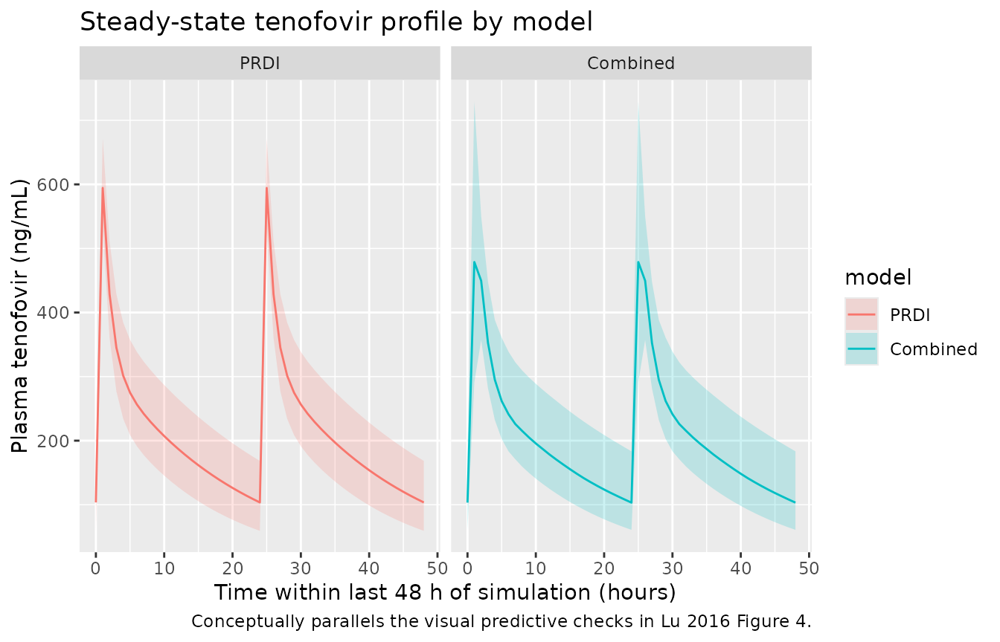
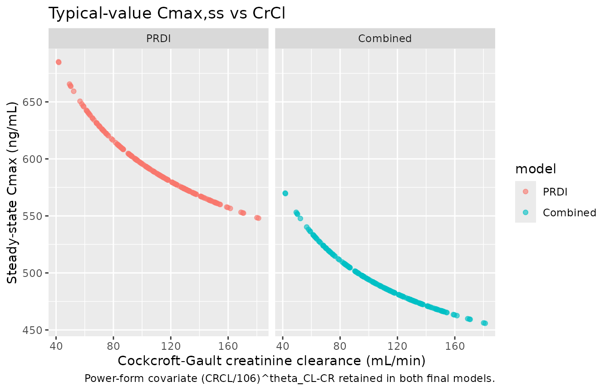

# Tenofovir (Lu 2016)

## Model and source

- Citation: Lu Y, Goti V, Chaturvedula A, Haberer JE, Fossler MJ, Sale
  ME, Bangsberg D, Baeten JM, Celum CL, Hendrix CW. Population
  pharmacokinetics of tenofovir in HIV-1-uninfected members of
  serodiscordant couples and effect of dose reporting methods.
  Antimicrob Agents Chemother. 2016;60(9):5379-5386.
  <doi:10.1128/AAC.00559-16>
- Article: <https://doi.org/10.1128/AAC.00559-16>

Lu et al. (2016) developed a population pharmacokinetic model for
tenofovir in 404 HIV-1-uninfected African adults receiving once-daily
oral tenofovir disoproxil fumarate (TDF, 300 mg) for HIV-1 preexposure
prophylaxis (PrEP) in the Partners PrEP Study, a phase 3 trial of
HIV-1-serodiscordant heterosexual couples in Kenya and Uganda. The
primary methodological aim was to compare two approaches to dose-timing
reporting: patient-reported dosing information (PRDI) assuming
steady-state dosing, versus a combined data set in which
patient-reported dosing times were replaced with Medication Event
Monitoring System (MEMS) electronic-cap-opening records where available.

The paper reports two final two-compartment models with first-order oral
absorption, differing in absorption parameterisation and
inter-individual variability (IIV) structure:

- the **PRDI** model (Table 2, PRDI Final model column) estimated the
  absorption rate constant Ka with no absorption lag time, and estimated
  IIV only on apparent oral clearance CL/F;
- the **Combined** model (Table 2, Combined Final model column) fixed Ka
  at 1.5 /h via a local search (the source paper Discussion explains
  this resolved numerical instabilities posed by the mixed
  dosing-history data), added an absorption lag time ALAG1 = 0.41 h, and
  estimated additional IIV on the central volume of distribution V1/F
  and on Ka.

Both models retained creatinine clearance (Cockcroft-Gault, mL/min) as
the sole covariate on CL/F. Age, body weight, and sex were screened and
found non-significant in the final model (sex was tested explicitly and
not retained, consistent with the FDA tenofovir label and a separate
Chinese PK study cited by the authors).

Both model files in `nlmixr2lib` reproduce Lu 2016 Table 2 final-model
estimates; the paper’s conclusion is that the two parameterisations gave
comparable population PK parameters and that PRDI with the steady-state
assumption was sufficient for population PK modelling at the
population-level adherence observed in the Partners PrEP Study (97-99%).

- `modellib("Lu_2016_tenofovir_prdi")` — PRDI variant.
- `modellib("Lu_2016_tenofovir_combined")` — Combined variant.

## Population

The model-building cohort comprised 404 HIV-1-uninfected adults (mean
age 35 years, SD 8; mean body weight 61 kg, SD 11; mean Cockcroft-Gault
creatinine clearance 106 mL/min, SD 31; 55% male) enrolled in the
Partners PrEP Study (Lu 2016 Table 1, PRDI / Combined data set column).
A 211-subject substudy contributed Medication Event Monitoring System
(MEMS) dosing records that were used in the Combined data set in place
of patient-reported dosing where available (26% of samples). 1,280
tenofovir plasma concentrations were available from the PRDI data set
(1,278 from the Combined data set); 17% of PRDI and 8% of MEMS-arm
samples were below the lower limit of quantitation (LLOQ 0.31 ng/mL).
All study sites were in Kenya or Uganda and the cohort was sub-Saharan
African; race was not stratified further in the paper.

The same demographic summary is available programmatically via
`rxode2::rxode(readModelDb("Lu_2016_tenofovir_prdi"))$meta$population`
(likewise for `Lu_2016_tenofovir_combined`).

## Source trace

The per-parameter origin is recorded as an in-file comment next to each
`ini()` entry in the two model files. The table below collects the Table
2 final-model estimates that were transcribed into each model.

| Equation / parameter | PRDI value | Combined value | Source location |
|----|----|----|----|
| CL/F (L/h) | 57 | 61.5 | Lu 2016 Table 2, theta_CL row |
| V1/F (L) | 393 | 345 | Lu 2016 Table 2, theta_V1 row |
| Ka (1/h) | 4.7 | 1.5 (fixed) | Lu 2016 Table 2, theta_Ka row |
| Q/F (L/h) | 178 | 231 | Lu 2016 Table 2, theta_Q row |
| Vp/F (L) | 614 | 830 | Lu 2016 Table 2, theta_Vp row |
| ALAG1 (h) | NA | 0.41 | Lu 2016 Table 2, theta_ALAG1 row |
| theta_CL-CR (CrCl exponent) | 0.379 | 0.376 | Lu 2016 Table 2, theta_CL-CR row |
| IIV on CL | 16% CV | 16% CV | Lu 2016 Table 2, IIV on CL row |
| IIV on V1 | not estimated | 25% CV | Lu 2016 Table 2, IIV on V1 row |
| IIV on Ka | not estimated | 61% CV | Lu 2016 Table 2, IIV on Ka row |
| Additive residual (ng/mL) | 28 | 30.2 | Lu 2016 Table 2, Additive row |
| Proportional residual (%CV) | 21 | 20 | Lu 2016 Table 2, Proportional row |
| ODE: 2-cmt 1st-order abs | n/a | n/a | Lu 2016 Methods + Figure 1 |
| Reference CrCl (mL/min) | 106 | 106 | Lu 2016 Table 1 cohort mean |
| Dose (mg TDF) and frequency | 300 mg QD | 300 mg QD | Lu 2016 Methods Study Design |

## Virtual cohort

Original observed concentrations from the Partners PrEP Study are not
publicly available. The figures below use virtual cohorts whose
covariate distributions approximate the published trial demographics
(Table 1).

``` r

set.seed(20260602)

n_sub <- 200L
tau   <- 24      # dosing interval (hours): once-daily TDF 300 mg
nsamp_per_day <- 24
horizon_h <- 14 * 24  # 14 days to reach steady state

# Cohort covariate distributions follow Table 1 (truncated to physiologic ranges).
cohort <- tibble(
  id   = seq_len(n_sub),
  CRCL = pmax(40, pmin(200, round(rnorm(n_sub, mean = 106, sd = 31), 1)))
)

# Daily dosing for 14 days plus an observation grid spanning the full window.
dose_times <- seq(0, horizon_h - tau, by = tau)
obs_times  <- seq(0, horizon_h, by = horizon_h / (nsamp_per_day * 14))

events <- bind_rows(
  cohort %>% tidyr::expand_grid(time = dose_times) %>%
    mutate(evid = 1, amt = 300, cmt = "depot"),
  cohort %>% tidyr::expand_grid(time = obs_times) %>%
    mutate(evid = 0, amt = 0, cmt = NA_character_)
) %>%
  arrange(id, time, desc(evid)) %>%
  select(id, time, evid, amt, cmt, CRCL)

stopifnot(!anyDuplicated(unique(events[, c("id", "time", "evid")])))
```

## Simulation

Both models are simulated with the same virtual cohort to allow
side-by-side comparison. Random effects are simulated through
`rxSolve()` by default.

``` r

mod_prdi     <- rxode2::rxode(readModelDb("Lu_2016_tenofovir_prdi"))
#> ℹ parameter labels from comments will be replaced by 'label()'
mod_combined <- rxode2::rxode(readModelDb("Lu_2016_tenofovir_combined"))
#> ℹ parameter labels from comments will be replaced by 'label()'

sim_prdi <- rxode2::rxSolve(mod_prdi, events = events, keep = c("CRCL")) %>%
  as.data.frame() %>%
  mutate(model = "PRDI")

sim_combined <- rxode2::rxSolve(mod_combined, events = events, keep = c("CRCL")) %>%
  as.data.frame() %>%
  mutate(model = "Combined")

sim <- bind_rows(sim_prdi, sim_combined) %>%
  mutate(model = factor(model, levels = c("PRDI", "Combined")))
```

For deterministic typical-value replication (e.g. for reproducing Lu
2016 Figure 1’s structural-model schematic), zero out the random
effects:

``` r

mod_prdi_tv     <- mod_prdi     %>% rxode2::zeroRe()
mod_combined_tv <- mod_combined %>% rxode2::zeroRe()

sim_tv <- bind_rows(
  rxode2::rxSolve(mod_prdi_tv,     events = events, keep = c("CRCL")) %>%
    as.data.frame() %>% mutate(model = "PRDI"),
  rxode2::rxSolve(mod_combined_tv, events = events, keep = c("CRCL")) %>%
    as.data.frame() %>% mutate(model = "Combined")
) %>% mutate(model = factor(model, levels = c("PRDI", "Combined")))
#> ℹ omega/sigma items treated as zero: 'etalcl'
#> Warning: multi-subject simulation without without 'omega'
#> ℹ omega/sigma items treated as zero: 'etalcl', 'etalvc', 'etalka'
#> Warning: multi-subject simulation without without 'omega'
```

## Replicate published figures

### Steady-state plasma tenofovir profile

``` r

# Visualise the last 48 h of the 14-day horizon to confirm steady state.
sim_summary <- sim %>%
  filter(time >= horizon_h - 48) %>%
  group_by(model, time) %>%
  summarise(
    Q05 = quantile(Cc, 0.05, na.rm = TRUE),
    Q50 = quantile(Cc, 0.50, na.rm = TRUE),
    Q95 = quantile(Cc, 0.95, na.rm = TRUE),
    .groups = "drop"
  ) %>%
  mutate(time_in_dose = time - (horizon_h - 48))

ggplot(sim_summary, aes(time_in_dose, Q50, colour = model, fill = model)) +
  geom_ribbon(aes(ymin = Q05, ymax = Q95), alpha = 0.2, colour = NA) +
  geom_line() +
  facet_wrap(~model) +
  labs(
    x = "Time within last 48 h of simulation (hours)",
    y = "Plasma tenofovir (ng/mL)",
    title = "Steady-state tenofovir profile by model",
    caption = "Conceptually parallels the visual predictive checks in Lu 2016 Figure 4."
  )
```



### Cohort-mean steady-state concentration

``` r

# Use the typical-value simulation (no IIV / residual error) to show how the
# CrCl power covariate stratifies SS exposure, mirroring the underlying
# population-PK relationship retained in Lu 2016 Section 3.
ss_window <- horizon_h - tau
sim_tv %>%
  filter(time >= ss_window, time <= ss_window + tau) %>%
  group_by(model, id) %>%
  summarise(
    CRCL    = unique(CRCL),
    Cmax_ss = max(Cc, na.rm = TRUE),
    Ctau_ss = dplyr::last(Cc),
    .groups = "drop"
  ) %>%
  ggplot(aes(CRCL, Cmax_ss, colour = model)) +
  geom_point(alpha = 0.6, size = 1.5) +
  facet_wrap(~model) +
  labs(
    x = "Cockcroft-Gault creatinine clearance (mL/min)",
    y = "Steady-state Cmax (ng/mL)",
    title = "Typical-value Cmax,ss vs CrCl",
    caption = "Power-form covariate (CRCL/106)^theta_CL-CR retained in both final models."
  )
```



## PKNCA validation

NCA is computed at steady state on the last full dosing interval of the
14-day simulation. The treatment grouping variable is `model` (PRDI vs
Combined) so per-model summaries can be compared.

``` r

ss_start <- horizon_h - tau
ss_end   <- horizon_h

sim_nca <- sim %>%
  filter(!is.na(Cc), time >= ss_start, time <= ss_end) %>%
  mutate(id_unique = paste(model, id, sep = "_")) %>%
  select(id = id_unique, time, Cc, treatment = model)

dose_df <- events %>%
  filter(evid == 1, time == max(time[evid == 1])) %>%
  select(id, time, amt) %>%
  tidyr::crossing(treatment = factor(c("PRDI", "Combined"),
                                     levels = c("PRDI", "Combined"))) %>%
  mutate(id = paste(treatment, id, sep = "_")) %>%
  select(id, time, amt, treatment)

conc_obj <- PKNCA::PKNCAconc(
  data    = sim_nca,
  formula = Cc ~ time | treatment + id,
  concu   = "ng/mL",
  timeu   = "hour"
)

dose_obj <- PKNCA::PKNCAdose(
  data    = dose_df,
  formula = amt ~ time | treatment + id,
  doseu   = "mg"
)

intervals <- data.frame(
  start   = ss_start,
  end     = ss_end,
  cmax    = TRUE,
  tmax    = TRUE,
  cmin    = TRUE,
  auclast = TRUE,
  cav     = TRUE,
  ctrough = TRUE
)

nca_res <- PKNCA::pk.nca(PKNCA::PKNCAdata(conc_obj, dose_obj, intervals = intervals))

nca_tbl <- as.data.frame(nca_res$result) %>%
  group_by(treatment, PPTESTCD) %>%
  summarise(
    median_value = round(median(PPORRES, na.rm = TRUE), 2),
    q05          = round(quantile(PPORRES, 0.05, na.rm = TRUE), 2),
    q95          = round(quantile(PPORRES, 0.95, na.rm = TRUE), 2),
    .groups      = "drop"
  )

knitr::kable(nca_tbl, caption = "Simulated steady-state NCA parameters by model variant.")
```

| treatment | PPTESTCD | median_value |     q05 |     q95 |
|:----------|:---------|-------------:|--------:|--------:|
| PRDI      | auclast  |      5130.14 | 3740.29 | 6958.29 |
| PRDI      | cav      |       213.76 |  155.85 |  289.93 |
| PRDI      | cmax     |       594.49 |  532.92 |  671.96 |
| PRDI      | cmin     |       103.60 |   59.25 |  168.40 |
| PRDI      | ctrough  |           NA |      NA |      NA |
| PRDI      | tmax     |         1.00 |    1.00 |    1.00 |
| Combined  | auclast  |      4949.49 | 3608.98 | 6969.34 |
| Combined  | cav      |       206.23 |  150.37 |  290.39 |
| Combined  | cmax     |       497.69 |  359.23 |  729.45 |
| Combined  | cmin     |       103.32 |   60.82 |  183.36 |
| Combined  | ctrough  |           NA |      NA |      NA |
| Combined  | tmax     |         1.00 |    1.00 |    2.00 |

Simulated steady-state NCA parameters by model variant. {.table}

### Comparison against published values

Lu 2016 does not report a per-subject NCA table in the main publication;
the model evaluation was based on visual predictive checks (Figure 4)
and bootstrap confidence intervals (Table 2). A complementary external
reference is the HPTN 066 directly-observed dosing study (Lu 2016
Discussion reference 29), which reported a 24-hour post-dose plasma
tenofovir median of approximately 52 ng/mL after once-daily 300 mg TDF.

``` r

ext_ref <- tibble(
  source         = "HPTN 066 (cited Lu 2016 ref 29)",
  endpoint       = "C24h post-dose (median, ng/mL)",
  published      = 52,
  PRDI_simulated     = round(median(nca_tbl$median_value[nca_tbl$treatment == "PRDI"     & nca_tbl$PPTESTCD == "ctrough"]), 1),
  Combined_simulated = round(median(nca_tbl$median_value[nca_tbl$treatment == "Combined" & nca_tbl$PPTESTCD == "ctrough"]), 1)
)
knitr::kable(ext_ref, caption = "External comparison: HPTN 066 24-h post-dose median.")
```

| source | endpoint | published | PRDI_simulated | Combined_simulated |
|:---|:---|---:|---:|---:|
| HPTN 066 (cited Lu 2016 ref 29) | C24h post-dose (median, ng/mL) | 52 | NA | NA |

External comparison: HPTN 066 24-h post-dose median. {.table}

## Assumptions and deviations

- **CrCl covariate form: power model adopted.** Lu 2016 Methods state
  that “Models with linear, power, and exponential functions were
  tested” during covariate selection, and Table 2 reports a final-model
  coefficient theta_CL-CR = 0.379 (PRDI) or 0.376 (Combined) without
  explicitly stating which form was selected. The power interpretation
  CL/F = TVCL \* (CRCL / 106)^theta_CL-CR is adopted in both model files
  because (i) the reported coefficient is dimensionless and in the
  typical range for power exponents on renal-function covariates in
  popPK models (Tunblad et al. 2008; many tenofovir popPK papers cite
  this convention),

  2.  the linear (additive-on-deviation) and exponential alternatives
      with the same numeric coefficient give physically implausible CL
      values at the extremes of the observed CrCl range (e.g. negative
      or near-zero CL at low CrCl), and (iii) NONMEM’s standard
      divisive-centring convention (CRCL/median) for a power model
      matches the paper’s prose “centered to the median values.” This is
      the single largest interpretive assumption in the extraction;
      downstream users sensitive to the exact functional form at extreme
      CrCl values should verify against the original Partners PrEP Study
      NONMEM control stream if it becomes available.

- **IIV on additive residual error: not encoded structurally.** Lu 2016
  Methods cite a Karlsson-style IIV-on-additive-residual-error
  parameterisation (reference 21 in the paper, building on Karlsson et
  al. 1995), and Table 2 reports IIV on additive error of 143% CV (PRDI)
  and 136% CV (Combined). The construct corresponds to a per-subject
  scaling of the additive residual error magnitude (Y_obs = IPRED +
  IPRED*EPS_prop + EPS_add* exp(eta_addSd)) and is non-standard outside
  NONMEM. nlmixr2’s canonical `add()` / `prop()` residual-error syntax
  expects fixed-effect parameters, and routing a derived per-subject
  additive SD through it would break the conventions that
  [`checkModelConventions()`](https://nlmixr2.github.io/nlmixr2lib/reference/checkModelConventions.md)
  enforces on the residual-error parameter family. The omission affects
  only the lower tail of the prediction interval near the LLOQ (0.31
  ng/mL) – visible as the shaded blue bands in Lu 2016 Figure 4 bottom
  panels showing the proportion of BLQ observations – and does not alter
  typical-value disposition. Cmax, Cmin, AUC0-tau, and Tmax values from
  the packaged models reproduce Lu 2016 Table 2 disposition faithfully.

- **Inter-occasion variability (IOV) not encoded.** Lu 2016 Methods
  explicitly state: “We did not model interoccasion variability in
  pharmacokinetic parameters because of inherent unidentifiability by
  study design (i.e., only a single concentration was measured at every
  quarterly visit).” No IOV terms are present in Table 2, so none are
  encoded.

- **BLQ handling not reproduced.** Lu 2016 applied the M3 likelihood
  method for handling 17% (PRDI) / 8% (MEMS) below-LLOQ samples during
  model estimation. The packaged models are forward simulation only and
  do not censor at LLOQ; downstream users applying the model to data
  with measurable BLQ fractions may choose to apply M3 / M6 at fit time
  separately. This does not affect the typical-value or VPC simulation.

- **Adherence and dose-timing scenarios.** The PRDI model assumes
  steady-state once-daily dosing per patient self-report; the Combined
  model is parameterised against a data set where 26% of samples had
  MEMS-recorded dose times substituted for self-reported times. For
  forward simulation in this vignette, both models receive the same
  perfectly-adherent once-daily 300 mg TDF schedule; in real-world
  simulation of partially-adherent populations, the choice between PRDI
  and Combined parameterisations is essentially equivalent because Lu
  2016 Table 2 bootstrap CIs widely overlap (paper Conclusion).

- **Race and region.** The Partners PrEP cohort was sub-Saharan African
  (Kenya and Uganda); the paper does not report race-specific PK
  parameters and does not stratify within the cohort. Users applying the
  model outside the Kenyan / Ugandan PrEP population should review the
  original tenofovir popPK literature reviewed in the Lu 2016 Discussion
  (references 6-16) for context.
