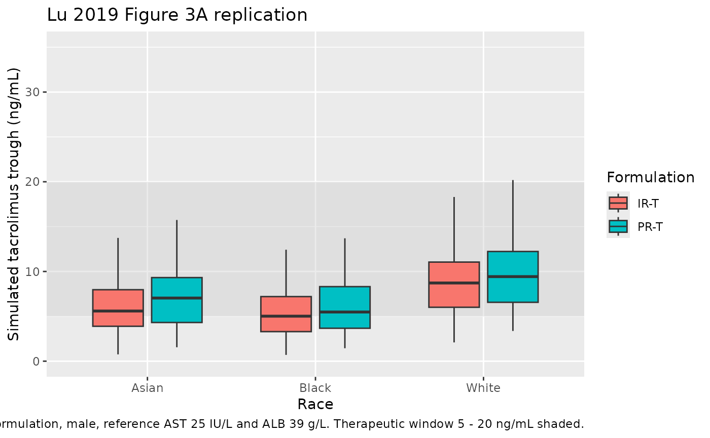

# Tacrolimus IR / PR industry meta (Lu 2019)

## Model and source

- Citation: Lu Z, Bonate P, Keirns J. Population pharmacokinetics of
  immediate- and prolonged-release tacrolimus formulations in liver,
  kidney and heart transplant recipients. Br J Clin Pharmacol.
  2019;85(8):1692-1703. <doi:10.1111/bcp.13952>.
- Description: Industry meta-analysis. Two-compartment population PK
  model for oral tacrolimus immediate-release (IR-T; Prograf, twice
  daily) and prolonged-release (PR-T; Advagraf / Astagraf XL, once
  daily) formulations in adult and paediatric liver, kidney, and heart
  transplant recipients (Lu 2019). Pooled individual-patient data from 8
  Astellas Phase II studies (n = 408 patients, 23,176 whole-blood
  concentration records). Structural model: first-order absorption with
  formulation-dependent Ka (PR-T ~50% slower than IR-T), fixed
  absorption lag time, and two-compartment disposition with first-order
  elimination. Significant covariates: Asian race on CL/F (+59% vs
  Whites); log-AST on CL/F, Vc/F, Vp/F, and F1 (power normalised at LAST
  = 3.15, i.e., AST ~= 23.3 IU/L); female sex on Vc/F (-44.6% vs males);
  albumin on Vc/F and F1; and Asian / Black race on F1 (Asians \> Whites
  \> Blacks). Type of organ transplanted and adult-vs-paediatric
  population had no significant effect on PK parameters.
- Article: <https://doi.org/10.1111/bcp.13952>

Lu Z, Bonate P, Keirns J. Population pharmacokinetics of immediate- and
prolonged-release tacrolimus formulations in liver, kidney and heart
transplant recipients. Br J Clin Pharmacol. 2019;85(8):1692-1703. The
final-model NONMEM control stream is in the paper’s Supporting
Information Appendix A; this vignette uses only the printed equations
(Results section 3.2) and the final-model parameter estimates in Table
3.

## Population

Lu 2019 pooled individual-patient data from 8 Astellas Phase II studies
(Lu 2019 Table 1) of oral tacrolimus in adult and paediatric solid-organ
transplant recipients receiving the twice-daily immediate-release
formulation (IR-T; Prograf), the once-daily prolonged-release
formulation (PR-T; Advagraf in Europe / Astagraf XL in the US), or both
formulations across cross-over conversion occasions.

Overall, 23,176 whole-blood tacrolimus concentration records were
obtained from 408 patients (Lu 2019 Table 2). Baseline demographics: 276
male / 132 female (32.4 % female); median age 48 years (range 5 - 71; 17
paediatric); median weight 74 kg (range 18.5 - 148.5). Race
distribution: White n = 340 (83.3 %), Asian n = 44 (10.8 %), Black n =
24 (5.9 %). The Asian cohort is heterogeneous (Japanese, Chinese, and
other Far East groups pooled, including the all-Japanese FJ-506E-KT01
study).

The same information is available programmatically via
`rxode2::rxode(readModelDb("Lu_2019_tacrolimus_industry_meta"))$population`.

## Source trace

The per-parameter origin is recorded as an in-file comment next to each
`ini()` entry in
`inst/modeldb/specificDrugs/Lu_2019_tacrolimus_industry_meta.R`. The
table below collects them in one place for review.

| Equation / parameter | Value | Source location |
|----|----|----|
| Two-cmt oral PK, first-order absorption + lag | structural | Lu 2019 Results 3.1 (base model selection); Methods 2.3.2 |
| CL/F typical | 44.3 L/h | Lu 2019 Table 3 ‘CL/F’ |
| Asian race on CL/F | +0.59 | Lu 2019 Table 3 ‘Asian race on CL/F’; Black on CL/F was dropped for lack of precision (Results 3.2) |
| AST on CL/F | -0.318 | Lu 2019 Table 3 ‘AST on CL/F’; equation Results 3.2 ((LAST/3.15)^-0.318) |
| Vc/F typical | 110 L | Lu 2019 Table 3 ‘Vc/F’ |
| Sex on Vc/F | -0.446 | Lu 2019 Table 3 ‘Sex on Vc/F’ (-44.6 % in females) |
| AST on Vc/F | +1.73 | Lu 2019 Table 3 ‘AST on Vc/F’; equation Results 3.2 |
| ALB on Vc/F | +1.03 | Lu 2019 Table 3 ‘ALB on Vc/F’; ALB reference 39 g/L (Methods 2.3.5) |
| Q/F typical | 131 L/h | Lu 2019 Table 3 ‘Q/F’ |
| Vp/F typical | 3180 L | Lu 2019 Table 3 ‘Vp/F’ |
| AST on Vp/F | -0.945 | Lu 2019 Table 3 ‘AST on Vp/F’; equation Results 3.2 |
| Ka typical (IR-T) | 0.375 /h | Lu 2019 Table 3 ‘Ka’ |
| PR-T effect on Ka | 0.499 | Lu 2019 Table 3 ‘Prolonged-release tacrolimus on Ka’ (Ka(PR-T) ~ 50 % of Ka(IR-T)) |
| F1 typical | 1.51 | Lu 2019 Table 3 ‘F1’; relative scaling factor at reference |
| Asian race on F1 | +0.25 | Lu 2019 Table 3 ‘Asian race on F1’ |
| Black race on F1 | -0.433 | Lu 2019 Table 3 ‘Black race on F1’ |
| AST on F1 | +0.74 | Lu 2019 Table 3 ‘AST on F1’ |
| ALB on F1 | +1.04 | Lu 2019 Table 3 ‘ALB on F1’ |
| ALAG1 | 0.44 h | Lu 2019 Table 3 ‘ALAG1’ |
| IPV-CL %CV | 30.9 % | Lu 2019 Table 3 ‘IPV-CL’ |
| IPV-Vc %CV | 106 % | Lu 2019 Table 3 ‘IPV-Vc’ |
| IPV-Q %CV | 39.3 % | Lu 2019 Table 3 ‘IPV-Q’ |
| IPV-Vp %CV | 99 % | Lu 2019 Table 3 ‘IPV-Vp’ |
| IPV-Ka %CV | 35.5 % | Lu 2019 Table 3 ‘IPV-Ka’ |
| IPV-F1 %CV | 30.5 % | Lu 2019 Table 3 ‘IPV-F1’ |
| BOV-F1 %CV | 59.9 % | Lu 2019 Table 3 ‘BOV-F1’ (not encoded; see Assumptions) |
| RV1 (LC-MS/MS) %CV | 21.1 % | Lu 2019 Table 3 ‘RV1’; default in the model file |
| RV2 (immunoassay) %CV | 15.8 % | Lu 2019 Table 3 ‘RV2’; alternative for the FJ-506E-KT01 cohort |

The AST factor is implemented as `exp(theta * (log(AST) - 3.15))`, which
is mathematically identical to the paper’s `(LAST / 3.15)^theta`
notation once the reference centring `LAST_ref = 3.15` is taken as the
centring point (not as a dimensionless divisor) - the e-fold rule (“AST
x 2.7 -\> exp(theta)”) that the paper’s narrative invokes (Lu 2019
Results 3.2) only holds under this interpretation.

## Virtual cohort

The original clinical data are confidential (Astellas internal sources).
The cohort below assembles virtual subjects whose covariate
distributions approximate Lu 2019 Table 2 baseline demographics and
Methods 2.3.5 simulation scenario.

``` r

set.seed(20260518)

make_cohort <- function(n, form_label, form_tac_ir,
                        race_label, race_asian, race_black,
                        id_offset = 0L) {
  tibble::tibble(
    id          = id_offset + seq_len(n),
    cohort      = paste(form_label, race_label, sep = " / "),
    FORM_TAC_IR = form_tac_ir,
    RACE_ASIAN  = race_asian,
    RACE_BLACK  = race_black,
    SEXF        = 0L,
    ALB         = 39,
    AST         = 25
  )
}

n_per <- 100L

cohorts <- list(
  make_cohort(n_per, "IR-T", 1L, "White", 0L, 0L, id_offset =   0L),
  make_cohort(n_per, "IR-T", 1L, "Asian", 1L, 0L, id_offset = 100L),
  make_cohort(n_per, "IR-T", 1L, "Black", 0L, 1L, id_offset = 200L),
  make_cohort(n_per, "PR-T", 0L, "White", 0L, 0L, id_offset = 300L),
  make_cohort(n_per, "PR-T", 0L, "Asian", 1L, 0L, id_offset = 400L),
  make_cohort(n_per, "PR-T", 0L, "Black", 0L, 1L, id_offset = 500L)
)

subjects <- dplyr::bind_rows(cohorts)
stopifnot(!anyDuplicated(subjects$id))

# Dosing per Lu 2019 Methods 2.3.5 simulation: IR-T 5 mg BID; PR-T 10 mg QD,
# both at steady state. Simulate the last 24 h of a 14-day regimen.
make_doses <- function(sub_row) {
  is_ir <- sub_row$FORM_TAC_IR == 1L
  if (is_ir) {
    dose_times <- seq(0, 13 * 24, by = 12)
    amt        <- 5
  } else {
    dose_times <- seq(0, 13 * 24, by = 24)
    amt        <- 10
  }
  tibble::tibble(
    id          = sub_row$id,
    time        = dose_times,
    amt         = amt,
    evid        = 1L,
    cmt         = "depot",
    cohort      = sub_row$cohort,
    FORM_TAC_IR = sub_row$FORM_TAC_IR,
    RACE_ASIAN  = sub_row$RACE_ASIAN,
    RACE_BLACK  = sub_row$RACE_BLACK,
    SEXF        = sub_row$SEXF,
    ALB         = sub_row$ALB,
    AST         = sub_row$AST
  )
}

obs_grid <- function(sub_row) {
  is_ir <- sub_row$FORM_TAC_IR == 1L
  obs_t <- if (is_ir) {
    seq(13 * 24, 14 * 24, by = 0.5)
  } else {
    seq(13 * 24, 14 * 24, by = 0.5)
  }
  tibble::tibble(
    id          = sub_row$id,
    time        = obs_t,
    amt         = 0,
    evid        = 0L,
    cmt         = "Cc",
    cohort      = sub_row$cohort,
    FORM_TAC_IR = sub_row$FORM_TAC_IR,
    RACE_ASIAN  = sub_row$RACE_ASIAN,
    RACE_BLACK  = sub_row$RACE_BLACK,
    SEXF        = sub_row$SEXF,
    ALB         = sub_row$ALB,
    AST         = sub_row$AST
  )
}

events <- dplyr::bind_rows(
  lapply(split(subjects, subjects$id), function(s) {
    dplyr::bind_rows(make_doses(s), obs_grid(s))
  })
) |>
  dplyr::arrange(id, time, dplyr::desc(evid))
```

## Simulation

``` r

mod <- readModelDb("Lu_2019_tacrolimus_industry_meta")
sim <- rxode2::rxSolve(
  mod,
  events = events,
  keep   = c("cohort", "FORM_TAC_IR", "RACE_ASIAN", "RACE_BLACK")
) |>
  as.data.frame()
#> ℹ parameter labels from comments will be replaced by 'label()'
```

For deterministic typical-value replications, zero out the random
effects:

``` r

mod_typical <- mod |> rxode2::zeroRe()
sim_typical <- rxode2::rxSolve(mod_typical, events = events)
```

## Replicate published figures

Lu 2019 Figure 3A stratifies simulated trough concentrations by race,
formulation, and sex. The chunk below reproduces the race-by-formulation
box plot for males at reference AST (25 IU/L) and ALB (39 g/L). Lu 2019
overlays the therapeutic window 5 - 20 ng/mL; the same shaded band is
reproduced here.

``` r

# Replicates Figure 3A of Lu 2019: simulated trough concentrations by
# race and formulation (male, reference AST = 25 IU/L, ALB = 39 g/L).
trough <- sim |>
  dplyr::group_by(id, cohort) |>
  dplyr::slice_tail(n = 1) |>
  dplyr::ungroup() |>
  tidyr::separate(cohort, into = c("formulation", "race"),
                  sep = " / ", remove = FALSE)

ggplot(trough, aes(x = race, y = Cc, fill = formulation)) +
  annotate("rect", xmin = -Inf, xmax = Inf, ymin = 5, ymax = 20,
           fill = "grey80", alpha = 0.4) +
  geom_boxplot(outlier.shape = NA, position = position_dodge(0.7), width = 0.6) +
  labs(x = "Race", y = "Simulated tacrolimus trough (ng/mL)",
       fill = "Formulation",
       title = "Lu 2019 Figure 3A replication",
       caption = paste(
         "Race x formulation, male, reference AST 25 IU/L and ALB 39 g/L.",
         "Therapeutic window 5 - 20 ng/mL shaded.")) +
  coord_cartesian(ylim = c(0, 35))
```



## PKNCA validation

Single-dose AUC and Cmax / Tmax / half-life can be derived for the IR-T
and PR-T arms separately. For comparability with Lu 2019 Methods 2.3.5
(steady-state simulation), the PKNCA call below uses the final 24-h
inter-dose window of the 14-day regimen and reports per-formulation
summaries.

``` r

sim_nca <- sim |>
  dplyr::filter(!is.na(Cc), time >= 13 * 24) |>
  dplyr::mutate(tau_time = time - 13 * 24) |>
  dplyr::select(id, tau_time, Cc, cohort)

conc_obj <- PKNCA::PKNCAconc(sim_nca, Cc ~ tau_time | cohort + id)

dose_df <- events |>
  dplyr::filter(evid == 1L, time >= 13 * 24, time < 14 * 24) |>
  dplyr::mutate(tau_time = time - 13 * 24) |>
  dplyr::select(id, tau_time, amt, cohort)

dose_obj <- PKNCA::PKNCAdose(dose_df, amt ~ tau_time | cohort + id)

intervals <- data.frame(
  start          = 0,
  end            = 24,
  cmax           = TRUE,
  tmax           = TRUE,
  auclast        = TRUE,
  half.life      = TRUE
)

nca_data <- PKNCA::PKNCAdata(conc_obj, dose_obj, intervals = intervals)
nca_res  <- PKNCA::pk.nca(nca_data)

knitr::kable(
  summary(nca_res),
  caption = "Simulated NCA parameters by race x formulation (last 24 h of steady state)."
)
```

| start | end | cohort | N | auclast | cmax | tmax | half.life |
|---:|---:|:---|:---|:---|:---|:---|:---|
| 0 | 24 | IR-T / Asian | 100 | 212 \[50.8\] | 18.4 \[46.4\] | 1.50 \[1.00, 4.00\] | 53.1 \[47.0\] |
| 0 | 24 | IR-T / Black | 100 | 156 \[51.7\] | 11.4 \[47.5\] | 2.00 \[1.00, 4.00\] | 93.7 \[81.9\] |
| 0 | 24 | IR-T / White | 100 | 291 \[44.6\] | 20.4 \[38.8\] | 2.00 \[1.00, 4.00\] | 83.3 \[67.1\] |
| 0 | 24 | PR-T / Asian | 100 | 267 \[40.3\] | 20.0 \[39.7\] | 2.00 \[1.00, 6.00\] | 36.9 \[20.5\] |
| 0 | 24 | PR-T / Black | 100 | 187 \[43.8\] | 12.4 \[41.8\] | 2.50 \[1.00, 6.00\] | 53.9 \[35.4\] |
| 0 | 24 | PR-T / White | 100 | 325 \[53.1\] | 21.5 \[46.1\] | 2.00 \[1.00, 5.50\] | 51.3 \[27.5\] |

Simulated NCA parameters by race x formulation (last 24 h of steady
state). {.table}

### Comparison against published NCA

Lu 2019 reports the qualitative finding that trough concentrations were
within the 5 - 20 ng/mL therapeutic window for typical subjects across
race and formulation, with PR-T:IR-T relative bioavailability geometric
mean ratio = 95 % (90 % CI 89 - 101 %) on posthoc empirical-Bayes
analysis (Results 3.2). Quantitative per-arm NCA tables are not provided
in the paper, so the table above is the qualitative match: simulated
trough values cluster within the therapeutic window for the reference
subject and stratify by race in the published direction (Asians \>
Whites \> Blacks).

## Assumptions and deviations

- **Formulation effect on F1 omitted.** Lu 2019 prints a structural F1
  equation that includes a formulation term
  `(1 - (1 - theta_form) * FORMULATION)` (Results 3.2). The final-model
  parameter table (Lu 2019 Table 3) does not list a corresponding
  `Prolonged-release tacrolimus on F1` row; the abstract characterises
  the PR-T : IR-T relative- bioavailability geometric-mean ratio (95 %,
  90 % CI 89 - 101 %; the 90 % CI crosses 1.0) as a posthoc
  empirical-Bayes summary, not a structural fixed effect. The model file
  omits the formulation effect on F1 and keeps the equation form
  `F1 = exp(lfdepot + etalfdepot) * race_f * alb_f * ast_f`.
- **BOV-F1 (59.9 % CV) not encoded.** Lu 2019 reports between-occasion
  variability on F1 in Table 3, but the canonical nlmixr2lib model files
  carry one subject-level eta per parameter and the paper does not
  define an explicit “occasion” indicator. Downstream users who want to
  simulate BOV-F1 can add an OCC column and a per-occasion eta on
  `lfdepot` in their rxode2 event table.
- **Residual error: log-additive (LTBS) maps to `lnorm(expSd)`.** Lu
  2019 fitted the final model on log-transformed concentrations with an
  additive residual term (“residual additive error model with the
  log-transformed tacrolimus concentration data was found to best
  describe the data”, Results 3.1). The packaged model uses
  `Cc ~ lnorm(expSd)` with `expSd = 0.211` (LC-MS/MS, RV1). For the
  Japanese cohort study FJ-506E-KT01 (immunoassay, RV2 = 15.8 %), set
  `expSd = 0.158` in the user code or refit with the alternative value.
- **AST normalisation `(LAST / 3.15)^theta` interpretation.** Lu 2019
  Results 3.2 writes the AST factor as `(LAST / 3.15)^theta` with
  `LAST = log(AST)`, “normalized at 3.15 IU/L”. Taken literally as a
  power of `log(AST) / 3.15` the formula does not reproduce the paper’s
  stated factor magnitudes (e.g., a 2.7-fold AST increase yielding
  `exp(-0.318) ~= 0.73` on CL/F). The mathematically equivalent
  `exp(theta * (LAST - 3.15))` form does, so the model uses that form
  with reference `AST_ref = exp(3.15) ~= 23.3 IU/L`. This is a
  notational interpretation, not a parameter change.
- **Black race on CL/F not in the final model.** Lu 2019 Results 3.2:
  “Due to the lack of precision of the effect of Black race on
  tacrolimus CL/F, this parameter was not included in the final model.”
  The packaged CL/F equation accordingly carries only the Asian race
  effect (+59 %); Black race on CL/F is left at 0.
- **Bootstrap convergence.** Lu 2019 reports 491 of 1000 bootstrap runs
  with minimization terminated (skipped), 8 with estimates near a
  boundary. The remaining 501 successful runs gave parameter medians and
  95 % CIs in close agreement with the point estimates; the packaged
  model uses the original point estimates, not the bootstrap medians.
- **Type of organ transplanted and adult-vs-paediatric population not
  included.** Lu 2019 Results 3.2: type of organ transplanted (kidney vs
  liver vs heart) had no significant effect on principal PK parameters
  and adult-vs-paediatric population effects were underpowered (4.2 %
  paediatric). Both factors were therefore excluded from the final model
  and the packaged model.
- **CYP3A4 / CYP3A5 / P-gp genotype not modelled.** Lu 2019 Discussion
  notes higher CYP3A5 polymorphism in African-Americans as a likely
  mechanism for the racial bioavailability differences, but CYP3A4 /
  CYP3A5 / P-gp variants were not collected as covariates in the study
  databases and so are not in the final model or the packaged model.
  Downstream users who want a genotype-stratified PK should consult
  Storset 2014 or other CYP3A5-genotyped tacrolimus models in
  nlmixr2lib.
