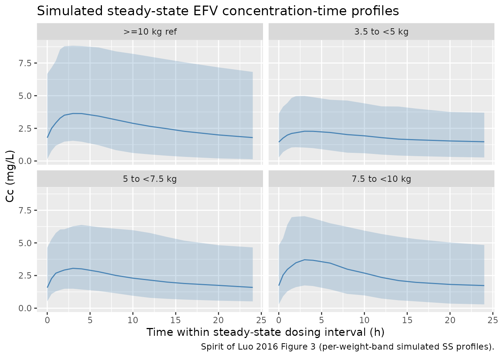

# Efavirenz (Luo 2016)

## Model and source

- Citation: Luo M, Chapel S, Sevinsky H, Savant I, Cirincione B, Bertz
  R, Roy A. Population pharmacokinetics analysis to inform efavirenz
  dosing recommendations in pediatric HIV patients aged 3 months to 3
  years. Antimicrob Agents Chemother. 2016;60(6):3676-3686.
  <doi:10.1128/AAC.02678-15>.
- Description: Two-compartment population PK model with first-order
  absorption and elimination for oral efavirenz in pediatric
  HIV-1-infected patients (Luo 2016). Capsule / capsule-sprinkle
  formulation; body weight is a power covariate on CL/F, Vc/F, and Ka
  with reference 20 kg. The adult cohort (n = 24 healthy adults) and
  oral-solution formulation (study-specific Frel) reported in the same
  paper are documented in the validation vignette but not encoded as
  separate sub-models.
- Article: <https://doi.org/10.1128/AAC.02678-15>

Luo et al. (2016) developed a population pharmacokinetic (popPK) model
for efavirenz (EFV) using data from three pediatric HIV-1-infected
cohorts (PACTG382, PACTG1021, and AI266922; n = 168) pooled with a
healthy-adult relative-bioavailability study (AI266059; n = 24). The
packaged model in nlmixr2lib focuses on the pediatric structural model
that informed the weight-based dosing recommendations approved for
children weighing 3.5 to \< 10 kg.

## Population

The Luo 2016 updated analysis dataset comprised 4,521 plasma efavirenz
concentrations from 192 subjects: 3,289 concentrations (largely sparse
sampling) from 168 pediatric patients aged 3 months to 21 years (weight
3.3 to 117 kg), and 1,232 concentrations (intensive sampling) from 24
healthy adults aged 20 to 45 years (weight 59.6 to 98.1 kg). Pediatric
race distribution per Luo 2016 Table 2: 33.3% White, 52.4%
Black/African- American, 14.3% Other; sex 52.4% female. All PK samples
were collected after efavirenz had reached steady state (\>= 2 weeks of
daily dosing), so autoinduction is treated as fully expressed.

The same information is available programmatically:

``` r

str(rxode2::rxode(readModelDb("Luo_2016_efavirenz"))$population)
#> ℹ parameter labels from comments will be replaced by 'label()'
#> List of 13
#>  $ species       : chr "human"
#>  $ n_subjects    : int 168
#>  $ n_studies     : int 3
#>  $ age_range     : chr "0.2-24.7 years (pediatric studies; updated data set)"
#>  $ age_median    : chr "6.73 years (pediatric)"
#>  $ weight_range  : chr "3.3-117 kg"
#>  $ weight_median : chr "25.3 kg (pediatric)"
#>  $ sex_female_pct: num 52.4
#>  $ race_ethnicity: Named num [1:4] 33.3 52.4 14.3 0
#>   ..- attr(*, "names")= chr [1:4] "White" "Black_AA" "Other" "Asian"
#>  $ disease_state : chr "HIV-1 infection on combination antiretroviral therapy. Pediatric patients 3 months to 21 years of age. Patients"| __truncated__
#>  $ dose_range    : chr "Pediatric efavirenz doses ranging from 100 mg QD (children >= 3.5 to < 5 kg) up to a maximum of 1000 mg QD per "| __truncated__
#>  $ regions       : chr "Multi-center pediatric AIDS clinical trials (PACTG382 and PACTG1021 Phase I/II open-label; AI266922 Phase II open-label)."
#>  $ notes         : chr "Updated data set (Luo 2016 Methods 'Study data' paragraph 2): 4521 plasma efavirenz concentrations from 192 sub"| __truncated__
```

## Source trace

Every `ini()` parameter in
`inst/modeldb/specificDrugs/Luo_2016_efavirenz.R` carries a trailing
comment pointing at the source location. The table below collects them
in one place for review.

| Equation / parameter | Value | Source location |
|----|----|----|
| Structural model: 2-cmt with first-order absorption + elimination | n/a | Luo 2016 Results ‘Base-model development’ paragraph 1 |
| Reference pediatric subject: WT = 20 kg, age 6 y, non-AA / not Other, PART = 0, PINT = 0 | n/a | Luo 2016 Table 3 footnote a |
| `lcl = log(4.8)` | 4.8 L/h | Luo 2016 Table 3 final ‘CL_ref,ped’ |
| `lvc = log(84.9)` | 84.9 L | Luo 2016 Table 3 final ‘V_C ref,ped’ |
| `lvp = log(287)` | 287 L | Luo 2016 Table 3 final ‘V_P ref’ (shared between cohorts) |
| `lq = log(6.01)` | 6.01 L/h | Luo 2016 Table 3 final ‘Q_ref’ (shared between cohorts) |
| `lka = log(0.414)` | 0.414 1/h | Luo 2016 Table 3 final ‘K_a ref’ |
| `e_wt_cl = 0.57` | unitless | Luo 2016 Table 3 final ‘CL_ped,WT’ |
| `e_wt_vc = 1.35` | unitless | Luo 2016 Table 3 final ‘V_C ped,WT’ |
| `e_wt_ka = 0.768` | unitless | Luo 2016 Table 3 final ‘K_a ped,WT’ |
| Covariate functional form `P_TV = P1 * (R / R_ref)^P2` | n/a | Luo 2016 Methods ‘Development of the full model’ |
| IIV `etalcl ~ 0.602` | log-scale variance | Luo 2016 Table 3 final ‘IIV_CL ped’ |
| IIV `etalvc ~ 0.234` | log-scale variance | Luo 2016 Table 3 final ‘IIV_V_C, ped’ |
| IIV `etalq ~ 0.695` | log-scale variance | Luo 2016 Table 3 final ‘IIV_Q’ |
| IIV `etalvp ~ 0.296` | log-scale variance | Luo 2016 Table 3 final ‘IIV_V_P’ |
| IIV `etalka ~ 0.202` | log-scale variance | Luo 2016 Table 3 final ‘IIV_K_a’ |
| Residual `Cc ~ lnorm(sqrt(0.461))` | log-scale variance 0.461 | Luo 2016 Table 3 final ‘Capsule, pediatric studies’; Luo 2016 Methods ‘Base model development’ paragraph 2 for the log-normal residual form |

## Virtual cohort

Original observed data are not publicly available. The simulations below
use virtual pediatric populations whose weight distributions span the
weight bands relevant for the Luo 2016 dosing recommendations (3.5 to \<
10 kg) plus a 20-kg reference subject for an at-the-reference weight
check.

``` r

set.seed(20251102)

# Recommended Luo 2016 dose regimens (Discussion / Conclusion paragraph 2):
#   3.5 to <  5  kg: 100 mg QD
#   5   to <  7.5 kg: 150 mg QD
#   7.5 to < 10  kg: 200 mg QD
#   >= 10 kg (existing approved): weight-band-titrated; 20 kg corresponds
#                                 to the >= 15 to < 25 kg adult-equivalent
#                                 band (300 mg QD per the existing pediatric
#                                 dosing table referenced in Luo 2016).
dose_table <- tibble::tribble(
  ~weight_band,     ~wt_kg, ~dose_mg,
  "3.5 to <5 kg",     4.25,    100,
  "5 to <7.5 kg",     6.25,    150,
  "7.5 to <10 kg",    8.75,    200,
  ">=10 kg ref",     20.0,    300
)

tau          <- 24      # QD dosing
n_per_band   <- 100L    # subjects per weight band
n_days_total <- 21      # 3 weeks of QD dosing -> steady state at day 14+ for EFV
end_time     <- n_days_total * tau

# Observation grid covering the final dosing interval at steady state
ss_start <- (n_days_total - 1) * tau          # 480 h
ss_end   <- ss_start + tau                    # 504 h
obs_grid_ss <- ss_start +
  c(0, 0.5, 1, 1.5, 2, 3, 4, 6, 8, 10, 12, 14, 16, 20, 24)

make_cohort <- function(weight_band, wt_kg, dose_mg, n, id_offset) {
  id_vec <- id_offset + seq_len(n)
  # Doses every 24 h up to the day before steady-state observation
  dose_times <- seq(0, ss_start, by = tau)
  doses <- tidyr::expand_grid(id = id_vec, time = dose_times) |>
    dplyr::mutate(
      evid = 1L,
      amt  = dose_mg,
      cmt  = "depot",
      WT   = wt_kg,
      weight_band = weight_band,
      dose_mg     = dose_mg
    )
  obs <- tidyr::expand_grid(id = id_vec, time = obs_grid_ss) |>
    dplyr::mutate(
      evid = 0L,
      amt  = NA_real_,
      cmt  = NA_character_,
      WT   = wt_kg,
      weight_band = weight_band,
      dose_mg     = dose_mg
    )
  dplyr::bind_rows(doses, obs) |>
    dplyr::arrange(id, time, dplyr::desc(evid))
}

events <- dplyr::bind_rows(
  make_cohort("3.5 to <5 kg",  4.25, 100, n_per_band, id_offset =   0L),
  make_cohort("5 to <7.5 kg",  6.25, 150, n_per_band, id_offset = 100L),
  make_cohort("7.5 to <10 kg", 8.75, 200, n_per_band, id_offset = 200L),
  make_cohort(">=10 kg ref",  20.0, 300, n_per_band, id_offset = 300L)
)

stopifnot(!anyDuplicated(unique(events[, c("id", "time", "evid")])))
```

## Simulation

``` r

mod <- readModelDb("Luo_2016_efavirenz")
sim <- rxode2::rxSolve(
  mod,
  events = events,
  keep   = c("weight_band", "dose_mg")
) |>
  as.data.frame()
#> ℹ parameter labels from comments will be replaced by 'label()'
```

For deterministic typical-value replication (no IIV, no residual), zero
out the random effects:

``` r

mod_typical <- mod |> rxode2::zeroRe()
#> ℹ parameter labels from comments will be replaced by 'label()'
sim_typical <- rxode2::rxSolve(
  mod_typical,
  events = events,
  keep   = c("weight_band", "dose_mg")
) |>
  as.data.frame()
#> ℹ omega/sigma items treated as zero: 'etalcl', 'etalvc', 'etalq', 'etalvp', 'etalka'
#> Warning: multi-subject simulation without without 'omega'
```

## Replicate published figure

The figure below replicates the qualitative spirit of Luo 2016 Figure 3
(simulated steady-state EFV exposure by weight band at the recommended
QD doses). The horizontal reference band shows the adult AUCss target
range used by Luo 2016 to anchor the pediatric dose selection (190 to
380 micromolar\*hour; converted to mass concentration below).

``` r

efv_mw <- 315.7  # g/mol; efavirenz molecular weight (PubChem CID 64139)

# Convert AUC target from uM*h to mg*h/L (= ug*h/mL): uM * MW / 1000
auc_target_low  <- 190 * efv_mw / 1000  # ~60 mg*h/L
auc_target_high <- 380 * efv_mw / 1000  # ~120 mg*h/L

sim |>
  dplyr::filter(time >= ss_start) |>
  dplyr::mutate(time_in_interval = time - ss_start) |>
  dplyr::group_by(time_in_interval, weight_band) |>
  dplyr::summarise(
    Q05 = quantile(Cc, 0.05, na.rm = TRUE),
    Q50 = quantile(Cc, 0.50, na.rm = TRUE),
    Q95 = quantile(Cc, 0.95, na.rm = TRUE),
    .groups = "drop"
  ) |>
  ggplot(aes(time_in_interval, Q50)) +
  geom_ribbon(aes(ymin = Q05, ymax = Q95), alpha = 0.25, fill = "steelblue") +
  geom_line(color = "steelblue") +
  facet_wrap(~weight_band) +
  labs(
    x = "Time within steady-state dosing interval (h)",
    y = "Cc (mg/L)",
    title = "Simulated steady-state EFV concentration-time profiles",
    caption = "Spirit of Luo 2016 Figure 3 (per-weight-band simulated SS profiles)."
  )
```



## PKNCA validation

We compute steady-state NCA over the final dosing interval and compare
the simulated mean / median AUCss, Cmax, and Cmin by weight band against
the adult target range (Luo 2016 Methods ‘Model-based simulation’) and
against the 10 to \< 15 kg reference Cmax / Cmin ranges (Luo 2016
Methods, final paragraph).

``` r

sim_nca <- sim |>
  dplyr::filter(!is.na(Cc)) |>
  dplyr::select(id, time, Cc, weight_band, dose_mg) |>
  as.data.frame()

dose_df <- events |>
  dplyr::filter(evid == 1) |>
  dplyr::group_by(id, weight_band, dose_mg) |>
  dplyr::summarise(time = max(time), amt = dplyr::last(amt), .groups = "drop") |>
  as.data.frame()

conc_obj <- PKNCA::PKNCAconc(
  sim_nca,
  Cc ~ time | weight_band + id,
  concu = "mg/L",
  timeu = "h"
)
dose_obj <- PKNCA::PKNCAdose(
  dose_df,
  amt ~ time | weight_band + id,
  doseu = "mg"
)

intervals <- data.frame(
  start    = ss_start,
  end      = ss_end,
  cmax     = TRUE,
  tmax     = TRUE,
  cmin     = TRUE,
  auclast  = TRUE,
  cav      = TRUE
)

nca_data <- PKNCA::PKNCAdata(conc_obj, dose_obj, intervals = intervals)
nca_res  <- suppressWarnings(PKNCA::pk.nca(nca_data))

nca_tbl <- as.data.frame(nca_res$result) |>
  dplyr::filter(PPTESTCD %in% c("auclast", "cmax", "cmin", "cav")) |>
  dplyr::group_by(weight_band, PPTESTCD) |>
  dplyr::summarise(
    median = signif(median(PPORRES, na.rm = TRUE), 3),
    q05    = signif(quantile(PPORRES, 0.05, na.rm = TRUE), 3),
    q95    = signif(quantile(PPORRES, 0.95, na.rm = TRUE), 3),
    .groups = "drop"
  ) |>
  tidyr::pivot_wider(
    names_from  = PPTESTCD,
    values_from = c(median, q05, q95),
    names_glue  = "{PPTESTCD}_{.value}"
  )

knitr::kable(nca_tbl, caption = "Simulated steady-state NCA by weight band (final 24 h interval).")
```

| weight_band | auclast_median | cav_median | cmax_median | cmin_median | auclast_q05 | cav_q05 | cmax_q05 | cmin_q05 | auclast_q95 | cav_q95 | cmax_q95 | cmin_q95 |
|:---|---:|---:|---:|---:|---:|---:|---:|---:|---:|---:|---:|---:|
| 3.5 to \<5 kg | 44.1 | 1.84 | 2.42 | 1.45 | 14.1 | 0.588 | 1.14 | 0.271 | 99.7 | 4.16 | 5.01 | 3.62 |
| 5 to \<7.5 kg | 52.1 | 2.17 | 3.09 | 1.57 | 23.8 | 0.993 | 1.49 | 0.521 | 132.0 | 5.52 | 6.38 | 4.64 |
| 7.5 to \<10 kg | 58.3 | 2.43 | 3.79 | 1.73 | 20.4 | 0.848 | 1.74 | 0.288 | 136.0 | 5.68 | 7.05 | 4.81 |
| \>=10 kg ref | 63.8 | 2.66 | 3.66 | 1.78 | 17.8 | 0.744 | 1.57 | 0.135 | 186.0 | 7.77 | 8.98 | 6.67 |

Simulated steady-state NCA by weight band (final 24 h interval).
{.table}

### Comparison against published targets

``` r

auc_summary <- as.data.frame(nca_res$result) |>
  dplyr::filter(PPTESTCD == "auclast") |>
  dplyr::group_by(weight_band) |>
  dplyr::summarise(
    auc_median_mg_h_L = signif(median(PPORRES, na.rm = TRUE), 3),
    auc_median_uM_h   = signif(median(PPORRES, na.rm = TRUE) / efv_mw * 1000, 3),
    .groups = "drop"
  )

published_targets <- tibble::tibble(
  reference = c(
    "Adult AUCss target lower (median, 600 mg QD)",
    "Adult AUCss target upper (2 x median)",
    "Reference Cmax (10 to <15 kg) lower bound",
    "Reference Cmax (10 to <15 kg) upper bound",
    "Reference Cmin (10 to <15 kg) lower bound",
    "Reference Cmin (10 to <15 kg) upper bound"
  ),
  value     = c(190, 380, 5.2, 8.2, 1.9, 2.9),
  units     = c("uM*h", "uM*h", "mg/L", "mg/L", "mg/L", "mg/L")
)

knitr::kable(auc_summary,
             caption = "Simulated median AUCss by weight band, in mg*h/L and uM*h.")
```

| weight_band    | auc_median_mg_h_L | auc_median_uM_h |
|:---------------|------------------:|----------------:|
| 3.5 to \<5 kg  |              44.1 |             140 |
| 5 to \<7.5 kg  |              52.1 |             165 |
| 7.5 to \<10 kg |              58.3 |             185 |
| \>=10 kg ref   |              63.8 |             202 |

Simulated median AUCss by weight band, in mg*h/L and uM*h. {.table}

``` r


knitr::kable(published_targets,
             caption = "Luo 2016 reference target ranges.")
```

| reference                                    | value | units |
|:---------------------------------------------|------:|:------|
| Adult AUCss target lower (median, 600 mg QD) | 190.0 | uM\*h |
| Adult AUCss target upper (2 x median)        | 380.0 | uM\*h |
| Reference Cmax (10 to \<15 kg) lower bound   |   5.2 | mg/L  |
| Reference Cmax (10 to \<15 kg) upper bound   |   8.2 | mg/L  |
| Reference Cmin (10 to \<15 kg) lower bound   |   1.9 | mg/L  |
| Reference Cmin (10 to \<15 kg) upper bound   |   2.9 | mg/L  |

Luo 2016 reference target ranges. {.table}

## Assumptions and deviations

- **Pediatric scope.** The packaged model encodes only the pediatric arm
  of the Luo 2016 joint adult + pediatric analysis. Luo 2016 estimated
  separate reference values for adult subjects
  (`CL_ref,adult = 3.66 L/h`, `Vc_ref,adult = 188 L`,
  `T_lag,adult = 0.633 h`) with their own IIVs (CL variance 0.158, Vc
  variance 0.132) and their own residual error (variance 0.212). `Q` and
  `Vp` are shared across cohorts and are encoded with their joint point
  estimates. Adults can be approximated by this packaged model using
  `WT = 80 kg` only with substantial bias because the model does not
  apply the adult-specific reference shift; users who need the adult arm
  should re-fit with cohort-specific reference values.
- **Formulation scope.** The model assumes capsule or capsule-sprinkle
  formulation (`F = 1`). Luo 2016 Table 3 reports study-specific oral
  solution `Frel` adjustments (PACTG382: -0.346 -\> 0.654; PACTG1021:
  -0.0509 -\> 0.949; AI266922: -0.754 -\> 0.246). These adjustments fit
  historical pediatric solution-formulation data and are not encoded
  here. The capsule-sprinkle formulation was shown bioequivalent to
  capsules in adults (Luo 2016 Methods, study AI266059).
- **PART covariate not encoded.** Luo 2016 Table 3 final model retained
  a prior-antiretroviral-therapy effect on pediatric CL with point
  estimate 0.381 +/- 0.401 (SE \> estimate; 90% CI crosses 0). The Luo
  2016 Discussion explicitly notes “caution should be exercised in
  interpreting this effect as prior antiretroviral therapy is likely
  confounded with the effect of study PACTG1021 on CL. Therefore, it
  could be a study effect instead of the effect of prior antiretroviral
  therapy.” The pediatric dosing-recommendation simulations in Luo 2016
  Figure 3 use the typical pediatric model with PART = 0, so omitting
  this covariate from the packaged structural model does not affect the
  headline dosing recommendations.
- **CYP2B6 pharmacogenomic analyses not encoded.** Luo 2016 Tables 5
  (CYP2B6 covariate on CL) and 6 (mixture model with two metabolizer
  subgroups) are exploratory ad hoc analyses. The paper concluded the
  identification of CYP2B6 genetic status is not predictive of EFV
  exposure for guiding pediatric dosing. A separate Olagunju 2018
  efavirenz model in nlmixr2lib (`Olagunju_2018_efavirenz`) encodes a
  composite CYP2B6 metabolizer-status covariate on EFV CL/F.
- **Residual error form.** Luo 2016 Methods ‘Development of the base
  model’ explicitly specifies a log-normal residual distribution
  (`Y_obs = Y_pred * exp(eps), eps ~ N(0, sigma^2)`). This is encoded as
  `Cc ~ lnorm(expSd)` with `expSd = sqrt(0.461) = 0.679` for the
  pediatric capsule / capsule-sprinkle subset. The pediatric oral
  solution residual (variance 0.784 -\> expSd = 0.885) and the adult
  residual (variance 0.212 -\> expSd = 0.460) are documented here for
  completeness but not encoded.
- **Reference subject demographics.** Per Luo 2016 Table 3 footnote a,
  the reference pediatric subject is male, weight 20 kg, age 6 y, race
  non-African-American and not Other, no prior antiretroviral therapy,
  no concomitant protease inhibitor. The packaged model encodes the
  weight reference 20 kg; the other reference demographics no longer
  matter once age / sex / race / PINT / PART are dropped from the final
  model.
- **Bioavailability anchor.** No explicit `f(depot)` is set in `model()`
  because for the capsule / capsule-sprinkle scope `F = 1` (rxode2
  default). All CL, Vc, Vp, Q in this model are apparent oral parameters
  (`CL/F`, `Vc/F`, etc.) per the source paper’s convention for oral
  dosing.

## References

- Luo M, Chapel S, Sevinsky H, Savant I, Cirincione B, Bertz R, Roy A.
  Population pharmacokinetics analysis to inform efavirenz dosing
  recommendations in pediatric HIV patients aged 3 months to 3 years.
  *Antimicrobial Agents and Chemotherapy*. 2016;60(6):3676-3686.
  <doi:%5B10.1128/AAC.02678-15>\](<https://doi.org/10.1128/AAC.02678-15>).
