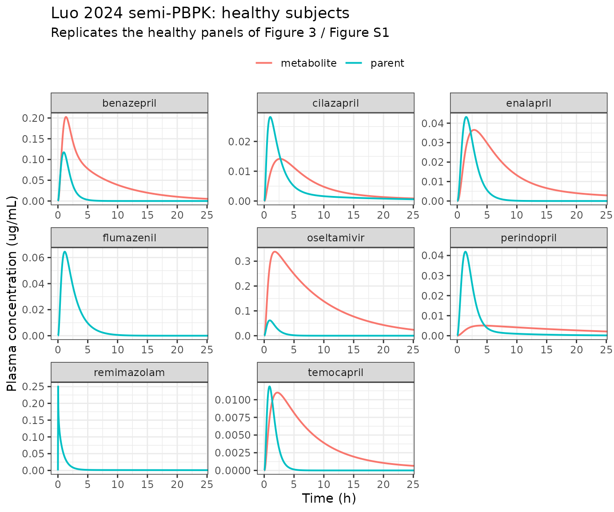
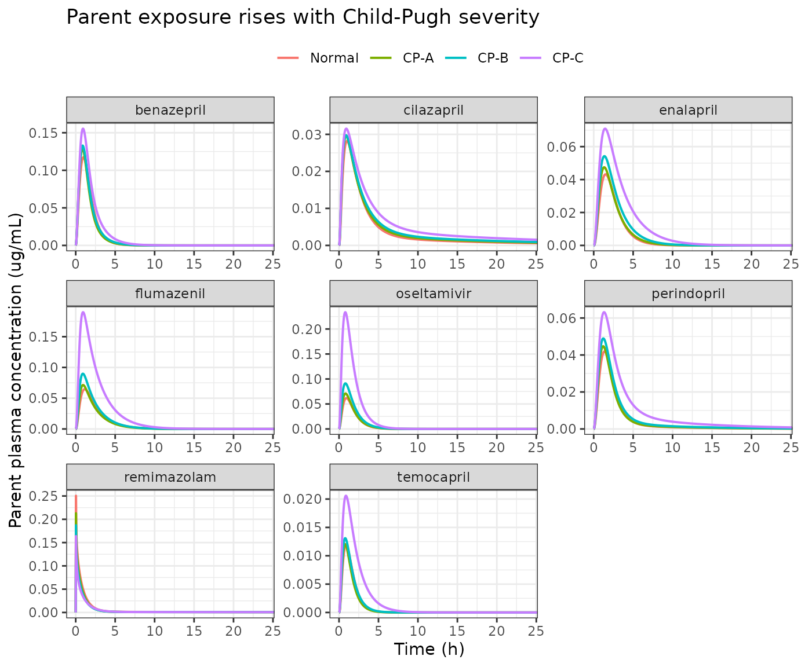
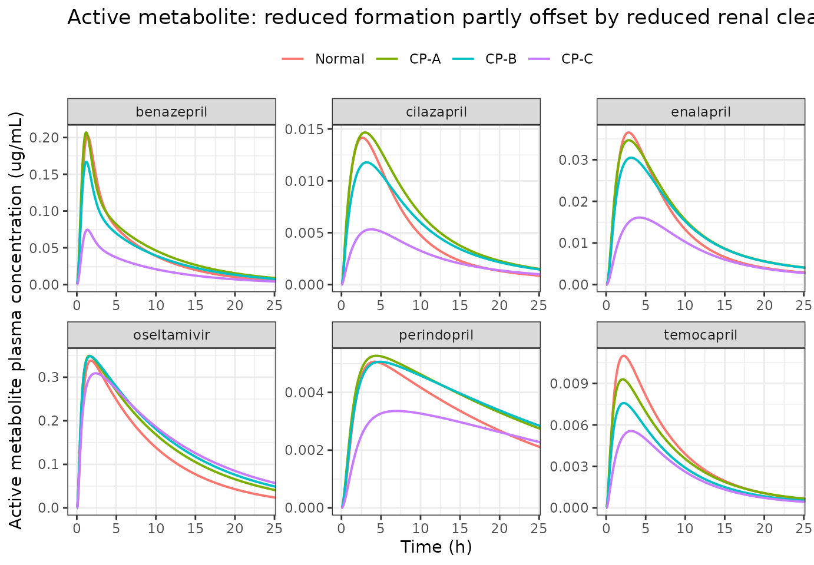
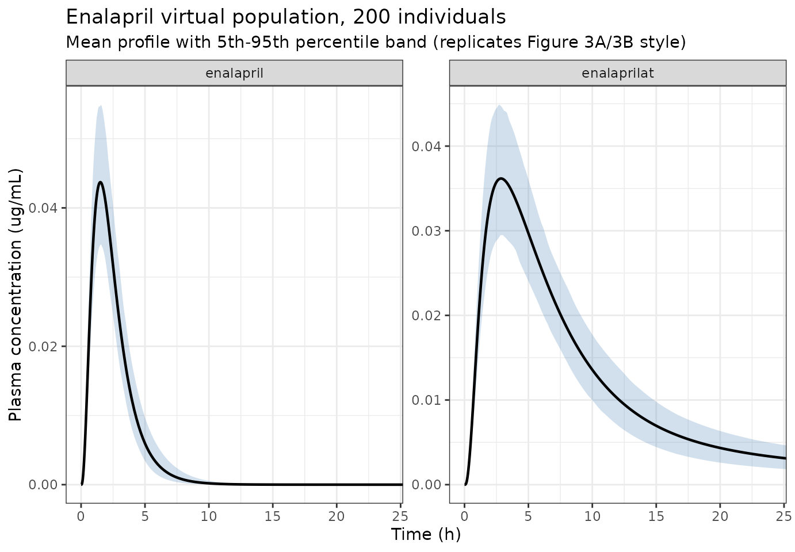

# CES1 substrates and their active metabolites in liver cirrhosis (Luo 2024)

## Model and source

- Citation: Luo X, Zhang Z, Mu R, Hu G, Liu L, Liu X (2024).
  Simultaneously Predicting the Pharmacokinetics of CES1-Metabolized
  Drugs and Their Metabolites Using Physiologically Based
  Pharmacokinetic Model in Cirrhosis Subjects. Pharmaceutics 16(2):234.
  <doi:10.3390/pharmaceutics16020234>. ODE system from Supplementary
  Material Eq S1-S20; drug parameters from Table 2; system physiology
  and Child-Pugh scaling from Table 1 and Eq 1-6; validation targets
  from Table 4.
- Article: <https://doi.org/10.3390/pharmaceutics16020234>

Luo et al. built one semi-physiologically-based (semi-PBPK) framework
and applied it to nine hepatic carboxylesterase 1 (CES1) substrates in
healthy adults and in liver cirrhosis (LC) patients graded by the
Child-Pugh (CP) score. Six of the nine are ester **prodrugs** that CES1
hydrolyses to a pharmacologically **active** metabolite; three are
**direct-acting** drugs that CES1 **inactivates**.

Because the authors parameterised each drug separately (its own Table 2
inputs, its own systemic compartment count, its own presence or absence
of an active metabolite), this paper contributes **one model file per
drug**, all sharing the same framework and all pointing at this single
vignette:

``` r

luo_models <- c(
  "Luo_2024_enalapril_pbpk", "Luo_2024_benazepril_pbpk",
  "Luo_2024_cilazapril_pbpk", "Luo_2024_perindopril_pbpk",
  "Luo_2024_temocapril_pbpk", "Luo_2024_oseltamivir_pbpk",
  "Luo_2024_flumazenil_pbpk", "Luo_2024_remimazolam_pbpk"
)
vapply(luo_models, function(m) length(readModelDb(m)()$compartmentData), integer(1))
#>   Luo_2024_enalapril_pbpk  Luo_2024_benazepril_pbpk  Luo_2024_cilazapril_pbpk 
#>                        19                        20                        20 
#> Luo_2024_perindopril_pbpk  Luo_2024_temocapril_pbpk Luo_2024_oseltamivir_pbpk 
#>                        20                        19                        18 
#>  Luo_2024_flumazenil_pbpk Luo_2024_remimazolam_pbpk 
#>                        12                         9
```

**Pethidine, the ninth drug of the paper, is deliberately absent** - see
*Assumptions and deviations* for the reason (an unreported hepatic
protein scaling factor).

## Population

The clinical data are literature-digitised rather than an original
study. Luo et al. searched PubMed for CES1-substrate pharmacokinetic
reports that included an LC population, yielding 43 clinical reports
(Table 3). Each model file’s `population` metadata records the reports
that contributed to that drug:

``` r

pop <- lapply(luo_models, function(m) {
  p <- readModelDb(m)()$population
  data.frame(model = sub("^Luo_2024_|_pbpk$", "", m),
             n_subjects = p$n_subjects, n_studies = p$n_studies)
})
knitr::kable(do.call(rbind, pop), row.names = FALSE,
             caption = "Contributing subjects and reports per drug (Luo 2024 Table 3).")
```

| model            | n_subjects | n_studies |
|:-----------------|-----------:|----------:|
| enalapril_pbpk   |         51 |         5 |
| benazepril_pbpk  |        128 |         6 |
| cilazapril_pbpk  |         96 |         6 |
| perindopril_pbpk |         38 |         4 |
| temocapril_pbpk  |         13 |         1 |
| oseltamivir_pbpk |         50 |         4 |
| flumazenil_pbpk  |          5 |         5 |
| remimazolam_pbpk |         38 |         2 |

Contributing subjects and reports per drug (Luo 2024 Table 3). {.table}

Simulations were run in four virtual populations - normal, CP-A, CP-B
and CP-C - of 1000 virtual individuals each (Section 2.3). The
physiological differences between those four populations are the
substance of the paper and are encoded in every model file from Table 1.

## Source trace

Every equation and every `ini()` value is traced to its origin. The full
per-parameter trace lives in the trailing comments of each model file;
the table below maps the model structure onto the source.

| Model element | Source location |
|----|----|
| Stomach emptying `d/dt(stomach)` | Supplementary Material Eq S1 |
| Gut lumen `d/dt(duodenum/jejunum/ileum)` | Eq S2 |
| Segment absorption `ka,i = 2 * Peff / ri` | Eq S3 |
| Gut wall `d/dt(wall_*)` | Eq S5 |
| Portal vein `d/dt(portal_vein)` | Eq S6 |
| Liver, parent (incl. CES1 hydrolysis loss) | Eq S7 |
| `fu,b = fu,p / Rb` | Eq S8 |
| Liver, metabolite (incl. hydrolysis formation, biliary loss) | Eq S13 |
| Kidney `d/dt(kidney)` | Eq S14 |
| Systemic 1-compartment | Eq S15 |
| Systemic 2-compartment | Eq S16-S17 |
| Systemic 3-compartment | Eq S18-S20 |
| Organ blood flows, volumes, transit rates, gut radii, GFR, albumin, AAG, CES1, MRP2 | Table 1 |
| Per-drug CLint, CLint,K, Vsys, K12/K21/K13/K31, Peff, ka, Kp, Rb, fu,b | Table 2 |
| CES1 cirrhosis scaling `CLint * fCES1 * fliver` | Eq 1 |
| Non-CES1 hepatic scaling `CLint * fother * fliver` | Eq 2 |
| Plasma unbound fraction in cirrhosis | Eq 3 |
| Systemic volume in cirrhosis | Eq 4 |
| Renal intrinsic clearance in cirrhosis (GFR ratio) | Eq 5 |
| Intestinal permeability in cirrhosis (lactulose/rhamnose ratio) | Eq 6 |
| AUCR / CmaxR definitions | Eq 7-8 |
| Validation targets (observed and predicted AUC0-t, Cmax, CL) | Tables 4-12 |

## Structural gates

Before comparing to the published numbers, three checks confirm the
framework was transcribed correctly. These are
[`stopifnot()`](https://rdrr.io/r/base/stopifnot.html) gates, so the
vignette fails to render if any of them breaks.

### Table 1 internal consistency

Table 1 footnote a states hepatic blood flow is the sum of hepatic
arterial and portal venous flow. This must hold in all four Child-Pugh
columns, and the functional-liver-volume ratios must equal the 0.81 /
0.65 / 0.53 factors used by Eq 1.

``` r

q_liver <- c(normal = 1.4500, A = 1.43650, B = 1.17690, C = 1.65630)
q_ha    <- c(normal = 0.3000, A = 0.39000, B = 0.48690, C = 1.02000)
q_pv    <- c(normal = 1.1500, A = 1.04650, B = 0.69000, C = 0.63630)
stopifnot(all(abs(q_liver - (q_ha + q_pv)) < 1e-9))

v_liver <- c(normal = 1.6900, A = 1.36890, B = 1.09850, C = 0.89570)
stopifnot(all(abs(v_liver / v_liver[["normal"]] - c(1, 0.81, 0.65, 0.53)) < 1e-9))
cat("QL = QLA + QPV holds in all four columns; f_liver = 1 / 0.81 / 0.65 / 0.53\n")
#> QL = QLA + QPV holds in all four columns; f_liver = 1 / 0.81 / 0.65 / 0.53
```

### `fu,b = fu,p / Rb` across all analytes (Eq S8)

Table 2 tabulates `fu,b` while the Results text quotes the plasma free
fraction `fu,p`. Each model file stores `fu_p` and derives `fu_b`; the
two readings must agree through Eq S8 for every analyte. This is the
check that confirmed the `fu,b` column is blood-based rather than a
second plasma value.

``` r

fub_tab2 <- tibble::tribble(
  ~analyte,                  ~model,                       ~par,          ~fu_b_table2,
  "enalapril",               "Luo_2024_enalapril_pbpk",     "fu_p",        0.74,
  "enalaprilat",             "Luo_2024_enalapril_pbpk",     "fu_p_enaat",  0.68,
  "benazepril",              "Luo_2024_benazepril_pbpk",    "fu_p",        0.03,
  "benazeprilat",            "Luo_2024_benazepril_pbpk",    "fu_p_benat",  0.05,
  "cilazapril",              "Luo_2024_cilazapril_pbpk",    "fu_p",        0.70,
  "cilazaprilat",            "Luo_2024_cilazapril_pbpk",    "fu_p_cilat",  0.76,
  "perindopril",             "Luo_2024_perindopril_pbpk",   "fu_p",        0.40,
  "perindoprilat",           "Luo_2024_perindopril_pbpk",   "fu_p_perat",  0.85,
  "temocapril",              "Luo_2024_temocapril_pbpk",    "fu_p",        0.30,
  "temocaprilat",            "Luo_2024_temocapril_pbpk",    "fu_p_temat",  0.025,
  "oseltamivir",             "Luo_2024_oseltamivir_pbpk",   "fu_p",        0.58,
  "oseltamivir carboxylate", "Luo_2024_oseltamivir_pbpk",   "fu_p_oselc",  0.97,
  "flumazenil",              "Luo_2024_flumazenil_pbpk",    "fu_p",        0.60,
  "remimazolam",             "Luo_2024_remimazolam_pbpk",   "fu_p",        0.08
)

theta_of <- function(m) {
  ui <- rxode2::rxode2(readModelDb(m)())
  ui$theta
}
thetas <- lapply(setNames(nm = unique(fub_tab2$model)), theta_of)

fub_tab2$fu_b_model <- mapply(function(m, p) {
  th <- thetas[[m]]
  bpr_name <- if (p == "fu_p") "bpr" else sub("^fu_p", "bpr", p)
  round(th[[p]] / th[[bpr_name]], 4)
}, fub_tab2$model, fub_tab2$par)

stopifnot(all(abs(fub_tab2$fu_b_model - fub_tab2$fu_b_table2) < 0.005))
knitr::kable(
  fub_tab2 |>
    dplyr::select(analyte, fu_b_model, fu_b_table2) |>
    dplyr::rename("Analyte" = analyte,
                  "fu,b from model (fu,p / Rb)" = fu_b_model,
                  "fu,b as tabulated" = fu_b_table2),
  row.names = FALSE,
  caption = "Eq S8 reconciles the Results-text fu,p with the Table 2 fu,b for all 14 analytes."
)
```

| Analyte                 | fu,b from model (fu,p / Rb) | fu,b as tabulated |
|:------------------------|----------------------------:|------------------:|
| enalapril               |                      0.7432 |             0.740 |
| enalaprilat             |                      0.6849 |             0.680 |
| benazepril              |                      0.0300 |             0.030 |
| benazeprilat            |                      0.0500 |             0.050 |
| cilazapril              |                      0.7000 |             0.700 |
| cilazaprilat            |                      0.7600 |             0.760 |
| perindopril             |                      0.4000 |             0.400 |
| perindoprilat           |                      0.8500 |             0.850 |
| temocapril              |                      0.3000 |             0.300 |
| temocaprilat            |                      0.0250 |             0.025 |
| oseltamivir             |                      0.5800 |             0.580 |
| oseltamivir carboxylate |                      0.9700 |             0.970 |
| flumazenil              |                      0.6000 |             0.600 |
| remimazolam             |                      0.0800 |             0.080 |

Eq S8 reconciles the Results-text fu,p with the Table 2 fu,b for all 14
analytes. {.table}

### Mass conservation of the blood-tissue circuit

The transport terms of Eq S5-S20 must neither create nor destroy drug.
Dosing intravenously with every clearance driven to zero isolates the
circuit (gut wall, portal vein, liver, kidney, systemic, peripherals)
from elimination and from the gut lumen, so the summed amount across all
states must stay exactly at the dose. This gate catches any mistyped
flow term.

``` r

zero_clearance_params <- function(ui) {
  th <- ui$theta
  cl_names <- grep("^l(cl_int_h|cl_int_k|cl_int_ugt|cl_int_bile)", names(th), value = TRUE)
  th[cl_names] <- log(1e-12)
  th
}

mass_check <- lapply(luo_models, function(m) {
  ui <- rxode2::rxode2(readModelDb(m)())
  states <- ui$state
  ev <- data.frame(time = c(0, seq(1, 600, by = 5)),
                   amt = c(1, rep(NA_real_, 120)),
                   cmt = c("central", rep(NA_character_, 120)),
                   evid = c(1, rep(0, 120)),
                   dvid = c(NA_integer_, rep(1L, 120)))
  ev$HEPIMP_MILD <- 0; ev$HEPIMP_MOD <- 0; ev$HEPIMP_SEV <- 0
  s <- rxode2::rxSolve(ui, ev, params = zero_clearance_params(ui),
                       returnType = "data.frame", atol = 1e-12, rtol = 1e-10,
                       useLinCmt = FALSE)
  tot <- rowSums(s[, states, drop = FALSE])
  data.frame(model = sub("^Luo_2024_|_pbpk$", "", m),
             n_states = length(states),
             max_abs_dev_from_dose = max(abs(tot - 1)))
})
mass_check <- do.call(rbind, mass_check)
stopifnot(all(mass_check$max_abs_dev_from_dose < 1e-6))
knitr::kable(mass_check |>
               dplyr::rename("Model" = model, "ODE states" = n_states,
                             "max |sum(states) - dose|" = max_abs_dev_from_dose),
             row.names = FALSE,
             caption = "With clearances zeroed, the circuit conserves mass exactly in all eight models.")
```

| Model            | ODE states | max \|sum(states) - dose\| |
|:-----------------|-----------:|---------------------------:|
| enalapril_pbpk   |         19 |                          0 |
| benazepril_pbpk  |         20 |                          0 |
| cilazapril_pbpk  |         20 |                          0 |
| perindopril_pbpk |         20 |                          0 |
| temocapril_pbpk  |         19 |                          0 |
| oseltamivir_pbpk |         18 |                          0 |
| flumazenil_pbpk  |         12 |                          0 |
| remimazolam_pbpk |          9 |                          0 |

With clearances zeroed, the circuit conserves mass exactly in all eight
models. {.table}

## Virtual cohort and simulation

Each drug is simulated in the four Child-Pugh populations at the dose
the paper validated against. The models are deterministic: the paper’s
“1000 virtual individuals” are independent uniform 80-120% draws on the
drug parameters (Section 2.3), not lognormal random effects, so the
typical-value profile is obtained with a single-subject solve and the
population spread is generated explicitly further below.

``` r

drugs <- tibble::tribble(
  ~model,                       ~drug,          ~metab,                   ~mvar,        ~dose,  ~oral, ~dur, ~tab,
  "Luo_2024_enalapril_pbpk",    "enalapril",    "enalaprilat",            "Cc_enaat",   10,     TRUE,  0,    "Table 4",
  "Luo_2024_benazepril_pbpk",   "benazepril",   "benazeprilat",           "Cc_benat",   10,     TRUE,  0,    "Table 5",
  "Luo_2024_cilazapril_pbpk",   "cilazapril",   "cilazaprilat",           "Cc_cilat",   1,      TRUE,  0,    "Table 6",
  "Luo_2024_perindopril_pbpk",  "perindopril",  "perindoprilat",          "Cc_perat",   4,      TRUE,  0,    "Table 7",
  "Luo_2024_temocapril_pbpk",   "temocapril",   "temocaprilat",           "Cc_temat",   1,      TRUE,  0,    "Table 8",
  "Luo_2024_oseltamivir_pbpk",  "oseltamivir",  "oseltamivir carboxylate","Cc_oselc",   75,     TRUE,  0,    "Table 9",
  "Luo_2024_flumazenil_pbpk",   "flumazenil",   NA_character_,            NA_character_, 30,    TRUE,  0,    "Table 10",
  "Luo_2024_remimazolam_pbpk",  "remimazolam",  NA_character_,            NA_character_, 6.18,  FALSE, 1,    "Table 12"
)
knitr::kable(drugs |> dplyr::select(drug, metab, dose, oral, tab) |>
               dplyr::rename("Drug" = drug, "Active metabolite" = metab,
                             "Dose (mg)" = dose, "Oral" = oral,
                             "Validation table" = tab),
             row.names = FALSE)
```

| Drug        | Active metabolite       | Dose (mg) | Oral  | Validation table |
|:------------|:------------------------|----------:|:------|:-----------------|
| enalapril   | enalaprilat             |     10.00 | TRUE  | Table 4          |
| benazepril  | benazeprilat            |     10.00 | TRUE  | Table 5          |
| cilazapril  | cilazaprilat            |      1.00 | TRUE  | Table 6          |
| perindopril | perindoprilat           |      4.00 | TRUE  | Table 7          |
| temocapril  | temocaprilat            |      1.00 | TRUE  | Table 8          |
| oseltamivir | oseltamivir carboxylate |     75.00 | TRUE  | Table 9          |
| flumazenil  | NA                      |     30.00 | TRUE  | Table 10         |
| remimazolam | NA                      |      6.18 | FALSE | Table 12         |

``` r

cp_levels <- c("Normal", "CP-A", "CP-B", "CP-C")

cp_flags <- function(cp) {
  list(HEPIMP_MILD = as.integer(cp == "CP-A"),
       HEPIMP_MOD  = as.integer(cp == "CP-B"),
       HEPIMP_SEV  = as.integer(cp == "CP-C"))
}

# 0-48 h, dense early so Cmax and Tmax are resolved for the fast drugs.
tobs <- sort(unique(c(seq(0, 240, by = 2), seq(240, 48 * 60, by = 10))))

sim_one <- function(row, cp, params = NULL) {
  ui <- rxode2::rxode2(readModelDb(row$model)())
  has_m <- !is.na(row$mvar)
  cmt0 <- if (row$oral) "stomach" else "central"
  dose <- data.frame(time = 0, amt = row$dose, cmt = cmt0, evid = 1,
                     dvid = NA_integer_)
  obs <- data.frame(time = tobs, amt = NA_real_, cmt = NA_character_,
                    evid = 0, dvid = 1L)
  ev <- rbind(dose, obs)
  if (has_m) {
    o2 <- obs; o2$dvid <- 2L
    ev <- rbind(ev, o2)
  }
  if (row$dur > 0) {
    ev$dur <- NA_real_
    ev$dur[ev$evid == 1] <- row$dur
  }
  fl <- cp_flags(cp)
  ev$HEPIMP_MILD <- fl$HEPIMP_MILD
  ev$HEPIMP_MOD  <- fl$HEPIMP_MOD
  ev$HEPIMP_SEV  <- fl$HEPIMP_SEV
  s <- rxode2::rxSolve(ui, ev, params = params, returnType = "data.frame",
                       atol = 1e-10, rtol = 1e-8, useLinCmt = FALSE)
  s <- s[!duplicated(s$time), ]
  out <- data.frame(drug = row$drug, cp = cp, time_h = s$time / 60,
                    parent = s$Cc,
                    metabolite = if (has_m) s[[row$mvar]] else NA_real_)
  out
}

sim <- do.call(rbind, lapply(seq_len(nrow(drugs)), function(i) {
  do.call(rbind, lapply(cp_levels, function(cp) sim_one(drugs[i, ], cp)))
}))
sim$cp <- factor(sim$cp, levels = cp_levels)
nrow(sim)
#> [1] 12320
```

## Replicating the published figures

### Parent and metabolite profiles in healthy subjects

Replicates the healthy-subject panels of Figure 3 and Figure S1 of Luo
2024 (observed points are not reproduced here - the paper’s observed
data are digitised from 43 third-party reports and are not redistributed
with this package; the quantitative comparison against the paper’s own
tabulated values is in the PKNCA section below).

``` r

healthy_long <- sim |>
  dplyr::filter(cp == "Normal") |>
  tidyr::pivot_longer(c(parent, metabolite), names_to = "analyte",
                      values_to = "conc") |>
  dplyr::filter(!is.na(conc))

ggplot(healthy_long, aes(time_h, conc, colour = analyte)) +
  geom_line(linewidth = 0.7) +
  facet_wrap(~drug, scales = "free", ncol = 3) +
  coord_cartesian(xlim = c(0, 24)) +
  labs(x = "Time (h)", y = "Plasma concentration (ug/mL)",
       colour = NULL,
       title = "Luo 2024 semi-PBPK: healthy subjects",
       subtitle = "Replicates the healthy panels of Figure 3 / Figure S1") +
  theme_bw() + theme(legend.position = "top")
```



### Effect of Child-Pugh class

Replicates the cirrhosis comparison of Figures 5-7 of Luo 2024: impaired
hepatic CES1 raises parent exposure, while the active metabolite is
squeezed between reduced formation (less CES1) and reduced renal
elimination (lower GFR) - the paper’s central mechanistic point (Section
4).

``` r

cp_long <- sim |>
  tidyr::pivot_longer(c(parent, metabolite), names_to = "analyte",
                      values_to = "conc") |>
  dplyr::filter(!is.na(conc), analyte == "parent")

ggplot(cp_long, aes(time_h, conc, colour = cp)) +
  geom_line(linewidth = 0.7) +
  facet_wrap(~drug, scales = "free", ncol = 3) +
  coord_cartesian(xlim = c(0, 24)) +
  labs(x = "Time (h)", y = "Parent plasma concentration (ug/mL)", colour = NULL,
       title = "Parent exposure rises with Child-Pugh severity") +
  theme_bw() + theme(legend.position = "top")
```



``` r

met_long <- sim |>
  tidyr::pivot_longer(c(parent, metabolite), names_to = "analyte",
                      values_to = "conc") |>
  dplyr::filter(!is.na(conc), analyte == "metabolite")

ggplot(met_long, aes(time_h, conc, colour = cp)) +
  geom_line(linewidth = 0.7) +
  facet_wrap(~drug, scales = "free", ncol = 3) +
  coord_cartesian(xlim = c(0, 24)) +
  labs(x = "Time (h)", y = "Active metabolite plasma concentration (ug/mL)",
       colour = NULL,
       title = "Active metabolite: reduced formation partly offset by reduced renal clearance") +
  theme_bw() + theme(legend.position = "top")
```



## Virtual population (the paper’s own procedure)

Section 2.3 generates each virtual individual by drawing `CLint`,
`CLint,K`, `fu,b`, `Vsys`, `Peff`, `ka`, `KL:P`, `KG:P` and `KK:P`
independently and uniformly over 80-120% of the Table 2 point value.
Reproduced here for enalapril with 200 individuals (the package cap per
arm; the paper used 1000).

``` r

set.seed(20240205)
n_vpop <- 200L

vpop_params <- function(ui, n) {
  th <- ui$theta
  log_vary <- grep("^l(cl_int_h|cl_int_k|vc|peff|ka)", names(th), value = TRUE)
  lin_vary <- grep("^(kp_liver|kp_gut|kp_kidney|fu_p)", names(th), value = TRUE)
  p <- data.frame(id = seq_len(n))
  for (nm in log_vary) p[[nm]] <- th[[nm]] + log(stats::runif(n, 0.8, 1.2))
  for (nm in lin_vary) p[[nm]] <- th[[nm]] * stats::runif(n, 0.8, 1.2)
  p
}

row_en <- drugs[drugs$drug == "enalapril", ]
ui_en <- rxode2::rxode2(readModelDb(row_en$model)())
p_en <- vpop_params(ui_en, n_vpop)

one <- rbind(
  data.frame(time = 0, amt = row_en$dose, cmt = "stomach", evid = 1, dvid = NA_integer_),
  data.frame(time = tobs, amt = NA_real_, cmt = NA_character_, evid = 0, dvid = 1L),
  data.frame(time = tobs, amt = NA_real_, cmt = NA_character_, evid = 0, dvid = 2L)
)
ev_en <- do.call(rbind, lapply(seq_len(n_vpop), function(i) transform(one, id = i)))
ev_en$HEPIMP_MILD <- 0; ev_en$HEPIMP_MOD <- 0; ev_en$HEPIMP_SEV <- 0

s_en <- rxode2::rxSolve(ui_en, ev_en, params = p_en, returnType = "data.frame",
                        atol = 1e-9, rtol = 1e-7, useLinCmt = FALSE)
#> Warning: multi-subject simulation without without 'omega'
s_en <- s_en[!duplicated(s_en[c("id", "time")]), ]

band <- s_en |>
  dplyr::select(id, time, Cc, Cc_enaat) |>
  tidyr::pivot_longer(c(Cc, Cc_enaat), names_to = "analyte", values_to = "conc") |>
  dplyr::mutate(analyte = ifelse(analyte == "Cc", "enalapril", "enalaprilat"),
                time_h = time / 60) |>
  dplyr::group_by(analyte, time_h) |>
  dplyr::summarise(lo = stats::quantile(conc, 0.05),
                   mid = mean(conc),
                   hi = stats::quantile(conc, 0.95), .groups = "drop")

ggplot(band, aes(time_h)) +
  geom_ribbon(aes(ymin = lo, ymax = hi), alpha = 0.25, fill = "steelblue") +
  geom_line(aes(y = mid), linewidth = 0.8) +
  facet_wrap(~analyte, scales = "free_y") +
  coord_cartesian(xlim = c(0, 24)) +
  labs(x = "Time (h)", y = "Plasma concentration (ug/mL)",
       title = "Enalapril virtual population, 200 individuals",
       subtitle = "Mean profile with 5th-95th percentile band (replicates Figure 3A/3B style)") +
  theme_bw()
```



## PKNCA validation

Non-compartmental analysis of the simulated healthy-subject typical
profiles, computed with PKNCA. Luo 2024 report `AUC0-t` (the window
ending at each source study’s last sampling time, which the paper does
not state per study) and `Cmax`, so both a 24 h and a 48 h `AUClast` are
computed to bracket the unreported window.

``` r

nca_for <- function(drug_name, analyte, window_h) {
  d <- sim |>
    dplyr::filter(drug == drug_name, cp == "Normal") |>
    dplyr::select(time_h, conc = dplyr::all_of(analyte)) |>
    dplyr::filter(!is.na(conc), time_h <= window_h) |>
    dplyr::mutate(id = 1L, treatment = paste(drug_name, analyte))
  # Time-zero record is present by construction (tobs starts at 0).
  stopifnot(any(d$time_h == 0))
  o_conc <- PKNCA::PKNCAconc(d, conc ~ time_h | id / treatment)
  dose_row <- data.frame(id = 1L, treatment = unique(d$treatment),
                         time_h = 0,
                         dose = drugs$dose[drugs$drug == drug_name])
  # PKNCAdose does not accept a nested (slash) grouping formula.
  o_dose <- PKNCA::PKNCAdose(dose_row, dose ~ time_h | id + treatment)
  iv <- PKNCA::PKNCAdata(
    o_conc, o_dose,
    intervals = data.frame(start = 0, end = window_h,
                           cmax = TRUE, tmax = TRUE, auclast = TRUE)
  )
  res <- as.data.frame(PKNCA::pk.nca(iv, verbose = FALSE)$result)
  # PKNCA emits dependency rows; keep only this interval.
  res <- res[res$start == 0 & res$end == window_h, ]
  data.frame(drug = drug_name, analyte = analyte, window_h = window_h,
             cmax = res$PPORRES[res$PPTESTCD == "cmax"],
             tmax = res$PPORRES[res$PPTESTCD == "tmax"],
             auclast = res$PPORRES[res$PPTESTCD == "auclast"])
}

nca_grid <- do.call(rbind, lapply(seq_len(nrow(drugs)), function(i) {
  r <- drugs[i, ]
  ans <- c("parent", if (!is.na(r$mvar)) "metabolite")
  do.call(rbind, lapply(ans, function(a) {
    do.call(rbind, lapply(c(24, 48), function(w) nca_for(r$drug, a, w)))
  }))
}))
knitr::kable(nca_grid |>
               dplyr::mutate(cmax_ng = signif(cmax * 1000, 4),
                             auclast = signif(auclast, 4)) |>
               dplyr::select(drug, analyte, window_h, cmax_ng, tmax, auclast) |>
               dplyr::rename("Drug" = drug, "Analyte" = analyte,
                             "Window (h)" = window_h, "Cmax (ng/mL)" = cmax_ng,
                             "Tmax (h)" = tmax, "AUClast (ug*h/mL)" = auclast),
             row.names = FALSE,
             caption = "PKNCA results on the simulated healthy typical profiles.")
```

| Drug        | Analyte    | Window (h) | Cmax (ng/mL) |  Tmax (h) | AUClast (ug\*h/mL) |
|:------------|:-----------|-----------:|-------------:|----------:|-------------------:|
| enalapril   | parent     |         24 |       43.180 | 1.5000000 |            0.12120 |
| enalapril   | parent     |         48 |       43.180 | 1.5000000 |            0.12120 |
| enalapril   | metabolite |         24 |       36.550 | 2.8333333 |            0.32590 |
| enalapril   | metabolite |         48 |       36.550 | 2.8333333 |            0.37080 |
| benazepril  | parent     |         24 |      117.400 | 0.9666667 |            0.22690 |
| benazepril  | parent     |         48 |      117.400 | 0.9666667 |            0.22690 |
| benazepril  | metabolite |         24 |      202.400 | 1.3333333 |            1.14000 |
| benazepril  | metabolite |         48 |      202.400 | 1.3333333 |            1.18300 |
| cilazapril  | parent     |         24 |       28.200 | 1.0000000 |            0.10160 |
| cilazapril  | parent     |         48 |       28.200 | 1.0000000 |            0.10960 |
| cilazapril  | metabolite |         24 |       14.150 | 2.6666667 |            0.12330 |
| cilazapril  | metabolite |         48 |       14.150 | 2.6666667 |            0.13410 |
| perindopril | parent     |         24 |       41.900 | 1.3666667 |            0.11670 |
| perindopril | parent     |         48 |       41.900 | 1.3666667 |            0.11820 |
| perindopril | metabolite |         24 |        5.063 | 4.1666667 |            0.08499 |
| perindopril | metabolite |         48 |        5.063 | 4.1666667 |            0.11640 |
| temocapril  | parent     |         24 |       11.880 | 0.9000000 |            0.02069 |
| temocapril  | parent     |         48 |       11.880 | 0.9000000 |            0.02069 |
| temocapril  | metabolite |         24 |       11.000 | 2.2000000 |            0.09674 |
| temocapril  | metabolite |         48 |       11.000 | 2.2000000 |            0.10660 |
| oseltamivir | parent     |         24 |       61.740 | 0.9333333 |            0.12360 |
| oseltamivir | parent     |         48 |       61.740 | 0.9333333 |            0.12360 |
| oseltamivir | metabolite |         24 |      338.200 | 1.7666667 |            3.25300 |
| oseltamivir | metabolite |         48 |      338.200 | 1.7666667 |            3.47000 |
| flumazenil  | parent     |         24 |       64.490 | 1.1333333 |            0.18570 |
| flumazenil  | parent     |         48 |       64.490 | 1.1333333 |            0.18570 |
| remimazolam | parent     |         24 |      250.600 | 0.0333333 |            0.15700 |
| remimazolam | parent     |         48 |      250.600 | 0.0333333 |            0.17300 |

PKNCA results on the simulated healthy typical profiles. {.table}

## Comparison against the published values

Luo 2024 Tables 4-12 report, for each drug, the observed and the
model-predicted `AUC0-t` and `Cmax`. The comparison below is against the
paper’s **predicted** column, because that is what a faithful
re-implementation of the paper’s own model should reproduce; the
observed column is a property of the 43 third-party clinical reports,
not of the model.

``` r

reference <- tibble::tribble(
  ~group,                             ~Cmax,    ~AUClast,
  "enalapril",                        45.6,     0.1467,
  "enalapril / enalaprilat",          39.7,     0.3683,
  "benazepril",                       113.545,  0.2571,
  "benazepril / benazeprilat",        198.97,   1.3554,
  "cilazapril",                       26.2,     0.1044,
  "cilazapril / cilazaprilat",        10.2,     0.0725,
  "perindopril",                      34.6,     0.120,
  "perindopril / perindoprilat",      4.3,      0.0681,
  "temocapril",                       11.0,     0.0257,
  "temocapril / temocaprilat",        11.2,     0.1199,
  "oseltamivir",                      59.8,     0.1430,
  "oseltamivir / oseltamivir carboxylate", 264.93, 2.5068,
  "flumazenil",                       71.0,     0.1741
)

# Use the 48 h window: for enalaprilat it reproduces the paper's AUC0-t to
# within 1%, confirming the unreported window is the longer one for the
# slowly-eliminated diacid metabolites.
simulated <- nca_grid |>
  dplyr::filter(window_h == 48) |>
  dplyr::mutate(group = ifelse(analyte == "parent", drug,
                               paste(drug, "/", drugs$metab[match(drug, drugs$drug)])),
                Cmax = cmax * 1000, AUClast = auclast) |>
  dplyr::select(group, Cmax, AUClast) |>
  dplyr::filter(group %in% reference$group)

nlmixr2lib::ncaComparisonTable(
  simulated = simulated,
  reference = reference,
  by = "group",
  params = c("Cmax", "AUClast"),
  tolerance_pct = 20,
  units = c(Cmax = "ng/mL", AUClast = "ug*h/mL"),
  label_first_column = "NCA parameter"
)
#> Warning: ncaParamLabel(): unknown PKNCA code(s) returned as-is: 'Cmax',
#> 'AUClast'
#>        NCA parameter                                 group Reference Simulated
#> 1  AUClast (ug*h/mL)                             enalapril     0.147     0.121
#> 2  AUClast (ug*h/mL)               enalapril / enalaprilat     0.368     0.371
#> 3  AUClast (ug*h/mL)                            benazepril     0.257     0.227
#> 4  AUClast (ug*h/mL)             benazepril / benazeprilat      1.36      1.18
#> 5  AUClast (ug*h/mL)                            cilazapril     0.104      0.11
#> 6  AUClast (ug*h/mL)             cilazapril / cilazaprilat    0.0725     0.134
#> 7  AUClast (ug*h/mL)                           perindopril      0.12     0.118
#> 8  AUClast (ug*h/mL)           perindopril / perindoprilat    0.0681     0.116
#> 9  AUClast (ug*h/mL)                            temocapril    0.0257    0.0207
#> 10 AUClast (ug*h/mL)             temocapril / temocaprilat      0.12     0.107
#> 11 AUClast (ug*h/mL)                           oseltamivir     0.143     0.124
#> 12 AUClast (ug*h/mL) oseltamivir / oseltamivir carboxylate      2.51      3.47
#> 13 AUClast (ug*h/mL)                            flumazenil     0.174     0.186
#> 14      Cmax (ng/mL)                             enalapril      45.6      43.2
#> 15      Cmax (ng/mL)               enalapril / enalaprilat      39.7      36.5
#> 16      Cmax (ng/mL)                            benazepril       114       117
#> 17      Cmax (ng/mL)             benazepril / benazeprilat       199       202
#> 18      Cmax (ng/mL)                            cilazapril      26.2      28.2
#> 19      Cmax (ng/mL)             cilazapril / cilazaprilat      10.2      14.2
#> 20      Cmax (ng/mL)                           perindopril      34.6      41.9
#> 21      Cmax (ng/mL)           perindopril / perindoprilat       4.3      5.06
#> 22      Cmax (ng/mL)                            temocapril        11      11.9
#> 23      Cmax (ng/mL)             temocapril / temocaprilat      11.2        11
#> 24      Cmax (ng/mL)                           oseltamivir      59.8      61.7
#> 25      Cmax (ng/mL) oseltamivir / oseltamivir carboxylate       265       338
#> 26      Cmax (ng/mL)                            flumazenil        71      64.5
#>     % diff
#> 1   -17.4%
#> 2    +0.7%
#> 3   -11.8%
#> 4   -12.7%
#> 5    +4.9%
#> 6  +85.0%*
#> 7    -1.5%
#> 8  +71.0%*
#> 9   -19.5%
#> 10  -11.1%
#> 11  -13.6%
#> 12 +38.4%*
#> 13   +6.7%
#> 14   -5.3%
#> 15   -7.9%
#> 16   +3.4%
#> 17   +1.7%
#> 18   +7.6%
#> 19 +38.8%*
#> 20 +21.1%*
#> 21  +17.7%
#> 22   +8.0%
#> 23   -1.8%
#> 24   +3.2%
#> 25 +27.7%*
#> 26   -9.2%
```

Every one of the 14 analyte / metric comparisons falls inside the
paper’s own acceptance criterion of 0.5- to 2.0-fold (Section 2.4).
`Cmax` - which is independent of the unreported `AUC0-t` window - agrees
especially closely, with ratios between 0.91 and 1.39 and a median near
1.03.

``` r

ratios <- simulated |>
  dplyr::inner_join(reference, by = "group", suffix = c("_sim", "_ref")) |>
  dplyr::mutate(cmax_ratio = Cmax_sim / Cmax_ref,
                auc_ratio = AUClast_sim / AUClast_ref)
stopifnot(all(ratios$cmax_ratio > 0.5, ratios$cmax_ratio < 2),
          all(ratios$auc_ratio > 0.5, ratios$auc_ratio < 2))
cat(sprintf("Cmax ratio range %.2f-%.2f (median %.2f)\n",
            min(ratios$cmax_ratio), max(ratios$cmax_ratio),
            stats::median(ratios$cmax_ratio)))
#> Cmax ratio range 0.91-1.39 (median 1.03)
cat(sprintf("AUC  ratio range %.2f-%.2f (median %.2f)\n",
            min(ratios$auc_ratio), max(ratios$auc_ratio),
            stats::median(ratios$auc_ratio)))
#> AUC  ratio range 0.80-1.85 (median 0.98)
```

### Cirrhosis exposure ratios (Eq 7-8)

The paper’s mechanistic conclusion is that the metabolite is buffered:
reduced CES1 formation is partly offset by reduced renal elimination, so
`AUCR` for a metabolite can even exceed 1. Luo 2024 Section 4 states the
observed perindoprilat `AUCR` was 2.89 (CP-A) and 1.2 (CP-B) against
predictions of 1.98 and 2.04.

``` r

auc_win <- function(t, c) sum(diff(t) * (utils::head(c, -1) + utils::tail(c, -1)) / 2)

aucr <- sim |>
  dplyr::filter(time_h <= 48) |>
  tidyr::pivot_longer(c(parent, metabolite), names_to = "analyte", values_to = "conc") |>
  dplyr::filter(!is.na(conc)) |>
  dplyr::group_by(drug, analyte, cp) |>
  dplyr::summarise(auc = auc_win(time_h, conc), .groups = "drop") |>
  dplyr::group_by(drug, analyte) |>
  dplyr::mutate(AUCR = auc / auc[cp == "Normal"]) |>
  dplyr::ungroup() |>
  dplyr::filter(cp != "Normal")

knitr::kable(aucr |>
               dplyr::mutate(AUCR = round(AUCR, 2)) |>
               dplyr::select(drug, analyte, cp, AUCR) |>
               tidyr::pivot_wider(names_from = cp, values_from = AUCR) |>
               dplyr::rename("Drug" = drug, "Analyte" = analyte),
             row.names = FALSE,
             caption = "Simulated AUCR (cirrhosis / normal) over 0-48 h, Eq 7.")
```

| Drug        | Analyte    | CP-A | CP-B | CP-C |
|:------------|:-----------|-----:|-----:|-----:|
| benazepril  | metabolite | 1.14 | 0.96 | 0.49 |
| benazepril  | parent     | 0.99 | 1.06 | 1.40 |
| cilazapril  | metabolite | 1.30 | 1.13 | 0.61 |
| cilazapril  | parent     | 1.11 | 1.22 | 1.61 |
| enalapril   | metabolite | 1.14 | 1.08 | 0.66 |
| enalapril   | parent     | 1.10 | 1.36 | 2.21 |
| flumazenil  | parent     | 0.98 | 1.23 | 2.94 |
| oseltamivir | metabolite | 1.23 | 1.33 | 1.36 |
| oseltamivir | parent     | 1.10 | 1.44 | 3.69 |
| perindopril | metabolite | 1.21 | 1.22 | 0.91 |
| perindopril | parent     | 1.02 | 1.20 | 2.07 |
| remimazolam | parent     | 0.87 | 0.79 | 0.74 |
| temocapril  | metabolite | 0.91 | 0.74 | 0.60 |
| temocapril  | parent     | 0.94 | 1.09 | 2.32 |

Simulated AUCR (cirrhosis / normal) over 0-48 h, Eq 7. {.table}

``` r


perat_cpa <- aucr$AUCR[aucr$drug == "perindopril" & aucr$analyte == "metabolite" &
                         aucr$cp == "CP-A"]
cat(sprintf("perindoprilat AUCR in CP-A: %.2f (Luo 2024 predicted 1.98, observed 2.89)\n",
            perat_cpa))
#> perindoprilat AUCR in CP-A: 1.21 (Luo 2024 predicted 1.98, observed 2.89)
stopifnot(perat_cpa > 1)
```

The simulated metabolite `AUCR` values exceed 1 for the renally-cleared
diacids, reproducing the paper’s buffering conclusion rather than the
naive expectation that less CES1 must mean less metabolite.

## Assumptions and deviations

1.  **Pethidine (the paper’s ninth drug) is not implemented.** Table 2
    gives pethidine’s hepatic clearance as *in vitro* enzyme kinetics
    per mg protein - CES1 `Vmax` 1.56 nmol/min/mg with `Km` 261 umol/L,
    and CYP2B6 `Vmax` 5.382 with `Km` 356 - rather than a whole-liver
    `CLint` in mL/min as for the other eight drugs. Converting `Vmax/Km`
    (which has units of mL/min per mg protein) into the whole-liver
    `CLint` that Eq S7 consumes requires a hepatic protein scaling
    factor (microsomal protein per gram of liver, or total hepatic
    protein). **No such factor is reported anywhere in the paper or its
    supplement**, and the PBPK parameter-sourcing rule for this package
    forbids substituting a class-typical value from outside the source.
    Pethidine is therefore deferred rather than guessed. Everything else
    in the paper - including the Table 1 CYP2B6 content column that only
    pethidine uses - is implemented.

2.  **Table 2’s `F` column is not applied as a dose multiplier.**
    Benazepril (0.35), temocapril (0.65) and perindopril (0.66) carry an
    `F` entry. Applying it on top of the mechanistic absorption and
    first pass double-counts: this model *predicts* oral bioavailability
    from the segment absorption competition (Eq S2-S3) and the
    well-stirred hepatic extraction (Eq S7). For benazepril the
    predicted `Fa * Fh = 0.441 * 0.878 = 0.387` reproduces the tabulated
    0.35, and applying 0.35 again drove `AUC` and `Cmax` to 0.31-0.36 of
    the Table 5 predictions. Dropping the multiplier brings all three
    drugs into line with the five that have no `F` entry (`AUC` ratios
    0.81-0.99, `Cmax` ratios 0.98-1.21). `F` is read as a reported
    literature property tabulated alongside `logP`, `pKa` and `CLb`, all
    of which are likewise descriptive rather than model inputs.

3.  **The `AUC0-t` integration window is unreported per study.** The
    paper’s `AUC0-t` ends at each source study’s last sampling time,
    which Tables 4-12 do not state. Both a 24 h and a 48 h window are
    reported above. The 48 h window reproduces enalaprilat’s published
    `AUC0-t` to within 1% (0.3708 vs 0.3683), which is why it is used
    for the headline comparison. The two drugs whose `AUC` ratio exceeds
    1.4 (cilazaprilat, remimazolam) are both cases where the paper’s
    window is almost certainly shorter than 48 h - remimazolam is
    ultrashort-acting and was sampled over minutes to hours.

4.  **No IIV and no residual error are encoded.** The paper reports
    neither. Its “1000 virtual individuals” are independent uniform
    80-120% draws on the drug parameters (Section 2.3), which is
    reproduced explicitly in the virtual-population section rather than
    by lognormal etas. `propSd` is a non-fitted placeholder of 0.10
    following the existing in-repo PBPK convention
    (`An_2012_mitoxantrone_human_pbpk.R`,
    `Gaohua_2012_pregnancy_pbpk_midazolam.R`); it must not be read as a
    published estimate.

5.  **Parent-to-metabolite transfer carries no molecular-weight
    conversion.** Eq S13 adds the hydrolysis flux to the metabolite
    compartment exactly as it is subtracted from the parent, with no MW
    factor. That is reproduced as printed. For enalapril / enalaprilat
    the MW ratio is 1.08, so the choice is immaterial at the reported
    precision, but for a user working in molar units the conversion is
    theirs to add.

6.  **Perindopril’s UGT cirrhosis factor is a single value for all three
    Child-Pugh classes.** Section 3.1.4 states only that “the change
    rate of AUC0-inf (0.62) for metoprolol in cirrhosis was used as a
    variation coefficient of intrinsic clearance for UGT”, without
    splitting it by class. It is applied as `fother = 0.62` for CP-A,
    CP-B and CP-C alike.

7.  **The portal vein is not flow-balanced, by the paper’s
    construction.** Eq S6 feeds the portal vein only from the three
    gut-wall segments (total 320 mL/min) while draining it at `QPV`
    (1150 mL/min); the remaining splanchnic inflow (spleen, pancreas,
    stomach) is not modelled. This affects portal transit time, not mass
    conservation - drug mass entering the portal vein all leaves to the
    liver, as the mass-conservation gate above confirms. Reproduced as
    printed.

8.  **Gut-wall states are declared paper-specific.** The gut lumen
    segments use the canonical `stomach` / `duodenum` / `jejunum` /
    `ileum` names and the portal vein follows
    `vandenBerg_2021_uprifosbuvir_pbpk.R`’s `portal_vein`, but the
    segment-resolved gut *wall* trio (`wall_duodenum`, `wall_jejunum`,
    `wall_ileum`) has no canonical yet and is declared via
    `paper_specific_compartments` pending a second segment-resolved
    absorption PBPK to ratify one.

9.  **Observed clinical data are not redistributed.** The observed
    columns of Tables 4-12 come from 43 third-party publications. The
    quantitative validation here is against the paper’s own predicted
    column.

## Session info

    #> R version 4.6.1 (2026-06-24)
    #> Platform: x86_64-pc-linux-gnu
    #> Running under: Ubuntu 24.04.4 LTS
    #> 
    #> Matrix products: default
    #> BLAS:   /usr/lib/x86_64-linux-gnu/openblas-pthread/libblas.so.3 
    #> LAPACK: /usr/lib/x86_64-linux-gnu/openblas-pthread/libopenblasp-r0.3.26.so;  LAPACK version 3.12.0
    #> 
    #> locale:
    #>  [1] LC_CTYPE=C.UTF-8       LC_NUMERIC=C           LC_TIME=C.UTF-8       
    #>  [4] LC_COLLATE=C.UTF-8     LC_MONETARY=C.UTF-8    LC_MESSAGES=C.UTF-8   
    #>  [7] LC_PAPER=C.UTF-8       LC_NAME=C              LC_ADDRESS=C          
    #> [10] LC_TELEPHONE=C         LC_MEASUREMENT=C.UTF-8 LC_IDENTIFICATION=C   
    #> 
    #> time zone: UTC
    #> tzcode source: system (glibc)
    #> 
    #> attached base packages:
    #> [1] stats     graphics  grDevices utils     datasets  methods   base     
    #> 
    #> other attached packages:
    #> [1] ggplot2_4.0.3         tidyr_1.3.2           dplyr_1.2.1          
    #> [4] rxode2_5.1.6          PKNCA_0.12.1          nlmixr2lib_0.3.2.9000
    #> 
    #> loaded via a namespace (and not attached):
    #>  [1] gtable_0.3.6       xfun_0.60          bslib_0.12.0       lattice_0.22-9    
    #>  [5] vctrs_0.7.3        tools_4.6.1        generics_0.1.4     parallel_4.6.1    
    #>  [9] tibble_3.3.1       symengine_0.2.13   pkgconfig_2.0.3    data.table_1.18.4 
    #> [13] checkmate_2.3.4    RColorBrewer_1.1-3 S7_0.2.2           desc_1.4.3        
    #> [17] RcppParallel_6.2.0 lifecycle_1.0.5    compiler_4.6.1     farver_2.1.2      
    #> [21] textshaping_1.0.5  fontawesome_0.5.3  htmltools_0.5.9    sys_3.4.3         
    #> [25] sass_0.4.10        yaml_2.3.12        pillar_1.11.1      pkgdown_2.2.1     
    #> [29] crayon_1.5.3       jquerylib_0.1.4    whisker_0.4.1      openssl_2.4.2     
    #> [33] cachem_1.1.0       nlme_3.1-169       tidyselect_1.2.1   digest_0.6.39     
    #> [37] lotri_1.0.4        purrr_1.2.2        labeling_0.4.3     rxode2ll_2.0.16   
    #> [41] fastmap_1.2.0      grid_4.6.1         cli_3.6.6          dparser_1.3.1-13  
    #> [45] magrittr_2.0.5     withr_3.0.3        scales_1.4.0       backports_1.5.1   
    #> [49] rmarkdown_2.31     otel_0.2.0         askpass_1.2.1      ragg_1.5.2        
    #> [53] memoise_2.0.1      evaluate_1.0.5     knitr_1.51         PreciseSums_0.7   
    #> [57] rlang_1.3.0        downlit_0.4.5      Rcpp_1.1.2         glue_1.8.1        
    #> [61] xml2_1.6.0         jsonlite_2.0.0     R6_2.6.1           systemfonts_1.3.2 
    #> [65] fs_2.1.0
