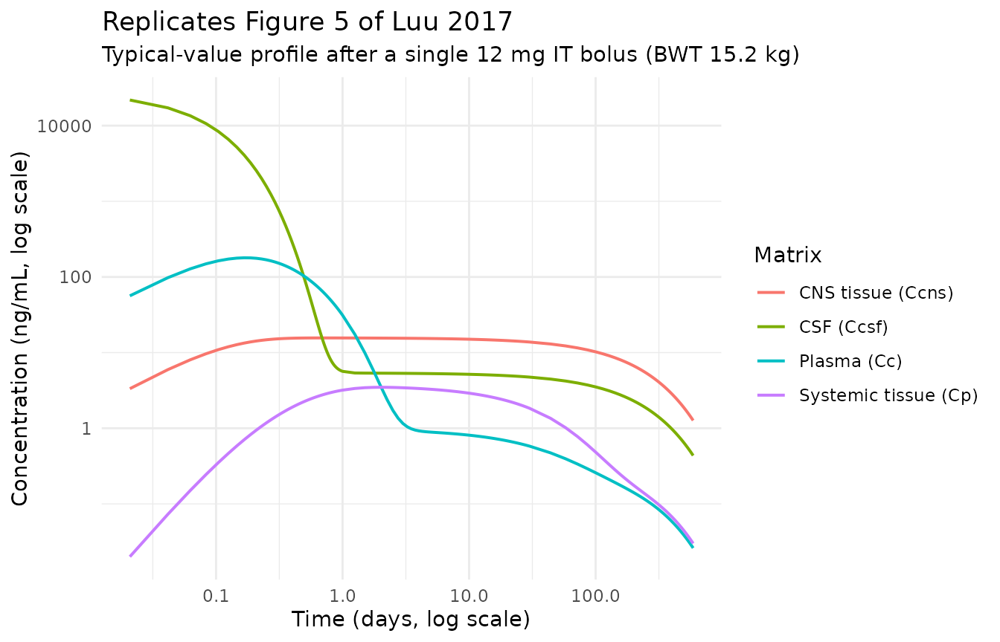
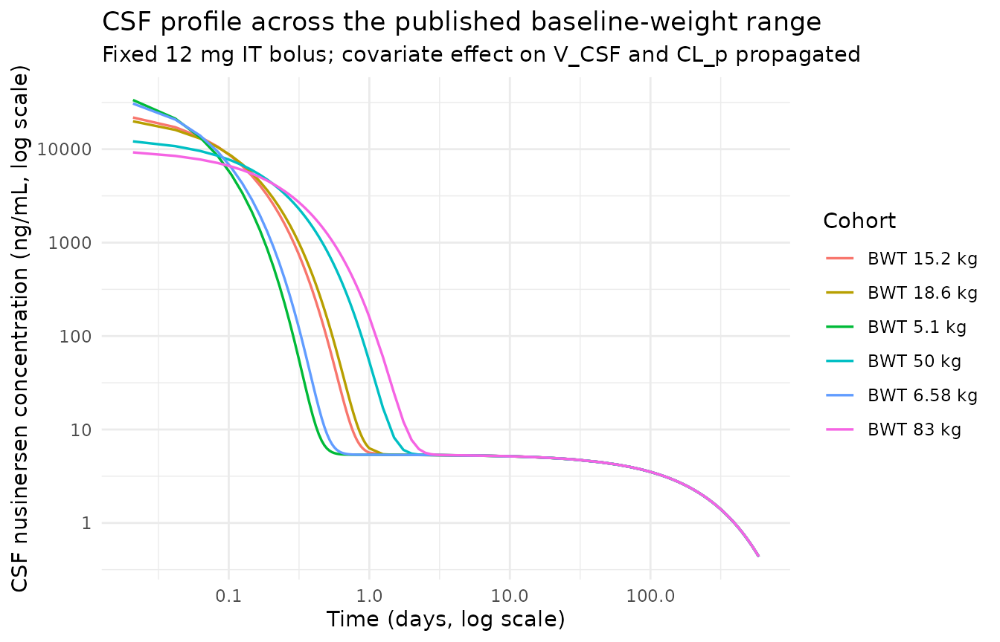

# Nusinersen (Luu 2017)

## Model and source

``` r

mod_meta <- nlmixr2est::nlmixr(readModelDb("Luu_2017_nusinersen"))$meta
#> ℹ parameter labels from comments will be replaced by 'label()'
```

- Citation: Luu KT, Norris DA, Gunawan R, Henry S, Geary R, Wang Y.
  Population Pharmacokinetics of Nusinersen in the Cerebral Spinal Fluid
  and Plasma of Pediatric Patients With Spinal Muscular Atrophy
  Following Intrathecal Administrations. J Clin Pharmacol.
  2017;57(8):1031-1041. <doi:10.1002/jcph.884>
- Description: Four-compartment population PK model for nusinersen
  (antisense oligonucleotide) following intrathecal administration in
  pediatric patients with spinal muscular atrophy (Luu 2017): a CSF +
  CNS-tissue subsystem (intrathecal bolus enters the CSF) coupled by a
  unidirectional CSF-to-plasma transport to a plasma + systemic-tissue
  subsystem, with baseline body weight as a power covariate on CL_p and
  V_CSF and a linear covariate on V_p.
- Article (DOI): <https://doi.org/10.1002/jcph.884>

This vignette validates the packaged `Luu_2017_nusinersen` model – a
linear four-compartment population PK model for the antisense
oligonucleotide nusinersen following intrathecal administration in 72
pediatric patients with spinal muscular atrophy (SMA) pooled across the
ISIS 396443-CS1 / -CS2 / -CS3A / -CS10 / -CS12 trials – against the
source publication’s reported typical CSF terminal half-life (Luu 2017
Table 3 “All” cohort median = 163 days) and the typical-value PK
parameters in Luu 2017 Table 2 (final model).

## Population

The pooled analysis dataset comprised 72 pediatric patients (37 male, 35
female) with SMA, aged 0.10 to 17 years (median 5 years) and weighing
5.1 to 83 kg (median 15.2 kg) at baseline. Race composition was 86.1%
White (62/72), 5.6% Black (4/72), 4.2% Asian (3/72), and 4.2% Other
(3/72) per Luu 2017 Table 1. The dataset contributed 279 CSF and 1181
plasma concentration data points across the five trials. Intrathecal
nusinersen doses ranged from 1 to 12 mg as single or repeated doses,
with later trials adopting an age-based dosing scheme (9.6-11.3 mg for
infants under 2 years, 12 mg for children over 2 years) derived from the
Matsuzawa et al. age-CSF-volume relationship; subsequent regulatory
labelling moved to a fixed 12 mg scheme across all age groups based on
the safety profile.

The same information is available programmatically via the model’s
`population` metadata:

``` r

str(mod_meta$population)
#> List of 12
#>  $ species              : chr "human"
#>  $ n_subjects           : int 72
#>  $ n_studies            : int 5
#>  $ studies              : chr "Pooled: ISIS 396443-CS1, -CS2, -CS3A, -CS10, -CS12"
#>  $ age_range            : chr "0.10 to 17 years (median 5)"
#>  $ weight_range         : chr "5.1 to 83 kg (median 15.2)"
#>  $ sex_female_pct       : num 48.6
#>  $ race_ethnicity       : Named num [1:4] 86.1 5.6 4.2 4.2
#>   ..- attr(*, "names")= chr [1:4] "White" "Black" "Asian" "Other"
#>  $ disease_state        : chr "Pediatric patients with spinal muscular atrophy (SMA) spanning presymptomatic / infantile-onset (likely type I)"| __truncated__
#>  $ dose_range           : chr "Single or repeated intrathecal doses of 1, 3, 6, 9, or 12 mg"
#>  $ administration_routes: chr "Intrathecal bolus injection"
#>  $ notes                : chr "Pooled CSF and plasma data: 279 CSF and 1181 plasma concentration data points across 5 trials (Luu 2017 Table 1"| __truncated__
```

## Source trace

The per-parameter origin is recorded as an in-file comment next to each
`ini()` entry in `inst/modeldb/specificDrugs/Luu_2017_nusinersen.R`. The
table below collects them in one place; all values come from Luu 2017
Table 2 (final model column).

| Parameter / equation | Value | Source location |
|----|----|----|
| `lcl` (CL_p) | log(2.36) L/h | Table 2 final: 2.36 L/h (%RSE 5.04) |
| `lcl_csf` (CL_CSF, one-way CSF -\> plasma) | log(0.136) L/h | Table 2 final: 0.136 L/h (%RSE 9.12) |
| `lq` (Q_p) | log(0.568) L/h | Table 2 final: 0.568 L/h (%RSE 11.7) |
| `lqcsf` (Q_CSF, csf \<-\> cns_tissue) | log(0.0712) L/h | Table 2 final: 0.0712 L/h (%RSE 19.5) |
| `lvc` (V_p) | log(29.0) L | Table 2 final: 29.0 L (%RSE 11.4) |
| `lvp` (V_systemic_tissue) | log(418) L | Table 2 final: 418 L (%RSE 20.9) |
| `lvcsf` (V_CSF) | log(0.433) L | Table 2 final: 0.433 L (%RSE 21.7) |
| `lvcns` (V_CNS_tissue) | log(263) L | Table 2 final: 263 L (%RSE 18.9) |
| `e_wt_cl` (power exponent on (BWT/MBWT) for CL_p) | 0.689 | Table 2 final (Equation 7): 0.689 (%RSE 12.2) |
| `e_wt_vcsf` (power exponent on (BWT/MBWT) for V_CSF) | 0.596 | Table 2 final (Equation 5): 0.596 (%RSE 52.3) |
| `e_wt_vc` (linear coefficient on (BWT-MBWT) for V_p, 1/kg) | 0.047 | Table 2 final (Equation 6): 0.047 (%RSE 21.7) |
| `etalcl` | omega^2 = 0.0834 | Table 2 final %IIV(CL_p) = 29.5% -\> ln(1 + 0.295^2) |
| `etalcl_csf` | omega^2 = 0.0578 | Table 2 final %IIV(CL_CSF) = 24.4% -\> ln(1 + 0.244^2) |
| `etalvcsf` | omega^2 = 0.5746 | Table 2 final %IIV(V_CSF) = 88.1% -\> ln(1 + 0.881^2) |
| `etalvc` | omega^2 = 0.1416 | Table 2 final %IIV(V_p) = 39.0% -\> ln(1 + 0.390^2) |
| `propSd` / `propSd_Ccsf` | sqrt(0.494) ~ 0.703 | Table 2 final epsilon (proportional) = 0.494 (%RSE 2.45); see Errata |
| `d/dt(csf)` / `d/dt(cns_tissue)` / `d/dt(central)` / `d/dt(peripheral1)` | n/a | Figure 1 + Discussion (“a single transport rate constant from CSF to plasma but no transport rate constant from the plasma to the CSF”) |
| `f(csf) <- 1000` | n/a | Unit conversion (mg dose -\> ug csf state -\> ng/mL concentration) |
| `MBWT <- 15.2` | 15.2 kg | Table 1 “All” median baseline body weight |

## Virtual cohort

Original observed data are not publicly available. The vignette uses
typical-value (no-IIV) simulations of a representative subject at the
population median baseline body weight (15.2 kg) plus a small panel of
covariate-sweep subjects spanning the published weight range (5.1 to 83
kg). Doses follow the trial protocol’s 12 mg single intrathecal bolus.

``` r

set.seed(20260621)

# Typical subject (BWT = 15.2 kg = MBWT). Single 12 mg IT bolus on day 1.
# Observation grid: dense early (distribution phase, hours scale), then
# logarithmically spaced through the terminal CSF half-life of ~163 days
# (Luu 2017 Table 3). Final observation at 600 days (~3.7 half-lives).
day_h         <- 24
obs_times_h   <- sort(unique(c(
  seq(0,         24,        by = 0.5),               # 0-1 day, 0.5 h grid
  seq(  1,        7,        by = 0.25) * day_h,      # 1-7 d, 6 h grid
  seq(  7,       30,        by = 1)    * day_h,      # 7-30 d, daily
  seq( 30,      600,        by = 14)   * day_h       # 30-600 d, every 14 days
)))

# Helper: build one cohort as a self-contained data frame of events.
# id_offset shifts IDs so multiple cohorts can be bind_rows'ed safely.
# The model declares two algebraic endpoints (Cc plasma, Ccsf CSF).
# Address each endpoint by its `dvid` id (1 = Cc, 2 = Ccsf) on
# observation rows so rxode2 maps each to its endpoint under the
# default solver -- the multi-output pattern in
# `references/known-vignette-failure-patterns.md` Section 5b
# (Wittau 2015 meropenem precedent). The dose row uses the actual
# ODE state name `csf` (intrathecal bolus enters the CSF compartment).
make_cohort <- function(wt_kg, cohort_label, dose_mg = 12, id_offset = 0L) {
  ids  <- id_offset + 1L
  dose <- tibble(
    id    = ids,
    time  = 0,
    amt   = dose_mg,
    cmt   = "csf",
    evid  = 1L,
    dvid  = NA_integer_,
    WT    = wt_kg,
    cohort = cohort_label
  )
  obs  <- tidyr::expand_grid(id = ids, time = obs_times_h,
                             dvid = c(1L, 2L)) |>
    dplyr::mutate(
      amt    = NA_real_,
      cmt    = NA_character_,
      evid   = 0L,
      WT     = wt_kg,
      cohort = cohort_label
    )
  dplyr::bind_rows(dose, obs) |>
    dplyr::arrange(id, time, dplyr::desc(evid), dvid)
}

# Single typical-value subject at the population median BWT (MBWT = 15.2 kg).
events_typical <- make_cohort(wt_kg = 15.2, cohort_label = "Typical (BWT 15.2 kg)")

# Covariate sweep: representative BWT bands from Luu 2017 Table 1.
# 6.58 kg = CS3A infantile cohort median; 15.2 kg = "All" median;
# 18.6 kg = CS1 median; 50 kg approximates an older child.
events_sweep <- dplyr::bind_rows(
  make_cohort(wt_kg = 5.1,  cohort_label = "BWT 5.1 kg",  id_offset =  10L),
  make_cohort(wt_kg = 6.58, cohort_label = "BWT 6.58 kg", id_offset =  20L),
  make_cohort(wt_kg = 15.2, cohort_label = "BWT 15.2 kg", id_offset =  30L),
  make_cohort(wt_kg = 18.6, cohort_label = "BWT 18.6 kg", id_offset =  40L),
  make_cohort(wt_kg = 50.0, cohort_label = "BWT 50 kg",   id_offset =  50L),
  make_cohort(wt_kg = 83.0, cohort_label = "BWT 83 kg",   id_offset =  60L)
)
stopifnot(!anyDuplicated(unique(events_sweep[, c("id", "time", "evid")])))
```

## Simulation

``` r

mod <- readModelDb("Luu_2017_nusinersen")

# Typical-value (no IIV) simulation. The validation here is the structural
# behavior at the typical infant; the long terminal CSF half-life and the
# multi-compartment shape do not depend on IIV.
mod_typical <- rxode2::zeroRe(mod)
#> ℹ parameter labels from comments will be replaced by 'label()'

sim_typical <- rxode2::rxSolve(
  object = mod_typical,
  events = events_typical,
  keep   = c("cohort", "WT")
) |>
  as.data.frame() |>
  # rxSolve drops the single-subject id column; re-attach it for PKNCA.
  dplyr::mutate(id = events_typical$id[[1]])
#> ℹ omega/sigma items treated as zero: 'etalcl', 'etalcl_csf', 'etalvcsf', 'etalvc'

sim_sweep <- rxode2::rxSolve(
  object = mod_typical,
  events = events_sweep,
  keep   = c("cohort", "WT")
) |>
  as.data.frame()
#> ℹ omega/sigma items treated as zero: 'etalcl', 'etalcl_csf', 'etalvcsf', 'etalvc'
#> Warning: multi-subject simulation without without 'omega'
```

## Replicate published figures

### Figure 5 - Single-dose four-compartment profile

Luu 2017 Figure 5 plots the simulated median PK profile of nusinersen in
the CSF, CNS tissue, plasma, and systemic-tissue compartments after a
single 12 mg intrathecal bolus, illustrating the steep distribution
phase followed by the long terminal phase in the CSF. Below the model
typical-value trajectories for all four compartments are plotted at the
median baseline body weight (MBWT = 15.2 kg).

``` r

sim_long <- sim_typical |>
  dplyr::filter(time > 0, time <= 600 * day_h) |>
  dplyr::mutate(time_d = time / day_h) |>
  dplyr::transmute(
    time_d,
    `CSF (Ccsf)`               = Ccsf,
    `CNS tissue (Ccns)`        = Ccns,
    `Plasma (Cc)`              = Cc,
    `Systemic tissue (Cp)`     = Cp
  ) |>
  tidyr::pivot_longer(-time_d, names_to = "matrix", values_to = "conc")

ggplot(sim_long, aes(time_d, conc, colour = matrix)) +
  geom_line(linewidth = 0.7) +
  scale_y_log10() +
  scale_x_log10() +
  labs(
    x        = "Time (days, log scale)",
    y        = "Concentration (ng/mL, log scale)",
    colour   = "Matrix",
    title    = "Replicates Figure 5 of Luu 2017",
    subtitle = "Typical-value profile after a single 12 mg IT bolus (BWT 15.2 kg)"
  ) +
  theme_minimal()
```



### CSF profile by baseline body weight

Visualises how baseline body weight modulates the CSF concentration
profile via the power covariate effect on V_CSF (e_wt_vcsf = 0.596):
larger subjects have larger apparent V_CSF, so the early CSF
concentration is lower at the same fixed 12 mg dose.

``` r

sim_sweep |>
  dplyr::filter(time > 0, time <= 600 * day_h, !is.na(Ccsf)) |>
  dplyr::mutate(time_d = time / day_h) |>
  ggplot(aes(time_d, Ccsf, colour = cohort)) +
  geom_line(linewidth = 0.6) +
  scale_y_log10() +
  scale_x_log10() +
  labs(
    x        = "Time (days, log scale)",
    y        = "CSF nusinersen concentration (ng/mL, log scale)",
    colour   = "Cohort",
    title    = "CSF profile across the published baseline-weight range",
    subtitle = "Fixed 12 mg IT bolus; covariate effect on V_CSF and CL_p propagated"
  ) +
  theme_minimal()
```



## PKNCA validation

The paper reports the typical CSF terminal half-life as the primary
NCA-style endpoint (Luu 2017 Table 3): median 163 days for the “All”
cohort, with no significant trend across age groups (range 159-172 days
across 0-3 month through \>6 year strata). The paper does not publish
plasma NCA values, and the CSF Cmax / AUC values plotted in Luu 2017
Figure 4 are summarised only as box-plot rasters. Validation here
therefore focuses on the CSF terminal half-life.

``` r

# CSF concentration frame at the typical BWT (15.2 kg).
nca_input_csf <- sim_typical |>
  dplyr::filter(!is.na(Ccsf)) |>
  dplyr::select(id, time, Ccsf, cohort)

# Ensure a row at time = 0 with Ccsf = 0 (pre-dose anchor) - see
# pknca-recipes.md "Time-zero records (mandatory)".
nca_input_csf <- dplyr::bind_rows(
  nca_input_csf,
  nca_input_csf |> dplyr::distinct(id, cohort) |>
    dplyr::mutate(time = 0, Ccsf = 0)
) |>
  dplyr::distinct(id, cohort, time, .keep_all = TRUE) |>
  dplyr::arrange(id, cohort, time)

dose_df <- events_typical |>
  dplyr::filter(evid == 1L) |>
  dplyr::select(id, time, amt, cohort)

conc_obj_csf <- PKNCA::PKNCAconc(
  data    = nca_input_csf,
  formula = Ccsf ~ time | cohort + id,
  concu   = "ng/mL",
  timeu   = "hr"
)
dose_obj <- PKNCA::PKNCAdose(
  data    = dose_df,
  formula = amt ~ time | cohort + id,
  doseu   = "mg"
)

# PKNCA picks the terminal phase automatically; with the long terminal
# log-linear tail from day ~30 to day 600 the algorithm correctly
# excludes the steep early-distribution phase.
intervals_csf <- data.frame(
  start              = 0,
  end                = Inf,
  cmax               = TRUE,
  tmax               = TRUE,
  aucinf.obs         = TRUE,
  half.life          = TRUE,
  lambda.z           = TRUE
)

nca_data_csf <- PKNCA::PKNCAdata(conc_obj_csf, dose_obj, intervals = intervals_csf)
nca_res_csf  <- suppressWarnings(PKNCA::pk.nca(nca_data_csf))

knitr::kable(
  summary(nca_res_csf),
  caption = paste0("Typical-value CSF NCA after a single 12 mg IT bolus ",
                   "(BWT 15.2 kg). Half-life expected ~163 days = 3912 h.")
)
```

| Interval Start | Interval End | cohort | N | Cmax (ng/mL) | Tmax (hr) | Half-life (hr) | $`\lambda_z`$ (1/hr) | AUCinf,obs (hr\*ng/mL) |
|---:|---:|:---|:---|:---|:---|:---|:---|:---|
| 0 | Inf | Typical (BWT 15.2 kg) | 1 | 27700 | 0.000 | 3900 | 0.000178 | 88200 |

Typical-value CSF NCA after a single 12 mg IT bolus (BWT 15.2 kg).
Half-life expected ~163 days = 3912 h. {.table}

### Comparison against published NCA

Luu 2017 reports the CSF terminal half-life (Table 3 “All” cohort median
= 163 days, range 123-310 days) as the primary published NCA parameter.
Other published-versus-simulated quantitative comparisons are not
available because Luu 2017 reports only graphical (Figure 4 box-plot)
summaries of CSF Cmax and AUC, with no tabulated point estimates.

``` r

published <- tibble::tribble(
  ~cohort,                  ~half.life,
  "Typical (BWT 15.2 kg)",  163 * 24      # 163 days * 24 h/day = 3912 h
)

cmp <- nlmixr2lib::ncaComparisonTable(
  simulated     = nca_res_csf,
  reference     = published,
  by            = "cohort",
  units         = c(half.life = "h"),
  tolerance_pct = 20
)

knitr::kable(
  cmp,
  caption = "Simulated vs published CSF terminal half-life (Luu 2017 Table 3, 'All' cohort median 163 days). * differs from reference by >20%.",
  align   = c("l", "l", "r", "r", "r")
)
```

| NCA parameter | cohort                | Reference | Simulated | % diff |
|:--------------|:----------------------|----------:|----------:|-------:|
| t½ (h)        | Typical (BWT 15.2 kg) |      3910 |      3900 |  -0.3% |

Simulated vs published CSF terminal half-life (Luu 2017 Table 3, ‘All’
cohort median 163 days). \* differs from reference by \>20%. {.table}

## Typical-value PK parameter check

A purely algebraic sanity check on the typical-value parameter encoding:
hand-compute CL_p and V_p at the population MBWT (15.2 kg) and confirm
they match the paper’s Table 2 final-model values.

``` r

mbwt    <- 15.2
typical_wt <- mbwt
cl_p_typical   <- 2.36 * (typical_wt / mbwt)^0.689
cl_csf_typical <- 0.136
vp_typical     <- 29.0 * (1 + 0.047 * (typical_wt - mbwt))
vcsf_typical   <- 0.433 * (typical_wt / mbwt)^0.596

cat(sprintf("Typical CL_p   at BWT = MBWT: %.3f L/h   (Table 2 final: 2.36)\n",  cl_p_typical))
#> Typical CL_p   at BWT = MBWT: 2.360 L/h   (Table 2 final: 2.36)
cat(sprintf("Typical CL_CSF at BWT = MBWT: %.3f L/h   (Table 2 final: 0.136)\n", cl_csf_typical))
#> Typical CL_CSF at BWT = MBWT: 0.136 L/h   (Table 2 final: 0.136)
cat(sprintf("Typical V_p    at BWT = MBWT: %.3f L     (Table 2 final: 29.0)\n",  vp_typical))
#> Typical V_p    at BWT = MBWT: 29.000 L     (Table 2 final: 29.0)
cat(sprintf("Typical V_CSF  at BWT = MBWT: %.3f L     (Table 2 final: 0.433)\n", vcsf_typical))
#> Typical V_CSF  at BWT = MBWT: 0.433 L     (Table 2 final: 0.433)
```

## Assumptions and deviations

- **Inter-occasion variability (IOV) is not encoded.** Luu 2017 Table 2
  reports an IOV of 38.1% CV on CL_CSF. The packaged model implements
  only the per-subject IIV (`etalcl_csf ~ ln(1 + 0.244^2) = 0.0578`);
  the IOV would require an explicit per-occasion OCC variable in the
  event table and a parallel family of occasion etas which is not
  generally appropriate for an nlmixr2lib reference model. The
  structural and typical-value behavior is unaffected. Stochastic / VPC
  users who need IOV should add it downstream by enlarging the residual
  term or by defining an OCC eta in their own model copy.

- **Single proportional residual error applied identically to both
  endpoints.** Luu 2017 Table 2 reports a single proportional residual
  error parameter epsilon (Proportional) = 0.494 (%RSE 2.45), with no
  separation into plasma- and CSF-specific residuals. The packaged model
  interprets this value as a NONMEM 7.2 `$SIGMA` variance per the
  prevailing nlmixr2lib convention for NONMEM-source residual error
  parameters, encodes `propSd = propSd_Ccsf = sqrt(0.494) ~ 0.703`, and
  applies the same proportional SD to both `Cc` and `Ccsf`. If the
  paper’s reported value were a SD rather than a variance, the
  proportional residual CV would be 49.4% rather than ~70.3%; the
  distinction does not affect typical-value (zeroRe) simulations or any
  of the figures and tables in this vignette.

- **CNS tissue is encoded as a paper-specific compartment
  `cns_tissue`.** Luu 2017 Discussion describes the CNS tissue as “a
  lumped compartment consisting possibly of the spinal cord tissue,
  subarachnoid space, and brain tissue” – it is not solely a brain
  compartment, so the canonical `brain_<region>` namespace is not
  appropriate. The compartment is declared via
  `paper_specific_compartments <- c("cns_tissue")` in the model file.

- **Paper-specific parameter names for the CSF subsystem.** The CSF
  subsystem clearance `lcl_csf` (one-way CSF -\> plasma transport,
  CL_CSF in the paper), inter-compartmental clearance `lqcsf` (csf \<-\>
  cns_tissue, Q_CSF in the paper), and volume `lvcns` (V_CNS_tissue) are
  not in the canonical parameter register. They follow the
  `Perez-Ruixo 2025 posdinemab` precedent of `lvcsf` / `lqcsf` for
  CSF-side parameter naming.
  [`checkModelConventions()`](https://nlmixr2.github.io/nlmixr2lib/reference/checkModelConventions.md)
  flags these as paper-specific deviations.

- **MBWT = 15.2 kg fixed in the model body, not exposed as a
  configurable parameter.** The reference median baseline body weight is
  encoded as a literal inside `model()` rather than as an `ini()`
  parameter because it is a population-level reference value (not a
  per-subject covariate), and is documented in the
  `covariateData$WT$notes` field. Users who simulate against a cohort
  with a different reference body weight should clone the model and edit
  the literal `MBWT` value.

- **Unit conversion via `f(csf) <- 1000`.** Doses are supplied in mg
  (matching the trial protocol), the `csf` state is carried in ug, and
  concentrations are reported in ng/mL = ug/L. The conversion factor
  f(csf) = 1000 ug/mg lets a user pass `amt = 12` (a 12 mg dose) and
  obtain CSF and plasma concentrations directly in ng/mL. Users who
  supply doses in another unit must adjust this factor.

- **No errata located.** A search of the J Clin Pharmacol landing page
  and the PubMed corrections feed for PMID 28369979 (DOI
  10.1002/jcph.884) found no published corrections to the source. A
  separate semi-mechanistic popPK model for nusinersen (Biliouris 2018,
  PMID 30043511) exists but is not an erratum to Luu 2017; Biliouris
  2018 was not extracted in this task and may be queued separately if
  desired.
