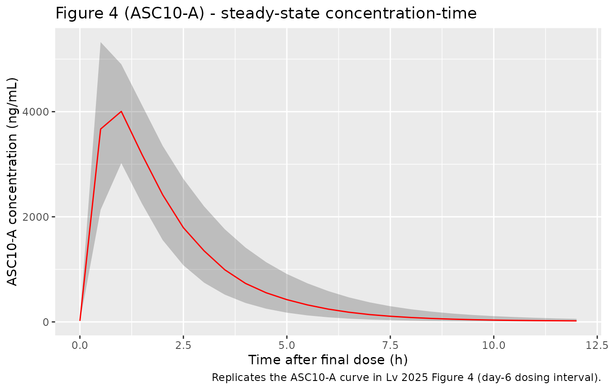
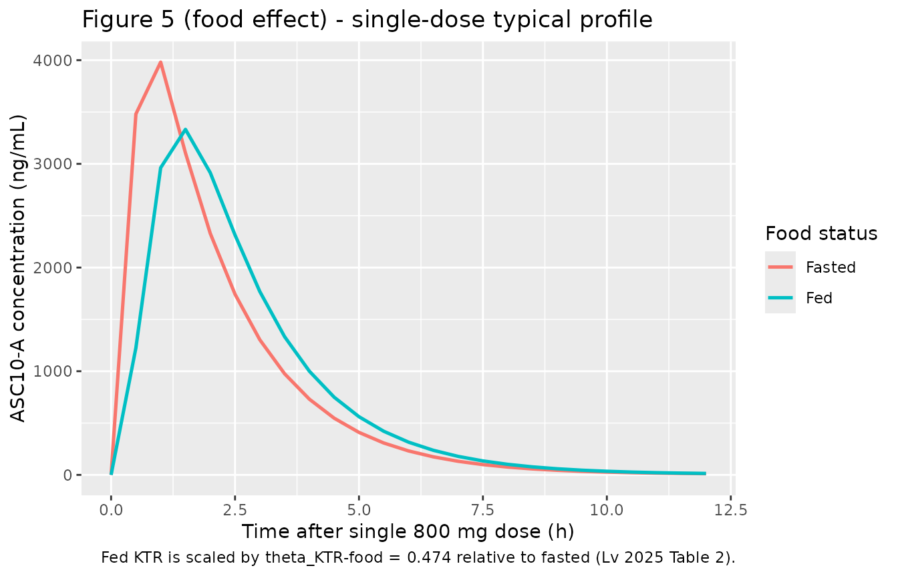
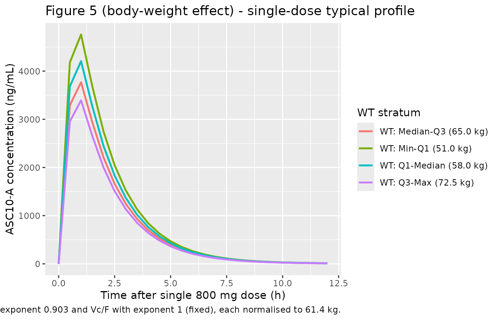

# ASC10-A (Lv 2025)

## Model and source

- Citation: Lv D, Li S, Li Y, Lin M, Zhai Y, Wu M, Qiu Y, Zhao Q, Liu J.
  Population Pharmacokinetic Modeling Analysis of ASC10, a Novel
  Antiviral Agent Targeted COVID-19, in Chinese Healthy Subjects. Drug
  Des Devel Ther. 2025;19:7391-7402. <doi:10.2147/DDDT.S517282>.
- Description: Population PK model of ASC10-A (also called NHC,
  beta-D-N4-hydroxycytidine), the active nucleoside metabolite of the
  oral double prodrug ASC10, in Chinese healthy adult volunteers (Lv
  2025). ASC10 is under clinical development for COVID-19 and shares an
  active moiety with molnupiravir. Data pooled 57 subjects with 1,634
  ASC10-A plasma concentrations from a Phase I trial (NCT05523141) with
  a multiple-ascending-dose part (50-800 mg BID x 5 days + one AM dose
  on day 6) and a fasted/fed food-effect part. The final model is a
  two-compartment disposition with first-order elimination and a
  two-transit-compartment absorption chain (rate constant KTR). Body
  weight enters as an estimated power on CL/F (exponent 0.903) and a
  fixed power on Vc/F (exponent 1.0), normalised to the median 61.4 kg.
  Food status enters KTR only: fed KTR is scaled by theta_KTR-food =
  0.474, i.e., ~52.6% reduction relative to fasted, with no effect on
  relative bioavailability (F is fixed at 1). Residual error is combined
  additive (2.3 ng/mL, fixed) + proportional (SD = 0.41).
- Article: <https://doi.org/10.2147/DDDT.S517282>

## Population

The model was fit to plasma concentrations of the active nucleoside
metabolite ASC10-A (equivalent to NHC, beta-D-N4-hydroxycytidine) from a
Phase I trial in Chinese healthy adult volunteers (ClinicalTrials.gov
NCT05523141). Fifty-seven subjects contributed 1,634 observations across
a multiple-ascending-dose (MAD) part (n = 45; 50-800 mg twice daily for
5 days plus a single morning dose on day 6) and an open-label crossover
food-effect (FE) part (n = 12; single 800 mg dose fasted and fed, with
\>= 7 day washout). Median age was 31 years (range 18-44), median body
weight 61.4 kg (range 47.1-77.9), and 42.1% of subjects were female;
55/57 (96.5%) were of Han ethnicity (Lv 2025 Table 1). LLOQ for ASC10-A
by UPLC-MS/MS was 10.0 ng/mL; 22.6% of observations were BQL and were
handled with the M3 likelihood-based method in NONMEM 7.4.

The same information is available programmatically via
`readModelDb("Lv_2025_asc10a")()$population`.

## Source trace

The per-parameter origin is recorded as an in-file comment next to each
`ini()` entry in `inst/modeldb/specificDrugs/Lv_2025_asc10a.R`. The
table below collects them in one place.

| Equation / parameter | Value | Source location |
|----|----|----|
| CL/F | 79.7 L/h | Lv 2025 Table 2 (Final Model Estimate) |
| Vc/F | 139 L | Lv 2025 Table 2 |
| Q/F | 1.24 L/h | Lv 2025 Table 2 |
| Vp/F | 31.6 L | Lv 2025 Table 2 |
| KTR (fasted) | 7.02 1/h | Lv 2025 Table 2 |
| F | 1 (fixed) | Lv 2025 Table 2 |
| theta_CL-WT (allometric) | 0.903 | Lv 2025 Table 2 |
| theta_Vc-WT (allometric, fixed) | 1 | Lv 2025 Table 2 |
| theta_KTR-food (fed multiplier on KTR) | 0.474 | Lv 2025 Table 2 |
| IIV CL (%CV) | 17.1 | Lv 2025 Table 2 |
| IIV Vc (%CV) | 10.3 | Lv 2025 Table 2 |
| IIV KTR (%CV) | 31.9 | Lv 2025 Table 2 |
| Proportional residual SD | 0.41 | Lv 2025 Table 2 |
| Additive residual SD | 2.3 ng/mL (fixed) | Lv 2025 Table 2 |
| Continuous covariate form | P = th \* (cov/med)^theta | Lv 2025 Equation 1 |
| Categorical covariate form | P = th \* theta^cov | Lv 2025 Equation 2 |
| Two-compartment disposition + 2 transits + first-order elimination | n/a | Lv 2025 Results ‘PopPK Model Development’ and Figure 1 |

## Virtual cohort

Original observed data are not publicly available; the figures below use
virtual populations whose covariate distributions approximate the
published trial demographics. Cohort sizes are kept small to bound
render time while still supporting quantile summaries.

``` r

set.seed(20260725)

tau   <- 12                  # dosing interval (h)
tlast <- 120                 # time of the final (day-6 morning) dose in the MAD schedule
dose_times <- c(seq(0, 108, by = tau), tlast)   # 10 BID doses + 1 morning dose on day 6

sample_wt <- function(n) {
  wt <- rnorm(n, mean = 61.4, sd = 7.2)
  pmin(pmax(wt, 47.1), 77.9)
}

make_cohort <- function(n, wt, fed, cohort_label, doses = dose_times,
                        obs_grid = seq(0, 12, by = 0.5),
                        id_offset = 0L) {
  subj <- tibble(
    id  = id_offset + seq_len(n),
    WT  = wt,
    FED = fed,
    cohort = cohort_label
  )
  dose <- subj |>
    tidyr::crossing(time = doses) |>
    mutate(evid = 1L, amt = 800, cmt = "depot")
  obs <- subj |>
    tidyr::crossing(time = unique(obs_grid)) |>
    mutate(evid = 0L, amt = NA_real_, cmt = "central")
  dplyr::bind_rows(dose, obs) |>
    dplyr::arrange(id, time, dplyr::desc(evid))
}

# MAD reference cohort: 100 subjects, fasted, 61.4 kg range. Observation
# grid is sparse over the ramp-up (every 6 h) and dense over the final
# dosing interval where the paper's AUCss / Cmax are measured.
cohort_ref <- make_cohort(
  n = 100L, wt = sample_wt(100L), fed = 0L,
  cohort_label = "800 mg BID x5d + AM day6 (fasted)",
  obs_grid = c(seq(0, tlast, by = 6),
               seq(tlast, tlast + 12, by = 0.5),
               tlast + 24, tlast + 48)
)

# Single-dose food-effect cohorts (typical value only via zeroRe below).
cohort_fasted_sd <- make_cohort(
  n = 1L, wt = 61.4, fed = 0L,
  cohort_label = "800 mg single dose (fasted)",
  doses = 0, id_offset = 1000L
)
cohort_fed_sd <- make_cohort(
  n = 1L, wt = 61.4, fed = 1L,
  cohort_label = "800 mg single dose (fed)",
  doses = 0, id_offset = 2000L
)

# Body-weight quartile cohorts (typical value, fasted, single 800 mg dose)
# for the Figure 5-like exposure-vs-weight comparison. Values are the
# midpoints of the paper-reported range 47.1-77.9 kg (Lv 2025 Table 1).
wt_quartiles <- c("Min-Q1" = 51.0, "Q1-Median" = 58.0,
                  "Median-Q3" = 65.0, "Q3-Max" = 72.5)
cohorts_wt <- purrr::imap(wt_quartiles, function(wt_val, lbl) {
  make_cohort(
    n = 1L, wt = wt_val, fed = 0L,
    cohort_label = paste0("WT: ", lbl,
                          " (", format(wt_val, nsmall = 1), " kg)"),
    doses = 0,
    id_offset = 3000L + 1000L * match(lbl, names(wt_quartiles))
  )
}) |> dplyr::bind_rows()

events_typ <- dplyr::bind_rows(cohort_fasted_sd, cohort_fed_sd, cohorts_wt)
stopifnot(!anyDuplicated(unique(events_typ[, c("id", "time", "evid")])))
stopifnot(!anyDuplicated(unique(cohort_ref[, c("id", "time", "evid")])))
```

## Simulation

``` r

mod <- readModelDb("Lv_2025_asc10a")

sim_ref_iiv <- rxode2::rxSolve(
  mod, events = cohort_ref,
  keep = c("WT", "FED", "cohort")
) |> as.data.frame()

sim_typ <- rxode2::rxSolve(
  rxode2::zeroRe(mod), events = events_typ,
  keep = c("WT", "FED", "cohort")
) |> as.data.frame()
#> ℹ omega/sigma items treated as zero: 'etalcl', 'etalvc', 'etalktr'
#> Warning: multi-subject simulation without without 'omega'
```

## Replicate published figures

### Figure 4 - steady-state concentration-time profile

Reproduces the ASC10-A steady-state concentration-time curve in Lv 2025
Figure 4 (right after the day-6 morning dose). The paper’s simulated
geometric-mean Tmax after the final dose was 1.35 h.

``` r

sim_ss <- sim_ref_iiv |>
  dplyr::filter(time >= tlast, time <= tlast + 12) |>
  dplyr::mutate(t_since_last_dose = time - tlast) |>
  dplyr::group_by(t_since_last_dose) |>
  dplyr::summarise(
    Q05 = quantile(Cc, 0.05, na.rm = TRUE),
    Q50 = quantile(Cc, 0.50, na.rm = TRUE),
    Q95 = quantile(Cc, 0.95, na.rm = TRUE),
    .groups = "drop"
  )

ggplot(sim_ss, aes(t_since_last_dose, Q50)) +
  geom_ribbon(aes(ymin = Q05, ymax = Q95), alpha = 0.25) +
  geom_line(colour = "red") +
  labs(x = "Time after final dose (h)", y = "ASC10-A concentration (ng/mL)",
       title = "Figure 4 (ASC10-A) - steady-state concentration-time",
       caption = "Replicates the ASC10-A curve in Lv 2025 Figure 4 (day-6 dosing interval).")
```



### Figure 5 - covariate effects on typical exposure

Reproduces Figure 5: fed vs fasted absorption profiles and typical
concentration-time curves across body-weight quartiles. Panels use
typical-value (population-mean) profiles from a single 800 mg dose.

``` r

sim_typ |>
  dplyr::filter(cohort %in% c("800 mg single dose (fasted)",
                              "800 mg single dose (fed)")) |>
  ggplot(aes(time, Cc, colour = factor(FED, levels = c(0, 1),
                                       labels = c("Fasted", "Fed")))) +
  geom_line(linewidth = 0.9) +
  labs(x = "Time after single 800 mg dose (h)",
       y = "ASC10-A concentration (ng/mL)",
       colour = "Food status",
       title = "Figure 5 (food effect) - single-dose typical profile",
       caption = paste(
         "Fed KTR is scaled by theta_KTR-food = 0.474 relative to fasted",
         "(Lv 2025 Table 2)."))
```



``` r

sim_typ |>
  dplyr::filter(startsWith(cohort, "WT: ")) |>
  ggplot(aes(time, Cc, colour = cohort)) +
  geom_line(linewidth = 0.9) +
  labs(x = "Time after single 800 mg dose (h)",
       y = "ASC10-A concentration (ng/mL)",
       colour = "WT stratum",
       title = "Figure 5 (body-weight effect) - single-dose typical profile",
       caption = paste(
         "Body weight scales CL/F with exponent 0.903 and Vc/F with",
         "exponent 1 (fixed), each normalised to 61.4 kg."))
```



## PKNCA validation

### Steady-state NCA (dosing interval 120-132 h)

Matches the paper’s simulation window: the AUCss quantity in Lv 2025 is
AUC over 120-132 hours (the interval right after the final day-6 morning
dose), and Cmax within that window.

``` r

sim_ss_nca <- sim_ref_iiv |>
  dplyr::filter(!is.na(Cc)) |>
  dplyr::select(id, time, Cc, cohort)

# Guarantee a time-zero row per (id, cohort) so PKNCA can anchor AUC0-*
# (extravascular; pre-dose Cc = 0).
sim_ss_nca <- dplyr::bind_rows(
  sim_ss_nca,
  sim_ss_nca |> dplyr::distinct(id, cohort) |>
    dplyr::mutate(time = 0, Cc = 0)
) |>
  dplyr::distinct(id, cohort, time, .keep_all = TRUE) |>
  dplyr::arrange(id, cohort, time)

dose_df_ss <- cohort_ref |>
  dplyr::filter(evid == 1L) |>
  dplyr::select(id, time, amt, cohort)

conc_obj_ss <- PKNCA::PKNCAconc(sim_ss_nca, Cc ~ time | cohort + id,
                                concu = "ng/mL", timeu = "h")
dose_obj_ss <- PKNCA::PKNCAdose(dose_df_ss, amt ~ time | cohort + id,
                                doseu = "mg")

intervals_ss <- data.frame(
  start   = tlast,
  end     = tlast + tau,
  cmax    = TRUE,
  tmax    = TRUE,
  cmin    = TRUE,
  auclast = TRUE
)

nca_ss <- PKNCA::pk.nca(
  PKNCA::PKNCAdata(conc_obj_ss, dose_obj_ss, intervals = intervals_ss)
)
```

### Comparison against paper’s simulated values

Lv 2025 reports (for virtual patients weighing 61.4 kg, fasted, 800 mg
q12h x 5 days) geometric-mean Cmax = 3374.13 ng/mL and AUC over 120-132
h (AUCss) = 10139.12 h\*ng/mL; typical Tmax after the final dose was
1.35 h (Discussion; Figure 4 caption uses AUCss as AUC 120-132 h).

``` r

published <- tibble::tibble(
  cohort   = "800 mg BID x5d + AM day6 (fasted)",
  cmax     = 3374.13,
  auclast  = 10139.12,
  tmax     = tlast + 1.35
)

cmp <- nlmixr2lib::ncaComparisonTable(
  simulated     = nca_ss,
  reference     = published,
  by            = "cohort",
  units         = c(cmax = "ng/mL", auclast = "h*ng/mL", tmax = "h",
                    cmin = "ng/mL"),
  tolerance_pct = 20
)

knitr::kable(
  cmp,
  caption = paste(
    "Simulated (this vignette) vs. Lv 2025 simulated values at steady",
    "state (120-132 h window). * differs from reference by >20%."),
  align   = c("l", "l", "l", "r", "r", "r")
)
```

| NCA parameter | cohort | Reference | Simulated | % diff |
|:---|:---|:---|---:|---:|
| Cmax (ng/mL) | 800 mg BID x5d + AM day6 (fasted) | 3370 | 4150 | +23.1%\* |
| Tmax (h) | 800 mg BID x5d + AM day6 (fasted) | 121 | 1 | -99.2%\* |
| AUClast (h\*ng/mL) | 800 mg BID x5d + AM day6 (fasted) | 10100 | 10400 | +3.0% |

Simulated (this vignette) vs. Lv 2025 simulated values at steady state
(120-132 h window). \* differs from reference by \>20%. {.table}

Flag any starred rows in the narrative and investigate the source - do
not tune parameters to match.

## Assumptions and deviations

- Cohort sizes are kept small (100 subjects for the MAD reference; 1
  subject per typical-value profile for the covariate-effect figures) to
  bound render time. This is illustrative validation, not a production
  VPC; the model’s IIV / residual-error terms are the same regardless.
- Body weight in the MAD reference cohort is drawn from a truncated
  normal centred at 61.4 kg with SD 7.2 kg and clipped to the paper’s
  observed range 47.1-77.9 kg (Lv 2025 Table 1 reports median 61.4 and
  mean+/-SD 61.5+/-7.2 kg but does not publish the full distribution).
- Age, sex, BMI, and Han ethnicity were screened by the authors and not
  retained in the final model. They are declared in
  `covariatesDataExcluded` for provenance but do not enter `model()`.
- Food status is modelled as a per-subject binary FED indicator (0 =
  fasted, 1 = fed). The paper’s FE part was a within-subject crossover,
  but the model treats food status as a fixed covariate on KTR only (Lv
  2025 Table 2). The vignette therefore simulates fasted and fed as two
  disjoint typical-value profiles rather than a crossover.
- The paper reports IIV as omega with the caption “square root of
  interindividual variance for parameters”. Values (17.1, 10.3, 31.9)
  are interpreted as percent CV per the exponential-IIV convention
  described in Methods and converted to log-normal
  `omega^2 = log(1 + CV^2)`.
- BQL data (22.6% of observations) were handled with the M3
  likelihood-based method in NONMEM during estimation; the packaged
  model has no explicit BQL treatment - downstream simulations always
  emit a continuous concentration.
- No observed-data VPC is possible because the source data are not
  public; the ribbon in the Figure 4 replication is a purely simulated
  envelope for illustration.
