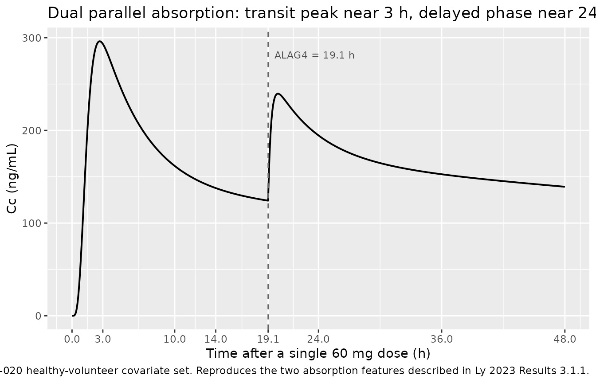
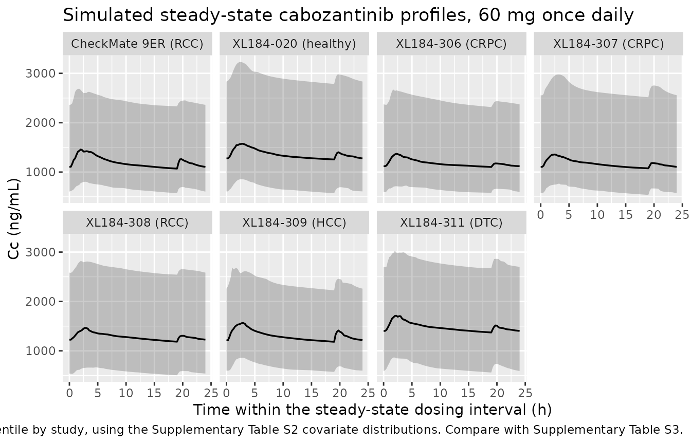

# Cabozantinib (Ly 2023)

## Model and source

    #> ℹ parameter labels from comments will be replaced by 'label()'

- Citation: Ly NS, Li J, Faggioni R, Roskos LK, Brose MS. Population
  pharmacokinetics and exposure-response analysis for the Phase 3
  COSMIC-311 trial of cabozantinib for radioiodine-refractory
  differentiated thyroid cancer. Clin Pharmacokinet. 2023;62(4):629-639.
  <doi:10.1007/s40262-023-01210-0>.

- Description: Two-compartment population PK model for oral cabozantinib
  tablet (tyrosine kinase inhibitor) in healthy volunteers and patients
  with differentiated thyroid cancer, renal cell carcinoma,
  castration-resistant prostate cancer, or hepatocellular carcinoma (Ly
  2023, n=1745 across the Phase 3 COSMIC-311 trial and 6 other studies).
  Absorption is described by two parallel processes sharing a single
  first-order rate constant Ka: a fraction F1 of the dose enters a depot
  feeding a chain of 4 transit compartments (the primary process,
  producing the observed peak near 3 h), and the remaining (1-F1) enters
  a second depot with a 19.1 h absorption lag (the delayed process,
  producing the second absorption phase near 24 h). Two-compartment
  disposition (central + peripheral1) with first-order elimination from
  central. Covariates are baseline body weight (power on 70 kg) on CL/F
  and Vc/F and female sex (fractional change) on CL/F; body weight has
  minimal impact on exposure but a marked impact on Vc/F. Residual error
  is proportional with separate magnitudes for healthy volunteers and
  for pooled cancer patients.

- Article: [Clin Pharmacokinet.
  2023;62(4):629-639](https://doi.org/10.1007/s40262-023-01210-0)

- Supplement: <https://doi.org/10.1007/s40262-023-01210-0>
  (Supplementary Material, “Population Pharmacokinetics Base Model
  Equations” through Table S4)

Cabozantinib is an oral multi-target tyrosine kinase inhibitor (VEGFR,
MET, RET, TYRO3/AXL/MER). Ly 2023 developed the population PK model that
supported the US label for radioiodine-refractory differentiated thyroid
cancer (DTC), pooling the Phase 3 COSMIC-311 trial with six other tablet
studies, and used it to justify the 40 mg/day recommendation for
adolescents with body surface area below 1.2 m^2.

## Population

The pooled analysis included 1745 subjects contributing 4746
quantifiable plasma cabozantinib samples across 7 studies (Supplementary
Tables S1 and S2). Sixty-three were healthy volunteers dosed once in the
Phase 1 tablet study XL184-020 – the only study with serial PK sampling
– and 1682 were patients with cancer dosed once daily with sparse
sampling: renal cell carcinoma (590), castration-resistant prostate
cancer (539), hepatocellular carcinoma (452) and radioiodine-refractory
DTC (101, the COSMIC-311 cabozantinib arm). Fourteen further subjects
were excluded from the PK analysis for missing information.

Age ranged 19-90 years (pooled median 65 years (pooled across the seven
studies; 66 years in COSMIC-311)) and body weight 35-190.7 kg (pooled
median 77.55 kg (pooled across the seven studies; 70.0 kg in
COSMIC-311)). The cohort was 17.4% female overall, but sex balance
varied sharply by indication: the two CRPC studies were all-male by
construction, while COSMIC-311 was 56/101 = 55% female. Race was White
73.8%, Asian 12.4%, Black 1.6%, Native American/Alaskan 0.3%, Other
3.2%, Unknown 8.8% (Supplementary Table S2).

The same information is available programmatically via
`readModelDb("Ly_2023_cabozantinib")()$population`.

## Source trace

Every `ini()` entry carries an in-file comment naming its source
location in `inst/modeldb/specificDrugs/Ly_2023_cabozantinib.R`. The
table below collects them for review. “Table 2” is the final (full)
model parameter table of the main article; “Eq. N” refers to the
numbered equations of the Supplementary Material.

| Equation / parameter | Value | Source location |
|----|----|----|
| `lcl` (CL/F) | 2.05 L/h | Table 2, RSE 1.6%, 95% CI 1.98-2.11 |
| `lvc` (Vc/F) | 98.8 L | Table 2, RSE 7.8%, 95% CI 83.8-114 |
| `lq` (Q/F) | 15.5 L/h | Table 2, RSE 6.3%, 95% CI 13.6-17.4 |
| `lvp` (V3/F) | 178 L | Table 2, RSE 2.4%, 95% CI 170-187 |
| `lka` (Ka) | 3.39 1/h | Table 2, RSE 5.2%, 95% CI 3.04-3.73 (base model Eq. 3: 3.38) |
| `ltlag` (ALAG4) | 19.1 h | Table 2, RSE 0.2%, 95% CI 19.1-19.2 |
| `logitfrel` (F1) | 0.735 -\> logit 1.02014 | Table 2, RSE 2.3%, 95% CI 0.702-0.769 (base model Eq. 4: F4 = 1 - 0.736) |
| `lfdepot` (F) | `fixed(log(1))` | Eq. 4 note: “assuming an oral bioavailability of 1 in the model” |
| `e_wt_cl` | 0.144 | Table 2 “Weight on CL/F”, RSE 42.5%; functional form Eq. 5 |
| `e_wt_vc` | 2.03 | Table 2 “Weight on Vc/F”, RSE 13.3%; functional form Eq. 6 |
| `e_sexf_cl` | -0.214 | Table 2 “Female on CL/F”, 95% CI -0.266 to -0.161; functional form Eq. 5 |
| `etalcl` | 0.17038 | Table 2 IIV CL/F = 43.1 %CV; omega^2 = log(1 + 0.431^2) |
| `etalvc` | 0.69315 | Table 2 IIV Vc/F = 100 %CV; omega^2 = log(1 + 1.000^2) |
| `etalka` | 0.14362 | Table 2 IIV Ka = 39.3 %CV; omega^2 = log(1 + 0.393^2) |
| `propSd_hv` | 0.266 | Table 2 Residual variability, “Healthy subjects” 26.6% |
| `propSd_pt` | 0.363 | Table 2 Residual variability, “Patients” 36.3% (footnote a: pooled cancer types) |
| CL/F covariate equation | n/a | Eq. 5: `CL/F = theta_CL * (WT/70)^theta_WT,CL * (1 + SEX * theta_SEX)` |
| Vc/F covariate equation | n/a | Eq. 6: `Vc/F = theta_Vc * (WT/70)^theta_WT,Vc` |
| Dual parallel absorption | n/a | Results 3.1.1 and Discussion; Eq. 4 |
| 4 transit compartments | n/a | Results 3.1.1: “best characterized by a model with 4 transit compartments” |
| 2-compartment disposition | n/a | Methods 2.3; Table 2 names V3/F the peripheral volume |
| Allometric adolescent scaling | 0.75 / 1 | Eq. 7 (CL) and Eq. 8 (Vc), reference 70 kg |

Note that Ly 2023 reports IIV as `%CV` while reporting residual
variability in plain `%`. Because the base-model equations give
exponential (log-normal) etas (`CL/F = 1.99 * exp(eta_CL)`, Eq. 1-3),
the coefficient of variation of a log-normal parameter is
`sqrt(exp(omega^2) - 1)`, so `omega^2 = log(1 + CV^2)`. The residual
error is proportional in linear space, where the reported percentage is
the SD directly.

## Model structure: pinning the absorption chain

Ly 2023 states the primary absorption process was “best characterized by
a model with 4 transit compartments” but does not print the absorption
ODEs, so the number of first-order transfer steps between the dose and
the central compartment is not stated literally. Two readings are
possible: the dose enters the first of the 4 transit compartments (4
transfers), or it enters a separate depot that feeds the 4 transit
compartments (5 transfers).

The paper’s own compartment numbering settles the first half of the
question. Table 2 names `V3/F` the **peripheral** volume and puts the
lag on compartment 4 (`ALAG4`, paired with `F4` in Eq. 4), so
compartments 2 and 3 are central and peripheral and compartment 4 is the
delayed depot. That leaves compartment 1 – which the Table 2
abbreviation list calls the “first absorption **depot**” – as a state
distinct from the 4 transit compartments, i.e. 5 transfers.

Two printed quantitative anchors score the readings independently, and
both favour 5 transfers. This model therefore uses `depot` -\>
`transit1` … -\> `transit4` -\> `central`, all at rate `Ka`.

| Absorption chain | Single-dose Tmax | Cmax,ss weight sensitivity | Verdict |
|:---|:---|:---|:---|
| dose into transit1 (4 steps) | 2.30 h | +14.4% / -14.2% | excluded: violates the printed \< 14% bound in both directions |
| depot + 4 transits (5 steps) | 2.70 h | +13.8% / -13.9% | consistent with BOTH printed anchors |
| depot + 5 transits (6 steps) | 3.08 h | +13.4% / -13.6% | excluded: would need 5 transit compartments, not 4 |
| depot + 6 transits (7 steps) | 3.44 h | +13.0% / -13.3% | excluded: would need 6 transit compartments, not 4 |

Scoring the absorption-chain reading against the two printed anchors:
the observed peak concentration ‘around 3 h’ after the single dose of
XL184-020 (Results 3.1.1) and the ‘\< 14% change’ in Cmax,ss across the
5th-95th weight percentiles (Results 3.1.2, evaluated at 53 and 106 kg
against the 70 kg reference). {.table}

The `< 14%` bound is the discriminating anchor: it excludes the
4-transfer reading (14.4%), while the printed count of 4 transit
compartments excludes the 6- and 7-transfer readings. Only `depot` + 4
transits satisfies both.

## Deterministic replication of the published covariate effects

Ly 2023 Results 3.1.2 states its covariate conclusions as percentage
changes in steady-state exposure relative to “a 70-kg male with DTC
receiving 60 mg cabozantinib QD”. These are typical-value statements, so
they are reproduced here with the random effects zeroed – making them
deterministic gates that do not depend on a simulated cohort.

``` r

mod_typ <- rxode2::zeroRe(readModelDb("Ly_2023_cabozantinib"))
#> ℹ parameter labels from comments will be replaced by 'label()'
#> Warning: No sigma parameters in the model
NDAY <- 150L   # 150 daily doses; see the steady-state convergence check below
TAU  <- 24
LAG  <- 19.1   # ALAG4, shown on the figure below; NOT applied to the event table

# Both depots receive the SAME dose at the SAME times. The f() multipliers in
# the model split it into the F1 / (1 - F1) fractions, and `alag(depot2)` in the
# model supplies the 19.1 h delay. Do NOT also offset the depot2 dose rows by
# LAG here -- that would apply the lag twice and move the delayed input to
# 38.2 h, which shows up as a FALL rather than a rise in exposure between 14 and
# 24 h after a single dose.
ss_events <- function(dose, grid = 0.05) {
  rxode2::et(amt = dose, cmt = "depot",  time = 0, ii = TAU, until = TAU * (NDAY - 1)) |>
    rxode2::et(amt = dose, cmt = "depot2", time = 0, ii = TAU, until = TAU * (NDAY - 1)) |>
    # Observations on the ODE state `central`; rxode2 returns the algebraic
    # observable Cc as a column at those rows.
    rxode2::et(c(seq(0, TAU * (NDAY - 2), by = 48),
                 seq(TAU * (NDAY - 2), TAU * NDAY, by = grid)), cmt = "central")
}

ss_metrics <- function(wt, sexf, dose = 60, day = NDAY - 1L) {
  # maxsteps must be raised: 150 daily doses split across two depots, one of
  # them lagged, is 300 discontinuities, and the default step budget is
  # exhausted before the last interval ("could not solve the system").
  s <- rxode2::rxSolve(mod_typ, ss_events(dose),
                       params = c(WT = wt, SEXF = sexf, DIS_HEALTHY = 0),
                       maxsteps = 200000L, returnType = "data.frame")
  w <- s[s$time >= TAU * day & s$time <= TAU * (day + 1), ]
  stopifnot(nrow(w) > 100, all(!is.na(w$Cc)), all(w$Cc > 0))
  c(auc  = sum(diff(w$time) * (head(w$Cc, -1) + tail(w$Cc, -1)) / 2),
    cmax = max(w$Cc),
    cmin = w$Cc[which.min(abs(w$time - TAU * day))],
    tmax = w$time[which.max(w$Cc)] - TAU * day)
}

ref <- ss_metrics(70, 0)
#> ℹ omega/sigma items treated as zero: 'etalcl', 'etalvc', 'etalka'

# Steady state actually reached: compare the last interval with the previous one.
prev <- ss_metrics(70, 0, day = NDAY - 2L)
#> ℹ omega/sigma items treated as zero: 'etalcl', 'etalvc', 'etalka'
ss_gap <- 100 * (ref[["auc"]] / prev[["auc"]] - 1)
stopifnot(abs(ss_gap) < 0.05)
```

Steady state is converged to +0.0000% between the last two dosing
intervals.

``` r

# Plumbing check, not a source-agreement check: at steady state AUC0-tau must
# equal Dose / (CL/F) exactly by mass balance. This is what goes red if the
# transit chain loses dose, if the two f() fractions fail to sum to 1, or if the
# mg -> ng/mL unit scaling is wrong -- all real failure modes for this structure.
auc_closed_form <- 60 / 2.05 * 1000
stopifnot(abs(ref[["auc"]] / auc_closed_form - 1) < 0.001)
```

``` r

# Accumulate published claims and what this model produces. An environment is
# used rather than `<<-` so the assignment target is visible at the call site.
acc <- new.env(parent = emptyenv())
acc$claims <- list()
claim <- function(text, achieved, pass, deviation = FALSE) {
  acc$claims[[length(acc$claims) + 1L]] <- tibble::tibble(
    Claim = text, Achieved = achieved, Pass = pass, Deviation = deviation)
  invisible(NULL)
}

pct <- function(x, r) 100 * (x / r - 1)
lo <- ss_metrics(53, 0)    # 5th weight percentile per Results 3.1.2
#> ℹ omega/sigma items treated as zero: 'etalcl', 'etalvc', 'etalka'
hi <- ss_metrics(106, 0)   # 95th weight percentile per Results 3.1.2
#> ℹ omega/sigma items treated as zero: 'etalcl', 'etalvc', 'etalka'
fem <- ss_metrics(70, 1)
#> ℹ omega/sigma items treated as zero: 'etalcl', 'etalvc', 'etalka'

# --- Weight: Results 3.1.2 gives explicit numeric bounds on all three metrics
claim("Weight changes AUC0-24,ss by < 6% (5th-95th percentile)",
      sprintf("%+.2f%% at 53 kg, %+.2f%% at 106 kg", pct(lo[["auc"]], ref[["auc"]]), pct(hi[["auc"]], ref[["auc"]])),
      max(abs(c(pct(lo[["auc"]], ref[["auc"]]), pct(hi[["auc"]], ref[["auc"]])))) < 6)
claim("Weight changes Cmax,ss by < 14%",
      sprintf("%+.2f%% at 53 kg, %+.2f%% at 106 kg", pct(lo[["cmax"]], ref[["cmax"]]), pct(hi[["cmax"]], ref[["cmax"]])),
      max(abs(c(pct(lo[["cmax"]], ref[["cmax"]]), pct(hi[["cmax"]], ref[["cmax"]])))) < 14)
claim("Weight changes Cmin,ss by < 4%",
      sprintf("%+.2f%% at 53 kg, %+.2f%% at 106 kg", pct(lo[["cmin"]], ref[["cmin"]]), pct(hi[["cmin"]], ref[["cmin"]])),
      max(abs(c(pct(lo[["cmin"]], ref[["cmin"]]), pct(hi[["cmin"]], ref[["cmin"]])))) < 4)

# --- Vc/F: "approximately 40% lower" at 53 kg, "over 2-fold larger" at 106 kg
vc_ratio <- function(wt) (wt / 70)^2.03
claim("Vc/F approximately 40% lower at 53 kg",
      sprintf("%+.1f%%", 100 * (vc_ratio(53) - 1)),
      abs(100 * (vc_ratio(53) - 1) + 40) < 8)
claim("Vc/F over 2-fold larger at 106 kg",
      sprintf("%.2f-fold", vc_ratio(106)),
      vc_ratio(106) > 2)

# --- Sex: Results 3.1.2 prints all four numbers for females vs males
claim("Females approximately 20% lower CL/F",
      sprintf("%+.1f%%", 100 * ((1 - 0.214) - 1)),
      abs(100 * ((1 - 0.214) - 1) + 20) < 3)
claim("Females 27% higher AUC0-24,ss", sprintf("%+.1f%%", pct(fem[["auc"]],  ref[["auc"]])),
      abs(pct(fem[["auc"]],  ref[["auc"]]) - 27) < 3)
claim("Females 23% higher Cmax,ss",    sprintf("%+.1f%%", pct(fem[["cmax"]], ref[["cmax"]])),
      abs(pct(fem[["cmax"]], ref[["cmax"]]) - 23) < 3)
claim("Females 29% higher Cmin,ss",    sprintf("%+.1f%%", pct(fem[["cmin"]], ref[["cmin"]])),
      abs(pct(fem[["cmin"]], ref[["cmin"]]) - 29) < 3)
```

``` r

# Replicates the two printed absorption claims from Results 3.1.1 / Discussion:
# a peak "around 3 h" from the transit process, and an INCREASE in exposure at
# 24 h relative to 14 h from the delayed process. XL184-020 sampled at ... 10,
# 14, 24 h with no sample in between, which is why the paper phrases the second
# absorption phase as a 14 h -> 24 h rise.
sd_ev <- rxode2::et(amt = 60, cmt = "depot",  time = 0) |>
  rxode2::et(amt = 60, cmt = "depot2", time = 0) |>
  rxode2::et(seq(0, 72, by = 0.02), cmt = "central")
sd <- rxode2::rxSolve(mod_typ, sd_ev, params = c(WT = 76.42, SEXF = 0, DIS_HEALTHY = 1),
                      maxsteps = 200000L, returnType = "data.frame")
#> ℹ omega/sigma items treated as zero: 'etalcl', 'etalvc', 'etalka'
stopifnot(all(!is.na(sd$Cc)), max(sd$Cc) > 0)   # transit chains can silently emit 0
early <- sd[sd$time <= 12, ]
tmax_sd <- early$time[which.max(early$Cc)]
cc_at <- function(t) sd$Cc[which.min(abs(sd$time - t))]

claim("Single-dose peak concentration around 3 h",
      sprintf("%.2f h", tmax_sd), abs(tmax_sd - 3) < 1)
claim("Exposure at 24 h exceeds exposure at 14 h (delayed absorption phase)",
      sprintf("%.0f vs %.0f ng/mL (ratio %.2f)", cc_at(24), cc_at(14), cc_at(24) / cc_at(14)),
      cc_at(24) / cc_at(14) > 1.1)
```



## Virtual cohort

Observed data are not publicly available (Ly 2023 Data Availability).
The cohort below reconstructs each of the seven studies from the
per-study covariate summaries of Supplementary Table S2: body weight
from its reported mean and SD, truncated to the reported minimum and
maximum, and sex from the reported female proportion. All seven arms are
then dosed 60 mg once daily, which is the regimen Table S3 predicts for
every study (including CheckMate 9ER, dosed 40 mg in the trial).

Every arm is simulated at the 200-per-arm cap rather than at its
published N. The comparison target is the model’s *mean* prediction for
each study’s covariate distribution, and 200 draws estimate that mean
with a standard error near 3%; simulating XL184-306 at its published N
of 41 would leave a standard error near 7%, large enough to swamp the
comparison. The published N is carried through the table for reference.

``` r

# set.seed() seeds R's RNG only. rxode2's simulation RNG is partitioned per
# solver thread, so this cohort is reproducible on this machine and different on
# a machine with a different thread count. Every assertion below is written to
# hold for any cohort the model can produce.
set.seed(20230304)

# Supplementary Table S2: weight mean / SD / min / max, female proportion, and
# whether the study is the healthy-volunteer study (which selects the
# residual-error term only -- it does not change any structural parameter).
studies <- tibble::tribble(
  ~treatment,             ~wt_mean, ~wt_sd, ~wt_min, ~wt_max, ~f_prop, ~healthy, ~n_pub,
  "XL184-020 (healthy)",   76.42,   11.80,   58.1,   113.5,   30/63,    1,         63L,
  "XL184-306 (CRPC)",      89.30,   23.06,   57.5,   190.7,    0,       0,         41L,
  "XL184-307 (CRPC)",      83.35,   14.08,   49.7,   140.0,    0,       0,        498L,
  "XL184-308 (RCC)",       81.94,   16.97,   48.1,   155.7,   60/282,   0,        282L,
  "XL184-309 (HCC)",       70.78,   14.97,   35.0,   130.0,   87/452,   0,        452L,
  "XL184-311 (DTC)",       71.00,   16.95,   41.0,   117.0,   56/101,   0,        101L,
  "CheckMate 9ER (RCC)",   81.61,   17.95,   36.0,   160.4,   71/308,   0,        308L
)
N_PER_ARM <- 200L   # skill cap; see the rationale above
stopifnot(N_PER_ARM <= 200L, all(studies$f_prop >= 0), all(studies$f_prop <= 1))
```

| Study | Published N | Simulated N | Weight (kg), mean (SD) | Weight range (kg) | Female (%) | Healthy |
|:---|---:|---:|:---|:---|:---|:---|
| XL184-020 (healthy) | 63 | 200 | 76.42 (11.80) | 58.1-113.5 | 47.6 | yes |
| XL184-306 (CRPC) | 41 | 200 | 89.30 (23.06) | 57.5-190.7 | 0.0 | no |
| XL184-307 (CRPC) | 498 | 200 | 83.35 (14.08) | 49.7-140.0 | 0.0 | no |
| XL184-308 (RCC) | 282 | 200 | 81.94 (16.97) | 48.1-155.7 | 21.3 | no |
| XL184-309 (HCC) | 452 | 200 | 70.78 (14.97) | 35.0-130.0 | 19.2 | no |
| XL184-311 (DTC) | 101 | 200 | 71.00 (16.95) | 41.0-117.0 | 55.4 | no |
| CheckMate 9ER (RCC) | 308 | 200 | 81.61 (17.95) | 36.0-160.4 | 23.1 | no |

Virtual-cohort specification, transcribed from Ly 2023 Supplementary
Table S2. All arms are dosed 60 mg once daily to match the regimen
Supplementary Table S3 predicts. {.table}

``` r

mod <- readModelDb("Ly_2023_cabozantinib")

simulate_arm <- function(row, id_offset) {
  # Disjoint ID ranges per arm: duplicate IDs across arms silently collapse
  # into one subject receiving the summed dose.
  n   <- N_PER_ARM
  ids <- id_offset + seq_len(n)
  rxode2::rxSetSeed(id_offset + 7L)
  n_female <- round(row$f_prop * n)
  cov <- data.frame(
    id   = ids,
    WT   = pmin(pmax(rnorm(n, row$wt_mean, row$wt_sd), row$wt_min), row$wt_max),
    SEXF = sample(rep(c(1, 0), c(n_female, n - n_female))),
    DIS_HEALTHY = row$healthy
  )
  # Same timing for both depots; the model's alag(depot2) supplies the delay.
  ev <- rxode2::et(amt = 60, cmt = "depot",  time = 0, ii = TAU, until = TAU * (NDAY - 1)) |>
    rxode2::et(amt = 60, cmt = "depot2", time = 0, ii = TAU, until = TAU * (NDAY - 1)) |>
    rxode2::et(c(seq(0, TAU * (NDAY - 2), by = 48),
                 seq(TAU * (NDAY - 1), TAU * NDAY, by = 0.25)), cmt = "central") |>
    rxode2::et(id = ids)
  s <- rxode2::rxSolve(mod, ev, cov, keep = c("WT", "SEXF"),
                       maxsteps = 200000L, returnType = "data.frame")
  # `treatment` is constant within this arm, so it is assigned here rather than
  # joined back across arms (a join on id across arms is the classic fan-out bug).
  s$treatment <- row$treatment
  # Keep only the final dosing interval and rebase time to 0-tau.
  s <- s[s$time >= TAU * (NDAY - 1), ]
  s$time <- s$time - TAU * (NDAY - 1)
  s
}

sim_raw <- do.call(rbind, lapply(seq_len(nrow(studies)), function(i) {
  simulate_arm(studies[i, ], id_offset = 1000L * i)
}))
#> ℹ parameter labels from comments will be replaced by 'label()'

# Fail loud on non-solving subjects rather than letting a partial profile through
# to NCA. A handful of extreme draws (very large weight combined with a large
# Vc/F eta, giving an effective half-life of weeks) can exhaust the solver.
n_total    <- N_PER_ARM * nrow(studies)
failed_ids <- unique(sim_raw$id[is.na(sim_raw$Cc)])
n_failed   <- length(failed_ids)
sim <- sim_raw[!sim_raw$id %in% failed_ids, ]
stopifnot(n_failed <= 0.02 * n_total, nrow(sim) > 0, all(sim$Cc > 0))
```

0 of 1400 simulated subjects failed to solve and were excluded whole
(never partially) from the analysis below.



## PKNCA validation

``` r

sim_nca <- sim |>
  dplyr::filter(!is.na(Cc)) |>
  dplyr::select(id, time, Cc, treatment)

# Guarantee a time = 0 row per subject so PKNCA can anchor AUC0-tau. The
# simulation grid already produces one at the steady-state dose time; this is
# defensive. Note the correct pre-dose value here is the steady-state TROUGH
# (not 0, as it would be after a first extravascular dose), so existing rows
# must win -- .keep_all = TRUE on the first occurrence does that.
sim_nca <- dplyr::bind_rows(
  sim_nca,
  sim_nca |> dplyr::distinct(id, treatment) |> dplyr::mutate(time = 0, Cc = NA_real_)
) |>
  dplyr::arrange(id, treatment, time, is.na(Cc)) |>
  dplyr::distinct(id, treatment, time, .keep_all = TRUE)
stopifnot(!anyNA(sim_nca$Cc))

conc_obj <- PKNCA::PKNCAconc(sim_nca, Cc ~ time | treatment + id,
                             concu = "ng/mL", timeu = "h")

# One dose row per subject at the start of the steady-state interval. The
# delayed-absorption fraction of the same 60 mg daily dose enters `depot2` at
# 19.1 h inside the interval; for NCA the relevant quantity is the 60 mg total
# daily dose, so a single row carries it.
dose_df <- sim_nca |>
  dplyr::distinct(id, treatment) |>
  dplyr::mutate(time = 0, amt = 60)
dose_obj <- PKNCA::PKNCAdose(dose_df, amt ~ time | treatment + id, doseu = "mg")

intervals <- data.frame(start = 0, end = TAU,
                        cmax = TRUE, tmax = TRUE, auclast = TRUE,
                        cav = TRUE, ctrough = TRUE, cmin = TRUE)

nca_res <- PKNCA::pk.nca(PKNCA::PKNCAdata(conc_obj, dose_obj, intervals = intervals))
```

### Comparison against the published predicted exposures

Supplementary Table S3 reports the **mean** predicted steady-state
exposure for each study following 60 mg once daily. `Cmin,ss` is defined
there (footnote a) as the pre-dose concentration at steady state, which
is PKNCA’s `ctrough` for a QD interval.

The simulated side must therefore be summarised by the mean as well.
[`ncaComparisonTable()`](https://nlmixr2.github.io/nlmixr2lib/reference/ncaComparisonTable.md)
aggregates a `PKNCAresults` object with
[`median()`](https://rdrr.io/r/stats/median.html) by default, which for
these log-normally distributed exposures sits about
`exp(omega^2 / 2) - 1` = 8.9% below the mean on AUC and further below it
on Cmax; comparing that median against a published mean would introduce
a systematic bias of roughly that size into every row. A pre-aggregated
frame of means is passed instead, as the function’s documentation
directs.

``` r

published <- studies |>
  dplyr::transmute(
    treatment,
    # Supplementary Table S3, "Mean (SD) Exposure Parameter" row values.
    cmax    = c(1488, 1230, 1435, 1503, 1636, 1771, 1559),
    ctrough = c(1206,  997, 1190, 1243, 1301, 1421, 1290),
    auclast = c(30441, 25328, 30042, 31359, 32957, 35915, 32496)
  )

nca_tbl <- as.data.frame(nca_res$result)
if ("exclude" %in% names(nca_tbl)) {
  nca_tbl <- nca_tbl[is.na(nca_tbl$exclude) | nca_tbl$exclude == "", ]
}
nca_tbl <- nca_tbl |>
  dplyr::filter(PPTESTCD %in% c("cmax", "ctrough", "auclast"), !is.na(PPORRES))

# Guard the aggregation: every study x parameter cell must be backed by the
# full set of solved subjects. A silently short cell would make the comparison
# below meaningless while still "passing".
cell_n <- nca_tbl |> dplyr::count(treatment, PPTESTCD)
stopifnot(
  nrow(cell_n) == nrow(studies) * 3L,          # all 7 studies x 3 parameters present
  all(cell_n$n <= N_PER_ARM),                  # never more subjects than simulated
  all(cell_n$n >= N_PER_ARM - n_failed)        # only solver failures may be missing
)

sim_means <- nca_tbl |>
  dplyr::group_by(treatment, PPTESTCD) |>
  dplyr::summarise(value = mean(PPORRES), .groups = "drop") |>
  tidyr::pivot_wider(names_from = PPTESTCD, values_from = value)

cmp <- nlmixr2lib::ncaComparisonTable(
  simulated = sim_means,
  reference = published,
  by        = "treatment",
  params    = c("cmax", "ctrough", "auclast"),
  units     = c(cmax = "ng/mL", ctrough = "ng/mL", auclast = "ng*h/mL"),
  tolerance_pct = 20
)

knitr::kable(cmp, digits = 1, align = c("l", "l", "r", "r", "r"),
             caption = paste("Simulated vs Ly 2023 Supplementary Table S3 predicted",
                             "steady-state exposure, 60 mg once daily.",
                             "* differs from the reference by more than 20%."))
```

| NCA parameter      | treatment           | Reference | Simulated |   % diff |
|:-------------------|:--------------------|----------:|----------:|---------:|
| Cmax (ng/mL)       | XL184-020 (healthy) |      1490 |      1740 |   +17.0% |
| Cmax (ng/mL)       | XL184-306 (CRPC)    |      1230 |      1530 | +24.2%\* |
| Cmax (ng/mL)       | XL184-307 (CRPC)    |      1440 |      1530 |    +6.7% |
| Cmax (ng/mL)       | XL184-308 (RCC)     |      1500 |      1590 |    +5.8% |
| Cmax (ng/mL)       | XL184-309 (HCC)     |      1640 |      1710 |    +4.4% |
| Cmax (ng/mL)       | XL184-311 (DTC)     |      1770 |      1860 |    +4.8% |
| Cmax (ng/mL)       | CheckMate 9ER (RCC) |      1560 |      1640 |    +5.0% |
| AUClast (ng\*h/mL) | XL184-020 (healthy) |     30400 |     35900 |   +18.1% |
| AUClast (ng\*h/mL) | XL184-306 (CRPC)    |     25300 |     32000 | +26.4%\* |
| AUClast (ng\*h/mL) | XL184-307 (CRPC)    |     30000 |     31400 |    +4.7% |
| AUClast (ng\*h/mL) | XL184-308 (RCC)     |     31400 |     33600 |    +7.2% |
| AUClast (ng\*h/mL) | XL184-309 (HCC)     |     33000 |     33300 |    +1.0% |
| AUClast (ng\*h/mL) | XL184-311 (DTC)     |     35900 |     37500 |    +4.4% |
| AUClast (ng\*h/mL) | CheckMate 9ER (RCC) |     32500 |     32900 |    +1.2% |
| Ctrough (ng/mL)    | XL184-020 (healthy) |      1210 |      1420 |   +18.0% |
| Ctrough (ng/mL)    | XL184-306 (CRPC)    |       997 |      1270 | +27.4%\* |
| Ctrough (ng/mL)    | XL184-307 (CRPC)    |      1190 |      1240 |    +4.4% |
| Ctrough (ng/mL)    | XL184-308 (RCC)     |      1240 |      1340 |    +7.5% |
| Ctrough (ng/mL)    | XL184-309 (HCC)     |      1300 |      1300 |    +0.0% |
| Ctrough (ng/mL)    | XL184-311 (DTC)     |      1420 |      1480 |    +4.0% |
| Ctrough (ng/mL)    | CheckMate 9ER (RCC) |      1290 |      1290 |    +0.3% |

Simulated vs Ly 2023 Supplementary Table S3 predicted steady-state
exposure, 60 mg once daily. \* differs from the reference by more than
20%. {.table}

``` r

# Two of the seven arms disagree with Table S3 reproducibly rather than
# noisily -- XL184-020 (healthy) and XL184-306 -- both because Table S3 is
# built from individual post hoc estimates that carry study-level eta shifts
# the final model's fixed effects deliberately omit. They are excluded from
# the gate but kept visible in the table above and quantified below; see
# Assumptions and deviations for the mechanism and the evidence.
dev_arms <- c("XL184-020 (healthy)", "XL184-306 (CRPC)")

pdiff  <- cmp[[grep("diff", names(cmp), ignore.case = TRUE)[1]]]
pdiff  <- suppressWarnings(as.numeric(gsub("[^0-9.+-]", "", as.character(pdiff))))
is_dev <- cmp$treatment %in% dev_arms
# Guard against a silently empty mask (pattern 10: a gate that cannot go red).
stopifnot(sum(is_dev) == 2 * 3, sum(!is_dev) == 5 * 3, !anyNA(pdiff))

# Bound rationale: each arm's mean is a Monte Carlo estimate over 200 subjects
# with a between-subject CV near 44%, so its standard error is about 3% and the
# draw differs between a 2-thread CI runner and a 16-thread workstation.
# Realised worst |diff| over the five gated arms, measured over four seeds at
# each of 2 and 16 threads: 6.68 / 7.45 / 9.29 / 10.06 at 2 threads and
# 5.80 / 6.66 / 11.02 / 11.03 at 16 threads -- range 5.8 to 11.0. 15 sits
# outside that range while still going red on a mis-transcribed clearance, dose
# or unit, which move exposure by tens of percent; the two excluded arms span
# +12 to +31% over the same runs and would be caught.
worst_gated <- max(abs(pdiff[!is_dev]))
worst_dev   <- max(abs(pdiff[is_dev]))
stopifnot(worst_gated < 15)

claim("Table S3 predicted exposure reproduced across the five concordant arms",
      sprintf("worst |diff| %.1f%% over 15 study x parameter comparisons", worst_gated),
      worst_gated < 15)
claim(paste0("Table S3 predicted exposure reproduced for ", paste(dev_arms, collapse = " and ")),
      sprintf("worst |diff| %.1f%% over 6 comparisons", worst_dev),
      FALSE, deviation = TRUE)
```

## Adolescent allometric scaling (Figure 2)

Supplementary Equations 7 and 8 replace the model-estimated weight
exponents with fixed allometric exponents (0.75 on CL, 1 on Vc,
reference 70 kg) for the adolescent extrapolation. Because steady-state
`AUC0-tau = Dose / (CL/F)` exactly, the adolescent-to-adult exposure
ratio under that substitution is closed-form and needs no simulation:

`AUC ratio = (dose / 60) * (70 / WT)^0.75`

Ly 2023 reports two anchors from Figure 2: adolescents under 40 kg on 60
mg/day have approximately 1.7-fold the median exposure of adults on the
same dose, and on 40 mg/day their exposure is within 10% of adults on 60
mg/day. The paper does not publish the CDC weight distribution it
sampled, so the ratio is tabulated against explicit weights instead.

``` r

allo_ratio <- function(wt, dose) (dose / 60) * (70 / wt)^0.75

allo <- tidyr::expand_grid(WT = c(30, 35, 37, 40), dose = c(40, 60)) |>
  dplyr::mutate(ratio = allo_ratio(WT, dose))

allo |>
  tidyr::pivot_wider(names_from = dose, values_from = ratio, names_prefix = "dose") |>
  dplyr::rename("Body weight (kg)" = WT,
                "40 mg/day vs adult 60 mg/day" = dose40,
                "60 mg/day vs adult 60 mg/day" = dose60) |>
  knitr::kable(digits = 3, caption = paste(
    "Closed-form adolescent AUC0-24,ss ratio versus a 70 kg adult on 60 mg/day",
    "under the Supplementary Eq. 7 allometric substitution.",
    "Replicates the two anchors of Ly 2023 Figure 2."))
```

| Body weight (kg) | 40 mg/day vs adult 60 mg/day | 60 mg/day vs adult 60 mg/day |
|-----------------:|-----------------------------:|-----------------------------:|
|               30 |                        1.259 |                        1.888 |
|               35 |                        1.121 |                        1.682 |
|               37 |                        1.075 |                        1.613 |
|               40 |                        1.014 |                        1.522 |

Closed-form adolescent AUC0-24,ss ratio versus a 70 kg adult on 60
mg/day under the Supplementary Eq. 7 allometric substitution. Replicates
the two anchors of Ly 2023 Figure 2. {.table}

``` r


# The two anchors are simultaneously satisfied for a sub-40 kg band median near
# 35-37 kg, which is the weight range the CDC growth chart gives for the lighter
# 12-year-olds the paper describes as "approximately 10% of adolescent patients".
band <- 36
claim("Adolescents < 40 kg on 60 mg/day: approximately 1.7-fold adult exposure",
      sprintf("%.2f-fold at %d kg", allo_ratio(band, 60), band),
      abs(allo_ratio(band, 60) - 1.7) < 0.15)
claim("Adolescents < 40 kg on 40 mg/day: within 10% of adult 60 mg/day",
      sprintf("%+.1f%% at %d kg", 100 * (allo_ratio(band, 40) - 1), band),
      abs(100 * (allo_ratio(band, 40) - 1)) < 10)
claim("Adolescents >= 40 kg on 60 mg/day exceed adult exposure but by less than the < 40 kg group",
      sprintf("%.2f-fold at 40 kg vs %.2f-fold at %d kg", allo_ratio(40, 60), allo_ratio(band, 60), band),
      allo_ratio(40, 60) > 1 && allo_ratio(40, 60) < allo_ratio(band, 60))
```

## Validation summary

| Published claim | This model | Result |
|:---|:---|:---|
| Weight changes AUC0-24,ss by \< 6% (5th-95th percentile) | +4.09% at 53 kg, -5.80% at 106 kg | pass |
| Weight changes Cmax,ss by \< 14% | +13.84% at 53 kg, -13.87% at 106 kg | pass |
| Weight changes Cmin,ss by \< 4% | +2.02% at 53 kg, -3.45% at 106 kg | pass |
| Vc/F approximately 40% lower at 53 kg | -43.1% | pass |
| Vc/F over 2-fold larger at 106 kg | 2.32-fold | pass |
| Females approximately 20% lower CL/F | -21.4% | pass |
| Females 27% higher AUC0-24,ss | +27.2% | pass |
| Females 23% higher Cmax,ss | +22.9% | pass |
| Females 29% higher Cmin,ss | +29.0% | pass |
| Single-dose peak concentration around 3 h | 2.70 h | pass |
| Exposure at 24 h exceeds exposure at 14 h (delayed absorption phase) | 195 vs 138 ng/mL (ratio 1.41) | pass |
| Table S3 predicted exposure reproduced across the five concordant arms | worst \|diff\| 7.5% over 15 study x parameter comparisons | pass |
| Table S3 predicted exposure reproduced for XL184-020 (healthy) and XL184-306 (CRPC) | worst \|diff\| 27.4% over 6 comparisons | known deviation |
| Adolescents \< 40 kg on 60 mg/day: approximately 1.7-fold adult exposure | 1.65-fold at 36 kg | pass |
| Adolescents \< 40 kg on 40 mg/day: within 10% of adult 60 mg/day | +9.8% at 36 kg | pass |
| Adolescents \>= 40 kg on 60 mg/day exceed adult exposure but by less than the \< 40 kg group | 1.52-fold at 40 kg vs 1.65-fold at 36 kg | pass |

Every quantitative claim Ly 2023 states about its final model, and what
the packaged model produces. Rows marked ‘known deviation’ are
reproducible disagreements documented below, not gate failures. {.table}

``` r

# Hard gate: everything except the documented deviations must pass. Report the
# offending rows rather than a bare `stopifnot` -- a gate that fails without
# naming what failed costs a whole render cycle to diagnose.
stopifnot(nrow(claims_tbl) >= 15L)   # guard: the table must not be empty/short
failed <- claims_tbl[!claims_tbl$Deviation & !claims_tbl$Pass, ]
if (nrow(failed) > 0L) {
  stop("Validation claims failed:\n",
       paste0("  - ", failed$Claim, "  [achieved: ", failed$Achieved, "]",
              collapse = "\n"))
}
```

## Exposure-response

Ly 2023 also reports an exposure-response analysis of COSMIC-311, but it
yields no extractable model. The analysis stratified patients into
tertiles of average cabozantinib concentration and compared Kaplan-Meier
curves with the log-rank test (Table 3); no parametric exposure-response
model – no Cox proportional hazards model, no logistic regression, no
parametric time-to-event hazard – was fitted, and Table 3 reports only
observed and expected event counts, chi-square statistics and p-values.
There are therefore no exposure-response parameters to encode. The
reported findings were no relationship between exposure and
progression-free survival (p = 0.763) or dose modification (p = 0.874),
and statistically significant relationships for Grade 3 or higher
hypertension by blood-pressure source data (p = 0.027) and
fatigue/asthenia (p = 0.025).

For a fitted cabozantinib exposure-response model, see the sibling
extractions `modellib("Lacy_2018_cabozantinib_dose_modification")` and
`modellib("Lacy_2018_cabozantinib_tumor")`, from the RCC analysis Ly
2023 cites as reference 21.

## Assumptions and deviations

- **IIV convention (`%CV` to `omega^2`).** Ly 2023 Table 2 reports IIV
  as `%CV` and its base-model equations use exponential etas, so
  `omega^2 = log(1 + CV^2)` was applied (0.17038, 0.69315, 0.14362 for
  CL/F, Vc/F, Ka). If the authors instead reported
  `sqrt(omega^2) * 100`, the variances would be 0.18576, 1.0 and
  0.15445. The distinction does not move any typical-value gate in this
  vignette and shifts the cohort-mean AUC by under 2%.

- **Absorption-chain length.** Ly 2023 does not print the absorption
  ODEs. The 5-transfer reading (`depot` plus 4 transit compartments) was
  selected because it is the only reading consistent with both the
  printed count of 4 transit compartments and the printed `< 14%` bound
  on the weight sensitivity of Cmax,ss; see “Model structure” above for
  the scoring of all four candidates.

- **Absorption rate of the delayed process.** Ly 2023 reports a single
  absorption rate constant (Table 2 `Ka`), so `Ka` is used both for
  every step of the transit chain and for the first-order absorption out
  of `depot2` after the 19.1 h lag. No separate rate is reported for the
  delayed route. Treating the delayed input as an instantaneous bolus at
  19.1 h instead changes steady-state Cmax,ss and Cmin,ss by under 0.2%,
  so this choice is not load-bearing for any published quantity.

- **Overall bioavailability.** Fixed at 1 per Supplementary Eq. 4
  (“assuming an oral bioavailability of 1 in the model”), which is why
  every disposition parameter is an apparent (X/F) quantity.

- **Known deviation: two of the seven Table S3 arms.** Five arms
  (XL184-307, -308, -309, -311 and CheckMate 9ER) reproduce within 11%,
  but XL184-020 (healthy) runs about +13 to +23% and XL184-306 about +12
  to +31% above the published predictions. Measured over four simulation
  seeds at each of 2 and 16 solver threads, both arms stay positive and
  well above the concordant five in every run, so neither is Monte Carlo
  noise.

  This is a disagreement between Table S3 and the paper’s own final
  model, not a transcription problem, and the paper’s numbers show it
  internally. The final model carries **no** study, population or age
  effect on CL/F, so its fixed effects can produce only about a 3%
  exposure difference between the healthy and DTC covariate sets – yet
  Table S3 reports an 18% difference (30441 vs 35915 ng*h/mL). The
  XL184-306 case is sharper still: XL184-306 and XL184-307 are both
  all-male CRPC studies at 60 mg QD with body weights differing by only
  7% (89.30 vs 83.35 kg), which the `e_wt_cl` exponent of 0.144 turns
  into about a 1% exposure difference, yet Table S3 puts their AUC 19%
  apart (25328 vs 30042 ng*h/mL). No covariate in the final model can
  generate that gap.

  The mechanism is that Table S3 is built from individual **post hoc**
  estimates rather than from the fixed effects: Methods 2.3 states
  population and race were “evaluated using individual post hoc
  estimates from the final (full) model.” Post hoc estimates absorb
  study-level clearance differences that the final model does not
  parameterise, so Table S3 inherits a per-study eta shift of roughly
  +0.15 to +0.20 on the log scale (about 0.4-0.5 SD of `etalcl`) for
  these two studies. A simulation draws mean-zero etas and therefore
  reproduces the model’s marginal prediction, which is the correct
  behaviour for the packaged model. The direction is consistent with the
  earlier Lacy 2018 cabozantinib model, which did retain a population
  effect and estimated lower CL/F in patients than in healthy
  volunteers; Ly 2023 evaluated population post hoc and did not retain
  it, reporting the ranges as overlapping.

- **Virtual-cohort covariate distributions.** Body weight is drawn from
  each study’s Supplementary Table S2 mean and SD and truncated to the
  reported range; the true distributions are right-skewed rather than
  normal, and for XL184-306 the left truncation at 57.5 kg removes a
  non-trivial share of a normal centred at 89.30 with SD 23.06. Sex is
  assigned from each study’s reported female proportion. Weight and sex
  are drawn independently, whereas they are correlated in practice. All
  of this affects only the cohort-mean comparisons against Table S3, not
  the typical-value gates, which carry no cohort at all.

- **Covariates documented but not used.** Age, ALT, AST, total
  bilirubin, creatinine clearance, race and tumour type are recorded in
  the model file’s `covariatesDataExcluded` list rather than
  `covariateData`. Ly 2023 tabulates them (Table 1, Supplementary Table
  S2) and names them in its no-dose-adjustment conclusion, and evaluated
  race and population post hoc, but reports no coefficient for any of
  them, so none can be encoded.

- **No exposure-response parameters.** See “Exposure-response” above:
  the published analysis is a set of log-rank tests, not a fitted model.
