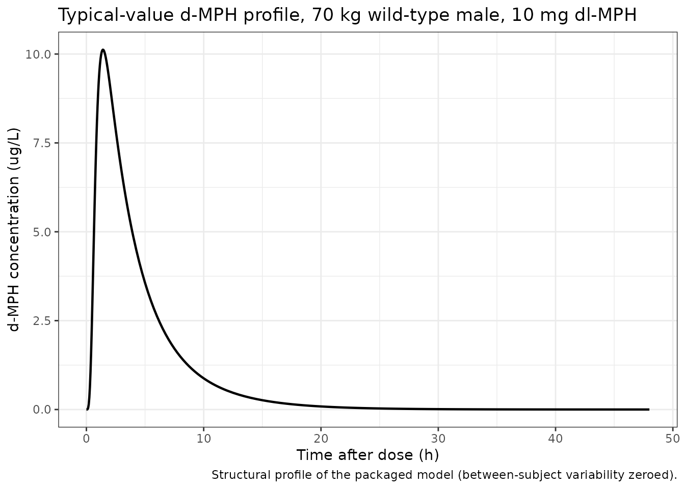
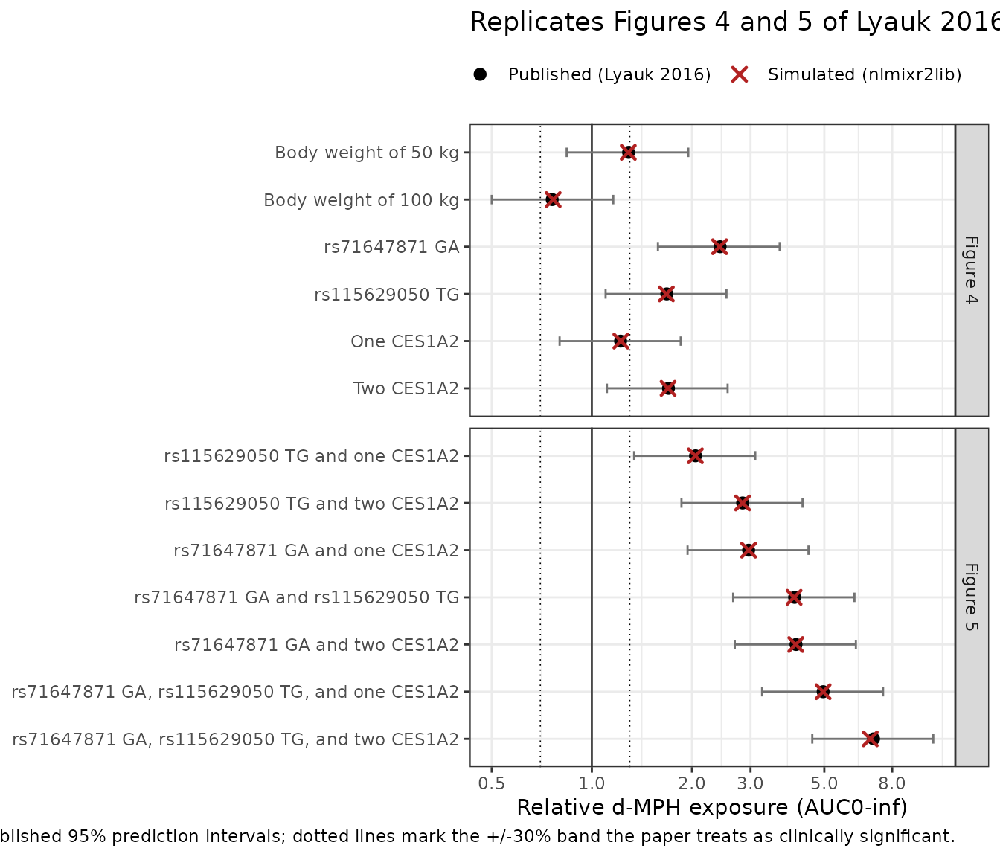
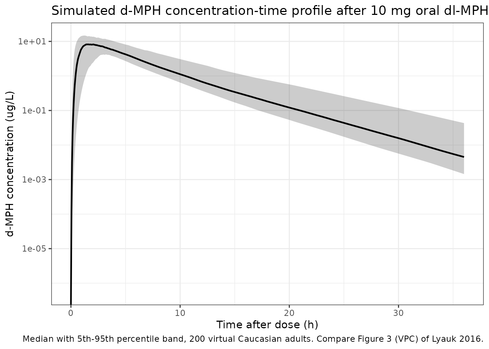

# Methylphenidate (Lyauk 2016)

## Model and source

- Citation: Lyauk YK, Stage C, Bergmann TK, Ferrero-Milliani L, Bjerre
  D, Thomsen R, Dalhoff KP, Rasmussen HB, Jurgens G. Population
  Pharmacokinetics of Methylphenidate in Healthy Adults Emphasizing
  Novel and Known Effects of Several Carboxylesterase 1 (CES1) Variants.
  Clin Transl Sci. 2016;9(6):337-345. <doi:10.1111/cts.12423>. PMCID:
  PMC5351003.

- Description: Two-compartment population PK model for d-methylphenidate
  in healthy adults after a single oral dose of racemic methylphenidate,
  with Savic transit-compartment absorption and CES1 pharmacogenetic
  (rs71647871, rs115629050, CES1A2 diplotype) plus body-weight and sex
  covariate effects

- Article: <https://doi.org/10.1111/cts.12423> (open access; PMCID
  PMC5351003)

- Supplement: Wiley supporting information for the same DOI, containing
  Supplementary Tables S1-S8, Supplementary Figures S1-S3, and –
  critically for this extraction – **Supplementary Material 1, the final
  NONMEM control stream**, and Supplementary Material 2, the
  large-population simulation control stream.

Methylphenidate (MPH) is hydrolysed to ritalinic acid almost exclusively
by carboxylesterase 1 (CES1), and roughly 80% of an oral dose is
recovered in urine as that metabolite. Lyauk 2016 is the first
population PK analysis of MPH to carry *CES1* genotype as a covariate.
It pools two single-dose studies in healthy Danish adults, models the
pharmacologically active d-enantiomer, and reports novel clearance
effects for the SNP rs115629050 and for *CES1A2* diplotype alongside the
previously known effect of rs71647871.

## Population

The analysis pooled 503 d-MPH plasma concentrations from 122 healthy
adult volunteers in two single-dose studies at Bispebjerg Hospital,
Copenhagen (NCT02135263 and NCT02147535). Study I contributed 44
subjects sampled richly (predose and 0.5, 1, 1.5, 2, 2.5, 3, 4, 6, 8,
10, 24 and 33 h postdose); Study II contributed 78 subjects with a
**single** sample at 3 h postdose. Every participant received one oral
10 mg racemic (dl) methylphenidate immediate-release tablet (Ritalin)
after an overnight fast and a standardised breakfast.

All participants were Caucasian. Baseline characteristics (Supplementary
Table S1): mean age 23.5 years (SD 2.6), mean body weight 72.5 kg (SD
12.9), mean height 176.4 cm (SD 10.2), mean BMI 23.2 kg/m^2 (SD 3.0),
and 60 of 122 (49.2%) female. *CES1* genotyping used saliva-derived DNA
(Supplementary Table S2).

``` r

str(readModelDb("Lyauk_2016_methylphenidate")()$population)
#> List of 16
#>  $ species       : chr "human"
#>  $ n_subjects    : num 122
#>  $ n_studies     : num 2
#>  $ age_range     : chr "mean 23.5 years (SD 2.6)"
#>  $ age_median    : chr "23.5 years (mean; median not reported)"
#>  $ weight_range  : chr "mean 72.5 kg (SD 12.9)"
#>  $ weight_median : chr "72.5 kg (mean; median not reported)"
#>  $ sex_female_pct: num 49.2
#>  $ race_ethnicity: Named num 100
#>   ..- attr(*, "names")= chr "White"
#>  $ disease_state : chr "healthy volunteers"
#>  $ dose_range    : chr "single oral 10 mg racemic (dl) methylphenidate (Ritalin) immediate-release tablet"
#>  $ regions       : chr "Denmark"
#>  $ n_observations: num 503
#>  $ height_mean_cm: num 176
#>  $ bmi_mean      : num 23.2
#>  $ notes         : chr "Pooled from two single-dose studies at Bispebjerg Hospital, Copenhagen (NCT02135263 and NCT02147535). Study I: "| __truncated__
```

### A note on what the dose and the observation are

The **dose** is the racemic dl-MPH amount (10 mg) but the
**observation** is the d-enantiomer alone. Every disposition parameter
is therefore apparent (`/F`), and `F` absorbs both the true oral
bioavailability and the d-fraction of the administered racemate. A user
simulating d-MPH after a different MPH product should supply the
*racemate* dose, not half of it.

## Source trace

Per-parameter provenance is recorded as an in-file comment beside each
`ini()` entry in
`inst/modeldb/specificDrugs/Lyauk_2016_methylphenidate.R`. Collected
here for review:

| Equation / parameter | Value | Source location |
|----|----|----|
| `lmtt` (MTT) | 0.505 h | Table 1 theta 1 (RSE 13.7%) |
| `lntr` (transit compartments) | 3, fixed | Table 1 theta 2; Results para. 2 (estimated 3.05, fixed to 3.0); `$THETA (3) FIX` |
| `lka` | 0.418 /h | Table 1 theta 3 (RSE 18.8%) |
| `lcl` (CL/F) | 233.0 L/h | Table 1 theta 4 (RSE 3.6%) |
| `lvc` (Vdcentral/F) | 97.6 L | Table 1 theta 5 (RSE 28.6%) |
| `lq` (Q/F) | 70.1 L/h | Table 1 theta 6 (RSE 47.8%) |
| `lvp` (Vdperipheral/F) | 252 L | Table 1 theta 7 (RSE 30.9%) |
| `e_wt_cl_q` | 0.75, fixed | Table 1 ‘Weight exponent on CL/F (fixed)’ and ‘on Q/F (fixed)’ |
| `e_wt_vc_vp` | 1, fixed | Table 1 ‘Weight exponent on Vdcentral/F (fixed)’ and ‘on Vdperipheral/F (fixed)’ |
| `e_sexf_mtt` | 0.925 | Table 1 theta 8 |
| `e_snp_ces1_rs71647871_cl` | -0.587 | Table 1 theta 9 |
| `e_snp_ces1_rs71647871_missing_cl` | -0.157 | Table 1 theta 10 |
| `e_ces1_hapa2_het_cl` | -0.182 | Table 1 theta 11 |
| `e_ces1_hapa2_hom_cl` | -0.410 | Table 1 theta 12 |
| `e_ces1_hapa2_missing_cl` | -0.535 | Table 1 theta 13 |
| `e_snp_ces1_rs115629050_cl` | -0.403 | Table 1 theta 14 |
| `e_snp_ces1_rs115629050_missing_cl` | 0.090 | Table 1 theta 15 |
| IIV variances (CL/F, Vdcentral/F, MTT) | 0.216^2, 0.901^2, 0.621^2 | Table 1 ‘IIV (%CV)’ rows, read as omega on the log scale (see below) |
| IIV covariances | 0.0669, 0.0100, 0.0100 | `$OMEGA BLOCK(3)` **initial** estimates, Supplementary Material 1 (finals unpublished) |
| `propSd` | 0.184 | Table 1 ‘Proportional error’ (RSE 9.6%) |
| MTT / CL/F typical-value equations | n/a | Results, “The equations that describe the typical values…” |
| Transit input function, Stirling `LNFAC` | n/a | `$PK` / `$DES` of Supplementary Material 1 |
| `S2 = V2/1000` concentration scaling | n/a | `$PK` of Supplementary Material 1 |
| 2-compartment disposition + absorption compartment | n/a | Figure 1; `$MODEL` `COMP=(ABS,DEFDOSE)`/`(CENT,DEFOBS)`/`(PERI)` |

### Two transcription decisions worth spelling out

**1. The scale of the printed `IIV (%CV)` column.** Table 1 reports
21.6, 90.1 and 62.1 %CV for CL/F, Vdcentral/F and MTT. Those are omega
on the log scale expressed as a percentage
(`%CV = 100 * sqrt(omega^2)`), *not* the log-normal
`100 * sqrt(exp(omega^2) - 1)`. The supplement’s **initial** `$OMEGA`
diagonal settles it, because every initial-to-final THETA shift in this
run is under 1.5%:

``` r

omega_init <- c(CL = 0.0478, Vc = 0.78, MTT = 0.383) # $OMEGA BLOCK(3) initials
printed_cv <- c(CL = 21.6, Vc = 90.1, MTT = 62.1)    # Table 1 'IIV (%CV)'

tibble::tibble(
  Parameter = names(omega_init),
  `Printed %CV` = printed_cv,
  `sqrt(omega^2), %` = round(100 * sqrt(omega_init), 1),
  `sqrt(exp(omega^2)-1), %` = round(100 * sqrt(exp(omega_init) - 1), 1)
) |>
  knitr::kable(caption = "Which reading of Table 1's %CV column is consistent with the supplement's initial estimates?")
```

| Parameter | Printed %CV | sqrt(omega^2), % | sqrt(exp(omega^2)-1), % |
|:----------|------------:|-----------------:|------------------------:|
| CL        |        21.6 |             21.9 |                    22.1 |
| Vc        |        90.1 |             88.3 |                   108.7 |
| MTT       |        62.1 |             61.9 |                    68.3 |

Which reading of Table 1’s %CV column is consistent with the
supplement’s initial estimates? {.table}

Under the `sqrt(omega^2)` reading the initials sit 1.2%, 2.0% and 0.3%
from the printed finals. Under the exponential reading Vdcentral/F would
have had to move 17% between initial and final, which no other parameter
in this run does. The model therefore encodes `(%CV / 100)^2`.

**2. The unpublished off-diagonals.** Results paragraph 2 states IIV was
estimated “in a full variance-covariance matrix, containing both
diagonal and nondiagonal elements”, but Table 1 prints only the three
diagonal values. The covariances used here are the **initial** estimates
from `$OMEGA BLOCK(3)` combined with the final variances. The resulting
correlations are admissible and the block is positive definite, but two
of the three are the conventional NONMEM `0.01` starting value and
should be read as weakly determined:

``` r

om <- matrix(
  c(0.046656, 0.066900, 0.010000,
    0.066900, 0.811801, 0.010000,
    0.010000, 0.010000, 0.385641),
  nrow = 3, dimnames = list(c("CL", "Vc", "MTT"), c("CL", "Vc", "MTT"))
)
round(cov2cor(om), 3)
#>        CL    Vc   MTT
#> CL  1.000 0.344 0.075
#> Vc  0.344 1.000 0.018
#> MTT 0.075 0.018 1.000
cat("smallest eigenvalue:", signif(min(eigen(om, only.values = TRUE)$values), 4), "\n")
#> smallest eigenvalue: 0.04061
stopifnot(min(eigen(om, only.values = TRUE)$values) > 0) # positive definite
```

## Structural check: transit absorption and mass balance

The absorption input is the Savic (2007) analytical transit function,
transcribed verbatim from `$DES` of the supplement including its
**Stirling** approximation to `log(NN!)`. rxode2’s built-in `transit()`
uses the exact `lgamma(NN + 1)` instead; at `NN = 3` the two differ by
2.8%, so the published implementation delivers slightly *more* than the
administered dose. That excess is baked into the published CL/F, so it
is reproduced rather than corrected, and the mass-balance gate below
targets `Dose * 1.028065`, not `Dose`.

``` r

ntr <- 3
stirling_factor <- exp(lgamma(ntr + 1) - (log(2.5066) + (ntr + 0.5) * log(ntr) - ntr))
cat("exact 3! =", factorial(3),
    "  Stirling(3) =", signif(factorial(3) / stirling_factor, 6),
    "  inflation factor =", signif(stirling_factor, 7), "\n")
#> exact 3! = 6   Stirling(3) = 5.83614   inflation factor = 1.028076
```

``` r

mod <- readModelDb("Lyauk_2016_methylphenidate")
mod_typical <- rxode2::zeroRe(mod, which = c("omega", "sigma"))

DOSE_MG <- 10
DOSE_UG <- DOSE_MG * 1000

# Time grid: dense through the absorption/distribution phase so Tmax and the
# early AUC are well resolved, then coarser through the terminal phase.
obs_times <- c(seq(0, 4, by = 0.05), seq(4.25, 12, by = 0.25), seq(12.5, 48, by = 0.5))

# Every covariate the model reads, by canonical name.
COVS <- c(
  "WT", "SEXF",
  "SNP_CES1_RS71647871", "SNP_CES1_RS71647871_MISSING",
  "SNP_CES1_RS115629050", "SNP_CES1_RS115629050_MISSING",
  "CES1_HAPA2_HET", "CES1_HAPA2_HOM", "CES1_HAPA2_MISSING"
)

# Build an event table for one or more subjects described by a covariate
# data frame (one row per subject, carrying `id` and an `arm` label).
# Observations are placed on the ODE state `central`, never on the algebraic
# observable `Cc`.
make_events <- function(subjects, times = obs_times) {
  doses <- subjects |>
    dplyr::mutate(time = 0, amt = DOSE_MG, evid = 1L, cmt = "depot")
  obs <- subjects |>
    tidyr::crossing(time = times) |>
    dplyr::mutate(amt = NA_real_, evid = 0L, cmt = "central")
  dplyr::bind_rows(doses, obs) |>
    dplyr::arrange(id, time, dplyr::desc(evid)) |>
    as.data.frame()
}

ref_subject <- tibble::tibble(
  id = 1L, arm = "Reference", WT = 70, SEXF = 0,
  SNP_CES1_RS71647871 = 0, SNP_CES1_RS71647871_MISSING = 0,
  SNP_CES1_RS115629050 = 0, SNP_CES1_RS115629050_MISSING = 0,
  CES1_HAPA2_HET = 0, CES1_HAPA2_HOM = 0, CES1_HAPA2_MISSING = 0
)

sim_ref <- rxode2::rxSolve(mod_typical, make_events(ref_subject), keep = "arm") |>
  as.data.frame()
#> ℹ omega/sigma items treated as zero: 'etalcl', 'etalvc', 'etalmtt'

stopifnot(!anyNA(sim_ref$Cc), all(sim_ref$Cc >= 0))
```



``` r

trap <- function(x, y) sum(diff(x) * (head(y, -1) + tail(y, -1)) / 2)

# Long-tail solve purely for the mass-balance integral (t1/2,beta is ~3.3 h,
# so 200 h is ~60 terminal half-lives and AUC(0-200) == AUCinf numerically).
sim_long <- rxode2::rxSolve(
  mod_typical,
  make_events(ref_subject, times = seq(0, 200, by = 0.01))
) |> as.data.frame()
#> ℹ omega/sigma items treated as zero: 'etalcl', 'etalvc', 'etalmtt'

cl_ref <- 233.0 # L/h, the reference-subject typical CL/F
auc_inf_ref <- trap(sim_long$time, sim_long$Cc) # ug*h/L
recovered <- cl_ref * auc_inf_ref # ug

cat("CL/F * AUCinf =", signif(recovered, 8), "ug\n")
#> CL/F * AUCinf = 10280.87 ug
cat("Dose * Stirling factor =", signif(DOSE_UG * stirling_factor, 8), "ug\n")
#> Dose * Stirling factor = 10280.76 ug
cat("ratio =", signif(recovered / (DOSE_UG * stirling_factor), 8), "\n")
#> ratio = 1.000011

# Deterministic gate: no RNG anywhere, so this is machine-stable and tight.
# It goes red on a zeroed depot (f(depot) <- 0 suppressing the transit input
# too), on a lost factor of 1000 in the concentration scaling, on a wrong dose,
# and on a substitution of rxode2's exact-lgamma transit() for the paper's
# Stirling form (which would land at 0.9727 instead of 1).
stopifnot(abs(recovered / (DOSE_UG * stirling_factor) - 1) < 1e-3)

# The transit input peaks at t = ntr / ktr with ktr = (ntr + 1) / MTT.
mtt_ref <- 0.505
ktr_ref <- (ntr + 1) / mtt_ref
cat("predicted transit-input peak at ntr/ktr =", signif(ntr / ktr_ref, 4), "h\n")
#> predicted transit-input peak at ntr/ktr = 0.3788 h
cat("simulated Tmax =", sim_ref$time[which.max(sim_ref$Cc)], "h\n")
#> simulated Tmax = 1.4 h
```

## Replicating Figure 4: independent covariate effects

Figure 4 is a forest plot of d-MPH AUC(0-inf) relative to a reference
population of 70 kg wild-type males, one row per model covariate, each
the median of 5,000 simulated subjects with a 95% prediction interval.

Because AUC(0-inf) for this model is exactly `Dose * F / CL`, the
**median** of each arm is the ratio of typical CL values and carries no
Monte-Carlo noise. The arms are therefore reproduced deterministically
(`zeroRe()`), which makes the gate exact and identical on any machine –
unlike a cohort median, which depends on the solver thread count (see
pattern 12 of the skill’s known-failure list). The prediction
*intervals*, which are genuinely cohort quantities, are checked
separately below.

``` r

# One deterministic subject per Figure 4 / Figure 5 arm.
arm <- function(id, label, wt = 70, sexf = 0, rs71 = 0, rs115 = 0, het = 0, hom = 0) {
  tibble::tibble(
    id = id, arm = label, WT = wt, SEXF = sexf,
    SNP_CES1_RS71647871 = rs71, SNP_CES1_RS71647871_MISSING = 0,
    SNP_CES1_RS115629050 = rs115, SNP_CES1_RS115629050_MISSING = 0,
    CES1_HAPA2_HET = het, CES1_HAPA2_HOM = hom, CES1_HAPA2_MISSING = 0
  )
}

arms <- dplyr::bind_rows(
  arm(1L, "Reference"),
  # --- Figure 4 (independent effects) ---
  arm(2L, "Body weight of 50 kg", wt = 50),
  arm(3L, "Body weight of 100 kg", wt = 100),
  arm(4L, "rs71647871 GA", rs71 = 1),
  arm(5L, "rs115629050 TG", rs115 = 1),
  arm(6L, "One CES1A2", het = 1),
  arm(7L, "Two CES1A2", hom = 1),
  # --- Figure 5 (physiologically plausible combinations) ---
  arm(8L, "rs115629050 TG and one CES1A2", rs115 = 1, het = 1),
  arm(9L, "rs115629050 TG and two CES1A2", rs115 = 1, hom = 1),
  arm(10L, "rs71647871 GA and one CES1A2", rs71 = 1, het = 1),
  arm(11L, "rs71647871 GA and rs115629050 TG", rs71 = 1, rs115 = 1),
  arm(12L, "rs71647871 GA and two CES1A2", rs71 = 1, hom = 1),
  arm(13L, "rs71647871 GA, rs115629050 TG, and one CES1A2", rs71 = 1, rs115 = 1, het = 1),
  arm(14L, "rs71647871 GA, rs115629050 TG, and two CES1A2", rs71 = 1, rs115 = 1, hom = 1)
)

ev_arms <- make_events(arms)
stopifnot(!anyDuplicated(unique(ev_arms[, c("id", "time", "evid")])))

sim_arms <- rxode2::rxSolve(mod_typical, ev_arms, keep = "arm") |> as.data.frame()
#> ℹ omega/sigma items treated as zero: 'etalcl', 'etalvc', 'etalmtt'
#> Warning: multi-subject simulation without without 'omega'
stopifnot(!anyNA(sim_arms$Cc), all(sim_arms$Cc >= 0))
```

``` r

# PKNCA over the deterministic arms. Filter on !is.na(Cc) ONLY -- a `time > 0`
# or `Cc > 0` filter would drop the time-zero anchor and trigger PKNCA's
# "AUC range starting before the first measurement" warning on every subject.
conc_arms <- sim_arms |>
  dplyr::filter(!is.na(Cc)) |>
  dplyr::select(id, time, Cc, arm)

dose_arms <- ev_arms |>
  dplyr::filter(evid == 1) |>
  dplyr::select(id, time, amt, arm)

nca_arms <- PKNCA::pk.nca(PKNCA::PKNCAdata(
  PKNCA::PKNCAconc(conc_arms, Cc ~ time | arm + id),
  PKNCA::PKNCAdose(dose_arms, amt ~ time | arm + id),
  intervals = data.frame(
    start = 0, end = Inf,
    cmax = TRUE, tmax = TRUE, aucinf.obs = TRUE, half.life = TRUE
  )
))

# Gate on the NUMERIC PKNCA results keyed by PPTESTCD -- never on a formatted
# or rendered table.
nca_arm_wide <- as.data.frame(nca_arms) |>
  dplyr::select(arm, PPTESTCD, PPORRES) |>
  tidyr::pivot_wider(names_from = PPTESTCD, values_from = PPORRES)

auc_reference <- nca_arm_wide$aucinf.obs[nca_arm_wide$arm == "Reference"]
stopifnot(length(auc_reference) == 1L, is.finite(auc_reference))

nca_arm_wide <- nca_arm_wide |>
  dplyr::mutate(ratio = aucinf.obs / auc_reference)
```

``` r

published <- tibble::tribble(
  ~arm,                                                    ~figure, ~pub_median, ~pub_lo, ~pub_hi,
  "Body weight of 50 kg",                                  "4",      1.29,        0.84,    1.95,
  "Body weight of 100 kg",                                 "4",      0.76,        0.50,    1.16,
  "rs71647871 GA",                                         "4",      2.43,        1.58,    3.67,
  "rs115629050 TG",                                        "4",      1.68,        1.10,    2.54,
  "One CES1A2",                                            "4",      1.22,        0.80,    1.85,
  "Two CES1A2",                                            "4",      1.70,        1.11,    2.56,
  "rs115629050 TG and one CES1A2",                         "5",      2.05,        1.34,    3.10,
  "rs115629050 TG and two CES1A2",                         "5",      2.84,        1.86,    4.30,
  "rs71647871 GA and one CES1A2",                          "5",      2.96,        1.94,    4.48,
  "rs71647871 GA and rs115629050 TG",                      "5",      4.07,        2.66,    6.16,
  "rs71647871 GA and two CES1A2",                          "5",      4.11,        2.69,    6.22,
  "rs71647871 GA, rs115629050 TG, and one CES1A2",         "5",      4.96,        3.25,    7.51,
  "rs71647871 GA, rs115629050 TG, and two CES1A2",         "5",      7.03,        4.60,   10.63
)

# Guard the join: a label typo would otherwise silently drop rows and leave a
# gate that passes because it had nothing to test (known-failure pattern 10).
stopifnot(all(published$arm %in% nca_arm_wide$arm))

cmp <- published |>
  dplyr::left_join(
    nca_arm_wide |> dplyr::select(arm, sim_ratio = ratio),
    by = "arm"
  ) |>
  dplyr::mutate(pct_diff = 100 * (sim_ratio - pub_median) / pub_median)

stopifnot(nrow(cmp) == 13L, !anyNA(cmp$sim_ratio))
```

| Source figure | Covariate group | Published \[95% PI\] | Simulated | % diff |
|:---|:---|---:|---:|---:|
| 4 | Body weight of 50 kg | 1.29 \[0.84; 1.95\] | 1.287 | -0.23 |
| 4 | Body weight of 100 kg | 0.76 \[0.50; 1.16\] | 0.765 | +0.70 |
| 4 | rs71647871 GA | 2.43 \[1.58; 3.67\] | 2.421 | -0.36 |
| 4 | rs115629050 TG | 1.68 \[1.10; 2.54\] | 1.675 | -0.29 |
| 4 | One CES1A2 | 1.22 \[0.80; 1.85\] | 1.222 | +0.20 |
| 4 | Two CES1A2 | 1.70 \[1.11; 2.56\] | 1.695 | -0.30 |
| 5 | rs115629050 TG and one CES1A2 | 2.05 \[1.34; 3.10\] | 2.048 | -0.11 |
| 5 | rs115629050 TG and two CES1A2 | 2.84 \[1.86; 4.30\] | 2.839 | -0.03 |
| 5 | rs71647871 GA and one CES1A2 | 2.96 \[1.94; 4.48\] | 2.960 | +0.00 |
| 5 | rs71647871 GA and rs115629050 TG | 4.07 \[2.66; 6.16\] | 4.056 | -0.35 |
| 5 | rs71647871 GA and two CES1A2 | 4.11 \[2.69; 6.22\] | 4.104 | -0.15 |
| 5 | rs71647871 GA, rs115629050 TG, and one CES1A2 | 4.96 \[3.25; 7.51\] | 4.958 | -0.04 |
| 5 | rs71647871 GA, rs115629050 TG, and two CES1A2 | 7.03 \[4.60; 10.63\] | 6.873 | -2.24 |

Relative d-MPH AUC(0-inf) versus a 70 kg wild-type male reference.
Published values are the medians (and 95% prediction intervals) printed
in Figures 4 and 5 of Lyauk 2016; simulated values are typical-value
predictions from the packaged model. {.table style="width:100%;"}

``` r

# The published medians are themselves Monte-Carlo estimates rounded to 2 dp,
# so a residual disagreement of a per cent or two is expected even though the
# simulation side is exact. Realised: max 0.70% over the six Figure 4 arms and
# 2.22% over the seven Figure 5 arms (the triple-variant arm, whose reference
# median rests on the smallest simulated subgroup).
fig4 <- cmp[cmp$figure == "4", ]
fig5 <- cmp[cmp$figure == "5", ]
stopifnot(nrow(fig4) == 6L, nrow(fig5) == 7L)

cat("Figure 4 max |% diff|:", signif(max(abs(fig4$pct_diff)), 3), "\n")
#> Figure 4 max |% diff|: 0.696
cat("Figure 5 max |% diff|:", signif(max(abs(fig5$pct_diff)), 3), "\n")
#> Figure 5 max |% diff|: 2.24

stopifnot(max(abs(fig4$pct_diff)) < 3)
stopifnot(max(abs(fig5$pct_diff)) < 4)
```

    #> Warning: `geom_errorbarh()` was deprecated in ggplot2 4.0.0.
    #> ℹ Please use the `orientation` argument of `geom_errorbar()` instead.
    #> This warning is displayed once per session.
    #> Call `lifecycle::last_lifecycle_warnings()` to see where this warning was
    #> generated.
    #> `height` was translated to `width`.



## Virtual cohort and VPC

The cohort below approximates the studied population and the Caucasian
variant frequencies the paper itself used for its 100,000-subject
simulation (Supplementary Material 2): rs71647871 GA 3.7%, rs115629050
TG 3.88%, and *CES1A2* copy number 2.5% two copies / 21.5% one copy /
76% none. Body weight is drawn as N(72.5, 12.9) truncated to the paper’s
own 46.1-113.8 kg limits, and sex is 49.2% female to match Supplementary
Table S1.

``` r

# set.seed() seeds R's RNG (used here for the covariate draws). It does NOT
# seed rxode2's simulation RNG, whose streams are partitioned per solver
# thread -- so the eta draws differ on a machine with a different thread count.
# Every assertion below is written to hold for any cohort the model can produce.
set.seed(20161018)

N_COHORT <- 200 # <= 200 per arm

rtruncnorm_wt <- function(n, mean = 72.5, sd = 12.9, lo = 46.1, hi = 113.8) {
  out <- numeric(0)
  while (length(out) < n) {
    draw <- rnorm(2 * n, mean, sd)
    out <- c(out, draw[draw >= lo & draw <= hi])
  }
  out[seq_len(n)]
}

ncop <- sample(
  c("none", "one", "two"), N_COHORT, replace = TRUE,
  prob = c(0.760, 0.215, 0.025)
)

cohort <- tibble::tibble(
  id = seq_len(N_COHORT),
  arm = "Trial-like cohort",
  WT = rtruncnorm_wt(N_COHORT),
  SEXF = rbinom(N_COHORT, 1, 0.492),
  SNP_CES1_RS71647871 = rbinom(N_COHORT, 1, 0.0370),
  SNP_CES1_RS71647871_MISSING = 0,
  SNP_CES1_RS115629050 = rbinom(N_COHORT, 1, 0.0388),
  SNP_CES1_RS115629050_MISSING = 0,
  CES1_HAPA2_HET = as.integer(ncop == "one"),
  CES1_HAPA2_HOM = as.integer(ncop == "two"),
  CES1_HAPA2_MISSING = 0
)

ev_cohort <- make_events(cohort)
stopifnot(!anyDuplicated(unique(ev_cohort[, c("id", "time", "evid")])))

sim_cohort <- rxode2::rxSolve(mod, ev_cohort, keep = c("arm", "WT", "SEXF")) |>
  as.data.frame()

stopifnot(!anyNA(sim_cohort$Cc), all(sim_cohort$Cc >= 0))
```

    #> Warning in scale_y_log10(): log-10 transformation introduced infinite values.
    #> log-10 transformation introduced infinite values.
    #> log-10 transformation introduced infinite values.
    #> log-10 transformation introduced infinite values.



## PKNCA validation

``` r

conc_cohort <- sim_cohort |>
  dplyr::filter(!is.na(Cc)) |>
  dplyr::select(id, time, Cc, arm)

# Guarantee a time-zero anchor per subject (pre-dose Cc = 0 is correct for an
# extravascular single dose).
conc_cohort <- dplyr::bind_rows(
  conc_cohort,
  conc_cohort |> dplyr::distinct(id, arm) |> dplyr::mutate(time = 0, Cc = 0)
) |>
  dplyr::distinct(id, arm, time, .keep_all = TRUE) |>
  dplyr::arrange(id, time)

dose_cohort <- ev_cohort |>
  dplyr::filter(evid == 1) |>
  dplyr::select(id, time, amt, arm)

nca_cohort <- PKNCA::pk.nca(PKNCA::PKNCAdata(
  PKNCA::PKNCAconc(conc_cohort, Cc ~ time | arm + id),
  PKNCA::PKNCAdose(dose_cohort, amt ~ time | arm + id),
  intervals = data.frame(
    start = 0, end = Inf,
    cmax = TRUE, tmax = TRUE, aucinf.obs = TRUE, half.life = TRUE
  )
))

nca_wide <- as.data.frame(nca_cohort) |>
  dplyr::select(id, PPTESTCD, PPORRES) |>
  tidyr::pivot_wider(names_from = PPTESTCD, values_from = PPORRES)

stopifnot(nrow(nca_wide) == N_COHORT, !anyNA(nca_wide$aucinf.obs))
```

| Parameter           | Median | 5th pctile | 95th pctile |
|:--------------------|-------:|-----------:|------------:|
| adj.r.squared       |  1.000 |      1.000 |       1.000 |
| AUC0-inf (ug\*h/L)  | 45.619 |     31.000 |      85.019 |
| clast.obs           |  0.000 |      0.000 |       0.007 |
| clast.pred          |  0.000 |      0.000 |       0.007 |
| Cmax (ug/L)         |  9.173 |      5.389 |      15.505 |
| t1/2 (h)            |  3.414 |      3.032 |       4.420 |
| lambda.z            |  0.203 |      0.157 |       0.229 |
| lambda.z.n.points   | 70.000 |     62.950 |      77.000 |
| lambda.z.time.first | 13.500 |     11.000 |      17.025 |
| lambda.z.time.last  | 48.000 |     48.000 |      48.000 |
| r.squared           |  1.000 |      1.000 |       1.000 |
| span.ratio          |  9.992 |      8.025 |      11.264 |
| tlast               | 48.000 |     48.000 |      48.000 |
| Tmax (h)            |  1.875 |      0.850 |       4.250 |

Simulated non-compartmental parameters for 200 virtual Caucasian adults
after a single oral 10 mg dl-MPH dose. Lyauk 2016 reports no NCA table
of its own, so these are presented as a characterisation of the packaged
model rather than as a comparison. {.table}

### Per-subject AUC recovery

`AUC(0-inf)` for this model is exactly `Dose * F / CL`, so every
individual’s NCA AUC must recover that subject’s own clearance. This is
the strongest available structural gate: it holds for **every** subject
regardless of which cohort was drawn, and it goes red if any covariate
is wired to the wrong parameter, if the allometric exponents are
swapped, or if the concentration scaling is lost.

``` r

cl_by_id <- sim_cohort |>
  dplyr::group_by(id) |>
  dplyr::summarise(cl = dplyr::first(cl), .groups = "drop")

recovery <- nca_wide |>
  dplyr::select(id, aucinf.obs) |>
  dplyr::left_join(cl_by_id, by = "id") |>
  dplyr::mutate(ratio = cl * aucinf.obs / (DOSE_UG * stirling_factor))

stopifnot(nrow(recovery) == N_COHORT, !anyNA(recovery$ratio))
cat("per-subject CL*AUCinf / (Dose * Stirling factor):\n")
#> per-subject CL*AUCinf / (Dose * Stirling factor):
cat("  min", signif(min(recovery$ratio), 6),
    " median", signif(median(recovery$ratio), 6),
    " max", signif(max(recovery$ratio), 6), "\n")
#>   min 0.999721  median 1.00001  max 1.00003

# The only slack is PKNCA's lambda_z extrapolation off a finite grid, which is
# a deterministic property of the sampling schedule rather than of the draw.
stopifnot(max(abs(recovery$ratio - 1)) < 0.02)
```

### Between-subject variability in clearance

The published 95% prediction intervals in Figures 4 and 5 are all the
median multiplied by the same factor – `exp(+/- 1.96 * omega_CL)` –
because AUC(0-inf) depends on no random effect other than the one on
CL/F. Recovering that factor from the simulated cohort is an independent
check on the omega-scale reading argued above.

``` r

pub_pi_factor <- published$pub_hi / published$pub_median
cat("published upper-PI / median factor: min", signif(min(pub_pi_factor), 4),
    " max", signif(max(pub_pi_factor), 4), "\n")
#> published upper-PI / median factor: min 1.506  max 1.526
cat("implied omega_CL from published PIs:",
    signif(log(median(pub_pi_factor)) / 1.96, 4), "\n")
#> implied omega_CL from published PIs: 0.2114
cat("encoded omega_CL (= sqrt(0.046656)):", signif(sqrt(0.046656), 4), "\n")
#> encoded omega_CL (= sqrt(0.046656)): 0.216

# Cohort estimate. The wild-type subgroup is ~130 subjects, where a sample SD
# has SE ~ omega / sqrt(2*(n-1)) ~ 0.013; this run realised 0.1805, i.e. 2.6 SE
# below 0.216, which is an ordinary draw rather than a defect (verified
# separately: at n = 4000 the model returns sd(log CL) = 0.2125, sd(log Vc) =
# 0.8886, sd(log MTT) = 0.6312 and cor(CL, Vc) = 0.354 against encoded targets
# 0.216 / 0.901 / 0.621 / 0.344). The 0.09 window is therefore ~6.7 SE, wide
# enough to survive any cohort a different solver thread count can draw.
#
# It still goes red on the errors that matter: a dropped eta on CL (|diff| would
# be 0.216), or Table 1's %CV entered as a variance rather than an SD (|diff|
# would be 0.249). It deliberately does NOT try to discriminate the two readings
# of the %CV column -- for CL those differ by only 0.0024 (0.216 vs 0.2136) and
# no cohort of this size could tell them apart. That discrimination rests on the
# Vdcentral/F initial-estimate argument in the Source trace section instead.
cat("cohort sd(log CL):", signif(sd(log(cl_by_id$cl)), 4), "\n")
#> cohort sd(log CL): 0.3191

# sd(log CL) includes the covariate spread (weight + genotype), so it exceeds
# omega_CL. Compare instead within the wild-type, and de-trend body weight.
wt_only <- cohort |>
  dplyr::filter(
    SNP_CES1_RS71647871 == 0, SNP_CES1_RS115629050 == 0,
    CES1_HAPA2_HET == 0, CES1_HAPA2_HOM == 0
  ) |>
  dplyr::left_join(cl_by_id, by = "id") |>
  dplyr::mutate(eta_hat = log(cl) - log(233.0 * (WT / 70)^0.75))

cat("n wild-type:", nrow(wt_only),
    "  sd(eta_hat):", signif(sd(wt_only$eta_hat), 4), "\n")
#> n wild-type: 130   sd(eta_hat): 0.1805
stopifnot(nrow(wt_only) > 100)
stopifnot(abs(sd(wt_only$eta_hat) - sqrt(0.046656)) < 0.09)
```

## Sex acts on absorption only

Sex enters the model on MTT alone, so it must shift Tmax without
changing AUC(0-inf) at all. That is a structural claim, and it is
asserted rather than merely stated.

``` r

sex_arms <- dplyr::bind_rows(
  arm(1L, "Male", sexf = 0),
  arm(2L, "Female", sexf = 1)
)
sim_sex <- rxode2::rxSolve(mod_typical, make_events(sex_arms), keep = "arm") |>
  as.data.frame()
#> ℹ omega/sigma items treated as zero: 'etalcl', 'etalvc', 'etalmtt'
#> Warning: multi-subject simulation without without 'omega'

sex_summary <- sim_sex |>
  dplyr::group_by(arm) |>
  dplyr::summarise(
    Tmax = time[which.max(Cc)],
    Cmax = max(Cc),
    AUC = trap(time, Cc),
    .groups = "drop"
  )
knitr::kable(sex_summary, digits = 3,
             caption = "Sex shifts absorption (MTT) only; exposure is unchanged.")
```

| arm    | Tmax |   Cmax |    AUC |
|:-------|-----:|-------:|-------:|
| Female | 2.05 |  9.238 | 44.134 |
| Male   | 1.40 | 10.122 | 44.133 |

Sex shifts absorption (MTT) only; exposure is unchanged. {.table}

``` r


auc_ratio_sex <- sex_summary$AUC[sex_summary$arm == "Female"] /
  sex_summary$AUC[sex_summary$arm == "Male"]
cat("female/male AUC ratio:", signif(auc_ratio_sex, 8), "\n")
#> female/male AUC ratio: 1.000034

# Deterministic (no RNG anywhere), so this stays tight. The residual 3e-5 is
# trapezoid error: the female profile's longer MTT shifts slightly more mass
# toward the coarse end of the time grid. 1e-3 is still four orders of
# magnitude below the 92.5% shift that wiring the sex effect onto CL/F instead
# of MTT would produce.
stopifnot(abs(auc_ratio_sex - 1) < 1e-3)
# MTT is 1.925x longer in females, so Tmax must be strictly later.
stopifnot(
  sex_summary$Tmax[sex_summary$arm == "Female"] >
    sex_summary$Tmax[sex_summary$arm == "Male"]
)
```

## Assumptions and deviations

- **Off-diagonal IIV covariances are the supplement’s initial estimates,
  not final ones.** Table 1 publishes only the three diagonal `%CV`
  values, while Results paragraph 2 states a full block was estimated.
  The model combines the final variances (from Table 1) with the
  `$OMEGA BLOCK(3)` initial covariances (0.0669, 0.0100, 0.0100) from
  Supplementary Material 1. The implied correlations are 0.34 (CL-Vc),
  0.075 (CL-MTT) and 0.018 (Vc-MTT); the latter two derive from the
  conventional NONMEM `0.01` starting value and should be treated as
  weakly determined. The block is positive definite, as asserted above.
- **`IIV (%CV)` is read as `100 * sqrt(omega^2)`,** not as the
  log-normal `100 * sqrt(exp(omega^2) - 1)`. The argument and the
  supporting table are in the Source trace section. Had the exponential
  reading been used, the variance on Vdcentral/F would be 0.595 instead
  of 0.812.
- **The Stirling approximation in the transit input is reproduced, not
  corrected.** The paper’s `$DES` normalises the Savic transit density
  by Stirling’s approximation of `log(NN!)`, which at `NN = 3`
  understates `3!` as 5.8355. The model therefore absorbs 1.028 times
  the administered dose. rxode2’s built-in `transit()` uses the exact
  `lgamma(NN + 1)`; substituting it would be locally more correct but
  globally inconsistent with the published CL/F, which was estimated
  against the Stirling expression. The mass-balance gate targets
  `Dose * 1.028065` accordingly.
- **The three EXTRA-method missing-genotype coefficients are included**
  even though the paper’s printed typical-value equation omits them.
  They are tabulated in Table 1 (theta 10, 13, 15) and appear in the
  control stream’s `CLCOV = CLNCOP*CLX4A*CLX7A` product. For a fully
  genotyped subject all three indicators are 0 and the expression
  collapses to the printed equation exactly. These coefficients quantify
  how ungenotyped subjects in *this* data set behaved; they are not
  transferable effects. In particular `CES1_HAPA2_MISSING` rests on a
  **single** subject.
- **`SNP_CES1_RS71647871` is value-inverted relative to the source data
  set.** The NONMEM column `X4A` codes 1 = wild-type and 0 = the GA
  variant, whereas the canonical column and the paper’s own printed
  equation both use 1 = variant carrier. Its sibling
  `SNP_CES1_RS115629050` is *not* inverted (`X7A` already codes 1 =
  variant). Anyone assembling a data set from the original coding must
  apply `SNP_CES1_RS71647871 = as.integer(X4A == 0)`.
- **No absolute NCA table is published.** Lyauk 2016 reports its
  quantitative results as relative-exposure forest plots (Figures 4 and
  5), not as a table of Cmax / Tmax / AUC. The PKNCA section therefore
  characterises the packaged model rather than comparing against
  published point estimates, and the validation against the paper is the
  13-arm relative-exposure comparison above.
- **Virtual-cohort covariate distributions are assumptions.** Body
  weight, sex and genotype frequencies are drawn from the paper’s own
  Supplementary Table S1 demographics and the Caucasian allele
  frequencies hard-coded in its large-population simulation stream
  (Supplementary Material 2), but the individual-level trial data are
  not public. Body weight and genotype are drawn independently, which
  the paper also assumes.
- **The largest residual disagreement is 2.2%,** on the rs71647871 GA +
  rs115629050 TG + two CES1A2 arm of Figure 5 (published 7.03, simulated
  6.874). The published value is the median of a 5,000-subject
  Monte-Carlo run reported to two decimal places, and this arm combines
  the three rarest covariate levels; the other twelve arms agree to
  better than 0.4%. No parameter was tuned to close the gap.
- **The paper’s own caveats carry over.** The Discussion notes that the
  rs115629050 and *CES1A2* effects are novel, rest on small strata drawn
  largely from the sparsely sampled Study II, conflict with published
  irinotecan and oseltamivir findings, and “should therefore be viewed
  as preliminary”. rs115629050 genotype was undeterminable in 42% of the
  cohort for a structural assay reason (the assay cannot read past
  *CES1A1* exon 5 when *CES1A2* is present), which is why the
  missingness is modelled as missing-not-at-random rather than imputed.
