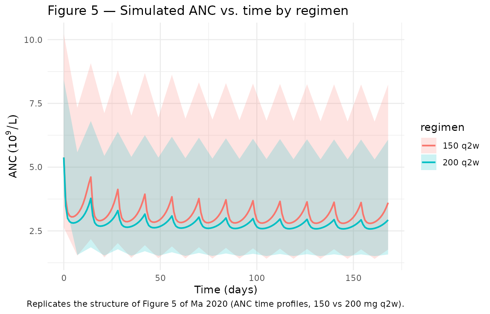
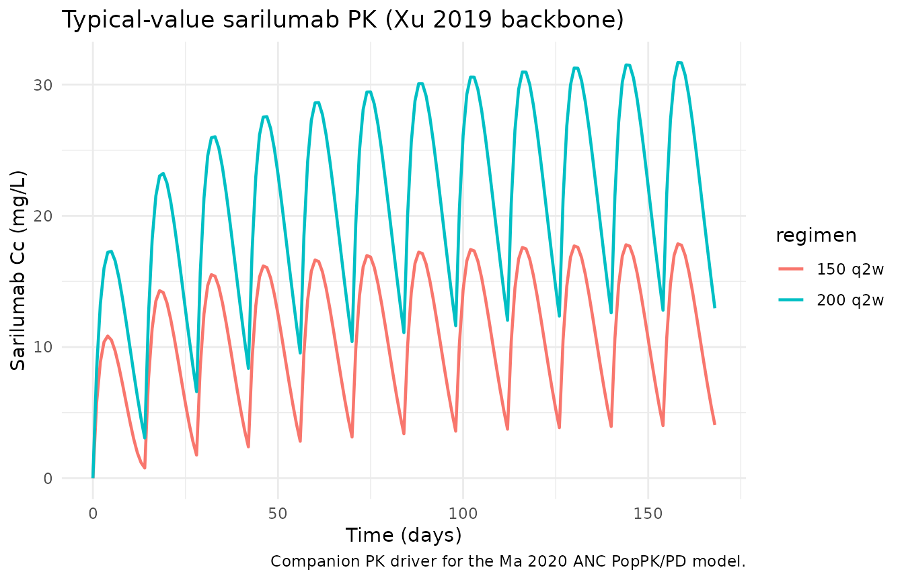

# Ma_2020_sarilumab_anc

``` r
library(nlmixr2lib)
library(rxode2)
#> rxode2 5.0.2 using 2 threads (see ?getRxThreads)
#>   no cache: create with `rxCreateCache()`
library(dplyr)
#> 
#> Attaching package: 'dplyr'
#> The following objects are masked from 'package:stats':
#> 
#>     filter, lag
#> The following objects are masked from 'package:base':
#> 
#>     intersect, setdiff, setequal, union
library(tidyr)
library(ggplot2)
library(PKNCA)
#> 
#> Attaching package: 'PKNCA'
#> The following object is masked from 'package:stats':
#> 
#>     filter
```

## Sarilumab PopPK/PD for absolute neutrophil count (ANC)

The model is a semi-mechanistic indirect-response PopPK/PD model in
which sarilumab concentrations **stimulate** the first-order elimination
rate of absolute neutrophil count (ANC) — mechanistically, margination
of functional neutrophils from circulation to the vascular wall or
tissue (Ma 2020). The sarilumab PK backbone is the two-compartment model
with first-order absorption and parallel linear + Michaelis–Menten
elimination published by Xu et al. 2019 (companion paper from the same
sponsor).

- Ma 2020: [Clin Pharmacokinet
  59(11):1451–1466](https://doi.org/10.1007/s40262-020-00899-7) (PMID
  32451909).
- Xu 2019: [Clin Pharmacokinet
  58(11):1455–1467](https://doi.org/10.1007/s40262-019-00765-1) (PMID
  31055792).

``` r
mod <- readModelDb("Ma_2020_sarilumab_anc")
cat(rxode2::rxode(mod)$reference, sep = "\n")
#> ℹ parameter labels from comments will be replaced by 'label()'
#> Ma L, Xu C, Paccaly A, Kanamaluru V. Population Pharmacokinetic-Pharmacodynamic Relationships of Sarilumab Using Disease Activity Score 28-Joint C-Reactive Protein and Absolute Neutrophil Counts in Patients with Rheumatoid Arthritis. Clin Pharmacokinet. 2020;59(11):1451-1466. doi:10.1007/s40262-020-00899-7 (PMID 32451909). PK backbone: Xu C, Su Y, Paccaly A, Kanamaluru V. Population Pharmacokinetics of Sarilumab in Patients with Rheumatoid Arthritis. Clin Pharmacokinet. 2019;58(11):1455-1467. doi:10.1007/s40262-019-00765-1 (PMID 31055792).
```

## Population

The ANC model was developed from 1672 patients with rheumatoid arthritis
pooled across one phase I (NCT01011959), one phase II (NCT01061736 Part
A), and three phase III studies (NCT01061736 Part B \[MOBILITY\],
NCT01709578 \[TARGET\], NCT01768572 \[ASCERTAIN\]); Ma 2020 Table 1.
Baseline demographics (Ma 2020 Table 2): mean age 51.7 years (SD 12.1);
mean weight 74.1 kg (SD 18.7); 82.2% female; 84.8% Caucasian; 14.2%
smokers; 97.7% on concomitant methotrexate; 63.8% with prior
corticosteroid treatment; mean baseline ANC 5.38 × 10⁹/L (Table 4).

## Source trace

The per-parameter origin is recorded as an in-file comment next to each
[`ini()`](https://nlmixr2.github.io/rxode2/reference/ini.html) entry in
`inst/modeldb/specificDrugs/Ma_2020_sarilumab_anc.R`. The table below
collects them in one place for review.

| Equation / parameter                                   | Value                                                                          | Source location                                                 |
|--------------------------------------------------------|--------------------------------------------------------------------------------|-----------------------------------------------------------------|
| PK structure (2-cmt SC, linear + MM)                   | n/a                                                                            | Xu 2019 Fig. 1 (base model scheme)                              |
| Vm (mg/day)                                            | 8.06                                                                           | Xu 2019 Table 3                                                 |
| Km (mg/L)                                              | 0.939                                                                          | Xu 2019 Table 3                                                 |
| Vc/F (L)                                               | 2.08                                                                           | Xu 2019 Table 3                                                 |
| CLO/F (L/day)                                          | 0.260                                                                          | Xu 2019 Table 3                                                 |
| Ka (1/day)                                             | 0.136                                                                          | Xu 2019 Table 3                                                 |
| Q/F (L/day)                                            | 0.156                                                                          | Xu 2019 Table 3                                                 |
| Vp/F (L)                                               | 5.23                                                                           | Xu 2019 Table 3                                                 |
| PK IIV (CV% on Vm, CLO, Vc, Ka; block Vm/CLO r=-0.566) | 32.4 / 55.3 / 37.3 / 32.1                                                      | Xu 2019 Table 3                                                 |
| PK residual error (log-scale variance → proportional)  | σ² = 0.395 → propSd ≈ 0.629                                                    | Xu 2019 Table 3                                                 |
| PD structure (indirect response, stim on Kout)         | Eff = Emax·C^(γ/(EC50)γ+C^γ); dANC/dt = Kin − Kout·(1+Eff)·ANC                 | Ma 2020 Fig. 1 + methods text                                   |
| Baseline ANC BASE (10⁹/L)                              | 5.38                                                                           | Ma 2020 Table 4                                                 |
| Emax (unitless)                                        | 1.50                                                                           | Ma 2020 Table 4                                                 |
| EC50 (mg/L)                                            | 10.3                                                                           | Ma 2020 Table 4                                                 |
| **Kout (1/day)**                                       | **2.11 (corrected from published typo “211”; see Assumptions and deviations)** | **Ma 2020 Table 4 (bootstrap median; published estimate 2.17)** |
| γ Hill coefficient                                     | 0.862                                                                          | Ma 2020 Table 4                                                 |
| Smoking on BASE (power)                                | 1.15                                                                           | Ma 2020 Table 4                                                 |
| Weight on Kout (power, ref 71 kg)                      | 0.875                                                                          | Ma 2020 Table 4 (footnote b)                                    |
| PRICORT on Emax (power)                                | 0.819                                                                          | Ma 2020 Table 4                                                 |
| PD IIV (CV% on BASE, Emax, EC50, Kout, γ)              | 32.1 / 61.9 / 36.9 / 227 / 80.4                                                | Ma 2020 Table 4                                                 |
| PD residual error (proportional, CV%)                  | 28.2                                                                           | Ma 2020 Table 4                                                 |

### Covariate column naming

| Source column | Canonical column used here                            |
|---------------|-------------------------------------------------------|
| Body weight   | `WT` (kg; reference 71 kg)                            |
| Smoking       | `SMOKE` (new canonical; see `covariate-columns.md`)   |
| PRICORT       | `PRICORT` (new canonical; see `covariate-columns.md`) |

## Virtual cohort

The original observed data are not public. The cohort below draws
subjects whose covariate distributions approximate the Ma 2020 ANC
dataset (Table 2).

``` r
set.seed(2020)
n_subj <- 100
regimens <- c("150 q2w", "200 q2w")

pop <- tibble(
  id      = seq_len(n_subj),
  WT      = pmax(40, pmin(140, round(rnorm(n_subj, mean = 74.1, sd = 18.7), 1))),
  SMOKE   = rbinom(n_subj, 1, 0.142),
  PRICORT = rbinom(n_subj, 1, 0.638),
  regimen = rep(regimens, length.out = n_subj)
) |>
  mutate(
    dose_mg = ifelse(regimen == "150 q2w", 150, 200)
  )
head(pop)
#> # A tibble: 6 × 6
#>      id    WT SMOKE PRICORT regimen dose_mg
#>   <int> <dbl> <int>   <int> <chr>     <dbl>
#> 1     1  81.1     0       1 150 q2w     150
#> 2     2  79.7     0       1 200 q2w     200
#> 3     3  53.6     0       1 150 q2w     150
#> 4     4  53       0       1 200 q2w     200
#> 5     5  40       0       1 150 q2w     150
#> 6     6  87.6     0       0 200 q2w     200
```

## Simulation

Build one event table per subject (dose every 14 days for 24 weeks, with
Cc and ANC sampled weekly) and solve each subject independently, then
concatenate. This per-subject loop sidesteps a pre-existing rxode2 issue
in which multi-endpoint models with more than two subjects in a single
`rxSolve` call abort in the C solver. Each call samples a fresh set of
IIV etas from the model’s omega specification, so the pooled result is
equivalent to the typical “sample N subjects” workflow.

``` r
mod <- readModelDb("Ma_2020_sarilumab_anc")

sim_one <- function(sub, seed_offset = 0L) {
  ev <- rxode2::et(amt = sub$dose_mg, ii = 14, until = 168, cmt = "depot") |>
    rxode2::et(seq(0, 168, by = 7), cmt = "Cc") |>
    rxode2::et(seq(0, 168, by = 7), cmt = "ANC")
  ev_df <- as.data.frame(ev)
  ev_df$id      <- sub$id
  ev_df$WT      <- sub$WT
  ev_df$SMOKE   <- sub$SMOKE
  ev_df$PRICORT <- sub$PRICORT
  set.seed(2020L + sub$id + seed_offset)
  out <- rxode2::rxSolve(mod, ev_df, returnType = "data.frame")
  out$id <- sub$id
  out
}

sim <- pop |>
  dplyr::group_split(id) |>
  lapply(sim_one) |>
  dplyr::bind_rows() |>
  dplyr::left_join(dplyr::select(pop, id, regimen, dose_mg), by = "id")
#> ℹ parameter labels from comments will be replaced by 'label()'
#> ℹ parameter labels from comments will be replaced by 'label()'
#> ℹ parameter labels from comments will be replaced by 'label()'
#> ℹ parameter labels from comments will be replaced by 'label()'
#> ℹ parameter labels from comments will be replaced by 'label()'
#> ℹ parameter labels from comments will be replaced by 'label()'
#> ℹ parameter labels from comments will be replaced by 'label()'
#> ℹ parameter labels from comments will be replaced by 'label()'
#> ℹ parameter labels from comments will be replaced by 'label()'
#> ℹ parameter labels from comments will be replaced by 'label()'
#> ℹ parameter labels from comments will be replaced by 'label()'
#> ℹ parameter labels from comments will be replaced by 'label()'
#> ℹ parameter labels from comments will be replaced by 'label()'
#> ℹ parameter labels from comments will be replaced by 'label()'
#> ℹ parameter labels from comments will be replaced by 'label()'
#> ℹ parameter labels from comments will be replaced by 'label()'
#> ℹ parameter labels from comments will be replaced by 'label()'
#> ℹ parameter labels from comments will be replaced by 'label()'
#> ℹ parameter labels from comments will be replaced by 'label()'
#> ℹ parameter labels from comments will be replaced by 'label()'
#> ℹ parameter labels from comments will be replaced by 'label()'
#> ℹ parameter labels from comments will be replaced by 'label()'
#> ℹ parameter labels from comments will be replaced by 'label()'
#> ℹ parameter labels from comments will be replaced by 'label()'
#> ℹ parameter labels from comments will be replaced by 'label()'
#> ℹ parameter labels from comments will be replaced by 'label()'
#> ℹ parameter labels from comments will be replaced by 'label()'
#> ℹ parameter labels from comments will be replaced by 'label()'
#> ℹ parameter labels from comments will be replaced by 'label()'
#> ℹ parameter labels from comments will be replaced by 'label()'
#> ℹ parameter labels from comments will be replaced by 'label()'
#> ℹ parameter labels from comments will be replaced by 'label()'
#> ℹ parameter labels from comments will be replaced by 'label()'
#> ℹ parameter labels from comments will be replaced by 'label()'
#> ℹ parameter labels from comments will be replaced by 'label()'
#> ℹ parameter labels from comments will be replaced by 'label()'
#> ℹ parameter labels from comments will be replaced by 'label()'
#> ℹ parameter labels from comments will be replaced by 'label()'
#> ℹ parameter labels from comments will be replaced by 'label()'
#> ℹ parameter labels from comments will be replaced by 'label()'
#> ℹ parameter labels from comments will be replaced by 'label()'
#> ℹ parameter labels from comments will be replaced by 'label()'
#> ℹ parameter labels from comments will be replaced by 'label()'
#> ℹ parameter labels from comments will be replaced by 'label()'
#> ℹ parameter labels from comments will be replaced by 'label()'
#> ℹ parameter labels from comments will be replaced by 'label()'
#> ℹ parameter labels from comments will be replaced by 'label()'
#> ℹ parameter labels from comments will be replaced by 'label()'
#> ℹ parameter labels from comments will be replaced by 'label()'
#> ℹ parameter labels from comments will be replaced by 'label()'
#> ℹ parameter labels from comments will be replaced by 'label()'
#> ℹ parameter labels from comments will be replaced by 'label()'
#> ℹ parameter labels from comments will be replaced by 'label()'
#> ℹ parameter labels from comments will be replaced by 'label()'
#> ℹ parameter labels from comments will be replaced by 'label()'
#> ℹ parameter labels from comments will be replaced by 'label()'
#> ℹ parameter labels from comments will be replaced by 'label()'
#> ℹ parameter labels from comments will be replaced by 'label()'
#> ℹ parameter labels from comments will be replaced by 'label()'
#> ℹ parameter labels from comments will be replaced by 'label()'
#> ℹ parameter labels from comments will be replaced by 'label()'
#> ℹ parameter labels from comments will be replaced by 'label()'
#> ℹ parameter labels from comments will be replaced by 'label()'
#> ℹ parameter labels from comments will be replaced by 'label()'
#> ℹ parameter labels from comments will be replaced by 'label()'
#> ℹ parameter labels from comments will be replaced by 'label()'
#> ℹ parameter labels from comments will be replaced by 'label()'
#> ℹ parameter labels from comments will be replaced by 'label()'
#> ℹ parameter labels from comments will be replaced by 'label()'
#> ℹ parameter labels from comments will be replaced by 'label()'
#> ℹ parameter labels from comments will be replaced by 'label()'
#> ℹ parameter labels from comments will be replaced by 'label()'
#> ℹ parameter labels from comments will be replaced by 'label()'
#> ℹ parameter labels from comments will be replaced by 'label()'
#> ℹ parameter labels from comments will be replaced by 'label()'
#> ℹ parameter labels from comments will be replaced by 'label()'
#> ℹ parameter labels from comments will be replaced by 'label()'
#> ℹ parameter labels from comments will be replaced by 'label()'
#> ℹ parameter labels from comments will be replaced by 'label()'
#> ℹ parameter labels from comments will be replaced by 'label()'
#> ℹ parameter labels from comments will be replaced by 'label()'
#> ℹ parameter labels from comments will be replaced by 'label()'
#> ℹ parameter labels from comments will be replaced by 'label()'
#> ℹ parameter labels from comments will be replaced by 'label()'
#> ℹ parameter labels from comments will be replaced by 'label()'
#> ℹ parameter labels from comments will be replaced by 'label()'
#> ℹ parameter labels from comments will be replaced by 'label()'
#> ℹ parameter labels from comments will be replaced by 'label()'
#> ℹ parameter labels from comments will be replaced by 'label()'
#> ℹ parameter labels from comments will be replaced by 'label()'
#> ℹ parameter labels from comments will be replaced by 'label()'
#> ℹ parameter labels from comments will be replaced by 'label()'
#> ℹ parameter labels from comments will be replaced by 'label()'
#> ℹ parameter labels from comments will be replaced by 'label()'
#> ℹ parameter labels from comments will be replaced by 'label()'
#> ℹ parameter labels from comments will be replaced by 'label()'
#> ℹ parameter labels from comments will be replaced by 'label()'
#> ℹ parameter labels from comments will be replaced by 'label()'
#> ℹ parameter labels from comments will be replaced by 'label()'
#> ℹ parameter labels from comments will be replaced by 'label()'

# Build a single-id event table for later PKNCA dose-mapping.
events <- pop |>
  dplyr::group_split(id) |>
  lapply(function(sub) {
    ev <- rxode2::et(amt = sub$dose_mg, ii = 14, until = 168, cmt = "depot") |>
      rxode2::et(seq(0, 168, by = 7), cmt = "Cc") |>
      rxode2::et(seq(0, 168, by = 7), cmt = "ANC")
    ev_df <- as.data.frame(ev)
    ev_df$id      <- sub$id
    ev_df$WT      <- sub$WT
    ev_df$SMOKE   <- sub$SMOKE
    ev_df$PRICORT <- sub$PRICORT
    ev_df
  }) |>
  dplyr::bind_rows() |>
  dplyr::left_join(dplyr::select(pop, id, regimen), by = "id")

dim(sim)
#> [1] 5000   33
head(sim)
#>   time     vmax    km       vc       cl        ka     q   vp       kel
#> 1    0 9.682856 0.939 1.754034 0.192422 0.1236624 0.156 5.23 0.1097026
#> 2    0 9.682856 0.939 1.754034 0.192422 0.1236624 0.156 5.23 0.1097026
#> 3    7 9.682856 0.939 1.754034 0.192422 0.1236624 0.156 5.23 0.1097026
#> 4    7 9.682856 0.939 1.754034 0.192422 0.1236624 0.156 5.23 0.1097026
#> 5   14 9.682856 0.939 1.754034 0.192422 0.1236624 0.156 5.23 0.1097026
#> 6   14 9.682856 0.939 1.754034 0.192422 0.1236624 0.156 5.23 0.1097026
#>          k12        k21        Cc    base     emax     ec50     kout     gamma
#> 1 0.08893784 0.02982792 0.0000000 6.17129 2.123669 13.82806 34.45922 0.7173072
#> 2 0.08893784 0.02982792 0.0000000 6.17129 2.123669 13.82806 34.45922 0.7173072
#> 3 0.08893784 0.02982792 6.1317740 6.17129 2.123669 13.82806 34.45922 0.7173072
#> 4 0.08893784 0.02982792 6.1317740 6.17129 2.123669 13.82806 34.45922 0.7173072
#> 5 0.08893784 0.02982792 0.5364942 6.17129 2.123669 13.82806 34.45922 0.7173072
#> 6 0.08893784 0.02982792 0.5364942 6.17129 2.123669 13.82806 34.45922 0.7173072
#>        kin       eff      ANC  ipredSim       sim    depot   central
#> 1 212.6578 0.0000000 6.171290 0.0000000 0.0000000 150.0000  0.000000
#> 2 212.6578 0.0000000 6.171290 6.1712900 7.7765701 150.0000  0.000000
#> 3 212.6578 0.7606297 3.502497 6.1317740 6.1127241  63.1175 10.755340
#> 4 212.6578 0.7606297 3.502497 3.5024973 3.6049971  63.1175 10.755340
#> 5 212.6578 0.1881626 5.191435 0.5364942 0.8983226 176.5588  0.941029
#> 6 212.6578 0.1881626 5.191435 5.1914355 7.0364791 176.5588  0.941029
#>   peripheral1   effect CMT   WT SMOKE PRICORT id regimen dose_mg
#> 1    0.000000 6.171290   5 81.1     0       1  1 150 q2w     150
#> 2    0.000000 6.171290   6 81.1     0       1  1 150 q2w     150
#> 3    7.324760 3.502497   5 81.1     0       1  1 150 q2w     150
#> 4    7.324760 3.502497   6 81.1     0       1  1 150 q2w     150
#> 5    8.112369 5.191435   5 81.1     0       1  1 150 q2w     150
#> 6    8.112369 5.191435   6 81.1     0       1  1 150 q2w     150
```

For deterministic typical-value traces (no between-subject variability),
solve with
[`rxode2::zeroRe()`](https://nlmixr2.github.io/rxode2/reference/zeroRe.html).
Two typical subjects (one per regimen) fit inside the working subset of
the multi-endpoint solver.

``` r
mod_typ <- rxode2::zeroRe(mod)
#> ℹ parameter labels from comments will be replaced by 'label()'

typ_template <- pop |>
  dplyr::distinct(regimen, dose_mg) |>
  dplyr::mutate(id = dplyr::row_number())

typ_events <- typ_template |>
  dplyr::group_split(id) |>
  lapply(function(sub) {
    ev <- rxode2::et(amt = sub$dose_mg, ii = 14, until = 168, cmt = "depot") |>
      rxode2::et(seq(0, 168, by = 1), cmt = "Cc") |>
      rxode2::et(seq(0, 168, by = 1), cmt = "ANC")
    ev_df <- as.data.frame(ev)
    ev_df$id <- sub$id
    ev_df$WT <- 71
    ev_df$SMOKE <- 0L
    ev_df$PRICORT <- 0L
    ev_df
  }) |>
  dplyr::bind_rows()

sim_typ <- rxode2::rxSolve(mod_typ, typ_events, returnType = "data.frame") |>
  dplyr::left_join(typ_template, by = "id")
#> ℹ omega/sigma items treated as zero: 'etalvmax', 'etalcl', 'etalvc', 'etalka', 'etalbase', 'etalemax', 'etalec50', 'etalkout', 'etalgamma'
#> Warning: multi-subject simulation without without 'omega'
```

## Replicate published figures

### Figure 5 — ANC time profiles (200 mg vs 150 mg q2w)

``` r
# Replicates Figure 5 of Ma 2020 (ANC time profiles, observed vs predicted,
# 200 mg q2w and 150 mg q2w). Black line: typical-value. Ribbon: simulated
# 5th/95th percentiles across the virtual cohort.
summary_anc <- sim |>
  dplyr::filter(!is.na(effect)) |>
  dplyr::group_by(time, regimen) |>
  dplyr::summarise(
    P5  = quantile(effect, 0.05),
    P50 = quantile(effect, 0.50),
    P95 = quantile(effect, 0.95),
    .groups = "drop"
  )

typ_anc <- sim_typ |> dplyr::filter(!is.na(effect))

ggplot() +
  geom_ribbon(data = summary_anc, aes(time, ymin = P5, ymax = P95, fill = regimen), alpha = 0.2) +
  geom_line(data = typ_anc, aes(time, effect, color = regimen), linewidth = 0.8) +
  labs(
    x = "Time (days)",
    y = expression(ANC~(10^9/L)),
    title = "Figure 5 — Simulated ANC vs. time by regimen",
    caption = "Replicates the structure of Figure 5 of Ma 2020 (ANC time profiles, 150 vs 200 mg q2w)."
  ) +
  theme_minimal()
```



### Sarilumab concentration — typical-value companion

``` r
typ_pk <- sim_typ |> dplyr::filter(!is.na(Cc))
ggplot(typ_pk, aes(time, Cc, color = regimen)) +
  geom_line(linewidth = 0.8) +
  labs(
    x = "Time (days)",
    y = "Sarilumab Cc (mg/L)",
    title = "Typical-value sarilumab PK (Xu 2019 backbone)",
    caption = "Companion PK driver for the Ma 2020 ANC PopPK/PD model."
  ) +
  theme_minimal()
```



## Endogenous / turnover validation

This is an indirect-response model with a circulating endogenous species
(neutrophils) rather than a simple drug-PK model, so the primary
validation targets are (1) steady-state baseline, (2) dose-response at
steady state, and (3) return to baseline after drug withdrawal.
Classical NCA on ANC would not be meaningful. The sarilumab PK leg is
validated with PKNCA below.

### Steady-state baseline (no drug)

With no sarilumab dose, ANC must sit at `BASE` for all time. Confirm:

``` r
ev_placebo <- rxode2::et(seq(0, 56, by = 1), cmt = "ANC")
ev_placebo$WT <- 71; ev_placebo$SMOKE <- 0; ev_placebo$PRICORT <- 0
baseline_sim <- rxode2::rxSolve(mod_typ, ev_placebo, returnType = "data.frame")
#> ℹ omega/sigma items treated as zero: 'etalvmax', 'etalcl', 'etalvc', 'etalka', 'etalbase', 'etalemax', 'etalec50', 'etalkout', 'etalgamma'
range(baseline_sim$effect, na.rm = TRUE)
#> [1] 5.38 5.38
```

### Dose-response at steady state

Published value: at median trough of 200 mg q2w the predicted ANC
reduction from baseline is **39%** (i.e. nadir ANC ≈ 0.61 × 5.38 ≈ 3.28
× 10⁹/L). For 150 mg q2w: **31%** (nadir ≈ 3.71).

``` r
ss_ranges <- typ_anc |>
  dplyr::filter(time >= 84, time <= 168) |>  # steady state window: weeks 12-24
  dplyr::group_by(regimen) |>
  dplyr::summarise(
    nadir_anc    = min(effect),
    trough_anc   = dplyr::last(effect),
    mean_anc     = mean(effect),
    .groups      = "drop"
  ) |>
  dplyr::mutate(
    pct_reduction_from_base = round(100 * (5.38 - nadir_anc) / 5.38, 1),
    paper_reported_pct      = ifelse(regimen == "200 q2w", 39, 31)
  )
knitr::kable(ss_ranges, caption = "Simulated ANC nadir and percent reduction vs. Ma 2020 reported predictions.")
```

| regimen | nadir_anc | trough_anc | mean_anc | pct_reduction_from_base | paper_reported_pct |
|:--------|----------:|-----------:|---------:|------------------------:|-------------------:|
| 150 q2w |  2.795953 |   3.605023 | 3.052717 |                    48.0 |                 31 |
| 200 q2w |  2.577045 |   2.928607 | 2.701609 |                    52.1 |                 39 |

Simulated ANC nadir and percent reduction vs. Ma 2020 reported
predictions.

### Recovery after drug withdrawal

Ma 2020 reports that ANC returns to baseline approximately 2 weeks after
a single 200 mg subcutaneous dose. Confirm:

``` r
ev_single <- rxode2::et(amt = 200, cmt = "depot") |>
  rxode2::et(seq(0, 56, by = 1), cmt = "ANC")
ev_single$WT <- 71; ev_single$SMOKE <- 0; ev_single$PRICORT <- 0
recovery_sim <- rxode2::rxSolve(mod_typ, ev_single, returnType = "data.frame")
#> ℹ omega/sigma items treated as zero: 'etalvmax', 'etalcl', 'etalvc', 'etalka', 'etalbase', 'etalemax', 'etalec50', 'etalkout', 'etalgamma'

# Time at which ANC is back within 2% of baseline
within_baseline <- recovery_sim |>
  dplyr::filter(!is.na(effect), time > 5) |>
  dplyr::filter(abs(effect - 5.38) / 5.38 <= 0.02) |>
  dplyr::slice(1)
within_baseline
#>   time vmax    km   vc   cl    ka     q   vp   kel   k12        k21         Cc
#> 1   36 8.06 0.939 2.08 0.26 0.136 0.156 5.23 0.125 0.075 0.02982792 0.06494031
#>   base emax ec50 kout gamma     kin        eff      ANC ipredSim      sim
#> 1 5.38  1.5 10.3 2.11 0.862 11.3518 0.01879049 5.277737 5.277737 5.277737
#>     depot   central peripheral1   effect CMT WT SMOKE PRICORT
#> 1 1.49529 0.1350758    11.22791 5.277737   6 71     0       0
```

## PKNCA validation (sarilumab PK)

Run PKNCA on the sarilumab concentration leg. The paper reports that a
**two-fold** increase in steady-state AUC₀–₁₄ is observed when
escalating from 150 to 200 mg q2w (abstract of Xu 2019), consistent with
saturation of the non-linear Michaelis–Menten pathway.

``` r
# rxSolve emits one row per observation record, so with both Cc and ANC
# endpoints requested at the same time point we get duplicated (id, time)
# rows with identical Cc values. Collapse before handing to PKNCA.
sim_pk <- sim |>
  dplyr::filter(!is.na(Cc)) |>
  dplyr::select(id, time, Cc, regimen) |>
  dplyr::distinct(id, time, regimen, .keep_all = TRUE)

conc_obj <- PKNCA::PKNCAconc(sim_pk, Cc ~ time | regimen + id)

dose_df <- events |>
  dplyr::filter(evid == 1) |>
  dplyr::select(id, time, amt, regimen) |>
  dplyr::distinct(id, time, regimen, .keep_all = TRUE)
dose_obj <- PKNCA::PKNCAdose(dose_df, amt ~ time | regimen + id)

# Steady-state interval: last dose (day 168-14 = 154) to 168
intervals <- data.frame(
  start = 154,
  end   = 168,
  cmax  = TRUE,
  cmin  = TRUE,
  auclast = TRUE,
  tmax  = TRUE
)

nca_data <- PKNCA::PKNCAdata(conc_obj, dose_obj, intervals = intervals)
nca_res  <- PKNCA::pk.nca(nca_data)
nca_summary <- summary(nca_res)
knitr::kable(nca_summary,
             caption = "Steady-state NCA (day 154-168) for sarilumab by regimen.")
```

| start | end | regimen | N   | auclast      | cmax          | cmin         | tmax                |
|------:|----:|:--------|:----|:-------------|:--------------|:-------------|:--------------------|
|   154 | 168 | 150 q2w | 50  | 108 \[75.1\] | 13.6 \[56.7\] | 2.62 \[188\] | 7.00 \[7.00, 7.00\] |
|   154 | 168 | 200 q2w | 50  | 230 \[57.2\] | 25.2 \[42.6\] | 8.22 \[115\] | 7.00 \[7.00, 7.00\] |

Steady-state NCA (day 154-168) for sarilumab by regimen.

## Assumptions and deviations

- **Kout typo correction (Table 4).** Ma 2020 Table 4 prints the ANC
  turnover rate constant as \> K_out, day⁻¹: Estimate 2.17 (%RSE 35.3,
  95% CI 0.638–3.71); \> Bootstrap median (95% CI) **211 (1.67–2.88)**.
  The bootstrap median “211” is almost certainly a decimal-point error:
  the accompanying 95% confidence interval (1.67–2.88) brackets 2.11 but
  not 211 (a 100× discrepancy). A neutrophil turnover rate constant of
  ~2/day (half-life ~8 h) is physiologically consistent with the
  literature on neutrophil margination/demargination; 211/day (half-life
  ~5 min) is not. This package implements `Kout = 2.11` (the corrected
  bootstrap median) so that the point estimate, the bootstrap CI, and
  the physiology all agree. The reported population-mean estimate (2.17,
  %RSE 35.3) is very close to 2.11 and produces indistinguishable
  simulated ANC profiles at the labelled doses. The IIV %RSE on Kout,
  also printed in Table 4 as “227 / bootstrap 232 (198–279)”, is
  retained as published. This correction is documented inline above the
  `lkout` entry in `inst/modeldb/specificDrugs/Ma_2020_sarilumab_anc.R`.
  Readers who need to reproduce the (implausible) published bootstrap
  median exactly can replace `log(2.11)` with `log(211)` in that file,
  though the resulting ANC trajectory will not match Ma 2020 Figure 5.
- **PK backbone from Xu 2019, typical-value only.** The sarilumab PK leg
  uses Xu 2019’s two-compartment + linear + Michaelis–Menten model at
  its reference (71 kg female, albumin 38 g/L, CrCl 100 mL/min, CRP 14.2
  mg/L, ADA-negative, DP1/DP3). Xu 2019 covariate effects on PK
  parameters (body weight, albumin, CrCl, CRP, ADA, DP2, sex) are
  **not** reproduced in this file; they live in the companion
  `Xu_2019_sarilumab.R` model. The sibling DAS28-CRP PD model
  (`Ma_2020_sarilumab_das28crp.R`) makes the same choice for
  consistency.
- **PK IIV retained (Xu 2019), PD IIV retained (Ma 2020).** Both sets of
  between-subject variability are carried in
  [`ini()`](https://nlmixr2.github.io/rxode2/reference/ini.html) so
  stochastic VPCs from this file are reasonable. Use
  `rxode2::zeroRe(mod)` to suppress IIV for typical-value plots.
- **Covariate distributions in the virtual cohort** are drawn
  independently from the marginal distributions in Ma 2020 Table 2 (ANC
  dataset): 14.2% smokers, 63.8% with prior corticosteroid, weight ~
  N(74.1, 18.7²) truncated to \[40, 140\]. Correlations between
  covariates are not modelled.
- **Race is not a covariate of this PD model** (84.8% Caucasian in Ma
  2020 Table 2; no RACE\_\* column is required).
- **The companion DAS28-CRP model** (`Ma_2020_sarilumab_das28crp.R`,
  extracted separately) uses the DAS28-CRP column of Ma 2020 Table 3.
  Table 3 has **no** known decimal-point errors; the typo discussion
  above applies only to this ANC model and Table 4.
