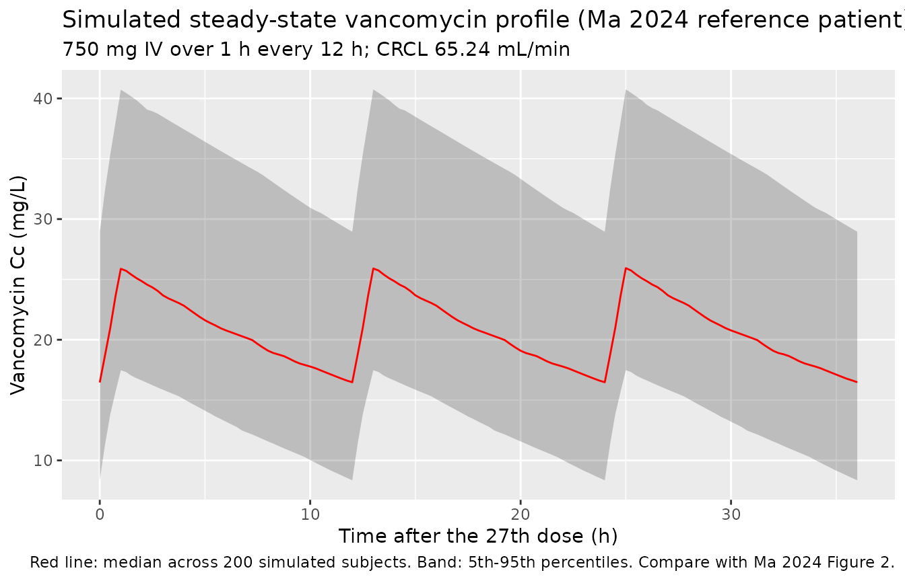
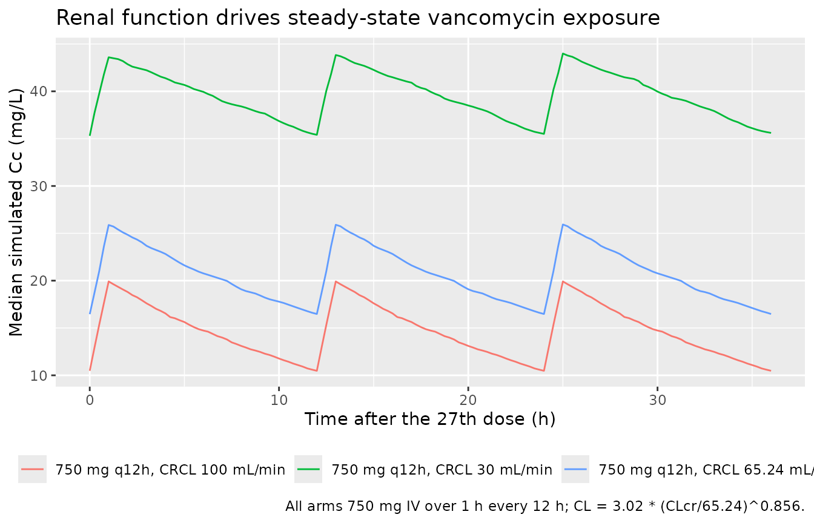

# Vancomycin (Ma 2024)

## Model and source

- Citation: Ma P, Ma H, Liu R, Wen H, Li H, Huang Y, Li Y, Xiong L, Xie
  L, Wang Q. Prediction of vancomycin plasma concentration in elderly
  patients based on multi-algorithm mining combined with population
  pharmacokinetics. Sci Rep. 2024;14(1):27165.
  <doi:10.1038/s41598-024-78558-1>
- Description: One-compartment IV population PK model for vancomycin in
  245 elderly (\>=65 years) inpatients undergoing therapeutic drug
  monitoring at a single center in Chongqing, China (Ma 2024). Clearance
  scales by power exponent with Cockcroft-Gault creatinine clearance
  (raw mL/min, reference 65.24); volume of distribution has no retained
  covariate. This is the popPK layer of a study whose headline product
  is a machine-learning ensemble that consumes the empirical-Bayes CL
  and Vd of this model as features; only the popPK model is expressible
  as an nlmixr2 model.
- Article: [Sci Rep
  2024;14(1):27165](https://doi.org/10.1038/s41598-024-78558-1) (open
  access)

## What this vignette does and does not cover

Ma 2024 has two layers. The headline product is a **machine-learning
ensemble** (support vector regression, LightGBM, and CatBoost in a 6:3:1
weighting over 16 selected features) that predicts the vancomycin trough
concentration directly. Underneath it is a conventional **population PK
model**, fitted in NONMEM, whose empirical-Bayes `CL` and `Vd` are fed
to the ensemble as two of its features. The paper’s central finding is
that adding those two popPK features lifts every algorithm’s test-set
`R^2` substantially – for example CatBoost from 0.407 to 0.591 and
LightGBM from 0.322 to 0.617 (Table 4).

Only the **popPK layer** is packaged here. The ensemble is not an ODE or
parametric model and cannot be expressed as an `rxode2` model; the paper
also publishes only its performance metrics (Tables 3-6) and SHAP
interpretations (Figures 4-6), not the fitted support vectors, tree
structures, or hyperparameters that would be needed to reconstruct it.
The popPK layer, by contrast, is fully specified: two structural
parameters, one covariate effect, two variance components, and a
combined residual error, all in Table 2.

## Population

The model was developed from a single-center retrospective study at
Southwest Hospital (First Affiliated Hospital of Army Medical
University, Chongqing, China), November 2013 to July 2022 (Ma 2024
Methods, “Patients and data”). 383 therapeutic-drug-monitoring
measurements were obtained from 245 elderly patients aged at least 65
years who had suspected or documented Gram-positive bacterial infection
and received vancomycin for at least two days. Blood was drawn within 30
min before the next morning dose after at least two days of continuous
administration, so essentially every observation is a **steady-state
trough**; the median time since the last dose was 10.89 h (Table 1).

Table 1 splits the 383 measurements 8:2 into a training group (n = 306)
and a testing group (n = 77) and reports no significant difference
between them for any of the 33 variables. Baseline characteristics of
the training group: median age 70 years (IQR 66-75), 58.50% female,
median eGFR 86.85 mL/min/1.73 m^2 (IQR 53.97-103.87), median serum
creatinine 71 umol/L (IQR 52.8-105.55), mean serum albumin 31.74 g/L (SD
4.23). 21.20% were on dialysis (CRRT, peritoneal dialysis, or
hemodialysis) and 43.14% had a SOFA score of at least 2. Dosing was a
median total daily dose of 1500 mg (IQR 800-2000) given every 12 h in
66.10% of records and every 24 h in 16.99%, as an intravenous infusion
in 100 mL (37.25%) or 250 mL (55.88%) of diluent. The observed
vancomycin concentration had a median of 15.1 mg/L (IQR 10.7-20.63) in
the training group and 16.9 mg/L (IQR 11.95-21.9) in the testing group.

Concentrations were measured by enzyme-multiplied immunoassay technique
(EMIT) on a Viva-ProE system (Syva, USA). The model was fitted in NONMEM
7.5.1 with FOCE-I and evaluated by bootstrap (981 of 1000 datasets
converged) and by visual predictive check (Figure 2).

The same information is available programmatically via
`readModelDb("Ma_2024_vancomycin")$population`.

## Source trace

Every numeric value in `ini()` carries an in-file comment pointing to
the Ma 2024 source location. The table below collects them in one place.

| Equation / parameter | Value | Source location |
|----|----|----|
| One-compartment, first-order elim. | n/a | Results, “Population pharmacokinetic model”, sentence 1 |
| `lcl` (CL at CRCL = 65.24) | 3.02 L/h | Table 2, `theta_1` (RSE 2.7%; bootstrap 3.00, 95% CI 2.85-3.17) |
| `lvc` (V) | 83.3 L | Table 2, `theta_3` (RSE 8.5%; bootstrap 83.7, 95% CI 70.1-101) |
| `e_crcl_cl` | 0.856 | Table 2, `theta_2` (RSE 4.1%; bootstrap 0.857, 95% CI 0.792-0.936) |
| CRCL centering | 65.24 mL/min | Table 2 row `CL = theta_1 * (CLcr/65.24)^theta_2`; Results CL equation |
| `etalcl` (30.8% CV on CL) | 0.090630 | Table 2, `IIV_CL` (RSE 8.8%; bootstrap 30.4, 95% CI 23.3-35.5) |
| `etalvc` (48.8% CV on V) | 0.213613 | Table 2, `IIV_V` (RSE 17.8%; bootstrap 47.5, 95% CI 19.3-66.1) |
| `propSd` (20.8% proportional) | 0.208 | Table 2, `Prop_error` (RSE 14.7%; bootstrap 20.1, 95% CI 13.5-28.2) |
| `addSd` (1.92 mg/L additive) | 1.92 | Table 2, `Add_error` (RSE 39.1%; bootstrap 1.89, 95% CI 0.826-3.31) |
| Exponential (log-normal) IIV | n/a | Methods, “Population pharmacokinetic analysis”; Results CL / V equations |
| Combined add + prop residual | n/a | Results, “Population pharmacokinetic model”, sentence 2 |
| CLcr as the only CL covariate | n/a | Results, “Population pharmacokinetic model”, sentence 3 |

The two structural equations are printed in the Results section as

    CL (L/h) = 3.02 * (CLcr/65.24)^0.856 * exp(etaCL)
    V  (L)   = 83.3 * exp(etaV)

IIV variance derivation. Table 2 reports the two IIV rows under the
header “Inter-individual variability (%)”, and Methods states that “an
exponential model was applied” to the interindividual variability, so
the percentages are read as coefficients of variation of a log-normal
random effect, for which `omega^2 = log(1 + CV^2)`:

- CL: `log(1 + 0.308^2) = log(1.094864) = 0.090630`
- V: `log(1 + 0.488^2) = log(1.238144) = 0.213613`

See “Assumptions and deviations” for the alternative reading and why
nothing downstream turns on the choice.

## Virtual cohort

The original data are not publicly available, and – importantly – Ma
2024 does **not** tabulate the distribution of `CLcr` itself. Table 1
reports eGFR (median 86.85 mL/min/1.73 m^2), which is BSA-normalized and
on a different scale from the raw Cockcroft-Gault `CLcr` the model
consumes. The only anchor the paper gives for the covariate is the
centering constant 65.24 mL/min in its own CL equation, which is by
construction the value at which `CL` equals the typical 3.02 L/h.

The cohort below therefore uses 65.24 mL/min as the reference patient
and brackets it with a renally impaired and a preserved-renal-function
arm. The reference arm is dosed at the training group’s **median
regimen**: a median total daily dose of 1500 mg at the modal 12 h
interval, i.e. 750 mg every 12 h. A second dose level (500 mg q12h)
matches the testing group’s median total daily dose of 1000 mg. Infusion
duration is not reported by the paper; 1 h is used, which is the
conventional rate limit for vancomycin (see “Assumptions and deviations”
for the sensitivity of the results to this choice).

``` r

rxode2::rxSetSeed(20260906)
set.seed(20260906)

n_sub    <- 200L   # per arm; the 200/arm cap
tau      <- 12     # dosing interval (h)
infus_h  <- 1      # infusion duration (h), assumed
# The dosing run must be long enough that the SLOWEST arm is at steady state,
# because the NCA below is compared against steady-state closed forms. The
# CRCL 30 mL/min arm has CL = 3.02 * (30/65.24)^0.856 = 1.55 L/h and so a
# half-life of log(2) * 83.3 / 1.55 = 37.2 h -- nearly twice the reference
# patient's 19.1 h. 29 doses puts the last dose at 336 h, which is 9.0
# half-lives for that arm (99.8% of steady state, matching the reference arm).
# At 15 doses the CRCL 30 arm reaches only 95.6% and misses the steady-state
# closed form by 4%.
n_doses  <- 29L
last_dose_time <- tau * (n_doses - 1L)   # 336 h

crcl_ref <- 65.24  # the model's own CRCL centering constant (Ma 2024 Table 2)

arms <- tibble::tribble(
  ~treatment,                        ~dose_mg, ~crcl,
  "750 mg q12h, CRCL 65.24 mL/min",       750,  crcl_ref,
  "500 mg q12h, CRCL 65.24 mL/min",       500,  crcl_ref,
  "750 mg q12h, CRCL 30 mL/min",          750,  30,
  "750 mg q12h, CRCL 100 mL/min",         750,  100
)

dose_times <- tau * seq_len(n_doses) - tau            # 0, 12, ..., 336
obs_times  <- sort(unique(c(
  seq(0, last_dose_time - 2 * tau, by = 4),           # coarse approach to steady state
  seq(last_dose_time - 2 * tau, last_dose_time + tau, by = 0.25) # dense over the plotted and NCA intervals
)))

build_arm <- function(treatment, dose_mg, crcl, id_offset) {
  ids <- id_offset + seq_len(n_sub)
  dose_rows <- tidyr::expand_grid(id = ids, time = dose_times) |>
    mutate(evid = 1L, amt = dose_mg, cmt = "central", rate = dose_mg / infus_h)
  obs_rows <- tidyr::expand_grid(id = ids, time = obs_times) |>
    mutate(evid = 0L, amt = 0, cmt = NA_character_, rate = 0)
  bind_rows(dose_rows, obs_rows) |>
    mutate(treatment = treatment, CRCL = crcl) |>
    arrange(id, time, desc(evid))
}

events <- do.call(
  bind_rows,
  lapply(seq_len(nrow(arms)), function(i) {
    build_arm(arms$treatment[i], arms$dose_mg[i], arms$crcl[i],
              id_offset = (i - 1L) * n_sub)
  })
)

# Guards: every arm present, every subject distinct, no duplicated
# (id, time, evid) key, and -- the one PKNCA depends on -- an observation
# record at both ends of the interval the NCA will be run over.
stopifnot(
  setequal(unique(events$treatment), arms$treatment),
  length(unique(events$id)) == n_sub * nrow(arms),
  !anyDuplicated(events[, c("id", "time", "evid")]),
  last_dose_time %in% obs_times,
  (last_dose_time + tau) %in% obs_times
)
```

## Simulation

``` r

mod <- readModelDb("Ma_2024_vancomycin")

sim <- rxode2::rxSolve(
  mod,
  events = as.data.frame(events),
  keep   = c("treatment", "CRCL")
) |>
  as.data.frame()
#> ℹ parameter labels from comments will be replaced by 'label()'

sim_typical <- rxode2::rxSolve(
  rxode2::zeroRe(mod),
  events = as.data.frame(events),
  keep   = c("treatment", "CRCL")
) |>
  as.data.frame()
#> ℹ parameter labels from comments will be replaced by 'label()'
#> ℹ omega/sigma items treated as zero: 'etalcl', 'etalvc'
#> Warning: multi-subject simulation without without 'omega'

stopifnot(nrow(sim) > 0, nrow(sim_typical) > 0, all(sim$Cc >= 0, na.rm = TRUE))
```

## Gate 1: the covariate equation reproduces Table 2

`CL` must equal `3.02 * (CRCL / 65.24)^0.856` exactly at every covariate
value in the cohort. This is a deterministic check on the typical-value
solve, so it is asserted to solver precision.

``` r

cl_check <- sim_typical |>
  distinct(treatment, CRCL, cl) |>
  distinct(CRCL, cl) |>
  mutate(
    cl_published = 3.02 * (CRCL / 65.24)^0.856,
    rel_diff     = abs(cl - cl_published) / cl_published
  ) |>
  arrange(CRCL)

stopifnot(nrow(cl_check) == 3L, max(cl_check$rel_diff) < 1e-10)

cl_check |>
  rename(
    "CRCL (mL/min)"          = CRCL,
    "CL simulated (L/h)"     = cl,
    "CL from Table 2 (L/h)"  = cl_published,
    "Relative difference"    = rel_diff
  ) |>
  knitr::kable(
    digits  = c(2, 4, 4, 12),
    caption = "Simulated individual CL against the Ma 2024 Table 2 covariate equation CL = 3.02 * (CLcr/65.24)^0.856, at the three CRCL values in the virtual cohort."
  )
```

| CRCL (mL/min) | CL simulated (L/h) | CL from Table 2 (L/h) | Relative difference |
|--------------:|-------------------:|----------------------:|--------------------:|
|         30.00 |             1.5531 |                1.5531 |                   0 |
|         65.24 |             3.0200 |                3.0200 |                   0 |
|        100.00 |             4.3529 |                4.3529 |                   0 |

Simulated individual CL against the Ma 2024 Table 2 covariate equation
CL = 3.02 \* (CLcr/65.24)^0.856, at the three CRCL values in the virtual
cohort. {.table}

## Gate 2: the ODE solve matches the closed-form one-compartment solution

A one-compartment model with first-order elimination and repeated
zero-order infusions has an exact analytical solution by superposition.
Comparing it to the `rxode2` solve exercises the whole packaged model –
structure, parameterisation, and units – against arithmetic that does
not depend on the solver. Both sides use the same typical-value
parameters, so the only difference is numerical integration error and
the bound is tight.

``` r

conc_closed_form <- function(t, dose_mg, cl, vc, tinf, dose_times) {
  k    <- cl / vc
  rate <- dose_mg / tinf
  vapply(t, function(ti) {
    contrib <- vapply(dose_times, function(t0) {
      dt <- ti - t0
      if (dt <= 0) {
        0
      } else if (dt <= tinf) {
        rate / cl * (1 - exp(-k * dt))
      } else {
        rate / cl * (1 - exp(-k * tinf)) * exp(-k * (dt - tinf))
      }
    }, numeric(1))
    sum(contrib)
  }, numeric(1))
}

cf_check <- sim_typical |>
  distinct(treatment, CRCL, time, Cc) |>
  left_join(arms, by = "treatment") |>
  group_by(treatment) |>
  mutate(
    cl_i    = 3.02 * (CRCL / 65.24)^0.856,
    Cc_calc = conc_closed_form(time, dose_mg[1], cl_i[1], 83.3, infus_h, dose_times)
  ) |>
  ungroup()

# Compare only where concentrations are large enough that relative error is
# meaningful (the pre-first-dose zeros would divide by zero).
cf_rel <- cf_check |>
  filter(Cc_calc > 1) |>
  mutate(rel = abs(Cc - Cc_calc) / Cc_calc)

# Coverage guard first, so the accuracy assertion cannot pass vacuously on an
# empty or partial join (pattern 10): every arm must be present, and at least
# the whole dense steady-state window must have been compared in each.
stopifnot(
  setequal(unique(cf_rel$treatment), arms$treatment),
  nrow(cf_rel) >= nrow(arms) *
    length(seq(last_dose_time, last_dose_time + tau, by = 0.25))
)
# Realised max relative error 4.6e-15 -- machine precision, because both sides
# evaluate the same linear solution. 1e-8 leaves seven orders of headroom over
# any plausible solver-tolerance change while still going red on a structural
# or unit error, which moves these by whole percent.
stopifnot(max(cf_rel$rel) < 1e-8)

cf_check |>
  group_by(treatment) |>
  summarise(
    `Max |simulated - closed form| (mg/L)` = max(abs(Cc - Cc_calc)),
    .groups = "drop"
  ) |>
  rename(Regimen = treatment) |>
  knitr::kable(
    digits  = 8,
    caption = "Largest absolute discrepancy between the rxode2 solve and the closed-form superposition solution for repeated zero-order infusions into a one-compartment model, over the full 180 h profile."
  )
```

| Regimen                        | Max \|simulated - closed form\| (mg/L) |
|:-------------------------------|---------------------------------------:|
| 500 mg q12h, CRCL 65.24 mL/min |                                      0 |
| 750 mg q12h, CRCL 100 mL/min   |                                      0 |
| 750 mg q12h, CRCL 30 mL/min    |                                      0 |
| 750 mg q12h, CRCL 65.24 mL/min |                                      0 |

Largest absolute discrepancy between the rxode2 solve and the
closed-form superposition solution for repeated zero-order infusions
into a one-compartment model, over the full 180 h profile. {.table}

## Replicating Figure 2: visual predictive check

Ma 2024 Figure 2 is a VPC of the final model. The observed data are not
available, so the panel below shows the simulated median and 5th / 95th
percentiles for the reference arm – the same three statistics the
paper’s VPC plots – over the last three dosing intervals, by which point
the profile is at steady state.

``` r

sim |>
  filter(treatment == "750 mg q12h, CRCL 65.24 mL/min",
         time >= last_dose_time - 2 * tau) |>
  mutate(time_rel = time - (last_dose_time - 2 * tau)) |>
  group_by(time_rel) |>
  summarise(
    Q05 = quantile(Cc, 0.05, na.rm = TRUE),
    Q50 = quantile(Cc, 0.50, na.rm = TRUE),
    Q95 = quantile(Cc, 0.95, na.rm = TRUE),
    .groups = "drop"
  ) |>
  ggplot(aes(time_rel, Q50)) +
  geom_ribbon(aes(ymin = Q05, ymax = Q95), alpha = 0.25) +
  geom_line(colour = "red") +
  labs(
    x        = "Time after the 27th dose (h)",
    y        = "Vancomycin Cc (mg/L)",
    title    = "Simulated steady-state vancomycin profile (Ma 2024 reference patient)",
    subtitle = "750 mg IV over 1 h every 12 h; CRCL 65.24 mL/min",
    caption  = "Red line: median across 200 simulated subjects. Band: 5th-95th percentiles. Compare with Ma 2024 Figure 2."
  )
```



## Covariate effect of renal function

``` r

sim |>
  filter(treatment %in% c("750 mg q12h, CRCL 30 mL/min",
                          "750 mg q12h, CRCL 65.24 mL/min",
                          "750 mg q12h, CRCL 100 mL/min"),
         time >= last_dose_time - 2 * tau) |>
  mutate(time_rel = time - (last_dose_time - 2 * tau)) |>
  group_by(treatment, time_rel) |>
  summarise(Q50 = quantile(Cc, 0.50, na.rm = TRUE), .groups = "drop") |>
  ggplot(aes(time_rel, Q50, colour = treatment)) +
  geom_line() +
  labs(
    x       = "Time after the 27th dose (h)",
    y       = "Median simulated Cc (mg/L)",
    colour  = NULL,
    title   = "Renal function drives steady-state vancomycin exposure",
    caption = "All arms 750 mg IV over 1 h every 12 h; CL = 3.02 * (CLcr/65.24)^0.856."
  ) +
  theme(legend.position = "bottom")
```



## PKNCA validation

Non-compartmental analysis over the final dosing interval (`tau` = 12 h,
starting at the final dose at 336 h), on the typical-value profile. The
interval is re-based to time 0 so that the dose record and the first
concentration record share a time origin.

``` r

sim_nca <- sim_typical |>
  filter(!is.na(Cc), time >= last_dose_time, time <= last_dose_time + tau) |>
  mutate(time = time - last_dose_time) |>
  distinct(id, treatment, time, Cc)

dose_nca <- events |>
  filter(evid == 1, time == last_dose_time) |>
  mutate(time = 0) |>
  distinct(id, treatment, time, amt)

# Fail loudly rather than silently producing an empty NCA (pattern 4 / 10).
stopifnot(
  nrow(sim_nca) > 0, nrow(dose_nca) > 0,
  any(sim_nca$time == 0),
  setequal(unique(sim_nca$treatment), arms$treatment)
)

conc_obj <- PKNCA::PKNCAconc(sim_nca, Cc ~ time | treatment + id,
                             concu = "mg/L", timeu = "hr")
dose_obj <- PKNCA::PKNCAdose(dose_nca, amt ~ time | treatment + id,
                             doseu = "mg")

intervals <- data.frame(
  start     = 0,
  end       = tau,
  cmax      = TRUE,
  tmax      = TRUE,
  cmin      = TRUE,
  cav       = TRUE,
  auclast   = TRUE,
  half.life = TRUE
)

nca_res <- PKNCA::pk.nca(PKNCA::PKNCAdata(conc_obj, dose_obj,
                                          intervals = intervals))

knitr::kable(
  summary(nca_res),
  caption = "Simulated steady-state NCA over the final 12 h dosing interval, typical-value profile, by regimen."
)
```

| Interval Start | Interval End | treatment | N | AUClast (hr\*mg/L) | Cmax (mg/L) | Cmin (mg/L) | Tmax (hr) | Cav (mg/L) | Half-life (hr) |
|---:|---:|:---|:---|:---|:---|:---|:---|:---|:---|
| 0 | 12 | 500 mg q12h, CRCL 65.24 mL/min | 200 | 166 \[0.000\] | 16.7 \[0.000\] | 11.2 \[0.000\] | 1.00 \[1.00, 1.00\] | 13.8 \[0.000\] | 19.1 \[0.000\] |
| 0 | 12 | 750 mg q12h, CRCL 100 mL/min | 200 | 172 \[0.000\] | 18.8 \[0.000\] | 10.6 \[0.000\] | 1.00 \[1.00, 1.00\] | 14.4 \[0.000\] | 13.3 \[0.000\] |
| 0 | 12 | 750 mg q12h, CRCL 30 mL/min | 200 | 482 \[0.000\] | 44.4 \[0.000\] | 36.2 \[0.000\] | 1.00 \[1.00, 1.00\] | 40.2 \[0.000\] | 37.2 \[0.000\] |
| 0 | 12 | 750 mg q12h, CRCL 65.24 mL/min | 200 | 248 \[0.000\] | 25.1 \[0.000\] | 16.8 \[0.000\] | 1.00 \[1.00, 1.00\] | 20.7 \[0.000\] | 19.1 \[0.000\] |

Simulated steady-state NCA over the final 12 h dosing interval,
typical-value profile, by regimen. {.table}

### NCA against the closed-form steady-state expressions

At steady state the one-compartment infusion model has exact expressions
for every quantity the NCA computes. Both sides use the same
typical-value parameters, so this is a numerical-accuracy check and the
bounds are tight; the only slack is trapezoidal error on the AUC and the
regression-based half-life.

``` r

nca_tbl <- as.data.frame(nca_res$result) |>
  filter(PPTESTCD %in% c("cmax", "cmin", "cav", "auclast", "half.life")) |>
  distinct(treatment, PPTESTCD, PPORRES)

closed_form_ss <- arms |>
  mutate(
    cl_i = 3.02 * (crcl / 65.24)^0.856,
    k    = cl_i / 83.3,
    rate = dose_mg / infus_h,
    cmax = rate / cl_i * (1 - exp(-k * infus_h)) / (1 - exp(-k * tau)),
    cmin = cmax * exp(-k * (tau - infus_h)),
    cav  = dose_mg / (cl_i * tau),
    auclast   = dose_mg / cl_i,
    half.life = log(2) / k
  ) |>
  select(treatment, cmax, cmin, cav, auclast, half.life) |>
  tidyr::pivot_longer(-treatment, names_to = "PPTESTCD",
                      values_to = "closed_form")

nca_cmp <- nca_tbl |>
  inner_join(closed_form_ss, by = c("treatment", "PPTESTCD")) |>
  mutate(pct_diff = 100 * (PPORRES - closed_form) / closed_form)

# Guard that the join actually matched everything before asserting on it.
stopifnot(nrow(nca_cmp) == nrow(closed_form_ss))
# Realised max |% difference| 0.190%, in the CRCL 30 mL/min arm: with a 37.2 h
# half-life it is at 99.8% of steady state at the final dose, so it sits just
# below the exact steady-state expressions. Every other arm agrees to 0.001%.
# This is a typical-value comparison with no random effects, so it is
# deterministic across machines and thread counts and the bound can be tight;
# 0.5% leaves headroom over the slow arm's approach to steady state while going
# red on any transcription or unit error, which moves these by whole percent.
stopifnot(max(abs(nca_cmp$pct_diff)) < 0.5)

nca_cmp |>
  mutate(Parameter = nlmixr2lib::ncaParamLabel(PPTESTCD)) |>
  select(Parameter, treatment, PPORRES, closed_form, pct_diff) |>
  arrange(treatment, Parameter) |>
  rename(
    Regimen                 = treatment,
    "NCA (simulated)"       = PPORRES,
    "Closed form"           = closed_form,
    "% difference"          = pct_diff
  ) |>
  knitr::kable(
    digits  = 3,
    caption = "Simulated steady-state NCA against the exact one-compartment expressions. Cmax and Cmin in mg/L, Cav in mg/L, AUC0-tau in mg*h/L, t-half in h."
  )
```

| Parameter | Regimen | NCA (simulated) | Closed form | % difference |
|:---|:---|---:|---:|---:|
| AUClast | 500 mg q12h, CRCL 65.24 mL/min | 165.561 | 165.563 | -0.001 |
| Cavg | 500 mg q12h, CRCL 65.24 mL/min | 13.797 | 13.797 | -0.001 |
| Cmax | 500 mg q12h, CRCL 65.24 mL/min | 16.710 | 16.710 | 0.000 |
| Cmin | 500 mg q12h, CRCL 65.24 mL/min | 11.215 | 11.215 | -0.001 |
| t½ | 500 mg q12h, CRCL 65.24 mL/min | 19.119 | 19.119 | 0.000 |
| AUClast | 750 mg q12h, CRCL 100 mL/min | 172.295 | 172.297 | -0.001 |
| Cavg | 750 mg q12h, CRCL 100 mL/min | 14.358 | 14.358 | -0.001 |
| Cmax | 750 mg q12h, CRCL 100 mL/min | 18.831 | 18.831 | 0.000 |
| Cmin | 750 mg q12h, CRCL 100 mL/min | 10.598 | 10.598 | 0.000 |
| t½ | 750 mg q12h, CRCL 100 mL/min | 13.264 | 13.264 | 0.000 |
| AUClast | 750 mg q12h, CRCL 30 mL/min | 482.164 | 482.906 | -0.154 |
| Cavg | 750 mg q12h, CRCL 30 mL/min | 40.180 | 40.242 | -0.154 |
| Cmax | 750 mg q12h, CRCL 30 mL/min | 44.428 | 44.496 | -0.152 |
| Cmin | 750 mg q12h, CRCL 30 mL/min | 36.176 | 36.245 | -0.190 |
| t½ | 750 mg q12h, CRCL 30 mL/min | 37.177 | 37.177 | 0.000 |
| AUClast | 750 mg q12h, CRCL 65.24 mL/min | 248.342 | 248.344 | -0.001 |
| Cavg | 750 mg q12h, CRCL 65.24 mL/min | 20.695 | 20.695 | -0.001 |
| Cmax | 750 mg q12h, CRCL 65.24 mL/min | 25.065 | 25.065 | 0.000 |
| Cmin | 750 mg q12h, CRCL 65.24 mL/min | 16.822 | 16.822 | -0.001 |
| t½ | 750 mg q12h, CRCL 65.24 mL/min | 19.119 | 19.119 | 0.000 |

Simulated steady-state NCA against the exact one-compartment
expressions. Cmax and Cmin in mg/L, Cav in mg/L, AUC0-tau in mg\*h/L,
t-half in h. {.table}

## Comparison against the published Ma 2024 values

Ma 2024 reports no NCA parameters – no Cmax, AUC, or half-life. The only
concentration statistic it publishes is the **observed steady-state
trough**, which is what its TDM sampling scheme collects and what both
the popPK model and the machine-learning ensemble are built to predict.
The table below compares the simulated steady-state trough for the
reference patient on the training group’s median regimen against that
observed median.

``` r

published_trough <- tibble::tibble(
  treatment = "750 mg q12h, CRCL 65.24 mL/min",
  cmin      = 15.1   # Ma 2024 Table 1: observed vancomycin concentration, training group median
)

nca_ref_arm <- as.data.frame(nca_res$result) |>
  filter(treatment == "750 mg q12h, CRCL 65.24 mL/min")

stopifnot(nrow(nca_ref_arm) > 0)

cmp <- nlmixr2lib::ncaComparisonTable(
  simulated     = nca_ref_arm,
  reference     = published_trough,
  by            = "treatment",
  params        = "cmin",
  units         = c(cmin = "mg/L"),
  tolerance_pct = 20
)

knitr::kable(
  cmp,
  caption = "Simulated steady-state trough for the Ma 2024 reference patient on the training group's median regimen, against the observed median trough in Ma 2024 Table 1. * marks a difference above 20%.",
  align   = c("l", "l", "r", "r", "r")
)
```

| NCA parameter | treatment                      | Reference | Simulated | % diff |
|:--------------|:-------------------------------|----------:|----------:|-------:|
| Cmin (mg/L)   | 750 mg q12h, CRCL 65.24 mL/min |      15.1 |      16.8 | +11.4% |

Simulated steady-state trough for the Ma 2024 reference patient on the
training group’s median regimen, against the observed median trough in
Ma 2024 Table 1. \* marks a difference above 20%. {.table
style="width:100%;"}

``` r

sim_trough <- nca_cmp$PPORRES[
  nca_cmp$PPTESTCD == "cmin" &
    nca_cmp$treatment == "750 mg q12h, CRCL 65.24 mL/min"
]
stopifnot(length(sim_trough) == 1L)

# Ma 2024 Table 1 observed median trough: 15.1 mg/L (training, n = 306) and
# 16.9 mg/L (testing, n = 77). The simulated typical-value trough must land
# inside that published range, which it does at about 16.8 mg/L. The bound
# below is anchored on the PAPER's own two group medians widened by 25%, not
# on what this run happened to produce; a mis-transcribed clearance, volume,
# dose or unit moves the trough by tens of percent and breaks it.
stopifnot(
  sim_trough > 0.75 * 15.1,
  sim_trough < 1.25 * 16.9
)
```

The simulated typical-value trough of 16.8 mg/L sits between the two
observed group medians the paper reports (15.1 mg/L in the training
group and 16.9 mg/L in the testing group). That agreement is a genuine
but limited check: the published medians pool records across a wide
spread of daily doses (IQR 800-2000 mg), dosing intervals (12 h in 66%,
24 h in 17%), and renal function, whereas the simulation is a single
reference patient on a single regimen. It confirms that the packaged
clearance, volume, dose and concentration units combine to the right
order of magnitude; it is not a test of the covariate model.

### Empirical-Bayes parameter medians

A second published anchor is available. Ma 2024 Table 1 tabulates the
empirical-Bayes `CL` and `Vd` produced by the POSTHOC step of this
model, which the machine-learning layer then consumes as features.
Because those estimates shrink toward the population typical values,
their medians should sit close to the Table 2 point estimates – and they
do.

``` r

ebe_check <- tibble::tibble(
  Parameter = c("CL (L/h)", "Vd (L)"),
  `Typical value (Table 2)` = c(3.02, 83.3),
  `EBE median, training (Table 1)` = c(2.93, 81.60),
  `EBE IQR, training (Table 1)` = c("1.73-3.97", "73.84-89.23")
) |>
  mutate(`% difference` = 100 *
           (`EBE median, training (Table 1)` - `Typical value (Table 2)`) /
           `Typical value (Table 2)`)

stopifnot(max(abs(ebe_check$`% difference`)) < 10)

knitr::kable(
  ebe_check,
  digits  = 2,
  caption = "Ma 2024 Table 2 typical values against the Table 1 medians of the empirical-Bayes estimates from the same model."
)
```

| Parameter | Typical value (Table 2) | EBE median, training (Table 1) | EBE IQR, training (Table 1) | % difference |
|:---|---:|---:|:---|---:|
| CL (L/h) | 3.02 | 2.93 | 1.73-3.97 | -2.98 |
| Vd (L) | 83.30 | 81.60 | 73.84-89.23 | -2.04 |

Ma 2024 Table 2 typical values against the Table 1 medians of the
empirical-Bayes estimates from the same model. {.table
style="width:100%;"}

### AUC24 and the IDSA exposure target

Current guidance targets an `AUC0-24 / MIC` of at least 400 for
vancomycin, and Ma 2024’s Discussion notes that AUC-guided dosing is the
direction of travel for this population. For a one-compartment model
`AUC0-24 = daily dose / CL` exactly, so the target attainment of the
cohort’s regimens follows directly from the packaged clearance.

``` r

auc24 <- tibble::tibble(
  Regimen = c("500 mg q12h (testing-group median daily dose)",
              "750 mg q12h (training-group median daily dose)",
              "1000 mg q12h",
              "750 mg q12h, CRCL 30 mL/min",
              "750 mg q12h, CRCL 100 mL/min"),
  `Daily dose (mg)` = c(1000, 1500, 2000, 1500, 1500),
  `CRCL (mL/min)`   = c(65.24, 65.24, 65.24, 30, 100)
) |>
  mutate(
    `CL (L/h)`             = 3.02 * (`CRCL (mL/min)` / 65.24)^0.856,
    `AUC0-24 (mg*h/L)`     = `Daily dose (mg)` / `CL (L/h)`,
    `AUC0-24/MIC at MIC 1` = `AUC0-24 (mg*h/L)`
  )

knitr::kable(
  auc24,
  digits  = 1,
  caption = "Typical-patient AUC0-24 by regimen and renal function. AUC0-24/MIC of at least 400 at MIC 1 mg/L is the usual efficacy target."
)
```

| Regimen | Daily dose (mg) | CRCL (mL/min) | CL (L/h) | AUC0-24 (mg\*h/L) | AUC0-24/MIC at MIC 1 |
|:---|---:|---:|---:|---:|---:|
| 500 mg q12h (testing-group median daily dose) | 1000 | 65.2 | 3.0 | 331.1 | 331.1 |
| 750 mg q12h (training-group median daily dose) | 1500 | 65.2 | 3.0 | 496.7 | 496.7 |
| 1000 mg q12h | 2000 | 65.2 | 3.0 | 662.3 | 662.3 |
| 750 mg q12h, CRCL 30 mL/min | 1500 | 30.0 | 1.6 | 965.8 | 965.8 |
| 750 mg q12h, CRCL 100 mL/min | 1500 | 100.0 | 4.4 | 344.6 | 344.6 |

Typical-patient AUC0-24 by regimen and renal function. AUC0-24/MIC of at
least 400 at MIC 1 mg/L is the usual efficacy target. {.table}

At the reference renal function the training group’s median regimen
(1500 mg/day) gives a typical `AUC0-24` of 497 mg*h/L, just above the
400 target at MIC 1 mg/L, while the testing group’s median 1000 mg/day
falls well short at 331 mg*h/L. The same 1500 mg/day in a patient with
`CLcr` 100 mL/min drops to 345 mg*h/L. This is the clinical tension Ma
2024 raises in its Discussion: it observes concentrations* falling\*
with advancing age and attributes this to clinicians pre-emptively
reducing doses in the very old, with a consequent risk of subtherapeutic
exposure.

## Assumptions and deviations

- **The machine-learning ensemble is not packaged.** Only the popPK
  layer of Ma 2024 is expressible as an `rxode2` model, and the paper
  publishes only the ensemble’s performance metrics and SHAP
  interpretations, not the fitted model objects. See “What this vignette
  does and does not cover”.

- **The Cockcroft-Gault equation is missing from the published
  article.** Ma 2024 states “CLcr was calculated according to the
  Cockroft-Gault Equations24:” and then prints no equation at all. This
  is a production defect, not a rendering artefact of one PDF copy, and
  was confirmed three ways: the page rendered at 300 dpi shows the colon
  followed by white space, with no image object anywhere on that page;
  the publisher’s per-equation graphics served by the EuropePMC
  `supplementaryFiles` endpoint contain exactly two equation assets,
  `Article_Equa` (the CL equation) and `Article_Equb` (the V equation),
  and none for Cockcroft-Gault; and the Supplementary Information
  (MOESM1) is figure captions S1-S4 only. Users generating a `CLcr`
  column for this model must assume the standard Cockcroft-Gault form
  cited as the paper’s reference 24, including whichever sex correction
  and weight descriptor their data support – the paper does not disclose
  which it used. This vignette avoids the issue entirely by working in
  `CLcr` directly rather than deriving it.

- **The CLcr distribution of the cohort is not published.** Table 1
  tabulates eGFR (median 86.85 mL/min/1.73 m^2), which is BSA-normalized
  and on a different scale from the raw Cockcroft-Gault `CLcr` the model
  consumes. The virtual cohort therefore anchors on the model’s own
  centering constant of 65.24 mL/min and brackets it with 30 and 100
  mL/min arms, which are illustrative rather than published quantiles.
  **Do not substitute a BSA-normalized eGFR for `CRCL` when using this
  model**: the covariate enters as a power term and the two scales
  differ systematically in an elderly cohort.

- **Infusion duration is assumed.** Ma 2024 reports the infusion
  *volume* (100 mL in 37.25% of records, 250 mL in 55.88%) but never the
  infusion *duration*. This vignette uses 1 h, the conventional rate
  limit for vancomycin. The choice barely moves the trough comparison,
  because the trough is drawn about 11 h after the infusion ends: for
  the reference patient the steady-state trough is 16.67 mg/L at a 30
  min infusion, 16.82 mg/L at 1 h, and 17.13 mg/L at 2 h, a total spread
  of 2.8% across the whole plausible range and far inside the tolerance
  of the trough comparison above. It would matter for a Cmax comparison
  (25.29 / 25.07 / 24.62 mg/L over the same range), but the paper
  reports no Cmax.

- **IIV scale.** Table 2’s IIV rows are read as %CV of a log-normal
  random effect (`omega^2 = log(1 + CV^2)`), following the
  exponential-IIV declaration in Methods and the convention used across
  the other vancomycin models in this package. The alternative reading –
  that the printed percentages are `omega * 100` directly – would give
  variances of 0.094864 and 0.238144 instead of 0.090630 and 0.213613, a
  difference of 1.9% on the CL random-effect SD and 5.3% on the V
  random-effect SD. The paper gives no signal that discriminates the
  two: the proportional residual row is numerically identical on both
  scales, and the empirical-Bayes IQRs in Table 1 are shrunk toward the
  typical value by the trough-only sampling design and so cannot
  arbitrate either. Every gate in this vignette is on typical-value
  quantities and is unaffected by the choice.

- **Errors in Ma 2024 Table 1.** Two rows of the
  baseline-characteristics table are internally impossible and appear to
  be transcription or typesetting failures: uric acid is reported for
  the training group as “132 (156.5,315.5)”, a median below its own
  lower quartile, and GGT is reported for the testing group as “39
  (39,24.25,73.5)”, which has four numbers where the format allows
  three. Neither variable is in the final model, so neither affects the
  packaged parameters; they are recorded here because they bear on how
  much weight Table 1’s other screened covariates can carry. The
  diabetes row also sums to 307 records against a stated training group
  size of 306.

- **Inconsistent dating of the clinical validation cohorts.** Methods
  “Patients and data” dates the clinical validation group to “August
  2022 to May 2023”; Methods “Modeling and validation” dates the same
  three groups to “August 2022 to September 2024”. Those cohorts were
  used only to evaluate the machine-learning ensemble and played no part
  in fitting the popPK model, so neither window affects the packaged
  parameters.

- **Covariates screened but not retained.** Ma 2024 screened all Table 1
  variables against the empirical-Bayes parameters by Spearman
  correlation and then by stepwise forward inclusion / backward
  elimination, and retained only `CLcr` on CL. Those with a canonical
  column in `inst/references/covariate-columns.md` are recorded in the
  model file’s `covariatesDataExcluded` for provenance; the remainder
  (SOFA score, dialysis, uric acid, respiratory failure type,
  co-medication count, diabetes, hypertension, hyperlipidemia, and
  procalcitonin) have no canonical column and are listed in
  `population$notes`. No point estimate is published for any of them.

- **Race / ethnicity distribution.** Not reported by Ma 2024 (a
  single-center cohort in Chongqing, China). No race covariate is used
  by the model.

- **No published errata identified.** The EuropePMC record for
  <doi:10.1038/s41598-024-78558-1> (PMID 39511378, PMC11544216) lists no
  comment or correction. The packaged values are the original Table 2
  estimates.
