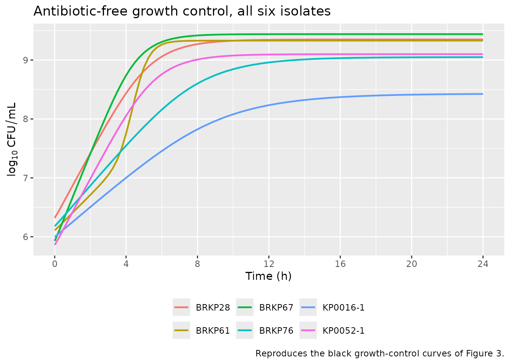
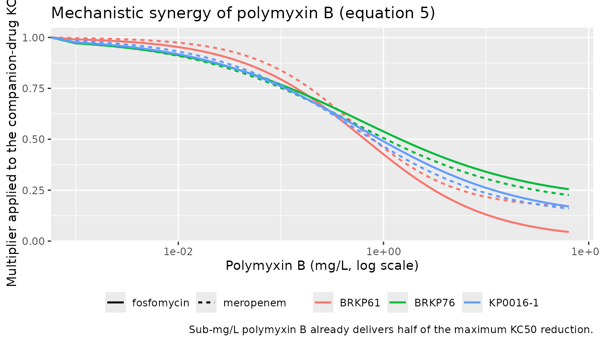
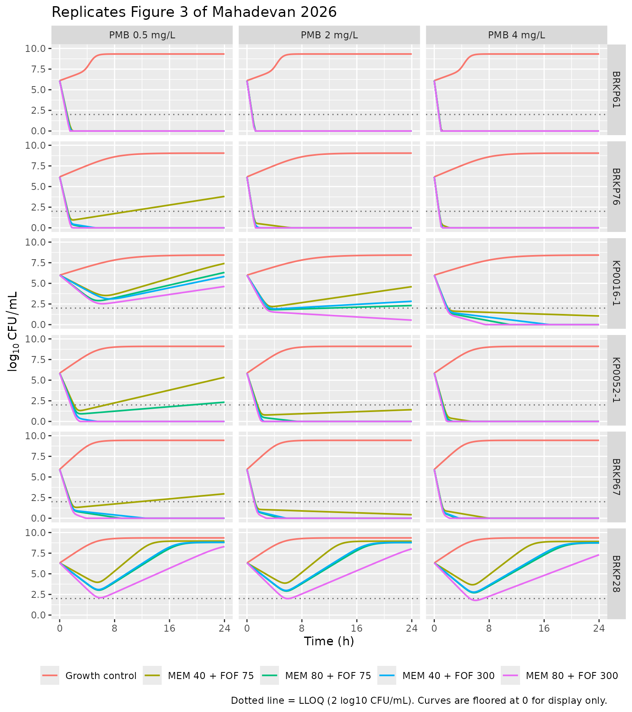

# Polymyxin B-based combination therapy against carbapenem-resistant Klebsiella pneumoniae (Mahadevan 2026)

## Model and source

- Article: <https://doi.org/10.1128/aac.00782-25>
- Citation: Mahadevan R, Garcia E, Sharma R, Qiu H, Elsheikh A, Parambi
  R, Abboud CS, Pasteran F, Ramirez MS, Kaye KS, Bonomo RA, Rao GG. A
  mechanism-based pharmacokinetic/pharmacodynamic analysis of polymyxin
  B-based combination therapy against carbapenem-resistant *Klebsiella
  pneumoniae* isolates with diverse phenotypic and genotypic resistance
  mechanisms. *Antimicrob Agents Chemother* 2026;70(2):e00782-25. PMCID:
  PMC12888851.

This is **not** a population PK model. It is a mechanism-based PK/PD
model (MBM) of bacterial killing, fit with S-ADAPT 1.57 (SADAPT-TRAN,
importance sampling, `pmethod = 4`) to total viable counts from 24 h
static-concentration time-kill (SCTK) assays. Six carbapenem-resistant
*K. pneumoniae* (CRKP) clinical isolates were exposed to polymyxin B
(PMB), meropenem (MEM) and fosfomycin (FOF) as monotherapies, as
PMB-based double combinations, and as the PMB + MEM + FOF triple
combination.

The authors fit the same structural model separately to each isolate,
with isolate-specific parameter values and an isolate-specific choice of
which subpopulation phenotypes and which synergy terms were supported.
The paper is therefore contributed to nlmixr2lib as **six model files**,
one per isolate:

``` r

mahadevan_models <- c(
  "Mahadevan_2026_polymyxinB_meropenem_fosfomycin_BRKP61",
  "Mahadevan_2026_polymyxinB_meropenem_fosfomycin_BRKP76",
  "Mahadevan_2026_polymyxinB_meropenem_fosfomycin_KP00161",
  "Mahadevan_2026_polymyxinB_meropenem_fosfomycin_KP00521",
  "Mahadevan_2026_polymyxinB_meropenem_fosfomycin_BRKP67",
  "Mahadevan_2026_polymyxinB_meropenem_fosfomycin_BRKP28"
)
isolate_label <- c(
  Mahadevan_2026_polymyxinB_meropenem_fosfomycin_BRKP61  = "BRKP61",
  Mahadevan_2026_polymyxinB_meropenem_fosfomycin_BRKP76  = "BRKP76",
  Mahadevan_2026_polymyxinB_meropenem_fosfomycin_KP00161 = "KP0016-1",
  Mahadevan_2026_polymyxinB_meropenem_fosfomycin_KP00521 = "KP0052-1",
  Mahadevan_2026_polymyxinB_meropenem_fosfomycin_BRKP67  = "BRKP67",
  Mahadevan_2026_polymyxinB_meropenem_fosfomycin_BRKP28  = "BRKP28"
)
uis <- lapply(mahadevan_models, function(n) rxode2::rxode(readModelDb(n)))
names(uis) <- mahadevan_models
uis[[1]]$state
#> [1] "bact_intermediate_resistant_resistant1"   
#> [2] "bact_intermediate_resistant_resistant2"   
#> [3] "bact_resistant_intermediate_intermediate1"
#> [4] "bact_resistant_intermediate_intermediate2"
#> [5] "cpmb"                                     
#> [6] "cmem"                                     
#> [7] "cfof"
```

The three antibiotic exposures `cpmb`, `cmem` and `cfof` are state
variables that the user doses. In the SCTK assays they were constant, so
each model defaults to `d/dt(cpmb) = 0` and so on; a user simulating a
clinical regimen attaches elimination terms or drives the states from an
external population PK model.

Because there is no absorption-distribution-elimination profile to
integrate, PKNCA / NCA is not an appropriate validation. The checks
below are the mechanistic equivalents: an antibiotic-free
carrying-capacity hold, a parameter read-back audit against Table 2,
closed-form checks of the mechanistic-synergy function, reproduction of
the published bactericidal-activity counts, and replication of Figure 3.

## Population (biological context)

Four isolates (BRKP28, BRKP61, BRKP67, BRKP76) came from individual
patients at Instituto Dante Pazzanese de Cardiologia (Sao Paulo,
Brazil); two (KP0016-1, KP0052-1) came from Siriraj Hospital (Bangkok,
Thailand). All SCTK experiments used cation-adjusted Mueller-Hinton
broth (25.0 mg/L Ca2+, 12.5 mg/L Mg2+) supplemented with 25 mg/L
glucose-6-phosphate, at a starting inoculum of about 10^6 CFU/mL, with
viable counts at 0, 1, 2, 4, 6, 8 and 24 h and an LLOQ of 2 log10
CFU/mL.

Susceptibility and resistance-gene profiles (Table 1 of the source; full
gene characterisation in Table S2):

| Isolate | Carbapenemase | mgrB | ompK35 | ompK36 | ompK37 | PMB MIC (mg/L) | MEM MIC (mg/L) | FOF MIC (mg/L) |
|----|----|----|----|----|----|----|----|----|
| BRKP28 | blaKPC-2 | NF | NF | NF | Present | \>128 (R) | 256 (R) | 128 (R) |
| BRKP61 | blaKPC-2 | F | NF | NF | Present | \<0.5 (I) | 128 (R) | 256 (R) |
| BRKP67 | blaKPC-2 | NF | NF | NF | Present | 8 (R) | 64 (R) | 32 (R) |
| BRKP76 | blaKPC-2 | F | NF | NF | NF | \<0.5 (I) | 64 (R) | 32 (R) |
| KP0016-1 | none | F | NF | NF | NF | \<0.5 (I) | 64 (R) | 64 (R) |
| KP0052-1 | blaNDM-4 | F | Present | Present | Present | \<0.5 (I) | 64 (R) | 64 (R) |

NF = non-functional, F = functional. PMB and MEM MICs use CLSI
breakpoints for *K. pneumoniae*; FOF MICs use the EUCAST
intravenous-fosfomycin breakpoint for *E. coli* because CLSI publishes
none for *K. pneumoniae*.

The same metadata are available programmatically:

``` r

pop <- uis[["Mahadevan_2026_polymyxinB_meropenem_fosfomycin_BRKP28"]]$population
str(pop[c("species", "organism", "resistance_genes", "starting_inoculum")])
#> List of 4
#>  $ species          : chr "in vitro (Klebsiella pneumoniae BRKP28, carbapenem-resistant clinical isolate)"
#>  $ organism         : chr "Klebsiella pneumoniae BRKP28, obtained from an individual patient at Instituto Dante Pazzanese de Cardiologia, "| __truncated__
#>  $ resistance_genes : chr "blaKPC-2; non-functional mgrB (premature stop codon); non-functional ompK35 (terminated at 144 amino acids) and"| __truncated__
#>  $ starting_inoculum: chr "~10^6 CFU/mL; the model estimated 10^6.32 CFU/mL for this isolate"
```

## Source trace

Every `ini()` entry in the six files under
`inst/modeldb/specificDrugs/Mahadevan_2026_polymyxinB_meropenem_fosfomycin_*.R`
carries an in-file comment naming its Table 2 row. The structural model
comes from Materials and Methods, “Mechanism based PK/PD model
development”.

| Equation / quantity | Source location |
|----|----|
| `CFUtot` = sum of the four bacterial states | Equation 1 |
| State-1 ODE: `2 * PLAT * k21 * state2 - k12 * state1 - kill * state1`; IC = `CFU0 * MF` | Equation 2 |
| State-2 ODE: `-k21 * state2 + k12 * state1 - kill * state2`; IC = 0 | Equation 3 |
| Plateau factor `PLAT = 1 - CFUtot / (CFUMAX + CFUtot)`; replication factor `REP = 2 * PLAT` | Equation 3, in-line definition |
| `k21` fixed to 50 per h; `k12` estimated per subpopulation as the inverse of the mean generation time | Methods, after equation 3 |
| Hill killing `Kill = KMAX * C^h / (KC50^h + C^h)` | Equation 4 |
| Mechanistic synergy `1 - IMAX * CPMB^h / (CPMB^h + IC50^h)` | Equation 5 |
| Synergy multiplies the meropenem KC50 inside the Hill denominator | Equation 6 |
| Synergy multiplies the fosfomycin KC50 inside the Hill denominator | Equation 7 |
| All parameter point estimates and %CVs, per isolate | Table 2 |
| Additive residual error on log10 CFU/mL; BLQ by Beal M3 | Methods, end of the model-development section; Table 2 “Variability model” |
| Isolate resistance genes and MICs | Table 1; Table S2 |
| Model-predicted triple-combination profiles | Figure 3 |

### Units and dimensional analysis

| Symbol | Meaning | Units |
|----|----|----|
| `bact_*1`, `bact_*2` | Bulitta life-cycle bacterial states (1 = vegetative, 2 = replicating) | CFU/mL |
| `cpmb`, `cmem`, `cfof` | polymyxin B / meropenem / fosfomycin bath concentrations | mg/L |
| `lk21`, `k12_*`, `kmax_*`, `kill_*` | rate constants (`lk21` on the natural-log scale) | 1/h |
| `kc50_*`, `ic50_*` | half-effect concentrations | mg/L |
| `mgt_*` | mean generation times | min |
| `log10cfu0`, `log10cfumax`, `log10mf_*` | base-10 logs of CFU/mL or of a fraction | log10 units |
| `hill_*`, `plat`, `syn_mem`, `syn_fof`, `imax_*` | dimensionless | – |

Every growth and kill term is (1/h) x (CFU/mL) = (CFU/mL)/h, matching
`d/dt(bact_*)`. The 60 in `k12 = 60 / mgt` carries units of min/h and
converts the tabulated mean generation time (min) into a rate (1/h).
Inside the Hill denominators the synergy factor is dimensionless, so
`kc50 * syn` remains in mg/L and matches `C^h` term by term.

### Parameter read-back audit against Table 2

This is an enumerating audit: every parameter of every one of the six
files is read back out of the **built** model and compared against an
independent transcription of Table 2. A typo in any cell of any file
fails the render.

One reference value is not taken from Table 2: `kmax_pmb` for BRKP61 is
13.42, the precision the Results text gives, where Table 2 rounds the
same estimate to 13.4 (see the Errata). Every other cell below is Table
2 verbatim.

``` r

table2 <- list(
  BRKP61 = c(log10cfu0 = 6.11, log10cfumax = 9.33, lk21 = log(50),
             mgt_irr = 83.3, mgt_rii = 13.5, log10mf_rii = -5.10,
             kmax_pmb = 13.42, kc50_pmb_i = 0.82, kc50_pmb_r = 41.03, hill_pmb = 0.64,
             kmax_mem = 2.13, kc50_mem_i = 24.7, kc50_mem_r = 61.4, hill_mem = 1.85,
             kmax_fof = 3.74, kc50_fof_i = 42.5, kc50_fof_r = 44.71, hill_fof = 0.61,
             imax_mem_pmb = 0.84, ic50_mem_pmb = 0.51, hill_syn_mem = 0.88,
             imax_fof_pmb = 0.99, ic50_fof_pmb = 0.64, hill_syn_fof = 0.72,
             addSd = 0.39),
  BRKP76 = c(log10cfu0 = 6.18, log10cfumax = 9.05, lk21 = log(50),
             mgt_iii = 72.1, mgt_rrr = 30.92, log10mf_rrr = -5.48,
             kmax_pmb = 11.2, kc50_pmb_i = 2.20, kc50_pmb_r = 79.2, hill_pmb = 1.01,
             kmax_mem = 5.41, kc50_mem_i = 18.9, kc50_mem_r = 328, hill_mem = 1.26,
             kmax_fof = 3.03, kc50_fof_i = 21.1, kc50_fof_r = 647.5, hill_fof = 0.64,
             imax_mem_pmb = 0.83, ic50_mem_pmb = 0.49, hill_syn_mem = 0.54,
             imax_fof_pmb = 0.81, ic50_fof_pmb = 0.58, hill_syn_fof = 0.52,
             addSd = 0.54),
  `KP0016-1` = c(log10cfu0 = 6.0, log10cfumax = 8.43, lk21 = log(50),
             mgt_iii = 98.3, mgt_rrr = 69.26, log10mf_rrr = -4.29,
             kmax_pmb = 10.9, kc50_pmb_i = 6.56, kc50_pmb_r = 61.16, hill_pmb = 1.09,
             kmax_mem = 1.56, kc50_mem_i = 112, kc50_mem_r = 424, hill_mem = 1.99,
             kmax_fof = 0.64, kc50_fof_i = 20.2, kc50_fof_r = 448, hill_fof = 0.79,
             imax_mem_pmb = 0.88, ic50_mem_pmb = 0.50, hill_syn_mem = 0.63,
             imax_fof_pmb = 0.89, ic50_fof_pmb = 0.59, hill_syn_fof = 0.56,
             addSd = 0.45),
  `KP0052-1` = c(log10cfu0 = 5.86, log10cfumax = 9.10, lk21 = log(50),
             mgt_iii = 43.3, mgt_rrr = 32.5, log10mf_rrr = -5.15,
             kmax_pmb = 6.61, kc50_pmb_i = 2.68, kc50_pmb_r = 38.34, hill_pmb = 0.79,
             kmax_mem = 3.05, kc50_mem_i = 44.2, kc50_mem_r = 284, hill_mem = 0.84,
             kmax_fof = 4.01, kc50_fof_i = 26.1, kc50_fof_r = 761.7, hill_fof = 0.77,
             addSd = 0.77),
  BRKP67 = c(log10cfu0 = 5.93, log10cfumax = 9.44, lk21 = log(50),
             mgt_iii = 32.3, mgt_rrr = 31.9, log10mf_rrr = -4.80,
             kmax_pmb = 9.08, kc50_pmb_i = 2.77, kc50_pmb_r = 96.78, hill_pmb = 0.82,
             kmax_mem = 4.16, kc50_mem_i = 8.91, kc50_mem_r = 227, hill_mem = 1.17,
             kmax_fof = 3.45, kc50_fof_i = 20.4, kc50_fof_r = 1000, hill_fof = 0.36,
             addSd = 0.52),
  BRKP28 = c(log10cfu0 = 6.32, log10cfumax = 9.35, lk21 = log(50),
             mgt_rri = 44.25, mgt_rrr = 19.1, log10mf_rrr = -6.55,
             kmax_pmb = 3.61, kc50_pmb_r = 38.82, hill_pmb = 1.44,
             kmax_mem = 3.70, kc50_mem_r = 228, hill_mem = 1.43,
             kmax_fof = 3.42, kc50_fof_i = 22.0, kc50_fof_r = 1342, hill_fof = 0.35,
             addSd = 0.25)
)

audit <- lapply(mahadevan_models, function(m) {
  lab <- unname(isolate_label[m])
  th <- uis[[m]]$theta
  ref <- table2[[lab]]
  stopifnot(setequal(names(th), names(ref)))
  data.frame(
    isolate      = lab,
    n_parameters = length(th),
    max_abs_diff = max(abs(unname(th[names(ref)]) - unname(ref)))
  )
}) |> do.call(rbind, args = _)

# Exact match required: these are transcribed constants, not fitted values.
stopifnot(all(audit$max_abs_diff == 0))
knitr::kable(
  audit |> dplyr::rename("Isolate" = isolate,
                         "Parameters" = n_parameters,
                         "Max |file - Table 2|" = max_abs_diff),
  caption = "Every parameter of every file matches the independent transcription exactly (Table 2 throughout, except KmaxPMB for BRKP61, which uses the Results-text precision)."
)
```

| Isolate  | Parameters | Max \|file - Table 2\| |
|:---------|-----------:|-----------------------:|
| BRKP61   |         25 |                      0 |
| BRKP76   |         25 |                      0 |
| KP0016-1 |         25 |                      0 |
| KP0052-1 |         19 |                      0 |
| BRKP67   |         19 |                      0 |
| BRKP28   |         17 |                      0 |

Every parameter of every file matches the independent transcription
exactly (Table 2 throughout, except KmaxPMB for BRKP61, which uses the
Results-text precision). {.table}

Note the differing parameter counts: BRKP61, BRKP76 and KP0016-1 carry
the six mechanistic-synergy parameters, KP0052-1 and BRKP67 do not, and
BRKP28 in addition drops `kc50_pmb_i` and `kc50_mem_i` because both of
its subpopulations are polymyxin B- and meropenem-resistant. Those are
the “-” cells of Table 2.

### Published summary claims, read back out of the built models

``` r

theta_of <- function(lab, p) {
  m <- names(isolate_label)[isolate_label == lab]
  th <- uis[[m]]$theta
  if (p %in% names(th)) unname(th[[p]]) else NA_real_
}
labs <- unname(isolate_label[mahadevan_models])

kmax_pmb <- vapply(labs, theta_of, numeric(1), p = "kmax_pmb")
imax_mem <- vapply(labs, theta_of, numeric(1), p = "imax_mem_pmb")
imax_fof <- vapply(labs, theta_of, numeric(1), p = "imax_fof_pmb")
ic50_mem <- vapply(labs, theta_of, numeric(1), p = "ic50_mem_pmb")
ic50_fof <- vapply(labs, theta_of, numeric(1), p = "ic50_fof_pmb")

claims <- tibble::tribble(
  ~Claim,                                                                  ~Source,       ~Published,       ~Model,
  "Lowest KmaxPMB is BRKP28",                                              "Abstract",    "3.61 1/h",       sprintf("%.2f 1/h (%s)", min(kmax_pmb), labs[which.min(kmax_pmb)]),
  "KmaxPMB of the other five isolates",                                    "Results",     "6.61-13.42 1/h", sprintf("%.2f-%.2f 1/h", min(kmax_pmb[labs != "BRKP28"]), max(kmax_pmb[labs != "BRKP28"])),
  "Lowest KmaxMEM is KP0016-1",                                            "Results",     "1.56 1/h",       sprintf("%.2f 1/h (%s)", min(vapply(labs, theta_of, numeric(1), p = "kmax_mem")), labs[which.min(vapply(labs, theta_of, numeric(1), p = "kmax_mem"))]),
  "Lowest KmaxFOF is KP0016-1",                                            "Results",     "0.64 1/h",       sprintf("%.2f 1/h (%s)", min(vapply(labs, theta_of, numeric(1), p = "kmax_fof")), labs[which.min(vapply(labs, theta_of, numeric(1), p = "kmax_fof"))]),
  "Mechanistic synergy with meropenem (Imax)",                             "Abstract",    "83%-88%",        sprintf("%.0f%%-%.0f%%", 100 * min(imax_mem, na.rm = TRUE), 100 * max(imax_mem, na.rm = TRUE)),
  "Mechanistic synergy with fosfomycin (Imax)",                            "Results",     "0.81, 0.89, 0.99", paste(sprintf("%.2f", sort(imax_fof[!is.na(imax_fof)])), collapse = ", "),
  "PMB concentration giving 50% of maximum synergy",                       "Abstract",    "0.49-0.64 mg/L", sprintf("%.2f-%.2f mg/L", min(c(ic50_mem, ic50_fof), na.rm = TRUE), max(c(ic50_mem, ic50_fof), na.rm = TRUE)),
  "Number of isolates carrying mechanistic synergy",                       "Abstract",    "3",              as.character(sum(!is.na(imax_mem)))
)

# Hard gates on the numeric claims.
stopifnot(
  labs[which.min(kmax_pmb)] == "BRKP28",
  abs(min(kmax_pmb) - 3.61) < 1e-9,
  abs(min(kmax_pmb[labs != "BRKP28"]) - 6.61) < 1e-9,
  abs(max(kmax_pmb[labs != "BRKP28"]) - 13.42) < 1e-9,
  abs(min(imax_mem, na.rm = TRUE) - 0.83) < 1e-9,
  abs(max(imax_mem, na.rm = TRUE) - 0.88) < 1e-9,
  abs(min(c(ic50_mem, ic50_fof), na.rm = TRUE) - 0.49) < 1e-9,
  abs(max(c(ic50_mem, ic50_fof), na.rm = TRUE) - 0.64) < 1e-9,
  sum(!is.na(imax_mem)) == 3L
)
knitr::kable(claims, caption = "Summary claims from the Abstract and Results, recomputed from the six built model files.")
```

| Claim | Source | Published | Model |
|:---|:---|:---|:---|
| Lowest KmaxPMB is BRKP28 | Abstract | 3.61 1/h | 3.61 1/h (BRKP28) |
| KmaxPMB of the other five isolates | Results | 6.61-13.42 1/h | 6.61-13.42 1/h |
| Lowest KmaxMEM is KP0016-1 | Results | 1.56 1/h | 1.56 1/h (KP0016-1) |
| Lowest KmaxFOF is KP0016-1 | Results | 0.64 1/h | 0.64 1/h (KP0016-1) |
| Mechanistic synergy with meropenem (Imax) | Abstract | 83%-88% | 83%-88% |
| Mechanistic synergy with fosfomycin (Imax) | Results | 0.81, 0.89, 0.99 | 0.81, 0.89, 0.99 |
| PMB concentration giving 50% of maximum synergy | Abstract | 0.49-0.64 mg/L | 0.49-0.64 mg/L |
| Number of isolates carrying mechanistic synergy | Abstract | 3 | 3 |

Summary claims from the Abstract and Results, recomputed from the six
built model files. {.table style="width:100%;"}

## Carrying-capacity (growth-control) check

With no antibiotic, the population must start at `10^log10cfu0` and grow
to `10^log10cfumax`. For the plateau factor
`PLAT = 1 - CFUtot / (CFUMAX + CFUtot)` the replication factor
`REP = 2 * PLAT` equals 1 exactly at `CFUtot = CFUMAX`, so replication
then just replaces the parent cell and the population settles at
`CFUMAX` (not at half of it). The two slow-growing isolates (BRKP76,
KP0016-1) have not quite arrived by the 24 h experimental horizon, so
the plateau is read at 96 h.

``` r

solve_sctk <- function(ui, pmb = 0, mem = 0, fof = 0, tmax = 24, by = 0.25) {
  ev <- rxode2::et(amt = pmb, cmt = "cpmb", time = 0) |>
    rxode2::et(amt = mem, cmt = "cmem", time = 0) |>
    rxode2::et(amt = fof, cmt = "cfof", time = 0) |>
    rxode2::et(seq(0, tmax, by = by))
  rxode2::rxSolve(ui, ev, method = "lsoda", atol = 1e-10, rtol = 1e-10,
                  maxsteps = 1e6, returnType = "data.frame")
}

gc <- lapply(mahadevan_models, function(m) {
  s <- solve_sctk(uis[[m]], tmax = 96, by = 0.5)
  th <- uis[[m]]$theta
  data.frame(
    isolate       = unname(isolate_label[m]),
    inoculum_sim  = s$Cc[1],
    inoculum_tab  = unname(th[["log10cfu0"]]),
    plateau_sim   = max(s$Cc),
    plateau_tab   = unname(th[["log10cfumax"]])
  )
}) |> do.call(rbind, args = _)

stopifnot(
  max(abs(gc$inoculum_sim - gc$inoculum_tab)) < 1e-6,
  max(abs(gc$plateau_sim  - gc$plateau_tab))  < 1e-3,
  # The plateau is an upper bound, never overshot.
  all(gc$plateau_sim <= gc$plateau_tab + 1e-9)
)
knitr::kable(
  gc |> mutate(across(where(is.numeric), \(x) round(x, 4))) |>
    dplyr::rename("Isolate" = isolate,
                  "Inoculum simulated" = inoculum_sim,
                  "Inoculum Table 2" = inoculum_tab,
                  "Plateau simulated (96 h)" = plateau_sim,
                  "Plateau Table 2" = plateau_tab),
  caption = "Antibiotic-free growth reproduces log10 CFU0 at time zero and log10 CFUmax at the plateau, for all six isolates."
)
```

| Isolate | Inoculum simulated | Inoculum Table 2 | Plateau simulated (96 h) | Plateau Table 2 |
|:---|---:|---:|---:|---:|
| BRKP61 | 6.11 | 6.11 | 9.33 | 9.33 |
| BRKP76 | 6.18 | 6.18 | 9.05 | 9.05 |
| KP0016-1 | 6.00 | 6.00 | 8.43 | 8.43 |
| KP0052-1 | 5.86 | 5.86 | 9.10 | 9.10 |
| BRKP67 | 5.93 | 5.93 | 9.44 | 9.44 |
| BRKP28 | 6.32 | 6.32 | 9.35 | 9.35 |

Antibiotic-free growth reproduces log10 CFU0 at time zero and log10
CFUmax at the plateau, for all six isolates. {.table}

``` r

gc_curves <- lapply(mahadevan_models, function(m) {
  s <- solve_sctk(uis[[m]], tmax = 24, by = 0.25)
  data.frame(isolate = unname(isolate_label[m]), time = s$time, log10cfu = s$Cc)
}) |> do.call(rbind, args = _)

ggplot(gc_curves, aes(time, log10cfu, colour = isolate)) +
  geom_line(linewidth = 0.8) +
  scale_x_continuous(breaks = seq(0, 24, by = 4)) +
  labs(x = "Time (h)", y = expression(log[10] ~ CFU / mL), colour = NULL,
       title = "Antibiotic-free growth control, all six isolates",
       caption = "Reproduces the black growth-control curves of Figure 3.") +
  theme(legend.position = "bottom")
```



## Mechanistic-synergy function (closed-form checks)

Equation 5 defines
`Mechanistic_synergy = 1 - IMAX * CPMB^h / (CPMB^h + IC50^h)`, which
multiplies the meropenem and fosfomycin KC50 inside the Hill denominator
(equations 6 and 7). Two properties follow analytically and are checked
exactly:

- at `CPMB = IC50` the function equals `1 - IMAX / 2`, i.e. half of the
  maximum synergy is achieved – this is the Abstract’s claim that
  “0.49-0.64 mg/L was sufficient to achieve 50% of the maximum synergy”;
- as `CPMB` grows without bound the function tends to `1 - IMAX`, so the
  effective KC50 falls by a factor of `1 / (1 - IMAX)`.

``` r

syn <- function(cpmb, imax, ic50, h) 1 - imax * cpmb^h / (cpmb^h + ic50^h)

syn_models <- mahadevan_models[!is.na(imax_mem)]
syn_tab <- lapply(syn_models, function(m) {
  th <- uis[[m]]$theta
  rbind(
    data.frame(isolate = unname(isolate_label[m]), companion = "meropenem",
               imax = unname(th[["imax_mem_pmb"]]), ic50 = unname(th[["ic50_mem_pmb"]]),
               hill = unname(th[["hill_syn_mem"]])),
    data.frame(isolate = unname(isolate_label[m]), companion = "fosfomycin",
               imax = unname(th[["imax_fof_pmb"]]), ic50 = unname(th[["ic50_fof_pmb"]]),
               hill = unname(th[["hill_syn_fof"]]))
  )
}) |> do.call(rbind, args = _) |>
  mutate(
    syn_at_ic50    = syn(ic50, imax, ic50, hill),
    half_max_check = 1 - imax / 2,
    fold_decrease  = 1 / (1 - imax)
  )

stopifnot(
  max(abs(syn_tab$syn_at_ic50 - syn_tab$half_max_check)) < 1e-12,
  # Saturating polymyxin B leaves exactly the (1 - Imax) fraction of the KC50.
  # The Hill coefficients here are all below 1, so the approach to the limit is
  # slow in CPMB; 1e40 mg/L drives the residual below 1e-9 for every row.
  max(abs(syn(1e40, syn_tab$imax, syn_tab$ic50, syn_tab$hill) -
            (1 - syn_tab$imax))) < 1e-9,
  # Monotone decreasing in CPMB, and bounded by the two analytic endpoints.
  all(syn_tab$syn_at_ic50 < 1), all(syn_tab$syn_at_ic50 > 1 - syn_tab$imax)
)
knitr::kable(
  syn_tab |> mutate(across(where(is.numeric), \(x) round(x, 4))) |>
    select(isolate, companion, imax, ic50, hill, syn_at_ic50, fold_decrease) |>
    dplyr::rename("Isolate" = isolate, "Companion drug" = companion,
                  "Imax" = imax, "IC50 (mg/L)" = ic50, "Hill" = hill,
                  "Synergy factor at IC50" = syn_at_ic50,
                  "Max fold decrease in KC50" = fold_decrease),
  caption = "Mechanistic-synergy parameters (Table 2) and the exact analytic consequences of equation 5."
)
```

| Isolate | Companion drug | Imax | IC50 (mg/L) | Hill | Synergy factor at IC50 | Max fold decrease in KC50 |
|:---|:---|---:|---:|---:|---:|---:|
| BRKP61 | meropenem | 0.84 | 0.51 | 0.88 | 0.580 | 6.2500 |
| BRKP61 | fosfomycin | 0.99 | 0.64 | 0.72 | 0.505 | 100.0000 |
| BRKP76 | meropenem | 0.83 | 0.49 | 0.54 | 0.585 | 5.8824 |
| BRKP76 | fosfomycin | 0.81 | 0.58 | 0.52 | 0.595 | 5.2632 |
| KP0016-1 | meropenem | 0.88 | 0.50 | 0.63 | 0.560 | 8.3333 |
| KP0016-1 | fosfomycin | 0.89 | 0.59 | 0.56 | 0.555 | 9.0909 |

Mechanistic-synergy parameters (Table 2) and the exact analytic
consequences of equation 5. {.table}

``` r

syn_curve <- syn_tab |>
  tidyr::crossing(cpmb = c(0, exp(seq(log(1e-3), log(64), length.out = 120)))) |>
  mutate(synergy_factor = syn(cpmb, imax, ic50, hill))

ggplot(syn_curve, aes(cpmb, synergy_factor, colour = isolate, linetype = companion)) +
  geom_line(linewidth = 0.8) +
  scale_x_log10() +
  labs(x = "Polymyxin B (mg/L, log scale)",
       y = "Multiplier applied to the companion-drug KC50",
       colour = NULL, linetype = NULL,
       title = "Mechanistic synergy of polymyxin B (equation 5)",
       caption = "Sub-mg/L polymyxin B already delivers half of the maximum KC50 reduction.") +
  theme(legend.position = "bottom")
#> Warning in scale_x_log10(): log-10 transformation introduced infinite values.
```



## Bactericidal activity of the triple combination (Figure 1A)

The paper defines bactericidal activity as a reduction of at least 3
log10 CFU/mL at 24 h relative to the initial inoculum, and reports for
the triple combination that “Increasing polymyxin B concentration from 2
to 4 mg/L enhanced bactericidal activity … the triple combination
(PMB-MEM-FOF: 67% to 83%)”. With six isolates, 67% is 4/6 and 83% is
5/6. The triple-combination companion concentrations are given in the
Results as MEM 40 mg/L + FOF 75 mg/L.

``` r

delta24 <- function(m, pmb, mem, fof) {
  s <- solve_sctk(uis[[m]], pmb = pmb, mem = mem, fof = fof, tmax = 24, by = 0.25)
  s$Cc[nrow(s)] - unname(uis[[m]]$theta[["log10cfu0"]])
}

triple <- tidyr::crossing(model = mahadevan_models, pmb = c(2, 4)) |>
  rowwise() |>
  mutate(isolate = unname(isolate_label[model]),
         change_24h = delta24(model, pmb, 40, 75),
         bactericidal = change_24h <= -3) |>
  ungroup()

counts <- triple |> group_by(pmb) |> summarise(n_bactericidal = sum(bactericidal),
                                               .groups = "drop")

fails <- function(p) sort(triple$isolate[triple$pmb == p & !triple$bactericidal])

# Hard gate: reproduce the published 67% (4/6) and 83% (5/6) counts exactly, and
# name which isolates fall short at each polymyxin B level.
stopifnot(
  identical(counts$n_bactericidal[counts$pmb == 2], 4L),
  identical(counts$n_bactericidal[counts$pmb == 4], 5L),
  # Raising polymyxin B from 2 to 4 mg/L rescues KP0016-1 and only KP0016-1 --
  # the Results single this isolate out as the one needing the higher exposure.
  identical(fails(2), c("BRKP28", "KP0016-1")),
  identical(fails(4), "BRKP28"),
  # BRKP28 is the only isolate whose population still grows over 24 h.
  identical(sort(unique(triple$isolate[triple$change_24h > 0])), "BRKP28")
)

knitr::kable(
  triple |>
    select(isolate, pmb, change_24h, bactericidal) |>
    mutate(change_24h = round(change_24h, 2)) |>
    tidyr::pivot_wider(names_from = pmb,
                       values_from = c(change_24h, bactericidal)) |>
    dplyr::rename("Isolate" = isolate,
                  "24 h change, PMB 2 mg/L" = change_24h_2,
                  "24 h change, PMB 4 mg/L" = change_24h_4,
                  "Bactericidal at PMB 2" = bactericidal_2,
                  "Bactericidal at PMB 4" = bactericidal_4),
  caption = "Triple combination (MEM 40 mg/L + FOF 75 mg/L): 24 h change in log10 CFU/mL. 4/6 isolates are bactericidal at PMB 2 mg/L and 5/6 at PMB 4 mg/L, matching the 67% and 83% reported in Figure 1A."
)
```

| Isolate | 24 h change, PMB 2 mg/L | 24 h change, PMB 4 mg/L | Bactericidal at PMB 2 | Bactericidal at PMB 4 |
|:---|---:|---:|:---|:---|
| BRKP28 | 2.63 | 2.60 | FALSE | FALSE |
| BRKP61 | -12.11 | -12.11 | TRUE | TRUE |
| BRKP67 | -5.50 | -8.19 | TRUE | TRUE |
| BRKP76 | -8.08 | -12.12 | TRUE | TRUE |
| KP0016-1 | -1.40 | -4.95 | FALSE | TRUE |
| KP0052-1 | -4.44 | -8.24 | TRUE | TRUE |

Triple combination (MEM 40 mg/L + FOF 75 mg/L): 24 h change in log10
CFU/mL. 4/6 isolates are bactericidal at PMB 2 mg/L and 5/6 at PMB 4
mg/L, matching the 67% and 83% reported in Figure 1A. {.table
style="width:100%;"}

The two isolates that fall short at polymyxin B 2 mg/L are KP0016-1 and
BRKP28, and raising polymyxin B to 4 mg/L rescues KP0016-1 alone. That
is precisely the pair of statements the Results make: the
non-carbapenemase producer KP0016-1 “resulted in only a 51.7% reduction
in AUC_CFU. Increasing the median exposure to 49.0 mg-h/L enhanced the
reduction to 67.7%”, while BRKP28 “exhibited only a modest reduction in
bacterial load … The triple-drug regimen also failed to produce a
meaningful reduction.” BRKP28 – resistant to all three drugs, with the
lowest polymyxin B killing rate constant of the six – is the only
isolate whose population still grows over 24 h.

## Replicate Figure 3 (triple combination across six isolates)

Figure 3 shows model predictions for the triple combination at polymyxin
B 0.5, 2 and 4 mg/L against all six isolates, for four companion
regimens plus the growth control.

``` r

arms <- tibble::tribble(
  ~arm,                          ~mem, ~fof,
  "Growth control",                 0,    0,
  "MEM 40 + FOF 75",               40,   75,
  "MEM 80 + FOF 75",               80,   75,
  "MEM 40 + FOF 300",              40,  300,
  "MEM 80 + FOF 300",              80,  300
)

fig3 <- tidyr::crossing(model = mahadevan_models, pmb = c(0.5, 2, 4), arms) |>
  # The growth control carries no drug at all, so its curve is identical in all
  # three polymyxin B panels; it is kept in each so every panel has its own
  # no-treatment reference, exactly as Figure 3 draws it.
  rowwise() |>
  mutate(sim = list({
    s <- solve_sctk(uis[[model]], pmb = if (arm == "Growth control") 0 else pmb,
                    mem = mem, fof = fof, tmax = 24, by = 0.25)
    data.frame(time = s$time, log10cfu = s$Cc)
  })) |>
  ungroup() |>
  tidyr::unnest(sim) |>
  mutate(
    isolate = factor(unname(isolate_label[model]),
                     levels = c("BRKP61", "BRKP76", "KP0016-1",
                                "KP0052-1", "BRKP67", "BRKP28")),
    panel   = factor(sprintf("PMB %g mg/L", pmb),
                     levels = sprintf("PMB %g mg/L", c(0.5, 2, 4))),
    arm     = factor(arm, levels = arms$arm),
    # Figure 3 is drawn on a 0-10 log10 CFU/mL axis with the LLOQ at 2.
    plotted = pmax(log10cfu, 0)
  )

ggplot(fig3, aes(time, plotted, colour = arm)) +
  geom_hline(yintercept = 2, linetype = "dotted", colour = "grey40") +
  geom_line(linewidth = 0.7) +
  facet_grid(isolate ~ panel) +
  scale_x_continuous(breaks = seq(0, 24, by = 8)) +
  coord_cartesian(ylim = c(0, 10)) +
  labs(x = "Time (h)", y = expression(log[10] ~ CFU / mL), colour = NULL,
       title = "Replicates Figure 3 of Mahadevan 2026",
       caption = "Dotted line = LLOQ (2 log10 CFU/mL). Curves are floored at 0 for display only.") +
  theme(legend.position = "bottom")
```



``` r

fig3 |>
  filter(time %in% c(0, 6, 8, 24)) |>
  mutate(log10cfu = round(pmax(log10cfu, 0), 2)) |>
  select(isolate, panel, arm, time, log10cfu) |>
  tidyr::pivot_wider(names_from = time, values_from = log10cfu,
                     names_prefix = "t") |>
  filter(arm %in% c("Growth control", "MEM 40 + FOF 75")) |>
  dplyr::rename("Isolate" = isolate, "Polymyxin B" = panel, "Regimen" = arm,
                "0 h" = t0, "6 h" = t6, "8 h" = t8, "24 h" = t24) |>
  knitr::kable(caption = "Simulated log10 viable counts at the sampling times of Figure 3, for the growth control and the MEM 40 + FOF 75 triple combination.")
```

| Isolate  | Polymyxin B  | Regimen         |  0 h |  6 h |  8 h | 24 h |
|:---------|:-------------|:----------------|-----:|-----:|-----:|-----:|
| BRKP28   | PMB 0.5 mg/L | Growth control  | 6.32 | 9.06 | 9.27 | 9.35 |
| BRKP28   | PMB 0.5 mg/L | MEM 40 + FOF 75 | 6.32 | 4.07 | 5.32 | 8.96 |
| BRKP28   | PMB 2 mg/L   | Growth control  | 6.32 | 9.06 | 9.27 | 9.35 |
| BRKP28   | PMB 2 mg/L   | MEM 40 + FOF 75 | 6.32 | 3.95 | 5.17 | 8.95 |
| BRKP28   | PMB 4 mg/L   | Growth control  | 6.32 | 9.06 | 9.27 | 9.35 |
| BRKP28   | PMB 4 mg/L   | MEM 40 + FOF 75 | 6.32 | 3.74 | 4.88 | 8.92 |
| BRKP61   | PMB 0.5 mg/L | Growth control  | 6.11 | 9.26 | 9.33 | 9.33 |
| BRKP61   | PMB 0.5 mg/L | MEM 40 + FOF 75 | 6.11 | 0.00 | 0.00 | 0.00 |
| BRKP61   | PMB 2 mg/L   | Growth control  | 6.11 | 9.26 | 9.33 | 9.33 |
| BRKP61   | PMB 2 mg/L   | MEM 40 + FOF 75 | 6.11 | 0.00 | 0.00 | 0.00 |
| BRKP61   | PMB 4 mg/L   | Growth control  | 6.11 | 9.26 | 9.33 | 9.33 |
| BRKP61   | PMB 4 mg/L   | MEM 40 + FOF 75 | 6.11 | 0.00 | 0.00 | 0.00 |
| BRKP67   | PMB 0.5 mg/L | Growth control  | 5.93 | 9.31 | 9.42 | 9.44 |
| BRKP67   | PMB 0.5 mg/L | MEM 40 + FOF 75 | 5.93 | 1.58 | 1.73 | 2.96 |
| BRKP67   | PMB 2 mg/L   | Growth control  | 5.93 | 9.31 | 9.42 | 9.44 |
| BRKP67   | PMB 2 mg/L   | MEM 40 + FOF 75 | 5.93 | 0.95 | 0.89 | 0.43 |
| BRKP67   | PMB 4 mg/L   | Growth control  | 5.93 | 9.31 | 9.42 | 9.44 |
| BRKP67   | PMB 4 mg/L   | MEM 40 + FOF 75 | 5.93 | 0.27 | 0.00 | 0.00 |
| BRKP76   | PMB 0.5 mg/L | Growth control  | 6.18 | 8.16 | 8.60 | 9.05 |
| BRKP76   | PMB 0.5 mg/L | MEM 40 + FOF 75 | 6.18 | 1.47 | 1.73 | 3.81 |
| BRKP76   | PMB 2 mg/L   | Growth control  | 6.18 | 8.16 | 8.60 | 9.05 |
| BRKP76   | PMB 2 mg/L   | MEM 40 + FOF 75 | 6.18 | 0.04 | 0.00 | 0.00 |
| BRKP76   | PMB 4 mg/L   | Growth control  | 6.18 | 8.16 | 8.60 | 9.05 |
| BRKP76   | PMB 4 mg/L   | MEM 40 + FOF 75 | 6.18 | 0.00 | 0.00 | 0.00 |
| KP0016-1 | PMB 0.5 mg/L | Growth control  | 6.00 | 7.46 | 7.82 | 8.42 |
| KP0016-1 | PMB 0.5 mg/L | MEM 40 + FOF 75 | 6.00 | 3.59 | 3.68 | 7.41 |
| KP0016-1 | PMB 2 mg/L   | Growth control  | 6.00 | 7.46 | 7.82 | 8.42 |
| KP0016-1 | PMB 2 mg/L   | MEM 40 + FOF 75 | 6.00 | 2.43 | 2.67 | 4.60 |
| KP0016-1 | PMB 4 mg/L   | Growth control  | 6.00 | 7.46 | 7.82 | 8.42 |
| KP0016-1 | PMB 4 mg/L   | MEM 40 + FOF 75 | 6.00 | 1.54 | 1.48 | 1.05 |
| KP0052-1 | PMB 0.5 mg/L | Growth control  | 5.86 | 8.76 | 9.01 | 9.10 |
| KP0052-1 | PMB 0.5 mg/L | MEM 40 + FOF 75 | 5.86 | 1.86 | 2.25 | 5.35 |
| KP0052-1 | PMB 2 mg/L   | Growth control  | 5.86 | 8.76 | 9.01 | 9.10 |
| KP0052-1 | PMB 2 mg/L   | MEM 40 + FOF 75 | 5.86 | 0.88 | 0.94 | 1.42 |
| KP0052-1 | PMB 4 mg/L   | Growth control  | 5.86 | 8.76 | 9.01 | 9.10 |
| KP0052-1 | PMB 4 mg/L   | MEM 40 + FOF 75 | 5.86 | 0.00 | 0.00 | 0.00 |

Simulated log10 viable counts at the sampling times of Figure 3, for the
growth control and the MEM 40 + FOF 75 triple combination. {.table}

The qualitative features the paper emphasises are all reproduced:
BRKP61, BRKP76, KP0052-1 and BRKP67 are driven below the LLOQ and held
there; KP0016-1 regrows at polymyxin B 0.5 and 2 mg/L but is suppressed
at 4 mg/L, matching the Results statement that this non-carbapenemase
producer needed the higher exposure; and BRKP28 dips early and then
regrows to the carrying capacity under every regimen.

## Relative bacterial burden across isolates

The paper summarises the extent of killing as the area under the
bacterial load-versus-time curve, AUC_CFU, in log10 CFU-h/mL. The
Methods state only that “AUC_CFU from 0 to 24 hours was calculated”;
neither the trapezoid rule nor the handling of counts below the LLOQ is
specified, so the absolute published values cannot be reproduced (see
the Errata). The **ranking** the paper draws from them is reproduced
here, computed with an explicitly stated convention: linear trapezoid of
log10 CFU/mL over 0-24 h with values floored at the LLOQ of 2 log10
CFU/mL.

``` r

auc_cfu <- function(m, pmb, mem, fof) {
  s <- solve_sctk(uis[[m]], pmb = pmb, mem = mem, fof = fof, tmax = 24, by = 0.25)
  y <- pmax(s$Cc, 2)
  sum(diff(s$time) * (head(y, -1) + tail(y, -1)) / 2)
}

burden <- data.frame(
  isolate = unname(isolate_label[mahadevan_models]),
  auc_cfu = unname(vapply(mahadevan_models, auc_cfu, numeric(1),
                          pmb = 4, mem = 40, fof = 75))
)

stopifnot(
  # The paper's ordering claim: BRKP28 retains the largest bacterial burden of
  # the six, and BRKP28 > BRKP67 (published 50.3 vs 40.1 log10 CFU-h/mL).
  burden$isolate[which.max(burden$auc_cfu)] == "BRKP28",
  burden$auc_cfu[burden$isolate == "BRKP28"] >
    burden$auc_cfu[burden$isolate == "BRKP67"]
)
knitr::kable(
  burden |> arrange(auc_cfu) |> mutate(auc_cfu = round(auc_cfu, 1)) |>
    dplyr::rename("Isolate" = isolate,
                  "AUC_CFU 0-24 h (log10 CFU-h/mL)" = auc_cfu),
  caption = "Model-predicted bacterial burden under PMB 4 + MEM 40 + FOF 75 mg/L, floored at the LLOQ. BRKP28 retains by far the largest burden, as reported."
)
```

| Isolate  | AUC_CFU 0-24 h (log10 CFU-h/mL) |
|:---------|--------------------------------:|
| BRKP61   |                            49.4 |
| BRKP76   |                            49.5 |
| BRKP67   |                            49.9 |
| KP0052-1 |                            50.5 |
| KP0016-1 |                            51.8 |
| BRKP28   |                           166.7 |

Model-predicted bacterial burden under PMB 4 + MEM 40 + FOF 75 mg/L,
floored at the LLOQ. BRKP28 retains by far the largest burden, as
reported. {.table}

## Assumptions and deviations

- **Model class and species.** This is an in-vitro mechanism-based PK/PD
  model, not a population PK model. `population$species` records the *K.
  pneumoniae* isolate. There is no drug NCA to compute, so PKNCA
  validation is replaced by the mechanistic checks above, per the
  endogenous / mechanistic validation strategy.
- **Six files, one paper.** The authors applied a consistent structural
  growth model across the six isolates but estimated every parameter
  separately per isolate, and let the supported subpopulation phenotypes
  and synergy terms vary by isolate. Per the replicate-author-structure
  policy these are six independent fits, hence six files sharing this
  one vignette.
- **Filename isolate tokens.** `KP0016-1` and `KP0052-1` carry hyphens,
  which are not valid in R function names; the file stems drop them
  (`KP00161`, `KP00521`), following the precedent of
  `Cheah_2016_polymyxin_FADDIAB008.R` for `FADDI-AB008`.
- **Which subpopulation takes which KC50.** Table 2 labels every KC50
  with an `I` (intermediate) or `R` (resistant) suffix per drug, and
  labels each isolate’s two subpopulations with a phenotype triple (for
  example `PMB_I/MEM_R/FOF_R`). Each subpopulation is therefore
  assigned, drug by drug, the KC50 matching its own phenotype letter.
  This is what makes the “-” cells of Table 2 self-consistent: BRKP28
  has no `KC50,PMB,I` and no `KC50,MEM,I` precisely because both of its
  subpopulations are PMB-resistant and MEM-resistant.
- **Which KC50 the synergy multiplies.** Equations 6 and 7 are each
  written for a single subpopulation (`Kill_MEM,I` and `Kill_FOF,R`),
  which on its own would leave the other subpopulation ambiguous. Three
  independent statements in the source resolve it the same way. The
  sentence introducing equations 6 and 7 says the synergy enhances “the
  sensitivity of the intermediate and resistant subpopulations to
  meropenem and fosfomycin (KC50,MEM,I, KC50,FOF,I, KC50,MEM,R,
  KC50,FOF,R)” – all four terms. The Table 2 row labels read “KC50,MEM,I
  **and/or** KC50,MEM,R”. And in the Figure 2B schematic the two
  “Mechanistic synergy” boxes feed the MEM node and the FOF node as a
  whole, each of which then carries a killing arrow into *both*
  subpopulations (KC50,R,MEM and KC50,I,MEM; KC50,R,FOF and KC50,I,FOF).
  The synergy factor is therefore applied to both subpopulations, for
  both companion drugs, in the three isolates that carry it.
- **Figure 2B corroborates the per-subpopulation KC50 assignment.** The
  schematic is drawn for the BRKP61 phenotype pair and labels each arrow
  explicitly: the PMB-I / MEM-R / FOF-R subpopulation takes
  `KC50,I,PMB`, `KC50,R,MEM` and `KC50,R,FOF`, and the PMB-R / MEM-I /
  FOF-I subpopulation takes `KC50,R,PMB`, `KC50,I,MEM` and `KC50,I,FOF`.
  That is the assignment implemented in
  `Mahadevan_2026_polymyxinB_meropenem_fosfomycin_BRKP61.R`, and the
  same phenotype-letter rule is applied to the other five isolates.
- **Initial conditions.** Equation 2 gives `IC = CFU0 * MF` for the
  vegetative state and equation 3 gives 0 for the replicating state, so
  all bacteria start in state 1. Table 2 reports a single mutant
  frequency per isolate, for the minority subpopulation; the majority
  subpopulation is therefore seeded with `CFU0 * (1 - 10^log10MF)` so
  that the two initial conditions sum to `CFU0`. The correction is at
  most 5e-5 of the inoculum.
- **Mean generation time to k12.** Table 2 tabulates the mean generation
  time in minutes while the Methods define `k12` as its inverse in 1/h,
  so the model computes `k12 = 60 / mgt`. This matches the convention of
  the sibling Bulitta-lineage files `Yadav_2017_imipenem_*.R` and
  `Landersdorfer_2018_meropenem_tobramycin_*.R`.
- **KmaxPMB for BRKP61.** Table 2 rounds this estimate to 13.4 1/h while
  the Results text quotes the range “6.61-13.42 h-1” for the non-BRKP28
  isolates. The file carries the more precise 13.42; the in-file comment
  records both.
- **Imax for fosfomycin against BRKP61.** Table 2 and the Results both
  give 0.99; the Abstract quotes the range as “81%-98%”. The file
  carries the Table 2 / Results value of 0.99, and the 98% in the
  Abstract appears to be a rounding of the same estimate.
- **Meropenem 80 mg/L in Figure 3.** The Methods list the studied
  meropenem concentrations as 10, 20 and 40 mg/L (clinically achievable)
  plus 60 and 120 mg/L (supra-therapeutic); 80 mg/L is not among them,
  yet the Figure 3 legend includes “MEM 80 mg/L” arms. The figure legend
  is used here because it is what the replicated figure plots. The
  discrepancy is in the source.
- **AUC_CFU convention.** The published per-isolate AUC_CFU values (for
  example 40.1 for BRKP67 and 50.3 for BRKP28 under PMB 4 + MEM 40 +
  FOF 75) could not be reproduced in absolute terms, because the Methods
  do not state how the 0-24 h integral treats counts below the LLOQ, nor
  whether it is taken over the observed sampling times or over the
  fitted curve. The ordering claim the paper makes from those numbers is
  reproduced and asserted above; the absolute values are not asserted.
- **Monte Carlo clinical simulations not reproduced.** The paper’s
  percentage reductions in AUC_CFU for critically ill patients (Figure
  4, Figure S5) drive these MBMs with three previously published
  population PK models – polymyxin B (reference 17), meropenem
  (reference 46) and fosfomycin (reference 47) – none of which is on
  disk for this extraction, and whose parameters are not reproduced in
  this paper. Those simulations are therefore outside the scope of this
  vignette. A user can reproduce them by overriding `d/dt(cpmb)`,
  `d/dt(cmem)` and `d/dt(cfof)` with the corresponding
  unbound-concentration profiles (the paper used fu = 0.42 for polymyxin
  B, 0.98 for meropenem, and negligible protein binding for fosfomycin).
- **Observation floor.** The paper’s observation is `log10(CFUtot)`. The
  model files compute `log10(CFUtot + 1e-6)` so that a regimen driving
  the population to numerical extinction returns a finite value rather
  than `NaN` from a solver undershoot into negative counts. The
  regularisation is eight orders of magnitude below the 2 log10 CFU/mL
  LLOQ and never perturbs an observable count. The same device is used
  by `HernandezLozano_2025_apramycin_invitro.R`.
- **Residual variability.** The additive residual SD from Table 2 is
  carried in `ini()` but the vignette’s checks are all typical-value
  (deterministic); the models declare no between-subject random effects,
  since each fit describes a single isolate.
- **Solver.** `method = "lsoda"` with `atol = rtol = 1e-10` and
  `maxsteps = 1e6` is used throughout: the fixed `k21 = 50` per h
  against killing rates of order 1-13 per h makes the system stiff
  during the kill transient, and the default `liblsoda` solver is
  unreliable for this model family near the stationary plateau (the same
  setting is used by the sibling Yadav and Landersdorfer vignettes).
- **Erratum check.** No erratum, corrigendum or author correction is
  referenced in the lead PDF or its supplement. Web search was not
  available in this offline build; any later correction on the AAC
  journal page should be checked before using these models in a
  regulatory context.
- **Convention check.**
  [`nlmixr2lib::checkModelConventions()`](https://nlmixr2.github.io/nlmixr2lib/reference/checkModelConventions.md)
  is clean for all six files. Of the three bath-concentration states,
  `cmem` is a registered canonical; `cpmb` and `cfof` are well-formed
  members of the same `c<drug>` bath-state family but are not yet
  registered, so those two are declared through
  `paper_specific_compartments` (the route
  `Kroemer_2024_ceftazidime_avibactam_fosfomycin_hfim.R` also takes for
  its fosfomycin state). The four bacterial states of each file need no
  such declaration: this paper is the founding **three-drug** example of
  the canonical `bact_<pheno>..._<pheno><digit>` subpopulation scheme,
  which carries one spelled-out phenotype token per drug in the model’s
  drug order (here PMB, MEM, FOF) and a trailing life-cycle digit.
  `bacterialSubpopRegex` in `R/conventions.R` previously admitted at
  most two phenotype tokens; it was widened to any number in this same
  change, and `inst/references/compartment-names.md` now documents the
  scheme as N-drug rather than two-drug. Nothing already registered
  changes meaning – the existing one- and two-token names still match.
