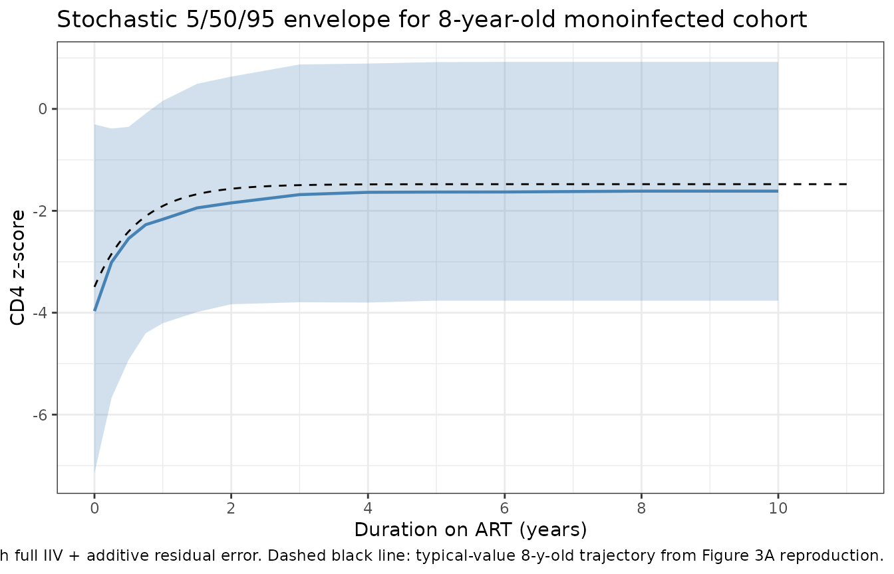

# Pediatric HIV/HCV CD4 z-score recovery on ART (Majekodunmi 2017)

## Model and source

- Citation: Majekodunmi AO, Thorne C, Malyuta R, Volokha A, Callard RE,
  Klein NJ, Lewis J; on behalf of The European Paediatric HIV/HCV
  Co-infection Study group in the European Pregnancy and Paediatric HIV
  Cohort Collaboration and the Ukraine Paediatric HIV Cohort Study in
  EuroCoord. Modelling CD4 T Cell Recovery in Hepatitis C and HIV
  Co-infected Children Receiving Antiretroviral Therapy. Pediatr Infect
  Dis J. 2017 May;36(5):e123-e129. <doi:10.1097/INF.0000000000001478>.
- Article: <https://doi.org/10.1097/INF.0000000000001478>
- Description: Longitudinal disease-progression / immune-reconstitution
  model for age-standardised CD4 T-cell counts (z-scores) in
  HIV-infected children receiving antiretroviral therapy (ART), with
  HIV/HCV coinfection slowing the recovery rate (Majekodunmi 2017, fit
  to 401 children – 355 HIV monoinfected and 46 HIV/HCV coinfected –
  from the Ukraine Paediatric HIV Cohort Study and the EPPICC HIV/HCV
  coinfection study across 8 European countries). The age-standardised
  CD4 z score is modelled as an asymptotic recovery curve z(t) = asy +
  (int - asy) \* exp(-krec \* t), where t is duration on ART, int is the
  pre-ART z score, asy is the long-term z score, and krec (the paper’s
  symbol c) is the per-subject recovery rate (1/year; ln(2)/krec is the
  time to half the total recovery from int to asy; renamed from the
  paper’s c to avoid shadowing R’s built-in c() combine function). Age
  at start of ART (centred at 4.3 years – the all-cohort median per
  Table 2 footnote) shifts both asy and int (younger children start
  higher and reach higher long-term levels). EPPICC enrollment country
  shifts int with Ukraine as the implicit reference. HCV coinfection is
  a multiplicative fractional reduction on krec: krec_coinf = krec_mono
  \* (1 + e_hcv_pos_krec \* HCV_POS) with e_hcv_pos_krec = -0.77, so
  coinfected children recover at krec = 1.55 \* 0.23 = 0.357 /year
  (half-time ~2 years) versus 1.55 /year for monoinfected (half-time
  ~0.45 year). Disease-progression model with no drug dosing – the
  population were on combination ART (most commonly lamivudine +
  zidovudine + lopinavir/ritonavir) and the model’s t = 0 is the time of
  ART initiation.

## Population

Majekodunmi 2017 pooled two pediatric HIV cohorts: the Ukraine
Paediatric HIV Cohort Study (HIV monoinfected children, n = 355, all
from Ukraine) and the EPPICC HIV/HCV coinfection sub-study (n = 46
across 8 European countries – Russia 17, Ukraine 18, Switzerland 3,
Spain 2, UK 2, Italy 2, Germany 1, Poland 1). The pooled analytic cohort
is 401 children with longitudinal CD4 measurements after ART initiation.
Median age at ART start was 4.40 years (IQR 1.73-7.07) for monoinfected
and 3.12 years (IQR 1.31-5.65) for coinfected; the all-cohort reference
age used in the model is 4.3 years (Table 2 footnote). Median follow-up
on ART was 4.2 years overall (IQR 2.7-5.3), with a median of 5 CD4
measurements per child (IQR 3-7). Sex was approximately balanced
(monoinfected 48.2% male / 51.8% female; coinfected 43.5% male / 54.3%
female / 2.2% unknown). The most common ART regimen across both cohorts
was lamivudine + zidovudine + kaletra (lopinavir/ritonavir); 33% of
monoinfected and 49% of coinfected children received a 3-drug ART
regimen.

The same demographic detail is available programmatically via
`readModelDb("Majekodunmi_2017_HIV_HCV_CD4_recovery")$population`.

## Source trace

The recovery model (Majekodunmi 2017 Equation 1, schematic in Figure 1)
is

``` math
z_{ij} \;=\; \mathrm{asy}_{i}
            + (\mathrm{int}_{i} - \mathrm{asy}_{i})\,
              \exp(-c_{i}\,t_{ij})
            + \varepsilon_{ij}
```

with $`t_{ij}`$ the duration on ART for child $`i`$,
$`\mathrm{int}_{i}`$ the pre-ART z score, $`\mathrm{asy}_{i}`$ the
long-term z score, $`c_{i}`$ the per-subject recovery-rate constant, and
$`\varepsilon_{ij}`$ an additive residual error. The half-recovery time
from $`\mathrm{int}_{i}`$ to $`\mathrm{asy}_{i}`$ is $`\ln(2)/c_{i}`$.
In the packaged model the symbol $`c`$ is renamed `krec` to avoid
shadowing R’s built-in [`c()`](https://rdrr.io/r/base/c.html) combine
function; the symbol $`\mathrm{int}`$ is renamed `intercept` to avoid
the C reserved word `int` (rxode2 transpiles to C).

The per-parameter origin is recorded as an in-file comment next to each
`ini()` entry. The table below collects them in one place.

| Equation / parameter | Value (SE) | Source location |
|----|---:|----|
| `asy` (typical long-term z score, Ukraine ref, AGE = 4.3 y) | -1.07 (0.08) | Table 2 row Asy |
| `e_age_asy` | -0.11 (0.03) | Table 2 row Asy:age |
| `intercept` (typical pre-ART z score, Ukraine ref, AGE = 4.3 y) | -2.42 (0.28) | Table 2 row Int |
| `e_age_intercept` | -0.29 (0.09) | Table 2 row Int:age |
| `e_region_poland_intercept` | +0.44 (0.29) | Table 2 row Int:Poland |
| `e_region_russia_intercept` | +0.69 (0.57) | Table 2 row Int:Russia |
| `e_region_switzerland_intercept` | +0.02 (0.77) | Table 2 row Int:Switzerland |
| `e_region_uk_intercept` | -17.5 (0.93) | Table 2 row Int: United Kingdom |
| `e_region_spain_intercept` | +2.89 (0.71) | Table 2 row Int:Spain |
| `e_region_germany_intercept` | +0.34 (0.29) | Table 2 row Int:Germany |
| `e_region_italy_intercept` | -3.63 (1.50) | Table 2 row Int:Italy |
| `krec` (typical recovery rate, 1/y; paper’s `c`) | 1.55 (0.63) | Table 2 row c |
| `e_hcv_pos_krec` | -0.77 (0.09) | Table 2 row C:Coinf |
| `addSd` (residual SD on z-score) | 1.43 (0.16) | Table 2 row ‘Residual error’ |
| Variance of REs: asy | 1.83 | Table 2 column ‘Variance of REs’, Asy row |
| Variance of REs: intercept | 4.78 | Table 2 column ‘Variance of REs’, Int row |
| Variance of REs: krec | 0.39 | Table 2 column ‘Variance of REs’, c row |
| Reference age (centring) | 4.3 y | Table 2 footnote |
| Reference cohort | Ukraine | Table 2 footnote |
| Asymptotic-recovery functional form | n/a | Methods ‘Mixed-effects Modeling’ and Equation 1 |

Variances of random effects are encoded as **additive normal** on the
natural (z-score) scale for `asy` and `intercept`, and additive normal
on the linear (1/year) scale for `krec`, matching the source paper’s
“Variance of REs” column (which reports raw variances, not %CV).

## Errata

No published erratum or corrigendum was located for this paper as of the
model extraction date (2026-05-22). The paper itself notes two
limitations the consumer should keep in mind. First, the HIV
monoinfected cohort was drawn entirely from Ukraine while the HCV
coinfected cohort spans 8 European countries; the model carries 7 EPPICC
enrollment-country indicator covariates on the pre-ART intercept to
absorb the resulting laboratory / clinical-practice differences, with
Ukraine as the implicit reference. Second, two of the country-effect
estimates rest on very small subgroups (UK n = 2, Italy n = 2) and the
UK estimate of -17.5 z-score units is implausibly large for a CD4 z
score effect, almost certainly a small-sample artifact – see Assumptions
and deviations.

## Verify the model and parameters are loaded correctly

The model loads via
[`readModelDb()`](https://nlmixr2.github.io/nlmixr2lib/reference/readModelDb.md).
Quick sanity check on the parameter values is done by reading the
fixed-effect typical-value parameters back from the model.

``` r

mod     <- readModelDb("Majekodunmi_2017_HIV_HCV_CD4_recovery")
mod_typ <- rxode2::zeroRe(mod)
#> ℹ parameter labels from comments will be replaced by 'label()'

typical_theta <- mod_typ$theta
knitr::kable(data.frame(parameter = names(typical_theta),
                        value     = unname(typical_theta)),
             digits = 4,
             caption = "Typical-value (fixed-effect) parameters as packaged.")
```

| parameter                      |  value |
|:-------------------------------|-------:|
| asy                            |  -1.07 |
| e_age_asy                      |  -0.11 |
| intercept                      |  -2.42 |
| e_age_intercept                |  -0.29 |
| e_region_poland_intercept      |   0.44 |
| e_region_russia_intercept      |   0.69 |
| e_region_switzerland_intercept |   0.02 |
| e_region_uk_intercept          | -17.50 |
| e_region_spain_intercept       |   2.89 |
| e_region_germany_intercept     |   0.34 |
| e_region_italy_intercept       |  -3.63 |
| krec                           |   1.55 |
| e_hcv_pos_krec                 |  -0.77 |
| addSd                          |   0.00 |

Typical-value (fixed-effect) parameters as packaged. {.table}

## Reproducing Figure 3A: monoinfected children at ages 2, 4, and 8 years

Majekodunmi 2017 Figure 3A shows the typical-value (fixed-effect) CD4
z-score recovery trajectory for monoinfected children starting ART at
ages 2, 4, and 8 years (all from the Ukraine reference cohort,
`HCV_POS = 0`). Younger children start ART at higher pre-ART z scores
and reach higher long-term z scores than older children – Asy:age and
Int:age are both negative (-0.11 and -0.29 per year of age above 4.3 y
respectively).

``` r

ukraine_ref_cov <- function(age, hcv_pos = 0L) {
  data.frame(
    AGE                = age,
    HCV_POS            = hcv_pos,
    REGION_POLAND      = 0L,
    REGION_RUSSIA      = 0L,
    REGION_SWITZERLAND = 0L,
    REGION_UK          = 0L,
    REGION_SPAIN       = 0L,
    REGION_GERMANY     = 0L,
    REGION_ITALY       = 0L
  )
}

# Per-figure observation grid: 0 to 11 years on ART (matches Figure 3A x-axis)
t_grid <- seq(0, 11, by = 0.05)

build_events <- function(id, age, hcv_pos) {
  cov <- ukraine_ref_cov(age = age, hcv_pos = hcv_pos)
  cbind(
    data.frame(id = id, time = t_grid, amt = 0, evid = 0L),
    cov[rep(1L, length(t_grid)), , drop = FALSE]
  )
}

ev_3a <- bind_rows(
  build_events(id = 1L, age = 2, hcv_pos = 0L) |> mutate(age_label = "2 y old (mono)"),
  build_events(id = 2L, age = 4, hcv_pos = 0L) |> mutate(age_label = "4 y old (mono)"),
  build_events(id = 3L, age = 8, hcv_pos = 0L) |> mutate(age_label = "8 y old (mono)")
)

sim_3a <- as.data.frame(rxode2::rxSolve(mod_typ, events = ev_3a, keep = "age_label"))
#> ℹ omega/sigma items treated as zero: 'etaasy', 'etaintercept', 'etakrec'
#> Warning: multi-subject simulation without without 'omega'

ggplot(sim_3a, aes(x = time, y = Cc, colour = age_label, linetype = age_label)) +
  geom_line(linewidth = 0.9) +
  scale_colour_manual(values = c(
    "2 y old (mono)" = "steelblue",
    "4 y old (mono)" = "darkorange",
    "8 y old (mono)" = "firebrick"
  )) +
  scale_linetype_manual(values = c(
    "2 y old (mono)" = "longdash",
    "4 y old (mono)" = "dashed",
    "8 y old (mono)" = "solid"
  )) +
  scale_x_continuous(breaks = seq(0, 11, by = 2)) +
  scale_y_continuous(limits = c(-4, -1)) +
  labs(
    x = "Duration on ART (years)",
    y = "CD4 z-score",
    colour = NULL, linetype = NULL,
    title = "Majekodunmi 2017 Figure 3A: monoinfected children at ages 2, 4, and 8 years"
  ) +
  theme_bw() +
  theme(legend.position = "bottom")
#> Warning: Removed 199 rows containing missing values or values outside the scale range
#> (`geom_line()`).
```


Typical-value CD4 z-score recovery trajectories for monoinfected
children starting ART at ages 2, 4, and 8 years (reproducing Majekodunmi
2017 Figure 3A).

## Reproducing Figure 3B: monoinfected vs HCV-coinfected 8-year-old

Figure 3B compares the typical-value trajectories for an 8-year-old
monoinfected child (solid line) versus an 8-year-old HIV/HCV coinfected
child (long-dashed line). Both share the same intercept and asymptote
(HCV coinfection does not affect `intercept` or `asy`), but coinfection
slows the recovery rate by a factor of `1 + e_hcv_pos_krec = 0.23`,
taking ~2 years to reach half-recovery instead of ~5 months.

``` r

ev_3b <- bind_rows(
  build_events(id = 1L, age = 8, hcv_pos = 0L) |> mutate(group = "Monoinfected (8 y)"),
  build_events(id = 2L, age = 8, hcv_pos = 1L) |> mutate(group = "HIV/HCV coinfected (8 y)")
)

sim_3b <- as.data.frame(rxode2::rxSolve(mod_typ, events = ev_3b, keep = "group"))
#> ℹ omega/sigma items treated as zero: 'etaasy', 'etaintercept', 'etakrec'
#> Warning: multi-subject simulation without without 'omega'

ggplot(sim_3b, aes(x = time, y = Cc, colour = group, linetype = group)) +
  geom_line(linewidth = 0.9) +
  scale_colour_manual(values = c(
    "Monoinfected (8 y)"       = "steelblue",
    "HIV/HCV coinfected (8 y)" = "firebrick"
  )) +
  scale_linetype_manual(values = c(
    "Monoinfected (8 y)"       = "solid",
    "HIV/HCV coinfected (8 y)" = "longdash"
  )) +
  scale_x_continuous(breaks = seq(0, 11, by = 2)) +
  scale_y_continuous(limits = c(-4, -1)) +
  labs(
    x = "Duration on ART (years)",
    y = "CD4 z-score",
    colour = NULL, linetype = NULL,
    title = "Majekodunmi 2017 Figure 3B: monoinfected vs HIV/HCV coinfected 8-year-old"
  ) +
  theme_bw() +
  theme(legend.position = "bottom")
```


Typical-value CD4 z-score recovery trajectories for an 8-year-old child:
HIV monoinfected vs HIV/HCV coinfected (reproducing Majekodunmi 2017
Figure 3B).

## Sanity checks against closed-form algebra

Because the model is purely algebraic (no ODE state, no dose events),
the rxode2-simulated trajectory must agree with the closed-form
expression at every time point. We spot-check the typical-value output
at four canonical times for both monoinfected and coinfected
8-year-olds.

``` r

asy_pop  <- -1.07
int_pop  <- -2.42
krec_pop <- 1.55
ref_age  <- 4.3
e_age_asy       <- -0.11
e_age_intercept <- -0.29
e_hcv_pos_krec  <- -0.77

closed_form <- function(t, age, hcv) {
  asy_i <- asy_pop + e_age_asy       * (age - ref_age)
  int_i <- int_pop + e_age_intercept * (age - ref_age)
  k_i   <- krec_pop * (1 + e_hcv_pos_krec * hcv)
  asy_i + (int_i - asy_i) * exp(-k_i * t)
}

checkpoints <- expand.grid(
  age  = c(2, 4, 8),
  hcv  = c(0L, 1L),
  time = c(0, 0.5, 2, 11)
) |>
  mutate(
    expected = closed_form(time, age, hcv)
  )

ev_chk <- checkpoints |>
  mutate(
    id   = seq_len(dplyr::n()),
    amt  = 0,
    evid = 0L,
    AGE = age, HCV_POS = hcv,
    REGION_POLAND = 0L, REGION_RUSSIA = 0L, REGION_SWITZERLAND = 0L,
    REGION_UK = 0L,     REGION_SPAIN = 0L,   REGION_GERMANY = 0L,
    REGION_ITALY = 0L
  )

sim_chk <- as.data.frame(rxode2::rxSolve(mod_typ, events = ev_chk,
                                         keep = c("age", "hcv", "expected")))
#> ℹ omega/sigma items treated as zero: 'etaasy', 'etaintercept', 'etakrec'
#> Warning: multi-subject simulation without without 'omega'
#> Warning: Cannot keep missing columns:

sim_chk$diff <- sim_chk$Cc - sim_chk$expected

knitr::kable(
  sim_chk |> select(age, hcv, time, expected, actual = Cc, diff) |>
    arrange(age, hcv, time),
  digits = 4,
  caption = "rxode2 typical-value output vs closed-form Equation 1."
)
```

| age | hcv | time | expected |  actual | diff |
|----:|----:|-----:|---------:|--------:|-----:|
|   2 |   0 |  0.0 |  -1.7530 | -1.7530 |    0 |
|   2 |   0 |  0.5 |  -1.2482 | -1.2482 |    0 |
|   2 |   0 |  2.0 |  -0.8592 | -0.8592 |    0 |
|   2 |   0 | 11.0 |  -0.8170 | -0.8170 |    0 |
|   2 |   1 |  0.0 |  -1.7530 | -1.7530 |    0 |
|   2 |   1 |  0.5 |  -1.6002 | -1.6002 |    0 |
|   2 |   1 |  2.0 |  -1.2758 | -1.2758 |    0 |
|   2 |   1 | 11.0 |  -0.8355 | -0.8355 |    0 |
|   4 |   0 |  0.0 |  -2.3330 | -2.3330 |    0 |
|   4 |   0 |  0.5 |  -1.6341 | -1.6341 |    0 |
|   4 |   0 |  2.0 |  -1.0954 | -1.0954 |    0 |
|   4 |   0 | 11.0 |  -1.0370 | -1.0370 |    0 |
|   4 |   1 |  0.0 |  -2.3330 | -2.3330 |    0 |
|   4 |   1 |  0.5 |  -2.1214 | -2.1214 |    0 |
|   4 |   1 |  2.0 |  -1.6723 | -1.6723 |    0 |
|   4 |   1 | 11.0 |  -1.0627 | -1.0627 |    0 |
|   8 |   0 |  0.0 |  -3.4930 | -3.4930 |    0 |
|   8 |   0 |  0.5 |  -2.4058 | -2.4058 |    0 |
|   8 |   0 |  2.0 |  -1.5678 | -1.5678 |    0 |
|   8 |   0 | 11.0 |  -1.4770 | -1.4770 |    0 |
|   8 |   1 |  0.0 |  -3.4930 | -3.4930 |    0 |
|   8 |   1 |  0.5 |  -3.1639 | -3.1639 |    0 |
|   8 |   1 |  2.0 |  -2.4652 | -2.4652 |    0 |
|   8 |   1 | 11.0 |  -1.5169 | -1.5169 |    0 |

rxode2 typical-value output vs closed-form Equation 1. {.table}

``` r


stopifnot(max(abs(sim_chk$diff)) < 1e-6)
```

## Half-recovery time check

The paper text states “coinfected children had a significantly reduced
recovery rate of 0.357 per year compared to 1.55 per year in
monoinfected children. This difference corresponds to a time for half
the long-term recovery to occur of 2 years in coinfected children,
compared with 5 months (0.45 years) in monoinfected children.” The
half-recovery time is $`\ln(2)/c`$. The packaged model reproduces both
numbers.

``` r

half_time <- function(hcv) log(2) / (krec_pop * (1 + e_hcv_pos_krec * hcv))
cat(sprintf("Mono  krec   = %.3f /year, half-recovery = %.3f years (%.2f months)\n",
            krec_pop, half_time(0L), half_time(0L) * 12))
#> Mono  krec   = 1.550 /year, half-recovery = 0.447 years (5.37 months)
cat(sprintf("Coinf krec   = %.3f /year, half-recovery = %.3f years (%.2f months)\n",
            krec_pop * (1 + e_hcv_pos_krec), half_time(1L), half_time(1L) * 12))
#> Coinf krec   = 0.356 /year, half-recovery = 1.944 years (23.33 months)
cat(sprintf("Ratio (coinf / mono half-time) = %.2f (paper text: 'more than 4 times')\n",
            half_time(1L) / half_time(0L)))
#> Ratio (coinf / mono half-time) = 4.35 (paper text: 'more than 4 times')
```

## Side-by-side comparison against the paper text

| Source claim | Source value | Packaged-model value |
|----|----|----|
| Reference-case pre-ART z (Ukraine, 4.3 y) | -2.42 (Table 2 Int) | -2.42 |
| Reference-case long-term z (Ukraine, 4.3 y) | -1.07 (Table 2 Asy) | -1.07 |
| Mono recovery rate c | 1.55 /year (paper text) | 1.55 |
| Coinf recovery rate c | 0.357 /year (paper text) | 0.356 |
| Mono half-recovery time | ~0.45 year (5 months) | 0.447 |
| Coinf half-recovery time | ~2 years | 1.944 |
| Ratio coinf/mono half-time | “more than 4 times” | 4.35 |
| Long-term z drop per year of age | -0.11 per year | -0.11 |
| Pre-ART z drop per year of age | -0.29 per year (Table 2) | -0.29 |

## Stochastic simulation with full IIV

Although the paper does not show a VPC, we generate a 200-subject
stochastic VPC for an 8-year-old monoinfected cohort to confirm the
random-effect magnitudes encoded in the model produce a realistic spread
around the typical-value trajectory.

``` r

set.seed(20260522)

n_vpc <- 200L
vpc_cov <- ukraine_ref_cov(age = 8, hcv_pos = 0L)

vpc_obs_times <- c(0, 0.25, 0.5, 0.75, 1, 1.5, 2, 3, 4, 5, 6, 8, 10)
ev_vpc <- expand.grid(id = seq_len(n_vpc), time = vpc_obs_times) |>
  mutate(amt = 0, evid = 0L) |>
  bind_cols(vpc_cov[rep(1L, n_vpc * length(vpc_obs_times)), , drop = FALSE])

sim_vpc <- as.data.frame(rxode2::rxSolve(mod, events = ev_vpc))
#> ℹ parameter labels from comments will be replaced by 'label()'

vpc_summary <- sim_vpc |>
  group_by(time) |>
  summarise(
    Q05 = quantile(Cc, 0.05, na.rm = TRUE),
    Q50 = quantile(Cc, 0.50, na.rm = TRUE),
    Q95 = quantile(Cc, 0.95, na.rm = TRUE),
    .groups = "drop"
  )

ggplot(vpc_summary, aes(x = time)) +
  geom_ribbon(aes(ymin = Q05, ymax = Q95), fill = "steelblue", alpha = 0.25) +
  geom_line(aes(y = Q50), colour = "steelblue", linewidth = 0.8) +
  geom_line(data = sim_3a |> filter(age_label == "8 y old (mono)"),
            aes(x = time, y = Cc), colour = "black", linewidth = 0.5, linetype = "dashed") +
  scale_x_continuous(breaks = seq(0, 10, by = 2)) +
  labs(
    x = "Duration on ART (years)", y = "CD4 z-score",
    title = "Stochastic 5/50/95 envelope for 8-year-old monoinfected cohort",
    caption = paste("n =", n_vpc,
                    "virtual subjects with full IIV + additive residual error.",
                    "Dashed black line: typical-value 8-y-old trajectory from Figure 3A reproduction.")
  ) +
  theme_bw()
```



## Stratified simulation for the 8 EPPICC cohorts (Figure 3A logic, extended)

The model carries 7 EPPICC enrollment-country indicators on the pre-ART
intercept. Switching them on one at a time (with Ukraine as the
reference) shows the country-stratified typical-value pre-ART z scores
reported in Table 2; the long-term z score and recovery rate are
unaffected because the country effects act only on `intercept`.

``` r

country_specs <- list(
  Ukraine     = c(),
  Poland      = "REGION_POLAND",
  Russia      = "REGION_RUSSIA",
  Switzerland = "REGION_SWITZERLAND",
  UK          = "REGION_UK",
  Spain       = "REGION_SPAIN",
  Germany     = "REGION_GERMANY",
  Italy       = "REGION_ITALY"
)

country_t0 <- function(label, on_indicator) {
  cov <- ukraine_ref_cov(age = 4.3, hcv_pos = 0L)
  if (length(on_indicator) > 0) cov[[on_indicator]] <- 1L
  ev <- cbind(data.frame(id = 1L, time = c(0, 6), amt = 0, evid = 0L),
              cov[c(1L, 1L), , drop = FALSE])
  sim <- as.data.frame(rxode2::rxSolve(mod_typ, events = ev))
  tibble::tibble(country = label,
                 t0      = sim$Cc[sim$time == 0],
                 t6      = sim$Cc[sim$time == 6])
}

country_table <- bind_rows(lapply(names(country_specs), function(nm) {
  country_t0(nm, country_specs[[nm]])
})) |>
  mutate(shift_from_ukraine_at_t0 = t0 - t0[country == "Ukraine"])
#> ℹ omega/sigma items treated as zero: 'etaasy', 'etaintercept', 'etakrec'
#> ℹ omega/sigma items treated as zero: 'etaasy', 'etaintercept', 'etakrec'
#> ℹ omega/sigma items treated as zero: 'etaasy', 'etaintercept', 'etakrec'
#> ℹ omega/sigma items treated as zero: 'etaasy', 'etaintercept', 'etakrec'
#> ℹ omega/sigma items treated as zero: 'etaasy', 'etaintercept', 'etakrec'
#> ℹ omega/sigma items treated as zero: 'etaasy', 'etaintercept', 'etakrec'
#> ℹ omega/sigma items treated as zero: 'etaasy', 'etaintercept', 'etakrec'
#> ℹ omega/sigma items treated as zero: 'etaasy', 'etaintercept', 'etakrec'

knitr::kable(country_table, digits = 3,
             caption = "Typical-value pre-ART (t = 0) and 6-year-on-ART (t = 6) CD4 z-score for a 4.3-y-old monoinfected child, by EPPICC enrollment country.")
```

| country     |     t0 |     t6 | shift_from_ukraine_at_t0 |
|:------------|-------:|-------:|-------------------------:|
| Ukraine     |  -2.42 | -1.070 |                     0.00 |
| Poland      |  -1.98 | -1.070 |                     0.44 |
| Russia      |  -1.73 | -1.070 |                     0.69 |
| Switzerland |  -2.40 | -1.070 |                     0.02 |
| UK          | -19.92 | -1.072 |                   -17.50 |
| Spain       |   0.47 | -1.070 |                     2.89 |
| Germany     |  -2.08 | -1.070 |                     0.34 |
| Italy       |  -6.05 | -1.070 |                    -3.63 |

Typical-value pre-ART (t = 0) and 6-year-on-ART (t = 6) CD4 z-score for
a 4.3-y-old monoinfected child, by EPPICC enrollment country. {.table}

The UK row shows the small-sample artifact discussed in Errata: at t = 0
the model predicts a z-score around -19.9 – biologically implausible –
because the UK indicator carries a -17.5 shift fit to only 2 subjects.
By t = 6 the trajectory has converged toward the long-term asymptote
(about -1.1), so the artifact is concentrated in the pre-ART intercept;
the recovery rate and the asymptote are unaffected by country.

## Assumptions and deviations

- **Implausibly large UK and Italy intercept shifts.** Majekodunmi 2017
  Table 2 reports `Int: United Kingdom = -17.5` and `Int:Italy = -3.63`,
  both with very small subgroup sizes (UK n = 2, Italy n = 2 of 46
  coinfected). A z-score effect of -17.5 implies a UK pre-ART z-score
  around -20, which is far below any observed z-score in Figure 2 (range
  -11.9 to 3.9) and is biologically implausible. The packaged model
  reproduces both values verbatim per the published table. Users
  simulating UK or Italian children should interpret pre-ART predictions
  cautiously and consider down-weighting these effects (or rebuilding
  the model with the country effect pooled into a single
  small-sample-Europe indicator) for any population-level application.

- **All HIV monoinfected children come from Ukraine.** The Ukrainian
  reference therefore conflates “monoinfected” with “Ukraine cohort” in
  the original fit. The seven EPPICC enrollment-country indicators
  absorb the laboratory and clinical-practice differences but only for
  coinfected children; the model has no way to express, e.g., a Spanish
  HIV-monoinfected child. This is a known limitation of the source data
  and is preserved in the packaged model.

- **Additive normal IIV on krec (the recovery-rate constant).** Table
  2’s “Variance of REs” column reports raw variances (not %CV), so the
  random effects on `asy`, `intercept`, and `krec` are encoded as
  additive normal etas on the natural (z-score) scale for `asy` and
  `intercept`, and additive normal on the linear (1/year) scale for
  `krec`. The latter is unusual for a positive rate constant – with SD =
  0.62 around a typical value of 1.55 (mono) or 0.357 (coinf),
  occasional simulated subjects will have `krec < 0`, which is
  biologically meaningless (CD4 going backwards). The typical-value
  trajectory is unaffected; consumers wanting purely positive simulated
  rates should truncate `krec` at a small positive value (e.g., 0.05
  /year) after `rxSolve`, or rederive the model with a log-normal IIV on
  `krec`. The packaged encoding reproduces the paper’s reported variance
  scale faithfully.

- **Recovery-rate parameter renamed `c` to `krec`.** The paper uses the
  symbol $`c`$ for the recovery-rate constant. In R, `c` is the built-in
  combine function; shadowing it inside `ini()` and `model()` is
  technically permitted but risks confusion for any downstream code that
  uses [`c()`](https://rdrr.io/r/base/c.html) in proximity to the model
  block. The packaged model renames the parameter to `krec` (recovery
  rate constant), consistent with the endogenous-model rate-constant
  convention (`kpro`, `kdeg`, `kcat`, etc.). The covariate effect symbol
  is renamed accordingly to `e_hcv_pos_krec`; the eta is `etakrec`.

- **Intercept parameter renamed `int` to `intercept`.** rxode2
  transpiles the `model()` block to C, and `int` is a C reserved word.
  The packaged model renames the typical-value intercept to `intercept`
  (matching the existing `Hamuro_2017_DMD_6MWT.R` intercept naming). The
  eta and covariate-effect names follow: `etaintercept`,
  `e_age_intercept`, `e_region_<country>_intercept`.

- **Observation variable `Cc` denotes a CD4 z-score, not a drug
  concentration.** The single observation endpoint is named `Cc` per the
  nlmixr2lib convention for single-output models; the variable holds the
  modelled CD4 z score (no units), not a drug concentration. The
  `units$concentration` string explicitly says so.
  [`checkModelConventions()`](https://nlmixr2.github.io/nlmixr2lib/reference/checkModelConventions.md)
  warns about the missing “/” in the concentration unit string (it
  heuristically expects mg/L or similar for a single-output `Cc`); the
  warning is a justified deviation for this non-PK model (the same
  deviation appears in `Hamuro_2017_DMD_6MWT.R`, `Sherer_2012_AAA.R`,
  `Harun_2019_cysticFibrosis.R`, and `Tortorici_2017_a1pi.R`).

- **No PKNCA validation.** This is a disease-progression /
  immune-reconstitution model with no dosing events and no
  concentration-time data, so PKNCA non-compartmental analysis is not
  applicable. Validation is via closed-form-algebra spot checks (at
  canonical ages and times) and direct reproduction of the typical-value
  trajectories in Figures 3A and 3B.

- **Age covariate is time-fixed at ART initiation.** Although a child
  ages during the follow-up window, the source model uses the age at ART
  initiation as a time-fixed baseline covariate on `intercept` and
  `asy`. The packaged model expects the same AGE column on every
  observation row for a given subject; the rxode2 `time` column carries
  duration on ART (in years).

- **Pre-ART HIV viral load, AIDS status, and sex were tested but not
  retained** in the final multivariate model (Methods ‘Covariate
  Analysis’ and Results ‘Pre-ART HIV Viral Load Had No Impact’). The
  packaged model carries only the retained covariates (AGE, HCV_POS, and
  7 EPPICC enrollment-country indicators). HCV genotype, anti-HCV
  therapy, and ART regimen detail (3-drug vs other) were also not used
  as covariates in the source.

- **No HCV-coinfected children from Ukraine in the model intercepts.**
  The 18 HCV-coinfected Ukrainian children contribute to the Ukrainian
  reference (REGION\_\* = 0). All 7 non-Ukraine country indicators were
  fit only from EPPICC coinfected children (n = 1 to 17 per country);
  Ukraine therefore pools 355 monoinfected + 18 coinfected for the
  reference intercept and asymptote.
