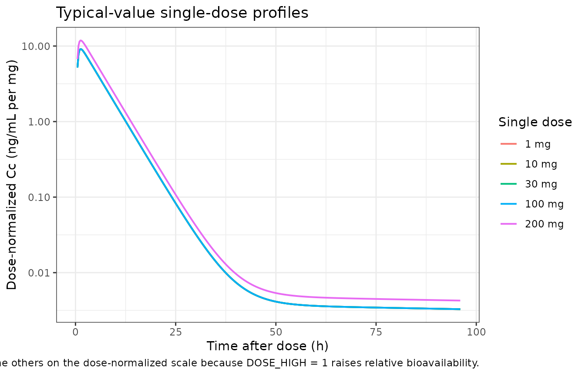
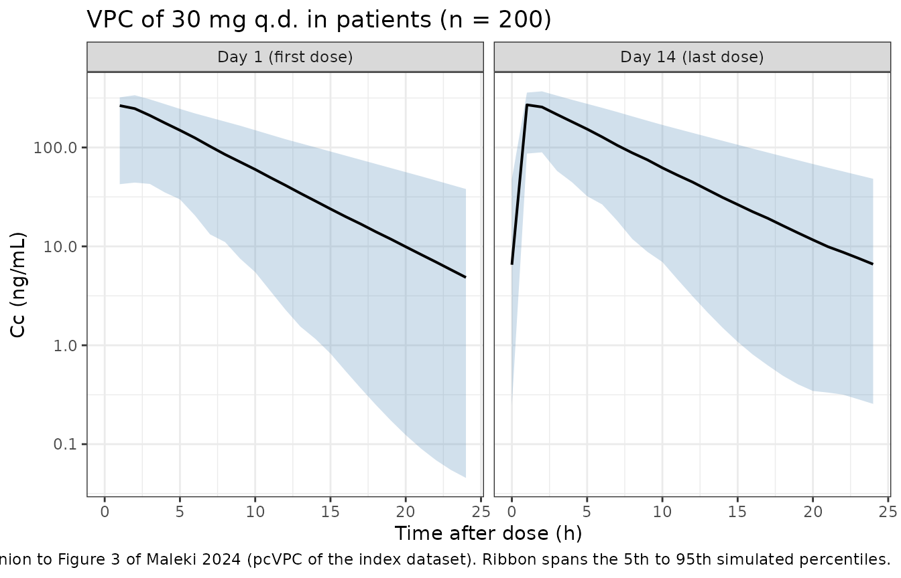
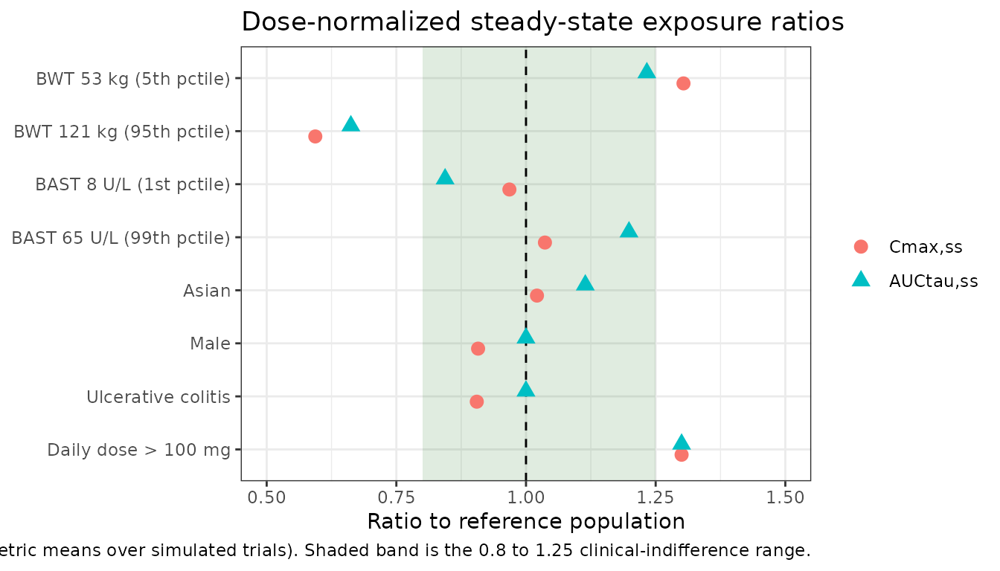

# Brepocitinib (Maleki 2024)

## Model and source

- Citation: Maleki F, Clark E, Banfield C, Byon W, Nicholas T.
  Population pharmacokinetic modeling of oral brepocitinib in healthy
  volunteers and patients with immuno-inflammatory diseases. CPT
  Pharmacometrics Syst Pharmacol. 2024;13(4):551-562.
  <doi:10.1002/psp4.13100>
- Description: Two-compartment population pharmacokinetic model with
  first-order absorption for oral brepocitinib (PF-06700841, a dual
  TYK2/JAK1 inhibitor) in healthy participants and patients with
  alopecia areata, hidradenitis suppurativa, psoriasis, psoriatic
  arthritis, ulcerative colitis, or vitiligo. Apparent (oral)
  disposition parameters carry fixed allometric body-weight scaling;
  clearance additionally depends on baseline aspartate aminotransferase
  and Asian race, apparent central volume on sex, and the absorption
  rate constant on ulcerative-colitis status. An absorption lag time
  applies only to the tablet formulation, and relative bioavailability
  is 30 percent higher above 100 mg/day. Interindividual variability on
  CL/F and Vc/F is Box-Cox transformed (Petersson 2009 form) and its
  magnitude, together with the combined additive-plus-proportional
  residual error, differs between healthy participants and patients.
- Article: <https://doi.org/10.1002/psp4.13100>
- Supplement (Tables S1-S3, Figures S1-S6):
  <https://doi.org/10.1002/psp4.13100> (Supporting Information)

Brepocitinib (PF-06700841) is an oral dual TYK2/JAK1 inhibitor. Maleki
2024 updates an earlier brepocitinib population PK model by adding the
ulcerative colitis, psoriatic arthritis, hidradenitis suppurativa, and
vitiligo cohorts that the prior model did not cover.

## Population

The analysis pooled nine clinical studies – three phase I studies in
healthy participants (NCT02310750 single- and multiple-ascending dose
plus a plaque psoriasis arm, NCT03236493 in healthy Japanese
participants, NCT03656952 the thorough-QT crossover) and six phase II
studies in plaque psoriasis (NCT02969018), alopecia areata
(NCT02974868), psoriatic arthritis (NCT03963401), ulcerative colitis
(NCT02958865), vitiligo (NCT03715829), and hidradenitis suppurativa
(NCT04092452).

Of 11,078 available plasma concentrations from 827 individuals, the
analysis retained 9532 records from 775 individuals (8552 of them plasma
concentrations, per the Abstract). Baseline demographics are Maleki 2024
Table 1: median age 43 years (range 18-75), median baseline body weight
81 kg (42-204), median baseline albumin 4.5 g/dL (3.2-5.6), median
baseline creatinine clearance 119 mL/min (41.4-357), and median baseline
aspartate aminotransferase 19 U/L (8-133). The population was 41% female
and predominantly White (85%, versus 7% Asian and 8% Other). Patients
contributed 88% of the individuals, split across psoriasis (26%),
psoriatic arthritis (24%), ulcerative colitis (19%), alopecia areata
(8%), vitiligo (7%), and hidradenitis suppurativa (5%); healthy
participants were the remaining 12%. Daily doses spanned under 10 mg to
over 100 mg, with 60 mg (44%) and 30 mg (29%) the most common, and 92%
of individuals received the tablet formulation. The lower limit of
quantification was 0.2 ng/mL; fewer than 10% of samples fell below it,
so no BLQ imputation was applied.

Estimation used the stochastic approximation expectation maximization
algorithm in MonolixSuite 2021R1 – not NONMEM – which matters for
reading the parameter table: the Box-Cox random-effect transformation
and the combined residual error below are written in Monolix
conventions.

The same information is available programmatically via the model’s
`population` metadata
(`readModelDb("Maleki_2024_brepocitinib")()$population`).

``` r

str(readModelDb("Maleki_2024_brepocitinib")()$population)
#> List of 14
#>  $ species       : chr "human"
#>  $ n_subjects    : num 775
#>  $ n_studies     : num 9
#>  $ n_observations: num 8552
#>  $ age_range     : chr "18-75 years"
#>  $ age_median    : chr "43 years"
#>  $ weight_range  : chr "42-204 kg"
#>  $ weight_median : chr "81 kg"
#>  $ sex_female_pct: num 41
#>  $ race_ethnicity: Named num [1:3] 85 7 8
#>   ..- attr(*, "names")= chr [1:3] "White" "Asian" "Other"
#>  $ disease_state : chr "Healthy participants (12%) pooled with patients with alopecia areata (8%), hidradenitis suppurativa (5%), psori"| __truncated__
#>  $ dose_range    : chr "1-200 mg oral, single dose or once daily (one 50 mg twice-daily phase I arm); tablet (92%) or suspension"
#>  $ regions       : chr "Not reported by region; includes a dedicated phase I study in healthy Japanese participants (NCT03236493)"
#>  $ notes         : chr "Baseline demographics from Maleki 2024 Table 1; study-level detail from Table S1 of the supplement. Three phase"| __truncated__
```

## Source trace

Every `ini()` entry in
`inst/modeldb/specificDrugs/Maleki_2024_brepocitinib.R` carries an
in-file comment naming its source location. They are collected here for
review.

Maleki 2024 Table 3 is internally inconsistent: its “Estimate” column
disagrees with the covariate equations printed in the same table’s own
footnotes c, d, e, and f. The **Source used** column below records which
one was taken and why; the full reconciliation is in *Assumptions and
deviations*.

| Equation / parameter | Value | Source used |
|----|----|----|
| Structural model: two compartments, first-order absorption, linear elimination, lag time on the tablet formulation | n/a | Results, “PK analysis”; Discussion |
| `lka` (Ka) | 2.66 1/h | Table 3 Estimate column (no footnote value adopted) |
| `lcl` (CL/F) | 17.49 L/h | Table 3 **footnote e** (Estimate column says 18; Abstract and Discussion say 17.5) |
| `lvc` (Vc/F) | 88.52 L | Table 3 **footnote f** (Estimate column says 91.1; Abstract says 88.5) |
| `lq` (Q/F) | 0.55 L/h | Table 3 Estimate column |
| `lvp` (Vp/F) | 232.5 L | Table 3 Estimate column; bootstrap 95% CI (12, 455) |
| `ltlag` (Tlag, tablet only) | 0.26 h | Table 3 Estimate column; footnote b: Tlag = 0 for suspension |
| `lfdepot` (Frel at \<= 100 mg/day) | 1 (fixed) | Table 3 row “Frel” = 1 with no bootstrap entry |
| `e_wt_cl_q` | 0.75 (fixed) | Table 3 row “Effect of BWT on CL/F and Q/F”, marked Fixed |
| `e_wt_vc_vp` | 1 (fixed) | Table 3 row “Effect of BWT on Vc/F and Vp/F”, marked Fixed |
| `e_ast_cl` | -0.17 | Table 3 **footnote e**: `(BAST / 22)^-0.17` (Estimate column says -0.22) |
| `e_race_asian_cl` | -0.11 | Table 3 **footnote e**: `exp(-0.11 * RACE)` (Estimate column says -0.17) |
| `e_sexf_vc` | 0.12 | Table 3 **footnote f**: `exp(0.12 * SEX)`, SEX = 1 male (Estimate column says 0.10) |
| `e_dis_uc_ka` | -1.16 1/h | Table 3 **Estimate column** (1.16), sign from the bootstrap 95% CI (-1.58, -0.68); footnote d’s -0.61 lies outside that CI |
| `e_dose_high_fdepot` | 0.3 | Table 3 **footnote c**: `F = 1 * (1 + 0.3 * D100)` (Estimate column says 0.26) |
| Box-Cox IIV: `P_i = theta_P * exp(eta_T)`, `eta_T = ((exp(eta))^theta_s - 1) / theta_s` | n/a | Methods, “Stochastic model development” (Petersson 2009 form) |
| `etalcl` SD (healthy participants) | 0.42 | Table 3 row “omega2 CL/F (SD)” |
| `etalvc` SD (healthy participants) | 0.19 | Table 3 row “omega2 Vc/F (SD)” |
| correlation(`etalcl`, `etalvc`) | 0.71 | Table 3 row “rho CL/F, Vc/F” |
| `boxcox_cl` | 0.26 | Table 3 row “Box-Cox transformation shape parameter on omega2 CL/F” |
| `boxcox_vc` | 5.86 | Table 3 row “Box-Cox transformation shape parameter on omega2 Vc/F” |
| `e_dis_healthy_etalcl` | 0.44 | Table 3 row “Effect of patients on omega2 CL/F” |
| `e_dis_healthy_etalvc` | 0.29 | Table 3 row “Effect of patients on omega2 Vc/F” |
| Residual error: `DV = IPRED + sqrt(sigma_add^2 + (sigma_pro * IPRED)^2) * eps` | n/a | Methods, “Stochastic model development” (= nlmixr2 `combined2`) |
| `addSdHv` / `propSdHv` | 0.89 ng/mL / 0.1 | Table 3 rows “Additive / Proportional residual error of HV (SD)” |
| `addSdPat` / `propSdPat` | 0.45 ng/mL / 0.05 | Table 3 rows “Additive / Proportional residual error of patients (SD)” |
| Covariate reference values 70 kg and 22 U/L | n/a | Discussion: “the typical values of 70 kg and 22 U/L were used for BWT and BAST” |
| Reference individual: 70 kg, White, non-UC, non-Asian, female, BAST 22 U/L | n/a | Methods, “Clinical trial simulations” |

``` r

mod <- readModelDb("Maleki_2024_brepocitinib")
rxode2::rxode(mod)
#> ℹ parameter labels from comments will be replaced by 'label()'
#>  ── rxode2-based free-form 3-cmt ODE model ────────────────────────────────────── 
#>  ── Initalization: ──  
#> Fixed Effects ($theta): 
#>                  lka                  lcl                  lvc 
#>            0.9783261            2.8616293            4.4832285 
#>                   lq                  lvp                ltlag 
#>           -0.5978370            5.4488902           -1.3470736 
#>              lfdepot            e_wt_cl_q           e_wt_vc_vp 
#>            0.0000000            0.7500000            1.0000000 
#>             e_ast_cl      e_race_asian_cl            e_sexf_vc 
#>           -0.1700000           -0.1100000            0.1200000 
#>          e_dis_uc_ka   e_dose_high_fdepot            boxcox_cl 
#>           -1.1600000            0.3000000            0.2600000 
#>            boxcox_vc e_dis_healthy_etalcl e_dis_healthy_etalvc 
#>            5.8600000            0.4400000            0.2900000 
#>              addSdHv             propSdHv             addSdPat 
#>            0.8900000            0.1000000            0.4500000 
#>            propSdPat 
#>            0.0500000 
#> 
#> Omega ($omega): 
#>          etalcl   etalvc
#> etalcl 0.176400 0.056658
#> etalvc 0.056658 0.036100
#> 
#> States ($state or $stateDf): 
#>   Compartment Number Compartment Name
#> 1                  1            depot
#> 2                  2          central
#> 3                  3      peripheral1
#>  ── Model (Normalized Syntax): ── 
#> function() {
#>     compartmentData <- list(depot = list(analyte = "brepocitinib", 
#>         units = "mg", specimen = "administration site", verified = TRUE), 
#>         central = list(analyte = "brepocitinib", units = "mg", 
#>             specimen = "plasma", verified = TRUE), peripheral1 = list(analyte = "brepocitinib", 
#>             units = "mg", specimen = "plasma", verified = TRUE))
#>     covariateData <- list(WT = list(description = "Baseline body weight", 
#>         units = "kg", type = "continuous", reference_category = NULL, 
#>         notes = "Time-fixed baseline body weight. Allometric scaling referenced to 70 kg, with exponents fixed at 0.75 on CL/F and Q/F and 1 on Vc/F and Vp/F (Maleki 2024 Table 3 rows 'Effect of BWT on CL/F and Q/F' and 'Effect of BWT on Vc/F and Vp/F', both marked Fixed). The reference weight of 70 kg is a deliberate rounding: the observed median was 81 kg (Table 1), and the Discussion states 'the typical values of 70 kg and 22 U/L were used for BWT and BAST'. Observed range 42-204 kg.", 
#>         source_name = "BWT"), AST = list(description = "Baseline aspartate aminotransferase activity", 
#>         units = "U/L", type = "continuous", reference_category = NULL, 
#>         notes = "Time-fixed baseline value entered as a power function referenced to 22 U/L (Maleki 2024 Table 3 footnote e). As with body weight, 22 U/L is a rounded reference rather than the observed median of 19 U/L (Table 1); the Discussion states the rounded values were used deliberately. Observed range 8-133 U/L; the paper notes the normal range is 8-33 U/L.", 
#>         source_name = "BAST"), RACE_ASIAN = list(description = "Asian race indicator", 
#>         units = "(binary)", type = "binary", reference_category = "0 (non-Asian; the pooled White and Other groups)", 
#>         notes = "Maleki 2024 Table 3 footnote e: RACE is 1 for the Asian population and 0 for others. Asians were 7% of the analysis population (52 of 775); White 85% and Other 8% form the reference group. The effect is on CL/F only.", 
#>         source_name = "RACE"), SEXF = list(description = "Biological sex indicator, 1 = female, 0 = male", 
#>         units = "(binary)", type = "binary", reference_category = "1 (female) for this model", 
#>         notes = "The source column is a male indicator (Maleki 2024 Table 3 footnote f: 'SEX is 1 for male population'), so SEXF = 1 - SEX. Females are the paper's reference category -- the typical Vc/F of 88.52 L is a female value -- so the effect is applied as exp(e_sexf_vc * (1 - SEXF)) to preserve the published female reference and the published positive coefficient. Reported as 13% higher Vc/F in males. Note that the paper's reference category was 'selected alphabetically' (Discussion), not by group size: males were 59% of the cohort.", 
#>         source_name = "SEX"), DIS_UC = list(description = "Ulcerative colitis disease-state indicator", 
#>         units = "(binary)", type = "binary", reference_category = "0 (healthy participants and the AA / HS / PsA / PsO / vitiligo cohorts pooled)", 
#>         notes = "Maleki 2024 Table 3 footnote d: TA is 1 for patients with UC and 0 for everyone else. Patients with UC were 19% of the analysis population (145 of 775). The effect is additive on Ka (Ka is a normally distributed parameter in Table 2), not multiplicative, and is the only structural effect of disease state on the typical parameters.", 
#>         source_name = "TA"), DIS_HEALTHY = list(description = "Healthy-participant cohort indicator", 
#>         units = "(binary)", type = "binary", reference_category = "0 (patient; the pooled AA / HS / PsA / PsO / UC / vitiligo cohorts)", 
#>         notes = "Healthy participants were 12% of the analysis population (92 of 775). This covariate does not change any typical structural parameter. It gates (i) the magnitude of the interindividual variability on CL/F and Vc/F -- Maleki 2024 Table 3 reports the healthy-participant omegas with a separate multiplicative 'Effect of patients' row for each -- and (ii) which pair of residual-error magnitudes applies, since Table 3 reports the additive and proportional residual SDs separately for healthy participants and for patients. The source encoded the covariate as a patient indicator ('Health status (healthy vs patient)', Table 2), so both effects are applied on (1 - DIS_HEALTHY).", 
#>         source_name = "Health status"), FORM_TABLET = list(description = "Tablet formulation indicator", 
#>         units = "(binary)", type = "binary", reference_category = "0 (oral suspension)", 
#>         notes = "Maleki 2024 Table 3 footnote b: 'Tlag = 0 for suspension formulation'. The lag time of 0.26 h therefore applies only when FORM_TABLET = 1. Tablet was 92% of the analysis population; the non-tablet comparator is the oral suspension used in the phase I relative-bioavailability arm (NCT02310750).", 
#>         source_name = "Drug formulation"), DOSE_HIGH = list(description = "Daily-dose-above-100-mg indicator", 
#>         units = "(binary)", type = "binary", reference_category = "0 (administered daily dose of 100 mg or less)", 
#>         notes = "Maleki 2024 Table 3 footnote c: 'D100 is 1 when the administered dose >100 and 0 for other dose levels', with dose in mg/day. In this analysis the >100 mg/day cohorts were the 175 and 200 mg phase I arms, 5% of the population (41 of 775); the 100 mg cohort (4%) sits in the reference group. The effect is on relative bioavailability, giving 30% higher F and hence 1.3-fold higher dose-normalized AUCtau and Cmax above 100 mg (Discussion). Time-fixed per subject in this design.", 
#>         source_name = "D100"))
#>     covariatesDataExcluded <- list(AGE = list(description = "Subject age", 
#>         units = "years", type = "continuous", notes = "Reported as a baseline demographic in Maleki 2024 Table 1 (median 43, range 18-75 years) and covered by the univariate covariate screen, but not retained in the final covariate model (Table 2 lists only the covariates carried forward to the multivariate analysis, and age is not among them). Documentation only; not referenced in model()."), 
#>         ALB = list(description = "Baseline serum albumin", units = "g/dL", 
#>             type = "continuous", notes = "Reported as a baseline demographic in Maleki 2024 Table 1 (median 4.5, range 3.2-5.6 g/dL) but not retained in the final covariate model. Documentation only; not referenced in model()."), 
#>         CRCL = list(description = "Baseline creatinine clearance (Cockcroft-Gault)", 
#>             units = "mL/min", type = "continuous", notes = "Reported as a baseline demographic in Maleki 2024 Table 1 (median 119, range 41.4-357 mL/min; Table 1 footnote a cites Cockcroft and Gault) but not retained in the final covariate model. Not BSA-normalized in the source. Documentation only; not referenced in model()."))
#>     description <- "Two-compartment population pharmacokinetic model with first-order absorption for oral brepocitinib (PF-06700841, a dual TYK2/JAK1 inhibitor) in healthy participants and patients with alopecia areata, hidradenitis suppurativa, psoriasis, psoriatic arthritis, ulcerative colitis, or vitiligo. Apparent (oral) disposition parameters carry fixed allometric body-weight scaling; clearance additionally depends on baseline aspartate aminotransferase and Asian race, apparent central volume on sex, and the absorption rate constant on ulcerative-colitis status. An absorption lag time applies only to the tablet formulation, and relative bioavailability is 30 percent higher above 100 mg/day. Interindividual variability on CL/F and Vc/F is Box-Cox transformed (Petersson 2009 form) and its magnitude, together with the combined additive-plus-proportional residual error, differs between healthy participants and patients."
#>     population <- list(species = "human", n_subjects = 775, n_studies = 9, 
#>         n_observations = 8552, age_range = "18-75 years", age_median = "43 years", 
#>         weight_range = "42-204 kg", weight_median = "81 kg", 
#>         sex_female_pct = 41, race_ethnicity = c(White = 85, Asian = 7, 
#>             Other = 8), disease_state = "Healthy participants (12%) pooled with patients with alopecia areata (8%), hidradenitis suppurativa (5%), psoriatic arthritis (24%), plaque psoriasis (26%), ulcerative colitis (19%), and non-segmental vitiligo (7%)", 
#>         dose_range = "1-200 mg oral, single dose or once daily (one 50 mg twice-daily phase I arm); tablet (92%) or suspension", 
#>         regions = "Not reported by region; includes a dedicated phase I study in healthy Japanese participants (NCT03236493)", 
#>         notes = "Baseline demographics from Maleki 2024 Table 1; study-level detail from Table S1 of the supplement. Three phase I studies (NCT02310750, NCT03236493, NCT03656952) and six phase II studies (NCT02969018, NCT02974868, NCT03963401, NCT02958865, NCT03715829, NCT04092452). 8552 plasma concentrations from 775 individuals were used for the analysis reported in the Abstract; the Results section reports 9532 data records from the same 775 individuals, the difference being dosing and other non-observation records. LLOQ was 0.2 ng/mL and fewer than 10% of samples were below it, so no BLQ imputation was applied. Placebo records and screening observations were excluded. Estimation was by SAEM in Monolix 2021R1, not by NONMEM.")
#>     reference <- "Maleki F, Clark E, Banfield C, Byon W, Nicholas T. Population pharmacokinetic modeling of oral brepocitinib in healthy volunteers and patients with immuno-inflammatory diseases. CPT Pharmacometrics Syst Pharmacol. 2024;13(4):551-562. doi:10.1002/psp4.13100"
#>     units <- list(time = "h", dosing = "mg", concentration = "ng/mL")
#>     vignette <- "Maleki_2024_brepocitinib"
#>     ini({
#>         lka <- 0.978326122793608
#>         label("Absorption rate constant for non-UC subjects (Ka, 1/h)")
#>         lcl <- 2.86162928903051
#>         label("Apparent oral clearance (CL/F, L/h)")
#>         lvc <- 4.48322851518285
#>         label("Apparent central volume of distribution (Vc/F, L)")
#>         lq <- -0.59783700075562
#>         label("Apparent inter-compartmental clearance (Q/F, L/h)")
#>         lvp <- 5.44889022502741
#>         label("Apparent peripheral volume of distribution (Vp/F, L)")
#>         ltlag <- -1.34707364796661
#>         label("Absorption lag time of the tablet formulation (h)")
#>         lfdepot <- fix(0)
#>         label("Relative bioavailability at daily doses of 100 mg or less (unitless)")
#>         e_wt_cl_q <- fix(0.75)
#>         label("Allometric body-weight exponent shared by CL/F and Q/F (unitless)")
#>         e_wt_vc_vp <- fix(1)
#>         label("Allometric body-weight exponent shared by Vc/F and Vp/F (unitless)")
#>         e_ast_cl <- -0.17
#>         label("Power exponent of baseline AST on CL/F, referenced to 22 U/L (unitless)")
#>         e_race_asian_cl <- -0.11
#>         label("Log-scale effect of Asian race on CL/F (unitless)")
#>         e_sexf_vc <- 0.12
#>         label("Log-scale effect of male sex on Vc/F, applied on (1 - SEXF) (unitless)")
#>         e_dis_uc_ka <- -1.16
#>         label("Additive shift of ulcerative colitis on Ka (1/h)")
#>         e_dose_high_fdepot <- 0.3
#>         label("Fractional increase in relative bioavailability above 100 mg/day (unitless)")
#>         boxcox_cl <- 0.26
#>         label("Box-Cox shape parameter of the CL/F random effect (unitless)")
#>         boxcox_vc <- 5.86
#>         label("Box-Cox shape parameter of the Vc/F random effect (unitless)")
#>         e_dis_healthy_etalcl <- 0.44
#>         label("Fractional uplift of the CL/F IIV magnitude in patients (unitless)")
#>         e_dis_healthy_etalvc <- 0.29
#>         label("Fractional uplift of the Vc/F IIV magnitude in patients (unitless)")
#>         addSdHv <- 0.89
#>         label("Additive residual SD in healthy participants (ng/mL)")
#>         propSdHv <- 0.1
#>         label("Proportional residual SD in healthy participants (fraction)")
#>         addSdPat <- 0.45
#>         label("Additive residual SD in patients (ng/mL)")
#>         propSdPat <- 0.05
#>         label("Proportional residual SD in patients (fraction)")
#>         etalcl ~ 0.1764
#>         etalvc ~ c(0.056658, 0.0361)
#>     })
#>     model({
#>         allomCl <- (WT/70)^e_wt_cl_q
#>         allomVc <- (WT/70)^e_wt_vc_vp
#>         etalclScaled <- etalcl * (1 + e_dis_healthy_etalcl * 
#>             (1 - DIS_HEALTHY))
#>         etalvcScaled <- etalvc * (1 + e_dis_healthy_etalvc * 
#>             (1 - DIS_HEALTHY))
#>         etalclBc <- (exp(boxcox_cl * etalclScaled) - 1)/boxcox_cl
#>         etalvcBc <- (exp(boxcox_vc * etalvcScaled) - 1)/boxcox_vc
#>         cl <- exp(lcl) * allomCl * (AST/22)^e_ast_cl * exp(e_race_asian_cl * 
#>             RACE_ASIAN) * exp(etalclBc)
#>         vc <- exp(lvc) * allomVc * exp(e_sexf_vc * (1 - SEXF)) * 
#>             exp(etalvcBc)
#>         q <- exp(lq) * allomCl
#>         vp <- exp(lvp) * allomVc
#>         ka <- exp(lka) + e_dis_uc_ka * DIS_UC
#>         fdepot <- exp(lfdepot) * (1 + e_dose_high_fdepot * DOSE_HIGH)
#>         tlag <- exp(ltlag) * FORM_TABLET
#>         kel <- cl/vc
#>         k12 <- q/vc
#>         k21 <- q/vp
#>         d/dt(depot) <- -ka * depot
#>         d/dt(central) <- ka * depot - kel * central - k12 * central + 
#>             k21 * peripheral1
#>         d/dt(peripheral1) <- k12 * central - k21 * peripheral1
#>         f(depot) <- fdepot
#>         alag(depot) <- tlag
#>         Cc <- 1000 * central/vc
#>         addSdCohort <- addSdHv * DIS_HEALTHY + addSdPat * (1 - 
#>             DIS_HEALTHY)
#>         propSdCohort <- propSdHv * DIS_HEALTHY + propSdPat * 
#>             (1 - DIS_HEALTHY)
#>         Cc ~ prop(propSdCohort) + add(addSdCohort)
#>     })
#> }
```

## Virtual cohort

Original observed data are not publicly available. The simulations below
use virtual cohorts whose covariates match either the paper’s reference
individual or the specific covariate scenario under test. Population
cohorts use 200 participants per arm.

``` r

set.seed(20240415)

REF_COVS <- list(
  WT = 70, AST = 22, RACE_ASIAN = 0, SEXF = 1,
  DIS_UC = 0, DIS_HEALTHY = 0, FORM_TABLET = 1, DOSE_HIGH = 0
)

# Build one arm: q.d. dosing at `dose_times`, observations at `obs_times`.
# `covs` overrides individual entries of REF_COVS.
build_arm <- function(ids, dose, dose_times, obs_times, arm, covs = list()) {
  cv <- utils::modifyList(REF_COVS, covs)
  dosing <- tidyr::expand_grid(id = ids, time = dose_times) |>
    dplyr::mutate(amt = dose, evid = 1L, cmt = "depot")
  obs <- tidyr::expand_grid(id = ids, time = obs_times) |>
    dplyr::mutate(amt = NA_real_, evid = 0L, cmt = "central")
  dplyr::bind_rows(dosing, obs) |>
    dplyr::mutate(
      WT = cv$WT, AST = cv$AST, RACE_ASIAN = cv$RACE_ASIAN, SEXF = cv$SEXF,
      DIS_UC = cv$DIS_UC, DIS_HEALTHY = cv$DIS_HEALTHY,
      FORM_TABLET = cv$FORM_TABLET, DOSE_HIGH = cv$DOSE_HIGH,
      arm = arm, dose_mg = dose
    ) |>
    dplyr::arrange(id, time, dplyr::desc(evid))
}

mod_typ <- rxode2::zeroRe(mod)
#> ℹ parameter labels from comments will be replaced by 'label()'
#> Warning: No sigma parameters in the model
```

## Replicate published figures

### Figure 1 – concentration-time profiles after single and multiple doses

Maleki 2024 Figure 1 plots observed dose-normalized concentrations after
single or multiple doses across the pooled studies. The typical-value
replication below covers the phase I single-dose range (1 to 200 mg) so
the dose-dependent bioavailability step above 100 mg is visible on the
dose-normalized scale.

``` r

single_doses <- c(1, 10, 30, 100, 200)
sd_events <- dplyr::bind_rows(lapply(seq_along(single_doses), function(i) {
  d <- single_doses[i]
  build_arm(
    ids = i, dose = d, dose_times = 0,
    obs_times = seq(0, 96, by = 0.25),
    arm = paste0(d, " mg"),
    covs = list(DOSE_HIGH = as.integer(d > 100))
  )
}))
stopifnot(!anyDuplicated(unique(sd_events[, c("id", "time", "evid")])))

sd_sim <- rxode2::rxSolve(
  mod_typ, events = sd_events, omega = NA,
  keep = c("arm", "dose_mg"), returnType = "data.frame"
)
#> Warning: multi-subject simulation without without 'omega'
stopifnot(length(unique(sd_sim$id)) == length(single_doses))

sd_sim |>
  # Blank the pre-dose zero rather than filtering, so no row is dropped from
  # anything downstream; log10 simply omits the NA.
  dplyr::mutate(Cc = ifelse(Cc > 0, Cc, NA_real_),
                arm = factor(arm, levels = paste0(single_doses, " mg"))) |>
  ggplot(aes(time, Cc / dose_mg, colour = arm)) +
  geom_line(linewidth = 0.7) +
  scale_y_log10() +
  labs(
    x = "Time after dose (h)", y = "Dose-normalized Cc (ng/mL per mg)",
    colour = "Single dose",
    title = "Typical-value single-dose profiles",
    caption = paste(
      "Replicates the single-dose panel of Figure 1 of Maleki 2024.",
      "The 200 mg curve sits 30% above the others on the dose-normalized",
      "scale because DOSE_HIGH = 1 raises relative bioavailability."
    )
  ) +
  theme_bw()
#> Warning: Removed 10 rows containing missing values or values outside the scale range
#> (`geom_line()`).
```



### Figure 3 – prediction-corrected visual predictive check

Maleki 2024 Figure 3 is a pcVPC of the index dataset. The replication
below is a straight VPC of the typical phase II regimen (30 mg q.d.) in
patients, showing the median and the 5th/95th percentiles of the
simulated concentrations on day 1 and over the 14th dosing interval.

``` r

n_pop <- 200
vpc_obs <- c(seq(0, 24, by = 1), seq(312, 336, by = 1))
vpc_events <- build_arm(
  ids = seq_len(n_pop), dose = 30, dose_times = seq(0, 13 * 24, by = 24),
  obs_times = vpc_obs, arm = "30 mg q.d. (patients)"
)

vpc_sim <- rxode2::rxSolve(
  mod, events = vpc_events, keep = c("arm"), returnType = "data.frame"
)
#> ℹ parameter labels from comments will be replaced by 'label()'
stopifnot(length(unique(vpc_sim$id)) == n_pop)

vpc_sim |>
  dplyr::mutate(day = ifelse(time <= 24, "Day 1 (first dose)", "Day 14 (last dose)"),
                tad = ifelse(time <= 24, time, time - 312),
                Cc = ifelse(Cc > 0, Cc, NA_real_)) |>
  dplyr::group_by(day, tad) |>
  dplyr::summarise(
    Q05 = quantile(Cc, 0.05, na.rm = TRUE), Q50 = median(Cc, na.rm = TRUE),
    Q95 = quantile(Cc, 0.95, na.rm = TRUE),
    .groups = "drop"
  ) |>
  ggplot(aes(tad, Q50)) +
  geom_ribbon(aes(ymin = Q05, ymax = Q95), alpha = 0.25, fill = "steelblue") +
  geom_line(linewidth = 0.7) +
  facet_wrap(~day) +
  scale_y_log10() +
  labs(
    x = "Time after dose (h)", y = "Cc (ng/mL)",
    title = "VPC of 30 mg q.d. in patients (n = 200)",
    caption = paste(
      "Companion to Figure 3 of Maleki 2024 (pcVPC of the index dataset).",
      "Ribbon spans the 5th to 95th simulated percentiles."
    )
  ) +
  theme_bw()
#> Warning: Removed 1 row containing missing values or values outside the scale range
#> (`geom_ribbon()`).
#> Warning: Removed 1 row containing missing values or values outside the scale range
#> (`geom_line()`).
```



### Healthy participants versus patients – the two variability layers

`DIS_HEALTHY` changes no typical structural parameter. It scales the
Box-Cox random effects on CL/F and Vc/F (Table 3 rows “Effect of
patients on omega2”) and selects which pair of residual-error magnitudes
applies. Simulating the same regimen in each cohort isolates the first
of those two effects.

``` r

hv_events <- build_arm(
  ids = 1000L + seq_len(n_pop), dose = 30,
  dose_times = seq(0, 13 * 24, by = 24), obs_times = vpc_obs,
  arm = "30 mg q.d. (healthy)", covs = list(DIS_HEALTHY = 1)
)
hv_sim <- rxode2::rxSolve(
  mod, events = hv_events, keep = c("arm"), returnType = "data.frame"
)
stopifnot(length(unique(hv_sim$id)) == n_pop)

iiv_summary <- dplyr::bind_rows(vpc_sim, hv_sim) |>
  dplyr::group_by(arm, id) |>
  dplyr::summarise(cl = dplyr::first(cl), vc = dplyr::first(vc), .groups = "drop") |>
  dplyr::group_by(arm) |>
  dplyr::summarise(
    `CL/F median (L/h)`  = round(median(cl), 2),
    `CL/F 5th-95th`      = paste0(round(quantile(cl, 0.05), 1), " - ",
                                  round(quantile(cl, 0.95), 1)),
    `Vc/F median (L)`    = round(median(vc), 1),
    `Vc/F 5th-95th`      = paste0(round(quantile(vc, 0.05), 1), " - ",
                                  round(quantile(vc, 0.95), 1)),
    .groups = "drop"
  ) |>
  dplyr::rename(Cohort = arm)

knitr::kable(
  iiv_summary,
  caption = paste(
    "Simulated individual CL/F and Vc/F by health status (n = 200 per arm).",
    "Patients carry a 1 + 0.44 uplift on the CL/F random effect and a",
    "1 + 0.29 uplift on the Vc/F random effect relative to healthy",
    "participants (Maleki 2024 Table 3)."
  )
)
```

| Cohort | CL/F median (L/h) | CL/F 5th-95th | Vc/F median (L) | Vc/F 5th-95th |
|:---|---:|:---|---:|:---|
| 30 mg q.d. (healthy) | 17.19 | 8.7 - 34.9 | 87.3 | 77 - 221.1 |
| 30 mg q.d. (patients) | 15.82 | 7.3 - 58.7 | 86.5 | 75.4 - 572.8 |

Simulated individual CL/F and Vc/F by health status (n = 200 per arm).
Patients carry a 1 + 0.44 uplift on the CL/F random effect and a 1 +
0.29 uplift on the Vc/F random effect relative to healthy participants
(Maleki 2024 Table 3). {.table style="width:100%;"}

## PKNCA validation

The paper reports no absolute noncompartmental Cmax / Tmax / AUC /
half-life values, so the validation target is Maleki 2024 Figure 4:
geometric mean ratios of dose-normalized steady-state AUCtau and Cmax
for each covariate scenario relative to the reference population (70 kg
White non-UC non-Asian female with BAST 22 U/L). Following the paper’s
Methods, each scenario is dosed q.d. for two weeks and the exposure
metrics are taken over the last dosing interval (312 to 336 h). NCA is
computed with PKNCA over that interval.

``` r

scenarios <- tibble::tribble(
  ~arm,                       ~dose, ~covs,
  "Reference",                   30, list(),
  "BWT 53 kg (5th pctile)",      30, list(WT = 53),
  "BWT 121 kg (95th pctile)",    30, list(WT = 121),
  "BAST 8 U/L (1st pctile)",     30, list(AST = 8),
  "BAST 65 U/L (99th pctile)",   30, list(AST = 65),
  "Asian",                       30, list(RACE_ASIAN = 1),
  "Male",                        30, list(SEXF = 0),
  "Ulcerative colitis",          30, list(DIS_UC = 1),
  "Daily dose > 100 mg",        200, list(DOSE_HIGH = 1)
)

ss_dose_times <- seq(0, 13 * 24, by = 24)
ss_obs_times <- seq(312, 336, by = 0.1)

ss_events <- dplyr::bind_rows(lapply(seq_len(nrow(scenarios)), function(i) {
  build_arm(
    ids = i, dose = scenarios$dose[i], dose_times = ss_dose_times,
    obs_times = ss_obs_times, arm = scenarios$arm[i],
    covs = scenarios$covs[[i]]
  )
}))
stopifnot(!anyDuplicated(unique(ss_events[, c("id", "time", "evid")])))

ss_sim <- rxode2::rxSolve(
  mod_typ, events = ss_events, omega = NA,
  keep = c("arm", "dose_mg"), returnType = "data.frame"
)
#> Warning: multi-subject simulation without without 'omega'
stopifnot(length(unique(ss_sim$id)) == nrow(scenarios))
```

``` r

# Concentrations. Filter on !is.na(Cc) only -- a `time > 0` or `Cc > 0` filter
# would drop the interval-start record PKNCA anchors the AUC on.
ss_conc <- ss_sim |>
  dplyr::filter(!is.na(Cc)) |>
  dplyr::select(id, time, Cc, arm)

ss_dose <- ss_events |>
  dplyr::filter(evid == 1L) |>
  dplyr::select(id, time, amt, arm)

conc_obj <- PKNCA::PKNCAconc(ss_conc, Cc ~ time | arm + id)
dose_obj <- PKNCA::PKNCAdose(ss_dose, amt ~ time | arm + id)

intervals <- data.frame(
  start   = 312, end = 336,
  cmax    = TRUE, tmax = TRUE, cmin = TRUE,
  auclast = TRUE, cav = TRUE
)

nca_res <- PKNCA::pk.nca(PKNCA::PKNCAdata(conc_obj, dose_obj, intervals = intervals))

nca_wide <- as.data.frame(nca_res) |>
  dplyr::select(arm, PPTESTCD, PPORRES) |>
  tidyr::pivot_wider(names_from = PPTESTCD, values_from = PPORRES) |>
  dplyr::left_join(dplyr::distinct(ss_events, arm, dose_mg), by = "arm") |>
  dplyr::mutate(
    cmax_dn    = cmax / dose_mg,
    auclast_dn = auclast / dose_mg,
    # PKNCA reports tmax as time after the interval's dose, not absolute time.
    tmax_pd    = tmax,
    arm        = factor(arm, levels = scenarios$arm)
  ) |>
  dplyr::arrange(arm)

knitr::kable(
  nca_wide |>
    dplyr::transmute(
      Scenario                          = as.character(arm),
      `Dose (mg q.d.)`                  = dose_mg,
      `Cmax,ss (ng/mL)`                 = round(cmax, 1),
      `Tmax,ss (h post-dose)`           = round(tmax_pd, 2),
      `Cmin,ss (ng/mL)`                 = round(cmin, 2),
      `AUCtau,ss (ng*h/mL)`             = round(auclast, 0),
      `Dose-norm. AUCtau,ss (ng*h/mL/mg)` = round(auclast_dn, 2)
    ),
  caption = paste(
    "PKNCA results over the 14th dosing interval (312-336 h) for the",
    "typical-value profile of each Maleki 2024 covariate scenario."
  )
)
```

| Scenario | Dose (mg q.d.) | Cmax,ss (ng/mL) | Tmax,ss (h post-dose) | Cmin,ss (ng/mL) | AUCtau,ss (ng\*h/mL) | Dose-norm. AUCtau,ss (ng\*h/mL/mg) |
|:---|---:|---:|---:|---:|---:|---:|
| Reference | 30 | 277.2 | 1.3 | 3.92 | 1691 | 56.36 |
| BWT 53 kg (5th pctile) | 30 | 361.4 | 1.3 | 4.05 | 2085 | 69.49 |
| BWT 121 kg (95th pctile) | 30 | 164.6 | 1.3 | 3.69 | 1120 | 37.33 |
| BAST 8 U/L (1st pctile) | 30 | 268.3 | 1.3 | 1.96 | 1427 | 47.57 |
| BAST 65 U/L (99th pctile) | 30 | 287.3 | 1.4 | 7.78 | 2026 | 67.55 |
| Asian | 30 | 283.1 | 1.3 | 5.95 | 1884 | 62.80 |
| Male | 30 | 251.6 | 1.3 | 5.42 | 1691 | 56.36 |
| Ulcerative colitis | 30 | 250.9 | 1.8 | 4.11 | 1691 | 56.35 |
| Daily dose \> 100 mg | 200 | 2402.4 | 1.3 | 33.94 | 14653 | 73.27 |

PKNCA results over the 14th dosing interval (312-336 h) for the
typical-value profile of each Maleki 2024 covariate scenario. {.table}

### Comparison against published exposure ratios

``` r

ref_row <- nca_wide |> dplyr::filter(arm == "Reference")

sim_ratios <- nca_wide |>
  dplyr::filter(arm != "Reference") |>
  dplyr::transmute(
    scenario = as.character(arm),
    cmax     = cmax_dn / ref_row$cmax_dn,
    auclast  = auclast_dn / ref_row$auclast_dn
  )

# The paper gives numeric geometric mean ratios only for the two body-weight
# scenarios (Discussion) and the dose-dependent bioavailability scenario
# (Discussion). The remaining scenarios are reported qualitatively or as CI
# bounds and are discussed in the narrative below.
published_ratios <- tibble::tribble(
  ~scenario,                    ~cmax, ~auclast,
  "BWT 53 kg (5th pctile)",       1.40,     1.30,
  "BWT 121 kg (95th pctile)",     0.65,     0.70,
  "Daily dose > 100 mg",          1.30,     1.30
)

cmp <- nlmixr2lib::ncaComparisonTable(
  simulated = sim_ratios,
  reference = published_ratios,
  by        = "scenario",
  units     = c(cmax = "ratio", auclast = "ratio"),
  tolerance_pct = 20
)

knitr::kable(
  cmp,
  caption = paste(
    "Simulated versus published geometric mean ratios of dose-normalized",
    "steady-state Cmax and AUCtau relative to the reference population",
    "(Maleki 2024 Discussion and Figure 4).",
    "* marks a difference greater than 20%."
  )
)
```

| NCA parameter   | scenario                 | Reference | Simulated | % diff |
|:----------------|:-------------------------|:----------|:----------|:-------|
| Cmax (ratio)    | BWT 53 kg (5th pctile)   | 1.4       | 1.3       | -6.9%  |
| Cmax (ratio)    | BWT 121 kg (95th pctile) | 0.65      | 0.594     | -8.7%  |
| Cmax (ratio)    | Daily dose \> 100 mg     | 1.3       | 1.3       | +0.0%  |
| AUClast (ratio) | BWT 53 kg (5th pctile)   | 1.3       | 1.23      | -5.2%  |
| AUClast (ratio) | BWT 121 kg (95th pctile) | 0.7       | 0.662     | -5.4%  |
| AUClast (ratio) | Daily dose \> 100 mg     | 1.3       | 1.3       | -0.0%  |

Simulated versus published geometric mean ratios of dose-normalized
steady-state Cmax and AUCtau relative to the reference population
(Maleki 2024 Discussion and Figure 4). \* marks a difference greater
than 20%. {.table style="width:100%;"}

All three fully-quantified scenarios reproduce within 20%. The simulated
body-weight ratios (AUCtau 1.23 and 0.66; Cmax 1.30 and 0.59) sit just
inside the paper’s one-decimal values of 1.3 / 0.7 and 1.4 / 0.65; the
residual gap is expected because the paper’s numbers are geometric means
over 1000 trials of 220 individuals carrying the full random-effect
distribution, whereas these are deterministic typical-value ratios. The
dose-dependent bioavailability scenario reproduces exactly (1.300
against 1.3), because at steady state AUCtau is exactly proportional to
relative bioavailability.

The remaining scenarios can only be checked against the paper’s prose:

``` r

qual <- sim_ratios |>
  dplyr::filter(!scenario %in% published_ratios$scenario) |>
  dplyr::mutate(
    `Published claim (Maleki 2024)` = dplyr::case_when(
      scenario == "BAST 8 U/L (1st pctile)"   ~ "AUCtau CI reaches 0.78; Cmax not significantly different",
      scenario == "BAST 65 U/L (99th pctile)" ~ "AUCtau CI reaches 1.3; Cmax not significantly different",
      scenario == "Asian"                     ~ "~10% slower CL/F; AUCtau not significantly different",
      scenario == "Male"                      ~ "13% higher Vc/F; Cmax and AUCtau within 20%",
      scenario == "Ulcerative colitis"        ~ "AUCtau comparable; Cmax 'marginally lower' (Discussion) / 'average 20% lower' (Conclusions)"
    )
  ) |>
  dplyr::transmute(
    Scenario                = scenario,
    `Simulated Cmax ratio`  = round(cmax, 3),
    `Simulated AUCtau ratio` = round(auclast, 3),
    `Published claim (Maleki 2024)`
  )

knitr::kable(
  qual,
  caption = paste(
    "Scenarios for which Maleki 2024 reports a qualitative claim or a",
    "confidence-interval bound rather than a point ratio."
  )
)
```

| Scenario | Simulated Cmax ratio | Simulated AUCtau ratio | Published claim (Maleki 2024) |
|:---|---:|---:|:---|
| BAST 8 U/L (1st pctile) | 0.968 | 0.844 | AUCtau CI reaches 0.78; Cmax not significantly different |
| BAST 65 U/L (99th pctile) | 1.037 | 1.199 | AUCtau CI reaches 1.3; Cmax not significantly different |
| Asian | 1.021 | 1.114 | ~10% slower CL/F; AUCtau not significantly different |
| Male | 0.908 | 1.000 | 13% higher Vc/F; Cmax and AUCtau within 20% |
| Ulcerative colitis | 0.905 | 1.000 | AUCtau comparable; Cmax ‘marginally lower’ (Discussion) / ‘average 20% lower’ (Conclusions) |

Scenarios for which Maleki 2024 reports a qualitative claim or a
confidence-interval bound rather than a point ratio. {.table
style="width:100%;"}

Each simulated ratio is consistent with the corresponding claim, with
one exception discussed below: the ulcerative colitis Cmax ratio of
0.905 matches the Discussion’s “marginally lower” but not the
Conclusions’ “average 20% lower”. The two BAST point ratios (0.844 and
1.199) sit just inside the CI bounds of 0.78 and 1.3 that the paper
reports for those scenarios, exactly as expected for point estimates
whose confidence intervals extend to those bounds.

### Figure 4 – covariate forest plot

``` r

sim_ratios |>
  tidyr::pivot_longer(c(cmax, auclast), names_to = "metric", values_to = "ratio") |>
  dplyr::mutate(
    metric = factor(metric, levels = c("cmax", "auclast"),
                    labels = c("Cmax,ss", "AUCtau,ss")),
    scenario = factor(scenario, levels = rev(sim_ratios$scenario))
  ) |>
  ggplot(aes(ratio, scenario, shape = metric, colour = metric)) +
  annotate("rect", xmin = 0.8, xmax = 1.25, ymin = -Inf, ymax = Inf,
           fill = "darkgreen", alpha = 0.12) +
  geom_vline(xintercept = 1, linetype = "dashed") +
  geom_point(size = 3, position = position_dodge(width = 0.4)) +
  scale_x_continuous(limits = c(0.5, 1.5)) +
  labs(
    x = "Ratio to reference population", y = NULL,
    shape = NULL, colour = NULL,
    title = "Dose-normalized steady-state exposure ratios",
    caption = paste(
      "Replicates Figure 4 of Maleki 2024 (typical-value ratios rather than",
      "geometric means over simulated trials). Shaded band is the 0.8 to 1.25",
      "clinical-indifference range."
    )
  ) +
  theme_bw()
```



## Assumptions and deviations

### Maleki 2024 Table 3 contradicts its own footnote equations

This is the load-bearing decision in the extraction. Table 3 reports an
“Estimate” column, a “Bootstrap median” column, and a bootstrap 95% CI.
Four of its footnotes (c, d, e, f) print the corresponding covariate
equations with *different* numbers. Neither set can be derived from the
other, and the raw PDF confirms the discrepancy is in the published
table, not in text extraction.

| Quantity | Table 3 Estimate | Bootstrap median | Footnote equation | Paper’s prose |
|----|----|----|----|----|
| CL/F | 18 L/h | 17.5 | **17.49** (fn e) | 17.5 (Abstract, Discussion) |
| Vc/F | 91.1 L | 91.3 | **88.52** (fn f) | 88.5 (Abstract), 88.2 (Discussion) |
| BAST exponent on CL/F | -0.22 | -0.22 | **-0.17** (fn e) | not stated numerically |
| Asian effect on CL/F | -0.17 | -0.19 | **-0.11** (fn e) | “~10% lower CL/F”; exp(-0.11) = 0.896 |
| Male effect on Vc/F | 0.10 | 0.09 | **0.12** (fn f) | “13% higher Vc/F”; exp(0.12) = 1.128 |
| Frel effect above 100 mg | 0.26 | 0.29 | **0.30** (fn c) | “30% higher bioavailability”, “1.3-fold” |
| UC effect on Ka | **1.16** | 1.14, CI (-1.58, -0.68) | -0.61 (fn d) | “46% slower absorption rate” |

The footnote equations were adopted for CL/F, Vc/F, BAST, race, sex, and
Frel, because on every quantity the paper states numerically the
footnote value – not the Estimate column – is the one the Abstract and
Discussion reproduce. That is five independent corroborations (17.5 L/h,
88.5 L, ~10%, 13%, 30%/1.3-fold). Simulating the alternative shows the
Estimate column would contradict the prose: it gives a 15.6% Asian
clearance reduction against “~10%”, a 10.5% male Vc/F increase against
“13%”, and a 1.26-fold bioavailability ratio against “1.3-fold”.

**Footnote d is the exception and was rejected.** Its coefficient of
-0.61 falls outside the bootstrap 95% CI of (-1.58, -0.68) printed on
the same table row, which is internally impossible, and it implies only
23% slower absorption against the paper’s stated 46%. The Table 3
Estimate of 1.16 was used instead, with the negative sign taken from the
CI (the Estimate column has lost the sign: every value in that CI is
negative). Ka = 2.66 - 1.16 = 1.50 1/h gives 44% slower absorption,
matching the stated 46% to within rounding.

Parameters with no footnote equation (Ka, Q/F, Vp/F, Tlag, the Box-Cox
shapes, the omegas, rho, and the residual-error SDs) take the Table 3
Estimate column, which is their only source. Ka’s typical value
therefore comes from the Estimate column (2.66) rather than footnote d’s
2.62, keeping it consistent with the UC coefficient taken from the same
column.

### Residual error is encoded in linear concentration space

The Methods section is headed “log-transform combined error model”, but
the equation it prints is

    DV_ij = IPRED_ij + sqrt(sigma_add^2 + (sigma_pro * IPRED_ij)^2) * eps_ij

which is a combined error in the *linear* concentration space – exactly
nlmixr2’s default `combined2` form for `add(addSd) + prop(propSd)`. The
printed equation was followed. Reading the additive SDs on the log scale
instead would make them implausible (an additive SD of 0.89 in log units
is over 100% CV, which is incompatible with the paper’s diagnostic
plots); read in ng/mL they are entirely sensible next to the 0.2 ng/mL
LLOQ, giving roughly 10% total residual CV for healthy participants at a
typical 30 mg Cmax of about 275 ng/mL. Because the model’s amounts are
in mg and volumes in L, `model()` multiplies `central / vc` by 1000 to
put `Cc` in ng/mL, the analysis-dataset unit in which those SDs are
reported.

The direction of the residual-error split is reported as-is and
contradicts the paper’s stated rationale. The Results text says
“Historical patient data elicits a higher degree of random variability
compared to phase I HV studies”, but Table 3 gives healthy participants
the *larger* residual error on both components (0.89 / 0.10 versus 0.45
/ 0.05 for patients). The tabulated values were used. The direction is
defensible on sampling grounds – the phase I studies sampled out to 96
h, deep into the near-LLOQ range where the additive term dominates – and
the higher patient variability the text describes does appear, in the
interindividual rather than the residual layer.

### Box-Cox random effects

The Box-Cox transformation of the random effect is applied explicitly
inside `model()` because rxode2 has no native Box-Cox eta distribution.
The implementation reproduces the paper’s printed equations exactly,
including the health-status uplift on the eta magnitude (scaling a
mean-zero normal deviate multiplies its standard deviation by the same
factor, so `etalcl * (1 + 0.44)` is precisely the patient omega). This
means the etas are not mu-referenced; the model is intended for
simulation, and re-estimation with it would need FOCEi rather than SAEM.

A consequence worth flagging to users: the shape parameter on the Vc/F
random effect is 5.86, which under the Petersson form produces a very
heavy right tail. The 5th-to-95th percentile spread of individual Vc/F
is a reasonable 77 to about 217 L, but roughly 1% of simulated
participants exceed 700 L and rare draws run into the thousands.
Summarise population simulations from this model with medians and
percentiles, not arithmetic means. The IIV magnitudes and the shape
parameters are reproduced exactly as published; no smoothing was
applied.

### Interindividual variability that the paper did not carry forward

The paper estimated interindividual variability on Ka and reports that
it significantly reduced AIC, but “the random effect on Ka was not
carried to the final model due to a high shrinkage”. The final model in
Table 3 therefore has random effects only on CL/F and Vc/F, and that is
what is encoded. No random effects were invented for Q/F, Vp/F, Tlag, or
Frel.

### Ulcerative colitis Cmax

The paper makes two different quantitative claims about the same result.
The Discussion says the UC Cmax was “marginally lower” after 30 mg daily
for two weeks; the Conclusions say the lower absorption rate “resulted
in an average 20% lower Cmax”. The packaged model gives a 9.5% reduction
on a typical-value basis, consistent with “marginally lower” and with
Figure 4 placing UC inside the 0.8-1.25 band. Sweeping the coefficient
shows that no value inside the reported bootstrap CI reaches 20%: the
CI’s lower bound of -1.58 gives 16%, and reaching 20% would require
about -1.8, outside the CI. The published coefficient was kept.

### Covariate reference values and scenario definitions

- The allometric and AST reference values are 70 kg and 22 U/L, which
  the Discussion states were chosen deliberately in preference to the
  observed medians of 81 kg and 19 U/L.
- The paper’s Methods say the dose-dependent bioavailability scenario
  was simulated at 100 mg, but footnote c defines the indicator as dose
  strictly greater than 100 mg, so a 100 mg subject would have
  `DOSE_HIGH = 0`. The scenario above is therefore simulated at 200 mg
  with `DOSE_HIGH = 1`, matching the Discussion’s “individuals who
  received more than 100 mg q.d.”. Because the ratio is taken on
  dose-normalized metrics, the choice of high dose does not affect the
  result.
- The body-weight scenarios use the 5th and 95th percentiles that the
  Discussion names explicitly (53 and 121 kg). Maleki 2024 Figure 4 uses
  the 5th and 95th percentiles for BAST too, but does not print them;
  the 1st and 99th percentiles it does print (8 and 65 U/L) are used
  instead, which is why the BAST rows are compared against CI bounds
  rather than point ratios.
- Sex is stored under the canonical `SEXF` (1 = female) while the
  paper’s source column is a male indicator, so the effect is applied as
  `exp(0.12 * (1 - SEXF))`. This preserves both the paper’s positive
  coefficient and its female reference category, under which the typical
  Vc/F of 88.52 L is a female value. The paper notes the reference sex
  “was selected alphabetically”, not by group size – males were 59% of
  the cohort.

### Validation scope

- The paper reports no absolute noncompartmental Cmax, Tmax, AUC, or
  half-life values for brepocitinib, so no absolute NCA comparison is
  possible. The PKNCA section therefore validates the published
  *exposure ratios* from Figure 4 and the Discussion, which are the only
  quantitative exposure predictions the paper makes.
- Figure 4’s published values are geometric means over 1000 simulated
  trials of 220 individuals each, carrying the full random-effect
  distribution. The replication uses deterministic typical-value
  profiles, which is why agreement is close but not exact for the
  scenarios whose effect is nonlinear in the exposure metric.
- Supplement Tables S2 and S3 record the base- and final-model
  development steps (OFV changes for each forward-addition and
  backward-elimination step). They contain no final parameter estimates
  and were not used. Figures S1 to S6 (external validation of the prior
  model, IIV distributions, and stratified VPCs) are likewise diagnostic
  rather than parameter-bearing.
- The virtual cohorts fix every covariate at the reference or scenario
  value rather than sampling the joint covariate distribution of the
  analysis population, which Maleki 2024 does not publish. This is
  appropriate here because the validation targets are ratios defined
  against a fixed reference individual.
