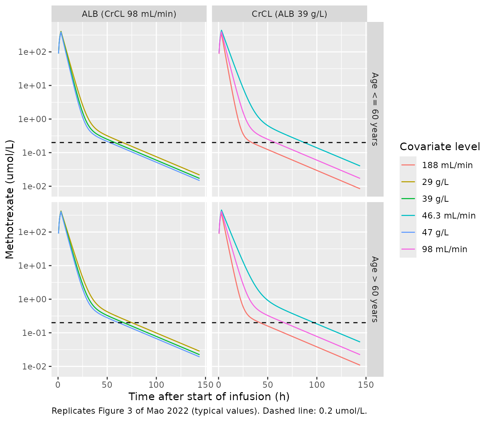
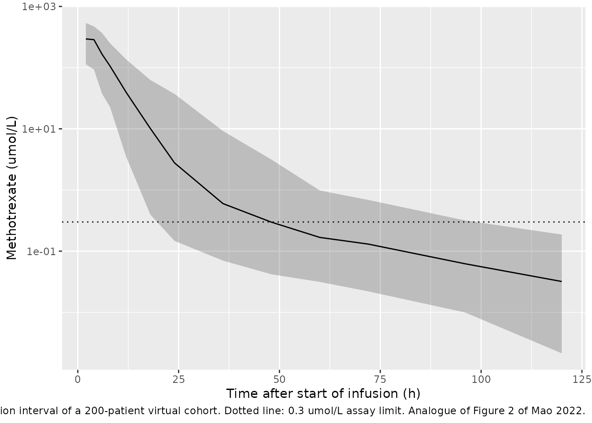

# Methotrexate (Mao 2022)

## Model and source

- Citation: Mao J, Li Q, Li P, Qin W, Chen B, Zhong M. Evaluation and
  Application of Population Pharmacokinetic Models for Identifying
  Delayed Methotrexate Elimination in Patients With Primary Central
  Nervous System Lymphoma. Front Pharmacol. 2022;13:817673.
  <doi:10.3389/fphar.2022.817673>.
- Description: Two-compartment population PK model with linear
  elimination for high-dose intravenous methotrexate in adults with
  primary central nervous system lymphoma (Mao 2022). Apparent clearance
  carries three covariates: a power function of Cockcroft-Gault
  creatinine clearance normalized to 98 mL/min (exponent 0.49), a power
  function of serum albumin normalized to 40 g/L (exponent 0.35), and a
  multiplicative factor of 0.89 for patients older than 60 years.
  Between-subject variability on CL, Vc, Q and Vp, a single shared
  between-occasion (per-course) variability on CL, and a proportional
  residual error.
- Article: <https://doi.org/10.3389/fphar.2022.817673>

Mao 2022 first re-implemented eight published high-dose methotrexate
(HD-MTX) population PK models in adults with lymphoid malignancies and
found that none predicted their own centre’s data acceptably (Table 4).
They then built a new two-compartment model from that data, which is the
model packaged here, and used it in a Monte Carlo simulation to find
which patients are at risk of delayed methotrexate elimination. The
eight published models are only evaluated in the paper, not
re-estimated, so they are not part of this extraction.

## Population

Seventy-seven adults (49 men, 28 women) with primary central nervous
system lymphoma treated with HD-MTX (\> 1 g/m^2) at Huashan Hospital,
Shanghai, between June 2011 and November 2016 contributed 377 courses
(1-17 per patient) and 1,458 plasma concentrations (Table 1). Median age
was 56 years (range 28-76), weight 69.0 kg (41.0-94.0), body surface
area 1.61 m^2 (0.85-2.32), serum albumin 39.0 g/L (24.0-50.0), serum
creatinine 66.0 umol/L (22.0-480.0) and Cockcroft-Gault creatinine
clearance 98 mL/min (15.1-326.5). The median dose was 4.0 g (2.0-15.8 g;
2.8 g/m^2) given over a median 3 h (1-28.25 h). Concentrations were
measured by EMIT at 24, 48 and 72 h and until they fell to 0.2 umol/L or
below; 567 were below the 0.3 umol/L limit and were handled with the M6
method.

The same information is available programmatically via
`readModelDb("Mao_2022_methotrexate")()$population`.

## Source trace

| Element | Value | Source |
|----|----|----|
| Structure | Two-compartment, linear elimination, IV infusion into central | Results 3.2.2 (‘ADVAN3, TRANS4’) |
| `lcl` | CL/F = 4.91 L/h | Table 3, final model |
| `lvc` | Vc/F = 18.4 L | Table 3, final model |
| `lq` | Q/F = 0.063 L/h | Table 3, final model |
| `lvp` | Vp/F = 2.18 L | Table 3, final model |
| `e_crcl_cl` | 0.49, on (CrCL/98) | Table 3; Results 3.2.2 equation |
| `e_alb_cl` | 0.35, on (ALB/40) | Table 3; Results 3.2.2 equation |
| `e_age_gt60_cl` | 0.89 if age \> 60 years | Table 3; Results 3.2.2 equation |
| `etalcl` | 20.9% CV -\> 0.042754 | Table 3 BSV |
| `etalvc` | 19.6% CV -\> 0.037696 | Table 3 BSV |
| `etalq` | 40.6% CV -\> 0.152580 | Table 3 BSV |
| `etalvp` | 30.4% CV -\> 0.088392 | Table 3 BSV |
| `etaiov_cl_1`..`_17` | 24.7% CV -\> 0.059220, shared | Table 3 IOV; Methods 2.2.2 (‘IOV was assumed to be the same for all occasions’) |
| `propSd` | 0.401 | Table 3 residual variability, proportional 40.1% |
| CrCL definition | Cockcroft-Gault, SCr in umol/L / 0.818, x 0.85 female | Table 1 footnote c |
| Molar conversion | 454.44 g/mol (paper prints 222 g/mol) | Results 3.1; see Assumptions |

The final-model equation printed in Results 3.2.2 is

CL/F = 4.91 x (CrCL/98)^0.49 x (ALB/40)^0.35 x 0.89, if age \> 60.

``` r

mod <- rxode2::rxode2(readModelDb("Mao_2022_methotrexate"))
#> ℹ parameter labels from comments will be replaced by 'label()'
#> Warning: some etas defaulted to non-mu referenced, possible parsing error: etaiov_cl_1, etaiov_cl_2, etaiov_cl_3, etaiov_cl_4, etaiov_cl_5, etaiov_cl_6, etaiov_cl_7, etaiov_cl_8, etaiov_cl_9, etaiov_cl_10, etaiov_cl_11, etaiov_cl_12, etaiov_cl_13, etaiov_cl_14, etaiov_cl_15, etaiov_cl_16, etaiov_cl_17
#> as a work-around try putting the mu-referenced expression on a simple line
mod_typ <- rxode2::zeroRe(mod)
#> Warning: some etas defaulted to non-mu referenced, possible parsing error: etaiov_cl_1, etaiov_cl_2, etaiov_cl_3, etaiov_cl_4, etaiov_cl_5, etaiov_cl_6, etaiov_cl_7, etaiov_cl_8, etaiov_cl_9, etaiov_cl_10, etaiov_cl_11, etaiov_cl_12, etaiov_cl_13, etaiov_cl_14, etaiov_cl_15, etaiov_cl_16, etaiov_cl_17
#> as a work-around try putting the mu-referenced expression on a simple line
MW_MTX <- 454.44
```

## Covariate effects stated in the text

The paper states five percentage changes in CL that follow directly from
the covariate equation. Recomputing them from the packaged parameters
checks the exponents, the reference values and the direction of each
effect.

``` r

ini_df <- mod$iniDf
th <- setNames(ini_df$est, ini_df$name)
cl_ratio <- function(crcl = 98, alb = 40, age = 50) {
  (crcl / 98)^th[["e_crcl_cl"]] * (alb / 40)^th[["e_alb_cl"]] *
    th[["e_age_gt60_cl"]]^(age > 60)
}
claims <- data.frame(
  claim = c(
    "CrCL 90 -> 60 mL/min: CL falls 18.0% (Results 3.2.2)",
    "CrCL 120 -> 60 mL/min: CL falls 28.8% (Discussion)",
    "CrCL 120 -> 180 mL/min: CL rises 22.0% (Discussion)",
    "ALB 50 -> 24 g/L: CL falls 22.7% (Discussion)",
    "Age > 60 years: CL 11.0% lower (Results 3.2.2)"
  ),
  published = c(-18.0, -28.8, 22.0, -22.7, -11.0),
  packaged = 100 * (c(
    cl_ratio(crcl = 60) / cl_ratio(crcl = 90),
    cl_ratio(crcl = 60) / cl_ratio(crcl = 120),
    cl_ratio(crcl = 180) / cl_ratio(crcl = 120),
    cl_ratio(alb = 24) / cl_ratio(alb = 50),
    cl_ratio(age = 65) / cl_ratio(age = 50)
  ) - 1)
)
claims$packaged <- round(claims$packaged, 1)
claims |>
  dplyr::rename(
    "Statement in the paper" = claim,
    "Published change (%)" = published,
    "Packaged model (%)" = packaged
  ) |>
  knitr::kable(caption = "Covariate effects on CL stated in Mao 2022.")
```

| Statement in the paper | Published change (%) | Packaged model (%) |
|:---|---:|---:|
| CrCL 90 -\> 60 mL/min: CL falls 18.0% (Results 3.2.2) | -18.0 | -18.0 |
| CrCL 120 -\> 60 mL/min: CL falls 28.8% (Discussion) | -28.8 | -28.8 |
| CrCL 120 -\> 180 mL/min: CL rises 22.0% (Discussion) | 22.0 | 22.0 |
| ALB 50 -\> 24 g/L: CL falls 22.7% (Discussion) | -22.7 | -22.7 |
| Age \> 60 years: CL 11.0% lower (Results 3.2.2) | -11.0 | -11.0 |

Covariate effects on CL stated in Mao 2022. {.table}

``` r

# Every statement is a deterministic function of the printed exponents, so
# the only tolerance needed is the paper's one-decimal rounding.
stopifnot(all(abs(claims$packaged - claims$published) <= 0.15))
```

## Monte Carlo simulation of delayed elimination (Supplementary Table S7)

Mao 2022 simulated 1,000 patients per scenario given 3 g/m^2 at a BSA of
1.6 m^2 (4.8 g), with creatinine clearance and albumin at the 2.5th,
50th and 97.5th percentiles of the cohort (Supplementary Table S6) and
age below or above 60 years. They report the proportion of patients
whose concentration at 72 h was 0.2 umol/L or below (Supplementary Table
S7). The infusion length used is not stated; 3 h, the cohort median, is
used here. Each scenario is re-simulated with 200 patients, a single
course (`OCC = 1`) and residual error included.

``` r

s7 <- data.frame(
  scheme = c(
    "01a", "01b", "01c", "02a", "02b", "02c", "03a", "03b", "03c",
    "04a", "04b", "04c", "05a", "05b", "05c", "06a", "06b", "06c"
  ),
  AGE = rep(rep(c(50, 65), each = 3), 3),
  ALB = rep(c(29, 39, 47), each = 6),
  CRCL = rep(c(46.3, 98, 188), 6),
  published = c(
    29.6, 66.6, 88.7, 18.6, 54.8, 81.3, 38.2, 74.5, 92.3,
    27.6, 64.7, 87.4, 44.8, 78.7, 94.3, 33.3, 70.9, 90.9
  )
)
```

``` r

n_per <- 200
make_s7_events <- function(s7, n_per, dose_mg) {
  subj <- s7[rep(seq_len(nrow(s7)), each = n_per), ]
  subj$id <- seq_len(nrow(subj))
  subj$OCC <- 1
  dose <- subj |>
    dplyr::mutate(time = 0, evid = 1, amt = dose_mg, rate = dose_mg / 3, cmt = "central")
  obs <- subj |>
    dplyr::mutate(time = 72, evid = 0, amt = 0, rate = 0, cmt = "central")
  dplyr::bind_rows(dose, obs) |> dplyr::arrange(id, time, dplyr::desc(evid))
}
ev_s7 <- make_s7_events(s7, n_per, dose_mg = 4800)

rxode2::rxSetSeed(20220309)
sim_s7 <- rxode2::rxSolve(mod, ev_s7, keep = "scheme", returnType = "data.frame")

s7_sim <- sim_s7 |>
  dplyr::filter(time == 72) |>
  dplyr::group_by(scheme) |>
  dplyr::summarise(simulated = 100 * mean(sim <= 0.2), .groups = "drop")
s7_cmp <- s7 |>
  dplyr::left_join(s7_sim, by = "scheme") |>
  dplyr::mutate(diff = simulated - published)

s7_cmp |>
  dplyr::mutate(
    age = ifelse(AGE > 60, ">= 60", "< 60"),
    simulated = round(simulated, 1),
    diff = round(diff, 1)
  ) |>
  dplyr::select(scheme, age, ALB, CRCL, published, simulated, diff) |>
  dplyr::rename(
    "Scheme" = scheme,
    "Age (years)" = age,
    "ALB (g/L)" = ALB,
    "CrCL (mL/min)" = CRCL,
    "Published (%)" = published,
    "Simulated (%)" = simulated,
    "Difference (points)" = diff
  ) |>
  knitr::kable(caption = paste(
    "Percentage of patients with methotrexate <= 0.2 umol/L at 72 h after",
    "4.8 g over 3 h. Replicates Supplementary Table S7 of Mao 2022."
  ))
```

| Scheme | Age (years) | ALB (g/L) | CrCL (mL/min) | Published (%) | Simulated (%) | Difference (points) |
|:---|:---|---:|---:|---:|---:|---:|
| 01a | \< 60 | 29 | 46.3 | 29.6 | 35.0 | 5.4 |
| 01b | \< 60 | 29 | 98.0 | 66.6 | 67.5 | 0.9 |
| 01c | \< 60 | 29 | 188.0 | 88.7 | 88.5 | -0.2 |
| 02a | \>= 60 | 29 | 46.3 | 18.6 | 26.5 | 7.9 |
| 02b | \>= 60 | 29 | 98.0 | 54.8 | 56.0 | 1.2 |
| 02c | \>= 60 | 29 | 188.0 | 81.3 | 82.5 | 1.2 |
| 03a | \< 60 | 39 | 46.3 | 38.2 | 46.0 | 7.8 |
| 03b | \< 60 | 39 | 98.0 | 74.5 | 78.5 | 4.0 |
| 03c | \< 60 | 39 | 188.0 | 92.3 | 92.0 | -0.3 |
| 04a | \>= 60 | 39 | 46.3 | 27.6 | 23.0 | -4.6 |
| 04b | \>= 60 | 39 | 98.0 | 64.7 | 66.0 | 1.3 |
| 04c | \>= 60 | 39 | 188.0 | 87.4 | 82.5 | -4.9 |
| 05a | \< 60 | 47 | 46.3 | 44.8 | 45.0 | 0.2 |
| 05b | \< 60 | 47 | 98.0 | 78.7 | 83.5 | 4.8 |
| 05c | \< 60 | 47 | 188.0 | 94.3 | 94.5 | 0.2 |
| 06a | \>= 60 | 47 | 46.3 | 33.3 | 33.5 | 0.2 |
| 06b | \>= 60 | 47 | 98.0 | 70.9 | 68.0 | -2.9 |
| 06c | \>= 60 | 47 | 188.0 | 90.9 | 93.5 | 2.6 |

Percentage of patients with methotrexate \<= 0.2 umol/L at 72 h after
4.8 g over 3 h. Replicates Supplementary Table S7 of Mao 2022. {.table}

With 200 patients per scenario the Monte Carlo standard error of a
proportion near 50% is about 3.5 points, so differences of a few points
are noise. The gate asserts on the centre and on a robust quantile of
the absolute differences, not on the single worst scenario.

``` r

abs_diff <- abs(s7_cmp$diff)
# A mis-transcribed CL, exponent or reference value, or the wrong molecular
# weight, moves most scenarios by 10-30 points (see the next section).
# Realised median 1.3-2.1 and 90th percentile 5.4-7.8 points across three
# seeds at 1, 2 and 8 solver threads.
stopifnot(
  median(abs_diff) < 6,
  quantile(abs_diff, 0.9) < 12
)
```

### The molecular weight used for the molar conversion

Results 3.1 states that doses were converted to molar units by dividing
by a molecular weight of 222 g/mol. The molecular weight of methotrexate
(C20H22N8O5) is 454.44 g/mol. Because the concentrations were in umol/L,
the molecular weight directly scales every predicted concentration.
Re-running the same scenarios with the 222 g/mol reading (equivalent to
doubling the molar dose) shows which value the authors’ own simulation
used.

``` r

ev_s7_222 <- make_s7_events(s7, n_per, dose_mg = 4800 * MW_MTX / 222)
rxode2::rxSetSeed(20220309)
sim_s7_222 <- rxode2::rxSolve(mod, ev_s7_222, keep = "scheme", returnType = "data.frame")
s7_222 <- sim_s7_222 |>
  dplyr::filter(time == 72) |>
  dplyr::group_by(scheme) |>
  dplyr::summarise(sim_222 = 100 * mean(sim <= 0.2), .groups = "drop")
mw_cmp <- s7_cmp |>
  dplyr::left_join(s7_222, by = "scheme") |>
  dplyr::summarise(
    `MW 454.44 g/mol` = mean(abs(simulated - published)),
    `MW 222 g/mol` = mean(abs(sim_222 - published))
  )
knitr::kable(
  mw_cmp,
  digits = 1,
  caption = "Mean absolute difference (percentage points) from Supplementary Table S7."
)
```

| MW 454.44 g/mol | MW 222 g/mol |
|----------------:|-------------:|
|             2.8 |         21.2 |

Mean absolute difference (percentage points) from Supplementary Table
S7. {.table}

``` r

# The 222 g/mol reading is off by roughly 20-30 points on average, far outside
# the Monte Carlo noise of either run.
stopifnot(
  mw_cmp$`MW 454.44 g/mol` < 6,
  mw_cmp$`MW 222 g/mol` > 12
)
```

The published simulation is reproduced with 454.44 g/mol and not with
222 g/mol, so the printed value is treated as a typographical error and
the model converts with 454.44 g/mol.

## Typical concentration-time profiles (Figure 3)

Figure 3 of Mao 2022 shows simulated profiles after 3 g/m^2 at BSA 1.6
m^2 for the covariate levels of Supplementary Table S6, split by age.
The typical-value profiles below vary one covariate at a time with the
other at its median.

``` r

fig3_grid <- dplyr::bind_rows(
  data.frame(panel = "CrCL (ALB 39 g/L)", level = c("46.3 mL/min", "98 mL/min", "188 mL/min"),
             CRCL = c(46.3, 98, 188), ALB = 39),
  data.frame(panel = "ALB (CrCL 98 mL/min)", level = c("29 g/L", "39 g/L", "47 g/L"),
             CRCL = 98, ALB = c(29, 39, 47))
)
fig3_grid <- tidyr::crossing(fig3_grid, AGE = c(50, 65))
fig3_grid$id <- seq_len(nrow(fig3_grid))
fig3_grid$OCC <- 1
obs_times <- c(seq(0, 12, by = 0.5), seq(13, 144, by = 1))
ev_fig3 <- dplyr::bind_rows(
  fig3_grid |> dplyr::mutate(time = 0, evid = 1, amt = 4800, rate = 4800 / 3, cmt = "central"),
  tidyr::crossing(fig3_grid, time = obs_times) |>
    dplyr::mutate(evid = 0, amt = 0, rate = 0, cmt = "central")
) |>
  dplyr::arrange(id, time, dplyr::desc(evid))
sim_fig3 <- rxode2::rxSolve(mod_typ, ev_fig3, keep = c("panel", "level", "AGE"),
                            returnType = "data.frame")
#> ℹ omega/sigma items treated as zero: 'etalcl', 'etalvc', 'etalq', 'etalvp', 'etaiov_cl_1', 'etaiov_cl_2', 'etaiov_cl_3', 'etaiov_cl_4', 'etaiov_cl_5', 'etaiov_cl_6', 'etaiov_cl_7', 'etaiov_cl_8', 'etaiov_cl_9', 'etaiov_cl_10', 'etaiov_cl_11', 'etaiov_cl_12', 'etaiov_cl_13', 'etaiov_cl_14', 'etaiov_cl_15', 'etaiov_cl_16', 'etaiov_cl_17'
#> Warning: multi-subject simulation without without 'omega'
```

``` r

sim_fig3 |>
  dplyr::filter(time > 0) |>
  dplyr::mutate(age = ifelse(AGE > 60, "Age > 60 years", "Age <= 60 years")) |>
  ggplot(aes(time, Cc, colour = level)) +
  geom_line() +
  geom_hline(yintercept = 0.2, linetype = "dashed") +
  scale_y_log10() +
  facet_grid(age ~ panel) +
  labs(
    x = "Time after start of infusion (h)",
    y = "Methotrexate (umol/L)",
    colour = "Covariate level",
    caption = "Replicates Figure 3 of Mao 2022 (typical values). Dashed line: 0.2 umol/L."
  )
```



## Virtual-cohort prediction interval (Figure 2)

Figure 2 of Mao 2022 is a prediction-corrected VPC of the observed data.
Without the data, the analogue below simulates a virtual cohort
resembling Table 1 and shows the 5th, 50th and 95th percentiles of the
simulated concentrations with residual error. Age, weight, albumin and
creatinine clearance are drawn from distributions matching the Table 1
means, SDs and ranges; the dose is 3 g/m^2 (the cohort’s mean dose per
m^2) over 3 h, with BSA drawn around 1.6 m^2.

``` r

n_vpc <- 200
set.seed(817673)
cohort <- data.frame(
  id = seq_len(n_vpc),
  AGE = pmin(pmax(round(rnorm(n_vpc, 54.6, 9.2)), 28), 76),
  ALB = pmin(pmax(rnorm(n_vpc, 38.7, 4.3), 24), 50),
  CRCL = pmin(pmax(98 * exp(rnorm(n_vpc, 0, 0.3)), 15.1), 326.5),
  BSA = pmin(pmax(rnorm(n_vpc, 1.6, 0.15), 1.2), 2.2),
  OCC = 1
)
cohort$dose <- 3000 * cohort$BSA
vpc_times <- c(2, 4, 6, 8, 12, 18, 24, 36, 48, 60, 72, 96, 120)
ev_vpc <- dplyr::bind_rows(
  cohort |> dplyr::mutate(time = 0, evid = 1, amt = dose, rate = dose / 3, cmt = "central"),
  tidyr::crossing(cohort, time = vpc_times) |>
    dplyr::mutate(evid = 0, amt = 0, rate = 0, cmt = "central")
) |>
  dplyr::arrange(id, time, dplyr::desc(evid))
rxode2::rxSetSeed(817673)
sim_vpc <- rxode2::rxSolve(mod, ev_vpc, returnType = "data.frame")
```

``` r

sim_vpc |>
  dplyr::group_by(time) |>
  dplyr::summarise(
    p05 = quantile(sim, 0.05),
    p50 = quantile(sim, 0.50),
    p95 = quantile(sim, 0.95),
    .groups = "drop"
  ) |>
  ggplot(aes(time, p50)) +
  geom_ribbon(aes(ymin = p05, ymax = p95), alpha = 0.25) +
  geom_line() +
  geom_hline(yintercept = 0.3, linetype = "dotted") +
  scale_y_log10() +
  labs(
    x = "Time after start of infusion (h)",
    y = "Methotrexate (umol/L)",
    caption = paste(
      "Median and 90% prediction interval of a 200-patient virtual cohort.",
      "Dotted line: 0.3 umol/L assay limit. Analogue of Figure 2 of Mao 2022."
    )
  )
```



## PKNCA validation

Mao 2022 reports no non-compartmental analysis. PKNCA is run on the
typical-value profiles of the Figure 3 grid, sampled out to 240 h so the
terminal phase is resolved, and its AUC and terminal half-life are
compared with the closed-form values from the model equations: AUC =
dose / CL, and the terminal rate constant beta of the two-compartment
micro-constants.

``` r

nca_grid <- fig3_grid |>
  dplyr::mutate(treatment = paste(panel, level, ifelse(AGE > 60, "age > 60", "age <= 60"), sep = " | "))
nca_times <- c(seq(0, 12, by = 0.5), seq(13, 240, by = 1))
ev_nca <- dplyr::bind_rows(
  nca_grid |> dplyr::mutate(time = 0, evid = 1, amt = 4800, rate = 4800 / 3, cmt = "central"),
  tidyr::crossing(nca_grid, time = nca_times) |>
    dplyr::mutate(evid = 0, amt = 0, rate = 0, cmt = "central")
) |>
  dplyr::arrange(id, time, dplyr::desc(evid))
sim_nca <- rxode2::rxSolve(mod_typ, ev_nca, keep = "treatment", returnType = "data.frame") |>
  dplyr::filter(!is.na(Cc)) |>
  dplyr::select(id, time, Cc, treatment)
#> ℹ omega/sigma items treated as zero: 'etalcl', 'etalvc', 'etalq', 'etalvp', 'etaiov_cl_1', 'etaiov_cl_2', 'etaiov_cl_3', 'etaiov_cl_4', 'etaiov_cl_5', 'etaiov_cl_6', 'etaiov_cl_7', 'etaiov_cl_8', 'etaiov_cl_9', 'etaiov_cl_10', 'etaiov_cl_11', 'etaiov_cl_12', 'etaiov_cl_13', 'etaiov_cl_14', 'etaiov_cl_15', 'etaiov_cl_16', 'etaiov_cl_17'
#> Warning: multi-subject simulation without without 'omega'

# Guarantee one time = 0 row per subject (IV infusion, so pre-dose is 0).
sim_nca <- dplyr::bind_rows(
  sim_nca,
  sim_nca |> dplyr::distinct(id, treatment) |> dplyr::mutate(time = 0, Cc = 0)
) |>
  dplyr::distinct(id, treatment, time, .keep_all = TRUE) |>
  dplyr::arrange(id, time)

conc_obj <- PKNCA::PKNCAconc(sim_nca, Cc ~ time | treatment + id, concu = "umol/L", timeu = "h")
dose_df <- nca_grid |>
  dplyr::mutate(time = 0, amt = 4800 / MW_MTX * 1000, duration = 3) |>
  dplyr::select(id, treatment, time, amt, duration)
dose_obj <- PKNCA::PKNCAdose(dose_df, amt ~ time | treatment + id, doseu = "umol", duration = "duration")
intervals <- data.frame(start = 0, end = Inf, cmax = TRUE, tmax = TRUE, aucinf.obs = TRUE, half.life = TRUE)
nca_res <- PKNCA::pk.nca(PKNCA::PKNCAdata(conc_obj, dose_obj, intervals = intervals))
```

``` r

reference <- nca_grid |>
  dplyr::mutate(
    cl = exp(th[["lcl"]]) * (CRCL / 98)^th[["e_crcl_cl"]] * (ALB / 40)^th[["e_alb_cl"]] *
      th[["e_age_gt60_cl"]]^(AGE > 60),
    vc = exp(th[["lvc"]]), q = exp(th[["lq"]]), vp = exp(th[["lvp"]]),
    kel = cl / vc, k12 = q / vc, k21 = q / vp,
    beta = 0.5 * ((kel + k12 + k21) - sqrt((kel + k12 + k21)^2 - 4 * kel * k21)),
    aucinf.obs = 4800 / MW_MTX * 1000 / cl,
    half.life = log(2) / beta
  ) |>
  dplyr::select(treatment, aucinf.obs, half.life)

cmp <- nlmixr2lib::ncaComparisonTable(
  simulated = nca_res,
  reference = reference,
  by = "treatment",
  units = c(aucinf.obs = "umol*h/L", half.life = "h"),
  tolerance_pct = 20
)
knitr::kable(
  cmp,
  caption = paste(
    "PKNCA on typical-value profiles versus closed-form AUC = dose/CL and",
    "terminal half-life ln(2)/beta. * differs from reference by more than 20%."
  )
)
```

| NCA parameter | treatment | Reference | Simulated | % diff |
|:---|:---|:---|:---|:---|
| AUC0-∞ (obs) (umol\*h/L) | ALB (CrCL 98 mL/min) \| 29 g/L \| age \<= 60 | 2410 | 2410 | -0.1% |
| AUC0-∞ (obs) (umol\*h/L) | ALB (CrCL 98 mL/min) \| 29 g/L \| age \> 60 | 2710 | 2700 | -0.1% |
| AUC0-∞ (obs) (umol\*h/L) | ALB (CrCL 98 mL/min) \| 39 g/L \| age \<= 60 | 2170 | 2170 | -0.1% |
| AUC0-∞ (obs) (umol\*h/L) | ALB (CrCL 98 mL/min) \| 39 g/L \| age \> 60 | 2440 | 2440 | -0.1% |
| AUC0-∞ (obs) (umol\*h/L) | ALB (CrCL 98 mL/min) \| 47 g/L \| age \<= 60 | 2030 | 2030 | -0.1% |
| AUC0-∞ (obs) (umol\*h/L) | ALB (CrCL 98 mL/min) \| 47 g/L \| age \> 60 | 2280 | 2280 | -0.1% |
| AUC0-∞ (obs) (umol\*h/L) | CrCL (ALB 39 g/L) \| 188 mL/min \| age \<= 60 | 1580 | 1570 | -0.2% |
| AUC0-∞ (obs) (umol\*h/L) | CrCL (ALB 39 g/L) \| 188 mL/min \| age \> 60 | 1770 | 1770 | -0.1% |
| AUC0-∞ (obs) (umol\*h/L) | CrCL (ALB 39 g/L) \| 46.3 mL/min \| age \<= 60 | 3130 | 3130 | -0.1% |
| AUC0-∞ (obs) (umol\*h/L) | CrCL (ALB 39 g/L) \| 46.3 mL/min \| age \> 60 | 3520 | 3520 | -0.0% |
| AUC0-∞ (obs) (umol\*h/L) | CrCL (ALB 39 g/L) \| 98 mL/min \| age \<= 60 | 2170 | 2170 | -0.1% |
| AUC0-∞ (obs) (umol\*h/L) | CrCL (ALB 39 g/L) \| 98 mL/min \| age \> 60 | 2440 | 2440 | -0.1% |
| t½ (h) | ALB (CrCL 98 mL/min) \| 29 g/L \| age \<= 60 | 24.4 | 24.3 | -0.4% |
| t½ (h) | ALB (CrCL 98 mL/min) \| 29 g/L \| age \> 60 | 24.4 | 24.3 | -0.4% |
| t½ (h) | ALB (CrCL 98 mL/min) \| 39 g/L \| age \<= 60 | 24.3 | 24.3 | -0.3% |
| t½ (h) | ALB (CrCL 98 mL/min) \| 39 g/L \| age \> 60 | 24.4 | 24.3 | -0.3% |
| t½ (h) | ALB (CrCL 98 mL/min) \| 47 g/L \| age \<= 60 | 24.3 | 24.2 | -0.3% |
| t½ (h) | ALB (CrCL 98 mL/min) \| 47 g/L \| age \> 60 | 24.4 | 24.3 | -0.3% |
| t½ (h) | CrCL (ALB 39 g/L) \| 188 mL/min \| age \<= 60 | 24.2 | 24.2 | -0.2% |
| t½ (h) | CrCL (ALB 39 g/L) \| 188 mL/min \| age \> 60 | 24.3 | 24.2 | -0.3% |
| t½ (h) | CrCL (ALB 39 g/L) \| 46.3 mL/min \| age \<= 60 | 24.5 | 24.4 | -0.5% |
| t½ (h) | CrCL (ALB 39 g/L) \| 46.3 mL/min \| age \> 60 | 24.6 | 24.5 | -0.5% |
| t½ (h) | CrCL (ALB 39 g/L) \| 98 mL/min \| age \<= 60 | 24.3 | 24.3 | -0.3% |
| t½ (h) | CrCL (ALB 39 g/L) \| 98 mL/min \| age \> 60 | 24.4 | 24.3 | -0.3% |

PKNCA on typical-value profiles versus closed-form AUC = dose/CL and
terminal half-life ln(2)/beta. \* differs from reference by more than
20%. {.table style="width:100%;"}

``` r

attr(cmp, "footnote")
#> NULL
```

``` r

nca_wide <- as.data.frame(nca_res$result) |>
  dplyr::filter(PPTESTCD %in% c("aucinf.obs", "half.life")) |>
  dplyr::select(treatment, PPTESTCD, PPORRES) |>
  tidyr::pivot_wider(names_from = PPTESTCD, values_from = PPORRES) |>
  dplyr::left_join(reference, by = "treatment", suffix = c("_nca", "_ref"))
# Typical-value solves against their own closed form: the only differences are
# trapezoidal and extrapolation error, so a tight bound is correct.
stopifnot(
  all(abs(nca_wide$aucinf.obs_nca / nca_wide$aucinf.obs_ref - 1) < 0.02),
  all(abs(nca_wide$half.life_nca / nca_wide$half.life_ref - 1) < 0.05)
)
```

## Assumptions and deviations

- **Molecular weight.** Results 3.1 prints 222 g/mol as the molecular
  weight used to convert doses to molar units; methotrexate is 454.44
  g/mol. The model takes doses in mg and converts the concentration with
  454.44 g/mol. The authors’ Monte Carlo results (Supplementary Table
  S7) are reproduced with 454.44 g/mol and missed by 20-30 points with
  222 g/mol (see above), which indicates the printed value is a
  typographical error in the text rather than the value used in the
  analysis.
- **Variance scale.** Table 3 gives BSV, IOV and residual error as
  percentages. BSV and IOV are converted to log-scale variances as
  log(1 + CV^2). Reading them as the square of the percentage instead
  changes the variances by under 4% and makes no visible difference to
  the Supplementary Table S7 reproduction.
- **Residual error.** The paper describes the residual model as
  exponential; it is encoded as proportional (the first-order equivalent
  on the untransformed concentration scale) with SD 0.401.
- **No BSV correlations.** Supplementary Figure S1 shows eta-eta scatter
  plots but no covariance estimates are reported, so the BSV matrix is
  diagonal.
- **Occasion slots.** A single shared IOV variance is carried on 17
  occasion slots (the maximum number of courses per patient in the
  cohort); occasions 2-17 are fixed to the occasion-1 variance.
- **Age boundary.** The final-model equation uses ‘age \> 60’;
  Supplementary Table S7 labels the groups ‘\< 60’ and ‘\>= 60’. The
  equation’s strict inequality is encoded. The Table S7 re-simulation
  uses ages 50 and 65, clear of the boundary.
- **Infusion length in the Table S7 simulation.** Not stated in the
  paper; the cohort median of 3 h is used.
- **Albumin reference value.** The equation normalizes albumin to 40
  g/L, not to the cohort median of 39 g/L; the printed value is used.
- **Virtual cohort.** The Figure 2 analogue draws covariates from Table
  1 summaries (normal for age and albumin, log-normal for creatinine
  clearance); the paper provides no individual data.
