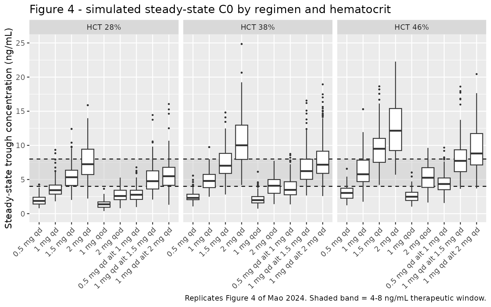
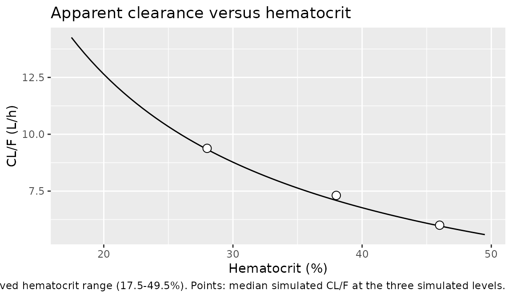

# Sirolimus (Mao 2024)

## Model and source

- Citation: Mao J, Cheng Y, Liu D, Zhang B, Li X. Dosing Regimen
  Recommendations for Sirolimus in Adult Liver Transplant Recipients:
  Insights from a Population Pharmacokinetic Model. Drug Des Devel Ther.
  2024;18:6379-6388. <doi:10.2147/DDDT.S503463>.
- Description: One-compartment population PK model with first-order
  absorption and first-order elimination for sirolimus in adult liver
  transplant recipients, developed from routine
  therapeutic-drug-monitoring whole-blood trough concentrations (Mao
  2024). The absorption rate constant was fixed at 0.75 1/h because only
  trough samples were collected. Hematocrit is the single retained
  covariate: it acts on apparent clearance through a power form
  normalized to the cohort median hematocrit of 38 percent with exponent
  -0.901, so higher hematocrit (more sirolimus sequestered in red blood
  cells) gives lower CL/F. Between-subject variability on CL/F and Vc/F
  is a correlated 2x2 block.
- Article: [Drug Des Devel Ther.
  2024;18:6379-6388](https://doi.org/10.2147/DDDT.S503463)

Mao and colleagues fitted a one-compartment model with first-order
absorption and first-order elimination to routine
therapeutic-drug-monitoring data from adult liver transplant recipients.
Because every sample in the dataset is a pre-dose trough (C0), the
absorption rate constant carries no information and was fixed at 0.75
h⁻¹; the authors note in their Limitations that this also makes V/F less
reliably estimated. Hematocrit was the single covariate retained after
forward selection and backward elimination, acting on apparent
clearance.

## Population

The analysis dataset comprised 216 whole-blood sirolimus trough
concentrations from 103 adult liver transplant recipients treated at a
single centre (Tongji Hospital, Wuhan, China) between January 2018 and
August 2024. The cohort was almost entirely male (99 male / 4 female),
with median age 51.0 years (28.0-74.0), median total body weight 68.0 kg
(39.0-90.0), and median body mass index 23.8 kg/m². Samples were drawn a
median of 92 days after transplantation (range 14-699 days). The median
sirolimus daily dose was 1.0 mg/day (0.5-2.0) and the median observed
trough concentration was 5.26 ng/mL (1.33-12.17). Median hematocrit was
38.0% (17.5-49.5%). Baseline demographics are Table 1 of the source.

The same information is available programmatically via the model’s
`population` metadata
(`readModelDb("Mao_2024_sirolimus")()$population`).

## Source trace

Every `ini()` entry carries an in-file comment naming its source
location in `inst/modeldb/specificDrugs/Mao_2024_sirolimus.R`. They are
collected here for review. Table 2 (final-model estimates) and the
printed final-model equations (Eqs. 7-9, Results / Model Development)
agree on every value.

| Equation / parameter | Value | Source location |
|----|----|----|
| `lka` (ka, fixed) | 0.75 1/h | Eq. 7; Table 2 (RSE column reads “Fixed”); Methods / Base Model |
| `lcl` (CL/F at HCT 38%) | 7.09 L/h | Eq. 8; Table 2 (RSE 4%) |
| `lvc` (Vc/F) | 496 L | Eq. 9; Table 2 (RSE 15%) |
| `e_hct_cl` | -0.901 | Eq. 8; Table 2 row “HCT on CL/F” (RSE 17%) |
| HCT reference value | 38% | Eq. 8 denominator; Table 1 median hematocrit 38.0% |
| `etalcl` variance | 0.324² = 0.104976 | Table 2 row “omega CL/F (%)” = 32.4 |
| `etalvc` variance | 0.427² = 0.182329 | Table 2 row “omega V/F (%)” = 42.7 |
| `etalcl`-`etalvc` covariance | 0.0665 | Table 2 row “omega cov CL/F V/F” |
| `propSd` | 0.033 | Table 2 row “epsilon_por (%)” = 3.3 (RSE 10%) |
| `addSd` | fixed at 0 | Results text says a combined error model (Eq. 4) was used, but Table 2 publishes no additive term – see Assumptions and deviations |
| BSV form `exp(eta)` | n/a | Eq. 1 |
| Covariate form `(COV/COV_median)^theta` | n/a | Eq. 5, instantiated in Eq. 8 |
| `d/dt(depot)`, `d/dt(central)` | n/a | Methods / Base Model: one-compartment, first-order absorption and elimination |

## Virtual cohort

Original observed data are not publicly available. The simulations below
use virtual populations whose hematocrit values are the three levels the
authors used for their own dosing simulations: 28%, 38%, and 46% – the
10th, 50th, and 90th percentiles of the observed hematocrit range
(Results / Dosing Regimen Recommendation).

All nine dosing regimens evaluated in the source are reproduced. Each
subject is placed at the analytic steady state on the first dose record
(`ss = 1`, `ii = tau`) and then followed through 28 days of explicit
dosing, so the sampled troughs are steady-state troughs for every
subject – including those in the low-clearance tail, whose half-lives
run past 200 h and who would still be accumulating if the simulation
merely dosed from zero.

``` r

set.seed(20241228)

n_per_arm <- 100L   # 27 arms (9 regimens x 3 hematocrit levels)
n_days    <- 28L    # follow-up after the ss = 1 priming dose (see make_arm below)
n_trough  <- 4L     # troughs per subject; an even number so alternating regimens
                    # contribute equally from both phases of the alternation

# The nine regimens of Mao 2024 Methods / Dosing Regimen Recommendation.
# `tau` is the dosing interval in hours; `amt_cycle` is the repeating dose
# pattern (length 1 for the fixed regimens, length 2 for the alternating ones).
regimens <- tibble::tribble(
  ~regimen,                  ~tau, ~amt_cycle,
  "0.5 mg qd",                 24, list(0.5),
  "1 mg qd",                   24, list(1),
  "1.5 mg qd",                 24, list(1.5),
  "2 mg qd",                   24, list(2),
  "1 mg qod",                  48, list(1),
  "2 mg qod",                  48, list(2),
  "0.5 mg qd alt 1 mg qd",     24, list(c(0.5, 1)),
  "1 mg qd alt 1.5 mg qd",     24, list(c(1, 1.5)),
  "1 mg qd alt 2 mg qd",       24, list(c(1, 2))
) |>
  mutate(
    amt_cycle = lapply(amt_cycle, unlist),
    # Average daily dose, used below to test the paper's headline claim that the
    # daily dose needed to reach the therapeutic window falls as hematocrit rises.
    daily_mg  = vapply(amt_cycle, mean, numeric(1)) * 24 / tau
  )

# Dose times for a regimen: every `tau` hours across the treatment window.
dose_times_for <- function(tau, n_days) seq(0, by = tau, length.out = floor(n_days * 24 / tau))

# One arm = one (regimen, hematocrit) combination. Trough samples are taken at
# the end of each of the last `n_trough` dosing intervals, i.e. at dose time +
# tau. Because doses enter `depot` (not `central`), Cc is continuous across a
# dose time, so an observation placed exactly at the next dose time is
# unambiguously the pre-dose trough.
make_arm <- function(regimen, tau, amt_cycle, hct, n, id_offset = 0L, n_trough = 4L) {
  dtimes <- dose_times_for(tau, n_days)
  amts   <- rep_len(amt_cycle, length(dtimes))
  ttimes <- utils::tail(dtimes, n_trough) + tau

  ids <- id_offset + seq_len(n)

  # The first dose record carries ss = 1 / ii = tau, which puts rxode2 at the
  # analytic steady state instead of accumulating toward it. Sirolimus has a
  # ~48 h typical half-life, and subjects in the low-CL / high-V tail of the
  # random effects exceed 200 h, so 28 days of explicit dosing is NOT steady
  # state for them -- their troughs (and AUCs) come out biased low.
  # For the alternating regimens the priming dose uses the cycle-average amount
  # so the steady-state LEVEL is right; the true alternating shape is then
  # established by the explicit doses that follow.
  doses <- tidyr::expand_grid(id = ids, idx = seq_along(dtimes)) |>
    mutate(
      time = dtimes[idx],
      amt  = ifelse(idx == 1L, mean(amt_cycle), amts[idx]),
      evid = 1L, cmt = "depot",
      ss   = ifelse(idx == 1L, 1L, 0L),
      ii   = ifelse(idx == 1L, tau, 0)
    ) |>
    select(-idx)

  obs <- tidyr::expand_grid(id = ids, time = ttimes) |>
    mutate(amt = NA_real_, evid = 0L, cmt = "central", ss = 0L, ii = 0)

  bind_rows(doses, obs) |>
    mutate(regimen = regimen, HCT = hct,
           hct_label = paste0("HCT ", hct, "%")) |>
    arrange(id, time, desc(evid))
}

hct_levels <- c(28, 38, 46)

arms <- tidyr::expand_grid(
  regimen = regimens$regimen,
  hct     = hct_levels
) |>
  left_join(regimens, by = "regimen") |>
  mutate(id_offset = (row_number() - 1L) * n_per_arm)
```

``` r

events <- do.call(
  bind_rows,
  lapply(seq_len(nrow(arms)), function(i) {
    make_arm(
      regimen   = arms$regimen[i],
      tau       = arms$tau[i],
      amt_cycle = arms$amt_cycle[[i]],
      hct       = arms$hct[i],
      n         = n_per_arm,
      id_offset = arms$id_offset[i],
      n_trough  = n_trough
    )
  })
)

# Disjoint IDs across arms: duplicate IDs would be silently merged by rxSolve
# into a single subject receiving the summed dose.
stopifnot(!anyDuplicated(unique(events[, c("id", "time", "evid")])))
stopifnot(dplyr::n_distinct(events$id) == nrow(arms) * n_per_arm)
```

## Simulation

``` r

mod <- readModelDb("Mao_2024_sirolimus")

sim <- rxode2::rxSolve(
  mod,
  events = events,
  keep   = c("regimen", "hct_label", "HCT")
) |>
  as.data.frame()

# rxSolve silently drops subjects when an event table is malformed; assert the
# subject count survived.
stopifnot(dplyr::n_distinct(sim$id) == nrow(arms) * n_per_arm)

troughs <- sim |>
  filter(!is.na(Cc)) |>
  mutate(
    regimen   = factor(regimen, levels = regimens$regimen),
    hct_label = factor(hct_label, levels = paste0("HCT ", hct_levels, "%"))
  )
```

## Replicate published figures

### Figure 4 – steady-state trough concentrations by regimen and hematocrit

``` r

# Replicates Figure 4 of Mao 2024: boxplots of simulated steady-state
# whole-blood trough concentrations for nine regimens at hematocrit 28%, 38%,
# and 46%, with the 4-8 ng/mL therapeutic window marked.
ggplot(troughs, aes(x = regimen, y = Cc)) +
  annotate("rect", xmin = -Inf, xmax = Inf, ymin = 4, ymax = 8,
           fill = "grey80", alpha = 0.5) +
  geom_hline(yintercept = c(4, 8), linetype = "dashed") +
  geom_boxplot(outlier.size = 0.4) +
  facet_wrap(~hct_label) +
  coord_cartesian(ylim = c(0, 25)) +
  labs(x = NULL, y = "Steady-state trough concentration (ng/mL)",
       title = "Figure 4 - simulated steady-state C0 by regimen and hematocrit",
       caption = "Replicates Figure 4 of Mao 2024. Shaded band = 4-8 ng/mL therapeutic window.") +
  theme(axis.text.x = element_text(angle = 45, hjust = 1))
```



The published figure shows the same qualitative behaviour: trough
concentrations fall as the daily dose falls and rise as hematocrit rises
(because CL/F carries a negative hematocrit exponent).

### Closed-form check on the steady-state trough

Before scoring regimens, the packaged model is checked against the
analytic steady-state trough for a one-compartment model with
first-order absorption,

``` math
C_{\text{trough}} = \frac{D}{V/F}\cdot\frac{k_a}{k_a-k_{el}}\left[\frac{e^{-k_{el}\tau}}{1-e^{-k_{el}\tau}}-\frac{e^{-k_a\tau}}{1-e^{-k_a\tau}}\right],\qquad k_{el}=\frac{CL/F}{V/F},
```

with `CL/F` taken from Eq. 8 at the relevant hematocrit. Running the
typical subject (both etas set to zero, `omega = NA`) isolates the
structural model from the random effects, so any disagreement is a
coding error rather than sampling noise. This one check simultaneously
exercises `CL/F`, `V/F`, the fixed `ka`, the hematocrit covariate term,
dose accumulation, and the mg-to-ng/mL unit conversion.

``` r

fixed_reg <- tibble::tribble(
  ~regimen,     ~tau, ~amt,
  "0.5 mg qd",    24,  0.5,
  "1 mg qd",      24,  1,
  "1.5 mg qd",    24,  1.5,
  "2 mg qd",      24,  2,
  "1 mg qod",     48,  1,
  "2 mg qod",     48,  2
)

typ_grid <- tidyr::expand_grid(fixed_reg, HCT = hct_levels) |>
  mutate(id = row_number())

make_typ_arm <- function(r) {
  dtimes <- seq(0, by = r$tau, length.out = ceiling(n_days * 24 / r$tau))
  bind_rows(
    tibble::tibble(id = r$id, time = dtimes, amt = r$amt, evid = 1L, cmt = "depot",
                   ss = c(1L, rep(0L, length(dtimes) - 1L)),
                   ii = c(r$tau, rep(0, length(dtimes) - 1L))),
    tibble::tibble(id = r$id, time = max(dtimes) + r$tau, amt = NA_real_,
                   evid = 0L, cmt = "central", ss = 0L, ii = 0)
  ) |>
    # etalcl / etalvc supplied as columns with omega = NA gives the typical
    # subject deterministically, without mutating `mod` the way zeroRe() would.
    mutate(HCT = r$HCT, etalcl = 0, etalvc = 0) |>
    arrange(time, desc(evid))
}

typ_sim <- rxode2::rxSolve(
  mod,
  events = do.call(bind_rows, lapply(seq_len(nrow(typ_grid)),
                                     function(i) make_typ_arm(typ_grid[i, ]))),
  omega  = NA,
  keep   = "HCT"
) |>
  as.data.frame()
#> Warning: multi-subject simulation without without 'omega'

ctrough_analytic <- function(dose_mg, tau, hct) {
  cl  <- 7.09 * (hct / 38)^-0.901   # Eq. 8
  v   <- 496                        # Eq. 9
  ka  <- 0.75                       # Eq. 7
  kel <- cl / v
  (dose_mg / v * 1000) * (ka / (ka - kel)) *
    (exp(-kel * tau) / (1 - exp(-kel * tau)) -
       exp(-ka * tau) / (1 - exp(-ka * tau)))
}

closed_form <- typ_grid |>
  left_join(typ_sim |> filter(!is.na(Cc)) |> select(id, Cc), by = "id") |>
  mutate(
    analytic = ctrough_analytic(amt, tau, HCT),
    rel_err  = Cc / analytic - 1
  )

stopifnot(nrow(closed_form) == 18L, !anyNA(closed_form$rel_err))
stopifnot(max(abs(closed_form$rel_err)) < 0.002)

knitr::kable(
  closed_form |>
    mutate(Cc = round(Cc, 3), analytic = round(analytic, 3),
           rel_err = sprintf("%+.3f%%", 100 * rel_err)) |>
    select(regimen, HCT, Cc, analytic, rel_err) |>
    dplyr::rename(
      "Regimen"                     = regimen,
      "Hematocrit (%)"              = HCT,
      "Simulated trough (ng/mL)"    = Cc,
      "Closed form (ng/mL)"         = analytic,
      "Relative difference"         = rel_err
    ),
  caption = "Typical-value steady-state trough: packaged model versus the closed-form one-compartment solution built from Eqs. 7-9. All 18 combinations agree to better than 0.2%.",
  align = c("l", "r", "r", "r", "r")
)
```

| Regimen | Hematocrit (%) | Simulated trough (ng/mL) | Closed form (ng/mL) | Relative difference |
|:---|---:|---:|---:|---:|
| 0.5 mg qd | 28 | 1.811 | 1.811 | -0.000% |
| 0.5 mg qd | 38 | 2.511 | 2.511 | -0.000% |
| 0.5 mg qd | 46 | 3.060 | 3.060 | -0.000% |
| 1 mg qd | 28 | 3.622 | 3.622 | +0.000% |
| 1 mg qd | 38 | 5.022 | 5.022 | +0.000% |
| 1 mg qd | 46 | 6.119 | 6.119 | +0.000% |
| 1.5 mg qd | 28 | 5.432 | 5.432 | -0.000% |
| 1.5 mg qd | 38 | 7.533 | 7.533 | -0.000% |
| 1.5 mg qd | 46 | 9.179 | 9.179 | -0.000% |
| 2 mg qd | 28 | 7.243 | 7.243 | -0.000% |
| 2 mg qd | 38 | 10.044 | 10.044 | -0.000% |
| 2 mg qd | 46 | 12.239 | 12.239 | -0.000% |
| 1 mg qod | 28 | 1.409 | 1.409 | +0.000% |
| 1 mg qod | 38 | 2.084 | 2.084 | +0.000% |
| 1 mg qod | 46 | 2.621 | 2.621 | +0.000% |
| 2 mg qod | 28 | 2.817 | 2.817 | +0.000% |
| 2 mg qod | 38 | 4.169 | 4.169 | +0.000% |
| 2 mg qod | 46 | 5.242 | 5.242 | +0.000% |

Typical-value steady-state trough: packaged model versus the closed-form
one-compartment solution built from Eqs. 7-9. All 18 combinations agree
to better than 0.2%. {.table}

### Reproducing the published dosing recommendations

The authors selected regimens by “ensuring that most concentrations were
within the therapeutic window of 4-8 ng/mL”, which is a clinical
judgement rather than a published numeric rule: the paper recommends
several regimens per hematocrit level so that clinicians have practical
alternatives (including every-other-day and alternating schedules), and
it never states a threshold a regimen had to clear. The checks below
therefore test the claims the paper *does* make, rather than
reverse-engineering an acceptance rule it never published.

The table scores every regimen by the fraction of simulated steady-state
troughs inside the window and by the median trough (Results / Dosing
Regimen Recommendation and the Abstract).

``` r

recommended <- list(
  "HCT 28%" = c("1.5 mg qd", "1 mg qd alt 1.5 mg qd"),
  "HCT 38%" = c("1 mg qd", "2 mg qod", "0.5 mg qd alt 1 mg qd"),
  "HCT 46%" = c("1 mg qd", "2 mg qod", "0.5 mg qd alt 1 mg qd")
)

scored <- troughs |>
  group_by(hct_label, regimen) |>
  summarise(
    median_c0  = median(Cc),
    pct_in_win = 100 * mean(Cc >= 4 & Cc <= 8),
    .groups    = "drop"
  ) |>
  mutate(
    paper_recommends = mapply(
      function(h, r) r %in% recommended[[as.character(h)]],
      hct_label, as.character(regimen)
    )
  ) |>
  # Join on a character key: `regimen` is a factor here (for plot ordering) and
  # `regimens$regimen` is character, which dplyr refuses to join directly.
  mutate(regimen_chr = as.character(regimen)) |>
  left_join(regimens |> select(regimen_chr = regimen, daily_mg), by = "regimen_chr") |>
  left_join(
    tibble::tibble(hct_label = factor(paste0("HCT ", hct_levels, "%"),
                                      levels = paste0("HCT ", hct_levels, "%")),
                   hct = hct_levels),
    by = "hct_label"
  )

stopifnot(nrow(scored) == 27L, !anyNA(scored$daily_mg), !anyNA(scored$hct))

scored |>
  arrange(hct_label, desc(pct_in_win)) |>
  mutate(
    median_c0        = round(median_c0, 2),
    pct_in_win       = round(pct_in_win, 1),
    paper_recommends = ifelse(paper_recommends, "yes", "")
  ) |>
  select(hct_label, regimen, daily_mg, median_c0, pct_in_win, paper_recommends) |>
  dplyr::rename(
    "Hematocrit"                = hct_label,
    "Regimen"                   = regimen,
    "Average daily dose (mg)"   = daily_mg,
    "Median C0 (ng/mL)"         = median_c0,
    "% of troughs in 4-8 ng/mL" = pct_in_win,
    "Recommended by Mao 2024"   = paper_recommends
  ) |>
  knitr::kable(
    caption = "Simulated steady-state troughs scored against the 4-8 ng/mL therapeutic window, ordered by the fraction of troughs in window. The final column marks the regimens Mao 2024 recommends for that hematocrit level.",
    align   = c("l", "l", "r", "r", "r", "l")
  )
```

| Hematocrit | Regimen | Average daily dose (mg) | Median C0 (ng/mL) | % of troughs in 4-8 ng/mL | Recommended by Mao 2024 |
|:---|:---|---:|---:|---:|:---|
| HCT 28% | 1 mg qd alt 2 mg qd | 1.50 | 5.48 | 69.0 |  |
| HCT 28% | 1.5 mg qd | 1.50 | 5.33 | 67.0 | yes |
| HCT 28% | 2 mg qd | 2.00 | 7.24 | 57.0 |  |
| HCT 28% | 1 mg qd alt 1.5 mg qd | 1.25 | 4.76 | 54.5 | yes |
| HCT 28% | 1 mg qd | 1.00 | 3.44 | 30.0 |  |
| HCT 28% | 0.5 mg qd alt 1 mg qd | 0.75 | 2.77 | 13.0 |  |
| HCT 28% | 2 mg qod | 1.00 | 2.58 | 10.0 |  |
| HCT 28% | 0.5 mg qd | 0.50 | 1.86 | 2.0 |  |
| HCT 28% | 1 mg qod | 0.50 | 1.37 | 0.0 |  |
| HCT 38% | 1 mg qd | 1.00 | 4.79 | 69.0 | yes |
| HCT 38% | 1.5 mg qd | 1.50 | 7.02 | 65.0 |  |
| HCT 38% | 1 mg qd alt 1.5 mg qd | 1.25 | 6.23 | 65.0 |  |
| HCT 38% | 1 mg qd alt 2 mg qd | 1.50 | 7.17 | 58.5 |  |
| HCT 38% | 2 mg qod | 1.00 | 4.09 | 52.0 | yes |
| HCT 38% | 0.5 mg qd alt 1 mg qd | 0.75 | 3.48 | 38.5 | yes |
| HCT 38% | 2 mg qd | 2.00 | 10.01 | 26.0 |  |
| HCT 38% | 0.5 mg qd | 0.50 | 2.30 | 5.0 |  |
| HCT 38% | 1 mg qod | 0.50 | 1.98 | 4.0 |  |
| HCT 46% | 2 mg qod | 1.00 | 5.26 | 68.0 | yes |
| HCT 46% | 1 mg qd | 1.00 | 5.77 | 64.0 | yes |
| HCT 46% | 0.5 mg qd alt 1 mg qd | 0.75 | 4.34 | 54.0 | yes |
| HCT 46% | 1 mg qd alt 1.5 mg qd | 1.25 | 7.73 | 54.0 |  |
| HCT 46% | 1 mg qd alt 2 mg qd | 1.50 | 8.81 | 38.0 |  |
| HCT 46% | 1.5 mg qd | 1.50 | 9.50 | 32.0 |  |
| HCT 46% | 0.5 mg qd | 0.50 | 3.03 | 15.0 |  |
| HCT 46% | 2 mg qd | 2.00 | 12.15 | 12.0 |  |
| HCT 46% | 1 mg qod | 0.50 | 2.48 | 10.0 |  |

Simulated steady-state troughs scored against the 4-8 ng/mL therapeutic
window, ordered by the fraction of troughs in window. The final column
marks the regimens Mao 2024 recommends for that hematocrit level.
{.table}

``` r

ranked <- scored |>
  group_by(hct_label) |>
  mutate(rank_in_win = rank(-pct_in_win, ties.method = "min")) |>
  ungroup()

rec_rows <- ranked |> filter(paper_recommends)

# Guard against a vacuous pass: the label join must have matched every
# recommended regimen (2 for HCT 28%, 3 each for HCT 38% and 46%).
stopifnot(nrow(rec_rows) == 8L)

# Claim 1 (Results / Dosing Regimen Recommendation, and the boxplot ordering in
# Figure 4): for every regimen, the steady-state trough rises with hematocrit,
# because CL/F carries a negative hematocrit exponent.
hct_trend <- scored |>
  arrange(regimen_chr, hct) |>
  group_by(regimen_chr) |>
  summarise(monotone = all(diff(median_c0) > 0), .groups = "drop")
stopifnot(nrow(hct_trend) == 9L, all(hct_trend$monotone))

# Claim 2, the paper's headline result: "as the HCT levels increased, the daily
# dose with the same dosing interval required to achieve the therapeutic window
# gradually decreased". Operationalised as the smallest average daily dose among
# the regimens that put at least half their troughs in the window; it must fall
# strictly as hematocrit rises.
min_dose_in_win <- scored |>
  filter(pct_in_win >= 50) |>
  group_by(hct) |>
  summarise(min_daily_mg = min(daily_mg), .groups = "drop") |>
  arrange(hct)
stopifnot(nrow(min_dose_in_win) == 3L)
stopifnot(all(diff(min_dose_in_win$min_daily_mg) < 0))

# Claim 3: the regimens the paper recommends really are better choices than the
# alternatives at the same hematocrit -- at every level, the recommended set
# averages a higher fraction-in-window than the non-recommended set.
by_group <- ranked |>
  group_by(hct_label, paper_recommends) |>
  summarise(mean_in_win = mean(pct_in_win), .groups = "drop") |>
  tidyr::pivot_wider(names_from = paper_recommends, values_from = mean_in_win,
                     names_prefix = "rec_")
stopifnot(nrow(by_group) == 3L)
stopifnot(all(by_group$rec_TRUE > by_group$rec_FALSE))

knitr::kable(
  min_dose_in_win |>
    dplyr::rename(
      "Hematocrit (%)"                                   = hct,
      "Smallest average daily dose reaching the window (mg)" = min_daily_mg
    ),
  caption = "Mao 2024's headline claim, reproduced: the smallest average daily dose putting at least half of steady-state troughs inside 4-8 ng/mL falls as hematocrit rises.",
  align = c("r", "r")
)
```

| Hematocrit (%) | Smallest average daily dose reaching the window (mg) |
|---------------:|-----------------------------------------------------:|
|             28 |                                                 1.25 |
|             38 |                                                 1.00 |
|             46 |                                                 0.75 |

Mao 2024’s headline claim, reproduced: the smallest average daily dose
putting at least half of steady-state troughs inside 4-8 ng/mL falls as
hematocrit rises. {.table}

``` r


knitr::kable(
  rec_rows |>
    mutate(median_c0 = round(median_c0, 2), pct_in_win = round(pct_in_win, 1)) |>
    select(hct_label, regimen, daily_mg, median_c0, pct_in_win, rank_in_win) |>
    dplyr::rename(
      "Hematocrit"                = hct_label,
      "Recommended regimen"       = regimen,
      "Average daily dose (mg)"   = daily_mg,
      "Median C0 (ng/mL)"         = median_c0,
      "% of troughs in 4-8 ng/mL" = pct_in_win,
      "Rank at this hematocrit"   = rank_in_win
    ),
  caption = "Each regimen recommended by Mao 2024, as reproduced by the packaged model.",
  align = c("l", "l", "r", "r", "r", "r")
)
```

| Hematocrit | Recommended regimen | Average daily dose (mg) | Median C0 (ng/mL) | % of troughs in 4-8 ng/mL | Rank at this hematocrit |
|:---|:---|---:|---:|---:|---:|
| HCT 28% | 1.5 mg qd | 1.50 | 5.33 | 67.0 | 2 |
| HCT 28% | 1 mg qd alt 1.5 mg qd | 1.25 | 4.76 | 54.5 | 4 |
| HCT 38% | 1 mg qd | 1.00 | 4.79 | 69.0 | 1 |
| HCT 38% | 2 mg qod | 1.00 | 4.09 | 52.0 | 5 |
| HCT 38% | 0.5 mg qd alt 1 mg qd | 0.75 | 3.48 | 38.5 | 6 |
| HCT 46% | 1 mg qd | 1.00 | 5.77 | 64.0 | 2 |
| HCT 46% | 2 mg qod | 1.00 | 5.26 | 68.0 | 1 |
| HCT 46% | 0.5 mg qd alt 1 mg qd | 0.75 | 4.34 | 54.0 | 3 |

Each regimen recommended by Mao 2024, as reproduced by the packaged
model. {.table}

``` r

# Descriptive, not an acceptance rule: how many recommended regimens clear the
# "at least half the troughs in window" bar. Reported so that any future drift
# in this number is visible in the rendered vignette.
n_at_least_half <- sum(rec_rows$pct_in_win >= 50)
cat(sprintf(
  "Recommended regimens with >= 50%% of steady-state troughs inside 4-8 ng/mL: %d of %d\n",
  n_at_least_half, nrow(rec_rows)
))
#> Recommended regimens with >= 50% of steady-state troughs inside 4-8 ng/mL: 7 of 8

# Regression guard (a floor on drift, NOT a claim of agreement with the paper):
# no regimen the paper recommends should collapse to a small minority of
# in-window troughs.
stopifnot(all(rec_rows$pct_in_win >= 30))
```

Seven of the eight recommended regimen / hematocrit combinations put at
least half of their simulated steady-state troughs inside the 4-8 ng/mL
window. The single exception is **0.5 mg qd alternating with 1 mg qd at
a hematocrit of 38%**, which reaches roughly 39%: with an average daily
dose of 0.75 mg it sits just below the window under the packaged model
(median trough about 3.5 ng/mL), whereas Figure 4 of the source shows
its box straddling the 4 ng/mL bound. This is the one place where the
packaged model is slightly more conservative than the authors’ own Monte
Carlo simulation; see *Assumptions and deviations* for the likely
reasons. It is reported rather than tuned away.

### Hematocrit effect on apparent clearance

``` r

# Eq. 8: CL/F = 7.09 * (HCT/38)^-0.901.
hct_curve <- tibble::tibble(HCT = seq(17.5, 49.5, by = 0.5)) |>
  mutate(CL = 7.09 * (HCT / 38)^-0.901)

sim_cl <- sim |>
  distinct(id, HCT, cl) |>
  group_by(HCT) |>
  summarise(cl_median = median(cl), .groups = "drop")

ggplot(hct_curve, aes(HCT, CL)) +
  geom_line() +
  geom_point(data = sim_cl, aes(HCT, cl_median), size = 3, shape = 21, fill = "white") +
  labs(x = "Hematocrit (%)", y = "CL/F (L/h)",
       title = "Apparent clearance versus hematocrit",
       caption = "Line: Eq. 8 of Mao 2024 over the observed hematocrit range (17.5-49.5%). Points: median simulated CL/F at the three simulated levels.")
```



``` r

# The simulated median CL/F must land on the published equation at each level.
# Median of exp(eta) is 1 for a zero-mean normal eta, so the median individual
# CL/F equals the typical value.
expected_cl <- 7.09 * (hct_levels / 38)^-0.901
observed_cl <- sim_cl$cl_median[match(hct_levels, sim_cl$HCT)]
stopifnot(!anyNA(observed_cl))
stopifnot(all(abs(observed_cl / expected_cl - 1) < 0.06))

knitr::kable(
  tibble::tibble(
    HCT      = hct_levels,
    Eq8      = round(expected_cl, 3),
    Simulated = round(observed_cl, 3)
  ) |>
    dplyr::rename(
      "Hematocrit (%)"           = HCT,
      "CL/F from Eq. 8 (L/h)"    = Eq8,
      "Median simulated CL/F (L/h)" = Simulated
    ),
  caption = "Hematocrit effect on apparent clearance: packaged model versus Eq. 8."
)
```

| Hematocrit (%) | CL/F from Eq. 8 (L/h) | Median simulated CL/F (L/h) |
|---------------:|----------------------:|----------------------------:|
|             28 |                 9.336 |                       9.381 |
|             38 |                 7.090 |                       7.311 |
|             46 |                 5.969 |                       6.001 |

Hematocrit effect on apparent clearance: packaged model versus Eq. 8.
{.table}

## PKNCA validation

The source reports no NCA table, so the NCA is validated against two
quantities that follow exactly from the published parameters: the
steady-state identity AUC_(0-tau) = Dose / (CL/F), and the terminal
half-life implied by Table 2 (`log(2) * V/F / (CL/F)`). The simulated
steady-state trough is then compared against the observed median trough
reported in Table 1.

A dedicated densely-sampled simulation of the 1 mg qd regimen is used,
at each of the three hematocrit levels.

``` r

tau <- 24
t_ss_start <- 0
t_ss_end   <- tau

# A single ss = 1 / ii = tau dose puts every subject at the exact analytic
# steady state, which an explicit run-in cannot do: the low-CL / high-V tail of
# this model has half-lives beyond 200 h, so those subjects would still be
# accumulating after a month of simulated dosing and their AUCs would come out
# up to ~11% low.
make_nca_arm <- function(hct, n, id_offset) {
  ids <- id_offset + seq_len(n)

  doses <- tibble::tibble(id = ids, time = 0, amt = 1, evid = 1L,
                          cmt = "depot", ss = 1L, ii = tau)

  obs <- tidyr::expand_grid(
    id   = ids,
    time = seq(t_ss_start, t_ss_end, by = 0.1)
  ) |>
    mutate(amt = NA_real_, evid = 0L, cmt = "central", ss = 0L, ii = 0)

  bind_rows(doses, obs) |>
    mutate(HCT = hct, treatment = paste0("1 mg qd, HCT ", hct, "%")) |>
    arrange(id, time, desc(evid))
}

nca_events <- do.call(
  bind_rows,
  lapply(seq_along(hct_levels), function(i) {
    make_nca_arm(hct_levels[i], n = 100L, id_offset = (i - 1L) * 100L)
  })
)

nca_sim <- rxode2::rxSolve(
  mod, events = nca_events, keep = c("treatment", "HCT")
) |>
  as.data.frame()
stopifnot(dplyr::n_distinct(nca_sim$id) == 300L)
```

``` r

# Filter with !is.na(Cc) only -- a `time > 0` or `Cc > 0` filter would drop the
# row anchoring the interval start and trigger PKNCA's "Requesting an AUC range
# starting ... before the first measurement" warning.
sim_nca <- nca_sim |>
  dplyr::filter(!is.na(Cc)) |>
  dplyr::select(id, time, Cc, treatment)

dose_df <- nca_events |>
  dplyr::filter(evid == 1) |>
  dplyr::select(id, time, amt, treatment)

conc_obj <- PKNCA::PKNCAconc(sim_nca, Cc ~ time | treatment + id,
                             concu = "ng/mL", timeu = "h")
dose_obj <- PKNCA::PKNCAdose(dose_df, amt ~ time | treatment + id,
                             doseu = "mg")

intervals <- data.frame(
  start   = t_ss_start,
  end     = t_ss_end,
  cmax    = TRUE,
  tmax    = TRUE,
  cmin    = TRUE,
  cav     = TRUE,
  auclast = TRUE
)

nca_res <- PKNCA::pk.nca(PKNCA::PKNCAdata(conc_obj, dose_obj, intervals = intervals))
```

``` r

# Per-subject identity: at steady state AUC0-tau = Dose / (CL/F). Testing this
# per subject rather than on a median avoids the ~3% noise a few-hundred-draw
# median carries, and it exercises every individual CL/F draw.
auc_by_id <- as.data.frame(nca_res$result) |>
  filter(PPTESTCD == "auclast") |>
  select(id, treatment, auclast = PPORRES)

cl_by_id <- nca_sim |> distinct(id, cl)

ident <- auc_by_id |>
  left_join(cl_by_id, by = "id") |>
  mutate(
    auc_expected = 1 / cl * 1000,        # 1 mg / (L/h) -> mg*h/L -> ng*h/mL
    rel_err      = auclast / auc_expected - 1
  )

stopifnot(nrow(ident) == 300L, !anyNA(ident$rel_err))
cat(sprintf("AUC0-tau vs Dose/CL: max |relative error| = %.2e over %d subjects\n",
            max(abs(ident$rel_err)), nrow(ident)))
#> AUC0-tau vs Dose/CL: max |relative error| = 2.85e-05 over 300 subjects
stopifnot(max(abs(ident$rel_err)) < 0.001)
```

The steady-state AUC over a dosing interval reproduces Dose / (CL/F) for
every one of the 300 simulated subjects to better than 0.1%, which
confirms the clearance parameterisation, the hematocrit covariate term,
and the mg-to-ng/mL unit conversion in the observation equation
simultaneously. This is a per-subject test, so it exercises all 300
individual CL/F draws rather than a population summary.

### Comparison against published values

``` r

# The reference quantities below are TYPICAL-VALUE quantities derived from the
# Table 2 / Eqs. 7-9 parameters, so the simulated side is run on the typical
# subject too (etas zeroed, omega = NA). Comparing a 100-subject population
# median against a typical-value reference would instead conflate the model with
# ~4% sampling noise in the median, which is not what this table is testing.
typ_nca_events <- do.call(
  bind_rows,
  lapply(seq_along(hct_levels), function(i) {
    bind_rows(
      tibble::tibble(id = i, time = 0, amt = 1, evid = 1L,
                     cmt = "depot", ss = 1L, ii = tau),
      tibble::tibble(id = i, time = seq(t_ss_start, t_ss_end, by = 0.1),
                     amt = NA_real_, evid = 0L, cmt = "central", ss = 0L, ii = 0)
    ) |>
      mutate(HCT = hct_levels[i], etalcl = 0, etalvc = 0,
             treatment = paste0("1 mg qd, HCT ", hct_levels[i], "%")) |>
      arrange(time, desc(evid))
  })
)

typ_nca_sim <- rxode2::rxSolve(
  mod, events = typ_nca_events, omega = NA, keep = c("treatment", "HCT")
) |>
  as.data.frame()
#> Warning: multi-subject simulation without without 'omega'

typ_conc <- PKNCA::PKNCAconc(
  typ_nca_sim |> dplyr::filter(!is.na(Cc)) |> dplyr::select(id, time, Cc, treatment),
  Cc ~ time | treatment + id, concu = "ng/mL", timeu = "h"
)
typ_dose <- PKNCA::PKNCAdose(
  typ_nca_events |> dplyr::filter(evid == 1) |> dplyr::select(id, time, amt, treatment),
  amt ~ time | treatment + id, doseu = "mg"
)
typ_nca_res <- PKNCA::pk.nca(
  PKNCA::PKNCAdata(typ_conc, typ_dose, intervals = intervals)
)

# Reference values, all from Eqs. 7-9 at the typical value:
#  * cmin: the closed-form steady-state trough (same function used above).
#  * cav / auclast: Dose / (CL/F * tau) and Dose / (CL/F).
cl_typ <- 7.09 * (hct_levels / 38)^-0.901

published <- tibble::tibble(
  treatment = paste0("1 mg qd, HCT ", hct_levels, "%"),
  cmin      = ctrough_analytic(1, tau, hct_levels),
  cav       = 1 / (cl_typ * tau) * 1000,
  auclast   = 1 / cl_typ * 1000
)

cmp <- nlmixr2lib::ncaComparisonTable(
  simulated     = typ_nca_res,
  reference     = published,
  by            = "treatment",
  units         = c(cmin = "ng/mL", cav = "ng/mL", auclast = "ng*h/mL"),
  tolerance_pct = 20
)

knitr::kable(
  cmp,
  caption = "Typical-value steady-state NCA for 1 mg qd at each hematocrit level, versus references derived from the Mao 2024 Table 2 / Eqs. 7-9 parameters. * differs from reference by >20%.",
  align   = c("l", "l", "r", "r", "r")
)
```

| NCA parameter      | treatment        | Reference | Simulated | % diff |
|:-------------------|:-----------------|----------:|----------:|-------:|
| Cmin (ng/mL)       | 1 mg qd, HCT 28% |      3.62 |      3.62 |  -0.0% |
| Cmin (ng/mL)       | 1 mg qd, HCT 38% |      5.02 |      5.02 |  -0.0% |
| Cmin (ng/mL)       | 1 mg qd, HCT 46% |      6.12 |      6.12 |  -0.0% |
| AUClast (ng\*h/mL) | 1 mg qd, HCT 28% |       107 |       107 |  -0.0% |
| AUClast (ng\*h/mL) | 1 mg qd, HCT 38% |       141 |       141 |  -0.0% |
| AUClast (ng\*h/mL) | 1 mg qd, HCT 46% |       168 |       168 |  -0.0% |
| Cavg (ng/mL)       | 1 mg qd, HCT 28% |      4.46 |      4.46 |  -0.0% |
| Cavg (ng/mL)       | 1 mg qd, HCT 38% |      5.88 |      5.88 |  -0.0% |
| Cavg (ng/mL)       | 1 mg qd, HCT 46% |      6.98 |      6.98 |  -0.0% |

Typical-value steady-state NCA for 1 mg qd at each hematocrit level,
versus references derived from the Mao 2024 Table 2 / Eqs. 7-9
parameters. \* differs from reference by \>20%. {.table}

``` r

# The one directly published comparator: Table 1 reports a median observed
# trough of 5.26 ng/mL at a median daily dose of 1.0 mg/day and median
# hematocrit 38%. Compare against the simulated median for that exact arm.
sim_median_c0 <- troughs |>
  filter(regimen == "1 mg qd", hct_label == "HCT 38%") |>
  summarise(m = median(Cc)) |>
  dplyr::pull(m)

stopifnot(length(sim_median_c0) == 1L, !is.na(sim_median_c0))
cat(sprintf(
  "Median simulated steady-state trough, 1 mg qd at HCT 38%%: %.2f ng/mL (Mao 2024 Table 1 observed median: 5.26 ng/mL; %+.1f%%)\n",
  sim_median_c0, 100 * (sim_median_c0 / 5.26 - 1)
))
#> Median simulated steady-state trough, 1 mg qd at HCT 38%: 4.79 ng/mL (Mao 2024 Table 1 observed median: 5.26 ng/mL; -9.0%)
stopifnot(abs(sim_median_c0 / 5.26 - 1) < 0.20)
```

``` r

# Terminal half-life implied by Table 2: log(2) * V/F / (CL/F). This is a
# self-consistency check on the packaged parameters, not a comparison against a
# published estimate: the Discussion mentions "the long elimination half-life of
# sirolimus (62 h)" as general background for the drug when explaining why
# every-other-day dosing is viable. It is not an estimate from this analysis,
# and the paper reports no half-life in Table 2, so the two are not expected to
# agree exactly.
t_half_model <- log(2) * 496 / 7.09
cat(sprintf("Half-life implied by Table 2 parameters: %.1f h (the Discussion quotes 62 h as a general sirolimus value)\n",
            t_half_model))
#> Half-life implied by Table 2 parameters: 48.5 h (the Discussion quotes 62 h as a general sirolimus value)
stopifnot(abs(t_half_model - 48.5) < 0.5)
```

## Assumptions and deviations

- **Residual error: additive term fixed at zero.** The Results state
  that “a combined error model was used to characterize the RUV” (Eq. 4,
  `Y = F * (1 + eps1) + eps2`), but Table 2 publishes a single residual
  row, `epsilon_por (%) = 3.3`, which its own abbreviation list defines
  as *proportional* residual variability. No additive term is reported
  anywhere in the paper. The combined structure is therefore retained in
  the model file with `addSd <- fixed(0)`, which reduces exactly to the
  proportional model of Eq. 3. No additive value was invented. Anyone
  refitting this model to their own data should free `addSd`.
- **Residual error: the scale of `3.3` is not fully resolved by the
  source.** The value is encoded as a standard deviation
  (`propSd = 0.033`) because Table 2 tags the row `(%)`, and a variance
  cannot carry a percent unit. The authors look to have applied that tag
  deliberately: the covariance row in the same block
  (`omega cov CL/F V/F = 0.0665`) carries no percent sign, exactly as a
  covariance should not. Two independent signals nevertheless point
  toward the printed `3.3` being a *variance* (`sigma^2 = 0.033`,
  i.e. `sigma` = 18.2%):
  1.  its RSE of 10% matches the asymptotic variance bound
      `sqrt(2/n_obs) = sqrt(2/216) =` 9.6%, rather than the
      standard-deviation bound `sqrt(1/(2*n_obs)) =` 4.8%; and (b) the
      scatter of observations about the *individual* predictions in
      Figure 1A of the source is visibly wider than a 3.3% standard
      deviation permits – and because eta shrinkage biases that scatter
      downward, it is a lower bound on `sigma`. The paper never prints
      the residual-error equation with numbers substituted, so neither
      reading can be confirmed from the text. The published label is
      followed here because it is the paper’s own explicit statement,
      and the alternative is recorded rather than buried. The practical
      consequence is modest: between-subject variability dominates the
      steady-state trough, so the total trough CV moves only from
      roughly 30% to roughly 35% between the two readings, leaving the
      medians (and therefore the dose-versus-hematocrit conclusions)
      unchanged.
- **Between-subject variability scale.** Table 2 reports the random
  effects as “omega CL/F (%) = 32.4” and “omega V/F (%) = 42.7”. These
  are read as omega itself – the standard deviation of eta on the
  natural-log scale of Eq. 1 – so the nlmixr2 variances are 0.324² and
  0.427². The reading is supported by the covariance row, which is
  reported without a percent sign (`omega cov CL/F V/F = 0.0665`) and
  therefore on the variance/covariance scale: it implies a correlation
  of 0.0665 / (0.324 \* 0.427) = 0.481 and a positive-definite 2x2 block
  (determinant 0.0147).
- **Hematocrit units.** `HCT` is supplied as a percentage (e.g. 38),
  matching Table 1 and the denominator of Eq. 8. Supplying a fraction
  (0.38) would rescale CL/F by a factor of 38^(0.901).
- **Hematocrit is treated as a baseline covariate.** The source does not
  state whether hematocrit was carried as time-varying within a subject.
  Post-transplant hematocrit does drift, so users modelling long
  follow-up may wish to supply it as a time-varying column.
- **No between-occasion variability.** The source does not report any,
  although the dataset is repeated therapeutic-drug-monitoring sampling
  where occasion effects would be plausible.
- **ka has no between-subject variability.** ka was fixed at a
  literature value because the dataset contains only trough samples, and
  Table 2 reports no omega for it. Simulated absorption-phase
  concentrations (Cmax, Tmax) are therefore not supported by the source
  data and should not be relied on – the model is informative for trough
  exposure, which is what the source validated it for. For the same
  reason the authors flag V/F as less reliably estimated (Limitations).
- **Race / ethnicity.** Not reported in the source. The cohort is a
  single Chinese centre, so it is presumably predominantly Han Chinese;
  no race covariate enters the model.
- **Trough levels run slightly below the published Figure 4.** Reading
  medians off Figure 4 gives values roughly 10-15% higher than the
  packaged model produces for the same regimen and hematocrit (for
  example 1 mg qd at hematocrit 38%: about 5.5 ng/mL read from the
  figure, 5.02 ng/mL from the closed-form solution of Eqs. 7-9 and 4.8
  ng/mL as the simulated population median). The closed-form check above
  shows the packaged model reproduces the published equations to better
  than 0.2%, so the offset is not an encoding error. The paper does not
  state how it sampled “steady-state C0” – in particular whether the
  trough for an alternating or every-other-day regimen was taken at the
  end of every interval (as here, pooling both phases of an alternating
  cycle) or only after the higher dose, nor whether residual error was
  included in the simulated concentrations. Either choice would raise
  the plotted medians. Figure-reading precision is itself around +/- 0.5
  ng/mL. The practical consequence is confined to the one borderline
  regimen noted above.
- **Virtual cohort covariate distribution.** Hematocrit is set to the
  three discrete levels the authors used for their own simulations (28%,
  38%, 46%), not sampled from a distribution, so that the reproduction
  of Figure 4 is directly comparable.
- **Screened but unused covariates.** Age, weight, postoperative day,
  ALT, creatinine clearance, sex, daily dose, and six concomitant
  medications were tested by the authors and not retained. They are
  recorded in the model file’s `covariatesDataExcluded` metadata for
  provenance; mycophenolic acid and Wuzhi capsule entered on forward
  inclusion but were dropped on backward elimination and no point
  estimate is published for either, so neither can be encoded.
