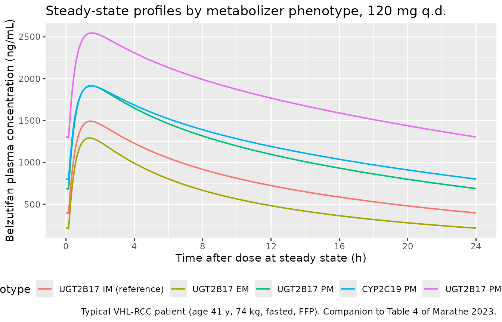
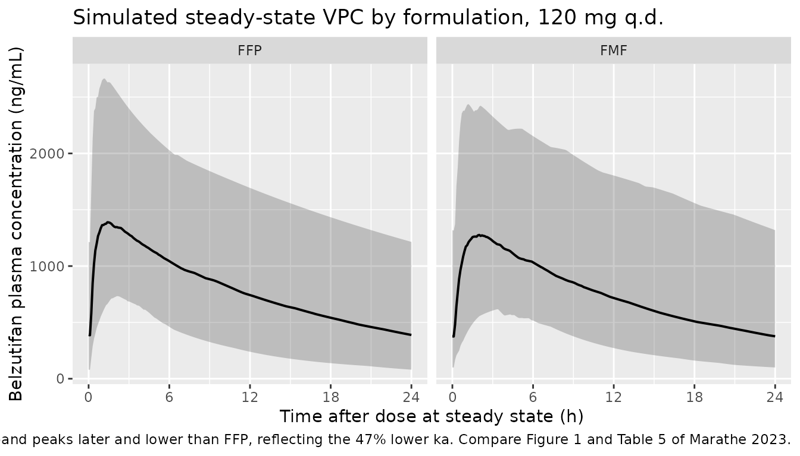

# Belzutifan (Marathe 2023)

## Model and source

- Citation: Marathe DD, Jauslin PM, Kleijn HJ, de Miranda Silva C, Chain
  A, Bateman T, Shaw PM, Abraham AK, Kauh EA, Liu Y, Perini RF, de Alwis
  DP, Jain L. Population pharmacokinetic analyses for belzutifan to
  inform dosing considerations and labeling. CPT Pharmacometrics Syst
  Pharmacol. 2023;12(10):1499-1510. <doi:10.1002/psp4.13028>
- Description: Two-compartment population PK model for oral belzutifan
  (Welireg, a hypoxia-inducible factor 2 alpha inhibitor) in 239 pooled
  subjects across four phase I studies and one pivotal phase II study:
  83 healthy participants, 74 patients with advanced renal cell
  carcinoma, 21 with other advanced solid tumors, and 61 with von
  Hippel-Lindau disease-associated RCC. First-order absorption with an
  absorption lag and linear elimination from the central compartment.
  Body weight scales clearances (shared exponent on CL/F and Q/F) and
  volumes (shared exponent on V2/F and V3/F); age scales CL/F and V2/F;
  fed state and the final market formulation each slow the absorption
  rate constant; and the polymorphic UGT2B17 and CYP2C19 metabolizer
  phenotypes shift CL/F, with UGT2B17 poor metabolizers additionally
  showing 11% higher relative bioavailability. Residual variability is
  split into healthy-participant and patient strata.
- Article: <https://doi.org/10.1002/psp4.13028>
- Supplement (figures S1-S3, tables S1-S5):
  <https://doi.org/10.1002/psp4.13028>, Supporting Information
- Supplement 2 contains the verbatim final-model NONMEM control stream,
  which fixes every covariate branch, reference level, missing-data
  sentinel, and the `S2 = V2/1000` concentration scaling used below.

Belzutifan (Welireg) is an oral inhibitor of hypoxia-inducible factor 2
alpha, approved for von Hippel-Lindau (VHL) disease-associated renal
cell carcinoma (RCC), central nervous system hemangioblastomas, and
pancreatic neuroendocrine tumors. It is metabolized primarily by the
polymorphic enzymes UGT2B17 and CYP2C19, and the headline finding of
this analysis is that dual UGT2B17 / CYP2C19 poor metabolizers (PMs) are
predicted to have a 3.2-fold higher steady-state AUC than UGT2B17
extensive metabolizers who are CYP2C19 non-PMs.

## Population

The model was fit to 5291 measurable plasma concentrations from 239
participants pooled across four phase I studies and one pivotal phase II
study (Marathe 2023 Table 1, Table S2). The cohort was 43.9% male, with
median (range) age 55 years (19-84) and median body weight 73.6 kg
(42.1-165.8). By disease state it comprised 83 healthy participants
(34.7%), 74 patients with advanced RCC (31.0%), 21 with other advanced
solid tumors (8.8%), and 61 with VHL-RCC (25.5%). Race was 71.5% White,
15.9% Asian, 9.6% Black, and 84.5% were not Hispanic or Latino. Median
eGFR was 77.5 mL/min/1.73m^2 (19.6-171.2); by category 80 participants
had normal renal function, 104 mild and 52 moderate impairment, and 1
severe. Hepatic function by NCI-ODWG index was normal in 226, mild in
12, and moderate in 1.

Pharmacogenetic phenotypes (Table S2) were, for UGT2B17: 46 poor
(19.2%), 98 intermediate (41.0%), 84 extensive (35.1%), 11 missing; and
for CYP2C19: 19 poor (7.9%), 65 intermediate, 96 extensive, 42 rapid, 6
ultrarapid, 11 missing. Ten subjects were UGT2B17 / CYP2C19 dual PMs,
**all from Study 7** – there were no dual PMs in either patient study
(Studies 1 and 4).

Doses spanned 20-240 mg once daily plus a 120 mg twice-daily arm in the
Study 1 dose escalation, with single doses of 40, 120, and 200 mg in the
clinical pharmacology studies. The recommended clinical dosage is 120 mg
orally once daily.

The same information is available programmatically via the model’s
`population` metadata
(`readModelDb("Marathe_2023_belzutifan")()$population` –
[`readModelDb()`](https://nlmixr2.github.io/nlmixr2lib/reference/readModelDb.md)
returns the model *function*, so the trailing `()` evaluates it to the
model object whose `$population` element holds this list).

## Source trace

The per-parameter origin is recorded as an in-file comment next to each
`ini()` entry in `inst/modeldb/specificDrugs/Marathe_2023_belzutifan.R`.
The table below collects them in one place for review.

| Equation / parameter | Value | Source location |
|----|----|----|
| `lka` | `log(2.40)` 1/h | Table 2, “KA (/h)” |
| `lcl` | `log(5.63)` L/h | Table 2, “CL/F (L/h)” |
| `lvc` | `log(85.4)` L | Table 2, “V2/F (L)” |
| `lq` | `log(5.37)` L/h | Table 2, “Q/F (L/h)” |
| `lvp` | `log(30.38)` L | Table 2, “V3/F (L)” |
| `ltlag` | `log(0.16)` h | Table 2, “ALAG (h)” |
| `lfdepot` | `fixed(log(1))` | Table 2 caption, `F = 1 * (1 + F-UGT2B17P)`; supplement 2 `F1 = 1 * F1UGT2B17P` |
| `e_wt_cl_q` | `0.65` | Table 2, “CL-WT”; shared by CL/F and Q/F per Results |
| `e_wt_vc_vp` | `1.06` | Table 2, “V-WT”; shared by V2/F and V3/F per Results |
| `e_age_cl` | `-0.36` | Table 2, “CL-AGE” |
| `e_age_vc` | `-0.20` | Table 2, “V-AGE” |
| `e_fed_ka` | `-0.88` | Table 2, “KA-FED”; Table 3 gives -87.6% |
| `e_form_belz_fmf_ka` | `-0.47` | Table 2, “KA-FORM”; Table 3 gives -47.4% |
| `e_ugt2b17_em_cl` | `0.39` | Table 2, “CL-UGT2B17 extensive metabolizers”; Table 3 +39.1% |
| `e_ugt2b17_pm_cl` | `-0.24` | Table 2, “CL-UGT2B17 poor metabolizers”; Table 3 -24.2% |
| `e_cyp2c19_pm_cl` | `-0.36` | Table 2, “CL-CYP2C19 poor metabolizers”; Table 3 -36.0% |
| `e_ugt2b17_pm_fdepot` | `0.11` | Table 2, “F-UGT2B17 poor metabolizers”; Table 3 F 1 -\> 1.11 |
| `etalcl`, `etalvc`, `etalvp` variances | `0.15`, `0.013`, `0.19` | Table 2, “Random effects” (IIV on CL/F, V2/F, V3/F) |
| `etalcl`/`etalvc`/`etalvp` covariances | derived | Table 2 note: eta correlations 0.40 (CL-V2), 0.54 (CL-V3), 0.38 (V2-V3); covariance = rho \* sqrt(var1 \* var2) |
| `etalka` | `1.15` | Table 2, “IIV on KA” |
| `propSd_hv` | `0.26` | Table 2, “RESHV”; EPS = 1 FIX |
| `propSd_pt` | `0.29` | Table 2, “RES PAT”; EPS = 1 FIX |
| Reference body weight 73.64 kg | n/a | Supplement 2 control stream, `CLWT = ((WT/73.64)**THETA(10))` |
| Reference age 55 years | n/a | Supplement 2 control stream, `CLAGE = ((AGE/55)**THETA(18))` |
| 2-compartment structure, first-order absorption + lag | n/a | Results “Base model”; supplement 2 `$SUBROUTINE ADVAN4 TRANS4` |
| `Cc <- 1000 * central / vc` (ng/mL) | n/a | Supplement 2 control stream, `S2 = V2/1000` |
| Residual error switched by study | n/a | Supplement 2, `PROP = THETA(8) IF (STUDY.EQ.1.OR.STUDY.EQ.4)` |

Two model choices deserve emphasis because they are easy to get wrong:

1.  **`$SIGMA` is fixed to 1** and the proportional error magnitude is
    carried by a THETA (`W = IPRED * PROP`, `Y = IPRED + W * ERR(1)`).
    The reported `RESHV = 0.26` and `RES PAT = 0.29` are therefore
    already proportional standard deviations – no square root is taken.
2.  **Q/F carries no IIV.** The control stream reads
    `Q = THETA(3) * CLWT` with no `ETA`, so only CL/F, V2/F, V3/F, and
    KA have between-subject variability.

``` r

mod <- readModelDb("Marathe_2023_belzutifan")
```

## Covariate-equation verification (Table S4)

Before any ODE solving, the covariate equations can be checked directly
against Marathe 2023 Table S4, which tabulates CL/F and V2/F at the 5th,
25th, 50th, 75th, and 95th percentiles of body weight and of age.
Solving the packaged model with `omega = NA` (typical values, no
between-subject variability) and reading back the model’s own `cl` and
`vc` gives an end-to-end check of the power-covariate forms and their
reference values.

``` r

# Reference phenotype: UGT2B17 intermediate, CYP2C19 non-poor, fasted, FFP,
# patient (matching the Table S4 reference subject).
ref_covs <- function(df) {
  df |>
    mutate(
      FED = 0, FORM_BELZ_FMF = 0,
      UGT2B17_EM = 0, UGT2B17_PM = 0, CYP2C19_PM = 0,
      DIS_HEALTHY = 0
    )
}

s4_grid <- bind_rows(
  tibble(
    sweep = "Body weight (kg)",
    level = c("p5", "p25", "median", "p75", "p95"),
    WT    = c(47.9, 61.5, 73.6, 90.1, 118.4),
    AGE   = 55
  ),
  tibble(
    sweep = "Age (years)",
    level = c("p5", "p25", "median", "p75", "p95"),
    WT    = 73.64,
    AGE   = c(26, 43, 55, 63, 74)
  )
) |>
  ref_covs() |>
  mutate(id = row_number())

# One dose and one observation per covariate combination is enough to read the
# model-computed cl and vc back out.
s4_events <- bind_rows(
  s4_grid |> mutate(time = 0, amt = 120, evid = 1L, cmt = "depot"),
  s4_grid |> mutate(time = 1, amt = NA_real_, evid = 0L, cmt = "central")
) |>
  arrange(id, time, evid)

s4_sim <- rxode2::rxSolve(
  mod, s4_events, omega = NA, keep = c("sweep", "level")
) |>
  as.data.frame()
#> ℹ parameter labels from comments will be replaced by 'label()'
#> Warning: multi-subject simulation without without 'omega'

s4_published <- tibble(
  sweep = rep(c("Body weight (kg)", "Age (years)"), each = 5),
  level = rep(c("p5", "p25", "median", "p75", "p95"), 2),
  cl_pub = c(4.26, 5.01, 5.63, 6.41, 7.65,
             7.37, 6.15, 5.63, 5.37, 5.05),
  vc_pub = c(54.2, 70.5, 85.4, 105.7, 141.1,
             99.6, 89.8, 85.4, 83.1, 80.3)
)

s4_cmp <- s4_sim |>
  group_by(sweep, level) |>
  summarise(cl_sim = mean(cl), vc_sim = mean(vc), .groups = "drop") |>
  right_join(s4_published, by = c("sweep", "level")) |>
  mutate(
    cl_pct = 100 * (cl_sim - cl_pub) / cl_pub,
    vc_pct = 100 * (vc_sim - vc_pub) / vc_pub
  )

# Strict gate: every Table S4 cell must reproduce within 1%.
stopifnot(max(abs(s4_cmp$cl_pct)) < 1, max(abs(s4_cmp$vc_pct)) < 1)

s4_cmp |>
  mutate(across(c(cl_sim, vc_sim), \(x) round(x, 2)),
         across(c(cl_pct, vc_pct), \(x) round(x, 2))) |>
  rename(
    "Covariate sweep"    = sweep,
    "Percentile"         = level,
    "CL/F simulated"     = cl_sim,
    "CL/F Table S4"      = cl_pub,
    "CL/F % diff"        = cl_pct,
    "V2/F simulated"     = vc_sim,
    "V2/F Table S4"      = vc_pub,
    "V2/F % diff"        = vc_pct
  ) |>
  knitr::kable(
    caption = paste(
      "Reproduces Marathe 2023 Table S4: CL/F and V2/F across body-weight and",
      "age percentiles. All cells agree within 1%."
    )
  )
```

| Covariate sweep | Percentile | CL/F simulated | V2/F simulated | CL/F Table S4 | V2/F Table S4 | CL/F % diff | V2/F % diff |
|:---|:---|---:|---:|---:|---:|---:|---:|
| Age (years) | median | 5.63 | 85.40 | 5.63 | 85.4 | 0.00 | 0.00 |
| Age (years) | p25 | 6.15 | 89.71 | 6.15 | 89.8 | 0.03 | -0.10 |
| Age (years) | p5 | 7.37 | 99.21 | 7.37 | 99.6 | 0.04 | -0.40 |
| Age (years) | p75 | 5.36 | 83.11 | 5.37 | 83.1 | -0.16 | 0.01 |
| Age (years) | p95 | 5.06 | 80.48 | 5.05 | 80.3 | 0.19 | 0.22 |
| Body weight (kg) | median | 5.63 | 85.35 | 5.63 | 85.4 | -0.04 | -0.06 |
| Body weight (kg) | p25 | 5.01 | 70.55 | 5.01 | 70.5 | -0.04 | 0.08 |
| Body weight (kg) | p5 | 4.26 | 54.13 | 4.26 | 54.2 | -0.07 | -0.12 |
| Body weight (kg) | p75 | 6.42 | 105.76 | 6.41 | 105.7 | 0.14 | 0.06 |
| Body weight (kg) | p95 | 7.67 | 141.28 | 7.65 | 141.1 | 0.21 | 0.13 |

Reproduces Marathe 2023 Table S4: CL/F and V2/F across body-weight and
age percentiles. All cells agree within 1%. {.table}

## Virtual cohorts

Original observed data are not publicly available. The simulations below
use two virtual populations.

**Cohort 1 – typical-patient phenotype scenarios.** Marathe 2023 Table 4
was produced by univariate simulation of a single *typical* VHL-RCC
patient, with covariates held fixed and only the UGT2B17 / CYP2C19
phenotype changed. The Table 4 note defines that reference patient
exactly: age 41 years, body weight 74 kg, UGT2B17 intermediate
metabolizer, CYP2C19 non-PM, 120 mg once daily in the fasted state using
the FFP formulation. Reproducing it needs no distributional assumptions
at all, which makes it the primary validation target here.

**Cohort 2 – the Study 4 VHL-RCC cohort.** Table 5 reports steady-state
derived parameters for the 61 patients of Study 4, each used 10 times to
make 610 virtual patients, once with the covariate `formulation` set to
FFP and once to FMF. Study-4-specific demographics are *not* published
(Table S2 is pooled across all five studies), so this cohort is
reconstructed from the Table 4 typical values as distribution centres
plus the pooled Table S2 ranges and phenotype frequencies. It is capped
at 200 subjects per formulation arm.

``` r

set.seed(20231001)

n_days   <- 21L                     # dose to steady state
last_dose <- (n_days - 1L) * 24     # time of the final dose (h)
tau      <- 24                      # dosing interval (h)

# Build a steady-state q.d. event table from a per-subject covariate frame.
# `id_offset` keeps IDs disjoint when several cohorts are bind_rows()-ed:
# rxSolve treats id as the subject key, and duplicate ids across cohorts are
# silently merged into one subject receiving the summed dose.
belz_events <- function(covs, dose = 120, obs_by = 0.1, id_offset = 0L) {
  covs <- covs |> mutate(id = id_offset + row_number())
  doses <- covs |>
    tidyr::expand_grid(time = seq(0, last_dose, by = tau)) |>
    mutate(amt = dose, evid = 1L, cmt = "depot")
  obs <- covs |>
    tidyr::expand_grid(time = last_dose + seq(0, tau, by = obs_by)) |>
    mutate(amt = NA_real_, evid = 0L, cmt = "central")
  # evid = 0 sorts before evid = 1 at identical times, so the observation at
  # the final dose time is the pre-dose trough (Cmin,ss).
  bind_rows(doses, obs) |> arrange(id, time, evid)
}

# --- Cohort 1: the five Table 4 phenotype scenarios --------------------------
pheno <- tibble::tribble(
  ~treatment,                 ~UGT2B17_EM, ~UGT2B17_PM, ~CYP2C19_PM,
  "UGT2B17 IM (reference)",             0,           0,           0,
  "UGT2B17 EM",                         1,           0,           0,
  "UGT2B17 PM",                         0,           1,           0,
  "CYP2C19 PM",                         0,           0,           1,
  "UGT2B17 PM + CYP2C19 PM",            0,           1,           1
) |>
  mutate(WT = 74, AGE = 41, FED = 0, FORM_BELZ_FMF = 0, DIS_HEALTHY = 0)

events_typ <- belz_events(pheno, obs_by = 0.05)

# --- Cohort 2: reconstructed Study 4 VHL-RCC cohort, FFP and FMF arms -------
n_arm <- 200L

# Pooled Table S2 phenotype frequencies among non-missing subjects
# (UGT2B17: 46 PM / 98 IM / 84 EM of 228; CYP2C19: 19 PM of 228). The missing
# sentinel maps onto the reference level exactly as the control stream does.
ugt_draw <- sample(
  c("PM", "IM", "EM"), n_arm, replace = TRUE,
  prob = c(46, 98, 84) / 228
)
# Table S2 footnote b: there were NO UGT2B17/CYP2C19 dual PMs in the patient
# studies (Studies 1 and 4), so CYP2C19 PM status is drawn only among
# non-UGT2B17-PM subjects.
cyp_draw <- ifelse(
  ugt_draw == "PM", 0L,
  rbinom(n_arm, 1, 19 / 228)
)

vhl_covs <- tibble(
  # Centres are the Table 4 typical VHL-RCC patient (age 41 y, 74 kg);
  # spreads are chosen so the draws stay inside the pooled Table S2 ranges.
  AGE = pmin(pmax(rnorm(n_arm, mean = 41, sd = 12), 19), 84),
  WT  = pmin(pmax(rlnorm(n_arm, meanlog = log(74), sdlog = 0.22), 42.1), 165.8),
  UGT2B17_EM = as.integer(ugt_draw == "EM"),
  UGT2B17_PM = as.integer(ugt_draw == "PM"),
  CYP2C19_PM = as.integer(cyp_draw),
  FED = 0,            # Table 4 note: 120 mg q.d. dosing in the fasted state
  DIS_HEALTHY = 0     # all Study 4 subjects are VHL-RCC patients
)

# The paper simulated the SAME patients twice, switching only `formulation`,
# so both arms reuse one covariate draw.
events_coh <- bind_rows(
  belz_events(vhl_covs |> mutate(FORM_BELZ_FMF = 0, treatment = "FFP"),
              id_offset = 0L),
  belz_events(vhl_covs |> mutate(FORM_BELZ_FMF = 1, treatment = "FMF"),
              id_offset = n_arm)
)

stopifnot(!anyDuplicated(unique(events_coh[, c("id", "time", "evid")])))
stopifnot(dplyr::n_distinct(events_coh$id) == 2L * n_arm)
```

## Simulation

``` r

# Typical-value solve. `omega = NA` is a SOLVE-TIME argument and touches only
# this call; rxode2::zeroRe() would mutate state shared with the modeldb entry
# and silently strip IIV from the population solve below.
sim_typ <- rxode2::rxSolve(
  mod, events_typ, omega = NA, keep = c("treatment")
) |>
  as.data.frame()
#> Warning: multi-subject simulation without without 'omega'

# Population solve, with between-subject variability.
sim_coh <- rxode2::rxSolve(
  mod, events_coh, keep = c("treatment")
) |>
  as.data.frame()

# The typical-value solve must have no between-subject variability, and the
# population solve must retain it. Both directions are asserted because the
# failure mode is silent.
stopifnot(sd(log(sim_typ$cl[sim_typ$treatment == "UGT2B17 IM (reference)"])) < 1e-12)
stopifnot(sd(log(sim_coh$cl)) > 0.05)

# Re-base time so the final dosing interval starts at 0. This gives PKNCA a
# genuine time-zero record (the steady-state trough) and a clean [0, tau]
# interval.
rebase <- function(df) {
  df |> filter(time >= last_dose) |> mutate(time = time - last_dose)
}
ss_typ <- rebase(sim_typ)
ss_coh <- rebase(sim_coh)
```

## Replicate published figures

``` r

# Companion to Marathe 2023 Table 4 and Figure 2: steady-state 24-h profiles
# for the typical VHL-RCC patient by UGT2B17 / CYP2C19 phenotype.
ss_typ |>
  mutate(treatment = factor(treatment, levels = pheno$treatment)) |>
  ggplot(aes(time, Cc, colour = treatment)) +
  geom_line(linewidth = 0.7) +
  scale_x_continuous(breaks = seq(0, 24, by = 4)) +
  labs(
    x = "Time after dose at steady state (h)",
    y = "Belzutifan plasma concentration (ng/mL)",
    colour = "Phenotype",
    title = "Steady-state profiles by metabolizer phenotype, 120 mg q.d.",
    caption = paste(
      "Typical VHL-RCC patient (age 41 y, 74 kg, fasted, FFP).",
      "Companion to Table 4 of Marathe 2023."
    )
  ) +
  theme(legend.position = "bottom")
```



``` r

# Replicates the style of Figure 1 of Marathe 2023 (prediction-corrected VPC by
# study), here as a simulation-only percentile band for the reconstructed
# Study 4 VHL-RCC cohort, split by formulation as in Table 5.
ss_coh |>
  group_by(treatment, time) |>
  summarise(
    Q05 = quantile(Cc, 0.05, na.rm = TRUE),
    Q50 = quantile(Cc, 0.50, na.rm = TRUE),
    Q95 = quantile(Cc, 0.95, na.rm = TRUE),
    .groups = "drop"
  ) |>
  ggplot(aes(time, Q50)) +
  geom_ribbon(aes(ymin = Q05, ymax = Q95), alpha = 0.25) +
  geom_line(linewidth = 0.7) +
  facet_wrap(~treatment) +
  scale_x_continuous(breaks = seq(0, 24, by = 6)) +
  labs(
    x = "Time after dose at steady state (h)",
    y = "Belzutifan plasma concentration (ng/mL)",
    title = "Simulated steady-state VPC by formulation, 120 mg q.d.",
    caption = paste(
      "Median with 5th-95th percentile band, 200 virtual VHL-RCC patients per",
      "arm. The FMF band peaks later and lower than FFP, reflecting the 47%",
      "lower ka. Compare Figure 1 and Table 5 of Marathe 2023."
    )
  )
```



## PKNCA validation

``` r

# PKNCA input. The filter is `!is.na(Cc)` ONLY: adding `time > 0` or `Cc > 0`
# would drop the time-zero record that anchors AUC0-tau and would trigger
# PKNCA's "Requesting an AUC range starting (0) before the first measurement"
# warning once per subject.
nca_for <- function(ss) {
  sim_nca <- ss |>
    filter(!is.na(Cc)) |>
    select(id, time, Cc, treatment)

  # A time-zero record must already exist (the re-based steady-state trough).
  # Assert it rather than patching it in: at steady state the correct value is
  # the trough, not zero.
  stopifnot(all(
    sim_nca |> group_by(treatment, id) |>
      summarise(has0 = any(time == 0), .groups = "drop") |>
      dplyr::pull(has0)
  ))

  dose_df <- sim_nca |>
    distinct(id, treatment) |>
    mutate(time = 0, amt = 120)

  conc_obj <- PKNCA::PKNCAconc(
    sim_nca, Cc ~ time | treatment + id,
    concu = "ng/mL", timeu = "h"
  )
  dose_obj <- PKNCA::PKNCAdose(
    dose_df, amt ~ time | treatment + id,
    doseu = "mg"
  )

  intervals <- data.frame(
    start   = 0,
    end     = tau,
    cmax    = TRUE,
    cmin    = TRUE,
    tmax    = TRUE,
    auclast = TRUE
  )

  PKNCA::pk.nca(PKNCA::PKNCAdata(conc_obj, dose_obj, intervals = intervals))
}

nca_typ <- nca_for(ss_typ)
nca_coh <- nca_for(ss_coh)
```

### Comparison against published NCA – Table 4 (typical patient by phenotype)

This is the primary validation. Marathe 2023 Table 4 reports AUCss,
Cmax,ss, and Cmin,ss from univariate simulation of the *same typical
patient* with only the phenotype changed, so the comparison is
deterministic and needs no distributional assumptions. AUCss is
transcribed from the paper’s micrograms*h/mL into ng*h/mL to match the
model’s concentration units.

``` r

published_t4 <- tibble::tribble(
  ~treatment,                 ~cmax,   ~cmin,   ~auclast,
  "UGT2B17 IM (reference)",   1483.4,  395.4,   19.0 * 1000,
  "UGT2B17 EM",               1281.6,  214.2,   13.7 * 1000,
  "UGT2B17 PM",               1909.6,  688.8,   27.9 * 1000,
  "CYP2C19 PM",               1904.5,  799.2,   29.8 * 1000,
  "UGT2B17 PM + CYP2C19 PM",  2539.4, 1305.1,   43.6 * 1000
)

cmp_t4 <- nlmixr2lib::ncaComparisonTable(
  simulated = nca_typ,
  reference = published_t4,
  by        = "treatment",
  units     = c(cmax = "ng/mL", cmin = "ng/mL", auclast = "ng*h/mL"),
  tolerance_pct = 20
)

knitr::kable(
  cmp_t4,
  caption = paste(
    "Simulated vs. published steady-state NCA by metabolizer phenotype",
    "(Marathe 2023 Table 4), typical VHL-RCC patient at 120 mg q.d.",
    "* differs from reference by >20%."
  ),
  align = c("l", "l", "r", "r", "r")
)
```

| NCA parameter      | treatment               | Reference | Simulated | % diff |
|:-------------------|:------------------------|----------:|----------:|-------:|
| Cmax (ng/mL)       | UGT2B17 IM (reference)  |      1480 |      1490 |  +0.6% |
| Cmax (ng/mL)       | UGT2B17 EM              |      1280 |      1290 |  +0.8% |
| Cmax (ng/mL)       | UGT2B17 PM              |      1910 |      1920 |  +0.4% |
| Cmax (ng/mL)       | CYP2C19 PM              |      1900 |      1910 |  +0.5% |
| Cmax (ng/mL)       | UGT2B17 PM + CYP2C19 PM |      2540 |      2550 |  +0.3% |
| Cmin (ng/mL)       | UGT2B17 IM (reference)  |       395 |       393 |  -0.6% |
| Cmin (ng/mL)       | UGT2B17 EM              |       214 |       213 |  -0.7% |
| Cmin (ng/mL)       | UGT2B17 PM              |       689 |       684 |  -0.8% |
| Cmin (ng/mL)       | CYP2C19 PM              |       799 |       797 |  -0.2% |
| Cmin (ng/mL)       | UGT2B17 PM + CYP2C19 PM |      1310 |      1300 |  -0.5% |
| AUClast (ng\*h/mL) | UGT2B17 IM (reference)  |     19000 |     19100 |  +0.6% |
| AUClast (ng\*h/mL) | UGT2B17 EM              |     13700 |     13800 |  +0.4% |
| AUClast (ng\*h/mL) | UGT2B17 PM              |     27900 |     27900 |  +0.1% |
| AUClast (ng\*h/mL) | CYP2C19 PM              |     29800 |     29900 |  +0.2% |
| AUClast (ng\*h/mL) | UGT2B17 PM + CYP2C19 PM |     43600 |     43600 |  +0.0% |

Simulated vs. published steady-state NCA by metabolizer phenotype
(Marathe 2023 Table 4), typical VHL-RCC patient at 120 mg q.d. \*
differs from reference by \>20%. {.table}

``` r

# Strict gate on the primary validation: every Table 4 cell within 10%.
t4_diff <- suppressWarnings(as.numeric(gsub("[^0-9.-]", "", cmp_t4$`% diff`)))
stopifnot(all(abs(t4_diff) < 10, na.rm = TRUE))
```

The headline result of the paper reproduces directly from the table
above: the dual UGT2B17 / CYP2C19 PM AUCss divided by the UGT2B17 EM /
CYP2C19 non-PM AUCss is

``` r

auc_typ <- as.data.frame(nca_typ$result) |>
  filter(PPTESTCD == "auclast") |>
  select(treatment, auc = PPORRES)

fold <- auc_typ$auc[auc_typ$treatment == "UGT2B17 PM + CYP2C19 PM"] /
  auc_typ$auc[auc_typ$treatment == "UGT2B17 EM"]

round(fold, 2)
#> [1] 3.17
```

against the 3.2-fold increase reported in the abstract and Discussion
(43.6 versus 13.7 micrograms\*h/mL).

### Derived parameters – Table 4 clearance and effective half-life

Table 4 also reports clearance and an *effective* half-life, defined in
the table note as `log(2) * (V2 + V3) / CL`. Both are model quantities
rather than NCA outputs, so they are compared directly against the
model-computed values.

``` r

derived_pub <- tibble::tribble(
  ~treatment,                 ~cl_pub, ~thalf_pub,
  "UGT2B17 IM (reference)",       6.3,       13.5,
  "UGT2B17 EM",                   8.8,        9.7,
  "UGT2B17 PM",                   4.8,       17.8,
  "CYP2C19 PM",                   4.0,       21.0,
  "UGT2B17 PM + CYP2C19 PM",      3.1,       27.8
)

derived_cmp <- ss_typ |>
  group_by(treatment) |>
  summarise(
    cl_sim    = mean(cl),
    vss_sim   = mean(vc + vp),
    thalf_sim = log(2) * mean(vc + vp) / mean(cl),
    .groups   = "drop"
  ) |>
  right_join(derived_pub, by = "treatment") |>
  mutate(
    cl_pct    = 100 * (cl_sim - cl_pub) / cl_pub,
    thalf_pct = 100 * (thalf_sim - thalf_pub) / thalf_pub
  )

# Table 4 rounds clearance to 2 significant figures, so a 2% band is the
# tightest defensible gate here.
stopifnot(max(abs(derived_cmp$cl_pct)) < 3,
          max(abs(derived_cmp$thalf_pct)) < 3)

derived_cmp |>
  mutate(across(where(is.numeric), \(x) round(x, 2))) |>
  rename(
    "Phenotype"                  = treatment,
    "CL/F simulated (L/h)"       = cl_sim,
    "CL/F Table 4 (L/h)"         = cl_pub,
    "CL/F % diff"                = cl_pct,
    "Vss/F simulated (L)"        = vss_sim,
    "t1/2 eff simulated (h)"     = thalf_sim,
    "t1/2 eff Table 4 (h)"       = thalf_pub,
    "t1/2 eff % diff"            = thalf_pct
  ) |>
  knitr::kable(
    caption = paste(
      "Model-computed clearance and effective half-life vs. Marathe 2023",
      "Table 4. Effective half-life is log(2) * (V2 + V3) / CL per the",
      "Table 4 note. All cells agree within 3%."
    )
  )
```

| Phenotype | CL/F simulated (L/h) | Vss/F simulated (L) | t1/2 eff simulated (h) | CL/F Table 4 (L/h) | t1/2 eff Table 4 (h) | CL/F % diff | t1/2 eff % diff |
|:---|---:|---:|---:|---:|---:|---:|---:|
| CYP2C19 PM | 4.02 | 121.57 | 20.97 | 4.0 | 21.0 | 0.45 | -0.13 |
| UGT2B17 EM | 8.73 | 121.57 | 9.66 | 8.8 | 9.7 | -0.84 | -0.44 |
| UGT2B17 IM (reference) | 6.28 | 121.57 | 13.42 | 6.3 | 13.5 | -0.35 | -0.57 |
| UGT2B17 PM | 4.77 | 121.57 | 17.66 | 4.8 | 17.8 | -0.60 | -0.77 |
| UGT2B17 PM + CYP2C19 PM | 3.05 | 121.57 | 27.60 | 3.1 | 27.8 | -1.50 | -0.73 |

Model-computed clearance and effective half-life vs. Marathe 2023 Table
4. Effective half-life is log(2) \* (V2 + V3) / CL per the Table 4 note.
All cells agree within 3%. {.table style="width:100%;"}

### Comparison against published NCA – Table 5 (VHL-RCC cohort by formulation)

Table 5 reports geometric means over the Study 4 VHL-RCC cohort with the
formulation covariate set to FFP and then to FMF. Two caveats apply and
are restated in “Assumptions and deviations” below:

- Study-4-specific demographics are not published, so the covariate
  distribution is *reconstructed* (see the cohort chunk). Any residual
  discrepancy here reflects that reconstruction, not the model.
- [`ncaComparisonTable()`](https://nlmixr2.github.io/nlmixr2lib/reference/ncaComparisonTable.md)
  aggregates the simulated side by **median**, whereas Table 5 reports
  **geometric means**. For the log-normally distributed quantities
  produced by this model’s exponential IIV the two coincide in
  expectation, so the comparison remains meaningful.

AUC0-24h is formulation-independent in this model (formulation acts only
on ka), so the two AUC rows also serve as a Monte-Carlo consistency
check between the arms.

``` r

published_t5 <- tibble::tribble(
  ~treatment, ~cmax,    ~cmin,   ~tmax, ~auclast,
  "FFP",      1362.54,  306.66,  1.42,  16.71 * 1000,
  "FMF",      1263.72,  318.18,  2.05,  16.71 * 1000
)

cmp_t5 <- nlmixr2lib::ncaComparisonTable(
  simulated = nca_coh,
  reference = published_t5,
  by        = "treatment",
  units     = c(cmax = "ng/mL", cmin = "ng/mL",
                tmax = "h", auclast = "ng*h/mL"),
  tolerance_pct = 20
)

knitr::kable(
  cmp_t5,
  caption = paste(
    "Simulated vs. published steady-state NCA for the reconstructed Study 4",
    "VHL-RCC cohort by formulation (Marathe 2023 Table 5), 120 mg q.d.,",
    "200 virtual patients per arm. * differs from reference by >20%."
  ),
  align = c("l", "l", "r", "r", "r")
)
```

| NCA parameter      | treatment | Reference | Simulated |   % diff |
|:-------------------|:----------|----------:|----------:|---------:|
| Cmax (ng/mL)       | FFP       |      1360 |      1420 |    +4.4% |
| Cmax (ng/mL)       | FMF       |      1260 |      1330 |    +4.9% |
| Cmin (ng/mL)       | FFP       |       307 |       386 | +25.9%\* |
| Cmin (ng/mL)       | FMF       |       318 |       375 |   +17.8% |
| Tmax (h)           | FFP       |      1.42 |       1.4 |    -1.4% |
| Tmax (h)           | FMF       |      2.05 |       2.2 |    +7.3% |
| AUClast (ng\*h/mL) | FFP       |     16700 |     18700 |   +12.0% |
| AUClast (ng\*h/mL) | FMF       |     16700 |     18200 |    +8.7% |

Simulated vs. published steady-state NCA for the reconstructed Study 4
VHL-RCC cohort by formulation (Marathe 2023 Table 5), 120 mg q.d., 200
virtual patients per arm. \* differs from reference by \>20%. {.table}

#### Diagnosing the cohort-reconstruction gap

Table 5 also publishes the cohort geometric means of the *structural*
parameters CL/F, Vd/F, and ka, which lets the residual disagreement
above be attributed rather than merely acknowledged. Because the model
reproduces Marathe 2023 Table 4 to within 0.8% on a fully specified
typical patient (above), any offset that appears only in this cohort
comparison must come from the reconstructed covariate distribution, not
from the model or its parameters.

``` r

geomean <- function(x) exp(mean(log(x), na.rm = TRUE))

struct_pub <- tibble::tribble(
  ~parameter,          ~FFP,    ~FMF,
  "CL/F (L/h)",        7.25,    7.25,
  "Vd/F (L)",         129.5,   129.5,
  "ka (1/h)",          2.51,    1.32,
  "t1/2 eff (h)",     12.39,   12.39
)

struct_sim <- ss_coh |>
  group_by(treatment, id) |>
  summarise(cl = mean(cl), vd = mean(vc + vp), ka = mean(ka), .groups = "drop") |>
  group_by(treatment) |>
  summarise(
    `CL/F (L/h)`   = geomean(cl),
    `Vd/F (L)`     = geomean(vd),
    `ka (1/h)`     = geomean(ka),
    `t1/2 eff (h)` = geomean(log(2) * vd / cl),
    .groups        = "drop"
  ) |>
  tidyr::pivot_longer(-treatment, names_to = "parameter",
                      values_to = "simulated") |>
  tidyr::pivot_wider(names_from = treatment, values_from = simulated)

struct_cmp <- struct_pub |>
  rename(FFP_pub = FFP, FMF_pub = FMF) |>
  left_join(struct_sim |> rename(FFP_sim = FFP, FMF_sim = FMF),
            by = "parameter") |>
  mutate(
    FFP_pct = 100 * (FFP_sim - FFP_pub) / FFP_pub,
    FMF_pct = 100 * (FMF_sim - FMF_pub) / FMF_pub
  )

# The formulation acts only on ka, so CL/F, Vd/F, and t1/2 eff must agree
# between the two arms up to Monte-Carlo noise.
stopifnot(
  abs(struct_cmp$FFP_sim[struct_cmp$parameter == "CL/F (L/h)"] /
        struct_cmp$FMF_sim[struct_cmp$parameter == "CL/F (L/h)"] - 1) < 0.1
)
# The cohort ka ratio is a geometric mean over independently sampled etas, and
# the ka IIV is large (variance 1.15), so it carries real Monte-Carlo noise:
# SE of the log-ratio is about sqrt(2 * 1.15 / 200) = 0.107. Allow a 3-SE band
# here, and pin the formulation effect exactly in the deterministic check below.
coh_ka_ratio <- struct_cmp$FMF_sim[struct_cmp$parameter == "ka (1/h)"] /
  struct_cmp$FFP_sim[struct_cmp$parameter == "ka (1/h)"]
stopifnot(abs(log(coh_ka_ratio / 0.53)) < 0.33)

# Exact, noise-free check of the formulation effect on ka: solve the typical
# reference patient under each formulation with omega = NA. The ratio must be
# exactly 1 + e_form_belz_fmf_ka = 1 - 0.47 = 0.53 (Marathe 2023 Table 2
# KA-FORM; Table 3 reports 2.40 -> 1.26 1/h, i.e. -47.4%).
form_grid <- tibble(
  treatment     = c("FFP", "FMF"),
  FORM_BELZ_FMF = c(0, 1),
  WT = 74, AGE = 41, FED = 0,
  UGT2B17_EM = 0, UGT2B17_PM = 0, CYP2C19_PM = 0, DIS_HEALTHY = 0
) |>
  mutate(id = row_number())

form_events <- bind_rows(
  form_grid |> mutate(time = 0, amt = 120, evid = 1L, cmt = "depot"),
  form_grid |> mutate(time = 1, amt = NA_real_, evid = 0L, cmt = "central")
) |>
  arrange(id, time, evid)

form_ka <- rxode2::rxSolve(
  mod, form_events, omega = NA, keep = "treatment"
) |>
  as.data.frame() |>
  group_by(treatment) |>
  summarise(ka = mean(ka), .groups = "drop")
#> Warning: multi-subject simulation without without 'omega'

ka_typ_ratio <- form_ka$ka[form_ka$treatment == "FMF"] /
  form_ka$ka[form_ka$treatment == "FFP"]
stopifnot(abs(ka_typ_ratio - 0.53) < 1e-8)
stopifnot(abs(form_ka$ka[form_ka$treatment == "FFP"] - 2.40) < 1e-8,
          abs(form_ka$ka[form_ka$treatment == "FMF"] - 1.272) < 1e-8)

struct_cmp |>
  mutate(across(where(is.numeric), \(x) round(x, 2))) |>
  rename(
    "Parameter"           = parameter,
    "FFP Table 5"         = FFP_pub,
    "FFP simulated"       = FFP_sim,
    "FFP % diff"          = FFP_pct,
    "FMF Table 5"         = FMF_pub,
    "FMF simulated"       = FMF_sim,
    "FMF % diff"          = FMF_pct
  ) |>
  knitr::kable(
    caption = paste(
      "Cohort geometric means of the structural parameters vs. Marathe 2023",
      "Table 5. The typical-value ka ratio reproduces the published 47%",
      "formulation effect exactly (2.40 -> 1.272 1/h); the CL/F shortfall is",
      "the reconstruction artefact that propagates into the AUC and Cmin rows",
      "above. The cohort ka geometric means carry Monte-Carlo noise because",
      "the ka IIV variance is 1.15."
    )
  )
```

| Parameter | FFP Table 5 | FMF Table 5 | FFP simulated | FMF simulated | FFP % diff | FMF % diff |
|:---|---:|---:|---:|---:|---:|---:|
| CL/F (L/h) | 7.25 | 7.25 | 6.58 | 6.86 | -9.21 | -5.38 |
| Vd/F (L) | 129.50 | 129.50 | 127.43 | 128.84 | -1.60 | -0.51 |
| ka (1/h) | 2.51 | 1.32 | 2.39 | 1.09 | -4.77 | -17.69 |
| t1/2 eff (h) | 12.39 | 12.39 | 13.42 | 13.02 | 8.31 | 5.08 |

Cohort geometric means of the structural parameters vs. Marathe 2023
Table 5. The typical-value ka ratio reproduces the published 47%
formulation effect exactly (2.40 -\> 1.272 1/h); the CL/F shortfall is
the reconstruction artefact that propagates into the AUC and Cmin rows
above. The cohort ka geometric means carry Monte-Carlo noise because the
ka IIV variance is 1.15. {.table}

The CL/F row is the whole story. Steady-state exposure scales as
`AUC = dose * F / CL` and the trough scales more steeply still, so a
cohort whose geometric-mean CL/F sits below the published 7.25 L/h
necessarily produces AUC and especially Cmin above the published values
– which is exactly the pattern of the starred and near-starred rows in
the Table 5 comparison (Cmin FFP +26%, Cmin FMF +18%, AUC +12% and +9%).
The shortfall arises because UGT2B17 extensive metabolizers – who have
39% higher CL/F – are drawn here at the *pooled* five-study frequency of
37%, and Study 4’s true UGT2B17 composition is not published.
Formulation-driven quantities, which do not depend on that composition,
agree closely: Tmax is within 1.4% (FFP) and 7.3% (FMF), Cmax within 5%,
and the ka ratio reproduces the published 47% reduction. No parameter
was adjusted to close the CL/F gap.

``` r

# The formulation effect is on ka alone, so it must move Tmax and Cmax while
# leaving AUC0-tau and CL/F alone. Assert that directly.
coh_summary <- as.data.frame(nca_coh$result) |>
  filter(PPTESTCD %in% c("tmax", "cmax", "auclast")) |>
  group_by(treatment, PPTESTCD) |>
  summarise(median_value = median(PPORRES, na.rm = TRUE), .groups = "drop") |>
  tidyr::pivot_wider(names_from = PPTESTCD, values_from = median_value)

ffp <- coh_summary |> filter(treatment == "FFP")
fmf <- coh_summary |> filter(treatment == "FMF")

stopifnot(fmf$tmax > ffp$tmax)                      # FMF absorbs more slowly
stopifnot(fmf$cmax < ffp$cmax)                      # and peaks lower
stopifnot(abs(fmf$auclast / ffp$auclast - 1) < 0.1) # AUC is formulation-free

coh_summary |>
  mutate(across(where(is.numeric), \(x) signif(x, 4))) |>
  rename(
    "Formulation"           = treatment,
    "AUC0-24 (ng*h/mL)"     = auclast,
    "Cmax (ng/mL)"          = cmax,
    "Tmax (h)"              = tmax
  ) |>
  knitr::kable(
    caption = paste(
      "Median simulated steady-state exposure by formulation. The final market",
      "formulation lowers Cmax and delays Tmax without changing AUC, matching",
      "the Marathe 2023 Discussion ('neither food nor formulation had any",
      "impact on AUCss')."
    )
  )
```

| Formulation | AUC0-24 (ng\*h/mL) | Cmax (ng/mL) | Tmax (h) |
|:------------|-------------------:|-------------:|---------:|
| FFP         |              18710 |         1423 |      1.4 |
| FMF         |              18160 |         1325 |      2.2 |

Median simulated steady-state exposure by formulation. The final market
formulation lowers Cmax and delays Tmax without changing AUC, matching
the Marathe 2023 Discussion (‘neither food nor formulation had any
impact on AUCss’). {.table}

## Assumptions and deviations

- **The Study 4 cohort is reconstructed, not published.** Marathe 2023
  Table S2 reports demographics pooled across all five studies; there is
  no Study-4-only demographic table. The Table 5 cohort here is built by
  centring age at 41 years and body weight at 74 kg – the typical
  VHL-RCC patient defined in the Table 4 note – with spreads (age SD 12
  years; weight log-SD 0.22) chosen so draws stay inside the pooled
  Table S2 ranges (19-84 years, 42.1-165.8 kg). UGT2B17 and CYP2C19
  phenotypes are drawn from the **pooled** Table S2 frequencies among
  non-missing subjects. Study 4’s true covariate distribution certainly
  differs, so the Table 5 comparison is approximate by construction; the
  Table 4 comparison, which needs no distributional assumption, is the
  primary validation.
- **One row of the Table 5 comparison exceeds the 20% tolerance** (Cmin,
  FFP arm, about +26%), and Cmin FMF (+18%) and both AUC rows (+12% and
  +9%) sit below but near it. The “Diagnosing the cohort-reconstruction
  gap” section traces all of these to a single cause: the reconstructed
  cohort’s geometric-mean CL/F falls short of the published 7.25 L/h
  because UGT2B17 extensive metabolizers – who carry 39% higher CL/F –
  are drawn at the pooled five-study frequency rather than Study 4’s
  unpublished one. Since the same model reproduces the fully specified
  Table 4 typical patient to within 0.8% on Cmax, Cmin, and AUC
  simultaneously, and Table S4 to within 0.4%, this is a
  cohort-reconstruction artefact rather than a defect in the model or
  its transcription. Nothing was tuned to reduce it.
- **No dual poor metabolizers in the cohort.** Table S2 footnote b
  states that all ten UGT2B17 / CYP2C19 dual PMs came from Study 7 and
  that there were none in the patient studies. CYP2C19 PM status is
  therefore drawn only among non-UGT2B17-PM subjects in the
  reconstructed cohort. The dual-PM phenotype is still exercised, as its
  own scenario, in the Table 4 comparison.
- **Median versus geometric mean.**
  [`ncaComparisonTable()`](https://nlmixr2.github.io/nlmixr2lib/reference/ncaComparisonTable.md)
  aggregates the simulated side by median; Table 5 reports geometric
  means. These coincide for log-normal distributions, which is what
  exponential IIV produces, so the comparison is valid in expectation
  but not exact in a finite sample.
- **Missing-covariate sentinels map to the reference level.** The source
  control stream handles `FORM = -99`, `UGT2B17P = -99`, and missing
  CYP2C19 phenotype by assigning the reference multiplier of 1. The
  canonical binary columns encode this directly (`FORM_BELZ_FMF = 0`,
  `UGT2B17_EM = 0` and `UGT2B17_PM = 0`, `CYP2C19_PM = 0`), so no
  separate missingness indicator is needed.
- **Two reference categories for `UGT2B17_PM`.** All three UGT2B17
  levels were supported on CL/F, but only two could be maintained on
  bioavailability, so the paper merged extensive with intermediate for
  the F effect. The CL/F effect is therefore referenced to intermediate
  alone while the F effect is referenced to the pooled intermediate +
  extensive group. This is faithful to the source, not a simplification.
- **Sex was deliberately excluded.** The stepwise covariate model
  identified a sex effect on V2/F (Table S3), but the authors removed it
  because the single-dose healthy-participant studies enrolled almost no
  men while the multiple-dose patient studies were mostly men, so the
  effect likely represents a study effect. It is recorded in the model
  file’s `covariatesDataExcluded` rather than `covariateData`, along
  with eGFR, hepatic dysfunction, race, ethnicity, and BMI (BMI was
  never tested, being collinear with body weight).
- **Food effect on lag time was not retained.** It reached SCM
  significance (Table S3) but its coefficient’s confidence interval
  included zero and the run terminated with rounding errors, so the
  final model applies food only to ka.
- **Residual error is a stratifier only.** `DIS_HEALTHY` switches the
  proportional residual SD between 0.26 (healthy) and 0.29 (patient) and
  has no effect on any structural or random-effect parameter – disease
  status was screened as a structural covariate on CL/F and V2/F and was
  not retained. All simulations here use `DIS_HEALTHY = 0`.
- **No severe renal or moderate/severe hepatic impairment.** These could
  not be evaluated (1 and 1 subject respectively), so the model must not
  be extrapolated to those groups.
- **Steady state is reached by dosing for 21 days.** The longest
  effective half-life in any scenario simulated here is the dual-PM 27.8
  h, so 480 h of once-daily dosing is roughly 17 half-lives. The paper’s
  own criterion was a Cmin change below 5% across two consecutive
  intervals.
- All parameter values come from the paper’s Table 2, Table 3, Table 4,
  Table 5, Table S4, and the supplement 2 control stream. No value was
  taken from any other source, and nothing was tuned to improve
  agreement.
