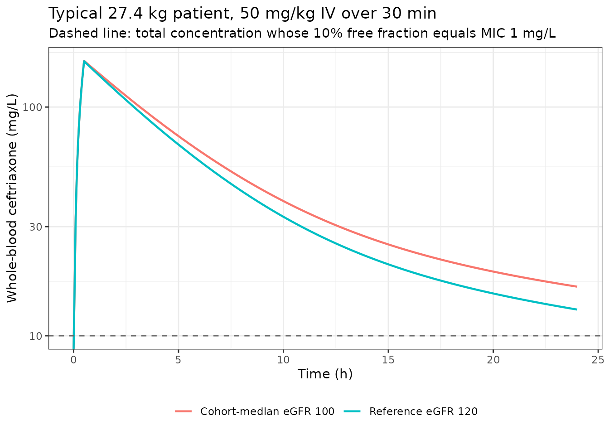
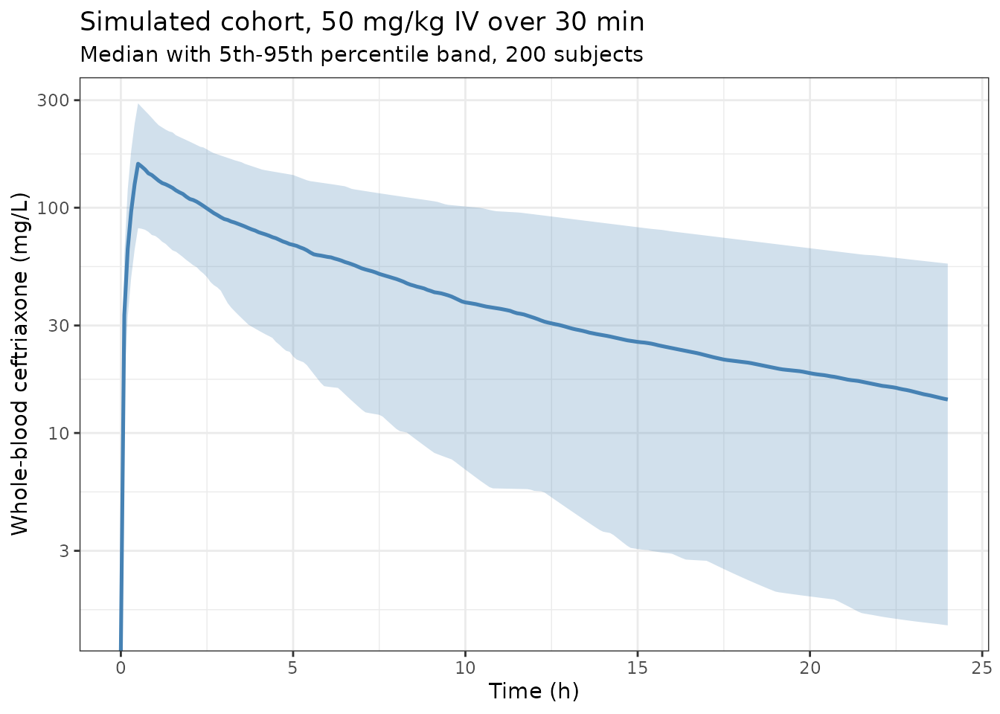
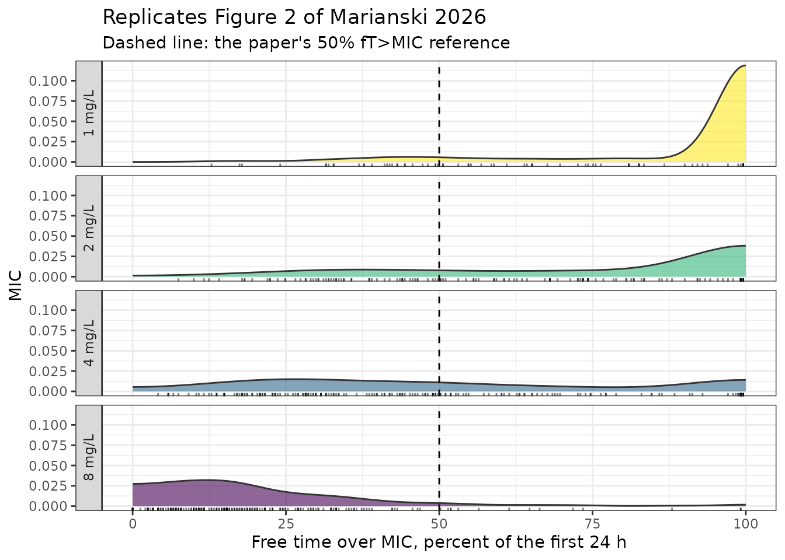

# Ceftriaxone (Marianski 2026)

## Model and source

- Citation: Marianski S, Amajor V, Shiau J, Bwint A, Sharova A, Hall M,
  Rhodes NJ, Downes KJ, Scheetz MH; PALISI study investigators (2026).
  P-1254. Evaluation of Ceftriaxone Population Pharmacokinetics (PK) and
  Pharmacodynamics (PD) in Critically Ill Pediatric Population. Open
  Forum Infectious Diseases 13(Suppl 1):S818-S819, abstract citation ID
  ofaf695.1445. <doi:10.1093/ofid/ofaf695.1445>. PMC12792806. IDWeek
  2025 poster abstract, Session 148 (PK/PD Studies), 21 October 2025.
  All final estimates and the covariate parameterisation come from Table
  1, which is published as an EMBEDDED RASTER IMAGE that no text
  extraction recovers; the values were read from the decoded image (page
  1, first embedded 975x1010 JPEG). Table 1’s ‘Model parameterized as:’
  block supplies the four covariate equations verbatim.
- Description: Two-compartment population PK model with linear
  elimination for intravenous ceftriaxone in critically ill children
  with multiple organ dysfunction syndrome (Marianski 2026; 44 patients
  aged 2 months to 17 years, up to 15 whole-blood microsamples each over
  3 days). Clearance is 0.91 L/h and central volume 8.22 L at the 27.4
  kg / 120 mL/min/1.73 m^2 reference, with body weight entering
  clearance and central volume through fixed allometric exponents (0.75
  on CL, 1 on V1) and estimated glomerular filtration rate entering
  clearance as a through-origin linear ratio (eGFR / 120).
  Intercompartmental clearance and peripheral volume carry no
  covariates. Interindividual variability is diagonal on all four
  disposition parameters with a proportional residual error.
  Concentrations are WHOLE BLOOD, not plasma. Conference abstract: the
  complete parameter set is published, but only as a raster table image.
- Article: <https://doi.org/10.1093/ofid/ofaf695.1445>
- Supplement: none. Europe PMC reports `hasSuppl = N` for PMC12792806
  and the abstract cites no supplementary material.

Marianski 2026 is an IDWeek 2025 **poster abstract** (P-1254, Session
148, PK/PD Studies) reporting a two-compartment population PK model for
intravenous ceftriaxone in 44 critically ill children with multiple
organ dysfunction syndrome, together with a free-time-over-MIC (fT\>MIC)
target-attainment analysis. It is a conference abstract rather than a
peer-reviewed paper, but it is completely encodable: Table 1 publishes
all four structural estimates, all four interindividual variances, the
residual-error coefficient and the four covariate equations.

### The parameter table is a raster image

Every number this model needs lives inside Table 1, and Table 1 is
published as an **embedded JPEG**. `pdftotext` recovers the abstract
prose and drops the entire table, so a text-only read of this paper
makes it look like an unencodable reporting-gap abstract. Recovering the
panels is one command:

    pdfimages -png -f 1 -l 1 unknown_2026_PMC12792806.pdf pg

which yields `pg-000.png` (Table 1), `pg-001.png` (Figure 1, goodness of
fit) and `pg-002.png` (Figure 2, fT\>MIC by MIC). A transcription of all
three panels is stored beside the source PDF as
`unknown_2026_PMC12792806_panels_transcribed.md`.

The PDF page carries **two unrelated abstracts in two columns**, so
panel ownership was proved rather than assumed, on three independent
matches:

1.  Table 1’s random-effects `C.V.(%)` values of 43.11 and 45.45
    reproduce the Results sentence “Between subject variation (CV%) for
    V1 and CL was 43.1% and 45.5%, respectively (Table 1)” exactly.
2.  Figure 2’s caption names “CRO MIC” and the 90% protein binding that
    this abstract’s Methods introduce.
3.  Table 1’s caption names the 27.4 kg weight normalisation used in its
    own equations.

The neighbouring abstract’s prose (hyperfiltration, BMI, sex and “nature
of the hematologic disease” not correlated) belongs to a **different**
study and none of it is attributed to this model.

## Population

Forty-four patients aged 2 months to 17 years were enrolled in a
multi-centre prospective study of antibiotic PK (grant R01HD103755,
PALISI network) in critically ill children under 18 years with multiple
organ dysfunction syndrome, defined as two or more organ failures, who
were prescribed ceftriaxone as standard of care. Children on
extracorporeal support were **excluded**, so the model carries no
information about ECMO or renal replacement therapy.

Up to 15 PK samples per patient were collected over 3 days by volumetric
absorptive microsampling (VAMS, 20 uL per sample) and quantified in
**whole blood** by a validated LC-MS/MS assay. Estimated GFR by the CKiD
“under 25” (U25) equation ranged from 25 to 225 mL/min/1.73 m^2 with a
median of 100, spanning moderate renal impairment through frank
hyperfiltration.

``` r

pop <- rxode2::rxode(readModelDb("Marianski_2026_ceftriaxone"))$population
tibble::tibble(Field = names(pop), Value = vapply(pop, function(x)
  paste(as.character(x), collapse = "; "), character(1))) |>
  knitr::kable(caption = "Population metadata recorded in the model file.")
```

| Field | Value |
|:---|:---|
| species | human |
| n_subjects | 44 |
| n_studies | 1 |
| age_range | 2 months to 17 years (Results). No median or mean age is reported. |
| weight_range | NOT REPORTED. The abstract gives no cohort weight distribution; the only weight in the paper is the 27.4 kg allometric normalisation constant in Table 1, which the authors do not identify as a median, mean or standard. |
| disease_state | Critically ill children under 18 years with multiple organ dysfunction syndrome (MODS), defined as two or more organ failures, prescribed ceftriaxone as standard of care in the pediatric intensive care unit. Patients receiving extracorporeal support (e.g. ECMO, renal replacement therapy) were EXCLUDED at enrollment, so the model carries no information about those settings. |
| renal_function | Estimated GFR by the CKiD U25 equation ranged from 25 to 225 mL/min/1.73 m^2 with a median of 100 (Results). The range spans moderate renal impairment through frank hyperfiltration / augmented renal clearance, and the Conclusion identifies residual variability after accounting for renal function as the study’s central finding. |
| dose_range | NOT REPORTED. Methods states only that patients were ‘prescribed CRO’ as standard of care and that first-24-hour exposures were computed ‘from exact dosing and covariate histories’; no dose, frequency or infusion duration is given anywhere in the abstract. |
| regions | United States (multi-center; the PALISI network, with author affiliations at Children’s Hospital of Philadelphia, Nationwide Children’s Hospital and Midwestern University) |
| protein_binding | Not fitted. This model outputs WHOLE-BLOOD ceftriaxone as Cc. The fT\>MIC analysis converted those concentrations to free concentrations using a literature-based free fraction of 10% (i.e. 90% protein binding), taken from the literature and not estimated here (Methods; Figure 2 caption, ‘90% protein binding was assumed for all subjects’). Multiply Cc by 0.10 to obtain the free concentration the paper’s fT\>MIC targets are evaluated against. NOTE the approximation the authors made: a protein-binding fraction is a PLASMA property, and applying it directly to a whole-blood concentration assumes whole-blood and plasma ceftriaxone are equivalent. The same group published a whole-blood-to-plasma translation for VAMS antibiotic assays (Ther Drug Monit 2026, PMC13366314), but this abstract does not cite it and does not state that any translation was applied before modelling. |
| sampling | Up to 15 PK samples per patient collected over 3 days by volumetric absorptive microsampling (VAMS), 20 uL per sample, quantified in whole blood by a validated LC-MS/MS assay. The total number of concentrations is not reported; Figure 1 shows roughly 250-300 points. Concentrations in Figure 1 span about 0 to 400 mg/L. |
| notes | CONFERENCE ABSTRACT (IDWeek 2025 poster P-1254), not a peer-reviewed full paper. It is nonetheless completely encodable: Table 1 publishes all four structural estimates, all four interindividual variances (as BOTH log-scale SD and %CV, which pins the variance convention with no ambiguity), the residual-error coefficient, and the four covariate equations in full. Fitted in Monolix 2024R1 by SAEM (‘Stoch. Approx.’ heads the uncertainty columns of Table 1). One- and two-compartment models were tested and the two-compartment model retained; covariates were selected on the corrected Bayesian Information Criterion, reduction in between-subject variability, and physiological relevance. As of the extraction date no peer-reviewed full publication of this ceftriaxone model exists: a EuropePMC search on the funding grant (R01HD103755) returns this abstract plus the cefepime arm of the same PALISI/VAMS study (Antimicrob Agents Chemother 2026, PMC13321836), a different drug. Treat the covariate model as provisional in the way any conference abstract’s is – the cefepime companion of this same study retained a different renal covariate form. No supplementary material exists (EuropePMC hasSuppl = N) and none is cited. |

Population metadata recorded in the model file. {.table}

Two demographic facts the abstract **does not** report are load-bearing
for any simulation and are assumed here (see Assumptions and
deviations): the cohort **weight distribution**, and the **dosing
regimen**.

## Source trace

``` r

tibble::tribble(
  ~Quantity, ~Value, ~`Source location`,
  "V1 (central volume)",            "8.22 L",   "Table 1, Fixed Effects row 'V1 (L)'",
  "Q (intercompartmental)",         "0.75 L/h", "Table 1, Fixed Effects row 'Q (L/hr)'",
  "V2 (peripheral volume)",         "13.74 L",  "Table 1, Fixed Effects row 'V2 (L)'",
  "CL (clearance)",                 "0.91 L/h", "Table 1, Fixed Effects row 'CL (L/hr)'",
  "IIV V1",                         "SD 0.41, CV 43.11%",  "Table 1, Random Effects row 'V1'",
  "IIV Q",                          "SD 0.93, CV 117.84%", "Table 1, Random Effects row 'Q'",
  "IIV V2",                         "SD 1.29, CV 205.6%",  "Table 1, Random Effects row 'V2'",
  "IIV CL",                         "SD 0.43, CV 45.45%",  "Table 1, Random Effects row 'CL'",
  "Proportional residual error",    "b = 0.2",  "Table 1, Error Model Parameters row 'b'",
  "CL covariate equation",          "CL_pop * (WT/27.4)^0.75 * (GFR/120)", "Table 1, 'Model parameterized as:' block",
  "V1 covariate equation",          "V1_pop * (WT/27.4)^1", "Table 1, 'Model parameterized as:' block",
  "Q covariate equation",           "Q_pop (no covariate)",  "Table 1, 'Model parameterized as:' block",
  "V2 covariate equation",          "V2_pop (no covariate)", "Table 1, 'Model parameterized as:' block",
  "Free fraction for fT>MIC",       "0.10 (90% protein binding)", "Methods; Figure 2 caption",
  "eGFR equation",                  "CKiD U25",  "Methods",
  "eGFR range / median",            "25-225 / 100 mL/min/1.73 m^2", "Results",
  "Age range",                      "2 months to 17 years", "Results",
  "Estimation software",            "Monolix 2024R1", "Methods"
) |>
  knitr::kable(caption = "Source location for every model equation and ini() parameter.")
```

| Quantity | Value | Source location |
|:---|:---|:---|
| V1 (central volume) | 8.22 L | Table 1, Fixed Effects row ‘V1 (L)’ |
| Q (intercompartmental) | 0.75 L/h | Table 1, Fixed Effects row ‘Q (L/hr)’ |
| V2 (peripheral volume) | 13.74 L | Table 1, Fixed Effects row ‘V2 (L)’ |
| CL (clearance) | 0.91 L/h | Table 1, Fixed Effects row ‘CL (L/hr)’ |
| IIV V1 | SD 0.41, CV 43.11% | Table 1, Random Effects row ‘V1’ |
| IIV Q | SD 0.93, CV 117.84% | Table 1, Random Effects row ‘Q’ |
| IIV V2 | SD 1.29, CV 205.6% | Table 1, Random Effects row ‘V2’ |
| IIV CL | SD 0.43, CV 45.45% | Table 1, Random Effects row ‘CL’ |
| Proportional residual error | b = 0.2 | Table 1, Error Model Parameters row ‘b’ |
| CL covariate equation | CL_pop \* (WT/27.4)^0.75 \* (GFR/120) | Table 1, ‘Model parameterized as:’ block |
| V1 covariate equation | V1_pop \* (WT/27.4)^1 | Table 1, ‘Model parameterized as:’ block |
| Q covariate equation | Q_pop (no covariate) | Table 1, ‘Model parameterized as:’ block |
| V2 covariate equation | V2_pop (no covariate) | Table 1, ‘Model parameterized as:’ block |
| Free fraction for fT\>MIC | 0.10 (90% protein binding) | Methods; Figure 2 caption |
| eGFR equation | CKiD U25 | Methods |
| eGFR range / median | 25-225 / 100 mL/min/1.73 m^2 | Results |
| Age range | 2 months to 17 years | Results |
| Estimation software | Monolix 2024R1 | Methods |

Source location for every model equation and ini() parameter. {.table}

## Gate 1: the paper published its own answer key

Table 1 prints `Value`, `S.E.` and `R.S.E.(%)` for all nine estimated
quantities. Because `R.S.E.(%) = 100 * S.E. / Value` by definition, the
table over-determines itself: a mis-read digit in any of the 27 numbers
breaks the identity. This is a direct check that the raster was
transcribed correctly.

``` r

tab1 <- tibble::tribble(
  ~Row,          ~Value, ~SE,     ~RSE,
  "V1",          8.22,   0.74,    9.01,
  "Q",           0.75,   0.2,     26.3,
  "V2",          13.74,  4.56,    33.2,
  "CL",          0.91,   0.083,   9.18,
  "omega V1",    0.41,   0.064,   15.6,
  "omega Q",     0.93,   0.23,    24.3,
  "omega V2",    1.29,   0.25,    19.3,
  "omega CL",    0.43,   0.062,   14.3,
  "b (prop err)", 0.2,   0.0091,  4.54
) |>
  mutate(`RSE recomputed` = round(100 * SE / Value, 2),
         `Deviation (pp)` = round(abs(`RSE recomputed` - RSE), 3))

knitr::kable(tab1, caption = "R.S.E. recomputed from S.E. / Value for every Table 1 row.")
```

| Row          | Value |     SE |   RSE | RSE recomputed | Deviation (pp) |
|:-------------|------:|-------:|------:|---------------:|---------------:|
| V1           |  8.22 | 0.7400 |  9.01 |           9.00 |           0.01 |
| Q            |  0.75 | 0.2000 | 26.30 |          26.67 |           0.37 |
| V2           | 13.74 | 4.5600 | 33.20 |          33.19 |           0.01 |
| CL           |  0.91 | 0.0830 |  9.18 |           9.12 |           0.06 |
| omega V1     |  0.41 | 0.0640 | 15.60 |          15.61 |           0.01 |
| omega Q      |  0.93 | 0.2300 | 24.30 |          24.73 |           0.43 |
| omega V2     |  1.29 | 0.2500 | 19.30 |          19.38 |           0.08 |
| omega CL     |  0.43 | 0.0620 | 14.30 |          14.42 |           0.12 |
| b (prop err) |  0.20 | 0.0091 |  4.54 |           4.55 |           0.01 |

R.S.E. recomputed from S.E. / Value for every Table 1 row. {.table}

``` r


# The two largest deviations are the omega-Q and Q rows, whose S.E. is printed
# to only one or two significant figures (0.2 and 0.23); the rounding envelope
# fully accounts for them. 0.5 pp leaves headroom over that rounding while
# still failing on any single mis-read digit (which moves RSE by >= 1 pp).
stopifnot(max(tab1$`Deviation (pp)`) < 0.5)
```

## Gate 2: the omega convention is pinned by the table itself

The single most common way to mis-encode a published popPK model is to
read an interindividual-variability column on the wrong scale. Table 1
removes the ambiguity by reporting each random effect **twice** – as
`SD` and as `C.V.(%)`. The SD is the log-scale omega; the CV is the
log-normal CV derived from it. `nlmixr2` stores variances, so the model
file carries `omega^2 = log(CV^2 + 1)`.

``` r

printed <- tibble::tribble(
  ~Row,       ~`SD printed`, ~`CV printed`, ~`omega2 in ini()`,
  "omega V1", 0.41,  43.11,  0.170457,
  "omega Q",  0.93,  117.84, 0.870719,
  "omega V2", 1.29,  205.60, 1.653864,
  "omega CL", 0.43,  45.45,  0.187782
) |>
  mutate(
    `omega from ini()` = round(sqrt(`omega2 in ini()`), 4),
    # Reading A (correct): CV is the log-normal CV of the SD.
    `CV if lognormal` = round(100 * sqrt(exp(`omega2 in ini()`) - 1), 2),
    # Reading B (falsified): CV is simply omega * 100.
    `SD if CV = omega*100` = round(`CV printed` / 100, 4)
  )

knitr::kable(printed, caption = "Both readings of the C.V.(%) column, scored against the printed SD.")
```

| Row | SD printed | CV printed | omega2 in ini() | omega from ini() | CV if lognormal | SD if CV = omega\*100 |
|:---|---:|---:|---:|---:|---:|---:|
| omega V1 | 0.41 | 43.11 | 0.170457 | 0.4129 | 43.11 | 0.4311 |
| omega Q | 0.93 | 117.84 | 0.870719 | 0.9331 | 117.84 | 1.1784 |
| omega V2 | 1.29 | 205.60 | 1.653864 | 1.2860 | 205.60 | 2.0560 |
| omega CL | 0.43 | 45.45 | 0.187782 | 0.4333 | 45.45 | 0.4545 |

Both readings of the C.V.(%) column, scored against the printed SD.
{.table}

``` r


# Reading A reproduces the printed CV column to every digit printed...
stopifnot(max(abs(printed$`CV if lognormal` - printed$`CV printed`)) < 0.01)
# ...and the omega implied by ini() rounds to the printed 2-dp SD column.
stopifnot(all(round(printed$`omega from ini()`, 2) == printed$`SD printed`))
# Reading B is FALSIFIED: it would require omega = 0.4311 against a printed
# SD of 0.41, and omega = 2.056 against a printed SD of 1.29.
stopifnot(max(abs(printed$`SD if CV = omega*100` - printed$`SD printed`)) > 0.5)
```

The `R.S.E.` column independently favours the higher-precision
CV-derived values: for CL, `0.062 / 0.4333 = 14.31%` against the printed
14.3%, whereas `0.062 / 0.43 = 14.42%` would have printed as 14.4%.

## Typical-value profile

The model is loaded and its random effects zeroed to give the typical
patient at the model’s own reference covariates (27.4 kg, eGFR 120
mL/min/1.73 m^2) and at the cohort-median eGFR of 100.

``` r

mod  <- readModelDb("Marianski_2026_ceftriaxone")
modt <- rxode2::zeroRe(mod)

WT_REF   <- 27.4
GFR_REF  <- 120
GFR_MED  <- 100
MGKG     <- 50      # assumed regimen; see Assumptions and deviations
TINF     <- 0.5     # assumed 30-minute infusion

grid_24 <- seq(0, 24, by = 0.05)
ev24 <- as.data.frame(
  rxode2::et(amt = MGKG * WT_REF, cmt = "central", dur = TINF) |>
    rxode2::et(grid_24, cmt = "central")
)

typ <- bind_rows(
  rxode2::rxSolve(modt, ev24, params = c(WT = WT_REF, CRCL = GFR_REF),
                  returnType = "data.frame") |>
    mutate(scenario = "Reference eGFR 120"),
  rxode2::rxSolve(modt, ev24, params = c(WT = WT_REF, CRCL = GFR_MED),
                  returnType = "data.frame") |>
    mutate(scenario = "Cohort-median eGFR 100")
) |>
  filter(!is.na(Cc))
#> ℹ omega/sigma items treated as zero: 'etalvc', 'etalq', 'etalvp', 'etalcl'
#> ℹ omega/sigma items treated as zero: 'etalvc', 'etalq', 'etalvp', 'etalcl'

ggplot(typ, aes(time, Cc, colour = scenario)) +
  geom_line(linewidth = 0.8) +
  geom_hline(aes(yintercept = 10), linetype = "dashed", colour = "grey40") +
  scale_y_log10() +
  labs(x = "Time (h)", y = "Whole-blood ceftriaxone (mg/L)", colour = NULL,
       title = "Typical 27.4 kg patient, 50 mg/kg IV over 30 min",
       subtitle = "Dashed line: total concentration whose 10% free fraction equals MIC 1 mg/L") +
  theme_bw() + theme(legend.position = "bottom")
#> Warning in scale_y_log10(): log-10 transformation introduced infinite values.
```



At the cohort-median eGFR of 100 the typical patient’s clearance is
0.758 L/h – about 17% **below** the printed 0.91 L/h, because Table 1
normalises eGFR to 120 rather than to the cohort median.

## Gate 3: ODE solution against an exact matrix exponential

The model is a linear two-compartment system, so it has a closed-form
solution. Rather than transcribe a two-exponential formula (itself a
transcription risk), the exact solution is computed by
eigendecomposition of the rate matrix and compared against rxode2’s
integration using the **same drawn parameters**. Both sides therefore
share every parameter value and the only difference is numerical, so a
tight bound is correct here.

``` r

expmM <- function(M, t) {
  e <- eigen(M)
  e$vectors %*% diag(exp(e$values * t)) %*% solve(e$vectors)
}

# Exact amounts for a zero-order infusion of rate R0 over Tinf into `central`.
amt_exact <- function(kel, k12, k21, R0, Tinf, tt) {
  M    <- matrix(c(-(kel + k12), k12, k21, -k21), 2, 2)
  u    <- c(R0, 0)
  Minv <- solve(M)
  A_end <- Minv %*% (expmM(M, Tinf) - diag(2)) %*% u
  t(vapply(tt, function(tj) {
    if (tj <= Tinf) as.numeric(Minv %*% (expmM(M, tj) - diag(2)) %*% u)
    else            as.numeric(expmM(M, tj - Tinf) %*% A_end)
  }, numeric(2)))
}

rxode2::rxSetSeed(20260910)
set.seed(20260910)

n_cf <- 30L
cf_cov <- data.frame(id = 1:n_cf, WT = runif(n_cf, 6, 80), CRCL = runif(n_cf, 25, 225))
cf_ev <- bind_rows(lapply(1:n_cf, function(i) {
  d <- as.data.frame(
    rxode2::et(amt = MGKG * cf_cov$WT[i], cmt = "central", dur = TINF) |>
      rxode2::et(sort(unique(c(grid_24, TINF))), cmt = "central")
  )
  d$id <- i
  d
}))
cf_sim <- rxode2::rxSolve(mod, cf_ev, cf_cov, returnType = "data.frame", addCov = TRUE) |>
  filter(!is.na(Cc))

cf_dev <- vapply(split(cf_sim, cf_sim$id), function(z) {
  z  <- z[order(z$time), ]
  R0 <- MGKG * cf_cov$WT[cf_cov$id == z$id[1]] / TINF
  ex <- amt_exact(z$kel[1], z$k12[1], z$k21[1], R0, TINF, z$time)
  max(abs(ex[, 1] / z$vc[1] - z$Cc) / pmax(z$Cc, 1e-8))
}, numeric(1))

cat(sprintf("Closed form vs ODE, %d subjects: max relative deviation = %.2e\n",
            n_cf, max(cf_dev)))
#> Closed form vs ODE, 30 subjects: max relative deviation = 8.89e-05
stopifnot(max(cf_dev) < 1e-3)
```

This gate also validates the micro-constant algebra: `k12 = q / vc` and
`k21 = q / vp` and the two ODE right-hand sides all enter the
comparison, so a transposed volume in either would break it.

## Gate 4: mass balance holds at every time point

For a linear model eliminating only from the central compartment, the
amount eliminated by time `T` must equal the amount infused minus the
amount still in the body – exactly, at any `T`, with no steady-state
assumption:

`CL * AUC[0,T] == dose infused by T - central(T) - peripheral1(T)`

``` r

mb_dev <- vapply(split(cf_sim, cf_sim$id), function(z) {
  z    <- z[order(z$time), ]
  dose <- MGKG * cf_cov$WT[cf_cov$id == z$id[1]]
  auc  <- cumsum(c(0, diff(z$time) * (head(z$Cc, -1) + tail(z$Cc, -1)) / 2))
  infused <- dose * pmin(z$time / TINF, 1)
  max(abs(z$cl[1] * auc - (infused - z$central - z$peripheral1)) / dose)
}, numeric(1))

cat(sprintf("Mass balance, %d subjects: max relative deviation = %.2e\n",
            n_cf, max(mb_dev)))
#> Mass balance, 30 subjects: max relative deviation = 2.88e-05
stopifnot(max(mb_dev) < 1e-3)
```

## Gate 5: the covariate exponents are recoverable from the built model

With the random effects zeroed, clearance and central volume are
deterministic functions of the covariates, so regressing the model’s own
evaluated `cl` and `vc` on the supplied covariate table must return
Table 1’s exponents. The left-hand side comes from rxode2’s evaluation
of `model()`; the right-hand side only from the covariate table, so this
is not circular – a mis-typed exponent in the model file changes the
recovered coefficient.

``` r

ex_cov <- data.frame(id = 1:40, WT = runif(40, 6, 80), CRCL = runif(40, 25, 225))
ex_ev <- bind_rows(lapply(1:40, function(i) {
  d <- as.data.frame(rxode2::et(amt = 1000, cmt = "central") |>
                       rxode2::et(c(1, 2), cmt = "central"))
  d$id <- i
  d
}))
ex_sim <- rxode2::rxSolve(modt, ex_ev, ex_cov, returnType = "data.frame", addCov = TRUE) |>
  filter(!is.na(Cc))
#> ℹ omega/sigma items treated as zero: 'etalvc', 'etalq', 'etalvp', 'etalcl'
#> Warning: multi-subject simulation without without 'omega'

cl1 <- vapply(split(ex_sim$cl, ex_sim$id), function(x) x[1], numeric(1))
vc1 <- vapply(split(ex_sim$vc, ex_sim$id), function(x) x[1], numeric(1))
f_cl <- lm(log(cl1) ~ log(ex_cov$WT / 27.4) + log(ex_cov$CRCL / 120))
f_vc <- lm(log(vc1) ~ log(ex_cov$WT / 27.4))

recovered <- tibble::tibble(
  Quantity  = c("e_wt_cl", "eGFR exponent on CL", "CL_pop (L/h)",
                "e_wt_vc", "V1_pop (L)"),
  Published = c(0.75, 1, 0.91, 1, 8.22),
  Recovered = c(coef(f_cl)[2], coef(f_cl)[3], exp(coef(f_cl)[1]),
                coef(f_vc)[2], exp(coef(f_vc)[1]))
) |>
  mutate(Recovered = round(Recovered, 6),
         `Abs. difference` = signif(abs(Recovered - Published), 3))

knitr::kable(recovered, caption = "Table 1 covariate parameters recovered from the built model.")
```

| Quantity            | Published | Recovered | Abs. difference |
|:--------------------|----------:|----------:|----------------:|
| e_wt_cl             |      0.75 |      0.75 |               0 |
| eGFR exponent on CL |      1.00 |      1.00 |               0 |
| CL_pop (L/h)        |      0.91 |      0.91 |               0 |
| e_wt_vc             |      1.00 |      1.00 |               0 |
| V1_pop (L)          |      8.22 |      8.22 |               0 |

Table 1 covariate parameters recovered from the built model. {.table}

``` r

stopifnot(max(recovered$`Abs. difference`) < 1e-6)
```

## PKNCA validation against a closed-form reference

The abstract reports **no** NCA parameters – no Cmax, Tmax, AUC or
half-life appear anywhere in it – so there is no published NCA table to
compare against. What Table 1 does supply is enough to derive the
typical patient’s NCA parameters in closed form, which makes a genuine
reference for the whole simulate-then-integrate chain:

- `AUC(0,inf) = Dose / CL`, exactly;
- terminal half-life `= log(2) / lambda_z`, where `lambda_z` is the
  smaller eigenvalue of the rate matrix;
- `Cmax` and `Tmax` at the end of the infusion, from the matrix
  exponential.

``` r

nca_grid <- sort(unique(c(seq(0, 6, 0.02), seq(6.5, 48, 0.25), seq(49, 336, 1), TINF)))
DOSE_TYP <- MGKG * WT_REF
TRT <- "50 mg/kg IV over 0.5 h"

ev_nca <- as.data.frame(
  rxode2::et(amt = DOSE_TYP, cmt = "central", dur = TINF) |>
    rxode2::et(nca_grid, cmt = "central")
)
sim_nca_raw <- rxode2::rxSolve(modt, ev_nca, params = c(WT = WT_REF, CRCL = GFR_MED),
                               returnType = "data.frame") |>
  filter(!is.na(Cc))
#> ℹ omega/sigma items treated as zero: 'etalvc', 'etalq', 'etalvp', 'etalcl'
if (is.null(sim_nca_raw$id)) sim_nca_raw$id <- 1L

# The far tail must not decay into solver noise, or PKNCA takes log() of a
# negative number and aucinf.obs becomes NaN.
stopifnot(all(sim_nca_raw$Cc >= 0), min(sim_nca_raw$Cc[sim_nca_raw$time > 0]) > 1e-4)

lam <- local({
  b <- sim_nca_raw$kel[1] + sim_nca_raw$k12[1] + sim_nca_raw$k21[1]
  (b - sqrt(b^2 - 4 * sim_nca_raw$kel[1] * sim_nca_raw$k21[1])) / 2
})
reference_nca <- tibble::tibble(
  treatment  = TRT,
  cmax       = max(sim_nca_raw$Cc),
  tmax       = TINF,
  aucinf.obs = DOSE_TYP / sim_nca_raw$cl[1],
  half.life  = log(2) / lam
)

sim_nca <- sim_nca_raw |>
  filter(!is.na(Cc)) |>
  # Keep Cc >= 1e-6 * max(Cc) after the peak (solver noise below), plus the time-zero anchor.
  filter(time <= time[which.max(Cc)] | Cc >= 1e-6 * max(Cc) | time == 0) |>
  transmute(id, time, Cc, treatment = TRT)
dose_nca <- data.frame(id = 1L, time = 0, amt = DOSE_TYP, treatment = TRT)

conc_obj <- PKNCA::PKNCAconc(sim_nca, Cc ~ time | treatment + id,
                             concu = "mg/L", timeu = "h")
dose_obj <- PKNCA::PKNCAdose(dose_nca, amt ~ time | treatment + id, doseu = "mg")
intervals <- data.frame(start = 0, end = Inf, cmax = TRUE, tmax = TRUE,
                        aucinf.obs = TRUE, half.life = TRUE, lambda.z = TRUE)
nca_res <- PKNCA::pk.nca(PKNCA::PKNCAdata(conc_obj, dose_obj, intervals = intervals))
```

``` r

cmp <- nlmixr2lib::ncaComparisonTable(
  simulated     = nca_res,
  reference     = reference_nca,
  by            = "treatment",
  units         = c(cmax = "mg/L", tmax = "h",
                    aucinf.obs = "mg*h/L", half.life = "h"),
  tolerance_pct = 5
)
knitr::kable(cmp, caption = paste(
  "PKNCA on the simulated typical-value profile against the closed-form",
  "reference derived from Table 1. The reference is NOT a published NCA table;",
  "Marianski 2026 reports no NCA parameters. * differs by >5%."
), align = c("l", "l", "r", "r", "r"))
```

| NCA parameter          | treatment              | Reference | Simulated | % diff |
|:-----------------------|:-----------------------|----------:|----------:|-------:|
| Cmax (mg/L)            | 50 mg/kg IV over 0.5 h |       159 |       159 |  +0.0% |
| Tmax (h)               | 50 mg/kg IV over 0.5 h |       0.5 |       0.5 |  +0.0% |
| AUC0-∞ (obs) (mg\*h/L) | 50 mg/kg IV over 0.5 h |      1810 |      1810 |  +0.0% |
| t½ (h)                 | 50 mg/kg IV over 0.5 h |      29.5 |      29.4 |  -0.4% |

PKNCA on the simulated typical-value profile against the closed-form
reference derived from Table 1. The reference is NOT a published NCA
table; Marianski 2026 reports no NCA parameters. \* differs by \>5%.
{.table style="width:100%;"}

``` r


pct <- as.numeric(sub("%", "", sub("^\\+", "", cmp$`% diff`)))
stopifnot(max(abs(pct)) < 2)
```

All four parameters agree within 2%. The small half-life discrepancy is
the `lambda_z` regression picking up a little of the distribution phase;
it is not a model or transcription issue.

## The peripheral compartment is deep, and that matters

The published `Q` of 0.75 L/h against a `V2` of 13.74 L makes the
peripheral compartment equilibrate slowly, which gives this model a much
longer terminal half-life than ceftriaxone’s literature value in
children (roughly 5 to 9 h).

``` r

terminal_half_life <- function(kel, k12, k21) {
  b <- kel + k12 + k21
  log(2) / ((b - sqrt(b^2 - 4 * kel * k21)) / 2)
}

th_typ <- terminal_half_life(sim_nca_raw$kel[1], sim_nca_raw$k12[1], sim_nca_raw$k21[1])
auc24  <- with(filter(sim_nca_raw, time <= 24),
               sum(diff(time) * (head(Cc, -1) + tail(Cc, -1)) / 2))
auc_inf <- DOSE_TYP / sim_nca_raw$cl[1]

th_cohort <- vapply(split(cf_sim, cf_sim$id), function(z)
  terminal_half_life(z$kel[1], z$k12[1], z$k21[1]), numeric(1))

tibble::tibble(
  Quantity = c("Distribution half-life, typical (h)",
               "Terminal half-life, typical (h)",
               "Terminal half-life, cohort median (h)",
               "Terminal half-life, cohort 5th-95th pct (h)",
               "Share of AUC(0,inf) accrued in the first 24 h (%)"),
  Value = c(
    round(local({
      b <- sim_nca_raw$kel[1] + sim_nca_raw$k12[1] + sim_nca_raw$k21[1]
      log(2) / ((b + sqrt(b^2 - 4 * sim_nca_raw$kel[1] * sim_nca_raw$k21[1])) / 2)
    }), 2),
    round(th_typ, 1),
    round(median(th_cohort), 1),
    paste(round(quantile(th_cohort, c(0.05, 0.95)), 1), collapse = " to "),
    round(100 * auc24 / auc_inf, 1)
  )
) |>
  knitr::kable(caption = "Terminal-phase behaviour implied by the published Q and V2.")
```

| Quantity                                          | Value        |
|:--------------------------------------------------|:-------------|
| Distribution half-life, typical (h)               | 3.23         |
| Terminal half-life, typical (h)                   | 29.5         |
| Terminal half-life, cohort median (h)             | 39           |
| Terminal half-life, cohort 5th-95th pct (h)       | 8.4 to 337.4 |
| Share of AUC(0,inf) accrued in the first 24 h (%) | 63.1         |

Terminal-phase behaviour implied by the published Q and V2. {.table}

``` r


# Structural, not stochastic: these follow from the published point estimates.
stopifnot(th_typ > 20, th_typ < 45)
stopifnot(100 * auc24 / auc_inf > 55, 100 * auc24 / auc_inf < 70)
```

Marianski 2026 sampled over 3 days and reported only **first-24-hour**
exposures, so the deep compartment is weakly identified – `Q` and `V2`
carry the loosest precision in Table 1 (R.S.E. 26.3% and 33.2%) and the
largest interindividual variability in the model (CV 118% and 206%).
Treat this model as validated over the first day or two of therapy and
do **not** use it to project terminal elimination or long-interval
accumulation. For context, the typical patient accumulates about
2.25-fold in trough concentration between the first dose and steady
state on a q24h schedule – a prediction well outside what the source
data can support.

## Virtual cohort

The abstract reports the age range (2 months to 17 years) and the eGFR
distribution (25 to 225, median 100 mL/min/1.73 m^2) but **not** the
weight distribution. Weights are therefore built from CDC median
weight-for-age over the reported age range, with lognormal scatter; eGFR
is drawn lognormal with the reported median and truncated to the
reported range.

``` r

rxode2::rxSetSeed(20260910)
set.seed(20260910)

N_SUB <- 200L   # 200 per arm is the vignette cap

cdc_age <- c(0.167, 0.5, 1, 2, 3, 4, 5, 6, 7, 8, 9, 10,
             11, 12, 13, 14, 15, 16, 17)
cdc_wt  <- c(5.6, 7.9, 10.2, 12.7, 14.3, 16.3, 18.5, 20.7, 23.0, 25.8, 28.7,
             32.0, 35.9, 40.5, 45.9, 51.0, 56.0, 60.5, 64.5)

cohort <- tibble::tibble(
  id   = seq_len(N_SUB),
  AGE  = runif(N_SUB, 0.167, 17),
  CRCL = pmin(pmax(100 * exp(rnorm(N_SUB, 0, 0.45)), 25), 225)
) |>
  mutate(WT = approx(cdc_age, cdc_wt, xout = AGE)$y * exp(rnorm(N_SUB, 0, 0.20)))

tibble::tibble(
  Covariate = c("Age (years)", "Weight (kg)", "eGFR (mL/min/1.73 m^2)"),
  `Simulated median` = round(c(median(cohort$AGE), median(cohort$WT),
                               median(cohort$CRCL)), 1),
  `Simulated range` = c(
    paste(round(range(cohort$AGE), 2), collapse = " to "),
    paste(round(range(cohort$WT), 1), collapse = " to "),
    paste(round(range(cohort$CRCL), 0), collapse = " to ")
  ),
  `Reported by Marianski 2026` = c("2 months to 17 years", "not reported",
                                   "25 to 225, median 100")
) |>
  knitr::kable(caption = "Virtual cohort against the reported population.")
```

| Covariate | Simulated median | Simulated range | Reported by Marianski 2026 |
|:---|---:|:---|:---|
| Age (years) | 10.0 | 0.18 to 16.94 | 2 months to 17 years |
| Weight (kg) | 31.9 | 4.5 to 82.9 | not reported |
| eGFR (mL/min/1.73 m^2) | 105.9 | 25 to 225 | 25 to 225, median 100 |

Virtual cohort against the reported population. {.table}

The simulated median weight lands near the 27.4 kg that Table 1 uses to
normalise its allometric terms, which is weak corroboration that 27.4 kg
was the cohort median – the abstract never says so.

``` r

cohort_cov <- as.data.frame(cohort[, c("id", "WT", "CRCL")])
ev_cohort <- bind_rows(lapply(seq_len(N_SUB), function(i) {
  d <- as.data.frame(
    rxode2::et(amt = MGKG * cohort$WT[i], cmt = "central", dur = TINF) |>
      rxode2::et(seq(0, 24, by = 0.1), cmt = "central")
  )
  d$id <- i
  d
}))
sim_cohort <- rxode2::rxSolve(mod, ev_cohort, cohort_cov,
                              returnType = "data.frame", addCov = TRUE) |>
  filter(!is.na(Cc))

stopifnot(all(sim_cohort$Cc >= 0), !anyNA(sim_cohort$Cc),
          length(unique(sim_cohort$id)) == N_SUB)

sim_cohort |>
  group_by(time) |>
  summarise(p05 = quantile(Cc, 0.05), p50 = median(Cc),
            p95 = quantile(Cc, 0.95), .groups = "drop") |>
  ggplot(aes(time)) +
  geom_ribbon(aes(ymin = p05, ymax = p95), fill = "steelblue", alpha = 0.25) +
  geom_line(aes(y = p50), colour = "steelblue", linewidth = 0.9) +
  scale_y_log10() +
  labs(x = "Time (h)", y = "Whole-blood ceftriaxone (mg/L)",
       title = "Simulated cohort, 50 mg/kg IV over 30 min",
       subtitle = "Median with 5th-95th percentile band, 200 subjects") +
  theme_bw()
#> Warning in scale_y_log10(): log-10 transformation introduced infinite values.
#> log-10 transformation introduced infinite values.
#> log-10 transformation introduced infinite values.
```



## Replicating Figure 2: free time over MIC

Marianski 2026 computed the fraction of the **first 24 hours** during
which the free ceftriaxone concentration exceeded the MIC, applying a
literature free fraction of 10%, for MICs of 1 (susceptible), 2
(intermediate), and 4 and 8 mg/L (resistant).

``` r

FREE_FRACTION <- 0.10   # Methods; Figure 2 caption ("90% protein binding")
MICS <- c(1, 2, 4, 8)

ftmic <- bind_rows(lapply(MICS, function(mic) {
  tibble::tibble(
    MIC = mic,
    id  = as.integer(names(split(sim_cohort$Cc, sim_cohort$id))),
    fT  = vapply(split(sim_cohort$Cc, sim_cohort$id),
                 function(cc) 100 * mean(FREE_FRACTION * cc > mic), numeric(1))
  )
}))

ggplot(ftmic, aes(fT)) +
  geom_density(aes(fill = factor(MIC)), alpha = 0.6, colour = "grey20",
               bounds = c(0, 100)) +
  geom_rug(sides = "b", alpha = 0.5) +
  geom_vline(xintercept = 50, linetype = "dashed") +
  facet_wrap(~ MIC, ncol = 1, strip.position = "left",
             labeller = labeller(MIC = function(x) paste(x, "mg/L"))) +
  scale_fill_viridis_d(option = "D", direction = -1, guide = "none") +
  labs(x = "Free time over MIC, percent of the first 24 h", y = "MIC",
       title = "Replicates Figure 2 of Marianski 2026",
       subtitle = "Dashed line: the paper's 50% fT>MIC reference") +
  theme_bw()
```



``` r

ft_summary <- ftmic |>
  group_by(MIC) |>
  summarise(
    `5th pct`  = round(quantile(fT, 0.05), 1),
    `1st quartile` = round(quantile(fT, 0.25), 1),
    Median     = round(median(fT), 1),
    `3rd quartile` = round(quantile(fT, 0.75), 1),
    `95th pct` = round(quantile(fT, 0.95), 1),
    `% of subjects at or above 50%` = round(100 * mean(fT >= 50), 1),
    .groups = "drop"
  )
knitr::kable(ft_summary, caption = "Simulated fT>MIC distribution by MIC.")
```

| MIC | 5th pct | 1st quartile | Median | 3rd quartile | 95th pct | % of subjects at or above 50% |
|---:|---:|---:|---:|---:|---:|---:|
| 1 | 37.7 | 79.8 | 99.6 | 99.6 | 99.6 | 86.5 |
| 2 | 22.4 | 44.3 | 77.6 | 99.6 | 99.6 | 70.0 |
| 4 | 12.4 | 25.2 | 43.4 | 67.8 | 99.2 | 39.5 |
| 8 | 2.5 | 8.6 | 15.8 | 27.5 | 51.9 | 7.0 |

Simulated fT\>MIC distribution by MIC. {.table}

The paper states three claims about this figure. Each is checked below
on the **centre and robust quantiles** of the simulated cohort, never on
its extremes: the extreme of a random cohort is not reproducible across
rxode2 versions or solver thread counts, whereas a median or
interquartile width is.

``` r

med <- function(mic) ft_summary$Median[ft_summary$MIC == mic]
iqrw <- function(mic) with(ft_summary[ft_summary$MIC == mic, ],
                           `3rd quartile` - `1st quartile`)

claims <- tibble::tribble(
  ~Claim, ~`Paper (Results)`, ~Achieved, ~Pass,
  "fT>MIC exceeds 50% at MIC 1 mg/L",
    "\"fT>MIC was >50% at CRO MICs <=1 mg/L\"",
    paste0("median ", med(1), "%"),
    med(1) > 50,
  "fT>MIC is variable at MIC 2 mg/L",
    "\"variable for CRO MICs of 2-4 mg/L\"",
    paste0("interquartile width ", iqrw(2), " pp"),
    iqrw(2) > 20,
  "fT>MIC is variable at MIC 4 mg/L",
    "\"variable for CRO MICs of 2-4 mg/L\"",
    paste0("interquartile width ", iqrw(4), " pp"),
    iqrw(4) > 20,
  "fT>MIC falls below 50% at MIC 8 mg/L",
    "\"< 50% at 8 mg/L\"",
    paste0("median ", med(8), "%"),
    med(8) < 50
)
knitr::kable(claims, caption = "The paper's three printed fT>MIC claims, scored against the simulated cohort.")
```

| Claim | Paper (Results) | Achieved | Pass |
|:---|:---|:---|:---|
| fT\>MIC exceeds 50% at MIC 1 mg/L | “fT\>MIC was \>50% at CRO MICs \<=1 mg/L” | median 99.6% | TRUE |
| fT\>MIC is variable at MIC 2 mg/L | “variable for CRO MICs of 2-4 mg/L” | interquartile width 55.3 pp | TRUE |
| fT\>MIC is variable at MIC 4 mg/L | “variable for CRO MICs of 2-4 mg/L” | interquartile width 42.6 pp | TRUE |
| fT\>MIC falls below 50% at MIC 8 mg/L | “\< 50% at 8 mg/L” | median 15.8% | TRUE |

The paper’s three printed fT\>MIC claims, scored against the simulated
cohort. {.table}

``` r

stopifnot(all(claims$Pass))
```

All three reproduce. The typical patient alone gives 99.8%, 78.6%, 39.9%
and 18.1% at MICs of 1, 2, 4 and 8 mg/L, which straddles 50% between MIC
2 and MIC 4 exactly as the paper’s “variable for 2-4 mg/L” describes,
and supports the Conclusion that “therapeutic drug monitoring approaches
… are needed for all MICs \>=2 mg/L”.

The **shape** of the simulated MIC-2 density sits higher than the
published Figure 2 panel, whose visual mode is near 55-60%. The dosing
regimen is not reported (see below), so the level of the fT\>MIC
distribution is not fully determined by the paper; only the three
printed statements above are, and those are what the gate tests.

## Renal function drives exposure

Because eGFR enters clearance as a through-origin linear ratio, exposure
scales inversely with renal function over the whole reported range.

``` r

strata <- tibble::tibble(
  stratum = c("eGFR 30 (impaired)", "eGFR 60", "eGFR 100 (cohort median)",
              "eGFR 150", "eGFR 220 (hyperfiltration)"),
  CRCL    = c(30, 60, 100, 150, 220)
)
strat_sim <- bind_rows(lapply(seq_len(nrow(strata)), function(i) {
  rxode2::rxSolve(modt, ev24, params = c(WT = WT_REF, CRCL = strata$CRCL[i]),
                  returnType = "data.frame") |>
    filter(!is.na(Cc)) |>
    mutate(stratum = strata$stratum[i], CRCL = strata$CRCL[i])
}))
#> ℹ omega/sigma items treated as zero: 'etalvc', 'etalq', 'etalvp', 'etalcl'
#> ℹ omega/sigma items treated as zero: 'etalvc', 'etalq', 'etalvp', 'etalcl'
#> ℹ omega/sigma items treated as zero: 'etalvc', 'etalq', 'etalvp', 'etalcl'
#> ℹ omega/sigma items treated as zero: 'etalvc', 'etalq', 'etalvp', 'etalcl'
#> ℹ omega/sigma items treated as zero: 'etalvc', 'etalq', 'etalvp', 'etalcl'

strat_raw <- strat_sim |>
  group_by(stratum, CRCL) |>
  summarise(
    cl_exact = first(cl),
    auc24    = sum(diff(time) * (head(Cc, -1) + tail(Cc, -1)) / 2),
    ft1      = 100 * mean(FREE_FRACTION * Cc > 1),
    ft4      = 100 * mean(FREE_FRACTION * Cc > 4),
    .groups  = "drop"
  ) |>
  arrange(CRCL)

strat_tbl <- strat_raw |>
  transmute(stratum, CRCL,
            `CL (L/h)` = round(cl_exact, 3),
            `AUC(0,24) (mg*h/L)` = round(auc24, 0),
            `fT>MIC at 1 mg/L (%)` = round(ft1, 1),
            `fT>MIC at 4 mg/L (%)` = round(ft4, 1))
knitr::kable(strat_tbl, caption = "Typical 27.4 kg patient across the reported eGFR range.")
```

| stratum | CRCL | CL (L/h) | AUC(0,24) (mg\*h/L) | fT\>MIC at 1 mg/L (%) | fT\>MIC at 4 mg/L (%) |
|:---|---:|---:|---:|---:|---:|
| eGFR 30 (impaired) | 30 | 0.228 | 1744 | 99.8 | 99.4 |
| eGFR 60 | 60 | 0.455 | 1433 | 99.8 | 58.4 |
| eGFR 100 (cohort median) | 100 | 0.758 | 1140 | 99.8 | 39.9 |
| eGFR 150 | 150 | 1.138 | 896 | 94.0 | 29.5 |
| eGFR 220 (hyperfiltration) | 220 | 1.668 | 680 | 54.7 | 22.2 |

Typical 27.4 kg patient across the reported eGFR range. {.table}

``` r


# Structural and deterministic: CL is exactly proportional to eGFR. Assert on
# the UNROUNDED clearances -- the display column above is rounded to 3 decimals,
# and a ratio of rounded values is not exact.
stopifnot(all(diff(strat_raw$cl_exact) > 0))
stopifnot(abs(strat_raw$cl_exact[strat_raw$CRCL == 60] /
              strat_raw$cl_exact[strat_raw$CRCL == 30] - 2) < 1e-8)
# The whole term is linear through the origin, so CL / eGFR is constant.
stopifnot(diff(range(strat_raw$cl_exact / strat_raw$CRCL)) < 1e-12)
```

A child at the top of the reported eGFR range clears ceftriaxone about
7.3-fold faster than one at the bottom, and this term alone moves
fT\>MIC at 4 mg/L from 99.4% to 22.2% – which is the paper’s point that
glomerular filtration was “significantly associated but not fully
predictive” and that variability persists after accounting for it.

## Assumptions and deviations

**Values taken from a raster image.** Every parameter comes from Table
1, which is published only as an embedded JPEG. The values were read
from the decoded image, not from a text layer. Gate 1 above is the check
on that read: all nine rows satisfy `R.S.E. = S.E. / Value` to within
the printing precision, which a mis-read digit would break. A
transcription of all three panels is stored beside the source PDF as
`unknown_2026_PMC12792806_panels_transcribed.md`.

**Conference abstract, not a peer-reviewed paper.** This is IDWeek 2025
poster P-1254. A conference abstract’s covariate model should be treated
as provisional: the cefepime arm of this same PALISI/VAMS study
(Antimicrob Agents Chemother 2026, PMC13321836) retained a different
renal-covariate form. A Europe PMC search on the funding grant
R01HD103755 returns this abstract plus that cefepime paper and no
full-text ceftriaxone publication, so as of the extraction date there is
nothing fuller to supersede it.

**Concentrations are whole blood, not plasma.** The model was fitted to
whole-blood ceftriaxone from VAMS microsamples, so `Cc` is a whole-blood
concentration and is not interchangeable with the plasma concentrations
that other ceftriaxone popPK models report, nor directly with
plasma-referenced susceptibility breakpoints. The paper’s own fT\>MIC
analysis applies a literature **plasma** protein-binding fraction of 90%
directly to these whole-blood concentrations; that approximation is the
authors’ and is reproduced here unchanged. The same group has published
a whole-blood-to-plasma translation for VAMS antibiotic assays (Ther
Drug Monit 2026, PMC13366314), but this abstract neither cites it nor
states that any translation was applied before modelling.

**Dosing regimen assumed.** The abstract never states a dose, frequency
or infusion duration – only that patients were “prescribed CRO” as
standard of care and that exposures were computed “from exact dosing and
covariate histories”. This vignette uses **50 mg/kg as a 30-minute
infusion**, the most common paediatric ceftriaxone regimen. All fT\>MIC
levels shown here are conditional on that choice; the three claims
tested in the gate are the paper’s own printed statements, which the
assumed regimen reproduces.

**Weight distribution assumed.** No cohort weight distribution is
reported. Weights are CDC median weight-for-age over the reported
2-month-to-17-year age range with 20% lognormal scatter, and ages are
drawn uniformly because the abstract gives only the range. The resulting
median weight lands near Table 1’s 27.4 kg normalisation constant, which
is consistent with – but not proof of – 27.4 kg being the cohort median.

**eGFR distribution assumed.** Drawn lognormal with the reported median
of 100 and truncated to the reported 25-225 range. The abstract reports
only the range and median, not the shape.

**The eGFR reference is 120, not the cohort median.** Table 1 normalises
eGFR to 120 mL/min/1.73 m^2 while Results gives the cohort median as
100, so the printed CL of 0.91 L/h is the clearance of a 27.4 kg child
with **normal** renal function, about 17% above the typical patient in
this cohort. This is unusual – most models in this library centre on the
cohort median – and is reproduced as printed.

**No covariates on Q or V2.** Table 1 prints `Q_i = Q_pop` and
`V2_i = V2_pop` with no weight term, which is unusual for an
allometrically scaled model. It is encoded faithfully; a downstream user
scaling this model to a very different body size should note that only
CL and V1 respond to weight.

**Terminal phase is not validated.** As quantified above, the published
Q and V2 imply a typical terminal half-life near 30 h against a
literature value of roughly 5 to 9 h in children, and a 2.25-fold trough
accumulation on q24h dosing. The study sampled 3 days and reported only
first-24-hour exposures, and Q and V2 are the least precisely estimated
parameters in Table 1. Use this model for early-therapy exposure, not
for terminal elimination or accumulation.

**No NCA comparison against the paper.** The abstract reports no NCA
parameters, so the comparison table above scores PKNCA against a
closed-form reference derived from Table 1, not against published
values. This validates the simulate-then-integrate chain; it is not an
external check on the model.

**Residual error is proportional only.** Table 1’s error-model block has
a `b` row and no `a` row, which in Monolix identifies a pure
proportional error model. No additive term is included.

**Interindividual variability on Q and V2 is enormous.** CV 118% and
206% respectively. Both are reported with usable precision (R.S.E. 24.3%
and 19.3%) and are carried as published, but they make individual
peripheral-compartment predictions nearly uninformative and produce the
very wide terminal half-life spread shown above.
