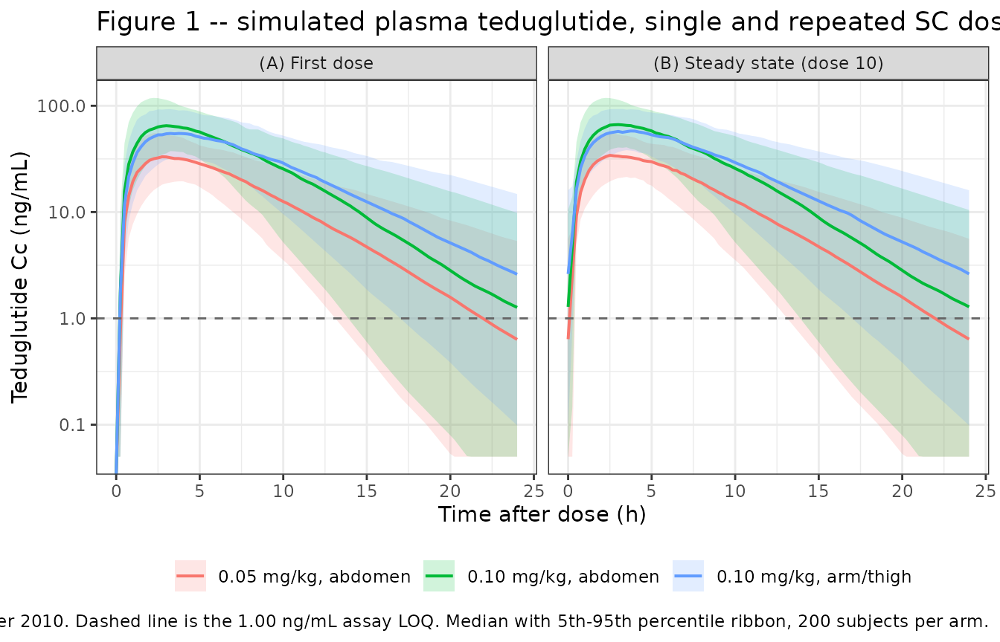

# Teduglutide (Marier 2010)

## Model and source

- Citation: Marier JF, Mouksassi MS, Gosselin NH, Beliveau M, Cyran J,
  Wallens J. Population pharmacokinetics of teduglutide following
  repeated subcutaneous administrations in healthy participants and in
  patients with short bowel syndrome and Crohn’s disease. J Clin
  Pharmacol. 2010;50(1):36-49. <doi:10.1177/0091270009342252>
- Description: One-compartment population PK model with first-order
  subcutaneous absorption and a fixed absorption lag time for the GLP-2
  analog teduglutide, fit to pooled data from eight phase I/II/III
  studies in healthy participants and in patients with short bowel
  syndrome, Crohn’s disease, or moderate hepatic impairment (Marier
  2010). Site-specific typical absorption rate constant (abdomen vs
  pooled arm/thigh), a power effect of body weight on both apparent
  clearance and apparent central volume, and a categorical effect of sex
  on apparent clearance.
- Article: <https://doi.org/10.1177/0091270009342252>

Teduglutide (ALX-600, `[gly2]`-hGLP-2) is a synthetic analog of human
glucagon-like peptide-2 carrying a single amino-acid substitution at the
second N-terminal position, which confers resistance to degradation by
dipeptidylpeptidase IV. Marier 2010 pooled eight phase I/II/III studies
into a one-compartment population PK model with first-order subcutaneous
absorption and a fixed absorption lag time. Two features distinguish it:

1.  **Site-specific absorption.** Absorption from the abdomen is roughly
    50% faster than from the arm or thigh, so the model carries two
    parallel typical absorption rate constants. Marier 2010 first fitted
    three injection-site categories and then pooled arm and thigh into
    one (Table III mod 16, `dMOF = +1.552`), so the packaged model uses
    two strata sharing one between-subject variability term.
2.  **A very steep body-weight effect on apparent volume.** The power
    exponent of weight on `Vc/F` is 2.37 – far above any allometric
    expectation. The authors flag this themselves and it is the single
    largest driver of the reported half-life range.

The clinically load-bearing result is a negative one: neither renal
function nor any marker of hepatic impairment explained variability in
teduglutide PK, so no dose adjustment was deemed necessary in those
populations. The screened and rejected covariates are recorded in the
model file’s `covariatesDataExcluded` metadata so that provenance is not
lost.

## Population

The analysis pooled 266 participants from eight studies (Table I): five
phase I studies in healthy adults (one of which, CL0600-017, enrolled 24
participants with moderate Child-Pugh class B hepatic impairment), two
phase II studies (one in moderately active Crohn’s disease, one in short
bowel syndrome), and one phase III study in
parenteral-nutrition-dependent short bowel syndrome.

Baseline demographics come from Table II: mean age 39.1 years (median
38, range 18-79), mean weight 71.5 kg (median 70.9, range 40.1-127), and
mean creatinine clearance 109 mL/min (range 26.0-236). There were 164
men (61.7%) and 102 women (38.3%). Participants were 83.8% white, 12.8%
African American, 2.63% other, and 0.75% Asian. Of the 264 participants
with a creatinine clearance, 60 (22.7%) fell in an impaired range (45
mild, 14 moderate, 1 severe).

Doses spanned 2.5 to 80 mg as fixed amounts and 0.03 to 0.20 mg/kg/day
as weight-based amounts, given subcutaneously into the abdomen, arm or
thigh, for durations from a single dose to 24 weeks. Plasma teduglutide
was measured by LC/MS/MS over an analytical range of 1.00-120 ng/mL with
an LOQ of 1.00 ng/mL.

``` r

pop <- rxode2::rxode(readModelDb("Marier_2010_teduglutide"))$population
#> ℹ parameter labels from comments will be replaced by 'label()'
str(pop, max.level = 1, give.attr = FALSE)
#> List of 18
#>  $ species         : chr "human"
#>  $ n_subjects      : int 266
#>  $ n_studies       : int 8
#>  $ age_range       : chr "18 - 79 years"
#>  $ age_median      : chr "38 years"
#>  $ age_mean        : chr "39.1 years"
#>  $ weight_range    : chr "40.1 - 127 kg"
#>  $ weight_median   : chr "70.9 kg"
#>  $ weight_mean     : chr "71.5 kg"
#>  $ sex_female_pct  : num 38.3
#>  $ race_ethnicity  : Named num [1:4] 83.8 12.8 2.63 0.75
#>  $ disease_state   : chr "Mixed: healthy participants (5 phase I studies), patients with moderately active Crohn's disease of at least 6 "| __truncated__
#>  $ dose_range      : chr "Daily subcutaneous teduglutide, 2.5 to 80 mg as fixed doses (2.5, 5, 7, 10, 15, 20, 25, 30, 50, 80 mg) and 0.03"| __truncated__
#>  $ renal_function  : chr "Creatinine clearance 26.0 - 236 mL/min (n = 264). 60 participants (22.7%) had creatinine clearance in an impair"| __truncated__
#>  $ hepatic_function: chr "Includes 24 participants with moderate (Child-Pugh class B, score 7-9) hepatic impairment from the dedicated st"| __truncated__
#>  $ regions         : chr "Not reported. Sponsor NPS Pharmaceuticals (Parsippany, NJ, USA); bioanalysis at Allelix Biopharmaceuticals (Mis"| __truncated__
#>  $ studies         : chr "ALX-0600 1621/1613 (phase I SAD, n = 32), CL0600-006 (phase I IV/SC bioavailability crossover, n = 14), CL0600-"| __truncated__
#>  $ notes           : chr "Demographics from Table II (n = 266; 164 men / 102 women). Estimation by NONMEM VI with FOCE-with-interaction. "| __truncated__
```

## Source trace

Every `ini()` entry in
`inst/modeldb/specificDrugs/Marier_2010_teduglutide.R` carries an
in-file comment naming its source location. They are collected here for
review.

| Equation / parameter | Value | Source location |
|----|----|----|
| `lka_abdomen` | `log(0.299)` 1/h | Table V, `Ka_abd` (bootstrap 0.280-0.320); Table VI |
| `lka_armthigh` | `log(0.206)` 1/h | Table V, `Ka_other` (bootstrap 0.171-0.242); Table VI |
| `lcl` | `log(12.4)` L/h | Table V, `CL/F` (bootstrap 11.9-13.0); Table VI |
| `lvc` | `log(32.8)` L | Table V, `Vc/F` (bootstrap 30.6-34.9); Table VI |
| `ltlag` | `fixed(log(0.208))` h | Table VI, `ALAG = 0.208 (Fixed)`; Results, “Structural Model Buildup” |
| `e_wt_vc` | 2.37 | Table V, body weight on `Vc/F` (bootstrap 2.08-2.67); Table VI |
| `e_wt_cl` | 0.323 | Table V, body weight on `CL/F` (bootstrap 0.102-0.521); Table VI |
| `e_sexf_cl` | 0.843 | Table V, sex on `CL/F` (bootstrap 0.764-0.930); Table VI (12.4 -\> 10.5 L/h) |
| reference weight 70.9 kg | n/a | Table VI denominator; equals the Table II median weight |
| `etalka` | `log(0.395^2 + 1)` | Table V, BSV on `Ka` = 39.5% (bootstrap 35.4-44.3) |
| `etalcl` | `log(0.281^2 + 1)` | Table V, BSV on `CL/F` = 28.1% (bootstrap 23.6-32.4) |
| `etalvc` | `log(0.394^2 + 1)` | Table V, BSV on `Vc/F` = 39.4% (bootstrap 32.5-45.7) |
| `etaltlag` | `fixed(log(0.316^2 + 1))` | Table VI, BSV on `ALAG` = 31.6% (fixed) |
| `addSd` | 6.80 ng/mL | Table V, additive error (bootstrap 5.47-8.06) |
| `propSd` | 0.243 | Table V, proportional error = 24.3% (bootstrap 21.9-26.5) |
| 1-compartment ODE, first-order absorption + lag | n/a | Results, “Structural Model Buildup”; Table III mod 2 |
| Site-specific `Ka`, arm and thigh pooled | n/a | Table III mod 4 and mod 16 |
| Power form for continuous covariates | n/a | Methods, “Covariate Analysis” |
| Combined additive + proportional residual error | n/a | Results, “Structural Model Buildup” |

### Packaged IIV round-trips to the published percentages

Marier 2010 heads its variability rows “BSV, %” and the Methods state
that between-subject variability was an exponential random-effect model
with lognormally distributed individual parameters, so the internal
variance is `omega^2 = log(CV^2 + 1)`. This is an exact identity,
independent of any simulation, so it is asserted directly on the
packaged omega matrix.

``` r

ui <- rxode2::rxode(readModelDb("Marier_2010_teduglutide"))
#> ℹ parameter labels from comments will be replaced by 'label()'
om <- ui$omega

published_bsv <- c(etalka = 39.5, etalcl = 28.1, etalvc = 39.4, etaltlag = 31.6)

bsv_chk <- tibble(
  eta       = names(published_bsv),
  published = as.numeric(published_bsv),
  omega2    = vapply(names(published_bsv), function(e) om[e, e], numeric(1)),
  recovered = 100 * sqrt(exp(omega2) - 1)
)
bsv_chk |>
  dplyr::rename(
    "Random effect"      = eta,
    "Published BSV (%)"  = published,
    "Packaged omega^2"   = omega2,
    "Recovered BSV (%)"  = recovered
  ) |>
  knitr::kable(digits = c(0, 1, 5, 2),
               caption = "Table V / Table VI BSV percentages recovered from the packaged omega matrix.")
```

| Random effect | Published BSV (%) | Packaged omega^2 | Recovered BSV (%) |
|:--------------|------------------:|-----------------:|------------------:|
| etalka        |              39.5 |          0.14499 |              39.5 |
| etalcl        |              28.1 |          0.07600 |              28.1 |
| etalvc        |              39.4 |          0.14430 |              39.4 |
| etaltlag      |              31.6 |          0.09518 |              31.6 |

Table V / Table VI BSV percentages recovered from the packaged omega
matrix. {.table}

``` r


stopifnot(all(abs(bsv_chk$recovered - bsv_chk$published) < 0.01))
```

## Structural checks that need no cohort

Three of the paper’s quantitative statements follow from the
typical-value parameters alone. They are checked here before any
simulation, because a transcription error in `lka_*`, `lcl`, `lvc`,
`e_wt_cl`, `e_wt_vc` or `e_sexf_cl` breaks one of them immediately.

### Absorption half-lives (Results, paragraph following Table V)

> “Based on rate constants of absorption, half-lives of absorption of
> teduglutide in the abdomen and other areas (thigh and arm) were 2.32
> and 3.36 hours, respectively.”

``` r

theta <- setNames(ui$theta, names(ui$theta))
ka_abd <- exp(theta[["lka_abdomen"]])
ka_oth <- exp(theta[["lka_armthigh"]])

abs_chk <- tibble(
  site      = c("Abdomen", "Arm or thigh"),
  ka        = c(ka_abd, ka_oth),
  t_half    = log(2) / c(ka_abd, ka_oth),
  published = c(2.32, 3.36)
)
abs_chk |>
  dplyr::rename("Injection site" = site, "Ka (1/h)" = ka,
                "Absorption t1/2 (h)" = t_half, "Published t1/2 (h)" = published) |>
  knitr::kable(digits = 3, caption = "Absorption half-lives (Marier 2010 Results).")
```

| Injection site | Ka (1/h) | Absorption t1/2 (h) | Published t1/2 (h) |
|:---------------|---------:|--------------------:|-------------------:|
| Abdomen        |    0.299 |               2.318 |               2.32 |
| Arm or thigh   |    0.206 |               3.365 |               3.36 |

Absorption half-lives (Marier 2010 Results). {.table}

``` r


stopifnot(all(abs(abs_chk$t_half - abs_chk$published) < 0.005))

# "the rate constant of absorption was approximately 50% faster than that
# observed following administration in the arm and thigh"
pct_faster <- 100 * (ka_abd / ka_oth - 1)
stopifnot(pct_faster > 40, pct_faster < 60)
sprintf("Abdominal Ka is %.1f%% faster than arm/thigh (paper: 'approximately 50%%').", pct_faster)
#> [1] "Abdominal Ka is 45.1% faster than arm/thigh (paper: 'approximately 50%')."
```

### Typical CL/F, Vc/F and elimination half-life by weight (Table VI narrative)

The paper states typical `CL/F` of 11.1 and 13.4 L/h and `Vc/F` of 14.3
and 57.7 L for 50 and 90 kg men, and elimination half-lives of 0.897 and
2.99 h. It also gives a typical female `CL/F` of 10.5 L/h at the
reference weight.

``` r

wref <- 70.9

typ_cl <- function(wt, sexf) {
  exp(theta[["lcl"]]) * (wt / wref)^theta[["e_wt_cl"]] * theta[["e_sexf_cl"]]^sexf
}
typ_vc <- function(wt) exp(theta[["lvc"]]) * (wt / wref)^theta[["e_wt_vc"]]

t6 <- tibble(
  wt          = c(50, 90),
  cl          = typ_cl(wt, 0),
  cl_pub      = c(11.1, 13.4),
  vc          = typ_vc(wt),
  vc_pub      = c(14.3, 57.7),
  t_half      = log(2) * vc / cl,
  t_half_pub  = c(0.897, 2.99)
)
t6 |>
  dplyr::rename("Weight (kg)" = wt, "CL/F (L/h)" = cl, "Published CL/F" = cl_pub,
                "Vc/F (L)" = vc, "Published Vc/F" = vc_pub,
                "t1/2 (h)" = t_half, "Published t1/2" = t_half_pub) |>
  knitr::kable(digits = 3, caption = "Table VI narrative values for men, reproduced from the packaged thetas.")
```

| Weight (kg) | CL/F (L/h) | Published CL/F | Vc/F (L) | Published Vc/F | t1/2 (h) | Published t1/2 |
|---:|---:|---:|---:|---:|---:|---:|
| 50 | 11.077 | 11.1 | 14.335 | 14.3 | 0.897 | 0.897 |
| 90 | 13.393 | 13.4 | 57.729 | 57.7 | 2.988 | 2.990 |

Table VI narrative values for men, reproduced from the packaged thetas.
{.table style="width:100%;"}

``` r


# Published to 3 significant figures, so match to within half a printed unit
# in the last place of each quantity.
stopifnot(
  all(abs(t6$cl     - t6$cl_pub)     < 0.05),
  all(abs(t6$vc     - t6$vc_pub)     < 0.05),
  all(abs(t6$t_half - t6$t_half_pub) < 0.005)
)

cl_female_ref <- typ_cl(wref, 1)
stopifnot(abs(cl_female_ref - 10.5) < 0.05)
sprintf("Typical female CL/F at %.1f kg = %.3f L/h (paper: 10.5 L/h, i.e. 12.4 x 0.843).",
        wref, cl_female_ref)
#> [1] "Typical female CL/F at 70.9 kg = 10.453 L/h (paper: 10.5 L/h, i.e. 12.4 x 0.843)."
```

## Virtual cohort

Original observed data are not publicly available. Two cohorts are
built.

**Cohort T (typical-value grid).** Table VII of Marier 2010 tabulates
predicted steady-state `AUC` and `Cmax` for six sex-by-weight
combinations, two dose levels (0.05 and 0.10 mg/kg/day), and two
injection sites. This is a typical-value prediction, so it is reproduced
with the random effects zeroed: one subject per published cell, 24 cells
in total. This is the vignette’s primary quantitative gate.

**Cohort V (stochastic).** A 200-subject-per-arm cohort with sampled
weight and sex, used for the concentration-time figure and for the
minimal-accumulation check. 200 per arm is the skill’s cap and is ample
here.

``` r

tau     <- 24    # daily subcutaneous dosing
n_doses <- 10L   # ample for a drug whose longest typical t1/2 is ~5.4 h
t_last  <- tau * (n_doses - 1L)

# Table VII, transcribed verbatim. Cmax is site-specific; AUC is not, because
# total exposure does not depend on the absorption rate constant.
table7 <- tibble::tribble(
  ~sex,     ~wt, ~mgkg, ~auc, ~cmax_abdomen, ~cmax_armthigh,
  "Men",     40, 0.05,  194,  36.8,          28.1,
  "Men",     70, 0.05,  283,  35.4,          29.0,
  "Men",    120, 0.05,  408,  30.1,          26.9,
  "Women",   40, 0.05,  229,  41.4,          31.9,
  "Women",   60, 0.05,  302,  40.2,          32.6,
  "Women",   90, 0.05,  397,  35.7,          30.8,
  "Men",     40, 0.10,  388,  73.6,          56.2,
  "Men",     70, 0.10,  567,  70.8,          57.9,
  "Men",    120, 0.10,  816,  60.3,          53.7,
  "Women",   40, 0.10,  458,  82.8,          63.8,
  "Women",   60, 0.10,  603,  80.5,          65.1,
  "Women",   90, 0.10,  794,  71.5,          61.5
)

# One arm per (sex, weight, dose level, injection site).
grid_t <- table7 |>
  dplyr::select(sex, wt, mgkg) |>
  tidyr::crossing(site = c("abdomen", "armthigh")) |>
  dplyr::mutate(
    id       = dplyr::row_number(),
    SEXF     = as.integer(sex == "Women"),
    WT       = wt,
    # INJSITE_ARM and INJSITE_THIGH are pooled by the model into a single
    # non-abdomen stratum; the arm/thigh arms are represented by the thigh
    # indicator, which carries most of the patient data in the source studies.
    INJSITE_ARM   = 0L,
    INJSITE_THIGH = as.integer(site == "armthigh"),
    amt_mg   = mgkg * wt,
    treatment = sprintf("%s %d kg, %.2f mg/kg, %s", sex, wt, mgkg, site)
  )

# Dose records: n_doses daily doses into `depot`.
dose_t <- grid_t |>
  tidyr::crossing(time = seq(0, t_last, by = tau)) |>
  dplyr::mutate(evid = 1L, cmt = "depot", amt = amt_mg)

# Observation records over the final (steady-state) dosing interval. The grid is
# dense where the peak sits and coarser thereafter: a coarse grid makes max(Cc)
# a discretisation artefact even while the integrator states stay exact.
obs_times <- sort(unique(c(
  t_last + seq(0,  8, by = 0.02),
  t_last + seq(8, tau, by = 0.25)
)))
obs_t <- grid_t |>
  tidyr::crossing(time = obs_times) |>
  # `cmt` on an observation row must be an ODE STATE, never the algebraic
  # observable `Cc`; rxode2 returns Cc as a column regardless.
  dplyr::mutate(evid = 0L, cmt = "central", amt = NA_real_)

events_t <- dplyr::bind_rows(dose_t, obs_t) |>
  dplyr::arrange(id, time, dplyr::desc(evid)) |>
  dplyr::select(id, time, amt, evid, cmt, WT, SEXF, INJSITE_ARM, INJSITE_THIGH, treatment)

stopifnot(
  !anyDuplicated(unique(events_t[, c("id", "time", "evid")])),
  nrow(dplyr::distinct(grid_t, id)) == 24L
)
```

``` r

rxode2::rxSetSeed(20260826)
set.seed(20260826)

n_arm <- 200L

# Weight sampled to match Table II: median 70.9 kg, mean 71.5 kg, SD 15.8 kg,
# range 40.1-127 kg. A lognormal reproduces the slight right skew implied by
# mean > median and is truncated to the observed range.
sample_wt <- function(n) {
  sdlog   <- sqrt(log1p((15.8 / 71.5)^2))
  meanlog <- log(70.9)
  wt <- rlnorm(n, meanlog, sdlog)
  pmin(pmax(wt, 40.1), 127)
}

make_arm <- function(n, mgkg, site, label, id_offset) {
  subj <- tibble(
    id            = id_offset + seq_len(n),
    WT            = sample_wt(n),
    SEXF          = rbinom(n, 1L, 0.383),   # Table II: 38.3% women
    INJSITE_ARM   = 0L,
    INJSITE_THIGH = as.integer(site == "armthigh"),
    treatment     = label
  ) |>
    dplyr::mutate(amt_mg = mgkg * WT)

  dplyr::bind_rows(
    subj |> tidyr::crossing(time = seq(0, t_last, by = tau)) |>
      dplyr::mutate(evid = 1L, cmt = "depot", amt = amt_mg),
    subj |> tidyr::crossing(time = sort(unique(c(
      seq(0, tau, by = 0.25),                 # first interval, for Figure 1A
      t_last + seq(0, tau, by = 0.25)         # steady state, for Figure 1B
    )))) |>
      dplyr::mutate(evid = 0L, cmt = "central", amt = NA_real_)
  ) |>
    dplyr::arrange(id, time, dplyr::desc(evid))
}

events_v <- dplyr::bind_rows(
  make_arm(n_arm, 0.05, "abdomen", "0.05 mg/kg, abdomen", id_offset =      0L),
  make_arm(n_arm, 0.10, "abdomen", "0.10 mg/kg, abdomen", id_offset =  n_arm),
  make_arm(n_arm, 0.10, "armthigh", "0.10 mg/kg, arm/thigh", id_offset = 2L * n_arm)
) |>
  dplyr::select(id, time, amt, evid, cmt, WT, SEXF, INJSITE_ARM, INJSITE_THIGH, treatment)

stopifnot(!anyDuplicated(unique(events_v[, c("id", "time", "evid")])))
```

## Simulation

``` r

mod <- readModelDb("Marier_2010_teduglutide")

# Cohort T: typical-value replication of Table VII, random effects zeroed.
mod_typ <- mod |> rxode2::zeroRe()
#> ℹ parameter labels from comments will be replaced by 'label()'
sim_t <- rxode2::rxSolve(
  mod_typ, events = events_t,
  keep = c("WT", "SEXF", "INJSITE_THIGH", "treatment")
) |>
  as.data.frame()
#> ℹ omega/sigma items treated as zero: 'etalka', 'etalcl', 'etalvc', 'etaltlag'
#> Warning: multi-subject simulation without without 'omega'

# Confirm zeroRe() also zeroed the FIXED lag-time eta, so tlag is the
# published 0.208 h rather than a sampled value.
stopifnot(all(abs(sim_t$tlag - 0.208) < 1e-8))

# Cohort V: stochastic, for the figures and the accumulation check.
sim_v <- rxode2::rxSolve(
  mod, events = events_v,
  keep = c("WT", "SEXF", "treatment")
) |>
  as.data.frame()
#> ℹ parameter labels from comments will be replaced by 'label()'

stopifnot(nrow(sim_t) > 0, nrow(sim_v) > 0, all(sim_t$Cc >= 0))
```

The individual `cl` and `vc` values that rxode2 computed in the
typical-value solve are the same closed-form quantities checked above;
confirming them inside the solve closes the loop between the packaged
thetas and the ODE system.

``` r

par_chk <- sim_t |>
  dplyr::distinct(id, WT, SEXF, cl, vc) |>
  dplyr::mutate(
    cl_expected = typ_cl(WT, SEXF),
    vc_expected = typ_vc(WT)
  )
stopifnot(
  all(abs(par_chk$cl - par_chk$cl_expected) < 1e-8),
  all(abs(par_chk$vc - par_chk$vc_expected) < 1e-8)
)
sprintf("cl and vc in the solve match the closed form for all %d typical-value arms.",
        nrow(par_chk))
#> [1] "cl and vc in the solve match the closed form for all 24 typical-value arms."
```

## Replicate published figures

### Figure 1 – plasma concentrations after single and repeated SC dosing

Figure 1 of Marier 2010 is a scatterplot of individual plasma
concentrations after (A) single and (B) repeated subcutaneous
administration, overlaid with a LOESS curve. The published narrative is
that concentrations decline mono-exponentially and that most fall below
the 1.00 ng/mL assay limit by 24 h postdose. The panels below are the
simulated equivalent: median with a 5th-95th percentile ribbon, on a log
scale, with the assay LOQ marked.

``` r

fig1 <- sim_v |>
  dplyr::mutate(
    panel = ifelse(time <= tau, "(A) First dose", "(B) Steady state (dose 10)"),
    tad   = ifelse(time <= tau, time, time - t_last)
  ) |>
  dplyr::group_by(panel, treatment, tad) |>
  dplyr::summarise(
    Q05 = quantile(Cc, 0.05),
    Q50 = quantile(Cc, 0.50),
    Q95 = quantile(Cc, 0.95),
    .groups = "drop"
  )

ggplot(fig1, aes(tad, Q50, colour = treatment, fill = treatment)) +
  geom_ribbon(aes(ymin = pmax(Q05, 0.05), ymax = Q95), alpha = 0.18, colour = NA) +
  geom_line(linewidth = 0.7) +
  geom_hline(yintercept = 1.0, linetype = "dashed", colour = "grey40") +
  facet_wrap(~panel) +
  scale_y_log10() +
  labs(
    x = "Time after dose (h)", y = "Teduglutide Cc (ng/mL)",
    colour = NULL, fill = NULL,
    title = "Figure 1 -- simulated plasma teduglutide, single and repeated SC dosing",
    caption = paste("Replicates Figure 1 of Marier 2010. Dashed line is the 1.00 ng/mL assay LOQ.",
                    "Median with 5th-95th percentile ribbon,", n_arm, "subjects per arm.")
  ) +
  theme_bw() +
  theme(legend.position = "bottom")
#> Warning in scale_y_log10(): log-10 transformation introduced infinite values.
#> log-10 transformation introduced infinite values.
#> log-10 transformation introduced infinite values.
```



### Minimal accumulation on daily dosing

Marier 2010 reports that “approximately 60 blood samples of 183 (32.8%)
displayed measurable predose concentration values of teduglutide
following repeated administrations”, and concludes that “multiple SC
administrations of teduglutide resulted in a very minor accumulation of
the drug”.

This is a genuine check on the joint magnitude of the elimination rate,
the between-subject variability and the residual error, but it is only
approximate: the published 32.8% comes from the actual pooled sampling
schedule and dose mix, which cannot be reconstructed. It is reported
here with a deliberately wide band and is not treated as a tight gate.

``` r

# Steady-state trough (predose for the notional 11th dose) vs the LOQ, on
# residual-error-carrying observations.
trough <- sim_v |>
  dplyr::filter(abs(time - (t_last + tau)) < 1e-8) |>
  dplyr::mutate(
    Cc_obs = Cc * (1 + rnorm(dplyr::n(), 0, 0.243)) + rnorm(dplyr::n(), 0, 6.80)
  )

acc <- sim_v |>
  dplyr::group_by(id) |>
  dplyr::summarise(
    peak_first = max(Cc[time <= tau]),
    peak_ss    = max(Cc[time >= t_last]),
    .groups    = "drop"
  ) |>
  dplyr::mutate(ratio = peak_ss / peak_first)

pct_measurable <- 100 * mean(trough$Cc_obs > 1.0)

tibble(
  Quantity = c("Measurable steady-state troughs (> 1.00 ng/mL)",
               "Median peak accumulation ratio (dose 10 / dose 1)",
               "90th percentile peak accumulation ratio"),
  Simulated = c(sprintf("%.1f%%", pct_measurable),
                sprintf("%.3f", median(acc$ratio)),
                sprintf("%.3f", quantile(acc$ratio, 0.9))),
  Published = c("32.8% (60 of 183 samples)", "'very minor accumulation'", "--")
) |>
  knitr::kable(caption = "Accumulation on daily SC dosing (Marier 2010 Results, 'Structural Model Buildup').")
```

| Quantity | Simulated | Published |
|:---|:---|:---|
| Measurable steady-state troughs (\> 1.00 ng/mL) | 55.8% | 32.8% (60 of 183 samples) |
| Median peak accumulation ratio (dose 10 / dose 1) | 1.012 | ‘very minor accumulation’ |
| 90th percentile peak accumulation ratio | 1.085 | – |

Accumulation on daily SC dosing (Marier 2010 Results, ‘Structural Model
Buildup’). {.table}

``` r


stopifnot(
  # Accumulation is minimal: the median subject gains at most a few percent.
  median(acc$ratio) > 1.0,
  median(acc$ratio) < 1.10,
  quantile(acc$ratio, 0.9) < 1.35,
  # Wide band; see the caveat above.
  pct_measurable > 5, pct_measurable < 65
)
```

## PKNCA validation

Steady-state NCA over the final dosing interval of the typical-value
grid (recipe 3 of `pknca-recipes.md`). The grouping variable is the
sex-by-weight-by-dose-by-site arm, which is exactly the stratification
of Table VII.

``` r

sim_nca <- sim_t |>
  dplyr::filter(!is.na(Cc)) |>
  dplyr::select(id, time, Cc, treatment)

# No defensive time-zero row is needed here, because the interval starts at
# t_last and that is itself a real observation (the steady-state trough), so
# PKNCA has an anchor for AUC0-tau. Confirm every arm actually has that row --
# otherwise PKNCA emits the "AUC range starting before the first measurement"
# warning once per subject.
anchor_arms <- sim_nca |>
  dplyr::filter(abs(time - t_last) < 1e-8) |>
  dplyr::distinct(treatment)
stopifnot(nrow(anchor_arms) == 24L)

conc_obj <- PKNCA::PKNCAconc(
  sim_nca, Cc ~ time | treatment + id,
  concu = "ng/mL", timeu = "h"
)

dose_df <- events_t |>
  dplyr::filter(evid == 1) |>
  dplyr::select(id, time, amt, treatment)

dose_obj <- PKNCA::PKNCAdose(dose_df, amt ~ time | treatment + id, doseu = "mg")

intervals <- data.frame(
  start   = t_last,
  end     = t_last + tau,
  cmax    = TRUE,
  tmax    = TRUE,
  cmin    = TRUE,
  auclast = TRUE,
  cav     = TRUE
)

nca_res <- PKNCA::pk.nca(PKNCA::PKNCAdata(conc_obj, dose_obj, intervals = intervals))
```

### Comparison against published NCA (Table VII)

Table VII is a *typical-value* prediction, so the comparison is against
the zeroed-random-effect solve and the difference is pure numerical
error plus the paper’s own printed rounding – not cohort sampling noise.
A tight bound is therefore the correct gate here, and it is asserted
over all 36 published cells of Table VII: the 24 `Cmax` values, plus the
12 `AUC` values (which Table VII reports once per sex/weight/dose
because total exposure does not depend on the absorption rate constant,
so each is checked against both injection-site arms).

The paper prints three significant figures and its inputs are themselves
three-figure values; the dominant propagated term is the rounding of the
sex coefficient 0.843, worth about 0.06%. A 2% bound leaves ample
headroom while still catching any real transcription error, which would
move a value by tens of percent.

``` r

published <- table7 |>
  tidyr::pivot_longer(c(cmax_abdomen, cmax_armthigh),
                      names_to = "site", values_to = "cmax") |>
  dplyr::mutate(
    site      = sub("^cmax_", "", site),
    treatment = sprintf("%s %d kg, %.2f mg/kg, %s", sex, wt, mgkg, site),
    auclast   = auc
  ) |>
  dplyr::select(treatment, cmax, auclast)

cmp <- nlmixr2lib::ncaComparisonTable(
  simulated     = nca_res,
  reference     = published,
  by            = "treatment",
  params        = c("cmax", "auclast"),
  units         = c(cmax = "ng/mL", auclast = "ng*h/mL"),
  tolerance_pct = 2
)

knitr::kable(
  cmp,
  caption = paste("Simulated steady-state NCA vs Marier 2010 Table VII.",
                  "* flags a >2% difference from the published value."),
  digits  = 3
)
```

| NCA parameter | treatment | Reference | Simulated | % diff |
|:---|:---|:---|:---|:---|
| Cmax (ng/mL) | Men 40 kg, 0.05 mg/kg, abdomen | 36.8 | 36.8 | -0.0% |
| Cmax (ng/mL) | Men 40 kg, 0.05 mg/kg, armthigh | 28.1 | 28.1 | -0.0% |
| Cmax (ng/mL) | Men 70 kg, 0.05 mg/kg, abdomen | 35.4 | 35.4 | +0.1% |
| Cmax (ng/mL) | Men 70 kg, 0.05 mg/kg, armthigh | 29 | 29 | -0.2% |
| Cmax (ng/mL) | Men 120 kg, 0.05 mg/kg, abdomen | 30.1 | 30.1 | +0.1% |
| Cmax (ng/mL) | Men 120 kg, 0.05 mg/kg, armthigh | 26.9 | 26.9 | -0.1% |
| Cmax (ng/mL) | Women 40 kg, 0.05 mg/kg, abdomen | 41.4 | 41.5 | +0.3% |
| Cmax (ng/mL) | Women 40 kg, 0.05 mg/kg, armthigh | 31.9 | 32 | +0.3% |
| Cmax (ng/mL) | Women 60 kg, 0.05 mg/kg, abdomen | 40.2 | 40.3 | +0.4% |
| Cmax (ng/mL) | Women 60 kg, 0.05 mg/kg, armthigh | 32.6 | 32.6 | +0.1% |
| Cmax (ng/mL) | Women 90 kg, 0.05 mg/kg, abdomen | 35.7 | 35.8 | +0.3% |
| Cmax (ng/mL) | Women 90 kg, 0.05 mg/kg, armthigh | 30.8 | 30.9 | +0.2% |
| Cmax (ng/mL) | Men 40 kg, 0.10 mg/kg, abdomen | 73.6 | 73.6 | -0.0% |
| Cmax (ng/mL) | Men 40 kg, 0.10 mg/kg, armthigh | 56.2 | 56.2 | -0.0% |
| Cmax (ng/mL) | Men 70 kg, 0.10 mg/kg, abdomen | 70.8 | 70.8 | +0.1% |
| Cmax (ng/mL) | Men 70 kg, 0.10 mg/kg, armthigh | 57.9 | 57.9 | +0.0% |
| Cmax (ng/mL) | Men 120 kg, 0.10 mg/kg, abdomen | 60.3 | 60.3 | -0.0% |
| Cmax (ng/mL) | Men 120 kg, 0.10 mg/kg, armthigh | 53.7 | 53.7 | +0.1% |
| Cmax (ng/mL) | Women 40 kg, 0.10 mg/kg, abdomen | 82.8 | 83.1 | +0.3% |
| Cmax (ng/mL) | Women 40 kg, 0.10 mg/kg, armthigh | 63.8 | 64 | +0.3% |
| Cmax (ng/mL) | Women 60 kg, 0.10 mg/kg, abdomen | 80.5 | 80.7 | +0.2% |
| Cmax (ng/mL) | Women 60 kg, 0.10 mg/kg, armthigh | 65.1 | 65.3 | +0.3% |
| Cmax (ng/mL) | Women 90 kg, 0.10 mg/kg, abdomen | 71.5 | 71.6 | +0.2% |
| Cmax (ng/mL) | Women 90 kg, 0.10 mg/kg, armthigh | 61.5 | 61.7 | +0.3% |
| AUClast (ng\*h/mL) | Men 40 kg, 0.05 mg/kg, abdomen | 194 | 194 | +0.0% |
| AUClast (ng\*h/mL) | Men 40 kg, 0.05 mg/kg, armthigh | 194 | 194 | +0.0% |
| AUClast (ng\*h/mL) | Men 70 kg, 0.05 mg/kg, abdomen | 283 | 283 | +0.1% |
| AUClast (ng\*h/mL) | Men 70 kg, 0.05 mg/kg, armthigh | 283 | 283 | +0.1% |
| AUClast (ng\*h/mL) | Men 120 kg, 0.05 mg/kg, abdomen | 408 | 408 | +0.1% |
| AUClast (ng\*h/mL) | Men 120 kg, 0.05 mg/kg, armthigh | 408 | 408 | +0.1% |
| AUClast (ng\*h/mL) | Women 40 kg, 0.05 mg/kg, abdomen | 229 | 230 | +0.5% |
| AUClast (ng\*h/mL) | Women 40 kg, 0.05 mg/kg, armthigh | 229 | 230 | +0.5% |
| AUClast (ng\*h/mL) | Women 60 kg, 0.05 mg/kg, abdomen | 302 | 303 | +0.3% |
| AUClast (ng\*h/mL) | Women 60 kg, 0.05 mg/kg, armthigh | 302 | 303 | +0.3% |
| AUClast (ng\*h/mL) | Women 90 kg, 0.05 mg/kg, abdomen | 397 | 399 | +0.4% |
| AUClast (ng\*h/mL) | Women 90 kg, 0.05 mg/kg, armthigh | 397 | 399 | +0.4% |
| AUClast (ng\*h/mL) | Men 40 kg, 0.10 mg/kg, abdomen | 388 | 388 | +0.0% |
| AUClast (ng\*h/mL) | Men 40 kg, 0.10 mg/kg, armthigh | 388 | 388 | +0.0% |
| AUClast (ng\*h/mL) | Men 70 kg, 0.10 mg/kg, abdomen | 567 | 567 | -0.0% |
| AUClast (ng\*h/mL) | Men 70 kg, 0.10 mg/kg, armthigh | 567 | 567 | -0.0% |
| AUClast (ng\*h/mL) | Men 120 kg, 0.10 mg/kg, abdomen | 816 | 816 | +0.1% |
| AUClast (ng\*h/mL) | Men 120 kg, 0.10 mg/kg, armthigh | 816 | 816 | +0.1% |
| AUClast (ng\*h/mL) | Women 40 kg, 0.10 mg/kg, abdomen | 458 | 460 | +0.5% |
| AUClast (ng\*h/mL) | Women 40 kg, 0.10 mg/kg, armthigh | 458 | 460 | +0.5% |
| AUClast (ng\*h/mL) | Women 60 kg, 0.10 mg/kg, abdomen | 603 | 606 | +0.5% |
| AUClast (ng\*h/mL) | Women 60 kg, 0.10 mg/kg, armthigh | 603 | 606 | +0.5% |
| AUClast (ng\*h/mL) | Women 90 kg, 0.10 mg/kg, abdomen | 794 | 797 | +0.4% |
| AUClast (ng\*h/mL) | Women 90 kg, 0.10 mg/kg, armthigh | 794 | 797 | +0.4% |

Simulated steady-state NCA vs Marier 2010 Table VII. \* flags a \>2%
difference from the published value. {.table}

``` r

# Recompute the percent differences directly so the gate does not depend on the
# comparison table's presentation columns.
sim_wide <- as.data.frame(nca_res) |>
  dplyr::filter(PPTESTCD %in% c("cmax", "auclast")) |>
  dplyr::select(treatment, PPTESTCD, PPORRES) |>
  tidyr::pivot_wider(names_from = PPTESTCD, values_from = PPORRES)

gate <- published |>
  dplyr::rename(cmax_pub = cmax, auclast_pub = auclast) |>
  dplyr::inner_join(sim_wide, by = "treatment") |>
  dplyr::mutate(
    cmax_pct = 100 * (cmax    - cmax_pub)    / cmax_pub,
    auc_pct  = 100 * (auclast - auclast_pub) / auclast_pub
  )

# Guard against a silently empty join: a lookup that matches no rows would make
# every all() below vacuously TRUE.
stopifnot(nrow(gate) == 24L, !anyNA(gate$cmax_pct), !anyNA(gate$auc_pct))

# 24 arms x 2 parameters = 48 comparisons, covering all 36 distinct published
# numbers: 24 Cmax cells, plus the 12 AUC cells each checked at both injection
# sites (Table VII prints one AUC per sex/weight/dose because AUC does not
# depend on the absorption rate constant).
sprintf(paste("Table VII reproduction: %d comparisons over %d arms, covering all 36 published",
              "cells. Max |%%diff| = %.2f%% (Cmax), %.2f%% (AUC0-tau) -- %.0f%% of the 2%% budget."),
        2L * nrow(gate), nrow(gate), max(abs(gate$cmax_pct)), max(abs(gate$auc_pct)),
        100 * max(abs(c(gate$cmax_pct, gate$auc_pct))) / 2)
#> [1] "Table VII reproduction: 48 comparisons over 24 arms, covering all 36 published cells. Max |%diff| = 0.35% (Cmax), 0.52% (AUC0-tau) -- 26% of the 2% budget."

stopifnot(
  all(abs(gate$cmax_pct) < 2),
  all(abs(gate$auc_pct)  < 2)
)
```

The AUC arm of that gate is also a closed-form mass-balance check: at
steady state `AUC0-tau` equals `Dose / (CL/F)` exactly, so agreement
with Table VII confirms both the clearance model and the trapezoidal
integration.

``` r

mb <- sim_t |>
  dplyr::distinct(id, treatment, WT, SEXF, cl) |>
  dplyr::left_join(
    dose_df |> dplyr::distinct(id, amt),
    by = "id"
  ) |>
  dplyr::left_join(
    sim_wide |> dplyr::select(treatment, auclast),
    by = "treatment"
  ) |>
  dplyr::mutate(
    auc_closed = amt / cl * 1000,               # mg / (L/h) -> ng*h/mL
    pct        = 100 * (auclast - auc_closed) / auc_closed
  )

stopifnot(nrow(mb) == 24L, all(abs(mb$pct) < 0.5))
sprintf("AUC0-tau,ss vs Dose/(CL/F): max |%%diff| = %.3f%% across %d arms.",
        max(abs(mb$pct)), nrow(mb))
#> [1] "AUC0-tau,ss vs Dose/(CL/F): max |%diff| = 0.002% across 24 arms."
```

## Assumptions and deviations

- **`Ka` encoded as two parallel strata, not a reference plus an
  offset.** Table V reports `Ka_abd` and `Ka_other` as two typical
  values each with its own bootstrap percentile interval, listed under
  “Population PK Parameters” rather than under “Covariate model”, so
  they are encoded as the stratum-suffixed `lka_abdomen` /
  `lka_armthigh` pair. The single Table V `BSV on Ka` of 39.5% is shared
  between the strata, matching the paper’s one reported value.

- **Arm and thigh pooled via the sum of two canonical indicators.** The
  registered `INJSITE_<site>` family has mutually exclusive members with
  all-zero denoting the abdomen reference, so
  `injsite_nonabd = INJSITE_ARM + INJSITE_THIGH` is already the 0/1
  non-abdomen indicator that Marier 2010’s pooled stratum needs. No
  `INJSITE_OTHER` canonical was introduced; keeping both source columns
  preserves which anatomical sites the cohort actually used. In the
  typical-value grid the arm/thigh arms are represented by
  `INJSITE_THIGH = 1`.

- **Reference weight 70.9 kg is the cohort median, not the mean.** Table
  II gives a mean of 71.5 kg and a median of 70.9 kg; Table VI writes
  the denominator as 70.9. Reproducing the Table VI half-lives and all
  36 Table VII cells confirms the median is the normalising value.

- **`BSV, %` read as a coefficient of variation on the lognormal, giving
  `omega^2 = log(CV^2 + 1)`.** The paper does not name the convention.
  Two candidate readings were considered and one was ruled out:

  - *Ruled out: the percentages are raw `omega^2` values scaled by 100.*
    Adding a covariate that reduces a random effect’s unexplained
    variance from `omega^2_0` to `omega^2_1` can reduce the objective
    function by at most about `N * log(omega^2_0 / omega^2_1)` for
    `N = 266` subjects, and less once shrinkage is accounted for. On the
    variance reading, Table IV mod7 (weight on `Vc/F`, BSV 59 -\> 39)
    admits at most 110 units but the paper reports `dMOF = -167.854`,
    and mod13 (sex on `CL/F`, BSV 32 -\> 29) admits at most 26 against a
    reported `-30.318`. Both observed drops exceed the ceiling, so the
    numbers cannot be variances. On the CV reading the same two steps
    admit 199 and 50 units respectively, comfortably above what was
    observed.
  - *Retained: exact lognormal CV, `omega^2 = log(CV^2 + 1)`.* This is
    the nlmixr2lib convention. The alternative approximation
    `omega = CV / 100` is not discriminated by anything the paper
    prints, but it differs by less than 4% in `omega` at the largest
    reported BSV (0.395 vs 0.381 for `Ka`), so the choice is immaterial
    for simulation.

- **Residual error read on the SD scale.** Table V prints the two error
  terms in SD-scale units, “Additive error, ng/mL” and “Proportional
  error, %”, so they are used directly as `addSd = 6.80` and
  `propSd = 0.243` with no
  [`sqrt()`](https://rdrr.io/r/base/MathFun.html). Corroboration from
  the bootstrap-CI relative width: with subject-level resampling of
  `n = 266`, an SD-scale estimate predicts a relative 95% interval width
  near `3.92 * sqrt(1 / (2 * 266)) = 0.170` and a variance-scale
  estimate twice that. The proportional row’s observed width is
  `(26.5 - 21.9) / 24.2 = 0.190`, matching the SD prediction and 1.8x
  away from the variance prediction. The additive row is wider (0.385),
  which is expected because only the minority of samples near the 1.00
  ng/mL LOQ inform an additive term, so its effective sample size is
  well below 266.

- **`ALAG` and its BSV are both `fixed()`.** Results, “Structural Model
  Buildup”: “The absorption lag time (ALAG) as well as BSV were fixed to
  population values previously estimated with the model to stabilize the
  model and facilitate convergence”, and Table VI prints “0.208 (Fixed)”
  and “31.6 (fixed)”. Consistently, neither appears in the Table V
  bootstrap. The “population values previously estimated with the model”
  are not tabulated anywhere in the paper as a separate provenance, so
  the Table VI numbers are taken as the values themselves.

- **No bioavailability parameter.** The model is parameterised in
  apparent terms (`CL/F`, `Vc/F`), so `F` is absorbed into those. Marier
  2010 tested site of administration on relative bioavailability (Table
  III mod 6) and did not retain it. The paper separately notes that an
  assumed SC bioavailability of 87% would put the true volume near 28.5
  L, but that scaling is commentary and is not part of the fitted model.

- **Table VII Cmax is a steady-state quantity.** The table is headed
  only “Predicted AUC and Cmax Values of Teduglutide According to
  Patient Demographics”, but its `Cmax` values are reproduced by the
  steady-state expression over a 24 h interval and not by the
  single-dose one. The difference is small because accumulation is
  minimal, but it is resolvable: for the 120 kg men at 0.05 mg/kg the
  single-dose value is 27.8 ng/mL against a published 30.1, while the
  steady-state value is 30.2. All arms are therefore simulated to steady
  state (dose 10 of 10).

- **Covariate distributions assumed.** Weight is drawn from a lognormal
  matched to the Table II mean (71.5 kg), median (70.9 kg) and SD (15.8
  kg), truncated to the observed 40.1-127 kg range; the paper reports no
  distributional form. Sex is Bernoulli at the Table II 38.3% female.
  Neither assumption affects the Table VII gate, which uses the paper’s
  own weights directly.

- **Only two of the eight studies’ injection sites are represented in
  the stochastic cohort.** Site was recorded per administration in the
  source data; the simulated arms hold it constant per subject, which is
  adequate for the figures but does not reproduce the CL0600-015
  three-way crossover design.

### Errata

- **The Abstract’s participant count disagrees with the Results.** The
  Abstract states that PK “were assessed following daily subcutaneous
  (SC) administrations of 2.5 to 80 mg doses in a total of 256
  patients”, but the Results section states that “Plasma
  concentration-time profiles of teduglutide from a total of 266
  participants were available to build the structural model”, Table II
  reports `n = 266` for age and weight, and the demographic narrative
  gives “164 men (61.7%) and 102 women (38.3%)”, which sums to 266. The
  model file records `n_subjects = 266L`; the Abstract’s 256 appears to
  be a typographical error.

- **The Abstract’s direction of the sex effect reads oddly against its
  own numbers.** The Abstract says clearance “in male participants was
  approximately 18% higher than that observed in female participants
  (12.4 vs 10.5 L/h, respectively)”, which is consistent with
  `12.4 / 10.5 = 1.18`. The Results then say the effect “was not deemed
  clinically relevant because male participants are expected to display
  teduglutide exposure values (AUC) approximately 18% lower than female
  participants” – the same 18%, correctly inverted for exposure. Both
  statements are consistent with `e_sexf_cl = 0.843`; no correction is
  needed, but the two “18%” figures describe different quantities.

- **Table III is garbled in the machine-readable rendering of the PDF.**
  Rows `mod 3` and `mod 7` through `mod 15` are absent and two rows are
  replaced by repeated copies of a section header. The rows that survive
  (`mod 1`, `mod 2`, `mod 4`, `mod 5`, `mod 6`, `mod 16`, `mod 17`) are
  sufficient to establish the structural-model narrative used here –
  first-order absorption with a lag time beats without
  (`dMOF = -598.313`), site of administration acts on `Ka` rather than
  on `ALAG` or `Frel` (`-100.824` vs `-47.896` and `-50.780`), and
  collapsing three injection-site categories to two costs only `+1.552`.
  No parameter value in the model file depends on a missing row.

- **No erratum or corrigendum was located.** A search of the article’s
  landing page at the publisher and of the DOI record surfaced no
  correction notice for `doi:10.1177/0091270009342252`.
