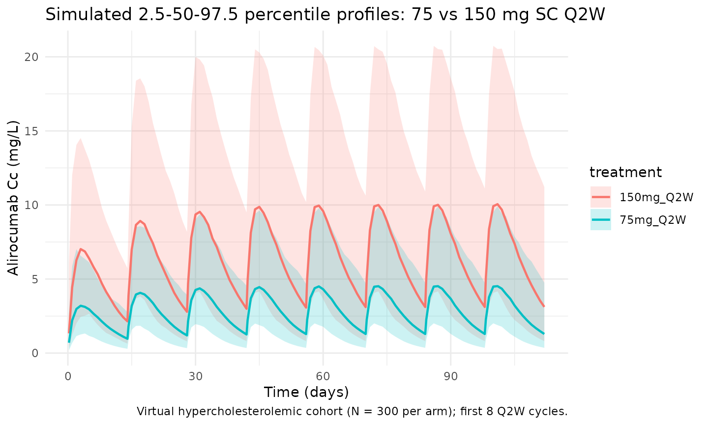
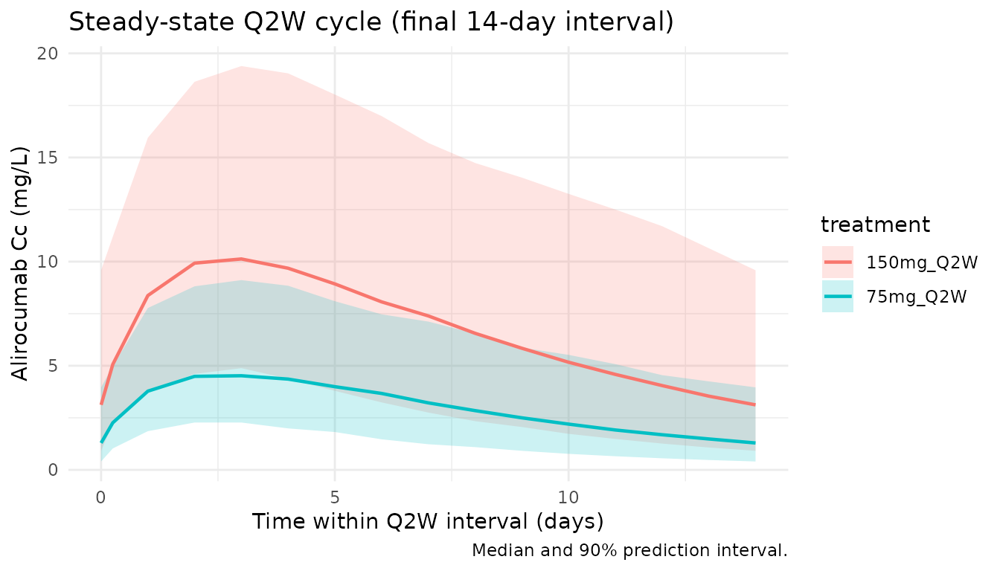

# Martinez_2019_alirocumab

## Model and source

- Citation: Martinez JM, Brunet A, Hurbin F, DiCioccio AT, Rauch C,
  Fabre D. Population Pharmacokinetic Analysis of Alirocumab in Healthy
  Volunteers or Hypercholesterolemic Subjects Using a Michaelis-Menten
  Approximation of a Target-Mediated Drug Disposition Model - Support
  for a Biologics License Application Submission: Part I. Clin
  Pharmacokinet. 2019;58(1):101-113. <doi:10.1007/s40262-018-0669-y>
- Description: Two-compartment population PK model for alirocumab in
  healthy volunteers and adults with hypercholesterolemia (Martinez
  2019, Part I), with first-order SC absorption (with lag time), linear
  plus Michaelis-Menten (target-mediated) elimination from the central
  compartment, and logit-transformed bioavailability.
- Article: [Clin Pharmacokinet.
  2019;58(1):101-113](https://doi.org/10.1007/s40262-018-0669-y) (open
  access via
  [PMC6325993](https://pmc.ncbi.nlm.nih.gov/articles/PMC6325993/))

Part II of the same series
([doi:10.1007/s40262-018-0670-5](https://doi.org/10.1007/s40262-018-0670-5))
couples this PopPK model to an indirect-response LDL-C model; only the
Part I PK structure is implemented here.

## Population

Martinez 2019 pooled 13 phase I-III alirocumab trials into a final
population PK dataset of 2799 subjects and 13,717 serum concentrations.
The dataset consisted of healthy volunteers and adult patients with
hypercholesterolemia (familial and non-familial, with or without
established coronary heart disease), including two Japanese phase I/II
cohorts. Dosing was SC 50-300 mg single or repeated (Q2W / Q4W over up
to 104 weeks, truncated at 24 weeks for the current analysis); one phase
I study gave single IV doses of 0.3-12 mg/kg. The marketed regimens are
75 mg and 150 mg SC Q2W.

Baseline characteristics from the Martinez 2019 Table 2 footnotes:
median body weight 82.9 kg, median age 60 years, and time-varying median
free PCSK9 concentration 72.9 ng/mL (baseline median 283 ng/mL;
time-varying 5th/95th percentiles 0/392 ng/mL). Concomitant statin use
(rosuvastatin \< 20 mg/day, atorvastatin \< 40 mg/day, or simvastatin at
any dose) was the other clinically-relevant covariate retained in the
final model. Sex, race, renal function, BMI, and ADA positivity were
evaluated but not retained.

The same information is available programmatically via
`readModelDb("Martinez_2019_alirocumab")$population`.

## Source trace

Every structural parameter, covariate effect, IIV element, and
residual-error term below is taken from Martinez 2019 Table 2 (“Final
model with covariates” column) and its footnotes a-e. Reference
covariate values: 82.9 kg body weight, 60 years age, no concomitant
statin (STATIN = 0), and 72.9 ng/mL free PCSK9.

| Equation / parameter                                       | Value (paper / model file)                | Source location                                                                                                                                |
|------------------------------------------------------------|-------------------------------------------|------------------------------------------------------------------------------------------------------------------------------------------------|
| `lka` (Ka)                                                 | `0.00768 /h * 24 = 0.18432 /day`          | Table 2, Ka row                                                                                                                                |
| `lcl` (CLL)                                                | `0.0124 L/h * 24 = 0.2976 L/day`          | Table 2, CLL row                                                                                                                               |
| `lvc` (V2)                                                 | `3.19 L`                                  | Table 2, V2 row                                                                                                                                |
| `lvp` (V3 at AGE = 60 y)                                   | `2.79 L`                                  | Table 2, V3 row                                                                                                                                |
| `lq` (Q)                                                   | `0.0185 L/h * 24 = 0.444 L/day`           | Table 2, Q row                                                                                                                                 |
| `lvm` (Vm)                                                 | `0.183 mg/h * 24 = 4.392 mg/day`          | Table 2, Vm row (text says “mg/h”; table footer “mg.h/L” is a typesetting error — dimensional analysis and the paper’s narrative confirm mg/h) |
| `lkm` (Km at FPCSK9 = 72.9)                                | `7.73 mg/L`                               | Table 2, Km row                                                                                                                                |
| `llag` (LAG)                                               | `0.641 h / 24 = 0.02671 day`              | Table 2, LAG row                                                                                                                               |
| `logitfdepot` (logit F_pop)                                | `logit(0.862) = 1.8326`                   | Table 2, F row (typical F = 0.862)                                                                                                             |
| `e_wt_cl` (WT additive slope)                              | `2.92e-4 L/h/kg * 24 = 7.008e-3 L/day/kg` | Table 2 theta12, Table 2 footnote a                                                                                                            |
| `e_statin_cl` (STATIN additive)                            | `6.44e-3 L/h * 24 = 0.15456 L/day`        | Table 2 theta13, Table 2 footnote a                                                                                                            |
| `e_age_vp` (AGE power exponent)                            | `0.310`                                   | Table 2 theta15, Table 2 footnote b                                                                                                            |
| `e_fpcsk9_km` (FPCSK9 slope)                               | `-0.541 mg/L per (FPCSK9/72.9)`           | Table 2 theta14, Table 2 footnote c                                                                                                            |
| `var(etalcl)`                                              | `0.232` (CV 48.2%)                        | Table 2, omega^2 CLL row                                                                                                                       |
| `var(etalvc)`                                              | `0.589` (CV 76.7%)                        | Table 2, omega^2 V2 row                                                                                                                        |
| `var(etalvp)`                                              | `0.0735` (CV 27.1%)                       | Table 2, omega^2 V3 row                                                                                                                        |
| `var(etalkm)`                                              | `0.298` (CV 54.6%)                        | Table 2, omega^2 Km row                                                                                                                        |
| `cov(etalvp, etalkm)`                                      | `-0.793 * sqrt(0.0735*0.298) = -0.11738`  | Table 2 footnote d (r = -0.793)                                                                                                                |
| `var(etalogitfdepot)`                                      | `1.060` (logit-space, 103%)               | Table 2 omega^2 F row, footnote e                                                                                                              |
| `propSd`                                                   | `0.259` (25.9%)                           | Table 2, theta8                                                                                                                                |
| `addSd`                                                    | `0.0465 mg/L`                             | Table 2, theta9                                                                                                                                |
| Structure (2-cmt + 1st-order SC, linear + MM from central) | n/a                                       | Fig. 1 and Results §3.1                                                                                                                        |
| CLL equation                                               | `TVCLL + COV1*(WT - 82.9) + COV2*STATIN`  | Table 2 footnote a, Eq in Results §3.1                                                                                                         |
| Km equation                                                | `TVKM + COV3*(FPCSK9 / 72.9)`             | Table 2 footnote c, Eq in Results §3.1                                                                                                         |
| V3 equation                                                | `TVV3 * (AGE / 60)^COV4`                  | Table 2 footnote b, Eq in Results §3.1                                                                                                         |

### Parameterization notes

- **Time-unit conversion.** Martinez 2019 reports rates in h^-1; the
  model file converts to day^-1 (`x 24`) to follow the nlmixr2lib
  convention. Volumes (V2, V3), the bioavailability factor, and the
  FPCSK9 / AGE / WT covariate normalizations are time-independent and
  are carried through unchanged.
- **Additive covariate structure on CLL and Km.** Martinez’s paper uses
  additive (rather than multiplicative) covariate models on the linear
  clearance CLL and on Km, evaluated on the population typical value:
  `CLL_TV = TVCLL + theta * (WT - 82.9) + theta * STATIN` and
  `Km_TV = TVKM + theta * (FPCSK9 / 72.9)`. Individual values then carry
  an exponential between-subject term: `CLL_i = CLL_TV * exp(eta_CLL)`.
  This is preserved faithfully in
  [`model()`](https://nlmixr2.github.io/rxode2/reference/model.html)
  rather than being refactored to a multiplicative / power form.
- **Power covariate on V3.** `V3_TV = TVV3 * (AGE / 60)^0.310` (Table 2
  footnote b). Individual V3 is `V3_i = V3_TV * exp(eta_V3)`.
- **Correlated V3 / Km.** The paper reports an omega-block covariance
  between eta_V3 and eta_Km with correlation r = -0.793 (Table 2
  footnote d). The 2x2 block off-diagonal is the correlation times
  `sqrt(var_V3 * var_Km)`,
  i.e. `-0.793 * sqrt(0.0735 * 0.298) = -0.11738`.
- **Logit bioavailability.** F IIV was estimated in logit space with
  omega^2 = 1.060 (Table 2 footnote e). The model parameterizes
  `logitfdepot = logit(0.862)` with `eta_logit_F ~ N(0, 1.060)`; the
  individual F is the inverse logit of the sum.
- **No IIV on Ka / Q / Vm / LAG.** Martinez states no interindividual
  term could be estimated for these four parameters; the model file
  omits them from the random-effects block, matching the paper.
- **Michaelis-Menten form.** The elimination ODE term is
  `- vm * Cc / (km + Cc)` (rate of amount elimination with Vm in mg/day,
  Km in mg/L, and Cc = central / V2 in mg/L), matching the popPK
  convention used in Xu 2019 sarilumab and the in-file parameter units.
- **SC vs IV.** The bioavailability factor and lag time are applied to
  the depot compartment. IV doses (the 0.3-12 mg/kg single-dose phase I
  study) bypass depot by dosing directly to `central` via
  `cmt = "central"`.

## Virtual cohort

The simulations below use a virtual cohort whose covariate distributions
approximate the Martinez 2019 study population medians and ranges. No
subject-level observed data were released with the paper.

``` r
set.seed(20260424)
n_subj <- 300

cohort <- tibble::tibble(
  id     = seq_len(n_subj),
  WT     = pmin(pmax(rnorm(n_subj, mean = 82.9, sd = 18),  45, 150)),
  AGE    = pmin(pmax(rnorm(n_subj, mean = 60,   sd = 12),  18,  90)),
  STATIN = rbinom(n_subj, size = 1, prob = 0.80),
  FPCSK9 = pmin(pmax(rnorm(n_subj, mean = 72.9, sd = 120), 0,  400))
)
```

Three regimens are simulated in parallel: 75 mg SC Q2W (lower-dose
standard), 150 mg SC Q2W (higher-dose standard), and 300 mg SC Q4W
(equal 4-week dose to 150 mg Q2W, tested in phase I/II). Dosing extends
past the alirocumab terminal half-life (~14-21 days in the linear range
at high concentrations) to reach steady state before the NCA interval.

``` r
tau_q2w <- 14                 # Q2W dosing interval (days)
n_doses <- 26                 # 26 Q2W doses -> 350 days (~50 weeks), steady state
dose_days_q2w <- seq(0, tau_q2w * (n_doses - 1), by = tau_q2w)

tau_q4w <- 28
n_doses_q4w <- 13
dose_days_q4w <- seq(0, tau_q4w * (n_doses_q4w - 1), by = tau_q4w)

make_cohort <- function(cohort, dose_amt, dose_days, treatment, tau,
                        id_offset = 0L) {
  coh <- cohort |> dplyr::mutate(id = id + id_offset)
  ev_dose <- coh |>
    tidyr::crossing(time = dose_days) |>
    dplyr::mutate(amt = dose_amt, cmt = "depot", evid = 1L,
                  treatment = treatment)
  obs_days <- sort(unique(c(
    seq(0, max(dose_days) + tau, by = 1),
    dose_days + 0.25,
    dose_days + 1,
    dose_days + 3,
    dose_days + 7
  )))
  ev_obs <- coh |>
    tidyr::crossing(time = obs_days) |>
    dplyr::mutate(amt = 0, cmt = NA_character_, evid = 0L,
                  treatment = treatment)
  dplyr::bind_rows(ev_dose, ev_obs) |>
    dplyr::arrange(id, time, dplyr::desc(evid)) |>
    dplyr::select(id, time, amt, cmt, evid, treatment,
                  WT, AGE, STATIN, FPCSK9)
}

events_75  <- make_cohort(cohort, 75,  dose_days_q2w, "75mg_Q2W",  tau_q2w,
                          id_offset = 0L)
events_150 <- make_cohort(cohort, 150, dose_days_q2w, "150mg_Q2W", tau_q2w,
                          id_offset = 1000L)
events_300 <- make_cohort(cohort, 300, dose_days_q4w, "300mg_Q4W", tau_q4w,
                          id_offset = 2000L)
events <- dplyr::bind_rows(events_75, events_150, events_300)
stopifnot(!anyDuplicated(unique(events[, c("id", "time", "evid")])))
```

## Simulation

``` r
mod <- rxode2::rxode2(readModelDb("Martinez_2019_alirocumab"))
#> ℹ parameter labels from comments will be replaced by 'label()'
keep_cols <- c("WT", "AGE", "STATIN", "FPCSK9", "treatment")

sim <- lapply(split(events, events$treatment), function(ev) {
  as.data.frame(rxode2::rxSolve(mod, events = ev, keep = keep_cols))
}) |> dplyr::bind_rows()
```

## Replicate published figures

### Concentration-time profile (VPC-style)

Martinez 2019 Figure 2 shows visual predictive checks of serum
alirocumab concentrations per study, with predictions capturing the
2.5th-97.5th percentiles of observed concentrations. The block below
reproduces a VPC-style plot over the first eight Q2W cycles for the 75
mg and 150 mg regimens.

``` r
vpc <- sim |>
  dplyr::filter(!is.na(Cc), time > 0, time <= 112,
                treatment %in% c("75mg_Q2W", "150mg_Q2W")) |>
  dplyr::group_by(treatment, time) |>
  dplyr::summarise(
    Q025 = quantile(Cc, 0.025, na.rm = TRUE),
    Q50  = quantile(Cc, 0.50,  na.rm = TRUE),
    Q975 = quantile(Cc, 0.975, na.rm = TRUE),
    .groups = "drop"
  )

ggplot(vpc, aes(time, Q50, colour = treatment, fill = treatment)) +
  geom_ribbon(aes(ymin = Q025, ymax = Q975), alpha = 0.2, colour = NA) +
  geom_line(linewidth = 0.8) +
  labs(
    x = "Time (days)",
    y = "Alirocumab Cc (mg/L)",
    title = "Simulated 2.5-50-97.5 percentile profiles: 75 vs 150 mg SC Q2W",
    caption = "Virtual hypercholesterolemic cohort (N = 300 per arm); first 8 Q2W cycles."
  ) +
  theme_minimal()
```



### Steady-state cycle

The final Q2W dosing interval in the 350-day simulation window is used
for the steady-state NCA below (`ss_start` to `ss_end`).

``` r
ss_start <- tau_q2w * (n_doses - 1)
ss_end   <- ss_start + tau_q2w

ss_summary <- sim |>
  dplyr::filter(time >= ss_start, time <= ss_end, !is.na(Cc),
                treatment %in% c("75mg_Q2W", "150mg_Q2W")) |>
  dplyr::group_by(treatment, time) |>
  dplyr::summarise(
    Q05 = quantile(Cc, 0.05, na.rm = TRUE),
    Q50 = quantile(Cc, 0.50, na.rm = TRUE),
    Q95 = quantile(Cc, 0.95, na.rm = TRUE),
    .groups = "drop"
  )

ggplot(ss_summary, aes(time - ss_start, Q50, colour = treatment, fill = treatment)) +
  geom_ribbon(aes(ymin = Q05, ymax = Q95), alpha = 0.2, colour = NA) +
  geom_line(linewidth = 0.8) +
  labs(
    x = "Time within Q2W interval (days)",
    y = "Alirocumab Cc (mg/L)",
    title = "Steady-state Q2W cycle (final 14-day interval)",
    caption = "Median and 90% prediction interval."
  ) +
  theme_minimal()
```



### Body-weight impact on CLL

Martinez 2019 reports that CLL decreases by 78% for a 50 kg subject and
increases by 40% for a 100 kg subject versus a typical 82.9 kg subject
(Results §3.2). The block below reproduces those numbers directly from
the additive covariate equation.

``` r
wt_grid <- tibble::tibble(
  WT_kg = c(50, 60, 70, 82.9, 90, 100, 110)
)
TVCLL    <- 0.0124                              # L/h (Martinez 2019 Table 2)
coef_wt  <- 2.92e-4                             # L/h/kg
wt_grid <- wt_grid |>
  dplyr::mutate(
    CLL_Lph = TVCLL + coef_wt * (WT_kg - 82.9),
    pct_vs_medianWT = 100 * (CLL_Lph - TVCLL) / TVCLL
  )
knitr::kable(wt_grid, digits = 4,
  caption = "CLL (typical value, STATIN = 0) at selected body weights. Paper: -78% at 50 kg, +40% at 100 kg.")
```

| WT_kg | CLL_Lph | pct_vs_medianWT |
|------:|--------:|----------------:|
|  50.0 |  0.0028 |        -77.4742 |
|  60.0 |  0.0057 |        -53.9258 |
|  70.0 |  0.0086 |        -30.3774 |
|  82.9 |  0.0124 |          0.0000 |
|  90.0 |  0.0145 |         16.7194 |
| 100.0 |  0.0174 |         40.2677 |
| 110.0 |  0.0203 |         63.8161 |

CLL (typical value, STATIN = 0) at selected body weights. Paper: -78% at
50 kg, +40% at 100 kg.

### Age impact on V3

Martinez reports V3 = 2.79 L at 60 y, 2.86 L at 65 y, 2.99 L at 75 y.

``` r
age_grid <- tibble::tibble(
  AGE_y = c(30, 45, 60, 65, 75, 85)
) |>
  dplyr::mutate(V3_L = 2.79 * (AGE_y / 60)^0.310)
knitr::kable(age_grid, digits = 3,
  caption = "V3 (typical value) at selected ages. Paper: 2.79 L @ 60 y, 2.86 L @ 65 y, 2.99 L @ 75 y.")
```

| AGE_y |  V3_L |
|------:|------:|
|    30 | 2.251 |
|    45 | 2.552 |
|    60 | 2.790 |
|    65 | 2.860 |
|    75 | 2.990 |
|    85 | 3.108 |

V3 (typical value) at selected ages. Paper: 2.79 L @ 60 y, 2.86 L @ 65
y, 2.99 L @ 75 y.

### Free PCSK9 impact on Km

Martinez reports Km = 7.73 mg/L at FPCSK9 = 0 and Km = 4.82 mg/L at
FPCSK9 = 392 ng/mL (Results §3.2). Note: the paper’s prose reports the
equation output units in the same “mg/L” scale as the Km typical value;
its call-out of “7.73 ng/mL” and “4.82 ng/mL” at Figure 2 is a
typographical slip — dimensional consistency requires mg/L.

``` r
fp_grid <- tibble::tibble(
  FPCSK9_ngml = c(0, 72.9, 200, 392)
) |>
  dplyr::mutate(Km_mgL = 7.73 + (-0.541) * (FPCSK9_ngml / 72.9))
knitr::kable(fp_grid, digits = 3,
  caption = "Km (typical value) at selected free PCSK9 concentrations. Paper: 7.73 mg/L at 0 ng/mL, 4.82 mg/L at 392 ng/mL.")
```

| FPCSK9_ngml | Km_mgL |
|------------:|-------:|
|         0.0 |  7.730 |
|        72.9 |  7.189 |
|       200.0 |  6.246 |
|       392.0 |  4.821 |

Km (typical value) at selected free PCSK9 concentrations. Paper: 7.73
mg/L at 0 ng/mL, 4.82 mg/L at 392 ng/mL.

## PKNCA validation

Non-compartmental analysis of the final (steady-state) Q2W dosing
interval. Compute Cmax, Ctau, AUC0-tau, and Cav per simulated subject
and treatment.

``` r
nca_conc <- sim |>
  dplyr::filter(time >= ss_start, time <= ss_end, !is.na(Cc),
                treatment %in% c("75mg_Q2W", "150mg_Q2W")) |>
  dplyr::mutate(time_nom = time - ss_start) |>
  dplyr::select(id, time = time_nom, Cc, treatment)

nca_dose <- dplyr::bind_rows(
  cohort |> dplyr::mutate(id = id,        time = 0, amt =  75, treatment = "75mg_Q2W"),
  cohort |> dplyr::mutate(id = id + 1000L, time = 0, amt = 150, treatment = "150mg_Q2W")
) |>
  dplyr::select(id, time, amt, treatment)

conc_obj <- PKNCA::PKNCAconc(nca_conc, Cc ~ time | treatment + id,
                             concu = "mg/L", timeu = "day")
dose_obj <- PKNCA::PKNCAdose(nca_dose, amt ~ time | treatment + id,
                             doseu = "mg")

intervals <- data.frame(
  start   = 0,
  end     = tau_q2w,
  cmax    = TRUE,
  cmin    = TRUE,
  tmax    = TRUE,
  auclast = TRUE,
  cav     = TRUE
)

nca_res <- PKNCA::pk.nca(PKNCA::PKNCAdata(conc_obj, dose_obj, intervals = intervals))
#>  ■■■■■■■■■■■■■■■■■■■■■             68% |  ETA:  1s
summary(nca_res)
#>  Interval Start Interval End treatment   N AUClast (day*mg/L) Cmax (mg/L)
#>               0           14 150mg_Q2W 300        95.9 [52.6] 10.1 [46.0]
#>               0           14  75mg_Q2W 300        42.4 [49.4] 4.67 [41.3]
#>  Cmin (mg/L)        Tmax (day)  Cav (mg/L)
#>  3.19 [81.0] 3.00 [1.00, 5.00] 6.85 [52.6]
#>  1.32 [80.1] 3.00 [1.00, 5.00] 3.03 [49.4]
#> 
#> Caption: AUClast, Cmax, Cmin, Cav: geometric mean and geometric coefficient of variation; Tmax: median and range; N: number of subjects
```

### Comparison against published steady-state exposures

Martinez 2019 reports a reference steady-state AUC(0-336h) of 2170
mg\*h/L for 75 mg Q2W in patients weighing 50-100 kg (Results §3.3).
With a typical patient (IIV zeroed) and the paper’s
STATIN-coadministration prevalence (~80% in the phase III pooled
dataset), the simulated steady-state AUC should be close to that value.
The typical-patient Cmax and Ctrough also have reasonable phase-III
comparators.

``` r
mod_typical <- mod |> rxode2::zeroRe()

typical_cov <- function(statin) {
  tibble::tibble(
    id = 1L, WT = 82.9, AGE = 60, STATIN = statin, FPCSK9 = 72.9
  )
}

ev_typ <- function(dose_amt, dose_days, cov_row) {
  ev_dose <- cov_row |>
    tidyr::crossing(time = dose_days) |>
    dplyr::mutate(amt = dose_amt, cmt = "depot", evid = 1L)
  obs_times <- sort(unique(c(
    seq(ss_start, ss_end, by = 0.05),
    dose_days
  )))
  ev_obs <- cov_row |>
    tidyr::crossing(time = obs_times) |>
    dplyr::mutate(amt = 0, cmt = NA_character_, evid = 0L)
  dplyr::bind_rows(ev_dose, ev_obs) |>
    dplyr::arrange(id, time, dplyr::desc(evid)) |>
    dplyr::select(id, time, amt, cmt, evid, WT, AGE, STATIN, FPCSK9)
}

ss_metrics <- function(sim_df, label) {
  ss <- sim_df |>
    dplyr::filter(time >= ss_start, time <= ss_end, !is.na(Cc)) |>
    dplyr::arrange(time)
  tibble::tibble(
    treatment    = label,
    Cmax_mgpL    = max(ss$Cc),
    Ctrough_mgpL = ss$Cc[which.max(ss$time)],
    AUC_mghpL    = sum(diff(ss$time) *
                       (head(ss$Cc, -1) + tail(ss$Cc, -1)) / 2) * 24
  )
}

sim_typ_75_st0  <- as.data.frame(rxode2::rxSolve(mod_typical,
                                                 events = ev_typ(75,  dose_days_q2w, typical_cov(0))))
#> ℹ omega/sigma items treated as zero: 'etalcl', 'etalvc', 'etalvp', 'etalkm', 'etalogitfdepot'
sim_typ_75_st1  <- as.data.frame(rxode2::rxSolve(mod_typical,
                                                 events = ev_typ(75,  dose_days_q2w, typical_cov(1))))
#> ℹ omega/sigma items treated as zero: 'etalcl', 'etalvc', 'etalvp', 'etalkm', 'etalogitfdepot'
sim_typ_150_st0 <- as.data.frame(rxode2::rxSolve(mod_typical,
                                                 events = ev_typ(150, dose_days_q2w, typical_cov(0))))
#> ℹ omega/sigma items treated as zero: 'etalcl', 'etalvc', 'etalvp', 'etalkm', 'etalogitfdepot'
sim_typ_150_st1 <- as.data.frame(rxode2::rxSolve(mod_typical,
                                                 events = ev_typ(150, dose_days_q2w, typical_cov(1))))
#> ℹ omega/sigma items treated as zero: 'etalcl', 'etalvc', 'etalvp', 'etalkm', 'etalogitfdepot'

typ_tbl <- dplyr::bind_rows(
  ss_metrics(sim_typ_75_st0,  "75 mg Q2W | no statin"),
  ss_metrics(sim_typ_75_st1,  "75 mg Q2W | + statin"),
  ss_metrics(sim_typ_150_st0, "150 mg Q2W | no statin"),
  ss_metrics(sim_typ_150_st1, "150 mg Q2W | + statin")
)

# Paper's reference AUC_0-336h was 2170 mg*h/L for 75 mg Q2W, 50-100 kg patients
# (Results §3.3). The phase III pooled population is ~80% statin-coadministered;
# a population-weighted typical AUC of 0.8 * (75 mg + statin) + 0.2 * (75 mg no
# statin) should bracket the reported 2170 mg*h/L value.
wt_75 <- 0.8 * typ_tbl$AUC_mghpL[typ_tbl$treatment == "75 mg Q2W | + statin"] +
         0.2 * typ_tbl$AUC_mghpL[typ_tbl$treatment == "75 mg Q2W | no statin"]

published <- tibble::tibble(
  comparator = "75 mg Q2W, 50-100 kg, population-weighted (80% statin)",
  AUC_paper_mghpL = 2170,
  AUC_sim_mghpL   = wt_75,
  pct_diff        = 100 * (wt_75 - 2170) / 2170
)

knitr::kable(typ_tbl, digits = 2,
  caption = "Typical-patient steady-state exposures (IIV zeroed) at 82.9 kg / 60 y / FPCSK9 = 72.9 ng/mL with / without concomitant statin.")
```

| treatment               | Cmax_mgpL | Ctrough_mgpL | AUC_mghpL |
|:------------------------|----------:|-------------:|----------:|
| 75 mg Q2W \| no statin  |      9.77 |         5.10 |   2645.69 |
| 75 mg Q2W \| + statin   |      7.76 |         3.38 |   1982.24 |
| 150 mg Q2W \| no statin |     24.01 |        14.39 |   6787.25 |
| 150 mg Q2W \| + statin  |     17.82 |         8.72 |   4725.50 |

Typical-patient steady-state exposures (IIV zeroed) at 82.9 kg / 60 y /
FPCSK9 = 72.9 ng/mL with / without concomitant statin.

``` r
knitr::kable(published, digits = 1,
  caption = "Comparison vs. Martinez 2019 Results §3.3 reference AUC(0-336h) = 2170 mg*h/L for 75 mg Q2W in 50-100 kg phase III patients (population-weighted 80% statin coadministration).")
```

| comparator                                             | AUC_paper_mghpL | AUC_sim_mghpL | pct_diff |
|:-------------------------------------------------------|----------------:|--------------:|---------:|
| 75 mg Q2W, 50-100 kg, population-weighted (80% statin) |            2170 |        2114.9 |     -2.5 |

Comparison vs. Martinez 2019 Results §3.3 reference AUC(0-336h) = 2170
mg\*h/L for 75 mg Q2W in 50-100 kg phase III patients
(population-weighted 80% statin coadministration).

### Statin impact on AUC

Martinez 2019 reports a 28-29% decrease in steady-state AUC(0-336h) when
statins are coadministered to a typical patient, at both the 75 mg and
150 mg dose levels.

``` r
statin_tbl <- tibble::tibble(
  dose = c("75 mg Q2W", "150 mg Q2W"),
  AUC_no_statin = c(
    typ_tbl$AUC_mghpL[typ_tbl$treatment == "75 mg Q2W | no statin"],
    typ_tbl$AUC_mghpL[typ_tbl$treatment == "150 mg Q2W | no statin"]
  ),
  AUC_statin    = c(
    typ_tbl$AUC_mghpL[typ_tbl$treatment == "75 mg Q2W | + statin"],
    typ_tbl$AUC_mghpL[typ_tbl$treatment == "150 mg Q2W | + statin"]
  )
) |>
  dplyr::mutate(
    pct_decrease_sim = 100 * (1 - AUC_statin / AUC_no_statin),
    pct_decrease_pub = 28.5
  )
knitr::kable(statin_tbl, digits = 1,
  caption = "Simulated steady-state AUC(0-336h) with/without concomitant statin. Paper: ~28-29% decrease at both dose levels.")
```

| dose       | AUC_no_statin | AUC_statin | pct_decrease_sim | pct_decrease_pub |
|:-----------|--------------:|-----------:|-----------------:|-----------------:|
| 75 mg Q2W  |        2645.7 |     1982.2 |             25.1 |             28.5 |
| 150 mg Q2W |        6787.3 |     4725.5 |             30.4 |             28.5 |

Simulated steady-state AUC(0-336h) with/without concomitant statin.
Paper: ~28-29% decrease at both dose levels.

## Assumptions and deviations

- **Vm units.** The paper’s Table 2 header lists Vm in “mg.h/L” while
  its main-text prose states “Vm (mg/h)”. Dimensional analysis and
  comparison against the reported steady-state AUC support the main-text
  interpretation (Vm as a rate of mass elimination in mg/h). The table
  header is treated as a typesetting error. This is recorded in the
  in-file source-trace comment for `lvm` and documented in the
  comparison table above.
- **Km units in Figure 2 commentary.** Section 3.2 states Km = 7.73
  ng/mL at FPCSK9 = 0 and Km = 4.82 ng/mL at FPCSK9 = 392 ng/mL. These
  are inconsistent with Table 2’s Km in mg/L; the numerical values are
  correct (7.73 and 4.82) but the units should be mg/L, not ng/mL. This
  model uses mg/L uniformly, matching Table 2.
- **Virtual-cohort covariate distributions.** Body weight is drawn from
  `N(82.9, 18)` kg truncated to \[45, 150\]; age from `N(60, 12)`
  truncated to \[18, 90\]; STATIN = Bernoulli(0.8) (phase III pooled
  prevalence); FPCSK9 from `N(72.9, 120)` ng/mL truncated to \[0, 400\]
  to approximate the 5th-95th percentile range of 0-392 ng/mL. The paper
  does not release subject-level distributions; these assumptions are
  approximations.
- **FPCSK9 treated as a covariate, not a state.** Alirocumab binds and
  depletes free PCSK9 (a true TMDD feedback mechanism), so in reality
  free PCSK9 is dynamically coupled to alirocumab concentration. The
  paper short-circuits this by treating time-varying free PCSK9 as an
  exogenous covariate on Km (Martinez 2019 §3.2, first paragraph). For
  simulation purposes this means the user must supply an FPCSK9 time
  course; holding FPCSK9 constant at 72.9 ng/mL (as done in the
  typical-patient comparison) approximates the steady-state population
  median but does not capture the transient early-dose suppression of
  free PCSK9.
- **Phase III statin prevalence.** The 80% weighting used in the
  population-weighted AUC comparison is an estimate — the phase III
  ODYSSEY studies (COMBO II, FH I, LONG TERM, MONO) mix statin-treated
  (COMBO II, FH I, LONG TERM) and statin-free (MONO) populations. Exact
  pooled prevalence is not published for the Martinez 2019 dataset.
- **IV dosing.** The phase I single-dose IV study (0.3-12 mg/kg) is not
  exercised in this vignette. Users can dose to `cmt = "central"` to
  bypass the depot, F, and lag for IV comparisons.
- **IV/SC bioavailability**. The typical F = 0.862 and its logit-space
  IIV apply to SC administration only. IV doses should bypass the depot
  (see the previous bullet).
- **No unit conversion on concentration.** Dose units are mg and volume
  units are L, so `central / vc` yields mg/L directly. PKNCA uses `mg/L`
  for concentration and `day` for time, matching `units` in the model
  file.
