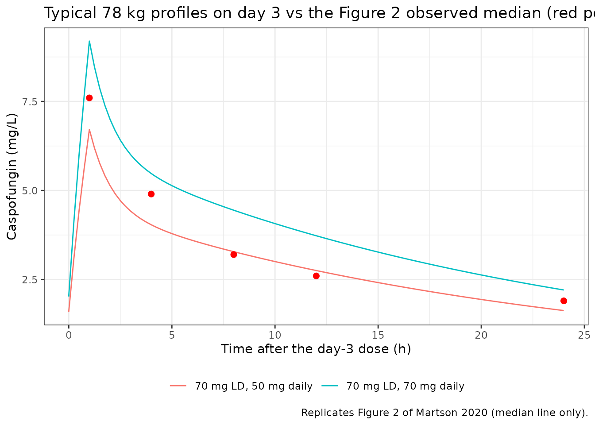
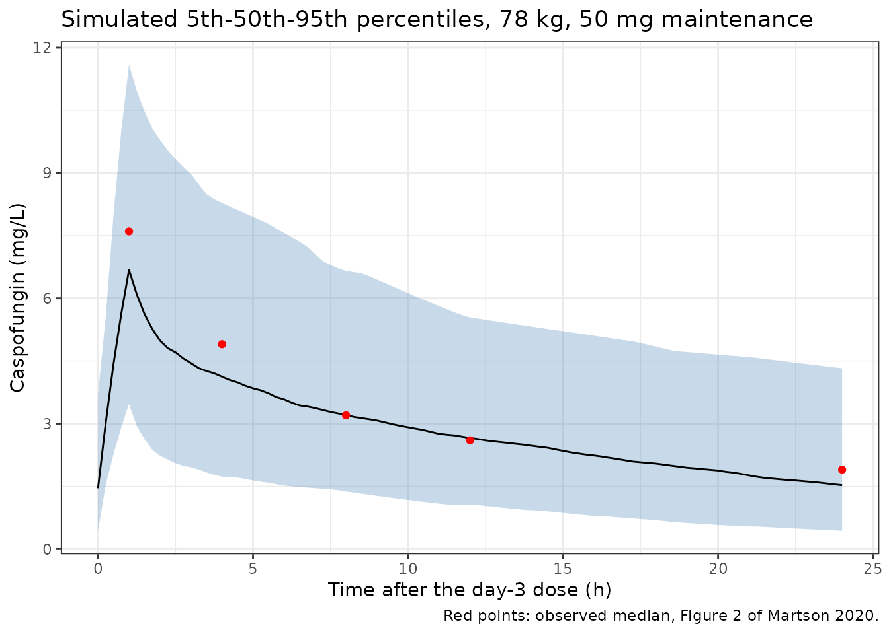

# Caspofungin (Martson 2020)

## Model and source

``` r

ui <- rxode2::rxode(readModelDb("Martson_2020_caspofungin"))
#> ℹ parameter labels from comments will be replaced by 'label()'
```

- Citation: Martson A-G, van der Elst KCM, Veringa A, Zijlstra JG,
  Beishuizen A, van der Werf TS, Kosterink JGW, Neely M, Alffenaar J-W.
  Caspofungin weight-based dosing supported by a population
  pharmacokinetic model in critically ill patients. Antimicrob Agents
  Chemother. 2020;64(9):e00905-20. <doi:10.1128/AAC.00905-20>. PMCID:
  PMC7449215.
- Article: <https://doi.org/10.1128/AAC.00905-20> (open access, CC BY
  4.0)
- Model: `Martson_2020_caspofungin`

Two-compartment population PK model for intravenous caspofungin in
critically ill adults in the intensive care unit with (suspected)
invasive candidiasis (Groningen / Enschede, the Netherlands). Fitted
non-parametrically with the NPAG algorithm in Pmetrics 1.5.2 on primary
parameters Ke (elimination rate constant), V (central volume) and the
intercompartmental rate constants kcp and kpc. Body weight is the only
retained covariate and scales the central volume linearly, V = V0 \* WT
/ 78 with 78 kg the cohort median; since Ke carries no covariate,
clearance CL = Ke \* V is also proportional to weight, which is the
basis of the paper’s weight-based (2 mg/kg loading, 1.25 mg/kg
maintenance) dosing recommendation. Typical values are the means of the
NPAG marginal distributions (Table 2); inter-individual variability is a
log-normal approximation built from the Table 2 CV% column. Table 2
prints V0 in ‘liters/kg’, but the equation V = V0 \* weight/78 and the
Discussion’s CL ~ 0.7 L/h (= 0.09 x 7.71) show V0 is the volume in
litres of a 78 kg patient; see the vignette Errata.

## Population

Twenty adult intensive-care patients with suspected or proven invasive
candidiasis were treated with caspofungin in a
therapeutic-drug-monitoring study at two Dutch hospitals (Table 1). All
received a 70 mg loading dose on day 1, then 50 mg daily (70 mg above 80
kg; 35 mg or 50 mg with moderate hepatic impairment), each as a 1 h
infusion. Nine samples were drawn over one dosing interval on day 3
(range 2-4): pre-dose and 1, 2, 3, 4, 6, 8, 12 and 24 h after the start
of the infusion. Five patients whose dose was raised because the
measured AUC0-24 was below 98 mg\*h/L were sampled a second time, giving
25 occasions and 219 concentrations.

Median age was 56 years (range 25-83) and median weight 78 kg (48-139);
11 of 20 (55%) were male. Forty percent were on continuous venovenous
hemofiltration and 55% received prednisolone or hydrocortisone. Median
SAPS 3 was 59 and median serum albumin 20 g/L. Two patients had
Child-Pugh C liver impairment.

``` r

str(ui$population)
#> List of 15
#>  $ species         : chr "human"
#>  $ n_subjects      : int 20
#>  $ n_studies       : int 1
#>  $ n_occasions     : int 25
#>  $ n_concentrations: int 219
#>  $ age_range       : chr "25-83 years"
#>  $ age_median      : chr "56 years"
#>  $ weight_range    : chr "48-139 kg"
#>  $ weight_median   : chr "78 kg"
#>  $ sex_female_pct  : num 45
#>  $ race_ethnicity  : chr "Not reported"
#>  $ disease_state   : chr "Adult critically ill ICU patients treated with caspofungin for (suspected) invasive candidiasis. Median SAPS 3 "| __truncated__
#>  $ dose_range      : chr "70 mg loading dose on day 1, then 50 mg daily (<= 80 kg) or 70 mg daily (> 80 kg); 35 mg / 50 mg with moderate "| __truncated__
#>  $ regions         : chr "The Netherlands (University Medical Center Groningen; Medisch Spectrum Twente, Enschede)"
#>  $ notes           : chr "Demographics from Martson 2020 Table 1 (reproduced from the parent TDM study). Nine samples per dosing occasion"| __truncated__
```

## Source trace

| Element | Value | Source |
|----|----|----|
| Structure | 2-compartment, IV infusion, first-order elimination | Results, ‘Population pharmacokinetic model’; Table 2 |
| Estimation | NPAG, Pmetrics 1.5.2 | Methods, ‘Population pharmacokinetic modeling’ |
| `lkel` | log(0.09) 1/h (mean; SD 0.04, median 0.08, CV 42.38%) | Table 2, Abstract |
| `lvc` | log(7.71) L at 78 kg (mean; SD 2.70, median 7.20, CV 34.98%) | Table 2 (unit printed as liters/kg, see Errata) |
| `lk12` (kcp) | log(0.44) 1/h (mean; SD 0.38, median 0.28, CV 88.02%) | Table 2 |
| `lk21` (kpc) | log(0.46) 1/h (mean; SD 0.35, median 0.34, CV 75.98%) | Table 2 |
| Weight effect | V = V0 \* WT / 78 | Results text; Table S1 model 6 (‘Pop median: 78kg’) |
| `etalkel`, `etalvc`, `etalk12`, `etalk21` | log(CV^2 + 1) of the Table 2 CV% | Table 2 (log-normal approximation, see Assumptions) |
| Assay polynomial | SD = 0.05 + 0.08 \* C | Methods, ‘Model diagnostics’ |
| gamma | 0.654 (multiplicative) | Results, ‘Population pharmacokinetic model’ |
| `addSd` | 0.654 \* 0.05 = 0.0327 mg/L | derived |
| `propSd` | 0.654 \* 0.08 = 0.05232 | derived |
| Parameter ranges of the final NPAG run | Ke 0-0.4, V0 0.01-18, kcp 0-2, kpc 0-5 | Table S1, model 24 |

## Typical-value checks

The model is linear, so every exposure metric of a typical patient
follows from `CL = Ke * V0 * WT / 78` exactly. These checks use a single
typical-value solve (no IIV, no residual error) and therefore carry
tight bounds.

``` r

mod_typ <- rxode2::zeroRe(ui)

# Clearance of the typical 78 kg patient. The Discussion states: 'with a Ke of
# 0.09, our CL is approximately 0.7 liters' (i.e. L/h).
cl_typ <- 0.09 * 7.71
cl_typ
#> [1] 0.6939

# Regimen helper: loading dose on day 1, maintenance daily thereafter, all as
# 1 h infusions, observations on a fine grid for trapezoidal AUCs.
make_ev <- function(ld, md, days = 14, id = 1L) {
  ev <- rxode2::et(amt = ld, dur = 1, cmt = "central")
  if (md > 0) {
    ev <- rxode2::et(ev, amt = md, dur = 1, ii = 24, addl = days - 2, time = 24, cmt = "central")
  }
  ev <- rxode2::et(ev, seq(0, 24 * days, by = 0.25), cmt = "central")
  d <- as.data.frame(ev)
  d$id <- id
  d
}

auc_window <- function(sim, from, to) {
  s <- sim[sim$time >= from & sim$time <= to, ]
  sum(diff(s$time) * (head(s$Cc, -1) + tail(s$Cc, -1)) / 2)
}

solve_typ <- function(ld, md, wt, days = 14) {
  d <- make_ev(ld, md, days)
  d$WT <- wt
  sim <- suppressMessages(rxode2::rxSolve(mod_typ, d, returnType = "data.frame",
                                          rtol = 1e-10, atol = 1e-12))
  if (is.null(sim$id)) sim$id <- 1L
  sim
}
```

### A mg/kg regimen gives a weight-independent AUC

Because both V and CL are proportional to weight, a dose in mg/kg
produces the same AUC and the same concentration profile at every
weight. That is the pharmacological basis of the paper’s weight-based
recommendation, and it is an exact property of the model.

``` r

wts <- c(50, 78, 120)
inv <- lapply(wts, function(w) {
  sim <- solve_typ(2 * w, 1.25 * w, w, days = 3)
  data.frame(WT = w,
             AUC_day1 = auc_window(sim, 0, 24),
             AUC_day3 = auc_window(sim, 48, 72))
}) |> dplyr::bind_rows()
knitr::kable(inv, digits = 3,
             caption = "Typical AUC (mg*h/L) under 2 mg/kg loading, 1.25 mg/kg maintenance.")
```

|  WT | AUC_day1 | AUC_day3 |
|----:|---------:|---------:|
|  50 |  148.522 |   141.18 |
|  78 |  148.522 |   141.18 |
| 120 |  148.522 |   141.18 |

Typical AUC (mg\*h/L) under 2 mg/kg loading, 1.25 mg/kg maintenance.
{.table}

``` r


# Same typical parameters on both sides; the only difference is integrator
# error at rtol 1e-10, far below this bound.
stopifnot(
  max(abs(inv$AUC_day1 / inv$AUC_day1[2] - 1)) < 1e-6,
  max(abs(inv$AUC_day3 / inv$AUC_day3[2] - 1)) < 1e-6
)
```

### Replicating Figure 2 (VPC median on day 3)

Figure 2 is a prediction-corrected VPC over the day-3 sampling occasion.
The red median line was read from the figure by the maintainers (to
about 0.3 mg/L). The cohort received 50 mg or 70 mg maintenance doses
depending on weight, so the typical 78 kg profiles for those two doses
should bracket the observed median.

``` r

vpc_median <- data.frame(
  tad = c(1, 4, 8, 12, 24),
  Cc_obs = c(7.6, 4.9, 3.2, 2.6, 1.9)
)

typ50 <- solve_typ(70, 50, 78, days = 4)
typ70 <- solve_typ(70, 70, 78, days = 4)
prof <- dplyr::bind_rows(
  typ50 |> dplyr::mutate(regimen = "70 mg LD, 50 mg daily"),
  typ70 |> dplyr::mutate(regimen = "70 mg LD, 70 mg daily")
) |>
  dplyr::filter(time >= 48, time <= 72) |>
  dplyr::mutate(tad = time - 48)

ggplot(prof, aes(tad, Cc, colour = regimen)) +
  geom_line() +
  geom_point(data = vpc_median, aes(tad, Cc_obs), inherit.aes = FALSE, colour = "red", size = 2) +
  labs(x = "Time after the day-3 dose (h)", y = "Caspofungin (mg/L)", colour = NULL,
       title = "Typical 78 kg profiles on day 3 vs the Figure 2 observed median (red points)",
       caption = "Replicates Figure 2 of Martson 2020 (median line only).") +
  theme_bw() + theme(legend.position = "bottom")
```



``` r


bracket <- vpc_median |>
  dplyr::mutate(
    lo = typ50$Cc[match(48 + tad, typ50$time)],
    hi = typ70$Cc[match(48 + tad, typ70$time)]
  )
knitr::kable(bracket, digits = 2,
             caption = "Observed VPC median vs typical 50 mg and 70 mg maintenance profiles (mg/L).")
```

| tad | Cc_obs |   lo |   hi |
|----:|-------:|-----:|-----:|
|   1 |    7.6 | 6.71 | 9.20 |
|   4 |    4.9 | 4.04 | 5.48 |
|   8 |    3.2 | 3.28 | 4.45 |
|  12 |    2.6 | 2.75 | 3.73 |
|  24 |    1.9 | 1.63 | 2.21 |

Observed VPC median vs typical 50 mg and 70 mg maintenance profiles
(mg/L). {.table}

``` r

stopifnot(
  nrow(bracket) == 5L, !anyNA(bracket$lo), !anyNA(bracket$hi),
  # Deterministic typical values vs digitised medians. Allow 10% outside the
  # 50-70 mg bracket for reading error. A volume misread as L/kg (V = 601 L)
  # or a 10-fold Ke error would miss by an order of magnitude.
  all(bracket$Cc_obs >= 0.9 * bracket$lo),
  all(bracket$Cc_obs <= 1.1 * bracket$hi)
)
```

### Target attainment of the typical patient (Tables 3 and 4)

Tables 3 and 4 report the percentage of simulated patients whose AUC
exceeds 98 mg*h/L. A PTA above 50% means the median patient is above the
target, so for every cell far from 50% the typical patient’s AUC must
sit on the same side of 98 mg*h/L. Cells between 35% and 65% are too
close to call and are listed but not gated.

``` r

pta_paper <- tibble::tribble(
  ~table, ~regimen, ~ld, ~md, ~wt, ~day, ~pta98,
  "3", "70/50 mg", 70, 50, 50, 1, 73,
  "3", "70/50 mg", 70, 50, 78, 1, 14,
  "3", "70/50 mg", 70, 50, 120, 1, 0,
  "3", "70/50 mg", 70, 50, 50, 3, 79,
  "3", "70/50 mg", 70, 50, 78, 3, 19,
  "3", "70/50 mg", 70, 50, 120, 3, 0,
  "3", "100/70 mg", 100, 70, 50, 1, 98,
  "3", "100/70 mg", 100, 70, 78, 1, 57,
  "3", "100/70 mg", 100, 70, 120, 1, 10,
  "3", "100/70 mg", 100, 70, 50, 3, 99,
  "3", "100/70 mg", 100, 70, 78, 3, 61,
  "3", "100/70 mg", 100, 70, 120, 3, 12,
  "3", "70 mg daily", 70, 70, 50, 3, 98,
  "3", "70 mg daily", 70, 70, 78, 3, 53,
  "3", "70 mg daily", 70, 70, 120, 3, 11,
  "3", "100 mg daily", 100, 100, 50, 3, 100,
  "3", "100 mg daily", 100, 100, 78, 3, 98,
  "3", "100 mg daily", 100, 100, 120, 3, 37,
  "4", "2/1 mg/kg", 2, 1, 78, 1, 98,
  "4", "2/1 mg/kg", 2, 1, 78, 3, 91,
  "4", "1.5/1.25 mg/kg", 1.5, 1.25, 78, 1, 83,
  "4", "1.5/1.25 mg/kg", 1.5, 1.25, 78, 3, 99,
  "4", "2/1.25 mg/kg", 2, 1.25, 78, 1, 98,
  "4", "2/1.25 mg/kg", 2, 1.25, 78, 3, 100,
  "4", "1 mg/kg daily", 1, 1, 78, 1, 22,
  "4", "1 mg/kg daily", 1, 1, 78, 3, 77,
  "4", "1.5 mg/kg daily", 1.5, 1.5, 78, 1, 83,
  "4", "1.5 mg/kg daily", 1.5, 1.5, 78, 3, 100
)

pta_typ <- pta_paper |>
  dplyr::rowwise() |>
  dplyr::mutate(
    mult = if (table == "4") wt else 1,
    auc_typ = {
      sim <- solve_typ(ld * mult, md * mult, wt, days = 3)
      auc_window(sim, 24 * (day - 1), 24 * day)
    }
  ) |>
  dplyr::ungroup() |>
  dplyr::mutate(
    gated = pta98 <= 35 | pta98 >= 65,
    agree = (pta98 > 50) == (auc_typ > 98)
  )

pta_typ |>
  dplyr::select(table, regimen, wt, day, pta98, auc_typ, gated, agree) |>
  dplyr::rename(
    "Table" = table, "Regimen" = regimen, "Weight (kg)" = wt, "Day" = day,
    "Paper PTA > 98 (%)" = pta98, "Typical AUC0-24 (mg*h/L)" = auc_typ,
    "Gated" = gated, "Same side of 98" = agree
  ) |>
  knitr::kable(digits = 1)
```

| Table | Regimen | Weight (kg) | Day | Paper PTA \> 98 (%) | Typical AUC0-24 (mg\*h/L) | Gated | Same side of 98 |
|:---|:---|---:|---:|---:|---:|:---|:---|
| 3 | 70/50 mg | 50 | 1 | 73 | 104.0 | TRUE | TRUE |
| 3 | 70/50 mg | 78 | 1 | 14 | 66.6 | TRUE | TRUE |
| 3 | 70/50 mg | 120 | 1 | 0 | 43.3 | TRUE | TRUE |
| 3 | 70/50 mg | 50 | 3 | 79 | 111.2 | TRUE | TRUE |
| 3 | 70/50 mg | 78 | 3 | 19 | 71.3 | TRUE | TRUE |
| 3 | 70/50 mg | 120 | 3 | 0 | 46.3 | TRUE | TRUE |
| 3 | 100/70 mg | 50 | 1 | 98 | 148.5 | TRUE | TRUE |
| 3 | 100/70 mg | 78 | 1 | 57 | 95.2 | FALSE | FALSE |
| 3 | 100/70 mg | 120 | 1 | 10 | 61.9 | TRUE | TRUE |
| 3 | 100/70 mg | 50 | 3 | 99 | 156.0 | TRUE | TRUE |
| 3 | 100/70 mg | 78 | 3 | 61 | 100.0 | FALSE | TRUE |
| 3 | 100/70 mg | 120 | 3 | 12 | 65.0 | TRUE | TRUE |
| 3 | 70 mg daily | 50 | 3 | 98 | 150.8 | TRUE | TRUE |
| 3 | 70 mg daily | 78 | 3 | 53 | 96.7 | FALSE | FALSE |
| 3 | 70 mg daily | 120 | 3 | 11 | 62.8 | TRUE | TRUE |
| 3 | 100 mg daily | 50 | 3 | 100 | 215.5 | TRUE | TRUE |
| 3 | 100 mg daily | 78 | 3 | 98 | 138.1 | TRUE | TRUE |
| 3 | 100 mg daily | 120 | 3 | 37 | 89.8 | FALSE | TRUE |
| 4 | 2/1 mg/kg | 78 | 1 | 98 | 148.5 | TRUE | TRUE |
| 4 | 2/1 mg/kg | 78 | 3 | 91 | 116.4 | TRUE | TRUE |
| 4 | 1.5/1.25 mg/kg | 78 | 1 | 83 | 111.4 | TRUE | TRUE |
| 4 | 1.5/1.25 mg/kg | 78 | 3 | 99 | 136.8 | TRUE | TRUE |
| 4 | 2/1.25 mg/kg | 78 | 1 | 98 | 148.5 | TRUE | TRUE |
| 4 | 2/1.25 mg/kg | 78 | 3 | 100 | 141.2 | TRUE | TRUE |
| 4 | 1 mg/kg daily | 78 | 1 | 22 | 74.3 | TRUE | TRUE |
| 4 | 1 mg/kg daily | 78 | 3 | 77 | 107.7 | TRUE | TRUE |
| 4 | 1.5 mg/kg daily | 78 | 1 | 83 | 111.4 | TRUE | TRUE |
| 4 | 1.5 mg/kg daily | 78 | 3 | 100 | 161.6 | TRUE | TRUE |

``` r


stopifnot(
  sum(pta_typ$gated) >= 20L,
  all(pta_typ$agree[pta_typ$gated])
)
```

## Stochastic simulation

The model file carries a log-normal approximation of the NPAG
distribution (see Assumptions). The chunk below simulates 200 patients
per weight band under the licensed 70 mg / 50 mg regimen, for a visual
comparison with Figure 2 and Table 3. It is illustrative and not gated:
the approximation over-disperses clearance (see below).

``` r

rxode2::rxSetSeed(20200820)
n_arm <- 200L
arms <- data.frame(arm = 1:3, WT = c(50, 78, 120))
ev_all <- lapply(seq_len(nrow(arms)), function(a) {
  lapply(seq_len(n_arm), function(i) {
    d <- make_ev(70, 50, days = 3, id = (a - 1L) * n_arm + i)
    d$WT <- arms$WT[a]
    d
  }) |> dplyr::bind_rows()
}) |> dplyr::bind_rows()

sim <- rxode2::rxSolve(ui, ev_all, returnType = "data.frame")

stoch <- sim |>
  dplyr::group_by(id, WT) |>
  dplyr::summarise(
    AUC_day1 = sum(diff(time[time <= 24]) * (head(Cc[time <= 24], -1) + tail(Cc[time <= 24], -1)) / 2),
    AUC_day3 = sum(diff(time[time >= 48 & time <= 72]) *
      (head(Cc[time >= 48 & time <= 72], -1) + tail(Cc[time >= 48 & time <= 72], -1)) / 2),
    .groups = "drop"
  ) |>
  dplyr::group_by(WT) |>
  dplyr::summarise(
    `Median AUC day 1` = median(AUC_day1),
    `PTA day 1 (%)` = 100 * mean(AUC_day1 > 98),
    `Median AUC day 3` = median(AUC_day3),
    `PTA day 3 (%)` = 100 * mean(AUC_day3 > 98),
    .groups = "drop"
  ) |>
  dplyr::mutate(
    `Paper PTA day 1 (%)` = c(73, 14, 0),
    `Paper PTA day 3 (%)` = c(79, 19, 0)
  )
knitr::kable(stoch, digits = 1,
             caption = "70 mg loading, 50 mg daily: simulated vs Table 3 (AUC > 98 mg*h/L).")
```

| WT | Median AUC day 1 | PTA day 1 (%) | Median AUC day 3 | PTA day 3 (%) | Paper PTA day 1 (%) | Paper PTA day 3 (%) |
|---:|---:|---:|---:|---:|---:|---:|
| 50 | 92.6 | 47.5 | 106.7 | 56.5 | 73 | 79 |
| 78 | 61.9 | 13.5 | 70.7 | 22.5 | 14 | 19 |
| 120 | 37.6 | 2.0 | 41.6 | 3.5 | 0 | 0 |

70 mg loading, 50 mg daily: simulated vs Table 3 (AUC \> 98 mg\*h/L).
{.table}

``` r


sim |>
  dplyr::filter(time >= 48, time <= 72, WT == 78) |>
  dplyr::group_by(time) |>
  dplyr::summarise(
    p05 = quantile(Cc, 0.05), p50 = median(Cc), p95 = quantile(Cc, 0.95),
    .groups = "drop"
  ) |>
  ggplot(aes(time - 48, p50)) +
  geom_ribbon(aes(ymin = p05, ymax = p95), alpha = 0.3, fill = "steelblue") +
  geom_line() +
  geom_point(data = vpc_median, aes(tad, Cc_obs), inherit.aes = FALSE, colour = "red") +
  labs(x = "Time after the day-3 dose (h)", y = "Caspofungin (mg/L)",
       title = "Simulated 5th-50th-95th percentiles, 78 kg, 50 mg maintenance",
       caption = "Red points: observed median, Figure 2 of Martson 2020.") +
  theme_bw()
```



## PKNCA validation

The paper reports no NCA table, so PKNCA is checked against the exact
linear identity for a steady-state dosing interval,
`AUCtau = Dose / CL`, on the typical-value day-14 interval of each
weight band under the licensed regimen. After 13 maintenance doses the
loading-dose excess is negligible: the typical terminal (beta) half-life
is about 16 h, so 288 h since the loading dose is about 18 half-lives.

``` r

nca_sim <- lapply(c(50, 78, 120), function(w) {
  solve_typ(70, 50, w, days = 14) |>
    dplyr::mutate(treatment = paste0(w, " kg"), WT = w)
}) |>
  dplyr::bind_rows() |>
  dplyr::filter(time >= 312, time <= 336) |>
  dplyr::mutate(id = 1L)

conc_df <- nca_sim |>
  dplyr::filter(!is.na(Cc)) |>
  dplyr::select(id, treatment, time, Cc)
stopifnot(all(tapply(conc_df$time, conc_df$treatment, min) == 312))

dose_df <- data.frame(
  id = 1L, treatment = c("50 kg", "78 kg", "120 kg"), time = 312, amt = 50
)

conc_obj <- PKNCA::PKNCAconc(conc_df, Cc ~ time | treatment + id)
dose_obj <- PKNCA::PKNCAdose(dose_df, amt ~ time | treatment + id)
intervals <- data.frame(start = 312, end = 336, cmax = TRUE, tmax = TRUE,
                        cmin = TRUE, auclast = TRUE)
nca_res <- PKNCA::pk.nca(PKNCA::PKNCAdata(conc_obj, dose_obj, intervals = intervals))

nca_tab <- as.data.frame(nca_res) |>
  dplyr::select(treatment, PPTESTCD, PPORRES) |>
  tidyr::pivot_wider(names_from = PPTESTCD, values_from = PPORRES) |>
  dplyr::mutate(
    WT = as.numeric(sub(" kg", "", treatment)),
    auc_identity = 50 / (0.09 * 7.71 * WT / 78),
    pct_err = 100 * (auclast / auc_identity - 1)
  ) |>
  dplyr::arrange(WT)

nca_tab |>
  dplyr::select(treatment, cmax, tmax, cmin, auclast, auc_identity, pct_err) |>
  dplyr::rename(
    "Weight band" = treatment, "Cmax (mg/L)" = cmax, "Tmax (h)" = tmax,
    "Cmin (mg/L)" = cmin, "AUCtau PKNCA (mg*h/L)" = auclast,
    "Dose/CL (mg*h/L)" = auc_identity, "Difference (%)" = pct_err
  ) |>
  knitr::kable(digits = 3, caption = "Day-14 dosing interval, 50 mg maintenance, typical patient.")
```

| Weight band | Cmax (mg/L) | Tmax (h) | Cmin (mg/L) | AUCtau PKNCA (mg\*h/L) | Dose/CL (mg\*h/L) | Difference (%) |
|:---|---:|---:|---:|---:|---:|---:|
| 50 kg | 10.547 | 1 | 2.567 | 112.402 | 112.408 | -0.005 |
| 78 kg | 6.761 | 1 | 1.646 | 72.053 | 72.056 | -0.005 |
| 120 kg | 4.395 | 1 | 1.070 | 46.834 | 46.837 | -0.005 |

Day-14 dosing interval, 50 mg maintenance, typical patient. {.table}

``` r


stopifnot(
  nrow(nca_tab) == 3L,
  # Deterministic typical-value solve at rtol 1e-10 vs the exact identity;
  # realised -0.005% in all three bands (trapezoid error on the 0.25 h grid).
  # A misread volume, Ke or dose moves this by tens of percent.
  max(abs(nca_tab$pct_err)) < 0.1
)
```

## Errata

### Table 2 prints V0 in ‘liters/kg’; it is litres at 78 kg

Table 2 (and the Abstract) give the central volume as 7.71 ‘liters/kg’,
but three statements in the same paper show that V0 is the central
volume, in litres, of a patient at the 78 kg cohort median:

1.  The model equation printed in Results is `V = V0 * weight/78`.
    Multiplying a per-kilogram volume by a dimensionless weight ratio
    would give L/kg, not a volume.
2.  The Discussion states ‘with a Ke of 0.09, our CL is approximately
    0.7’, which is 0.09 x 7.71 = 0.69 L/h, and compares it with a
    published V of 7.03 L.
3.  The final NPAG run bounded V0 to 0.01-18 (Table S1, model 24). Read
    as L/kg, the typical patient would have a 601 L central volume and
    the licensed 70 mg dose would give a day-1 AUC near 1 mg\*h/L,
    against the 14%-above-98 of Table 3.

The model therefore uses V0 = 7.71 L. The typical-value
target-attainment check above confirms it independently.

### Other transcription notes

- Table 2 prints the kcp SD as 0.38; the Abstract prints 0.39. The CV
  column (88.02%) corresponds to 0.387, so both are roundings of the
  same value.
- Table 1 prints bilirubin in ‘mmol/liter’ (median 7.5); this can only
  be micromol/L. Bilirubin is not a model covariate.
- Table 3’s column headers lost the 50 kg and 120 kg labels in the
  typeset table. The Results text (‘73% of ~50-kg patients, 14% of
  ~78-kg patients, and 0% of ~120-kg patients’) fixes the column order
  used above. The day-1 cells of the 70 mg and 100 mg daily regimens (no
  loading dose) equal those of the 70/50 mg and 100/70 mg regimens, as
  they must: the first dose is the same. They are listed once above.

## Assumptions and deviations

- **Non-parametric distribution approximated as log-normal.** NPAG
  estimates a discrete joint distribution of support points; the support
  points and their correlations were not published. The model carries
  independent log-normal etas with `omega^2 = log(CV^2 + 1)` from the
  Table 2 CV% column, the same convention used for other Pmetrics models
  in nlmixr2lib.
- **Typical values are the NPAG means.** The medians are lower (Ke 0.08,
  V0 7.20, kcp 0.28, kpc 0.34). A log-normal centred on the mean
  overstates the mean of the distribution, and assuming independence
  between Ke and V0 overstates the spread of clearance. As a result the
  stochastic simulation above spreads the AUC much more widely than
  Tables 3-4. For example, at 2/1.25 mg/kg the paper reports 100% of
  patients above 98 mg\*h/L on day 3, while a 1,000-patient log-normal
  cohort at 78 kg put 72% there (70 mg / 50 mg at 78 kg: 16% on day 1
  against the paper’s 14%, so the centre agrees). For target-attainment
  work, treat the stochastic layer with caution. The typical-value
  predictions reproduce the paper (Figure 2 median, the side-of-target
  of every PTA cell, and the Discussion’s CL of 0.7 L/h).
- **Log-normal draws are unbounded.** The final NPAG run bounded the
  parameters (Ke 0-0.4 1/h, V0 0.01-18 L, kcp 0-2 1/h, kpc 0-5 1/h), and
  the log-normal tails can exceed these ranges.
- **Residual error.** Pmetrics weights observations by
  `gamma * (C0 + C1 * C)` with the *observed* concentration; nlmixr2
  evaluates it on the prediction. The linear sum is reproduced with
  `combined1()`.
- **Weight is time-fixed.** The source used one weight per patient.

## Session information

``` r

sessionInfo()
#> R version 4.6.1 (2026-06-24)
#> Platform: x86_64-pc-linux-gnu
#> Running under: Ubuntu 24.04.5 LTS
#> 
#> Matrix products: default
#> BLAS:   /usr/lib/x86_64-linux-gnu/openblas-pthread/libblas.so.3 
#> LAPACK: /usr/lib/x86_64-linux-gnu/openblas-pthread/libopenblasp-r0.3.26.so;  LAPACK version 3.12.0
#> 
#> locale:
#>  [1] LC_CTYPE=C.UTF-8       LC_NUMERIC=C           LC_TIME=C.UTF-8       
#>  [4] LC_COLLATE=C.UTF-8     LC_MONETARY=C.UTF-8    LC_MESSAGES=C.UTF-8   
#>  [7] LC_PAPER=C.UTF-8       LC_NAME=C              LC_ADDRESS=C          
#> [10] LC_TELEPHONE=C         LC_MEASUREMENT=C.UTF-8 LC_IDENTIFICATION=C   
#> 
#> time zone: UTC
#> tzcode source: system (glibc)
#> 
#> attached base packages:
#> [1] stats     graphics  grDevices utils     datasets  methods   base     
#> 
#> other attached packages:
#> [1] ggplot2_4.0.3         tidyr_1.3.2           dplyr_1.2.1          
#> [4] rxode2_5.1.8          PKNCA_0.12.1          nlmixr2lib_0.3.2.9000
#> 
#> loaded via a namespace (and not attached):
#>  [1] gtable_0.3.6        xfun_0.61           bslib_0.12.0       
#>  [4] rxode2lincmt_0.1.0  lattice_0.22-9      vctrs_0.7.3        
#>  [7] tools_4.6.1         generics_0.1.4      parallel_4.6.1     
#> [10] tibble_3.3.1        symengine_0.2.14    pkgconfig_2.0.3    
#> [13] data.table_1.18.6.1 checkmate_2.3.4     RColorBrewer_1.1-3 
#> [16] S7_0.2.2            desc_1.4.3          lifecycle_1.0.5    
#> [19] compiler_4.6.1      farver_2.1.2        textshaping_1.0.5  
#> [22] fontawesome_0.5.3   htmltools_0.5.9     sys_3.4.3          
#> [25] sass_0.4.10         yaml_2.3.12         pillar_1.11.1      
#> [28] pkgdown_2.2.1       crayon_1.5.3        jquerylib_0.1.4    
#> [31] whisker_0.4.1       openssl_2.4.2       cachem_1.1.0       
#> [34] nlme_3.1-169        tidyselect_1.2.1    digest_0.6.39      
#> [37] lotri_1.0.5         purrr_1.2.2         labeling_0.4.3     
#> [40] rxode2ll_2.0.18     fastmap_1.2.0       grid_4.6.1         
#> [43] cli_3.6.6           dparser_1.3.1-14    magrittr_2.0.5     
#> [46] withr_3.0.3         scales_1.4.0        backports_1.5.1    
#> [49] rmarkdown_2.32      otel_0.2.0          askpass_1.2.1      
#> [52] ragg_1.5.2          memoise_2.0.1       evaluate_1.0.5     
#> [55] knitr_1.52          rex_1.2.2           PreciseSums_0.7    
#> [58] rlang_1.3.0         downlit_0.4.5       Rcpp_1.1.2         
#> [61] glue_1.8.1          xml2_1.6.0          jsonlite_2.0.0     
#> [64] R6_2.6.1            systemfonts_1.3.2   fs_2.1.0
```
