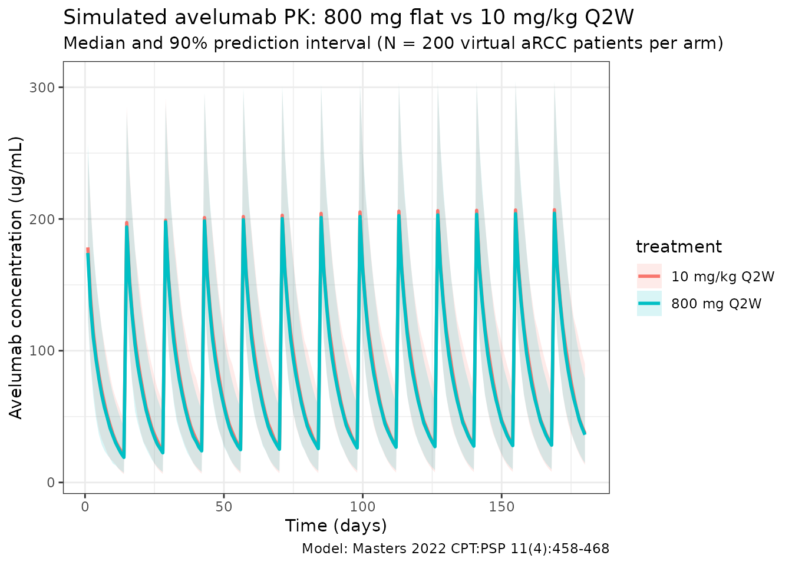
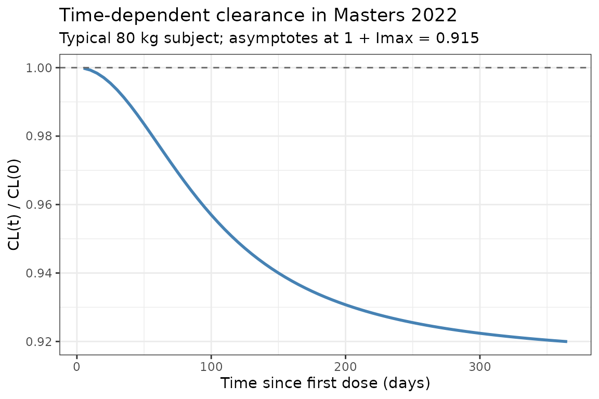

# Masters_2022_avelumab

## Model and source

- Citation: Masters JC, Khandelwal A, di Pietro A, Dai H, Brar S.
  Model-informed drug development supporting the approval of the
  avelumab flat-dose regimen in patients with advanced renal cell
  carcinoma. CPT Pharmacometrics Syst Pharmacol. 2022;11(4):458-468.
  <doi:10.1002/psp4.12771>
- Description: Two-compartment population PK model for avelumab
  (anti-PD-L1 IgG1) with time-dependent clearance in patients with
  advanced solid tumors (Masters 2022)
- Article: <https://doi.org/10.1002/psp4.12771>

Avelumab is a fully human anti-PD-L1 IgG1 monoclonal antibody. The
Masters 2022 paper supported approval of the **800 mg Q2W flat-dose**
regimen by simulating exposure against the historic **10 mg/kg Q2W**
weight-based regimen using a population PK model inherited from Wilkins
2019 (Ref. 20 in the paper), re-estimated on a pooled dataset dominated
by the JAVELIN Renal 100 / 101 advanced-renal-cell-carcinoma (aRCC)
combination-arm population.

Structure: linear two-compartment IV model with **time-dependent
clearance** via a Hill-type function of time since first dose:

$${CL}(t) = {CL}_{\text{base}} \cdot \left( 1 + I_{\max} \cdot \frac{t^{\gamma}}{T_{50}^{\gamma} + t^{\gamma}} \right)$$

with $I_{\max} = - 0.08533$ (a fractional **decrease** at
$t \gg T_{50}$) and allometric weight scaling with reference weight 80
kg.

## Population

The final-model population was a pooled dataset of **2,315 subjects**
across five studies (Masters 2022 Results, *Population PK analysis*):

- 488 aRCC patients from the JAVELIN Renal 100 (Phase Ib, avelumab +
  axitinib) and JAVELIN Renal 101 (Phase III, avelumab + axitinib
  combination arm) trials.
- 1,827 solid-tumor monotherapy patients carried over from the prior
  Wilkins 2019 dataset (metastatic Merkel cell carcinoma, advanced
  urothelial carcinoma, and other advanced solid tumors).

Demographics for the aRCC sub-population (Tables S2 / S3 of the
supplementary material): weight range 44.2–143.0 kg, median 81.5 kg; for
the prior monotherapy sub-population: weight range 30.4–204 kg, median
70.6 kg. Both regimens dosed avelumab **10 mg/kg IV every 2 weeks**,
with the 800 mg flat dose simulated as the alternative.

The same metadata is available programmatically via
`readModelDb("Masters_2022_avelumab")$population`.

## Source trace

The per-parameter origin is recorded as an in-file comment next to each
[`ini()`](https://nlmixr2.github.io/rxode2/reference/ini.html) entry in
`inst/modeldb/specificDrugs/Masters_2022_avelumab.R`. The table below
collects them in one place for review.

| Parameter (model name)               | Value                                                           | Source                                        |
|--------------------------------------|-----------------------------------------------------------------|-----------------------------------------------|
| `lcl` (CL, L/day)                    | log(0.0269 × 24)                                                | Masters 2022 Table 1, θ_CL = 0.0269 L/h       |
| `lvc` (V1, L)                        | log(3.196)                                                      | Masters 2022 Table 1, θ_V1                    |
| `lvp` (V2, L)                        | log(0.7278)                                                     | Masters 2022 Table 1, θ_V2                    |
| `lq` (Q, L/day)                      | log(0.03352 × 24)                                               | Masters 2022 Table 1, θ_Q (see *Assumptions*) |
| `lImax` (log\|Imax\|)                | log(0.08533)                                                    | Masters 2022 Table 1, θ_Imax = −0.08533       |
| `lt50` (T50, days)                   | log(99.24)                                                      | Masters 2022 Table 1, θ_T50                   |
| `lgamma` (Hill shape)                | log(2.086)                                                      | Masters 2022 Table 1, θ_γ                     |
| `e_wt_cl` (allometric on CL)         | 0.4714                                                          | Masters 2022 Table 1, θ_weight_on_CL          |
| `e_wt_v1` (allometric on V1)         | 0.4694                                                          | Masters 2022 Table 1, θ_weight_on_V1          |
| `e_wt_v2` (allometric on V2)         | 0.5826                                                          | Masters 2022 Table 1, θ_weight_on_V2          |
| `e_wt_q` (allometric on Q)           | 1 (fixed)                                                       | Masters 2022 Methods, *Study overview*        |
| IIV block `etalcl + etalvc + etalvp` | lower-tri c(0.09339, 0.03048, 0.03776, 0.08418, 0.01799, 1.204) | Masters 2022 Table 1, ω² and covariance rows  |
| `etalImax`                           | 0.1052                                                          | Masters 2022 Table 1, ω²_Imax                 |
| `propSd`                             | 0.1742                                                          | Masters 2022 Table 1, σ_proportional          |
| `addSd` (µg/mL)                      | 2.168                                                           | Masters 2022 Table 1, σ_additive              |

Equations:

- `d/dt(central)` and `d/dt(peripheral1)`: standard two-compartment IV
  micro-constant form (kel = cl/v1, k12 = q/v1, k21 = q/v2).
- Hill-type time-dependent CL: Masters 2022 Methods / Results and the
  Wilkins 2019 precedent.

## Virtual cohort

Original observed data are not publicly available. The simulations below
use a virtual cohort whose weight distribution approximates the aRCC
sub-population reported in Masters 2022 (range 44.2–143.0 kg, median
81.5 kg).

``` r
set.seed(2022)
n_subj <- 200

cohort <- tibble(
  ID = seq_len(n_subj),
  WT = pmin(pmax(rlnorm(n_subj, log(81.5), 0.22), 44.2), 143.0)
)
```

Two dosing regimens are compared: the weight-based **10 mg/kg Q2W** and
the approved flat **800 mg Q2W**, each given for 13 cycles over 180
days.

``` r
dose_interval_d <- 14
n_doses         <- 13
dose_times_d    <- seq(0, by = dose_interval_d, length.out = n_doses)
obs_times_d     <- sort(unique(c(dose_times_d, seq(0, 180, by = 1))))

build_events <- function(pop, regimen) {
  amt_per_subject <- if (regimen == "10 mg/kg Q2W") pop$WT * 10 else rep(800, nrow(pop))
  d_dose <- pop |>
    mutate(AMT = amt_per_subject) |>
    tidyr::crossing(TIME = dose_times_d) |>
    mutate(EVID = 1, CMT = "central", DUR = 1 / 24, DV = NA_real_,
           treatment = regimen)
  d_obs <- pop |>
    tidyr::crossing(TIME = obs_times_d) |>
    mutate(AMT = NA_real_, EVID = 0, CMT = "central", DUR = NA_real_,
           DV = NA_real_, treatment = regimen)
  dplyr::bind_rows(d_dose, d_obs) |>
    dplyr::arrange(ID, TIME, dplyr::desc(EVID)) |>
    as.data.frame()
}

events_flat    <- build_events(cohort, "800 mg Q2W")
events_wtbased <- build_events(cohort, "10 mg/kg Q2W")
```

## Simulation

``` r
mod <- readModelDb("Masters_2022_avelumab")
sim_flat    <- rxSolve(mod, events = events_flat,    returnType = "data.frame")
#> ℹ parameter labels from comments will be replaced by 'label()'
sim_wtbased <- rxSolve(mod, events = events_wtbased, returnType = "data.frame")
#> ℹ parameter labels from comments will be replaced by 'label()'
sim <- dplyr::bind_rows(
  dplyr::mutate(sim_flat,    treatment = "800 mg Q2W"),
  dplyr::mutate(sim_wtbased, treatment = "10 mg/kg Q2W")
)
```

## Concentration-time profiles

Masters 2022 Figure 2 and Figure S1 compare predicted exposure between
the flat-dose and weight-based regimens. The figure below reproduces
that comparison (median with 5–95% prediction interval per regimen):

``` r
sim_summary <- sim |>
  dplyr::filter(time > 0) |>
  dplyr::group_by(time, treatment) |>
  dplyr::summarise(
    median = stats::median(Cc, na.rm = TRUE),
    lo     = stats::quantile(Cc, 0.05, na.rm = TRUE),
    hi     = stats::quantile(Cc, 0.95, na.rm = TRUE),
    .groups = "drop"
  )

ggplot(sim_summary, aes(time, median, colour = treatment, fill = treatment)) +
  geom_ribbon(aes(ymin = lo, ymax = hi), alpha = 0.15, colour = NA) +
  geom_line(linewidth = 1) +
  labs(
    x = "Time (days)",
    y = "Avelumab concentration (ug/mL)",
    title = "Simulated avelumab PK: 800 mg flat vs 10 mg/kg Q2W",
    subtitle = paste0("Median and 90% prediction interval (N = ",
                      n_subj, " virtual aRCC patients per arm)"),
    caption = "Model: Masters 2022 CPT:PSP 11(4):458-468"
  ) +
  theme_bw()
```



## Time-dependent clearance

Masters 2022 reports a fractional decrease in CL with time
($I_{\max} = - 0.08533$, $T_{50} = 99.24$ days, $\gamma = 2.086$). The
typical-value CL profile below reproduces the Hill-type time course at a
reference 80 kg subject (deterministic, etas = 0):

``` r
t_grid <- seq(0, 365, by = 5)
events_cl <- data.frame(
  ID = 1, WT = 80,
  TIME = c(0, t_grid),
  AMT  = c(800, rep(NA_real_, length(t_grid))),
  EVID = c(1, rep(0, length(t_grid))),
  CMT  = "central",
  DUR  = c(1 / 24, rep(NA_real_, length(t_grid))),
  DV   = NA_real_
)
sim_cl <- rxSolve(
  mod, events = events_cl,
  params = c(WT = 80, etalcl = 0, etalvc = 0, etalvp = 0, etalImax = 0),
  omega  = NA,
  returnType = "data.frame"
)
#> ℹ parameter labels from comments will be replaced by 'label()'
sim_cl <- sim_cl[sim_cl$time > 0, ]

ggplot(sim_cl, aes(time, cl / cl_base)) +
  geom_line(linewidth = 1, colour = "steelblue") +
  geom_hline(yintercept = 1, linetype = "dashed", colour = "grey40") +
  labs(
    x = "Time since first dose (days)",
    y = "CL(t) / CL(0)",
    title = "Time-dependent clearance in Masters 2022",
    subtitle = "Typical 80 kg subject; asymptotes at 1 + Imax = 0.915"
  ) +
  theme_bw()
```



## PKNCA validation

Compute NCA parameters over the third dosing interval (steady-state
approximation for a mAb with a ~7 day half-life):

``` r
interval_start <- dose_times_d[3]
interval_end   <- dose_times_d[4]

sim_nca <- sim |>
  dplyr::filter(!is.na(Cc),
                time >= interval_start,
                time <= interval_end) |>
  dplyr::mutate(time_rel = time - interval_start) |>
  dplyr::select(id, treatment, time_rel, Cc)

conc_obj <- PKNCA::PKNCAconc(sim_nca, Cc ~ time_rel | treatment + id)

dose_df <- data.frame(
  id        = rep(cohort$ID, 2),
  treatment = rep(c("800 mg Q2W", "10 mg/kg Q2W"), each = n_subj),
  time_rel  = 0,
  amt       = c(rep(800, n_subj), cohort$WT * 10)
)
dose_obj <- PKNCA::PKNCAdose(dose_df, amt ~ time_rel | treatment + id)

intervals <- data.frame(
  start     = 0,
  end       = dose_interval_d,
  cmax      = TRUE,
  tmax      = TRUE,
  auclast   = TRUE,
  half.life = TRUE
)

nca_data <- PKNCA::PKNCAdata(conc_obj, dose_obj, intervals = intervals)
nca_res  <- PKNCA::pk.nca(nca_data)
#>  ■■■■■                             14% |  ETA:  6s
#>  ■■■■■■■■■■■■■■■■■■                56% |  ETA:  3s
knitr::kable(summary(nca_res),
             caption = "Simulated NCA parameters (3rd dosing interval, days 28-42)")
```

| start | end | treatment    | N   | auclast       | cmax         | tmax                | half.life     |
|------:|----:|:-------------|:----|:--------------|:-------------|:--------------------|:--------------|
|     0 |  14 | 10 mg/kg Q2W | 200 | 1120 \[37.1\] | 202 \[24.1\] | 1.00 \[1.00, 1.00\] | 5.47 \[2.57\] |
|     0 |  14 | 800 mg Q2W   | 200 | 1150 \[34.7\] | 201 \[23.9\] | 1.00 \[1.00, 1.00\] | 5.24 \[1.96\] |

Simulated NCA parameters (3rd dosing interval, days 28-42)

## Assumptions and deviations

- **Table 1 θ_Q typo (0.3352 → 0.03352 L/h):** The paper’s Table 1
  prints the point estimate for $\theta_{Q}$ as 0.3352 L/h, but its
  listed RSE (12.24%) and 95% CI (0.02548–0.04157 L/h) are only
  internally consistent with **θ_Q = 0.03352 L/h** (a missing leading
  zero in the printed point estimate). 0.03352 L/h is also the value
  inherited from the Wilkins 2019 base structural model and is in the
  expected range for mAb inter-compartmental clearance. The corrected
  value is used here and annotated in the source-trace comment of
  `Masters_2022_avelumab.R`. No erratum is posted on the publisher site
  as of 2026-04-20.
- **Reference weight:** Masters 2022 does not explicitly state the
  reference weight used in the allometric scaling, but the 800 mg
  flat-dose rationale is built around an approximate 80 kg median body
  weight, so 80 kg is used here as the allometric reference for CL, V1,
  V2, and Q.
- **Imax parameterization:** $I_{\max}$ is always negative in the source
  ($- 0.08533$). To keep every individual $I_{\max,i}$ strictly negative
  under log-normal IIV, the model stores $\log\left| I_{\max} \right|$
  and applies the negative sign in the
  [`model()`](https://nlmixr2.github.io/rxode2/reference/model.html)
  block: `Imax_i <- -exp(lImax + etalImax)`. This is equivalent to a
  log-normal distribution on the magnitude of the decrease.
- **ω²(V2) = 1.204 (RSE 109.7%):** This is a very large log-normal
  variance (IIV on V2 ≈ 135% CV) with poor identifiability, but it is
  internally consistent with its reported 95% CI (0.9567–1.451) and is
  used as reported. Downstream NCA estimates driven by V2 (e.g.,
  terminal-phase volumes) will therefore show wide between-subject
  spread.
- **Residual error convention:** The `sigma` column in Table 1 is the
  standard deviation (not variance) of the proportional (0.1742) and
  additive (2.168 µg/mL) residual components, matching NONMEM’s default
  reporting. Used directly as `propSd` and `addSd`.
- **Virtual cohort:** Demographics were simulated as a log-normal weight
  distribution anchored to the aRCC-subpopulation median (81.5 kg) and
  truncated to the reported range (44.2–143.0 kg). The paper does not
  tabulate other baseline covariates for the final model because only
  body weight enters the final structural model.
- **Time units:** The source reports CL and Q in L/h and T50 in days.
  The packaged model keeps time in **days** for consistency with T50; CL
  and Q are converted via ×24.
