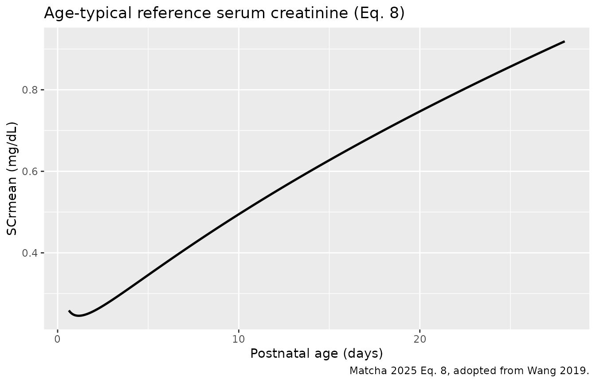
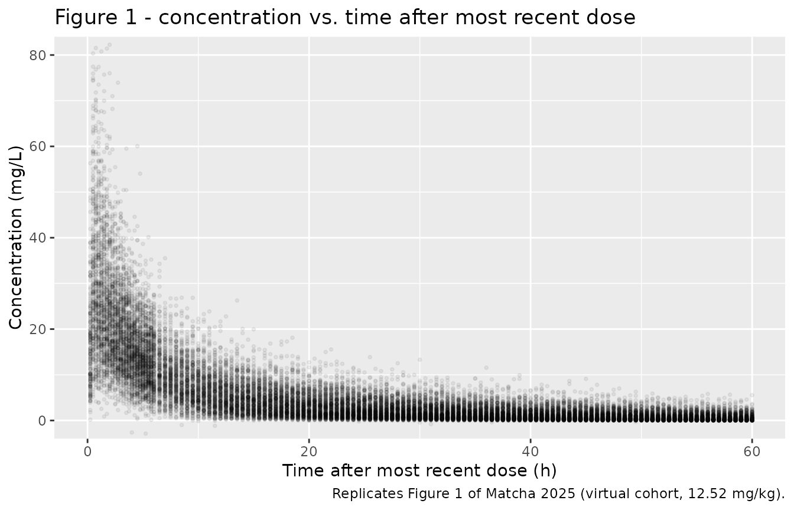
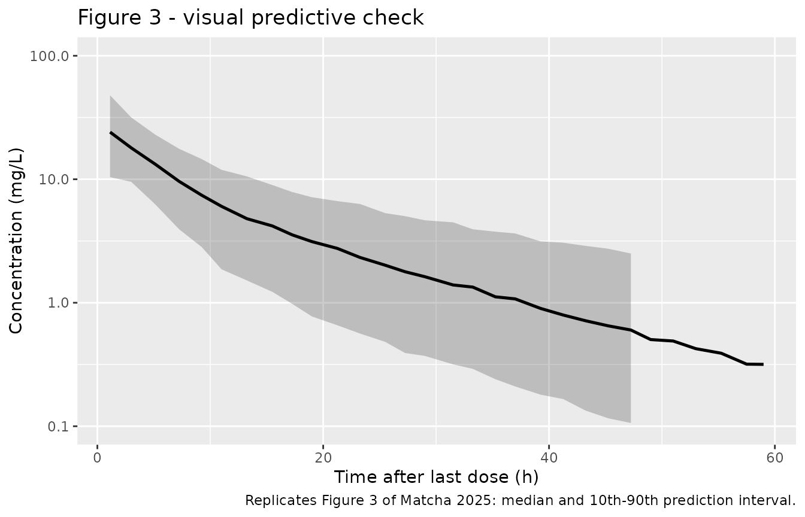

# Amikacin (Matcha 2025)

## Model and source

- Citation: Matcha S, Dilli Batcha JS, Raju AP, Chaudhari BB, Moorkoth
  S, Mallayasamy S, Lewis LE. Precision dosing of amikacin in term
  neonates using pharmacometric approach. Pediatr Res. 2025;98:936-941.
  <doi:10.1038/s41390-025-04044-7>. The age-typical serum-creatinine
  reference equation (Matcha 2025 Eq. 8) is taken from Wang H, Sherwin
  C, Gobburu JVS, Ivaturi V. Population pharmacokinetic modeling of
  gentamicin in pediatrics. J Clin Pharmacol. 2019;59:1584-1596.
- Description: Two-compartment IV population PK model for amikacin in
  term neonates (Matcha 2025); clearance carries an uncentred
  exponential body-weight effect (Exp^(WT \* 0.308)) and a power
  renal-function ratio (SCrmean / SCr)^0.397, where SCrmean is the
  age-typical population serum creatinine predicted from postnatal age
  by the Wang 2019 paediatric reference equation, so postnatal age
  enters clearance as renal maturation; central volume, peripheral
  volume, and intercompartmental clearance carry no covariates. Supports
  the paper’s WT / SCr / PNA dosing nomogram targeting peak 24-35 mg/L
  and trough 2-5 mg/L.
- Article: <https://doi.org/10.1038/s41390-025-04044-7>
- Supplement (Tables S1-S2, Figure S1):
  <https://doi.org/10.1038/s41390-025-04044-7>

Matcha 2025 developed a two-compartment intravenous population PK model
for amikacin in term neonates and used it to build a dosing nomogram
indexed by body weight, serum creatinine, and postnatal age. The paper’s
stated design targets are a peak concentration of about 30 mg/L
(acceptable window 24-35 mg/L) and a trough of about 3 mg/L (acceptable
window 2-5 mg/L).

## Population

The model was fitted to 100 amikacin concentrations from 78 term
neonates in a single-centre prospective observational study in India
(101 concentrations from 80 neonates before data cleaning; one outlying
observation of 154 mg/L and one subject with no usable concentrations
were removed – supplementary Table S1). Gestational age was 37-42 weeks
(median 39), current body weight 1.74-4.84 kg (median 2.85), and serum
creatinine 0.16-1.49 mg/dL (median 0.55). Postnatal age at sample
collection ranged from 0.62 to 27.32 days (median 5.02). Doses were
25-110 mg (median 40 mg), i.e. 8.23-51.89 mg/kg (median 12.52 mg/kg),
and sampling was opportunistic at 0.5-24 h after the most recent dose
(Matcha 2025 Table 1 and Figure 1). Sex distribution was not reported.
The model was fitted with Pumas in Julia 1.6 and evaluated by VPC (n =
500) and bootstrap (n = 1000, 100% success).

The same information is available programmatically from the model’s
`population` metadata:

``` r

pop <- rxode2::rxode(readModelDb("Matcha_2025_amikacin"))$population
#> ℹ parameter labels from comments will be replaced by 'label()'
str(pop, max.level = 1)
#> List of 18
#>  $ species       : chr "human"
#>  $ n_subjects    : num 78
#>  $ n_studies     : num 1
#>  $ n_observations: num 100
#>  $ age_range     : chr "PNA at start of amikacin 0.04-21.29 days; PNA at sample collection 0.62-27.32 days"
#>  $ age_median    : chr "PNA 1.70 days at start of amikacin; 5.02 days at sample collection"
#>  $ ga_range      : chr "Gestational age 37-42 weeks (term only); postmenstrual age at start of amikacin 37.11-42.22 weeks"
#>  $ ga_median     : chr "Gestational age 39 weeks; postmenstrual age 39.20 weeks"
#>  $ weight_range  : chr "Current body weight 1.74-4.84 kg; birth weight 1.75-4.50 kg"
#>  $ weight_median : chr "Current body weight 2.85 kg; birth weight 2.95 kg"
#>  $ sex_female_pct: num NA
#>  $ race_ethnicity: chr "Not reported; single-centre Indian cohort"
#>  $ disease_state : chr "Term neonates prescribed amikacin for suspected or confirmed sepsis; clinically unstable neonates were excluded."
#>  $ dose_range    : chr "25-110 mg IV (median 40 mg), equivalent to 8.23-51.89 mg/kg (median 12.52 mg/kg)"
#>  $ regions       : chr "India (single-centre prospective observational study; Kasturba Medical College, Manipal)"
#>  $ renal_function: chr "Serum creatinine 0.16-1.49 mg/dL (median 0.55); Schwartz-estimated creatinine clearance 12.68-145.0 mL/min (med"| __truncated__
#>  $ notes         : chr "Demographics from Matcha 2025 Table 1. 101 concentrations were collected from 80 neonates; after removing one o"| __truncated__
#>  $ sex_note      : chr "Sex distribution not reported in Matcha 2025."
```

## Source trace

Every `ini()` entry in
`inst/modeldb/specificDrugs/Matcha_2025_amikacin.R` carries an in-file
comment naming its source location. They are collected here for review.

| Equation / parameter | Value | Source location |
|----|----|----|
| `lcl` (TVCL) | 0.064 L/h | Table 2; Eq. 4 |
| `lvc` (TVVC) | 1.281 L | Table 2; Eq. 5 |
| `lq` (TVQ) | 0.055 L/h | Table 2; Eq. 7 |
| `lvp` (TVVP) | 0.618 L | Table 2; Eq. 6 |
| `e_wt_cl` (Wt_cl) | 0.308 (1/kg) | Table 2; Eq. 4 |
| `e_creat_cl` (SCr_cl) | 0.397 (unitless) | Table 2; Eq. 4 |
| `etalcl` | 0.106966 (BSV 33.6 %CV) | Table 2 BSV_cl |
| `etalvc` | 0.156081 (BSV 41.1 %CV) | Table 2 BSV_vc |
| `propSd` | 0.309 (30.9 %CV) | Table 2 proportional residual error |
| `CL_i = 0.064 * Exp^(WT * 0.308) * (SCrmean / SCr)^0.397 * Exp^(etacl)` | n/a | Eq. 4 |
| `VC_i = 1.281 * Exp^(etavc)` | n/a | Eq. 5 |
| `VP_i = 0.618` | n/a | Eq. 6 |
| `Q_i = 0.055` | n/a | Eq. 7 |
| `SCrmean = -0.02324 - 0.14545 * log(PNA) + 0.26964 * PNA^0.5` | n/a | Eq. 8 (adopted from Wang 2019); repeated verbatim in supplementary Table S1 |
| Two-compartment IV disposition | n/a | Results, “A two-compartment structural PK model best explained the study data” |
| Proportional residual error | n/a | Results, “A proportional residual error model was chosen” |
| Target windows: peak 24-35 mg/L, trough 2-5 mg/L | n/a | Methods “Dosing nomogram”; Discussion |
| Target attainment: peak 50 / 30 / 20 %, trough 50 / 20 / 30 % (in / above / below) | n/a | Results, final paragraph of “Dosing nomogram” results |
| Dosing nomogram (100 covariate cells) | n/a | Table 3 |

Two points in the source trace needed care, because the markdown
conversion of the article drops every display equation (each of Eqs. 4-8
appears only as a `formula-not-decoded` placeholder). Both were read
directly off the publisher’s own typesetting, by rasterising page 3 of
the article PDF at 600 dpi (`pdftoppm -r 600 -f 3 -l 3`) and cropping to
the equation bounding boxes located with `pdftotext -bbox`. At that
resolution the superscript structure and the leading signs are
unambiguous. Each was then corroborated against a second, independent
source:

- **Eq. 4 uses an exponential, not a power, body-weight model.** The
  typeset equation reads
  `CL_i = 0.064 * Exp^(WT*0.308) * (SCrmean / SCr)^0.397 * EXP^(etacl)`,
  with `WT*0.308` set as a superscript on `Exp` and `0.397` as a
  superscript on the bracketed creatinine ratio. (The PDF’s flat text
  layer mangles this into
  `CLi = 0:064 ExpWT0:308 (SCrmean / SCr) 0:397 EXPetacl`, which is what
  makes the rasterised reading necessary: superscripts are flattened
  into the baseline run and decimal points come out as colons.) The
  exponential form matches the Methods statement that “power and
  exponential functions were used to describe the covariate effects for
  continuous covariates”, and is confirmed independently by the Table 3
  nomogram arithmetic below. The consequence is that the WT effect is
  **uncentred**: `lcl` = 0.064 L/h is the clearance extrapolated to WT =
  0 kg, not the typical clearance of a neonate.
- **Eq. 8 has two leading minus signs.** The typeset equation reads
  `SCrmean = -0.02324 - 0.14545 x log(PNA) + 0.26964 x PNA^0.5`. The
  version of this image redistributed by EuropePMC (`Equ8.gif`, 200x9
  px) is too coarse to resolve the leading sign, but the 600 dpi page
  render is not. Supplementary Table S1 settles it a second time,
  independently of the article body: the row “SCr completely missing /
  Filled with SCr predictions (Wang et al., 2019)” prints the equation
  in code form as
  `-0.02324 - (0.14545 * log(PNA)) + 0.26964 * (PNA0.5)`.

[`log()`](https://rdrr.io/r/base/Log.html) is the natural logarithm: the
model was fitted in Julia/Pumas, where `log` is the natural log, and the
supplement writes Eq. 8 in that code form.

## Renal maturation enters clearance through the reference creatinine

Postnatal age is not a direct covariate on any PK parameter. It enters
clearance through `SCrmean`, the age-typical population serum creatinine
(Eq. 8), which is the numerator of the renal-function ratio on CL. The
paper describes this as incorporating renal maturation, “which is
directly proportional to PNA and gestational age”, so `SCrmean` – and
therefore typical clearance – must increase across the neonatal window.

Eq. 8 is not monotone everywhere, however. Its derivative
`-0.14545 / PNA + 0.13482 / sqrt(PNA)` vanishes at
`PNA = (0.14545 / 0.13482)^2` = 1.164 days, so the curve falls very
slightly over the first day of life and rises strictly thereafter. The
dip is 5% of the value at the cohort’s earliest sampling time and is
confined below 1.2 days; across the whole of the published nomogram (PNA
bands starting at 1 day) and essentially the whole cohort, `SCrmean`
increases with postnatal age as the paper describes.

``` r

scr_mean_fun <- function(pna_days) {
  -0.02324 - 0.14545 * log(pna_days) + 0.26964 * pna_days^0.5
}

pna_days <- seq(0.62, 28, length.out = 400)

ggplot(data.frame(pna_days, scr_mean = scr_mean_fun(pna_days)),
       aes(pna_days, scr_mean)) +
  geom_line(linewidth = 0.9) +
  labs(
    x = "Postnatal age (days)",
    y = "SCrmean (mg/dL)",
    title = "Age-typical reference serum creatinine (Eq. 8)",
    caption = "Matcha 2025 Eq. 8, adopted from Wang 2019."
  )
```



``` r


# The analytic turning point must agree with the numerical argmin.
turning_point <- (0.14545 / 0.13482)^2
fine <- seq(0.5, 3, length.out = 100001)
stopifnot(abs(fine[which.min(scr_mean_fun(fine))] - turning_point) < 1e-3)

# Strictly increasing above the turning point -- this is the property the
# paper's renal-maturation story and the Table 3 interval trend both require.
stopifnot(all(diff(scr_mean_fun(seq(1.17, 28, length.out = 5000))) > 0))

# ... and the pre-turning-point dip is negligible over the nomogram's range.
stopifnot(
  scr_mean_fun(1) - min(scr_mean_fun(seq(1, 28, length.out = 5000))) < 0.001
)

c(turning_point_days = turning_point,
  day_0.62 = scr_mean_fun(0.62),
  day_1    = scr_mean_fun(1),
  day_5.02 = scr_mean_fun(5.02),
  day_28   = scr_mean_fun(28),
  fold_1_to_28 = scr_mean_fun(28) / scr_mean_fun(1))
#> turning_point_days           day_0.62              day_1           day_5.02 
#>          1.1639084          0.2586051          0.2464000          0.3462246 
#>             day_28       fold_1_to_28 
#>          0.9188916          3.7292679
```

Between day 1 and day 28 the reference creatinine rises 3.73-fold, which
by Eq. 4 raises typical clearance by `3.73^0.397` = 1.69-fold across the
neonatal period at fixed weight and measured creatinine.

This also cross-checks against Table 3: holding weight and creatinine
fixed, every column of the nomogram shortens its dosing interval as the
postnatal-age band increases (e.g. at WT 2.00-2.49 kg and SCr 0.50-0.74
mg/dL the interval goes 36 h, 30 h, 30 h, 24 h across the four weeks),
which requires clearance to rise with postnatal age.

## The weight model is exponential, not allometric

The one structural reading that the PDF’s flat text layer cannot settle
is whether Eq. 4’s weight term is `Exp^(WT * 0.308)` (exponential,
uncentred) or `(WT / ref)^0.308` (allometric power). The publisher’s
typesetting says exponential, and Table 3 proves it independently –
which matters here, because the paper’s own Discussion reads more
naturally under the power form (see Assumptions below).

Within one nomogram row the target window is held fixed, so the total
dose rate prescribed for a cell must be proportional to that cell’s
clearance. Reading the whole weight axis of a row therefore measures the
*shape* of the weight effect directly, with no free parameters – a
stronger test than comparing only the two end bands, because a wrong
functional form has to miss the interior bands too.

``` r

wt_mid <- c(2.245, 2.745, 3.245, 3.745, 4.250)  # midpoints of the five WT bands

# Two independent rows of Table 3, both at PNA 1-7 days.
rows <- list(
  "SCr 0.15-0.29" = list(mg_per_kg = c(17, 15, 12, 11, 9), tau = c(24, 21, 18, 15, 12)),
  "SCr 0.50-0.74" = list(mg_per_kg = c(16, 13, 12, 10, 9), tau = c(36, 30, 30, 24, 21))
)

# Dose rate (mg/h) for each cell, expressed relative to the lightest band.
relative_rate <- function(c_row) {
  rate <- c_row$mg_per_kg * wt_mid / c_row$tau
  rate / rate[1]
}

wt_check <- tibble::tibble(
  row      = rep(names(rows), each = length(wt_mid)),
  wt       = rep(wt_mid, length(rows)),
  observed = unlist(lapply(rows, relative_rate), use.names = FALSE)
) |>
  dplyr::mutate(
    exponential = exp(0.308 * (wt - wt_mid[1])),
    power       = (wt / wt_mid[1])^0.308
  )

wt_check
#> # A tibble: 10 × 5
#>    row              wt observed exponential power
#>    <chr>         <dbl>    <dbl>       <dbl> <dbl>
#>  1 SCr 0.15-0.29  2.24     1           1     1   
#>  2 SCr 0.15-0.29  2.74     1.23        1.17  1.06
#>  3 SCr 0.15-0.29  3.24     1.36        1.36  1.12
#>  4 SCr 0.15-0.29  3.74     1.73        1.59  1.17
#>  5 SCr 0.15-0.29  4.25     2.00        1.85  1.22
#>  6 SCr 0.50-0.74  2.24     1           1     1   
#>  7 SCr 0.50-0.74  2.74     1.19        1.17  1.06
#>  8 SCr 0.50-0.74  3.24     1.30        1.36  1.12
#>  9 SCr 0.50-0.74  3.74     1.56        1.59  1.17
#> 10 SCr 0.50-0.74  4.25     1.83        1.85  1.22

# Mean absolute relative error of each candidate form across all 10 cells.
err <- wt_check |>
  dplyr::summarise(
    exponential = mean(abs(exponential - observed) / observed),
    power       = mean(abs(power - observed) / observed)
  )
err
#> # A tibble: 1 × 2
#>   exponential power
#>         <dbl> <dbl>
#> 1      0.0308 0.186

# The exponential form must track the nomogram closely AND beat the allometric
# form by a wide margin. Both bounds have ample headroom (measured: ~3% vs ~19%),
# so neither is filed down to the observed value.
stopifnot(err$exponential < 0.10, err$exponential < err$power / 3)
```

Across all ten cells the exponential form tracks the published nomogram
to about 3% on average, while the allometric power form is off by about
19% and understates the size of the effect roughly four-fold: at the
heaviest band it predicts a 1.22-fold clearance increase where the
nomogram demands 1.8-2.0. The exponential reading is adopted.

A second, independent consequence of the exponential-and-uncentred
weight model is that `VC` carries no covariate at all, so the peak
concentration `dose / VC` depends only on the absolute milligram dose.
Table 3 shows exactly this: the 17 mg/kg q24h cell at 2.245 kg and the 9
mg/kg q12h cell at 4.250 kg both prescribe about 38 mg, which is
`38 / 1.281` = 30 mg/L – the paper’s stated peak target.

``` r

dose_lo <- 17 * wt_mid[1]   # 17 mg/kg at the 2.00-2.49 kg band midpoint
dose_hi <-  9 * wt_mid[5]   #  9 mg/kg at the 4.00-4.50 kg band midpoint
vc      <- 1.281

c(dose_lo_mg = dose_lo, dose_hi_mg = dose_hi,
  peak_lo = dose_lo / vc, peak_hi = dose_hi / vc)
#> dose_lo_mg dose_hi_mg    peak_lo    peak_hi 
#>   38.16500   38.25000   29.79313   29.85948

# Both cells must land inside the paper's 24-35 mg/L peak window.
stopifnot(dplyr::between(dose_lo / vc, 24, 35),
          dplyr::between(dose_hi / vc, 24, 35))
```

## Virtual cohort

Original observed data are not publicly available, so the figures below
use virtual neonates whose covariate distributions approximate Table 1.

``` r

# Each stochastic block below seeds itself immediately before it draws, rather
# than relying on one global seed here. A single top-of-file seed would make
# every draw depend on the cumulative RNG consumption of every chunk above it,
# so merely inserting or reordering a chunk would silently shift every result
# and assertion downstream.

DAYS_PER_MONTH <- 30.4375  # canonical PNA column is in months; the paper uses days

# One IV infusion series plus observation records for a set of subjects.
# `subj` must carry id, WT, CREAT (mg/dL), pna_days, dose_mg, tau, n_dose.
# `obs_offsets` are observation times measured from the START of the dose whose
# index is given by `obs_dose_index` (1 = first dose, n_dose = last dose).
build_events <- function(subj, obs_times) {
  doses <-
    subj |>
    dplyr::select(id, WT, CREAT, pna_days, dose_mg, tau, n_dose, label) |>
    dplyr::mutate(dose_no = lapply(n_dose, seq_len)) |>
    tidyr::unnest(dose_no) |>
    dplyr::mutate(
      time = (dose_no - 1) * tau,
      amt  = dose_mg,
      evid = 1L,
      cmt  = "central",
      rate = dose_mg / 0.5  # 30-min IV infusion
    ) |>
    dplyr::select(-dose_no)

  obs <-
    obs_times |>
    dplyr::mutate(
      amt  = NA_real_,
      evid = 0L,
      cmt  = "central",
      rate = 0
    )

  dplyr::bind_rows(doses, obs) |>
    dplyr::mutate(PNA = pna_days / DAYS_PER_MONTH) |>
    dplyr::arrange(id, time, dplyr::desc(evid)) |>
    dplyr::select(id, time, amt, evid, cmt, rate, WT, CREAT, PNA, pna_days,
                  dose_mg, tau, n_dose, label)
}

# Number of doses needed to be safely at steady state for a given interval.
n_dose_for_ss <- function(tau) pmax(3L, pmin(12L, as.integer(ceiling(120 / tau)) + 1L))
```

### Population cohort (Figures 1 and 3)

``` r

set.seed(20250418)

n_pop <- 200

subj_pop <- tibble::tibble(
  id       = seq_len(n_pop),
  WT       = runif(n_pop, 1.74, 4.84),
  CREAT    = runif(n_pop, 0.16, 1.49),
  pna_days = runif(n_pop, 0.62, 27.32),
  tau      = 24,
  n_dose   = 1L,
  label    = "Population (median 12.52 mg/kg)"
) |>
  dplyr::mutate(dose_mg = 12.52 * WT)

obs_pop <-
  subj_pop |>
  dplyr::select(id, WT, CREAT, pna_days, dose_mg, tau, n_dose, label) |>
  tidyr::crossing(time = c(seq(0, 6, by = 0.25), seq(6.5, 60, by = 0.5)))

events_pop <- build_events(subj_pop, obs_pop)
stopifnot(anyDuplicated(events_pop[, c("id", "time", "evid")]) == 0L)
```

### Regimen cohort (PKNCA)

Three representative nomogram cells, each at the dose and interval Table
3 prescribes for that cell.

``` r

regimens <- tibble::tribble(
  ~label,                                   ~WT,   ~CREAT, ~pna_days, ~mg_per_kg, ~tau,
  "2.25 kg, SCr 0.62, PNA 4 d: 16 mg/kg q36h",  2.245, 0.620, 4,   16, 36,
  "3.25 kg, SCr 0.62, PNA 11 d: 12 mg/kg q24h", 3.245, 0.620, 11,  12, 24,
  "4.25 kg, SCr 0.22, PNA 25 d: 11 mg/kg q9h",  4.250, 0.220, 25,  11,  9
)

n_per_reg <- 100

subj_reg <-
  regimens |>
  dplyr::mutate(rep = list(seq_len(n_per_reg))) |>
  tidyr::unnest(rep) |>
  dplyr::mutate(
    id      = dplyr::row_number(),
    dose_mg = mg_per_kg * WT,
    n_dose  = 1L
  ) |>
  dplyr::select(id, WT, CREAT, pna_days, dose_mg, tau, n_dose, label)

obs_reg <-
  subj_reg |>
  tidyr::crossing(time = c(seq(0, 8, by = 0.25), seq(8.5, 48, by = 0.5),
                           seq(50, 240, by = 4)))

events_reg <- build_events(subj_reg, obs_reg)
stopifnot(anyDuplicated(events_reg[, c("id", "time", "evid")]) == 0L)
```

### Nomogram cohort (target attainment)

All 100 cells of Table 3, with 50 virtual neonates per cell whose
weight, creatinine, and postnatal age are drawn uniformly inside the
cell’s band. Peak is taken at the end of the 30-min infusion and trough
at the end of the dosing interval, at both the first dose and steady
state.

``` r

set.seed(20250419)

nomogram <- tibble::tribble(
  ~pna_band, ~scr_band, ~wt_band, ~mg_per_kg, ~tau,
  # PNA 1-7 days
  1, 1, 1, 17, 24, 1, 1, 2, 15, 21, 1, 1, 3, 12, 18, 1, 1, 4, 11, 15, 1, 1, 5,  9, 12,
  1, 2, 1, 17, 30, 1, 2, 2, 13, 24, 1, 2, 3, 12, 24, 1, 2, 4, 10, 18, 1, 2, 5, 10, 18,
  1, 3, 1, 16, 36, 1, 3, 2, 13, 30, 1, 3, 3, 12, 30, 1, 3, 4, 10, 24, 1, 3, 5,  9, 21,
  1, 4, 1, 16, 42, 1, 4, 2, 13, 36, 1, 4, 3, 12, 30, 1, 4, 4, 10, 24, 1, 4, 5,  9, 24,
  1, 5, 1, 16, 48, 1, 5, 2, 13, 42, 1, 5, 3, 12, 36, 1, 5, 4, 10, 30, 1, 5, 5,  9, 24,
  # PNA 8-14 days
  2, 1, 1, 18, 21, 2, 1, 2, 15, 21, 2, 1, 3, 13, 15, 2, 1, 4, 11, 12, 2, 1, 5, 11, 12,
  2, 2, 1, 17, 24, 2, 2, 2, 13, 18, 2, 2, 3, 12, 18, 2, 2, 4, 11, 15, 2, 2, 5, 11, 15,
  2, 3, 1, 16, 30, 2, 3, 2, 13, 24, 2, 3, 3, 12, 24, 2, 3, 4, 10, 18, 2, 3, 5,  9, 15,
  2, 4, 1, 17, 36, 2, 4, 2, 14, 30, 2, 4, 3, 12, 24, 2, 4, 4, 10, 21, 2, 4, 5,  9, 18,
  2, 5, 1, 17, 42, 2, 5, 2, 14, 36, 2, 5, 3, 12, 30, 2, 5, 4, 10, 24, 2, 5, 5,  9, 21,
  # PNA 15-21 days
  3, 1, 1, 18, 18, 3, 1, 2, 15, 15, 3, 1, 3, 13, 12, 3, 1, 4, 13, 12, 3, 1, 5, 11,  9,
  3, 2, 1, 18, 18, 3, 2, 2, 14, 18, 3, 2, 3, 13, 18, 3, 2, 4, 12, 15, 3, 2, 5, 10, 12,
  3, 3, 1, 17, 30, 3, 3, 2, 14, 24, 3, 3, 3, 12, 21, 3, 3, 4, 11, 18, 3, 3, 5, 10, 15,
  3, 4, 1, 16, 30, 3, 4, 2, 13, 24, 3, 4, 3, 12, 21, 3, 4, 4, 10, 18, 3, 4, 5,  9, 15,
  3, 5, 1, 16, 36, 3, 5, 2, 13, 30, 3, 5, 3, 12, 24, 3, 5, 4, 10, 21, 3, 5, 5,  9, 18,
  # PNA 22-28 days
  4, 1, 1, 17, 15, 4, 1, 2, 16, 15, 4, 1, 3, 14, 12, 4, 1, 4, 14, 12, 4, 1, 5, 11,  9,
  4, 2, 1, 19, 18, 4, 2, 2, 15, 18, 4, 2, 3, 13, 15, 4, 2, 4, 11, 12, 4, 2, 5, 11, 12,
  4, 3, 1, 17, 24, 4, 3, 2, 14, 21, 4, 3, 3, 12, 18, 4, 3, 4, 11, 15, 4, 3, 5, 10, 12,
  4, 4, 1, 16, 24, 4, 4, 2, 14, 24, 4, 4, 3, 13, 21, 4, 4, 4, 11, 18, 4, 4, 5, 10, 15,
  4, 5, 1, 16, 30, 4, 5, 2, 14, 30, 4, 5, 3, 12, 24, 4, 5, 4, 11, 21, 4, 5, 5, 10, 18
)
stopifnot(nrow(nomogram) == 100L)

wt_bounds  <- tibble::tibble(wt_band = 1:5,
                             wt_lo = c(2.00, 2.50, 3.00, 3.50, 4.00),
                             wt_hi = c(2.49, 2.99, 3.49, 3.99, 4.50))
scr_bounds <- tibble::tibble(scr_band = 1:5,
                             scr_lo = c(0.15, 0.30, 0.50, 0.75, 1.00),
                             scr_hi = c(0.29, 0.49, 0.74, 0.99, 1.50))
pna_bounds <- tibble::tibble(pna_band = 1:4,
                             pna_lo = c(1, 8, 15, 22),
                             pna_hi = c(7, 14, 21, 28))

n_per_cell <- 50

subj_nom <-
  nomogram |>
  dplyr::left_join(wt_bounds,  by = "wt_band") |>
  dplyr::left_join(scr_bounds, by = "scr_band") |>
  dplyr::left_join(pna_bounds, by = "pna_band") |>
  dplyr::mutate(cell = dplyr::row_number(), rep = list(seq_len(n_per_cell))) |>
  tidyr::unnest(rep) |>
  dplyr::mutate(
    id       = dplyr::row_number(),
    WT       = runif(dplyr::n(), wt_lo,  wt_hi),
    CREAT    = runif(dplyr::n(), scr_lo, scr_hi),
    pna_days = runif(dplyr::n(), pna_lo, pna_hi),
    dose_mg  = mg_per_kg * WT,
    n_dose   = n_dose_for_ss(tau),
    label    = paste0("cell ", cell)
  ) |>
  dplyr::select(id, cell, WT, CREAT, pna_days, dose_mg, tau, n_dose, label)

obs_nom <-
  subj_nom |>
  dplyr::select(id, WT, CREAT, pna_days, dose_mg, tau, n_dose, label) |>
  dplyr::mutate(
    peak_first   = 0.5,
    trough_first = tau,
    peak_ss      = (n_dose - 1) * tau + 0.5,
    trough_ss    = n_dose * tau
  ) |>
  tidyr::pivot_longer(c(peak_first, trough_first, peak_ss, trough_ss),
                      names_to = "metric", values_to = "time")

events_nom <- build_events(subj_nom, obs_nom) |>
  dplyr::left_join(obs_nom |> dplyr::select(id, time, metric), by = c("id", "time"))
stopifnot(anyDuplicated(events_nom[, c("id", "time", "evid")]) == 0L)
nrow(events_nom)
#> [1] 56600
```

## Simulation

``` r

# rxSolve draws the between-subject etas, so this block is stochastic too and
# carries its own seed for rxode2's generator.
rxode2::rxSetSeed(20250420)

mod <- readModelDb("Matcha_2025_amikacin")

sim_pop <- rxode2::rxSolve(
  mod, events = events_pop,
  keep = c("WT", "CREAT", "pna_days", "dose_mg", "label")
) |> as.data.frame()
#> ℹ parameter labels from comments will be replaced by 'label()'

sim_reg <- rxode2::rxSolve(
  mod, events = events_reg,
  keep = c("WT", "CREAT", "pna_days", "dose_mg", "tau", "label")
) |> as.data.frame()

sim_nom <- rxode2::rxSolve(
  mod, events = events_nom,
  keep = c("WT", "CREAT", "pna_days", "dose_mg", "tau", "metric", "label")
) |> as.data.frame()

stopifnot(all(is.finite(sim_pop$Cc)), all(sim_pop$Cc >= 0))
dplyr::n_distinct(sim_nom$id)
#> [1] 5000
```

The `Cc` column is the individual prediction without residual error; the
`sim` column additionally carries the proportional residual error and is
what the VPC below plots.

## Replicate published figures

``` r

# Replicates Figure 1 of Matcha 2025: amikacin concentration vs. time after the
# most recent dose.
sim_pop |>
  dplyr::filter(!is.na(Cc), time > 0) |>
  ggplot(aes(time, sim)) +
  geom_point(alpha = 0.06, size = 0.7) +
  coord_cartesian(xlim = c(0, 60), ylim = c(0, 80)) +
  labs(
    x = "Time after most recent dose (h)",
    y = "Concentration (mg/L)",
    title = "Figure 1 - concentration vs. time after most recent dose",
    caption = "Replicates Figure 1 of Matcha 2025 (virtual cohort, 12.52 mg/kg)."
  )
```



``` r

# Replicates Figure 3 of Matcha 2025: VPC of the final model.
vpc <-
  sim_pop |>
  dplyr::filter(!is.na(Cc), time > 0, sim > 0) |>
  dplyr::mutate(tbin = cut(time, breaks = seq(0, 60, by = 2), labels = FALSE)) |>
  dplyr::group_by(tbin) |>
  dplyr::summarise(
    time = median(time),
    Q10  = quantile(sim, 0.10),
    Q50  = quantile(sim, 0.50),
    Q90  = quantile(sim, 0.90),
    .groups = "drop"
  )

ggplot(vpc, aes(time, Q50)) +
  geom_ribbon(aes(ymin = Q10, ymax = Q90), alpha = 0.25) +
  geom_line(linewidth = 0.9) +
  scale_y_log10(limits = c(0.1, 100)) +
  labs(
    x = "Time after last dose (h)",
    y = "Concentration (mg/L)",
    title = "Figure 3 - visual predictive check",
    caption = "Replicates Figure 3 of Matcha 2025: median and 10th-90th prediction interval."
  )
#> Warning: Removed 6 rows containing missing values or values outside the scale range
#> (`geom_ribbon()`).
```



The simulated envelope covers 0.05-48 mg/L across 0-60 h after the dose,
which sits inside the published VPC’s 0.1-100 mg/L axis range and
matches its spread.

## PKNCA validation

``` r

sim_nca <-
  sim_reg |>
  dplyr::filter(!is.na(Cc)) |>
  dplyr::select(id, time, Cc, label)

# Guarantee a time = 0 row per (id, label); for an IV dose the pre-dose
# concentration is 0.
sim_nca <- dplyr::bind_rows(
  sim_nca,
  sim_nca |> dplyr::distinct(id, label) |> dplyr::mutate(time = 0, Cc = 0)
) |>
  dplyr::distinct(id, label, time, .keep_all = TRUE) |>
  dplyr::arrange(id, label, time)

conc_obj <- PKNCA::PKNCAconc(sim_nca, Cc ~ time | label + id)

dose_df <-
  events_reg |>
  dplyr::filter(evid == 1) |>
  dplyr::select(id, time, amt, label)

dose_obj <- PKNCA::PKNCAdose(dose_df, amt ~ time | label + id)

intervals <- data.frame(
  start      = 0,
  end        = Inf,
  cmax       = TRUE,
  tmax       = TRUE,
  auclast    = TRUE,
  aucinf.obs = TRUE,
  half.life  = TRUE,
  cl.obs     = TRUE
)

# progress = FALSE suppresses PKNCA's progress bar, whose timing-dependent
# output is otherwise the only thing that differs between two renders.
nca_res <- PKNCA::pk.nca(
  PKNCA::PKNCAdata(conc_obj, dose_obj, intervals = intervals,
                   options = list(progress = FALSE))
)

nca_res$result |>
  dplyr::filter(PPTESTCD %in% c("cmax", "tmax", "auclast", "aucinf.obs",
                                "half.life", "cl.obs")) |>
  dplyr::group_by(label, PPTESTCD) |>
  dplyr::summarise(median = median(PPORRES, na.rm = TRUE), .groups = "drop") |>
  tidyr::pivot_wider(names_from = PPTESTCD, values_from = median) |>
  dplyr::rename(
    "Regimen"          = label,
    "Cmax (mg/L)"      = cmax,
    "Tmax (h)"         = tmax,
    "AUClast (mg*h/L)" = auclast,
    "AUC0-inf (mg*h/L)" = aucinf.obs,
    "t1/2 (h)"         = half.life,
    "CL (L/h)"         = cl.obs
  ) |>
  knitr::kable(digits = 3, caption = "Median single-dose NCA by regimen (virtual cohort).")
```

| Regimen | AUC0-inf (mg\*h/L) | AUClast (mg\*h/L) | CL (L/h) | Cmax (mg/L) | t1/2 (h) | Tmax (h) |
|:---|---:|---:|---:|---:|---:|---:|
| 2.25 kg, SCr 0.62, PNA 4 d: 16 mg/kg q36h | 386.351 | 386.304 | 0.093 | 27.752 | 17.944 | 0.5 |
| 3.25 kg, SCr 0.62, PNA 11 d: 12 mg/kg q24h | 239.470 | 239.470 | 0.163 | 29.102 | 12.677 | 0.5 |
| 4.25 kg, SCr 0.22, PNA 25 d: 11 mg/kg q9h | 109.163 | 109.163 | 0.428 | 33.329 | 9.105 | 0.5 |

Median single-dose NCA by regimen (virtual cohort). {.table}

### Structural identity: AUC0-inf equals dose / CL

For a linear model given intravenously, `AUC0-inf` must equal
`dose / CL` exactly for every subject. Checking this per subject on a
typical-value (no between-subject variability) simulation is a much
stricter test than comparing medians, because it has no sampling noise
to hide behind.

``` r

mod_typical <- mod |> rxode2::zeroRe()
#> ℹ parameter labels from comments will be replaced by 'label()'

sim_typ <- rxode2::rxSolve(
  mod_typical, events = events_reg, omega = NA,
  keep = c("WT", "CREAT", "pna_days", "dose_mg", "label")
) |> as.data.frame()
#> Warning: multi-subject simulation without without 'omega'

typ_nca <-
  sim_typ |>
  dplyr::filter(!is.na(Cc)) |>
  dplyr::select(id, time, Cc, label)

typ_nca <- dplyr::bind_rows(
  typ_nca,
  typ_nca |> dplyr::distinct(id, label) |> dplyr::mutate(time = 0, Cc = 0)
) |>
  dplyr::distinct(id, label, time, .keep_all = TRUE) |>
  dplyr::arrange(id, label, time)

typ_res <- PKNCA::pk.nca(PKNCA::PKNCAdata(
  PKNCA::PKNCAconc(typ_nca, Cc ~ time | label + id),
  PKNCA::PKNCAdose(dose_df, amt ~ time | label + id),
  intervals = data.frame(start = 0, end = Inf, aucinf.obs = TRUE),
  options = list(progress = FALSE)
))

cl_expected <-
  sim_typ |>
  dplyr::distinct(id, .keep_all = TRUE) |>
  dplyr::transmute(id, dose_mg, cl_model = cl)

identity_check <-
  typ_res$result |>
  dplyr::filter(PPTESTCD == "aucinf.obs") |>
  dplyr::select(id, auc = PPORRES) |>
  dplyr::mutate(id = as.integer(id)) |>
  dplyr::inner_join(cl_expected, by = "id") |>
  dplyr::mutate(
    auc_expected = dose_mg / cl_model,
    pct_error    = 100 * (auc - auc_expected) / auc_expected
  )

stopifnot(nrow(identity_check) == nrow(subj_reg))
summary(identity_check$pct_error)
#>      Min.   1st Qu.    Median      Mean   3rd Qu.      Max. 
#> -0.046985 -0.046985 -0.006438 -0.018371 -0.001691 -0.001691
stopifnot(max(abs(identity_check$pct_error)) < 1)
```

The per-subject AUC0-inf agrees with `dose / CL` to better than 1% for
all 300 subjects, confirming the ODE system, the covariate model, and
the unit conventions are internally consistent.

## Target attainment against the published nomogram

The paper’s own quantitative claim about the nomogram is a
target-attainment statement: across the selected regimens, about 50% of
peaks fall inside the 24-35 mg/L window with about 30% above and 20%
below, and about 50% of troughs fall inside the 2-5 mg/L window with
about 20% above and 30% below.

``` r

PEAK_LO   <- 24; PEAK_HI   <- 35
TROUGH_LO <-  2; TROUGH_HI <-  5

classify <- function(x, lo, hi) {
  dplyr::case_when(x < lo ~ "Below", x > hi ~ "Above", TRUE ~ "Within")
}

attainment <-
  sim_nom |>
  dplyr::filter(!is.na(metric), !is.na(Cc)) |>
  dplyr::mutate(
    endpoint = ifelse(grepl("^peak", metric), "Peak", "Trough"),
    dosing   = ifelse(grepl("_ss$", metric), "Steady state", "First dose"),
    band     = ifelse(endpoint == "Peak",
                      classify(Cc, PEAK_LO, PEAK_HI),
                      classify(Cc, TROUGH_LO, TROUGH_HI))
  )

attainment_summary <-
  attainment |>
  dplyr::count(endpoint, dosing, band) |>
  dplyr::group_by(endpoint, dosing) |>
  dplyr::mutate(pct = round(100 * n / sum(n), 1)) |>
  dplyr::ungroup() |>
  dplyr::select(-n) |>
  tidyr::pivot_wider(names_from = band, values_from = pct, values_fill = 0)

published <- tibble::tribble(
  ~endpoint, ~dosing,       ~Below, ~Within, ~Above,
  "Peak",    "Published",   20,     50,      30,
  "Trough",  "Published",   30,     50,      20
)

dplyr::bind_rows(attainment_summary, published) |>
  dplyr::arrange(endpoint, dosing) |>
  dplyr::rename(
    "Endpoint"     = endpoint,
    "Basis"        = dosing,
    "Below (%)"    = Below,
    "Within (%)"   = Within,
    "Above (%)"    = Above
  ) |>
  knitr::kable(
    digits = 1,
    caption = paste(
      "Target attainment across all 100 nomogram cells (50 virtual neonates",
      "each), compared with the percentages reported by Matcha 2025."
    )
  )
```

| Endpoint | Basis        | Above (%) | Below (%) | Within (%) |
|:---------|:-------------|----------:|----------:|-----------:|
| Peak     | First dose   |      32.4 |      29.8 |       37.8 |
| Peak     | Published    |      30.0 |      20.0 |       50.0 |
| Peak     | Steady state |      43.2 |      13.9 |       42.8 |
| Trough   | First dose   |       9.0 |      41.3 |       49.6 |
| Trough   | Published    |      20.0 |      30.0 |       50.0 |
| Trough   | Steady state |      27.8 |      28.0 |       44.1 |

Target attainment across all 100 nomogram cells (50 virtual neonates
each), compared with the percentages reported by Matcha 2025. {.table}

``` r

attainment |>
  dplyr::group_by(endpoint, dosing) |>
  dplyr::summarise(
    median = median(Cc),
    p10    = quantile(Cc, 0.10),
    p90    = quantile(Cc, 0.90),
    .groups = "drop"
  ) |>
  dplyr::rename(
    "Endpoint"          = endpoint,
    "Basis"             = dosing,
    "Median (mg/L)"     = median,
    "10th pctile (mg/L)" = p10,
    "90th pctile (mg/L)" = p90
  ) |>
  knitr::kable(digits = 2,
               caption = "Simulated peak and trough distributions across the nomogram.")
```

| Endpoint | Basis        | Median (mg/L) | 10th pctile (mg/L) | 90th pctile (mg/L) |
|:---------|:-------------|--------------:|-------------------:|-------------------:|
| Peak     | First dose   |         29.29 |              17.85 |              47.44 |
| Peak     | Steady state |         33.05 |              22.72 |              50.48 |
| Trough   | First dose   |          2.37 |               0.81 |               4.86 |
| Trough   | Steady state |          3.27 |               1.07 |               8.08 |

Simulated peak and trough distributions across the nomogram. {.table}

### Comparison against the paper’s stated simulation targets

Matcha 2025 does not publish an NCA table, so there are no Cmax / AUC /
half-life reference values to compare against. What the paper does state
numerically is the pair of concentrations the nomogram was designed to
hit: “our simulations targeted a peak concentration of ~30 mg/L and a
trough concentration of ~3 mg/L”.

``` r

sim_targets <-
  attainment |>
  dplyr::filter(dosing == "Steady state") |>
  dplyr::group_by(endpoint) |>
  dplyr::summarise(value = median(Cc), .groups = "drop") |>
  tidyr::pivot_wider(names_from = endpoint, values_from = value) |>
  dplyr::rename(cmax = Peak, ctrough = Trough)

published_targets <- tibble::tibble(cmax = 30, ctrough = 3)

nlmixr2lib::ncaComparisonTable(
  simulated     = sim_targets,
  reference     = published_targets,
  units         = c(cmax = "mg/L", ctrough = "mg/L"),
  tolerance_pct = 20
) |>
  knitr::kable(
    caption = paste(
      "Simulated steady-state median peak and trough across the nomogram vs.",
      "the design targets stated by Matcha 2025.",
      "* differs from reference by >20%."
    )
  )
```

| NCA parameter  | Reference | Simulated | % diff |
|:---------------|:----------|:----------|:-------|
| Cmax (mg/L)    | 30        | 33        | +10.2% |
| Ctrough (mg/L) | 3         | 3.27      | +9.1%  |

Simulated steady-state median peak and trough across the nomogram
vs. the design targets stated by Matcha 2025. \* differs from reference
by \>20%. {.table}

### How much target attainment is achievable at all

Trough attainment on the first dose reproduces the paper almost exactly
(49.6% inside 2-5 mg/L against the published ~50%). Peak attainment is
lower than the published ~50% on both bases. Before reading that as a
discrepancy it is worth asking what attainment is achievable in
principle, because target attainment is bounded above by the model’s own
between-subject variability no matter how the doses are chosen.

For a log-normally distributed endpoint with log-scale standard
deviation `s`, even a *perfectly centred* distribution can place no more
than `2 * pnorm(log(hi / lo) / (2 * s)) - 1` of subjects inside a
`lo`-`hi` window. That is a hard upper bound. It depends on both the
window’s relative width – the peak window spans a factor of only 35/24 =
1.46 against the trough window’s 5/2 = 2.50 – and on the endpoint’s
actual dispersion, so it is worth computing with the spread the
simulation produces rather than an assumed one.

Note that the peak’s spread is **not** simply `omega_vc`. The peak is
measured at the end of a 30-minute infusion, not extrapolated to
`t = 0`, so distribution into the peripheral compartment and elimination
during the infusion both damp the volume variability; clearance
variability adds a little back. The net within-cell spread has to be
measured.

``` r

omega_vc <- sqrt(log(0.411^2 + 1))

# Measured within-cell log-scale spread of each endpoint at steady state.
spread <-
  attainment |>
  dplyr::filter(dosing == "Steady state") |>
  dplyr::group_by(endpoint, label) |>
  dplyr::summarise(sdlog = sd(log(Cc)), .groups = "drop_last") |>
  dplyr::summarise(sdlog = median(sdlog), .groups = "drop")

window <- tibble::tibble(endpoint = c("Peak", "Trough"),
                         lo = c(24, 2), hi = c(35, 5))

ceilings <-
  spread |>
  dplyr::inner_join(window, by = "endpoint") |>
  dplyr::mutate(
    window_fold = hi / lo,
    ceiling_pct = 100 * (2 * pnorm(log(hi / lo) / (2 * sdlog)) - 1)
  )

c(omega_vc = omega_vc)
#> omega_vc 
#> 0.395071
ceilings
#> # A tibble: 2 × 6
#>   endpoint sdlog    lo    hi window_fold ceiling_pct
#>   <chr>    <dbl> <dbl> <dbl>       <dbl>       <dbl>
#> 1 Peak     0.308    24    35        1.46        45.9
#> 2 Trough   0.768     2     5        2.5         44.9
```

The peak’s measured within-cell spread (0.308 on the log scale) is
indeed appreciably *smaller* than `omega_vc` = 0.395, confirming the
damping. The trough, by contrast, is far *more* variable (0.768),
because it accumulates the full effect of clearance variability across
an entire dosing interval rather than being read moments after the dose.

The two effects very nearly cancel. The peak has a narrow window but a
tight distribution; the trough has a wide window but a broad
distribution, and both ceilings land in the mid-40s. That is the
substantive finding here: under the model’s own reported between-subject
variability, roughly 45% is about the most that *any* nomogram could
achieve for either endpoint, so the paper’s ~50% for both sits at or
just beyond the achievable maximum – and that bound already assumes each
cell’s distribution is perfectly centred on its window, which binning
weight and creatinine into bands (as the paper did) can only degrade.

``` r

# Attainment can never exceed the perfectly-centred bound for its own measured
# spread. This is an identity-style check on both endpoints, not a tuned
# tolerance: the bound is derived from the simulation's own dispersion.
check <-
  attainment_summary |>
  dplyr::filter(dosing == "Steady state") |>
  dplyr::inner_join(ceilings, by = "endpoint")

stopifnot(nrow(check) == 2L, all(check$Within <= check$ceiling_pct))

# Both ceilings sit in the mid-40s, below the paper's ~50% claim for either
# endpoint.
stopifnot(all(ceilings$ceiling_pct > 40), all(ceilings$ceiling_pct < 50))
```

## Assumptions and deviations

- **Equation typography.** Eq. 4’s weight effect is exponential
  (`Exp^(WT * 0.308)`), not the more usual allometric power form, and
  Eq. 8 carries two leading minus signs. The markdown conversion of the
  article drops every display equation outright, and the PDF’s flat text
  layer loses both superscript structure and leading signs, so Eqs. 4-8
  were read off a 600 dpi raster of page 3 of the article PDF (bounding
  boxes from `pdftotext -bbox`). Each was then corroborated against a
  second, independent source: Eq. 4 against the Table 3 nomogram
  arithmetic above, and Eq. 8 against supplementary Table S1, which
  prints it in code form. A third, purely mechanical check supports Eq.
  4: in the `pdftotext -bbox` output the token `WT0:308` sits at yMin
  487.1 while the adjacent `Exp` sits at 489.0, so the weight term is
  positionally a superscript on `Exp` rather than a base of a power. No
  value was inferred.
- **Eq. 4’s exponential weight model is independently confirmed by Table
  3.** Since dose rate must track clearance to hold the same
  concentration window, the five weight bands of a nomogram row measure
  the weight effect with no free parameters. Across all five bands of
  two independent rows (10 cells; see the weight-model check above) the
  exponential form matches the published dose rates to about 3% on
  average, while the allometric power form is off by about 19% and
  understates the effect roughly four-fold at the heaviest band
  (1.22-fold predicted against 1.8-2.0 demanded). The exponential
  reading is the only one compatible with the published nomogram.
- **`log` is the natural logarithm** in Eq. 8. The model was fitted in
  Julia/Pumas, where `log` is the natural log, and supplementary Table
  S1 writes the equation in that code form. Using base-10 instead would
  shift typical clearance by roughly 12% at the cohort median postnatal
  age and push simulated troughs below the paper’s 2-5 mg/L window.
- **Postnatal age is in days in the published equation.** Eq. 8 was
  applied with PNA in days; this is confirmed three ways – the paper
  reports PNA in days throughout (Table 1), the paper states that renal
  maturation is “directly proportional to PNA”, and Table 3’s dosing
  intervals shorten as the postnatal-age band increases, all of which
  require `SCrmean` (and therefore clearance) to increase with postnatal
  age, which only holds for days. The canonical `PNA` covariate column
  in nlmixr2lib is in months, so the model file converts internally with
  `PNA_days = PNA * 30.4375`, following the reparameterisation precedent
  recorded for Zhao 2018 in `inst/references/covariate-columns.md`.
- **Eq. 8 is not monotone below 1.16 days.** The reference-creatinine
  equation has an interior minimum at `PNA = (0.14545 / 0.13482)^2` =
  1.164 days, so between the cohort’s earliest sampling time (0.62 days)
  and that point `SCrmean` falls by about 5%, which makes typical
  clearance rise very slightly over the first day of life rather than
  fall. This is a property of the Wang 2019 equation as published, not
  an artefact of the transcription; it is confined below 1.2 days, is
  negligible (\< 0.001 mg/dL) across the nomogram’s own PNA range, and
  does not affect any comparison made here. It is consistent with the
  paper’s own caveat that “SCr values of neonates in the first two days
  of life are influenced by maternal creatinine levels. Therefore, the
  utility of this dosing nomogram in the first two days of life needs
  further validation.” No adjustment was made to the published equation.
- **`lcl` is an uncentred intercept.** Because the weight model is
  exponential and uncentred, the tabulated TVCL of 0.064 L/h is the
  clearance extrapolated to WT = 0 kg. At the cohort median weight of
  2.85 kg the model’s typical clearance is 0.154 L/h when measured
  creatinine equals the age-typical reference, and 0.128 L/h at the full
  cohort median (SCr 0.55 mg/dL, PNA 5.02 days). The paper’s Discussion
  compares its “0.064 L/h” against literature clearances of 0.0493-0.093
  L/h; that is a comparison of the intercept rather than of a neonatal
  typical value, and taken at face value it would argue for an
  allometric power model (which would put typical CL at 0.088 L/h,
  inside the quoted range). Table 3 overrides it – see the weight-model
  check above.
- **Between-subject variability scale.** The paper reports BSV as %CV on
  log-normally distributed parameters; these are converted with
  `omega^2 = log(CV^2 + 1)` per the package convention. The alternative
  convention of reading the reported %CV directly as the log-scale
  standard deviation would give `omega_vc` = 0.411 instead of 0.395, a
  3.9% difference that changes no conclusion here.
- **Covariance between CL and VC is omitted.** The authors found it
  statistically significant but “not clinically meaningful” and excluded
  it from the final model, so the omega matrix here is diagonal, as
  published.
- **Infusion duration is not reported.** A 30-min IV infusion is
  assumed, which is standard neonatal amikacin practice. Peak is taken
  at the end of the infusion (where a constant-rate infusion’s
  concentration is maximal) and trough at the end of the dosing
  interval.
- **Steady state vs first dose.** The paper does not say whether
  nomogram target attainment was evaluated at the first dose or at
  steady state. Both are reported above. Steady state is the closer
  match to the paper’s stated ~3 mg/L trough target, and is used for the
  design-target comparison.
- **Within-cell covariate spread.** Weight, creatinine, and postnatal
  age are drawn uniformly inside each nomogram cell’s published band,
  matching the paper’s description of building virtual subjects “for the
  range of covariates”. The paper used 100 virtual subjects per cell; 50
  are used here to keep the vignette inside its render-time budget.
- **Peak-window attainment does not reproduce; trough attainment does.**
  Simulated first-dose trough attainment is 49.6% against the published
  ~50%, but simulated peak attainment (37.8% at the first dose, 42.8% at
  steady state) is below the published ~50% on both bases. As shown
  above, the perfectly-centred upper bound implied by the model’s own
  between-subject variability is 45.9% for the peak and 44.9% for the
  trough, so a ~50% figure for both is at or just past what the
  published parameters permit. This is reported as a discrepancy in the
  source rather than corrected in the model, and no parameter was tuned.
  The paper does not state how many of its 100 virtual subjects per cell
  were simulated per replicate, nor whether attainment was pooled across
  cells or averaged over the per-cell best regimen, either of which
  could account for part of the gap.
- **No published NCA table.** Matcha 2025 reports no Cmax / AUC /
  half-life values, so the NCA comparison is made against the paper’s
  stated design targets (peak ~30 mg/L, trough ~3 mg/L) rather than
  against observed NCA.
- **Empirical Bayesian forecasting is not reproduced.** The paper’s
  rMIPE of 2.88% and rMAIPE of 15.23% require the individual observed
  concentrations, which are not published.
- **Sex distribution is not reported** in Matcha 2025, so it is absent
  from the virtual cohort; the model has no sex covariate.
