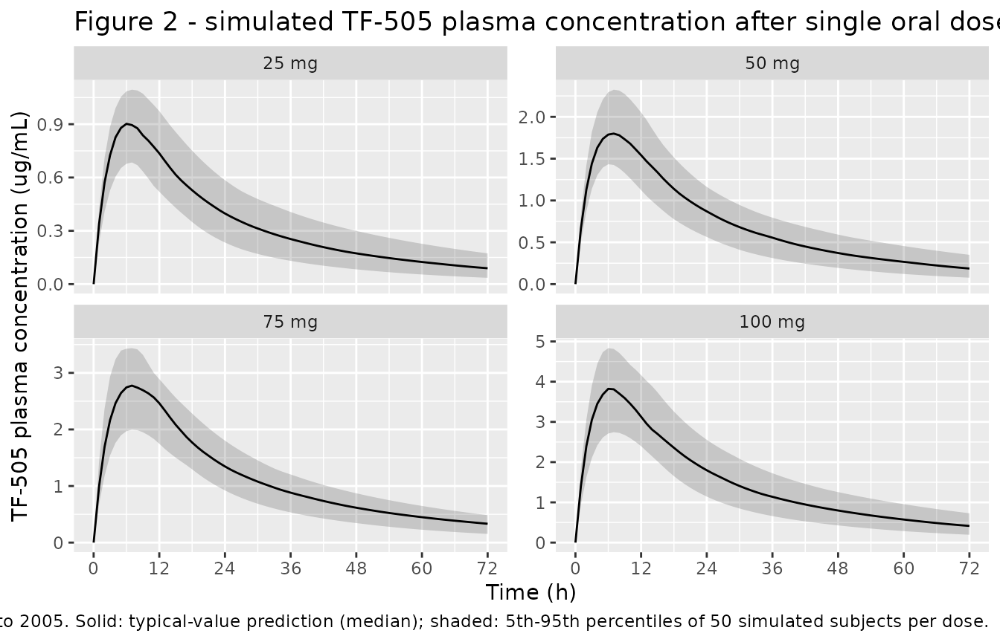
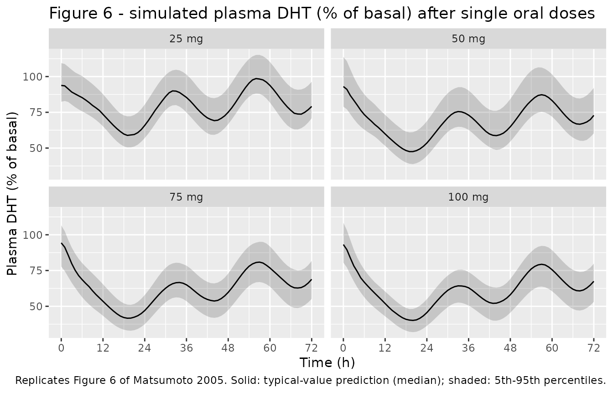
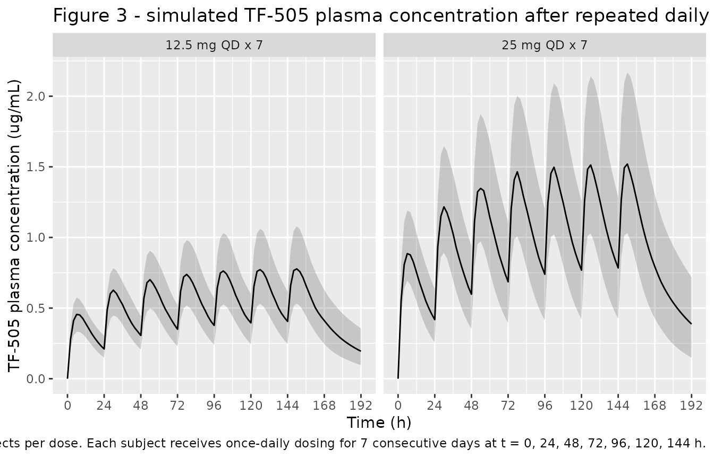

# TF-505 (Matsumoto 2005)

## Model and source

- Citation: Matsumoto Y, Fujita T, Ishida Y, Shimizu M, Kakuo H,
  Yamashita K, Majima M, Kumagai Y. Population
  Pharmacokinetic-Pharmacodynamic Modeling of TF-505 Using Extension of
  Indirect Response Model by Incorporating a Circadian Rhythm in Healthy
  Volunteers. Biol Pharm Bull. 2005;28(8):1455-1461.
  <doi:10.1248/bpb.28.1455>
- Description: Two-compartment first-order-absorption population PK
  model for the oral 5-alpha-reductase inhibitor TF-505 coupled to an
  indirect-response PD model for plasma dihydrotestosterone (DHT,
  expressed as percent of basal) in which the DHT synthesis rate kin is
  modulated by a 24-h circadian cosine; fit to single- and multiple-dose
  data from healthy adult male Japanese volunteers (Matsumoto 2005).
- Article: [Biol Pharm Bull.
  2005;28(8):1455-1461](https://doi.org/10.1248/bpb.28.1455)

## Population

The study enrolled 36 healthy adult male Japanese volunteers, divided
into six dose groups of six subjects each (Matsumoto 2005 Table 1). The
first four groups received single oral doses of TF-505 (25, 50, 75 or
100 mg) at 9 a.m. without breakfast. The two remaining groups received
repeated oral doses (12.5 or 25 mg) once daily for 7 days at 9 a.m.
after breakfast. Inclusion required age \>=20 years (for the low
single-dose groups 25 and 50 mg) or \>=40 years (for the high
single-dose 75 / 100 mg groups and both multiple-dose groups), and body
weight within 20% of ideal. Group mean ages ranged 22.8-52.5 years
(overall span 20-64 y) and group mean weights ranged 61.1-65.7 kg
(overall span 49.6-72.3 kg).

The population metadata is available programmatically:

``` r

rxode2::rxode(readModelDb("Matsumoto_2005_TF_505"))$meta$population
#> ℹ parameter labels from comments will be replaced by 'label()'
#> $species
#> [1] "human"
#> 
#> $n_subjects
#> [1] 36
#> 
#> $n_studies
#> [1] 1
#> 
#> $age_range
#> [1] "20-64 years"
#> 
#> $age_median
#> NULL
#> 
#> $weight_range
#> [1] "49.6-72.3 kg"
#> 
#> $weight_median
#> NULL
#> 
#> $sex_female_pct
#> [1] 0
#> 
#> $race_ethnicity
#> Japanese 
#>      100 
#> 
#> $disease_state
#> [1] "Healthy adult male Japanese volunteers"
#> 
#> $dose_range
#> [1] "Single 25, 50, 75, 100 mg p.o.; multiple 12.5 or 25 mg p.o. QD x 7 days"
#> 
#> $regions
#> [1] "Japan"
#> 
#> $notes
#> [1] "Inclusion: males aged >=20 years (low single-dose groups 25 and 50 mg) or >=40 years (high single-dose 75 / 100 mg, and both multiple-dose groups); body weight within 20% of ideal. Single-dose groups dosed at 9 a.m. without breakfast; multiple-dose groups dosed at 9 a.m. after breakfast. Smoking allowed but stopped 1 h pre- through 24 h post-dose. Caffeine, alcohol and grapefruit prohibited. 564 plasma TF-505 and 264 plasma DHT measurements were used in the joint fit."
```

## Source trace

The per-parameter origin is recorded as an in-file comment next to each
`ini()` entry in `inst/modeldb/specificDrugs/Matsumoto_2005_TF_505.R`.
The table below collects them in one place.

| Equation / parameter | Value | Source location |
|----|----|----|
| Two-compartment PK with first-order absorption | n/a | Matsumoto 2005 Results ‘Pharmacokinetic and Pharmacodynamic Model’ (PK Model 2 in Table 2 was selected) |
| Indirect-response PD on DHT with inhibition of input | n/a | Matsumoto 2005 Eq. (1) |
| Circadian kin = Rm + Ramp \* cos(2*pi*(t - Tz)/24) | n/a | Matsumoto 2005 Eq. (2); PD Model 5 in Table 3 was selected |
| ka | 0.197 1/h | Table 4 |
| ke | 0.0678 1/h | Table 4 (reparameterised to lcl = log(ke\*Vc)) |
| Vc | 12.5 L | Table 4 |
| k12 | 0.0645 1/h | Table 4 |
| k21 | 0.0723 1/h | Table 4 |
| IC50 | 1.01 ug/mL | Table 4 |
| kout | 0.221 1/h | Table 4 |
| Rm | 20.4 %/h | Table 4 |
| Ramp | 5.06 %/h | Table 4 |
| Tz (acrophase) | 5.01 h | Table 4 |
| Imax | 0.706 | Table 4 |
| IIV omega^2 (ka, ke, Vc, k12, kout, Rm, Tz, Imax) | various | Table 4 ‘Inter-individual variability’ column (k21, IC50, Ramp fixed at 0 per footnote a) |
| Residual sigma^2 (PK 0.191, PD 0.0419) | n/a | Table 4 ‘Intra-individual residual variability’ (CV per text: 43.70% PK, 20.47% PD) |

## Virtual cohort

The vignette uses small virtual cohorts (50 subjects per dose group)
that mirror the trial’s single-dose arms (25, 50, 75 and 100 mg p.o.).
The trial recruited Japanese male volunteers in tight body-weight and
age ranges and the published popPK / popPD model carries no covariate
effects, so the cohort needs no demographic columns.

``` r

set.seed(723)

make_single_dose_cohort <- function(n, dose_mg, id_offset = 0L) {
  # one dosing row + a 73-point observation grid (0-72 h post-dose)
  ids <- id_offset + seq_len(n)
  obs_grid <- seq(0, 72, by = 1)
  dose <- tibble(
    id   = ids,
    time = 0,
    amt  = dose_mg,
    rate = 0,
    cmt  = "depot",
    evid = 1L,
    dose_group = sprintf("%g mg", dose_mg)
  )
  obs <- tidyr::expand_grid(
    id = ids,
    time = obs_grid
  ) |>
    mutate(
      amt  = 0,
      rate = 0,
      cmt  = "Cc",
      evid = 0L,
      dose_group = sprintf("%g mg", dose_mg)
    )
  bind_rows(dose, obs) |>
    arrange(id, time, desc(evid))
}

dose_levels <- c(25, 50, 75, 100)
events_sd <- bind_rows(lapply(seq_along(dose_levels), function(i) {
  make_single_dose_cohort(n = 50L, dose_mg = dose_levels[i],
                          id_offset = (i - 1L) * 50L)
}))

stopifnot(!anyDuplicated(unique(events_sd[, c("id", "time", "evid")])))
```

## Simulation - single doses

``` r

mod <- rxode2::rxode(readModelDb("Matsumoto_2005_TF_505"))
#> ℹ parameter labels from comments will be replaced by 'label()'

sim_sd <- rxode2::rxSolve(
  mod,
  events = events_sd,
  keep   = "dose_group",
  returnType = "data.frame"
) |>
  mutate(dose_group = factor(dose_group,
                             levels = sprintf("%g mg", dose_levels)))
```

## Replicate Figure 2 - single-dose TF-505 plasma concentration

``` r

sim_sd_summary <- sim_sd |>
  group_by(dose_group, time) |>
  summarise(
    Q05 = quantile(Cc, 0.05, na.rm = TRUE),
    Q50 = quantile(Cc, 0.50, na.rm = TRUE),
    Q95 = quantile(Cc, 0.95, na.rm = TRUE),
    .groups = "drop"
  )

ggplot(sim_sd_summary, aes(time, Q50)) +
  geom_ribbon(aes(ymin = Q05, ymax = Q95), alpha = 0.20) +
  geom_line() +
  facet_wrap(~dose_group, scales = "free_y") +
  scale_x_continuous(breaks = seq(0, 72, by = 12)) +
  labs(
    x = "Time (h)",
    y = "TF-505 plasma concentration (ug/mL)",
    title = "Figure 2 - simulated TF-505 plasma concentration after single oral doses",
    caption = "Replicates Figure 2 of Matsumoto 2005. Solid: typical-value prediction (median); shaded: 5th-95th percentiles of 50 simulated subjects per dose."
  )
```



## Replicate Figure 6 - single-dose plasma DHT (% basal)

``` r

sim_sd_dht <- sim_sd |>
  group_by(dose_group, time) |>
  summarise(
    Q05 = quantile(DHT, 0.05, na.rm = TRUE),
    Q50 = quantile(DHT, 0.50, na.rm = TRUE),
    Q95 = quantile(DHT, 0.95, na.rm = TRUE),
    .groups = "drop"
  )

ggplot(sim_sd_dht, aes(time, Q50)) +
  geom_ribbon(aes(ymin = Q05, ymax = Q95), alpha = 0.20) +
  geom_line() +
  facet_wrap(~dose_group) +
  scale_x_continuous(breaks = seq(0, 72, by = 12)) +
  labs(
    x = "Time (h)",
    y = "Plasma DHT (% of basal)",
    title = "Figure 6 - simulated plasma DHT (% of basal) after single oral doses",
    caption = "Replicates Figure 6 of Matsumoto 2005. Solid: typical-value prediction (median); shaded: 5th-95th percentiles."
  )
```



## Replicate Figure 3 - multiple-dose TF-505 plasma concentration

``` r

make_multidose_cohort <- function(n, dose_mg, n_doses = 7L, dose_interval_h = 24,
                                  obs_end = 192, id_offset = 0L) {
  ids <- id_offset + seq_len(n)
  dose_times <- (seq_len(n_doses) - 1L) * dose_interval_h
  doses <- tidyr::expand_grid(id = ids, time = dose_times) |>
    mutate(
      amt  = dose_mg,
      rate = 0,
      cmt  = "depot",
      evid = 1L,
      dose_group = sprintf("%g mg QD x %d", dose_mg, n_doses)
    )
  obs <- tidyr::expand_grid(
    id = ids,
    time = seq(0, obs_end, by = 2)
  ) |>
    mutate(
      amt  = 0,
      rate = 0,
      cmt  = "Cc",
      evid = 0L,
      dose_group = sprintf("%g mg QD x %d", dose_mg, n_doses)
    )
  bind_rows(doses, obs) |>
    arrange(id, time, desc(evid))
}

md_levels <- c(12.5, 25)
events_md <- bind_rows(lapply(seq_along(md_levels), function(i) {
  make_multidose_cohort(n = 50L, dose_mg = md_levels[i],
                        id_offset = 1000L + (i - 1L) * 50L)
}))

sim_md <- rxode2::rxSolve(
  mod,
  events = events_md,
  keep   = "dose_group",
  returnType = "data.frame"
) |>
  mutate(dose_group = factor(dose_group,
                             levels = sprintf("%g mg QD x %d", md_levels, 7L)))

sim_md_summary <- sim_md |>
  group_by(dose_group, time) |>
  summarise(
    Q05 = quantile(Cc, 0.05, na.rm = TRUE),
    Q50 = quantile(Cc, 0.50, na.rm = TRUE),
    Q95 = quantile(Cc, 0.95, na.rm = TRUE),
    .groups = "drop"
  )

ggplot(sim_md_summary, aes(time, Q50)) +
  geom_ribbon(aes(ymin = Q05, ymax = Q95), alpha = 0.20) +
  geom_line() +
  facet_wrap(~dose_group) +
  scale_x_continuous(breaks = seq(0, 192, by = 24)) +
  labs(
    x = "Time (h)",
    y = "TF-505 plasma concentration (ug/mL)",
    title = "Figure 3 - simulated TF-505 plasma concentration after repeated daily oral doses",
    caption = "Replicates Figure 3 of Matsumoto 2005. Solid: median; shaded: 5th-95th percentiles of 50 simulated subjects per dose. Each subject receives once-daily dosing for 7 consecutive days at t = 0, 24, 48, 72, 96, 120, 144 h."
  )
```



## PKNCA validation

The paper reports preliminary NCA for the single-dose arms (Matsumoto
2005 Results ‘Pharmacokinetic and Pharmacodynamic Model’ paragraph 1):
Tmax, Cmax and AUC0-72. We run PKNCA on the simulated single-dose
cohorts and compare against the published values.

``` r

sim_nca <- sim_sd |>
  filter(!is.na(Cc), time > 0 | time == 0) |>
  select(id, time, Cc, dose_group)

conc_obj <- PKNCA::PKNCAconc(sim_nca, Cc ~ time | dose_group + id)

dose_df <- events_sd |>
  filter(evid == 1L) |>
  select(id, time, amt, dose_group)

dose_obj <- PKNCA::PKNCAdose(dose_df, amt ~ time | dose_group + id)

intervals <- data.frame(
  start      = 0,
  end        = 72,
  cmax       = TRUE,
  tmax       = TRUE,
  auclast    = TRUE
)

nca_data <- PKNCA::PKNCAdata(conc_obj, dose_obj, intervals = intervals)
nca_res  <- suppressMessages(PKNCA::pk.nca(nca_data))

nca_tbl <- as.data.frame(nca_res$result) |>
  filter(PPTESTCD %in% c("cmax", "tmax", "auclast")) |>
  group_by(dose_group, PPTESTCD) |>
  summarise(mean = mean(PPORRES, na.rm = TRUE),
            sd   = sd(PPORRES, na.rm = TRUE),
            .groups = "drop") |>
  mutate(value = sprintf("%.2f \U00B1 %.2f", mean, sd)) |>
  select(dose_group, PPTESTCD, value) |>
  tidyr::pivot_wider(names_from = PPTESTCD, values_from = value)

knitr::kable(
  nca_tbl,
  caption = "Simulated single-dose NCA parameters by dose group (mean +/- SD over 50 virtual subjects)."
)
```

| dose_group | auclast        | cmax        | tmax        |
|:-----------|:---------------|:------------|:------------|
| 100 mg     | 109.38 ± 25.03 | 3.79 ± 0.68 | 6.80 ± 0.73 |
| 25 mg      | 25.10 ± 5.65   | 0.90 ± 0.13 | 6.60 ± 0.78 |
| 50 mg      | 53.12 ± 11.20  | 1.83 ± 0.28 | 6.80 ± 0.73 |
| 75 mg      | 82.05 ± 16.70  | 2.80 ± 0.52 | 6.94 ± 0.84 |

Simulated single-dose NCA parameters by dose group (mean +/- SD over 50
virtual subjects). {.table}

### Comparison against published NCA

The simulated values can be compared row-by-row against the published
values (Matsumoto 2005 Results paragraph 1):

| Dose   | Cmax (paper, ug/mL) | Tmax (paper, h) | AUC0-72 (paper, ug.h/mL) |
|--------|---------------------|-----------------|--------------------------|
| 25 mg  | 1.10 +/- 0.38       | 4.38 +/- 1.01   | 32.12 +/- 14.46          |
| 50 mg  | 2.45 +/- 0.70       | 5.47 +/- 2.34   | 76.95 +/- 15.96          |
| 75 mg  | 3.79 +/- 1.92       | 4.23 +/- 0.86   | 97.50 +/- 46.82          |
| 100 mg | 3.12 +/- 1.20       | 3.85 +/- 0.73   | 73.22 +/- 26.74          |

The paper notes (Results paragraph 1) that the 100 mg dose exhibits
*saturable absorption* relative to lower doses, producing lower Cmax and
AUC than expected from linear dose scaling. The packaged model is a
purely linear two-compartment PK model with first-order absorption (the
published final PK model; saturable Michaelis-Menten absorption was a
candidate in PK Model 3 / 4 in Table 2 but was not selected), so the
simulation predicts dose-proportional Cmax and AUC. Reviewers comparing
simulated and observed values for the 100 mg arm should expect the
simulation to over-predict Cmax / AUC at 100 mg by the proportion
corresponding to the saturable-absorption observation in the data. This
is the model’s intended behaviour, not a translation error.

## Assumptions and deviations

- **Reparameterisation from micro-rate-constants to canonical CL / Vc /
  Q / Vp form.** Matsumoto 2005 reports PK parameters as the micro-rate
  constants `ka`, `ke`, `Vc`, `k12`, `k21`. The packaged model
  reparameterises to the nlmixr2lib canonical `lcl`, `lvc`, `lk12`,
  `lk21` primaries (with `kel = cl / vc` recovered inside `model()`).
  Typical-value predictions are exact:
  `CL_pop = ke_pop * Vc_pop = 0.0678 * 12.5 = 0.8475 L/h`. To preserve
  the paper’s underlying log-normal IIV structure on the original
  primaries (`eta_ke`, `eta_Vc` independent per Methods
  ‘Pharmacostatistical Models’), the canonical encoding uses a 2x2
  covariance block on `(etalcl, etalvc)` with
  `var(etalcl) = var(eta_ke) + var(eta_Vc) = 0.0481 + 0.0180 = 0.0661`,
  `cov(etalcl, etalvc) = var(eta_Vc) = 0.0180`, `var(etalvc) = 0.0180`.
  This block is positive-definite (determinant 8.66e-4) and reproduces
  every marginal CV in Table 4 exactly:
  `CV(CL) = sqrt(exp(0.0661) - 1) = 26.13%`,
  `CV(Vc) = sqrt(exp(0.0180) - 1) = 13.48%`,
  `CV(kel = CL/Vc) = sqrt(exp(var(etalcl) - 2*cov + var(etalvc)) - 1) = sqrt(exp(0.0481) - 1) = 22.20%`
  (paper text: 21.93%, matches within rounding).
- **k21, IC50, Ramp IIVs fixed at zero.** Matsumoto 2005 Table 4
  footnote a notes ‘Fixed at zero due to small variance estimates’ for
  these three parameters in preliminary analysis (\<10^-8). The packaged
  model encodes them as fixed-effect parameters with no associated eta
  term.
- **Initial DHT condition.** The paper expresses DHT data as a percent
  of basal; the no-drug steady-state of the model is
  `Rm / kout = 20.4 / 0.221 = 92.31%`. The packaged model initialises
  `dht(0) = rm / kout` so the simulation starts in (non-circadian)
  quasi-steady state. The circadian oscillation is established by the
  ODE within the first ~10-15 h. Users who prefer to start at the
  by-definition `100%` can pass `inits = c(dht = 100)` to `rxSolve()`;
  the model converges to the same circadian limit cycle either way.
- **Acrophase Tz IIV on log scale.** Matsumoto 2005 Methods states all
  PK and PD IIVs are log-normal, including the acrophase Tz. The
  canonical `ltacro` (log-transformed acrophase) preserves this encoding
  directly. The 8.37% reported CV on Tz translates to omega^2 = log(1 +
  0.0837^2) = 0.00700 on the log scale, matching Table 4.
- **Saturable absorption at 100 mg not encoded.** The paper notes
  (Results paragraph 1; Discussion) that the 100 mg dose appears to show
  saturation of absorption (lower observed Cmax / AUC than the linear
  dose-extrapolation prediction). The final PK model selected (PK Model
  2 in Table 2) is linear; the candidate Michaelis-Menten absorption
  models (PK Models 3 and 4) had similar OFV but were not selected. The
  packaged model reproduces the published final PK model, so the
  simulation will over-predict 100 mg Cmax / AUC by the fraction
  corresponding to this saturation.
- **No covariates retained.** Matsumoto 2005 does not include any
  covariate effects in the final PK or PD model. The package
  `covariateData` list is therefore empty.
- **DHT ‘paper-specific’ compartment.** The `dht` state is declared via
  `paper_specific_compartments` since it is a paper-mechanistic
  biomarker state without a canonical equivalent (analogous to `nefa` in
  `Ahlstrom_2010_nicotinicAcid_rat`, which is registered separately in
  `R/conventions.R`).
