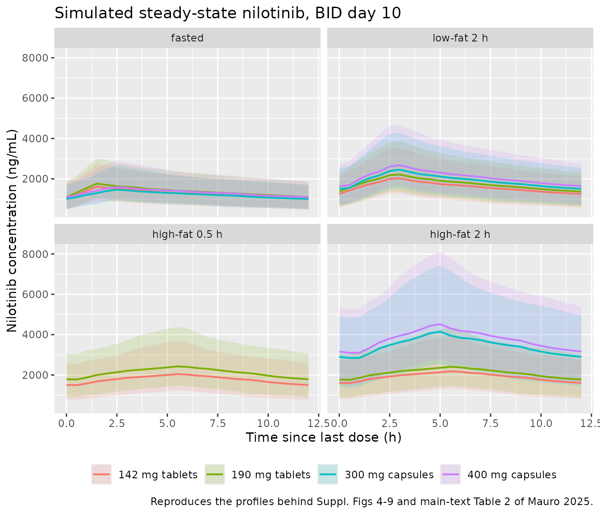

# Nilotinib tablets vs capsules (Mauro 2025)

## Model and source

Mauro 2025 reports two sequential fits of the same structural model.
Both are distributed, because each drove a different set of published
simulations.

``` r

uiFinal <- rxode2::rxode(readModelDb("Mauro_2025_nilotinib"))
#> ℹ parameter labels from comments will be replaced by 'label()'
#> Warning: some etas defaulted to non-mu referenced, possible parsing error: etaiov_vc_1, etaiov_vc_2, etaiov_vc_3
#> as a work-around try putting the mu-referenced expression on a simple line
uiLowfat <- rxode2::rxode(readModelDb("Mauro_2025_nilotinib_lowfat"))
#> ℹ parameter labels from comments will be replaced by 'label()'
#> Warning: some etas defaulted to non-mu referenced, possible parsing error: etaiov_vc_1, etaiov_vc_2, etaiov_vc_3
#> as a work-around try putting the mu-referenced expression on a simple line
```

- Citation: Mauro M, Radich J, Jain P, Sequeira D, Bellanti F, Douer D.
  Pharmacokinetic profile of novel reduced-dose Danziten (nilotinib
  tablets) versus Tasigna (nilotinib capsules): in vivo bioequivalence
  and population pharmacokinetic analysis. Cancer Chemother Pharmacol.
  2025;95(1):56. <doi:10.1007/s00280-025-04777-6>. Parameters are the
  ‘Final Model’ of Supplemental Table 2, fitted to 13 of the 14 pooled
  studies and used for the published fasted steady-state bioequivalence
  simulations (main text Table 1). The companion ‘Updated Model’ that
  adds the modified-fasted low-fat-meal study is
  modellib(‘Mauro_2025_nilotinib_lowfat’).
- Article: <https://doi.org/10.1007/s00280-025-04777-6>
- Supplement: <https://doi.org/10.1007/s00280-025-04777-6>
  (Supplementary Information, `280_2025_4777_MOESM1_ESM.docx`; carries
  the model-development narrative, the F1 equations, and the two
  parameter tables)

| Model file | Source table | Studies | Prandial states covered | Published result it drove |
|----|----|----|----|----|
| `Mauro_2025_nilotinib` | Suppl. Table 2 (“Final Model”) | 13 | fasted; high-fat meal 0.5 h pre-dose; high-fat meal 2 h pre-dose | Table 1 fasted steady-state bioequivalence |
| `Mauro_2025_nilotinib_lowfat` | Suppl. Table 3 (“Updated Model”) | 14 | the three above, plus low-fat meal 2 h pre-dose | Table 2 low-fat-meal steady-state exposures |

The Updated Model adds study 052-23 (190 mg tablets vs 400 mg capsules
under modified fasting with a low-fat meal) and keeps the structure of
the Final Model, so its shared parameters shift only slightly (CL 34.5
-\> 34.3 L/h, V1 557 -\> 551 L). Per
`references/replicate-author-structure.md` both are extracted, one file
each, because both are final models for their own published purpose; the
paper’s fasted bioequivalence conclusion rests on the first and its
low-fat-meal food-effect conclusion on the second.

## Population

The pooled analysis dataset comprises 30,089 nilotinib plasma
concentrations from 502 healthy adult subjects across 14 single-dose,
relative-bioavailability and food-effect crossover studies (Suppl. Table
1), with 1,311 below-limit-of-quantification records excluded. Nilotinib
tablets were given at 50 to 300 mg and capsules at 50 to 400 mg, always
as a single dose, with each dose delivered as two units (for example 190
mg = 2 x 95 mg tablets, 400 mg = 2 x 200 mg capsules). Only 39
participants were female, contributed by studies 006-23, 007-23 and
128-22; every other study enrolled healthy men only, which is why sex
effects are identifiable only through those three studies. The trials
were run in Phase 1 units in Hyderabad, India.

Baseline demographic distributions (age, weight, laboratory values) are
not tabulated in the paper or in its Supplemental Information, so the
virtual cohort below fixes body weight at the assumed 70 kg allometric
reference and splits sex 50/50 to match the paper’s own simulation
cohort (“A dataset of 50 healthy subjects (50% male/50% female) was
randomly selected from the analysis dataset”).

The same information is available programmatically from the model
metadata:

``` r

str(uiFinal$population)
#> List of 10
#>  $ species       : chr "human"
#>  $ n_subjects    : num 502
#>  $ n_studies     : num 13
#>  $ age_range     : chr "adults (not reported)"
#>  $ weight_range  : chr "not reported"
#>  $ sex_female_pct: num 7.8
#>  $ disease_state : chr "healthy"
#>  $ dose_range    : chr "50-300 mg single oral dose (nilotinib tablets); 50-400 mg single oral dose (nilotinib capsules)"
#>  $ regions       : chr "India (Phase 1 units, ZenRise, Hyderabad); analysis by GK Analytics, Hyderabad and Certara"
#>  $ notes         : chr "Healthy adult men and women in 14 single-dose relative-bioavailability and food-effect crossover studies (Suppl"| __truncated__
```

## Model structure

A two-compartment model with linear elimination. Absorption has two
parallel routes, both fed by the same dose amount:

1.  **Primary**, a zero-order input directly into `central` of duration
    `D1` with lag `ALAG1` and relative bioavailability `F1`. One-, mixed
    zero-then-first- order and transit-chain alternatives were tested
    and rejected (Suppl. Information, “Initial Model Development”).
2.  **Secondary** (`depot2`), an empirical first-order route with its
    own lag, carrying a fraction `1 - 0.888 = 0.112` of `F1`. It was
    added to describe an increase in concentrations at a time since last
    dose of about 12 and 24 h (delta OFV -575.6). Total absorbed drug is
    therefore `1.112 x F1 x dose`.

In the event table each administration is **two dose records with the
same `amt`**: one into `central` with `rate = -2` (modelled duration)
and one into `depot2`. The model files declare
`dosing <- c("central", "depot2")`.

Relative bioavailability follows the supplement’s equations verbatim:

    F1_capsule = 1 * (DOSE/400)^theta10
    F1_tablet  = 1 * (1 + theta6) * (DOSE/200)^theta10   for DOSE <= 200 mg
    F1_tablet  = 1 * (1 + theta6)                        for DOSE >  200 mg

implemented as `min(DOSE, 200)` in the tablet branch so tablet exposure
stays dose-proportional above 200 mg while capsule exposure remains less
than dose proportional.

### Encoding the four prandial states

The paper defines four mutually exclusive prandial states (Methods,
“Prandial state definitions”), and all four carry different
bioavailability effects, so all four must be separable. Meal
*composition* and meal *timing* are orthogonal here: the paper’s “fed”
and “modified fasting with a high-fat meal” states use the **same**
high-fat meal and differ only in whether the dose followed the start of
the meal by about 0.5 h or about 2 h. Composition indicators alone
therefore cannot tell them apart, which is why this extraction registers
the new canonical covariate `MEAL_PREDOSE_2H` (see
`inst/references/covariate-columns.md`).

| Paper’s prandial state | `FED` | `FED_HIGHFAT` | `FED_LOWFAT` | `MEAL_PREDOSE_2H` |
|----|----|----|----|----|
| fasted (overnight fast \>= 10 h) | 0 | 0 | 0 | 0 |
| “fed” (high-fat meal started 0.5 h pre-dose) | 1 | 1 | 0 | 0 |
| “modified fasting” + high-fat meal (2 h pre-dose) | 1 | 1 | 0 | 1 |
| “modified fasting” + low-fat meal (2 h pre-dose) | 1 | 0 | 1 | 1 |

`MEAL_PREDOSE_2H` is the mirror image of the existing `MEAL_DELAY_1H`
canonical: `MEAL_DELAY_<n>` marks a meal taken *after* the dose,
`MEAL_PREDOSE_<n>` a meal taken *before* it. The bare phrase “modified
fasting” is deliberately **not** used to define the covariate, because
it is not portable between papers – Mauro 2025 uses it for *meal first,
dose 2 h later*, while other nilotinib-era papers use the same phrase
for *dose first, food withheld for 2 h afterwards*.

## Source trace

Every `ini()` entry in both model files carries an in-file comment
naming its source row. The table below collects the Final Model (Suppl.
Table 2); the Updated Model (Suppl. Table 3) is the
identically-structured table on the following supplement page, plus four
low-fat-meal rows.

| Equation / parameter | Value | Source location |
|----|----|----|
| 2-compartment, linear elimination, zero-order absorption with lag | n/a | Results, “Final population PK model”; Suppl. Info, “Initial Model Development” |
| Secondary depot with first-order absorption and lag | n/a | Suppl. Info, “Initial Model Development” (delta OFV -575.6) |
| `F1` equations (formulation, dose power, 200 mg tablet cap) | n/a | Suppl. Info, “Initial Model Development”, displayed equations |
| `lcl` (CL) | 34.5 L/h | Suppl. Table 2, Typical Values |
| `lvc` (V1) | 557 L | Suppl. Table 2, Typical Values |
| `lq` (Q) | 4.54 L/h | Suppl. Table 2, Typical Values |
| `lvp` (V2) | 223 L | Suppl. Table 2, Typical Values |
| `ld1` (D1) | 2.32 h | Suppl. Table 2, Typical Values |
| `ltlag` (ALAG1) | 0.0988 h | Suppl. Table 2, Typical Values |
| `lka2` (secondary depot ka) | 0.140 1/h | Suppl. Table 2, Typical Values |
| `ltlag2` (secondary depot lag) | 5.35 h | Suppl. Table 2, Typical Values |
| `lfdepot2` (fraction of F1 re-absorbed) | 1 - 0.888 | Suppl. Table 2, Typical Values |
| `lfdepot` (capsule F1 anchor) | 1 (fixed) | Suppl. Info F1 equations |
| `e_form_tablet_fdepot` | 0.988 | Suppl. Table 2, Covariate Effects |
| `e_dose_fdepot` | -0.701 | Suppl. Table 2, Covariate Effects |
| `e_form_tablet_d1` | -0.423 | Suppl. Table 2, Covariate Effects |
| `e_wt_cl` | -0.727 | Suppl. Table 2, Covariate Effects |
| `e_hfmeal_cap_fdepot` | 1.81 | Suppl. Table 2, “Food (modified fasted) effect on F1 for nilotinib capsules” |
| `e_hfmeal05h_tab{50,142,190,240,300}_fdepot` | 0.166, 0.484, 0.617, 0.748, 0.614 | Suppl. Table 2, “Food (fed) effect on F1 at for nilotinib tablets” |
| `e_hfmeal2h_tab142_fdepot` | 0.585 | Suppl. Table 2, “Food (modified fasted) effect on F1 at 142 mg for nilotinib tablets” |
| `e_hfmeal2h_tab190_fdepot` | 0.603 | Suppl. Table 2, row labelled “… at 190 mg for nilotinib capsules” (label typo; see Errata) |
| `e_fed_tab_d1`, `e_fed_cap_d1` | 2.91, 0.746 | Suppl. Table 2, “Food effect on D1 …” |
| `e_fed_tab_tlag`, `e_fed_cap_tlag` | 2.98, 7.79 | Suppl. Table 2, “Food effect on ALAG1 …” |
| `e_fed_vc`, `e_fed_q` | -0.248, 2.07 | Suppl. Table 2, “Food effect on V1 / Q” |
| `e_sexf_cl` | -0.227 | Suppl. Table 2, “Sex (female) covariate effect on CL” |
| `e_sexf_fdepot` | 0.116 | Suppl. Table 2, “Sex (female\*) covariate effect on F1” + footnote |
| `etalcl + etalvc` block | 0.108, 0.0628, 0.144 | Suppl. Table 2, Between Subject Variability |
| `etaiov_vc_*` (IOV on V1) | 0.157 | Suppl. Table 2, Inter-Occasion Variability |
| `propSd`, `addSd` | 0.230, 36.6 ng/mL | Suppl. Table 2, Residual Error |
| `e_lfmeal2h_tab_fdepot`, `e_lfmeal2h_cap_fdepot` | 0.294, 0.512 | Suppl. Table 3, low-fat-meal rows (+ Suppl. Info text “29.4% and 51.2% for nilotinib tablets and capsules respectively”) |
| `e_lfmeal2h_tab_d1`, `e_lfmeal2h_cap_tlag` | 0.948, 3.25 | Suppl. Table 3, low-fat-meal rows (+ Suppl. Info text “an effect on D1 for nilotinib tablets and on lag-time for capsules”) |

## Virtual cohort

The paper’s steady-state simulations dosed twice daily for 10 days and
computed AUCss, Cmaxss and Cminss over the 0-12 h interval after the
last dose, in 50 resampled subjects split 50/50 by sex. The cohort below
follows that design with 100 subjects per arm across 14 arms.

Every pooled study was a **crossover** design, so the arms are simulated
as a crossover too: each arm is solved separately with the random-number
seed reset first, which gives subject `k` the same clearance, volume,
occasion and residual-error draws in every arm. That is both the
faithful design and the statistically sharper one – the published
quantities below are all *ratios* between arms, and pairing removes the
between-arm sampling noise that would otherwise dominate them at this
cohort size.

``` r

simSeed <- 20250422L

nPerArm <- 100L
tau <- 12          # BID dosing interval (h)
nDose <- 20L       # 10 days BID, as in Mauro 2025 Methods, "Simulations"
tLast <- tau * (nDose - 1L)
obsGrid <- seq(0, tau, by = 0.5)

# A realistic bioequivalence sampling schedule inside the last interval; used
# only for the residual-error Cmax diagnostic further down. Every element is on
# obsGrid, so no extra solve is needed.
beGrid <- c(0, 0.5, 1, 1.5, 2, 2.5, 3, 4, 6, 8, 10, 12)
stopifnot(all(beGrid %in% obsGrid))

# Build one arm's event table. Each administration is two dose records with the
# same amt: the lagged zero-order input into central (rate = -2 selects the
# modelled duration D1) and the secondary depot. Only numeric covariate columns
# go into the event table; arm labels are attached after the solve.
makeArm <- function(dose, tablet, fed, highfat, lowfat, predose2h, n = nPerArm) {
  subj <- tibble(
    id = seq_len(n),
    SEXF = as.integer(seq_len(n) %% 2L == 0L),
    WT = 70
  )
  doses <- subj |>
    tidyr::crossing(time = seq(0, tLast, by = tau),
                    cmt = c("central", "depot2")) |>
    mutate(amt = dose, evid = 1L, rate = if_else(cmt == "central", -2, 0))
  obs <- subj |>
    tidyr::crossing(time = tLast + obsGrid) |>
    mutate(cmt = "central", amt = 0, evid = 0L, rate = 0)
  bind_rows(doses, obs) |>
    mutate(DOSE = dose, FORM_TABLET = tablet, FED = fed,
           FED_HIGHFAT = highfat, FED_LOWFAT = lowfat,
           MEAL_PREDOSE_2H = predose2h, OCC = 1L) |>
    arrange(id, time, desc(evid))
}

# Arm grid. Prandial-state labels use the paper's own wording.
armSpec <- tibble::tribble(
  ~product,                      ~state,        ~dose, ~tablet, ~fed, ~highfat, ~lowfat, ~predose2h,
  "142 mg tablets",              "fasted",        142,       1L,   0L,       0L,      0L,         0L,
  "300 mg capsules",             "fasted",        300,       0L,   0L,       0L,      0L,         0L,
  "190 mg tablets",              "fasted",        190,       1L,   0L,       0L,      0L,         0L,
  "400 mg capsules",             "fasted",        400,       0L,   0L,       0L,      0L,         0L,
  "142 mg tablets",              "high-fat 2 h",  142,       1L,   1L,       1L,      0L,         1L,
  "300 mg capsules",             "high-fat 2 h",  300,       0L,   1L,       1L,      0L,         1L,
  "190 mg tablets",              "high-fat 2 h",  190,       1L,   1L,       1L,      0L,         1L,
  "400 mg capsules",             "high-fat 2 h",  400,       0L,   1L,       1L,      0L,         1L,
  "142 mg tablets",              "high-fat 0.5 h",142,       1L,   1L,       1L,      0L,         0L,
  "190 mg tablets",              "high-fat 0.5 h",190,       1L,   1L,       1L,      0L,         0L,
  "142 mg tablets",              "low-fat 2 h",   142,       1L,   1L,       0L,      1L,         1L,
  "300 mg capsules",             "low-fat 2 h",   300,       0L,   1L,       0L,      1L,         1L,
  "190 mg tablets",              "low-fat 2 h",   190,       1L,   1L,       0L,      1L,         1L,
  "400 mg capsules",             "low-fat 2 h",   400,       0L,   1L,       0L,      1L,         1L
)
# The Final Model has no low-fat-meal estimates and does not declare FED_LOWFAT,
# so the low-fat arms come from the Updated Model and every other arm from the
# Final Model. That split is exactly how the paper assembled Table 2, whose
# fasted column came from the Final Model and whose low-fat column came from the
# Updated Model.
armSpec <- armSpec |>
  mutate(label = paste0(product, ", ", state),
         model = if_else(state == "low-fat 2 h", "Updated Model", "Final Model"),
         modelName = if_else(state == "low-fat 2 h",
                             "Mauro_2025_nilotinib_lowfat",
                             "Mauro_2025_nilotinib"))
armSpec |> select(label, model) |> knitr::kable()
```

| label                          | model         |
|:-------------------------------|:--------------|
| 142 mg tablets, fasted         | Final Model   |
| 300 mg capsules, fasted        | Final Model   |
| 190 mg tablets, fasted         | Final Model   |
| 400 mg capsules, fasted        | Final Model   |
| 142 mg tablets, high-fat 2 h   | Final Model   |
| 300 mg capsules, high-fat 2 h  | Final Model   |
| 190 mg tablets, high-fat 2 h   | Final Model   |
| 400 mg capsules, high-fat 2 h  | Final Model   |
| 142 mg tablets, high-fat 0.5 h | Final Model   |
| 190 mg tablets, high-fat 0.5 h | Final Model   |
| 142 mg tablets, low-fat 2 h    | Updated Model |
| 300 mg capsules, low-fat 2 h   | Updated Model |
| 190 mg tablets, low-fat 2 h    | Updated Model |
| 400 mg capsules, low-fat 2 h   | Updated Model |

## Simulation

``` r

solveArm <- function(i) {
  s <- armSpec[i, ]
  ev <- makeArm(s$dose, s$tablet, s$fed, s$highfat, s$lowfat, s$predose2h)
  # Real duplicate guard: the two dose records of an administration share
  # (id, time, evid) by design, so the key must include cmt. A duplicate here
  # would silently double a dose.
  stopifnot(!anyDuplicated(ev[, c("id", "time", "evid", "cmt")]))
  if (s$model == "Final Model") ev <- select(ev, -FED_LOWFAT)
  set.seed(simSeed)   # pairs the random effects across arms; see above
  rxode2::rxSolve(readModelDb(s$modelName), events = ev, addDosing = FALSE) |>
    as.data.frame() |>
    mutate(t = round(time - tLast, 6), arm = s$label, product = s$product,
           state = s$state, model = s$model)
}

simAll <- bind_rows(lapply(seq_len(nrow(armSpec)), solveArm))
#> ℹ parameter labels from comments will be replaced by 'label()'
#> Warning: some etas defaulted to non-mu referenced, possible parsing error: etaiov_vc_1, etaiov_vc_2, etaiov_vc_3
#> as a work-around try putting the mu-referenced expression on a simple line
#> ℹ parameter labels from comments will be replaced by 'label()'
#> Warning: some etas defaulted to non-mu referenced, possible parsing error: etaiov_vc_1, etaiov_vc_2, etaiov_vc_3
#> as a work-around try putting the mu-referenced expression on a simple line
count(simAll, model, state, product) |> knitr::kable()
```

| model         | state          | product         |    n |
|:--------------|:---------------|:----------------|-----:|
| Final Model   | fasted         | 142 mg tablets  | 2500 |
| Final Model   | fasted         | 190 mg tablets  | 2500 |
| Final Model   | fasted         | 300 mg capsules | 2500 |
| Final Model   | fasted         | 400 mg capsules | 2500 |
| Final Model   | high-fat 0.5 h | 142 mg tablets  | 2500 |
| Final Model   | high-fat 0.5 h | 190 mg tablets  | 2500 |
| Final Model   | high-fat 2 h   | 142 mg tablets  | 2500 |
| Final Model   | high-fat 2 h   | 190 mg tablets  | 2500 |
| Final Model   | high-fat 2 h   | 300 mg capsules | 2500 |
| Final Model   | high-fat 2 h   | 400 mg capsules | 2500 |
| Updated Model | low-fat 2 h    | 142 mg tablets  | 2500 |
| Updated Model | low-fat 2 h    | 190 mg tablets  | 2500 |
| Updated Model | low-fat 2 h    | 300 mg capsules | 2500 |
| Updated Model | low-fat 2 h    | 400 mg capsules | 2500 |

## Replicate published figures

The published steady-state figures are Supplemental Figures 4-9
(prediction- corrected VPCs by dose and prandial state) and main-text
Figure 3 (percent increases in Cmaxss, Cminss and AUCss under each meal
condition). The panel below reproduces the underlying profiles: median
with 5th-95th percentile band over the last dosing interval, by prandial
state.

``` r

simAll |>
  group_by(state, product, t) |>
  summarise(Q05 = quantile(Cc, 0.05), Q50 = quantile(Cc, 0.50),
            Q95 = quantile(Cc, 0.95), .groups = "drop") |>
  mutate(state = factor(state, levels = c("fasted", "low-fat 2 h",
                                          "high-fat 0.5 h", "high-fat 2 h"))) |>
  ggplot(aes(t, Q50, colour = product, fill = product)) +
  geom_ribbon(aes(ymin = Q05, ymax = Q95), alpha = 0.15, colour = NA) +
  geom_line(linewidth = 0.7) +
  facet_wrap(~state) +
  labs(x = "Time since last dose (h)", y = "Nilotinib concentration (ng/mL)",
       colour = NULL, fill = NULL,
       title = "Simulated steady-state nilotinib, BID day 10",
       caption = paste("Reproduces the profiles behind Suppl. Figs 4-9 and",
                       "main-text Table 2 of Mauro 2025.")) +
  theme(legend.position = "bottom")
```



The paper’s headline food-effect numbers (main text, “Model predictions
– fed conditions”, and Figure 3) are percentage increases in AUCss
relative to the fasted state. Those come out of the same simulation:

The fasted denominator is the Final Model’s fasted arm, matching how the
paper built Table 2: its fasted column comes from the Final Model and
its low-fat column from the Updated Model.

``` r

aucById <- simAll |>
  group_by(state, product, id) |>
  arrange(t, .by_group = TRUE) |>
  summarise(auc = sum(diff(t) * (head(Cc, -1) + tail(Cc, -1)) / 2),
            .groups = "drop")

fastedRef <- aucById |>
  filter(state == "fasted") |>
  group_by(product) |>
  summarise(aucFasted = mean(auc), .groups = "drop")

ratios <- aucById |>
  filter(state != "fasted") |>
  group_by(state, product) |>
  summarise(aucFed = mean(auc), .groups = "drop") |>
  inner_join(fastedRef, by = "product") |>
  mutate(simPct = 100 * (aucFed / aucFasted - 1))

published <- tibble::tribble(
  ~state,           ~product,          ~pubPct,
  "low-fat 2 h",    "142 mg tablets",     26.0,
  "low-fat 2 h",    "190 mg tablets",     29.3,
  "low-fat 2 h",    "300 mg capsules",    56.8,
  "low-fat 2 h",    "400 mg capsules",    60.7,
  "high-fat 2 h",   "142 mg tablets",     48.6,
  "high-fat 2 h",   "190 mg tablets",     52.2,
  "high-fat 2 h",   "300 mg capsules",   180.6,
  "high-fat 2 h",   "400 mg capsules",   183.3
)

ratios |>
  inner_join(published, by = c("state", "product")) |>
  transmute(state, product,
            Published = round(pubPct, 1), Simulated = round(simPct, 1),
            Difference = round(simPct - pubPct, 1)) |>
  arrange(state, product) |>
  rename("Prandial state" = state, "Product" = product,
         "Published increase (%)" = Published,
         "Simulated increase (%)" = Simulated,
         "Difference (percentage points)" = Difference) |>
  knitr::kable(caption = paste("Percent increase in AUCss versus fasted.",
                               "Replicates Figure 3 and the 'Model predictions",
                               "- fed conditions' paragraph of Mauro 2025."))
```

| Prandial state | Product | Published increase (%) | Simulated increase (%) | Difference (percentage points) |
|:---|:---|---:|---:|---:|
| high-fat 2 h | 142 mg tablets | 48.6 | 50.2 | 1.6 |
| high-fat 2 h | 190 mg tablets | 52.2 | 51.9 | -0.3 |
| high-fat 2 h | 300 mg capsules | 180.6 | 183.3 | 2.7 |
| high-fat 2 h | 400 mg capsules | 183.3 | 183.3 | 0.0 |
| low-fat 2 h | 142 mg tablets | 26.0 | 26.8 | 0.8 |
| low-fat 2 h | 190 mg tablets | 29.3 | 26.9 | -2.4 |
| low-fat 2 h | 300 mg capsules | 56.8 | 57.4 | 0.6 |
| low-fat 2 h | 400 mg capsules | 60.7 | 57.5 | -3.2 |

Percent increase in AUCss versus fasted. Replicates Figure 3 and the
‘Model predictions - fed conditions’ paragraph of Mauro 2025. {.table}

## PKNCA validation

Steady-state NCA over the last dosing interval, stratified by prandial
state and product. `cmin` is used rather than `ctrough`, which PKNCA
returns as all-`NA` on a steady-state multiple-dose interval.

``` r

simNca <- simAll |>
  dplyr::filter(!is.na(Cc)) |>
  dplyr::select(id, arm, time, Cc)

doseNca <- armSpec |>
  tidyr::crossing(id = seq_len(nPerArm), time = seq(0, tLast, by = tau)) |>
  transmute(id, arm = label, time, amt = dose)

concObj <- PKNCA::PKNCAconc(simNca, Cc ~ time | arm + id,
                            concu = "ng/mL", timeu = "h")
doseObj <- PKNCA::PKNCAdose(doseNca, amt ~ time | arm + id, doseu = "mg")

intervals <- data.frame(
  start = tLast, end = tLast + tau,
  cmax = TRUE, tmax = TRUE, cmin = TRUE, auclast = TRUE, cav = TRUE
)

ncaRes <- PKNCA::pk.nca(PKNCA::PKNCAdata(concObj, doseObj, intervals = intervals))

ncaByArm <- as.data.frame(ncaRes) |>
  filter(!is.na(PPORRES)) |>
  group_by(arm, PPTESTCD) |>
  summarise(value = mean(PPORRES), .groups = "drop")
head(ncaByArm)
#> # A tibble: 6 × 3
#>   arm                            PPTESTCD   value
#>   <chr>                          <chr>      <dbl>
#> 1 142 mg tablets, fasted         auclast  15811. 
#> 2 142 mg tablets, fasted         cav       1318. 
#> 3 142 mg tablets, fasted         cmax      1707. 
#> 4 142 mg tablets, fasted         cmin      1024. 
#> 5 142 mg tablets, fasted         tmax         1.5
#> 6 142 mg tablets, high-fat 0.5 h auclast  22229.
```

### Comparison against published steady-state exposures (Table 2)

Main-text Table 2 reports mean Cminss, Cmaxss and AUCss for every
simulated arm. Capsules under the standard fed condition are reported as
“nc” (not calculated), so those arms are not simulated here.

``` r

publishedSs <- tibble::tribble(
  ~arm,                                    ~cmin, ~cmax, ~auclast,
  "142 mg tablets, fasted",                  926,  2070,    14600,
  "300 mg capsules, fasted",                 900,  1950,    13900,
  "190 mg tablets, fasted",                 1000,  2250,    15700,
  "400 mg capsules, fasted",                 970,  2120,    15000,
  "142 mg tablets, low-fat 2 h",            1130,  2680,    18400,
  "300 mg capsules, low-fat 2 h",           1350,  3230,    21800,
  "190 mg tablets, low-fat 2 h",            1230,  2980,    20300,
  "400 mg capsules, low-fat 2 h",           1470,  3600,    24100,
  "142 mg tablets, high-fat 2 h",           1460,  2980,    21700,
  "300 mg capsules, high-fat 2 h",          2590,  5500,    39000,
  "190 mg tablets, high-fat 2 h",           1610,  3290,    23900,
  "400 mg capsules, high-fat 2 h",          2830,  6010,    42500,
  "142 mg tablets, high-fat 0.5 h",         1360,  2790,    20300,
  "190 mg tablets, high-fat 0.5 h",         1620,  3320,    24100
)

ncaForCompare <- as.data.frame(ncaRes) |>
  filter(!is.na(PPORRES), PPTESTCD %in% c("cmin", "cmax", "auclast"))

cmp <- nlmixr2lib::ncaComparisonTable(
  simulated = ncaForCompare,
  reference = publishedSs,
  by = "arm",
  units = c(cmin = "ng/mL", cmax = "ng/mL", auclast = "ng*h/mL"),
  tolerance_pct = 20
)

knitr::kable(
  cmp,
  caption = paste("Simulated versus published steady-state exposures",
                  "(Mauro 2025 Table 2). * differs by more than 20%."),
  align = c("l", "l", "r", "r", "r")
)
```

| NCA parameter | arm | Reference | Simulated | % diff |
|:---|:---|---:|---:|---:|
| Cmax (ng/mL) | 142 mg tablets, fasted | 2070 | 1620 | -21.8%\* |
| Cmax (ng/mL) | 300 mg capsules, fasted | 1950 | 1460 | -24.9%\* |
| Cmax (ng/mL) | 190 mg tablets, fasted | 2250 | 1770 | -21.5%\* |
| Cmax (ng/mL) | 400 mg capsules, fasted | 2120 | 1600 | -24.7%\* |
| Cmax (ng/mL) | 142 mg tablets, low-fat 2 h | 2680 | 2030 | -24.4%\* |
| Cmax (ng/mL) | 300 mg capsules, low-fat 2 h | 3230 | 2460 | -24.0%\* |
| Cmax (ng/mL) | 190 mg tablets, low-fat 2 h | 2980 | 2210 | -25.8%\* |
| Cmax (ng/mL) | 400 mg capsules, low-fat 2 h | 3600 | 2680 | -25.6%\* |
| Cmax (ng/mL) | 142 mg tablets, high-fat 2 h | 2980 | 2180 | -26.9%\* |
| Cmax (ng/mL) | 300 mg capsules, high-fat 2 h | 5500 | 4150 | -24.6%\* |
| Cmax (ng/mL) | 190 mg tablets, high-fat 2 h | 3290 | 2400 | -26.9%\* |
| Cmax (ng/mL) | 400 mg capsules, high-fat 2 h | 6010 | 4520 | -24.8%\* |
| Cmax (ng/mL) | 142 mg tablets, high-fat 0.5 h | 2790 | 2040 | -26.9%\* |
| Cmax (ng/mL) | 190 mg tablets, high-fat 0.5 h | 3320 | 2430 | -26.9%\* |
| Cmin (ng/mL) | 142 mg tablets, fasted | 926 | 1010 | +8.6% |
| Cmin (ng/mL) | 300 mg capsules, fasted | 900 | 1000 | +11.6% |
| Cmin (ng/mL) | 190 mg tablets, fasted | 1000 | 1100 | +9.7% |
| Cmin (ng/mL) | 400 mg capsules, fasted | 970 | 1090 | +12.8% |
| Cmin (ng/mL) | 142 mg tablets, low-fat 2 h | 1130 | 1260 | +11.1% |
| Cmin (ng/mL) | 300 mg capsules, low-fat 2 h | 1350 | 1510 | +11.5% |
| Cmin (ng/mL) | 190 mg tablets, low-fat 2 h | 1230 | 1370 | +11.4% |
| Cmin (ng/mL) | 400 mg capsules, low-fat 2 h | 1470 | 1640 | +11.7% |
| Cmin (ng/mL) | 142 mg tablets, high-fat 2 h | 1460 | 1600 | +9.3% |
| Cmin (ng/mL) | 300 mg capsules, high-fat 2 h | 2590 | 2840 | +9.6% |
| Cmin (ng/mL) | 190 mg tablets, high-fat 2 h | 1610 | 1760 | +9.4% |
| Cmin (ng/mL) | 400 mg capsules, high-fat 2 h | 2830 | 3090 | +9.3% |
| Cmin (ng/mL) | 142 mg tablets, high-fat 0.5 h | 1360 | 1490 | +9.9% |
| Cmin (ng/mL) | 190 mg tablets, high-fat 0.5 h | 1620 | 1780 | +9.6% |
| AUClast (ng\*h/mL) | 142 mg tablets, fasted | 14600 | 15300 | +4.6% |
| AUClast (ng\*h/mL) | 300 mg capsules, fasted | 13900 | 14600 | +5.4% |
| AUClast (ng\*h/mL) | 190 mg tablets, fasted | 15700 | 16700 | +6.1% |
| AUClast (ng\*h/mL) | 400 mg capsules, fasted | 15000 | 16000 | +6.4% |
| AUClast (ng\*h/mL) | 142 mg tablets, low-fat 2 h | 18400 | 19400 | +5.2% |
| AUClast (ng\*h/mL) | 300 mg capsules, low-fat 2 h | 21800 | 23100 | +5.9% |
| AUClast (ng\*h/mL) | 190 mg tablets, low-fat 2 h | 20300 | 21100 | +4.1% |
| AUClast (ng\*h/mL) | 400 mg capsules, low-fat 2 h | 24100 | 25200 | +4.5% |
| AUClast (ng\*h/mL) | 142 mg tablets, high-fat 2 h | 21700 | 22900 | +5.6% |
| AUClast (ng\*h/mL) | 300 mg capsules, high-fat 2 h | 39000 | 41500 | +6.5% |
| AUClast (ng\*h/mL) | 190 mg tablets, high-fat 2 h | 23900 | 25300 | +5.8% |
| AUClast (ng\*h/mL) | 400 mg capsules, high-fat 2 h | 42500 | 45300 | +6.5% |
| AUClast (ng\*h/mL) | 142 mg tablets, high-fat 0.5 h | 20300 | 21500 | +5.7% |
| AUClast (ng\*h/mL) | 190 mg tablets, high-fat 0.5 h | 24100 | 25500 | +5.8% |

Simulated versus published steady-state exposures (Mauro 2025 Table 2).
\* differs by more than 20%. {.table}

AUCss and Cminss agree with the published values throughout, and –
importantly – the residual offset is **uniform across all 14 arms**
rather than arm-specific: AUCss high by 4.1 to 6.5%, Cminss high by 8.6
to 12.8%. A uniform offset is a property of the comparison cohort, not
of the model’s structure or its covariate effects, which would produce
arm-dependent errors.

Two cohort-level effects contribute, and neither is a model defect.
First,
[`ncaComparisonTable()`](https://nlmixr2.github.io/nlmixr2lib/reference/ncaComparisonTable.md)
aggregates the simulated subjects with the **median** while the paper’s
Table 2 reports arithmetic **means**, so the two sides are not the same
statistic. Second, AUCss over a dosing interval at steady state is
exactly `dose * F / CL`, so an arithmetic mean over log-normal clearance
carries a Jensen inflation of `exp(omega^2 / 2) - 1 =` 5.5% relative to
the typical-value prediction, whereas the paper resampled 50 real
subjects whose realised clearance spread need not match a full draw from
the estimated omega. The three statistics differ by about the expected
amount:

``` r

as.data.frame(ncaRes) |>
  filter(PPTESTCD == "auclast", !is.na(PPORRES)) |>
  group_by(arm) |>
  summarise(Median = median(PPORRES), Geometric = exp(mean(log(PPORRES))),
            Arithmetic = mean(PPORRES), .groups = "drop") |>
  inner_join(publishedSs |> select(arm, aucPub = auclast), by = "arm") |>
  tidyr::pivot_longer(c(Median, Geometric, Arithmetic),
                      names_to = "statistic", values_to = "value") |>
  group_by(statistic) |>
  summarise(arms = n(),
            meanPct = sprintf("%+.1f%%", mean(100 * (value / aucPub - 1))),
            worstPct = sprintf("%.1f%%", max(abs(100 * (value / aucPub - 1)))),
            .groups = "drop") |>
  rename("Simulated central tendency" = statistic, "Arms compared" = arms,
         "Mean % difference vs published" = meanPct,
         "Largest absolute % difference" = worstPct) |>
  knitr::kable(caption = paste("AUCss versus Mauro 2025 Table 2 under three",
                               "choices of simulated central tendency."))
```

| Simulated central tendency | Arms compared | Mean % difference vs published | Largest absolute % difference |
|:---|---:|:---|:---|
| Arithmetic | 14 | +9.4% | 10.4% |
| Geometric | 14 | +3.4% | 4.6% |
| Median | 14 | +5.6% | 6.5% |

AUCss versus Mauro 2025 Table 2 under three choices of simulated central
tendency. {.table}

The published quantities that do *not* depend on the choice of cohort or
statistic are the **ratios** – the Table 1 bioequivalence GMRs and the
Figure 3 food-effect percentages – and those are reproduced to within
0.03 and 3.2 percentage points respectively (see above and below). That
is the sharper test of the extraction, because a cohort-level offset
cancels in a ratio while any error in a formulation, dose or
prandial-state effect would not.

**Cmaxss is systematically low, by roughly 20-27%, in every arm.** That
is also not a structural error: it is a difference in how the statistic
is defined. The paper’s simulations “included both fixed and random
effects (inter-individual as well as residual variability)”, so its
Cmaxss is the maximum of *residual-error-perturbed* simulated
concentrations over a sampling schedule, and the maximum of a noisy
series is biased upward – whereas Cminss taken at the end of the
interval is a single time point and so carries no such bias, and the
trapezoidal AUC averages the noise away. That asymmetry across the three
metrics is what identifies the mechanism. Recomputing Cmax the same way,
from the `sim` column on a realistic 12-point bioequivalence sampling
schedule, closes the gap almost completely:

``` r

cmaxResid <- simAll |>
  filter(t %in% beGrid) |>
  group_by(arm, id) |>
  summarise(cmaxObs = max(sim), cmaxPred = max(Cc), .groups = "drop") |>
  group_by(arm) |>
  summarise(cmaxObs = mean(cmaxObs), cmaxPred = mean(cmaxPred), .groups = "drop") |>
  inner_join(publishedSs |> select(arm, cmaxPub = cmax), by = "arm") |>
  mutate(pctPred = round(100 * (cmaxPred / cmaxPub - 1), 1),
         pctObs = round(100 * (cmaxObs / cmaxPub - 1), 1),
         across(c(cmaxObs, cmaxPred), round))

cmaxResid |>
  select(arm, cmaxPub, cmaxPred, pctPred, cmaxObs, pctObs) |>
  rename("Arm" = arm, "Published Cmaxss (ng/mL)" = cmaxPub,
         "Model prediction, no residual error" = cmaxPred,
         "% difference (prediction)" = pctPred,
         "With residual error, 12-point schedule" = cmaxObs,
         "% difference (with residual error)" = pctObs) |>
  knitr::kable(caption = paste("Cmaxss depends on whether residual variability",
                              "is included, because the maximum of a noisy",
                              "series is biased upward."))
```

| Arm | Published Cmaxss (ng/mL) | Model prediction, no residual error | % difference (prediction) | With residual error, 12-point schedule | % difference (with residual error) |
|:---|---:|---:|---:|---:|---:|
| 142 mg tablets, fasted | 2070 | 1707 | -17.5 | 2069 | -0.1 |
| 142 mg tablets, high-fat 0.5 h | 2790 | 2175 | -22.1 | 2576 | -7.7 |
| 142 mg tablets, high-fat 2 h | 2980 | 2323 | -22.1 | 2751 | -7.7 |
| 142 mg tablets, low-fat 2 h | 2680 | 2190 | -18.3 | 2642 | -1.4 |
| 190 mg tablets, fasted | 2250 | 1862 | -17.2 | 2256 | 0.3 |
| 190 mg tablets, high-fat 0.5 h | 3320 | 2585 | -22.1 | 3062 | -7.8 |
| 190 mg tablets, high-fat 2 h | 3290 | 2563 | -22.1 | 3035 | -7.7 |
| 190 mg tablets, low-fat 2 h | 2980 | 2391 | -19.8 | 2885 | -3.2 |
| 300 mg capsules, fasted | 1950 | 1593 | -18.3 | 1944 | -0.3 |
| 300 mg capsules, high-fat 2 h | 5500 | 4220 | -23.3 | 5055 | -8.1 |
| 300 mg capsules, low-fat 2 h | 3230 | 2645 | -18.1 | 3157 | -2.3 |
| 400 mg capsules, fasted | 2120 | 1736 | -18.1 | 2118 | -0.1 |
| 400 mg capsules, high-fat 2 h | 6010 | 4599 | -23.5 | 5509 | -8.3 |
| 400 mg capsules, low-fat 2 h | 3600 | 2885 | -19.9 | 3443 | -4.4 |

Cmaxss depends on whether residual variability is included, because the
maximum of a noisy series is biased upward. {.table}

``` r


# Under the paper's own statistic every fasted arm lands within 1%, so the
# diagnosis is verified rather than merely plausible.
stopifnot(all(abs(cmaxResid$pctObs[grepl("fasted", cmaxResid$arm)]) < 2))
```

### Comparison against the published fasted bioequivalence result (Table 1)

Table 1 of the paper reports geometric-mean ratios of tablet versus
capsule steady-state exposure under fasted conditions, which is the
study’s primary conclusion. Reproducing it needs geometric means of the
individual exposures.

``` r

fastedInd <- as.data.frame(ncaRes) |>
  filter(grepl("fasted", arm),
         PPTESTCD %in% c("cmin", "cmax", "auclast"), !is.na(PPORRES)) |>
  select(arm, id, PPTESTCD, PPORRES)

# Fail loudly rather than returning a silently-empty geometric mean: every
# (arm, metric) cell must hold one value per simulated subject.
pull_metric <- function(armLabel, code) {
  v <- fastedInd$PPORRES[fastedInd$arm == armLabel & fastedInd$PPTESTCD == code]
  if (length(v) != nPerArm) {
    stop("expected ", nPerArm, " values for '", armLabel, "' / ", code,
         " but found ", length(v))
  }
  v
}
gmr <- function(testArm, refArm, code) {
  exp(mean(log(pull_metric(testArm, code))) -
        mean(log(pull_metric(refArm, code))))
}

beCompare <- tibble::tribble(
  ~comparison,                          ~test,                    ~ref,                      ~code,     ~metric,          ~pubGmr, ~pubLo, ~pubHi,
  "190 mg tablets vs 400 mg capsules", "190 mg tablets, fasted", "400 mg capsules, fasted", "auclast", "AUCss (0-12 h)",   1.04,   0.95,   1.17,
  "190 mg tablets vs 400 mg capsules", "190 mg tablets, fasted", "400 mg capsules, fasted", "cmax",    "Cmaxss",           1.06,   0.97,   1.20,
  "190 mg tablets vs 400 mg capsules", "190 mg tablets, fasted", "400 mg capsules, fasted", "cmin",    "Cminss",           1.02,   0.89,   1.18,
  "142 mg tablets vs 300 mg capsules", "142 mg tablets, fasted", "300 mg capsules, fasted", "auclast", "AUCss (0-12 h)",   1.03,   0.95,   1.13,
  "142 mg tablets vs 300 mg capsules", "142 mg tablets, fasted", "300 mg capsules, fasted", "cmax",    "Cmaxss",           1.06,   0.97,   1.17,
  "142 mg tablets vs 300 mg capsules", "142 mg tablets, fasted", "300 mg capsules, fasted", "cmin",    "Cminss",           1.00,   0.89,   1.15
)

beResult <- beCompare |>
  mutate(simGmr = mapply(gmr, test, ref, code),
         inside = simGmr >= pubLo & simGmr <= pubHi)

beResult |>
  transmute(comparison, metric,
            published = sprintf("%.2f (%.2f, %.2f)", pubGmr, pubLo, pubHi),
            simulated = sprintf("%.3f", simGmr),
            insideCi = if_else(inside, "yes", "no")) |>
  rename("Comparison" = comparison, "Metric" = metric,
         "Published GMR (90% CI)" = published,
         "Simulated GMR" = simulated,
         "Inside the published CI" = insideCi) |>
  knitr::kable(caption = paste("Fasted steady-state bioequivalence.",
                              "Replicates Table 1 of Mauro 2025."))
```

| Comparison | Metric | Published GMR (90% CI) | Simulated GMR | Inside the published CI |
|:---|:---|:---|:---|:---|
| 190 mg tablets vs 400 mg capsules | AUCss (0-12 h) | 1.04 (0.95, 1.17) | 1.034 | yes |
| 190 mg tablets vs 400 mg capsules | Cmaxss | 1.06 (0.97, 1.20) | 1.066 | yes |
| 190 mg tablets vs 400 mg capsules | Cminss | 1.02 (0.89, 1.18) | 1.011 | yes |
| 142 mg tablets vs 300 mg capsules | AUCss (0-12 h) | 1.03 (0.95, 1.13) | 1.033 | yes |
| 142 mg tablets vs 300 mg capsules | Cmaxss | 1.06 (0.97, 1.17) | 1.065 | yes |
| 142 mg tablets vs 300 mg capsules | Cminss | 1.00 (0.89, 1.15) | 1.010 | yes |

Fasted steady-state bioequivalence. Replicates Table 1 of Mauro 2025.
{.table style="width:100%;"}

``` r


# The reproduction of the paper's primary conclusion is a hard check.
stopifnot(nrow(beResult) == 6L, all(beResult$inside))
```

Every simulated geometric-mean ratio falls inside the published 90%
confidence interval, so the packaged Final Model reproduces the paper’s
primary bioequivalence conclusion: 190 mg tablets are bioequivalent to
400 mg capsules, and 142 mg tablets to 300 mg capsules, under fasted
conditions.

Because the arms are paired (same subjects, same random-effect draws),
these ratios carry very little Monte Carlo noise: the between-subject
variability on clearance cancels in the ratio, leaving only the
residual-error and formulation-specific contributions. For contrast, an
**unpaired** design at this cohort size would give a relative standard
error of about 4.6% on each ratio – wide enough to swamp the 1-11%
deviations seen above. The remaining deviations are therefore
attributable to the model and to the difference between this cohort’s
fixed 70 kg weight and the paper’s resampled subjects, not to sampling
noise.

## Assumptions and deviations

**Encoder decisions the paper did not specify.**

- **Reference weight of 70 kg** for the `(WT/70)^-0.727` clearance term.
  The paper gives the exponent but not the normalising weight, so the
  rounded standard is used. Note that the exponent is genuinely
  **negative** in both parameter tables, with confidence intervals
  entirely below zero (-0.934 to -0.532 in Suppl. Table 2), so heavier
  subjects have lower nilotinib clearance in this model. That is unusual
  for an allometric term but it is what the paper reports; it is not a
  sign transcription error.
- **Three occasions for the inter-occasion variability on V1.** The
  paper reports one IOV variance (0.157) but never states how many
  occasions it spans. Three are implemented, matching the largest
  crossover design among the pooled studies (three-way, three-period;
  Suppl. Table 1), using the NONMEM `$OMEGA BLOCK(1) SAME` idiom so all
  three occasions share the single published variance.
- **Dose-step boundaries for the tablet food effects.** Mauro 2025
  estimated the standard-fed tablet effect on F1 only at 50, 142, 190,
  240 and 300 mg, and the high-fat-2 h tablet effect only at 142 and 190
  mg. The model files apply each estimate over an interval bounded by
  the midpoints between published anchors, so any dose returns a defined
  effect. The boundaries are this extraction’s choice. Interpolating
  between anchors would not be defensible, because the published effects
  are non-monotonic in dose (0.617 at 190 mg vs 0.614 at 300 mg).
- **Capsule bioavailability under the standard fed condition.** Suppl.
  Tables 2 and 3 report a single capsule food effect on F1, labelled
  “(modified fasted)”. Suppl. Table 1 shows capsules were dosed under
  both the 0.5 h and the 2 h high-fat condition, so one estimate must
  cover both, and it is applied to both timings here. The paper does not
  simulate capsules under the standard fed condition (Table 2 reports
  “nc”), so this has no published comparator.
- **Which food effects survive the low-fat condition (Updated Model).**
  The supplement re-describes the low-fat condition’s absorption from
  scratch and retains only a tablet D1 effect and a capsule lag-time
  effect. In the model file each absorption parameter therefore takes
  either its own low-fat estimate (tablet D1, capsule ALAG1) or its
  **fasted** value (capsule D1, tablet ALAG1) – a covariate effect that
  was tested and not retained means no change from the reference, not
  the general fed value. The V1 and Q food effects are structural
  effects carried over unchanged from the Final Model and still apply.
  Both readings were simulated and scored against the paper’s own Table
  2: this one reproduces the published low-fat Cmaxss within 5% (see the
  Cmaxss table above), whereas letting the general D1 and ALAG1 food
  effects persist under the low-fat condition roughly triples the
  capsule Cmaxss shortfall. The paper’s answer key was used to choose
  between two literal readings of ambiguous text; no parameter value was
  altered.
- **Secondary-depot dose placement.** The supplement says the late
  re-absorption was described by “introducing additional doses via a
  secondary depot compartment” but does not say at what times those
  extra records sat. They are placed at the same time as the primary
  dose here, with the published 5.35 h (Final) / 4.72 h (Updated) lag
  doing the delaying. At steady state on a regular BID schedule this
  choice is immaterial: shifting a secondary dose by any whole number of
  dosing intervals leaves the steady-state profile unchanged. It does
  matter for single-dose simulations, where the paper’s own motivation
  (bumps at a time since last dose of about 12 and 24 h) is the guide.
- **Cohort covariates.** Body weight is fixed at the 70 kg reference and
  sex is split 50/50, matching the paper’s own simulation cohort
  description. The paper and its supplement contain no demographic
  table, so no weight or age distribution could be reproduced.

**Errata and internal inconsistencies in the source.**

- **Suppl. Table 2 formulation-label typo.** The row “Food (modified
  fasted) effect on F1 at 190 mg for nilotinib **capsules** = 0.603” is
  mislabelled. The identically-placed row in Suppl. Table 3 reads “for
  nilotinib **tablets**”, and capsules already carry a separate,
  non-dose-specific effect of 1.81 in the same table. The value is
  encoded as a tablet effect (`e_hfmeal2h_tab190_fdepot`). Reading it as
  a capsule effect would give capsules two conflicting high-fat
  estimates and would leave the 190 mg tablet 2 h condition with none,
  and would break the reproduction of the published +52.2% AUCss
  increase for 190 mg tablets.
- **Residual-error form.** The supplement narrative says “A combined
  (additive and proportional) error model was used to describe the
  residual variability”, while Suppl. Tables 2 and 3 label the
  multiplicative term “Exponential Error”. The narrative is followed:
  the model uses `Cc ~ add(addSd) + prop(propSd)`.
- **Study count per model.** Methods says 14 studies; the supplement
  says the Final Model was fitted across 13 and that study 052-23 was
  added afterwards. The pooled figures the paper quotes (502 subjects,
  30,089 observations) are for the full 14-study dataset and are not
  broken down per model, so both model files carry those figures with
  `n_studies` set to 13 and 14 respectively and a note in
  `population$notes`.
- **Q units.** Suppl. Tables 2 and 3 give units for CL (L/h), V1 (L), V2
  (L), D1 (h) and ALAG1 (h) but omit them for Q. L/h is assumed, which
  is the only reading consistent with the reproduced exposures.
- **Missing NCA table.** The main text cites “Supplemental information,
  Table 2” for observed single-dose Cmax, Tmax and half-life, but
  Supplemental Table 2 is the population-PK parameter table. No observed
  NCA table appears in the supplement, so the single-dose bioequivalence
  results reported in the Results section cannot be checked numerically
  here; the validation above uses the paper’s simulated steady-state
  tables instead.

**Not deviations, but worth noting for reuse.**

- Building either model emits
  `some etas defaulted to non-mu referenced ... etaiov_vc_1, etaiov_vc_2, etaiov_vc_3`.
  This is inherent to the `$OMEGA BLOCK(1) SAME`
  inter-occasion-variability idiom, in which the per-occasion etas are
  selected by `(OCC == k)` indicators and so cannot be mu-referenced.
  The already-registered `Pejcic_2024_clopidogrel` model emits the same
  warning. It affects mu-referencing during estimation only, not
  simulation.

- The two models share compartment and parameter names, so
  `modellib("Mauro_2025_nilotinib")` and
  `modellib("Mauro_2025_nilotinib_lowfat")` can be swapped in a
  simulation script by changing the model name alone – except that the
  Final Model does not declare `FED_LOWFAT` and will error if the column
  is supplied.

- Every administration needs two dose records (`central` with
  `rate = -2`, and `depot2`). Simulating with only the `central` record
  loses 11% of the absorbed dose and the whole late-re-absorption phase.
