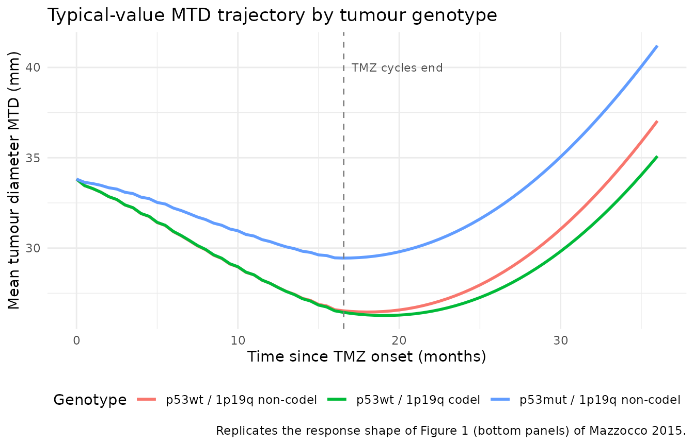
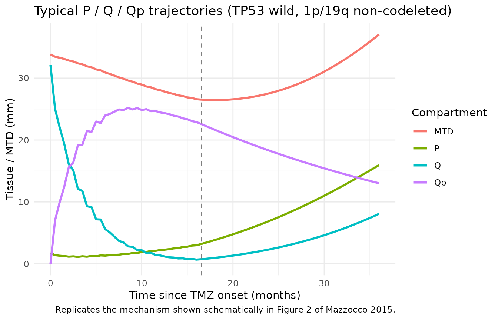
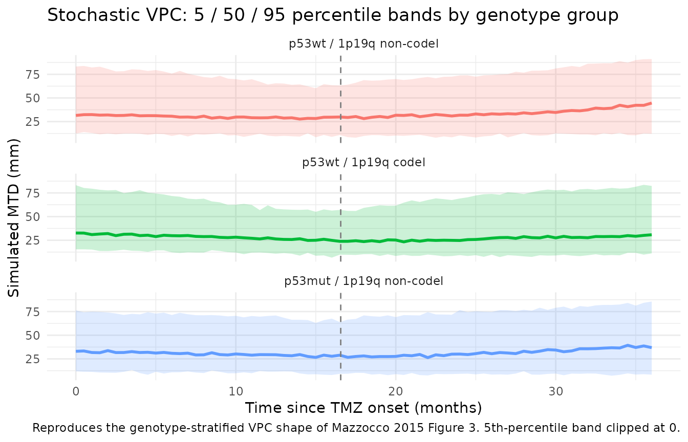

# Temozolomide LGG TGI (Mazzocco 2015)

## Model and source

- Citation: Mazzocco P, Barthelemy C, Kaloshi G, Lavielle M, Ricard D,
  Idbaih A, Psimaras D, Renard MA, Alentorn A, Honnorat J, Delattre JY,
  Ducray F, Ribba B. Prediction of Response to Temozolomide in Low-Grade
  Glioma Patients Based on Tumor Size Dynamics and Genetic
  Characteristics. *CPT Pharmacometrics Syst Pharmacol.*
  2015;4(12):728-737.
  <doi:%5B10.1002/psp4.54>\](<https://doi.org/10.1002/psp4.54>).
- Article (open access): <https://doi.org/10.1002/psp4.54>

This vignette validates the population tumour-growth-inhibition (TGI)
model that Mazzocco et al. fit to mean tumour diameter (MTD)
measurements from 77 adults with WHO grade II low-grade glioma (LGG)
treated with first-line temozolomide (TMZ). The model couples three
tumour-tissue compartments (proliferative P, non-damaged quiescent Q,
damaged quiescent Qp) with a kinetic-pharmacodynamic (K-PD) virtual drug
compartment, and incorporates two tumour-genotype covariates (TP53
mutation status on the TMZ tumour-cell-death constant gamma; 1p/19q
codeletion status on the damaged-quiescent-to-proliferative repair
constant kQpP).

## Population

77 LGG patients (median age 40 years, range 25-71; 45.5% female) treated
with first-line TMZ (200 mg/m^2/day on days 1-5 of each 28-day cycle,
median 18 cycles, range 2-24) at a single French centre between 1999 and
2007. Histology was oligodendroglioma (73%), oligoastrocytoma (21%), or
astrocytoma (6%). Each patient contributed at least one molecular
characteristic (1p/19q codeletion, TP53 / p53 missense mutation, or IDH
mutation); 1p/19q codeletion and TP53 missense mutation were mutually
exclusive in this cohort (Ricard 2007). Tumour size was measured
manually on printed MRI scans as MTD = (2V)^(1/3) where V = (D1 \* D2 \*
D3) / 2. 952 MTD observations total (mean 12 per patient). The same
metadata is available programmatically via
`readModelDb("Mazzocco_2015_temozolomide")$population`.

## Source trace

Equations from Mazzocco 2015 page 731 (the boxed ODE block) and Figure 2
schematic. Parameter values from Table 2 (final model with both
covariates). The carrying-capacity value `K = 100 mm` is inherited from
the upstream Ribba 2012 LGG model and provenance-cited via the on-disk
Ribba 2014 review (Table 1 footnote on the Ribba 2012 row).

| Equation / parameter | Value | Source location |
|----|----|----|
| `d/dt(kpdConc)` | n/a | Mazzocco 2015 p.731: dC/dt = -KDE \* C (K-PD construction per Jacqmin 2007) |
| `d/dt(prolif)` | n/a | Mazzocco 2015 p.731 ODE for dP/dt |
| `d/dt(quiesc)` | n/a | Mazzocco 2015 p.731 ODE for dQ/dt |
| `d/dt(quiescDam)` | n/a | Mazzocco 2015 p.731 ODE for dQp/dt |
| `tumorSize <- prolif + quiesc + quiescDam` | n/a | Mazzocco 2015 p.731 (“P\* = P + Q + Qp”); compared to the MTD observations |
| `lp0` (P0) | `log(1.72)` | Table 2: P0 = 1.72 mm (RSE 21%) |
| `lq0` (Q0) | `log(32.1)` | Table 2: Q0 = 32.1 mm (RSE 7%) |
| `llambdap` (lambda_P) | `log(0.143)` | Table 2: lambda_P = 0.143 1/month (RSE 12%) |
| `lkpq` (kPQ) | `log(0.0429)` | Table 2: kPQ = 0.0429 1/month (RSE 21%) |
| `lkqpp` (kQpP, non-codel ref) | `log(0.00947)` | Table 2: kQpP 1p/19q non-codeleted = 0.00947 1/month (RSE 42%) |
| `ldqp` (dQp) | `log(0.0188)` | Table 2: dQp = 0.0188 1/month (RSE 19%) |
| `lgamma` (gamma, p53 wild ref) | `log(0.254)` | Table 2: gamma p53 wild = 0.254 unitless (RSE 18%) |
| `lres` (res) | `log(0.1)` | Table 2: res = 0.1 1/month (RSE 22%) |
| `lkde` (KDE) | `fixed(log(8.3))` | Table 2: KDE = 8.3 1/month FIXED (paper text: 2.5-day half-life equivalent) |
| `lK` | `fixed(log(100))` | Ribba 2014 review Table 1 footnote: K = 10 cm = 100 mm (upstream Ribba 2012) |
| `e_p53_gamma` | `log(0.143/0.254) = -0.5743` | Table 2: gamma p53 mutated = 0.143; gamma p53 wild = 0.254 |
| `e_codel_kqpp` | `log(0.00807/0.00947) = -0.1601` | Table 2: kQpP 1p/19q codeleted = 0.00807; non-codeleted = 0.00947 |
| `etalp0` | `1.1136` (CV 143%) | Table 2 CV column; omega^2 = log((CV/100)^2 + 1) |
| `etalq0` | `0.2712` (CV 55.8%) | Table 2 CV column |
| `etallambdap` | `0.3352` (CV 63.1%) | Table 2 CV column |
| `etalkpq` | `0.5045` (CV 81%) | Table 2 CV column |
| `etalkqpp` | `1.2876` (CV 162%) | Table 2 CV column |
| `etaldqp` | `0.5556` (CV 86.2%) | Table 2 CV column |
| `etalgamma` | `0.3857` (CV 68.6%) | Table 2 CV column |
| `etalres` | `0.4996` (CV 80.5%) | Table 2 CV column |
| `etalkde` | `fixed(0.2231)` (CV 50% FIXED) | Table 2 CV column |
| `addSd` (a) | `1.73` | Table 2: a = 1.73 mm (RSE 3%, constant error model) |
| TMZ cycle interval | 28 days = 0.9203 months | Mazzocco 2015 Methods: “The drug was administered for 5 consecutive days (day 1 to day 5) every 28 days at a daily dose of 200 mg/m^2.” |

## Virtual cohort

The published cohort split (Table 1, internal-analysis column) by p53
status was 24 mutant / 35 wild-type (and 18 unknown), and by 1p/19q
status was 23 codeleted / 47 non-codeleted (and 7 unknown). Because the
two markers are mutually exclusive in this cohort, only three combined
genotype groups are biologically plausible: (TP53-wild,
1p/19q-codeleted), (TP53-wild, 1p/19q-non-codeleted), and (TP53-mutant,
1p/19q-non-codeleted). The virtual cohort below uses 50 subjects in each
of those three groups (150 total). TMZ dosing follows the published
protocol – 18 monthly cycles at 28-day intervals (= 0.9203 months), one
K-PD bolus per cycle, dose magnitude `amt = 1` (arbitrary; the source
paper’s gamma absorbs the dose units). The simulation horizon is 36
months to cover both the median treatment duration (~17 months) and a
post-treatment follow-up window long enough to expose the
acquired-resistance dynamics and the slow post-cessation MTD evolution
highlighted in Figure 1 (top-right).

``` r

set.seed(2015)

cycle_interval_months <- 28 / (365.25 / 12)  # 0.9203 months
n_cycles              <- 18L                 # paper's median
treatment_end_month   <- cycle_interval_months * n_cycles
followup_horizon      <- 36                  # months

obs_times  <- seq(0, followup_horizon, by = 0.5)
dose_times <- cycle_interval_months * seq.int(0L, n_cycles - 1L)

n_per_group <- 50L

geno_groups <- tibble::tribble(
  ~genotype_label,            ~TUM_TP53_MUT, ~TUM_1P19Q_CODEL,
  "p53wt / 1p19q non-codel",  0L,            0L,
  "p53wt / 1p19q codel",      0L,            1L,
  "p53mut / 1p19q non-codel", 1L,            0L
)

make_cohort <- function(genotype_label, TUM_TP53_MUT, TUM_1P19Q_CODEL, id_offset) {
  ids <- id_offset + seq_len(n_per_group)
  per_subject <- tibble(
    id              = ids,
    TUM_TP53_MUT    = TUM_TP53_MUT,
    TUM_1P19Q_CODEL = TUM_1P19Q_CODEL,
    genotype_label  = genotype_label
  )
  doses <- per_subject |>
    tidyr::crossing(time = dose_times) |>
    mutate(evid = 1L, amt = 1, cmt = "kpdConc")
  obs <- per_subject |>
    tidyr::crossing(time = obs_times) |>
    mutate(evid = 0L, amt = 0, cmt = NA_character_)
  bind_rows(doses, obs) |>
    arrange(id, time, desc(evid))
}

events <- bind_rows(
  make_cohort("p53wt / 1p19q non-codel",  0L, 0L, id_offset =                0L),
  make_cohort("p53wt / 1p19q codel",      0L, 1L, id_offset =      n_per_group),
  make_cohort("p53mut / 1p19q non-codel", 1L, 0L, id_offset = 2L * n_per_group)
) |>
  mutate(genotype_label = factor(
    genotype_label,
    levels = c("p53wt / 1p19q non-codel", "p53wt / 1p19q codel", "p53mut / 1p19q non-codel")
  ))

stopifnot(!anyDuplicated(unique(events[, c("id", "time", "evid")])))
nrow(events); n_distinct(events$id)
#> [1] 13650
#> [1] 150
```

## Typical-value simulation (replicates the response shapes from Figure 1)

A typical-value simulation (`zeroRe()`: no IIV, no residual error) shows
the structural response shape Mazzocco 2015 highlights in Figure 1
(bottom panels): an initial MTD drop driven by the TMZ effect on both P
and Q tissues, followed by a slow rebound as the proliferative-tissue
drug effect decays via `exp(-res*t)` and the damaged-quiescent
compartment Qp repairs back to P at rate kQpP.

``` r

mod     <- readModelDb("Mazzocco_2015_temozolomide")
mod_typ <- mod |> rxode2::zeroRe()
#> ℹ parameter labels from comments will be replaced by 'label()'

sim_typ <- rxode2::rxSolve(
  mod_typ,
  events = events,
  keep   = c("genotype_label", "TUM_TP53_MUT", "TUM_1P19Q_CODEL")
) |>
  as.data.frame()
#> ℹ omega/sigma items treated as zero: 'etalp0', 'etalq0', 'etallambdap', 'etalkpq', 'etalkqpp', 'etaldqp', 'etalgamma', 'etalres', 'etalkde'
#> Warning: multi-subject simulation without without 'omega'

typ_summary <- sim_typ |>
  group_by(genotype_label, time) |>
  summarise(median_MTD = median(tumorSize), .groups = "drop")

ggplot(typ_summary, aes(time, median_MTD, colour = genotype_label)) +
  geom_line(linewidth = 1) +
  geom_vline(xintercept = treatment_end_month, linetype = "dashed", colour = "grey50") +
  annotate("text", x = treatment_end_month + 0.5, y = 40,
           label = "TMZ cycles end", hjust = 0, colour = "grey30", size = 3) +
  labs(x = "Time since TMZ onset (months)", y = "Mean tumour diameter MTD (mm)",
       colour = "Genotype",
       title = "Typical-value MTD trajectory by tumour genotype",
       caption = "Replicates the response shape of Figure 1 (bottom panels) of Mazzocco 2015.") +
  theme_minimal() +
  theme(legend.position = "bottom")
```



Plotting the three tumour-tissue compartments alongside the total
`tumorSize` exposes the underlying mechanism: under TMZ, Q drains
rapidly into Qp (damaged quiescent), MTD falls; once `exp(-res*t)` has
decayed the proliferative-tissue effect, P regrows and kQpP repairs Qp
back to P, giving the slow rebound.

``` r

comp_typ <- sim_typ |>
  filter(genotype_label == "p53wt / 1p19q non-codel") |>
  group_by(time) |>
  summarise(P  = median(prolif),
            Q  = median(quiesc),
            Qp = median(quiescDam),
            MTD = median(tumorSize),
            .groups = "drop") |>
  pivot_longer(c(P, Q, Qp, MTD), names_to = "state", values_to = "value") |>
  mutate(state = factor(state, levels = c("MTD", "P", "Q", "Qp")))

ggplot(comp_typ, aes(time, value, colour = state)) +
  geom_line(linewidth = 1) +
  geom_vline(xintercept = treatment_end_month, linetype = "dashed", colour = "grey50") +
  labs(x = "Time since TMZ onset (months)", y = "Tissue / MTD (mm)",
       colour = "Compartment",
       title = "Typical P / Q / Qp trajectories (TP53 wild, 1p/19q non-codeleted)",
       caption = "Replicates the mechanism shown schematically in Figure 2 of Mazzocco 2015.") +
  theme_minimal()
```



## Stochastic simulation with IIV

Including IIV across all parameters (CV 50-162% per Table 2) and the
additive residual error gives a VPC-style envelope analogous to Mazzocco
2015 Figure 3 (which stratifies by p53 and 1p/19q status). The 5th,
50th, and 95th percentile bands below are computed across the 50
simulated subjects per genotype group.

``` r

sim_iiv <- rxode2::rxSolve(
  mod,
  events = events,
  keep   = c("genotype_label", "TUM_TP53_MUT", "TUM_1P19Q_CODEL")
) |>
  as.data.frame()
#> ℹ parameter labels from comments will be replaced by 'label()'

vpc_summary <- sim_iiv |>
  group_by(genotype_label, time) |>
  summarise(
    Q05 = quantile(sim, 0.05, na.rm = TRUE),
    Q50 = quantile(sim, 0.50, na.rm = TRUE),
    Q95 = quantile(sim, 0.95, na.rm = TRUE),
    .groups = "drop"
  )

ggplot(vpc_summary, aes(time, Q50, colour = genotype_label, fill = genotype_label)) +
  geom_ribbon(aes(ymin = pmax(Q05, 0), ymax = Q95), alpha = 0.2, colour = NA) +
  geom_line(linewidth = 1) +
  facet_wrap(~ genotype_label, ncol = 1) +
  geom_vline(xintercept = treatment_end_month, linetype = "dashed", colour = "grey50") +
  labs(x = "Time since TMZ onset (months)", y = "Simulated MTD (mm)",
       title = "Stochastic VPC: 5 / 50 / 95 percentile bands by genotype group",
       caption = "Reproduces the genotype-stratified VPC shape of Mazzocco 2015 Figure 3. 5th-percentile band clipped at 0.") +
  theme_minimal() +
  guides(colour = "none", fill = "none")
```



## Tumour-genotype covariate effects (replicates Mazzocco 2015 Results)

The paper’s two retained covariate effects are:

- **TP53 mutation reduces TMZ efficacy:** the typical-value gamma in
  TP53-mutant tumours is `0.143 / 0.254 = 0.563` of the TP53-wild-type
  value, i.e. TMZ is 44% less effective in mutant tumours (Mazzocco 2015
  Results, p.731-732). The typical-value simulation reproduces this as a
  shallower MTD nadir and an earlier rebound in the TP53-mutant arm.
- **1p/19q codeletion lowers kQpP:** the typical-value kQpP in
  1p/19q-codeleted tumours is `0.00807 / 0.00947 = 0.852` of the
  non-codeleted value, i.e. damaged quiescent cells take ~15% longer to
  repair back to proliferating. The typical-value simulation reproduces
  this as a deeper / longer MTD response in the codeleted arm (the
  Mazzocco 2015 finding that codeleted patients have longer response
  duration).

``` r

typ_metrics <- sim_typ |>
  group_by(id, genotype_label) |>
  summarise(
    baseline_MTD = first(tumorSize),
    min_MTD      = min(tumorSize),
    time_min_MTD = time[which.min(tumorSize)],
    .groups = "drop"
  ) |>
  group_by(genotype_label) |>
  summarise(
    typical_baseline_MTD = mean(baseline_MTD),
    typical_min_MTD      = mean(min_MTD),
    typical_pct_drop     = mean((baseline_MTD - min_MTD) / baseline_MTD * 100),
    typical_time_min     = mean(time_min_MTD),
    .groups = "drop"
  )

knitr::kable(
  typ_metrics,
  digits = 2,
  caption = paste(
    "Typical-value response metrics by genotype: baseline MTD,",
    "minimum MTD, percentage drop from baseline, and time to minimum (months)."
  )
)
```

| genotype_label | typical_baseline_MTD | typical_min_MTD | typical_pct_drop | typical_time_min |
|:---|---:|---:|---:|---:|
| p53wt / 1p19q non-codel | 33.82 | 26.46 | 21.76 | 18.0 |
| p53wt / 1p19q codel | 33.82 | 26.27 | 22.33 | 19.0 |
| p53mut / 1p19q non-codel | 33.82 | 29.45 | 12.93 | 16.5 |

Typical-value response metrics by genotype: baseline MTD, minimum MTD,
percentage drop from baseline, and time to minimum (months). {.table}

## Mechanistic sanity checks

This is a tumour-size-dynamics PD model with no drug-concentration /
dose / AUC observation – PKNCA-based validation is not the appropriate
gate (there is no plasma concentration to integrate). The mechanistic
checks below catch the failure modes that would actually break this
class of model.

### 1. Baseline (t = 0) matches Table 2

At `t = 0` the typical-value MTD equals
`P0 + Q0 = 1.72 + 32.1 = 33.82 mm`. Round-trip through `rxSolve` and
verify.

``` r

baseline_check <- sim_typ |>
  filter(time == 0) |>
  group_by(genotype_label) |>
  summarise(baseline_MTD = unique(tumorSize), .groups = "drop")

knitr::kable(
  baseline_check,
  digits = 3,
  caption = "Typical-value baseline MTD equals P0 + Q0 = 33.82 mm in every genotype group."
)
```

| genotype_label           | baseline_MTD |
|:-------------------------|-------------:|
| p53wt / 1p19q non-codel  |        33.82 |
| p53wt / 1p19q codel      |        33.82 |
| p53mut / 1p19q non-codel |        33.82 |

Typical-value baseline MTD equals P0 + Q0 = 33.82 mm in every genotype
group. {.table}

``` r

stopifnot(all(abs(baseline_check$baseline_MTD - (1.72 + 32.1)) < 1e-6))
```

### 2. K-PD compartment decays at rate KDE

After a single TMZ-cycle bolus of `amt = 1` at `t = 0`, the K-PD
compartment should decay as `kpdConc(t) = exp(-KDE * t)` with
`KDE = 8.3 / month`, giving a half-life of
`log(2) / 8.3 = 0.0835 month = 2.54 days`. Check the early-time decay of
a single-cycle simulation.

``` r

single_dose_events <- tibble(
  id = 1L,
  TUM_TP53_MUT = 0L,
  TUM_1P19Q_CODEL = 0L
) |>
  tidyr::crossing(time = c(0, seq(0.005, 0.5, by = 0.005))) |>
  mutate(evid = 0L, amt = 0, cmt = NA_character_)

single_dose_events <- bind_rows(
  tibble(id = 1L, TUM_TP53_MUT = 0L, TUM_1P19Q_CODEL = 0L,
         time = 0, evid = 1L, amt = 1, cmt = "kpdConc"),
  single_dose_events
) |>
  arrange(time, desc(evid))

sim_kde <- rxode2::rxSolve(mod_typ, events = single_dose_events) |>
  as.data.frame() |>
  filter(time > 0) |>
  mutate(predicted = exp(-8.3 * time))
#> ℹ omega/sigma items treated as zero: 'etalp0', 'etalq0', 'etallambdap', 'etalkpq', 'etalkqpp', 'etaldqp', 'etalgamma', 'etalres', 'etalkde'

kde_check <- sim_kde |>
  select(time, kpdConc, predicted) |>
  head(10)

knitr::kable(
  kde_check,
  digits = 4,
  caption = "Simulated kpdConc(t) vs analytic exp(-KDE * t) over the first 0.05 months (~1.5 days)."
)
```

|  time | kpdConc | predicted |
|------:|--------:|----------:|
| 0.005 |  0.9593 |    0.9593 |
| 0.010 |  0.9204 |    0.9204 |
| 0.015 |  0.8829 |    0.8829 |
| 0.020 |  0.8470 |    0.8470 |
| 0.025 |  0.8126 |    0.8126 |
| 0.030 |  0.7796 |    0.7796 |
| 0.035 |  0.7479 |    0.7479 |
| 0.040 |  0.7175 |    0.7175 |
| 0.045 |  0.6883 |    0.6883 |
| 0.050 |  0.6603 |    0.6603 |

Simulated kpdConc(t) vs analytic exp(-KDE \* t) over the first 0.05
months (~1.5 days). {.table}

``` r

stopifnot(max(abs(sim_kde$kpdConc - sim_kde$predicted)) < 1e-3)
```

### 3. Carrying capacity cap prevents runaway growth

In the absence of treatment, the proliferative tissue grows logistically
with rate `lambda_P = 0.143 /month` toward the carrying capacity
`K = 100 mm`. With no doses applied, the typical-value `tumorSize` must
remain bounded above by `K`.

``` r

no_dose_events <- tibble(
  id              = 1L,
  TUM_TP53_MUT    = 0L,
  TUM_1P19Q_CODEL = 0L
) |>
  tidyr::crossing(time = seq(0, 240, by = 1)) |>  # 20-year horizon
  mutate(evid = 0L, amt = 0, cmt = NA_character_)

sim_cap <- rxode2::rxSolve(mod_typ, events = no_dose_events) |>
  as.data.frame()
#> ℹ omega/sigma items treated as zero: 'etalp0', 'etalq0', 'etallambdap', 'etalkpq', 'etalkqpp', 'etaldqp', 'etalgamma', 'etalres', 'etalkde'

knitr::kable(
  sim_cap |> filter(time %in% c(0, 12, 24, 60, 120, 240)) |>
    select(time, tumorSize, prolif, quiesc, quiescDam),
  digits = 3,
  caption = "Typical untreated trajectory (no TMZ doses) over a 20-year horizon. MTD asymptotes below K = 100 mm."
)
```

| time | tumorSize | prolif | quiesc | quiescDam |
|-----:|----------:|-------:|-------:|----------:|
|    0 |    33.820 |  1.720 | 32.100 |         0 |
|   12 |    36.453 |  3.135 | 33.318 |         0 |
|   24 |    40.857 |  5.384 | 35.473 |         0 |
|   60 |    64.440 | 13.705 | 50.735 |         0 |
|  120 |    86.603 |  6.582 | 80.021 |         0 |
|  240 |    90.471 |  0.231 | 90.240 |         0 |

Typical untreated trajectory (no TMZ doses) over a 20-year horizon. MTD
asymptotes below K = 100 mm. {.table}

``` r

stopifnot(max(sim_cap$tumorSize) < 100)
```

### 4. Dimensional analysis of the ODE

| Term | Units | Reduces to |
|----|----|----|
| `lambdap * prolif` | `1/month * mm` | `mm / month` |
| `(1 - tumorSize / K)` | unitless | unitless |
| `kqpp * quiescDam` | `1/month * mm` | `mm / month` |
| `kpq * prolif` | `1/month * mm` | `mm / month` |
| `gamma * kde * kpdConc * prolif` | `unitless * 1/month * AU * mm` | `mm / month` (AU absorbed into gamma) |
| `gamma * kde * kpdConc * quiesc` | same | `mm / month` |
| `dqp * quiescDam` | `1/month * mm` | `mm / month` |
| `kde * kpdConc` | `1/month * AU` | `AU / month` |

All three tumour-tissue ODE right-hand sides reduce to `mm / month`,
consistent with `d/dt(state)` where the states are in `mm` and `t` is in
months. The K-PD compartment is in arbitrary units (AU) whose scale is
absorbed into the typical-value gamma – changing the dose magnitude from
`amt = 1` to `amt = 10` scales `kpdConc` ten-fold but the published
value of `gamma = 0.254` was estimated against the source paper’s
`amt = 1` convention, so the dose magnitude is load-bearing.

## Assumptions and deviations

- **Carrying capacity `K = 100 mm` is upstream from Ribba 2012.**
  Mazzocco 2015 Table 2 reports only seven structural parameters plus
  two initial conditions; the carrying-capacity value is inherited
  (without being re-listed) from the predecessor Ribba 2012 LGG TGI
  model. The Ribba 2012 PDF is not on disk for this extraction; the
  on-disk Ribba 2014 review (<doi:10.1038/psp.2014.12>, PMID 24622904)
  records the value in its Table 1 footnote on the Ribba 2012 row:
  “theta was not estimated and was fixed to 10 cm”. The model file pins
  the value via `lK <- fixed(log(100))` and cites the provenance in the
  `reference` block.
- **K-PD dose magnitude convention.** Mazzocco 2015 represents each
  28-day TMZ cycle (five daily 200 mg/m^2 doses on days 1-5) as a single
  bolus into the virtual drug compartment C; the source paper does not
  publish an explicit dose value. The model file is calibrated to
  `amt = 1` per cycle, which is the convention used by the upstream
  Ribba 2012 K-PD parameterisation that Mazzocco 2015 builds on. Users
  supplying a different `amt` magnitude will see proportionally rescaled
  `kpdConc` trajectories; to preserve the published efficacy magnitude
  with a different dose unit, scale `gamma` by the same factor.
- **Resistance-clock origin.** The drug-effect resistance term
  `exp(-res * t)` is built on the rxode2 simulation time `t`. The paper
  measures `t` from TMZ start (the K-PD compartment C is zero before
  treatment). Users with pretreatment observations should put `t = 0` at
  the start of TMZ therapy and use negative times for pretreatment
  scans; the drug-effect term is `gamma * kde * C * exp(-res*t)` and
  reduces to zero for `t < 0` because `C(0) = 0`.
- **[`checkModelConventions()`](https://nlmixr2.github.io/nlmixr2lib/reference/checkModelConventions.md)
  deviations (intentional).** Running
  `nlmixr2lib::checkModelConventions("Mazzocco_2015_temozolomide")`
  flags four warnings (no errors): (1) compartment `kpdConc` is not on
  the canonical-compartment list; (2) compartments `prolif`, `quiesc`,
  `quiescDam` are not on the canonical-compartment list; (3) the
  single-output observation variable should be `Cc`; (4)
  `units$concentration` does not contain a per-volume `/` (the
  observation is a tumour diameter, not a drug concentration). All four
  are intrinsic to a tumour-size-dynamics model with no
  drug-concentration ODE. The same deviations apply to every other
  tumour-size-dynamics model in the package (e.g., `tgi_sat_logistic`,
  `oncology_xenograft_simeoni_2004`, `Ouerdani_2015_pazopanib`,
  `Zecchin_2016_tumorovarian`).
- **Genotype mutual exclusivity not enforced by the model.** Mazzocco
  2015 Methods note that TP53 missense mutation and 1p/19q codeletion
  are mutually exclusive in their cohort. The model file does not
  enforce that constraint at the parameter level – users with the rare
  double-mutant case will see compounded covariate effects (both
  `e_p53_gamma` and `e_codel_kqpp` applied); the typical-value cohort in
  this vignette therefore omits the double-mutant combination.
- **PKNCA validation is omitted.** This is a tumour-size-dynamics PD
  model with no drug-concentration ODE – there is nothing for PKNCA to
  integrate. The vignette substitutes the mechanistic-sanity checks
  above (baseline match, K-PD decay rate, carrying-capacity cap,
  dimensional analysis), matching the validation pattern other
  tumour-size models in the package use (e.g.,
  `Ouerdani_2015_pazopanib_mouse`, `Zecchin_2016_tumorovarian`).
