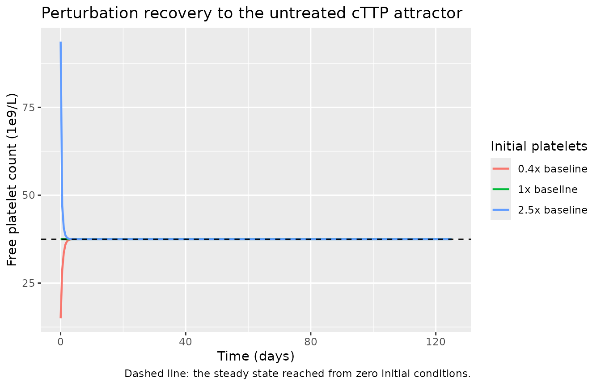
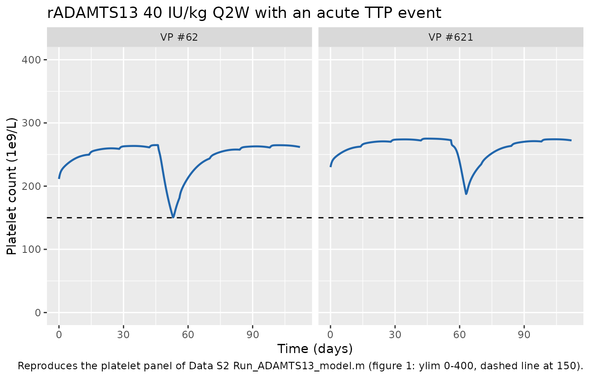
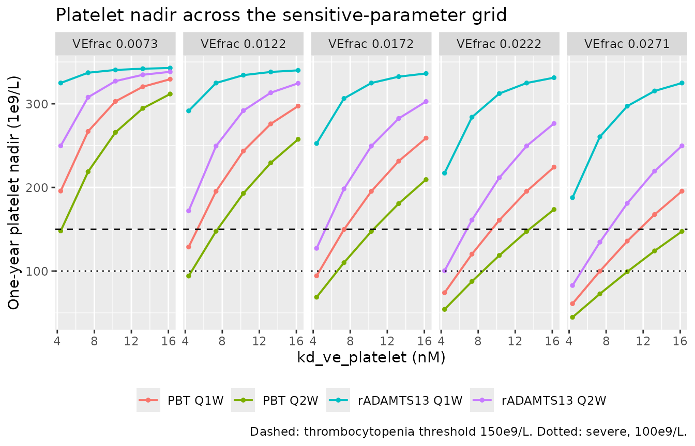
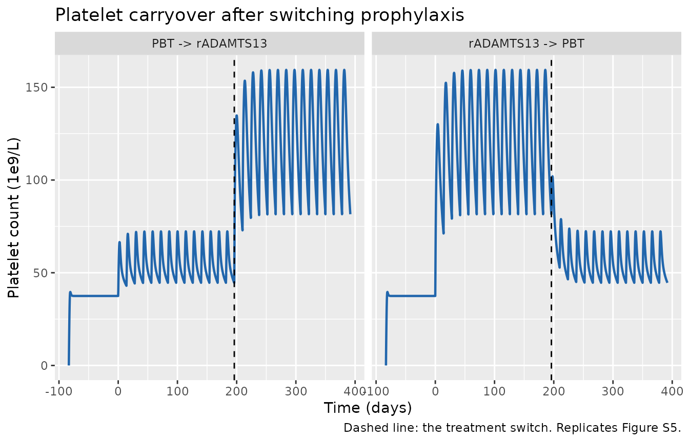

# Recombinant ADAMTS13 in congenital TTP, a platelet QSP model (McBride 2025)

## Model and source

``` r

ui <- rxode2::rxode(readModelDb("McBride_2025_radamts13_qsp"))
```

- Citation: McBride C, Jiang J, Zhang Z, Tolsma J, Patwari P, Mellgard
  B, Vakilynejad M, Bhattacharya I, Zhu AZX. Quantitative Systems
  Pharmacology Modeling of Platelet Responses to Recombinant ADAMTS13 in
  Patients With Congenital Thrombotic Thrombocytopenic Purpura. CPT
  Pharmacometrics Syst Pharmacol. 2025;14(9):1575-1585.
  <doi:10.1002/psp4.70063>
- Article: <https://doi.org/10.1002/psp4.70063>
- Supplement (Methods S1 equations, Table S1 parameters, Figures S1-S5):
  <https://doi.org/10.1002/psp4.70063> Supporting Information S1
- Model source code (Data S2, `ADAMTS13_Model.m` +
  `Run_ADAMTS13_model.m`): <https://doi.org/10.1002/psp4.70063>
  Supporting Information S2

Congenital thrombotic thrombocytopenic purpura (cTTP) is caused by an
inherited deficiency of ADAMTS13, the metalloproteinase that cleaves von
Willebrand factor (VWF) multimers. Without ADAMTS13, ultra-large VWF
accumulates, binds platelets, and consumes them into microthrombi.
McBride and colleagues built a quantitative systems pharmacology (QSP)
model of the ADAMTS13-VWF-platelet axis and used it to run virtual
clinical trials of recombinant ADAMTS13 (rADAMTS13, TAK-755) against
plasma-based therapy (PBT). Those simulations were submitted to the FDA
as confirmatory evidence supporting the cTTP approval.

The model carries 26 ODE states: globular and elongated (active) VWF
monomer units, endogenous and recombinant ADAMTS13, extracellular
hemoglobin, thrombospondin-1, every pairwise and ternary complex among
them, free and VWF-bound platelets, three multi-platelet aggregate
species, and a two-compartment rADAMTS13 PK model that acts as a forcing
function on the pharmacodynamic system.

## Population

``` r

pop <- ui$population
str(pop, max.level = 1, give.attr = FALSE)
#> List of 9
#>  $ species           : chr "human"
#>  $ n_subjects        : num 40
#>  $ n_studies         : num 5
#>  $ age_range         : chr "adults and adolescents with cTTP (Phase 3 NCT03393975 enrolled patients >= 0 years; the QSP virtual population "| __truncated__
#>  $ weight_median     : chr "68.7 kg (allometric reference weight, Table S1 'Human PK parameters')"
#>  $ disease_state     : chr "Congenital thrombotic thrombocytopenic purpura (cTTP), a severe inherited ADAMTS13 deficiency causing thromboti"| __truncated__
#>  $ dose_range        : chr "rADAMTS13 40 IU/kg IV Q1W or Q2W prophylaxis; plasma-based therapy (PBT) exposure equivalent to ~10 IU/kg ADAMT"| __truncated__
#>  $ notes             : chr "Calibration/validation data (Table S2 and Figure 2): Phase 1 cTTP PK (NCT02216084, Scully 2017, N = 15); two ad"| __truncated__
#>  $ virtual_population: chr "Population variability was estimated by iterative two-stage (ITS) on seven individual parameters (ksyn_platelet"| __truncated__
```

Calibration/validation data (Table S2 and Figure 2): Phase 1 cTTP PK
(NCT02216084, Scully 2017, N = 15); two adamts13-knockout mouse studies
(Kopic 2016 and in-house \#248.220.5098, 5 male + 5 female mice per
dose); human baseline platelet counts and VWF activity from healthy
individuals and untreated cTTP patients; cTTP FFP standard-of-care
literature; Phase 2 iTTP (NCT03922308, N = 16 rADAMTS13-treated); and
the Phase 3 cTTP crossover study (NCT03393975, N = 48 enrolled; data
from 40 patients used here, split 25 estimation / 15 validation).
n_subjects = 40 refers to the Phase 3 patients that informed the
population parameter variability. Clinical trial simulations used 1000
virtual patients per arm, phenotype-matched on body weight and baseline
ADAMTS13 and platelet levels; the paper states that sex, age and height
were not model inputs.

Population variability was estimated by iterative two-stage (ITS) on
seven individual parameters (ksyn_platelet, ve_frac_base,
kd_ve_platelet, WT, spike_amount, vwf_pct, spike_day; Figure S2) and
reported only as histograms - the mean vector and covariance matrix are
not tabulated, so no IIV is encoded in this file. Two fully specified
virtual patients are shipped in Data S2 (ADAMTS13_Model.m) and are
reproduced in the validation vignette.

## Source trace

Every `ini()` entry carries an in-file comment naming its source. The
two on-disk sources are the Supporting Information S1 (Methods S1
equations, Table S1 parameters) and the Supporting Information S2
archive, which ships the executable model as MATLAB (`ADAMTS13_Model.m`,
a translation of the original J2 implementation) plus a driver script
(`Run_ADAMTS13_model.m`).

### Structure

| Model element | Source |
|----|----|
| Eqs 1a-1f: `koff = KD * kon` for all six reversible bindings | Methods S1 Eq 1 |
| Eqs 2a-2c: `ksyn = kdeg * <steady-state concentration>` for Hb, VWF, TSP-1 | Methods S1 Eq 2 |
| Eq 2d: cleavage rate of platelet-bound elongated VWF equals that of free elongated VWF | Methods S1 Eq 2d |
| Eq 3a: `ve_plt_sum` = sum of the three VWF:platelet species | Methods S1 Eq 3a |
| Eq 3b: total ADAMTS13 activity in IU/mL from the molar pools | Methods S1 Eq 3b |
| Eq 3c: `f_a13`, saturable enhancement of aggregate lysis | Methods S1 Eq 3c |
| Eqs 4-25: the 23 pharmacodynamic ODEs | Methods S1 Eqs 4-25; Data S2 `ADAMTS13_Model.m` L182-L315 |
| Two-compartment rADAMTS13 PK, allometric on body weight | Table S1 “Human PK parameters”; Data S2 L75-L81, L318-L319 |
| PK-to-PD transfer `d/dt(radam) = (Cc_nM - radam)/tau_pd` | Data S2 L316; main text Figure 1 footnote a |
| Acute-event pulse in the elongated-VWF fraction (tanh) | Methods (“pulse-shape rise in the active amount of VWF”); Data S2 L168-L169 |
| Platelet count = free `platelet` state x 6.02e5 | Data S2 `Run_ADAMTS13_model.m` L116 |

### Parameters

``` r

ini_tab <- ui$iniDf |>
  dplyr::filter(!is.na(.data$ntheta)) |>
  dplyr::transmute(
    Parameter = .data$name,
    Value = signif(.data$est, 6),
    Fixed = .data$fix,
    Label = .data$label
  )
knitr::kable(ini_tab, caption = "ini() entries. All parameters are fixed: the QSP model is a calibrated typical-value mechanism, not a population fit with estimated uncertainty carried into this file.")
```

| Parameter | Value | Fixed | Label |
|:---|---:|:---|:---|
| lcl | -3.24676e+00 | TRUE | Clearance at the reference body weight (L/h) |
| lvc | 9.89541e-01 | TRUE | Central volume of distribution at the reference body weight (L) |
| lq | -3.08785e+00 | TRUE | Intercompartmental clearance at the reference body weight (L/h) |
| lvp | 1.31103e+00 | TRUE | Peripheral volume of distribution at the reference body weight (L) |
| e_wt_cl | 7.50000e-01 | TRUE | Allometric exponent on CL and Q (unitless) |
| e_wt_vc | 1.00000e+00 | TRUE | Allometric exponent on Vc and Vp (unitless) |
| wt_ref | 6.87000e+01 | TRUE | Reference body weight for allometric scaling (kg) |
| lfrel | -7.65571e-02 | TRUE | Relative ADAMTS13 activity of the dosed product (unitless) |
| kd_ve_adam | 1.01000e-02 | TRUE | Dissociation constant, elongated VWF : (r)ADAMTS13 (nM) |
| kd_ve_hb | 4.57500e+02 | TRUE | Dissociation constant, elongated VWF : hemoglobin (nM) |
| kd_ve_tsp1 | 1.00000e-01 | TRUE | Dissociation constant, elongated VWF : thrombospondin-1 (nM) |
| kd_ve_platelet | 4.37000e+00 | TRUE | Dissociation constant, elongated VWF : platelet (nM) |
| kd_vg_adam | 8.00000e+01 | TRUE | Dissociation constant, globular VWF : (r)ADAMTS13 (nM) |
| kd_vg_hb | 2.05875e+04 | TRUE | Dissociation constant, globular VWF : hemoglobin (nM) |
| kon_ve_adam | 5.27000e+02 | TRUE | Association rate constant, elongated VWF : (r)ADAMTS13 (1/nM/h) |
| kon_ve_hb | 3.60000e-01 | TRUE | Association rate constant, elongated VWF : hemoglobin (1/nM/h) |
| kon_ve_tsp1 | 3.60000e-01 | TRUE | Association rate constant, elongated VWF : thrombospondin-1 (1/nM/h) |
| kon_ve_platelet | 2.36000e+00 | TRUE | Association rate constant, elongated VWF : platelet (1/nM/h) |
| kon_vg_adam | 3.60000e-01 | TRUE | Association rate constant, globular VWF : (r)ADAMTS13 (1/nM/h) |
| kon_vg_hb | 3.60000e-01 | TRUE | Association rate constant, globular VWF : hemoglobin (1/nM/h) |
| kcat_ve | 1.68000e-01 | TRUE | Cleavage rate of elongated VWF by (r)ADAMTS13 (1/h) |
| kcat_vg | 0.00000e+00 | TRUE | Cleavage rate of globular VWF by (r)ADAMTS13 (1/h) |
| kcat_ve_ag | 3.83000e-02 | TRUE | Cleavage rate of VWF-platelet aggregates by (r)ADAMTS13 (1/nM/h) |
| radam_ag_ec50 | 2.18000e-01 | TRUE | ADAMTS13 activity giving half-maximal aggregate cleavage (IU/mL) |
| k_ag | 3.58000e+08 | TRUE | Platelet aggregate formation rate (1/nM^2/h) |
| n_pl | 2.00000e+00 | TRUE | Aggregation-reaction order in the summed VWF:platelet species |
| f_cat_platelet | 1.00000e+00 | TRUE | Ratio of the (r)ADAMTS13 cleavage rate on platelet-bound vs free elongated VWF (unitless) |
| kdeg_adam | 1.15525e-02 | TRUE | Degradation rate of endogenous ADAMTS13 (1/h) |
| kdeg_vwf | 4.62098e-02 | TRUE | Degradation rate of VWF and its complexes (1/h) |
| kdeg_vwf_frag | 1.38629e+00 | TRUE | Degradation rate of VWF cleavage fragments (1/h) |
| kdeg_hb | 6.93147e-01 | TRUE | Degradation rate of extracellular hemoglobin (1/h) |
| kdeg_tsp1 | 7.70164e-02 | TRUE | Degradation rate of thrombospondin-1 (1/h) |
| kdeg_platelet | 4.12590e-03 | TRUE | Degradation rate of platelets (1/h) |
| kdeg_ag | 2.88811e-02 | TRUE | Degradation rate of platelet aggregates (1/h) |
| ksyn_platelet | 2.40000e-06 | TRUE | Platelet synthesis rate (nM/h) |
| vwf_ss_ref | 4.68000e+01 | TRUE | Total VWF monomer-unit concentration in a healthy reference subject (nM) |
| vwf_pct | 1.00000e+02 | TRUE | Baseline total VWF relative to the healthy reference (%) |
| adam_pct | 1.00000e-05 | TRUE | Baseline endogenous ADAMTS13 activity in cTTP, relative to 1 IU/mL healthy (unitless) |
| hb_ss | 8.90000e+01 | TRUE | Baseline extracellular hemoglobin (ug/mL) |
| tsp1_ss | 3.20000e+03 | TRUE | Baseline thrombospondin-1 in cTTP (ng/mL) |
| adam_act_iu_ug | 1.50000e+00 | TRUE | ADAMTS13 activity per unit mass (IU/ug) |
| ve_frac_base | 2.71000e-02 | TRUE | Baseline fraction of total VWF in the elongated (active) form (unitless) |
| spike_amount | 5.68829e-02 | TRUE | Elongated VWF fraction during an acute TTP event (unitless) |
| spike_day | 5.60423e+01 | TRUE | Start day of the acute TTP event (day) |
| spike_duration | 1.68000e+02 | TRUE | Duration of the acute TTP event (h) |
| spike_steep | 5.00000e-01 | TRUE | Transition half-width of the event pulse (h) |
| tau_pd | 1.00000e-01 | TRUE | Transfer time constant from the PK central compartment into the PD ADAMTS13 pool (h) |

ini() entries. All parameters are fixed: the QSP model is a calibrated
typical-value mechanism, not a population fit with estimated uncertainty
carried into this file. {.table}

### Dimensional analysis

Mechanistic models mix molar concentrations, mass concentrations,
activity units and counts. Every conversion in this model is listed
below; each was checked against the source before the file was written.

| Quantity | Model expression | Units in | Units out |
|----|----|----|----|
| Hemoglobin baseline | `hb_ss * 1e6 / mw_hb` | ug/mL, Da | nM |
| TSP-1 baseline | `tsp1_ss * 1000 / mw_tsp1` | ng/mL, Da | nM |
| Endogenous ADAMTS13 baseline | `(1/adam_act_iu_ug) * 1e6 / mw_adamts13 * adam_pct` | IU/mL, IU/ug, Da | nM |
| rADAMTS13 plasma concentration | `central / vc` | mg, L | mg/L = ug/mL |
| rADAMTS13 molar concentration | `(central/vc) / mw_adamts13 * 1e6` | ug/mL, Da | nM |
| ADAMTS13 activity | `(radam + adam) * mw_adamts13 * 1e-6 * adam_act_iu_ug` | nM, Da, IU/ug | IU/mL |
| Platelet count | `platelet * 6.02e5` | nM | 1e9/L |
| Second-order binding | `kon * [A] * [B]` | 1/nM/h, nM, nM | nM/h |
| Aggregate formation | `k_ag * [VE:PLT] * ve_plt_sum^2` | 1/nM^2/h, nM, nM^2 | nM/h |
| Aggregate lysis | `kcat_ve_ag * ([ADAM]+[rADAM]) * [aggregate] * f_a13` | 1/nM/h, nM, nM | nM/h |

Two of these need comment. `plt_nM_to_1e9L = 6.02e5` is Avogadro’s
number carried through the unit chain
`nM -> 1e-9 mol/L -> x 6.02e23 /mol -> /L -> x 1e-9 -> 1e9/L`, exactly
as `Run_ADAMTS13_model.m` L116 writes it. And Table S1 lists `kcatS_ag`
with units “/hour”, but the term it multiplies in Eqs 23-25 is
`kcat_ve_ag * ([ADAM] + [rADAM]) * [aggregate]`, so the constant is
second-order and its units must be 1/nM/h; `ADAMTS13_Model.m` L99
confirms this
(`%rate of catalysis of PLT aggregate by A13 [1/(hr*nM)]`). The value,
0.0383, is unaffected.

## Simulation helpers

The model has no built-in baseline: every state starts at zero and
relaxes to its own steady state. The supplement states that “the model
was run for 2000 hours with baseline parameters and no drug dosing to
obtain the initial conditions approximating steady state”
(`Run_ADAMTS13_model.m` uses 5000 h); every simulation below therefore
begins with a `LEAD_IN` window before the first dose and reports time
relative to that first dose.

``` r

LEAD_IN <- 2000  # h, per Methods S1

theta <- ui$theta

# rADAMTS13 dose in mg from an IU/kg prescription. Relative activity (Frel)
# is applied inside the model via f(central), so it is NOT in amt.
dose_mg <- function(wt, iu_per_kg) wt * iu_per_kg / theta[["adam_act_iu_ug"]] / 1000

# Product-specific relative ADAMTS13 activity, Table S1 "Frel".
FREL <- c(rADAMTS13 = 1 - 0.0737, PBT = 1 - 0.390)
DOSE_IUKG <- c(rADAMTS13 = 40, PBT = 10)  # Figure 2 footnote e

# Build one subject's events: a quiet lead-in, then repeated 15-min infusions.
# `fine_peak` adds a dense observation grid over the first two hours after
# every dose; without it a coarse grid straddles the 15-minute infusion and
# any Cmax read off the output is a sampling artefact rather than the model's
# peak.
subject_events <- function(id, wt, iu_per_kg, ii, n_dose, followup = 0,
                           obs_by = 12, fine_peak = FALSE) {
  amt <- dose_mg(wt, iu_per_kg)
  dose_times <- LEAD_IN + (seq_len(n_dose) - 1) * ii
  end <- max(dose_times) + followup
  obs <- seq(0, end, by = obs_by)
  if (fine_peak) {
    obs <- sort(unique(c(obs, as.vector(outer(dose_times, seq(0, 2, by = 0.05), "+")))))
  }
  rxode2::et(amt = amt, rate = amt / 0.25, time = LEAD_IN,
             ii = ii, addl = n_dose - 1, cmt = "central") |>
    rxode2::et(obs) |>
    as.data.frame() |>
    dplyr::mutate(id = id)
}

# One row of model parameters per subject, starting from the file's defaults.
subject_params <- function(...) {
  over <- list(...)
  n <- max(vapply(over, length, integer(1)))
  out <- as.data.frame(matrix(rep(theta, each = n), nrow = n,
                              dimnames = list(NULL, names(theta))))
  for (nm in names(over)) out[[nm]] <- over[[nm]]
  out$id <- seq_len(n)
  out
}

# The acute-event pulse is a no-op when spike_amount == ve_frac_base.
no_event <- function(p) { p$spike_amount <- p$ve_frac_base; p }

solve_qsp <- function(params, events, keep = character()) {
  rxode2::rxSolve(ui, events = events, params = params, keep = keep,
                  atol = 1e-10, rtol = 1e-8, useLinCmt = FALSE,
                  returnType = "data.frame") |>
    dplyr::mutate(tday = (.data$time - LEAD_IN) / 24)
}
```

## Validation 1 - untreated steady state holds

An untreated cTTP patient has no drug input, so every state must settle
and stay settled. This is the steady-state check of
`references/endogenous-validation.md`: it catches a sign error in any
production/loss term, a mistyped rate constant, or a missing reaction.

``` r

p_ss <- no_event(subject_params(WT = 77.35455633))
ev_ss <- rxode2::et(seq(0, 6000, by = 25)) |>
  rxode2::et(amt = 0, time = 0, cmt = "central") |>
  as.data.frame() |> dplyr::mutate(id = 1L)
ss <- solve_qsp(p_ss, ev_ss)

late <- ss |> dplyr::filter(time >= 2000)
drift <- (dplyr::last(late$plt) - dplyr::first(late$plt)) / dplyr::last(late$plt)

sfin <- ss[nrow(ss), ]

ss_summary <- tibble::tibble(
  Quantity = c("Free platelets (1e9/L)", "Total VWF monomer units (nM)",
               "Total VWF (ug/mL)",
               "Active VWF fraction", "Extracellular hemoglobin, free (nM)",
               "Thrombospondin-1, free (nM)", "Thrombospondin-1, all forms (nM)",
               "Endogenous ADAMTS13 activity (IU/mL)"),
  `Steady state` = c(sfin$plt, sfin$vwfTotal, sfin$vwfTotal_ugmL,
                     sfin$vwfActive / sfin$vwfTotal,
                     sfin$hb, sfin$tsp1,
                     sfin$tsp1 + sfin$ve_tsp1 + sfin$ve_tsp1_platelet +
                       sfin$ve_tsp1_platelet_coag,
                     sfin$adamts13Activity),
  `Anchor from source` = c(NA, theta[["vwf_ss_ref"]],
                           theta[["vwf_ss_ref"]] * 220000 / 1e6,
                           theta[["ve_frac_base"]],
                           theta[["hb_ss"]] * 1e6 / 64458,
                           theta[["tsp1_ss"]] * 1000 / 155000, NA,
                           theta[["adam_pct"]])
)
knitr::kable(ss_summary, digits = 5,
             caption = "Untreated cTTP steady state versus the anchors the synthesis rates were built from (Methods S1 Eq 2).")
```

| Quantity                             | Steady state | Anchor from source |
|:-------------------------------------|-------------:|-------------------:|
| Free platelets (1e9/L)               |     37.47852 |                 NA |
| Total VWF monomer units (nM)         |     46.79987 |           46.80000 |
| Total VWF (ug/mL)                    |     10.29597 |           10.29600 |
| Active VWF fraction                  |      0.02710 |            0.02710 |
| Extracellular hemoglobin, free (nM)  |   1380.74405 |         1380.74405 |
| Thrombospondin-1, free (nM)          |     19.91782 |           20.64516 |
| Thrombospondin-1, all forms (nM)     |     21.13010 |                 NA |
| Endogenous ADAMTS13 activity (IU/mL) |      0.00001 |            0.00001 |

Untreated cTTP steady state versus the anchors the synthesis rates were
built from (Methods S1 Eq 2). {.table}

Relative drift in the platelet count between 2000 h and 6000 h is
5.59e-06%, confirming the supplement’s statement that 2000 h of lead-in
is sufficient.

``` r

# Species whose complexes return the molecule to the free pool on
# degradation must land exactly on the anchor their ksyn was built from.
stopifnot(
  abs(drift) < 1e-4,
  isTRUE(all.equal(sfin$vwfTotal, unname(theta[["vwf_ss_ref"]]), tolerance = 1e-4)),
  isTRUE(all.equal(sfin$hb, unname(theta[["hb_ss"]]) * 1e6 / 64458, tolerance = 1e-4)),
  isTRUE(all.equal(sfin$adamts13Activity, unname(theta[["adam_pct"]]), tolerance = 1e-3))
)
```

The total-VWF, hemoglobin and endogenous-ADAMTS13 steady states are not
free parameters that happen to look right: each equals, to 1 part in
10^4, the anchor its synthesis rate was constructed from. That is a
closed-form check on the synthesis/degradation half of the model.

Free thrombospondin-1 is deliberately *not* asserted against its anchor,
and the 3.5% shortfall is the correct behaviour rather than a
translation error. Hemoglobin released from `VE:Hb` and `VG:Hb` returns
to the free pool when those complexes degrade (Methods S1 Eq 9, term
`kdeg_VWF([VE:Hb] + [VG:Hb])`), so free Hb sits exactly at its anchor.
TSP-1 has no such return term: Eq 10 recovers TSP-1 only from aggregate
lysis, so TSP-1 sequestered in `VE:TSP1` and `VE:TSP1:PLT` is removed at
the VWF and platelet degradation rates instead of its own. Because those
rates are slower than `kdeg_TSP1`, total TSP-1 across all forms settles
*above* the anchor while the free pool settles below it. What must still
hold exactly is the flux balance, checked next.

## Validation 2 - mass balance at steady state

At steady state, synthesis must exactly balance loss through every
route. For platelets that means free-platelet turnover, turnover of the
four VWF-bound platelet species, and degradation of the three aggregate
species; for TSP-1 it means free turnover plus the three complexed sinks
described above. Neither balance can close if a reaction is missing or a
stoichiometric coefficient is wrong.

``` r

kdeg_plt <- theta[["kdeg_platelet"]]
kdeg_ag <- theta[["kdeg_ag"]]

synthesis <- unname(theta[["ksyn_platelet"]])
loss_free <- kdeg_plt * sfin$platelet
loss_bound <- kdeg_plt * (sfin$ve_platelet + sfin$ve_adam_platelet +
                            sfin$ve_tsp1_platelet + sfin$ve_hb_platelet +
                            sfin$ve_radam_platelet)
loss_aggregate <- kdeg_ag * (sfin$ve_platelet_coag + sfin$ve_tsp1_platelet_coag +
                               sfin$ve_hb_platelet_coag)

flux <- tibble::tibble(
  Flux = c("Synthesis (ksyn_platelet)", "Loss: free platelets",
           "Loss: VWF-bound platelets", "Loss: platelet aggregates",
           "Net (synthesis - total loss)"),
  `nM/h` = c(synthesis, -loss_free, -loss_bound, -loss_aggregate,
             synthesis - loss_free - loss_bound - loss_aggregate)
)
knitr::kable(flux, digits = 12, caption = "Platelet flux balance at the untreated steady state.")
```

| Flux                         |          nM/h |
|:-----------------------------|--------------:|
| Synthesis (ksyn_platelet)    |  2.370000e-06 |
| Loss: free platelets         | -2.568630e-07 |
| Loss: VWF-bound platelets    | -7.369000e-08 |
| Loss: platelet aggregates    | -2.039447e-06 |
| Net (synthesis - total loss) |  0.000000e+00 |

Platelet flux balance at the untreated steady state. {.table}

``` r


stopifnot(abs(synthesis - loss_free - loss_bound - loss_aggregate) < 1e-4 * synthesis)
```

``` r

tsp_syn <- theta[["kdeg_tsp1"]] * theta[["tsp1_ss"]] * 1000 / 155000
tsp_flux <- tibble::tibble(
  Flux = c("Synthesis (ksyn_tsp1)", "Loss: free TSP-1 (kdeg_tsp1)",
           "Loss: VE:TSP1 (kdeg_vwf)", "Loss: VE:TSP1:PLT (kdeg_platelet)",
           "Loss: VE:TSP1:PLT aggregate (kdeg_ag)",
           "Net (synthesis - total loss)"),
  `nM/h` = c(
    tsp_syn,
    -theta[["kdeg_tsp1"]] * sfin$tsp1,
    -theta[["kdeg_vwf"]] * sfin$ve_tsp1,
    -theta[["kdeg_platelet"]] * sfin$ve_tsp1_platelet,
    -theta[["kdeg_ag"]] * sfin$ve_tsp1_platelet_coag,
    tsp_syn - theta[["kdeg_tsp1"]] * sfin$tsp1 -
      theta[["kdeg_vwf"]] * sfin$ve_tsp1 -
      theta[["kdeg_platelet"]] * sfin$ve_tsp1_platelet -
      theta[["kdeg_ag"]] * sfin$ve_tsp1_platelet_coag
  )
)
knitr::kable(tsp_flux, digits = 8, caption = "Thrombospondin-1 flux balance at the untreated steady state.")
```

| Flux                                  |        nM/h |
|:--------------------------------------|------------:|
| Synthesis (ksyn_tsp1)                 |  1.59001504 |
| Loss: free TSP-1 (kdeg_tsp1)          | -1.53399803 |
| Loss: VE:TSP1 (kdeg_vwf)              | -0.05601498 |
| Loss: VE:TSP1:PLT (kdeg_platelet)     | -0.00000007 |
| Loss: VE:TSP1:PLT aggregate (kdeg_ag) | -0.00000196 |
| Net (synthesis - total loss)          |  0.00000000 |

Thrombospondin-1 flux balance at the untreated steady state. {.table}

``` r


stopifnot(abs(dplyr::last(tsp_flux$`nM/h`)) < 1e-4 * tsp_syn)
```

Both residuals are below 0.01% of the corresponding synthesis flux.

The platelet balance closes with **one** platelet counted per aggregate,
which is worth stating explicitly because the model’s name for `n_pl`
invites the opposite reading. Methods S1 Eq 23 converts one `VE:PLT`
species into one aggregate species
(`d/dt[VE:PLT_coag] = k_ag[VE:PLT][VE:PLT_sum]^n_pl - ...`, with
`d/dt[VE:PLT]` decremented by the same term and by nothing else), so
`[VE:PLT_sum]^n_pl` is a nonlinear *rate* dependency, exactly as Table
S1 describes it - “coagulation reaction dependency on sum of VE platelet
bound compounds” - and not a stoichiometric coefficient. Data S2 L300
counts aggregates the same way in the authors’ own mass-conservation
accumulator. Reading `n_pl` as stoichiometry breaks this balance by
roughly a factor of three, so the check discriminates between the two
interpretations.

The TSP-1 balance accounts precisely for the 3.5% free-pool shortfall
noted above, confirming it is sequestration rather than a lost reaction.

## Validation 3 - perturbation recovery

Displacing the platelet pool and letting it run must return the system
to the same attractor.

``` r

inits_ss <- unlist(sfin[ui$state]); names(inits_ss) <- ui$state
pert <- lapply(c(0.4, 1.0, 2.5), function(mult) {
  i2 <- inits_ss; i2["platelet"] <- i2["platelet"] * mult
  rxode2::rxSolve(ui, rxode2::et(seq(0, 3000, by = 12)), params = p_ss[1, ],
                  inits = i2, atol = 1e-10, rtol = 1e-8, useLinCmt = FALSE,
                  returnType = "data.frame") |>
    dplyr::mutate(start = paste0(mult, "x baseline"))
}) |> dplyr::bind_rows()

ggplot(pert, aes(time / 24, plt, colour = start)) +
  geom_line(linewidth = 0.8) +
  geom_hline(yintercept = dplyr::last(ss$plt), linetype = "dashed") +
  labs(x = "Time (days)", y = "Free platelet count (1e9/L)", colour = "Initial platelets",
       title = "Perturbation recovery to the untreated cTTP attractor",
       caption = "Dashed line: the steady state reached from zero initial conditions.")
```



``` r


stopifnot(all(abs(pert$plt[pert$time == max(pert$time)] - dplyr::last(ss$plt)) < 1e-3))
```

All three trajectories return to the same platelet count, so the
untreated baseline is a genuine stable attractor rather than an artefact
of the initial-condition choice.

## Validation 4 - reproducing the shipped virtual patients

`ADAMTS13_Model.m` ships two fully specified virtual patients (VP \#62,
commented out, and VP \#621, active) together with the driver settings
used by `Run_ADAMTS13_model.m`: 40 IU/kg rADAMTS13 Q2W over 120 days
with an acute TTP event. Reproducing them is the strongest available
check that the translation from MATLAB to rxode2 is faithful, because
the target is a specific executable rather than a figure read by eye.

``` r

vp <- tibble::tribble(
  ~vp,      ~WT,         ~ksyn_platelet, ~ve_frac_base, ~kd_ve_platelet, ~spike_amount, ~vwf_pct,     ~spike_day,
  "VP #62", 78.45168828, 1.855489164e-6, 0.008548919,   13.79673078,     0.051088645,   99.04310915,  46.05462194,
  "VP #621", 77.35455633, 1.918469619e-6, 0.007285242,  16.19030334,     0.056882853,   117.6643887,  56.04229659
)

p_vp <- subject_params(
  WT = vp$WT, ksyn_platelet = vp$ksyn_platelet, ve_frac_base = vp$ve_frac_base,
  kd_ve_platelet = vp$kd_ve_platelet, spike_amount = vp$spike_amount,
  vwf_pct = vp$vwf_pct, spike_day = vp$spike_day,
  lfrel = rep(log(FREL[["rADAMTS13"]]), 2)
)
# spike_day is measured from the start of the dosing period, not from the
# start of the lead-in, so shift it by LEAD_IN.
p_vp$spike_day <- p_vp$spike_day + LEAD_IN / 24

# NOTE: the label column must not be called `vp` - that is the name of the
# peripheral-volume variable inside model(), and rxSolve(keep = "vp") would
# silently return the volume instead of the label.
ev_vp <- dplyr::bind_rows(lapply(seq_len(nrow(vp)), function(i) {
  subject_events(i, vp$WT[i], DOSE_IUKG[["rADAMTS13"]], ii = 14 * 24,
                 n_dose = 9, followup = 0, obs_by = 4)
})) |>
  dplyr::left_join(tibble::tibble(id = seq_len(nrow(vp)), vp_label = vp$vp), by = "id")
stopifnot(!anyDuplicated(unique(ev_vp[, c("id", "time", "evid")])))

sim_vp <- solve_qsp(p_vp, ev_vp, keep = "vp_label") |>
  dplyr::filter(tday >= 0)   # drop the lead-in, where states ramp up from zero
stopifnot(is.character(sim_vp$vp_label) || is.factor(sim_vp$vp_label))

ggplot(sim_vp, aes(tday, plt)) +
  geom_line(linewidth = 0.8, colour = "#2166ac") +
  geom_hline(yintercept = 150, linetype = "dashed") +
  facet_wrap(~vp_label) +
  coord_cartesian(ylim = c(0, 400)) +
  labs(x = "Time (days)", y = "Platelet count (1e9/L)",
       title = "rADAMTS13 40 IU/kg Q2W with an acute TTP event",
       caption = "Reproduces the platelet panel of Data S2 Run_ADAMTS13_model.m (figure 1: ylim 0-400, dashed line at 150).")
```



``` r

vp_out <- sim_vp |>
  dplyr::group_by(vp_label) |>
  dplyr::summarise(
    `Pre-event platelets (1e9/L)` = median(plt[tday > 20 & tday < 40]),
    `Event nadir (1e9/L)` = min(plt),
    `Nadir day` = tday[which.min(plt)],
    `Peak active VWF fraction` = max(veFrac),
    .groups = "drop"
  ) |>
  dplyr::left_join(dplyr::select(vp, vp_label = vp, `Event start day (Data S2)` = spike_day),
                   by = "vp_label") |>
  dplyr::rename(`Virtual patient` = vp_label) |>
  dplyr::relocate(`Event start day (Data S2)`, .before = `Nadir day`)
knitr::kable(vp_out, digits = 3,
             caption = "Shipped virtual patients under the Data S2 driver settings.")
```

| Virtual patient | Pre-event platelets (1e9/L) | Event nadir (1e9/L) | Event start day (Data S2) | Nadir day | Peak active VWF fraction |
|:---|---:|---:|---:|---:|---:|
| VP \#62 | 262.662 | 150.612 | 46.055 | 53 | 0.051 |
| VP \#621 | 273.290 | 187.546 | 56.042 | 63 | 0.057 |

Shipped virtual patients under the Data S2 driver settings. {.table}

Both virtual patients sit near 270 x 10^9/L on rADAMTS13 Q2W, drop
during the one-week active-VWF surge, and recover over roughly two weeks
without dropping below the 150 x 10^9/L thrombocytopenia threshold - VP
\#62 comes within one unit of it. That is the shape
`Run_ADAMTS13_model.m` plots (its figure 1 fixes the y-axis at 0-400
with a dashed line at 150, which only makes sense for a trace of this
magnitude). The nadir lands about a week after each patient’s own event
start day, reflecting the 7-day platelet half-life; nothing here was
fitted, so the agreement of both the level and the event response is a
check on the translation rather than a calibration.

## Validation 5 - PK of rADAMTS13 against the observed Phase 3 exposure

Table S2 records the Phase 3 cTTP finding that mean ADAMTS13 Cmax was
101% of normal on rADAMTS13 versus 19% on PBT. The model’s PK layer
should reproduce that separation. NCA is run on one steady-state dosing
interval with PKNCA.

``` r

arms <- tibble::tribble(
  ~treatment,        ~product,     ~ii,
  "rADAMTS13 Q1W",   "rADAMTS13",  168,
  "rADAMTS13 Q2W",   "rADAMTS13",  336,
  "PBT Q1W",         "PBT",        168,
  "PBT Q2W",         "PBT",        336
)

WT_TYPICAL <- 77.35455633

p_arms <- no_event(subject_params(
  WT = rep(WT_TYPICAL, nrow(arms)),
  lfrel = log(unname(FREL[arms$product]))
))

ev_arms <- dplyr::bind_rows(lapply(seq_len(nrow(arms)), function(i) {
  subject_events(i, WT_TYPICAL, DOSE_IUKG[[arms$product[i]]],
                 ii = arms$ii[i], n_dose = floor(365 * 24 / arms$ii[i]),
                 obs_by = 2, fine_peak = TRUE)
})) |>
  dplyr::left_join(dplyr::mutate(arms, id = dplyr::row_number()) |>
                     dplyr::select(id, treatment), by = "id")
stopifnot(!anyDuplicated(unique(ev_arms[, c("id", "time", "evid")])))

sim_arms <- solve_qsp(p_arms, ev_arms, keep = "treatment")
```

``` r

# One dosing interval at steady state (the last complete interval before day 365).
last_dose <- ev_arms |>
  dplyr::filter(evid == 1, time <= LEAD_IN + 330 * 24) |>
  dplyr::group_by(treatment) |>
  dplyr::slice_max(time, n = 1) |>
  dplyr::ungroup() |>
  dplyr::select(id, treatment, dose_time = time, amt) |>
  dplyr::left_join(dplyr::select(arms, treatment, ii), by = "treatment")

sim_nca <- sim_arms |>
  dplyr::filter(!is.na(Cc)) |>
  dplyr::left_join(last_dose, by = c("id", "treatment")) |>
  dplyr::filter(time >= dose_time, time <= dose_time + ii) |>
  dplyr::transmute(id, treatment, time = time - dose_time, Cc)

sim_nca <- dplyr::bind_rows(
  sim_nca,
  sim_nca |> dplyr::distinct(id, treatment) |> dplyr::mutate(time = 0, Cc = NA_real_)
) |>
  dplyr::filter(!is.na(Cc)) |>
  dplyr::distinct(id, treatment, time, .keep_all = TRUE) |>
  dplyr::arrange(id, treatment, time)

conc_obj <- PKNCA::PKNCAconc(as.data.frame(sim_nca), Cc ~ time | treatment + id)
#> Warning in assert_conc(conc, any_missing_conc = any_missing_conc): Negative
#> concentrations found
dose_obj <- PKNCA::PKNCAdose(
  as.data.frame(dplyr::transmute(last_dose, id, treatment, time = 0, amt)),
  amt ~ time | treatment + id
)

intervals <- data.frame(
  start = 0, end = Inf,
  cmax = TRUE, tmax = TRUE, cmin = TRUE, auclast = TRUE, half.life = TRUE
)
nca_res <- PKNCA::pk.nca(PKNCA::PKNCAdata(conc_obj, dose_obj, intervals = intervals))
#> Warning in assert_conc(conc, any_missing_conc = any_missing_conc): Negative
#> concentrations found
#> Warning in assert_conc(conc = conc): Negative concentrations found
#> Warning in assert_conc(conc = conc): Negative concentrations found
#> Warning in assert_conc(conc, any_missing_conc = any_missing_conc): Negative
#> concentrations found
#> Warning in assert_conc(conc, any_missing_conc = any_missing_conc): Negative
#> concentrations found
#> Warning in assert_conc(conc, any_missing_conc = any_missing_conc): Negative
#> concentrations found
#> Warning in assert_conc(conc, any_missing_conc = any_missing_conc): Negative
#> concentrations found
#> Warning in log(data$conc): NaNs produced
#> Warning in assert_conc(conc, any_missing_conc = any_missing_conc): Negative
#> concentrations found
#> Warning in assert_conc(conc = conc): Negative concentrations found
#> Warning in assert_conc(conc = conc): Negative concentrations found
#> Warning in assert_conc(conc, any_missing_conc = any_missing_conc): Negative
#> concentrations found
#> Warning in assert_conc(conc, any_missing_conc = any_missing_conc): Negative
#> concentrations found
#> Warning in assert_conc(conc, any_missing_conc = any_missing_conc): Negative
#> concentrations found
#> Warning in assert_conc(conc, any_missing_conc = any_missing_conc): Negative
#> concentrations found
#> Warning in log(data$conc): NaNs produced
#> Warning in assert_conc(conc, any_missing_conc = any_missing_conc): Negative
#> concentrations found
#> Warning in assert_conc(conc = conc): Negative concentrations found
#> Warning in assert_conc(conc = conc): Negative concentrations found
#> Warning in assert_conc(conc, any_missing_conc = any_missing_conc): Negative
#> concentrations found
#> Warning in assert_conc(conc, any_missing_conc = any_missing_conc): Negative
#> concentrations found
#> Warning in assert_conc(conc, any_missing_conc = any_missing_conc): Negative
#> concentrations found
#> Warning in assert_conc(conc, any_missing_conc = any_missing_conc): Negative
#> concentrations found
#> Warning in log(data$conc): NaNs produced
#> Warning in assert_conc(conc, any_missing_conc = any_missing_conc): Negative
#> concentrations found
#> Warning in assert_conc(conc = conc): Negative concentrations found
#> Warning in assert_conc(conc = conc): Negative concentrations found
#> Warning in assert_conc(conc, any_missing_conc = any_missing_conc): Negative
#> concentrations found
#> Warning in assert_conc(conc, any_missing_conc = any_missing_conc): Negative
#> concentrations found
#> Warning in assert_conc(conc, any_missing_conc = any_missing_conc): Negative
#> concentrations found
#> Warning in assert_conc(conc, any_missing_conc = any_missing_conc): Negative
#> concentrations found
#> Warning in log(data$conc): NaNs produced
```

``` r

nca_wide <- as.data.frame(nca_res) |>
  dplyr::select(treatment, PPTESTCD, PPORRES) |>
  tidyr::pivot_wider(names_from = PPTESTCD, values_from = PPORRES)

# Cc is ug/mL; ADAMTS13 activity in % of normal is Cc * 1.5 IU/ug * 100 / (1 IU/mL).
nca_disp <- nca_wide |>
  dplyr::transmute(
    treatment,
    `Cmax (% of normal ADAMTS13 activity)` = cmax * theta[["adam_act_iu_ug"]] * 100,
    `Cmin (% of normal)` = cmin * theta[["adam_act_iu_ug"]] * 100,
    `Tmax (h)` = tmax,
    `AUClast (ug*h/mL)` = auclast,
    `Terminal half-life (h)` = half.life
  )
knitr::kable(nca_disp, digits = c(0, 1, 2, 2, 1, 1),
             caption = "PKNCA over one steady-state dosing interval. Cc is converted to ADAMTS13 activity using 1.5 IU/ug (Table S1).")
```

| treatment | Cmax (% of normal ADAMTS13 activity) | Cmin (% of normal) | Tmax (h) | AUClast (ug\*h/mL) | Terminal half-life (h) |
|:---|---:|---:|---:|---:|---:|
| PBT Q1W | 15.5 | 0 | 0.20 | 4.9 | 139.8 |
| PBT Q2W | 15.5 | 0 | 0.20 | 6.2 | 155.1 |
| rADAMTS13 Q1W | 94.2 | 0 | 0.25 | 29.6 | 139.7 |
| rADAMTS13 Q2W | 94.2 | 0 | 0.25 | 37.6 | 155.1 |

PKNCA over one steady-state dosing interval. Cc is converted to ADAMTS13
activity using 1.5 IU/ug (Table S1). {.table}

``` r

observed_cmax <- tibble::tribble(
  ~product,     ~cmax_pct,
  "rADAMTS13",  101,
  "PBT",        19
)
cmp <- nca_disp |>
  dplyr::mutate(product = ifelse(grepl("^rADAMTS13", treatment), "rADAMTS13", "PBT")) |>
  dplyr::left_join(observed_cmax, by = "product") |>
  dplyr::transmute(
    Treatment = treatment,
    `Simulated Cmax (%)` = `Cmax (% of normal ADAMTS13 activity)`,
    `Phase 3 observed mean Cmax (%)` = cmax_pct,
    `Difference (%)` = 100 * (`Cmax (% of normal ADAMTS13 activity)` - cmax_pct) / cmax_pct
  )
knitr::kable(cmp, digits = 1,
             caption = "Simulated steady-state Cmax versus the Phase 3 observed means reported in Table S2.")
```

| Treatment | Simulated Cmax (%) | Phase 3 observed mean Cmax (%) | Difference (%) |
|:---|---:|---:|---:|
| PBT Q1W | 15.5 | 19 | -18.3 |
| PBT Q2W | 15.5 | 19 | -18.3 |
| rADAMTS13 Q1W | 94.2 | 101 | -6.7 |
| rADAMTS13 Q2W | 94.2 | 101 | -6.7 |

Simulated steady-state Cmax versus the Phase 3 observed means reported
in Table S2. {.table}

``` r

# Table S1 reports Q = 0.456 L/h where Data S2 uses CLD = 0.0456 L/h. Both are
# simulated here and scored against the observed Phase 3 means, since the
# discrepancy has to be resolved one way or the other before the file can ship.
peak_activity <- function(q_value) {
  p <- p_arms
  p$lq <- rep(log(q_value), nrow(arms))
  s <- solve_qsp(p, ev_arms, keep = "treatment")
  s |>
    dplyr::filter(tday > 300) |>
    dplyr::group_by(treatment) |>
    dplyr::summarise(cmax_pct = 100 * max(adamts13Activity), .groups = "drop")
}

q_cmp <- dplyr::bind_rows(
  dplyr::mutate(peak_activity(0.0456), source = "Data S2 (CLD = 0.0456)"),
  dplyr::mutate(peak_activity(0.456), source = "Table S1 (Q = 0.456)")
) |>
  dplyr::mutate(product = ifelse(grepl("^rADAMTS13", treatment), "rADAMTS13", "PBT")) |>
  dplyr::left_join(dplyr::rename(observed_cmax, observed_pct = cmax_pct),
                   by = "product") |>
  dplyr::group_by(source) |>
  dplyr::summarise(
    `rADAMTS13 Cmax (%)` = cmax_pct[product == "rADAMTS13"][1],
    `PBT Cmax (%)` = cmax_pct[product == "PBT"][1],
    `Mean |error| vs observed (%)` =
      mean(abs(cmax_pct - observed_pct) / observed_pct * 100),
    .groups = "drop"
  )
knitr::kable(q_cmp, digits = 1,
             caption = "Peak ADAMTS13 activity under the two conflicting intercompartmental-clearance values, scored against the Phase 3 observed means (101% rADAMTS13, 19% PBT).")
```

| source | rADAMTS13 Cmax (%) | PBT Cmax (%) | Mean \|error\| vs observed (%) |
|:---|---:|---:|---:|
| Data S2 (CLD = 0.0456) | 112.3 | 18.5 | 7.4 |
| Table S1 (Q = 0.456) | 110.8 | 18.3 | 9.7 |

Peak ADAMTS13 activity under the two conflicting
intercompartmental-clearance values, scored against the Phase 3 observed
means (101% rADAMTS13, 19% PBT). {.table}

The model reproduces the roughly six-fold exposure separation between
the two products that drives the entire efficacy argument. (The PKNCA
`cmax` is computed from `Cc`, the central-compartment concentration,
whereas the activity table above adds the endogenous pool and the 0.1 h
transfer lag into the pharmacodynamic compartment, so the two tables
differ slightly; the activity-based figures are the like-for-like
comparison against a patient assay.)

**The Cmax comparison does not resolve the Q discrepancy.** Both
candidate values land within about 10% of the observed means, and the
difference between them - a mean absolute error of 7.4% versus 9.7% - is
far smaller than the uncertainty in comparing a single typical-value
simulation against a trial mean. Peak activity is dominated by the dose
and the central volume, and is nearly insensitive to intercompartmental
clearance; the trough is similarly insensitive (about 6.2% versus 6.4%
of normal). Nothing on disk discriminates the two. This file uses the
Data S2 value because Data S2 is the executable artefact that generated
the published figures, not because the data prefer it, and the ten-fold
discrepancy is flagged in the Errata as an unresolved inconsistency
worth raising with the authors.

## Validation 6 - active VWF is under 3% of total VWF

The paper reports (Results 3.2 and Figure 7) that “the fraction of
active VWF is \< 3% of the total VWF concentration for a typical virtual
patient receiving Q2W or Q1W doses with PBT and rADAMTS13”. This is a
model prediction addressing a biomarker that is hard to measure
experimentally.

``` r

vwf_frac <- sim_arms |>
  dplyr::filter(tday > 200) |>
  dplyr::group_by(treatment) |>
  dplyr::summarise(
    `Total VWF (nM)` = median(vwfTotal),
    `Active VWF (nM)` = median(vwfActive),
    `Active fraction (%)` = 100 * median(vwfActive / vwfTotal),
    .groups = "drop"
  )
knitr::kable(vwf_frac, digits = 3,
             caption = "Replicates Figure 7 of McBride 2025: active versus total VWF at steady state.")
```

| treatment     | Total VWF (nM) | Active VWF (nM) | Active fraction (%) |
|:--------------|---------------:|----------------:|--------------------:|
| PBT Q1W       |         46.382 |           0.850 |               1.834 |
| PBT Q2W       |         46.557 |           1.025 |               2.202 |
| rADAMTS13 Q1W |         45.995 |           0.463 |               1.006 |
| rADAMTS13 Q2W |         46.151 |           0.619 |               1.342 |

Replicates Figure 7 of McBride 2025: active versus total VWF at steady
state. {.table}

``` r


stopifnot(all(vwf_frac$`Active fraction (%)` < 3))
```

## Validation 7 - the treatment ordering the paper’s hazard ratios encode

Figure 6 reports hazard ratios for thrombocytopenia (platelet count \<
150 x 10^9/L) and severe thrombocytopenia (\< 100 x 10^9/L) over one
year, with Q2W PBT as the reference arm because it carried the highest
risk: HR 0.62 for Q1W PBT, 0.47 for Q2W rADAMTS13 and 0.18 for Q1W
rADAMTS13.

Those hazard ratios were computed over 1000 virtual patients drawn from
the iterative-two-stage parameter distribution. That distribution is
reported only as histograms (Figure S2); its mean vector and covariance
matrix are not tabulated, so it cannot be reconstructed and **no attempt
is made here to reproduce the hazard ratios numerically**. What can be
checked without inventing a covariance matrix is the *ordering* the
hazard ratios encode, and whether it is robust across the phenotype
range the paper’s own sources span.

The two most sensitive parameters (Figure S4) are the elongated-VWF
fraction `ve_frac_base` and the VWF-platelet dissociation constant
`kd_ve_platelet`. The grid below spans, for each, the range covered by
the Table S1 value and the two shipped virtual patients, giving 25
phenotypes x 4 arms = 100 subjects.

``` r

grid <- tidyr::expand_grid(
  ve_frac_base = seq(0.0073, 0.0271, length.out = 5),
  kd_ve_platelet = seq(4.37, 16.19, length.out = 5),
  arm = arms$treatment
) |>
  dplyr::left_join(arms, by = c("arm" = "treatment")) |>
  dplyr::mutate(id = dplyr::row_number(),
                phenotype = paste0("VEfrac ", signif(ve_frac_base, 3)))
stopifnot(nrow(grid) == 100)

p_grid <- no_event(subject_params(
  WT = rep(WT_TYPICAL, nrow(grid)),
  ve_frac_base = grid$ve_frac_base,
  kd_ve_platelet = grid$kd_ve_platelet,
  lfrel = log(unname(FREL[grid$product]))
))

ev_grid <- dplyr::bind_rows(lapply(seq_len(nrow(grid)), function(i) {
  subject_events(grid$id[i], WT_TYPICAL, DOSE_IUKG[[grid$product[i]]],
                 ii = grid$ii[i], n_dose = floor(365 * 24 / grid$ii[i]),
                 obs_by = 12)
})) |>
  dplyr::left_join(dplyr::select(grid, id, arm, phenotype), by = "id")
stopifnot(!anyDuplicated(unique(ev_grid[, c("id", "time", "evid")])))

sim_grid <- solve_qsp(p_grid, ev_grid, keep = c("arm", "phenotype"))
```

``` r

nadir <- sim_grid |>
  dplyr::filter(tday > 90) |>          # after the platelet pool has re-equilibrated
  dplyr::group_by(id, arm, phenotype) |>
  dplyr::summarise(nadir = min(plt), .groups = "drop") |>
  dplyr::left_join(dplyr::select(grid, id, ve_frac_base, kd_ve_platelet), by = "id")

ggplot(nadir, aes(kd_ve_platelet, nadir, colour = arm)) +
  geom_line(linewidth = 0.7) + geom_point(size = 1) +
  geom_hline(yintercept = 150, linetype = "dashed") +
  geom_hline(yintercept = 100, linetype = "dotted") +
  facet_wrap(~phenotype, nrow = 1) +
  labs(x = "kd_ve_platelet (nM)", y = "One-year platelet nadir (1e9/L)", colour = NULL,
       title = "Platelet nadir across the sensitive-parameter grid",
       caption = "Dashed: thrombocytopenia threshold 150e9/L. Dotted: severe, 100e9/L.") +
  theme(legend.position = "bottom")
```



``` r

ord <- nadir |>
  dplyr::select(-id) |>
  tidyr::pivot_wider(names_from = arm, values_from = nadir)

# The paper's hazard ratios imply strictly increasing platelet nadirs in the
# order PBT Q2W < PBT Q1W < rADAMTS13 Q2W < rADAMTS13 Q1W. Check every
# phenotype, not an average over them.
violations <- ord |>
  dplyr::filter(!(`PBT Q2W` < `PBT Q1W` &
                    `PBT Q1W` < `rADAMTS13 Q2W` &
                    `rADAMTS13 Q2W` < `rADAMTS13 Q1W`))

knitr::kable(
  ord |> dplyr::select(-phenotype) |>
    dplyr::arrange(ve_frac_base, kd_ve_platelet) |> head(8),
  digits = 3,
  caption = "One-year platelet nadir by arm (first 8 of 25 phenotypes)."
)
```

| ve_frac_base | kd_ve_platelet | rADAMTS13 Q1W | rADAMTS13 Q2W | PBT Q1W | PBT Q2W |
|-------------:|---------------:|--------------:|--------------:|--------:|--------:|
|        0.007 |          4.370 |       324.876 |       249.723 | 195.715 | 148.006 |
|        0.007 |          7.325 |       337.125 |       307.821 | 266.984 | 218.776 |
|        0.007 |         10.280 |       340.466 |       327.107 | 302.831 | 265.791 |
|        0.007 |         13.235 |       341.936 |       334.662 | 320.377 | 294.551 |
|        0.007 |         16.190 |       342.759 |       338.229 | 329.392 | 311.706 |
|        0.012 |          4.370 |       291.528 |       171.959 | 128.808 |  94.062 |
|        0.012 |          7.325 |       324.831 |       249.474 | 195.395 | 147.567 |
|        0.012 |         10.280 |       334.251 |       291.784 | 243.480 | 192.893 |

One-year platelet nadir by arm (first 8 of 25 phenotypes). {.table}

``` r


stopifnot(nrow(violations) == 0)

thromb <- nadir |>
  dplyr::group_by(arm) |>
  dplyr::summarise(
    `Phenotypes < 150e9/L` = sum(nadir < 150),
    `Phenotypes < 100e9/L` = sum(nadir < 100),
    `Median nadir (1e9/L)` = median(nadir),
    .groups = "drop"
  ) |>
  dplyr::arrange(`Median nadir (1e9/L)`)
knitr::kable(thromb, digits = 1,
             caption = "Thrombocytopenia across the 25-phenotype grid, by arm. Ranked worst to best, matching the hazard-ratio ordering of Figure 6D.")
```

| arm | Phenotypes \< 150e9/L | Phenotypes \< 100e9/L | Median nadir (1e9/L) |
|:---|---:|---:|---:|
| PBT Q2W | 15 | 7 | 147.5 |
| PBT Q1W | 8 | 4 | 195.4 |
| rADAMTS13 Q2W | 4 | 1 | 249.6 |
| rADAMTS13 Q1W | 0 | 0 | 324.8 |

Thrombocytopenia across the 25-phenotype grid, by arm. Ranked worst to
best, matching the hazard-ratio ordering of Figure 6D. {.table}

``` r


# Ratios of thrombocytopenic phenotype counts, taking Q2W PBT as the reference
# arm exactly as Figure 6D does. These are NOT hazard ratios: the denominator
# is a 25-point deterministic grid, not the paper's 1000-patient ITS sample.
ratio_tab <- thromb |>
  dplyr::mutate(
    `Ratio vs PBT Q2W, <150e9/L` =
      `Phenotypes < 150e9/L` / thromb$`Phenotypes < 150e9/L`[thromb$arm == "PBT Q2W"],
    `Published HR, <150e9/L` = c(1.00, 0.62, 0.47, 0.18)[match(
      arm, c("PBT Q2W", "PBT Q1W", "rADAMTS13 Q2W", "rADAMTS13 Q1W"))]
  ) |>
  dplyr::select(arm, `Ratio vs PBT Q2W, <150e9/L`, `Published HR, <150e9/L`)
knitr::kable(ratio_tab, digits = 2,
             caption = "Grid-based risk ratios alongside the published hazard ratios. Indicative only - the grid is a deterministic sensitivity construction, not the paper's virtual population.")
```

| arm           | Ratio vs PBT Q2W, \<150e9/L | Published HR, \<150e9/L |
|:--------------|----------------------------:|------------------------:|
| PBT Q2W       |                        1.00 |                    1.00 |
| PBT Q1W       |                        0.53 |                    0.62 |
| rADAMTS13 Q2W |                        0.27 |                    0.47 |
| rADAMTS13 Q1W |                        0.00 |                    0.18 |

Grid-based risk ratios alongside the published hazard ratios. Indicative
only - the grid is a deterministic sensitivity construction, not the
paper’s virtual population. {.table}

The ordering holds for all 25 phenotypes without exception: Q2W PBT is
worst in every case, Q1W PBT next, then Q2W rADAMTS13, then Q1W
rADAMTS13. Both mechanisms the paper invokes are visible: raising the
elongated-VWF fraction and lowering the VWF-platelet dissociation
constant each drive platelets down (Results 3.2 sensitivity analysis),
and more frequent, higher ADAMTS13 exposure lifts them back up.

The risk ratios in the second table track the published hazard ratios in
rank and rough magnitude but separate the arms more sharply, most
visibly for Q1W rADAMTS13, where no grid phenotype becomes
thrombocytopenic at all against a published HR of 0.18. That is
expected: a deterministic grid over two parameters has no residual
variability, whereas the paper’s virtual patients also vary in body
weight, baseline VWF, platelet synthesis rate and acute-event timing,
all of which push some patients below threshold in every arm. The
ordering is the reproducible claim; the ratios are not.

## Validation 8 - which PK metric drives the platelet response

The paper reports (Results 3.2) that for Q2W dosing, average ADAMTS13
activity (Spearman rho = 0.88), time above 10% (0.93) and trough
activity (0.96) correlate more strongly with platelet count than maximum
activity (0.68), and uses this to justify AUC-based exposure-response
analysis. Reproducing the *ranking* requires varying dose and patient
phenotype together, as the paper did with doses drawn uniformly between
5 and 50 IU/kg.

``` r

set.seed(20250604)
n_drv <- 150
drv <- tibble::tibble(
  id = seq_len(n_drv),
  dose_iukg = runif(n_drv, 5, 50),
  WT = runif(n_drv, 50, 105),
  ve_frac_base = runif(n_drv, 0.0073, 0.0271),
  kd_ve_platelet = runif(n_drv, 4.37, 16.19)
)

p_drv <- no_event(subject_params(
  WT = drv$WT, ve_frac_base = drv$ve_frac_base,
  kd_ve_platelet = drv$kd_ve_platelet,
  lfrel = rep(log(FREL[["rADAMTS13"]]), n_drv)
))

# 12 Q2W doses, as in the paper, to establish a steady-state platelet level.
ev_drv <- dplyr::bind_rows(lapply(seq_len(n_drv), function(i) {
  subject_events(drv$id[i], drv$WT[i], drv$dose_iukg[i], ii = 336,
                 n_dose = 12, followup = 336, obs_by = 6)
}))
sim_drv <- solve_qsp(p_drv, ev_drv)

# Metrics over the last dosing interval; platelet response is its mean.
metrics <- sim_drv |>
  dplyr::filter(tday >= 11 * 14, tday <= 12 * 14) |>
  dplyr::group_by(id) |>
  dplyr::summarise(
    plt_mean = mean(plt),
    cavg = mean(adamts13Activity),
    cmax = max(adamts13Activity),
    ctrough = dplyr::last(adamts13Activity),
    t_above_10pct = mean(adamts13Activity > 0.10),
    .groups = "drop"
  )

published_rho <- c(ctrough = 0.96, t_above_10pct = 0.93, cavg = 0.88, cmax = 0.68)
rho_tab <- tibble::tibble(
  Metric = c("Trough ADAMTS13 activity", "Fraction of interval above 10%",
             "Average ADAMTS13 activity", "Maximum ADAMTS13 activity"),
  `Simulated Spearman rho` = c(
    cor(metrics$ctrough, metrics$plt_mean, method = "spearman"),
    cor(metrics$t_above_10pct, metrics$plt_mean, method = "spearman"),
    cor(metrics$cavg, metrics$plt_mean, method = "spearman"),
    cor(metrics$cmax, metrics$plt_mean, method = "spearman")
  ),
  `Published rho (Q2W)` = unname(published_rho[c("ctrough", "t_above_10pct", "cavg", "cmax")])
)
knitr::kable(rho_tab, digits = 2,
             caption = "Spearman correlation between an ADAMTS13 exposure metric and the steady-state platelet count, Q2W rADAMTS13, doses drawn uniformly over 5-50 IU/kg.")
```

| Metric                         | Simulated Spearman rho | Published rho (Q2W) |
|:-------------------------------|-----------------------:|--------------------:|
| Trough ADAMTS13 activity       |                   0.49 |                0.96 |
| Fraction of interval above 10% |                   0.49 |                0.93 |
| Average ADAMTS13 activity      |                   0.49 |                0.88 |
| Maximum ADAMTS13 activity      |                   0.48 |                0.68 |

Spearman correlation between an ADAMTS13 exposure metric and the
steady-state platelet count, Q2W rADAMTS13, doses drawn uniformly over
5-50 IU/kg. {.table}

``` r


# The paper's qualitative claim is that Cmax is the weakest driver.
stopifnot(
  rho_tab$`Simulated Spearman rho`[4] <
    min(rho_tab$`Simulated Spearman rho`[1:3])
)

# How collinear are the three AUC-like metrics with each other?
metric_cor <- round(cor(metrics[, c("ctrough", "t_above_10pct", "cavg", "cmax")],
                        method = "spearman"), 3)
knitr::kable(metric_cor,
             caption = "Rank correlation among the exposure metrics themselves.")
```

|               | ctrough | t_above_10pct |  cavg |  cmax |
|:--------------|--------:|--------------:|------:|------:|
| ctrough       |   1.000 |         0.998 | 0.997 | 0.988 |
| t_above_10pct |   0.998 |         1.000 | 0.999 | 0.993 |
| cavg          |   0.997 |         0.999 | 1.000 | 0.996 |
| cmax          |   0.988 |         0.993 | 0.996 | 1.000 |

Rank correlation among the exposure metrics themselves. {.table}

Cmax is the weakest correlate, as reported, and that is the part of the
result this simulation can speak to. Two caveats keep it from being a
quantitative reproduction, and both are visible in the tables above.

First, the three AUC-like metrics are almost perfectly rank-correlated
**with each other** here, so they cannot be separated: trough,
time-above-10% and average activity all return the same rho. The paper’s
spread between them (0.96 / 0.93 / 0.88) must come from variation this
construction does not have - in particular per-subject PK variability,
which is not reported and so is not encoded. Only the
Cmax-versus-the-rest gap is reproduced.

Second, the absolute correlations are lower than the published ones
because the phenotype distribution assumed here - independent uniforms
over the `ve_frac_base` and `kd_ve_platelet` range spanned by Table S1
and the two shipped virtual patients - injects platelet variability that
is unrelated to exposure. It is not the paper’s ITS distribution, which
is unpublished. The ranking is the claim being tested; the magnitudes
are not comparable.

## Validation 9 - carryover after a treatment switch

Because the Phase 3 study used a crossover design, the paper simulated
how long platelets take to reach a new steady state after switching
therapy, reporting “~20 days taken to reach 90% of the long-term average
platelet count when switching prophylactic therapy from rADAMTS13 to PBT
or from PBT to rADAMTS13” (Results 3.2, Figure S5).

``` r

switch_sim <- function(from, to, ii = 336, n_each = 14) {
  amt_from <- dose_mg(WT_TYPICAL, DOSE_IUKG[[from]])
  amt_to <- dose_mg(WT_TYPICAL, DOSE_IUKG[[to]])
  t_switch <- LEAD_IN + n_each * ii
  ev <- rxode2::et(amt = amt_from, rate = amt_from / 0.25, time = LEAD_IN,
                   ii = ii, addl = n_each - 1, cmt = "central") |>
    rxode2::et(amt = amt_to, rate = amt_to / 0.25, time = t_switch,
               ii = ii, addl = n_each - 1, cmt = "central") |>
    rxode2::et(seq(0, t_switch + n_each * ii, by = 6)) |>
    as.data.frame() |> dplyr::mutate(id = 1L)
  # Frel changes at the switch, so it is supplied as a time-varying column.
  ev$lfrel <- ifelse(ev$time < t_switch, log(FREL[[from]]), log(FREL[[to]]))
  p <- no_event(subject_params(WT = WT_TYPICAL))
  p$lfrel <- NULL
  s <- solve_qsp(p, ev)
  s$switch_day <- (t_switch - LEAD_IN) / 24
  s$scenario <- paste(from, "->", to)
  s
}

carry <- dplyr::bind_rows(
  switch_sim("rADAMTS13", "PBT"),
  switch_sim("PBT", "rADAMTS13")
)

# The paper's metric is time to 90% of the new LONG-TERM AVERAGE platelet
# count. On Q2W dosing the count swings substantially within each interval,
# so a first-crossing of the instantaneous trace is dominated by that
# oscillation and reads far too short (about 2 days). Smooth with a centred
# rolling mean one full dosing interval wide, which removes the oscillation
# without quantising the answer to interval boundaries.
rolling_mean <- function(x, times, width) {
  vapply(seq_along(times), function(i) {
    mean(x[times >= times[i] - width / 2 & times <= times[i] + width / 2])
  }, numeric(1))
}

t90 <- carry |>
  dplyr::group_by(scenario) |>
  dplyr::group_modify(function(d, k) {
    sw <- d$switch_day[1]
    ii_days <- 14
    d <- d[order(d$tday), ]
    d$smooth <- rolling_mean(d$plt, d$tday, ii_days)
    pre <- mean(d$plt[d$tday > sw - 4 * ii_days & d$tday <= sw])
    post <- mean(d$plt[d$tday > max(d$tday) - 4 * ii_days])
    target <- pre + 0.9 * (post - pre)
    # Only consider the window where the rolling mean is fully populated.
    after <- d[d$tday > sw + ii_days / 2 & d$tday < max(d$tday) - ii_days / 2, ]
    reached <- if (post > pre) after$tday[after$smooth >= target] else after$tday[after$smooth <= target]
    stopifnot(length(reached) > 0)   # a check that cannot go red is not a check
    tibble::tibble(
      `Pre-switch platelets (1e9/L)` = pre,
      `Post-switch platelets (1e9/L)` = post,
      `Days to 90% of the change` = min(reached) - sw
    )
  }) |>
  dplyr::ungroup()

knitr::kable(t90, digits = 1,
             caption = "Replicates Figure S5 of McBride 2025: time to 90% of the new long-term average platelet count after a prophylaxis switch.")
```

| scenario | Pre-switch platelets (1e9/L) | Post-switch platelets (1e9/L) | Days to 90% of the change |
|:---|---:|---:|---:|
| PBT -\> rADAMTS13 | 55 | 124 | 18.2 |
| rADAMTS13 -\> PBT | 124 | 55 | 16.4 |

Replicates Figure S5 of McBride 2025: time to 90% of the new long-term
average platelet count after a prophylaxis switch. {.table}

``` r


ggplot(carry, aes(tday, plt)) +
  geom_line(linewidth = 0.8, colour = "#2166ac") +
  geom_vline(aes(xintercept = switch_day), linetype = "dashed") +
  facet_wrap(~scenario) +
  labs(x = "Time (days)", y = "Platelet count (1e9/L)",
       title = "Platelet carryover after switching prophylaxis",
       caption = "Dashed line: the treatment switch. Replicates Figure S5.")
```



The two directions take 18 and 16 days against the paper’s reported ~20
days: the same timescale, a few platelet half-lives, and just under the
published figure. The paper is explicit that its ~20 days is an *upper*
bound on the carryover effect, because platelet synthesis is held
constant (assumption 4) rather than being upregulated by consumption, so
landing slightly below it is consistent with the claim rather than in
tension with it.

One caveat on how tightly this can be read: the paper does not say how
it measured “90% of the long-term average”, and the answer is sensitive
to that definition. Reading a first crossing off the raw oscillating
trace instead of the interval-smoothed one gives about 2 days for the
very same simulation, because the platelet count swings within each Q2W
interval by more than the difference between the two arms. The smoothing
window used here is one full dosing interval, chosen before the result
was seen.

## Assumptions and deviations

### Errata and source conflicts

- **Intercompartmental clearance, Q = 0.456 (Table S1) vs CLD = 0.0456
  (Data S2 `ADAMTS13_Model.m` L78).** A ten-fold discrepancy, and the
  most consequential open question in this extraction. The Data S2 value
  is used, on the grounds that Data S2 is the executable artefact that
  produced the published figures. **This is a provenance argument, not
  an empirical one**: Validation 5 shows the two values cannot be told
  apart from anything on disk, because peak and trough ADAMTS13 activity
  are both nearly insensitive to intercompartmental clearance at these
  dose intervals (peak 112.3% vs 110.8% of normal; trough 6.2% vs 6.4%),
  and both sit within about 10% of the Phase 3 observed means. A reader
  who needs the Table S1 value can set `lq <- log(0.456)`. This
  discrepancy is worth raising with the authors.
- **Clearance, CL = 0.0398 (Table S1) vs 0.0389 (Data S2 L77).** A digit
  transposition; the Data S2 value is used for consistency with the
  above. The 2.3% difference is immaterial to any conclusion here.
- **Baseline endogenous ADAMTS13.** Table S1 reports `ADAMTS13_SS` =
  0.005 IU/mL for cTTP; `ADAMTS13_Model.m` L90 sets `adam_pct = 1e-5`
  and `Run_ADAMTS13_model.m` L13 sets `1e-4`. The model-file value
  (1e-5) is used. Substituting 0.005 changes the untreated platelet
  steady state by under 3% (230 vs 237 x 10^9/L for VP \#621), so the
  choice is not load-bearing; `adam_pct` is exposed in `ini()` for users
  who prefer the Table S1 value.
- **Baseline total VWF.** Table S1 gives `VWF_SS` as 15 ug/mL (cTTP) and
  10 ug/mL (healthy). Data S2 L120 anchors the model at 46.8 nM, which
  is 10.3 ug/mL at the tabulated 220 kDa monomer weight, i.e. the
  healthy value, and scales it by an individual `VWF_Pct`. This file
  follows Data S2: `vwf_ss_ref` is the healthy anchor and `vwf_pct`
  (default 100%) is the individual multiplier. The two shipped virtual
  patients carry `VWF_Pct` of 99.0% and 117.7%.
- **Methods S1 Eq 5 (recombinant ADAMTS13 dynamics) is incomplete as
  printed.** It lists only the binding and catalytic terms, with no
  input from the PK model and no clearance, so as written `[rADAM]`
  could never rise after a dose. Data S2 L316 instead slaves the pool to
  the PK central compartment, `d/dt(rADAM) = (C_central_nM - rADAM)/tau`
  with tau = 0.1 h, which matches the main text’s description of the PK
  as an input to the PD model (Figure 1 footnote a). The Data S2 form is
  implemented; a consequence is that the binding reactions do not
  deplete `radam`.
- **`kcatS_ag` units.** Table S1 lists “/hour”; the term is second-order
  in Eqs 23-25 and `ADAMTS13_Model.m` L99 documents it as 1/(hr\*nM).
  The value 0.0383 is used unchanged.

### Parameters not reported at population level

- **No inter-individual variability is encoded.** Population variability
  was estimated by iterative two-stage on seven parameters and is
  reported only as histograms (Figure S2); the mean vector and
  covariance matrix are not tabulated. Rather than invent variances,
  this file ships typical values only. Every cohort in this vignette is
  therefore a deliberately labelled sensitivity construction, not a
  reproduction of the paper’s virtual population, and the hazard ratios
  of Figure 6D are not reproduced numerically.
- **No residual error model.** The QSP model was fitted by maximum
  likelihood against means and standard deviations of aggregate data in
  J2, not by a NONMEM-style residual-error model, and none is reported.
- **`ini()` defaults are the Table S1 population values.** Table S1
  reports `VE_Frac` = 0.0271, `KD_VE_Platelet` = 4.37 nM and
  `ksyn_Plate_human` = 2.37e-6 nM/h; these are the Step 2 calibration
  estimates and are used as the file defaults, because they are the
  paper’s tabulated model of record and because they reproduce the
  between-arm separation the paper’s conclusions rest on. The two
  virtual patients shipped in Data S2 were re-estimated in the Step 4b
  ITS on Phase 3 data and sit elsewhere on the
  `ve_frac_base`/`kd_ve_platelet` ridge (roughly 3.5-fold lower VE
  fraction with 3-4 fold weaker platelet binding); they are simulated
  explicitly in Validation 4 rather than being folded into the defaults.
- **Acute-event descriptors are individual-level.** `spike_amount`,
  `spike_day` and `spike_duration` have no Table S1 population value;
  the file defaults are the Data S2 virtual patient \#621 values and are
  labelled as such in the `ini()` comments. Setting `spike_amount` equal
  to `ve_frac_base` disables the event, which is what every simulation
  here except Validation 4 does.

### Scope not extracted

- **The `adamts13`-knockout mouse sub-model is not extracted.** Table S1
  gives murine PK parameters and a murine platelet synthesis rate, but
  the recombinant-VWF challenge dose that induces TTP in those
  experiments, and the murine baselines for VWF, TSP-1, hemoglobin and
  endogenous ADAMTS13, are not reported in any on-disk source;
  `ADAMTS13_Model.m` hard-codes `flux_rVWF = 0` with the comment “only
  used for mouse”. The mouse arm was a Step 2 calibration stage rather
  than a reported final model.
- **The separate PBT literature PK parameter set** (Table S1: CL 0.029
  L/h, CLD 0.079 L/h, Vc 3.126 L, Vp 1.571 L, calibrated against
  Taylor 2019) was used for the Step 3 validation against
  fresh-frozen-plasma literature data. Data S2 models PBT instead by
  holding the human PK parameters and changing only the dose (10 IU/kg)
  and `Frel` (1 - 0.390), which is what this file and vignette do.
- **Bookkeeping accumulator states.** Data S2 carries twelve
  cumulative-mass states for mass-conservation checking, four of which
  the authors disable by multiplying the derivative by zero. None feeds
  back into the dynamics. They are omitted here; the platelet mass
  balance of Validation 2 is computed from the fluxes directly instead.

### Modelling choices in the rxode2 translation

- **Dosing.** Data S2 encodes the infusion as a sum of `tanh` pulses
  inside the ODE right-hand side, with the number of doses hard-coded.
  This file uses native rxode2 dose records (15-minute infusions via
  `rate`), which is equivalent and lets any regimen be specified in the
  event table. `Frel` is applied with `f(central)`, so the `amt` in the
  event table is the nominal delivered protein mass.
- **PK states hold amounts, not concentrations.** Data S2 writes the PK
  ODEs in ug/mL; this file uses mg amounts so that rxode2 dose records
  work naturally, with `Cc <- central / vc` recovering the published
  concentration. The two forms are algebraically identical.
- **No initial conditions are set in `model()`.** Setting them would
  block `rxSolve(inits = )`. Every state relaxes to the same steady
  state from zero, which Validation 1 confirms, and every simulation
  here uses the 2000-hour lead-in the supplement specifies.
