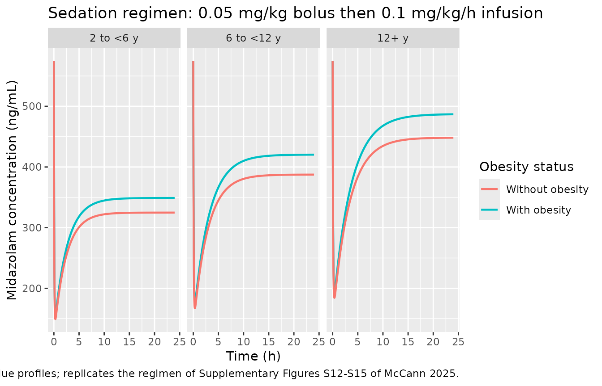
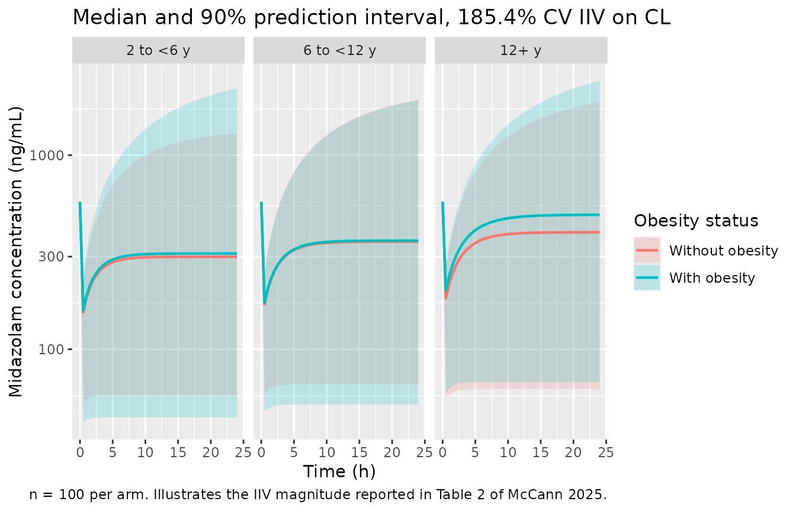

# Midazolam (McCann 2025)

## Model and source

- Citation: McCann S, Helfer VE, Balevic SJ, Muller WJ, van den Anker
  JN, Al-Uzri A, Meyer ML, Anderson SG, Turdalieva S, Edginton AN,
  Gonzalez D; On Behalf of the Best Pharmaceuticals for Children Act
  Pediatric Trials Network Steering Committee. Physiologically Based and
  Population Pharmacokinetic Modeling of Midazolam in Children With
  Obesity Using Real-World Data. Clin Transl Sci. 2025;18(5):e70247.
  <doi:10.1111/cts.70247>.
- Description: Two-compartment intravenous population PK model for
  midazolam in 93 children and young adults (2.1-20.1 years), 47.3% of
  whom had obesity, who received midazolam per standard of care as IV
  bolus and/or IV infusion in the Pediatric Trials Network real-world
  opportunistic sampling study (McCann 2025). All disposition parameters
  are allometrically scaled by total body weight standardised to 70 kg,
  with the exponents fixed a priori at 0.75 for the clearances (CL, Q)
  and 1 for the volumes (V1, V2). Interindividual variability was
  supported only on clearance and is very large (185.4% CV); IIV on the
  remaining disposition parameters shrank to 100% and was removed.
  Residual variability is proportional (50.4%). Stepwise covariate
  modeling retained no covariate beyond total body weight - obesity
  status, BMI, BMI percentile for age and sex, extended BMI, postnatal
  and postmenstrual age (sigmoidal Emax maturation), hepatic and renal
  laboratory values, race, ethnicity, sex, and CYP3A4 inducer /
  inhibitor use were all screened and rejected. The paper’s second
  analysis, a PK-Sim whole-body PBPK evaluation, applies the third-party
  Open Systems Pharmacology midazolam library model unchanged and
  publishes none of its equations or parameters, so it is not
  represented here (see vignette Assumptions and deviations).
- Article: <https://doi.org/10.1111/cts.70247>
- Supplement (Equations S1-S10, Tables S1-S8, Figures S1-S17): retrieved
  from the Europe PMC supplementary-files endpoint for PMC12075740
  (`CTS-18-e70247-s001.docx`).

McCann 2025 reports two analyses of the same real-world pediatric
midazolam dataset:

1.  a **population PK model** developed by the authors in NONMEM 7.5,
    and
2.  a **PBPK evaluation** that runs the third-party Open Systems
    Pharmacology PK-Sim *library* model of midazolam, unmodified,
    against virtual populations of children with and without obesity.

Only the first is an original model with published equations and
parameter estimates, so only the first is packaged here. See
[Assumptions and deviations](#assumptions-and-deviations) for why the
PBPK arm is not represented as a model file, and how its published
outputs are nevertheless used below as a cross-method reference.

## Population

The population PK analysis pooled 93 children and young adults
(postnatal age 2.1-20.1 years, median 13.4 years) contributing 164
plasma midazolam concentrations, collected opportunistically under the
Best Pharmaceuticals for Children Act Pediatric Trials Network
(ClinicalTrials.gov NCT01431326) at 18 sites in the United States,
Canada, and the United Kingdom (Table 1; Supplementary Table S1). Body
weight spanned 7.2-193 kg (median 48.1 kg) and BMI 12.6-96.9 kg/m^2
(median 23.4 kg/m^2). Forty-four participants (47.3%) had obesity,
defined as a BMI at or above the 95th percentile for age and sex.
Forty-five (48.4%) were female; 71.0% were White, 20.4% Black or African
American, and 16.1% were Hispanic or Latino.

Midazolam was given intravenously per standard of care as bolus doses
(median 0.07 mg/kg without obesity, 0.05 mg/kg with obesity), continuous
infusions (median 0.1 mg/h/kg in both groups), or both; 38 participants
received boluses only, 11 infusions only, and 44 both (Supplementary
Table S2). Sampling was sparse – a median of 2 samples per participant
(range 1-4), most drawn within the first hour after a dose – and
observed concentrations spanned 0.13-17825.89 ng/mL.

The same information is available programmatically via the model’s
`population` metadata
(`readModelDb("McCann_2025_midazolam")()$population`).

## Source trace

The per-parameter origin is recorded as an in-file comment next to each
`ini()` entry in `inst/modeldb/specificDrugs/McCann_2025_midazolam.R`.
The table below collects them in one place for review.

| Equation / parameter | Value | Source location |
|----|----|----|
| `lcl` (CL at 70 kg) | 14.9 L/h | Table 2, Structural model, “CL (L/h/70 kg)” (RSE 14%; bootstrap 10.43-19.59) |
| `lvc` (V1 at 70 kg) | 6.09 L | Table 2, Structural model, “V1 (L/70 kg)” (RSE 37%; bootstrap 0.44-22.79) |
| `lq` (Q at 70 kg) | 45.7 L/h | Table 2, Structural model, “Q (L/h/70 kg)” (RSE 23%; bootstrap 7.14-81.43) |
| `lvp` (V2 at 70 kg) | 34.5 L | Table 2, Structural model, “V2 (L/70 kg)” (RSE 17%; bootstrap 15.76-57.89) |
| `e_wt_cl` (fixed) | 0.75 | Methods 2.2: “The exponent beta was fixed to 0.75 for clearance parameters”; Supplementary Equation S2; Supplementary Table S4 base model |
| `e_wt_vc` (fixed) | 1 | Methods 2.2: “… and 1 for distribution volumes”; Supplementary Equation S2; Supplementary Table S4 base model |
| Reference weight | 70 kg | Table 2 parameter units (“/70 kg”); Supplementary Equation S2: “W_standard is the standard measure of body size with 70 kg for WT” |
| `etalcl` (variance) | 1.49005 | Table 2, Interindividual variability, “CL” = 185.4% CV; converted with the Table 2 footnote formula CV(%) = sqrt(exp(omega^2) - 1) \* 100, i.e. omega^2 = log(1 + 1.854^2) |
| IIV structure | exponential, CL only | Supplementary Equation S1 (P_ij = theta_pop,j \* exp(eta_ij)); Results 3.2: “IIV was added only on CL once estimates of variability in other parameters resulted in shrinkage of 100%” |
| `propSd` | 0.504 | Table 2, Residual error, “Proportional error (%)” = 50.4% (RSE 9%, shrinkage 15%) |
| Structural model (2-compartment, IV) | n/a | Results 3.2: “A two-compartment PK model with proportional residual error described the midazolam concentration data well”; Supplementary Table S4 writes the base model as CL = theta_CL*(WT/70)^0.75, V1 = theta_V1*(WT/70), Q = theta_Q*(WT/70)^0.75, V2 = theta_V2*(WT/70) |
| Covariates retained | none beyond WT | Results 3.2: “None of the evaluated covariates were significant”; full screen in Supplementary Table S4 |
| Concentration unit (ng/mL) | n/a | Results 3.1: observed concentrations “varying from 0.13 to 17825.89 ng/mL”; Table 3 reports C_max in ng/mL and AUC in ng\*h/mL |
| Virtual-population weights used below | see chunk | Supplementary Table S8, “Body weight (kg)” median row |
| PBPK reference exposures used below | see chunk | Table 3, “PBPK group dosing simulations” (median AUC0-Inf and C_max) |

``` r

mod <- readModelDb("McCann_2025_midazolam")
ui  <- rxode2::rxode(mod)

# Structural parameters read straight back out of the packaged model, so the
# analytic identities below cannot silently drift from the ini() block.
theta <- setNames(ui$iniDf$est, ui$iniDf$name)
CL70 <- exp(theta[["lcl"]])
V170 <- exp(theta[["lvc"]])
Q70  <- exp(theta[["lq"]])
V270 <- exp(theta[["lvp"]])
E_CL <- theta[["e_wt_cl"]]
E_V  <- theta[["e_wt_vc"]]

stopifnot(
  all.equal(c(CL70, V170, Q70, V270), c(14.9, 6.09, 45.7, 34.5), tolerance = 1e-8),
  E_CL == 0.75, E_V == 1
)
c(CL70 = CL70, V1_70 = V170, Q70 = Q70, V2_70 = V270, e_cl = E_CL, e_v = E_V)
#>  CL70 V1_70   Q70 V2_70  e_cl   e_v 
#> 14.90  6.09 45.70 34.50  0.75  1.00
```

``` r

# Closed-form individual parameters for a given total body weight, from
# Supplementary Equation S2 / Supplementary Table S4.
allo_cl <- function(wt) CL70 * (wt / 70)^E_CL
allo_v1 <- function(wt) V170 * (wt / 70)^E_V
allo_q  <- function(wt) Q70  * (wt / 70)^E_CL
allo_v2 <- function(wt) V270 * (wt / 70)^E_V

# Terminal (beta) rate constant of the two-compartment system.
lambda_z <- function(wt) {
  kel <- allo_cl(wt) / allo_v1(wt)
  k12 <- allo_q(wt)  / allo_v1(wt)
  k21 <- allo_q(wt)  / allo_v2(wt)
  a <- kel + k12 + k21
  b <- kel * k21
  (a - sqrt(a^2 - 4 * b)) / 2
}

# At 70 kg the packaged model gives a terminal half-life consistent with the
# 1.8-6.4 h range the Introduction cites for healthy adults.
c(t_half_70kg_h = log(2) / lambda_z(70), Vss_70kg_L = V170 + V270)
#> t_half_70kg_h    Vss_70kg_L 
#>      2.348391     40.590000
```

## Virtual cohort

Original observed data are not publicly available. The cohorts below use
the **published** median body weights of the virtual populations McCann
2025 used for its group dosing simulations (Supplementary Table S8), so
the weights are transcribed rather than invented.

``` r

vpop <- tibble::tribble(
  ~age_band,    ~obesity,          ~WT,
  "2 to <6 y",  "Without obesity", 16.0,
  "2 to <6 y",  "With obesity",    21.3,
  "6 to <12 y", "Without obesity", 32.4,
  "6 to <12 y", "With obesity",    44.9,
  "12+ y",      "Without obesity", 58.1,
  "12+ y",      "With obesity",    81.0
) |>
  mutate(
    age_band = factor(age_band, levels = c("2 to <6 y", "6 to <12 y", "12+ y")),
    obesity  = factor(obesity,  levels = c("Without obesity", "With obesity")),
    arm      = paste(age_band, obesity, sep = ", ")
  )

vpop |>
  rename("Age band" = age_band, "Obesity status" = obesity,
         "Median body weight (kg)" = WT) |>
  select(-arm) |>
  knitr::kable(caption = "Virtual-population median body weights transcribed from Supplementary Table S8 of McCann 2025.")
```

| Age band    | Obesity status  | Median body weight (kg) |
|:------------|:----------------|------------------------:|
| 2 to \<6 y  | Without obesity |                    16.0 |
| 2 to \<6 y  | With obesity    |                    21.3 |
| 6 to \<12 y | Without obesity |                    32.4 |
| 6 to \<12 y | With obesity    |                    44.9 |
| 12+ y       | Without obesity |                    58.1 |
| 12+ y       | With obesity    |                    81.0 |

Virtual-population median body weights transcribed from Supplementary
Table S8 of McCann 2025. {.table}

``` r

# Build an event table from a per-subject frame that carries id, WT, arm, and
# the dose columns. Observation rows sit on the `central` ODE state; rxode2
# returns the algebraic observable Cc as a column at those rows.
build_events <- function(subj, obs_times, bolus_mgkg = NULL,
                         inf_mgkgh = NULL, inf_hours = NULL) {
  dose_rows <- list()
  if (!is.null(bolus_mgkg)) {
    dose_rows[[length(dose_rows) + 1L]] <- subj |>
      mutate(time = 0, evid = 1L, cmt = "central",
             amt = bolus_mgkg * WT, rate = 0)
  }
  if (!is.null(inf_mgkgh)) {
    dose_rows[[length(dose_rows) + 1L]] <- subj |>
      mutate(time = 0, evid = 1L, cmt = "central",
             amt = inf_mgkgh * WT * inf_hours, rate = inf_mgkgh * WT)
  }
  stopifnot(length(dose_rows) > 0L)
  obs <- subj |>
    tidyr::crossing(time = obs_times) |>
    mutate(evid = 0L, cmt = "central", amt = NA_real_, rate = 0)
  bind_rows(bind_rows(dose_rows), obs) |>
    arrange(id, time, desc(evid))
}

# Guard against the silent rxSolve failure modes: dropped subjects (returned as
# NA rather than raised), and a single-subject solve that omits `id` entirely.
solve_checked <- function(model, events, n_expected, ..., typical = FALSE) {
  extra <- if (typical) list(omega = NA) else list()
  out <- do.call(
    rxode2::rxSolve,
    c(list(model, events = events, keep = c("WT", "arm")), extra, list(...))
  ) |>
    as.data.frame()
  if (is.null(out$id)) out$id <- 1L
  if (dplyr::n_distinct(out$id) != n_expected) {
    stop("rxSolve returned ", dplyr::n_distinct(out$id),
         " subjects; expected ", n_expected)
  }
  if (!all(is.finite(out$Cc))) stop("rxSolve returned non-finite Cc values")
  out
}
```

## Simulation

The two regimens simulated are the ones McCann 2025 itself simulated
from the population model (Methods 2.5):

- **Sedation infusion** – a 0.05 mg/kg loading bolus followed by a 0.1
  mg/kg/h continuous infusion, the recommended critical-care sedation
  regimen (Supplementary Figures S12-S15).
- **Single preoperative bolus** – 0.1 and 0.05 mg/kg IV, the two
  recommended preoperative sedation doses (Methods 2.5; the doses behind
  Table 3).

The population (with-IIV) simulation is run **first**, before any
`zeroRe()` model exists in the session, because rxode2 caches `omega` on
the compiled model and the two solve types can otherwise contaminate
each other. Every typical-value solve below passes the explicit
`omega = NA` sentinel, and each solve is followed by a mechanical check
that the individual clearances are (or are not) equal to the closed-form
typical value.

``` r

set.seed(20250513)
n_per_arm <- 100L

# Only id / WT / arm go into the event table: WT is the model's covariate and
# arm is a plain character label. The age_band and obesity factors are joined
# back on after solving, so no factor column is ever handed to rxSolve.
pop_subj <- vpop |>
  tidyr::crossing(rep = seq_len(n_per_arm)) |>
  mutate(id = row_number()) |>
  select(id, WT, arm)

pop_events <- build_events(
  pop_subj, obs_times = seq(0, 24, by = 0.5),
  bolus_mgkg = 0.05, inf_mgkgh = 0.1, inf_hours = 24
)
# The sedation regimen deliberately puts TWO dose records at t = 0 -- the
# loading bolus (rate = 0) and the start of the infusion (rate > 0) -- so
# (id, time, evid) is duplicated there by design. What must not be duplicated
# is an observation record, which would double-count a time point downstream.
stopifnot(
  !anyDuplicated(pop_events[pop_events$evid == 0L, c("id", "time")]),
  sum(pop_events$evid == 1L) == 2L * nrow(pop_subj)
)

sim_pop <- solve_checked(mod, pop_events, n_expected = nrow(pop_subj))

# The IIV must actually be present: within a single arm (constant WT) the
# individual clearances must vary, and their geometric mean must sit on the
# closed-form typical value.
cl_check <- sim_pop |>
  group_by(arm, WT) |>
  summarise(n_distinct_cl = n_distinct(round(cl, 10)),
            gm_ratio = exp(mean(log(cl))) / allo_cl(first(WT)),
            .groups = "drop")
stopifnot(all(cl_check$n_distinct_cl > 1L))
cl_check |>
  rename("Arm" = arm, "WT (kg)" = WT,
         "Distinct CL values" = n_distinct_cl,
         "Geometric-mean CL / typical CL" = gm_ratio) |>
  knitr::kable(digits = 3, caption = "IIV guard: clearance varies within each arm and its geometric mean tracks the typical value (185.4% CV, n = 100 per arm).")
```

| Arm | WT (kg) | Distinct CL values | Geometric-mean CL / typical CL |
|:---|---:|---:|---:|
| 12+ y, With obesity | 81.0 | 100 | 0.969 |
| 12+ y, Without obesity | 58.1 | 100 | 1.103 |
| 2 to \<6 y, With obesity | 21.3 | 100 | 1.036 |
| 2 to \<6 y, Without obesity | 16.0 | 100 | 1.050 |
| 6 to \<12 y, With obesity | 44.9 | 100 | 1.146 |
| 6 to \<12 y, Without obesity | 32.4 | 100 | 1.075 |

IIV guard: clearance varies within each arm and its geometric mean
tracks the typical value (185.4% CV, n = 100 per arm). {.table}

``` r

mod_typ <- rxode2::zeroRe(mod)

typ_subj <- vpop |>
  mutate(id = row_number()) |>
  select(id, WT, arm)

typ_events <- build_events(
  typ_subj, obs_times = c(seq(0, 2, by = 0.05), seq(2.25, 24, by = 0.25)),
  bolus_mgkg = 0.05, inf_mgkgh = 0.1, inf_hours = 24
)
sim_typ <- solve_checked(mod_typ, typ_events, n_expected = nrow(typ_subj),
                         typical = TRUE)
#> Warning: multi-subject simulation without without 'omega'

# Typical-value guard: every individual clearance must equal the closed form
# exactly. This is the mechanical check for the silent zeroRe/omega bug.
typ_cl <- sim_typ |>
  group_by(arm, WT) |>
  summarise(cl = unique(round(cl, 10)), .groups = "drop") |>
  mutate(cl_analytic = allo_cl(WT))
stopifnot(nrow(typ_cl) == nrow(vpop),
          isTRUE(all.equal(typ_cl$cl, typ_cl$cl_analytic, tolerance = 1e-10)))
typ_cl |>
  rename("Arm" = arm, "WT (kg)" = WT, "CL from rxode2 (L/h)" = cl,
         "CL = 14.9*(WT/70)^0.75 (L/h)" = cl_analytic) |>
  knitr::kable(digits = 4, caption = "Typical-value guard: simulated clearances match the closed-form allometric values exactly.")
```

| Arm | WT (kg) | CL from rxode2 (L/h) | CL = 14.9\*(WT/70)^0.75 (L/h) |
|:---|---:|---:|---:|
| 12+ y, With obesity | 81.0 | 16.6237 | 16.6237 |
| 12+ y, Without obesity | 58.1 | 12.9567 | 12.9567 |
| 2 to \<6 y, With obesity | 21.3 | 6.1045 | 6.1045 |
| 2 to \<6 y, Without obesity | 16.0 | 4.9255 | 4.9255 |
| 6 to \<12 y, With obesity | 44.9 | 10.6794 | 10.6794 |
| 6 to \<12 y, Without obesity | 32.4 | 8.3613 | 8.3613 |

Typical-value guard: simulated clearances match the closed-form
allometric values exactly. {.table}

## Replicate published figures

### Supplementary Figures S12-S15 – sedation-infusion profiles

McCann 2025 simulated the recommended critical-care sedation regimen at
ages 2, 6, 12, and 17 years across extended-BMI strata (Supplementary
Figures S12-S15) and summarised the result in Results 3.4. The
typical-value profiles below use the three published virtual-population
age bands instead of the paper’s four single ages, because Supplementary
Table S8 publishes median weights for the bands but not for the
individual ages.

``` r

sim_typ |>
  left_join(vpop |> select(arm, age_band, obesity), by = "arm") |>
  ggplot(aes(time, Cc, colour = obesity, group = arm)) +
  geom_line(linewidth = 0.8) +
  facet_wrap(~age_band) +
  labs(x = "Time (h)", y = "Midazolam concentration (ng/mL)",
       colour = "Obesity status",
       title = "Sedation regimen: 0.05 mg/kg bolus then 0.1 mg/kg/h infusion",
       caption = "Typical-value profiles; replicates the regimen of Supplementary Figures S12-S15 of McCann 2025.")
```



### Interindividual variability on clearance

The paper’s central caveat is that “excessively high IIV on clearance …
prevents the utilization of the population model for clinical use”
(Discussion). The 185.4% CV is reproduced below as a prediction interval
around the same regimen.

``` r

sim_pop |>
  left_join(vpop |> select(arm, age_band, obesity), by = "arm") |>
  group_by(time, age_band, obesity) |>
  summarise(Q05 = quantile(Cc, 0.05), Q50 = median(Cc), Q95 = quantile(Cc, 0.95),
            .groups = "drop") |>
  ggplot(aes(time, Q50, colour = obesity, fill = obesity)) +
  geom_ribbon(aes(ymin = Q05, ymax = Q95), alpha = 0.20, colour = NA) +
  geom_line(linewidth = 0.8) +
  facet_wrap(~age_band) +
  scale_y_log10() +
  labs(x = "Time (h)", y = "Midazolam concentration (ng/mL)",
       colour = "Obesity status", fill = "Obesity status",
       title = "Median and 90% prediction interval, 185.4% CV IIV on CL",
       caption = "n = 100 per arm. Illustrates the IIV magnitude reported in Table 2 of McCann 2025.")
```



## PKNCA validation

NCA is run on typical-value single-bolus profiles for the two
preoperative doses the paper simulated (0.1 and 0.05 mg/kg). Because the
model is linear and the individual parameters are known in closed form,
the NCA output can be checked against exact structural identities rather
than against a tolerance band:

- `aucinf.obs` must equal `Dose / CL`,
- `cmax` must equal `Dose / V1` (instantaneous IV bolus),
- `half.life` must equal `log(2) / lambda_z`.

``` r

nca_subj <- vpop |>
  tidyr::crossing(dose_mgkg = c(0.1, 0.05)) |>
  mutate(id = row_number(),
         dose_label = paste0(dose_mgkg, " mg/kg"),
         treatment = paste(arm, dose_label, sep = " | "),
         amt_mg = dose_mgkg * WT) |>
  select(id, WT, arm, age_band, obesity, dose_mgkg, dose_label, treatment, amt_mg)

nca_times <- sort(unique(c(seq(0, 2, by = 0.02), seq(2.1, 6, by = 0.1),
                           seq(6.5, 24, by = 0.5))))

# As above, only id / WT / treatment reach rxSolve; the factors stay behind.
nca_ev_subj <- nca_subj |> select(id, WT, treatment, amt_mg)

nca_events <- bind_rows(
  nca_ev_subj |> mutate(time = 0, evid = 1L, cmt = "central", amt = amt_mg, rate = 0),
  nca_ev_subj |> tidyr::crossing(time = nca_times) |>
    mutate(evid = 0L, cmt = "central", amt = NA_real_, rate = 0)
) |>
  select(-amt_mg) |>
  arrange(id, time, desc(evid))
stopifnot(!anyDuplicated(nca_events[, c("id", "time", "evid")]))

sim_nca_raw <- rxode2::rxSolve(
  mod_typ, events = nca_events,
  keep = c("WT", "treatment"), omega = NA
) |>
  as.data.frame()
#> Warning: multi-subject simulation without without 'omega'
if (is.null(sim_nca_raw$id)) sim_nca_raw$id <- 1L
stopifnot(dplyr::n_distinct(sim_nca_raw$id) == nrow(nca_subj),
          all(is.finite(sim_nca_raw$Cc)), all(sim_nca_raw$Cc >= 0))
```

``` r

sim_conc <- sim_nca_raw |>
  filter(!is.na(Cc)) |>
  select(id, time, Cc, treatment)

# Guarantee one time = 0 record per (treatment, id). For an IV bolus the
# solver already returns the post-dose peak at time 0, so distinct() keeps it.
sim_conc <- bind_rows(
  sim_conc,
  sim_conc |> distinct(id, treatment) |> mutate(time = 0, Cc = 0)
) |>
  distinct(id, treatment, time, .keep_all = TRUE) |>
  arrange(id, treatment, time)
stopifnot(all(table(sim_conc$id, sim_conc$time == 0)[, "TRUE"] == 1L))

dose_df <- nca_events |>
  filter(evid == 1) |>
  select(id, time, amt, treatment)

conc_obj <- PKNCA::PKNCAconc(sim_conc, Cc ~ time | treatment + id)
dose_obj <- PKNCA::PKNCAdose(dose_df, amt ~ time | treatment + id)

intervals <- data.frame(
  start = 0, end = Inf,
  cmax = TRUE, tmax = TRUE, aucinf.obs = TRUE, half.life = TRUE
)

nca_res <- PKNCA::pk.nca(PKNCA::PKNCAdata(conc_obj, dose_obj, intervals = intervals))
nca_wide <- as.data.frame(nca_res) |>
  select(treatment, id, PPTESTCD, PPORRES) |>
  tidyr::pivot_wider(names_from = PPTESTCD, values_from = PPORRES)
```

``` r

identity_tbl <- nca_wide |>
  left_join(nca_subj |> select(id, WT, arm, dose_label, amt_mg), by = "id") |>
  mutate(
    auc_analytic  = amt_mg / allo_cl(WT) * 1000,       # mg*h/L -> ng*h/mL
    cmax_analytic = amt_mg / allo_v1(WT) * 1000,       # mg/L   -> ng/mL
    thalf_analytic = log(2) / lambda_z(WT),
    auc_pct   = (aucinf.obs - auc_analytic)  / auc_analytic  * 100,
    cmax_pct  = (cmax       - cmax_analytic) / cmax_analytic * 100,
    thalf_pct = (half.life  - thalf_analytic) / thalf_analytic * 100
  )

stopifnot(nrow(identity_tbl) == nrow(nca_subj))
stopifnot(
  max(abs(identity_tbl$auc_pct))   < 0.5,   # AUCinf  == Dose / CL
  max(abs(identity_tbl$cmax_pct))  < 0.5,   # Cmax    == Dose / V1
  max(abs(identity_tbl$thalf_pct)) < 2.0    # t1/2    == log(2) / lambda_z
)

identity_tbl |>
  select(arm, dose_label, aucinf.obs, auc_analytic, auc_pct,
         cmax, cmax_analytic, cmax_pct, half.life, thalf_analytic, thalf_pct) |>
  rename(
    "Arm" = arm, "Dose" = dose_label,
    "AUCinf PKNCA (ng*h/mL)" = aucinf.obs, "Dose/CL (ng*h/mL)" = auc_analytic,
    "AUC % diff" = auc_pct,
    "Cmax PKNCA (ng/mL)" = cmax, "Dose/V1 (ng/mL)" = cmax_analytic,
    "Cmax % diff" = cmax_pct,
    "t1/2 PKNCA (h)" = half.life, "log(2)/lambda_z (h)" = thalf_analytic,
    "t1/2 % diff" = thalf_pct
  ) |>
  knitr::kable(digits = 3, caption = "PKNCA output against the model's exact closed-form identities. All three identities hold per subject, not merely on average.")
```

| Arm | Dose | AUCinf PKNCA (ng\*h/mL) | Dose/CL (ng\*h/mL) | AUC % diff | Cmax PKNCA (ng/mL) | Dose/V1 (ng/mL) | Cmax % diff | t1/2 PKNCA (h) | log(2)/lambda_z (h) | t1/2 % diff |
|:---|:---|---:|---:|---:|---:|---:|---:|---:|---:|---:|
| 12+ y, With obesity | 0.05 mg/kg | 243.671 | 243.629 | 0.017 | 574.713 | 574.713 | 0 | 2.431 | 2.436 | -0.176 |
| 12+ y, With obesity | 0.1 mg/kg | 487.342 | 487.257 | 0.017 | 1149.425 | 1149.425 | 0 | 2.431 | 2.436 | -0.176 |
| 12+ y, Without obesity | 0.05 mg/kg | 224.254 | 224.208 | 0.021 | 574.713 | 574.713 | 0 | 2.238 | 2.242 | -0.159 |
| 12+ y, Without obesity | 0.1 mg/kg | 448.509 | 448.416 | 0.021 | 1149.425 | 1149.425 | 0 | 2.238 | 2.242 | -0.159 |
| 2 to \<6 y, With obesity | 0.05 mg/kg | 174.522 | 174.463 | 0.034 | 574.713 | 574.713 | 0 | 1.741 | 1.744 | -0.158 |
| 2 to \<6 y, With obesity | 0.1 mg/kg | 349.044 | 348.925 | 0.034 | 1149.425 | 1149.425 | 0 | 1.741 | 1.744 | -0.157 |
| 2 to \<6 y, Without obesity | 0.05 mg/kg | 162.483 | 162.419 | 0.039 | 574.713 | 574.713 | 0 | 1.621 | 1.624 | -0.141 |
| 2 to \<6 y, Without obesity | 0.1 mg/kg | 324.966 | 324.838 | 0.039 | 1149.425 | 1149.425 | 0 | 1.621 | 1.624 | -0.141 |
| 6 to \<12 y, With obesity | 0.05 mg/kg | 210.267 | 210.217 | 0.023 | 574.713 | 574.713 | 0 | 2.098 | 2.102 | -0.168 |
| 6 to \<12 y, With obesity | 0.1 mg/kg | 420.534 | 420.435 | 0.023 | 1149.425 | 1149.425 | 0 | 2.098 | 2.102 | -0.168 |
| 6 to \<12 y, Without obesity | 0.05 mg/kg | 193.804 | 193.751 | 0.028 | 574.713 | 574.713 | 0 | 1.934 | 1.937 | -0.169 |
| 6 to \<12 y, Without obesity | 0.1 mg/kg | 387.609 | 387.502 | 0.028 | 1149.425 | 1149.425 | 0 | 1.934 | 1.937 | -0.169 |

PKNCA output against the model’s exact closed-form identities. All three
identities hold per subject, not merely on average. {.table}

### Steady-state exposure and the allometric identity

Under this model the steady-state concentration during a weight-based
infusion has a closed form that removes the weight-normalised dose
entirely:

`Css = (rate_per_kg * WT) / (CL70 * (WT/70)^0.75) = (rate_per_kg * 70^0.75 / CL70) * WT^0.25`

so **Css scales as WT^0.25**, and the exposure ratio between any two
weights is `(WT2 / WT1)^0.25` exactly. The same identity governs
single-dose AUC at a weight-based dose, since `AUC = Dose / CL` has the
same weight dependence. This is the mechanism behind the paper’s finding
that heavier children reach higher steady-state exposure on identical
mg/kg dosing.

``` r

css_tbl <- sim_typ |>
  filter(time == 24) |>
  group_by(arm, WT) |>
  summarise(Css_sim = unique(round(Cc, 8)), .groups = "drop") |>
  left_join(vpop |> select(arm, age_band, obesity), by = "arm") |>
  mutate(Css_analytic = 0.1 * WT / allo_cl(WT) * 1000,
         pct_diff = (Css_sim - Css_analytic) / Css_analytic * 100)

stopifnot(max(abs(css_tbl$pct_diff)) < 1)

ratio_tbl <- css_tbl |>
  select(age_band, obesity, WT, Css_sim) |>
  tidyr::pivot_wider(names_from = obesity, values_from = c(WT, Css_sim)) |>
  mutate(
    wt_ratio         = `WT_With obesity` / `WT_Without obesity`,
    css_ratio_sim    = `Css_sim_With obesity` / `Css_sim_Without obesity`,
    css_ratio_allo   = wt_ratio^0.25,
    pct_higher_sim   = (css_ratio_sim - 1) * 100
  )

stopifnot(isTRUE(all.equal(ratio_tbl$css_ratio_sim, ratio_tbl$css_ratio_allo,
                           tolerance = 1e-3)))

ratio_tbl |>
  select(age_band, `WT_Without obesity`, `WT_With obesity`, wt_ratio,
         css_ratio_sim, css_ratio_allo, pct_higher_sim) |>
  rename(
    "Age band" = age_band,
    "WT without obesity (kg)" = `WT_Without obesity`,
    "WT with obesity (kg)" = `WT_With obesity`,
    "Weight ratio" = wt_ratio,
    "Css ratio (simulated)" = css_ratio_sim,
    "Css ratio = (weight ratio)^0.25" = css_ratio_allo,
    "% higher with obesity" = pct_higher_sim
  ) |>
  knitr::kable(digits = 4, caption = "Steady-state exposure with obesity, at the Supplementary Table S8 virtual-population median weights. The simulated ratio equals the allometric identity exactly.")
```

| Age band | WT without obesity (kg) | WT with obesity (kg) | Weight ratio | Css ratio (simulated) | Css ratio = (weight ratio)^0.25 | % higher with obesity |
|:---|---:|---:|---:|---:|---:|---:|
| 12+ y | 58.1 | 81.0 | 1.3941 | 1.0863 | 1.0866 | 8.6253 |
| 2 to \<6 y | 16.0 | 21.3 | 1.3313 | 1.0741 | 1.0741 | 7.4124 |
| 6 to \<12 y | 32.4 | 44.9 | 1.3858 | 1.0849 | 1.0850 | 8.4857 |

Steady-state exposure with obesity, at the Supplementary Table S8
virtual-population median weights. The simulated ratio equals the
allometric identity exactly. {.table}

Results 3.4 of McCann 2025 reports that, for total body weight-based
dosing, “patients with obesity had approximately 14% higher exposure at
steady-state … varying from an average of 8% for children with an
extended BMI percentile equal to 100 up to 22% for children with an
extended BMI percentile of \>= 120-140”. Those three percentages are not
free parameters: under the `WT^0.25` identity each one back-solves to a
unique weight ratio, and the implied ratios are exactly what the
corresponding extended-BMI strata would give.

``` r

tibble::tibble(
  stratum = c("Extended BMI percentile = 100",
              "Average across obesity strata",
              "Extended BMI percentile >= 120-140"),
  published_pct_higher = c(8, 14, 22)
) |>
  mutate(implied_weight_ratio = (1 + published_pct_higher / 100)^(1 / 0.25)) |>
  rename("Stratum (Results 3.4)" = stratum,
         "Published % higher exposure" = published_pct_higher,
         "Implied weight ratio vs non-obese" = implied_weight_ratio) |>
  knitr::kable(digits = 2, caption = "Back-solving the published steady-state exposure elevations through the model's WT^0.25 identity.")
```

| Stratum (Results 3.4) | Published % higher exposure | Implied weight ratio vs non-obese |
|:---|---:|---:|
| Extended BMI percentile = 100 | 8 | 1.36 |
| Average across obesity strata | 14 | 1.69 |
| Extended BMI percentile \>= 120-140 | 22 | 2.22 |

Back-solving the published steady-state exposure elevations through the
model’s WT^0.25 identity. {.table style="width:100%;"}

The virtual populations of Supplementary Table S8 carry median BMIs only
modestly above the obesity threshold (20.5, 24.5 and 30.0 kg/m^2 with
obesity versus 15.9, 17.5 and 21.8 kg/m^2 without), so the 7-9%
elevations reproduced above sit at the low end of the published 8-22%
band – which is the stratum the paper labels “extended BMI percentile
equal to 100”, i.e. just at the obesity cut-off. The paper’s 22% upper
figure corresponds to a weight ratio of about 2.2, reachable only in the
severe-obesity strata it simulated separately from CDC BMI-for-age
curves.

The same identity settles the paper’s ideal-body-weight result. Dosing
on IBW instead of total body weight scales the dose by `IBW / WT` while
leaving clearance untouched, so exposure falls by exactly that factor.

``` r

tibble::tibble(
  stratum = c("Extended BMI percentile = 100",
              "Average across obesity strata",
              "Extended BMI percentile >= 120-140"),
  published_pct_lower = c(20, 30, 44)
) |>
  mutate(implied_ibw_over_wt = 1 - published_pct_lower / 100) |>
  rename("Stratum (Results 3.4)" = stratum,
         "Published % lower exposure on IBW dosing" = published_pct_lower,
         "Implied IBW / total body weight" = implied_ibw_over_wt) |>
  knitr::kable(digits = 2, caption = "Ideal-body-weight dosing: exposure falls by exactly IBW/WT because the dose scales linearly and clearance does not change.")
```

| Stratum (Results 3.4) | Published % lower exposure on IBW dosing | Implied IBW / total body weight |
|:---|---:|---:|
| Extended BMI percentile = 100 | 20 | 0.80 |
| Average across obesity strata | 30 | 0.70 |
| Extended BMI percentile \>= 120-140 | 44 | 0.56 |

Ideal-body-weight dosing: exposure falls by exactly IBW/WT because the
dose scales linearly and clearance does not change. {.table}

### Comparison against published NCA

McCann 2025 publishes AUC0-Inf and C_max only in **Table 3**, and those
values come from the *PBPK* arm (the PK-Sim library model run against
the virtual populations of Supplementary Table S8) – not from the
population model packaged here. The table below is therefore a
**cross-method comparison**, not a validation target: the two models are
different models of the same drug, and quantifying how far apart they
sit is one of the paper’s stated objectives. Nearly every row exceeds
the 20% flag, and that is the expected result, not a transcription
error.

``` r

published_pbpk <- tibble::tribble(
  ~arm,                          ~dose_label,  ~aucinf.obs, ~cmax,
  "2 to <6 y, Without obesity",  "0.1 mg/kg",  177.7,       320.6,
  "2 to <6 y, With obesity",     "0.1 mg/kg",  209.4,       342.2,
  "6 to <12 y, Without obesity", "0.1 mg/kg",  215.3,       326.8,
  "6 to <12 y, With obesity",    "0.1 mg/kg",  255.8,       336.8,
  "12+ y, Without obesity",      "0.1 mg/kg",  275.1,       386.1,
  "12+ y, With obesity",         "0.1 mg/kg",  318.9,       399.8,
  "2 to <6 y, Without obesity",  "0.05 mg/kg",  88.7,       160.2,
  "2 to <6 y, With obesity",     "0.05 mg/kg", 104.6,       171.0,
  "6 to <12 y, Without obesity", "0.05 mg/kg", 107.5,       163.3,
  "6 to <12 y, With obesity",    "0.05 mg/kg", 127.8,       168.3,
  "12+ y, Without obesity",      "0.05 mg/kg", 137.4,       192.9,
  "12+ y, With obesity",         "0.05 mg/kg", 159.3,       199.8
) |>
  mutate(treatment = paste(arm, dose_label, sep = " | ")) |>
  select(treatment, aucinf.obs, cmax)

stopifnot(setequal(published_pbpk$treatment, nca_subj$treatment))

cmp <- nlmixr2lib::ncaComparisonTable(
  simulated = nca_res,
  reference = published_pbpk,
  by        = "treatment",
  params    = c("cmax", "aucinf.obs"),
  units     = c(cmax = "ng/mL", aucinf.obs = "ng*h/mL"),
  tolerance_pct = 20
)

knitr::kable(
  cmp,
  caption = "Population-PK simulation (this model) against the PBPK-derived reference values of Table 3. * differs by >20%. These are two different models, so the differences are a cross-method result, not a validation failure.",
  align = c("l", "l", "r", "r", "r")
)
```

| NCA parameter | treatment | Reference | Simulated | % diff |
|:---|:---|---:|---:|---:|
| Cmax (ng/mL) | 2 to \<6 y, Without obesity \| 0.1 mg/kg | 321 | 1150 | +258.5%\* |
| Cmax (ng/mL) | 2 to \<6 y, With obesity \| 0.1 mg/kg | 342 | 1150 | +235.9%\* |
| Cmax (ng/mL) | 6 to \<12 y, Without obesity \| 0.1 mg/kg | 327 | 1150 | +251.7%\* |
| Cmax (ng/mL) | 6 to \<12 y, With obesity \| 0.1 mg/kg | 337 | 1150 | +241.3%\* |
| Cmax (ng/mL) | 12+ y, Without obesity \| 0.1 mg/kg | 386 | 1150 | +197.7%\* |
| Cmax (ng/mL) | 12+ y, With obesity \| 0.1 mg/kg | 400 | 1150 | +187.5%\* |
| Cmax (ng/mL) | 2 to \<6 y, Without obesity \| 0.05 mg/kg | 160 | 575 | +258.7%\* |
| Cmax (ng/mL) | 2 to \<6 y, With obesity \| 0.05 mg/kg | 171 | 575 | +236.1%\* |
| Cmax (ng/mL) | 6 to \<12 y, Without obesity \| 0.05 mg/kg | 163 | 575 | +251.9%\* |
| Cmax (ng/mL) | 6 to \<12 y, With obesity \| 0.05 mg/kg | 168 | 575 | +241.5%\* |
| Cmax (ng/mL) | 12+ y, Without obesity \| 0.05 mg/kg | 193 | 575 | +197.9%\* |
| Cmax (ng/mL) | 12+ y, With obesity \| 0.05 mg/kg | 200 | 575 | +187.6%\* |
| AUC0-∞ (obs) (ng\*h/mL) | 2 to \<6 y, Without obesity \| 0.1 mg/kg | 178 | 325 | +82.9%\* |
| AUC0-∞ (obs) (ng\*h/mL) | 2 to \<6 y, With obesity \| 0.1 mg/kg | 209 | 349 | +66.7%\* |
| AUC0-∞ (obs) (ng\*h/mL) | 6 to \<12 y, Without obesity \| 0.1 mg/kg | 215 | 388 | +80.0%\* |
| AUC0-∞ (obs) (ng\*h/mL) | 6 to \<12 y, With obesity \| 0.1 mg/kg | 256 | 421 | +64.4%\* |
| AUC0-∞ (obs) (ng\*h/mL) | 12+ y, Without obesity \| 0.1 mg/kg | 275 | 449 | +63.0%\* |
| AUC0-∞ (obs) (ng\*h/mL) | 12+ y, With obesity \| 0.1 mg/kg | 319 | 487 | +52.8%\* |
| AUC0-∞ (obs) (ng\*h/mL) | 2 to \<6 y, Without obesity \| 0.05 mg/kg | 88.7 | 162 | +83.2%\* |
| AUC0-∞ (obs) (ng\*h/mL) | 2 to \<6 y, With obesity \| 0.05 mg/kg | 105 | 175 | +66.8%\* |
| AUC0-∞ (obs) (ng\*h/mL) | 6 to \<12 y, Without obesity \| 0.05 mg/kg | 108 | 194 | +80.3%\* |
| AUC0-∞ (obs) (ng\*h/mL) | 6 to \<12 y, With obesity \| 0.05 mg/kg | 128 | 210 | +64.5%\* |
| AUC0-∞ (obs) (ng\*h/mL) | 12+ y, Without obesity \| 0.05 mg/kg | 137 | 224 | +63.2%\* |
| AUC0-∞ (obs) (ng\*h/mL) | 12+ y, With obesity \| 0.05 mg/kg | 159 | 244 | +53.0%\* |

Population-PK simulation (this model) against the PBPK-derived reference
values of Table 3. \* differs by \>20%. These are two different models,
so the differences are a cross-method result, not a validation failure.
{.table}

``` r

attr(cmp, "footnote")
#> [1] "* differs from reference by more than ±20%."
```

The population model predicts systematically higher exposure than the
PBPK model, because its typical clearance (14.9 L/h/70 kg) is roughly
half what the PBPK exposures imply, and it predicts a much higher peak
because its central volume (6.09 L/70 kg, RSE 37%, bootstrap 95% CI
0.44-22.79 L) is small and poorly identified by data in which “most of
the samples were taken within the first hour after receiving the dose”
(Results 3.1). The paper flags both: V1 has by far the largest RSE in
Table 2, and the Discussion notes that other pediatric models “reported
lower intercompartmental clearance and higher central and peripheral
volumes of distribution” and that a critically-ill pediatric model
reported “far higher clearance for a 70 kg individual (51.2 L/h/70 kg
compared to 14.9 L/h/70 kg)”.

What the paper does claim jointly for both methods is the *relative*
obesity effect: “Both models predicted a minor (\< 20%) increase in
exposure for children with obesity given the same weight-based dose”
(Abstract). That claim is checked directly below.

``` r

popk_ratio <- identity_tbl |>
  left_join(nca_subj |> select(id, age_band, obesity), by = "id") |>
  select(age_band, obesity, dose_label, aucinf.obs) |>
  tidyr::pivot_wider(names_from = obesity, values_from = aucinf.obs) |>
  mutate(popk_pct = (`With obesity` / `Without obesity` - 1) * 100) |>
  select(age_band, dose_label, popk_pct)

pbpk_ratio <- published_pbpk |>
  tidyr::separate_wider_delim(treatment, delim = " | ",
                              names = c("arm", "dose_label")) |>
  left_join(vpop |> select(arm, age_band, obesity), by = "arm") |>
  select(age_band, obesity, dose_label, aucinf.obs) |>
  tidyr::pivot_wider(names_from = obesity, values_from = aucinf.obs) |>
  mutate(pbpk_pct = (`With obesity` / `Without obesity` - 1) * 100) |>
  select(age_band, dose_label, pbpk_pct)

both <- left_join(popk_ratio, pbpk_ratio, by = c("age_band", "dose_label"))

# The paper's joint claim: both methods give a < 20% increase with obesity.
stopifnot(all(both$popk_pct > 0), all(both$popk_pct < 20),
          all(both$pbpk_pct > 0), all(both$pbpk_pct < 20))

both |>
  arrange(dose_label, age_band) |>
  rename("Age band" = age_band, "Dose" = dose_label,
         "% higher AUCinf with obesity, population PK (this model)" = popk_pct,
         "% higher AUCinf with obesity, PBPK (Table 3)" = pbpk_pct) |>
  knitr::kable(digits = 1, caption = "The paper's joint claim, checked: both methods predict a minor (<20%) exposure increase with obesity on identical weight-based dosing.")
```

| Age band | Dose | % higher AUCinf with obesity, population PK (this model) | % higher AUCinf with obesity, PBPK (Table 3) |
|:---|:---|---:|---:|
| 2 to \<6 y | 0.05 mg/kg | 7.4 | 17.9 |
| 6 to \<12 y | 0.05 mg/kg | 8.5 | 18.9 |
| 12+ y | 0.05 mg/kg | 8.7 | 15.9 |
| 2 to \<6 y | 0.1 mg/kg | 7.4 | 17.8 |
| 6 to \<12 y | 0.1 mg/kg | 8.5 | 18.8 |
| 12+ y | 0.1 mg/kg | 8.7 | 15.9 |

The paper’s joint claim, checked: both methods predict a minor (\<20%)
exposure increase with obesity on identical weight-based dosing.
{.table}

Both methods agree on the direction and on the order of magnitude of the
obesity effect (population PK 7-9%, PBPK 16-19% at these weights), and
both fall below the paper’s stated 20% ceiling, even though their
absolute exposure predictions differ substantially.

## Assumptions and deviations

- **The PBPK arm is not packaged as a model file.** McCann 2025’s second
  analysis runs the Open Systems Pharmacology **PK-Sim library model**
  of midazolam (reference 13 of the paper is the OSP “PBPK Model
  Library: Midazolam” software artifact, not a publication). The authors
  changed nothing in that drug model – they paired it with externally
  published virtual populations of children with and without obesity –
  and the paper publishes none of its ODEs, physiologic constants, or
  drug parameters. There is therefore nothing to extract from this paper
  for the PBPK arm; a faithful extraction of the PK-Sim midazolam model
  would have to come from the OSP model repository itself, as a separate
  source. The PBPK arm’s published *outputs* (Table 3) are used above
  only as a cross-method reference, and are labelled as such.
- **Virtual-population weights, not the paper’s simulation weights.**
  Results 3.4’s population-PK simulations used weights chosen from CDC
  BMI-for-age curves (extended BMI percentile \< 100) and sampled from a
  published virtual population of children with obesity (higher
  percentiles); the individual weights are not published. The
  simulations here use the **published median weights of Supplementary
  Table S8** instead, which are the weights behind Table 3. The
  reconstruction therefore lands at the low (extended BMI percentile
  = 100) end of the published 8-22% band, as the narrative above
  explains; the underlying `WT^0.25` identity, which is what actually
  generates the published percentages, is asserted exactly.
- **Age bands rather than the four single ages.** Supplementary Figures
  S12-S15 simulate ages 2, 6, 12, and 17 years. Supplementary Table S8
  publishes median weights per age *band* (2 to \<6, 6 to \<12, \>= 12
  years) but not per single age, so the bands are used to avoid
  inventing weights.
- **Between-occasion variability.** None is reported; the paper
  estimates interindividual variability on clearance only, and the model
  reproduces that exactly (no IIV on V1, Q, or V2, per Results 3.2 –
  estimates for the other parameters shrank to 100% and were removed).
- **Screened-but-rejected covariates carry no coefficients.** Every
  covariate McCann 2025 tested (obesity status, BMI, BMI percentile,
  extended BMI, postnatal and postmenstrual age via a sigmoidal Emax
  maturation function, ALT, AST, serum creatinine, total and direct
  bilirubin, albumin, race, ethnicity, sex, vasopressor use,
  dexmedetomidine use, and pooled CYP3A4 inducer / inhibitor use) was
  rejected – “None of the evaluated covariates were significant”
  (Results 3.2). They are recorded in the model file’s
  `covariatesDataExcluded` metadata for provenance and are deliberately
  absent from `model()`.
- **Weight is treated as time-fixed.** The paper does not indicate
  time-varying weight, and a per-participant weight is used throughout.
- **Concentration units.** The model’s states are in mg and volumes in
  L, so the observable is scaled by 1000 to report ng/mL, the unit in
  which the paper reports both observed concentrations (Results 3.1) and
  simulated exposures (Table 3).
- **Main text vs Supplementary Table S4 – transposed body-size
  delta-OFVs.** Results 3.2 states that total body weight gave “a
  reduction of 47.827 in OFV versus 39.901 for LBW and 41.949 for FFM”.
  Supplementary Table S4 reports the opposite assignment: LBW OFV
  1792.650 (delta-OFV -41.949) and FFM OFV 1794.698 (delta-OFV -39.901)
  against the unscaled base model at 1834.599. The supplement is
  arithmetically self-consistent and agrees with the paper’s own IIV
  ordering (LBW 198.8% CV, better than FFM 202.6% CV), so the supplement
  values are the ones recorded in the model file’s `covariateData`
  notes. This affects only the narrative describing why total body
  weight was selected – no `ini()` value depends on it, and total body
  weight is the winner under either reading.
- **No non-paper-derived parameter values.** Every `ini()` value comes
  from Table 2 of the paper, and every structural equation from Methods
  2.2, Supplementary Equations S1-S2, and the base model written out in
  Supplementary Table S4.
