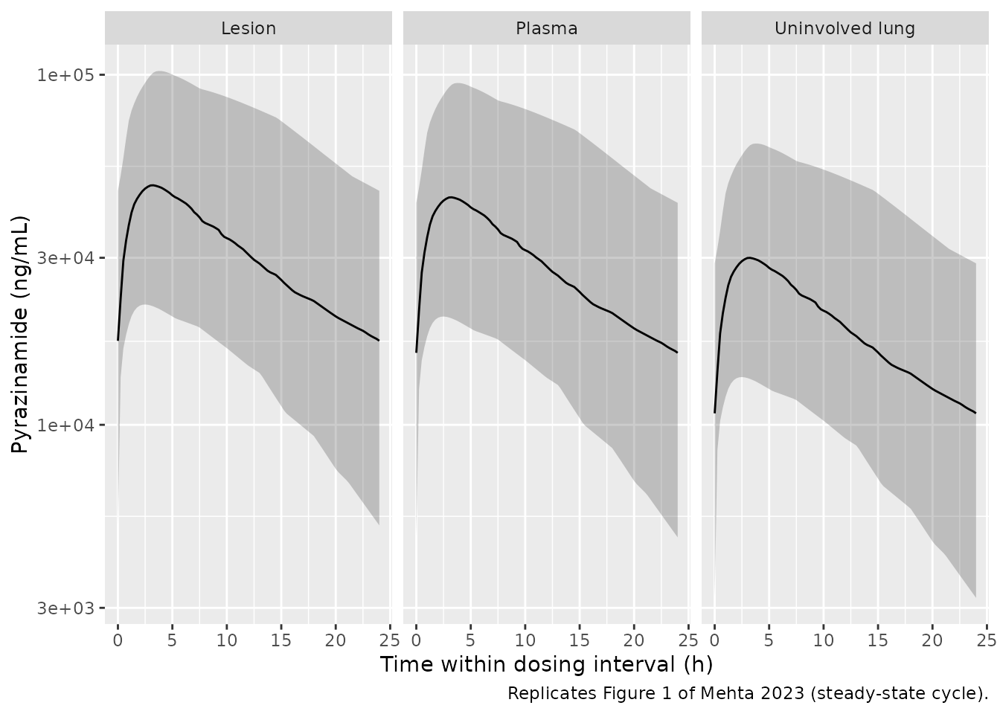
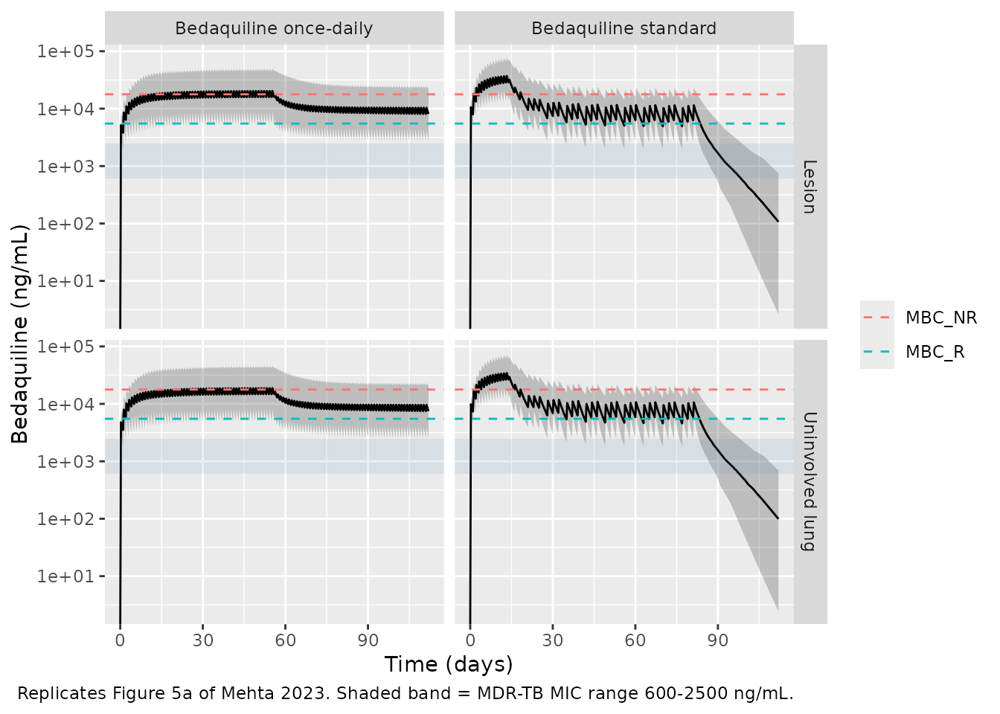
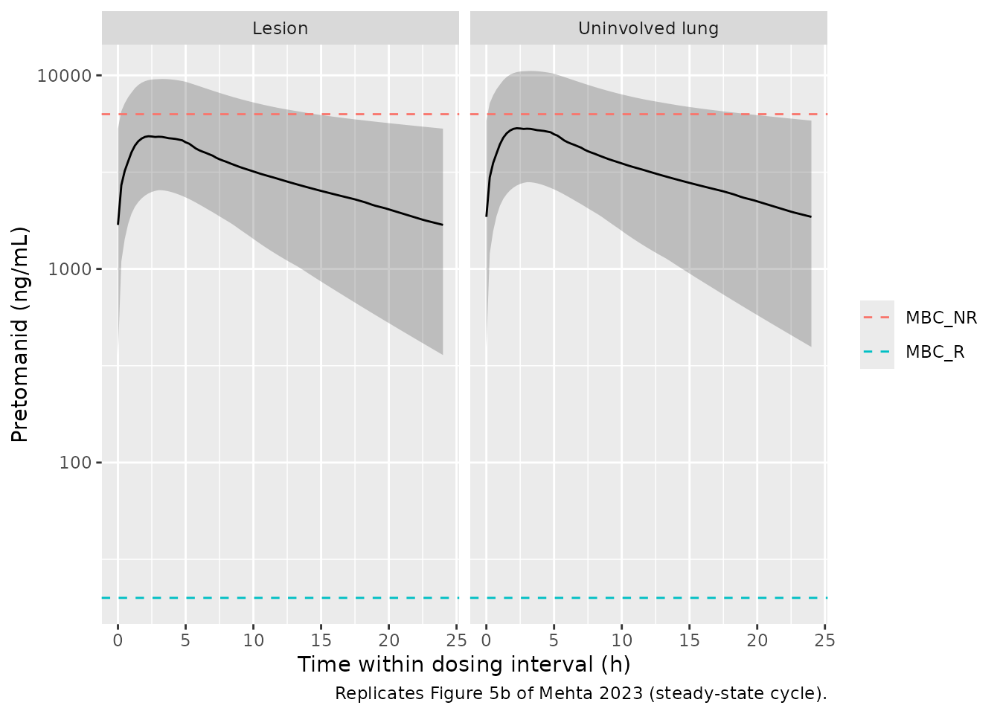
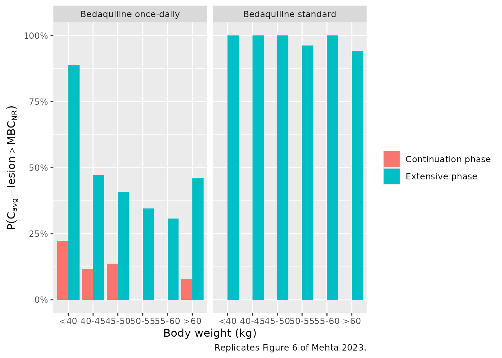

# Bedaquiline, pretomanid and pyrazinamide TB lung-lesion mPBPK (Mehta 2023)

## Model and source

Mehta et al. (2023) built a *translational minimal physiologically
based* (mPBPK) framework that predicts anti-tuberculosis drug exposure
at the site of action – inside cavitary lung lesions and in the
surrounding uninvolved lung – in TB patients, from preclinical mouse
data. The paper contributes three independent single-drug models,
extracted here as three model files that share this vignette:

- `Mehta_2023_pyrazinamide_mpbpk` – the framework-qualification model.
  It is the only one of the three whose lesion / uninvolved-lung
  predictions could be checked against observed **human** site-of-action
  data.

- `Mehta_2023_bedaquiline_mpbpk` – bedaquiline plus its N-desmethyl
  metabolite M2, with a well-stirred liver compartment.

- `Mehta_2023_pretomanid_mpbpk` – pretomanid, with saturable
  dose-dependent bioavailability.

- Article: <https://doi.org/10.1007/s40262-023-01217-7>

- Supplement (ESM S1-S6, including the “Final Model Codes”):
  <https://doi.org/10.1007/s40262-023-01217-7>

``` r

mod_bdq <- readModelDb("Mehta_2023_bedaquiline_mpbpk")
mod_ptm <- readModelDb("Mehta_2023_pretomanid_mpbpk")
mod_pza <- readModelDb("Mehta_2023_pyrazinamide_mpbpk")

rxode2::rxode2(mod_bdq)$reference
#> ℹ parameter labels from comments will be replaced by 'label()'
#> [1] "Mehta K, Guo T, van der Graaf PH, van Hasselt JGC. Predictions of Bedaquiline and Pretomanid Target Attainment in Lung Lesions of Tuberculosis Patients using Translational Minimal Physiologically Based Pharmacokinetic Modeling. Clin Pharmacokinet. 2023;62(3):519-532. doi:10.1007/s40262-023-01217-7."
```

## Population

All three models were **estimated on mouse data** and then translated to
humans; no model was fitted to individual patient data. Mouse data
comprised plasma, liver, lung-lesion and uninvolved-lung concentrations
after single oral doses (bedaquiline 25 mg/kg; pyrazinamide 150 mg/kg;
pretomanid 6-486 mg/kg), plus PET-imaging plasma / lesion /
uninvolved-lung data after intravenous F18-pretomanid (ESM S1).

Translation to TB patients replaced mouse physiology with human
physiology from Brown et al. 1997 and scaled clearance allometrically
with an exponent of 0.75. For bedaquiline, `CLint` and `CLM2` were
additionally *calibrated* to median concentration-time profiles from one
TB-patient dose group, because pure allometric scaling under-predicted
bedaquiline and over-predicted M2 (Results 3.2). Human plasma
predictions were then compared against dose-ranging data from the
TB-PACTS database (bedaquiline 100-700 mg; pretomanid 50-1200 mg;
pyrazinamide 1500 mg daily).

Simulations used 500 virtual patients, with body weight and cavity
presence / size sampled from the observed TB-PACTS distributions, and 50
trials per patient to propagate parameter uncertainty (Methods 2.2). The
underlying weight distribution is not tabulated in the paper – see
*Assumptions and deviations*.

``` r

str(mod_bdq()$population, max.level = 1)
#> List of 5
#>  $ species      : chr "human"
#>  $ n_subjects   : int 500
#>  $ disease_state: chr "Pulmonary (drug-susceptible and multidrug-resistant) tuberculosis with cavitary disease. Virtual population; ca"| __truncated__
#>  $ dose_range   : chr "Standard bedaquiline 400 mg once daily for 14 days followed by 200 mg three times weekly; alternative 200 mg on"| __truncated__
#>  $ notes        : chr "The structural model and every drug-specific parameter were estimated on mouse data (plasma, liver, lesion and "| __truncated__
```

## Source trace

Per-parameter origins are recorded as in-file comments beside each
`ini()` entry. The table below collects them for review. “ESM S2” is the
supplement’s *Final Model Codes* section, which contains the complete
RxODE source for the bedaquiline and pretomanid models.

### Structure (all three drugs)

| Equation | Source location |
|----|----|
| `d/dt(lesion) = k_le * (Cbld * R_le - lesion)` | Main text, equation 1 |
| `d/dt(lung) = k_ul * (Cbld * R_ul - lung)` | Main text, equation 1 |
| `k_i = Qc / V_i` | Main text, equation 2 |
| `V_i = V_lung * VF_i` | Main text, equation 3 |
| `VF_le = 0.0216`, `VF_ul = 1 - VF_le` | Methods 2.1.1 (mean total lesion volume ~14 mL, reference 19) |
| `Qc = 312 * (WT/70)^0.75` L/h | Table 1 (Qc human = 312 for 70 kg); ESM S2 |
| `Qh = 0.227 * Qc` | Table 1 (Qh human, fraction of Qc) |
| `V_liver = 0.0257 * WT` L | ESM S2 (Brown 1997 Table 7 human value) |
| `V_lung = 0.0076 * WT` L | ESM S2 (Brown 1997 Table 7) |
| `V_blood = (0.0514 + 0.0257) * WT` L | ESM S2; Table 1 Vbl = 0.077 fraction of body weight |
| Well-stirred liver `Eh = fu*CLint / (Qh + fu*CLint)` | ESM S2; Methods 2.1.1 |
| Allometric exponent 0.75 on CL | Methods 2.2 (reference 20) |

### Bedaquiline and M2

| Parameter | Value | Source location |
|----|----|----|
| `lka1` | 1.3 1/h | Table 1, ka1 (RSE 37.8%) |
| `lka2` | 0.00501 1/h | Table 1, ka2 (RSE 9.13%) |
| `lfdepot` | 0.609 | Table 1, frc (RSE 11.9%) |
| `lclint` | 60.3 L/h | Table 1, CLint human (RSE 16.7%) |
| `lcl_m2` | 45.9 L/h | Table 1, CLM2 human (RSE 13.6%) |
| `lk_peripheral1` | 4.45 | Table 1, KpT (RSE 15.3%) |
| `lk_peripheral1_m2` | 9.54 | Table 1, KpTM2 (RSE 18.4%) – **not** the ESM S2 value; see Errata |
| `lk_lesion` | 11 | Table 1, R_le (RSE 10.7%); ESM S2 `Rles` |
| `lk_lung` | 10.2 | Table 1, R_ul (RSE 10.9%); ESM S2 `RUL` |
| `lk_lesion_m2` | 88.4 | Table 1, R_le M2 (RSE 5.72%) |
| `lk_lung_m2` | 88.8 | Table 1, R_ul M2 (RSE 5.53%) |
| `fu` | 0.1 | Table 1, fup (reference 27) |
| `lbp` | 1 | Table 1, BP (reference 34) |
| IIV (ka1, ka2, CLint, CLM2) | 40% | Table 1 IIV row; etas per ESM S2 |
| `propSd` | 0.43 | Table 1 footnote (mouse fit) |

### Pretomanid

| Parameter | Value | Source location |
|----|----|----|
| `lka` | 0.3 1/h | Table 1, ka (RSE 23.3%) |
| `led50` | 554 mg | Table 1, ED50 human (RSE 14.8%, reference 41) |
| `lcl` | 4.42 L/h | Table 1, CL human (RSE 3.78%) |
| `lk_peripheral1` | 36.24 | ESM S2 `TVKpT` (Table 1 prints 36.3) |
| `lk_peripheral2` | 0.48 | ESM S2 `TVKpT1` (Table 1 prints 0.483) |
| `frac_peripheral2` | 0.975 | ESM S2 `FT1` (Table 1 prints 0.97) |
| `lk_lesion` | 1.6 | ESM S2 `Rles` – **not** the Table 1 value; see Errata |
| `lk_lung` | 1.76 | ESM S2 `RUL` (Table 1 prints 1.75) |
| `lbp` | 1.65 | Table 1, BP (reference 13) |
| `f(depot) = 1/(1 + DOSE/ED50)` | ESM S2 `doseIn`/`f(depot)`; Fmax assumed 1 (Table 1) |  |
| IIV (ka, CL, KpT, KpT1) | 40% | Table 1 IIV row; etas per ESM S2 |
| `propSd` | 0.12 | Table 1 footnote (mouse fit) |

### Pyrazinamide

| Parameter | Value | Source location |
|----|----|----|
| `lka` | 0.05 1/h | Table 1, ka human (RSE 7.25%), footnote a (exponent -0.25) |
| `lcl` | 3.5 L/h | Table 1, CL human (RSE 3.04%) |
| `lk_lesion` | 1.37 | Table 1, R_le (RSE 52.2%) |
| `lk_lung` | 0.85 | Table 1, R_ul (RSE 102%) |
| `lbp` | 0.79 | Table 1, BP (reference 42) |
| Structure (no tissue compartment) | – | ESM S3 panel A; Results 3.1 |
| IIV (ka, CL) | 40% | Table 1 IIV row |
| `propSd` | 0.35 | Table 1 footnote (mouse fit) |

## Virtual cohort

Original patient data are not publicly available. The cohorts below
approximate the published simulation design: body weight is log-normal
with a median of 50 kg (typical of adult pulmonary-TB trial
populations), and every patient is assumed to have a cavity of the mean
size (`VF_le` = 0.0216). Cohort size is 100 per arm.

``` r

set.seed(20230219)
n_per_arm <- 100L

sample_wt <- function(n) round(stats::rlnorm(n, meanlog = log(50), sdlog = 0.20), 1)

# Build one arm. `doses` is a data frame of dose times and amounts; `cmts` is
# the vector of compartments each dose is placed in (bedaquiline needs the full
# dose in BOTH parallel depots). Observation rows always point at an ODE state
# (`blood`), never at an algebraic observable.
make_arm <- function(n, arm, doses, cmts, obs_times, id_offset = 0L) {
  subj <- tibble(id = id_offset + seq_len(n), WT = sample_wt(n))
  dosing <- subj |>
    tidyr::crossing(doses) |>
    tidyr::crossing(cmt = cmts) |>
    mutate(evid = 1L)
  obs <- subj |>
    tidyr::crossing(time = obs_times) |>
    mutate(amt = NA_real_, evid = 0L, cmt = "blood")
  bind_rows(dosing, obs) |>
    mutate(arm = arm) |>
    arrange(id, time, desc(evid))
}

day <- 24
# Bedaquiline standard: 400 mg QD for 14 days, then 200 mg three times weekly.
tiw <- as.vector(outer(c(0, 2, 4) * day, seq(0, 9) * 7 * day, "+")) + 14 * day
bdq_std_doses <- bind_rows(
  tibble(time = seq(0, 13) * day, amt = 400),
  tibble(time = sort(tiw),        amt = 200)
)
# Bedaquiline alternative: 200 mg QD for 8 weeks, then 100 mg QD.
bdq_qd_doses <- bind_rows(
  tibble(time = seq(0, 55) * day,  amt = 200),
  tibble(time = seq(56, 111) * day, amt = 100)
)

# Evaluation windows: the end of the extensive phase, and the end of the
# continuation phase. A coarse grid covers the rest of the profile.
bdq_end <- 112 * day
bdq_obs <- sort(unique(c(
  seq(0, bdq_end, by = 6),
  seq(13 * day, 14 * day, by = 0.5),
  seq(bdq_end - 7 * day, bdq_end, by = 0.5)
)))

events_bdq <- bind_rows(
  make_arm(n_per_arm, "Bedaquiline standard", bdq_std_doses,
           c("depot1", "depot2"), bdq_obs, id_offset = 0L),
  make_arm(n_per_arm, "Bedaquiline once-daily", bdq_qd_doses,
           c("depot1", "depot2"), bdq_obs, id_offset = 1000L)
)

ptm_end <- 21 * day
events_ptm <- make_arm(
  n_per_arm, "Pretomanid 200 mg QD",
  tibble(time = seq(0, 20) * day, amt = 200), "depot",
  sort(unique(c(seq(0, ptm_end, by = 3), seq(ptm_end - day, ptm_end, by = 0.25))))
) |>
  mutate(DOSE_PTM_MG = 200)

pza_end <- 10 * day
events_pza <- make_arm(
  n_per_arm, "Pyrazinamide 1500 mg QD",
  tibble(time = seq(0, 9) * day, amt = 1500), "depot",
  sort(unique(c(seq(0, pza_end, by = 3), seq(pza_end - day, pza_end, by = 0.25))))
)

stopifnot(!anyDuplicated(unique(events_bdq[, c("id", "time", "evid", "cmt")])))
```

## Simulation

``` r

sim_bdq <- rxode2::rxSolve(mod_bdq, events = events_bdq,
                           keep = c("WT", "arm")) |> as.data.frame()
#> ℹ parameter labels from comments will be replaced by 'label()'
sim_ptm <- rxode2::rxSolve(mod_ptm, events = events_ptm,
                           keep = c("WT", "arm")) |> as.data.frame()
#> ℹ parameter labels from comments will be replaced by 'label()'
sim_pza <- rxode2::rxSolve(mod_pza, events = events_pza,
                           keep = c("WT", "arm")) |> as.data.frame()
#> ℹ parameter labels from comments will be replaced by 'label()'

nrow(sim_bdq)
#> [1] 160200
```

## Replicate published figures

### Figure 1 – pyrazinamide plasma, lesion and uninvolved lung

The pyrazinamide model is the framework’s external qualification: unlike
the other two drugs, human lesion and uninvolved-lung concentrations
exist and the translated model reproduced them.

``` r

# Replicates Figure 1 of Mehta 2023: one steady-state dosing cycle of
# pyrazinamide 1500 mg daily in plasma, lesions and uninvolved lungs.
sim_pza |>
  filter(time >= pza_end - day) |>
  mutate(time = time - (pza_end - day)) |>
  select(id, time, Plasma = Cc, Lesion = c_lesion, `Uninvolved lung` = c_lung) |>
  pivot_longer(-c(id, time), names_to = "matrix", values_to = "conc") |>
  group_by(time, matrix) |>
  summarise(Q05 = quantile(conc, 0.025), Q50 = median(conc),
            Q95 = quantile(conc, 0.975), .groups = "drop") |>
  ggplot(aes(time, Q50)) +
  geom_ribbon(aes(ymin = Q05, ymax = Q95), alpha = 0.25) +
  geom_line() +
  facet_wrap(~matrix) +
  scale_y_log10() +
  labs(x = "Time within dosing interval (h)", y = "Pyrazinamide (ng/mL)",
       caption = "Replicates Figure 1 of Mehta 2023 (steady-state cycle).")
```



### Figure 5a – bedaquiline at the site of action versus MBC targets

``` r

# Replicates Figure 5a of Mehta 2023: bedaquiline lesion and uninvolved-lung
# concentrations against MBC_NR, MBC_R and the MDR-TB MIC range (Table 1).
bdq_targets <- tibble(
  target = c("MBC_NR", "MBC_R"),
  value  = c(17760, 5500)
)

sim_bdq |>
  filter(time %% 6 == 0) |>
  select(id, time, arm, Lesion = c_lesion, `Uninvolved lung` = c_lung) |>
  pivot_longer(c(Lesion, `Uninvolved lung`),
               names_to = "matrix", values_to = "conc") |>
  group_by(time, arm, matrix) |>
  summarise(Q05 = quantile(conc, 0.025), Q50 = median(conc),
            Q95 = quantile(conc, 0.975), .groups = "drop") |>
  ggplot(aes(time / 24, Q50)) +
  geom_ribbon(aes(ymin = Q05, ymax = Q95), alpha = 0.25) +
  geom_line() +
  geom_hline(data = bdq_targets, aes(yintercept = value, colour = target),
             linetype = "dashed") +
  annotate("rect", xmin = -Inf, xmax = Inf, ymin = 600, ymax = 2500,
           alpha = 0.12, fill = "steelblue") +
  facet_grid(matrix ~ arm) +
  scale_y_log10() +
  labs(x = "Time (days)", y = "Bedaquiline (ng/mL)", colour = NULL,
       caption = paste("Replicates Figure 5a of Mehta 2023.",
                       "Shaded band = MDR-TB MIC range 600-2500 ng/mL."))
#> Warning in scale_y_log10(): log-10 transformation introduced infinite values.
#> log-10 transformation introduced infinite values.
#> log-10 transformation introduced infinite values.
#> log-10 transformation introduced infinite values.
```



### Figure 5b – pretomanid at the site of action

``` r

# Replicates Figure 5b of Mehta 2023.
ptm_targets <- tibble(target = c("MBC_NR", "MBC_R"), value = c(6300, 20))

sim_ptm |>
  filter(time >= ptm_end - day) |>
  mutate(time = time - (ptm_end - day)) |>
  select(id, time, Lesion = c_lesion, `Uninvolved lung` = c_lung) |>
  pivot_longer(-c(id, time), names_to = "matrix", values_to = "conc") |>
  group_by(time, matrix) |>
  summarise(Q05 = quantile(conc, 0.025), Q50 = median(conc),
            Q95 = quantile(conc, 0.975), .groups = "drop") |>
  ggplot(aes(time, Q50)) +
  geom_ribbon(aes(ymin = Q05, ymax = Q95), alpha = 0.25) +
  geom_line() +
  geom_hline(data = ptm_targets, aes(yintercept = value, colour = target),
             linetype = "dashed") +
  facet_wrap(~matrix) +
  scale_y_log10() +
  labs(x = "Time within dosing interval (h)", y = "Pretomanid (ng/mL)",
       colour = NULL,
       caption = "Replicates Figure 5b of Mehta 2023 (steady-state cycle).")
```



### Lesion-to-plasma and lung-to-plasma ratios

The paper reports median (95% PI) bedaquiline ratios of 11.0 (10.5-11.4)
for lesion and 10.2 (9.8-10.5) for uninvolved lung, and pretomanid
ratios of 2.6 (2.5-2.8) and 2.9 (2.7-3.1). These are the sharpest
available check on the site-of-action layer, because they are determined
entirely by the penetration ratios and the blood-to-plasma ratio.

``` r

ratio_tbl <- bind_rows(
  sim_bdq |>
    filter(arm == "Bedaquiline standard", time >= 13 * day, time <= 14 * day) |>
    group_by(id) |>
    summarise(Lesion = mean(c_lesion) / mean(Cc),
              `Uninvolved lung` = mean(c_lung) / mean(Cc), .groups = "drop") |>
    mutate(Drug = "Bedaquiline"),
  sim_ptm |>
    filter(time >= ptm_end - day) |>
    group_by(id) |>
    summarise(Lesion = mean(c_lesion) / mean(Cc),
              `Uninvolved lung` = mean(c_lung) / mean(Cc), .groups = "drop") |>
    mutate(Drug = "Pretomanid")
) |>
  pivot_longer(c(Lesion, `Uninvolved lung`), names_to = "Matrix",
               values_to = "ratio") |>
  group_by(Drug, Matrix) |>
  summarise(Simulated = sprintf("%.2f (%.2f-%.2f)", median(ratio),
                                quantile(ratio, 0.025), quantile(ratio, 0.975)),
            .groups = "drop") |>
  mutate(Published = c("11.0 (10.5-11.4)", "10.2 (9.8-10.5)",
                       "2.6 (2.5-2.8)", "2.9 (2.7-3.1)"))

knitr::kable(ratio_tbl,
             caption = "Site-of-action-to-plasma concentration ratios, median (95% PI).")
```

| Drug        | Matrix          | Simulated           | Published        |
|:------------|:----------------|:--------------------|:-----------------|
| Bedaquiline | Lesion          | 11.00 (11.00-11.00) | 11.0 (10.5-11.4) |
| Bedaquiline | Uninvolved lung | 10.20 (10.20-10.20) | 10.2 (9.8-10.5)  |
| Pretomanid  | Lesion          | 2.64 (2.64-2.64)    | 2.6 (2.5-2.8)    |
| Pretomanid  | Uninvolved lung | 2.90 (2.90-2.90)    | 2.9 (2.7-3.1)    |

Site-of-action-to-plasma concentration ratios, median (95% PI). {.table}

The simulated interval is degenerate because the penetration ratios
carry no between-subject variability in the published code, so the
equilibrium ratio `R_i * B:P` is identical in every subject. The paper’s
narrow interval comes from propagating the parameter RSEs across 50
trials, which is not reproduced here (see *Assumptions and deviations*).
The medians are the comparison of interest, and they match to three
significant figures.

### Figure 6 – probability of target attainment by body weight

``` r

# Replicates Figure 6 of Mehta 2023: P(Cavg-lesion > MBC_NR) by body-weight bin.
mbc_nr_bdq <- 17760

pta <- bind_rows(
  sim_bdq |>
    filter(time >= 13 * day, time <= 14 * day) |>
    mutate(phase = "Extensive phase"),
  sim_bdq |>
    filter(time >= bdq_end - 7 * day) |>
    mutate(phase = "Continuation phase")
) |>
  group_by(arm, phase, id, WT) |>
  summarise(cavg_lesion = mean(c_lesion), .groups = "drop") |>
  mutate(wt_bin = cut(WT, breaks = c(0, 40, 45, 50, 55, 60, Inf),
                      labels = c("<40", "40-45", "45-50", "50-55", "55-60", ">60"))) |>
  group_by(arm, phase, wt_bin) |>
  summarise(PTA = mean(cavg_lesion > mbc_nr_bdq), n = dplyr::n(), .groups = "drop")

ggplot(pta, aes(wt_bin, PTA, fill = phase)) +
  geom_col(position = "dodge") +
  facet_wrap(~arm) +
  scale_y_continuous(labels = function(x) paste0(100 * x, "%"), limits = c(0, 1)) +
  labs(x = "Body weight (kg)", y = expression(P(C[avg]-lesion > MBC[NR])),
       fill = NULL,
       caption = "Replicates Figure 6 of Mehta 2023.")
```



Overall target attainment, to compare against the paper’s headline
numbers (94% and 86% during the extensive phases of standard and
once-daily dosing respectively; \< 5% during both continuation phases):

``` r

bind_rows(
  sim_bdq |> filter(time >= 13 * day, time <= 14 * day) |>
    mutate(phase = "Extensive phase"),
  sim_bdq |> filter(time >= bdq_end - 7 * day) |>
    mutate(phase = "Continuation phase")
) |>
  group_by(arm, phase, id) |>
  summarise(cavg_lesion = mean(c_lesion), .groups = "drop") |>
  group_by(arm, phase) |>
  summarise(`PTA (%)` = round(100 * mean(cavg_lesion > mbc_nr_bdq), 1),
            .groups = "drop") |>
  dplyr::rename(Regimen = arm, Phase = phase) |>
  knitr::kable(caption = "P(Cavg-lesion > MBC_NR) for bedaquiline.")
```

| Regimen                | Phase              | PTA (%) |
|:-----------------------|:-------------------|--------:|
| Bedaquiline once-daily | Continuation phase |       8 |
| Bedaquiline once-daily | Extensive phase    |      44 |
| Bedaquiline standard   | Continuation phase |       0 |
| Bedaquiline standard   | Extensive phase    |      98 |

P(Cavg-lesion \> MBC_NR) for bedaquiline. {.table}

## PKNCA validation

Steady-state NCA over the final dosing interval of each regimen (PKNCA
recipe 3), stratified by arm.

``` r

nca_for <- function(sim, events, start_ss, tau, concu = "ng/mL") {
  sim_nca <- sim |>
    dplyr::filter(!is.na(Cc), time >= start_ss, time <= start_ss + tau) |>
    dplyr::select(id, time, Cc, arm)

  dose_df <- events |>
    dplyr::filter(evid == 1, time <= start_ss) |>
    dplyr::group_by(id, arm) |>
    dplyr::slice_max(time, n = 1, with_ties = FALSE) |>
    dplyr::ungroup() |>
    dplyr::select(id, time, amt, arm)

  conc_obj <- PKNCA::PKNCAconc(sim_nca, Cc ~ time | arm + id,
                               concu = concu, timeu = "h")
  dose_obj <- PKNCA::PKNCAdose(dose_df, amt ~ time | arm + id, doseu = "mg")

  intervals <- data.frame(start = start_ss, end = start_ss + tau,
                          cmax = TRUE, tmax = TRUE, cmin = TRUE,
                          cav = TRUE, auclast = TRUE)
  PKNCA::pk.nca(PKNCA::PKNCAdata(conc_obj, dose_obj, intervals = intervals))
}

# Bedaquiline extensive phase: last 24 h of the 400 mg / 200 mg QD periods.
nca_bdq <- nca_for(sim_bdq |> dplyr::filter(arm == "Bedaquiline standard"),
                   events_bdq |> dplyr::filter(arm == "Bedaquiline standard"),
                   start_ss = 13 * day, tau = day)
nca_ptm <- nca_for(sim_ptm, events_ptm, start_ss = ptm_end - day, tau = day)
nca_pza <- nca_for(sim_pza, events_pza, start_ss = pza_end - day, tau = day)

summary(nca_ptm)
#>  Interval Start Interval End                  arm   N AUClast (h*ng/mL)
#>             480          504 Pretomanid 200 mg QD 100      27900 [46.0]
#>  Cmax (ng/mL) Cmin (ng/mL)          Tmax (h) Cav (ng/mL)
#>   1890 [34.7]   610 [78.9] 3.00 [1.50, 6.75] 1160 [46.0]
#> 
#> Caption: AUClast, Cmax, Cmin, Cav: geometric mean and geometric coefficient of variation; Tmax: median and range; N: number of subjects
```

### Comparison against the published exposure table

Table 2 of Mehta 2023 reports observed and model-predicted steady-state
exposures. The comparison below uses the paper’s **predicted** column,
i.e. the output of the same model, so it is a reproducibility check
rather than a goodness-of-fit check. Values are converted from mg/L to
ng/mL.

``` r

published <- tibble::tribble(
  ~arm,                      ~cav,   ~cmax,  ~cmin,
  "Bedaquiline standard",    3240,   6290,   1070,
  "Pretomanid 200 mg QD",    1060,   3060,    149
)

simulated_res <- dplyr::bind_rows(
  as.data.frame(nca_bdq$result),
  as.data.frame(nca_ptm$result)
)

cmp <- nlmixr2lib::ncaComparisonTable(
  simulated = simulated_res,
  reference = published,
  by        = "arm",
  units     = c(cav = "ng/mL", cmax = "ng/mL", cmin = "ng/mL"),
  tolerance_pct = 20
)

knitr::kable(cmp,
             caption = "Simulated vs. Mehta 2023 Table 2 predicted exposures. * differs by >20%.")
```

| NCA parameter | arm                  | Reference | Simulated | % diff    |
|:--------------|:---------------------|:----------|:----------|:----------|
| Cmax (ng/mL)  | Bedaquiline standard | 6290      | 3960      | -37.0%\*  |
| Cmax (ng/mL)  | Pretomanid 200 mg QD | 3060      | 1860      | -39.2%\*  |
| Cmin (ng/mL)  | Bedaquiline standard | 1070      | 2580      | +141.2%\* |
| Cmin (ng/mL)  | Pretomanid 200 mg QD | 149       | 640       | +329.3%\* |
| Cavg (ng/mL)  | Bedaquiline standard | 3240      | 3080      | -5.1%     |
| Cavg (ng/mL)  | Pretomanid 200 mg QD | 1060      | 1180      | +11.4%    |

Simulated vs. Mehta 2023 Table 2 predicted exposures. \* differs by
\>20%. {.table}

`Cavg` reproduces well for both drugs, but `Cmax` is under-predicted and
`Cmin` over-predicted relative to the paper’s *predicted* column – the
simulated profile is flatter than the paper’s. This is a property of the
published model code, not of the transcription: see *Assumptions and
deviations* below, where the discrepancy is characterised in detail.
Notably, the simulated `Cmax` and `Cmin` sit much closer to the paper’s
*observed* column than its *predicted* column does.

## Assumptions and deviations

### Errata – conflicts between Table 1 and the ESM S2 “Final Model Codes”

The paper’s parameter table and its published model code disagree in
several places. Most differences are immaterial rounding (`KpT` 36.3 vs
36.24; `KpT1` 0.483 vs 0.48; `FT1` 0.97 vs 0.975; `R_ul` 1.75 vs 1.76).
The governing rule adopted here is **use the ESM S2 “Final Model Codes”
values**, with one documented exception:

- **Bedaquiline `KpTM2`** – Table 1 reports the estimate as 9.54 with a
  %RSE of 18.4; ESM S2 sets `KpTM2 = 18.4`. Since 18.4 is exactly that
  row’s %RSE, and every other bedaquiline constant in the code matches
  Table 1’s human column, the code evidently copied the wrong column.
  **9.54 is used.**
- **Pretomanid `R_le`** – Table 1 reports 1.05 (RSE 145%, which the
  paper attributes to limited lesion data); ESM S2 sets `Rles = 1.6`. At
  equilibrium the lesion-to-plasma ratio is `R_le * B:P`. With `B:P` =
  1.65, the code’s 1.6 gives 2.64, matching the paper’s own reported
  ratio of 2.6, whereas Table 1’s 1.05 gives 1.73, which does not. **1.6
  is used**, and the simulated ratio in the table above confirms it.
- **Human liver volume** – Table 1 prints `Vliv` = 0.0549 as a fraction
  of body weight for *both* mice and humans, but ESM S2 uses
  `0.0257 * BW`. 0.0257 is the Brown 1997 human liver fraction and
  0.0549 is the mouse value, so Table 1’s human column repeats the mouse
  cell. **0.0257 is used.**
- **`VF_le` arithmetic** – the ESM S2 comment derives the lesion volume
  fraction as `0.014/0.53`, which evaluates to 0.0264, but the main text
  states `VF_le` was assumed to be 0.0216. **0.0216 (the main text) is
  used.**
- **Which parameters carry IIV** – Table 1 lists 40% IIV on
  `ka1, ka2, CLint, CLM2, KpT, KpTM2` (bedaquiline) and
  `ka, ED50, CL, KpT, KpT2` (pretomanid). ESM S2 applies `exp(eta)` only
  to `ka1, ka2, CLint, CLM2` and to `ka, CL, KpT, KpT1` respectively,
  with the pretomanid ED50 eta explicitly commented out. **The ESM S2
  subset is used.** Note that Table 1’s pretomanid IIV row names `KpT2`,
  a parameter that appears neither in Table 1 nor in the code (almost
  certainly a typo for `KpT1`).

### Reproducibility limitation – Table 2 `Cmax` / `Cmin`

`Cavg` at steady state is fully determined by dose, bioavailability,
clearance and the blood-to-plasma ratio, and it reproduces: simulated
pretomanid `Cavg` ~1.1 mg/L against 1.06 mg/L predicted, and bedaquiline
~3.5 mg/L against 3.24 mg/L predicted, at a 50 kg median weight.

The **peak-to-trough amplitude does not reproduce**. In the published
code both drugs distribute into lumped peripheral pools that exchange
with blood at a large fraction of cardiac output, giving a steady-state
volume of roughly 285 L (bedaquiline) and 93 L (pretomanid) at 70 kg and
correspondingly flat concentration-time profiles; no parameterisation of
the published equations produces the ~20-fold peak-to-trough ratio
implied by Table 2’s predicted pretomanid `Cmax` 3.06 / `Cmin` 0.149
mg/L. The transcription was verified independently by reproducing all
four published site-of-action-to-plasma ratios exactly. **No parameter
was tuned to close this gap.** Users comparing against Table 2 should
treat `Cavg` (the metric the paper’s target-attainment conclusions rest
on) as reproducible and `Cmax` / `Cmin` as not.

### Simulation assumptions

- **Body weight.** The paper sampled weights from a TB-PACTS
  distribution that it does not tabulate. A log-normal with median 50 kg
  and 20% CV is used, typical of adult pulmonary-TB trial populations.
  This choice reproduces the paper’s reported `Cavg` values, whereas a
  70 kg median does not; it is an assumption of this vignette, not a
  fitted quantity.
- **Cavity size.** Every simulated patient is given a cavity of the mean
  size (`VF_le` = 0.0216). The paper sampled cavity presence and size
  per patient, and reported that cavity size did not affect lesion
  target attainment. `VF_le` is exposed as the fixed model parameter
  `lvlef`, so users can vary it via
  `rxSolve(params = c(lvlef = log(x)))`.
- **Parameter uncertainty.** The paper ran 50 trials per virtual patient
  to propagate the estimated RSEs. Only between-subject variability is
  simulated here; the RSEs are recorded in the source-trace tables
  above.
- **Residual error.** The residual-error values in `ini()` were
  estimated on the *mouse* fits; the paper states that residual errors
  were not included in the human simulations. They are carried so the
  models are fittable. The paper’s full multi-matrix error structure
  (separate arms for lesions and lungs, and additive terms for
  pretomanid) is recorded in the source trace, but only the plasma arm
  is attached as the nlmixr2 endpoint, following the whole-body-PBPK
  convention used elsewhere in this package (`Zhang_2011_nutlin3a`).
- **IIV magnitude.** “40% log-normal IIV” is encoded as a log-scale
  variance of `0.40^2 = 0.16`. Reading it instead as an exact CV of 40%
  would give `log(1 + 0.40^2) = 0.148`; the paper does not state which
  convention it used.
- **Mouse models not extracted.** Table 1 also reports the mouse
  parameter estimates that the human models were translated from. The
  mouse models are not packaged separately because the mouse lung-volume
  fraction needed to compute the lesion and uninvolved-lung volumes is
  not reported in any on-disk source.
