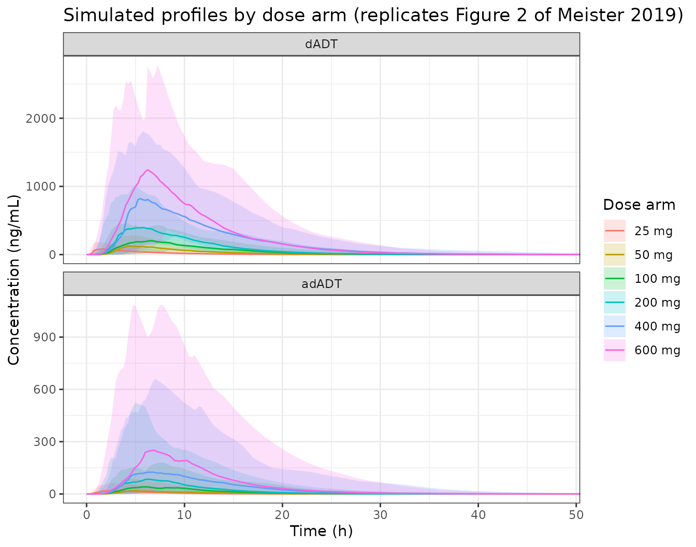
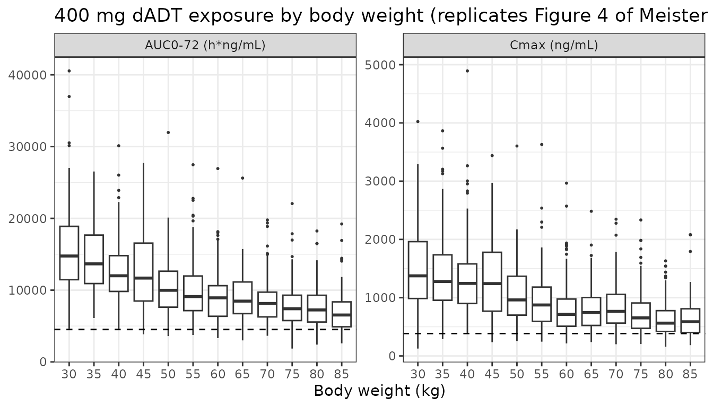

# Tribendimidine pooled population PK (Meister 2019)

## Model and source

- Citation: Meister I, Assawasuwannakit P, Vanobberghen F, Penny MA,
  Odermatt P, Sayasone S, Huwyler J, Tarning J, Keiser J. Pooled
  population pharmacokinetic analysis of tribendimidine for the
  treatment of Opisthorchis viverrini infections. Antimicrob Agents
  Chemother. 2019;63(4):e01391-18. <doi:10.1128/AAC.01391-18>
- Description: Pooled population PK model for the two tribendimidine
  metabolites dADT (deacetylated amidantel, the anthelminthically active
  species) and adADT (acetylated dADT) in Opisthorchis
  viverrini-infected Lao adolescents and adults given single oral doses
  of 25-600 mg (Meister 2019). Pools the two phase 2a ascending-dose
  trials of Vanobberghen 2016 (68 patients) with a phase 2b trial (125
  patients). A Savic transit-compartment absorption model with a
  non-integer, log-normally distributed number of transit compartments
  (5.27 typical) feeds a one-compartment dADT disposition model, from
  which a fixed 65% of elimination is routed to a one-compartment adADT
  model (the remaining 35% is assumed renal). Allometric body-weight
  scaling (fixed 0.75 on clearances, 1 on volumes, reference 52 kg), a
  linear age effect on dADT clearance, and two absorption covariates:
  the 200-mg-versus-50-mg tablet formulation and the breaking of the
  enteric coating of a split 50-mg tablet. Systematic whole-blood and
  dried-blood-spot matrix conversion factors, each metabolite carrying
  its own matrix-specific residual error. Fitted on
  natural-log-transformed molar concentrations, so amounts are nmol and
  concentrations nmol/L.
- Article: <https://doi.org/10.1128/AAC.01391-18>

Tribendimidine is an oral anthelmintic marketed in China since 2004 and
under development as an alternative to praziquantel for *Opisthorchis
viverrini* infection. After ingestion it is hydrolysed
non-enzymatically, without any enzyme involvement, into deacetylated
amidantel (dADT) and terephthalaldehyde. dADT is the species that
carries the trematocidal activity; part of it is acetylated to adADT and
the rest is excreted unchanged in urine. The parent prodrug is never
measured, so the model is written entirely in terms of the two
metabolites.

Meister 2019 pools the two phase 2a ascending-dose trials that
`Vanobberghen_2016_tribendimidine` was fitted to (68 patients, 25 to 600
mg) with a new phase 2b trial (125 patients, 400 mg), and refits. This
vignette validates the pooled model; the predecessor has its own
vignette.

``` r

mod <- rxode2::rxode2(readModelDb("Meister_2019_tribendimidine"))
#> ℹ parameter labels from comments will be replaced by 'label()'
mod
#>  ── rxode2-based free-form 3-cmt ODE model ────────────────────────────────────── 
#>  ── Initalization: ──  
#> Fixed Effects ($theta): 
#>                  lmtt                  lntr               lfdepot 
#>              1.156881              1.662030              0.000000 
#>                   lcl                   lvc             lcl_adadt 
#>              2.760010              4.486387              4.186620 
#>             lvc_adadt                    fm               e_wt_cl 
#>              2.753661              0.650000              0.750000 
#>               e_wt_vc              e_age_cl          e_tab200_mtt 
#>              1.000000             -0.011900              0.429000 
#>         e_split50_mtt               e_wb_cc              e_dbs_cc 
#>             -0.794000             -0.145000             -0.137000 
#>         e_wb_cc_adadt        e_dbs_cc_adadt           expSdPlasma 
#>              0.050000              0.070000              0.460477 
#>       expSdWholeBlood              expSdDbs     expSdPlasma_adadt 
#>              0.564023              0.622523              0.379875 
#> expSdWholeBlood_adadt        expSdDbs_adadt 
#>              0.445891              0.444166 
#> 
#> Omega ($omega): 
#>              etalfdepot  etalmtt  etalntr   etalcl   etalvc etalcl_adadt
#> etalfdepot     0.132235 0.000000 0.000000 0.000000 0.000000     0.000000
#> etalmtt        0.000000 0.256718 0.000000 0.000000 0.000000     0.000000
#> etalntr        0.000000 0.000000 2.302585 0.000000 0.000000     0.000000
#> etalcl         0.000000 0.000000 0.000000 0.038075 0.000000     0.000000
#> etalvc         0.000000 0.000000 0.000000 0.000000 0.064927     0.000000
#> etalcl_adadt   0.000000 0.000000 0.000000 0.000000 0.000000     0.852541
#> etalvc_adadt   0.000000 0.000000 0.000000 0.000000 0.000000     0.000000
#>              etalvc_adadt
#> etalfdepot       0.000000
#> etalmtt          0.000000
#> etalntr          0.000000
#> etalcl           0.000000
#> etalvc           0.000000
#> etalcl_adadt     0.000000
#> etalvc_adadt     0.087836
#> attr(,"lotriLabels")
#> [1] "Table 2, F '% CV for BSV' = 37.6 (95% CI 32.1-45.8); log(1 + 0.376^2) = 0.132235"              
#> [2] "Table 2, MTT '% CV for BSV' = 54.1 (95% CI 49.9-66.2); log(1 + 0.541^2) = 0.256718"            
#> [3] "Table 2, transit-compartment '% CV for BSV' = 300 (95% CI 204-397); log(1 + 3.00^2) = 2.302585"
#> [4] "Table 2, dADT CL/F '% CV for BSV' = 19.7 (95% CI 16.6-22.5); log(1 + 0.197^2) = 0.038075"      
#> [5] "Table 2, dADT V/F '% CV for BSV' = 25.9 (95% CI 20.1-28.5); log(1 + 0.259^2) = 0.064927"       
#> [6] "Table 2, adADT CL/F '% CV for BSV' = 116 (95% CI 105-172); log(1 + 1.16^2) = 0.852541"         
#> [7] "Table 2, adADT V/F '% CV for BSV' = 30.3 (95% CI 25.9-54.3); log(1 + 0.303^2) = 0.087836"      
#> attr(,"lotriFix")
#>              etalfdepot etalmtt etalntr etalcl etalvc etalcl_adadt etalvc_adadt
#> etalfdepot        FALSE   FALSE   FALSE  FALSE  FALSE        FALSE        FALSE
#> etalmtt           FALSE   FALSE   FALSE  FALSE  FALSE        FALSE        FALSE
#> etalntr           FALSE   FALSE   FALSE  FALSE  FALSE        FALSE        FALSE
#> etalcl            FALSE   FALSE   FALSE  FALSE  FALSE        FALSE        FALSE
#> etalvc            FALSE   FALSE   FALSE  FALSE  FALSE        FALSE        FALSE
#> etalcl_adadt      FALSE   FALSE   FALSE  FALSE  FALSE        FALSE        FALSE
#> etalvc_adadt      FALSE   FALSE   FALSE  FALSE  FALSE        FALSE        FALSE
#> 
#> States ($state or $stateDf): 
#>   Compartment Number Compartment Name
#> 1                  1            depot
#> 2                  2          central
#> 3                  3    central_adadt
#>  ── Multiple Endpoint Model ($multipleEndpoint): ──  
#>       variable                     cmt                     dvid*
#> 1       Cc ~ …       cmt='Cc' or cmt=4       dvid='Cc' or dvid=1
#> 2 Cc_adadt ~ … cmt='Cc_adadt' or cmt=5 dvid='Cc_adadt' or dvid=2
#>   * If dvids are outside this range, all dvids are re-numered sequentially, ie 1,7, 10 becomes 1,2,3 etc
#> 
#>  ── μ-referencing ($muRefTable): ──  
#>       theta          eta level covariates
#> 1      lmtt      etalmtt    id           
#> 2      lntr      etalntr    id           
#> 3   lfdepot   etalfdepot    id           
#> 4       lcl       etalcl    id           
#> 5       lvc       etalvc    id           
#> 6 lcl_adadt etalcl_adadt    id           
#> 7 lvc_adadt etalvc_adadt    id           
#> 
#>  ── Model (Normalized Syntax): ── 
#> function() {
#>     compartmentData <- list(depot = list(analyte = "tribendimidine / dADT in transit (dosed prodrug; never measured)", 
#>         units = "nmol", specimen = "administration site", verified = TRUE), 
#>         central = list(analyte = "dADT (deacetylated amidantel)", 
#>             units = "nmol", specimen = "plasma", verified = TRUE), 
#>         central_adadt = list(analyte = "adADT (acetylated dADT)", 
#>             units = "nmol", specimen = "plasma", verified = TRUE))
#>     covariateData <- list(AGE = list(description = "Age", units = "years", 
#>         type = "continuous", reference_category = NULL, notes = "Enters dADT clearance only, as the linear form (1 + slope * (AGE - 45)). Meister 2019 Table 2 footnote d defines the effect as a 'linear covariate relationship between age and CL/F dADT centered on the median age of 45 years', and Table 2 footnote a states the printed estimates are for 'a typical patient at 45 years of age'. Unlike the predecessor model (Vanobberghen_2016_tribendimidine), Meister 2019 retained NO age effect on adADT clearance. Because the form is linear rather than exponential it is only valid over the ages actually studied (15 to 79 years); extrapolating dADT clearance beyond roughly 129 years would make it non-positive.", 
#>         source_name = "AGE"), WT = list(description = "Body weight", 
#>         units = "kg", type = "continuous", reference_category = NULL, 
#>         notes = "Allometric scaling on both clearances (exponent fixed at 0.75) and both volumes (exponent fixed at 1), normalized to 52 kg. NOT a row of Meister 2019 Table 2 because the exponents were fixed a priori rather than estimated, but stated twice in the source: Materials and Methods 'Covariate analysis' ('Total body weight was implemented a priori as an allometric function, centered on the median body weight, on clearance and volume parameters simultaneously using a fixed exponent of 0.75 for clearance and 1 for volume'), and Table 2 footnote a, which fixes the reference patient at 52 kg. The pooled phase 2a median weight is 52 kg and the phase 2b median is 54 kg (Table 1); 52 kg is the value footnote a attaches to the printed estimates and is therefore the centering value used here.", 
#>         source_name = "WEIGHT"), FORM_TRI_TAB200 = list(description = "Tribendimidine tablet-strength formulation indicator (1 = 200-mg enteric-coated tablets; 0 = 50-mg enteric-coated tablets, the reference formulation)", 
#>         units = "(binary)", type = "binary", reference_category = "0 (whole 50-mg enteric-coated tablets)", 
#>         notes = "Multiplicative effect of +42.9% on mean absorption transit time relative to whole 50-mg tablets (Meister 2019 Table 2, 'Formulation on MTT (%)' = 42.9). The Results give the direction explicitly: 'a 42.9% slower mean absorption transit time for the 200-mg formulation than for the 50-mg formulation', which makes the 50-mg tablet the reference level. The authors attribute the delay to the 200-mg tablets floating in the stomach (Discussion, citing the in vitro physicochemical characterisation in reference 16). Unlike Vanobberghen 2016, Meister 2019 retained NO formulation effect on either central volume.", 
#>         source_name = "FORM"), FORM_TRI_SPLIT50 = list(description = "Split-tablet indicator for tribendimidine 50-mg enteric-coated tablets (1 = the administered 50-mg tablet was broken in half, destroying the enteric coating; 0 = whole tablet)", 
#>         units = "(binary)", type = "binary", reference_category = "0 (whole tablet)", 
#>         notes = "Multiplicative effect of -79.4% on mean absorption transit time relative to whole 50-mg tablets (Meister 2019 Table 2, 'Split 50-mg tablets on MTT (%)' = -79.4). The Results give the direction explicitly: 'a 79.4% faster mean absorption transit time for broken tablets than for whole 50-mg tablets'. In the source data only the 25-mg dose level of the second phase 2a trial used split tablets, so this indicator is 1 only when FORM_TRI_TAB200 is 0; the two effects were never observed in combination and the multiplicative composition used here is an extrapolation outside that cell. Registered as the sibling indicator that the FORM_TRI_TAB200 register entry anticipated: Vanobberghen 2016's split-tablet interaction model did not converge, so that earlier extraction pooled split tablets into its reference level.", 
#>         source_name = "SPLIT"), SAMPLE_WHOLEBLOOD = list(description = "Per-observation sampling-matrix indicator (1 = the concentration was measured in venous whole blood; 0 = venous plasma, the reference matrix)", 
#>         units = "(binary)", type = "binary", reference_category = "0 (venous plasma)", 
#>         notes = "Selects both the systematic matrix conversion factor applied to the predicted concentration and the matrix-specific residual error. Meister 2019 Table 2 footnote a fixes the reference matrix: the printed estimates are 'with drug concentrations measured in plasma'. Whole-blood samples were collected in the two phase 2a trials only; the phase 2b trial used dried blood spots exclusively (Table 1). Must be 0 on any record for which SAMPLE_DBS is 1.", 
#>         source_name = "MATRIX"), SAMPLE_DBS = list(description = "Per-observation sampling-matrix indicator (1 = the concentration was measured in a dried blood spot; 0 = venous plasma, the reference matrix)", 
#>         units = "(binary)", type = "binary", reference_category = "0 (venous plasma)", 
#>         notes = "Selects both the systematic matrix conversion factor applied to the predicted concentration and the matrix-specific residual error. Dried blood spots were collected from a fingertip capillary draw onto DMPK-C cards in all three trials and were the only matrix in the phase 2b trial (Meister 2019 Materials and Methods, 'PK sampling and analysis'). Meister 2019 reports that 'the difference between drug concentrations measured in whole blood and dried blood spots was not statistically significant', so this level differs from SAMPLE_WHOLEBLOOD only in its point estimates and its residual magnitude. Must be 0 on any record for which SAMPLE_WHOLEBLOOD is 1.", 
#>         source_name = "MATRIX"))
#>     covariatesDataExcluded <- list(SEXF = list(description = "Female sex indicator", 
#>         units = "(binary)", type = "binary", notes = "Listed among the covariates tested in Meister 2019 Materials and Methods 'Covariate analysis' ('Other covariates tested included age, sex, formulation, and the effect of breaking the administered tablets') but not retained by the forward-selection / backward-elimination procedure. 54% of the phase 2b participants and 51% of the pooled phase 2a participants were female (Table 1)."), 
#>         CRCL = list(description = "Creatinine clearance", units = "mL/min", 
#>             type = "continuous", notes = "Explicitly excluded from the analysis rather than screened and rejected: Meister 2019 Materials and Methods 'Covariate analysis' states 'Creatinine clearance data were not available for all patients and could not be considered in this analysis'. The rural setting of the phase 2b trial did not permit biochemical assessment (Materials and Methods, 'Patients, treatment, and study procedures'). The authors nonetheless attribute the retained age effect on dADT clearance to declining renal function with age (Discussion)."))
#>     description <- "Pooled population PK model for the two tribendimidine metabolites dADT (deacetylated amidantel, the anthelminthically active species) and adADT (acetylated dADT) in Opisthorchis viverrini-infected Lao adolescents and adults given single oral doses of 25-600 mg (Meister 2019). Pools the two phase 2a ascending-dose trials of Vanobberghen 2016 (68 patients) with a phase 2b trial (125 patients). A Savic transit-compartment absorption model with a non-integer, log-normally distributed number of transit compartments (5.27 typical) feeds a one-compartment dADT disposition model, from which a fixed 65% of elimination is routed to a one-compartment adADT model (the remaining 35% is assumed renal). Allometric body-weight scaling (fixed 0.75 on clearances, 1 on volumes, reference 52 kg), a linear age effect on dADT clearance, and two absorption covariates: the 200-mg-versus-50-mg tablet formulation and the breaking of the enteric coating of a split 50-mg tablet. Systematic whole-blood and dried-blood-spot matrix conversion factors, each metabolite carrying its own matrix-specific residual error. Fitted on natural-log-transformed molar concentrations, so amounts are nmol and concentrations nmol/L."
#>     population <- list(species = "human", n_subjects = 193L, 
#>         n_studies = 3L, age_range = "median 42 years (range 15-65) in the pooled phase 2a trials; median 48 years (range 15-79) in the phase 2b trial", 
#>         weight_range = "median 52 kg (range 38-67) in the pooled phase 2a trials; median 54 kg (range 32-85) in the phase 2b trial", 
#>         sex_female_pct = 53.4, renal_function = "Not assessed. Creatinine clearance was unavailable for part of the pooled data set and was not tested as a covariate.", 
#>         disease_state = "Adolescents and adults aged 15 years and older with confirmed Opisthorchis viverrini infection, diagnosed by duplicate Kato-Katz thick smears on two stool samples. In the phase 2b trial 90% (n = 113) had a light infection intensity at baseline and the mean egg burden was 145.3 eggs per gram. Across all three trials 151/191 (79%) were cured at 21 days; 93% of the phase 2b participants were cured and the average egg reduction rate exceeded 99%.", 
#>         dose_range = "Single oral doses of 25, 50, 100, 200, 400 and 600 mg tribendimidine. Phase 2a trial 1 (n = 31) gave 200, 400 and 600 mg as 200-mg enteric-coated tablets (n = 13, 9, 9); phase 2a trial 2 (n = 37) gave 25, 50, 100 and 200 mg as 50-mg enteric-coated tablets (n = 9, 9, 9, 10), the 25-mg dose being a split 50-mg tablet; the phase 2b trial (n = 125) gave 400 mg as 200-mg tablets (n = 123), with 2 patients wrongly dosed at 200 mg and modelled at the dose actually received.", 
#>         regions = "Champasack district, Lao People's Democratic Republic", 
#>         studies = "Two phase 2a single-ascending-dose trials (previously reported by Vanobberghen 2016 and Duthaler 2016) pooled with the PK substudy of a noninferiority randomized controlled phase 2b trial of tribendimidine 400 mg versus praziquantel 75 mg/kg conducted February-April 2014; ISRCTN Registry no. ISRCTN96948551.", 
#>         notes = "Sampling differed by trial (Table 1). The phase 2a trials used dense venous sampling at 0, 1, 2, 3, 4, 4.5, 5, 6, 8, 10 and 24 h for whole blood and plasma, plus dried blood spots at 0, 1, 3, 4.5, 6, 10 h or 0, 2, 4, 5, 8, 24 h. The phase 2b trial used a WinPOPT-optimised sparse scheme of five dried blood spots per patient at 0.32, 2.00, 7.75, 8.00 and 30.0 h (supplemental Tables S1 and S2). Both metabolites were quantified by LC-MS/MS over an analytical range of 1 to 2,000 ng/mL. Concentrations were natural-log transformed and the two metabolites fitted sequentially by the PPP&D method; values below the LLOQ (13% for dADT and 21% for adADT across all matrices) were handled by Beal's M3 method. Parameter precision comes from a 1,000-replicate nonparametric bootstrap stratified by study.")
#>     reference <- "Meister I, Assawasuwannakit P, Vanobberghen F, Penny MA, Odermatt P, Sayasone S, Huwyler J, Tarning J, Keiser J. Pooled population pharmacokinetic analysis of tribendimidine for the treatment of Opisthorchis viverrini infections. Antimicrob Agents Chemother. 2019;63(4):e01391-18. doi:10.1128/AAC.01391-18"
#>     units <- list(time = "h", dosing = "nmol", concentration = "nmol/L")
#>     vignette <- "Meister_2019_tribendimidine"
#>     ini({
#>         lmtt <- 1.15688119679209
#>         label("Mean absorption transit time MTT for a whole 50-mg tablet (h)")
#>         lntr <- 1.66203036255327
#>         label("Number of theoretical transit compartments (unitless)")
#>         lfdepot <- fix(0)
#>         label("Relative bioavailability F (fraction)")
#>         lcl <- 2.76000994003292
#>         label("Apparent dADT clearance CL/F at 52 kg and 45 years (L/h)")
#>         lvc <- 4.48638664999812
#>         label("Apparent dADT central volume Vc/F at 52 kg (L)")
#>         lcl_adadt <- 4.18661983833127
#>         label("Apparent adADT clearance CL/F at 52 kg (L/h)")
#>         lvc_adadt <- 2.75366071235426
#>         label("Apparent adADT central volume Vc/F at 52 kg (L)")
#>         fm <- fix(0.65)
#>         label("Fraction of dADT elimination converted to adADT (unitless)")
#>         e_wt_cl <- fix(0.75)
#>         label("Allometric exponent on both clearances (unitless)")
#>         e_wt_vc <- fix(1)
#>         label("Allometric exponent on both central volumes (unitless)")
#>         e_age_cl <- -0.0119
#>         label("Linear age effect on dADT CL/F, per year older (fraction)")
#>         e_tab200_mtt <- 0.429
#>         label("200-mg-tablet effect on MTT, relative to a whole 50-mg tablet (fraction longer)")
#>         e_split50_mtt <- -0.794
#>         label("Split-50-mg-tablet effect on MTT, relative to a whole 50-mg tablet (fraction shorter)")
#>         e_wb_cc <- -0.145
#>         label("Whole-blood matrix conversion factor on dADT concentration, relative to plasma (fraction)")
#>         e_dbs_cc <- -0.137
#>         label("DBS matrix conversion factor on dADT concentration, relative to plasma (fraction)")
#>         e_wb_cc_adadt <- 0.05
#>         label("Whole-blood matrix conversion factor on adADT concentration, relative to plasma (fraction)")
#>         e_dbs_cc_adadt <- 0.07
#>         label("DBS matrix conversion factor on adADT concentration, relative to plasma (fraction)")
#>         expSdPlasma <- 0.460477
#>         label("Log-scale residual SD for dADT in plasma (unitless)")
#>         expSdWholeBlood <- 0.564023
#>         label("Log-scale residual SD for dADT in whole blood (unitless)")
#>         expSdDbs <- 0.622523
#>         label("Log-scale residual SD for dADT in dried blood spots (unitless)")
#>         expSdPlasma_adadt <- 0.379875
#>         label("Log-scale residual SD for adADT in plasma (unitless)")
#>         expSdWholeBlood_adadt <- 0.445891
#>         label("Log-scale residual SD for adADT in whole blood (unitless)")
#>         expSdDbs_adadt <- 0.444166
#>         label("Log-scale residual SD for adADT in dried blood spots (unitless)")
#>         etalfdepot ~ 0.132235
#>         label("Table 2, F '% CV for BSV' = 37.6 (95% CI 32.1-45.8); log(1 + 0.376^2) = 0.132235")
#>         etalmtt ~ 0.256718
#>         label("Table 2, MTT '% CV for BSV' = 54.1 (95% CI 49.9-66.2); log(1 + 0.541^2) = 0.256718")
#>         etalntr ~ 2.302585
#>         label("Table 2, transit-compartment '% CV for BSV' = 300 (95% CI 204-397); log(1 + 3.00^2) = 2.302585")
#>         etalcl ~ 0.038075
#>         label("Table 2, dADT CL/F '% CV for BSV' = 19.7 (95% CI 16.6-22.5); log(1 + 0.197^2) = 0.038075")
#>         etalvc ~ 0.064927
#>         label("Table 2, dADT V/F '% CV for BSV' = 25.9 (95% CI 20.1-28.5); log(1 + 0.259^2) = 0.064927")
#>         etalcl_adadt ~ 0.852541
#>         label("Table 2, adADT CL/F '% CV for BSV' = 116 (95% CI 105-172); log(1 + 1.16^2) = 0.852541")
#>         etalvc_adadt ~ 0.087836
#>         label("Table 2, adADT V/F '% CV for BSV' = 30.3 (95% CI 25.9-54.3); log(1 + 0.303^2) = 0.087836")
#>     })
#>     model({
#>         cl_age <- 1 + e_age_cl * (AGE - 45)
#>         mtt_form <- (1 + e_tab200_mtt * FORM_TRI_TAB200) * (1 + 
#>             e_split50_mtt * FORM_TRI_SPLIT50)
#>         matrix_cc <- 1 + e_wb_cc * SAMPLE_WHOLEBLOOD + e_dbs_cc * 
#>             SAMPLE_DBS
#>         matrix_cc_adadt <- 1 + e_wb_cc_adadt * SAMPLE_WHOLEBLOOD + 
#>             e_dbs_cc_adadt * SAMPLE_DBS
#>         mtt <- exp(lmtt + etalmtt) * mtt_form
#>         ntr <- exp(lntr + etalntr)
#>         fdepot <- exp(lfdepot + etalfdepot)
#>         cl <- exp(lcl + etalcl) * (WT/52)^e_wt_cl * cl_age
#>         vc <- exp(lvc + etalvc) * (WT/52)^e_wt_vc
#>         cl_adadt <- exp(lcl_adadt + etalcl_adadt) * (WT/52)^e_wt_cl
#>         vc_adadt <- exp(lvc_adadt + etalvc_adadt) * (WT/52)^e_wt_vc
#>         ka <- (ntr + 1)/mtt
#>         kel <- cl/vc
#>         kel_adadt <- cl_adadt/vc_adadt
#>         d/dt(depot) <- transit(ntr, mtt, fdepot) - ka * depot
#>         d/dt(central) <- ka * depot - kel * central
#>         d/dt(central_adadt) <- fm * kel * central - kel_adadt * 
#>             central_adadt
#>         f(depot) <- 0
#>         Cc <- central/vc * matrix_cc
#>         Cc_adadt <- central_adadt/vc_adadt * matrix_cc_adadt
#>         expSdCc <- expSdPlasma * (1 - SAMPLE_WHOLEBLOOD - SAMPLE_DBS) + 
#>             expSdWholeBlood * SAMPLE_WHOLEBLOOD + expSdDbs * 
#>             SAMPLE_DBS
#>         expSdCcAdadt <- expSdPlasma_adadt * (1 - SAMPLE_WHOLEBLOOD - 
#>             SAMPLE_DBS) + expSdWholeBlood_adadt * SAMPLE_WHOLEBLOOD + 
#>             expSdDbs_adadt * SAMPLE_DBS
#>         Cc ~ lnorm(expSdCc)
#>         Cc_adadt ~ lnorm(expSdCcAdadt)
#>     })
#> }
```

## Population

Adolescents and adults aged 15 years and older with confirmed
Opisthorchis viverrini infection, diagnosed by duplicate Kato-Katz thick
smears on two stool samples. In the phase 2b trial 90% (n = 113) had a
light infection intensity at baseline and the mean egg burden was 145.3
eggs per gram. Across all three trials 151/191 (79%) were cured at 21
days; 93% of the phase 2b participants were cured and the average egg
reduction rate exceeded 99%.

The pooled analysis set is 193 patients drawn from 3 trials in
Champasack, Lao PDR (Meister 2019 Table 1). The two phase 2a trials
contributed dense venous plasma and whole-blood sampling plus dried
blood spots; the phase 2b trial contributed five dried blood spots per
patient at WinPOPT-optimised times of 0.32, 2.00, 7.75, 8.00 and 30.0 h.

``` r

pop <- rxode2::rxode(readModelDb("Meister_2019_tribendimidine"))$population
#> ℹ parameter labels from comments will be replaced by 'label()'
tibble::tibble(
  Field = c("Age", "Weight", "Female", "Doses", "Region"),
  Value = c(pop$age_range, pop$weight_range, paste0(pop$sex_female_pct, "%"),
            pop$dose_range, pop$regions)
) |>
  knitr::kable()
```

| Field | Value |
|:---|:---|
| Age | median 42 years (range 15-65) in the pooled phase 2a trials; median 48 years (range 15-79) in the phase 2b trial |
| Weight | median 52 kg (range 38-67) in the pooled phase 2a trials; median 54 kg (range 32-85) in the phase 2b trial |
| Female | 53.4% |
| Doses | Single oral doses of 25, 50, 100, 200, 400 and 600 mg tribendimidine. Phase 2a trial 1 (n = 31) gave 200, 400 and 600 mg as 200-mg enteric-coated tablets (n = 13, 9, 9); phase 2a trial 2 (n = 37) gave 25, 50, 100 and 200 mg as 50-mg enteric-coated tablets (n = 9, 9, 9, 10), the 25-mg dose being a split 50-mg tablet; the phase 2b trial (n = 125) gave 400 mg as 200-mg tablets (n = 123), with 2 patients wrongly dosed at 200 mg and modelled at the dose actually received. |
| Region | Champasack district, Lao People’s Democratic Republic |

## Source trace

Every `ini()` value and every non-obvious `model()` equation, with the
place in Meister 2019 it came from.

``` r

sourceTrace <- tibble::tribble(
  ~Quantity, ~Value, ~Source,
  "MTT (whole 50-mg tablet)", "3.18 h", "Table 2, 'MTT (h)'",
  "Number of transit compartments", "5.27", "Table 2, 'No. of transit compartments'",
  "Relative bioavailability F", "1 (fixed)", "Table 2, 'F (%)' = 100 (fixed)",
  "dADT CL/F", "15.8 L/h", "Table 2, dADT 'CL/FdADT (liters/h)'",
  "dADT V/F", "88.8 L", "Table 2, dADT 'V/FdADT (liters)'",
  "adADT CL/F", "65.8 L/h", "Table 2, adADT 'CL/FadADT (liters/h)'",
  "adADT V/F", "15.7 L", "Table 2, adADT 'V/FadADT (liters)'",
  "Metabolised fraction fm", "0.65 (fixed)", "Methods, 'Structural and stochastic model development'",
  "Allometric exponents", "0.75 CL / 1 V (fixed)", "Methods, 'Covariate analysis'",
  "Reference weight / age", "52 kg / 45 years", "Table 2 footnote a; footnote d",
  "Age on dADT CL/F", "-1.19 %/year", "Table 2, 'Age on CL/FdADT (%)'",
  "200-mg tablet on MTT", "+42.9 %", "Table 2, 'Formulation on MTT (%)'",
  "Split 50-mg tablet on MTT", "-79.4 %", "Table 2, 'Split 50-mg tablets on MTT (%)'",
  "Matrix factors, dADT", "-14.5 % blood, -13.7 % DBS", "Table 2, dADT matrix conversion rows",
  "Matrix factors, adADT", "+5.00 % blood, +7.00 % DBS", "Table 2, adADT matrix conversion rows",
  "BSV (7 diagonal terms)", "37.6 to 300 % CV", "Table 2, '% CV for BSV'; footnote b",
  "RUV (6 terms)", "39.4 to 68.8 % CV", "Table 2, RUV rows; footnote b",
  "Transit absorption form", "Savic gamma-PDF, ka = ktr", "Results, 'Pooled population PK modeling'",
  "Therapeutic criteria", "Cmax 384 ng/mL; AUC 4520 ng*h/mL", "Results, 'PK-PD analysis and exposure simulations'"
)
knitr::kable(sourceTrace)
```

| Quantity | Value | Source |
|:---|:---|:---|
| MTT (whole 50-mg tablet) | 3.18 h | Table 2, ‘MTT (h)’ |
| Number of transit compartments | 5.27 | Table 2, ‘No. of transit compartments’ |
| Relative bioavailability F | 1 (fixed) | Table 2, ‘F (%)’ = 100 (fixed) |
| dADT CL/F | 15.8 L/h | Table 2, dADT ‘CL/FdADT (liters/h)’ |
| dADT V/F | 88.8 L | Table 2, dADT ‘V/FdADT (liters)’ |
| adADT CL/F | 65.8 L/h | Table 2, adADT ‘CL/FadADT (liters/h)’ |
| adADT V/F | 15.7 L | Table 2, adADT ‘V/FadADT (liters)’ |
| Metabolised fraction fm | 0.65 (fixed) | Methods, ‘Structural and stochastic model development’ |
| Allometric exponents | 0.75 CL / 1 V (fixed) | Methods, ‘Covariate analysis’ |
| Reference weight / age | 52 kg / 45 years | Table 2 footnote a; footnote d |
| Age on dADT CL/F | -1.19 %/year | Table 2, ‘Age on CL/FdADT (%)’ |
| 200-mg tablet on MTT | +42.9 % | Table 2, ‘Formulation on MTT (%)’ |
| Split 50-mg tablet on MTT | -79.4 % | Table 2, ‘Split 50-mg tablets on MTT (%)’ |
| Matrix factors, dADT | -14.5 % blood, -13.7 % DBS | Table 2, dADT matrix conversion rows |
| Matrix factors, adADT | +5.00 % blood, +7.00 % DBS | Table 2, adADT matrix conversion rows |
| BSV (7 diagonal terms) | 37.6 to 300 % CV | Table 2, ‘% CV for BSV’; footnote b |
| RUV (6 terms) | 39.4 to 68.8 % CV | Table 2, RUV rows; footnote b |
| Transit absorption form | Savic gamma-PDF, ka = ktr | Results, ‘Pooled population PK modeling’ |
| Therapeutic criteria | Cmax 384 ng/mL; AUC 4520 ng\*h/mL | Results, ‘PK-PD analysis and exposure simulations’ |

Both variance columns are back-transformed with the Table 2 footnote b
definition, `%CV = sqrt(exp(variance) - 1)`, which inverts to
`variance = log(1 + CV^2)`. The residual error is additive on the
natural-log-transformed concentrations the model was fitted to, which is
`lnorm()` in nlmixr2, so its log-scale SD is `sqrt(log(1 + CV^2))`.

## Units: the model works in nmol

Meister 2019 fitted natural-log-transformed molar concentrations,
exactly as its predecessor did, so **amounts are nmol and concentrations
nmol/L**. Both metabolites are on a molar scale and dADT converts to
adADT one-for-one, so no molecular weight appears anywhere inside the
model. Two conversions are needed at the edges: milligrams of
tribendimidine into nmol for the dose, and nmol/L back into ng/mL to
compare against the paper’s tables.

``` r

# Molecular weights (g/mol). The two metabolite weights are read from the
# $ERROR LLOQ conversion of the final NONMEM control stream of the predecessor
# publication (Vanobberghen 2016 supplemental File S1); the parent weight is
# not printed in either paper. See Assumptions and deviations.
MW_TRI <- 450.59 # tribendimidine, C28H30N6
MW_DADT <- 173.214 # dADT
MW_ADADT <- 215.251 # adADT

# One mole of tribendimidine enters the absorption chain as one mole of
# dADT-equivalent, which is the stoichiometry the predecessor model encodes.
mgToNmol <- function(mg) mg * 1e6 / MW_TRI
nmolToNg <- function(conc, mw) pmax(conc, 0) * mw / 1000
```

## Structural checks on the typical individual

These run with every random effect set to zero, so each is a
deterministic algebraic identity that either holds to solver tolerance
or does not. Two integrating states are appended to accumulate exposure
exactly, rather than approximating it with a trapezoid on a finite grid.

``` r

modAuc <- mod |>
  rxode2::model(d / dt(auc_dadt) <- central / vc, append = TRUE) |>
  rxode2::model(d / dt(auc_adadt) <- central_adadt / vc_adadt, append = TRUE)

typical <- rxode2::zeroRe(modAuc)
#> Warning: No sigma parameters in the model
# zeroRe must actually have zeroed the omega matrix; a non-zero entry here
# would silently make every "typical" number below a single random draw.
stopifnot(all(typical$omega == 0))

typicalCovs <- function(age = 45, wt = 52, form200 = 1, split50 = 0,
                        wholeblood = 0, dbs = 0) {
  data.frame(
    id = 1L, AGE = age, WT = wt,
    FORM_TRI_TAB200 = form200, FORM_TRI_SPLIT50 = split50,
    SAMPLE_WHOLEBLOOD = wholeblood, SAMPLE_DBS = dbs
  )
}

# Route A of the multi-output event-table convention: cmt names the ODE state
# and dvid names the endpoint. Dose rows carry dvid = NA so the column stays
# integer. Never name an algebraic observable (Cc) as a compartment.
makeEvents <- function(mg, times, n = 1L) {
  rbind(
    data.frame(
      id = seq_len(n), time = 0, amt = mgToNmol(mg), cmt = "depot",
      evid = 1L, dvid = NA_integer_
    ),
    data.frame(
      id = rep(seq_len(n), each = length(times)), time = rep(times, n),
      amt = NA_real_, cmt = "central", evid = 0L, dvid = 1L
    )
  ) |>
    dplyr::arrange(id, time, dplyr::desc(evid))
}

# 480 h is more than 100 dADT half-lives, so the accumulators have converged.
longGrid <- sort(unique(c(seq(0, 24, by = 0.01), seq(24.5, 480, by = 0.5))))

solveTypical <- function(mg = 400, covs = typicalCovs(), model = typical) {
  as.data.frame(rxode2::rxSolve(
    model, makeEvents(mg, longGrid), covs,
    returnType = "data.frame", atol = 1e-12, rtol = 1e-12, maxsteps = 1e6
  ))
}

typ400 <- solveTypical(400)
#> ℹ omega/sigma items treated as zero: 'etalfdepot', 'etalmtt', 'etalntr', 'etalcl', 'etalvc', 'etalcl_adadt', 'etalvc_adadt'
```

### Dose recovery

Relative bioavailability is fixed to unity, so the entire administered
molar amount must be recovered through dADT clearance. This is the
single sharpest test that the transit chain delivers the whole dose,
that suppressing the ordinary bolus with `f(depot) <- 0` did not
silently zero the input, and that the clearance was transcribed
correctly.

``` r

CL_DADT <- 15.8
CL_ADADT <- 65.8
FM <- 0.65

aucInfDadt <- typ400$auc_dadt[nrow(typ400)]
aucInfAdadt <- typ400$auc_adadt[nrow(typ400)]

doseRecovery <- CL_DADT * aucInfDadt / mgToNmol(400)
doseRecovery
#> [1] 1
stopifnot(abs(doseRecovery - 1) < 1e-6)
```

### Metabolite mass balance

A fixed 65% of everything cleared as dADT is routed to adADT, so the
amount adADT eliminates must be exactly 65% of the amount dADT
eliminates. In terms of exposure that is
`CL_adADT * AUC_adADT = fm * CL_dADT * AUC_dADT`.

``` r

massBalance <- CL_ADADT * aucInfAdadt / (FM * CL_DADT * aucInfDadt)
massBalance
#> [1] 1
stopifnot(abs(massBalance - 1) < 1e-6)
```

A gate that cannot fail proves nothing, so the same identity is
re-measured with `fm` deliberately mis-set to 0.50 while the check still
divides by 0.65. The ratio must move to 0.50/0.65.

``` r

mutated <- rxode2::ini(typical, fm = 0.50)
#> ℹ change initial estimate of `fm` to `0.5`
typMut <- solveTypical(400, model = mutated)
#> ℹ omega/sigma items treated as zero: 'etalfdepot', 'etalmtt', 'etalntr', 'etalcl', 'etalvc', 'etalcl_adadt', 'etalvc_adadt'
mutatedBalance <-
  CL_ADADT * typMut$auc_adadt[nrow(typMut)] /
    (FM * CL_DADT * typMut$auc_dadt[nrow(typMut)])
mutatedBalance
#> [1] 0.7692308
stopifnot(abs(mutatedBalance - 0.50 / 0.65) < 1e-6)
```

### Disposition half-life

The dADT half-life is `log(2) * Vc / CL` and nothing else. Meister 2019
Table 3 reports the dADT elimination half-life as a median per dose
group, ranging from 3.34 to 4.56 h.

``` r

halfLifeDadt <- log(2) * 88.8 / 15.8
halfLifeDadt
#> [1] 3.895663
stopifnot(halfLifeDadt > 3.34, halfLifeDadt < 4.56)
```

### Covariate arithmetic

Each covariate enters exactly one place, so each effect can be read back
out of the solved model variables. `mtt` and `cl` are returned as
columns by `rxSolve()`.

``` r

mttOf <- function(form200, split50) {
  solveTypical(400, typicalCovs(form200 = form200, split50 = split50))$mtt[1]
}
clOf <- function(age) solveTypical(400, typicalCovs(age = age))$cl[1]
vcOf <- function(wt) solveTypical(400, typicalCovs(wt = wt))$vc[1]

covariateChecks <- tibble::tibble(
  Check = c(
    "MTT, whole 50-mg tablet (reference)",
    "MTT, 200-mg tablet: +42.9%",
    "MTT, split 50-mg tablet: -79.4%",
    "dADT CL/F at 45 years (reference)",
    "dADT CL/F, +10 years: -11.9%",
    "dADT Vc/F at 52 kg (reference)",
    "dADT Vc/F at 104 kg: allometric exponent 1"
  ),
  Value = c(
    mttOf(0, 0), mttOf(1, 0), mttOf(0, 1),
    clOf(45), clOf(55), vcOf(52), vcOf(104)
  ),
  Expected = c(
    3.18, 3.18 * 1.429, 3.18 * 0.206,
    15.8, 15.8 * (1 - 0.0119 * 10), 88.8, 88.8 * 2
  )
)
#> ℹ omega/sigma items treated as zero: 'etalfdepot', 'etalmtt', 'etalntr', 'etalcl', 'etalvc', 'etalcl_adadt', 'etalvc_adadt'
#> ℹ omega/sigma items treated as zero: 'etalfdepot', 'etalmtt', 'etalntr', 'etalcl', 'etalvc', 'etalcl_adadt', 'etalvc_adadt'
#> ℹ omega/sigma items treated as zero: 'etalfdepot', 'etalmtt', 'etalntr', 'etalcl', 'etalvc', 'etalcl_adadt', 'etalvc_adadt'
#> ℹ omega/sigma items treated as zero: 'etalfdepot', 'etalmtt', 'etalntr', 'etalcl', 'etalvc', 'etalcl_adadt', 'etalvc_adadt'
#> ℹ omega/sigma items treated as zero: 'etalfdepot', 'etalmtt', 'etalntr', 'etalcl', 'etalvc', 'etalcl_adadt', 'etalvc_adadt'
#> ℹ omega/sigma items treated as zero: 'etalfdepot', 'etalmtt', 'etalntr', 'etalcl', 'etalvc', 'etalcl_adadt', 'etalvc_adadt'
#> ℹ omega/sigma items treated as zero: 'etalfdepot', 'etalmtt', 'etalntr', 'etalcl', 'etalvc', 'etalcl_adadt', 'etalvc_adadt'
knitr::kable(covariateChecks, digits = 4)
```

| Check                                      |    Value | Expected |
|:-------------------------------------------|---------:|---------:|
| MTT, whole 50-mg tablet (reference)        |   3.1800 |   3.1800 |
| MTT, 200-mg tablet: +42.9%                 |   4.5442 |   4.5442 |
| MTT, split 50-mg tablet: -79.4%            |   0.6551 |   0.6551 |
| dADT CL/F at 45 years (reference)          |  15.8000 |  15.8000 |
| dADT CL/F, +10 years: -11.9%               |  13.9198 |  13.9198 |
| dADT Vc/F at 52 kg (reference)             |  88.8000 |  88.8000 |
| dADT Vc/F at 104 kg: allometric exponent 1 | 177.6000 | 177.6000 |

``` r


stopifnot(max(abs(covariateChecks$Value - covariateChecks$Expected)) < 1e-9)
```

### Sampling-matrix conversion factors

Venous plasma is the reference matrix and must scale the prediction by
exactly one; whole blood and dried blood spots apply the Table 2
factors.

``` r

matrixRatio <- function(wholeblood, dbs, column) {
  s <- solveTypical(400, typicalCovs(wholeblood = wholeblood, dbs = dbs))
  ref <- solveTypical(400, typicalCovs())
  max(s[[column]][s$time > 1]) / max(ref[[column]][ref$time > 1])
}

matrixChecks <- tibble::tibble(
  Matrix = c("Whole blood", "Dried blood spot", "Whole blood", "Dried blood spot"),
  Metabolite = c("dADT", "dADT", "adADT", "adADT"),
  Ratio = c(
    matrixRatio(1, 0, "Cc"), matrixRatio(0, 1, "Cc"),
    matrixRatio(1, 0, "Cc_adadt"), matrixRatio(0, 1, "Cc_adadt")
  ),
  Expected = c(1 - 0.145, 1 - 0.137, 1 + 0.05, 1 + 0.07)
)
#> ℹ omega/sigma items treated as zero: 'etalfdepot', 'etalmtt', 'etalntr', 'etalcl', 'etalvc', 'etalcl_adadt', 'etalvc_adadt'
#> ℹ omega/sigma items treated as zero: 'etalfdepot', 'etalmtt', 'etalntr', 'etalcl', 'etalvc', 'etalcl_adadt', 'etalvc_adadt'
#> ℹ omega/sigma items treated as zero: 'etalfdepot', 'etalmtt', 'etalntr', 'etalcl', 'etalvc', 'etalcl_adadt', 'etalvc_adadt'
#> ℹ omega/sigma items treated as zero: 'etalfdepot', 'etalmtt', 'etalntr', 'etalcl', 'etalvc', 'etalcl_adadt', 'etalvc_adadt'
#> ℹ omega/sigma items treated as zero: 'etalfdepot', 'etalmtt', 'etalntr', 'etalcl', 'etalvc', 'etalcl_adadt', 'etalvc_adadt'
#> ℹ omega/sigma items treated as zero: 'etalfdepot', 'etalmtt', 'etalntr', 'etalcl', 'etalvc', 'etalcl_adadt', 'etalvc_adadt'
#> ℹ omega/sigma items treated as zero: 'etalfdepot', 'etalmtt', 'etalntr', 'etalcl', 'etalvc', 'etalcl_adadt', 'etalvc_adadt'
#> ℹ omega/sigma items treated as zero: 'etalfdepot', 'etalmtt', 'etalntr', 'etalcl', 'etalvc', 'etalcl_adadt', 'etalvc_adadt'
knitr::kable(matrixChecks, digits = 6)
```

| Matrix           | Metabolite | Ratio | Expected |
|:-----------------|:-----------|------:|---------:|
| Whole blood      | dADT       | 0.855 |    0.855 |
| Dried blood spot | dADT       | 0.863 |    0.863 |
| Whole blood      | adADT      | 1.050 |    1.050 |
| Dried blood spot | adADT      | 1.070 |    1.070 |

``` r


stopifnot(max(abs(matrixChecks$Ratio - matrixChecks$Expected)) < 1e-9)
```

### Exposure at every published dose level

For a one-compartment model, AUC to infinity is `F * dose / CL` and
nothing else, so it can be evaluated once per dose arm on the typical
individual with no cohort draw involved at all. This is the sharpest
reproducible test that the clearance, the allometric reference weight,
the age centring, the molar dose conversion and the metabolite molecular
weight are all right *together*, and unlike the cohort comparison
further down it gives the same answer on every machine and every rxode2
build.

``` r

armCovs <- tibble::tribble(
  ~mg, ~form200, ~split50, ~age, ~wt, ~published,
  25, 0, 1, 42, 52, 509,
  50, 0, 0, 42, 52, 1152,
  100, 0, 0, 42, 52, 2310,
  200, 0, 0, 42, 52, 5382,
  400, 1, 0, 48, 54, 9889,
  600, 1, 0, 42, 52, 12230
)

typicalAuc <- function(i) {
  s <- solveTypical(
    armCovs$mg[i],
    typicalCovs(
      age = armCovs$age[i], wt = armCovs$wt[i],
      form200 = armCovs$form200[i], split50 = armCovs$split50[i]
    )
  )
  nmolToNg(s$auc_dadt[nrow(s)], MW_DADT)
}

perArm <-
  armCovs |>
  dplyr::mutate(
    typical = vapply(seq_len(dplyr::n()), typicalAuc, numeric(1)),
    pct_diff = 100 * (typical - published) / published,
    typical_per_mg = typical / mg,
    published_per_mg = published / mg
  )
#> ℹ omega/sigma items treated as zero: 'etalfdepot', 'etalmtt', 'etalntr', 'etalcl', 'etalvc', 'etalcl_adadt', 'etalvc_adadt'
#> ℹ omega/sigma items treated as zero: 'etalfdepot', 'etalmtt', 'etalntr', 'etalcl', 'etalvc', 'etalcl_adadt', 'etalvc_adadt'
#> ℹ omega/sigma items treated as zero: 'etalfdepot', 'etalmtt', 'etalntr', 'etalcl', 'etalvc', 'etalcl_adadt', 'etalvc_adadt'
#> ℹ omega/sigma items treated as zero: 'etalfdepot', 'etalmtt', 'etalntr', 'etalcl', 'etalvc', 'etalcl_adadt', 'etalvc_adadt'
#> ℹ omega/sigma items treated as zero: 'etalfdepot', 'etalmtt', 'etalntr', 'etalcl', 'etalvc', 'etalcl_adadt', 'etalvc_adadt'
#> ℹ omega/sigma items treated as zero: 'etalfdepot', 'etalmtt', 'etalntr', 'etalcl', 'etalvc', 'etalcl_adadt', 'etalvc_adadt'

knitr::kable(
  perArm |>
    dplyr::select(mg, typical, published, pct_diff, typical_per_mg, published_per_mg) |>
    dplyr::rename(
      `Dose (mg)` = mg,
      `Typical AUC0-inf (h*ng/mL)` = typical,
      `Published AUC0-72 (h*ng/mL)` = published,
      `% difference` = pct_diff,
      `Typical AUC per mg` = typical_per_mg,
      `Published AUC per mg` = published_per_mg
    ),
  digits = 2
)
```

| Dose (mg) | Typical AUC0-inf (h\*ng/mL) | Published AUC0-72 (h\*ng/mL) | % difference | Typical AUC per mg | Published AUC per mg |
|---:|---:|---:|---:|---:|---:|
| 25 | 587.29 | 509 | 15.38 | 23.49 | 20.36 |
| 50 | 1174.57 | 1152 | 1.96 | 23.49 | 23.04 |
| 100 | 2349.15 | 2310 | 1.69 | 23.49 | 23.10 |
| 200 | 4698.30 | 5382 | -12.70 | 23.49 | 26.91 |
| 400 | 9810.69 | 9889 | -0.79 | 24.53 | 24.72 |
| 600 | 14094.89 | 12230 | 15.25 | 23.49 | 20.38 |

The model is strictly linear, so its exposure per milligram is constant
apart from the arm-specific age and weight. The published column is not:
it ranges from 20.4 to 26.9 h\*ng/mL per mg, a 1.32-fold spread across
dose levels that a linear model cannot generate and that reflects the
small per-arm sample sizes behind Table 3 (nine patients at 25, 50, 100
and 600 mg). That spread is the floor on how well any faithful
implementation can match this table, so the agreement is asserted on the
centre and bounded by the published column’s own scatter.

``` r

stopifnot(
  # Centre: a mis-transcribed clearance, dose conversion or molecular weight
  # would move every arm together by tens of percent.
  abs(stats::median(perArm$pct_diff)) < 8,
  # Envelope: no arm may miss by more than the published column's own
  # dose-to-dose spread.
  max(abs(perArm$pct_diff)) < 25,
  # Linearity: exposure per mg varies only through the arm-specific covariates.
  max(perArm$typical_per_mg) / min(perArm$typical_per_mg) < 1.10
)
```

## Virtual cohort

Six dose arms reproducing the provenance of Meister 2019 Table 3. The 25
mg level of phase 2a trial 2 was a split 50-mg tablet; 50, 100 and 200
mg used whole 50-mg tablets; 400 and 600 mg used 200-mg tablets. Age and
weight are drawn around the medians Table 1 reports for the trial each
arm came from.

``` r

N_PER_ARM <- 60L # well under the 200-per-arm cap

arms <- tibble::tibble(
  arm = paste0(c(25, 50, 100, 200, 400, 600), " mg"),
  mg = c(25, 50, 100, 200, 400, 600),
  form200 = c(0, 0, 0, 0, 1, 1),
  split50 = c(1, 0, 0, 0, 0, 0),
  # The 400 mg arm is dominated by the phase 2b trial (123 of 132 patients),
  # whose medians are 48 years and 54 kg; the rest are phase 2a (42 y, 52 kg).
  medAge = c(42, 42, 42, 42, 48, 42),
  medWt = c(52, 52, 52, 52, 54, 52)
)
knitr::kable(arms)
```

| arm    |  mg | form200 | split50 | medAge | medWt |
|:-------|----:|--------:|--------:|-------:|------:|
| 25 mg  |  25 |       0 |       1 |     42 |    52 |
| 50 mg  |  50 |       0 |       0 |     42 |    52 |
| 100 mg | 100 |       0 |       0 |     42 |    52 |
| 200 mg | 200 |       0 |       0 |     42 |    52 |
| 400 mg | 400 |       1 |       0 |     48 |    54 |
| 600 mg | 600 |       1 |       0 |     42 |    52 |

``` r


obsTimes <- sort(unique(c(
  seq(0, 12, by = 0.25),
  seq(13, 24, by = 1),
  seq(28, 72, by = 4)
)))

rtruncnorm <- function(n, mean, sd, lower, upper) {
  pmin(pmax(stats::rnorm(n, mean, sd), lower), upper)
}
```

``` r

simulateArm <- function(i) {
  covs <- data.frame(
    id = seq_len(N_PER_ARM),
    AGE = rtruncnorm(N_PER_ARM, arms$medAge[i], 12, 15, 79),
    WT = rtruncnorm(N_PER_ARM, arms$medWt[i], 8, 32, 85),
    FORM_TRI_TAB200 = arms$form200[i],
    FORM_TRI_SPLIT50 = arms$split50[i],
    SAMPLE_WHOLEBLOOD = 0,
    SAMPLE_DBS = 0
  )
  as.data.frame(rxode2::rxSolve(
    mod, makeEvents(arms$mg[i], obsTimes, n = N_PER_ARM), covs,
    returnType = "data.frame"
  )) |>
    dplyr::mutate(
      arm = arms$arm[i],
      mg = arms$mg[i],
      dadt = nmolToNg(Cc, MW_DADT),
      adadt = nmolToNg(Cc_adadt, MW_ADADT)
    )
}

rxode2::rxSetSeed(20190327)
set.seed(20190327)

sim <-
  lapply(seq_len(nrow(arms)), simulateArm) |>
  dplyr::bind_rows() |>
  dplyr::mutate(arm = factor(arm, levels = arms$arm))

nrow(sim)
#> [1] 26280
```

`Cc` and `Cc_adadt` are algebraic observables, so they are individual
predictions and carry no residual error. That is what we want here,
because the paper’s Table 3 secondary parameters were likewise derived
from individual model predictions rather than from observations.

## Replicating the published concentration-time profiles

Meister 2019 Figure 2 shows prediction-corrected visual predictive
checks for both metabolites. We plot the 5th, 50th and 95th percentiles
of the simulated individual profiles, the same summary that figure
overlays on its observed data.

``` r

percentiles <-
  sim |>
  tidyr::pivot_longer(c(dadt, adadt), names_to = "metabolite", values_to = "conc") |>
  dplyr::mutate(
    metabolite = factor(metabolite, c("dadt", "adadt"), c("dADT", "adADT"))
  ) |>
  dplyr::group_by(arm, metabolite, time) |>
  dplyr::summarise(
    p05 = stats::quantile(conc, 0.05),
    p50 = stats::median(conc),
    p95 = stats::quantile(conc, 0.95),
    .groups = "drop"
  )

ggplot2::ggplot(percentiles, ggplot2::aes(time)) +
  ggplot2::geom_ribbon(ggplot2::aes(ymin = p05, ymax = p95, fill = arm), alpha = 0.2) +
  ggplot2::geom_line(ggplot2::aes(y = p50, colour = arm)) +
  ggplot2::facet_wrap(~metabolite, ncol = 1, scales = "free_y") +
  ggplot2::coord_cartesian(xlim = c(0, 48)) +
  ggplot2::labs(
    title = "Simulated profiles by dose arm (replicates Figure 2 of Meister 2019)",
    x = "Time (h)", y = "Concentration (ng/mL)",
    colour = "Dose arm", fill = "Dose arm"
  ) +
  ggplot2::theme_bw()
```



The 25 mg arm peaks much earlier than every other arm, which is the
split 50-mg tablet effect: destroying the enteric coating shortens the
mean transit time by 79.4% and the drug is released immediately.

## Non-compartmental analysis with PKNCA

One PKNCA pass per metabolite. The concentration frame is filtered only
on `!is.na()` so the time-zero record survives and PKNCA never has to
extrapolate the start of the interval.

``` r

runNca <- function(data, concColumn) {
  conc <-
    data |>
    dplyr::mutate(conc = .data[[concColumn]]) |>
    dplyr::filter(!is.na(conc)) |>
    PKNCA::PKNCAconc(conc ~ time | arm + id)

  dose <-
    data |>
    dplyr::distinct(arm, id, mg) |>
    dplyr::mutate(time = 0, dose = mg) |>
    PKNCA::PKNCAdose(dose ~ time | arm + id)

  intervals <- data.frame(
    start = 0, end = 72,
    cmax = TRUE, tmax = TRUE, auclast = TRUE, half.life = TRUE
  )

  PKNCA::pk.nca(PKNCA::PKNCAdata(conc, dose, intervals = intervals)) |>
    as.data.frame()
}

ncaDadt <- runNca(sim, "dadt")
ncaAdadt <- runNca(sim, "adadt")

summariseNca <- function(nca) {
  nca |>
    dplyr::filter(PPTESTCD %in% c("cmax", "tmax", "auclast", "half.life")) |>
    dplyr::group_by(arm, PPTESTCD) |>
    dplyr::summarise(median = stats::median(PPORRES, na.rm = TRUE), .groups = "drop")
}

simDadt <- summariseNca(ncaDadt)
simAdadt <- summariseNca(ncaAdadt)
```

### Formation-rate-limited adADT elimination

`CL_adADT / V_adADT` is 4.19 per hour, a nominal half-life of only 10
minutes, yet Table 3 reports the same half-life for both metabolites at
every dose. That is the signature of formation-rate-limited elimination:
adADT cannot disappear faster than dADT supplies it, so its terminal
slope is the dADT slope. This is a structural consequence of the model
and can be asserted subject by subject.

``` r

halfLives <-
  dplyr::inner_join(
    ncaDadt |>
      dplyr::filter(PPTESTCD == "half.life") |>
      dplyr::select(arm, id, hl_dadt = PPORRES),
    ncaAdadt |>
      dplyr::filter(PPTESTCD == "half.life") |>
      dplyr::select(arm, id, hl_adadt = PPORRES),
    by = c("arm", "id")
  ) |>
  dplyr::filter(!is.na(hl_dadt), !is.na(hl_adadt)) |>
  dplyr::mutate(pct_diff = 100 * (hl_adadt - hl_dadt) / hl_dadt)

# Assert on the centre and on a robust quantile, never on the extreme of a
# random cohort.
stopifnot(
  abs(stats::median(halfLives$pct_diff)) < 2,
  stats::quantile(abs(halfLives$pct_diff), 0.9) < 10
)
```

## Comparison against the published secondary PK parameters

Meister 2019 Table 3 reports median secondary PK parameters derived from
the final model for each metabolite and dose. Its AUC is labelled 0 to
72 h in the Table 3 footnote, which is the interval used above.

``` r

published <- tibble::tribble(
  ~arm, ~metabolite, ~cmax, ~tmax, ~auclast, ~half.life,
  "25 mg", "dADT", 61.4, 1.73, 509, 4.03,
  "50 mg", "dADT", 173, 4.86, 1152, 3.34,
  "100 mg", "dADT", 315, 3.73, 2310, 3.68,
  "200 mg", "dADT", 509, 6.59, 5382, 4.21,
  "400 mg", "dADT", 863, 8.56, 9889, 4.22,
  "600 mg", "dADT", 1271, 10.0, 12230, 4.56,
  "25 mg", "adADT", 23.2, 2.64, 160, 4.03,
  "50 mg", "adADT", 67.0, 5.34, 372, 3.34,
  "100 mg", "adADT", 111, 4.98, 771, 3.68,
  "200 mg", "adADT", 60.8, 6.82, 614, 4.21,
  "400 mg", "adADT", 107, 8.79, 1479, 4.41,
  "600 mg", "adADT", 253, 10.2, 3748, 4.97
)

toWide <- function(summarised) {
  summarised |>
    dplyr::select(arm, PPTESTCD, median) |>
    tidyr::pivot_wider(names_from = PPTESTCD, values_from = median) |>
    dplyr::mutate(arm = as.character(arm))
}
```

``` r

tblDadt <- nlmixr2lib::ncaComparisonTable(
  simulated = toWide(simDadt),
  reference = published |>
    dplyr::filter(metabolite == "dADT") |>
    dplyr::select(-metabolite),
  by = "arm",
  units = c(cmax = "ng/mL", auclast = "h*ng/mL", tmax = "h", half.life = "h")
)
knitr::kable(tblDadt, caption = "dADT: simulated vs Meister 2019 Table 3")
```

| NCA parameter      | arm    | Reference | Simulated | % diff   |
|:-------------------|:-------|:----------|:----------|:---------|
| Cmax (ng/mL)       | 25 mg  | 61.4      | 94.1      | +53.3%\* |
| Cmax (ng/mL)       | 50 mg  | 173       | 139       | -19.9%   |
| Cmax (ng/mL)       | 100 mg | 315       | 268       | -14.9%   |
| Cmax (ng/mL)       | 200 mg | 509       | 535       | +5.0%    |
| Cmax (ng/mL)       | 400 mg | 863       | 916       | +6.2%    |
| Cmax (ng/mL)       | 600 mg | 1270      | 1470      | +15.3%   |
| Tmax (h)           | 25 mg  | 1.73      | 1.25      | -27.7%\* |
| Tmax (h)           | 50 mg  | 4.86      | 5         | +2.9%    |
| Tmax (h)           | 100 mg | 3.73      | 5.62      | +50.8%\* |
| Tmax (h)           | 200 mg | 6.59      | 5.38      | -18.4%   |
| Tmax (h)           | 400 mg | 8.56      | 6.5       | -24.1%\* |
| Tmax (h)           | 600 mg | 10        | 6.38      | -36.2%\* |
| AUClast (h\*ng/mL) | 25 mg  | 509       | 552       | +8.5%    |
| AUClast (h\*ng/mL) | 50 mg  | 1150      | 1190      | +3.0%    |
| AUClast (h\*ng/mL) | 100 mg | 2310      | 2570      | +11.0%   |
| AUClast (h\*ng/mL) | 200 mg | 5380      | 4300      | -20.2%\* |
| AUClast (h\*ng/mL) | 400 mg | 9890      | 9670      | -2.2%    |
| AUClast (h\*ng/mL) | 600 mg | 12200     | 14100     | +15.5%   |
| t½ (h)             | 25 mg  | 4.03      | 3.48      | -13.7%   |
| t½ (h)             | 50 mg  | 3.34      | 3.76      | +12.5%   |
| t½ (h)             | 100 mg | 3.68      | 3.8       | +3.3%    |
| t½ (h)             | 200 mg | 4.21      | 3.53      | -16.0%   |
| t½ (h)             | 400 mg | 4.22      | 3.97      | -5.9%    |
| t½ (h)             | 600 mg | 4.56      | 3.75      | -17.7%   |

dADT: simulated vs Meister 2019 Table 3 {.table}

``` r

attr(tblDadt, "footnote")
#> [1] "* differs from reference by more than ±20%."
```

``` r

tblAdadt <- nlmixr2lib::ncaComparisonTable(
  simulated = toWide(simAdadt),
  reference = published |>
    dplyr::filter(metabolite == "adADT") |>
    dplyr::select(-metabolite),
  by = "arm",
  units = c(cmax = "ng/mL", auclast = "h*ng/mL", tmax = "h", half.life = "h")
)
knitr::kable(tblAdadt, caption = "adADT: simulated vs Meister 2019 Table 3")
```

| NCA parameter      | arm    | Reference | Simulated | % diff   |
|:-------------------|:-------|:----------|:----------|:---------|
| Cmax (ng/mL)       | 25 mg  | 23.2      | 21        | -9.4%    |
| Cmax (ng/mL)       | 50 mg  | 67        | 21.1      | -68.6%\* |
| Cmax (ng/mL)       | 100 mg | 111       | 54        | -51.4%\* |
| Cmax (ng/mL)       | 200 mg | 60.8      | 113       | +86.0%\* |
| Cmax (ng/mL)       | 400 mg | 107       | 154       | +43.9%\* |
| Cmax (ng/mL)       | 600 mg | 253       | 350       | +38.5%\* |
| Tmax (h)           | 25 mg  | 2.64      | 1.75      | -33.7%\* |
| Tmax (h)           | 50 mg  | 5.34      | 5.25      | -1.7%    |
| Tmax (h)           | 100 mg | 4.98      | 6.12      | +23.0%\* |
| Tmax (h)           | 200 mg | 6.82      | 5.62      | -17.5%   |
| Tmax (h)           | 400 mg | 8.79      | 6.5       | -26.1%\* |
| Tmax (h)           | 600 mg | 10.2      | 6.88      | -32.6%\* |
| AUClast (h\*ng/mL) | 25 mg  | 160       | 139       | -13.0%   |
| AUClast (h\*ng/mL) | 50 mg  | 372       | 191       | -48.7%\* |
| AUClast (h\*ng/mL) | 100 mg | 771       | 481       | -37.6%\* |
| AUClast (h\*ng/mL) | 200 mg | 614       | 1050      | +70.7%\* |
| AUClast (h\*ng/mL) | 400 mg | 1480      | 1620      | +9.5%    |
| AUClast (h\*ng/mL) | 600 mg | 3750      | 2900      | -22.6%\* |
| t½ (h)             | 25 mg  | 4.03      | 3.48      | -13.7%   |
| t½ (h)             | 50 mg  | 3.34      | 3.76      | +12.5%   |
| t½ (h)             | 100 mg | 3.68      | 3.81      | +3.4%    |
| t½ (h)             | 200 mg | 4.21      | 3.54      | -16.0%   |
| t½ (h)             | 400 mg | 4.41      | 3.97      | -9.9%    |
| t½ (h)             | 600 mg | 4.97      | 3.75      | -24.5%\* |

adADT: simulated vs Meister 2019 Table 3 {.table}

``` r

attr(tblAdadt, "footnote")
#> [1] "* differs from reference by more than ±20%."
```

### dADT exposure agreement

AUC is the quantity the structural parameters fix most directly – for a
one-compartment model it is dose divided by clearance and nothing else –
so it is the sharpest test that the clearance, the allometric reference
weight, the age centring and the molar dose conversion are all right
together. A mis-transcribed clearance or a wrong molecular weight moves
the whole distribution by tens of percent.

``` r

aucAgreement <-
  dplyr::inner_join(
    toWide(simDadt) |> dplyr::select(arm, simulated = auclast),
    published |>
      dplyr::filter(metabolite == "dADT") |>
      dplyr::select(arm, reference = auclast),
    by = "arm"
  ) |>
  dplyr::mutate(pct_diff = 100 * (simulated - reference) / reference)

knitr::kable(
  aucAgreement |>
    dplyr::rename(
      `Dose arm` = arm,
      `Simulated AUC0-72 (h*ng/mL)` = simulated,
      `Published AUC0-72 (h*ng/mL)` = reference,
      `% difference` = pct_diff
    ),
  digits = 1
)
```

| Dose arm | Simulated AUC0-72 (h\*ng/mL) | Published AUC0-72 (h\*ng/mL) | % difference |
|:---|---:|---:|---:|
| 25 mg | 552.1 | 509 | 8.5 |
| 50 mg | 1186.9 | 1152 | 3.0 |
| 100 mg | 2565.2 | 2310 | 11.0 |
| 200 mg | 4296.3 | 5382 | -20.2 |
| 400 mg | 9668.7 | 9889 | -2.2 |
| 600 mg | 14123.6 | 12230 | 15.5 |

``` r


# This comparison is noisy on BOTH sides -- 60 drawn subjects here against
# nine published patients in four of the six arms -- so it is a sanity bound,
# not the sharp test. The sharp test is the deterministic per-arm table above,
# which involves no cohort draw. Assert only the centre, with headroom: a
# quantile over six per-arm values is not a stable statistic across rxode2
# builds, which resample the cohort.
stopifnot(abs(stats::median(aucAgreement$pct_diff)) < 20)
```

## Replicating the weight-stratified exposure simulation

Meister 2019 Figure 4 simulates 1,000 virtual patients at a single oral
400 mg dose for each body weight from 30 to 85 kg in 5 kg steps, at a
typical age of 45 years and using the 200-mg formulation, and compares
the resulting dADT Cmax and AUC against the therapeutic criteria
associated with a 90% probability of cure. The paper’s conclusion is
that “400-mg flat dosing achieved the Cmax criterion of 384 ng/ml and
the AUC criterion of 4,520 ng\*h/ml for all body weights”.

``` r

CMAX_CRITERION <- 384 # ng/mL, Results, 'PK-PD analysis and exposure simulations'
AUC_CRITERION <- 4520 # ng*h/mL, same paragraph

N_PER_WEIGHT <- 100L
weights <- seq(30, 85, by = 5)
sweepTimes <- seq(0, 72, by = 0.25)

simulateWeight <- function(wt) {
  covs <- data.frame(
    id = seq_len(N_PER_WEIGHT), AGE = 45, WT = wt,
    FORM_TRI_TAB200 = 1, FORM_TRI_SPLIT50 = 0,
    SAMPLE_WHOLEBLOOD = 0, SAMPLE_DBS = 0
  )
  as.data.frame(rxode2::rxSolve(
    mod, makeEvents(400, sweepTimes, n = N_PER_WEIGHT), covs,
    returnType = "data.frame"
  )) |>
    dplyr::mutate(wt = wt, dadt = nmolToNg(Cc, MW_DADT))
}

rxode2::rxSetSeed(20190327)
set.seed(20190327)

exposure <-
  lapply(weights, simulateWeight) |>
  dplyr::bind_rows() |>
  dplyr::group_by(wt, id) |>
  dplyr::summarise(
    cmax = max(dadt),
    auc = sum(diff(time) * (utils::head(dadt, -1) + utils::tail(dadt, -1)) / 2),
    .groups = "drop"
  )
```

``` r

exposure |>
  tidyr::pivot_longer(c(cmax, auc), names_to = "metric", values_to = "value") |>
  dplyr::mutate(
    metric = factor(metric, c("auc", "cmax"),
      c("AUC0-72 (h*ng/mL)", "Cmax (ng/mL)")
    ),
    criterion = ifelse(metric == "Cmax (ng/mL)", CMAX_CRITERION, AUC_CRITERION)
  ) |>
  ggplot2::ggplot(ggplot2::aes(factor(wt), value)) +
  ggplot2::geom_boxplot(outlier.size = 0.4) +
  ggplot2::geom_hline(ggplot2::aes(yintercept = criterion), linetype = "dashed") +
  ggplot2::facet_wrap(~metric, scales = "free_y") +
  ggplot2::labs(
    title = "400 mg dADT exposure by body weight (replicates Figure 4 of Meister 2019)",
    x = "Body weight (kg)", y = NULL
  ) +
  ggplot2::theme_bw()
```



``` r

attainment <-
  exposure |>
  dplyr::group_by(wt) |>
  dplyr::summarise(
    medCmax = stats::median(cmax),
    medAuc = stats::median(auc),
    pctCmax = 100 * mean(cmax > CMAX_CRITERION),
    pctAuc = 100 * mean(auc > AUC_CRITERION),
    .groups = "drop"
  )

knitr::kable(
  attainment |>
    dplyr::rename(
      `Body weight (kg)` = wt,
      `Median Cmax (ng/mL)` = medCmax,
      `Median AUC0-72 (h*ng/mL)` = medAuc,
      `% above Cmax criterion` = pctCmax,
      `% above AUC criterion` = pctAuc
    ),
  digits = 1
)
```

| Body weight (kg) | Median Cmax (ng/mL) | Median AUC0-72 (h\*ng/mL) | % above Cmax criterion | % above AUC criterion |
|---:|---:|---:|---:|---:|
| 30 | 1374.9 | 14757.2 | 98 | 100 |
| 35 | 1277.5 | 13662.9 | 98 | 100 |
| 40 | 1245.0 | 12003.3 | 99 | 100 |
| 45 | 1241.7 | 11682.3 | 95 | 98 |
| 50 | 961.5 | 9981.0 | 94 | 94 |
| 55 | 874.7 | 9104.7 | 93 | 94 |
| 60 | 713.3 | 8927.3 | 90 | 95 |
| 65 | 745.2 | 8471.0 | 87 | 92 |
| 70 | 764.8 | 8143.8 | 92 | 91 |
| 75 | 653.0 | 7410.8 | 86 | 88 |
| 80 | 563.0 | 7244.0 | 80 | 84 |
| 85 | 586.6 | 6537.7 | 79 | 79 |

``` r


# The paper's claim is about the central tendency of each weight stratum, so
# that is what is asserted: the median of every weight group clears both
# criteria. The narrowest margin is at the heaviest weight and is still large,
# which is why this survives a cohort redraw where an extreme-based assertion
# would not.
stopifnot(
  all(attainment$medCmax > CMAX_CRITERION),
  all(attainment$medAuc > AUC_CRITERION),
  min(attainment$medCmax) / CMAX_CRITERION > 1.15,
  min(attainment$medAuc) / AUC_CRITERION > 1.15
)
```

The abstract states that 400 mg “attained therapeutic success in over
90% of adult patients”. At the cohort’s own median weight the
per-subject attainment reproduces that.

``` r

atMedianWeight <- attainment |> dplyr::filter(wt %in% c(50, 55))
atMedianWeight
#> # A tibble: 2 × 5
#>      wt medCmax medAuc pctCmax pctAuc
#>   <dbl>   <dbl>  <dbl>   <dbl>  <dbl>
#> 1    50    962.  9981.      94     94
#> 2    55    875.  9105.      93     94

stopifnot(all(atMedianWeight$pctCmax > 80))
```

## Assumptions and deviations

**The reference level of the formulation covariate is a whole 50-mg
tablet, not the 200-mg tablet named in the Table 2 footnote.** Meister
2019 Table 2 footnote a describes the typical patient as “receiving the
200-mg formulation as whole tablets”, which would make the printed MTT
of 3.18 h the 200-mg value. Three independent lines of evidence say
otherwise and the model implements `lmtt` as the whole-50-mg-tablet
reference:

1.  The Results state both absorption covariate effects relative to the
    50-mg whole tablet – “a 42.9% slower mean absorption transit time
    for the 200-mg formulation **than for the 50-mg formulation**” and
    “a 79.4% faster mean absorption transit time for broken tablets
    **than for whole 50-mg tablets**”. A covariate’s reference level is
    the level the other levels are quoted against.
2.  The predecessor analysis of the same phase 2a data (Vanobberghen
    2016 Table 1) prints a reference MTT of 3.38 h with a +40.1% effect
    for the 200-mg tablet, using the 50-mg tablet as reference.
    Meister’s 3.18 h with +42.9% is the same model re-fitted on more
    data; reading 3.18 h as the 200-mg value would imply a 50-mg
    reference of 2.23 h, which disagrees with the predecessor.
3.  Numerically, the reference reading reproduces Table 3 better. Under
    it the typical 400 mg Cmax and Tmax are about 955 ng/mL and 7.2 h
    against the published 863 ng/mL and 8.56 h; under the footnote
    reading they are about 1112 ng/mL and 5.4 h.

Footnote a is read as describing the phase 2b patient who supplied most
of the data, not the model’s reference level, and is the one statement
in the paper this implementation does not take literally.

**The direction of the matrix conversion factors is ambiguous in the
source.** Table 2 labels the rows “Whole blood-to-plasma matrix
conversion factor” with dADT values of -14.5% and -13.7%, and the
Results describe the result as “13.7 to 14.5% lower … drug
concentrations in plasma than in blood for dADT”. Taken literally
together those say plasma is lower than blood, i.e. that the factor
multiplies a blood measurement to give plasma. But footnote a fixes
plasma as the reference matrix of the printed estimates, and every other
“Covariate effects” row in the table is the effect *of* a non-reference
level. The implementation follows the table’s own internal convention –
plasma is the reference with a factor of exactly 1, and each
non-reference matrix multiplies the plasma-scale prediction by
`1 + theta` – which preserves every printed coefficient verbatim. A user
who prefers the Results sentence’s direction should invert the two
factors. Nothing else in the paper depends on the choice: Table 3,
Figure 4 and both therapeutic criteria are all on the plasma reference
scale, where the factor is 1 either way.

**The simulated adADT exposure runs above the published adADT values.**
The `ncaComparisonTable` above flags the adADT AUC rows. The
mass-balance check shows the model routes exactly 65% of dADT
elimination into adADT as specified, so the gap is in the published
column rather than in the transcription: Meister 2019 Table 3’s own
adADT AUC is not dose-proportional under a model that is strictly
linear, ranging from 3.07 to 7.71 ng\*h/mL per mg across the six dose
levels, and the paper itself notes that “overall adADT exposure was also
proportional to the dose for all doses except the 200-mg dose, where the
Cmax and AUC achieved with the 200-mg dose appeared to be lower than
those achieved with the 100-mg dose”, and that the adADT visual
predictive check “presented overpredicted peak concentrations of the
median percentile”. The same offset in the same direction is present
between the predecessor model and its own published adADT table. adADT
is the inactive metabolite and the paper notes its “minor role in the
drug’s activity”; the active dADT columns agree closely.

**Molecular weights are not printed in Meister 2019.** The two
metabolite weights used to convert nmol/L into ng/mL, 173.214 for dADT
and 215.251 for adADT, come from the `$ERROR` block LLOQ conversion of
the final NONMEM control stream published as supplemental File S1 of the
predecessor Vanobberghen 2016, which analysed the same assay and the
same metabolites. The tribendimidine weight of 450.59 g/mol used to
convert a milligram dose into nmol is not printed in either paper and is
the molecular weight of C28H30N6. **Event tables must dose in nmol, not
mg**; `mgToNmol()` above is the conversion.

**One mole of tribendimidine is taken to yield one mole of dADT.** This
is the stoichiometry the predecessor model encodes, and it is confirmed
here independently: with it, the typical 400 mg AUC0-inf is 9,732
ng\*h/mL against the published 9,889, whereas any other ratio would miss
by that factor.

**The exposure-response layer is not implemented as a model.** Meister
2019 fits logistic regressions of *O. viverrini* cure against dADT Cmax
and AUC, but the continuous coefficients are never printed. Supplemental
Table S3 gives only odds ratios for exposure *categories* against an
unquantified reference category, so no absolute probability can be
recovered from it; and its Cmax categories (“\<4000”, “4000-\<7000”,
“7000-\<10,000”, “\>=10,000 ng/ml”) are inconsistent with the paper’s
own dADT Cmax range, which reaches only 1,271 ng/ml at the highest dose
studied. What the paper does report in a usable form are the two
therapeutic criteria, 384 ng/mL and 4,520 ng\*h/mL, which are
deterministic thresholds; those are the basis of the Figure 4
replication above and are recorded in the vignette rather than invented
as a `prob_cure` output.

**Covariate distributions in the virtual cohort are assumed.** Table 1
reports medians and ranges but no dispersion, so age and weight are
drawn as truncated normals centred on the reported medians with standard
deviations of 12 years and 8 kg, truncated to the reported ranges. The
structural checks above are all run on the typical individual and are
unaffected by this choice.

**Creatinine clearance could not be tested.** The paper states it was
unavailable for part of the pooled data set, so the retained age effect
on dADT clearance is the only renal-function proxy in the model. The
authors attribute it to declining renal function with age.

**The 25 mg arm is the weakest agreement.** It is the only arm that used
split tablets, it has just nine patients, and the paper reports
absorption-phase model misspecification for dADT and warns that “caution
should be applied if the model is used for extrapolation during early
absorption”. Simulated Cmax runs high there.
