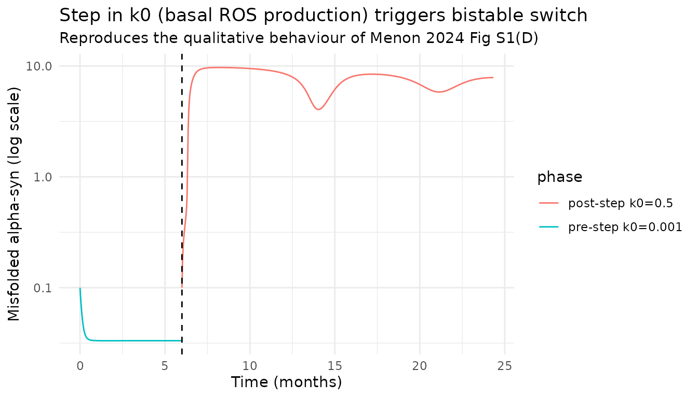

# Parkinson's disease core-module pathogenesis (Menon 2024)

## Model and source

- Citation: Menon G, Bakshi S, Krishnan J. (2024). The interaction of
  core modules as a basis for elucidating network behavior determining
  Parkinson’s disease pathogenesis. CPT Pharmacometrics Syst Pharmacol
  13(3):335-340. <doi:10.1002/psp4.13108>. Structural components
  inherited from Cloutier & Wellstead (2012) IET Syst Biol 6(3):86-93
  (ROS positive-feedback module) and Sneppen et al. (2009) Phys Biol
  6:036005 (proteasome sequestration module).
- Article: [CPT Pharmacometrics Syst Pharmacol
  13(3):335-340](https://doi.org/10.1002/psp4.13108)
- Supplement 1 (Perspective narrative + Table S1 + Figures S1-S8): part
  of the open-access article.
- Supplement 2 (Modelling and systems framework: Equations 1-9 +
  parameter rationale + references): part of the open-access article.
- Supplement 3 (parameter tables for every simulation scenario): part of
  the open-access article.
- Companion MATLAB source:
  <https://github.com/gm1613/parkinsons_disease_models>

## Paper classification and extraction scope

The source is labelled `## PERSPECTIVE` on page 1. Under the standing
operator policy (2026-07-11), QSP / systems-pharmacology models with
tabulated ODEs and parameter values are extracted regardless of
publication type. Menon 2024’s Supplementary Material 2 (Section 1.4,
Equations 1-5) gives the combined ROS + proteasome-sequestration ODE
system explicitly, and Supplementary Material 3 tabulates parameter
values across ten figure scenarios (Fig 1B ROS-only, Fig 1C-D
proteasome-only, Fig 2A-I and Fig S1-S7 combined-model scenarios, Fig
S8B-C dopamine-compartmentalization variant). The combined and
DA-compartmentalization models are therefore packaged as two related
model files with one shared vignette (this file).

## Model files

This paper contributes two nlmixr2lib models:

- `Menon_2024_parkinsonPathogenesis` – combined 5-ODE ROS +
  proteasome-sequestration model (Supinfo2 Section 1.4, Equations 1-5).
  Default parameter values are the **Fig 2(A)** scenario (supercritical
  Hopf in the proteasomal module with no overlap with the bistable
  regime).
- `Menon_2024_parkinsonPathogenesis_DA` – 4-ODE
  dopamine-compartmentalization variant (Supinfo2 Section 1.6, Equations
  6-9). This variant replaces the proteasomal module with an explicit
  vesicle / cytoplasm / extracellular DA transport chain, and adds a
  cytoplasmic-DA-driven ROS-production term (parameter `kDA`). Default
  parameter values are the **Fig S8(B)** scenario, `tr3 = 40000`
  high-transport regime.

Both are mechanistic ODE models without drug input, without IIV, and
without residual error. All state variables are typical-value
trajectories.

## Population and species

There is no fitted patient population. Both models are typical-value
mechanistic simulations at the level of a single dopaminergic neuron’s
intracellular network. The metadata field `population$species` is
therefore
`"in silico (dopaminergic neuron cell-level mechanistic model)"`.

## Source trace

### Combined ROS + proteasome-sequestration model – equations

| Equation | Form | Source location |
|----|----|----|
| Eq 1 | `d[F]/dt = kagg*[alpha_syn] - gamma*[F]*[P]` | Supinfo2 Section 1.4 Eq (1) |
| Eq 2 | `d[CP]/dt = gamma*[F]*[P] - nu*[CP]` | Supinfo2 Section 1.4 Eq (2) |
| Eq 3 | `d[P]/dt = sigma - kP*[P] - gamma*[F]*[P] + nu*[CP]` | Supinfo2 Section 1.4 Eq (3) |
| Eq 4 | `d[alpha_syn]/dt = m + k3*[ROS] - kagg*[alpha_syn] - k4*[P]*[alpha_syn] - krem*[alpha_syn]` | Supinfo2 Section 1.4 Eq (4) |
| Eq 5 | `d[ROS]/dt = k1*(k0 + d_asyn * ([alpha_syn]^4 / (1 + [alpha_syn]^4))) - k2*[ROS]` | Supinfo2 Section 1.4 Eq (5) |

### Combined ROS + proteasome-sequestration model – Figure 2(A) parameter set

| Parameter | Value | Units | Source location |
|----|----|----|----|
| m | 0.00042 | 1/h | Supinfo3 Table “Figure 2 (A), Figure S1(C,D)” |
| sigma | 0.0042 | 1/h | Supinfo3 Table “Figure 2 (A), Figure S1(C,D)” |
| gamma | 0.0042 | 1/h | Supinfo3 Table “Figure 2 (A), Figure S1(C,D)” |
| nu | 0.0042 | 1/h | Supinfo3 Table “Figure 2 (A), Figure S1(C,D)” |
| k1 | 35 | 1/h | Supinfo3 Table “Figure 2 (A), Figure S1(C,D)” |
| k2 | 35 | 1/h | Supinfo3 Table “Figure 2 (A), Figure S1(C,D)” |
| k3 | 0.0087 | 1/h | Supinfo3 Table “Figure 2 (A), Figure S1(C,D)” |
| k4 | 0.0042 | 1/h | Supinfo3 Table “Figure 2 (A), Figure S1(C,D)” |
| kagg | 0.0042 | 1/h | Supinfo3 Table “Figure 2 (A), Figure S1(C,D)” |
| krem | 0.0045 | 1/h | Supinfo3 Table “Figure 2 (A), Figure S1(C,D)” |
| d_asyn | 10 | \- | Supinfo3 Table “Figure 2 (A), Figure S1(C,D)” |
| K_asyn | 1 | \- | Supinfo3 Table “Figure 2 (A), Figure S1(C,D)” |
| kP | 0.0042 | 1/h | INFERRED (see Assumptions and deviations); not tabulated in Supinfo3 |
| k0 | 0.001 | \- | Default chosen; bifurcation-input parameter varied per figure |

### DA-compartmentalization variant – equations

| Equation | Form | Source location |
|----|----|----|
| Eq 6 | `d[alpha_syn]/dt = m + k3*[ROS] - k4*[alpha_syn]` | Supinfo2 Section 1.6 Eq (6) |
| Eq 7 | `d[ROS]/dt = k1*(k0 + d_asyn * hill_asyn + kDA*[D_C]) - k2*[ROS]` | Supinfo2 Section 1.6 Eq (7) |
| Eq 8 | `d[D_V]/dt = tr1*[D_C] - tr2 * hill_asyn * [D_V]` | Supinfo2 Section 1.6 Eq (8) |
| Eq 9 | `d[D_C]/dt = k_synth + tr3*[D_ex] + tr2 * hill_asyn * [D_V] - tr1*[D_C] - k_deg*[D_C]` | Supinfo2 Section 1.6 Eq (9) |

### DA-compartmentalization variant – Figure S8(B) parameter set

| Parameter | Value | Units | Source location |
|----|----|----|----|
| m | 0 | 1/h | Supinfo3 Table “Figure S8 (B)” |
| k1 | 35 | 1/h | Supinfo3 Table “Figure S8 (B)” |
| k2 | 35 | 1/h | Supinfo3 Table “Figure S8 (B)” |
| k3 | 0.0087 | 1/h | Supinfo3 Table “Figure S8 (B)” |
| k4 | 0.0087 | 1/h | Supinfo3 Table “Figure S8 (B)” |
| d_asyn | 10 | \- | Supinfo3 Table “Figure S8 (B)” |
| K_asyn | 1 | \- | Supinfo3 Table “Figure S8 (B)” |
| tr1 | 40 | 1/h | Supinfo3 Table “Figure S8 (B)” |
| tr2 | 10 | 1/h | Supinfo3 Table “Figure S8 (B)” |
| tr3 | 40000 | 1/h | Supinfo3 Table “Figure S8 (B)” (scenario “40 x 10^3”) |
| D_ex | 0.002 | uM | Supinfo3 Table “Figure S8 (B)” |
| k_synth | 20 | uM 1/h | Supinfo3 Table “Figure S8 (B)” |
| k_deg | 40 | 1/h | Supinfo3 Table “Figure S8 (B)” |
| kDA | 0.05 | 1/h 1/uM | Supinfo3 Table “Figure S8 (B)” as “k_DA” |

## Combined ROS + proteasome-sequestration model – reproduction

### Healthy baseline steady state

Loading the model with default parameters and integrating over three
simulated years shows a stable healthy attractor at low misfolded
alpha-synuclein (`alpha_syn` at 0.033 dimensionless units) and free
proteasome level `pfree = 1.0` (matching the paper’s Fig 2 baseline
`[P]` on the bifurcation-diagram y-axis).

``` r

mod_combined <- readModelDb("Menon_2024_parkinsonPathogenesis") |>
  rxode2::zeroRe()
#> Warning: No omega parameters in the model
#> Warning: No sigma parameters in the model

events_h <- rxode2::et(seq(0, 24 * 365 * 3, by = 24))  # 3 years, daily samples
sim_h <- rxode2::rxSolve(mod_combined, events_h)

tail(as.data.frame(sim_h)[, c("time", "alpha_syn", "pfree", "ros", "hill_asyn")], 1)
#>       time  alpha_syn pfree         ros    hill_asyn
#> 1096 26280 0.03324079     1 0.001012209 1.220914e-06
```

### Bistable switch triggered by increased basal ROS production (k0 scan)

The paper’s Fig 2(A) bifurcation diagram uses `k0` (basal cytoplasmic
ROS production) as the bifurcation input on the horizontal axis. At low
`k0` the system rests in a low-`alpha_syn` healthy attractor; as `k0`
increases beyond a threshold the system switches to a high- `alpha_syn`
diseased attractor (elevated misfolded alpha-synuclein).

``` r

k0_grid <- c(0.001, 0.01, 0.1, 0.5, 1.0, 5.0, 10.0)

scan_df <- lapply(k0_grid, function(k0v) {
  s <- rxode2::rxSolve(mod_combined, events_h, params = c(k0 = k0v))
  final <- tail(as.data.frame(s), 1)
  data.frame(k0 = k0v,
             alpha_syn = final$alpha_syn,
             pfree     = final$pfree,
             ros       = final$ros)
}) |> dplyr::bind_rows()

scan_df
#>      k0   alpha_syn     pfree          ros
#> 1 1e-03  0.03324079 1.0000000  0.001012209
#> 2 1e-02  0.03931844 1.0000000  0.010023899
#> 3 1e-01  0.10069324 1.0000000  0.101027914
#> 4 5e-01  6.96840621 1.0574966 10.495760807
#> 5 1e+00  7.14057052 1.1312792 10.996154954
#> 6 5e+00  7.14650273 2.1564948 14.996167457
#> 7 1e+01 13.88965299 0.7566066 19.999731307
```

The switch is visible in the `alpha_syn` column: at `k0 <= 0.1` the
system remains near the low-`alpha_syn` healthy state; between
`k0 = 0.1` and `k0 = 0.5` the system tips into the diseased attractor
with `alpha_syn` about two orders of magnitude higher. Free proteasome
`pfree` stays approximately unchanged at the switch – matching the Fig
2(A) / Fig S1(D) description (“Both transient (pulse) and permanent
(step) changes in `k0` can trigger a switch to a diseased state … having
a relatively minor effect (relative to panels c and e) on the proteasome
levels”).

### Step-input reproduction (Figure S1(D) analogue)

The paper’s Fig S1(D) shows a step increase in `k0` that permanently
switches the system to the diseased state. We reproduce this
qualitatively by holding `k0` at 0.001 for the first 6 months (system in
healthy attractor), then stepping to 0.5 for the remainder of the
simulation.

``` r

# Two-segment simulation: pre-step at k0 = 0.001, post-step at k0 = 0.5
t_step <- 24 * 30 * 6   # 6 months = end of pre-step segment (hours)
t_end  <- 24 * 365 * 2  # 2 years total

ev_pre  <- rxode2::et(seq(0, t_step, by = 24))
sim_pre <- rxode2::rxSolve(mod_combined, ev_pre, params = c(k0 = 0.001))

end_pre <- as.data.frame(sim_pre)[nrow(as.data.frame(sim_pre)), ]

ev_post <- rxode2::et(seq(0, t_end - t_step, by = 24))
sim_post <- rxode2::rxSolve(mod_combined, ev_post, params = c(k0 = 0.5),
                            inits = c(alpha_syn = end_pre$alpha_syn,
                                      fagg      = end_pre$fagg,
                                      pfree     = end_pre$pfree,
                                      pcomplex  = end_pre$pcomplex,
                                      ros       = end_pre$ros))

df_pre  <- as.data.frame(sim_pre)  |> dplyr::mutate(phase = "pre-step k0=0.001")
df_post <- as.data.frame(sim_post) |>
  dplyr::mutate(time = time + t_step, phase = "post-step k0=0.5")
df_all  <- dplyr::bind_rows(df_pre, df_post)

ggplot(df_all, aes(x = time / (24 * 30), y = alpha_syn, colour = phase)) +
  geom_line() +
  geom_vline(xintercept = t_step / (24 * 30), linetype = "dashed") +
  scale_y_log10() +
  labs(x = "Time (months)", y = "Misfolded alpha-syn (log scale)",
       title = "Step in k0 (basal ROS production) triggers bistable switch",
       subtitle = "Reproduces the qualitative behaviour of Menon 2024 Fig S1(D)") +
  theme_minimal()
```



### Proteasome-availability intervention (Figure 2(I) / S2 analogue)

The paper’s Fig 2(I) demonstrates that increasing proteasome
availability (parameter `sigma`, background proteasome production) can
raise the switching threshold and lower the diseased-state misfolded
alpha-syn level. We reproduce this by scanning `sigma` at fixed elevated
`k0 = 1.0` (well into the diseased regime for baseline `sigma`).

``` r

sigma_grid <- c(0.0042, 0.0084, 0.0208, 0.0416)

int_df <- lapply(sigma_grid, function(sig) {
  s <- rxode2::rxSolve(mod_combined, events_h,
                       params = c(k0 = 1.0, sigma = sig))
  final <- tail(as.data.frame(s), 1)
  data.frame(sigma = sig,
             alpha_syn = final$alpha_syn,
             pfree     = final$pfree,
             ros       = final$ros)
}) |> dplyr::bind_rows()

int_df
#>    sigma alpha_syn    pfree       ros
#> 1 0.0042 7.1405705 1.131279 10.996155
#> 2 0.0084 5.6159416 2.000001 10.989957
#> 3 0.0208 3.2315064 4.952381 10.909131
#> 4 0.0416 0.1832608 9.904762  1.011266
```

Increasing `sigma` from the baseline 0.0042 up to 0.0416 (about a
10-fold increase) raises the steady-state `pfree` (matching the paper’s
inferred `[P]_ss = sigma / kP` = 10x). At the highest sigma the system
can exit the diseased attractor entirely – the same mechanism the
paper’s Fig 2(I) demonstrates.

## DA-compartmentalization variant – reproduction

### Baseline high-transport scenario (tr3 = 40000)

At the baseline high-DA-transport regime, cytoplasmic dopamine
(`da_cyto`) is elevated. Because cytoplasmic DA contributes to ROS
production via the `kDA` term (Supinfo2 Eq 7), the system is already
close to (or in) the diseased attractor at low `k0`.

``` r

mod_da <- readModelDb("Menon_2024_parkinsonPathogenesis_DA") |>
  rxode2::zeroRe()
#> Warning: No omega parameters in the model
#> Warning: No sigma parameters in the model

# Short simulation window (6 months) to avoid the unbounded DA_ves
# growth that occurs at healthy hill_asyn ~ 0 (see Assumptions and
# deviations below).
events_da <- rxode2::et(seq(0, 24 * 30 * 6, by = 24))
sim_da <- rxode2::rxSolve(mod_da, events_da)

tail(as.data.frame(sim_da)[, c("time", "alpha_syn", "ros", "da_cyto")], 1)
#>     time alpha_syn      ros da_cyto
#> 181 4320  10.12505 10.12505     2.5
```

### DA transporter inhibition (tr3 sweep)

Reducing `tr3` (DA transport from extracellular space into cytoplasm,
the therapeutic target the paper discusses) lowers steady-state
cytoplasmic DA and raises the switching threshold in `alpha_syn`.

``` r

# The paper's Fig S8(B) scenario tabulates tr3 = 40000, 20000, 400 h^-1
tr3_grid <- c(400, 20000, 40000)

tr3_df <- lapply(tr3_grid, function(tr3v) {
  s <- rxode2::rxSolve(mod_da, events_da, params = c(tr3 = tr3v))
  final <- tail(as.data.frame(s), 1)
  data.frame(tr3      = tr3v,
             alpha_syn = final$alpha_syn,
             ros       = final$ros,
             da_cyto   = final$da_cyto)
}) |> dplyr::bind_rows()

tr3_df
#>     tr3   alpha_syn         ros   da_cyto
#> 1   400  0.01401091  0.01401120 0.2602163
#> 2 20000  0.04060003  0.04066913 0.7928395
#> 3 40000 10.12504852 10.12504858 2.5000000
```

At `tr3 = 400` (low-transport / DAT-inhibition scenario) the system
remains in the low-`alpha_syn` healthy attractor. At `tr3 = 40000`
(baseline high-transport) the system settles into the diseased attractor
with high `alpha_syn` and high cytoplasmic DA. This matches the paper’s
Fig S8(B) message: reducing DAT expression raises the switching
threshold.

## Assumptions and deviations

### Inferred `kP` (proteasome-degradation rate) in the combined model

The proteasome-degradation rate constant `kP` appears in Supinfo2 Eq (3)
as the linear-degradation term `-kP*[P]`, but is not tabulated in
Supinfo3 for any figure scenario. The value `kP = 0.0042 h^-1` used here
as the default is INFERRED from the steady-state balance of Eq (3) at
healthy `alpha_syn = 0` (so `F = 0` and `CP = 0` via Eqs 1-2):

    d[P]/dt = sigma - kP*[P] = 0
    [P]_ss  = sigma / kP

The paper’s Fig 2 bifurcation diagrams show healthy `[P]_ss` at
approximately 1 (dimensionless, scale factor 50 pM). With
`sigma = 0.0042 h^-1`, this requires `kP = sigma = 0.0042 h^-1`. Under
this inference, the Fig 2(I) proteasome-availability intervention
scenario (`sigma = 0.0416`, `kP` unchanged) yields `[P]_ss = 9.9` – an
approximately 10-fold rise consistent with the paper’s Fig 2(I)
description of “increased proteasome availability”.

The upstream Sneppen et al. 2009 proteasome-dynamics paper cited by
Menon 2024 as reference \[6\] is not on disk in the source directory; if
the operator wishes to resolve this from the primary source, the DOI is
10.1088/1478-3975/6/3/036005.

### Unbounded vesicular DA in the DA variant (healthy regime)

The DA-compartmentalization variant’s Eq (8) has no vesicular-DA release
term – the only outflow from `da_ves` is `tr2 * hill_asyn * da_ves`,
which is zero at healthy `hill_asyn ~ 0`. The only inflow
(`tr1 * da_cyto`) is positive at any healthy steady state, so `da_ves`
grows linearly without bound over long simulation windows in the healthy
regime. This is a paper-level limitation acknowledged in Supinfo2
Section 1.6 (“we choose parameter values consistent with the estimated
reaction fluxes and steady state concentrations reported in \[10\]” –
the upstream Best et al. 2009 paper contains a fuller vesicular-release
description that Menon 2024 omitted for simplicity).

For qualitative bifurcation analysis of `alpha_syn` and `ros` (the
paper’s actual analytical target in Fig S8), the unbounded `da_ves` does
not affect the switching-threshold behaviour on the time scales of
interest, because `da_ves` couples back to `alpha_syn` only through the
`tr2 * hill_asyn * da_ves` term, which is zero at healthy `hill_asyn`.
The DA vignette simulations here are therefore restricted to a 6-month
window; longer simulations should be interpreted with this caveat in
mind.

The upstream Best, Nijhout & Reed 2009 dopamine-homeostasis paper is not
on disk in the source directory; DOI 10.1186/1742-4682-6-21.

### Fig S8(C) extracellular-DA feedback variant not extracted

Menon 2024 Supinfo2 Section 1.6 also describes a variant where DA
synthesis is inhibited by extracellular DA via
`k_synth = alpha / (beta + D_ex)`. Supinfo3 Table “Figure S8 (C)”
tabulates the parameters (`alpha = 0.04 uM/h`, `beta = 0.002 uM`,
`tr3 = 400 or 40000 h^-1`). This variant is not extracted as a separate
`.R` file to avoid multiplying the number of packaged models for what is
a two-parameter modification of the default DA model. A downstream user
who needs this form can replace the constant `k_synth = 20 uM/h` in the
model file with the alpha/(beta + D_ex) form. See the paper for the
physiological rationale (autoreceptor- mediated inhibition of tyrosine
hydroxylase).

### No IIV, no residual error, no drug input

Both models are typical-value mechanistic simulations. No IIV parameters
are declared, no residual-error terms, and no dosing compartments. This
matches the paper’s Perspective / demonstration scope (no fitted patient
population; the model is meant to reveal a qualitative systems
landscape). The `population` metadata field
`species = "in silico (dopaminergic neuron cell-level mechanistic model)"`
records this.

### Bifurcation-parameter default `k0 = 0.001`

Neither model file’s `k0` default is a paper-tabulated value. Supinfo3
does not tabulate a specific numeric value of `k0` – instead `k0` is the
bifurcation-input parameter that the paper varies continuously along the
horizontal axis of each Fig 2 / S1 / S3-S7 bifurcation diagram. The
`k0 = 0.001` default placed in `ini()` is chosen small enough to hold
the system in the healthy attractor at steady state (see the “Healthy
baseline steady state” chunk above); users interested in reproducing the
diseased-state trajectories should override `k0` via the
`params = c(k0 = <value>)` argument to
[`rxode2::rxSolve()`](https://nlmixr2.github.io/rxode2/reference/rxSolve.html).

### Time-scaling and dimensionless concentrations

Per Supinfo2 Section 1.4: “All concentrations used in the model are
non-dimensionalized, scaled by a factor of 50 pM. Time is measured in
hours.” The DA compartments in the variant model are in physical uM
(Supinfo2 Section 1.6: “DA concentrations are in uM”). The mixed unit
system is preserved as-is in the model file.

## Session information

``` r

sessionInfo()
#> R version 4.6.1 (2026-06-24)
#> Platform: x86_64-pc-linux-gnu
#> Running under: Ubuntu 24.04.4 LTS
#> 
#> Matrix products: default
#> BLAS:   /usr/lib/x86_64-linux-gnu/openblas-pthread/libblas.so.3 
#> LAPACK: /usr/lib/x86_64-linux-gnu/openblas-pthread/libopenblasp-r0.3.26.so;  LAPACK version 3.12.0
#> 
#> locale:
#>  [1] LC_CTYPE=C.UTF-8       LC_NUMERIC=C           LC_TIME=C.UTF-8       
#>  [4] LC_COLLATE=C.UTF-8     LC_MONETARY=C.UTF-8    LC_MESSAGES=C.UTF-8   
#>  [7] LC_PAPER=C.UTF-8       LC_NAME=C              LC_ADDRESS=C          
#> [10] LC_TELEPHONE=C         LC_MEASUREMENT=C.UTF-8 LC_IDENTIFICATION=C   
#> 
#> time zone: UTC
#> tzcode source: system (glibc)
#> 
#> attached base packages:
#> [1] stats     graphics  grDevices utils     datasets  methods   base     
#> 
#> other attached packages:
#> [1] ggplot2_4.0.3         tidyr_1.3.2           dplyr_1.2.1          
#> [4] rxode2_5.1.5          nlmixr2lib_0.3.2.9000
#> 
#> loaded via a namespace (and not attached):
#>  [1] gtable_0.3.6       xfun_0.60          bslib_0.11.0       vctrs_0.7.3       
#>  [5] tools_4.6.1        generics_0.1.4     parallel_4.6.1     tibble_3.3.1      
#>  [9] symengine_0.2.13   pkgconfig_2.0.3    data.table_1.18.4  checkmate_2.3.4   
#> [13] RColorBrewer_1.1-3 S7_0.2.2           desc_1.4.3         RcppParallel_6.1.1
#> [17] lifecycle_1.0.5    compiler_4.6.1     farver_2.1.2       textshaping_1.0.5 
#> [21] fontawesome_0.5.3  htmltools_0.5.9    sys_3.4.3          sass_0.4.10       
#> [25] yaml_2.3.12        pillar_1.11.1      pkgdown_2.2.1      crayon_1.5.3      
#> [29] jquerylib_0.1.4    whisker_0.4.1      openssl_2.4.2      cachem_1.1.0      
#> [33] qs2_0.2.2          tidyselect_1.2.1   digest_0.6.39      lotri_1.0.4       
#> [37] purrr_1.2.2        labeling_0.4.3     rxode2ll_2.0.16    fastmap_1.2.0     
#> [41] grid_4.6.1         cli_3.6.6          dparser_1.3.1-13   magrittr_2.0.5    
#> [45] withr_3.0.3        scales_1.4.0       backports_1.5.1    rmarkdown_2.31    
#> [49] otel_0.2.0         askpass_1.2.1      ragg_1.5.2         stringfish_0.19.0 
#> [53] memoise_2.0.1      evaluate_1.0.5     knitr_1.51         rex_1.2.2         
#> [57] PreciseSums_0.7    rlang_1.3.0        downlit_0.4.5      Rcpp_1.1.2        
#> [61] glue_1.8.1         xml2_1.6.0         jsonlite_2.0.0     R6_2.6.1          
#> [65] systemfonts_1.3.2  fs_2.1.0
```
