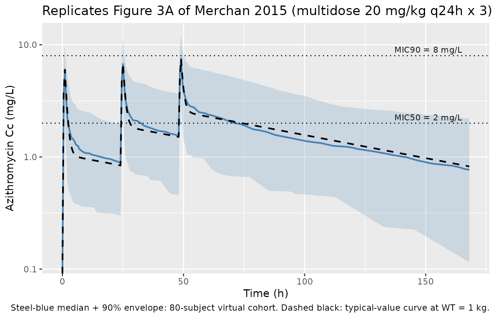

# Azithromycin (Merchan 2015)

## Model and source

- Citation: Merchan LM, Hassan HE, Terrin ML, Waites KB, Kaufman DA,
  Ambalavanan N, Donohue P, Dulkerian SJ, Schelonka R, Magder LS, Shukla
  S, Eddington ND, Viscardi RM. Pharmacokinetics, microbial response,
  and pulmonary outcomes of multidose intravenous azithromycin in
  preterm infants at risk for Ureaplasma respiratory colonization.
  Antimicrob Agents Chemother. 2015;59(1):570-578.
  <doi:10.1128/AAC.03951-14>
- Description: Population PK model for intravenous azithromycin in
  preterm neonates at risk for Ureaplasma respiratory tract colonization
  (Merchan 2015). Pooled re-analysis of three studies (single 10 mg/kg,
  single 20 mg/kg, and 3 daily doses of 20 mg/kg). Two-compartment
  linear model with all PK parameters allometrically scaled on body
  weight: fixed exponent 0.75 on CL and Q, fixed exponent 1.0 on V1 and
  V2, reference body weight 1 kg.
- Article: <https://doi.org/10.1128/AAC.03951-14>

## Population

Merchan 2015 refined a population PK model of intravenous azithromycin
in preterm neonates by pooling data from three studies in extremely
preterm infants at risk for Ureaplasma respiratory tract colonization
and bronchopulmonary dysplasia (BPD): a single 10 mg/kg dose (n = 12), a
single 20 mg/kg dose (n = 13), and a 3-day course of 20 mg/kg every 24 h
(n = 15; the current study). All infants were 24-28 weeks gestational
age at birth, weighed roughly 600-1500 g at study entry, were
mechanically ventilated, and received the drug as a 60-min IV infusion.
The pooled analysis contributed 239 plasma azithromycin concentrations
from 40 subjects (Merchan 2015 Results ‘Pharmacokinetic analysis’).

The multidose cohort baseline characteristics are summarised in Merchan
2015 Table 1: mean gestational age at birth 26.3 weeks (SD 1.5), mean
birth weight 895 g (SD 245), 53% male, 67% White / 33% Black, 13%
Hispanic. The two earlier single-dose cohorts are described in
references 14 and 15 of the paper. The model file’s `population`
metadata exposes the per-cohort and pooled-cohort summary
programmatically via
`rxode2::rxode(readModelDb("Merchan_2015_azithromycin"))$population`.

## Source trace

The per-parameter origin is recorded as an in-file comment next to each
`ini()` entry in
`inst/modeldb/specificDrugs/Merchan_2015_azithromycin.R`. The table
below collects them in one place for review.

| Equation / parameter | Value | Source location |
|----|----|----|
| `lcl` (CL coefficient, L/h/kg^0.75) | log(0.15) | Merchan 2015 Table 3 |
| `lvc` (V1 coefficient, L/kg) | log(1.88) | Merchan 2015 Table 3 |
| `lq` (Q coefficient, L/h/kg^0.75) | log(1.79) | Merchan 2015 Table 3 |
| `lvp` (V2 coefficient, L/kg) | log(13.0) | Merchan 2015 Table 3 |
| `allo_cl` (allometric exponent on CL and Q) | fixed 0.75 | Merchan 2015 Methods ‘Pharmacokinetic data analysis’ |
| `allo_v` (allometric exponent on V1 and V2) | fixed 1.0 | Merchan 2015 Methods ‘Pharmacokinetic data analysis’ |
| Reference weight (kg) | 1 | Merchan 2015 Results ‘Pharmacokinetic analysis’ (worked half-life sentence: ‘a typical neonate weighing 1 kg’) |
| `etalcl` (IIV variance) | 0.581^2 = 0.3376 | Merchan 2015 Table 3 (ISV 58.1% = sqrt(omega^2) x 100; footnote a) |
| `etalvc` (IIV variance) | 0.782^2 = 0.6115 | Merchan 2015 Table 3 (ISV 78.2%) |
| `etalq` (IIV variance) | 0.643^2 = 0.4135 | Merchan 2015 Table 3 (ISV 64.3%) |
| `etalvp` (IIV variance) | 0.781^2 = 0.6100 | Merchan 2015 Table 3 (ISV 78.1%) |
| `propSd` (proportional residual) | 0.28 | Merchan 2015 Table 3 (28%, 24% RSE); Methods ‘Pharmacokinetic data analysis’ (Yij_obs = Yij_pred \* (1 + eps)) |
| 2-compartment ODE structure | n/a | Merchan 2015 Methods ‘Pharmacokinetic data analysis’ (ADVAN3 TRANS4) |
| 60-min IV infusion dosing | n/a | Merchan 2015 Methods ‘Drug administration and blood sampling’ |

## Virtual cohort

Original observed data from Merchan 2015 are not publicly available. The
simulation below builds a virtual cohort of 200 preterm neonates whose
body weight distribution approximates the reported birth weights
(multidose cohort mean ~895 g, range ~600-1500 g). Each subject is
assigned to one of the three published dose regimens with cohort sizes
proportional to the source paper (10 mg/kg single dose, 20 mg/kg single
dose, 20 mg/kg q24h x 3).

``` r

set.seed(20141110L)  # Accepted-manuscript online date of the source paper.

# Helper: build one cohort as a self-contained event table. The `id_offset`
# shifts subject IDs so cohorts can be `bind_rows()`-ed without colliding;
# `rxSolve` treats `id` as the subject key and silently merges duplicates
# into a single "Frankenstein" subject that receives the *summed* dose, so
# offsetting is mandatory whenever multiple cohorts share a simulation.
make_cohort <- function(n, dose_mg_per_kg, n_doses, tau_h,
                        max_time_h, treatment, obs_step_h = 0.5,
                        id_offset = 0L) {
  # Body weight: log-normal centered on 0.895 kg with spread chosen to
  # cover roughly the 0.55-1.50 kg observed range across all three cohorts.
  wt <- rlnorm(n, meanlog = log(0.895), sdlog = 0.20)
  wt <- pmin(pmax(wt, 0.55), 1.50)
  infusion_dur <- 1     # 60-min infusion (Merchan 2015 Methods)
  dose_times   <- seq(0, by = tau_h, length.out = n_doses)

  per_subject <- function(i) {
    dose_amt <- dose_mg_per_kg * wt[i]
    doses <- tibble::tibble(
      id        = id_offset + i,
      time      = dose_times,
      amt       = dose_amt,
      rate      = dose_amt / infusion_dur,
      evid      = 1L,
      cmt       = "central",
      WT        = wt[i],
      treatment = treatment
    )
    obs_grid <- seq(0, max_time_h, by = obs_step_h)
    obs <- tibble::tibble(
      id        = id_offset + i,
      time      = obs_grid,
      amt       = NA_real_,
      rate      = NA_real_,
      evid      = 0L,
      cmt       = NA_character_,
      WT        = wt[i],
      treatment = treatment
    )
    dplyr::bind_rows(doses, obs) |> dplyr::arrange(time, dplyr::desc(evid))
  }

  dplyr::bind_rows(lapply(seq_len(n), per_subject))
}

# Three cohorts matching the paper's pooled dataset, with disjoint IDs.
events <- dplyr::bind_rows(
  make_cohort(n = 60, dose_mg_per_kg = 10, n_doses = 1, tau_h = 24,
              max_time_h = 168, id_offset =   0L,
              treatment  = "10 mg/kg single"),
  make_cohort(n = 60, dose_mg_per_kg = 20, n_doses = 1, tau_h = 24,
              max_time_h = 168, id_offset = 100L,
              treatment  = "20 mg/kg single"),
  make_cohort(n = 80, dose_mg_per_kg = 20, n_doses = 3, tau_h = 24,
              max_time_h = 168, id_offset = 300L,
              treatment  = "20 mg/kg q24h x3")
)

stopifnot(!anyDuplicated(unique(events[, c("id", "time", "evid")])))
```

## Simulation

``` r

mod <- readModelDb("Merchan_2015_azithromycin")

sim <- rxode2::rxSolve(
  mod,
  events = events,
  keep   = c("treatment", "WT")
) |>
  as.data.frame()
#> ℹ parameter labels from comments will be replaced by 'label()'
```

For a deterministic typical-value replication of Figure 3A (median
model-predicted curve), zero out the random effects:

``` r

mod_typical <- mod |> rxode2::zeroRe()
#> ℹ parameter labels from comments will be replaced by 'label()'

# Typical 1-kg neonate receiving the multidose 20 mg/kg q24h x 3 regimen
# (Merchan 2015 Results 'Pharmacokinetic analysis': worked half-life
# sentence is at WT = 1 kg).
ev_typ <- dplyr::filter(events, treatment == "20 mg/kg q24h x3", id == 301L)
ev_typ$WT <- 1
sim_typ <- rxode2::rxSolve(mod_typical, events = ev_typ) |> as.data.frame()
#> ℹ omega/sigma items treated as zero: 'etalcl', 'etalvc', 'etalq', 'etalvp'
```

## Replicate published figures

### Figure 3A (multidose 20 mg/kg q24h x 3 – median model-predicted profile)

Merchan 2015 Figure 3A shows the median population-model-predicted
concentration versus time overlaid on observed plasma azithromycin
concentrations from the 15 multidose subjects, with the MIC50 (2 mg/L)
and MIC90 (8 mg/L) reference lines. Original observed data are not
redistributed here; the panel below shows the simulated typical-value
curve and the 5th-95th percentile envelope of the virtual cohort over
the 168-h study window.

``` r

multidose <- dplyr::filter(sim, treatment == "20 mg/kg q24h x3", time <= 168)

envelope <- multidose |>
  dplyr::group_by(time) |>
  dplyr::summarise(
    Q05 = quantile(Cc, 0.05, na.rm = TRUE),
    Q50 = quantile(Cc, 0.50, na.rm = TRUE),
    Q95 = quantile(Cc, 0.95, na.rm = TRUE),
    .groups = "drop"
  )

typ_curve <- sim_typ |>
  dplyr::filter(time <= 168) |>
  dplyr::select(time, Cc)

ggplot(envelope, aes(time, Q50)) +
  geom_ribbon(aes(ymin = Q05, ymax = Q95), alpha = 0.20, fill = "steelblue") +
  geom_line(colour = "steelblue", linewidth = 0.8) +
  geom_line(data = typ_curve, aes(time, Cc),
            colour = "black", linetype = "dashed", linewidth = 0.8) +
  geom_hline(yintercept = c(2, 8), linetype = "dotted") +
  annotate("text", x = 165, y = 2,   label = "MIC50 = 2 mg/L",
           hjust = 1, vjust = -0.5, size = 3) +
  annotate("text", x = 165, y = 8,   label = "MIC90 = 8 mg/L",
           hjust = 1, vjust = -0.5, size = 3) +
  scale_y_log10() +
  labs(
    x = "Time (h)",
    y = "Azithromycin Cc (mg/L)",
    title = "Replicates Figure 3A of Merchan 2015 (multidose 20 mg/kg q24h x 3)",
    caption = "Steel-blue median + 90% envelope: 80-subject virtual cohort. Dashed black: typical-value curve at WT = 1 kg."
  )
#> Warning in scale_y_log10(): log-10 transformation introduced infinite values.
#> log-10 transformation introduced infinite values.
#> log-10 transformation introduced infinite values.
#> log-10 transformation introduced infinite values.
#> log-10 transformation introduced infinite values.
```



### Figure 3B (visual predictive check envelope)

Figure 3B of the paper is a 200-replicate VPC of the multidose 20 mg/kg
q24h regimen (median + 5th-95th percentiles). The 80-subject envelope
plotted above is the closest analogue available without redistributing
the observation data; the band shape (rapid distribution, plateau
between MIC50 and MIC90 over the first ~120 h, terminal decline)
reproduces the paper’s qualitative VPC description.

## PKNCA validation

The paper’s single quantitative NCA statement is in Results
‘Pharmacokinetic analysis’: the estimated AUC24/MIC90 ratio is
approximately 4 h with MIC90 = 8 mg/L, i.e. AUC0-24 after a 20 mg/kg
dose is approximately 32 mg\*h/L. The PKNCA block below computes AUC0-24
over the first dosing interval for the 20 mg/kg cohort so the median can
be compared to that value.

``` r

tau_h <- 24

# First-dose interval AUC0-24, Cmax, and Cmin for the 20 mg/kg dose groups
# (both single-dose and multidose regimens share the same first-dose AUC0-24
# because no prior dosing has occurred).
sim_nca <- sim |>
  dplyr::filter(treatment %in% c("20 mg/kg single", "20 mg/kg q24h x3"),
                !is.na(Cc),
                time >= 0, time <= tau_h) |>
  dplyr::select(id, time, Cc, treatment)

dose_df <- events |>
  dplyr::filter(evid == 1L, time == 0,
                treatment %in% c("20 mg/kg single", "20 mg/kg q24h x3")) |>
  dplyr::select(id, time, amt, treatment)

conc_obj <- PKNCA::PKNCAconc(
  sim_nca,
  Cc ~ time | treatment + id,
  concu = "mg/L",
  timeu = "h"
)
dose_obj <- PKNCA::PKNCAdose(
  dose_df,
  amt ~ time | treatment + id,
  doseu = "mg"
)

intervals <- data.frame(
  start   = 0,
  end     = tau_h,
  cmax    = TRUE,
  tmax    = TRUE,
  auclast = TRUE
)

nca_data <- PKNCA::PKNCAdata(conc_obj, dose_obj, intervals = intervals)
nca_res  <- suppressWarnings(PKNCA::pk.nca(nca_data))
nca_tbl  <- as.data.frame(nca_res$result)

knitr::kable(
  nca_tbl |>
    dplyr::group_by(treatment, PPTESTCD) |>
    dplyr::summarise(
      median = median(PPORRES, na.rm = TRUE),
      p05    = quantile(PPORRES, 0.05, na.rm = TRUE),
      p95    = quantile(PPORRES, 0.95, na.rm = TRUE),
      .groups = "drop"
    ),
  digits  = 2,
  caption = "Simulated NCA over the first 24-h interval at 20 mg/kg."
)
```

| treatment        | PPTESTCD | median |   p05 |   p95 |
|:-----------------|:---------|-------:|------:|------:|
| 20 mg/kg q24h x3 | auclast  |  33.70 | 13.33 | 64.27 |
| 20 mg/kg q24h x3 | cmax     |   5.66 |  2.42 | 10.00 |
| 20 mg/kg q24h x3 | tmax     |   1.00 |  1.00 |  1.00 |
| 20 mg/kg single  | auclast  |  28.52 | 17.79 | 58.71 |
| 20 mg/kg single  | cmax     |   4.98 |  2.64 | 12.10 |
| 20 mg/kg single  | tmax     |   1.00 |  1.00 |  1.00 |

Simulated NCA over the first 24-h interval at 20 mg/kg. {.table}

### Comparison against published NCA

``` r

auc24_sim <- nca_tbl |>
  dplyr::filter(PPTESTCD == "auclast",
                treatment == "20 mg/kg single") |>
  dplyr::summarise(
    median = median(PPORRES, na.rm = TRUE),
    p05    = quantile(PPORRES, 0.05, na.rm = TRUE),
    p95    = quantile(PPORRES, 0.95, na.rm = TRUE)
  )

comparison <- tibble::tibble(
  Source = c("Published (Merchan 2015 Results, 20 mg/kg)",
             "Simulated (this vignette, 20 mg/kg single)"),
  `Median AUC0-24 (mg*h/L)` = c(32, signif(auc24_sim$median, 3)),
  `AUC24/MIC90 ratio (h, MIC90 = 8 mg/L)` = c(
    "~4",
    sprintf("%.2f", auc24_sim$median / 8)
  )
)

knitr::kable(comparison,
             caption = "Comparison of first-dose AUC0-24 against the paper's reported AUC24/MIC90 ratio.")
```

| Source | Median AUC0-24 (mg\*h/L) | AUC24/MIC90 ratio (h, MIC90 = 8 mg/L) |
|:---|---:|:---|
| Published (Merchan 2015 Results, 20 mg/kg) | 32.0 | ~4 |
| Simulated (this vignette, 20 mg/kg single) | 28.5 | 3.57 |

Comparison of first-dose AUC0-24 against the paper’s reported
AUC24/MIC90 ratio. {.table}

### Terminal half-life at the reference weight

Merchan 2015 Results ‘Pharmacokinetic analysis’ reports a terminal
elimination half-life of approximately 69 h for a typical neonate
weighing 1 kg. The closed-form prediction from the typical-value
parameters can be cross-checked against this directly.

``` r

# Closed-form terminal half-life from the typical parameters at WT = 1 kg.
cl_typ <- 0.15
v1_typ <- 1.88
q_typ  <- 1.79
v2_typ <- 13.0

k10 <- cl_typ / v1_typ
k12 <- q_typ  / v1_typ
k21 <- q_typ  / v2_typ
sum_k <- k10 + k12 + k21
disc  <- sqrt(sum_k^2 - 4 * k10 * k21)
beta  <- (sum_k - disc) / 2
t_half_terminal <- log(2) / beta

knitr::kable(
  tibble::tibble(
    Source = c("Published (Merchan 2015 Results)",
               "Closed-form from typical-value parameters"),
    `Terminal t1/2 (h, WT = 1 kg)` = c(69, signif(t_half_terminal, 3))
  ),
  caption = "Terminal half-life at the 1-kg reference subject."
)
```

| Source                                    | Terminal t1/2 (h, WT = 1 kg) |
|:------------------------------------------|-----------------------------:|
| Published (Merchan 2015 Results)          |                         69.0 |
| Closed-form from typical-value parameters |                         73.2 |

Terminal half-life at the 1-kg reference subject. {.table}

## Assumptions and deviations

- **No published errata accounted for.** A direct check against the
  journal landing page (`https://doi.org/10.1128/AAC.03951-14`) and a
  structured literature search for corrections were attempted; no
  erratum or corrigendum is known to apply to this paper as of the
  extraction date. If a correction surfaces later, the model file and
  this vignette will need a follow-up patch with the erratum citation
  added to the model file’s `reference` field and the per-parameter
  source-trace comments.
- **ISV reported as sqrt(variance) x 100, not %CV.** Merchan 2015 Table
  3 footnote a defines ‘%ISV’ as ‘the square root of the estimated
  variance of intersubject variability x 100’, which is the SD on the
  log scale (x 100) – not the %CV approximation that would apply for
  small variances. At ISV values of 58-78% the two conventions differ
  appreciably: e.g. for CL the paper’s 58.1% gives variance 0.581^2 =
  0.3376, whereas naively converting via the log-normal identity omega^2
  = log(CV^2 + 1) would give 0.290 – different by ~14%. The model file
  uses the paper’s definition directly.
- **Proportional residual error encoded with `propSd`.** The paper uses
  the multiplicative form `Yij_obs = Yij_pred * (1 + eps)` with eps ~
  N(0, sigma^2) and reports sigma = 28% (Table 3). This maps to the
  rxode2 / nlmixr2 `Cc ~ prop(propSd)` form with `propSd = 0.28`.
- **Virtual-cohort weight distribution is illustrative.** Body weight is
  sampled from a log-normal centered on the multidose cohort mean of
  0.895 kg with spread covering roughly the 0.55-1.50 kg observed range
  across all three dosing cohorts. The original per-subject covariate
  dataset is not publicly available; downstream users should overwrite
  the cohort weights with their own when running site-specific
  simulations.
- **Covariates explored but not retained in the final model.** Methods
  ‘Pharmacokinetic data analysis’ lists gestational age, sex, height,
  and body surface area as covariates that did not improve the model.
  Inter- occasion variability across the three studies was also tested
  and dropped. These were absent from `covariateData` because the final
  model does not depend on them.
- **Single-cohort sex / race fields left as NA / multidose-only.** The
  paper reports sex and race only for the 15-subject multidose cohort
  (Table 1); the two earlier single-dose studies (cited as references 14
  and 15) are summarised by aggregate counts, so the pooled-cohort
  demographics required to populate `sex_female_pct` cannot be assembled
  from the source paper alone. `race_ethnicity` in `population` reports
  the multidose-cohort proportions and notes the scope.
- **Underprediction of the highest concentrations.** Merchan 2015
  Results ‘Pharmacokinetic analysis’ notes that the final model
  ‘underpredicted some concentrations’ in the visual predictive check,
  attributed to unaccounted-for inter-study variability. The packaged
  model reproduces the published parameter estimates verbatim and
  therefore inherits this documented limitation.
