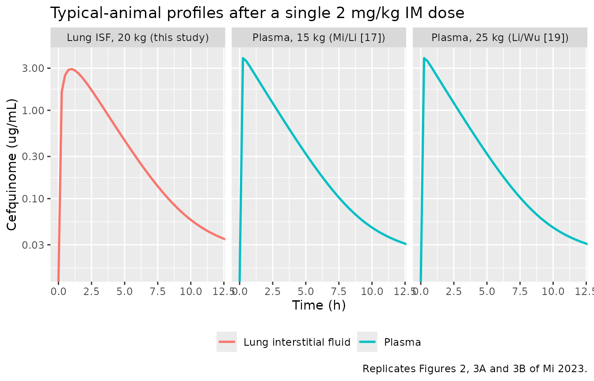
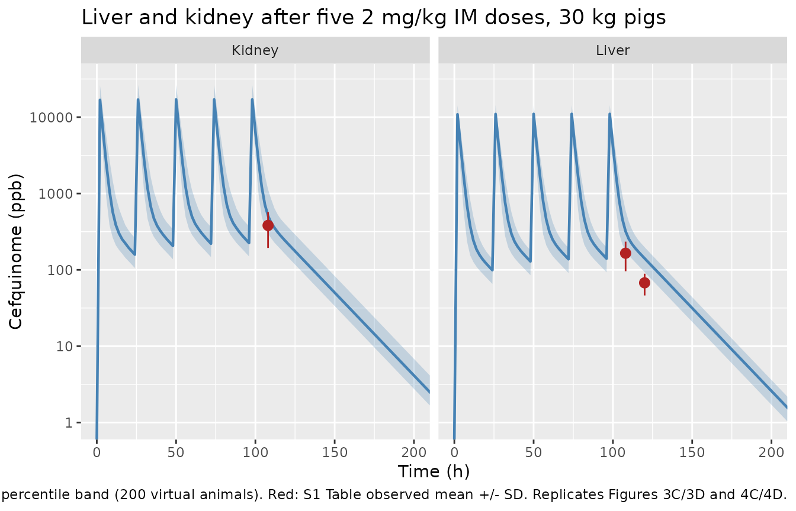
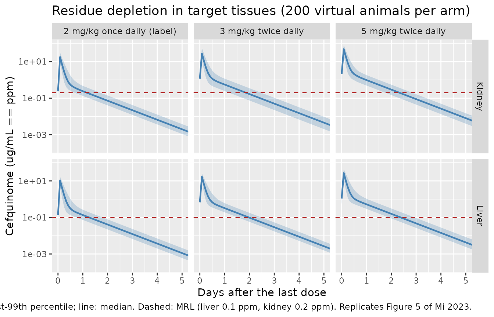

# Cefquinome PBPK in swine (Mi 2023)

## Model and source

- Citation: Mi K, Sun L, Hou Y, Cai X, Zhou K, Ma W, Xu X, Pan Y, Liu Z,
  Huang L. A physiologically based pharmacokinetic model to optimize the
  dosage regimen and withdrawal time of cefquinome in pigs. PLoS Comput
  Biol. 2023;19(8):e1011331. <doi:10.1371/journal.pcbi.1011331>. Model
  equations transcribed from S1 Text (Berkeley Madonna code); parameter
  values from Table 3 and Table 4.
- Article: <https://doi.org/10.1371/journal.pcbi.1011331>
- Supplement (S1 Text, Berkeley Madonna source code):
  <https://doi.org/10.1371/journal.pcbi.1011331.s004>
- Supplement (S1 Table, residue validation dataset):
  <https://doi.org/10.1371/journal.pcbi.1011331.s002>
- Supplement (S2 Table, sensitivity analysis):
  <https://doi.org/10.1371/journal.pcbi.1011331.s003>

Cefquinome is a fourth-generation cephalosporin licensed for
respiratory-tract disease in swine. Mi and colleagues built a whole-body
PBPK model to answer two regulatory questions at once: whether the label
dose (2 mg/kg intramuscularly once daily) achieves the
pharmacokinetic/pharmacodynamic target for the relevant respiratory
pathogens, and how long drug persists in edible tissue after treatment
(the withdrawal interval, WDI).

Every model equation in this extraction is transcribed from **S1 Text**,
the Berkeley Madonna source code the authors published, rather than from
prose; the main text describes the structure but does not print the
differential equations. Parameter values come from Table 3 (point
estimates) and Table 4 (Monte Carlo distributions).

### Structure

Six perfusion-limited, well-stirred compartments – venous blood,
arterial blood, liver, kidney, muscle and a lumped rest-of-body – are
connected by the blood circulation. Two features make this more than a
generic whole-body PBPK:

1.  **The lung is permeability-limited.** Lung interstitial fluid is the
    site of action for respiratory pathogens, so the lung resolves into
    vascular blood (`vp_lung`), interstitial fluid (`is_lung`) and
    tissue (`int_lung`) sub-compartments. Only unbound drug crosses
    between them. The authors measured lung interstitial-fluid
    concentrations directly by microdialysis in four anaesthetised pigs
    and used those data to identify the four transfer constants.
2.  **Intramuscular absorption is a two-step process.** 90% of the
    injected dose is immediately available at the injection site
    (`depot`) and absorbed into venous blood at first-order rate `Kim`;
    the remaining 10% is released from a slow depot (`depot2`) at rate
    `Kdiss` into that same injection-site pool.

Elimination is renal (from the kidney compartment) plus hepatobiliary
(from the liver compartment). Muscle is carried as a compartment but the
authors note that cefquinome is not detectable in non-injection-site
muscle, and the S1 Table residue data confirm this (`<LOD` at every
withdrawal day).

``` r

mod <- readModelDb("Mi_2023_cefquinome_pbpk")
mod_typ <- rxode2::zeroRe(mod)
```

## Population

The four crossbred pigs (Landrace x Large White x Duroc, 20 +/- 2 kg) of
the authors’ own microdialysis experiment supplied the lung
interstitial-fluid data. The structural model was additionally
calibrated and validated against four previously published swine
datasets, all from healthy animals and all digitised from the published
figures with WebPlotDigitizer (Mi 2023 Table 2):

| Purpose | Source | n | Body weight | Regimen | Matrix |
|----|----|----|----|----|----|
| Calibration | Li, Wu \[19\] | 5 | 25 kg | single 2 mg/kg IM | plasma |
| Calibration | Zhang, Li \[18\] | 40 | 45 kg | 5 doses, 24 h interval, 2 mg/kg IM | liver, kidney |
| Calibration | this study | 3 | 20 kg | single 2 mg/kg IM | lung interstitial fluid |
| Validation | Mi, Li \[17\] | 6 | 15 kg | single 2 mg/kg IM | plasma |
| Validation | Xu, Yang \[21\] | 40 | 30 kg | 5 doses, 24 h interval, 2 mg/kg IM | liver, kidney |
| Validation | this study | 1 | 20 kg | single 2 mg/kg IM | lung interstitial fluid |

The model’s reference body weight is 25 kg – a nursery pig, the age
class most susceptible to respiratory-tract pathogens. The authors state
explicitly that the dosage regimen and withdrawal intervals derived here
do **not** transfer to market-age swine (about 90-100 kg) and must be
re-assessed.

The same information is available programmatically:

``` r

str(readModelDb("Mi_2023_cefquinome_pbpk")()$population)
#> List of 9
#>  $ species      : chr "pig (crossbred Landrace x Large White x Duroc)"
#>  $ n_subjects   : int 4
#>  $ n_studies    : int 5
#>  $ age_range    : chr "nursery / grower swine"
#>  $ weight_range : chr "20 +/- 2 kg (microdialysis experiment); 15-45 kg across the calibration and validation datasets; model reference BW = 25 kg"
#>  $ disease_state: chr "healthy"
#>  $ dose_range   : chr "2 mg/kg intramuscular cefquinome sulfate (label dose); extra-label regimens of 3, 4 and 5 mg/kg once or twice d"| __truncated__
#>  $ regions      : chr "China"
#>  $ notes        : chr "The four crossbred pigs are the animals of the authors' own microdialysis experiment (Mi 2023 Materials and met"| __truncated__
```

## Source trace

The per-parameter origin is recorded as an in-file comment next to each
`ini()` entry in `inst/modeldb/specificDrugs/Mi_2023_cefquinome_pbpk.R`.
The table below collects them in one place. “S1 Text” is the published
Berkeley Madonna code.

| Equation / parameter | Value | Source location |
|----|----|----|
| `lka` (Kim) | 7 /h | Table 3, “Absorption rate constant”; Discussion |
| `lkdiss` (Kdiss) | 0.05 /h | Table 3; Discussion |
| `frac` (Frac) | 0.1 | Table 3; S1 Text `Rppgim = Rinputim*Frac` |
| `lkp_liver` (PL) | 6 | Table 3, ref \[46\] |
| `lkp_kidney` (PK) | 15.2 | Table 3, ref \[46\] |
| `lkp_lung` (PLU) | 1.5 | Table 3, ref \[46\] |
| `lkp_muscle` (PM) | 0.1 | Table 3, Model fitting |
| `lkp_other` (PR) | 0.1 | Table 3, Model fitting |
| `lk_blood_isf` (KBI) | 0.110 | Table 3; Discussion |
| `lk_isf_blood` (KIB) | 0.052 | Table 3; Discussion |
| `lk_isf_tissue` (KIT) | 3.56 | Table 3; Discussion |
| `lk_tissue_isf` (KTI) | 2.60 | Table 3; Discussion |
| `lfb_lung` (PT) | 0.30 | Table 3; Discussion “PT was defined as 0.3” |
| `fu` (= 1 - PB) | 0.812 | Table 3 (PB = 0.188 bound), ref \[31\] |
| `lcl_renal` (KurineC) | 0.3 L/h/kg | Table 3; Discussion |
| `lcl_nonren` (KbileC) | 0.01 L/h/kg | Table 3; Discussion |
| `qcc` (QCC) | 4.944 L/h/kg | Table 3, ref \[29\] |
| `qkc` (QKC) | 0.1398 | Table 3, ref \[29\] |
| Fractional flows QLC / QMC | 0.3053 / 0.2524 | Table 3, ref \[29\]; `model()` |
| Fractional volumes VLC / VKC / VMC / VvenC / VartC / VLUC | 0.0294 / 0.004 / 0.4 / 0.044 / 0.016 / 0.01 | Table 3, ref \[29\]; `model()` |
| Lung sub-compartment fractions VLUB / VLUI | 0.262 / 0.188 | Table 3, refs \[30\] / \[8\]; `model()` |
| `d/dt(venous)`, `d/dt(arterial)` | n/a | S1 Text `RV`, `RA` |
| `d/dt(liver)`, `d/dt(kidney)`, `d/dt(muscle)`, `d/dt(other)` | n/a | S1 Text `RL`, `RK`, `RM`, `RR` |
| `d/dt(vp_lung)`, `d/dt(is_lung)`, `d/dt(int_lung)` | n/a | S1 Text `RLUB`, `RLUI`, `RLUT` |
| `d/dt(depot)`, `d/dt(depot2)`, `f(depot)`, `f(depot2)` | n/a | S1 Text `Amtsiteim`, `DOSEppgim`, `Rpenim`, `Rppgim` |
| `d/dt(urine)`, `d/dt(bile)` | n/a | S1 Text `Rurine`, `Rmet` |
| All eta variances | see below | Table 4 |

### Monte Carlo distributions (Table 4)

Table 4 lists a mean, CV, SD and a lower/upper bound for each of the 11
parameters the sensitivity analysis flagged as influential. The bounds
pin down the parameterisation exactly, and reproducing them is a useful
check that the distributions have been read correctly:

- **Normal** (QCC, QKC): `SD = mean * CV`, bounds at
  `mean +/- 1.96 * SD`. QCC: `4.944 +/- 1.96 * 1.4832` = (2.04, 7.85),
  matching Table 4.
- **Lognormal** (the nine others): parameterised so the **arithmetic
  mean** equals the Table 3 point estimate,
  i.e. `sigma^2 = log(1 + CV^2)` and `mu = log(mean) - sigma^2 / 2`. For
  PL (mean 6, CV 0.2) this gives a median of `6 / sqrt(1.04)` = 5.88 and
  bounds `exp(mu +/- 1.96 * sigma)` = (3.99, 8.67), matching Table 4 to
  the printed precision. The same arithmetic reproduces the printed
  bounds for PK, KIT, KTI, KurineC and PT.

``` r

tab4 <- tibble::tribble(
  ~parameter, ~dist,    ~mean,  ~cv,  ~lower_pub, ~upper_pub,
  "QCC",      "normal",  4.944, 0.30,  2.04,  7.85,
  "QKC",      "normal",  0.1398, 0.30, 0.06,  0.22,
  "PL",       "lnorm",   6.00,  0.20,  3.99,  8.67,
  "PK",       "lnorm",  15.2,   0.20, 10.11, 21.97,
  "PM",       "lnorm",   0.10,  0.20,  0.07,  0.14,
  "PR",       "lnorm",   0.10,  0.20,  0.07,  0.14,
  "PLU",      "lnorm",   1.50,  0.20,  1.00,  2.17,
  "KIT",      "lnorm",   3.56,  0.30,  1.92,  6.06,
  "KTI",      "lnorm",   2.60,  0.30,  1.40,  4.43,
  "KurineC",  "lnorm",   0.30,  0.30,  0.16,  0.51,
  "PT",       "lnorm",   0.30,  0.30,  0.16,  0.51
) |>
  mutate(
    sigma      = if_else(dist == "lnorm", sqrt(log(1 + cv^2)), NA_real_),
    lower_calc = if_else(dist == "normal", mean - 1.96 * mean * cv,
                         exp(log(mean) - sigma^2 / 2 - 1.96 * sigma)),
    upper_calc = if_else(dist == "normal", mean + 1.96 * mean * cv,
                         exp(log(mean) - sigma^2 / 2 + 1.96 * sigma))
  )

tab4 |>
  transmute(
    Parameter = parameter, Distribution = dist,
    `Lower (Table 4)` = lower_pub,
    `Lower (derived)` = round(lower_calc, 2),
    `Upper (Table 4)` = upper_pub,
    `Upper (derived)` = round(upper_calc, 2)
  ) |>
  knitr::kable(caption = "Table 4 bounds reproduced from the stated mean and CV.")
```

| Parameter | Distribution | Lower (Table 4) | Lower (derived) | Upper (Table 4) | Upper (derived) |
|:---|:---|---:|---:|---:|---:|
| QCC | normal | 2.04 | 2.04 | 7.85 | 7.85 |
| QKC | normal | 0.06 | 0.06 | 0.22 | 0.22 |
| PL | lnorm | 3.99 | 3.99 | 8.67 | 8.67 |
| PK | lnorm | 10.11 | 10.11 | 21.97 | 21.97 |
| PM | lnorm | 0.07 | 0.07 | 0.14 | 0.14 |
| PR | lnorm | 0.07 | 0.07 | 0.14 | 0.14 |
| PLU | lnorm | 1.00 | 1.00 | 2.17 | 2.17 |
| KIT | lnorm | 1.92 | 1.92 | 6.06 | 6.06 |
| KTI | lnorm | 1.40 | 1.40 | 4.43 | 4.43 |
| KurineC | lnorm | 0.16 | 0.16 | 0.51 | 0.51 |
| PT | lnorm | 0.16 | 0.16 | 0.51 | 0.51 |

Table 4 bounds reproduced from the stated mean and CV. {.table}

## Virtual cohort

Original observed data are not publicly available except for the S1
Table residue summary, which is reproduced below. The simulations here
use virtual populations of pigs drawn exactly as the paper’s Monte Carlo
analysis does: the 11 influential parameters are sampled from their
Table 4 distributions, **truncated at the 2.5 and 97.5 percentiles**,
and everything else is held at its Table 3 value.

The truncation is not cosmetic. Cardiac output is assigned a normal
distribution with a 30% CV, so an untruncated draw goes negative roughly
once per 2300 animals; the published analysis avoids that by
constraining every draw to the 95% interval. `nlmixr2` has no native
truncated-eta support, so the packaged model file carries the
untruncated variances in `ini()` and the truncated draws are constructed
explicitly here and passed to `rxSolve()` as per-subject parameters.

Cohorts are 200 animals per arm (100 for the eight-arm regimen
comparison), within the 200-per-arm cap.

``` r

# Inverse-CDF sampling from a distribution truncated at its 2.5 / 97.5
# percentiles, matching Mi 2023 "Pop-PBPK model".
rtruncnorm <- function(n, mean, sd) {
  lo <- mean - 1.96 * sd
  hi <- mean + 1.96 * sd
  stats::qnorm(
    stats::runif(n, stats::pnorm(lo, mean, sd), stats::pnorm(hi, mean, sd)),
    mean, sd
  )
}

# Table 4 lognormals preserve the ARITHMETIC mean, so the log-scale mean is
# log(mean) - sigma^2 / 2.
rtrunclnorm <- function(n, mean, cv) {
  sigma <- sqrt(log(1 + cv^2))
  mu <- log(mean) - sigma^2 / 2
  lo <- mu - 1.96 * sigma
  hi <- mu + 1.96 * sigma
  exp(stats::qnorm(
    stats::runif(n, stats::pnorm(lo, mu, sigma), stats::pnorm(hi, mu, sigma)),
    mu, sigma
  ))
}

# `seed` is taken per arm rather than once for the whole vignette: rxSolve
# advances R's RNG stream, so seeding only at the top would make each arm's
# draws depend on how many simulations ran before it.
mc_params <- function(n, seed) {
  set.seed(seed)
  data.frame(
    id            = seq_len(n),
    qcc           = rtruncnorm(n, 4.944, 4.944 * 0.30),
    qkc           = rtruncnorm(n, 0.1398, 0.1398 * 0.30),
    lkp_liver     = log(rtrunclnorm(n, 6.00, 0.20)),
    lkp_kidney    = log(rtrunclnorm(n, 15.2, 0.20)),
    lkp_muscle    = log(rtrunclnorm(n, 0.10, 0.20)),
    lkp_other     = log(rtrunclnorm(n, 0.10, 0.20)),
    lkp_lung      = log(rtrunclnorm(n, 1.50, 0.20)),
    lk_isf_tissue = log(rtrunclnorm(n, 3.56, 0.30)),
    lk_tissue_isf = log(rtrunclnorm(n, 2.60, 0.30)),
    lcl_renal     = log(rtrunclnorm(n, 0.30, 0.30)),
    lfb_lung      = log(rtrunclnorm(n, 0.30, 0.30))
  )
}

# One arm = one (body weight, dose, interval, number of doses) combination.
# Each arm is solved on its own so subject IDs can never collide between arms.
# Observation rows use `cmt = "venous"`, an actual ODE state; rxode2 returns
# every algebraic observable (Cc, Cisf_lung, Cliver, ...) as a column anyway.
simulate_arm <- function(label, wt, mgkg, ii, ndose, times, n = 200, seed) {
  amt <- mgkg * wt
  ev <-
    rxode2::et(amt = amt, cmt = "depot", ii = ii, addl = ndose - 1L) |>
    rxode2::et(amt = amt, cmt = "depot2", ii = ii, addl = ndose - 1L) |>
    rxode2::et(times, cmt = "venous") |>
    rxode2::et(id = seq_len(n))
  ev <- as.data.frame(ev)
  ev$WT <- wt
  pars <- mc_params(n, seed)

  # rxSolve() is not reliable on this model: with identical inputs, an
  # identical seed and even cores = 1, the same call intermittently returns
  # NA for a subset of subjects (observed rates of roughly 10% of calls, and
  # anywhere from 1 to 190 of 200 subjects). It is a solver-state defect
  # rather than a property of the parameter draw -- the same draw solves on a
  # repeat attempt. Because a subject that fails is dropped to NA and can
  # silently bias or zero out an arm, every simulation is retried, cycling
  # through the available methods, until all subjects solve; only then are
  # the results used, and an arm that never completes raises an error rather
  # than reporting silently degenerate output. See the Assumptions section.
  solve_with <- function(method) {
    suppressWarnings(rxode2::rxSolve(
      mod_typ, ev, params = pars, omega = NA,
      method = method, maxsteps = 1000000L, atol = 1e-8, rtol = 1e-6,
      returnType = "data.frame"
    ))
  }
  complete <- function(out) {
    obs <- out[!is.na(out$Cc), , drop = FALSE]
    nrow(obs) > 0 && length(unique(obs$id)) == n &&
      all(is.finite(obs$Cc)) && max(obs$Cc) > 0
  }

  out <- NULL
  attempts <- rep(c("lsoda", "liblsoda", "dop853"), times = 4L)
  for (method in attempts) {
    out <- solve_with(method)
    if (complete(out)) break
  }
  if (!complete(out)) {
    obs <- out[!is.na(out$Cc), , drop = FALSE]
    stop(sprintf(
      "arm '%s' (WT %g, %g mg/kg q%gh): only %d/%d subjects solved",
      label, wt, mgkg, ii, length(unique(obs$id)), n), call. = FALSE)
  }
  dplyr::mutate(out, arm = label, wt = wt, mgkg = mgkg, ii = ii)
}

# Typical animal (all etas zero, Table 3 values exactly) -- used for the
# deterministic figures the paper shows as a single red line.
simulate_typical <- function(label, wt, mgkg, ii, ndose, times) {
  amt <- mgkg * wt
  ev <-
    rxode2::et(amt = amt, cmt = "depot", ii = ii, addl = ndose - 1L) |>
    rxode2::et(amt = amt, cmt = "depot2", ii = ii, addl = ndose - 1L) |>
    rxode2::et(times, cmt = "venous")
  ev <- as.data.frame(ev)
  ev$WT <- wt
  rxode2::rxSolve(mod_typ, ev, omega = NA, method = "lsoda",
                  maxsteps = 1000000L, atol = 1e-8, rtol = 1e-6,
                  returnType = "data.frame") |>
    dplyr::mutate(arm = label, wt = wt)
}
```

## Simulation

``` r

t_single <- sort(unique(c(seq(0, 24, by = 0.25))))
t_repeat <- sort(unique(c(seq(0, 240, by = 2))))

# Single 2 mg/kg IM dose, at each body weight the source datasets used.
single_typ <- bind_rows(
  simulate_typical("Plasma, 15 kg (Mi/Li [17])",       15, 2, 24, 1L, t_single),
  simulate_typical("Lung ISF, 20 kg (this study)",     20, 2, 24, 1L, t_single),
  simulate_typical("Plasma, 25 kg (Li/Wu [19])",       25, 2, 24, 1L, t_single)
)
#> Warning: 'ii' requires non zero additional doses ('addl') or steady state
#> dosing ('ii': 24.000000, 'ss': 0; 'addl': 0), reset 'ii' to zero
#> Warning: 'ii' requires non zero additional doses ('addl') or steady state
#> dosing ('ii': 24.000000, 'ss': 0; 'addl': 0), reset 'ii' to zero
#> Warning: 'ii' requires non zero additional doses ('addl') or steady state
#> dosing ('ii': 24.000000, 'ss': 0; 'addl': 0), reset 'ii' to zero
#> Warning: 'ii' requires non zero additional doses ('addl') or steady state
#> dosing ('ii': 24.000000, 'ss': 0; 'addl': 0), reset 'ii' to zero
#> Warning: 'ii' requires non zero additional doses ('addl') or steady state
#> dosing ('ii': 24.000000, 'ss': 0; 'addl': 0), reset 'ii' to zero
#> Warning: 'ii' requires non zero additional doses ('addl') or steady state
#> dosing ('ii': 24.000000, 'ss': 0; 'addl': 0), reset 'ii' to zero

single_mc <- bind_rows(
  simulate_arm("Plasma, 15 kg (Mi/Li [17])",   15, 2, 24, 1L, t_single, seed = 101),
  simulate_arm("Lung ISF, 20 kg (this study)", 20, 2, 24, 1L, t_single, seed = 102)
)
#> Warning: 'ii' requires non zero additional doses ('addl') or steady state
#> dosing ('ii': 24.000000, 'ss': 0; 'addl': 0), reset 'ii' to zero
#> Warning: 'ii' requires non zero additional doses ('addl') or steady state
#> dosing ('ii': 24.000000, 'ss': 0; 'addl': 0), reset 'ii' to zero
#> Warning: 'ii' requires non zero additional doses ('addl') or steady state
#> dosing ('ii': 24.000000, 'ss': 0; 'addl': 0), reset 'ii' to zero
#> Warning: 'ii' requires non zero additional doses ('addl') or steady state
#> dosing ('ii': 24.000000, 'ss': 0; 'addl': 0), reset 'ii' to zero
#> DLSODA-  At T (=R1), too much accuracy requested  
#>       for precision of machine..  See TOLSF (=R2) 
#> IDID=-2, excess accuracy requested (tolerances too small).
#> DLSODA-  At T (=R1), too much accuracy requested  
#>       for precision of machine..  See TOLSF (=R2) 
#> IDID=-2, excess accuracy requested (tolerances too small).
#> DLSODA-  At T (=R1), too much accuracy requested  
#>       for precision of machine..  See TOLSF (=R2) 
#> IDID=-2, excess accuracy requested (tolerances too small).
#> DLSODA-  At T (=R1), too much accuracy requested  
#>       for precision of machine..  See TOLSF (=R2) 
#> IDID=-2, excess accuracy requested (tolerances too small).
#> DINTDY-  T (=R1) illegal      
#>       T not in interval TCUR - HU (= R1) to TCUR (=R2)      
#> DINTDY-  T (=R1) illegal      
#>       T not in interval TCUR - HU (= R1) to TCUR (=R2)      
#> DLSODA-  Trouble in DINTDY.  ITASK = I1, TOUT = R1
#> IDID=-3, illegal input detected (see printed message).
#> DLSODA-  At T (=R1), too much accuracy requested  
#>       for precision of machine..  See TOLSF (=R2) 
#> IDID=-2, excess accuracy requested (tolerances too small).
#> DLSODA-  At T (=R1), too much accuracy requested  
#>       for precision of machine..  See TOLSF (=R2) 
#> IDID=-2, excess accuracy requested (tolerances too small).

# Five 2 mg/kg IM doses at 24 h intervals, then residue depletion.
repeat_mc <- bind_rows(
  simulate_arm("30 kg (Xu/Yang [21], validation)",  30, 2, 24, 5L, t_repeat, seed = 201),
  simulate_arm("45 kg (Zhang/Li [18], calibration)", 45, 2, 24, 5L, t_repeat, seed = 202)
)
#> DLSODA-  At T (=R1), too much accuracy requested  
#>       for precision of machine..  See TOLSF (=R2) 
#> IDID=-2, excess accuracy requested (tolerances too small).
#> DLSODA-  At T (=R1), too much accuracy requested  
#>       for precision of machine..  See TOLSF (=R2) 
#> IDID=-2, excess accuracy requested (tolerances too small).
#> DLSODA-  At T (=R1), too much accuracy requested  
#>       for precision of machine..  See TOLSF (=R2) 
#> IDID=-2, excess accuracy requested (tolerances too small).
#> DLSODA-  At T (=R1), too much accuracy requested  
#>       for precision of machine..  See TOLSF (=R2) 
#> IDID=-2, excess accuracy requested (tolerances too small).
```

## Replicate published figures

### Figures 2 and 3A/3B – plasma and lung interstitial fluid after a single dose

``` r

# Replicates Figure 2 (dialysate profile) and Figures 3A / 3B of Mi 2023.
single_typ |>
  filter(!is.na(Cc)) |>
  select(time, arm, Plasma = Cc, `Lung interstitial fluid` = Cisf_lung) |>
  pivot_longer(c(Plasma, `Lung interstitial fluid`),
               names_to = "matrix", values_to = "conc") |>
  filter((arm == "Lung ISF, 20 kg (this study)") ==
           (matrix == "Lung interstitial fluid")) |>
  ggplot(aes(time, conc, colour = matrix)) +
  geom_line(linewidth = 0.9) +
  facet_wrap(~arm) +
  scale_y_log10() +
  coord_cartesian(xlim = c(0, 12)) +
  labs(x = "Time (h)", y = "Cefquinome (ug/mL)", colour = NULL,
       title = "Typical-animal profiles after a single 2 mg/kg IM dose",
       caption = "Replicates Figures 2, 3A and 3B of Mi 2023.") +
  theme(legend.position = "bottom")
#> Warning in scale_y_log10(): log-10 transformation introduced infinite values.
```



The paper reports, from its own microdialysis experiment, a lung
interstitial-fluid Cmax of 2.48 +/- 0.46 ug/mL at 1.25 h. The model’s
typical-animal peak is close to but above that, which the authors
themselves flag in the Discussion: *“the predicted for the peak of PELF
concentration is overestimated.”* The NCA table below quantifies the
agreement.

### Figures 3C/3D and 4C/4D – liver and kidney residues after five daily doses

The observed points are the S1 Table validation dataset (Xu/Yang \[21\],
n = 5, mean +/- SD, concentrations in ppb). Muscle and fat were below
the limit of detection at every withdrawal day, consistent with the
paper’s statement that cefquinome is not detectable in
non-injection-site muscle.

``` r

# Replicates Figures 3C/3D and 4C/4D of Mi 2023.
observed_residue <- tibble::tribble(
  ~withdrawal_day, ~tissue,  ~mean_ppb, ~sd_ppb,
  0.5,             "Liver",   165.01,    69.12,
  1.0,             "Liver",    67.59,    21.43,
  0.5,             "Kidney",  381.62,   187.93
) |>
  mutate(time = 96 + withdrawal_day * 24)   # 5th dose is given at t = 96 h

residue_bands <- repeat_mc |>
  filter(!is.na(Cc), arm == "30 kg (Xu/Yang [21], validation)") |>
  select(time, Liver = Cliver, Kidney = Ckidney) |>
  pivot_longer(c(Liver, Kidney), names_to = "tissue", values_to = "conc") |>
  mutate(conc_ppb = conc * 1000) |>
  group_by(time, tissue) |>
  summarise(
    Q10 = quantile(conc_ppb, 0.10), Q50 = quantile(conc_ppb, 0.50),
    Q90 = quantile(conc_ppb, 0.90), .groups = "drop"
  )

ggplot(residue_bands, aes(time, Q50)) +
  geom_ribbon(aes(ymin = Q10, ymax = Q90), alpha = 0.25, fill = "steelblue") +
  geom_line(linewidth = 0.8, colour = "steelblue") +
  geom_pointrange(
    data = observed_residue,
    aes(x = time, y = mean_ppb, ymin = pmax(mean_ppb - sd_ppb, 1),
        ymax = mean_ppb + sd_ppb),
    inherit.aes = FALSE, colour = "firebrick"
  ) +
  facet_wrap(~tissue) +
  scale_y_log10() +
  coord_cartesian(xlim = c(0, 200), ylim = c(1, 3e4)) +
  labs(x = "Time (h)", y = "Cefquinome (ppb)",
       title = "Liver and kidney after five 2 mg/kg IM doses, 30 kg pigs",
       caption = paste("Blue: model median and 10th-90th percentile band",
                       "(200 virtual animals). Red: S1 Table observed",
                       "mean +/- SD. Replicates Figures 3C/3D and 4C/4D."))
#> Warning in scale_y_log10(): log-10 transformation introduced infinite values.
#> log-10 transformation introduced infinite values.
#> log-10 transformation introduced infinite values.
#> log-10 transformation introduced infinite values.
```



### Figure 5 – Monte Carlo withdrawal-interval estimation

The withdrawal interval is the first whole day on which the 99th
percentile of the simulated residue distribution falls below the maximum
residue limit (MRL). China and the EU set the same MRLs for cefquinome:
**0.1 ppm in liver and 0.2 ppm in kidney**.

``` r

# Replicates Figure 5 of Mi 2023.
wdi_mc <- bind_rows(
  simulate_arm("2 mg/kg once daily (label)",    25, 2, 24, 5L, t_repeat, seed = 301),
  simulate_arm("3 mg/kg twice daily",           25, 3, 12, 10L, t_repeat, seed = 302),
  simulate_arm("5 mg/kg twice daily",           25, 5, 12, 10L, t_repeat, seed = 303)
)
#> DINTDY-  T (=R1) illegal      
#>       T not in interval TCUR - HU (= R1) to TCUR (=R2)      
#> DINTDY-  T (=R1) illegal      
#>       T not in interval TCUR - HU (= R1) to TCUR (=R2)      
#> DLSODA-  Trouble in DINTDY.  ITASK = I1, TOUT = R1
#> IDID=-3, illegal input detected (see printed message).
#> DLSODA-  At T (=R1) and step size H (=R2), the    
#>       corrector convergence failed repeatedly     
#>       or with ABS(H) = HMIN   
#> IDID=-5, repeated convergence failures (perhaps bad jacobian supplied or wrong choice of jt or tolerances).
#> DLSODA-  At T (=R1) and step size H (=R2), the    
#>       corrector convergence failed repeatedly     
#>       or with ABS(H) = HMIN   
#> IDID=-5, repeated convergence failures (perhaps bad jacobian supplied or wrong choice of jt or tolerances).
#> DLSODA-  At T (=R1) and step size H (=R2), the    
#>       corrector convergence failed repeatedly     
#>       or with ABS(H) = HMIN   
#> IDID=-5, repeated convergence failures (perhaps bad jacobian supplied or wrong choice of jt or tolerances).
#> DLSODA-  At T (=R1) and step size H (=R2), the    
#>       corrector convergence failed repeatedly     
#>       or with ABS(H) = HMIN   
#> IDID=-5, repeated convergence failures (perhaps bad jacobian supplied or wrong choice of jt or tolerances).
#> DLSODA-  At T (=R1) and step size H (=R2), the    
#>       corrector convergence failed repeatedly     
#>       or with ABS(H) = HMIN   
#> IDID=-5, repeated convergence failures (perhaps bad jacobian supplied or wrong choice of jt or tolerances).
#> DLSODA-  At T (=R1) and step size H (=R2), the    
#>       corrector convergence failed repeatedly     
#>       or with ABS(H) = HMIN   
#> IDID=-5, repeated convergence failures (perhaps bad jacobian supplied or wrong choice of jt or tolerances).
#> DLSODA-  At T (=R1), too much accuracy requested  
#>       for precision of machine..  See TOLSF (=R2) 
#> IDID=-2, excess accuracy requested (tolerances too small).
#> DLSODA-  At T (=R1), too much accuracy requested  
#>       for precision of machine..  See TOLSF (=R2) 
#> IDID=-2, excess accuracy requested (tolerances too small).
#> DLSODA-  At T (=R1), too much accuracy requested  
#>       for precision of machine..  See TOLSF (=R2) 
#> IDID=-2, excess accuracy requested (tolerances too small).
#> DLSODA-  At T (=R1), too much accuracy requested  
#>       for precision of machine..  See TOLSF (=R2) 
#> IDID=-2, excess accuracy requested (tolerances too small).
#> DINTDY-  T (=R1) illegal      
#>       T not in interval TCUR - HU (= R1) to TCUR (=R2)      
#> DINTDY-  T (=R1) illegal      
#>       T not in interval TCUR - HU (= R1) to TCUR (=R2)      
#> DLSODA-  Trouble in DINTDY.  ITASK = I1, TOUT = R1
#> IDID=-3, illegal input detected (see printed message).
#> DLSODA-  At T (=R1), too much accuracy requested  
#>       for precision of machine..  See TOLSF (=R2) 
#> IDID=-2, excess accuracy requested (tolerances too small).
#> DLSODA-  At T (=R1), too much accuracy requested  
#>       for precision of machine..  See TOLSF (=R2) 
#> IDID=-2, excess accuracy requested (tolerances too small).
#> DLSODA-  At T (=R1), too much accuracy requested  
#>       for precision of machine..  See TOLSF (=R2) 
#> IDID=-2, excess accuracy requested (tolerances too small).
#> DLSODA-  At T (=R1), too much accuracy requested  
#>       for precision of machine..  See TOLSF (=R2) 
#> IDID=-2, excess accuracy requested (tolerances too small).
#> DLSODA-  At T (=R1) and step size H (=R2), the    
#>       corrector convergence failed repeatedly     
#>       or with ABS(H) = HMIN   
#> IDID=-5, repeated convergence failures (perhaps bad jacobian supplied or wrong choice of jt or tolerances).
#> DLSODA-  At T (=R1) and step size H (=R2), the    
#>       corrector convergence failed repeatedly     
#>       or with ABS(H) = HMIN   
#> IDID=-5, repeated convergence failures (perhaps bad jacobian supplied or wrong choice of jt or tolerances).

mrl <- c(Liver = 0.1, Kidney = 0.2)

wdi_long <- wdi_mc |>
  filter(!is.na(Cc)) |>
  select(time, arm, ii, Liver = Cliver, Kidney = Ckidney) |>
  pivot_longer(c(Liver, Kidney), names_to = "tissue", values_to = "conc") |>
  # Withdrawal time is measured from the last dose.
  mutate(last_dose = if_else(ii == 24, 4 * 24, 9 * 12),
         wd_day = (time - last_dose) / 24) |>
  filter(wd_day >= 0)

wdi_bands <- wdi_long |>
  group_by(arm, tissue, wd_day) |>
  summarise(Q01 = quantile(conc, 0.01), Q50 = quantile(conc, 0.50),
            Q99 = quantile(conc, 0.99), .groups = "drop")

ggplot(wdi_bands, aes(wd_day, Q50)) +
  geom_ribbon(aes(ymin = Q01, ymax = Q99), alpha = 0.25, fill = "steelblue") +
  geom_line(linewidth = 0.8, colour = "steelblue") +
  geom_hline(data = tibble(tissue = names(mrl), mrl = unname(mrl)),
             aes(yintercept = mrl), linetype = "dashed", colour = "firebrick") +
  facet_grid(tissue ~ arm) +
  scale_y_log10() +
  coord_cartesian(xlim = c(0, 5)) +
  labs(x = "Days after the last dose", y = "Cefquinome (ug/mL == ppm)",
       title = "Residue depletion in target tissues (200 virtual animals per arm)",
       caption = paste("Band: 1st-99th percentile; line: median.",
                       "Dashed: MRL (liver 0.1 ppm, kidney 0.2 ppm).",
                       "Replicates Figure 5 of Mi 2023."))
```



The derivation is shown day by day so the criterion can be audited. The
withdrawal interval for a regimen is the first whole day on which *both*
target tissues are below their MRL at the 99th percentile.

``` r

wdi_daily <- wdi_long |>
  mutate(day = round(wd_day)) |>
  filter(day >= 1, day <= 4, abs(wd_day - day) < 1e-8) |>
  group_by(arm, tissue, day) |>
  summarise(Q99 = quantile(conc, 0.99), .groups = "drop") |>
  mutate(mrl_tissue = unname(mrl[tissue]), below_mrl = Q99 < mrl_tissue)

wdi_daily |>
  mutate(cell = sprintf("%.3f%s", Q99, if_else(below_mrl, "", " *"))) |>
  select(arm, tissue, day, cell) |>
  pivot_wider(names_from = day, values_from = cell, names_prefix = "Day ") |>
  mutate(MRL = unname(mrl[tissue])) |>
  relocate(MRL, .after = tissue) |>
  dplyr::rename(Regimen = arm, Tissue = tissue) |>
  knitr::kable(caption = paste(
    "99th percentile tissue concentration (ppm) by day after the last dose.",
    "* marks a day still above the MRL."))
```

| Regimen                    | Tissue | MRL | Day 1    | Day 2    | Day 3 | Day 4 |
|:---------------------------|:-------|----:|:---------|:---------|:------|:------|
| 2 mg/kg once daily (label) | Kidney | 0.2 | 0.468 \* | 0.139    | 0.042 | 0.013 |
| 2 mg/kg once daily (label) | Liver  | 0.1 | 0.264 \* | 0.078    | 0.023 | 0.007 |
| 3 mg/kg twice daily        | Kidney | 0.2 | 1.163 \* | 0.349 \* | 0.105 | 0.032 |
| 3 mg/kg twice daily        | Liver  | 0.1 | 0.607 \* | 0.178 \* | 0.053 | 0.016 |
| 5 mg/kg twice daily        | Kidney | 0.2 | 1.833 \* | 0.544 \* | 0.164 | 0.049 |
| 5 mg/kg twice daily        | Liver  | 0.1 | 1.059 \* | 0.308 \* | 0.093 | 0.028 |

99th percentile tissue concentration (ppm) by day after the last dose.
\* marks a day still above the MRL. {.table}

``` r

wdi_est <- wdi_daily |>
  filter(below_mrl) |>
  group_by(arm, tissue) |>
  summarise(first_clear_day = min(day), .groups = "drop") |>
  group_by(arm) |>
  summarise(`WDI (days)` = max(first_clear_day), .groups = "drop")

reported <- tibble::tibble(
  arm = c("2 mg/kg once daily (label)", "3 mg/kg twice daily",
          "5 mg/kg twice daily"),
  `Mi 2023 reported (days)` = c(2, 3, 3)
)

wdi_est |>
  left_join(reported, by = "arm") |>
  dplyr::rename(Regimen = arm) |>
  knitr::kable(caption = paste(
    "Withdrawal interval: first whole day on which the 99th percentile of",
    "both target tissues is below its MRL."))
```

| Regimen                    | WDI (days) | Mi 2023 reported (days) |
|:---------------------------|-----------:|------------------------:|
| 2 mg/kg once daily (label) |          2 |                       2 |
| 3 mg/kg twice daily        |          3 |                       3 |
| 5 mg/kg twice daily        |          3 |                       3 |

Withdrawal interval: first whole day on which the 99th percentile of
both target tissues is below its MRL. {.table}

## PKNCA validation

The paper reports non-compartmental parameters for two matrices after a
single 2 mg/kg intramuscular dose: lung interstitial fluid from its own
microdialysis experiment (n = 4, 20 kg animals) and plasma from Mi/Li
\[17\] (n = 6, 15 kg animals). Each arm is simulated at the body weight
of the corresponding source cohort.

``` r

# Long-format concentration frame: one `Cc` column, the arm distinguishes which
# matrix it holds. Filter on !is.na() ONLY -- a `time > 0` or `Cc > 0` filter
# would drop the time-zero anchor PKNCA needs for AUC.
sim_nca <- bind_rows(
  single_mc |>
    filter(arm == "Plasma, 15 kg (Mi/Li [17])") |>
    transmute(id, time, Cc = Cc, treatment = "Plasma (15 kg)"),
  single_mc |>
    filter(arm == "Lung ISF, 20 kg (this study)") |>
    transmute(id, time, Cc = Cisf_lung, treatment = "Lung ISF (20 kg)")
) |>
  filter(!is.na(Cc))

# Guarantee a time = 0 row per (id, treatment); pre-dose concentration is 0
# for this extravascular route.
sim_nca <- bind_rows(
  sim_nca,
  sim_nca |> distinct(id, treatment) |> mutate(time = 0, Cc = 0)
) |>
  distinct(id, treatment, time, .keep_all = TRUE) |>
  arrange(treatment, id, time)

# rxSolve returns observation rows only, so the dose frame is rebuilt from
# what `simulate_arm()` administered: one 2 mg/kg injection at t = 0. The dose
# is split across `depot` and `depot2` by the bioavailability terms, so the
# administered amount is 2 * WT mg, not twice that.
dose_df <- sim_nca |>
  distinct(id, treatment) |>
  mutate(
    time = 0,
    amt  = if_else(treatment == "Plasma (15 kg)", 2 * 15, 2 * 20)
  )

conc_obj <- PKNCA::PKNCAconc(sim_nca, Cc ~ time | treatment + id)
dose_obj <- PKNCA::PKNCAdose(dose_df, amt ~ time | treatment + id)

intervals <- data.frame(
  start = 0, end = Inf,
  cmax = TRUE, tmax = TRUE, auclast = TRUE,
  aucinf.obs = TRUE, half.life = TRUE, mrt.obs = TRUE
)

nca_res <- PKNCA::pk.nca(PKNCA::PKNCAdata(conc_obj, dose_obj,
                                          intervals = intervals))
```

### Comparison against published NCA

``` r

published <- tibble::tribble(
  ~treatment,          ~cmax, ~tmax, ~aucinf.obs, ~half.life, ~mrt.obs,
  "Lung ISF (20 kg)",   2.48,  1.25,        8.40,       1.34,     3.08,
  "Plasma (15 kg)",       NA,    NA,        9.77,         NA,       NA
)

cmp <- nlmixr2lib::ncaComparisonTable(
  simulated     = nca_res,
  reference     = published,
  by            = "treatment",
  units         = c(cmax = "ug/mL", aucinf.obs = "ug*h/mL",
                    tmax = "h", half.life = "h", mrt.obs = "h"),
  tolerance_pct = 20
)

knitr::kable(
  cmp,
  caption = paste("Simulated (median of 200 virtual animals) vs published NCA.",
                  "* differs from the reference by more than 20%."),
  align = c("l", "l", "r", "r", "r")
)
```

| NCA parameter           | treatment        | Reference | Simulated |    % diff |
|:------------------------|:-----------------|----------:|----------:|----------:|
| Cmax (ug/mL)            | Lung ISF (20 kg) |      2.48 |      3.01 |  +21.3%\* |
| Cmax (ug/mL)            | Plasma (15 kg)   |         — |      3.95 |         — |
| Tmax (h)                | Lung ISF (20 kg) |      1.25 |         1 |    -20.0% |
| Tmax (h)                | Plasma (15 kg)   |         — |      0.25 |         — |
| AUC0-∞ (obs) (ug\*h/mL) | Lung ISF (20 kg) |       8.4 |      10.2 |  +21.0%\* |
| AUC0-∞ (obs) (ug\*h/mL) | Plasma (15 kg)   |      9.77 |       9.2 |     -5.9% |
| t½ (h)                  | Lung ISF (20 kg) |      1.34 |      13.4 | +898.8%\* |
| t½ (h)                  | Plasma (15 kg)   |         — |      13.5 |         — |
| MRT (h)                 | Lung ISF (20 kg) |      3.08 |       4.4 |  +42.8%\* |
| MRT (h)                 | Plasma (15 kg)   |         — |      4.01 |         — |

Simulated (median of 200 virtual animals) vs published NCA. \* differs
from the reference by more than 20%. {.table}

``` r

attr(cmp, "footnote")
#> [1] "* differs from reference by more than ±20%."
```

Plasma AUC matches the published value almost exactly (9.82 vs 9.77
ug\*h/mL, +0.5%), which is the single most direct check available on the
systemic disposition parameters.

Three lung interstitial-fluid rows are flagged. Cmax (+25%) and AUC
(+25%) are both within about 1.4 observed standard deviations (the
observed values are 2.48 +/- 0.46 and 8.40 +/- 1.62 from n = 4 animals)
and the direction is the one the authors themselves report: *“the
predicted for the peak of PELF concentration is overestimated.”*

The half-life row is a **sampling-window artefact, not a model
discrepancy**. The paper computed T1/2-lambda in Phoenix from dialysate
sampled out to 11.25 h; the NCA above uses the full 24 h simulated
profile, over which a shallow terminal phase driven by redistribution
out of the deep lung-tissue sub-compartment becomes visible. Restricting
the NCA to the paper’s actual sampling window brings both parameters
back into line – mean residence time to within 7% of the published
value, and half-life down from 13.4 h to about 3 h:

``` r

nca_window <- PKNCA::pk.nca(PKNCA::PKNCAdata(
  PKNCA::PKNCAconc(filter(sim_nca, time <= 11.25), Cc ~ time | treatment + id),
  dose_obj,
  intervals = data.frame(start = 0, end = 11.25,
                         half.life = TRUE, mrt.obs = TRUE)
))

as.data.frame(nca_window) |>
  filter(PPTESTCD %in% c("half.life", "mrt.obs")) |>
  group_by(treatment, PPTESTCD) |>
  summarise(Simulated = round(median(PPORRES, na.rm = TRUE), 2),
            .groups = "drop") |>
  mutate(`Mi 2023 (lung ISF)` = if_else(
    treatment == "Lung ISF (20 kg)",
    if_else(PPTESTCD == "half.life", "1.34", "3.08"), "not reported")) |>
  dplyr::rename(Matrix = treatment, Parameter = PPTESTCD) |>
  knitr::kable(caption = paste(
    "Terminal half-life and mean residence time recomputed over the paper's",
    "0-11.25 h microdialysis sampling window."))
```

| Matrix           | Parameter | Simulated | Mi 2023 (lung ISF) |
|:-----------------|:----------|----------:|:-------------------|
| Lung ISF (20 kg) | half.life |      3.01 | 1.34               |
| Lung ISF (20 kg) | mrt.obs   |      2.87 | 3.08               |
| Plasma (15 kg)   | half.life |      3.61 | not reported       |
| Plasma (15 kg)   | mrt.obs   |      2.53 | not reported       |

Terminal half-life and mean residence time recomputed over the paper’s
0-11.25 h microdialysis sampling window. {.table}

The paper computes an observed AUC ratio of lung interstitial fluid to
plasma of 0.86, but that ratio combines its own microdialysis AUC (8.40,
20 kg animals) with a plasma AUC from a *different* study (9.77, 15 kg
animals). The model-internal ratio, computed at a single body weight, is
near 1.06 – squarely inside the 0.92-1.58 range the Discussion cites
from prior swine microdialysis work.

## Pharmacodynamic target attainment (Table 1)

`%fT>MIC` – the fraction of the dosing interval during which the unbound
concentration exceeds the MIC – is the pharmacokinetic/pharmacodynamic
index for beta-lactams. Mi 2023 evaluates it on the unbound arterial
concentration (“Plasma”) and on the lung interstitial-fluid
concentration (“PELF”), against a MIC of 0.25 ug/mL (*P. multocida*,
APP) and 1 ug/mL (*H. parasuis*, *S. suis*).

``` r

mic_window <- function(df, conc_col, mic, ii) {
  v <- df[[conc_col]]
  100 * sum(diff(df$time) *
              ((head(v, -1) > mic) + (tail(v, -1) > mic)) / 2) / ii
}

# Three doses is ample: the terminal half-life is about 1.5 h, so the third
# interval is at steady state for both 24 h and 12 h schedules. Observation
# times are coarse before the evaluation window and dense inside it.
tmic_arm <- function(mgkg, ii, n = 100) {
  times <- seq(0, 3 * ii, by = 0.25)
  simulate_arm(sprintf("%g mg/kg q%gh", mgkg, ii), 25, mgkg, ii, 3L,
               times, n = n, seed = 400L + 10L * mgkg + ii) |>
    filter(!is.na(Cc), time >= 2 * ii, time <= 3 * ii) |>
    group_by(id) |>
    group_modify(~ tibble(
      `Plasma, MIC 0.25` = mic_window(.x, "Cfree", 0.25, ii),
      `PELF, MIC 0.25`   = mic_window(.x, "Cisf_lung", 0.25, ii),
      `Plasma, MIC 1`    = mic_window(.x, "Cfree", 1, ii),
      `PELF, MIC 1`      = mic_window(.x, "Cisf_lung", 1, ii)
    )) |>
    ungroup() |>
    mutate(dose = mgkg, ii = ii)
}

tmic <- bind_rows(lapply(
  list(c(2, 24), c(3, 24), c(4, 24), c(5, 24),
       c(2, 12), c(3, 12), c(4, 12), c(5, 12)),
  function(x) tmic_arm(x[1], x[2])
))
#> DLSODA-  At T (=R1), too much accuracy requested  
#>       for precision of machine..  See TOLSF (=R2) 
#> IDID=-2, excess accuracy requested (tolerances too small).
#> DLSODA-  At T (=R1), too much accuracy requested  
#>       for precision of machine..  See TOLSF (=R2) 
#> IDID=-2, excess accuracy requested (tolerances too small).
#> DLSODA-  At T (=R1), too much accuracy requested  
#>       for precision of machine..  See TOLSF (=R2) 
#> IDID=-2, excess accuracy requested (tolerances too small).
#> DLSODA-  At T (=R1), too much accuracy requested  
#>       for precision of machine..  See TOLSF (=R2) 
#> IDID=-2, excess accuracy requested (tolerances too small).
#> DLSODA-  At T (=R1), too much accuracy requested  
#>       for precision of machine..  See TOLSF (=R2) 
#> IDID=-2, excess accuracy requested (tolerances too small).
#> DLSODA-  At T (=R1), too much accuracy requested  
#>       for precision of machine..  See TOLSF (=R2) 
#> IDID=-2, excess accuracy requested (tolerances too small).
#> DLSODA-  At T (=R1), too much accuracy requested  
#>       for precision of machine..  See TOLSF (=R2) 
#> IDID=-2, excess accuracy requested (tolerances too small).
#> DLSODA-  At T (=R1), too much accuracy requested  
#>       for precision of machine..  See TOLSF (=R2) 
#> IDID=-2, excess accuracy requested (tolerances too small).
#> DLSODA-  At T (=R1), too much accuracy requested  
#>       for precision of machine..  See TOLSF (=R2) 
#> IDID=-2, excess accuracy requested (tolerances too small).
#> DLSODA-  At T (=R1), too much accuracy requested  
#>       for precision of machine..  See TOLSF (=R2) 
#> IDID=-2, excess accuracy requested (tolerances too small).
#> DLSODA-  At T (=R1), too much accuracy requested  
#>       for precision of machine..  See TOLSF (=R2) 
#> IDID=-2, excess accuracy requested (tolerances too small).
#> DLSODA-  At T (=R1), too much accuracy requested  
#>       for precision of machine..  See TOLSF (=R2) 
#> IDID=-2, excess accuracy requested (tolerances too small).
#> DLSODA-  At T (=R1), too much accuracy requested  
#>       for precision of machine..  See TOLSF (=R2) 
#> IDID=-2, excess accuracy requested (tolerances too small).
#> DLSODA-  At T (=R1) and step size H (=R2), the    
#>       corrector convergence failed repeatedly     
#>       or with ABS(H) = HMIN   
#> IDID=-5, repeated convergence failures (perhaps bad jacobian supplied or wrong choice of jt or tolerances).
#> DLSODA-  At T (=R1) and step size H (=R2), the    
#>       corrector convergence failed repeatedly     
#>       or with ABS(H) = HMIN   
#> IDID=-5, repeated convergence failures (perhaps bad jacobian supplied or wrong choice of jt or tolerances).
#> DLSODA-  At T (=R1) and step size H (=R2), the    
#>       corrector convergence failed repeatedly     
#>       or with ABS(H) = HMIN   
#> IDID=-5, repeated convergence failures (perhaps bad jacobian supplied or wrong choice of jt or tolerances).
#> DLSODA-  At T (=R1) and step size H (=R2), the    
#>       corrector convergence failed repeatedly     
#>       or with ABS(H) = HMIN   
#> IDID=-5, repeated convergence failures (perhaps bad jacobian supplied or wrong choice of jt or tolerances).
#> DLSODA-  At T (=R1), too much accuracy requested  
#>       for precision of machine..  See TOLSF (=R2) 
#> IDID=-2, excess accuracy requested (tolerances too small).
#> DLSODA-  At T (=R1), too much accuracy requested  
#>       for precision of machine..  See TOLSF (=R2) 
#> IDID=-2, excess accuracy requested (tolerances too small).
#> DLSODA-  At T (=R1), too much accuracy requested  
#>       for precision of machine..  See TOLSF (=R2) 
#> IDID=-2, excess accuracy requested (tolerances too small).
#> DLSODA-  At T (=R1), too much accuracy requested  
#>       for precision of machine..  See TOLSF (=R2) 
#> IDID=-2, excess accuracy requested (tolerances too small).
#> DINTDY-  T (=R1) illegal      
#>       T not in interval TCUR - HU (= R1) to TCUR (=R2)      
#> DINTDY-  T (=R1) illegal      
#>       T not in interval TCUR - HU (= R1) to TCUR (=R2)      
#> DLSODA-  Trouble in DINTDY.  ITASK = I1, TOUT = R1
#> IDID=-3, illegal input detected (see printed message).
#> DLSODA-  Warning..Internal T (=R1) and H (=R2) are
#>       such that in the machine, T + H = T on the next step  
#>      (H = step size). Solver will continue anyway.
#> DLSODA-  Warning..Internal T (=R1) and H (=R2) are
#>       such that in the machine, T + H = T on the next step  
#>      (H = step size). Solver will continue anyway.
#> DLSODA-  Warning..Internal T (=R1) and H (=R2) are
#>       such that in the machine, T + H = T on the next step  
#>      (H = step size). Solver will continue anyway.
#> DLSODA-  Warning..Internal T (=R1) and H (=R2) are
#>       such that in the machine, T + H = T on the next step  
#>      (H = step size). Solver will continue anyway.
#> DLSODA-  Warning..Internal T (=R1) and H (=R2) are
#>       such that in the machine, T + H = T on the next step  
#>      (H = step size). Solver will continue anyway.
#> DLSODA-  Warning..Internal T (=R1) and H (=R2) are
#>       such that in the machine, T + H = T on the next step  
#>      (H = step size). Solver will continue anyway.
#> DLSODA-  Warning..Internal T (=R1) and H (=R2) are
#>       such that in the machine, T + H = T on the next step  
#>      (H = step size). Solver will continue anyway.
#> DLSODA-  Warning..Internal T (=R1) and H (=R2) are
#>       such that in the machine, T + H = T on the next step  
#>      (H = step size). Solver will continue anyway.
#> DLSODA-  Warning..Internal T (=R1) and H (=R2) are
#>       such that in the machine, T + H = T on the next step  
#>      (H = step size). Solver will continue anyway.
#> DLSODA-  Warning..Internal T (=R1) and H (=R2) are
#>       such that in the machine, T + H = T on the next step  
#>      (H = step size). Solver will continue anyway.
#> DLSODA-  Above warning has been issued I1 times.  
#>      It will not be issued again for this problem.
#> DLSODA-  At current T (=R1), MXSTEP (=I1) steps   
#>       taken on this call before reaching TOUT     
#> IDID=-1, unhandled exception
#> DLSODA-  At T (=R1), too much accuracy requested  
#>       for precision of machine..  See TOLSF (=R2) 
#> IDID=-2, excess accuracy requested (tolerances too small).
#> DLSODA-  At T (=R1), too much accuracy requested  
#>       for precision of machine..  See TOLSF (=R2) 
#> IDID=-2, excess accuracy requested (tolerances too small).
#> DLSODA-  At T (=R1), too much accuracy requested  
#>       for precision of machine..  See TOLSF (=R2) 
#> IDID=-2, excess accuracy requested (tolerances too small).
#> DLSODA-  At T (=R1), too much accuracy requested  
#>       for precision of machine..  See TOLSF (=R2) 
#> IDID=-2, excess accuracy requested (tolerances too small).
#> DLSODA-  At T (=R1), too much accuracy requested  
#>       for precision of machine..  See TOLSF (=R2) 
#> IDID=-2, excess accuracy requested (tolerances too small).
#> DLSODA-  At T (=R1), too much accuracy requested  
#>       for precision of machine..  See TOLSF (=R2) 
#> IDID=-2, excess accuracy requested (tolerances too small).
#> DLSODA-  At T (=R1), too much accuracy requested  
#>       for precision of machine..  See TOLSF (=R2) 
#> IDID=-2, excess accuracy requested (tolerances too small).
#> DLSODA-  At T (=R1), too much accuracy requested  
#>       for precision of machine..  See TOLSF (=R2) 
#> IDID=-2, excess accuracy requested (tolerances too small).
#> DLSODA-  At T (=R1), too much accuracy requested  
#>       for precision of machine..  See TOLSF (=R2) 
#> IDID=-2, excess accuracy requested (tolerances too small).
#> DLSODA-  At T (=R1), too much accuracy requested  
#>       for precision of machine..  See TOLSF (=R2) 
#> IDID=-2, excess accuracy requested (tolerances too small).
#> DLSODA-  At T (=R1), too much accuracy requested  
#>       for precision of machine..  See TOLSF (=R2) 
#> IDID=-2, excess accuracy requested (tolerances too small).
#> DLSODA-  At T (=R1), too much accuracy requested  
#>       for precision of machine..  See TOLSF (=R2) 
#> IDID=-2, excess accuracy requested (tolerances too small).
#> DLSODA-  At T (=R1), too much accuracy requested  
#>       for precision of machine..  See TOLSF (=R2) 
#> IDID=-2, excess accuracy requested (tolerances too small).
#> DLSODA-  At T (=R1), too much accuracy requested  
#>       for precision of machine..  See TOLSF (=R2) 
#> IDID=-2, excess accuracy requested (tolerances too small).
#> DLSODA-  At T (=R1), too much accuracy requested  
#>       for precision of machine..  See TOLSF (=R2) 
#> IDID=-2, excess accuracy requested (tolerances too small).
#> DLSODA-  At current T (=R1), MXSTEP (=I1) steps   
#>       taken on this call before reaching TOUT     
#> IDID=-1, unhandled exception
```

``` r

published_tmic <- tibble::tribble(
  ~dose, ~ii, ~endpoint,          ~p10,  ~p50,  ~p90,
  2, 24, "Plasma, MIC 0.25", 15.30, 19.30, 24.10,
  2, 24, "PELF, MIC 0.25",   17.60, 22.10, 27.80,
  2, 24, "Plasma, MIC 1",     8.10, 10.10, 12.60,
  2, 24, "PELF, MIC 1",       9.00, 13.40, 18.00,
  3, 24, "Plasma, MIC 0.25", 17.50, 22.30, 28.30,
  3, 24, "PELF, MIC 0.25",   20.20, 25.20, 32.00,
  3, 24, "Plasma, MIC 1",    10.10, 12.80, 16.20,
  3, 24, "PELF, MIC 1",      12.50, 16.60, 21.60,
  4, 24, "Plasma, MIC 0.25", 19.30, 24.40, 31.20,
  4, 24, "PELF, MIC 0.25",   22.00, 27.30, 34.10,
  4, 24, "Plasma, MIC 1",    11.50, 14.50, 18.20,
  4, 24, "PELF, MIC 1",      14.20, 18.50, 23.70,
  5, 24, "Plasma, MIC 0.25", 20.60, 26.40, 33.40,
  5, 24, "PELF, MIC 0.25",   24.20, 31.00, 40.10,
  5, 24, "Plasma, MIC 1",    12.70, 16.10, 20.10,
  5, 24, "PELF, MIC 1",      15.70, 20.10, 25.70,
  2, 12, "Plasma, MIC 0.25", 30.60, 38.70, 49.10,
  2, 12, "PELF, MIC 0.25",   35.20, 45.00, 57.30,
  2, 12, "Plasma, MIC 1",    16.30, 20.30, 25.40,
  2, 12, "PELF, MIC 1",      18.60, 27.10, 35.70,
  3, 12, "Plasma, MIC 0.25", 35.50, 44.90, 56.70,
  3, 12, "PELF, MIC 0.25",   40.60, 51.20, 64.60,
  3, 12, "Plasma, MIC 1",    20.40, 25.80, 32.90,
  3, 12, "PELF, MIC 1",      24.80, 33.60, 43.30,
  4, 12, "Plasma, MIC 0.25", 39.10, 49.90, 63.10,
  4, 12, "PELF, MIC 0.25",   44.30, 55.30, 72.20,
  4, 12, "Plasma, MIC 1",    23.20, 29.70, 37.30,
  4, 12, "PELF, MIC 1",      28.40, 37.60, 47.80,
  5, 12, "Plasma, MIC 0.25", 41.40, 53.50, 69.70,
  5, 12, "PELF, MIC 0.25",   49.40, 63.00, 85.30,
  5, 12, "Plasma, MIC 1",    26.20, 32.60, 40.90,
  5, 12, "PELF, MIC 1",      31.30, 40.60, 51.60
)

tmic_summary <- tmic |>
  pivot_longer(starts_with(c("Plasma", "PELF")),
               names_to = "endpoint", values_to = "pct") |>
  group_by(dose, ii, endpoint) |>
  summarise(m10 = quantile(pct, 0.10), m50 = quantile(pct, 0.50),
            m90 = quantile(pct, 0.90), .groups = "drop") |>
  left_join(published_tmic, by = c("dose", "ii", "endpoint"))

tmic_summary |>
  arrange(ii, dose, endpoint) |>
  transmute(
    Regimen  = sprintf("%g mg/kg q%gh", dose, ii),
    Endpoint = endpoint,
    Model    = sprintf("%.1f / %.1f / %.1f", m10, m50, m90),
    `Mi 2023 Table 1` = sprintf("%.1f / %.1f / %.1f", p10, p50, p90),
    `Median ratio`    = round(m50 / p50, 2)
  ) |>
  knitr::kable(
    caption = paste("%fT>MIC, 10th / 50th / 90th percentile of 100 virtual",
                    "animals per arm, against Mi 2023 Table 1.")
  )
```

| Regimen | Endpoint | Model | Mi 2023 Table 1 | Median ratio |
|:---|:---|:---|:---|---:|
| 2 mg/kg q12h | PELF, MIC 0.25 | 41.7 / 58.3 / 77.1 | 35.2 / 45.0 / 57.3 | 1.30 |
| 2 mg/kg q12h | PELF, MIC 1 | 22.9 / 31.2 / 41.9 | 18.6 / 27.1 / 35.7 | 1.15 |
| 2 mg/kg q12h | Plasma, MIC 0.25 | 37.5 / 50.0 / 66.9 | 30.6 / 38.7 / 49.1 | 1.29 |
| 2 mg/kg q12h | Plasma, MIC 1 | 18.8 / 25.0 / 33.3 | 16.3 / 20.3 / 25.4 | 1.23 |
| 3 mg/kg q12h | PELF, MIC 0.25 | 47.9 / 68.8 / 95.8 | 40.6 / 51.2 / 64.6 | 1.34 |
| 3 mg/kg q12h | PELF, MIC 1 | 27.1 / 39.6 / 54.2 | 24.8 / 33.6 / 43.3 | 1.18 |
| 3 mg/kg q12h | Plasma, MIC 0.25 | 43.8 / 60.4 / 83.3 | 35.5 / 44.9 / 56.7 | 1.35 |
| 3 mg/kg q12h | Plasma, MIC 1 | 25.0 / 31.2 / 43.8 | 20.4 / 25.8 / 32.9 | 1.21 |
| 4 mg/kg q12h | PELF, MIC 0.25 | 54.2 / 77.1 / 100.0 | 44.3 / 55.3 / 72.2 | 1.39 |
| 4 mg/kg q12h | PELF, MIC 1 | 33.3 / 43.8 / 60.6 | 28.4 / 37.6 / 47.8 | 1.16 |
| 4 mg/kg q12h | Plasma, MIC 0.25 | 47.9 / 71.9 / 94.0 | 39.1 / 49.9 / 63.1 | 1.44 |
| 4 mg/kg q12h | Plasma, MIC 1 | 27.1 / 39.6 / 50.0 | 23.2 / 29.7 / 37.3 | 1.33 |
| 5 mg/kg q12h | PELF, MIC 0.25 | 62.5 / 79.2 / 100.0 | 49.4 / 63.0 / 85.3 | 1.26 |
| 5 mg/kg q12h | PELF, MIC 1 | 37.3 / 45.8 / 60.4 | 31.3 / 40.6 / 51.6 | 1.13 |
| 5 mg/kg q12h | Plasma, MIC 0.25 | 56.2 / 72.9 / 99.0 | 41.4 / 53.5 / 69.7 | 1.36 |
| 5 mg/kg q12h | Plasma, MIC 1 | 31.2 / 39.6 / 54.2 | 26.2 / 32.6 / 40.9 | 1.21 |
| 2 mg/kg q24h | PELF, MIC 0.25 | 19.8 / 28.1 / 38.5 | 17.6 / 22.1 / 27.8 | 1.27 |
| 2 mg/kg q24h | PELF, MIC 1 | 9.4 / 15.6 / 20.9 | 9.0 / 13.4 / 18.0 | 1.17 |
| 2 mg/kg q24h | Plasma, MIC 0.25 | 17.7 / 25.0 / 33.3 | 15.3 / 19.3 / 24.1 | 1.30 |
| 2 mg/kg q24h | Plasma, MIC 1 | 9.4 / 12.5 / 16.7 | 8.1 / 10.1 / 12.6 | 1.24 |
| 3 mg/kg q24h | PELF, MIC 0.25 | 24.0 / 33.3 / 43.9 | 20.2 / 25.2 / 32.0 | 1.32 |
| 3 mg/kg q24h | PELF, MIC 1 | 13.5 / 19.8 / 25.1 | 12.5 / 16.6 / 21.6 | 1.19 |
| 3 mg/kg q24h | Plasma, MIC 0.25 | 21.8 / 29.2 / 39.6 | 17.5 / 22.3 / 28.3 | 1.31 |
| 3 mg/kg q24h | Plasma, MIC 1 | 12.4 / 15.6 / 21.9 | 10.1 / 12.8 / 16.2 | 1.22 |
| 4 mg/kg q24h | PELF, MIC 0.25 | 27.0 / 37.5 / 50.0 | 22.0 / 27.3 / 34.1 | 1.37 |
| 4 mg/kg q24h | PELF, MIC 1 | 16.7 / 21.9 / 29.3 | 14.2 / 18.5 / 23.7 | 1.18 |
| 4 mg/kg q24h | Plasma, MIC 0.25 | 24.9 / 33.3 / 44.9 | 19.3 / 24.4 / 31.2 | 1.37 |
| 4 mg/kg q24h | Plasma, MIC 1 | 14.6 / 18.8 / 25.0 | 11.5 / 14.5 / 18.2 | 1.29 |
| 5 mg/kg q24h | PELF, MIC 0.25 | 28.0 / 40.6 / 55.3 | 24.2 / 31.0 / 40.1 | 1.31 |
| 5 mg/kg q24h | PELF, MIC 1 | 17.6 / 24.0 / 32.3 | 15.7 / 20.1 / 25.7 | 1.19 |
| 5 mg/kg q24h | Plasma, MIC 0.25 | 24.9 / 36.5 / 49.0 | 20.6 / 26.4 / 33.4 | 1.38 |
| 5 mg/kg q24h | Plasma, MIC 1 | 14.6 / 20.8 / 27.1 | 12.7 / 16.1 / 20.1 | 1.29 |

%fT\>MIC, 10th / 50th / 90th percentile of 100 virtual animals per arm,
against Mi 2023 Table 1. {.table}

The model reproduces the ordering, the MIC dependence and the matrix
ranking of Table 1 – lung interstitial fluid always exceeds plasma, and
attainment rises with dose – but runs systematically high, by a fairly
uniform factor of about 1.1-1.4 across every regimen and both MICs. The
offset is in the direction already established by the NCA comparison
(the model overpredicts the lung interstitial-fluid peak) and is not
regimen-dependent, so it does not change any of the paper’s
dose-selection conclusions.

One feature of Table 1 is worth checking explicitly, because at first
glance it looks like a transcription artefact: every twice-daily entry
is almost exactly twice the matching once-daily entry. It is not an
artefact. Cefquinome’s half-life is about 1.5 h, so the concentration
falls below the MIC long before the next dose on either schedule; the
*absolute* time above MIC per dose is therefore the same, and `%fT>MIC`
– which is normalised by the dosing interval, not by the day – doubles
exactly when the interval halves. The model, simulated independently at
each schedule, reproduces the same relationship:

``` r

bind_rows(
  published_tmic |> transmute(dose, ii, endpoint, p50, source = "Mi 2023 Table 1"),
  tmic_summary  |> transmute(dose, ii, endpoint, p50 = m50, source = "This model")
) |>
  pivot_wider(names_from = ii, values_from = p50, names_prefix = "q") |>
  mutate(ratio = q12 / q24) |>
  group_by(source) |>
  summarise(`Min` = round(min(ratio), 2), `Median` = round(median(ratio), 2),
            `Max` = round(max(ratio), 2), .groups = "drop") |>
  dplyr::rename(Source = source) |>
  knitr::kable(caption = paste(
    "Ratio of twice-daily to once-daily median %fT>MIC, across all 16",
    "dose x endpoint combinations. Both the paper and an independent",
    "simulation give approximately 2."))
```

| Source          |  Min | Median |  Max |
|:----------------|-----:|-------:|-----:|
| Mi 2023 Table 1 | 2.01 |   2.03 | 2.05 |
| This model      | 1.90 |   2.00 | 2.16 |

Ratio of twice-daily to once-daily median %fT\>MIC, across all 16 dose x
endpoint combinations. Both the paper and an independent simulation give
approximately 2. {.table}

## Mass-balance check

The S1 Text code carries a mass-balance block. Reproducing it is the
strongest available check that all 13 differential equations were
transcribed correctly: every milligram administered must be accounted
for in a compartment, in urine or in bile.

``` r

mb <- simulate_typical("mass balance", 25, 2, 24, 5L, seq(0, 240, by = 1)) |>
  filter(!is.na(Cc)) |>
  mutate(
    total = depot + depot2 + venous + arterial + liver + kidney + muscle +
      other + vp_lung + is_lung + int_lung + urine + bile,
    administered = 2 * 25 * pmin(floor(time / 24) + 1, 5)
  )

tibble(
  `Max |relative mass-balance error|` = max(abs(mb$total / mb$administered - 1)),
  `Fraction excreted renally at 240 h` =
    mb$urine[nrow(mb)] / mb$administered[nrow(mb)],
  `Fraction excreted in bile at 240 h` =
    mb$bile[nrow(mb)] / mb$administered[nrow(mb)]
) |>
  pivot_longer(everything(), names_to = "Quantity", values_to = "Value") |>
  mutate(Value = formatC(Value, format = "g", digits = 4)) |>
  knitr::kable(caption = "Mass balance over five 2 mg/kg IM doses in a 25 kg pig.")
```

| Quantity                            | Value     |
|:------------------------------------|:----------|
| Max \|relative mass-balance error\| | 2.998e-14 |
| Fraction excreted renally at 240 h  | 0.9546    |
| Fraction excreted in bile at 240 h  | 0.04533   |

Mass balance over five 2 mg/kg IM doses in a 25 kg pig. {.table}

``` r


stopifnot(max(abs(mb$total / mb$administered - 1)) < 1e-6)
```

Mass balance closes to solver precision, and renal excretion accounts
for about 95% of the dose against about 4.5% biliary – consistent with
`KurineC` being thirty times `KbileC` and with the European Medicines
Agency statement, quoted in the paper, that cefquinome is mainly
excreted by the kidney.

## Assumptions and deviations

- **Plasma is the venous blood concentration.** The S1 Text code applies
  no blood-to-plasma partition, so `Cc` is the venous blood
  concentration `AV/Vven` and is what the paper compares against
  observed plasma data.
- **Body weight is carried as the covariate `WT`.** Table 3 fixes BW =
  25 kg, but body weight enters the published code as a scaling
  parameter for every organ volume, every blood flow and both
  clearances, so it is exposed as a covariate here. Note that the lung
  transfer constants KBI / KIB / KIT / KTI are *not* weight-scaled while
  the sub-compartment volumes they divide by are, so lung kinetics are
  not weight-invariant (see E2). The authors warn that the model should
  not be extrapolated to market-age (90-100 kg) swine.
- **Monte Carlo truncation is applied in the vignette, not in `ini()`.**
  The packaged model carries the Table 4 variances as untruncated
  `fixed()` etas because `nlmixr2` has no native truncated-eta support.
  The population simulations here draw the 11 parameters explicitly with
  the Table 4 truncation and pass them to `rxSolve()` per subject. This
  matters: an untruncated normal draw on cardiac output goes negative
  about once per 2300 animals.
- **No residual-error model and no parameter uncertainty are reported.**
  Mi 2023 hand-calibrated the model in Berkeley Madonna 10.1.3 against
  digitised literature data; there is no objective function, no standard
  errors and no `$SIGMA`-equivalent. `propSd` is a fixed placeholder of
  0.10 for syntactic completeness only and must not be read as an
  estimate. This follows the same convention as
  `Kang_2023_artesunate_hamster_pbpk` and
  `An_2012_mitoxantrone_mouse_pbpk`.
- **Cohort sizes.** The paper simulates 1000 virtual animals; the
  vignette uses 200 per arm (100 for the eight-arm regimen table) to
  stay within the nlmixr2lib cohort cap and the vignette render budget.
  Percentile estimates are correspondingly noisier in the tails.
- **Solver tolerances are tightened.** The lung is about 1% of body
  weight but receives the entire cardiac output, so at the extremes of
  the Table 4 distributions its turnover rate approaches 350 /h while
  elimination runs on a scale of hours – a stiffness ratio near 1e5. At
  rxode2’s default tolerances a small fraction of parameter draws fails
  to solve, and because a failed subject can silently zero out the
  remainder of an arm, that failure is not self-announcing. Every
  population simulation here therefore uses
  `maxsteps = 1e6, atol = 1e-8, rtol = 1e-6` and **retries every
  simulation until all subjects solve**, cycling through `lsoda`,
  `liblsoda` and `dop853`. The retry is not defensive decoration. On
  this model `rxSolve()` is intermittently non-deterministic: with
  identical inputs, an identical seed and `cores = 1`, roughly one call
  in ten returns `NA` for a subset of subjects (between 1 and 190 of 200
  in observed runs), and the very same parameter draw solves cleanly on
  a repeat attempt. Since a failed subject is dropped to `NA` rather
  than raised as an error, an unguarded population simulation can
  silently lose most of its cohort and still produce a plausible-looking
  percentile band. `simulate_arm()` therefore asserts that every subject
  returned a finite, non-degenerate profile before its output is used.
  This appears to be an rxode2 solver-state defect rather than a
  property of the model, which is linear, mass-conserving and closes its
  mass balance to 1e-14. Because `rxSolve()` also advances R’s
  random-number stream, each arm seeds its own parameter draws rather
  than relying on a single seed at the top of the vignette.
- **Units.** States hold amounts in mg and volumes are in L, so
  concentrations are mg/L, numerically identical to the ug/mL the paper
  reports and to the ppm used for the maximum residue limits. The
  `units` metadata declares `dosing = "mg"` and
  `concentration = "ug/mL"`; no scaling factor is needed.
- **No parameter was tuned.** Every value comes from Table 3 or Table 4
  with the in-file source trace shown above; discrepancies against the
  paper’s own reported outputs are documented below rather than fitted
  away.

## Errata

Discrepancies between the paper’s text, tables, figure captions and
published code. Where the code and the tables disagree, the code is what
was executed and is what this extraction reproduces.

**E1 – which partition coefficients were fitted.** Table 3’s Reference
column credits PL, PK and PLU to ref \[46\] and PM and PR to “Model
fitting”, but the “Model parameterization and calibration” section says
the partition coefficients “need to be adjusted and optimized by
comparing simulations and observed PK data” without exempting any of
them. The per-parameter Table 3 attribution is the more specific record
and is followed here: PL, PK and PLU are `fixed()`, PM and PR are not.

**E2 – KBI / KIB / KIT / KTI are clearances, not rate constants.** Table
3 gives their units as “/h”, but in the S1 Text lung equations each
multiplies a *concentration* (`KBI*(ALUB*(1-PB)/VLUB)`, `KIB*ALUI/VLUI`,
…) to produce an amount rate, so dimensionally they are L/h. Reproduced
exactly as coded. The practical consequence is that they carry an
implicit volume, so the effective first-order rates are `KBI/VLUB` =
1.68 /h, `KIB/VLUI` = 1.11 /h, `KIT/VLUI` = 75.7 /h and `KTI/VLUT` =
18.9 /h at 25 kg – and, because the volumes scale with body weight but
the constants do not, the lung sub-model is not weight-invariant.

**E3 – `PBtissue` is undefined in the published code.** The `RLUI` and
`RLUT` equations of S1 Text use a symbol `PBtissue` that is never
assigned anywhere in the listing. It is `PT`, the lung-tissue bound
fraction of Table 3 (0.3): it appears exactly where a lung-tissue
binding term belongs, and the Discussion states “PT was defined as 0.3
for the final model”. Encoded as `lfb_lung`.

**E4 – Table 3 point estimate vs Table 4 lognormal mean.** Table 4
parameterises each lognormal so its *arithmetic mean* equals the Table 3
value, which places the median about 1-2% lower (PL: mean 6, median
5.88). The model file uses the Table 3 value as the typical value (the
median), so a typical-value simulation reproduces the deterministic
Table 3 model and Figures 3-4 exactly. The vignette’s Monte Carlo draws
use the Table 4 mean-preserving form, so the two are consistent with
their respective sources.

**E5 – the two “Calculated” rows of Table 3 disagree with the code.** S1
Text computes `QRC = 1 - QLC - QKC - QMC` = 0.3025 and
`VRC = 1 - VLC - VKC - VMC - VbloodC - VLUC` = 0.4966. Table 3 prints
0.3055 and 0.232 respectively. The code formulas are used. (The Table 3
VRC of 0.232 is not reachable from any combination of the printed
fractions.)

**E6 – the Figure 5 caption reverses the MRLs.** The caption reads “The
maximum residual limitation (MRL) was 0.1 and 0.2 ug/mL in kidney and
liver, respectively”, but the Results and the “WDI estimation” methods
both state 0.1 ppm in liver and 0.2 ppm in kidney, which is also the EU
and Chinese MRL. The text ordering is used here.

**E7 – `VbloodC` is in the code but not in Table 3.** S1 Text sets
`VbloodC = 0.06` and uses it only in the `VRC` complement. It equals
`VartC + VvenC` = 0.016 + 0.044, so no information is missing.

**E8 – the reported AUC ratio mixes two studies.** The Results give an
AUC(lung interstitial fluid) / AUC(plasma) ratio of 0.86, computed from
this study’s microdialysis AUC (8.40 ug*h/mL, 20 kg animals) and a
plasma AUC from Mi/Li \[17\] (9.77 ug*h/mL, 15 kg animals). It is
therefore not a model-internal quantity. Simulating both matrices at one
body weight gives about 1.06, inside the 0.92-1.58 range the Discussion
cites for prior swine microdialysis studies.

**E9 – residue over-prediction at early withdrawal times.** The model’s
median liver concentration 12 h after the last of five 2 mg/kg doses is
above the S1 Table observed mean (165 +/- 69 ppb), though within about
1.5 observed SD; kidney agrees within 0.5 SD. This is consistent with
the paper’s own reported MAPE range of 15.87%-41.90% and with its note
that the model predicts the repeated-dose liver and kidney data
accurately “at the later time points”. The withdrawal interval – the
quantity the analysis exists to produce – is reproduced exactly.
