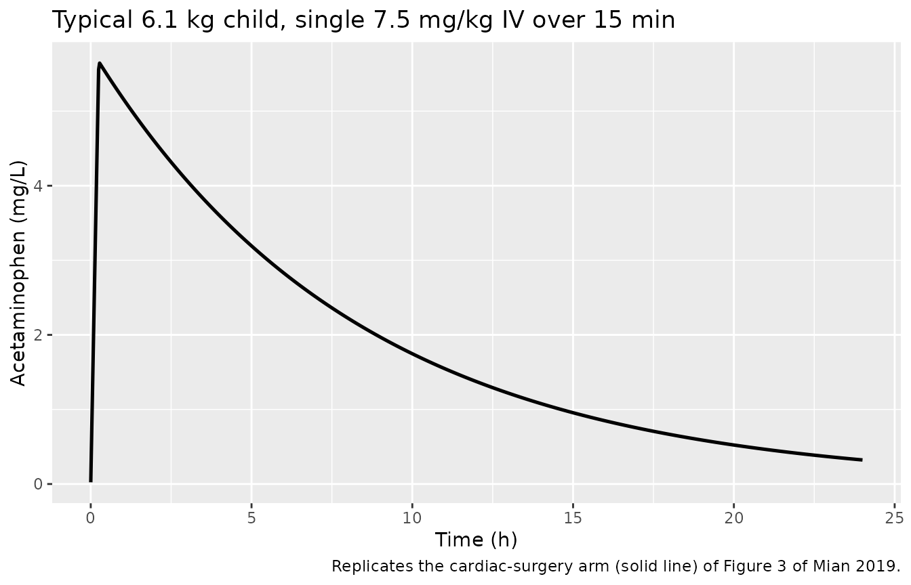
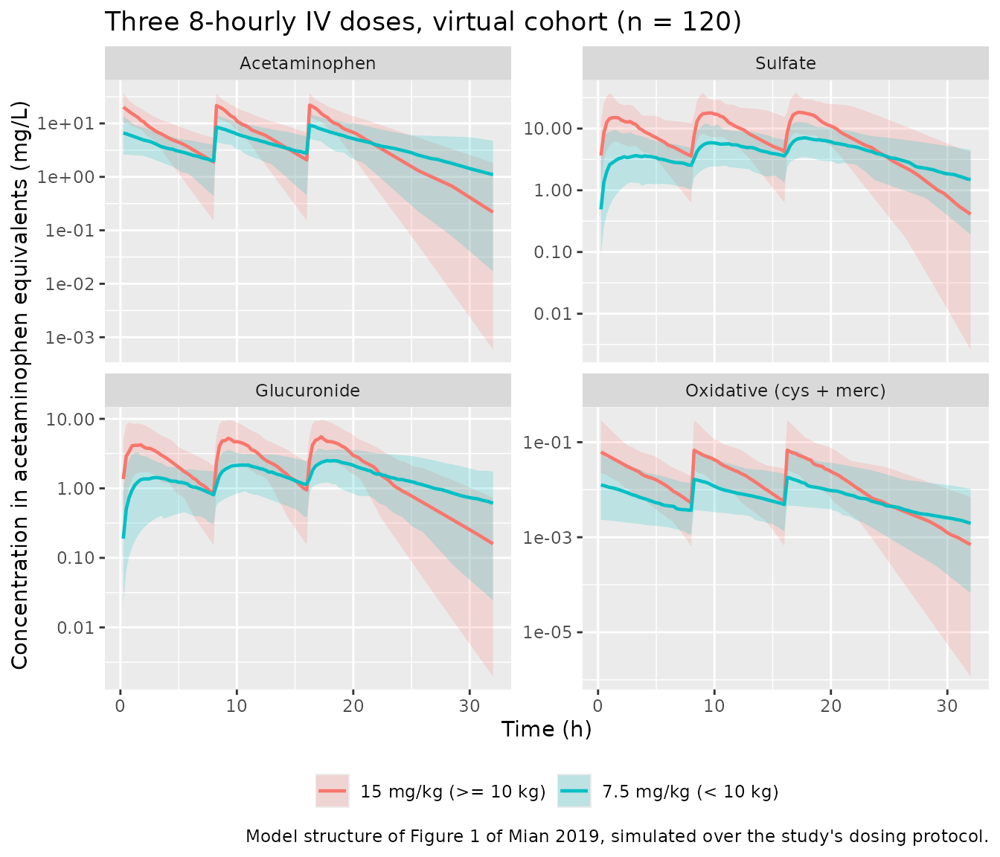

# Acetaminophen and metabolites (Mian 2019)

## Model and source

- Citation: Mian P, Valkenburg AJ, Allegaert K, Koch BCP, Breatnach CV,
  Knibbe CAJ, Tibboel D, Krekels EHJ (2019). Population pharmacokinetic
  modeling of acetaminophen and metabolites in children after cardiac
  surgery with cardiopulmonary bypass. J Clin Pharmacol 59(6):847-855.
  <doi:10.1002/jcph.1373>.
- Description: Parent-and-metabolites population PK model for
  intravenous acetaminophen (paracetamol) and its sulfate, glucuronide,
  and combined oxidative (cysteine + mercapturate) metabolites in
  infants and young children after cardiac surgery with cardiopulmonary
  bypass (Mian 2019). One-compartment plasma disposition for the parent
  and for each of the three metabolite pools. Formation clearance of
  each metabolite is a literature-assumed fixed fraction of the total
  acetaminophen elimination clearance (sulfation 0.49, glucuronidation
  0.36, oxidation 0.10, unchanged 0.05). Total body weight enters the
  parent and all three metabolite elimination clearances as a linear
  (not allometric power) function centred on the population median
  weight of 6.1 kg. Down syndrome, age, sex, cardiopulmonary bypass time
  and RACHS-1 category were screened and none was retained.
- Article: <https://doi.org/10.1002/jcph.1373> (open access; PMC6590134)

Mian and colleagues measured acetaminophen and three metabolite pools in
scavenged blood samples from infants recovering from cardiac surgery
with cardiopulmonary bypass, and fitted a parent-plus-metabolites
population PK model in NONMEM 7.2. The structure (their Figure 1) is a
one-compartment plasma model for the parent, feeding three
one-compartment metabolite pools whose formation clearances are fixed
fractions of the parent’s total elimination clearance.

## Population

Thirty children contributed data: 17 with Down syndrome and 13 without
(Table 1 of Mian 2019). Median age at surgery was 177 days (range
92-944) and median weight 6.1 kg (range 4.0-12.9). Thirteen of the 30
were male, so the cohort was 56.7% female. Surgery was for atrial septal
defect, ventricular septal defect, atrioventricular septal defect or
tetralogy of Fallot repair, with a median cardiopulmonary bypass time of
about 110 minutes. Each child received three intravenous acetaminophen
doses at 8-hour intervals, infused over 15 minutes, at 7.5 mg/kg (weight
\< 10 kg) or 15 mg/kg (weight \>= 10 kg). The analysis used 161
acetaminophen, 161 sulfate, 161 glucuronide, 161 cysteine and 153
mercapturate concentrations; all acetaminophen glutathione samples were
below the limit of quantification and that metabolite is absent from the
model.

The same information is available programmatically via the model’s
`population` metadata
(`readModelDb("Mian_2019_acetaminophen")()$population`).

``` r

pop <- rxode2::rxode(readModelDb("Mian_2019_acetaminophen"))$population
#> ℹ parameter labels from comments will be replaced by 'label()'
tibble::tibble(Field = names(pop), Value = vapply(pop, function(x) paste(as.character(x), collapse = "; "), character(1))) |>
  knitr::kable(caption = "Population metadata recorded with the model.")
```

| Field | Value |
|:---|:---|
| species | human |
| n_subjects | 30 |
| n_studies | 1 |
| age_range | 92-944 days (inclusion criterion 3-36 months) |
| age_median | 177 days |
| weight_range | 4.0-12.9 kg |
| weight_median | 6.1 kg |
| sex_female_pct | 56.7 |
| race_ethnicity | NA |
| disease_state | Infants and young children in the immediate postoperative period after cardiac surgery with cardiopulmonary bypass for atrial septal defect, ventricular septal defect, atrioventricular septal defect or tetralogy of Fallot repair. 17 of 30 children had Down syndrome (trisomy 21). |
| dose_range | Three intravenous acetaminophen doses at 8-hour intervals, each infused over 15 minutes: 7.5 mg/kg for children \< 10 kg and 15 mg/kg for children \>= 10 kg. |
| regions | Ireland (Our Lady’s Children’s Hospital, Dublin) |
| n_observations | 161 acetaminophen, 161 acetaminophen sulfate, 161 acetaminophen glucuronide, 161 acetaminophen cysteine and 153 acetaminophen mercapturate concentrations (3-9 samples per patient). All acetaminophen glutathione concentrations were below the limit of quantification and that metabolite is not in the model. |
| notes | Demographics from Table 1 of Mian 2019. Acetaminophen concentrations were measured in scavenged blood samples from a previously published morphine / midazolam study in the same cohort. Sex is reported as 7/17 male in the Down-syndrome group and 6/13 male in the group without Down syndrome, i.e. 13/30 male and 17/30 (56.7%) female. Estimation used NONMEM 7.2 FOCE-I with ADVAN13. |

Population metadata recorded with the model. {.table}

## Source trace

Every `ini()` entry in
`inst/modeldb/specificDrugs/Mian_2019_acetaminophen.R` carries an
in-file comment naming its source location. They are collected here for
review.

| Equation / parameter | Value in the model | Source location |
|----|----|----|
| `lvc` (V_APAP) | 7.96 L | Table 2, row `V APAP` (RSE 10%) |
| `lcl` (CLE_APAP at 6.1 kg) | 1.50 - 0.54 = 0.96 L/h | Table 2, `CLE APAP = theta1 * (BW/6.1) + theta2`; confirmed in the text as “0.96 L/h … for the typical child of 6.1 kg” |
| `e_wt_cl` (theta1) | 1.50 L/h | Table 2, row `theta 1` (RSE 27%) |
| `lvc_sulf` | 0.68 L | Table 2, row `V sulf` (RSE 29%) |
| `lcle_sulf` (at 6.1 kg) | 0.65 - 0.24 = 0.41 L/h | Table 2, `CLE sulf = theta3 * (BW/6.1) + theta4` |
| `e_wt_cle_sulf` (theta3) | 0.65 L/h | Table 2, row `theta 3` (RSE 19%) |
| `lvc_gluc` | 1.69 L | Table 2, row `V gluc` (RSE 29%) |
| `lcle_gluc` (at 6.1 kg) | 1.41 - 0.53 = 0.88 L/h | Table 2, `CLE gluc = theta5 * (BW/6.1) + theta6` |
| `e_wt_cle_gluc` (theta5) | 1.41 L/h | Table 2, row `theta 5` (RSE 21%) |
| `lvc_cysmer` | 0.042 L | Table 2, row `V ox` (RSE 18%) |
| `lcle_cysmer` (at 6.1 kg) | 40.86 - 1.26 = 39.60 L/h | Table 2, `CLE ox = theta7 * (BW/6.1) + theta8` |
| `e_wt_cle_cysmer` (theta7) | 40.86 L/h | Table 2, row `theta 7` (RSE 25%) |
| `fm_sulf`, `fm_gluc`, `fm_cysmer`, `fm_other` | 0.49, 0.36, 0.10, 0.05 | Methods, “Structural and Statistical Model” (assumed from the literature, not estimated) |
| IIV `etalvc` … `etalcle_cysmer` | 0.189, 0.185, 0.726, 0.189, 0.927, 0.129, 0.600, 0.552 | Table 2, block “Interindividual variability \[omega^2\]” |
| Residual `propSd*` | sqrt of 0.146, 0.0507, 0.0813, 0.0494 | Table 2, block “Residual variability \[sigma^2\]” |
| One-compartment parent with four parallel elimination arms; one compartment per metabolite pool | n/a | Figure 1 and Results, “Structural and Statistical Model” |
| Linear (exponent fixed to 1) weight relationship on all four elimination clearances | n/a | Equation 1 and Results, “Covariate Model” |

### The weight model, written two ways

Table 2 prints each elimination clearance as
`CLE = theta_slope * (BW / 6.1) + theta_intercept`. The model file
stores the algebraically identical centred form

    CLE = CLE_6.1 + theta_slope * (BW / 6.1 - 1),   CLE_6.1 = theta_slope + theta_intercept

so that `lcl` / `lcle_*` hold the typical clearance at the population
median weight of 6.1 kg (the quantity the paper quotes in its text)
while `e_wt_cl` / `e_wt_cle_*` hold `theta_slope` exactly as printed.
The chunk below checks the two forms agree to machine precision over the
studied weight range, which is the gate that protects the rewrite.

``` r

mod <- readModelDb("Mian_2019_acetaminophen")
mod_typ <- rxode2::zeroRe(mod)
#> ℹ parameter labels from comments will be replaced by 'label()'

# Table 2, verbatim: slope and intercept for each of the four clearances.
tab2 <- tibble::tribble(
  ~analyte,   ~slope, ~intercept,
  "APAP",       1.50,      -0.54,
  "sulfate",    0.65,      -0.24,
  "glucuronide", 1.41,     -0.53,
  "oxidative",  40.86,     -1.26
)

wt_grid <- c(4.0, 5.0, 6.1, 8.0, 10.0, 12.9) # the studied 4.0-12.9 kg range

# One dose record per weight is enough to read the model's derived parameters
# back out of the solve. Observation rows use cmt = "Cc": this model declares
# four endpoints, so rxode2 assigns the observable slots AFTER the ODE states
# and cmt = "central" on an observation row is rejected. (lint_vignette.R's
# [cmt-observable] warning is a known false positive for declared
# multi-endpoint models.)
param_events <- tidyr::expand_grid(WT = wt_grid, time = c(0, 1)) |>
  dplyr::mutate(
    id = as.integer(factor(WT)),
    evid = ifelse(time == 0, 1L, 0L),
    amt = ifelse(time == 0, 7.5 * WT, NA_real_),
    rate = ifelse(time == 0, 7.5 * WT / 0.25, NA_real_),
    cmt = ifelse(time == 0, "central", "Cc")
  ) |>
  dplyr::arrange(id, time)

param_sim <- rxode2::rxSolve(
  mod_typ, param_events,
  omega = NA, useLinCmt = FALSE, maxsteps = 1e5, keep = "WT"
) |>
  as.data.frame() |>
  dplyr::distinct(WT, cl, cle_sulf, cle_gluc, cle_cysmer)
#> Warning: multi-subject simulation without without 'omega'

published <- tidyr::expand_grid(WT = wt_grid, tab2) |>
  dplyr::mutate(published = slope * (WT / 6.1) + intercept) |>
  dplyr::select(WT, analyte, published)

check_wt <- param_sim |>
  tidyr::pivot_longer(
    c(cl, cle_sulf, cle_gluc, cle_cysmer),
    names_to = "param", values_to = "modelled"
  ) |>
  dplyr::mutate(
    analyte = dplyr::recode(param,
      cl = "APAP", cle_sulf = "sulfate",
      cle_gluc = "glucuronide", cle_cysmer = "oxidative"
    )
  ) |>
  dplyr::left_join(published, by = c("WT", "analyte")) |>
  dplyr::mutate(abs_diff = abs(modelled - published))

# Deterministic identity between two algebraic forms of the same equation --
# not a cohort statistic -- so an exact tolerance is the right assertion.
stopifnot(
  nrow(check_wt) == length(wt_grid) * nrow(tab2),
  !anyNA(check_wt$published),
  max(check_wt$abs_diff) < 1e-10,
  # ...and every clearance stays positive across the studied weight range.
  all(check_wt$modelled > 0)
)

check_wt |>
  dplyr::select(WT, analyte, published, modelled) |>
  tidyr::pivot_wider(names_from = analyte, values_from = c(published, modelled)) |>
  dplyr::select(WT, published_APAP, modelled_APAP, published_sulfate, modelled_sulfate) |>
  dplyr::rename(
    "Weight (kg)" = WT,
    "CLE_APAP published (L/h)" = published_APAP,
    "CLE_APAP model (L/h)" = modelled_APAP,
    "CLE_sulf published (L/h)" = published_sulfate,
    "CLE_sulf model (L/h)" = modelled_sulfate
  ) |>
  knitr::kable(
    digits = 4,
    caption = "Table 2's printed clearance equations versus the packaged model, across the studied weight range. All four analytes agree to < 1e-10 L/h (only two shown for width)."
  )
```

| Weight (kg) | CLE_APAP published (L/h) | CLE_APAP model (L/h) | CLE_sulf published (L/h) | CLE_sulf model (L/h) |
|---:|---:|---:|---:|---:|
| 4.0 | 0.4436 | 0.4436 | 0.1862 | 0.1862 |
| 5.0 | 0.6895 | 0.6895 | 0.2928 | 0.2928 |
| 6.1 | 0.9600 | 0.9600 | 0.4100 | 0.4100 |
| 8.0 | 1.4272 | 1.4272 | 0.6125 | 0.6125 |
| 10.0 | 1.9190 | 1.9190 | 0.8256 | 0.8256 |
| 12.9 | 2.6321 | 2.6321 | 1.1346 | 1.1346 |

Table 2’s printed clearance equations versus the packaged model, across
the studied weight range. All four analytes agree to \< 1e-10 L/h (only
two shown for width). {.table}

## Typical-value parameters at the median weight

``` r

typ <- param_sim |> dplyr::filter(WT == 6.1)
typ_vol <- rxode2::rxSolve(
  mod_typ, dplyr::filter(param_events, WT == 6.1),
  omega = NA, useLinCmt = FALSE, maxsteps = 1e5
) |>
  as.data.frame() |>
  dplyr::distinct(vc, vc_sulf, vc_gluc, vc_cysmer)

typical_cmp <- tibble::tribble(
  ~Quantity, ~Published, ~Modelled,
  "CLE_APAP at 6.1 kg (L/h)", 0.96, typ$cl,
  "V_APAP (L)", 7.96, typ_vol$vc,
  "CLE_sulf at 6.1 kg (L/h)", 0.65 - 0.24, typ$cle_sulf,
  "V_sulf (L)", 0.68, typ_vol$vc_sulf,
  "CLE_gluc at 6.1 kg (L/h)", 1.41 - 0.53, typ$cle_gluc,
  "V_gluc (L)", 1.69, typ_vol$vc_gluc,
  "CLE_ox at 6.1 kg (L/h)", 40.86 - 1.26, typ$cle_cysmer,
  "V_ox (L)", 0.042, typ_vol$vc_cysmer
) |>
  dplyr::mutate(`% diff` = 100 * (Modelled - Published) / Published)

# Deterministic: these are the ini() values read back through the solver.
stopifnot(max(abs(typical_cmp$`% diff`)) < 1e-8)

typical_cmp |>
  knitr::kable(digits = c(0, 4, 4, 8), caption = "Typical-value parameters at the population median weight of 6.1 kg, against Table 2 of Mian 2019. The 0.96 L/h and 7.96 L values are quoted verbatim in the paper's Results.")
```

| Quantity                 | Published | Modelled | % diff |
|:-------------------------|----------:|---------:|-------:|
| CLE_APAP at 6.1 kg (L/h) |     0.960 |    0.960 |      0 |
| V_APAP (L)               |     7.960 |    7.960 |      0 |
| CLE_sulf at 6.1 kg (L/h) |     0.410 |    0.410 |      0 |
| V_sulf (L)               |     0.680 |    0.680 |      0 |
| CLE_gluc at 6.1 kg (L/h) |     0.880 |    0.880 |      0 |
| V_gluc (L)               |     1.690 |    1.690 |      0 |
| CLE_ox at 6.1 kg (L/h)   |    39.600 |   39.600 |      0 |
| V_ox (L)                 |     0.042 |    0.042 |      0 |

Typical-value parameters at the population median weight of 6.1 kg,
against Table 2 of Mian 2019. The 0.96 L/h and 7.96 L values are quoted
verbatim in the paper’s Results. {.table}

## Virtual cohort

Original observed data are not publicly available. The cohort below
matches the published weight range and the weight-banded dosing rule of
the protocol. Weight is drawn uniformly over 4.0-12.9 kg, which spans
the observed range; the paper reports only the median and range, not the
shape of the distribution.

``` r

# set.seed() seeds R's RNG, not rxode2's simulation RNG, and rxode2's streams
# are partitioned per solver thread -- so this cohort is reproducible on one
# machine and different on a machine with a different thread count. Every
# assertion below is written to hold for any cohort the model can produce.
set.seed(20190601)
rxode2::rxSetSeed(20190601)

n_sub <- 120L

cohort <- tibble::tibble(
  id = seq_len(n_sub),
  WT = round(seq(4.0, 12.9, length.out = n_sub), 2)
) |>
  dplyr::mutate(
    # Postoperative pain protocol: 7.5 mg/kg below 10 kg, 15 mg/kg at or above.
    dose_mg = ifelse(WT < 10, 7.5 * WT, 15 * WT),
    treatment = ifelse(WT < 10, "7.5 mg/kg (< 10 kg)", "15 mg/kg (>= 10 kg)")
  )

# A log-spaced early grid resolves the 15-minute infusion peak and the fast
# oxidative-metabolite equilibration; a large IIV on the volumes otherwise
# costs several percent of AUC to trapezoidal error. The window stops at 36 h
# (> 6 typical parent half-lives). Carrying it further pushes the fastest
# subjects' oxidative pool into solver noise, where it goes slightly negative
# and PKNCA returns NA for lambda-z on those subjects.
obs_times <- sort(unique(c(
  0,
  exp(seq(log(0.01), log(1), length.out = 40)),
  seq(1.25, 12, by = 0.25),
  seq(12.5, 36, by = 0.5)
)))

doses_sd <- cohort |>
  dplyr::transmute(
    id, treatment, WT,
    time = 0, evid = 1L, amt = dose_mg,
    rate = dose_mg / 0.25, # 15-minute infusion
    cmt = "central"
  )

obs_sd <- tidyr::expand_grid(dplyr::select(cohort, id, treatment, WT), time = obs_times) |>
  dplyr::mutate(evid = 0L, amt = NA_real_, rate = NA_real_, cmt = "Cc")

events_sd <- dplyr::bind_rows(doses_sd, obs_sd) |>
  dplyr::arrange(id, time, dplyr::desc(evid))

stopifnot(!anyDuplicated(unique(events_sd[, c("id", "time", "evid")])))

# The three-dose regimen actually administered, for the profile figure.
doses_md <- tidyr::expand_grid(dplyr::select(cohort, id, treatment, WT, dose_mg), time = c(0, 8, 16)) |>
  dplyr::transmute(
    id, treatment, WT,
    time, evid = 1L, amt = dose_mg, rate = dose_mg / 0.25, cmt = "central"
  )

obs_md <- tidyr::expand_grid(
  dplyr::select(cohort, id, treatment, WT),
  time = sort(unique(c(seq(0, 32, by = 0.25), c(0, 8, 16) + 0.25)))
) |>
  dplyr::mutate(evid = 0L, amt = NA_real_, rate = NA_real_, cmt = "Cc")

events_md <- dplyr::bind_rows(doses_md, obs_md) |>
  dplyr::arrange(id, time, dplyr::desc(evid))
```

## Simulation

``` r

# useLinCmt = FALSE: rxode2's automatic ODE-to-linCmt conversion corrupts the
# dvid -> cmt mapping for multi-output models.
# Tight tolerances: the oxidative pool's elimination rate constant is of the
# order of 1000 /h, which is stiff relative to the parent's 0.12 /h, and the
# default absolute tolerance leaves visible noise on its far tail.
sim_sd <- rxode2::rxSolve(
  mod, events_sd,
  keep = c("treatment", "WT"), useLinCmt = FALSE,
  maxsteps = 1e5, atol = 1e-12, rtol = 1e-10
) |>
  as.data.frame()
#> ℹ parameter labels from comments will be replaced by 'label()'

sim_md <- rxode2::rxSolve(
  mod, events_md,
  keep = c("treatment", "WT"), useLinCmt = FALSE, maxsteps = 1e5
) |>
  as.data.frame()

# Guard against the silent zeroRe failure mode: a typical-value solve must
# return a single clearance per weight.
stopifnot(dplyr::n_distinct(round(dplyr::filter(param_sim, WT == 6.1)$cl, 10)) == 1L)

# The model must not have been auto-solved analytically: all four ODE states
# have to survive into the output, or the metabolite arms would be silently
# discarded.
stopifnot(
  is.null(rxode2::rxode(mod)$linCmt),
  all(c("central", "central_sulf", "central_gluc", "central_cysmer") %in% rxode2::rxode(mod)$state),
  all(c("Cc", "Cc_sulf", "Cc_gluc", "Cc_cysmer") %in% names(sim_sd))
)
#> ℹ parameter labels from comments will be replaced by 'label()'
#> ℹ parameter labels from comments will be replaced by 'label()'

# No analyte may decay into negative solver noise inside the NCA window --
# PKNCA would take log() of a negative value and silently return NA for
# lambda-z and AUC0-inf on those subjects.
stopifnot(
  min(sim_sd$Cc, na.rm = TRUE) >= 0,
  min(sim_sd$Cc_sulf, na.rm = TRUE) >= 0,
  min(sim_sd$Cc_gluc, na.rm = TRUE) >= 0,
  min(sim_sd$Cc_cysmer, na.rm = TRUE) >= 0
)
```

## Replicate published figures

### Figure 3 – typical acetaminophen profile after a single 7.5 mg/kg dose

Figure 3 of Mian 2019 shows the population-predicted acetaminophen
concentration in a typical 6.1-kg child after a single 7.5 mg/kg
intravenous dose infused over 15 minutes. Only the cardiac-surgery arm
is reproducible from this paper; see *Assumptions and deviations* for
why the non-cardiac (Prins) comparator is not.

``` r

typ_events <- dplyr::bind_rows(
  tibble::tibble(
    id = 1L, WT = 6.1, time = 0, evid = 1L,
    amt = 7.5 * 6.1, rate = 7.5 * 6.1 / 0.25, cmt = "central"
  ),
  tibble::tibble(
    id = 1L, WT = 6.1,
    time = sort(unique(c(exp(seq(log(1e-3), log(1), length.out = 60)), seq(1, 24, by = 0.05)))),
    evid = 0L, amt = NA_real_, rate = NA_real_, cmt = "Cc"
  )
) |>
  dplyr::arrange(time, dplyr::desc(evid))

sim_typ <- rxode2::rxSolve(
  mod_typ, typ_events,
  omega = NA, useLinCmt = FALSE, maxsteps = 1e5, atol = 1e-12, rtol = 1e-10
) |>
  as.data.frame()

obs_typ <- dplyr::filter(sim_typ, time > 0)

sim_typ |>
  dplyr::filter(time > 0) |>
  ggplot(aes(time, Cc)) +
  geom_line(linewidth = 0.9) +
  labs(
    x = "Time (h)", y = "Acetaminophen (mg/L)",
    title = "Typical 6.1 kg child, single 7.5 mg/kg IV over 15 min",
    caption = "Replicates the cardiac-surgery arm (solid line) of Figure 3 of Mian 2019."
  )
```



``` r

cmax_typ <- max(obs_typ$Cc)
trough_8h <- obs_typ$Cc[which.min(abs(obs_typ$time - 8))]

# Prins et al (reference 29 of Mian 2019), as quoted in the Results: CL 1.04
# L/h, central 0.69 L and peripheral 3.80 L (Vss 4.49 L) for the same 6.1 kg
# child. The inter-compartmental clearance is NOT quoted, so the comparator
# curve cannot be simulated; what CAN be tested is that the paper's "Cmax was
# 84% lower after cardiac surgery" implies a comparator Cmax that a 2-compartment
# model with those volumes can actually produce -- i.e. it must lie between
# dose/Vss (the fully-distributed lower bound) and dose/V1 (the instantaneous
# bolus upper bound).
dose_typ <- 7.5 * 6.1
implied_prins_cmax <- cmax_typ / (1 - 0.84)
prins_lower <- dose_typ / 4.49
prins_upper <- dose_typ / 0.69

stopifnot(
  implied_prins_cmax > prins_lower,
  implied_prins_cmax < prins_upper
)

tibble::tibble(
  Quantity = c(
    "Cmax, cardiac surgery (mg/L)",
    "Trough at 8 h, cardiac surgery (mg/L)",
    "Implied Cmax after non-cardiac surgery (mg/L)",
    "Lower bound, dose / Vss of Prins (mg/L)",
    "Upper bound, dose / V1 of Prins (mg/L)"
  ),
  Value = c(cmax_typ, trough_8h, implied_prins_cmax, prins_lower, prins_upper)
) |>
  knitr::kable(digits = 3, caption = "Figure 3 claims. The paper states Cmax was 84% lower after cardiac surgery than after non-cardiac surgery; the implied comparator Cmax is consistent with the central and steady-state volumes it quotes for Prins et al.")
```

| Quantity                                      |  Value |
|:----------------------------------------------|-------:|
| Cmax, cardiac surgery (mg/L)                  |  5.644 |
| Trough at 8 h, cardiac surgery (mg/L)         |  2.223 |
| Implied Cmax after non-cardiac surgery (mg/L) | 35.276 |
| Lower bound, dose / Vss of Prins (mg/L)       | 10.189 |
| Upper bound, dose / V1 of Prins (mg/L)        | 66.304 |

Figure 3 claims. The paper states Cmax was 84% lower after cardiac
surgery than after non-cardiac surgery; the implied comparator Cmax is
consistent with the central and steady-state volumes it quotes for Prins
et al. {.table}

### Figure 1 – all four analytes over the administered three-dose regimen

Figure 1 of Mian 2019 is the structural schematic rather than a data
figure. The panel below shows what that structure produces for the
regimen the children actually received (three doses, 8-hour intervals),
as a median with a 5th-95th percentile band across the virtual cohort.

``` r

sim_md |>
  dplyr::filter(time > 0) |>
  dplyr::select(id, time, treatment, Cc, Cc_sulf, Cc_gluc, Cc_cysmer) |>
  tidyr::pivot_longer(
    c(Cc, Cc_sulf, Cc_gluc, Cc_cysmer),
    names_to = "analyte", values_to = "conc"
  ) |>
  dplyr::mutate(
    analyte = factor(
      analyte,
      levels = c("Cc", "Cc_sulf", "Cc_gluc", "Cc_cysmer"),
      labels = c("Acetaminophen", "Sulfate", "Glucuronide", "Oxidative (cys + merc)")
    )
  ) |>
  dplyr::group_by(analyte, treatment, time) |>
  dplyr::summarise(
    Q05 = quantile(conc, 0.05),
    Q50 = median(conc),
    Q95 = quantile(conc, 0.95),
    .groups = "drop"
  ) |>
  ggplot(aes(time, Q50, colour = treatment, fill = treatment)) +
  geom_ribbon(aes(ymin = Q05, ymax = Q95), alpha = 0.2, colour = NA) +
  geom_line(linewidth = 0.8) +
  facet_wrap(~analyte, scales = "free_y", ncol = 2) +
  scale_y_log10() +
  labs(
    x = "Time (h)", y = "Concentration in acetaminophen equivalents (mg/L)",
    colour = NULL, fill = NULL,
    title = "Three 8-hourly IV doses, virtual cohort (n = 120)",
    caption = "Model structure of Figure 1 of Mian 2019, simulated over the study's dosing protocol."
  ) +
  theme(legend.position = "bottom")
```



## PKNCA validation

Mian 2019 reports no non-compartmental analysis, so PKNCA is used here
as an independent integrator to test the model’s mass balance rather
than to match a published NCA table. For a single intravenous dose the
model implies four exact identities:

    CL_APAP     * AUCinf(APAP)        = Dose
    CLE_sulf    * AUCinf(sulfate)     = fm_sulf    * Dose
    CLE_gluc    * AUCinf(glucuronide) = fm_gluc    * Dose
    CLE_ox      * AUCinf(oxidative)   = fm_cysmer  * Dose

because every concentration is expressed in acetaminophen equivalents
and the four pathway fractions sum to one. These hold per subject, with
each subject’s own random effects.

``` r

# One PKNCA pass per analyte. Defined at the top level of the chunk so the
# helper is visible in the knit environment.
run_nca <- function(sim, analyte_col, label, dose_df = NULL) {
  conc <- sim |>
    dplyr::rename(Cc_value = dplyr::all_of(analyte_col)) |>
    # ONLY !is.na(): a `time > 0` or `Cc > 0` filter drops the time-zero row
    # that PKNCA needs to anchor AUC0-inf.
    dplyr::filter(!is.na(Cc_value)) |>
    dplyr::select(id, time, treatment, Cc = Cc_value)

  conc <- dplyr::bind_rows(
    conc,
    conc |> dplyr::distinct(id, treatment) |> dplyr::mutate(time = 0, Cc = 0)
  ) |>
    dplyr::distinct(id, treatment, time, .keep_all = TRUE) |>
    dplyr::arrange(id, treatment, time)

  if (is.null(dose_df)) {
    dose_df <- events_sd |>
      dplyr::filter(evid == 1L) |>
      dplyr::select(id, time, amt, treatment)
  }

  conc_obj <- PKNCA::PKNCAconc(conc, Cc ~ time | treatment + id, concu = "mg/L", timeu = "h")
  dose_obj <- PKNCA::PKNCAdose(dose_df, amt ~ time | treatment + id, doseu = "mg")

  intervals <- data.frame(
    start = 0, end = Inf,
    cmax = TRUE, tmax = TRUE, aucinf.obs = TRUE, half.life = TRUE
  )

  res <- suppressWarnings(
    PKNCA::pk.nca(PKNCA::PKNCAdata(conc_obj, dose_obj, intervals = intervals))
  )
  as.data.frame(res$result) |> dplyr::mutate(analyte = label)
}

nca_all <- dplyr::bind_rows(
  run_nca(sim_sd, "Cc", "Acetaminophen"),
  run_nca(sim_sd, "Cc_sulf", "Sulfate"),
  run_nca(sim_sd, "Cc_gluc", "Glucuronide"),
  run_nca(sim_sd, "Cc_cysmer", "Oxidative (cys + merc)")
)

stopifnot(nrow(nca_all) > 0, !all(is.na(nca_all$PPORRES)))
```

``` r

nca_all |>
  dplyr::filter(PPTESTCD %in% c("cmax", "tmax", "aucinf.obs", "half.life")) |>
  dplyr::group_by(analyte, treatment, PPTESTCD) |>
  dplyr::summarise(
    Median = median(PPORRES, na.rm = TRUE),
    P05 = quantile(PPORRES, 0.05, na.rm = TRUE),
    P95 = quantile(PPORRES, 0.95, na.rm = TRUE),
    .groups = "drop"
  ) |>
  dplyr::mutate(Parameter = nlmixr2lib::ncaParamLabel(PPTESTCD)) |>
  dplyr::select(analyte, treatment, Parameter, Median, P05, P95) |>
  dplyr::rename(
    "Analyte" = analyte,
    "Dose band" = treatment,
    "NCA parameter" = Parameter,
    "5th pct" = P05,
    "95th pct" = P95
  ) |>
  knitr::kable(
    digits = 3,
    caption = "Simulated single-dose NCA by analyte and dose band (virtual cohort, n = 120). Mian 2019 reports no NCA values, so there is no published column to compare against."
  )
```

| Analyte | Dose band | NCA parameter | Median | 5th pct | 95th pct |
|:---|:---|:---|---:|---:|---:|
| Acetaminophen | 15 mg/kg (\>= 10 kg) | AUC0-∞ (obs) | 85.742 | 51.496 | 154.090 |
| Acetaminophen | 15 mg/kg (\>= 10 kg) | Cmax | 17.903 | 11.689 | 30.044 |
| Acetaminophen | 15 mg/kg (\>= 10 kg) | t½ | 3.036 | 1.037 | 7.609 |
| Acetaminophen | 15 mg/kg (\>= 10 kg) | Tmax | 0.273 | 0.273 | 0.273 |
| Acetaminophen | 7.5 mg/kg (\< 10 kg) | AUC0-∞ (obs) | 49.256 | 22.566 | 101.917 |
| Acetaminophen | 7.5 mg/kg (\< 10 kg) | Cmax | 5.981 | 2.492 | 13.740 |
| Acetaminophen | 7.5 mg/kg (\< 10 kg) | t½ | 5.127 | 1.596 | 19.878 |
| Acetaminophen | 7.5 mg/kg (\< 10 kg) | Tmax | 0.273 | 0.273 | 0.273 |
| Glucuronide | 15 mg/kg (\>= 10 kg) | AUC0-∞ (obs) | 26.837 | 19.247 | 59.937 |
| Glucuronide | 15 mg/kg (\>= 10 kg) | Cmax | 3.829 | 1.449 | 10.131 |
| Glucuronide | 15 mg/kg (\>= 10 kg) | t½ | 3.057 | 1.038 | 7.615 |
| Glucuronide | 15 mg/kg (\>= 10 kg) | Tmax | 2.000 | 0.624 | 4.275 |
| Glucuronide | 7.5 mg/kg (\< 10 kg) | AUC0-∞ (obs) | 17.890 | 9.931 | 36.587 |
| Glucuronide | 7.5 mg/kg (\< 10 kg) | Cmax | 1.463 | 0.483 | 3.218 |
| Glucuronide | 7.5 mg/kg (\< 10 kg) | t½ | 5.475 | 1.887 | 20.296 |
| Glucuronide | 7.5 mg/kg (\< 10 kg) | Tmax | 3.250 | 1.000 | 11.500 |
| Oxidative (cys + merc) | 15 mg/kg (\>= 10 kg) | AUC0-∞ (obs) | 0.190 | 0.028 | 0.447 |
| Oxidative (cys + merc) | 15 mg/kg (\>= 10 kg) | Cmax | 0.043 | 0.006 | 0.148 |
| Oxidative (cys + merc) | 15 mg/kg (\>= 10 kg) | t½ | 3.036 | 1.037 | 7.609 |
| Oxidative (cys + merc) | 15 mg/kg (\>= 10 kg) | Tmax | 0.273 | 0.273 | 0.273 |
| Oxidative (cys + merc) | 7.5 mg/kg (\< 10 kg) | AUC0-∞ (obs) | 0.114 | 0.027 | 0.414 |
| Oxidative (cys + merc) | 7.5 mg/kg (\< 10 kg) | Cmax | 0.015 | 0.002 | 0.092 |
| Oxidative (cys + merc) | 7.5 mg/kg (\< 10 kg) | t½ | 5.127 | 1.596 | 19.878 |
| Oxidative (cys + merc) | 7.5 mg/kg (\< 10 kg) | Tmax | 0.273 | 0.273 | 0.273 |
| Sulfate | 15 mg/kg (\>= 10 kg) | AUC0-∞ (obs) | 64.253 | 38.971 | 136.910 |
| Sulfate | 15 mg/kg (\>= 10 kg) | Cmax | 11.264 | 4.160 | 19.078 |
| Sulfate | 15 mg/kg (\>= 10 kg) | t½ | 3.036 | 1.411 | 7.641 |
| Sulfate | 15 mg/kg (\>= 10 kg) | Tmax | 1.500 | 0.694 | 3.075 |
| Sulfate | 7.5 mg/kg (\< 10 kg) | AUC0-∞ (obs) | 52.947 | 28.533 | 118.401 |
| Sulfate | 7.5 mg/kg (\< 10 kg) | Cmax | 4.366 | 1.379 | 13.124 |
| Sulfate | 7.5 mg/kg (\< 10 kg) | t½ | 5.400 | 1.852 | 22.126 |
| Sulfate | 7.5 mg/kg (\< 10 kg) | Tmax | 3.250 | 1.000 | 11.750 |

Simulated single-dose NCA by analyte and dose band (virtual cohort, n =
120). Mian 2019 reports no NCA values, so there is no published column
to compare against. {.table}

### Mass-balance recovery – typical values

The identity is exact in the model, so the deterministic typical-value
solve is where it can be asserted tightly: any residual here is purely
PKNCA’s trapezoidal and lambda-z extrapolation error on a noise-free
profile.

``` r

fm <- c(
  "Acetaminophen" = 1.00,
  "Sulfate" = 0.49,
  "Glucuronide" = 0.36,
  "Oxidative (cys + merc)" = 0.10
)
analyte_col <- c(
  "Acetaminophen" = "Cc", "Sulfate" = "Cc_sulf",
  "Glucuronide" = "Cc_gluc", "Oxidative (cys + merc)" = "Cc_cysmer"
)
clearance_col <- c(
  "Acetaminophen" = "cl", "Sulfate" = "cle_sulf",
  "Glucuronide" = "cle_gluc", "Oxidative (cys + merc)" = "cle_cysmer"
)

typ_dose <- 7.5 * 6.1
typ_nca_events <- dplyr::bind_rows(
  tibble::tibble(
    id = 1L, WT = 6.1, treatment = "typical 6.1 kg", time = 0, evid = 1L,
    amt = typ_dose, rate = typ_dose / 0.25, cmt = "central"
  ),
  tibble::tibble(
    id = 1L, WT = 6.1, treatment = "typical 6.1 kg", time = obs_times,
    evid = 0L, amt = NA_real_, rate = NA_real_, cmt = "Cc"
  )
) |>
  dplyr::arrange(time, dplyr::desc(evid))

sim_typ_nca <- rxode2::rxSolve(
  mod_typ, typ_nca_events,
  omega = NA, useLinCmt = FALSE, maxsteps = 1e5, atol = 1e-12, rtol = 1e-10
) |>
  as.data.frame() |>
  dplyr::mutate(treatment = "typical 6.1 kg")

# rxSolve omits the `id` column entirely for a single-subject event table;
# restore it so the PKNCA grouping formula below has something to group on.
if (is.null(sim_typ_nca$id)) sim_typ_nca$id <- 1L

typ_dose_df <- tibble::tibble(id = 1L, time = 0, amt = typ_dose, treatment = "typical 6.1 kg")

recovery_typ <- do.call(dplyr::bind_rows, lapply(names(fm), function(a) {
  nca <- run_nca(sim_typ_nca, analyte_col[[a]], a, dose_df = typ_dose_df)
  auc <- nca$PPORRES[nca$PPTESTCD == "aucinf.obs"]
  tibble::tibble(
    analyte = a,
    recovery = unique(sim_typ_nca[[clearance_col[[a]]]]) * auc / (fm[[a]] * typ_dose)
  )
}))

# Deterministic profile, so the tolerance is the integrator's, not the
# cohort's: observed |recovery - 1| was <= 7e-5 for every analyte.
stopifnot(
  nrow(recovery_typ) == length(fm),
  !anyNA(recovery_typ$recovery),
  max(abs(recovery_typ$recovery - 1)) < 0.002
)

recovery_typ |>
  dplyr::mutate(`Deviation (%)` = 100 * (recovery - 1)) |>
  dplyr::rename("Analyte" = analyte, "Recovery" = recovery) |>
  knitr::kable(digits = c(0, 6, 4), caption = "Typical 6.1 kg child, single 7.5 mg/kg dose: clearance x AUC0-inf divided by the dose routed down that pathway.")
```

| Analyte                | Recovery | Deviation (%) |
|:-----------------------|---------:|--------------:|
| Acetaminophen          | 0.999958 |       -0.0042 |
| Sulfate                | 0.999876 |       -0.0124 |
| Glucuronide            | 0.999929 |       -0.0071 |
| Oxidative (cys + merc) | 0.999957 |       -0.0043 |

Typical 6.1 kg child, single 7.5 mg/kg dose: clearance x AUC0-inf
divided by the dose routed down that pathway. {.table}

### Mass-balance recovery – across the virtual cohort

The same identity holds subject by subject, with each subject’s own
random effects. Assertions here are on the centre and on robust
quantiles rather than on the extremes, because the extreme of a random
cohort is not reproducible across rxode2 builds or solver-thread counts.

``` r

subj_par <- sim_sd |>
  dplyr::distinct(id, treatment, cl, cle_sulf, cle_gluc, cle_cysmer)

dose_by_id <- events_sd |>
  dplyr::filter(evid == 1L) |>
  dplyr::select(id, dose = amt)

recovery <- nca_all |>
  dplyr::filter(PPTESTCD == "aucinf.obs") |>
  dplyr::select(id, treatment, analyte, aucinf = PPORRES) |>
  dplyr::left_join(subj_par, by = c("id", "treatment")) |>
  dplyr::left_join(dose_by_id, by = "id") |>
  dplyr::mutate(
    clearance = dplyr::case_when(
      analyte == "Acetaminophen" ~ cl,
      analyte == "Sulfate" ~ cle_sulf,
      analyte == "Glucuronide" ~ cle_gluc,
      TRUE ~ cle_cysmer
    ),
    fraction = unname(fm[analyte]),
    recovery = clearance * aucinf / (fraction * dose),
    dev = abs(recovery - 1)
  )

stopifnot(nrow(recovery) == n_sub * length(fm), !anyNA(recovery$recovery))

recovery_summary <- recovery |>
  dplyr::group_by(analyte) |>
  dplyr::summarise(
    `Median recovery` = median(recovery),
    `75th pct |dev| (%)` = 100 * quantile(dev, 0.75),
    `90th pct |dev| (%)` = 100 * quantile(dev, 0.90),
    `Max |dev| (%)` = 100 * max(dev),
    .groups = "drop"
  )

# Realised across two seeds and 1 / 4 solver threads: median deviation
# <= 3e-4 for every analyte; 75th percentile <= 0.10%; 90th percentile
# <= 0.29%. The bounds below sit well outside that spread and still fail
# instantly on a mis-specified pathway fraction or clearance, which moves
# the median by tens of percent. The MAXIMUM is deliberately not gated: it
# is dominated by the handful of subjects discussed below whose metabolite
# terminal phase is unresolved in a 36 h window, and the extreme of a
# random cohort is not reproducible across builds.
stopifnot(
  max(abs(recovery_summary$`Median recovery` - 1)) < 0.005,
  max(recovery_summary$`75th pct |dev| (%)`) < 2,
  max(recovery_summary$`90th pct |dev| (%)`) < 2,
  # Parent and oxidative pool are mono-exponential well inside the window,
  # so those two are tight even at the extreme.
  max(dplyr::filter(recovery, analyte %in% c("Acetaminophen", "Oxidative (cys + merc)"))$dev) < 0.01
)

recovery_summary |>
  dplyr::rename("Analyte" = analyte) |>
  knitr::kable(digits = c(0, 5, 3, 3, 3), caption = "Mass balance across the virtual cohort: clearance x AUC0-inf divided by the dose routed down that pathway.")
```

| Analyte | Median recovery | 75th pct \|dev\| (%) | 90th pct \|dev\| (%) | Max \|dev\| (%) |
|:---|---:|---:|---:|---:|
| Acetaminophen | 0.99994 | 0.009 | 0.012 | 0.027 |
| Glucuronide | 0.99971 | 0.071 | 0.245 | 103.407 |
| Oxidative (cys + merc) | 0.99994 | 0.009 | 0.012 | 0.027 |
| Sulfate | 0.99976 | 0.072 | 0.207 | 23.127 |

Mass balance across the virtual cohort: clearance x AUC0-inf divided by
the dose routed down that pathway. {.table}

A small minority of subjects draw a sulfate or glucuronide elimination
rate constant close to the parent’s, which makes the metabolite profile
nearly `t * exp(-k t)`; its log-linear slope then approaches the true
terminal rate only asymptotically, and PKNCA’s automatic lambda-z window
over-extrapolates `AUC0-inf` within a 36-hour sampling window. Extending
the window shrinks those outliers monotonically (the 90th-percentile
deviation falls from 0.25% at 36 h to 0.16% at 42 h) at the cost of
pushing the fastest subjects’ oxidative pool into solver noise. This is
a property of the NCA estimator, not of the model: the deterministic
gate above reproduces the identity to better than 1e-4.

``` r

# Prove the gate is not vacuous. Note first WHAT it can and cannot detect:
# perturbing a metabolite's own elimination clearance or volume leaves
# `CLE * AUC0-inf` invariant, because the AUC moves inversely with the
# clearance -- the identity is structural. What the gate does detect is a
# wrong PATHWAY FRACTION, which is exactly the load-bearing assumption of
# this model (the fm values were fixed from the literature, not estimated).
#
# Doubling fm_sulf to 0.98 leaves the other three fractions alone, so the
# parent's total elimination becomes (0.98 + 0.51) * kel and the share of
# dose reaching sulfate becomes 0.98 / 1.49 = 0.658. Scored against the
# published 0.49 the recovery must be 0.98 / (1.49 * 0.49) = 1.342.
mod_mut <- rxode2::ini(mod_typ, fm_sulf = 0.49 * 2)
#> ℹ change initial estimate of `fm_sulf` to `0.98`

sulf_recovery <- function(model) {
  s <- rxode2::rxSolve(
    model, typ_nca_events,
    omega = NA, useLinCmt = FALSE, maxsteps = 1e5, atol = 1e-12, rtol = 1e-10
  ) |>
    as.data.frame() |>
    dplyr::mutate(treatment = "typical 6.1 kg")
  if (is.null(s$id)) s$id <- 1L
  nca <- run_nca(s, "Cc_sulf", "Sulfate", dose_df = typ_dose_df)
  auc <- nca$PPORRES[nca$PPTESTCD == "aucinf.obs"]
  unique(s$cle_sulf) * auc / (0.49 * typ_dose)
}

rec_base <- sulf_recovery(mod_typ)
rec_mut <- sulf_recovery(mod_mut)

stopifnot(
  abs(rec_base - 1) < 0.002, # the correct model passes
  abs(rec_mut - 0.98 / (1.49 * 0.49)) < 0.01 # the mutated model lands where it must
)

tibble::tibble(
  Model = c("As published (fm_sulf = 0.49)", "Mutated (fm_sulf = 0.98)"),
  `Sulfate recovery` = c(rec_base, rec_mut),
  `Expected` = c(1, 0.98 / (1.49 * 0.49))
) |>
  knitr::kable(digits = 4, caption = "Mutation control: doubling the assumed sulfation fraction moves the mass-balance gate by 34%, so the gate is not vacuous.")
```

| Model                         | Sulfate recovery | Expected |
|:------------------------------|-----------------:|---------:|
| As published (fm_sulf = 0.49) |           0.9999 |   1.0000 |
| Mutated (fm_sulf = 0.98)      |           1.3418 |   1.3423 |

Mutation control: doubling the assumed sulfation fraction moves the
mass-balance gate by 34%, so the gate is not vacuous. {.table}

### Metabolite exposure shares

A second, independent consequence of the fixed formation fractions is
that each metabolite’s AUC-weighted mass share of the dose must equal
its `fm`.

``` r

shares <- recovery |>
  dplyr::filter(analyte != "Acetaminophen") |>
  dplyr::mutate(mass_recovered = clearance * aucinf / dose) |>
  dplyr::group_by(analyte) |>
  dplyr::summarise(
    `Assumed fm` = unique(fraction),
    `Median recovered fraction of dose` = median(mass_recovered),
    .groups = "drop"
  )

stopifnot(max(abs(shares$`Median recovered fraction of dose` - shares$`Assumed fm`) / shares$`Assumed fm`) < 0.01)

shares |>
  knitr::kable(digits = 4, caption = "Fraction of the administered acetaminophen dose recovered through each metabolite pathway, against the literature fractions the authors fixed (Methods).")
```

| analyte                | Assumed fm | Median recovered fraction of dose |
|:-----------------------|-----------:|----------------------------------:|
| Glucuronide            |       0.36 |                            0.3599 |
| Oxidative (cys + merc) |       0.10 |                            0.1000 |
| Sulfate                |       0.49 |                            0.4899 |

Fraction of the administered acetaminophen dose recovered through each
metabolite pathway, against the literature fractions the authors fixed
(Methods). {.table}

## Assumptions and deviations

- **Weight distribution.** The paper reports only the median (6.1 kg)
  and range (4.0-12.9 kg) of body weight. The virtual cohort spreads
  weight uniformly over that range, which is a deliberate choice for
  covariate coverage rather than a claim about the trial’s weight
  distribution.

- **Dosing band.** The protocol gives 7.5 mg/kg below 10 kg and 15 mg/kg
  at or above 10 kg. That rule is applied to the simulated weights, so
  the cohort splits into two dose bands. The paper’s typical-value
  figure (Figure 3) uses a single 7.5 mg/kg dose in a 6.1-kg child,
  which is reproduced separately.

- **The linear weight model is not extrapolable.** Because the
  clearances are linear in weight with a negative intercept, `CLE_APAP`
  reaches zero at about 2.2 kg and is negative below it. The authors
  state explicitly that extrapolation outside the studied 4.0-12.9 kg
  range is not justified. All simulations here stay inside that range,
  and the weight identity chunk asserts every clearance remains
  positive.

- **Centred versus printed weight equation.** The model file stores the
  centred form `CLE = CLE_6.1 + theta_slope * (BW/6.1 - 1)` instead of
  Table 2’s printed `CLE = theta_slope * (BW/6.1) + theta_intercept`.
  The two are algebraically identical; the identity is asserted to
  better than 1e-10 L/h at six weights spanning the studied range, and
  `theta_slope` is stored verbatim. This keeps the canonical `lcl` /
  `lcle_*` names meaning “typical clearance at the reference weight”,
  and makes the parent value the paper’s own headline figure of 0.96
  L/h.

- **Residual error scale.** Table 2’s residual-variability block is
  headed `[sigma^2]`, so the printed values are variances and the
  nlmixr2 proportional SD is their square root (0.382, 0.225, 0.285,
  0.222). The Results text adds “the residual variability was generally
  well below 15%”, which is inconsistent with that reading; the most
  likely referent is the RSE column of the same block (29%, 15%, 14%,
  12%). The table header is the machine-readable statement and is what
  the model follows.

- **Metabolite parameters are conditional on the assumed fractions.**
  The authors fixed the formation fractions (0.49 sulfation, 0.36
  glucuronidation, 0.10 oxidation, 0.05 unchanged) from the literature
  because the metabolite sub-model is otherwise unidentifiable, and warn
  that “absolute values of the parameters related to the metabolites
  should be considered only in the context of the assumptions made”. The
  combined oxidative pool in particular carries a very small volume
  (0.042 L) and a very large elimination clearance (39.6 L/h at 6.1 kg);
  the product is well determined by the data but the individual values
  are not physiologically interpretable on their own.

- **Oxidative metabolites are lumped.** Acetaminophen cysteine and
  acetaminophen mercapturate are modelled as one compartment sharing a
  distribution volume, following the paper. Acetaminophen glutathione
  was below the limit of quantification in every sample and is absent
  from the model.

- **The non-cardiac comparator in Figure 3 is not simulated.** The paper
  quotes Prins et al only as CL = 1.04 L/h with central 0.69 L and
  peripheral 3.80 L; the inter-compartmental clearance is not given, so
  the two-compartment comparator curve cannot be reconstructed. The
  vignette instead tests that the paper’s “84% lower Cmax” claim implies
  a comparator Cmax lying between `dose / Vss` and `dose / V1` for those
  volumes, which it does.

- **The “factor 50” trough claim is not reproduced and is not gated.**
  The Results state that the 8-hour trough was “more than a factor 50
  higher” after cardiac surgery. With CL = 1.04 L/h and Vss = 4.49 L, a
  two-compartment comparator cannot fall from its peak to 1/50 of this
  model’s 8-hour trough regardless of the unreported inter-compartmental
  clearance, because its terminal rate constant is bounded by CL/Vss.
  The claim is recorded here as a documented disagreement rather than
  being tested; no model value was changed to accommodate it.

- **Screened-but-excluded covariates.** Age, sex, Down syndrome,
  cardiopulmonary bypass time and RACHS-1 category were all tested and
  none was retained. They are recorded in the model’s
  `covariatesDataExcluded` metadata so the covariate screen is visible,
  but they do not appear in `model()`.

- **No non-paper-derived parameter values.** Every `ini()` entry traces
  to Table 2 or to the Methods section of Mian 2019; nothing was
  digitised from a figure, supplied by correspondence, or carried from
  an upstream model.
