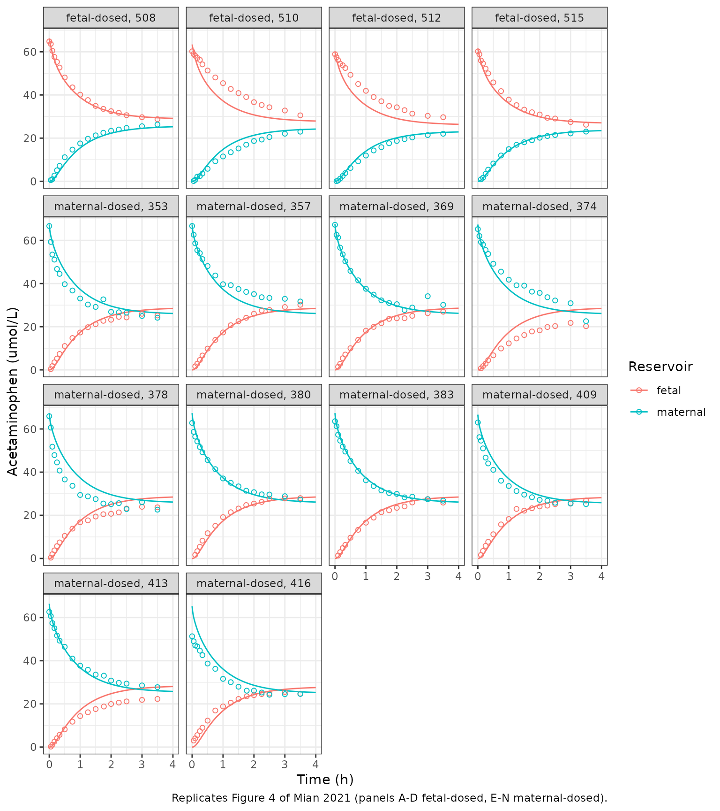
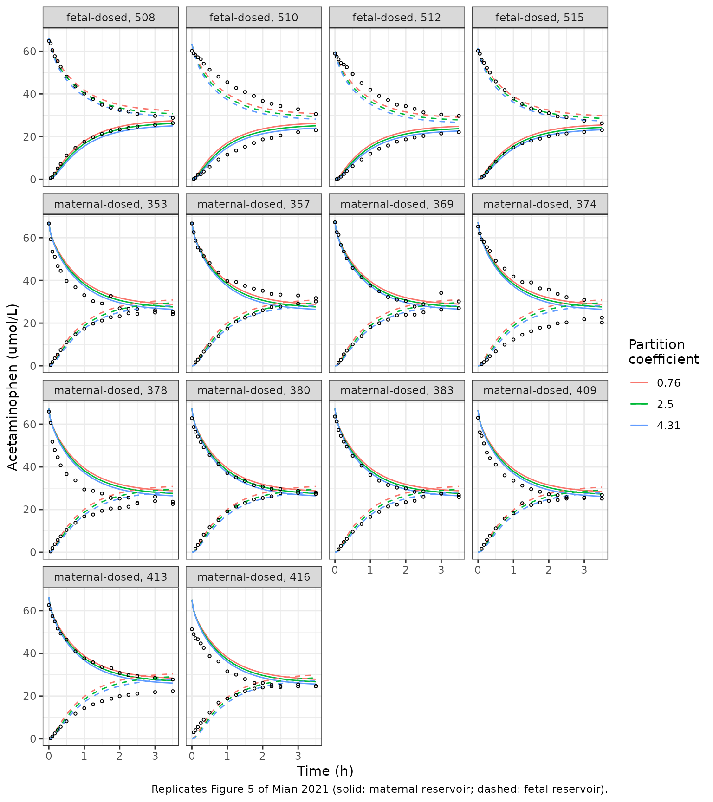

# Acetaminophen in silico cotyledon perfusion (Mian 2021)

## Model and source

- Citation: Mian P, Nolan B, van den Anker JN, van Calsteren K,
  Allegaert K, Lakhi N, Dallmann A. Mechanistic Coupling of a Novel in
  silico Cotyledon Perfusion Model and a Physiologically Based
  Pharmacokinetic Model to Predict Fetal Acetaminophen Pharmacokinetics
  at Delivery. Front Pediatr. 2021;9:733520.
  <doi:10.3389/fped.2021.733520>. PMCID: PMC8496351. Structure: Figure
  3, Table 1 and Equations 1-13; fixed inputs: In silico Cotyledon
  Perfusion Model section; fitted values: Results. Compartment volume
  fractions, cotyledon perfusate volumes and surface-area scaling are
  not printed in the paper and are taken from the authors’ MoBi 9.1
  project that the paper states is shared on the Open Systems
  Pharmacology GitHub
  (github.com/Open-Systems-Pharmacology/Pregnancy-Models,
  CotyledonPerfusionModel/CotyledonPerfusionModel.mbp3, commit
  73b0acd4f0, 2021-09-23). Observed ex vivo data: Conings S et
  al. (reference 20 of the source paper), as deposited in the same MoBi
  project.

- Description: Ex vivo (human term placenta, dual-side recirculating
  single-cotyledon perfusion). Seven-compartment mechanistic in silico
  cotyledon perfusion model of acetaminophen placental transfer:
  maternal reservoir, maternal perfusate in the intervillous space,
  intervillous interstitial space, trophoblasts, intravillous
  interstitial space, fetal perfusate in the villous capillaries, and
  fetal reservoir. Perfusate recirculates between each reservoir and its
  half of the cotyledon; drug crosses the endothelium into the
  interstitial spaces (Schmitt interstitial partition coefficients), the
  apical trophoblast membrane with asymmetric influx/efflux permeability
  factors f_in and f_out, and the basolateral trophoblast membrane, with
  a fitted trophoblast:perfusate partition coefficient. Fitted in MoBi
  to ex vivo perfusion data (Mian 2021 Equations 1-13). The paper’s
  whole-body maternal-fetal PBPK model (PK-Sim / MoBi), into which the
  fitted placental parameters were copied, is NOT reproduced here; only
  the self-contained ex vivo placental-transfer model is.

- Article: <https://doi.org/10.3389/fped.2021.733520>

- Open-access full text: <https://europepmc.org/article/MED/PMC8496351>

- Authors’ MoBi project for the cotyledon model:
  <https://github.com/Open-Systems-Pharmacology/Pregnancy-Models/tree/master/CotyledonPerfusionModel>

## What this file is, and what it is not

Mian and colleagues built two models and coupled them:

| \# | Model | Implementation | In this file? |
|----|----|----|----|
| 1 | **In silico cotyledon perfusion model**: seven compartments, Figure 3, Table 1, Equations 1-13; `f_in`, `f_out` and the placental partition coefficient fitted to ex vivo perfusion data | MoBi 9.1 | **yes** |
| 2 | Whole-body maternal-fetal PBPK model for acetaminophen (Figures 1-2), into which the fitted placental parameters were copied to predict umbilical-vein concentrations at delivery (Figures 6-7) | PK-Sim / MoBi | no |

Model 2 is the authors’ earlier pregnancy PBPK model (Mian et al., *Clin
Pharmacokinet* 2020;59:97-110 and 911-925) with its structure unchanged
(“All other model parameters were kept the same as published
previously”). Its organ volumes, blood flows, tissue partition
coefficients and enzyme reference concentrations are computed inside the
Open Systems Pharmacology software and are not printed in any of the
papers, so it is not reproduced here.

Model 1 is self-contained. The paper prints its complete ODE system
(Equations 1-11 for the individual exchange processes, Equations 12-13
for the assembled 7 x 7 system), the experimental flows and volumes, the
protein binding and tissue-composition inputs, the trophoblast
permeability, and the three fitted values. Three groups of geometric
constants are not printed:

- the perfusate volumes of the two cotyledon halves (20 mL each);
- the interstitial and trophoblast fractions of the 23 mL intervillous
  and 35 mL intravillous cotyledon volumes; and
- the endothelial surface-area proportionality factor and the
  volume-scaling formula for the basolateral trophoblast surface area.

The paper states that the model “is freely shared on OSP GitHub”, and
the authors’ MoBi project was published there on the article’s
publication day (Open-Systems-Pharmacology/Pregnancy-Models, commit
`73b0acd4f0`, 2021-09-23). The maintainers read these constants from
that project. They also checked that its fitted values agree with the
paper (`f_in` = 0.0596, `f_out` = 0.0507, partition coefficient 4.313
against the printed 0.060, 0.051 and 4.31), as do its trophoblast
permeability (4.29 x 10^-2 cm/min) and villous surface area (1178.3 dm^2
/ 35). The project also contains the 455 ex vivo observations used for
the fit, which matches the paper’s “18 data sets comprising 455 data
values”. They are reproduced below, and the validation runs against
them.

## Population

The model describes isolated human term placentas, not a patient
population. One cotyledon per placenta was dual-perfused in a
recirculating circuit (data of Conings et al., reference 20 of the
paper): maternal flow 14 mL/min, fetal flow 6 mL/min, maternal and fetal
reservoirs of 280 and 284 mL. The maternal and fetal perfusates
contained 40 and 30 mg/mL bovine serum albumin, which gives
acetaminophen unbound fractions of 0.84 and 0.88. Acetaminophen was
added at an initial concentration of about 10 mg/L to the fetal
reservoir in 4 experiments (Figure 4A-D) or to the maternal reservoir in
10 experiments (Figure 4E-N). Both reservoirs were then sampled for 210
min. The whole-body arm of the paper (Table 2: 34 women from Nitsche et
al. and 43 from Mehraban et al., oral acetaminophen 1000 mg at delivery)
evaluates model 2 and is out of scope.

## Source trace

| Quantity (model name) | Value | Source |
|----|----|----|
| Maternal flow `Q_M` (`q_mat`) | 14 mL/min | Text below Equation 2 |
| Fetal flow `Q_F` (`q_fet`) | 6 mL/min | Text below Equation 2 |
| Maternal / fetal reservoir volume (`v_mres`, `v_fres`) | 280 / 284 mL | Text below Equation 2 |
| Intervillous / intravillous cotyledon volume (`v_mcot`, `v_fcot`) | 23 / 35 mL | Text below Equation 4 |
| Cotyledon perfusate volumes (`v_mperf`, `v_fperf`) | 20 / 20 mL | MoBi project (not printed) |
| Vascular fractions (`fvas_mcot`, `fvas_fcot`) | 0.674 / 0.168 | MoBi project (not printed) |
| Interstitial fractions (`fint_mcot`, `fint_fcot`) | 0.1018 / 0.4066 | MoBi project (not printed) |
| Trophoblast volume | (1 - 0.168 - 0.4066) x 35 mL = 14.9 mL | MoBi project formula `1 - f_int - f_vas` |
| Unbound fraction, maternal / fetal (`fu`, `fu_fetus`) | 0.84 / 0.88 | Text below Equation 4 |
| Interstitial and perfusate water content (`fwater_int`, `fwater_perf`) | 0.935 / 0.926 | Text below Equation 5 |
| Interstitial-to-perfusate protein ratio (`fprot_int_perf`) | 0.37 | Text below Equation 5 |
| Interstitial partition coefficients (`kp_mint`, `kp_fint`) | Equation 5 (Schmitt) | Equation 5 |
| Endothelial permeability (`p_endo`) | 100 cm/min | Text below Equation 4 |
| Endothelial surface areas | 9500 1/dm x fraction vascular x volume | MoBi project (not printed); paper: “scaling the local surface area from the cotyledon volume” |
| Basolateral surface area (`sa_fint_cell`) | (V \[mL\] / 1.2)^0.75 x 7.54 x 100 dm^2 | MoBi project (not printed); paper: “calculated as already described above” |
| Trophoblast permeability (`p_tro`) | 4.29 x 10^-2 cm/min | Text below Equation 11 |
| Apical villous surface area (`sa_villi`) | 1178 dm^2 / 35 cotyledons | Text below Equation 11 |
| `f_in` (`lfin`) | 0.060 (95% CI half-width 0.0058) | Results |
| `f_out` (`lfout`) | 0.051 (95% CI half-width 0.0061) | Results |
| `K_FM_cell:perf` = `K_F_cell:perf` (`lkp_trophoblast`) | 4.31 (95% CI half-width 0.57) | Results |
| Reservoir / cotyledon perfusate exchange | Equations 1-2 | Methods |
| Endothelial exchange, maternal and fetal | Equations 3-4 | Methods |
| Basolateral trophoblast exchange | Equations 9-10 | Methods |
| Apical trophoblast exchange | Equation 11 | Methods |
| Assembled ODE system | Equations 12-13 | Methods |
| Observed ex vivo data (455 values) | Figure 4 | MoBi project, Conings et al. |

The partition coefficient enters Equation 10 as `fu / K_F_cell:perf`:
the paper states that `K_F_cell:perf` was multiplied by `fu_fetus / fu`,
which turns `fu_fetus / (K x fu_fetus / fu)` in Equation 9 into the
`fu / K` of Equation 10. The MoBi project implements Equation 10 in
exactly this form.

## Observed ex vivo data

Concentrations in umol/L and times in min, as stored in the authors’
MoBi project. `amt_ug` is the acetaminophen amount added to the dosed
reservoir.

``` r

mw_apap <- 151.16 # g/mol, acetaminophen

obs_raw <- tibble::tribble(
  ~experiment, ~dosed, ~side, ~amt_ug, ~time_min, ~conc,
  508, "fetal", "fetal", 2842, "0.1 3 6 10 15 20 30 45 60 75 90 105 120 135 150 180 210", "64.80 63.64 60.49 57.64 55.33 52.72 48.10 43.51 40.13 37.62 34.92 33.54 32.50 31.73 30.63 29.70 28.77",
  508, "fetal", "maternal", 2842, "3 6 10 15 20 30 45 60 75 90 105 120 135 150 180 210", "0.53 0.99 2.67 5.10 7.16 11.15 14.68 17.54 19.71 21.28 22.48 23.41 23.99 24.71 25.52 26.31",
  510, "fetal", "fetal", 2720.9, "0.1 3 6 10 15 20 30 45 60 75 90 105 120 135 150 180 210", "60.20 58.99 58.14 57.14 56.27 54.17 51.32 48.11 45.47 42.78 40.88 39.05 36.67 35.35 34.30 32.79 30.56",
  510, "fetal", "maternal", 2720.9, "3 6 10 15 20 30 45 60 75 90 105 120 135 150 180 210", "0.13 0.67 2.14 2.40 3.59 5.79 9.28 11.51 13.47 15.21 16.96 18.67 19.34 20.51 22.05 22.99",
  512, "fetal", "fetal", 2572.1, "0.1 3 6 10 15 20 30 45 60 75 90 105 120 135 150 180 210", "58.90 57.44 56.16 54.51 53.74 52.50 49.33 45.08 41.92 39.04 37.09 34.94 34.29 32.95 31.35 30.33 29.70",
  512, "fetal", "maternal", 2572.1, "3 6 10 15 20 30 45 60 75 90 105 120 135 150 180 210", "0.06 0.36 1.23 2.48 3.81 6.17 9.27 11.94 14.29 15.81 17.62 18.69 19.55 20.31 21.43 22.03",
  515, "fetal", "fetal", 2639, "0.1 3 6 10 15 20 30 45 60 75 90 105 120 135 150 180 210", "60.21 58.84 55.96 54.59 52.22 50.00 45.82 41.78 37.81 35.28 33.19 31.99 30.96 29.42 29.08 27.46 26.21",
  515, "fetal", "maternal", 2639, "6 10 15 20 30 45 60 75 90 105 120 135 150 180 210", "0.91 1.64 3.46 5.38 8.24 11.96 14.91 16.91 18.10 19.02 20.18 20.98 21.45 22.18 23.03",
  353, "maternal", "fetal", 2850, "3 6 10 15 20 30 45 60 75 90 105 120 135 150 180 210", "0.36 1.75 3.52 5.24 7.38 11.05 14.75 17.32 19.77 21.19 22.73 23.22 24.58 24.30 25.98 25.21",
  353, "maternal", "maternal", 2850, "0.01 3 6 10 15 20 30 45 60 75 90 105 120 135 150 180 210", "66.66 59.30 53.44 51.09 46.74 44.48 39.71 36.78 33.07 30.28 29.17 32.68 26.89 26.68 26.52 24.97 24.17",
  357, "maternal", "fetal", 2850, "6.0001 10.0001 15.0001 20.0001 30.0001 45.0001 60.0001 75.0001 90.0001 105 120 135 150 180 210", "1.65 2.88 4.58 6.66 9.86 13.88 17.34 20.69 22.57 24.14 26.00 27.52 27.76 29.12 30.15",
  357, "maternal", "maternal", 2850, "0.01 3.0001 6.0001 10.0001 15.0001 20.0001 30.0001 45.0001 60.0001 75.0001 90.0001 105 120 135 150 180 210", "66.67 62.60 58.63 55.43 54.09 51.33 48.10 43.73 39.69 39.26 37.46 36.13 35.13 33.66 33.33 32.93 31.69",
  369, "maternal", "fetal", 2860, "6.0002 10.0002 15.0002 20.0002 30.0002 45.0002 60.0002 75.0002 90.0002 105 120 135 150 180 210", "1.42 2.81 5.38 7.10 10.04 13.90 18.16 19.92 21.64 23.63 23.91 23.94 25.04 26.28 26.94",
  369, "maternal", "maternal", 2860, "0.01 3.0002 6.0002 10.0002 15.0002 20.0002 30.0002 45.0002 60.0002 75.0002 90.0002 105 120 135 150 180 210", "67.22 62.59 61.35 56.62 53.53 50.30 45.88 41.50 37.57 34.87 32.22 30.99 30.43 27.73 28.88 34.13 30.12",
  374, "maternal", "fetal", 2850, "6.0003 10.0003 15.0003 20.0003 30.0003 45.0003 60.0003 75.0003 90.0003 105 120 135 150 180 210", "0.73 1.72 2.91 4.50 6.75 9.92 12.30 14.55 16.14 17.80 18.32 19.85 20.31 21.77 20.24",
  374, "maternal", "maternal", 2850, "0.01 3.0003 6.0003 10.0003 15.0003 20.0003 30.0003 45.0003 60.0003 75.0003 90.0003 105 120 135 150 180 210", "65.23 62.02 59.22 58.01 55.55 53.73 49.17 45.52 41.79 39.18 39.03 36.25 35.68 33.66 32.16 30.89 22.56",
  378, "maternal", "fetal", 2850, "3.0004 6.0004 10.0004 15.0004 20.0004 30.0004 45.0004 60.0004 75.0004 90.0004 105 120 135 150 180 210", "0.37 1.97 3.74 5.72 7.43 10.45 13.82 16.76 17.66 19.43 20.49 20.70 21.35 23.13 23.93 23.70",
  378, "maternal", "maternal", 2850, "0.01 3.0004 6.0004 10.0004 15.0004 20.0004 30.0004 45.0004 60.0004 75.0004 90.0004 105 120 135 150 180 210", "65.92 60.63 51.79 47.90 44.51 40.73 36.61 33.68 29.42 28.77 27.52 25.46 25.16 25.62 22.87 26.06 22.62",
  380, "maternal", "fetal", 2850, "6.0005 10.0005 15.0005 20.0005 30.0005 45.0005 60.0005 75.0005 90.0005 105.001 120.001 135 150 180 210", "1.68 3.37 5.44 8.25 11.69 15.12 19.15 21.42 23.15 24.74 25.43 26.20 27.69 27.81 27.96",
  380, "maternal", "maternal", 2850, "0.01 3.0005 6.0005 10.0005 15.0005 20.0005 30.0005 45.0005 60.0005 75.0005 90.0005 105.001 120.001 135 150 180 210", "62.80 58.67 56.46 54.24 51.64 49.19 45.62 41.37 37.08 35.06 33.41 31.39 30.72 29.71 29.63 28.85 27.28",
  383, "maternal", "fetal", 2850, "5.9999 9.9999 14.9999 19.9999 29.9999 44.9999 59.9999 74.9999 89.9999 105 120 135 150 180 210", "1.37 2.93 4.81 6.28 9.61 13.27 16.58 18.95 21.45 22.33 23.46 24.12 25.95 27.53 25.87",
  383, "maternal", "maternal", 2850, "0.01 2.9999 5.9999 9.9999 14.9999 19.9999 29.9999 44.9999 59.9999 74.9999 89.9999 105 120 135 150 180 210", "63.59 61.26 57.33 54.58 51.84 49.52 45.20 40.60 36.23 33.57 31.52 30.30 29.92 28.31 28.62 27.44 26.79",
  409, "maternal", "fetal", 2820, "5.9998 9.9998 14.9998 19.9998 29.9998 44.9998 59.9998 74.9998 89.9998 105 120 135 150 180 210", "1.62 3.48 5.85 7.73 11.21 15.77 18.27 22.96 22.15 23.28 24.10 24.48 25.15 25.64 26.83",
  409, "maternal", "maternal", 2820, "0.01 2.9998 5.9998 9.9998 14.9998 19.9998 29.9998 44.9998 59.9998 74.9998 89.9998 105 120 135 150 180 210", "63.01 56.20 54.58 51.01 46.73 44.04 41.07 36.02 33.58 31.25 29.57 28.37 27.16 26.75 25.81 25.42 25.16",
  413, "maternal", "fetal", 2810, "2.9997 5.9997 9.9997 14.9997 19.9997 29.9997 44.9997 59.9997 74.9997 89.9997 106 120 135 150 180 210", "0.21 1.07 2.51 4.10 5.65 8.20 11.76 14.35 16.11 17.60 18.78 19.95 20.59 21.15 21.85 22.29",
  413, "maternal", "maternal", 2810, "0.01 2.9997 5.9997 9.9997 14.9997 19.9997 29.9997 44.9997 59.9997 74.9997 89.9997 106 120 135 150 180 210", "62.64 60.69 57.45 55.04 51.65 49.30 46.43 40.98 37.69 35.81 33.56 33.07 30.81 29.77 29.40 28.56 27.75",
  416, "maternal", "fetal", 2760, "2.9996 5.9996 9.9996 14.9996 19.9996 29.9996 44.9996 59.9996 74.9996 89.9996 106 120 135 150 180 210", "3.02 4.03 5.53 7.36 8.93 12.25 16.93 18.83 20.56 22.28 23.54 24.05 24.55 24.80 25.48 24.72",
  416, "maternal", "maternal", 2760, "0.0099 2.9996 5.9996 9.9996 14.9996 19.9996 29.9996 44.9996 59.9996 74.9996 89.9996 106 120 135 150 180 210", "51.32 49.01 47.10 46.61 44.66 42.58 38.70 36.24 31.59 30.06 27.95 26.12 26.13 25.27 24.24 24.49 24.59"
)
obs <- obs_raw |>
  mutate(
    time = strsplit(time_min, " "),
    conc = strsplit(conc, " ")
  ) |>
  select(-time_min) |>
  tidyr::unnest(c(time, conc)) |>
  mutate(time = as.numeric(time), conc = as.numeric(conc))
stopifnot(nrow(obs) == 455, length(unique(obs$experiment)) == 14)
obs |>
  count(dosed, side) |>
  knitr::kable()
```

| dosed    | side     |   n |
|:---------|:---------|----:|
| fetal    | fetal    |  68 |
| fetal    | maternal |  63 |
| maternal | fetal    | 154 |
| maternal | maternal | 170 |

## Simulation

One subject per experiment. The dose is the added amount in umol, placed
in the reservoir that was dosed. Observation rows are on the two
reservoir states, and the model returns the reservoir concentrations
`Cmaternal` and `Cfetal` at each row.

``` r

experiments <- obs |>
  distinct(experiment, dosed, amt_ug) |>
  arrange(desc(dosed), experiment) |>
  mutate(
    id = row_number(),
    dose_umol = amt_ug / mw_apap,
    dose_cmt = paste0(dosed, "_reservoir")
  )

make_events <- function(times) {
  doses <- experiments |>
    transmute(id, time = 0, amt = dose_umol, cmt = dose_cmt, evid = 1L)
  obs_rows <- tidyr::expand_grid(id = experiments$id, time = times) |>
    mutate(amt = 0, cmt = "maternal_reservoir", evid = 0L)
  bind_rows(doses, obs_rows) |>
    arrange(id, time, desc(evid))
}

tgrid <- sort(unique(c(seq(0, 240, by = 1), obs$time)))
sim <- rxSolve(mod, make_events(tgrid), returnType = "data.frame") |>
  left_join(experiments, by = "id")
head(sim[, c("id", "time", "Cmaternal", "Cfetal", "Ctrophoblast")])
#>   id   time Cmaternal       Cfetal Ctrophoblast
#> 1  1 0.0000  67.33641 0.000000e+00 0.000000e+00
#> 2  1 0.0099  67.30319 9.156723e-09 7.269306e-04
#> 3  1 0.0100  67.30285 9.460864e-09 7.412769e-04
#> 4  1 0.1000  67.01089 1.045629e-05 6.816223e-02
#> 5  1 1.0000  64.82232 8.333428e-03 4.934945e+00
#> 6  1 2.0000  63.25268 5.235010e-02 1.447272e+01
```

## Replicate published figures

### Figure 4: observed and simulated reservoir concentrations

``` r

sim_long <- sim |>
  select(experiment, dosed, time, Cmaternal, Cfetal) |>
  pivot_longer(c(Cmaternal, Cfetal), names_to = "side", values_to = "conc") |>
  mutate(side = if_else(side == "Cmaternal", "maternal", "fetal"))

ggplot(sim_long, aes(time / 60, conc, colour = side)) +
  geom_line() +
  geom_point(data = obs, shape = 1) +
  facet_wrap(~ paste0(dosed, "-dosed, ", experiment), ncol = 4) +
  labs(
    x = "Time (h)", y = "Acetaminophen (umol/L)", colour = "Reservoir",
    caption = "Replicates Figure 4 of Mian 2021 (panels A-D fetal-dosed, E-N maternal-dosed)."
  ) +
  theme_bw()
```



### Figure 5: sensitivity to the placental partition coefficient

The paper’s local sensitivity analysis re-simulates the experiments with
the partition coefficient set to 0.76 (the Rodgers-Rowland prediction),
2.5 and the fitted 4.31, with all other values unchanged. It reports
that “pooled over all individual experiments, the MPE was 375%, 131, and
-62.6%”.

These numbers only make sense on one scale. Each is the sum of the
per-observation prediction errors `100 x (pred - obs) / obs` within an
experiment, averaged over the 14 experiments. That is the
per-observation mean multiplied by 455 / 14 = 32.5, so the fitted
model’s -62.6% corresponds to a per-observation mean error of about -2%.

``` r

sens_mpe <- function(k) {
  s <- rxSolve(mod, make_events(sort(unique(obs$time))),
    params = c(lkp_trophoblast = log(k)), returnType = "data.frame"
  ) |>
    left_join(experiments, by = "id") |>
    mutate(time = round(time, 4)) |>
    select(experiment, time, Cmaternal, Cfetal)
  obs |>
    mutate(time = round(time, 4)) |>
    left_join(s, by = c("experiment", "time")) |>
    mutate(
      pred = if_else(side == "maternal", Cmaternal, Cfetal),
      pe = 100 * (pred - conc) / conc
    ) |>
    group_by(experiment) |>
    summarise(sum_pe = sum(pe), mean_pe = mean(pe), .groups = "drop") |>
    summarise(
      mpe_paper_scale = mean(sum_pe),
      mpe_per_observation = sum(sum_pe) / nrow(obs)
    ) |>
    mutate(k = k)
}
mpe_tab <- bind_rows(lapply(c(0.76, 2.5, 4.31), sens_mpe)) |>
  mutate(published = c(375, 131, -62.6))
mpe_tab |>
  mutate(k = format(k)) |>
  select(k, published, mpe_paper_scale, mpe_per_observation) |>
  dplyr::rename(
    "Partition coefficient" = k,
    "Published MPE (%)" = published,
    "Model, paper scale (%)" = mpe_paper_scale,
    "Model, per observation (%)" = mpe_per_observation
  ) |>
  knitr::kable(digits = 1)
```

| Partition coefficient | Published MPE (%) | Model, paper scale (%) | Model, per observation (%) |
|:---|---:|---:|---:|
| 0.76 | 375.0 | 377.7 | 11.6 |
| 2.50 | 131.0 | 132.7 | 4.1 |
| 4.31 | -62.6 | -61.4 | -1.9 |

``` r


# The model is deterministic, so the only difference from the published values
# is solver tolerance and the rounding of the printed inputs (fu 0.84 / 0.88,
# f_in 0.060, f_out 0.051); measured differences are 2.7, 1.7 and 1.2 points
# (the unrounded values in the authors' MoBi project give 375.0, 131.4 and
# -62.0). A mis-transcribed flow, volume or permeability moves these by tens
# to hundreds of points.
stopifnot(all(abs(mpe_tab$mpe_paper_scale - mpe_tab$published) < 5))
```

``` r

sens_curves <- bind_rows(lapply(c(0.76, 2.5, 4.31), function(k) {
  rxSolve(mod, make_events(seq(0, 210, by = 2)),
    params = c(lkp_trophoblast = log(k)), returnType = "data.frame"
  ) |>
    left_join(experiments, by = "id") |>
    mutate(k = factor(k))
}))
ggplot(sens_curves, aes(time / 60, colour = k)) +
  geom_line(aes(y = Cmaternal)) +
  geom_line(aes(y = Cfetal), linetype = 2) +
  geom_point(data = obs, aes(time / 60, conc), inherit.aes = FALSE, shape = 1, size = 0.8) +
  facet_wrap(~ paste0(dosed, "-dosed, ", experiment), ncol = 4) +
  labs(
    x = "Time (h)", y = "Acetaminophen (umol/L)", colour = "Partition\ncoefficient",
    caption = "Replicates Figure 5 of Mian 2021 (solid: maternal reservoir; dashed: fetal reservoir)."
  ) +
  theme_bw()
```



## Derived quantities stated in the paper

The paper converts the fitted factors into directional permeabilities:
“2.56 x 10^-3 and 2.18 x 10^-3 cm/min” for maternal-to-fetal and
fetal-to-maternal transfer.

``` r

p <- setNames(ui$iniDf$est, ui$iniDf$name)
p_cm_min <- 4.29e-2
perm <- c(
  influx = p_cm_min * exp(p[["lfin"]]),
  efflux = p_cm_min * exp(p[["lfout"]])
)
perm
#>    influx    efflux 
#> 0.0025740 0.0021879
# 4.29e-2 x 0.060 = 2.57e-3 and 4.29e-2 x 0.051 = 2.19e-3; the paper's 2.56e-3
# and 2.18e-3 come from the unrounded fitted factors (0.0596, 0.0507).
stopifnot(abs(perm[["influx"]] / 2.56e-3 - 1) < 0.01, abs(perm[["efflux"]] / 2.18e-3 - 1) < 0.01)
```

The abstract says that “simulated steady state concentrations in the
trophoblasts were 4.31-fold higher than those in the perfusate”. The ex
vivo circuit is a closed chain with no loops, so at steady state every
flux is zero. The trophoblast-to-perfusate ratio then follows from
Equations 10-11: `K x f_in / f_out` against the maternal perfusate and
`K x fu_fetus / fu` against the fetal perfusate.

``` r

k_tro <- 4.31
ratio_closed <- c(
  vs_maternal_perfusate = k_tro * 0.060 / 0.051,
  vs_fetal_perfusate = k_tro * 0.88 / 0.84
)
ratio_closed
#> vs_maternal_perfusate    vs_fetal_perfusate 
#>              5.070588              4.515238
late <- sim |>
  filter(time == 240) |>
  mutate(ratio_maternal_reservoir = Ctrophoblast / Cmaternal) |>
  select(experiment, dosed, ratio_maternal_reservoir)
summary(late$ratio_maternal_reservoir)
#>    Min. 1st Qu.  Median    Mean 3rd Qu.    Max. 
#>   4.980   4.980   4.980   5.029   5.110   5.153
```

The simulated trophoblast concentration at 240 min is about 5 times the
maternal reservoir concentration, and at full steady state it is 5.07
times the maternal perfusate and 4.52 times the fetal perfusate. The
paper’s “4.31-fold” is the fitted partition coefficient itself, which
holds exactly only when `f_in = f_out` and `fu = fu_fetus`. The model is
used as printed and this is recorded in the deviations below.

## Mass balance and the closed-form steady state

The perfusion circuit has no elimination, so the total amount must be
conserved. Because the circuit is a chain, the steady state has a closed
form in terms of the printed parameters: with `C_M` the maternal
perfusate concentration, the maternal reservoir is at `C_M`, the
intervillous interstitium at `kp_mint x C_M`, the trophoblasts at
`K x f_in / f_out x C_M`, the fetal perfusate and reservoir at
`(f_in / f_out) x (fu / fu_fetus) x C_M` and the intravillous
interstitium at `kp_fint` times that.

``` r

ev_mb <- et(amt = 18.5, cmt = "maternal_reservoir") |>
  et(c(0, 30, 210, 2000, 20000), cmt = "maternal_reservoir")
mb <- rxSolve(mod, ev_mb, rtol = 1e-10, atol = 1e-12, maxsteps = 1e6, returnType = "data.frame")
states <- c(
  "maternal_reservoir", "maternal_perfusate", "maternal_interstitial",
  "trophoblast", "fetal_interstitial", "fetal_perfusate", "fetal_reservoir"
)
mb$total <- rowSums(mb[, states])
mb[, c("time", "total", "Cmaternal", "Cfetal", "Ctrophoblast")]
#>    time total Cmaternal    Cfetal Ctrophoblast
#> 1     0  18.5  66.07143  0.000000       0.0000
#> 2    30  18.5  45.12408  8.904474     113.3849
#> 3   210  18.5  25.95043 27.625960     127.5363
#> 4  2000  18.5  25.23299 28.336508     127.9461
#> 5 20000  18.5  25.23299 28.336508     127.9461
# Numerical conservation error under rtol = 1e-10; measured about 1e-10.
stopifnot(max(abs(mb$total / 18.5 - 1)) < 1e-7)

fin <- exp(p[["lfin"]])
fout <- exp(p[["lfout"]])
kp_mint <- (p[["fwater_int"]] + p[["fprot_int_perf"]] * (1 / p[["fu"]] - p[["fwater_perf"]])) * p[["fu"]]
kp_fint <- (p[["fwater_int"]] + p[["fprot_int_perf"]] * (1 / p[["fu_fetus"]] - p[["fwater_perf"]])) * p[["fu_fetus"]]
r_fet <- (fin / fout) * (p[["fu"]] / p[["fu_fetus"]])
vol <- c(
  p[["v_mres"]] + p[["v_mperf"]],
  p[["fint_mcot"]] * p[["v_mcot"]],
  (1 - p[["fvas_fcot"]] - p[["fint_fcot"]]) * p[["v_fcot"]],
  p[["fint_fcot"]] * p[["v_fcot"]],
  p[["v_fperf"]] + p[["v_fres"]]
)
conc_rel <- c(1, kp_mint, exp(p[["lkp_trophoblast"]]) * fin / fout, kp_fint * r_fet, r_fet)
c_m_ss <- 18.5 / sum(vol * conc_rel)
ss <- mb[mb$time == 20000, ]
cmp_ss <- c(
  maternal = ss$Cmaternal / c_m_ss,
  fetal = ss$Cfetal / (r_fet * c_m_ss),
  trophoblast = ss$Ctrophoblast / (exp(p[["lkp_trophoblast"]]) * fin / fout * c_m_ss)
)
cmp_ss
#>    maternal       fetal trophoblast 
#>           1           1           1
# At 20000 min the slowest mode has decayed completely; measured agreement ~1e-9.
stopifnot(max(abs(cmp_ss - 1)) < 1e-6)
```

At equilibrium the fetal reservoir sits 1.123-fold above the maternal
reservoir, because `f_in` exceeds `f_out`. The experiments stop at 210
min, before this plateau is reached (Figure 4).

## PKNCA

The paper reports no non-compartmental summary of the ex vivo
experiments, so this block is descriptive only. It summarises the
concentration in the receiving reservoir over the 0-210 min experiment,
grouped by dosing direction.

``` r

recv <- sim |>
  filter(time <= 210) |>
  mutate(
    Cc = if_else(dosed == "maternal", Cfetal, Cmaternal),
    treatment = paste0(dosed, "-to-", if_else(dosed == "maternal", "fetal", "maternal"))
  ) |>
  filter(!is.na(Cc)) |>
  select(id, time, Cc, treatment)
dose_df <- experiments |>
  transmute(id, time = 0, amt = dose_umol,
    treatment = paste0(dosed, "-to-", if_else(dosed == "maternal", "fetal", "maternal")))

conc_obj <- PKNCAconc(recv, Cc ~ time | treatment + id)
dose_obj <- PKNCAdose(dose_df, amt ~ time | treatment + id)
intervals <- data.frame(start = 0, end = 210, cmax = TRUE, tmax = TRUE, auclast = TRUE)
nca <- pk.nca(PKNCAdata(conc_obj, dose_obj, intervals = intervals))
summary(nca)
#>  start end         treatment  N     auclast        cmax           tmax
#>      0 210 fetal-to-maternal  4 3590 [4.29] 23.7 [4.29] 210 [210, 210]
#>      0 210 maternal-to-fetal 10 4250 [1.09] 28.0 [1.09] 210 [210, 210]
#> 
#> Caption: auclast, cmax: geometric mean and geometric coefficient of variation; tmax: median and range; N: number of subjects
```

## Assumptions and deviations

- **Model 2 (the whole-body PBPK) is not reproduced.** Its physiology
  and partition coefficients are software outputs that none of the
  papers print. The umbilical-vein MPE / MAPE of Figures 6-7 therefore
  cannot be checked here.
- **Constants taken from the authors’ MoBi project.** The cotyledon
  perfusate volumes (20 mL each), the vascular and interstitial volume
  fractions of both cotyledon halves, the endothelial surface-area
  factor (9500 1/dm) and the basolateral surface-area formula are not
  printed in the paper. They were read from the project the paper points
  to (OSP GitHub, Pregnancy-Models, commit `73b0acd4f0`). The
  endothelial exchange is not rate-limiting (100 cm/min over 56-147
  dm^2), so the two endothelial surface areas have no visible effect.
  The fractions set the interstitial and trophoblast volumes, and those
  matter.
- **Printed rather than unrounded values.** The file uses the printed
  values `fu` 0.84 / `fu_fetus` 0.88, `f_in` 0.060, `f_out` 0.051 and
  `K` 4.31 rather than the project’s unrounded 0.8409 / 0.8757, 0.0596,
  0.0507 and 4.313. The Figure 5 MPE check reproduces the paper to
  within 3 points (377.7, 132.7 and -61.4 against 375, 131 and -62.6).
- **Maternal intracellular compartment omitted.** The MoBi project
  carries an intracellular sub-compartment in the maternal cotyledon
  half, but its only transport is multiplied by zero. That matches the
  paper’s statement that the decidua is absent from the ex vivo tissue,
  so the model has seven states, as in Figure 3.
- **“4.31-fold” trophoblast accumulation.** As shown above, the fitted
  partition coefficient does not equal the simulated steady-state
  trophoblast-to-perfusate ratio (5.07 against the maternal perfusate)
  when `f_in` differs from `f_out`. The equations are used as printed.
- **No variability.** The parameters were fitted by deterministic
  least-squares (Monte-Carlo optimisation in MoBi). No between-placenta
  variability or residual error was estimated, so the file has no `eta`
  or error terms.
- **Units.** Amounts are in umol and concentrations in umol/L, as in the
  paper and the project. Volumes are in L, permeabilities in dm/min and
  surface areas in dm^2, so that `P x SA` is in L/min. To convert a mass
  dose, divide the mg amount by 151.16 g/mol and multiply by 1000 (e.g.
  2.8 mg = 18.5 umol).
