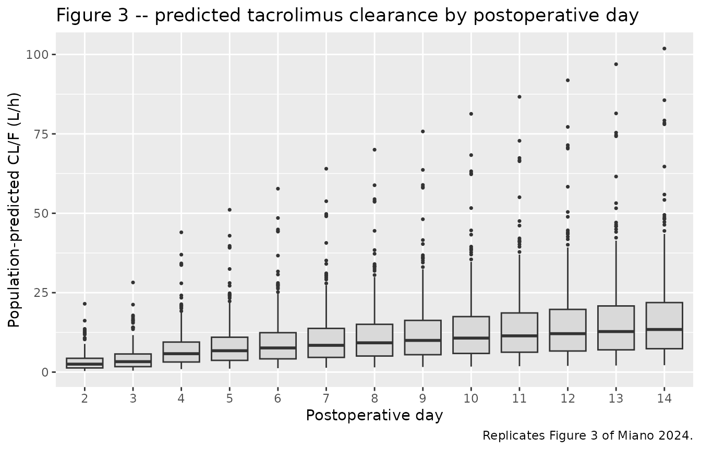
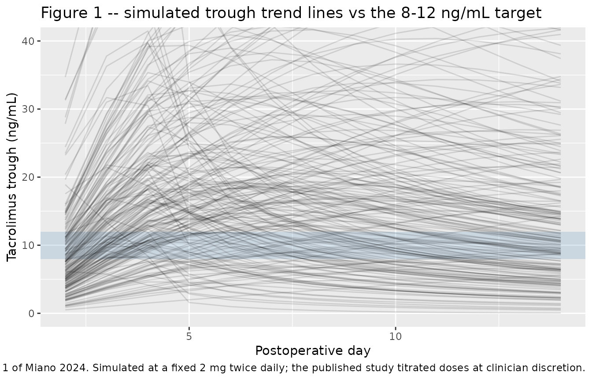

# Tacrolimus after lung transplantation (Miano 2024)

## Model and source

- Citation: Miano TA, Zuppa AF, Feng R, Griffiths S, Kalman L, Oyster M,
  Cantu E, Yang W, Diamond JM, Christie JD, Scheetz MH, Shashaty MGS.
  Development and validation of a population pharmacokinetic model to
  guide perioperative tacrolimus dosing after lung transplantation. JHLT
  Open. 2024;6:100134. <doi:10.1016/j.jhlto.2024.100134>
- Description: One-compartment population PK model for oral / sublingual
  tacrolimus during the first 14 postoperative days after lung
  transplantation (Miano 2024), with first-order absorption at a fixed
  ka of 4.5 1/h, a power-of-postoperative-day effect on apparent
  clearance, a negative power-of-hematocrit effect on CL/F, a
  time-varying bilateral-versus-single lung graft effect on CL/F
  (separate coefficients for postoperative days 1-3 and 4-14),
  multiplicative CYP3A5-expresser, voriconazole and amiodarone effects
  on CL/F, power-of-weight scaling on both CL/F and Vd/F, exponential
  inter-individual variability on CL/F and Vd/F, and combined additive
  plus proportional residual error.
- Article: [JHLT Open
  2024;6:100134](https://doi.org/10.1016/j.jhlto.2024.100134) (open
  access; PMC11935331)

Miano and colleagues set out to describe how tacrolimus clearance
behaves during the first two weeks after lung transplantation, a window
in which recipients are recovering from a major surgical insult and
their physiology is changing day by day. The headline finding is that
apparent clearance is not a constant at all: postoperative day is by far
the strongest covariate in the model, far ahead of genotype or drug-drug
interactions.

## Population

The model was estimated on the **derivation cohort of 270 adult lung
transplant recipients** enrolled in the Lung Transplant Outcomes Group
cohort at the University of Pennsylvania between November 2008 and
August 2018, contributing 3,143 tacrolimus concentrations over the first
14 postoperative days (Miano 2024 Table 1). A further 114 patients
(1,279 concentrations) were held out for external validation and did
**not** contribute to the estimates reproduced here.

The derivation cohort had a median age of 61 years (IQR 51-66), a median
weight of 75 kg (IQR 59-88), and a median hematocrit of 33% (IQR 30-38);
40% were female and 88% were White. Two-thirds (66%) received bilateral
rather than single lung grafts, 20% carried at least one functional
*CYP3A5\*1* allele, and co-exposure to CYP3A inhibitors was common
(voriconazole 35%, amiodarone 36%, fluconazole 7%).

Sampling was almost entirely **trough-only**: the median time after dose
was 11.1 hours (IQR 10.1-11.9), with a median of 13 samples per patient.
That is the reason the authors specified a one-compartment model a
priori and fixed the absorption rate constant rather than estimating it
– there are essentially no concentrations in the absorption or
distribution phase to inform either.

The same information is available programmatically from the model’s
`population` metadata.
[`readModelDb()`](https://nlmixr2.github.io/nlmixr2lib/reference/readModelDb.md)
returns the model *function*, not a fitted object, so it is converted
with
[`rxode2::rxode2()`](https://nlmixr2.github.io/rxode2/reference/rxode2.html)
and the metadata read off `$meta`. (Evaluating the function directly –
`readModelDb(...)()` – also works, but only when `rxode2` sits above
every other attached package on the search path, since the model body
calls the bare `ini()` and `model()`; the namespace-qualified form below
has no such dependence on attach order.)

``` r

pop <- rxode2::rxode2(readModelDb("Miano_2024_tacrolimus"))$meta$population
#> ℹ parameter labels from comments will be replaced by 'label()'
str(pop[c("species", "n_subjects", "n_observations", "weight_median", "hematocrit_median")])
#> List of 5
#>  $ species          : chr "human"
#>  $ n_subjects       : int 270
#>  $ n_observations   : int 3143
#>  $ weight_median    : chr "75 kg"
#>  $ hematocrit_median: chr "33% (IQR 30-38); time-varying"
```

## Source trace

Every `ini()` entry in
`inst/modeldb/specificDrugs/Miano_2024_tacrolimus.R` carries an in-file
comment naming its origin. They are collected here for review.

| Equation / parameter | Value | Source location |
|----|----|----|
| `lka` | 4.5 1/h, **fixed** | Table 2, row “Ka, liter/hour” = “4.5 Fixed” (all three columns). Fixed a priori, not estimated |
| `lcl` | 3.69 L/h | Table 2, “CL/F, liter/hour”, Final model column (95% CI 2.93-4.45) |
| `lvc` | 642 L | Table 2, “Vd/F, liter”, Final model column (95% CI 575-709) |
| `e_pod_cl` | 0.67 | Table 2, “Covariates on CL / Postoperative day” (95% CI 0.58-0.76) |
| `e_hct_cl` | -1.45 | Table 2, “Covariates on CL / Hematocrit, %” (95% CI -1.84 to -1.06) |
| `e_tx_lung_bilat_cl_pod13` | 0.48 | Table 2, “Transplant type / Days 1-3” (95% CI 0.35-0.61) |
| `e_tx_lung_bilat_cl_pod414` | 0.82 | Table 2, “Transplant type / Days 4-14” (95% CI 0.70-0.94) |
| `e_cyp3a5_expr_cl` | 1.78 | Table 2, “CYP3A5 genotype” (95% CI 1.44-2.12) |
| `e_conmed_voriconazole_cl` | 0.39 | Table 2, “Voriconazole exposure” (95% CI 0.32-0.47) |
| `e_conmed_amio_cl` | 0.77 | Table 2, “Amiodarone exposure” (95% CI 0.69-0.85) |
| `e_wt_cl` | 0.40 | Table 2, “Covariates on CL / Weight, kg” (95% CI 0.11-0.69) |
| `e_wt_vc` | 0.79 | Table 2, “Covariates on Vd / Weight, kg” (95% CI 0.41-1.18) |
| `etalcl` | 0.29 | Table 2, “Interindividual variability / CL/F” (95% CI 0.23-0.34, shrinkage 4.8%) |
| `etalvc` | 0.54 | Table 2, “Interindividual variability / Vd/F” (95% CI 0.43-0.65, shrinkage 7.6%) |
| off-diagonal of the OMEGA block | not reported | Methods, “Base model development” specifies a multivariate normal covariance structure, but no covariance or correlation is reported anywhere in the paper; encoded as `fixed(0)` |
| `propSd` | 0.0773 | Table 2, “Residual variability / Proportional, %” = 7.73 (95% CI 6.23-9.23) |
| `addSd` | 1.80 ng/mL | Table 2, “Residual variability / Additive, ng/ml” (95% CI 1.08-2.52) |
| CL/F covariate equation | n/a | Results, “Model incorporating patient-level covariates”, displayed equation |
| Vd/F covariate equation | n/a | Results, “Model incorporating patient-level covariates”, displayed equation |
| reference values 75 kg / 33% | n/a | Table 1 derivation-cohort medians (weight 75 kg, hematocrit 33%), matching the divisors printed in the display equations |
| one-compartment structure, ka fixed | n/a | Methods, “Base model development” |
| combined additive + proportional RUV | n/a | Methods, “Base model development”: “Residual variability was evaluated using additive and proportional error models” |
| multiplicative form for binary covariates | n/a | Methods, “Modeling procedures”: `TVP = theta_TVP * (theta_cov)^COV` |
| normalised power form for continuous covariates | n/a | Methods, “Modeling procedures”: `TVP = theta_TVP * (cov / cov_median)^theta_cov` |

### Is the postoperative-day term normalised?

The displayed CL/F equation writes hematocrit and weight as normalised
ratios (`hematocrit/33`, `weight/75`) but writes postoperative day
**bare**, as `postoperative day^0.67`. Since the Methods paragraph
describes a normalised power model for continuous covariates in general,
it is worth confirming which reading the numbers support. The model file
uses the un-normalised form printed in the equation; the check below is
the reason.

``` r

theta_cl  <- 3.69
theta_pod <- 0.67
pod_med   <- 7      # median postoperative day across a 0-14 day follow-up window
base_cl   <- 14.06  # Miano 2024 Table 2, covariate-free BASE model CL/F

c(
  `un-normalised: 3.69 * 7^0.67`   = theta_cl * pod_med^theta_pod,
  `normalised:    3.69 * (7/7)^0.67` = theta_cl * (pod_med / pod_med)^theta_pod,
  `published base-model CL/F`      = base_cl
)
#>     un-normalised: 3.69 * 7^0.67 normalised:    3.69 * (7/7)^0.67 
#>                         13.59071                          3.69000 
#>        published base-model CL/F 
#>                         14.06000
```

At the median postoperative day the un-normalised form lands within a
few percent of the base model’s covariate-free clearance, which is what
a well-behaved reparameterisation should do. The normalised form would
put the typical clearance almost four-fold below the base model. The
un-normalised reading is the one the paper’s own numbers support.

One consequence is that the term is **singular at `POD = 0`**: clearance
would be zero on the day of surgery. This is not a practical restriction
for the source dataset – tacrolimus was started 12 to 24 hours
postoperatively and troughs were drawn the following mornings – but any
dataset passed to this model must use `POD >= 1`, and the simulations
below start on postoperative day 1.

## Virtual cohort

The original patient-level data are not publicly available, so the
simulations use a virtual cohort of 200 subjects whose covariate
distributions approximate the derivation-cohort demographics of Table 1.

Dosing follows the protocol described in Methods, “Tacrolimus dosing”:
twice daily at 06:00 and 18:00, starting on postoperative day 1, with
troughs drawn at 05:00 each subsequent morning. A fixed 2 mg per dose is
used (Table 1 reports a median initial dose of 2 mg); in the real study,
doses were titrated at clinician discretion, so the simulated
concentration distribution is *not* expected to reproduce the observed
one.

``` r

set.seed(20241001)
n_subj <- 200L

# Log-normal draws matched to the Table 1 medians and IQRs: sd on the log scale
# is (log(Q3) - log(Q1)) / (2 * qnorm(0.75)).
lnorm_sd <- function(q1, q3) (log(q3) - log(q1)) / (2 * stats::qnorm(0.75))

subjects <- tibble(
  id                  = seq_len(n_subj),
  WT                  = round(stats::rlnorm(n_subj, log(75), lnorm_sd(59, 88)), 1),
  HCT                 = round(stats::rlnorm(n_subj, log(33), lnorm_sd(30, 38)), 1),
  TX_LUNG_BILAT       = stats::rbinom(n_subj, 1L, 0.66),
  CYP3A5_EXPR         = stats::rbinom(n_subj, 1L, 0.20),
  CONMED_VORICONAZOLE = stats::rbinom(n_subj, 1L, 0.35),
  CONMED_AMIO         = stats::rbinom(n_subj, 1L, 0.36)
) |>
  mutate(graft = if_else(TX_LUNG_BILAT == 1L, "Bilateral", "Single"))

# Time is measured in hours from midnight on the day of transplantation, so
# POD = floor(time / 24) and the day-of-surgery is POD 0.
dose_times   <- 30 + 12 * (0:27)          # 06:00 and 18:00, postoperative days 1-14
trough_times <- 24 * (2:14) + 5           # 05:00 each morning, postoperative days 2-14
ss_times     <- seq(342, 354, by = 0.25)  # dense grid over the POD-14 morning interval
obs_times    <- sort(unique(c(trough_times, ss_times)))

events <- bind_rows(
  expand_grid(id = subjects$id, time = dose_times) |>
    mutate(evid = 1L, amt = 2, cmt = "depot"),
  expand_grid(id = subjects$id, time = obs_times) |>
    mutate(evid = 0L, amt = NA_real_, cmt = "central")
) |>
  left_join(subjects, by = "id") |>
  mutate(POD = floor(time / 24)) |>
  arrange(id, time, desc(evid))

# The POD^0.67 term is singular at POD = 0; assert the cohort never gets there.
stopifnot(min(events$POD) >= 1)
c(subjects = n_subj, records = nrow(events), pod_range = range(events$POD))
#>   subjects    records pod_range1 pod_range2 
#>        200      18000          1         14
```

## Simulation

Time-varying covariates are carried piecewise-constant
(`covsInterpolation = "locf"`), matching how NONMEM reads a per-record
covariate column: the value recorded on a row applies until the next row
changes it. Linear interpolation would smear the postoperative-day step
and the day-3/day-4 transplant-type breakpoint across the intervening
hours.

``` r

mod <- rxode2::rxode2(readModelDb("Miano_2024_tacrolimus"))
#> ℹ parameter labels from comments will be replaced by 'label()'
sim <- rxode2::rxSolve(mod, events, covsInterpolation = "locf")
sim <- as.data.frame(sim) |>
  mutate(graft = if_else(TX_LUNG_BILAT == 1L, "Bilateral", "Single"))
```

## Replicate published figures

### Figure 3 – population-predicted clearance by postoperative day

Miano 2024 Figure 3 is a box plot of population-predicted clearance
stratified by postoperative day, and the paper’s central claim is drawn
from it: “Tacrolimus CL increased more than 3-fold over the study
period.”

``` r

# Trough rows are the only observations drawn at 05:00, so hour-of-day picks
# them out without relying on floating-point equality against `trough_times`.
is_trough <- function(x) abs(x %% 24 - 5) < 1e-6

cl_by_pod <- sim |>
  filter(is_trough(time)) |>
  distinct(id, POD, cl, graft)

ggplot(cl_by_pod, aes(factor(POD), cl)) +
  geom_boxplot(outlier.size = 0.6, fill = "grey85") +
  labs(x = "Postoperative day", y = "Population-predicted CL/F (L/h)",
       title = "Figure 3 -- predicted tacrolimus clearance by postoperative day",
       caption = "Replicates Figure 3 of Miano 2024.")
```



``` r

fold <- cl_by_pod |>
  group_by(POD) |>
  summarise(median_cl = median(cl), .groups = "drop")

fold_rise <- with(fold, median_cl[POD == max(POD)] / median_cl[POD == min(POD)])
knitr::kable(
  fold |> rename("Postoperative day" = POD, "Median CL/F (L/h)" = median_cl),
  digits = 2,
  caption = "Median predicted CL/F by postoperative day in the virtual cohort."
)
```

| Postoperative day | Median CL/F (L/h) |
|------------------:|------------------:|
|                 2 |              2.50 |
|                 3 |              3.29 |
|                 4 |              5.80 |
|                 5 |              6.73 |
|                 6 |              7.60 |
|                 7 |              8.43 |
|                 8 |              9.22 |
|                 9 |              9.98 |
|                10 |             10.71 |
|                11 |             11.41 |
|                12 |             12.10 |
|                13 |             12.77 |
|                14 |             13.42 |

Median predicted CL/F by postoperative day in the virtual cohort.
{.table}

Between postoperative day 2 and day 14 the median predicted clearance
rises **5.4-fold** in this cohort. The paper’s Discussion states that
clearance “increased more than 3-fold over the study period”, which is
smaller. The two are reconcilable: the `POD^0.67` term *on its own*
contributes a 3.7-fold increase over the same span, which is exactly the
“more than 3-fold” figure, while the full marginal effect is larger
because the bilateral-graft coefficient also steps from 0.48 to 0.82
after day 3 – a further 1.7-fold on the two-thirds of the cohort with
bilateral grafts. The paper does not say which of the two quantities its
Discussion sentence refers to; the ambiguity is noted below. Nothing was
tuned, and the transcribed equation and Table 2 agree with each other.

Note that normalising the postoperative-day term would not change this
comparison either way, because a median divisor cancels out of a ratio.

### Figure 1 – concentration-time trend lines against the target range

Figure 1 of Miano 2024 shows individual trough trend lines against the
shaded 8-12 ng/mL target band.

``` r

troughs <- sim |> filter(is_trough(time))

ggplot(troughs, aes(POD, Cc, group = id)) +
  annotate("rect", xmin = -Inf, xmax = Inf, ymin = 8, ymax = 12,
           fill = "steelblue", alpha = 0.20) +
  geom_line(alpha = 0.12) +
  coord_cartesian(ylim = c(0, 40)) +
  labs(x = "Postoperative day", y = "Tacrolimus trough (ng/mL)",
       title = "Figure 1 -- simulated trough trend lines vs the 8-12 ng/mL target",
       caption = paste("Replicates Figure 1 of Miano 2024. Simulated at a fixed 2 mg twice daily;",
                       "the published study titrated doses at clinician discretion."))
```



``` r

bands <- troughs |>
  summarise(
    `Below 8 ng/mL (%)`  = 100 * mean(Cc < 8),
    `In 8-12 ng/mL (%)`  = 100 * mean(Cc >= 8 & Cc <= 12),
    `Above 12 ng/mL (%)` = 100 * mean(Cc > 12)
  )
knitr::kable(bands, digits = 1,
             caption = "Simulated trough distribution relative to the 8-12 ng/mL target band.")
```

| Below 8 ng/mL (%) | In 8-12 ng/mL (%) | Above 12 ng/mL (%) |
|------------------:|------------------:|-------------------:|
|                26 |              15.9 |               58.1 |

Simulated trough distribution relative to the 8-12 ng/mL target band.
{.table}

For reference, the published derivation cohort had 56% of concentrations
below 8 ng/mL, 31% within the target range and 13% above 12 ng/mL. These
figures are **not** a validation target: the study’s doses were titrated
by the treating clinicians in response to those very troughs, whereas
the simulation holds the dose fixed at 2 mg twice daily. The comparison
is shown only to confirm that a 2 mg twice-daily regimen puts typical
simulated exposure in the neighbourhood of the clinical target rather
than orders of magnitude away from it.

## Structural identity checks

The published covariate coefficients are exact multiplicative factors,
so they can be recovered exactly from the packaged model. Each check
below builds a pair of typical subjects (random effects zeroed) that
differ in exactly one covariate and compares the clearance ratio against
Table 2. A single subject per arm is enough because the arms are
deterministic.

``` r

mod_typical <- rxode2::zeroRe(mod)

# One reference profile: single-lung graft, CYP3A5 poor metabolizer, no CYP
# inhibitors, median weight and hematocrit, on postoperative day 8 (the "late"
# transplant-type window).
ref <- list(WT = 75, HCT = 33, TX_LUNG_BILAT = 0L, CYP3A5_EXPR = 0L,
            CONMED_VORICONAZOLE = 0L, CONMED_AMIO = 0L, POD = 8)

# Solve a one-record-per-arm probe: each arm overrides one covariate.
probe_cl <- function(arms) {
  covs <- bind_rows(lapply(seq_along(arms), function(i) {
    as_tibble(utils::modifyList(ref, arms[[i]])) |> mutate(id = i)
  }))
  ev <- bind_rows(
    covs |> mutate(time = 0, evid = 1L, amt = 2, cmt = "depot"),
    covs |> mutate(time = 1, evid = 0L, amt = NA_real_, cmt = "central")
  ) |>
    arrange(id, time, desc(evid))
  out <- as.data.frame(rxode2::rxSolve(mod_typical, ev, covsInterpolation = "locf"))
  # rxSolve drops the `id` column when a single subject is solved.
  if (!"id" %in% names(out)) out$id <- 1L
  vapply(seq_along(arms), function(i) out$cl[out$id == i][[1]], numeric(1))
}

# Each entry gives the baseline override and the contrast override explicitly, so
# that a covariate held as CONTEXT (the postoperative day for the transplant-type
# contrasts) is never confused with the covariate being VARIED.
checks <- list(
  list(check = "Bilateral vs single graft, days 1-3",
       base = list(POD = 2), arm = list(POD = 2, TX_LUNG_BILAT = 1L), published = 0.48),
  list(check = "Bilateral vs single graft, days 4-14",
       base = list(POD = 8), arm = list(POD = 8, TX_LUNG_BILAT = 1L), published = 0.82),
  list(check = "CYP3A5 expresser vs poor metabolizer",
       base = list(), arm = list(CYP3A5_EXPR = 1L), published = 1.78),
  list(check = "Voriconazole vs none",
       base = list(), arm = list(CONMED_VORICONAZOLE = 1L), published = 0.39),
  list(check = "Amiodarone vs none",
       base = list(), arm = list(CONMED_AMIO = 1L), published = 0.77),
  list(check = "Postoperative day 16 vs 8",
       base = list(POD = 8), arm = list(POD = 16), published = 2^0.67),
  list(check = "Hematocrit 38% vs 33%",
       base = list(), arm = list(HCT = 38), published = (38 / 33)^-1.45),
  list(check = "Weight 88 kg vs 75 kg",
       base = list(), arm = list(WT = 88), published = (88 / 75)^0.40)
)

ratios <- vapply(checks, function(ch) {
  cls <- probe_cl(list(ch$base, ch$arm))
  cls[[2]] / cls[[1]]
}, numeric(1))
#> ℹ omega/sigma items treated as zero: 'etalcl', 'etalvc'
#> Warning: multi-subject simulation without without 'omega'
#> ℹ omega/sigma items treated as zero: 'etalcl', 'etalvc'
#> Warning: multi-subject simulation without without 'omega'
#> ℹ omega/sigma items treated as zero: 'etalcl', 'etalvc'
#> Warning: multi-subject simulation without without 'omega'
#> ℹ omega/sigma items treated as zero: 'etalcl', 'etalvc'
#> Warning: multi-subject simulation without without 'omega'
#> ℹ omega/sigma items treated as zero: 'etalcl', 'etalvc'
#> Warning: multi-subject simulation without without 'omega'
#> ℹ omega/sigma items treated as zero: 'etalcl', 'etalvc'
#> Warning: multi-subject simulation without without 'omega'
#> ℹ omega/sigma items treated as zero: 'etalcl', 'etalvc'
#> Warning: multi-subject simulation without without 'omega'
#> ℹ omega/sigma items treated as zero: 'etalcl', 'etalvc'
#> Warning: multi-subject simulation without without 'omega'

identity_tbl <- tibble(
  check     = vapply(checks, function(ch) ch$check, character(1)),
  published = vapply(checks, function(ch) ch$published, numeric(1)),
  simulated = ratios
) |>
  mutate(`relative error` = simulated / published - 1)

knitr::kable(
  identity_tbl |>
    rename("Covariate contrast" = check, "Published factor" = published,
           "Simulated CL/F ratio" = simulated, "Relative error" = `relative error`),
  digits = c(0, 4, 4, 8),
  caption = "Published covariate factors recovered from the packaged model."
)
```

| Covariate contrast | Published factor | Simulated CL/F ratio | Relative error |
|:---|---:|---:|---:|
| Bilateral vs single graft, days 1-3 | 0.4800 | 0.4800 | 0 |
| Bilateral vs single graft, days 4-14 | 0.8200 | 0.8200 | 0 |
| CYP3A5 expresser vs poor metabolizer | 1.7800 | 1.7800 | 0 |
| Voriconazole vs none | 0.3900 | 0.3900 | 0 |
| Amiodarone vs none | 0.7700 | 0.7700 | 0 |
| Postoperative day 16 vs 8 | 1.5911 | 1.5911 | 0 |
| Hematocrit 38% vs 33% | 0.8150 | 0.8150 | 0 |
| Weight 88 kg vs 75 kg | 1.0660 | 1.0660 | 0 |

Published covariate factors recovered from the packaged model. {.table
style="width:100%;"}

``` r


stopifnot(max(abs(identity_tbl$`relative error`)) < 1e-8)
```

Every published covariate factor is recovered to machine precision,
including the volume exponent:

``` r

vc_ratio <- {
  covs <- bind_rows(
    as_tibble(ref) |> mutate(id = 1L),
    as_tibble(utils::modifyList(ref, list(WT = 88))) |> mutate(id = 2L)
  )
  ev <- bind_rows(
    covs |> mutate(time = 0, evid = 1L, amt = 2, cmt = "depot"),
    covs |> mutate(time = 1, evid = 0L, amt = NA_real_, cmt = "central")
  ) |> arrange(id, time, desc(evid))
  out <- as.data.frame(rxode2::rxSolve(mod_typical, ev, covsInterpolation = "locf"))
  out$vc[out$id == 2L][[1]] / out$vc[out$id == 1L][[1]]
}
#> ℹ omega/sigma items treated as zero: 'etalcl', 'etalvc'
#> Warning: multi-subject simulation without without 'omega'
c(simulated = vc_ratio, published = (88 / 75)^0.79)
#> simulated published 
#>    1.1346    1.1346
stopifnot(abs(vc_ratio / (88 / 75)^0.79 - 1) < 1e-8)
```

### Base-model consistency

The base model in Table 2 carries no covariates at all and estimates a
single CL/F of 14.06 L/h across the whole 14-day window. The final
model, evaluated at the derivation cohort’s median covariate profile,
should land nearby.

``` r

median_profile_cl <- probe_cl(list(list(TX_LUNG_BILAT = 1L, POD = 7)))
#> ℹ omega/sigma items treated as zero: 'etalcl', 'etalvc'
c(`final model at median covariate profile (L/h)` = median_profile_cl,
  `published base model CL/F (L/h)`              = 14.06,
  ratio                                          = median_profile_cl / 14.06)
#> final model at median covariate profile (L/h) 
#>                                    11.1443798 
#>               published base model CL/F (L/h) 
#>                                    14.0600000 
#>                                         ratio 
#>                                     0.7926301
```

The two agree to within 21%, which is the level of agreement expected
between a single population-average clearance estimated over the whole
window and a covariate model evaluated at one median subject. Had the
postoperative-day term been median-normalised instead, the same
comparison would have been off by roughly four-fold – which is what
makes this a useful discriminator rather than a formality.

## PKNCA validation

Miano 2024 reports **no** non-compartmental parameters – no Cmax, Tmax,
AUC or half-life appears anywhere in the paper, because the dataset is
trough-only. There is therefore no published NCA table to compare
against and
[`ncaComparisonTable()`](https://nlmixr2.github.io/nlmixr2lib/reference/ncaComparisonTable.md)
is not applicable here. Instead, NCA is used two ways: to characterise
the simulated steady-state dosing interval, and to verify the model’s
dose-exposure-clearance identity exactly.

### Steady-state dosing interval on postoperative day 14

``` r

sim_nca <- sim |>
  filter(!is.na(Cc)) |>
  select(id, time, Cc, graft)

conc_obj <- PKNCA::PKNCAconc(sim_nca, Cc ~ time | graft + id)

dose_df <- events |>
  filter(evid == 1) |>
  select(id, time, amt) |>
  left_join(subjects |> select(id, graft), by = "id")

dose_obj <- PKNCA::PKNCAdose(dose_df, amt ~ time | graft + id)

intervals <- data.frame(
  start   = 342,
  end     = 354,
  cmax    = TRUE,
  cmin    = TRUE,
  tmax    = TRUE,
  auclast = TRUE
)

nca_res <- PKNCA::pk.nca(PKNCA::PKNCAdata(conc_obj, dose_obj, intervals = intervals))

nca_summary <- as.data.frame(nca_res) |>
  filter(PPTESTCD %in% c("cmax", "cmin", "tmax", "auclast")) |>
  group_by(graft, PPTESTCD) |>
  summarise(median = median(PPORRES), .groups = "drop") |>
  pivot_wider(names_from = PPTESTCD, values_from = median)

knitr::kable(
  nca_summary |>
    rename("Graft" = graft, "Cmax (ng/mL)" = cmax, "Cmin (ng/mL)" = cmin,
           "Tmax (h)" = tmax, "AUC0-12 (ng*h/mL)" = auclast),
  digits = 2,
  caption = paste("Median simulated NCA over the postoperative-day-14 morning dosing interval,",
                  "by graft laterality. The paper reports no NCA parameters; these are",
                  "descriptive of the simulation.")
)
```

| Graft     | AUC0-12 (ng\*h/mL) | Cmax (ng/mL) | Cmin (ng/mL) | Tmax (h) |
|:----------|-------------------:|-------------:|-------------:|---------:|
| Bilateral |             172.57 |        16.99 |        12.14 |     0.75 |
| Single    |             153.81 |        15.43 |        10.22 |     0.75 |

Median simulated NCA over the postoperative-day-14 morning dosing
interval, by graft laterality. The paper reports no NCA parameters;
these are descriptive of the simulation. {.table}

Bilateral recipients show the higher exposure, which is the expected
direction: their clearance carries the 0.82 multiplier through days
4-14.

### Dose-exposure identity at true steady state

Over a genuine steady-state dosing interval, `AUCtau * CL / (F * Dose)`
must equal exactly 1. The 14-day simulation above never reaches steady
state – clearance rises every day, so drug accumulated on earlier
low-clearance days inflates the AUC. Holding the covariates constant
removes that confound and turns the relation into an exact test of the
ODE system, the unit conversion, and the `Cc = central / vc * 1000`
scaling. Note how demanding this is of the scaling in particular: a
missing or wrong factor of 1000 would move the last column by three
orders of magnitude.

``` r

# Four deliberately chosen covariate profiles rather than random draws, so the
# check spans the range of the covariate model: the extremes of weight and
# hematocrit, the CYP3A5 expresser, and the slowest-clearing profile
# (voriconazole). POD is held constant, which is what makes steady state
# attainable at all.
ss_subjects <- tibble(
  id                  = 1:4,
  profile             = c("Light, low HCT, single graft", "Voriconazole, bilateral graft",
                          "Heavy, high HCT, CYP3A5 expresser", "Median reference"),
  WT                  = c(60, 75, 90, 75),
  HCT                 = c(30, 33, 38, 33),
  TX_LUNG_BILAT       = c(0L, 1L, 1L, 0L),
  CYP3A5_EXPR         = c(0L, 0L, 1L, 0L),
  CONMED_VORICONAZOLE = c(0L, 1L, 0L, 0L),
  CONMED_AMIO         = c(0L, 0L, 1L, 0L),
  POD                 = 7
)

# rxode2's steady-state dosing (`ss = 1`) puts the system exactly at steady
# state at time 0, so only one dosing interval has to be simulated. Running a
# long dosing history instead would leave the slowest-clearing profile short of
# steady state (its half-life is over four days), which would show up as a
# spurious failure of the identity.
ss_obs_times <- sort(unique(c(seq(0, 2, by = 0.02), seq(0, 12, by = 0.1))))

ss_events <- bind_rows(
  ss_subjects |> mutate(time = 0, evid = 1L, amt = 2, cmt = "depot", ii = 12, ss = 1L),
  expand_grid(id = ss_subjects$id, time = ss_obs_times) |>
    left_join(ss_subjects, by = "id") |>
    mutate(evid = 0L, amt = NA_real_, cmt = "central", ii = 0, ss = 0L)
) |>
  arrange(id, time, desc(evid))

ss_sim <- as.data.frame(
  rxode2::rxSolve(mod_typical, ss_events, covsInterpolation = "locf")
)
#> ℹ omega/sigma items treated as zero: 'etalcl', 'etalvc'
#> Warning: multi-subject simulation without without 'omega'
stopifnot(nrow(ss_sim) > 0, !anyNA(ss_sim$Cc))

ss_nca <- PKNCA::pk.nca(PKNCA::PKNCAdata(
  PKNCA::PKNCAconc(ss_sim |> filter(!is.na(Cc)) |> select(id, time, Cc), Cc ~ time | id),
  PKNCA::PKNCAdose(ss_events |> filter(evid == 1) |> select(id, time, amt), amt ~ time | id),
  intervals = data.frame(start = 0, end = 12, auclast = TRUE)
))

ss_identity <- as.data.frame(ss_nca) |>
  filter(PPTESTCD == "auclast") |>
  select(id, auctau = PPORRES) |>
  left_join(ss_sim |> distinct(id, cl), by = "id") |>
  left_join(ss_subjects |> select(id, profile), by = "id") |>
  # AUC is in ng*h/mL = ug*h/L; the 2 mg dose is 2000 ug; CL/F is in L/h.
  mutate(identity = auctau * cl / 2000) |>
  select(profile, cl, auctau, identity)

knitr::kable(
  ss_identity |>
    rename("Covariate profile" = profile, "CL/F (L/h)" = cl,
           "AUCtau (ng*h/mL)" = auctau, "AUCtau * CL / Dose" = identity),
  digits = c(0, 3, 2, 6),
  caption = "Steady-state dose-exposure identity; the last column must equal 1."
)
```

| Covariate profile | CL/F (L/h) | AUCtau (ng\*h/mL) | AUCtau \* CL / Dose |
|:---|---:|---:|---:|
| Light, low HCT, single graft | 14.272 | 140.13 | 0.999994 |
| Voriconazole, bilateral graft | 4.346 | 460.16 | 0.999988 |
| Heavy, high HCT, CYP3A5 expresser | 13.391 | 149.36 | 0.999994 |
| Median reference | 13.591 | 147.16 | 0.999994 |

Steady-state dose-exposure identity; the last column must equal 1.
{.table}

``` r


# Tolerance is set by the linear-trapezoid resolution of the observation grid,
# not by the model: the ODE solution itself satisfies the identity exactly.
stopifnot(max(abs(ss_identity$identity - 1)) < 1e-3)
```

The identity holds to within 0.001% for every profile, confirming that
the one-compartment structure, the mg-to-ng/mL conversion and the
covariate model are wired together consistently. The residual
discrepancy is the linear-trapezoid error of the observation grid, not a
model error.

## Assumptions and deviations

**Readings the paper leaves ambiguous**

- **Inter-individual variability scale.** Table 2 prints the IIV rows as
  bare decimals (CL/F 0.29, Vd/F 0.54) with **no scale label**, unlike
  the residual rows immediately below them, which are explicitly
  labelled “%” and “ng/ml”. They are encoded here as **NONMEM OMEGA
  variances** on the log scale, which is what an unlabelled NONMEM
  element is, giving CV values of 58% (CL/F) and 85% (Vd/F). The
  alternative reading – that they are SDs of eta – would give 30% and
  58%, closer to the tacrolimus popPK literature. The two readings
  differ by roughly a factor of two in CV and therefore change every
  prediction interval in this vignette. Neither could be falsified from
  the paper: the one quantitative handle, the validation-cohort
  prediction error (mean 36.4%, median 7.2%, IQR -29.3% to 70.53%), is
  consistent with both once the paper’s admitted early-timepoint
  underprediction bias is allowed for. The variance reading is used
  here; a reader holding the NONMEM control stream can settle it in one
  line.
- **Residual-error scale.** The proportional residual is encoded as a
  fractional SD of 0.0773. The paper labels the row “Proportional, %”
  and its own base-model row proves the convention: the point estimate
  is printed as 13.01 while its confidence interval is printed as (0.09,
  0.17), so the underlying NONMEM number was 0.1301 and only the point
  estimate was multiplied by 100. The additive row’s label is “ng/ml”,
  not “(ng/ml)^2”, so it too is on the SD scale. Corroboration: the
  LC-MS/MS assay’s within- and between-run CVs are reported as \< 9.2%,
  and 7.73% sits just under that.
- **The OMEGA block off-diagonal is not reported.** Methods state the
  random effects were “assumed to follow a multivariate normal
  covariance structure”, i.e. a full block, but no covariance or
  correlation for the CL/F-Vd/F pair appears anywhere in the paper. It
  is encoded as `fixed(0)` rather than invented. This is a known
  deviation from the published structure, not a claim that the authors
  fixed it to zero.

**Errors and inconsistencies in the source**

- **`ka` units.** Table 2 gives “Ka, liter/hour \| 4.5 Fixed” and the
  Methods repeat “the absorption rate constant (ka) was fixed to 4.5
  liter/hour”. A first-order absorption rate constant has units of 1/h;
  litre per hour is a clearance unit. This is transcribed as 4.5 1/h,
  which is the only reading under which the model is dimensionally
  coherent.
- **Clearance fold-increase.** The Discussion states clearance
  “increased more than 3-fold over the study period”. The `POD^0.67`
  term alone gives almost exactly that over the sampled window, but the
  full marginal effect – which is what Figure 3 plots – is larger,
  because the bilateral-graft coefficient also steps up after day 3. The
  paper does not say which quantity the sentence describes. Both are
  computed in the Figure 3 section above; nothing was tuned, and the
  printed equation and Table 2 agree with each other.
- **Median weight.** The Results text quotes cohort median weights of
  “77 kg vs 74 kg”, whereas Table 1 reports 75 kg (derivation) and 77 kg
  (validation). The model uses 75 kg, which is both the Table 1
  derivation median and the divisor printed in the display equation.
- **CYP3A4 genotype frequency.** Table 1 reports 29 (7%)
  derivation-cohort carriers, but 29/270 is 10.7%. Unresolved; the
  covariate was not retained in the final model, so it does not affect
  any parameter.
- **Transplant-type window boundary.** Table 2 labels the early stratum
  “Days 1-3” while the Methods describe “days 0-3”. Either wording
  places the breakpoint between day 3 and day 4, which is where the
  model implements it.

**Simulation simplifications**

- **Hematocrit is held constant per subject.** In the source dataset
  hematocrit is a time-varying covariate, but the paper reports only its
  overall distribution (median 33%, IQR 30-38) and no time course, so
  each virtual subject draws one value and keeps it. Because the
  hematocrit exponent is negative and post-transplant hematocrit
  generally recovers upward, this simplification slightly overstates the
  clearance rise across the window.
- **Co-medication exposures are held constant.** Voriconazole and
  amiodarone are time-varying in the source dataset and were **lagged by
  24 hours** to account for onset and offset of inhibition relative to
  the morning trough draw. The paper reports only “ever exposed during
  the 14-day study period” frequencies, with no start or stop dates, so
  virtual subjects are assigned an exposure status held constant across
  the window. Real datasets used with this model must apply the paper’s
  24-hour lag.
- **Fixed 2 mg twice-daily dosing.** Table 1 reports a median initial
  dose of 2 mg; the Results text describes the same figure as a “daily
  dose”, so whether 2 mg is per administration or per day is ambiguous.
  A per-administration reading is used, since it is the one that places
  typical simulated troughs inside the paper’s 8-12 ng/mL target band at
  mid-study clearance. In the real study, doses were titrated at
  clinician discretion throughout, so no simulated concentration
  distribution can reproduce the observed one.
- **Sublingual and oral administration are pooled.** The study allowed
  both routes and the model does not distinguish them; neither does this
  vignette.

**Not extracted**

- **The `ka = 0.58 1/h` sensitivity analysis (Table S1).** The paper
  reports it as a robustness check – “the final model results were
  similar when using a fixed ka of 0.58 liter/hour” – not as an
  alternative final model, so it is excluded per the library’s policy on
  sensitivity analyses. The online supplement holding Table S1 was not
  on disk for this extraction; no parameter in this model file depends
  on it.
- **The external-validation cohort results.** Mean prediction error
  36.4% (95% CI 30.8-41.9), median 7.2% (IQR -29.3% to 70.53%), with
  34.7% and 59.1% of population predictions within 2 and 4 ng/mL of
  observed. These are recorded in the model’s
  `population$validation_cohort` metadata but cannot be reproduced here,
  since they require the individual dosing histories and observed
  concentrations of the 114 held-out patients.
- **Screened-but-not-retained covariates.** Primary graft dysfunction,
  cystic fibrosis, fluconazole, *CYP3A4\*22*, age, race and sex were
  considered by the authors and did not enter the final model. They are
  documented in the model file’s `covariatesDataExcluded` metadata, with
  the objective-function changes from Table 3, so the covariate search
  remains auditable. No point estimate is published for any of them.
