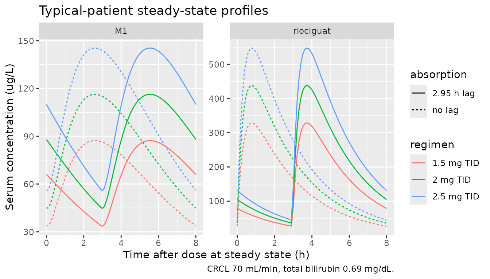
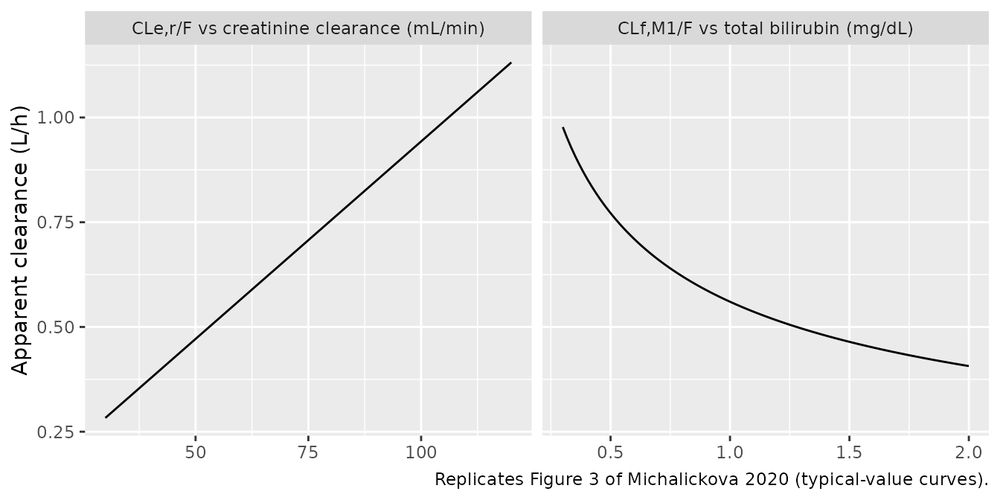
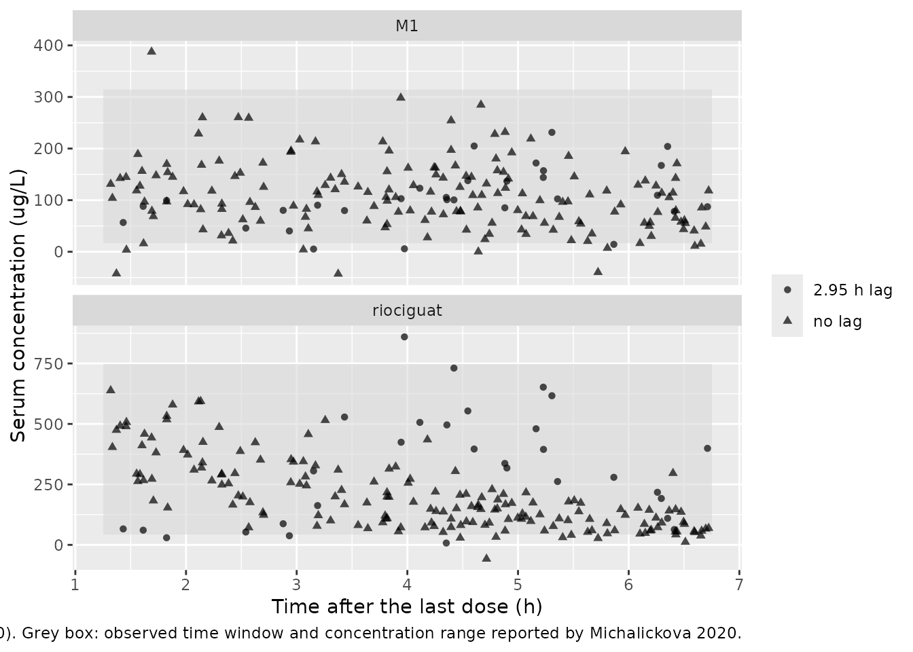

# Riociguat (Michalickova 2020)

## Model and source

- Citation: Michalickova D, Jansa P, Bursova M, Hlozek T, Cabala R,
  Hartinger JM, Ambroz D, Aschermann M, Lindner J, Linhart A, Slanar O,
  Krekels EHJ. Population pharmacokinetics of riociguat and its
  metabolite in patients with chronic thromboembolic pulmonary
  hypertension from routine clinical practice. Pulm Circ.
  2020;10(1):2045894019898031. <doi:10.1177/2045894019898031>. The
  absorption rate constant is fixed to a literature value (Michalickova
  2020 ref 17: Saleh S, Becker C, Frey R, et al. Population
  pharmacokinetics of single-dose riociguat in patients with renal or
  hepatic impairment. Pulm Circ. 2016;6:S75-S85).
- Description: Joint parent (riociguat) + metabolite (M1,
  desmethylriociguat) population PK model in adults with chronic
  thromboembolic pulmonary hypertension (CTEPH) treated in routine
  clinical practice (Michalickova 2020). Riociguat is one-compartment
  with first-order absorption (ka fixed at 3 1/h from the literature)
  and two parallel first-order elimination routes from the central
  compartment: metabolic formation of M1 (CLf,M1/F, power function of
  total bilirubin centred at 0.69 mg/dL) and all remaining pathways
  (CLe,r/F, linear in creatinine clearance centred at 70 mL/min). M1 is
  one-compartment with first-order elimination (CLe,M1/F) and shares the
  parent’s apparent volume of distribution (assumed for
  identifiability). An absorption lag time of 2.95 h applies only to the
  six patients whose late post-dose concentrations were unexpectedly
  high (MIX_LAGGED_ABS = 1). With one sample per patient,
  inter-individual and residual variability could not be separated, so
  the model carries no etas and the proportional residual errors absorb
  both.
- Article: <https://doi.org/10.1177/2045894019898031> (open access)

Riociguat is a soluble guanylate cyclase stimulator used for chronic
thromboembolic pulmonary hypertension (CTEPH). Its main circulating
metabolite, M1 (desmethylriociguat), is pharmacologically active.
Michalickova 2020 fitted a joint parent + metabolite model to sparse
therapeutic-drug-monitoring data from routine clinical practice. Each
patient contributed one riociguat and one M1 serum concentration.

## Population

Forty-nine adults with CTEPH (24 female, 25 male) were treated at the
General University Hospital in Prague, Czech Republic. Thirty-seven
(74%) had inoperable CTEPH and 13 (26%) had persistent or recurrent
pulmonary hypertension after pulmonary endarterectomy. Median (IQR) age
was 74 (66-78) years, body weight 80 (67-95) kg, creatinine clearance
(CKD-EPI) 70 (59-79) mL/min and total bilirubin 0.69 (0.53-0.98) mg/dL
(Michalickova 2020 Table 1). Everyone had been on a stable riociguat
dose of 1.5-2.5 mg three times daily for at least three months (median
7.5 mg/day, IQR 6.75-7.5 mg/day). The single steady-state sample was
drawn 1.25 to 6.75 h after the last dose. Riociguat concentrations
ranged from 44 to 749 ug/L and M1 concentrations from 17 to 314 ug/L.

The same information is available programmatically via
`readModelDb("Michalickova_2020_riociguat")()$population`.

## Source trace

The in-file comments next to each `ini()` entry in
`inst/modeldb/specificDrugs/Michalickova_2020_riociguat.R` record where
each value came from. This table collects them in one place.

| Equation / parameter | Value | Source location |
|----|----|----|
| `lka` (fixed) | log(3) 1/h | Table 2 ‘Ka/F 3 FIX’; Methods (literature value, ref 17) |
| `lcl_nonmet` (CLe,r/F at CRCL 70 mL/min) | log(0.66) L/h | Table 2 |
| `lcl_met` (CLf,M1/F at bilirubin 0.69 mg/dL) | log(0.665) L/h | Table 2 |
| `e_tbili_cl_met` | -0.462 | Table 2 (Results text: -0.463) |
| `lvc` (VP/F = VM/F) | log(3.63) L | Table 2; Methods (volumes assumed equal) |
| `lcl_m1` (CLe,M1/F) | log(1.47) L/h | Table 2 |
| `ltlag` (six outlying patients) | log(2.95) h | Table 2 ‘Tlag (ID = 6,10,11,19,25,28)’ |
| `propSd` | sqrt(0.152) = 0.390 | Table 2, riociguat proportional variance |
| `propSd_m1` | sqrt(0.268) = 0.518 | Table 2, M1 proportional variance |
| CLe,r/F = CLe,rTV \* (CREACL / 70) | n/a | Table 2; Results (‘increase 0.009 L/h per unit’) |
| CLf,M1/F = CLf,M1TV \* (BILTOT / 0.69)^theta | n/a | Table 2; Results |
| One-compartment parent -\> one-compartment M1, parallel CLe,r | n/a | Figure 2; Results |
| Lag time only when MIX_LAGGED_ABS = 1 | n/a | Methods ‘Covariate analysis’; Results |

## Typical-value steady-state profiles

The patients were at steady state on three-times-daily dosing, so every
simulation below starts from a steady-state dose (`ss = 1`, `ii = 8`).
The model has two endpoints (`Cc` and `Cc_m1`) and neither is an ODE
state. Observation rows are therefore keyed by `dvid` (1 = riociguat, 2
= M1) with `cmt` left empty. Typical-value solves use
`omega = NA, sigma = NA`.

``` r

mod <- readModelDb("Michalickova_2020_riociguat")

ref_cov <- tibble(CRCL = 70, TBILI = 0.69 * 17.1) # cohort medians; TBILI in umol/L

make_ss_events <- function(dose_mg, lagged, id, obs_times = seq(0, 8, by = 0.1)) {
  dose <- tibble(
    id = id, time = 0, amt = dose_mg, evid = 1L, cmt = "depot",
    ii = 8, ss = 1L, dvid = NA_integer_
  )
  obs <- tidyr::expand_grid(time = obs_times, dvid = 1:2) |>
    mutate(
      id = id, amt = NA_real_, evid = 0L, cmt = NA_character_,
      ii = 0, ss = 0L
    )
  bind_rows(dose, obs) |>
    mutate(
      MIX_LAGGED_ABS = lagged, dose_mg = dose_mg,
      CRCL = ref_cov$CRCL, TBILI = ref_cov$TBILI
    )
}

scen <- tidyr::expand_grid(dose_mg = c(1.5, 2, 2.5), lagged = c(0, 1)) |>
  mutate(id = seq_len(n()))
ev_typ <- lapply(seq_len(nrow(scen)), function(i) {
  make_ss_events(scen$dose_mg[i], scen$lagged[i], scen$id[i])
}) |>
  bind_rows() |>
  arrange(id, time, desc(evid))

sim_typ <- rxode2::rxSolve(
  mod, ev_typ,
  omega = NA, sigma = NA, useLinCmt = FALSE,
  returnType = "data.frame",
  keep = c("dose_mg", "MIX_LAGGED_ABS"),
  rtol = 1e-10, atol = 1e-12, ssRtol = 1e-10, ssAtol = 1e-12
) |>
  distinct(id, time, .keep_all = TRUE) |>
  mutate(
    regimen = paste0(dose_mg, " mg TID"),
    absorption = ifelse(MIX_LAGGED_ABS == 1, "2.95 h lag", "no lag")
  )
```

``` r

sim_typ |>
  select(time, regimen, absorption, riociguat = Cc, M1 = Cc_m1) |>
  pivot_longer(c(riociguat, M1), names_to = "analyte", values_to = "conc") |>
  ggplot(aes(time, conc, colour = regimen, linetype = absorption)) +
  geom_line() +
  facet_wrap(~analyte, scales = "free_y") +
  labs(
    x = "Time after dose at steady state (h)",
    y = "Serum concentration (ug/L)",
    title = "Typical-patient steady-state profiles",
    caption = "CRCL 70 mL/min, total bilirubin 0.69 mg/dL."
  )
```



### Closed-form check

For a linear model the steady-state average concentration over a dosing
interval follows directly from the clearances. Riociguat averages
`Dose / tau / (CLf,M1/F + CLe,r/F)`. M1 averages
`Dose / tau * CLf,M1 / (CLf,M1 + CLe,r) / CLe,M1`. The lag time shifts
the profile in time and leaves both averages unchanged. PKNCA’s `cav`
over one steady-state interval must reproduce these closed forms. The
two sides use identical parameters, so the tolerance only has to cover
numerical integration error.

``` r

cl_met <- 0.665
cl_nonmet <- 0.66
cl_m1 <- 1.47
closed_form <- scen |>
  mutate(
    regimen = paste0(dose_mg, " mg TID"),
    absorption = ifelse(lagged == 1, "2.95 h lag", "no lag"),
    cav_parent = dose_mg / 8 / (cl_met + cl_nonmet) * 1000,
    cav_m1 = dose_mg / 8 * cl_met / (cl_met + cl_nonmet) / cl_m1 * 1000
  )

run_nca <- function(sim, conc_col) {
  conc <- sim |>
    filter(!is.na(.data[[conc_col]])) |>
    transmute(id, time, conc = .data[[conc_col]], regimen, absorption)
  dose <- sim |>
    distinct(id, regimen, absorption, dose_mg) |>
    mutate(time = 0)
  o_conc <- PKNCA::PKNCAconc(conc, conc ~ time | regimen + absorption + id)
  o_dose <- PKNCA::PKNCAdose(dose, dose_mg ~ time | regimen + absorption + id)
  intervals <- data.frame(
    start = 0, end = 8, cmax = TRUE, tmax = TRUE, cmin = TRUE,
    auclast = TRUE, cav = TRUE
  )
  res <- PKNCA::pk.nca(PKNCA::PKNCAdata(o_conc, o_dose, intervals = intervals))
  as.data.frame(res)
}

nca_parent <- run_nca(sim_typ, "Cc")
nca_m1 <- run_nca(sim_typ, "Cc_m1")

cav_check <- bind_rows(
  nca_parent |> filter(PPTESTCD == "cav") |> mutate(analyte = "riociguat"),
  nca_m1 |> filter(PPTESTCD == "cav") |> mutate(analyte = "M1")
) |>
  left_join(closed_form, by = c("regimen", "absorption")) |>
  mutate(
    closed = ifelse(analyte == "riociguat", cav_parent, cav_m1),
    rel_err = PPORRES / closed - 1
  )

# PKNCA integrates a 0.1 h grid with the linear-up/log-down trapezoid, so the
# difference is trapezoidal error on the narrow absorption peak (~0.1-0.3%
# measured), not model error. A mis-transcribed clearance or volume unit would
# move these averages by tens of percent.
stopifnot(max(abs(cav_check$rel_err)) < 0.01)

cav_check |>
  select(analyte, regimen, absorption, PPORRES, closed, rel_err) |>
  mutate(rel_err = sprintf("%.3f%%", 100 * rel_err)) |>
  rename(
    "Analyte" = analyte, "Regimen" = regimen, "Absorption" = absorption,
    "Cav simulated (ug/L)" = PPORRES, "Cav closed form (ug/L)" = closed,
    "Relative difference" = rel_err
  ) |>
  knitr::kable(digits = 1)
```

| Analyte | Regimen | Absorption | Cav simulated (ug/L) | Cav closed form (ug/L) | Relative difference |
|:---|:---|:---|---:|---:|:---|
| riociguat | 1.5 mg TID | 2.95 h lag | 141.6 | 141.5 | 0.038% |
| riociguat | 1.5 mg TID | no lag | 141.4 | 141.5 | -0.099% |
| riociguat | 2 mg TID | 2.95 h lag | 188.8 | 188.7 | 0.038% |
| riociguat | 2 mg TID | no lag | 188.5 | 188.7 | -0.099% |
| riociguat | 2.5 mg TID | 2.95 h lag | 235.9 | 235.8 | 0.038% |
| riociguat | 2.5 mg TID | no lag | 235.6 | 235.8 | -0.099% |
| M1 | 1.5 mg TID | 2.95 h lag | 64.0 | 64.0 | -0.002% |
| M1 | 1.5 mg TID | no lag | 64.0 | 64.0 | -0.002% |
| M1 | 2 mg TID | 2.95 h lag | 85.4 | 85.4 | -0.002% |
| M1 | 2 mg TID | no lag | 85.4 | 85.4 | -0.002% |
| M1 | 2.5 mg TID | 2.95 h lag | 106.7 | 106.7 | -0.002% |
| M1 | 2.5 mg TID | no lag | 106.7 | 106.7 | -0.002% |

### PKNCA steady-state summary

The paper reports no NCA summary. The table shows the model’s
steady-state exposures for the typical patient at the three prescribed
dose levels, without the lag time. Both analytes are side by side, with
the closed-form `Cav` as the reference column.

``` r

nca_ref <- closed_form |>
  filter(lagged == 0) |>
  transmute(regimen, analyte = "riociguat", cav = cav_parent) |>
  bind_rows(
    closed_form |> filter(lagged == 0) |>
      transmute(regimen, analyte = "M1", cav = cav_m1)
  )
nca_sim <- bind_rows(
  nca_parent |> mutate(analyte = "riociguat"),
  nca_m1 |> mutate(analyte = "M1")
) |>
  filter(absorption == "no lag") |>
  select(regimen, analyte, PPTESTCD, PPORRES)

tab <- nlmixr2lib::ncaComparisonTable(
  simulated = nca_sim,
  reference = nca_ref,
  by = c("regimen", "analyte"),
  params = "cav",
  units = c(cav = "ug/L")
)
knitr::kable(tab)
```

| NCA parameter | regimen    | analyte   | Reference | Simulated | % diff |
|:--------------|:-----------|:----------|:----------|:----------|:-------|
| Cavg (ug/L)   | 1.5 mg TID | riociguat | 142       | 141       | -0.1%  |
| Cavg (ug/L)   | 1.5 mg TID | M1        | 64        | 64        | -0.0%  |
| Cavg (ug/L)   | 2 mg TID   | riociguat | 189       | 188       | -0.1%  |
| Cavg (ug/L)   | 2 mg TID   | M1        | 85.4      | 85.4      | -0.0%  |
| Cavg (ug/L)   | 2.5 mg TID | riociguat | 236       | 236       | -0.1%  |
| Cavg (ug/L)   | 2.5 mg TID | M1        | 107       | 107       | -0.0%  |

``` r


nca_sim |>
  filter(PPTESTCD %in% c("cmax", "tmax", "cmin")) |>
  pivot_wider(names_from = PPTESTCD, values_from = PPORRES) |>
  rename(
    "Regimen" = regimen, "Analyte" = analyte, "Cmax,ss (ug/L)" = cmax,
    "Tmax (h)" = tmax, "Cmin,ss (ug/L)" = cmin
  ) |>
  knitr::kable(digits = 2)
```

| Regimen    | Analyte   | Cmax,ss (ug/L) | Cmin,ss (ug/L) | Tmax (h) |
|:-----------|:----------|---------------:|---------------:|---------:|
| 1.5 mg TID | riociguat |         328.67 |          26.82 |      0.8 |
| 2 mg TID   | riociguat |         438.23 |          35.76 |      0.8 |
| 2.5 mg TID | riociguat |         547.79 |          44.70 |      0.8 |
| 1.5 mg TID | M1        |          87.26 |          33.66 |      2.6 |
| 2 mg TID   | M1        |         116.35 |          44.88 |      2.6 |
| 2.5 mg TID | M1        |         145.43 |          56.10 |      2.6 |

## Covariate relationships (Figure 3)

``` r

# Replicates Figure 3 of Michalickova 2020: typical CLf,M1/F versus total
# bilirubin and CLe,r/F versus creatinine clearance.
bili <- tibble(tbili_mgdl = seq(0.3, 2.0, length.out = 100)) |>
  mutate(value = 0.665 * (tbili_mgdl / 0.69)^-0.462, panel = "CLf,M1/F vs total bilirubin (mg/dL)", x = tbili_mgdl)
crcl <- tibble(CRCL = seq(30, 120, length.out = 100)) |>
  mutate(value = 0.66 * (CRCL / 70), panel = "CLe,r/F vs creatinine clearance (mL/min)", x = CRCL)
bind_rows(bili, crcl) |>
  ggplot(aes(x, value)) +
  geom_line() +
  facet_wrap(~panel, scales = "free_x") +
  labs(
    x = NULL, y = "Apparent clearance (L/h)",
    caption = "Replicates Figure 3 of Michalickova 2020 (typical-value curves)."
  )
```



``` r


# The printed covariate equations must pass through the Table 2 typical
# values at the reference covariates and reproduce the Results slope.
stopifnot(
  abs(0.66 * (70 / 70) - 0.66) < 1e-12,
  abs(0.665 * (0.69 / 0.69)^-0.462 - 0.665) < 1e-12,
  abs(0.66 / 70 - 0.009) < 0.0005 # Results: '0.009 L/h per unit (mL/min)'
)
```

## Virtual cohort and Figure 1

Figure 1 of the paper plots the single observed riociguat and M1
concentration of each patient against the time since the last dose. The
virtual cohort draws 200 patients. Creatinine clearance and total
bilirubin are log-normal with the Table 1 medians and a spread matched
to the IQRs. Doses are 2.5 mg TID for 70% of patients, 2 mg for 20% and
1.5 mg for 10%, which matches the Table 1 median and IQR. Each patient
has one sampling time drawn uniformly over the observed 1.25-6.75 h
window. `MIX_LAGGED_ABS` is Bernoulli(6/49). With one sample per patient
the paper could not separate inter-individual from residual variability,
so the proportional error terms carry all of it and the `sim` column is
the full predictive distribution.

``` r

set.seed(20200101)
n_sub <- 200
cohort <- tibble(
  id = seq_len(n_sub),
  # IQR of a log-normal = median * exp(+/- 0.674 sigma)
  CRCL = 70 * exp(rnorm(n_sub, 0, log(79 / 59) / (2 * 0.674))),
  tbili_mgdl = 0.69 * exp(rnorm(n_sub, 0, log(0.98 / 0.53) / (2 * 0.674))),
  dose_mg = sample(c(2.5, 2, 1.5), n_sub, replace = TRUE, prob = c(0.7, 0.2, 0.1)),
  MIX_LAGGED_ABS = rbinom(n_sub, 1, 6 / 49),
  tobs = runif(n_sub, 1.25, 6.75)
) |>
  mutate(TBILI = tbili_mgdl * 17.1)

ev_cohort <- bind_rows(
  cohort |> transmute(
    id, time = 0, amt = dose_mg, evid = 1L, cmt = "depot", ii = 8, ss = 1L,
    dvid = NA_integer_, CRCL, TBILI, MIX_LAGGED_ABS
  ),
  tidyr::expand_grid(cohort, dvid = 1:2) |> transmute(
    id, time = tobs, amt = NA_real_, evid = 0L, cmt = NA_character_, ii = 0,
    ss = 0L, dvid, CRCL, TBILI, MIX_LAGGED_ABS
  )
) |>
  arrange(id, time, desc(evid), dvid)

sim_vpc <- suppressWarnings(rxode2::rxSolve(
  mod, ev_cohort,
  useLinCmt = FALSE, returnType = "data.frame",
  keep = c("MIX_LAGGED_ABS")
)) |>
  group_by(id) |>
  mutate(analyte = c("riociguat", "M1")[row_number()]) |>
  ungroup()

# Each subject has exactly two observation rows (dvid 1 then 2). Confirm the
# row-to-endpoint mapping from the output itself: on the riociguat row the
# residual-free prediction ipredSim equals Cc, on the M1 row it equals Cc_m1.
stopifnot(
  all(count(sim_vpc, id)$n == 2),
  with(filter(sim_vpc, analyte == "riociguat"), all(abs(ipredSim / Cc - 1) < 1e-8)),
  with(filter(sim_vpc, analyte == "M1"), all(abs(ipredSim / Cc_m1 - 1) < 1e-8))
)
```

``` r

# Replicates Figure 1 of Michalickova 2020 with simulated observations.
observed_range <- tibble(
  analyte = c("riociguat", "M1"), lo = c(44, 17), hi = c(749, 314)
)
sim_vpc |>
  mutate(absorption = ifelse(MIX_LAGGED_ABS == 1, "2.95 h lag", "no lag")) |>
  ggplot(aes(time, sim)) +
  geom_rect(
    data = observed_range, inherit.aes = FALSE,
    aes(xmin = 1.25, xmax = 6.75, ymin = lo, ymax = hi),
    fill = "grey85", alpha = 0.6
  ) +
  geom_point(aes(shape = absorption), alpha = 0.7) +
  facet_wrap(~analyte, ncol = 1, scales = "free_y") +
  labs(
    x = "Time after the last dose (h)", y = "Serum concentration (ug/L)",
    shape = NULL,
    caption = paste(
      "Simulated single steady-state samples (n = 200). Grey box: observed",
      "time window and concentration range reported by Michalickova 2020."
    )
  )
```



The published figure shows riociguat mostly between about 60 and 600
ug/L and M1 between about 20 and 300 ug/L. The simulated cloud occupies
the same region. The check below is on the centre and on robust
quantiles of the simulated distribution, not on its extremes (see the
repository notes on cohort assertions). It confirms that most simulated
samples fall inside the observed range and that the simulated medians
match the observed data.

``` r

vpc_summary <- sim_vpc |>
  left_join(observed_range, by = "analyte") |>
  group_by(analyte) |>
  summarise(
    median_sim = median(sim),
    q10 = quantile(sim, 0.10), q90 = quantile(sim, 0.90),
    frac_in_observed_range = mean(sim >= lo & sim <= hi),
    .groups = "drop"
  )
knitr::kable(vpc_summary, digits = 2)
```

| analyte   | median_sim |   q10 |    q90 | frac_in_observed_range |
|:----------|-----------:|------:|-------:|-----------------------:|
| M1        |     102.65 | 31.26 | 194.47 |                   0.92 |
| riociguat |     167.03 | 54.91 | 475.10 |                   0.94 |

``` r


# Observed medians read from Figure 1 are about 200 ug/L (riociguat) and
# 110 ug/L (M1). A factor-of-two band leaves room for the 200-subject sampling
# noise (the median's MC-SE is ~5%) and still fails on a unit or
# volume transcription error, which moves concentrations by 10x or more.
stopifnot(
  all(vpc_summary$frac_in_observed_range > 0.75),
  with(vpc_summary, median_sim[analyte == "riociguat"] > 100 &
    median_sim[analyte == "riociguat"] < 400),
  with(vpc_summary, median_sim[analyte == "M1"] > 55 &
    median_sim[analyte == "M1"] < 220)
)
```

## Assumptions and deviations

- **Inter-individual variability.** With one sample per patient the
  authors could not separate inter-individual from residual variability
  (Methods). The model therefore has no etas and the Table 2
  proportional variances (0.152 and 0.268) cover both. They are encoded
  as SDs (`sqrt(variance)`). Individual predictions (`Cc`, `Cc_m1`) are
  typical values for the given covariates. Use the `sim` column for the
  predictive distribution.
- **Lag-time subgroup.** The 2.95 h lag applies only to the six patients
  whose concentrations were unexpectedly high late after the dose. It is
  encoded with the binary covariate `MIX_LAGGED_ABS`. The paper suggests
  food as a possible cause but cannot confirm it. Set it to 0 for a
  typical patient.
- **Covariate units.** Total bilirubin enters as the canonical `TBILI`
  column in umol/L. The model converts it to the paper’s mg/dL with a
  factor of 17.1. Creatinine clearance (`CRCL`) is used in mL/min as
  reported. The paper calls it a CKD-EPI estimate but does not say
  whether it was de-normalised from mL/min/1.73 m^2.
- **Bilirubin exponent.** Table 2 gives -0.462 and the Results text
  -0.463. The Table 2 final-model value is used.
- **Metabolite mass balance.** The paper does not mention a
  molecular-weight correction for the conversion of riociguat (MW 422.4)
  to M1 (MW 408.4), so M1 is formed 1:1 on a mass basis. Correcting for
  it would lower M1 concentrations by about 3%. The M1 parameters depend
  on the assumption that the two volumes are equal (Discussion), so
  absolute M1 parameter values should be read with that in mind.
- **ka.** Fixed at 3 1/h from Saleh 2016 (single-dose riociguat popPK).
  The paper labels it ‘Ka/F’, but a rate constant is not scaled by
  bioavailability, so it is treated as ka.
- **Virtual-cohort covariates.** Log-normal distributions matched to the
  Table 1 medians and IQRs, independent of each other. The dose mix is
  an assumption consistent with the Table 1 median and IQR.
- **Errata.** No erratum or correction was found for this article
  (literature check on 2026-09-25).
