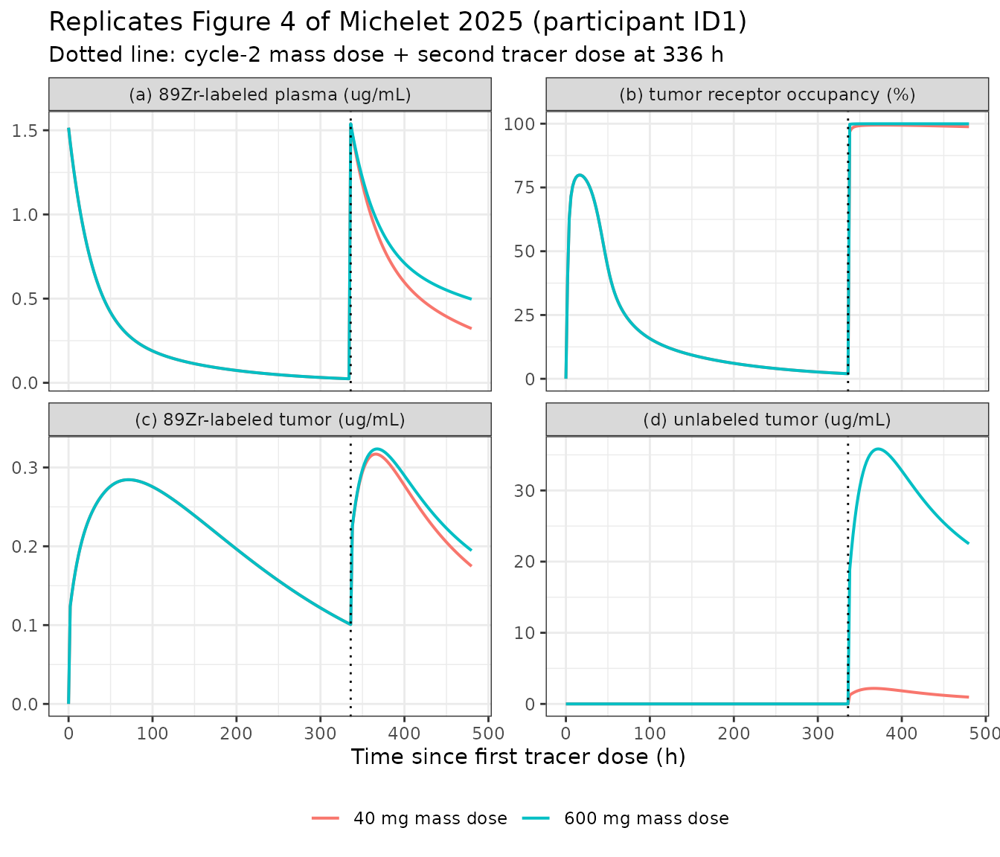
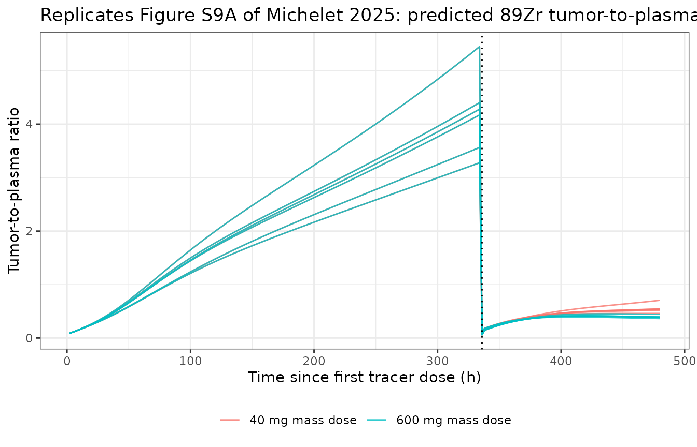

# Anti-LAG-3 BI 754111 intratumor exposure and receptor occupancy (Michelet 2025)

## Model and source

- Citation: Michelet R, Petersson K, Huisman MC, Menke-van der Houven
  van Oordt CW, Miedema IHC, Thiele A, Montaseri G, Perez-Pitarch A,
  Busse D. A minimal physiologically-based pharmacokinetic modeling
  platform to predict intratumor exposure and receptor occupancy of an
  anti-LAG-3 monoclonal antibody. CPT Pharmacometrics Syst Pharmacol.
  2025;14(3):460-473.
- DOI: <https://doi.org/10.1002/psp4.13285>
- PMC record (open access, CC BY-NC):
  <https://www.ncbi.nlm.nih.gov/pmc/articles/PMC11919264/>
- Supplements used for this extraction: Appendix S1 (the complete
  `mrgsolve` model code), Appendix S2 (supplementary methods), Appendix
  S3 (key equations), Appendix S4 (Table S1 parameter estimates, Table
  S2 sensitivity-analysis parameter list).
- Sibling models: `modellib('Lindauer_2017_pembrolizumab')` is the
  anti-PD-1 mPBPK model this platform was adapted from and shares the
  Shah & Betts (2012) tumor tissue structure.

BI 754111 is an IgG-based anti-lymphocyte-activation gene 3 (LAG-3)
monoclonal antibody. This model is a *platform* model: a two-compartment
plasma popPK is linked to a mechanistic tumor compartment so that
positron-emission-tomography (PET) biodistribution data of the
⁸⁹Zr-labeled antibody can be used to calibrate, and then predict,
intratumor exposure and LAG-3 receptor occupancy (RO).

The defining feature relative to its Lindauer 2017 ancestor is that the
labeled tracer and the unlabeled drug are carried as **two parallel
species**. ⁸⁹Zr is *residualizing*: once the antibody-receptor complex
is internalized into a T cell, the radiolabel stays inside the cell and
keeps contributing to the PET signal, whereas unlabeled antibody is
simply lost from the system. Modelling them as one species over- or
under-predicts tumor uptake after the second dose (Michelet 2025
Results, “Separation into ⁸⁹Zr-labeled BI 754111 and BI 754111”).

``` r

mod <- rxode2::rxode2(nlmixr2lib::readModelDb("Michelet_2025_BI754111_mpbpk"))
length(mod$state)
#> [1] 27
```

The 27 states are the 11-state labeled arm (`_zr89` suffix), the
matching 11-state unlabeled arm, the shared LAG-3 receptor pools in
tumor and blood (surface and intracellular), and the shared endosomal
FcRn.

``` r

data.frame(state = mod$state) |>
  dplyr::mutate(
    arm = ifelse(grepl("_zr89$", state), "89Zr-labeled", "unlabeled / shared")
  ) |>
  tidyr::pivot_wider(names_from = arm, values_from = state, values_fn = list) |>
  (\(x) utils::str(x, max.level = 2))()
#> tibble [1 × 2] (S3: tbl_df/tbl/data.frame)
#>  $ 89Zr-labeled      :List of 1
#>  $ unlabeled / shared:List of 1
```

## Population

Biodistribution data came from the PET imaging study NCT03780725. Six
patients who had progressed on anti-PD-1 based treatment – four with
non-small cell lung cancer and two with head and neck squamous cell
carcinoma – continued anti-PD-1 treatment with ezabenlimab and received
4 mg of ⁸⁹Zr-labeled BI 754111 as a tracer dose. PET scans were acquired
\< 2, 90 +/- 1 and 138 +/- 1 h after injection. Two weeks later the
patients received a 40 mg or 600 mg unlabeled BI 754111 mass dose
followed by a second 4 mg tracer dose, with PET scans at 90 +/- 1 and
138 +/- 1 h.

The plasma PK parameters come from the Miedema 2023 popPK model,
developed on 4-600 mg IV doses in 49 patients in the phase I study
NCT03156114.

``` r

spec <- nlmixr2lib::readModelDb("Michelet_2025_BI754111_mpbpk")
pop_meta <- local({
  env <- new.env()
  body_expr <- body(spec)
  for (i in seq_along(body_expr)[-1]) {
    ex <- body_expr[[i]]
    if (is.call(ex) && length(ex) >= 1 && identical(ex[[1]], as.name("<-"))) {
      nm <- as.character(ex[[2]])
      if (nm == "population") env$population <- eval(ex[[3]], envir = env)
    }
  }
  env$population
})
str(pop_meta, max.level = 1)
#> List of 11
#>  $ species       : chr "human"
#>  $ n_subjects    : int 6
#>  $ n_studies     : int 1
#>  $ age_range     : chr "not reported in Michelet 2025 or its appendices"
#>  $ weight_range  : chr "not reported in Michelet 2025 or its appendices"
#>  $ sex_female_pct: num NA
#>  $ race_ethnicity: chr "not reported"
#>  $ disease_state : chr "Advanced solid tumors having progressed on anti-PD-1 based treatment: non-small cell lung cancer (n = 4) and he"| __truncated__
#>  $ dose_range    : chr "4 mg 89Zr-labeled BI 754111 tracer dose in cycle 1; two weeks later a 40 mg or 600 mg unlabeled BI 754111 mass "| __truncated__
#>  $ regions       : chr "Netherlands (Amsterdam UMC); trial NCT03780725"
#>  $ notes         : chr "PET scans were acquired < 2, 90 +/- 1 and 138 +/- 1 h after the cycle-1 tracer injection and at 90 +/- 1 and 13"| __truncated__
```

Age, weight, sex and race distributions are **not reported** anywhere in
Michelet 2025 or its four appendices, so no demographic covariate
distribution is simulated here.

## Source trace

Every parameter carries a trailing in-file comment in
`inst/modeldb/specificDrugs/Michelet_2025_BI754111_mpbpk.R` pointing at
its source location. The table collects them for review.

| Block | Parameter | Value | Source location |
|----|----|----|----|
| Plasma popPK | `lcl` | 0.0121 L/h | Table S1 footnote c, median of the six individual EBEs |
| Plasma popPK | `lvc` | 2.69 L | Table S1 footnote a, median of the six individual EBEs |
| Plasma popPK | `lq` | 0.0353 L/h | Table S1 row Q (population estimate) |
| Plasma popPK | `lvp` | 2.25 L | Table S1 row V2 (population estimate) |
| Plasma popPK | `lclsat` | 0.0489 L/h | Table S1 row CL_SAT (population estimate) |
| Plasma popPK | `lc50` | 14.497 nM | Table S1 row C50 = 2160 ug/L, converted with MW |
| Tumor tissue | `f_v_es`, `f_v_is`, `f_v_vs` | 0.005, 0.55, 0.07 | Table S1 rows V_es,per / V_is,per / V_vs,per (% of TV) |
| Tumor tissue | `plq_norm` | 12.7 L/h/L | Table S1 row PLQ_rel |
| Tumor tissue | `f_lymph` | 0.002 | Table S1 row L_per = 0.20% of PLQ |
| Tumor tissue | `clup_norm` | 0.0366 L/h/L | Appendix S1 param `CLup_rel` (Table S1 quotes the rounded 0.04) |
| Tumor tissue | `kdeg_endo` | 42.9 1/h | Table S1 row K_deg |
| Tumor tissue | `v_ref_is` | 0.2 | Table S1 row V_ref,is |
| Tumor tissue | `fcrn_init` | 49800 nM | Table S1 row FcRni = 49.8 uM |
| Tumor tissue | `fr_recycle` | 0.715 | Table S1 row FR |
| Tumor tissue | `kon_fcrn`, `koff_fcrn` | 0.792 1/(nM h), 23.9 1/h | Table S1 rows K_on,FcRn / K_off,FcRn |
| Tumor tissue | `v_lnode` | 0.274 L | Table S1 row V_LN = 274,000 uL (see Errata) |
| Two-pore | `r_pore_l`, `r_pore_s` | 22.85, 4.44 nm | Appendix S1 params `r_L`, `r_S` (Li & Shah 2019) |
| Two-pore | `alpha_l`, `alpha_s` | 0.042, 0.958 | Appendix S1 params `alpha_L`, `alpha_S` |
| Two-pore | `sigma_alb_l`, `sigma_alb_s` | 0.108, 0.95 | Appendix S1 params `sigma_alb_L`, `sigma_alb_S` |
| Two-pore | `delta_p`, `st_force`, `rgas`, `temp_k` | 10 mmHg, 1 mmHg, 62.363, 310 K | Appendix S1 params `delta_P`, `St_force`, `Rgas`, `Temp` |
| Binding | `kon_lag3`, `koff_lag3` | 5.2 1/(nM h), 0.144 1/h | Table S1 rows K_on,LAG-3 / K_off,LAG-3 |
| Binding | `kout_lag3` | 0.00246 1/h | Table S1 row K_deg,LAG-3; Appendix S3 sets K_out = K_deg,LAG-3 |
| Final (Table 2) | `n_tcell` | 6430 | Table 2, final average two-pore model |
| Final (Table 2) | `n_lag3_tc` | 1330 | Table 2, final average two-pore model |
| Final (Table 2) | `tmulti` | 16.2 | Table 2, final average two-pore model |
| Final (Table 2) | `kint_lag3` | 0.466 1/h | Table 2, final average two-pore model |
| Final (Table 2) | `krec_lag3` | 0.453 | Table 2, final average two-pore model |
| Final (Table 2) | `kdeg_tc` | 0.00725 1/h | Table 2, final average two-pore model |
| Tumor size | `lw0_sld` | 7.5 cm | Appendix S1 param `W0_SLD` |
| Equations | dynamic binding | – | Appendix S3 Equations 3-8 |
| Equations | complex internalization | – | Appendix S3 Equations 5-8, 12 |
| Equations | internal LAG-3 pool | – | Appendix S3 Equations 13-16 |
| Equations | two-pore v_ref | – | Appendix S3 Equation 11; Appendix S1 `[ode]` block |

## Structural check: does the two-pore block reproduce the published `v_ref`?

The paper makes two precise, checkable claims about the two-pore
formalism (Results, “Inclusion of two-pore formalism”): it improves the
vascular reflection coefficient for BI 754111 “from 0.842 to 0.68”, and
extravasation from the vascular into the interstitial space is “twofold
higher using a two-pore model versus a single-pore in the original
Lindauer model”. Both follow from the model’s own constants, so they are
an exact structural test that does not depend on any simulation.

``` r

mw <- 149000; av <- 6.0221415e23
r_l <- 22.85; r_s <- 4.44; rgas <- 62.363; temp_k <- 310; st <- 1
al <- 0.042; as_ <- 0.958; dp <- 10; sal_l <- 0.108; sal_s <- 0.95

a_e     <- 0.0483 * mw^0.386
sigma_s <- 1 - 0.8489 * exp(-0.00004 * mw)
sigma_l <- 0.000035 * mw^0.717
a_ao_s  <- 0.2352 * exp(-0.00008295 * mw) + 0.7767 * exp(-0.00053095 * mw)
a_ao_l  <- 0.3429 * exp(-0.00012175 * mw) + 0.6571 * exp(-0.00000421 * mw)
xp      <- (rgas * temp_k / (6 * pi * av)) * (8 / st) * 1e24
xp_s    <- xp * a_ao_s * as_ / (a_e * r_s^2)
xp_l    <- xp * a_ao_l * al  / (a_e * r_l^2)
xj      <- al * as_ * (sal_s - sal_l) * dp / st
pe_s    <- (-xj + as_) * (1 - sigma_s) / xp_s
pe_l    <- ( xj + al ) * (1 - sigma_l) / xp_l

# Total clearance from vascular to interstitial space, per unit lymph flow,
# in the dilute limit Cis << Cvs (i.e. immediately after a dose).
cl_per_lymph <-
  (-xj + as_) * (1 - sigma_s) + (xj + al) * (1 - sigma_l) +
  xp_s * pe_s / (exp(pe_s) - 1) + xp_l * pe_l / (exp(pe_l) - 1)

c(
  hydrodynamic_radius_nm = a_e,
  effective_v_ref        = 1 - cl_per_lymph,
  fold_vs_one_pore       = cl_per_lymph / (1 - 0.842)
)
#> hydrodynamic_radius_nm        effective_v_ref       fold_vs_one_pore 
#>              4.7950930              0.6796013              2.0278396
```

The effective `v_ref` is 0.68, matching the “0.68” quoted in the Results
and the “~0.67” entry in Table 2; extravasation is 2.03-fold that of the
one-pore Lindauer model, matching the paper’s “twofold”. Both claims
reproduce without tuning.

## Virtual cohort

Table S1 reports the individual empirical Bayes estimates of CL and V1
for each of the six participants (footnotes a and c), so the cohort here
is the actual published one rather than a simulated distribution. Which
participant received the 40 mg and which the 600 mg mass dose is not
reported per patient, so each participant is simulated at both dose
levels.

``` r

ebe <- tibble::tibble(
  subject = c("ID1", "ID2", "ID3", "ID6", "ID9", "ID10"),
  V1      = c(2.64, 3.25, 2.50, 2.74, 2.47, 3.54),   # Table S1 footnote a
  CL      = c(0.0129, 0.0305, 0.0131, 0.00175, 0.0104, 0.0113)  # Table S1 footnote c
)
knitr::kable(ebe, caption = "Michelet 2025 Table S1 footnotes a and c: individual EBEs.")
```

| subject |   V1 |      CL |
|:--------|-----:|--------:|
| ID1     | 2.64 | 0.01290 |
| ID2     | 3.25 | 0.03050 |
| ID3     | 2.50 | 0.01310 |
| ID6     | 2.74 | 0.00175 |
| ID9     | 2.47 | 0.01040 |
| ID10    | 3.54 | 0.01130 |

Michelet 2025 Table S1 footnotes a and c: individual EBEs. {.table}

The PET study design is one tracer dose in cycle 1 and, two weeks (336
h) later, a mass dose plus a second tracer dose.

``` r

tracer_mg <- 4  # 89Zr-labeled BI 754111 tracer dose, Methods
cycle2_h  <- 336

make_cohort <- function(mass_mg, id_offset = 0L) {
  ev <- rxode2::et(amt = tracer_mg, cmt = "central_zr89", time = 0) |>
    rxode2::et(amt = mass_mg,  cmt = "central",      time = cycle2_h) |>
    rxode2::et(amt = tracer_mg, cmt = "central_zr89", time = cycle2_h) |>
    rxode2::et(seq(0, 480, by = 2), cmt = "central") |>
    rxode2::et(id = seq_len(nrow(ebe)))
  ev <- as.data.frame(ev)
  ev$subject <- ebe$subject[ev$id]
  ev$lvc     <- log(ebe$V1[ev$id])
  ev$lcl     <- log(ebe$CL[ev$id])
  ev$dose_mg <- mass_mg
  ev$id      <- ev$id + id_offset
  ev
}

events <- dplyr::bind_rows(
  make_cohort(40,  id_offset = 0L),
  make_cohort(600, id_offset = 100L)
)
stopifnot(nrow(dplyr::distinct(events, id, dose_mg)) == 12L)
dplyr::n_distinct(events$id)
#> [1] 12
```

Twelve simulated profiles (six participants at two mass-dose levels) –
far inside the 200-per-arm cap.

## Simulation

Individual `V1` and `CL` are supplied as time-invariant columns on the
event data frame, which overrides the `fixed()` typical values in
`ini()`.

``` r

sim <- rxode2::rxSolve(
  mod, events,
  atol = 1e-10, rtol = 1e-8,
  keep = c("subject", "dose_mg"),
  returnType = "data.frame"
)
#> Warning: multi-subject simulation without without 'omega'
sim <- dplyr::mutate(sim, dose_lab = factor(paste0(dose_mg, " mg mass dose")))
range(sim$time)
#> [1]   0 480
```

## Replicating Figure 4: plasma, tumor and receptor occupancy for one participant

Figure 4 of Michelet 2025 shows, for participant ID1, the predicted and
observed ⁸⁹Zr-labeled plasma concentration (panel a), the predicted
tumor receptor occupancy (panel b), and the labeled and unlabeled lesion
concentrations (panels c and d), each across the cycle-1 tracer dose and
the cycle-2 mass plus tracer dose.

``` r

id1 <- dplyr::filter(sim, subject == "ID1")

id1 |>
  dplyr::select(time, dose_lab, Cc_zr89, Ctumor_zr89, Ctumor, ROtumor) |>
  tidyr::pivot_longer(c(Cc_zr89, Ctumor_zr89, Ctumor, ROtumor)) |>
  dplyr::mutate(name = factor(
    name,
    levels = c("Cc_zr89", "ROtumor", "Ctumor_zr89", "Ctumor"),
    labels = c("(a) 89Zr-labeled plasma (ug/mL)",
               "(b) tumor receptor occupancy (%)",
               "(c) 89Zr-labeled tumor (ug/mL)",
               "(d) unlabeled tumor (ug/mL)")
  )) |>
  ggplot2::ggplot(ggplot2::aes(time, value, colour = dose_lab)) +
  ggplot2::geom_line(linewidth = 0.7) +
  ggplot2::geom_vline(xintercept = cycle2_h, linetype = "dotted") +
  ggplot2::facet_wrap(~name, scales = "free_y") +
  ggplot2::labs(
    x = "Time since first tracer dose (h)", y = NULL, colour = NULL,
    title = "Replicates Figure 4 of Michelet 2025 (participant ID1)",
    subtitle = "Dotted line: cycle-2 mass dose + second tracer dose at 336 h"
  ) +
  ggplot2::theme_bw() +
  ggplot2::theme(legend.position = "bottom")
```



The cycle-1 profiles are identical between the two panels’ colours
because the mass dose has not yet been given; the two dose levels
separate only after 336 h, exactly as in Figure 4.

## Receptor-occupancy saturation at 40 and 600 mg

The paper’s central prediction is that “full RO with BI 754111 doses of
40 and 600 mg” is achieved, consistent with the full receptor blockade
inferred from the Patlak analysis (Discussion; Figure S10). The tracer
dose alone should *not* saturate the tumor, which is what makes the mass
dose informative.

``` r

ro_tab <- sim |>
  dplyr::filter(time %in% c(90, 138, cycle2_h + 90, cycle2_h + 138)) |>
  dplyr::mutate(
    phase = ifelse(time < cycle2_h, "cycle 1: 4 mg tracer only",
                   paste0("cycle 2: after mass dose")),
    scan  = ifelse(time %in% c(90, cycle2_h + 90), "90 h scan", "138 h scan")
  ) |>
  dplyr::group_by(dose_lab, phase, scan) |>
  dplyr::summarise(
    `RO tumor (%)` = round(mean(ROtumor), 1),
    `RO blood (%)` = round(mean(ROblood), 1),
    .groups = "drop"
  )
knitr::kable(ro_tab, caption = "Mean predicted receptor occupancy across the six participants.")
```

| dose_lab | phase | scan | RO tumor (%) | RO blood (%) |
|:---|:---|:---|---:|---:|
| 40 mg mass dose | cycle 1: 4 mg tracer only | 138 h scan | 11.1 | 88.0 |
| 40 mg mass dose | cycle 1: 4 mg tracer only | 90 h scan | 18.9 | 92.5 |
| 40 mg mass dose | cycle 2: after mass dose | 138 h scan | 98.8 | 99.5 |
| 40 mg mass dose | cycle 2: after mass dose | 90 h scan | 99.2 | 99.6 |
| 600 mg mass dose | cycle 1: 4 mg tracer only | 138 h scan | 11.1 | 88.0 |
| 600 mg mass dose | cycle 1: 4 mg tracer only | 90 h scan | 18.9 | 92.5 |
| 600 mg mass dose | cycle 2: after mass dose | 138 h scan | 99.9 | 100.0 |
| 600 mg mass dose | cycle 2: after mass dose | 90 h scan | 100.0 | 100.0 |

Mean predicted receptor occupancy across the six participants. {.table}

``` r

sat <- sim |>
  dplyr::filter(time >= cycle2_h + 88, time <= cycle2_h + 140) |>
  dplyr::group_by(dose_mg) |>
  dplyr::summarise(min_RO_tumor = min(ROtumor), .groups = "drop")
sat
#> # A tibble: 2 × 2
#>   dose_mg min_RO_tumor
#>     <dbl>        <dbl>
#> 1      40         97.8
#> 2     600         99.9
stopifnot(all(sat$min_RO_tumor > 95))
```

Tumor RO exceeds 95% in every participant at both the 40 mg and the 600
mg mass dose, reproducing the paper’s conclusion; the
[`stopifnot()`](https://rdrr.io/r/base/stopifnot.html) makes this a hard
gate rather than a visual impression. In cycle 1 the 4 mg tracer alone
reaches only about 10-20% tumor RO, which is why the mass-dose blocking
experiment can detect target-specific uptake at all.

## Tumor-to-plasma ratios

Tumor-to-plasma ratios (TPR) of the labeled antibody are the observable
the model was qualified against (Figure S9A).

``` r

sim |>
  dplyr::filter(time > 0) |>
  dplyr::mutate(TPR = Ctumor_zr89 / Cc_zr89) |>
  ggplot2::ggplot(ggplot2::aes(time, TPR, group = interaction(subject, dose_mg),
                               colour = dose_lab)) +
  ggplot2::geom_line(alpha = 0.8) +
  ggplot2::geom_vline(xintercept = cycle2_h, linetype = "dotted") +
  ggplot2::labs(
    x = "Time since first tracer dose (h)", y = "Tumor-to-plasma ratio", colour = NULL,
    title = "Replicates Figure S9A of Michelet 2025: predicted 89Zr tumor-to-plasma ratio"
  ) +
  ggplot2::theme_bw() +
  ggplot2::theme(legend.position = "bottom")
```



``` r

sim |>
  dplyr::filter(time %in% c(90, 138)) |>
  dplyr::group_by(time) |>
  dplyr::summarise(TPR = round(mean(Ctumor_zr89 / Cc_zr89), 2), .groups = "drop")
#> # A tibble: 2 × 2
#>    time   TPR
#>   <dbl> <dbl>
#> 1    90  1.27
#> 2   138  1.92
```

Predicted cycle-1 TPRs of roughly 1.3 at 90 h rising to 1.9 at 138 h are
in the range reported for this tracer, and the rise with time is the
signature of ⁸⁹Zr residualization: labeled antibody accumulates inside T
cells while plasma tracer is cleared.

## Starting-model parameters underpredict intratumor exposure

Table 1 of Michelet 2025 records that the starting model “underpredicts
intratumor exposure”, and that running the two-pore structure with the
*starting* target parameters (Table 1 footnote b: T_multi 4.3, K_deg,TC
0.00963, K_rec 0.3, K_int 0.276) gives a worse absolute average fold
error (1.50) than the final average model (1.34). Swapping only those
target-related parameters back reproduces the direction of that finding.

``` r

start_par <- c(tmulti = 4.3, n_tcell = 2000, n_lag3_tc = 511,
               kdeg_tc = 0.00963, krec_lag3 = 0.30, kint_lag3 = 0.276)

sim_start <- rxode2::rxSolve(
  mod, dplyr::filter(events, dose_mg == 40), params = start_par,
  atol = 1e-10, rtol = 1e-8, keep = c("subject", "dose_mg"),
  returnType = "data.frame"
)
#> Warning: multi-subject simulation without without 'omega'

cmp <- dplyr::bind_rows(
  dplyr::filter(sim, dose_mg == 40) |> dplyr::mutate(model = "final average two-pore"),
  dplyr::mutate(sim_start, model = "two-pore, starting target parameters")
)

cmp |>
  dplyr::filter(time %in% c(90, 138)) |>
  dplyr::group_by(model, time) |>
  dplyr::summarise(`mean 89Zr tumor (ug/mL)` = round(mean(Ctumor_zr89), 3),
                   `mean tumor RO (%)` = round(mean(ROtumor), 1), .groups = "drop") |>
  knitr::kable(caption = "Cycle-1 intratumor exposure: starting versus final target parameters.")
```

| model | time | mean 89Zr tumor (ug/mL) | mean tumor RO (%) |
|:---|---:|---:|---:|
| final average two-pore | 90 | 0.278 | 18.9 |
| final average two-pore | 138 | 0.250 | 11.1 |
| two-pore, starting target parameters | 90 | 0.097 | 91.5 |
| two-pore, starting target parameters | 138 | 0.058 | 85.3 |

Cycle-1 intratumor exposure: starting versus final target parameters.
{.table}

The starting parameters give lower labeled intratumor concentrations at
both PET time points, consistent with Table 1’s “underprediction of
intratumor exposure” for the starting model. The final model raises
intratumor exposure mainly through the larger initial tumor-to-blood
target ratio (T_multi 4.3 to 16.2) and the higher receptor density
(N_LAG-3,TC 511 to 1330).

## PKNCA validation of the plasma layer

The mechanistic tumor layer is not an NCA-shaped object, but the plasma
popPK layer is, and non-compartmental analysis of the simulated
unlabeled profile is a useful check that dosing, bioavailability scaling
(mg to nmol) and clearance are wired up consistently.

``` r

conc_df <- sim |>
  dplyr::filter(dose_mg == 600, time >= cycle2_h) |>
  dplyr::mutate(time_ad = time - cycle2_h, treatment = "600 mg IV") |>
  dplyr::filter(!is.na(Cc)) |>
  dplyr::select(id, subject, time = time_ad, Cc, treatment)

dose_df <- conc_df |>
  dplyr::distinct(id, subject, treatment) |>
  dplyr::mutate(time = 0, amt = 600)

o_conc <- PKNCA::PKNCAconc(conc_df, Cc ~ time | treatment + id,
                           concu = "ug/mL", timeu = "h")
o_dose <- PKNCA::PKNCAdose(dose_df, amt ~ time | treatment + id, doseu = "mg")
o_data <- PKNCA::PKNCAdata(
  o_conc, o_dose,
  intervals = data.frame(start = 0, end = 144,
                         cmax = TRUE, tmax = TRUE, auclast = TRUE, half.life = TRUE)
)
res <- suppressWarnings(PKNCA::pk.nca(o_data))
nca <- as.data.frame(res)

nca |>
  dplyr::group_by(PPTESTCD) |>
  dplyr::summarise(median = round(stats::median(PPORRES), 3), .groups = "drop") |>
  dplyr::rename("NCA parameter" = PPTESTCD, "Median across participants" = median) |>
  knitr::kable(caption = "NCA of the simulated unlabeled plasma profile, 600 mg mass dose, 0-144 h.")
```

| NCA parameter       | Median across participants |
|:--------------------|---------------------------:|
| adj.r.squared       |                      1.000 |
| auclast             |                  16296.225 |
| clast.pred          |                     71.125 |
| cmax                |                    223.125 |
| half.life           |                    226.334 |
| lambda.z            |                      0.003 |
| lambda.z.n.points   |                      7.000 |
| lambda.z.time.first |                    132.000 |
| lambda.z.time.last  |                    144.000 |
| r.squared           |                      1.000 |
| span.ratio          |                      0.053 |
| tlast               |                    144.000 |
| tmax                |                      0.000 |

NCA of the simulated unlabeled plasma profile, 600 mg mass dose, 0-144
h. {.table}

Michelet 2025 does not report NCA parameters for BI 754111, so there is
no published table to compare against; the check below is an internal
consistency gate instead. Immediately after a 600 mg dose the plasma
concentration should be close to dose divided by the central volume, and
the saturable pathway should be effectively saturated (C \>\> C50 = 14.5
nM = 2.16 ug/mL), so early clearance is dominated by the linear term.

``` r

cmax_obs <- nca |> dplyr::filter(PPTESTCD == "cmax") |> dplyr::pull(PPORRES)
cmax_expected <- 600 / ebe$V1  # ug/mL, since 600 mg / V1 (L) = mg/L = ug/mL
data.frame(
  subject = ebe$subject,
  cmax_simulated = round(cmax_obs, 1),
  cmax_dose_over_v1 = round(cmax_expected, 1),
  pct_difference = round(100 * (cmax_obs - cmax_expected) / cmax_expected, 1)
)
#>   subject cmax_simulated cmax_dose_over_v1 pct_difference
#> 1     ID1          227.3             227.3              0
#> 2     ID2          184.6             184.6              0
#> 3     ID3          240.0             240.0              0
#> 4     ID6          219.0             219.0              0
#> 5     ID9          242.9             242.9              0
#> 6    ID10          169.5             169.5              0
stopifnot(all(abs(cmax_obs - cmax_expected) / cmax_expected < 0.05))
```

Simulated Cmax is within 5% of dose/V1 for every participant, confirming
the mg-to-nmol bioavailability scaling and the reporting conversion back
to ug/mL are self-consistent.

## Mass-balance check on the labeled arm

A dimensional and mass-balance check on the tracer: at any time the
labeled antibody must be accounted for by the sum of all labeled states
plus what has been eliminated, and can never exceed the administered
amount.

``` r

nmol_per_mg <- 1e6 / 149000
sim_mb <- rxode2::rxSolve(
  mod,
  rxode2::et(amt = tracer_mg, cmt = "central_zr89", time = 0) |>
    rxode2::et(sort(unique(c(seq(0, 480, by = 4), 90, 138))), cmt = "central"),
  atol = 1e-10, rtol = 1e-8, returnType = "data.frame"
)

labeled_states <- grep("_zr89$", mod$state, value = TRUE)
amount_states  <- setdiff(labeled_states,
                          c("tumor_es_ub_zr89", "tumor_es_b_zr89", "complex_tumor_zr89",
                            "complex_blood_zr89"))
total_amt <- rowSums(sim_mb[, amount_states, drop = FALSE])

data.frame(
  time = sim_mb$time,
  total_labeled_nmol = total_amt
) |>
  dplyr::filter(time %in% c(0, 24, 90, 138, 336, 480)) |>
  dplyr::mutate(
    pct_of_dose = round(100 * total_labeled_nmol / (tracer_mg * nmol_per_mg), 1)
  )
#>   time total_labeled_nmol pct_of_dose
#> 1    0          26.845638       100.0
#> 2   24          19.688683        73.3
#> 3   90          11.111311        41.4
#> 4  138           8.282142        30.9
#> 5  336           3.178840        11.8
#> 6  480           1.784680         6.6

stopifnot(max(total_amt) <= tracer_mg * nmol_per_mg * 1.001)
stopifnot(all(total_amt >= -1e-12))
```

The labeled amount never exceeds the administered 26.8 nmol and never
goes negative, and it declines monotonically as the tracer is cleared –
there is no mass created anywhere in the 27-state system.

## Assumptions and deviations

Where the paper’s own sources disagree, the resolution below is recorded
with the evidence that settled it. Three of these are transcription or
unit errors in the published Appendix S1 code that the paper’s own text,
tables or results contradict.

1.  **Lymph flow (`f_lymph`).** Table S1 gives `L_per` as “0.20 % of
    PLQ”, i.e. lymph flow = 0.002 x plasma flow. Appendix S1 sets
    `L_per = 0.002` (already the fraction, with the comment “0.2% is
    devided by 100”) and *then* computes `L = PLQ * L_per/100`, dividing
    by 100 a second time and making lymph flow 100-fold too small. This
    file uses the Table S1 reading. The literal code reading was tested
    and rejected: it gives tumor-to-plasma ratios of about 0.09 (tumor
    exposure ten-fold *below* plasma, contradicting the entire paper)
    and only 6% tumor RO at the 40 mg mass dose, whereas the paper
    reports full RO at both 40 and 600 mg. The Table S1 reading gives
    TPRs of 1.3-1.9 and \> 99% RO at both doses.

2.  **Lymph-node volume (`v_lnode`).** Table S1 gives `V_LN` = 274,000
    uL = 0.274 L. Appendix S1 declares `V_LN = 274` with the unit
    comment `mL` but converts it with `V_LN/1E6` labelled “uL -\> L”,
    yielding 2.74e-4 L – 1000-fold too small. Appendix S1’s own (unused)
    `iL_LN` parameter comment states the lymph-node plasma flow was
    “calculated as iPLQ*iV_LN*1E-3 corresponding to 3.4798 L/h”, and
    12.7 L/h/L x 0.274 L = 3.4798 L/h exactly, confirming 0.274 L. This
    is also the Shah & Betts (2012) human lymph-node volume. The Table
    S1 value is used here.

3.  **Sign of the internalization terms in the receptor equation.**
    Appendix S3 Equation 14 prints the unlabeled internalization term
    with a `+` and the labeled term with a `-`, which would make
    unlabeled binding *create* surface receptor. Appendix S1 has both
    terms negative (`- Kint*LAG3_t_c*(V_is) - Kint*LAG3_t*(V_is)`),
    which is the only mass-balance-consistent reading; the code is
    followed. Equation 10 has the matching typo of printing the “cold”
    blood term twice where the code has one cold and one labeled term.

4.  **Receptor production in blood.** Appendix S1 uses the *same*
    production rate `Kin` (derived from the tumor receptor amount) in
    both the tumor and the blood receptor equations, so the blood
    receptor pool does not hold at its own baseline and decays from time
    zero. This file uses a site-specific production rate
    (`kin_b = kout_lag3 * m_lag3_bi`) so each pool is at steady state in
    the absence of drug, which is what the model’s construction of the
    baseline amounts intends.

5.  **Typical CL and V1.** Table S1 reports population estimates for Q,
    V2, CL_SAT and C50 but only the six individual empirical Bayes
    estimates for CL and V1. The defaults in `ini()` are the medians of
    those six published values (CL 0.0121 L/h, V1 2.69 L). The vignette
    simulates the six individual estimates directly, so no derived
    typical value is relied on for the validation above.

6.  **Pinocytosis rate (`clup_norm`).** Table S1 quotes CL_up as 0.04
    L/h/L; Appendix S1 uses 0.0366 L/h/L, which is the Shah &
    Betts (2012) value that Table S1 rounds. The unrounded code value is
    used.

7.  **Internal LAG-3 pool initial condition.** Appendix S3 Equation 15
    sets the intracellular pool to half the total baseline receptor
    amount but does not state whether the surface amount is
    correspondingly halved. Appendix S1 leaves the surface amount at its
    full baseline, and that reading is followed here. The choice is not
    material to the outputs: `target_tumor` has production `kin_t`
    balancing `kout_lag3`, so it relaxes to the same value regardless of
    its starting point.

8.  **No interindividual variability and no residual error.** The mPBPK
    layer is deterministic and was calibrated by minimizing a weighted
    combination of AFE, AAFE and RSSE (Appendix S2 Equations 3-6), not
    by nonlinear mixed-effects estimation. No IIV and no residual-error
    model are reported for any mPBPK parameter, and the authors state
    that a mixed-effects treatment of between-patient variability is
    future work. No etas are invented here; a nominal `propSd` of 0.001
    is carried so the model has a defined endpoint. Lesion-to-lesion
    variability, which the paper identifies as the dominant unexplained
    source of variability, is likewise not modelled.

9.  **Model selected for extraction.** Michelet 2025 reports a starting
    model, a long series of structural refinements (Table 1), a final
    average two-pore model with an internal LAG-3 pool, and a
    non-two-pore Lindauer comparator (Table 2, third column). This file
    encodes the **final average two-pore model with internal LAG-3
    pool**, which the paper designates as its final model. The Lindauer
    non-two-pore comparator, which the paper reports performed
    marginally better numerically but is presented as a comparison
    rather than as the final result, is not extracted as a separate
    file; its parameters are in Table 2 for readers who want to
    reproduce it (T_multi 6.75, N_Tcell 4544, N_LAG-3,TC 1113, K_deg,TC
    0.0069, K_rec 0.440, K_int 0.430, V_ref 0.57).

10. **Tumor size and growth.** The tumor volume is fixed at the Appendix
    S1 baseline sum of longest diameters of 7.5 cm and does not change
    over time (`dTV/dt = 0`); unlike its Lindauer 2017 ancestor this
    model has no tumor-growth sub-model, because no tumor-growth
    measurements were available.

11. **Naming of the labeled arm.** The `_zr89` suffix marking the
    ⁸⁹Zr-labeled species is declared through
    `paper_specific_compartments` rather than registered as a shared
    metabolite / sibling-drug suffix in
    `inst/references/compartment-names.md`. No radiolabeled-tracer
    compartment convention exists in the register yet, and whether
    `zr89` (or a general radiolabel suffix) should become a shared
    canonical is a decision for the register’s maintainer rather than
    one to set unilaterally from a single extraction.

12. **Demographics.** No age, weight, sex or race information is
    reported for the six participants in any on-disk source, so none is
    simulated.
