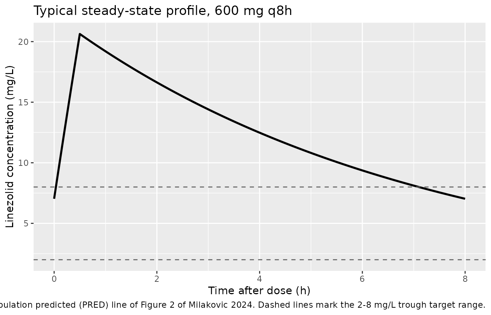
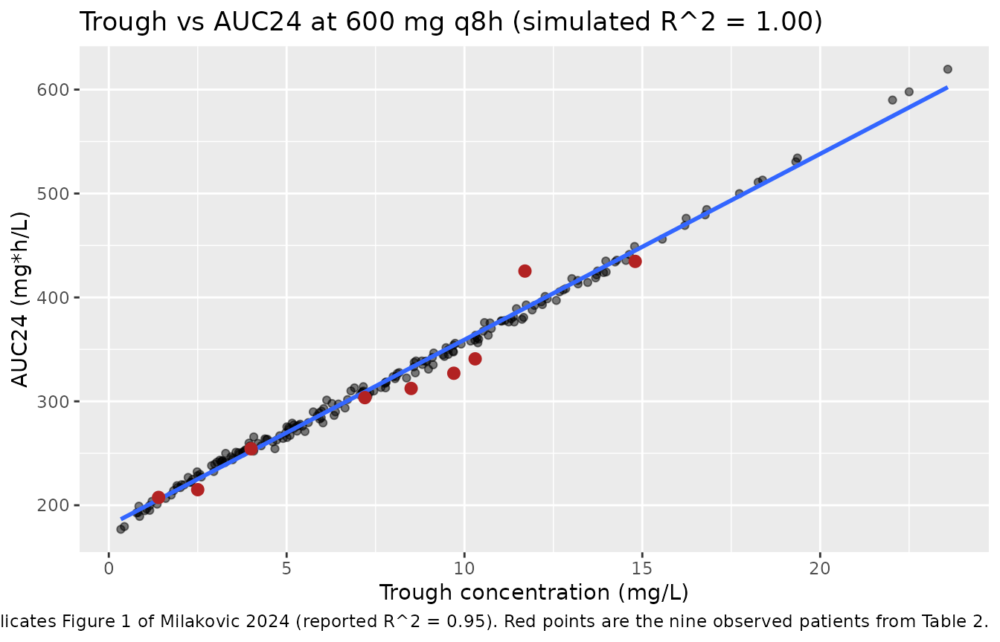
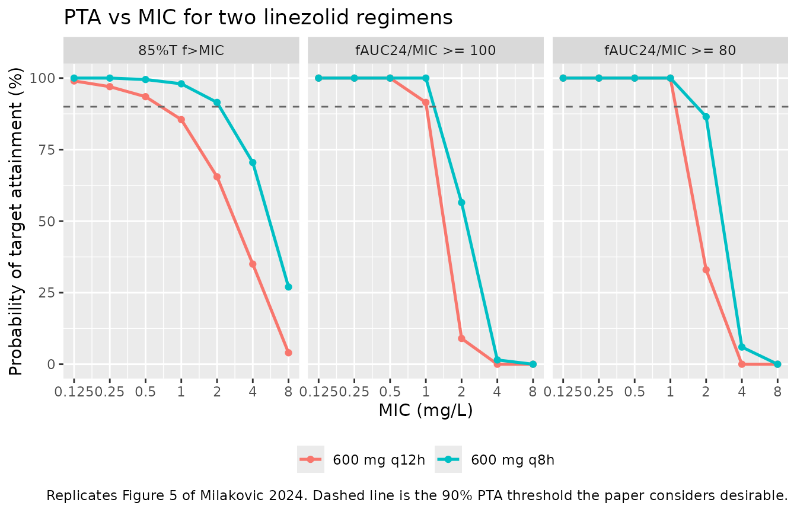

# Linezolid (Milakovic 2024)

## Model and source

- Citation: Milakovic D, Kovacevic T, Kovacevic P, Barisic V, Avram S,
  Dragic S, Zlojutro B, Momcicevic D, Miljkovic B, Vucicevic K. (2024).
  Population Pharmacokinetic Model of Linezolid and Probability of
  Target Attainment in Patients with COVID-19-Associated Acute
  Respiratory Distress Syndrome on Veno-Venous Extracorporeal Membrane
  Oxygenation-A Step toward Correct Dosing. Pharmaceutics 16(2):253.
  <doi:10.3390/pharmaceutics16020253>
- Description: One-compartment population PK model with first-order
  elimination for intravenous linezolid in nine critically ill adults
  with COVID-19-associated acute respiratory distress syndrome (CARDS)
  supported by veno-venous extracorporeal membrane oxygenation (vv
  ECMO), who received a higher-than-standard 600 mg dose as a 30-min
  infusion every 8 h. Between-subject variability is exponential on both
  clearance and volume of distribution, estimated as a correlated 2x2
  block with a strong negative CL-Vd covariance; residual variability is
  proportional. No covariate was retained: the automated covariate
  search found none significant, which the authors attribute to the
  small, deliberately homogeneous sample. The model was used for Monte
  Carlo probability of target attainment (PTA) and cumulative fraction
  of response (CFR) analyses comparing 600 mg every 8 h against the
  standard 600 mg every 12 h.
- Article: [Pharmaceutics
  2024;16(2):253](https://doi.org/10.3390/pharmaceutics16020253)

## Population

Milakovic 2024 is a prospective, observational, single-centre
pharmacokinetic study run between 1 January and 31 December 2021 in the
28-bed Medical Intensive Care Unit of the University Clinical Centre of
the Republic of Srpska, Banja Luka, Bosnia and Herzegovina. Adults with
COVID-19-associated acute respiratory distress syndrome (CARDS)
supported by veno-venous extracorporeal membrane oxygenation (vv ECMO)
and receiving linezolid during extracorporeal life support were
eligible. Patients under 18 years, pregnant patients, patients allergic
to linezolid, and patients who had undergone therapeutic plasma exchange
within 24 h or renal replacement therapy were excluded.

Eleven patients were sampled. Two were excluded from the population PK
analysis – one on continuous veno-venous haemodialysis combined with a
CytoSorb device and one who received a blood transfusion during the
sampling window – leaving **9 patients contributing 53 steady-state
serum concentrations**. Per Table 1, the median age was 40 years (range
30-62), 5 of 9 (55.6%) were male, and the median BMI was 27.7 kg/m^2
(range 23.5-39.2). Body weight was collected but is not tabulated; BMI
is the only body-size descriptor the paper reports. All 9 patients had a
P/F ratio below 100 and a median Murray lung-injury score of 3; the
median SOFA score on the PK sampling day was 10 (range 7-20). Median
plasma creatinine on the sampling day was 55 umol/L (range 34-201) and
median albumin was 38 g/L (range 30-46) – the Discussion emphasises
that, unlike a published ECMO case report with a very low linezolid
trough, none of these patients was hypoalbuminaemic.

Dosing was **600 mg linezolid intravenously as a 30-min infusion every 8
h**, a higher-than-standard regimen adopted by the local ICU ECMO
protocol. Sampling was rich – pre-dose and 30, 60, 120, 240 and 360 min
after the start of infusion – and began only after at least six doses,
so all data are at steady state. Linezolid was assayed by homogeneous
enzyme immunoassay (ARK Linezolid Assay on a Beckman Coulter DxC 700 AU)
over a 0.75-30 mg/L measuring range.

The same information is available programmatically via the model’s
`population` metadata
(`readModelDb("Milakovic_2024_linezolid")()$population`).

## Source trace

The per-parameter origin is recorded as an in-file comment next to each
`ini()` entry in
`inst/modeldb/specificDrugs/Milakovic_2024_linezolid.R`. The table below
collects them in one place for review.

| Equation / parameter | Value | Source location |
|----|----|----|
| `lvc` (volume of distribution) | `log(41.1)` L | Table 3, “Volume of distribution (L)” = 41.1 (bootstrap 95% CI 30.57-51.77) |
| `lcl` (clearance) | `log(5.9)` L/h | Table 3, “Clearance (L/h)” = 5.9 (bootstrap 95% CI 4.98-7.10) |
| `etalvc` variance | `0.363^2` = 0.131769 | Table 3, “Interindividual variability in volume of distribution (%)” = 36.3 (bootstrap 95% CI 16.11-44.96) |
| `etalcl` variance | `0.248^2` = 0.061504 | Table 3, “Interindividual variability in clearance (%)” = 24.8 (bootstrap 95% CI 13.03-31.25) |
| `etalvc`-`etalcl` covariance | `0.99 * -0.0901` | Table 3, “Covariance of volume of distribution-clearance” = -0.0901 (bootstrap 95% CI -0.1353 to -0.0212); off-diagonal scaled by 0.99, see Assumptions |
| `propSd` (proportional residual error) | 0.114 | Table 3, “Proportional residual error” = 0.114 (bootstrap 95% CI 0.079-0.148) |
| `d/dt(central) <- -kel * central` | n/a | Results: “A one-compartment model with first-order elimination best described pooled concentration-time data.” |
| `Cc <- central / vc` | n/a | One-compartment IV model; linezolid was given intravenously so no absorption or bioavailability term applies |
| `Cc ~ prop(propSd)` | n/a | Results: “the residual variability was modelled as a proportional error model” |
| Exponential IIV on CL and Vd with covariance | n/a | Results: “The interindividual variability in CL and Vd can be explained using an exponential model with covariance among the parameters” |
| No covariate effects | n/a | Results: “none of the covariates showed a significant effect on the PK parameters”; ECMO pump speed gave dOFV = -2.04 vs the 3.84 required |
| `fub` = 0.69 (used below for PTA only, not a model parameter) | 0.69 | Methods 2.8: “the literature value for the fraction unbound (f_ub) of 0.69” |

### Resolving the reported variability scales

Table 3 reports the between-subject variabilities as bare percentages
and the covariance on the variance scale, which leaves two things
ambiguous: whether “36.3%” is `omega` on the log scale or a log-normal
CV%, and whether “0.114” is a residual SD or a residual variance. Both
are settled by back-calculating the individual parameters implied by the
paper’s own Table 2, which lists each patient’s AUC24 and half-life. For
a one-compartment model at steady state, `CL_i = 1800 / AUC24_i` (1800
mg is the daily dose) and `V_i = t_half_i * CL_i / ln(2)`.

``` r

tab2 <- tibble::tribble(
  ~patient, ~peak, ~trough, ~auc24,  ~half_life,
  1,        20.8,   8.5,    312.40,  5.46,
  2,        23.5,  10.3,    340.89,  6.23,
  4,        25.0,   1.4,    207.54,  1.78,
  6,        23.5,  11.7,    425.36, 10.83,
  7,        21.2,   7.2,    303.57,  4.54,
  8,        22.1,   2.5,    215.01,  2.19,
  9,        22.3,   4.0,    254.33,  3.12,
  10,       20.8,   9.7,    327.02,  6.14,
  11,       25.0,  14.8,    434.67, 11.12
) |>
  mutate(
    cl = 1800 / auc24,
    vc = half_life * cl / log(2)
  )

dlv <- log(tab2$vc) - mean(log(tab2$vc))
dlc <- log(tab2$cl) - mean(log(tab2$cl))

tibble::tibble(
  Quantity = c("Typical Vd (L)", "Typical CL (L/h)", "sd(log Vd)",
               "sd(log CL)", "cov(log Vd, log CL)", "corr(log Vd, log CL)"),
  `From Table 2` = c(exp(mean(log(tab2$vc))), exp(mean(log(tab2$cl))),
                     sqrt(mean(dlv^2)), sqrt(mean(dlc^2)), mean(dlv * dlc),
                     mean(dlv * dlc) / sqrt(mean(dlv^2) * mean(dlc^2))),
  `Table 3 reports` = c(41.1, 5.9, 0.363, 0.248, -0.0901, NA)
) |>
  knitr::kable(digits = 4, caption = "Table 2 back-calculation vs. Table 3.")
```

| Quantity             | From Table 2 | Table 3 reports |
|:---------------------|-------------:|----------------:|
| Typical Vd (L)       |      41.1218 |         41.1000 |
| Typical CL (L/h)     |       5.9208 |          5.9000 |
| sd(log Vd)           |       0.3581 |          0.3630 |
| sd(log CL)           |       0.2489 |          0.2480 |
| cov(log Vd, log CL)  |      -0.0883 |         -0.0901 |
| corr(log Vd, log CL) |      -0.9914 |              NA |

Table 2 back-calculation vs. Table 3. {.table}

The geometric means reproduce Table 3’s 41.1 L and 5.9 L/h essentially
exactly, and the log-scale standard deviations reproduce 0.363 and
0.248. So the reported percentages are `omega` on the log scale
directly, **not** log-normal CV% – no `omega^2 = log(CV^2 + 1)`
conversion applies. The empirical covariance likewise matches the
reported -0.0901.

For the residual error, comparing the observed peak and trough
concentrations in Table 2 against the individual predictions the same
table implies gives:

``` r

r_inf <- 600 / 0.5   # 30-min infusion of 600 mg
tau_p <- 8
ke <- tab2$cl / tab2$vc
ipred_trough <- (r_inf / tab2$cl) * (1 - exp(-ke * 0.5)) *
  exp(-ke * (tau_p - 0.5)) / (1 - exp(-ke * tau_p))
ipred_peak <- ipred_trough * exp(-ke * 0.5) + (r_inf / tab2$cl) * (1 - exp(-ke * 0.5))

resid_sd <- sd(c(log(tab2$trough / ipred_trough), log(tab2$peak / ipred_peak)))
c(`empirical proportional residual SD` = resid_sd,
  `Table 3 read as an SD` = 0.114,
  `Table 3 read as a variance` = sqrt(0.114))
#> empirical proportional residual SD              Table 3 read as an SD 
#>                         0.07599795                         0.11400000 
#>         Table 3 read as a variance 
#>                         0.33763886
```

The empirical residual scatter is close to 11.4% and nowhere near the
33.8% that reading 0.114 as a variance would imply, so `propSd <- 0.114`
is encoded as the proportional residual **standard deviation**.

## Virtual cohort

No individual-level data are published, so the simulations below use a
virtual cohort drawn from the model’s own between-subject distribution.
The paper simulated 5000 patients; this vignette uses **200 subjects per
arm** (the nlmixr2lib cohort cap), which is ample to reproduce the
published target attainment to within Monte Carlo error of a few
percentage points.

The two regimens are simulated with **common random numbers** – the same
200 sets of `(etalvc, etalcl)` are dosed both every 8 h and every 12 h –
so the comparison between regimens is not contaminated by simulation
noise. This matches the paper’s design, which generated one set of
individual PK parameters per simulated patient and applied both dosing
schedules to it.

``` r

set.seed(20240208)

mod <- readModelDb("Milakovic_2024_linezolid")
mod_ui <- rxode2::rxode2(mod)
omega <- mod_ui$omega

n_sub <- 200L

# Draw the correlated (etalvc, etalcl) pairs once, then reuse them for both arms.
etas <- matrix(stats::rnorm(n_sub * 2L), ncol = 2L) %*% chol(omega)
colnames(etas) <- c("etalvc", "etalcl")

regimens <- tibble::tribble(
  ~treatment,      ~tau, ~id_offset,
  "600 mg q8h",    8,    0L,
  "600 mg q12h",   12,   200L
)

# The first dose of each arm carries rxode2's steady-state flag (ss = 1, ii =
# tau), so every subject starts the window already at steady state regardless
# of its half-life. Doses then continue normally across a single 24 h window,
# which makes AUC over the window AUC24 directly for either dosing interval.
# Sampling patients only after at least six doses, as the paper did, is the
# experimental equivalent of this flag.
obs_start <- 0
obs_end <- 24

make_arm <- function(treatment, tau, id_offset) {
  subj <- tibble::tibble(
    id = id_offset + seq_len(n_sub),
    treatment = treatment,
    tau = tau,
    lvc = log(41.1) + etas[, "etalvc"],
    lcl = log(5.9) + etas[, "etalcl"]
  )
  doses <- subj |>
    select(id, treatment, tau) |>
    tidyr::crossing(dose_index = 0:2) |>
    mutate(time = dose_index * tau) |>
    filter(time < obs_end) |>
    select(-dose_index) |>
    mutate(
      amt = 600, evid = 1L, dur = 0.5, cmt = "central",
      ss = if_else(time == 0, 1L, 0L),
      ii = if_else(time == 0, tau, 0)
    )
  obs <- subj |>
    select(id, treatment, tau) |>
    tidyr::crossing(time = seq(obs_start, obs_end, by = 0.05)) |>
    mutate(amt = NA_real_, evid = 0L, dur = NA_real_, cmt = "central",
           ss = 0L, ii = 0)
  list(
    subj = subj,
    events = bind_rows(doses, obs) |> arrange(id, time, desc(evid))
  )
}

arms <- lapply(seq_len(nrow(regimens)), function(i) {
  make_arm(regimens$treatment[i], regimens$tau[i], regimens$id_offset[i])
})

subjects <- bind_rows(lapply(arms, `[[`, "subj"))
events <- bind_rows(lapply(arms, `[[`, "events"))

# IDs must be disjoint across arms or rxSolve silently merges subjects.
stopifnot(!anyDuplicated(unique(events[, c("id", "time", "evid")])))
stopifnot(length(unique(subjects$id)) == 2L * n_sub)
```

## Simulation

Individual `lvc` / `lcl` are supplied per subject and the model’s random
effects are zeroed, so each arm sees exactly the eta pair drawn above.

Because the simulation is at steady state, a one-compartment model with
a constant-rate infusion has an exact closed-form solution, which gives
an independent check on the packaged model. For an infusion of rate `R`
and duration `T` repeated every `tau`,

``` math
C_{\text{trough}} = \frac{R}{CL}\,\bigl(1 - e^{-k_{el}T}\bigr)\,
  \frac{e^{-k_{el}(\tau - T)}}{1 - e^{-k_{el}\tau}}, \qquad
  C_{\text{peak}} = C_{\text{trough}}e^{-k_{el}T} +
  \frac{R}{CL}\bigl(1 - e^{-k_{el}T}\bigr).
```

``` r

analytic <- subjects |>
  transmute(
    id, treatment,
    vc = exp(lvc), cl = exp(lcl), kel = cl / vc, tau,
    a_trough = (1200 / cl) * (1 - exp(-kel * 0.5)) *
      exp(-kel * (tau - 0.5)) / (1 - exp(-kel * tau)),
    a_peak = a_trough * exp(-kel * 0.5) + (1200 / cl) * (1 - exp(-kel * 0.5))
  )
```

`rxode2` occasionally returns a corrupted result for a subset of
subjects in a large multi-subject solve (the failure is intermittent and
non-deterministic, affecting a different handful of subjects on each
call, and is not specific to this model). The closed form above is used
both as a correctness check on the packaged model and as a guard against
that: the solve is repeated until every subject’s simulated steady-state
peak and trough agree with the analytic values.

``` r

solve_once <- function() {
  rxode2::rxSolve(
    rxode2::zeroRe(mod_ui),
    events = events,
    params = subjects |> select(id, lvc, lcl),
    omega = NA,
    keep = c("treatment"),
    addDosing = FALSE,
    returnType = "data.frame"
  )
}

worst_deviation <- function(sim) {
  cmp <- sim |>
    group_by(id) |>
    summarise(cmax = max(Cc), cmin = min(Cc), .groups = "drop") |>
    left_join(analytic, by = "id")
  if (nrow(cmp) != 2L * n_sub || anyNA(cmp$cmax)) return(Inf)
  max(abs(cmp$cmax / cmp$a_peak - 1), abs(cmp$cmin / cmp$a_trough - 1))
}

# The retry budget is 40, not 8. The correctness gate below is sound -- a
# solve is only accepted when every subject matches the closed form -- so the
# only thing at risk is TERMINATION. Under the merge gate's 30-way parallel
# render the corruption rate rises with CPU contention and 8 attempts proved
# insufficient (this vignette passed a serial-ish run at 52.4 s and failed a
# loaded one). Raising the budget costs nothing when the first attempt
# succeeds, which is the usual case.
sim <- NULL
for (attempt in seq_len(40L)) {
  candidate <- solve_once()
  dev <- worst_deviation(candidate)
  if (dev < 1e-6) {
    sim <- candidate
    break
  }
}
#> Warning: subscript out of bounds (index 399 >= vector size 1)
#> Warning: subscript out of bounds (index 398 >= vector size 1)
#> Warning: subscript out of bounds (index 397 >= vector size 1)
#> Warning: subscript out of bounds (index 396 >= vector size 1)
#> Warning: subscript out of bounds (index 395 >= vector size 1)
#> Warning: subscript out of bounds (index 394 >= vector size 1)
#> Warning: subscript out of bounds (index 393 >= vector size 1)
#> Warning: subscript out of bounds (index 392 >= vector size 1)
#> Warning: subscript out of bounds (index 391 >= vector size 1)
#> Warning: subscript out of bounds (index 390 >= vector size 1)
#> Warning: subscript out of bounds (index 389 >= vector size 1)
#> Warning: subscript out of bounds (index 388 >= vector size 1)
#> Warning: subscript out of bounds (index 387 >= vector size 1)
#> Warning: subscript out of bounds (index 386 >= vector size 1)
#> Warning: subscript out of bounds (index 385 >= vector size 1)
#> Warning: subscript out of bounds (index 384 >= vector size 1)
#> Warning: subscript out of bounds (index 383 >= vector size 1)
#> Warning: subscript out of bounds (index 382 >= vector size 1)
#> Warning: subscript out of bounds (index 381 >= vector size 1)
#> Warning: subscript out of bounds (index 380 >= vector size 1)
#> Warning: subscript out of bounds (index 379 >= vector size 1)
#> Warning: subscript out of bounds (index 378 >= vector size 1)
#> Warning: subscript out of bounds (index 377 >= vector size 1)
#> Warning: subscript out of bounds (index 376 >= vector size 1)
#> Warning: subscript out of bounds (index 375 >= vector size 1)
#> Warning: subscript out of bounds (index 374 >= vector size 1)
#> Warning: subscript out of bounds (index 373 >= vector size 1)
#> Warning: subscript out of bounds (index 372 >= vector size 1)
#> Warning: subscript out of bounds (index 371 >= vector size 1)
#> Warning: subscript out of bounds (index 370 >= vector size 1)
#> Warning: subscript out of bounds (index 369 >= vector size 1)
#> Warning: subscript out of bounds (index 368 >= vector size 1)
#> Warning: subscript out of bounds (index 367 >= vector size 1)
#> Warning: subscript out of bounds (index 366 >= vector size 1)
#> Warning: subscript out of bounds (index 365 >= vector size 1)
#> Warning: subscript out of bounds (index 364 >= vector size 1)
#> Warning: subscript out of bounds (index 363 >= vector size 1)
#> Warning: subscript out of bounds (index 362 >= vector size 1)
#> Warning: subscript out of bounds (index 361 >= vector size 1)
#> Warning: subscript out of bounds (index 360 >= vector size 1)
#> Warning: subscript out of bounds (index 359 >= vector size 1)
#> Warning: subscript out of bounds (index 358 >= vector size 1)
#> Warning: subscript out of bounds (index 357 >= vector size 1)
#> Warning: subscript out of bounds (index 356 >= vector size 1)
#> Warning: subscript out of bounds (index 355 >= vector size 1)
#> Warning: subscript out of bounds (index 354 >= vector size 1)
#> Warning: subscript out of bounds (index 353 >= vector size 1)
#> Warning: subscript out of bounds (index 352 >= vector size 1)
#> Warning: subscript out of bounds (index 351 >= vector size 1)
#> Warning: subscript out of bounds (index 350 >= vector size 1)
#> Warning: subscript out of bounds (index 349 >= vector size 1)
#> Warning: subscript out of bounds (index 348 >= vector size 1)
#> Warning: subscript out of bounds (index 347 >= vector size 1)
#> Warning: subscript out of bounds (index 346 >= vector size 1)
#> Warning: subscript out of bounds (index 345 >= vector size 1)
#> Warning: subscript out of bounds (index 344 >= vector size 1)
#> Warning: subscript out of bounds (index 343 >= vector size 1)
#> Warning: subscript out of bounds (index 342 >= vector size 1)
#> Warning: subscript out of bounds (index 341 >= vector size 1)
#> Warning: subscript out of bounds (index 340 >= vector size 1)
#> Warning: subscript out of bounds (index 339 >= vector size 1)
#> Warning: subscript out of bounds (index 338 >= vector size 1)
#> Warning: subscript out of bounds (index 337 >= vector size 1)
#> Warning: subscript out of bounds (index 336 >= vector size 1)
#> Warning: subscript out of bounds (index 335 >= vector size 1)
#> Warning: subscript out of bounds (index 334 >= vector size 1)
#> Warning: subscript out of bounds (index 333 >= vector size 1)
#> Warning: subscript out of bounds (index 332 >= vector size 1)
#> Warning: subscript out of bounds (index 331 >= vector size 1)
#> Warning: subscript out of bounds (index 330 >= vector size 1)
#> Warning: subscript out of bounds (index 329 >= vector size 1)
#> Warning: subscript out of bounds (index 328 >= vector size 1)
#> Warning: subscript out of bounds (index 327 >= vector size 1)
#> Warning: subscript out of bounds (index 326 >= vector size 1)
#> Warning: subscript out of bounds (index 325 >= vector size 1)
#> Warning: subscript out of bounds (index 324 >= vector size 1)
#> Warning: subscript out of bounds (index 323 >= vector size 1)
#> Warning: subscript out of bounds (index 322 >= vector size 1)
#> Warning: subscript out of bounds (index 321 >= vector size 1)
#> Warning: subscript out of bounds (index 320 >= vector size 1)
#> Warning: subscript out of bounds (index 319 >= vector size 1)
#> Warning: subscript out of bounds (index 318 >= vector size 1)
#> Warning: subscript out of bounds (index 317 >= vector size 1)
#> Warning: subscript out of bounds (index 316 >= vector size 1)
#> Warning: subscript out of bounds (index 315 >= vector size 1)
#> Warning: subscript out of bounds (index 314 >= vector size 1)
#> Warning: subscript out of bounds (index 313 >= vector size 1)
#> Warning: subscript out of bounds (index 312 >= vector size 1)
#> Warning: subscript out of bounds (index 311 >= vector size 1)
#> Warning: subscript out of bounds (index 310 >= vector size 1)
#> Warning: subscript out of bounds (index 309 >= vector size 1)
#> Warning: subscript out of bounds (index 308 >= vector size 1)
#> Warning: subscript out of bounds (index 307 >= vector size 1)
#> Warning: subscript out of bounds (index 306 >= vector size 1)
#> Warning: subscript out of bounds (index 305 >= vector size 1)
#> Warning: subscript out of bounds (index 304 >= vector size 1)
#> Warning: subscript out of bounds (index 303 >= vector size 1)
#> Warning: subscript out of bounds (index 302 >= vector size 1)
#> Warning: subscript out of bounds (index 301 >= vector size 1)
#> Warning: subscript out of bounds (index 300 >= vector size 1)
#> Warning: subscript out of bounds (index 299 >= vector size 1)
#> Warning: subscript out of bounds (index 298 >= vector size 1)
#> Warning: subscript out of bounds (index 297 >= vector size 1)
#> Warning: subscript out of bounds (index 296 >= vector size 1)
#> Warning: subscript out of bounds (index 295 >= vector size 1)
#> Warning: subscript out of bounds (index 294 >= vector size 1)
#> Warning: subscript out of bounds (index 293 >= vector size 1)
#> Warning: subscript out of bounds (index 292 >= vector size 1)
#> Warning: subscript out of bounds (index 291 >= vector size 1)
#> Warning: subscript out of bounds (index 290 >= vector size 1)
#> Warning: subscript out of bounds (index 289 >= vector size 1)
#> Warning: subscript out of bounds (index 288 >= vector size 1)
#> Warning: subscript out of bounds (index 287 >= vector size 1)
#> Warning: subscript out of bounds (index 286 >= vector size 1)
#> Warning: subscript out of bounds (index 285 >= vector size 1)
#> Warning: subscript out of bounds (index 284 >= vector size 1)
#> Warning: subscript out of bounds (index 283 >= vector size 1)
#> Warning: subscript out of bounds (index 282 >= vector size 1)
#> Warning: subscript out of bounds (index 281 >= vector size 1)
#> Warning: subscript out of bounds (index 280 >= vector size 1)
#> Warning: subscript out of bounds (index 279 >= vector size 1)
#> Warning: subscript out of bounds (index 278 >= vector size 1)
#> Warning: subscript out of bounds (index 277 >= vector size 1)
#> Warning: subscript out of bounds (index 276 >= vector size 1)
#> Warning: subscript out of bounds (index 275 >= vector size 1)
#> Warning: subscript out of bounds (index 274 >= vector size 1)
#> Warning: subscript out of bounds (index 273 >= vector size 1)
#> Warning: subscript out of bounds (index 272 >= vector size 1)
#> Warning: subscript out of bounds (index 271 >= vector size 1)
#> Warning: subscript out of bounds (index 270 >= vector size 1)
#> Warning: subscript out of bounds (index 269 >= vector size 1)
#> Warning: subscript out of bounds (index 268 >= vector size 1)
#> Warning: subscript out of bounds (index 267 >= vector size 1)
#> Warning: subscript out of bounds (index 266 >= vector size 1)
#> Warning: subscript out of bounds (index 265 >= vector size 1)
#> Warning: subscript out of bounds (index 264 >= vector size 1)
#> Warning: subscript out of bounds (index 263 >= vector size 1)
#> Warning: subscript out of bounds (index 262 >= vector size 1)
#> Warning: subscript out of bounds (index 261 >= vector size 1)
#> Warning: subscript out of bounds (index 260 >= vector size 1)
#> Warning: subscript out of bounds (index 259 >= vector size 1)
#> Warning: subscript out of bounds (index 258 >= vector size 1)
#> Warning: subscript out of bounds (index 257 >= vector size 1)
#> Warning: subscript out of bounds (index 256 >= vector size 1)
#> Warning: subscript out of bounds (index 255 >= vector size 1)
#> Warning: subscript out of bounds (index 254 >= vector size 1)
#> Warning: subscript out of bounds (index 253 >= vector size 1)
#> Warning: subscript out of bounds (index 252 >= vector size 1)
#> Warning: subscript out of bounds (index 251 >= vector size 1)
#> Warning: subscript out of bounds (index 250 >= vector size 1)
#> Warning: subscript out of bounds (index 249 >= vector size 1)
#> Warning: subscript out of bounds (index 248 >= vector size 1)
#> Warning: subscript out of bounds (index 247 >= vector size 1)
#> Warning: subscript out of bounds (index 246 >= vector size 1)
#> Warning: subscript out of bounds (index 245 >= vector size 1)
#> Warning: subscript out of bounds (index 244 >= vector size 1)
#> Warning: subscript out of bounds (index 243 >= vector size 1)
#> Warning: subscript out of bounds (index 242 >= vector size 1)
#> Warning: subscript out of bounds (index 241 >= vector size 1)
#> Warning: subscript out of bounds (index 240 >= vector size 1)
#> Warning: subscript out of bounds (index 239 >= vector size 1)
#> Warning: subscript out of bounds (index 238 >= vector size 1)
#> Warning: subscript out of bounds (index 237 >= vector size 1)
#> Warning: subscript out of bounds (index 236 >= vector size 1)
#> Warning: subscript out of bounds (index 235 >= vector size 1)
#> Warning: subscript out of bounds (index 234 >= vector size 1)
#> Warning: subscript out of bounds (index 233 >= vector size 1)
#> Warning: subscript out of bounds (index 232 >= vector size 1)
#> Warning: subscript out of bounds (index 231 >= vector size 1)
#> Warning: subscript out of bounds (index 230 >= vector size 1)
#> Warning: subscript out of bounds (index 229 >= vector size 1)
#> Warning: subscript out of bounds (index 228 >= vector size 1)
#> Warning: subscript out of bounds (index 227 >= vector size 1)
#> Warning: subscript out of bounds (index 226 >= vector size 1)
#> Warning: subscript out of bounds (index 225 >= vector size 1)
#> Warning: subscript out of bounds (index 224 >= vector size 1)
#> Warning: subscript out of bounds (index 223 >= vector size 1)
#> Warning: subscript out of bounds (index 222 >= vector size 1)
#> Warning: subscript out of bounds (index 221 >= vector size 1)
#> Warning: subscript out of bounds (index 220 >= vector size 1)
#> Warning: subscript out of bounds (index 219 >= vector size 1)
#> Warning: subscript out of bounds (index 218 >= vector size 1)
#> Warning: subscript out of bounds (index 217 >= vector size 1)
#> Warning: subscript out of bounds (index 216 >= vector size 1)
#> Warning: subscript out of bounds (index 215 >= vector size 1)
#> Warning: subscript out of bounds (index 214 >= vector size 1)
#> Warning: subscript out of bounds (index 213 >= vector size 1)
#> Warning: subscript out of bounds (index 212 >= vector size 1)
#> Warning: subscript out of bounds (index 211 >= vector size 1)
#> Warning: subscript out of bounds (index 210 >= vector size 1)
#> Warning: subscript out of bounds (index 209 >= vector size 1)
#> Warning: subscript out of bounds (index 208 >= vector size 1)
#> Warning: subscript out of bounds (index 207 >= vector size 1)
#> Warning: subscript out of bounds (index 206 >= vector size 1)
#> Warning: subscript out of bounds (index 205 >= vector size 1)
#> Warning: subscript out of bounds (index 204 >= vector size 1)
#> Warning: subscript out of bounds (index 203 >= vector size 1)
#> Warning: subscript out of bounds (index 202 >= vector size 1)
#> Warning: subscript out of bounds (index 201 >= vector size 1)
#> Warning: subscript out of bounds (index 200 >= vector size 1)
#> Warning: subscript out of bounds (index 199 >= vector size 1)
#> Warning: subscript out of bounds (index 198 >= vector size 1)
#> Warning: subscript out of bounds (index 197 >= vector size 1)
#> Warning: subscript out of bounds (index 196 >= vector size 1)
#> Warning: subscript out of bounds (index 195 >= vector size 1)
#> Warning: subscript out of bounds (index 194 >= vector size 1)
#> Warning: subscript out of bounds (index 193 >= vector size 1)
#> Warning: subscript out of bounds (index 192 >= vector size 1)
#> Warning: subscript out of bounds (index 191 >= vector size 1)
#> Warning: subscript out of bounds (index 190 >= vector size 1)
#> Warning: subscript out of bounds (index 189 >= vector size 1)
#> Warning: subscript out of bounds (index 188 >= vector size 1)
#> Warning: subscript out of bounds (index 187 >= vector size 1)
#> Warning: subscript out of bounds (index 186 >= vector size 1)
#> Warning: subscript out of bounds (index 185 >= vector size 1)
#> Warning: subscript out of bounds (index 184 >= vector size 1)
#> Warning: subscript out of bounds (index 183 >= vector size 1)
#> Warning: subscript out of bounds (index 182 >= vector size 1)
#> Warning: subscript out of bounds (index 181 >= vector size 1)
#> Warning: subscript out of bounds (index 180 >= vector size 1)
#> Warning: subscript out of bounds (index 179 >= vector size 1)
#> Warning: subscript out of bounds (index 178 >= vector size 1)
#> Warning: subscript out of bounds (index 177 >= vector size 1)
#> Warning: subscript out of bounds (index 176 >= vector size 1)
#> Warning: subscript out of bounds (index 175 >= vector size 1)
#> Warning: subscript out of bounds (index 174 >= vector size 1)
#> Warning: subscript out of bounds (index 173 >= vector size 1)
#> Warning: subscript out of bounds (index 172 >= vector size 1)
#> Warning: subscript out of bounds (index 171 >= vector size 1)
#> Warning: subscript out of bounds (index 170 >= vector size 1)
#> Warning: subscript out of bounds (index 169 >= vector size 1)
#> Warning: subscript out of bounds (index 168 >= vector size 1)
#> Warning: subscript out of bounds (index 167 >= vector size 1)
#> Warning: subscript out of bounds (index 166 >= vector size 1)
#> Warning: subscript out of bounds (index 165 >= vector size 1)
#> Warning: subscript out of bounds (index 164 >= vector size 1)
#> Warning: subscript out of bounds (index 163 >= vector size 1)
#> Warning: subscript out of bounds (index 162 >= vector size 1)
#> Warning: subscript out of bounds (index 161 >= vector size 1)
#> Warning: subscript out of bounds (index 160 >= vector size 1)
#> Warning: subscript out of bounds (index 159 >= vector size 1)
#> Warning: subscript out of bounds (index 158 >= vector size 1)
#> Warning: subscript out of bounds (index 157 >= vector size 1)
#> Warning: subscript out of bounds (index 156 >= vector size 1)
#> Warning: subscript out of bounds (index 155 >= vector size 1)
#> Warning: subscript out of bounds (index 154 >= vector size 1)
#> Warning: subscript out of bounds (index 153 >= vector size 1)
#> Warning: subscript out of bounds (index 152 >= vector size 1)
#> Warning: subscript out of bounds (index 151 >= vector size 1)
#> Warning: subscript out of bounds (index 150 >= vector size 1)
#> Warning: subscript out of bounds (index 149 >= vector size 1)
#> Warning: subscript out of bounds (index 148 >= vector size 1)
#> Warning: subscript out of bounds (index 147 >= vector size 1)
#> Warning: subscript out of bounds (index 146 >= vector size 1)
#> Warning: subscript out of bounds (index 145 >= vector size 1)
#> Warning: subscript out of bounds (index 144 >= vector size 1)
#> Warning: subscript out of bounds (index 143 >= vector size 1)
#> Warning: subscript out of bounds (index 142 >= vector size 1)
#> Warning: subscript out of bounds (index 141 >= vector size 1)
#> Warning: subscript out of bounds (index 140 >= vector size 1)
#> Warning: subscript out of bounds (index 139 >= vector size 1)
#> Warning: subscript out of bounds (index 138 >= vector size 1)
#> Warning: subscript out of bounds (index 137 >= vector size 1)
#> Warning: subscript out of bounds (index 136 >= vector size 1)
#> Warning: subscript out of bounds (index 135 >= vector size 1)
#> Warning: subscript out of bounds (index 134 >= vector size 1)
#> Warning: subscript out of bounds (index 133 >= vector size 1)
#> Warning: subscript out of bounds (index 132 >= vector size 1)
#> Warning: subscript out of bounds (index 131 >= vector size 1)
#> Warning: subscript out of bounds (index 130 >= vector size 1)
#> Warning: subscript out of bounds (index 129 >= vector size 1)
#> Warning: subscript out of bounds (index 128 >= vector size 1)
#> Warning: subscript out of bounds (index 127 >= vector size 1)
#> Warning: subscript out of bounds (index 126 >= vector size 1)
#> Warning: subscript out of bounds (index 125 >= vector size 1)
#> Warning: subscript out of bounds (index 124 >= vector size 1)
#> Warning: subscript out of bounds (index 123 >= vector size 1)
#> Warning: subscript out of bounds (index 122 >= vector size 1)
#> Warning: subscript out of bounds (index 121 >= vector size 1)
#> Warning: subscript out of bounds (index 120 >= vector size 1)
#> Warning: subscript out of bounds (index 119 >= vector size 1)
#> Warning: subscript out of bounds (index 118 >= vector size 1)
#> Warning: subscript out of bounds (index 117 >= vector size 1)
#> Warning: subscript out of bounds (index 116 >= vector size 1)
#> Warning: subscript out of bounds (index 115 >= vector size 1)
#> Warning: subscript out of bounds (index 114 >= vector size 1)
#> Warning: subscript out of bounds (index 113 >= vector size 1)
#> Warning: subscript out of bounds (index 112 >= vector size 1)
#> Warning: subscript out of bounds (index 111 >= vector size 1)
#> Warning: subscript out of bounds (index 110 >= vector size 1)
#> Warning: subscript out of bounds (index 109 >= vector size 1)
#> Warning: subscript out of bounds (index 108 >= vector size 1)
#> Warning: subscript out of bounds (index 107 >= vector size 1)
#> Warning: subscript out of bounds (index 106 >= vector size 1)
#> Warning: subscript out of bounds (index 105 >= vector size 1)
#> Warning: subscript out of bounds (index 104 >= vector size 1)
#> Warning: subscript out of bounds (index 103 >= vector size 1)
#> Warning: subscript out of bounds (index 102 >= vector size 1)
#> Warning: subscript out of bounds (index 101 >= vector size 1)
#> Warning: subscript out of bounds (index 100 >= vector size 1)
#> Warning: subscript out of bounds (index 99 >= vector size 1)
#> Warning: subscript out of bounds (index 98 >= vector size 1)
#> Warning: subscript out of bounds (index 97 >= vector size 1)
#> Warning: subscript out of bounds (index 96 >= vector size 1)
#> Warning: subscript out of bounds (index 95 >= vector size 1)
#> Warning: subscript out of bounds (index 94 >= vector size 1)
#> Warning: subscript out of bounds (index 93 >= vector size 1)
#> Warning: subscript out of bounds (index 92 >= vector size 1)
#> Warning: subscript out of bounds (index 91 >= vector size 1)
#> Warning: subscript out of bounds (index 90 >= vector size 1)
#> Warning: subscript out of bounds (index 89 >= vector size 1)
#> Warning: subscript out of bounds (index 88 >= vector size 1)
#> Warning: subscript out of bounds (index 87 >= vector size 1)
#> Warning: subscript out of bounds (index 86 >= vector size 1)
#> Warning: subscript out of bounds (index 85 >= vector size 1)
#> Warning: subscript out of bounds (index 84 >= vector size 1)
#> Warning: subscript out of bounds (index 83 >= vector size 1)
#> Warning: subscript out of bounds (index 82 >= vector size 1)
#> Warning: subscript out of bounds (index 81 >= vector size 1)
#> Warning: subscript out of bounds (index 80 >= vector size 1)
#> Warning: subscript out of bounds (index 79 >= vector size 1)
#> Warning: subscript out of bounds (index 78 >= vector size 1)
#> Warning: subscript out of bounds (index 77 >= vector size 1)
#> Warning: subscript out of bounds (index 76 >= vector size 1)
#> Warning: subscript out of bounds (index 75 >= vector size 1)
#> Warning: subscript out of bounds (index 74 >= vector size 1)
#> Warning: subscript out of bounds (index 73 >= vector size 1)
#> Warning: subscript out of bounds (index 72 >= vector size 1)
#> Warning: subscript out of bounds (index 71 >= vector size 1)
#> Warning: subscript out of bounds (index 70 >= vector size 1)
#> Warning: subscript out of bounds (index 69 >= vector size 1)
#> Warning: subscript out of bounds (index 68 >= vector size 1)
#> Warning: subscript out of bounds (index 67 >= vector size 1)
#> Warning: subscript out of bounds (index 66 >= vector size 1)
#> Warning: subscript out of bounds (index 65 >= vector size 1)
#> Warning: subscript out of bounds (index 64 >= vector size 1)
#> Warning: subscript out of bounds (index 63 >= vector size 1)
#> Warning: subscript out of bounds (index 62 >= vector size 1)
#> Warning: subscript out of bounds (index 61 >= vector size 1)
#> Warning: subscript out of bounds (index 60 >= vector size 1)
#> Warning: subscript out of bounds (index 59 >= vector size 1)
#> Warning: subscript out of bounds (index 58 >= vector size 1)
#> Warning: subscript out of bounds (index 57 >= vector size 1)
#> Warning: subscript out of bounds (index 56 >= vector size 1)
#> Warning: subscript out of bounds (index 55 >= vector size 1)
#> Warning: subscript out of bounds (index 54 >= vector size 1)
#> Warning: subscript out of bounds (index 53 >= vector size 1)
#> Warning: subscript out of bounds (index 52 >= vector size 1)
#> Warning: subscript out of bounds (index 51 >= vector size 1)
#> Warning: subscript out of bounds (index 50 >= vector size 1)
#> Warning: subscript out of bounds (index 49 >= vector size 1)
#> Warning: subscript out of bounds (index 48 >= vector size 1)
#> Warning: subscript out of bounds (index 47 >= vector size 1)
#> Warning: subscript out of bounds (index 46 >= vector size 1)
#> Warning: subscript out of bounds (index 45 >= vector size 1)
#> Warning: subscript out of bounds (index 44 >= vector size 1)
#> Warning: subscript out of bounds (index 43 >= vector size 1)
#> Warning: subscript out of bounds (index 42 >= vector size 1)
#> Warning: subscript out of bounds (index 41 >= vector size 1)
#> Warning: subscript out of bounds (index 40 >= vector size 1)
#> Warning: subscript out of bounds (index 39 >= vector size 1)
#> Warning: subscript out of bounds (index 38 >= vector size 1)
#> Warning: subscript out of bounds (index 37 >= vector size 1)
#> Warning: subscript out of bounds (index 36 >= vector size 1)
#> Warning: subscript out of bounds (index 35 >= vector size 1)
#> Warning: subscript out of bounds (index 34 >= vector size 1)
#> Warning: subscript out of bounds (index 33 >= vector size 1)
#> Warning: subscript out of bounds (index 32 >= vector size 1)
#> Warning: subscript out of bounds (index 31 >= vector size 1)
#> Warning: subscript out of bounds (index 30 >= vector size 1)
#> Warning: subscript out of bounds (index 29 >= vector size 1)
#> Warning: subscript out of bounds (index 28 >= vector size 1)
#> Warning: subscript out of bounds (index 27 >= vector size 1)
#> Warning: subscript out of bounds (index 26 >= vector size 1)
#> Warning: subscript out of bounds (index 25 >= vector size 1)
#> Warning: subscript out of bounds (index 24 >= vector size 1)
#> Warning: subscript out of bounds (index 23 >= vector size 1)
#> Warning: subscript out of bounds (index 22 >= vector size 1)
#> Warning: subscript out of bounds (index 21 >= vector size 1)
#> Warning: subscript out of bounds (index 20 >= vector size 1)
#> Warning: subscript out of bounds (index 19 >= vector size 1)
#> Warning: subscript out of bounds (index 18 >= vector size 1)
#> Warning: subscript out of bounds (index 17 >= vector size 1)
#> Warning: subscript out of bounds (index 16 >= vector size 1)
#> Warning: subscript out of bounds (index 15 >= vector size 1)
#> Warning: subscript out of bounds (index 14 >= vector size 1)
#> Warning: subscript out of bounds (index 13 >= vector size 1)
#> Warning: subscript out of bounds (index 12 >= vector size 1)
#> Warning: subscript out of bounds (index 11 >= vector size 1)
#> Warning: subscript out of bounds (index 10 >= vector size 1)
#> Warning: subscript out of bounds (index 9 >= vector size 1)
#> Warning: subscript out of bounds (index 8 >= vector size 1)
#> Warning: subscript out of bounds (index 7 >= vector size 1)
#> Warning: subscript out of bounds (index 6 >= vector size 1)
#> Warning: subscript out of bounds (index 5 >= vector size 1)
#> Warning: subscript out of bounds (index 4 >= vector size 1)
#> Warning: subscript out of bounds (index 3 >= vector size 1)
#> Warning: subscript out of bounds (index 2 >= vector size 1)
#> Warning: subscript out of bounds (index 1 >= vector size 1)
#> Warning: multi-subject simulation without without 'omega'
#> Warning: subscript out of bounds (index 399 >= vector size 1)
#> Warning: subscript out of bounds (index 398 >= vector size 1)
#> Warning: subscript out of bounds (index 397 >= vector size 1)
#> Warning: subscript out of bounds (index 396 >= vector size 1)
#> Warning: subscript out of bounds (index 395 >= vector size 1)
#> Warning: subscript out of bounds (index 394 >= vector size 1)
#> Warning: subscript out of bounds (index 393 >= vector size 1)
#> Warning: subscript out of bounds (index 392 >= vector size 1)
#> Warning: subscript out of bounds (index 391 >= vector size 1)
#> Warning: subscript out of bounds (index 390 >= vector size 1)
#> Warning: subscript out of bounds (index 389 >= vector size 1)
#> Warning: subscript out of bounds (index 388 >= vector size 1)
#> Warning: subscript out of bounds (index 387 >= vector size 1)
#> Warning: subscript out of bounds (index 386 >= vector size 1)
#> Warning: subscript out of bounds (index 385 >= vector size 1)
#> Warning: subscript out of bounds (index 384 >= vector size 1)
#> Warning: subscript out of bounds (index 383 >= vector size 1)
#> Warning: subscript out of bounds (index 382 >= vector size 1)
#> Warning: subscript out of bounds (index 381 >= vector size 1)
#> Warning: subscript out of bounds (index 380 >= vector size 1)
#> Warning: subscript out of bounds (index 379 >= vector size 1)
#> Warning: subscript out of bounds (index 378 >= vector size 1)
#> Warning: subscript out of bounds (index 377 >= vector size 1)
#> Warning: subscript out of bounds (index 376 >= vector size 1)
#> Warning: subscript out of bounds (index 375 >= vector size 1)
#> Warning: subscript out of bounds (index 374 >= vector size 1)
#> Warning: subscript out of bounds (index 373 >= vector size 1)
#> Warning: subscript out of bounds (index 372 >= vector size 1)
#> Warning: subscript out of bounds (index 371 >= vector size 1)
#> Warning: subscript out of bounds (index 370 >= vector size 1)
#> Warning: subscript out of bounds (index 369 >= vector size 1)
#> Warning: subscript out of bounds (index 368 >= vector size 1)
#> Warning: subscript out of bounds (index 367 >= vector size 1)
#> Warning: subscript out of bounds (index 366 >= vector size 1)
#> Warning: subscript out of bounds (index 365 >= vector size 1)
#> Warning: subscript out of bounds (index 364 >= vector size 1)
#> Warning: subscript out of bounds (index 363 >= vector size 1)
#> Warning: subscript out of bounds (index 362 >= vector size 1)
#> Warning: subscript out of bounds (index 361 >= vector size 1)
#> Warning: subscript out of bounds (index 360 >= vector size 1)
#> Warning: subscript out of bounds (index 359 >= vector size 1)
#> Warning: subscript out of bounds (index 358 >= vector size 1)
#> Warning: subscript out of bounds (index 357 >= vector size 1)
#> Warning: subscript out of bounds (index 356 >= vector size 1)
#> Warning: subscript out of bounds (index 355 >= vector size 1)
#> Warning: subscript out of bounds (index 354 >= vector size 1)
#> Warning: subscript out of bounds (index 353 >= vector size 1)
#> Warning: subscript out of bounds (index 352 >= vector size 1)
#> Warning: subscript out of bounds (index 351 >= vector size 1)
#> Warning: subscript out of bounds (index 350 >= vector size 1)
#> Warning: subscript out of bounds (index 349 >= vector size 1)
#> Warning: subscript out of bounds (index 348 >= vector size 1)
#> Warning: subscript out of bounds (index 347 >= vector size 1)
#> Warning: subscript out of bounds (index 346 >= vector size 1)
#> Warning: subscript out of bounds (index 345 >= vector size 1)
#> Warning: subscript out of bounds (index 344 >= vector size 1)
#> Warning: subscript out of bounds (index 343 >= vector size 1)
#> Warning: subscript out of bounds (index 342 >= vector size 1)
#> Warning: subscript out of bounds (index 341 >= vector size 1)
#> Warning: subscript out of bounds (index 340 >= vector size 1)
#> Warning: subscript out of bounds (index 339 >= vector size 1)
#> Warning: subscript out of bounds (index 338 >= vector size 1)
#> Warning: subscript out of bounds (index 337 >= vector size 1)
#> Warning: subscript out of bounds (index 336 >= vector size 1)
#> Warning: subscript out of bounds (index 335 >= vector size 1)
#> Warning: subscript out of bounds (index 334 >= vector size 1)
#> Warning: subscript out of bounds (index 333 >= vector size 1)
#> Warning: subscript out of bounds (index 332 >= vector size 1)
#> Warning: subscript out of bounds (index 331 >= vector size 1)
#> Warning: subscript out of bounds (index 330 >= vector size 1)
#> Warning: subscript out of bounds (index 329 >= vector size 1)
#> Warning: subscript out of bounds (index 328 >= vector size 1)
#> Warning: subscript out of bounds (index 327 >= vector size 1)
#> Warning: subscript out of bounds (index 326 >= vector size 1)
#> Warning: subscript out of bounds (index 325 >= vector size 1)
#> Warning: subscript out of bounds (index 324 >= vector size 1)
#> Warning: subscript out of bounds (index 323 >= vector size 1)
#> Warning: subscript out of bounds (index 322 >= vector size 1)
#> Warning: subscript out of bounds (index 321 >= vector size 1)
#> Warning: subscript out of bounds (index 320 >= vector size 1)
#> Warning: subscript out of bounds (index 319 >= vector size 1)
#> Warning: subscript out of bounds (index 318 >= vector size 1)
#> Warning: subscript out of bounds (index 317 >= vector size 1)
#> Warning: subscript out of bounds (index 316 >= vector size 1)
#> Warning: subscript out of bounds (index 315 >= vector size 1)
#> Warning: subscript out of bounds (index 314 >= vector size 1)
#> Warning: subscript out of bounds (index 313 >= vector size 1)
#> Warning: subscript out of bounds (index 312 >= vector size 1)
#> Warning: subscript out of bounds (index 311 >= vector size 1)
#> Warning: subscript out of bounds (index 310 >= vector size 1)
#> Warning: subscript out of bounds (index 309 >= vector size 1)
#> Warning: subscript out of bounds (index 308 >= vector size 1)
#> Warning: subscript out of bounds (index 307 >= vector size 1)
#> Warning: subscript out of bounds (index 306 >= vector size 1)
#> Warning: subscript out of bounds (index 305 >= vector size 1)
#> Warning: subscript out of bounds (index 304 >= vector size 1)
#> Warning: subscript out of bounds (index 303 >= vector size 1)
#> Warning: subscript out of bounds (index 302 >= vector size 1)
#> Warning: subscript out of bounds (index 301 >= vector size 1)
#> Warning: subscript out of bounds (index 300 >= vector size 1)
#> Warning: subscript out of bounds (index 299 >= vector size 1)
#> Warning: subscript out of bounds (index 298 >= vector size 1)
#> Warning: subscript out of bounds (index 297 >= vector size 1)
#> Warning: subscript out of bounds (index 296 >= vector size 1)
#> Warning: subscript out of bounds (index 295 >= vector size 1)
#> Warning: subscript out of bounds (index 294 >= vector size 1)
#> Warning: subscript out of bounds (index 293 >= vector size 1)
#> Warning: subscript out of bounds (index 292 >= vector size 1)
#> Warning: subscript out of bounds (index 291 >= vector size 1)
#> Warning: subscript out of bounds (index 290 >= vector size 1)
#> Warning: subscript out of bounds (index 289 >= vector size 1)
#> Warning: subscript out of bounds (index 288 >= vector size 1)
#> Warning: subscript out of bounds (index 287 >= vector size 1)
#> Warning: subscript out of bounds (index 286 >= vector size 1)
#> Warning: subscript out of bounds (index 285 >= vector size 1)
#> Warning: subscript out of bounds (index 284 >= vector size 1)
#> Warning: subscript out of bounds (index 283 >= vector size 1)
#> Warning: subscript out of bounds (index 282 >= vector size 1)
#> Warning: subscript out of bounds (index 281 >= vector size 1)
#> Warning: subscript out of bounds (index 280 >= vector size 1)
#> Warning: subscript out of bounds (index 279 >= vector size 1)
#> Warning: subscript out of bounds (index 278 >= vector size 1)
#> Warning: subscript out of bounds (index 277 >= vector size 1)
#> Warning: subscript out of bounds (index 276 >= vector size 1)
#> Warning: subscript out of bounds (index 275 >= vector size 1)
#> Warning: subscript out of bounds (index 274 >= vector size 1)
#> Warning: subscript out of bounds (index 273 >= vector size 1)
#> Warning: subscript out of bounds (index 272 >= vector size 1)
#> Warning: subscript out of bounds (index 271 >= vector size 1)
#> Warning: subscript out of bounds (index 270 >= vector size 1)
#> Warning: subscript out of bounds (index 269 >= vector size 1)
#> Warning: subscript out of bounds (index 268 >= vector size 1)
#> Warning: subscript out of bounds (index 267 >= vector size 1)
#> Warning: subscript out of bounds (index 266 >= vector size 1)
#> Warning: subscript out of bounds (index 265 >= vector size 1)
#> Warning: subscript out of bounds (index 264 >= vector size 1)
#> Warning: subscript out of bounds (index 263 >= vector size 1)
#> Warning: subscript out of bounds (index 262 >= vector size 1)
#> Warning: subscript out of bounds (index 261 >= vector size 1)
#> Warning: subscript out of bounds (index 260 >= vector size 1)
#> Warning: subscript out of bounds (index 259 >= vector size 1)
#> Warning: subscript out of bounds (index 258 >= vector size 1)
#> Warning: subscript out of bounds (index 257 >= vector size 1)
#> Warning: subscript out of bounds (index 256 >= vector size 1)
#> Warning: subscript out of bounds (index 255 >= vector size 1)
#> Warning: subscript out of bounds (index 254 >= vector size 1)
#> Warning: subscript out of bounds (index 253 >= vector size 1)
#> Warning: subscript out of bounds (index 252 >= vector size 1)
#> Warning: subscript out of bounds (index 251 >= vector size 1)
#> Warning: subscript out of bounds (index 250 >= vector size 1)
#> Warning: subscript out of bounds (index 249 >= vector size 1)
#> Warning: subscript out of bounds (index 248 >= vector size 1)
#> Warning: subscript out of bounds (index 247 >= vector size 1)
#> Warning: subscript out of bounds (index 246 >= vector size 1)
#> Warning: subscript out of bounds (index 245 >= vector size 1)
#> Warning: subscript out of bounds (index 244 >= vector size 1)
#> Warning: subscript out of bounds (index 243 >= vector size 1)
#> Warning: subscript out of bounds (index 242 >= vector size 1)
#> Warning: subscript out of bounds (index 241 >= vector size 1)
#> Warning: subscript out of bounds (index 240 >= vector size 1)
#> Warning: subscript out of bounds (index 239 >= vector size 1)
#> Warning: subscript out of bounds (index 238 >= vector size 1)
#> Warning: subscript out of bounds (index 237 >= vector size 1)
#> Warning: subscript out of bounds (index 236 >= vector size 1)
#> Warning: subscript out of bounds (index 235 >= vector size 1)
#> Warning: subscript out of bounds (index 234 >= vector size 1)
#> Warning: subscript out of bounds (index 233 >= vector size 1)
#> Warning: subscript out of bounds (index 232 >= vector size 1)
#> Warning: subscript out of bounds (index 231 >= vector size 1)
#> Warning: subscript out of bounds (index 230 >= vector size 1)
#> Warning: subscript out of bounds (index 229 >= vector size 1)
#> Warning: subscript out of bounds (index 228 >= vector size 1)
#> Warning: subscript out of bounds (index 227 >= vector size 1)
#> Warning: subscript out of bounds (index 226 >= vector size 1)
#> Warning: subscript out of bounds (index 225 >= vector size 1)
#> Warning: subscript out of bounds (index 224 >= vector size 1)
#> Warning: subscript out of bounds (index 223 >= vector size 1)
#> Warning: subscript out of bounds (index 222 >= vector size 1)
#> Warning: subscript out of bounds (index 221 >= vector size 1)
#> Warning: subscript out of bounds (index 220 >= vector size 1)
#> Warning: subscript out of bounds (index 219 >= vector size 1)
#> Warning: subscript out of bounds (index 218 >= vector size 1)
#> Warning: subscript out of bounds (index 217 >= vector size 1)
#> Warning: subscript out of bounds (index 216 >= vector size 1)
#> Warning: subscript out of bounds (index 215 >= vector size 1)
#> Warning: subscript out of bounds (index 214 >= vector size 1)
#> Warning: subscript out of bounds (index 213 >= vector size 1)
#> Warning: subscript out of bounds (index 212 >= vector size 1)
#> Warning: subscript out of bounds (index 211 >= vector size 1)
#> Warning: subscript out of bounds (index 210 >= vector size 1)
#> Warning: subscript out of bounds (index 209 >= vector size 1)
#> Warning: subscript out of bounds (index 208 >= vector size 1)
#> Warning: subscript out of bounds (index 207 >= vector size 1)
#> Warning: subscript out of bounds (index 206 >= vector size 1)
#> Warning: subscript out of bounds (index 205 >= vector size 1)
#> Warning: subscript out of bounds (index 204 >= vector size 1)
#> Warning: subscript out of bounds (index 203 >= vector size 1)
#> Warning: subscript out of bounds (index 202 >= vector size 1)
#> Warning: subscript out of bounds (index 201 >= vector size 1)
#> Warning: subscript out of bounds (index 200 >= vector size 1)
#> Warning: subscript out of bounds (index 199 >= vector size 1)
#> Warning: subscript out of bounds (index 198 >= vector size 1)
#> Warning: subscript out of bounds (index 197 >= vector size 1)
#> Warning: subscript out of bounds (index 196 >= vector size 1)
#> Warning: subscript out of bounds (index 195 >= vector size 1)
#> Warning: subscript out of bounds (index 194 >= vector size 1)
#> Warning: subscript out of bounds (index 193 >= vector size 1)
#> Warning: subscript out of bounds (index 192 >= vector size 1)
#> Warning: subscript out of bounds (index 191 >= vector size 1)
#> Warning: subscript out of bounds (index 190 >= vector size 1)
#> Warning: subscript out of bounds (index 189 >= vector size 1)
#> Warning: subscript out of bounds (index 188 >= vector size 1)
#> Warning: subscript out of bounds (index 187 >= vector size 1)
#> Warning: subscript out of bounds (index 186 >= vector size 1)
#> Warning: subscript out of bounds (index 185 >= vector size 1)
#> Warning: subscript out of bounds (index 184 >= vector size 1)
#> Warning: subscript out of bounds (index 183 >= vector size 1)
#> Warning: subscript out of bounds (index 182 >= vector size 1)
#> Warning: subscript out of bounds (index 181 >= vector size 1)
#> Warning: subscript out of bounds (index 180 >= vector size 1)
#> Warning: subscript out of bounds (index 179 >= vector size 1)
#> Warning: subscript out of bounds (index 178 >= vector size 1)
#> Warning: subscript out of bounds (index 177 >= vector size 1)
#> Warning: subscript out of bounds (index 176 >= vector size 1)
#> Warning: subscript out of bounds (index 175 >= vector size 1)
#> Warning: subscript out of bounds (index 174 >= vector size 1)
#> Warning: subscript out of bounds (index 173 >= vector size 1)
#> Warning: subscript out of bounds (index 172 >= vector size 1)
#> Warning: subscript out of bounds (index 171 >= vector size 1)
#> Warning: subscript out of bounds (index 170 >= vector size 1)
#> Warning: subscript out of bounds (index 169 >= vector size 1)
#> Warning: subscript out of bounds (index 168 >= vector size 1)
#> Warning: subscript out of bounds (index 167 >= vector size 1)
#> Warning: subscript out of bounds (index 166 >= vector size 1)
#> Warning: subscript out of bounds (index 165 >= vector size 1)
#> Warning: subscript out of bounds (index 164 >= vector size 1)
#> Warning: subscript out of bounds (index 163 >= vector size 1)
#> Warning: subscript out of bounds (index 162 >= vector size 1)
#> Warning: subscript out of bounds (index 161 >= vector size 1)
#> Warning: subscript out of bounds (index 160 >= vector size 1)
#> Warning: subscript out of bounds (index 159 >= vector size 1)
#> Warning: subscript out of bounds (index 158 >= vector size 1)
#> Warning: subscript out of bounds (index 157 >= vector size 1)
#> Warning: subscript out of bounds (index 156 >= vector size 1)
#> Warning: subscript out of bounds (index 155 >= vector size 1)
#> Warning: subscript out of bounds (index 154 >= vector size 1)
#> Warning: subscript out of bounds (index 153 >= vector size 1)
#> Warning: subscript out of bounds (index 152 >= vector size 1)
#> Warning: subscript out of bounds (index 151 >= vector size 1)
#> Warning: subscript out of bounds (index 150 >= vector size 1)
#> Warning: subscript out of bounds (index 149 >= vector size 1)
#> Warning: subscript out of bounds (index 148 >= vector size 1)
#> Warning: subscript out of bounds (index 147 >= vector size 1)
#> Warning: subscript out of bounds (index 146 >= vector size 1)
#> Warning: subscript out of bounds (index 145 >= vector size 1)
#> Warning: subscript out of bounds (index 144 >= vector size 1)
#> Warning: subscript out of bounds (index 143 >= vector size 1)
#> Warning: subscript out of bounds (index 142 >= vector size 1)
#> Warning: subscript out of bounds (index 141 >= vector size 1)
#> Warning: subscript out of bounds (index 140 >= vector size 1)
#> Warning: subscript out of bounds (index 139 >= vector size 1)
#> Warning: subscript out of bounds (index 138 >= vector size 1)
#> Warning: subscript out of bounds (index 137 >= vector size 1)
#> Warning: subscript out of bounds (index 136 >= vector size 1)
#> Warning: subscript out of bounds (index 135 >= vector size 1)
#> Warning: subscript out of bounds (index 134 >= vector size 1)
#> Warning: subscript out of bounds (index 133 >= vector size 1)
#> Warning: subscript out of bounds (index 132 >= vector size 1)
#> Warning: subscript out of bounds (index 131 >= vector size 1)
#> Warning: subscript out of bounds (index 130 >= vector size 1)
#> Warning: subscript out of bounds (index 129 >= vector size 1)
#> Warning: subscript out of bounds (index 128 >= vector size 1)
#> Warning: subscript out of bounds (index 127 >= vector size 1)
#> Warning: subscript out of bounds (index 126 >= vector size 1)
#> Warning: subscript out of bounds (index 125 >= vector size 1)
#> Warning: subscript out of bounds (index 124 >= vector size 1)
#> Warning: subscript out of bounds (index 123 >= vector size 1)
#> Warning: subscript out of bounds (index 122 >= vector size 1)
#> Warning: subscript out of bounds (index 121 >= vector size 1)
#> Warning: subscript out of bounds (index 120 >= vector size 1)
#> Warning: subscript out of bounds (index 119 >= vector size 1)
#> Warning: subscript out of bounds (index 118 >= vector size 1)
#> Warning: subscript out of bounds (index 117 >= vector size 1)
#> Warning: subscript out of bounds (index 116 >= vector size 1)
#> Warning: subscript out of bounds (index 115 >= vector size 1)
#> Warning: subscript out of bounds (index 114 >= vector size 1)
#> Warning: subscript out of bounds (index 113 >= vector size 1)
#> Warning: subscript out of bounds (index 112 >= vector size 1)
#> Warning: subscript out of bounds (index 111 >= vector size 1)
#> Warning: subscript out of bounds (index 110 >= vector size 1)
#> Warning: subscript out of bounds (index 109 >= vector size 1)
#> Warning: subscript out of bounds (index 108 >= vector size 1)
#> Warning: subscript out of bounds (index 107 >= vector size 1)
#> Warning: subscript out of bounds (index 106 >= vector size 1)
#> Warning: subscript out of bounds (index 105 >= vector size 1)
#> Warning: subscript out of bounds (index 104 >= vector size 1)
#> Warning: subscript out of bounds (index 103 >= vector size 1)
#> Warning: subscript out of bounds (index 102 >= vector size 1)
#> Warning: subscript out of bounds (index 101 >= vector size 1)
#> Warning: subscript out of bounds (index 100 >= vector size 1)
#> Warning: subscript out of bounds (index 99 >= vector size 1)
#> Warning: subscript out of bounds (index 98 >= vector size 1)
#> Warning: subscript out of bounds (index 97 >= vector size 1)
#> Warning: subscript out of bounds (index 96 >= vector size 1)
#> Warning: subscript out of bounds (index 95 >= vector size 1)
#> Warning: subscript out of bounds (index 94 >= vector size 1)
#> Warning: subscript out of bounds (index 93 >= vector size 1)
#> Warning: subscript out of bounds (index 92 >= vector size 1)
#> Warning: subscript out of bounds (index 91 >= vector size 1)
#> Warning: subscript out of bounds (index 90 >= vector size 1)
#> Warning: subscript out of bounds (index 89 >= vector size 1)
#> Warning: subscript out of bounds (index 88 >= vector size 1)
#> Warning: subscript out of bounds (index 87 >= vector size 1)
#> Warning: subscript out of bounds (index 86 >= vector size 1)
#> Warning: subscript out of bounds (index 85 >= vector size 1)
#> Warning: subscript out of bounds (index 84 >= vector size 1)
#> Warning: subscript out of bounds (index 83 >= vector size 1)
#> Warning: subscript out of bounds (index 82 >= vector size 1)
#> Warning: subscript out of bounds (index 81 >= vector size 1)
#> Warning: subscript out of bounds (index 80 >= vector size 1)
#> Warning: subscript out of bounds (index 79 >= vector size 1)
#> Warning: subscript out of bounds (index 78 >= vector size 1)
#> Warning: subscript out of bounds (index 77 >= vector size 1)
#> Warning: subscript out of bounds (index 76 >= vector size 1)
#> Warning: subscript out of bounds (index 75 >= vector size 1)
#> Warning: subscript out of bounds (index 74 >= vector size 1)
#> Warning: subscript out of bounds (index 73 >= vector size 1)
#> Warning: subscript out of bounds (index 72 >= vector size 1)
#> Warning: subscript out of bounds (index 71 >= vector size 1)
#> Warning: subscript out of bounds (index 70 >= vector size 1)
#> Warning: subscript out of bounds (index 69 >= vector size 1)
#> Warning: subscript out of bounds (index 68 >= vector size 1)
#> Warning: subscript out of bounds (index 67 >= vector size 1)
#> Warning: subscript out of bounds (index 66 >= vector size 1)
#> Warning: subscript out of bounds (index 65 >= vector size 1)
#> Warning: subscript out of bounds (index 64 >= vector size 1)
#> Warning: subscript out of bounds (index 63 >= vector size 1)
#> Warning: subscript out of bounds (index 62 >= vector size 1)
#> Warning: subscript out of bounds (index 61 >= vector size 1)
#> Warning: subscript out of bounds (index 60 >= vector size 1)
#> Warning: subscript out of bounds (index 59 >= vector size 1)
#> Warning: subscript out of bounds (index 58 >= vector size 1)
#> Warning: subscript out of bounds (index 57 >= vector size 1)
#> Warning: subscript out of bounds (index 56 >= vector size 1)
#> Warning: subscript out of bounds (index 55 >= vector size 1)
#> Warning: subscript out of bounds (index 54 >= vector size 1)
#> Warning: subscript out of bounds (index 53 >= vector size 1)
#> Warning: subscript out of bounds (index 52 >= vector size 1)
#> Warning: subscript out of bounds (index 51 >= vector size 1)
#> Warning: subscript out of bounds (index 50 >= vector size 1)
#> Warning: subscript out of bounds (index 49 >= vector size 1)
#> Warning: subscript out of bounds (index 48 >= vector size 1)
#> Warning: subscript out of bounds (index 47 >= vector size 1)
#> Warning: subscript out of bounds (index 46 >= vector size 1)
#> Warning: subscript out of bounds (index 45 >= vector size 1)
#> Warning: subscript out of bounds (index 44 >= vector size 1)
#> Warning: subscript out of bounds (index 43 >= vector size 1)
#> Warning: subscript out of bounds (index 42 >= vector size 1)
#> Warning: subscript out of bounds (index 41 >= vector size 1)
#> Warning: subscript out of bounds (index 40 >= vector size 1)
#> Warning: subscript out of bounds (index 39 >= vector size 1)
#> Warning: subscript out of bounds (index 38 >= vector size 1)
#> Warning: subscript out of bounds (index 37 >= vector size 1)
#> Warning: subscript out of bounds (index 36 >= vector size 1)
#> Warning: subscript out of bounds (index 35 >= vector size 1)
#> Warning: subscript out of bounds (index 34 >= vector size 1)
#> Warning: subscript out of bounds (index 33 >= vector size 1)
#> Warning: subscript out of bounds (index 32 >= vector size 1)
#> Warning: subscript out of bounds (index 31 >= vector size 1)
#> Warning: subscript out of bounds (index 30 >= vector size 1)
#> Warning: subscript out of bounds (index 29 >= vector size 1)
#> Warning: subscript out of bounds (index 28 >= vector size 1)
#> Warning: subscript out of bounds (index 27 >= vector size 1)
#> Warning: subscript out of bounds (index 26 >= vector size 1)
#> Warning: subscript out of bounds (index 25 >= vector size 1)
#> Warning: subscript out of bounds (index 24 >= vector size 1)
#> Warning: subscript out of bounds (index 23 >= vector size 1)
#> Warning: subscript out of bounds (index 22 >= vector size 1)
#> Warning: subscript out of bounds (index 21 >= vector size 1)
#> Warning: subscript out of bounds (index 20 >= vector size 1)
#> Warning: subscript out of bounds (index 19 >= vector size 1)
#> Warning: subscript out of bounds (index 18 >= vector size 1)
#> Warning: subscript out of bounds (index 17 >= vector size 1)
#> Warning: subscript out of bounds (index 16 >= vector size 1)
#> Warning: subscript out of bounds (index 15 >= vector size 1)
#> Warning: subscript out of bounds (index 14 >= vector size 1)
#> Warning: subscript out of bounds (index 13 >= vector size 1)
#> Warning: subscript out of bounds (index 12 >= vector size 1)
#> Warning: subscript out of bounds (index 11 >= vector size 1)
#> Warning: subscript out of bounds (index 10 >= vector size 1)
#> Warning: subscript out of bounds (index 9 >= vector size 1)
#> Warning: subscript out of bounds (index 8 >= vector size 1)
#> Warning: subscript out of bounds (index 7 >= vector size 1)
#> Warning: subscript out of bounds (index 6 >= vector size 1)
#> Warning: subscript out of bounds (index 5 >= vector size 1)
#> Warning: subscript out of bounds (index 4 >= vector size 1)
#> Warning: subscript out of bounds (index 3 >= vector size 1)
#> Warning: subscript out of bounds (index 2 >= vector size 1)
#> Warning: subscript out of bounds (index 1 >= vector size 1)
#> Warning: multi-subject simulation without without 'omega'
#> Warning: subscript out of bounds (index 399 >= vector size 1)
#> Warning: subscript out of bounds (index 398 >= vector size 1)
#> Warning: subscript out of bounds (index 397 >= vector size 1)
#> Warning: subscript out of bounds (index 396 >= vector size 1)
#> Warning: subscript out of bounds (index 395 >= vector size 1)
#> Warning: subscript out of bounds (index 394 >= vector size 1)
#> Warning: subscript out of bounds (index 393 >= vector size 1)
#> Warning: subscript out of bounds (index 392 >= vector size 1)
#> Warning: subscript out of bounds (index 391 >= vector size 1)
#> Warning: subscript out of bounds (index 390 >= vector size 1)
#> Warning: subscript out of bounds (index 389 >= vector size 1)
#> Warning: subscript out of bounds (index 388 >= vector size 1)
#> Warning: subscript out of bounds (index 387 >= vector size 1)
#> Warning: subscript out of bounds (index 386 >= vector size 1)
#> Warning: subscript out of bounds (index 385 >= vector size 1)
#> Warning: subscript out of bounds (index 384 >= vector size 1)
#> Warning: subscript out of bounds (index 383 >= vector size 1)
#> Warning: subscript out of bounds (index 382 >= vector size 1)
#> Warning: subscript out of bounds (index 381 >= vector size 1)
#> Warning: subscript out of bounds (index 380 >= vector size 1)
#> Warning: subscript out of bounds (index 379 >= vector size 1)
#> Warning: subscript out of bounds (index 378 >= vector size 1)
#> Warning: subscript out of bounds (index 377 >= vector size 1)
#> Warning: subscript out of bounds (index 376 >= vector size 1)
#> Warning: subscript out of bounds (index 375 >= vector size 1)
#> Warning: subscript out of bounds (index 374 >= vector size 1)
#> Warning: subscript out of bounds (index 373 >= vector size 1)
#> Warning: subscript out of bounds (index 372 >= vector size 1)
#> Warning: subscript out of bounds (index 371 >= vector size 1)
#> Warning: subscript out of bounds (index 370 >= vector size 1)
#> Warning: subscript out of bounds (index 369 >= vector size 1)
#> Warning: subscript out of bounds (index 368 >= vector size 1)
#> Warning: subscript out of bounds (index 367 >= vector size 1)
#> Warning: subscript out of bounds (index 366 >= vector size 1)
#> Warning: subscript out of bounds (index 365 >= vector size 1)
#> Warning: subscript out of bounds (index 364 >= vector size 1)
#> Warning: subscript out of bounds (index 363 >= vector size 1)
#> Warning: subscript out of bounds (index 362 >= vector size 1)
#> Warning: subscript out of bounds (index 361 >= vector size 1)
#> Warning: subscript out of bounds (index 360 >= vector size 1)
#> Warning: subscript out of bounds (index 359 >= vector size 1)
#> Warning: subscript out of bounds (index 358 >= vector size 1)
#> Warning: subscript out of bounds (index 357 >= vector size 1)
#> Warning: subscript out of bounds (index 356 >= vector size 1)
#> Warning: subscript out of bounds (index 355 >= vector size 1)
#> Warning: subscript out of bounds (index 354 >= vector size 1)
#> Warning: subscript out of bounds (index 353 >= vector size 1)
#> Warning: subscript out of bounds (index 352 >= vector size 1)
#> Warning: subscript out of bounds (index 351 >= vector size 1)
#> Warning: subscript out of bounds (index 350 >= vector size 1)
#> Warning: subscript out of bounds (index 349 >= vector size 1)
#> Warning: subscript out of bounds (index 348 >= vector size 1)
#> Warning: subscript out of bounds (index 347 >= vector size 1)
#> Warning: subscript out of bounds (index 346 >= vector size 1)
#> Warning: subscript out of bounds (index 345 >= vector size 1)
#> Warning: subscript out of bounds (index 344 >= vector size 1)
#> Warning: subscript out of bounds (index 343 >= vector size 1)
#> Warning: subscript out of bounds (index 342 >= vector size 1)
#> Warning: subscript out of bounds (index 341 >= vector size 1)
#> Warning: subscript out of bounds (index 340 >= vector size 1)
#> Warning: subscript out of bounds (index 339 >= vector size 1)
#> Warning: subscript out of bounds (index 338 >= vector size 1)
#> Warning: subscript out of bounds (index 337 >= vector size 1)
#> Warning: subscript out of bounds (index 336 >= vector size 1)
#> Warning: subscript out of bounds (index 335 >= vector size 1)
#> Warning: subscript out of bounds (index 334 >= vector size 1)
#> Warning: subscript out of bounds (index 333 >= vector size 1)
#> Warning: subscript out of bounds (index 332 >= vector size 1)
#> Warning: subscript out of bounds (index 331 >= vector size 1)
#> Warning: subscript out of bounds (index 330 >= vector size 1)
#> Warning: subscript out of bounds (index 329 >= vector size 1)
#> Warning: subscript out of bounds (index 328 >= vector size 1)
#> Warning: subscript out of bounds (index 327 >= vector size 1)
#> Warning: subscript out of bounds (index 326 >= vector size 1)
#> Warning: subscript out of bounds (index 325 >= vector size 1)
#> Warning: subscript out of bounds (index 324 >= vector size 1)
#> Warning: subscript out of bounds (index 323 >= vector size 1)
#> Warning: subscript out of bounds (index 322 >= vector size 1)
#> Warning: subscript out of bounds (index 321 >= vector size 1)
#> Warning: subscript out of bounds (index 320 >= vector size 1)
#> Warning: subscript out of bounds (index 319 >= vector size 1)
#> Warning: subscript out of bounds (index 318 >= vector size 1)
#> Warning: subscript out of bounds (index 317 >= vector size 1)
#> Warning: subscript out of bounds (index 316 >= vector size 1)
#> Warning: subscript out of bounds (index 315 >= vector size 1)
#> Warning: subscript out of bounds (index 314 >= vector size 1)
#> Warning: subscript out of bounds (index 313 >= vector size 1)
#> Warning: subscript out of bounds (index 312 >= vector size 1)
#> Warning: subscript out of bounds (index 311 >= vector size 1)
#> Warning: subscript out of bounds (index 310 >= vector size 1)
#> Warning: subscript out of bounds (index 309 >= vector size 1)
#> Warning: subscript out of bounds (index 308 >= vector size 1)
#> Warning: subscript out of bounds (index 307 >= vector size 1)
#> Warning: subscript out of bounds (index 306 >= vector size 1)
#> Warning: subscript out of bounds (index 305 >= vector size 1)
#> Warning: subscript out of bounds (index 304 >= vector size 1)
#> Warning: subscript out of bounds (index 303 >= vector size 1)
#> Warning: subscript out of bounds (index 302 >= vector size 1)
#> Warning: subscript out of bounds (index 301 >= vector size 1)
#> Warning: subscript out of bounds (index 300 >= vector size 1)
#> Warning: subscript out of bounds (index 299 >= vector size 1)
#> Warning: subscript out of bounds (index 298 >= vector size 1)
#> Warning: subscript out of bounds (index 297 >= vector size 1)
#> Warning: subscript out of bounds (index 296 >= vector size 1)
#> Warning: subscript out of bounds (index 295 >= vector size 1)
#> Warning: subscript out of bounds (index 294 >= vector size 1)
#> Warning: subscript out of bounds (index 293 >= vector size 1)
#> Warning: subscript out of bounds (index 292 >= vector size 1)
#> Warning: subscript out of bounds (index 291 >= vector size 1)
#> Warning: subscript out of bounds (index 290 >= vector size 1)
#> Warning: subscript out of bounds (index 289 >= vector size 1)
#> Warning: subscript out of bounds (index 288 >= vector size 1)
#> Warning: subscript out of bounds (index 287 >= vector size 1)
#> Warning: subscript out of bounds (index 286 >= vector size 1)
#> Warning: subscript out of bounds (index 285 >= vector size 1)
#> Warning: subscript out of bounds (index 284 >= vector size 1)
#> Warning: subscript out of bounds (index 283 >= vector size 1)
#> Warning: subscript out of bounds (index 282 >= vector size 1)
#> Warning: subscript out of bounds (index 281 >= vector size 1)
#> Warning: subscript out of bounds (index 280 >= vector size 1)
#> Warning: subscript out of bounds (index 279 >= vector size 1)
#> Warning: subscript out of bounds (index 278 >= vector size 1)
#> Warning: subscript out of bounds (index 277 >= vector size 1)
#> Warning: subscript out of bounds (index 276 >= vector size 1)
#> Warning: subscript out of bounds (index 275 >= vector size 1)
#> Warning: subscript out of bounds (index 274 >= vector size 1)
#> Warning: subscript out of bounds (index 273 >= vector size 1)
#> Warning: subscript out of bounds (index 272 >= vector size 1)
#> Warning: subscript out of bounds (index 271 >= vector size 1)
#> Warning: subscript out of bounds (index 270 >= vector size 1)
#> Warning: subscript out of bounds (index 269 >= vector size 1)
#> Warning: subscript out of bounds (index 268 >= vector size 1)
#> Warning: subscript out of bounds (index 267 >= vector size 1)
#> Warning: subscript out of bounds (index 266 >= vector size 1)
#> Warning: subscript out of bounds (index 265 >= vector size 1)
#> Warning: subscript out of bounds (index 264 >= vector size 1)
#> Warning: subscript out of bounds (index 263 >= vector size 1)
#> Warning: subscript out of bounds (index 262 >= vector size 1)
#> Warning: subscript out of bounds (index 261 >= vector size 1)
#> Warning: subscript out of bounds (index 260 >= vector size 1)
#> Warning: subscript out of bounds (index 259 >= vector size 1)
#> Warning: subscript out of bounds (index 258 >= vector size 1)
#> Warning: subscript out of bounds (index 257 >= vector size 1)
#> Warning: subscript out of bounds (index 256 >= vector size 1)
#> Warning: subscript out of bounds (index 255 >= vector size 1)
#> Warning: subscript out of bounds (index 254 >= vector size 1)
#> Warning: subscript out of bounds (index 253 >= vector size 1)
#> Warning: subscript out of bounds (index 252 >= vector size 1)
#> Warning: subscript out of bounds (index 251 >= vector size 1)
#> Warning: subscript out of bounds (index 250 >= vector size 1)
#> Warning: subscript out of bounds (index 249 >= vector size 1)
#> Warning: subscript out of bounds (index 248 >= vector size 1)
#> Warning: subscript out of bounds (index 247 >= vector size 1)
#> Warning: subscript out of bounds (index 246 >= vector size 1)
#> Warning: subscript out of bounds (index 245 >= vector size 1)
#> Warning: subscript out of bounds (index 244 >= vector size 1)
#> Warning: subscript out of bounds (index 243 >= vector size 1)
#> Warning: subscript out of bounds (index 242 >= vector size 1)
#> Warning: subscript out of bounds (index 241 >= vector size 1)
#> Warning: subscript out of bounds (index 240 >= vector size 1)
#> Warning: subscript out of bounds (index 239 >= vector size 1)
#> Warning: subscript out of bounds (index 238 >= vector size 1)
#> Warning: subscript out of bounds (index 237 >= vector size 1)
#> Warning: subscript out of bounds (index 236 >= vector size 1)
#> Warning: subscript out of bounds (index 235 >= vector size 1)
#> Warning: subscript out of bounds (index 234 >= vector size 1)
#> Warning: subscript out of bounds (index 233 >= vector size 1)
#> Warning: subscript out of bounds (index 232 >= vector size 1)
#> Warning: subscript out of bounds (index 231 >= vector size 1)
#> Warning: subscript out of bounds (index 230 >= vector size 1)
#> Warning: subscript out of bounds (index 229 >= vector size 1)
#> Warning: subscript out of bounds (index 228 >= vector size 1)
#> Warning: subscript out of bounds (index 227 >= vector size 1)
#> Warning: subscript out of bounds (index 226 >= vector size 1)
#> Warning: subscript out of bounds (index 225 >= vector size 1)
#> Warning: subscript out of bounds (index 224 >= vector size 1)
#> Warning: subscript out of bounds (index 223 >= vector size 1)
#> Warning: subscript out of bounds (index 222 >= vector size 1)
#> Warning: subscript out of bounds (index 221 >= vector size 1)
#> Warning: subscript out of bounds (index 220 >= vector size 1)
#> Warning: subscript out of bounds (index 219 >= vector size 1)
#> Warning: subscript out of bounds (index 218 >= vector size 1)
#> Warning: subscript out of bounds (index 217 >= vector size 1)
#> Warning: subscript out of bounds (index 216 >= vector size 1)
#> Warning: subscript out of bounds (index 215 >= vector size 1)
#> Warning: subscript out of bounds (index 214 >= vector size 1)
#> Warning: subscript out of bounds (index 213 >= vector size 1)
#> Warning: subscript out of bounds (index 212 >= vector size 1)
#> Warning: subscript out of bounds (index 211 >= vector size 1)
#> Warning: subscript out of bounds (index 210 >= vector size 1)
#> Warning: subscript out of bounds (index 209 >= vector size 1)
#> Warning: subscript out of bounds (index 208 >= vector size 1)
#> Warning: subscript out of bounds (index 207 >= vector size 1)
#> Warning: subscript out of bounds (index 206 >= vector size 1)
#> Warning: subscript out of bounds (index 205 >= vector size 1)
#> Warning: subscript out of bounds (index 204 >= vector size 1)
#> Warning: subscript out of bounds (index 203 >= vector size 1)
#> Warning: subscript out of bounds (index 202 >= vector size 1)
#> Warning: subscript out of bounds (index 201 >= vector size 1)
#> Warning: subscript out of bounds (index 200 >= vector size 1)
#> Warning: subscript out of bounds (index 199 >= vector size 1)
#> Warning: subscript out of bounds (index 198 >= vector size 1)
#> Warning: subscript out of bounds (index 197 >= vector size 1)
#> Warning: subscript out of bounds (index 196 >= vector size 1)
#> Warning: subscript out of bounds (index 195 >= vector size 1)
#> Warning: subscript out of bounds (index 194 >= vector size 1)
#> Warning: subscript out of bounds (index 193 >= vector size 1)
#> Warning: subscript out of bounds (index 192 >= vector size 1)
#> Warning: subscript out of bounds (index 191 >= vector size 1)
#> Warning: subscript out of bounds (index 190 >= vector size 1)
#> Warning: subscript out of bounds (index 189 >= vector size 1)
#> Warning: subscript out of bounds (index 188 >= vector size 1)
#> Warning: subscript out of bounds (index 187 >= vector size 1)
#> Warning: subscript out of bounds (index 186 >= vector size 1)
#> Warning: subscript out of bounds (index 185 >= vector size 1)
#> Warning: subscript out of bounds (index 184 >= vector size 1)
#> Warning: subscript out of bounds (index 183 >= vector size 1)
#> Warning: subscript out of bounds (index 182 >= vector size 1)
#> Warning: subscript out of bounds (index 181 >= vector size 1)
#> Warning: subscript out of bounds (index 180 >= vector size 1)
#> Warning: subscript out of bounds (index 179 >= vector size 1)
#> Warning: subscript out of bounds (index 178 >= vector size 1)
#> Warning: subscript out of bounds (index 177 >= vector size 1)
#> Warning: subscript out of bounds (index 176 >= vector size 1)
#> Warning: subscript out of bounds (index 175 >= vector size 1)
#> Warning: subscript out of bounds (index 174 >= vector size 1)
#> Warning: subscript out of bounds (index 173 >= vector size 1)
#> Warning: subscript out of bounds (index 172 >= vector size 1)
#> Warning: subscript out of bounds (index 171 >= vector size 1)
#> Warning: subscript out of bounds (index 170 >= vector size 1)
#> Warning: subscript out of bounds (index 169 >= vector size 1)
#> Warning: subscript out of bounds (index 168 >= vector size 1)
#> Warning: subscript out of bounds (index 167 >= vector size 1)
#> Warning: subscript out of bounds (index 166 >= vector size 1)
#> Warning: subscript out of bounds (index 165 >= vector size 1)
#> Warning: subscript out of bounds (index 164 >= vector size 1)
#> Warning: subscript out of bounds (index 163 >= vector size 1)
#> Warning: subscript out of bounds (index 162 >= vector size 1)
#> Warning: subscript out of bounds (index 161 >= vector size 1)
#> Warning: subscript out of bounds (index 160 >= vector size 1)
#> Warning: subscript out of bounds (index 159 >= vector size 1)
#> Warning: subscript out of bounds (index 158 >= vector size 1)
#> Warning: subscript out of bounds (index 157 >= vector size 1)
#> Warning: subscript out of bounds (index 156 >= vector size 1)
#> Warning: subscript out of bounds (index 155 >= vector size 1)
#> Warning: subscript out of bounds (index 154 >= vector size 1)
#> Warning: subscript out of bounds (index 153 >= vector size 1)
#> Warning: subscript out of bounds (index 152 >= vector size 1)
#> Warning: subscript out of bounds (index 151 >= vector size 1)
#> Warning: subscript out of bounds (index 150 >= vector size 1)
#> Warning: subscript out of bounds (index 149 >= vector size 1)
#> Warning: subscript out of bounds (index 148 >= vector size 1)
#> Warning: subscript out of bounds (index 147 >= vector size 1)
#> Warning: subscript out of bounds (index 146 >= vector size 1)
#> Warning: subscript out of bounds (index 145 >= vector size 1)
#> Warning: subscript out of bounds (index 144 >= vector size 1)
#> Warning: subscript out of bounds (index 143 >= vector size 1)
#> Warning: subscript out of bounds (index 142 >= vector size 1)
#> Warning: subscript out of bounds (index 141 >= vector size 1)
#> Warning: subscript out of bounds (index 140 >= vector size 1)
#> Warning: subscript out of bounds (index 139 >= vector size 1)
#> Warning: subscript out of bounds (index 138 >= vector size 1)
#> Warning: subscript out of bounds (index 137 >= vector size 1)
#> Warning: subscript out of bounds (index 136 >= vector size 1)
#> Warning: subscript out of bounds (index 135 >= vector size 1)
#> Warning: subscript out of bounds (index 134 >= vector size 1)
#> Warning: subscript out of bounds (index 133 >= vector size 1)
#> Warning: subscript out of bounds (index 132 >= vector size 1)
#> Warning: subscript out of bounds (index 131 >= vector size 1)
#> Warning: subscript out of bounds (index 130 >= vector size 1)
#> Warning: subscript out of bounds (index 129 >= vector size 1)
#> Warning: subscript out of bounds (index 128 >= vector size 1)
#> Warning: subscript out of bounds (index 127 >= vector size 1)
#> Warning: subscript out of bounds (index 126 >= vector size 1)
#> Warning: subscript out of bounds (index 125 >= vector size 1)
#> Warning: subscript out of bounds (index 124 >= vector size 1)
#> Warning: subscript out of bounds (index 123 >= vector size 1)
#> Warning: subscript out of bounds (index 122 >= vector size 1)
#> Warning: subscript out of bounds (index 121 >= vector size 1)
#> Warning: subscript out of bounds (index 120 >= vector size 1)
#> Warning: subscript out of bounds (index 119 >= vector size 1)
#> Warning: subscript out of bounds (index 118 >= vector size 1)
#> Warning: subscript out of bounds (index 117 >= vector size 1)
#> Warning: subscript out of bounds (index 116 >= vector size 1)
#> Warning: subscript out of bounds (index 115 >= vector size 1)
#> Warning: subscript out of bounds (index 114 >= vector size 1)
#> Warning: subscript out of bounds (index 113 >= vector size 1)
#> Warning: subscript out of bounds (index 112 >= vector size 1)
#> Warning: subscript out of bounds (index 111 >= vector size 1)
#> Warning: subscript out of bounds (index 110 >= vector size 1)
#> Warning: subscript out of bounds (index 109 >= vector size 1)
#> Warning: subscript out of bounds (index 108 >= vector size 1)
#> Warning: subscript out of bounds (index 107 >= vector size 1)
#> Warning: subscript out of bounds (index 106 >= vector size 1)
#> Warning: subscript out of bounds (index 105 >= vector size 1)
#> Warning: subscript out of bounds (index 104 >= vector size 1)
#> Warning: subscript out of bounds (index 103 >= vector size 1)
#> Warning: subscript out of bounds (index 102 >= vector size 1)
#> Warning: subscript out of bounds (index 101 >= vector size 1)
#> Warning: subscript out of bounds (index 100 >= vector size 1)
#> Warning: subscript out of bounds (index 99 >= vector size 1)
#> Warning: subscript out of bounds (index 98 >= vector size 1)
#> Warning: subscript out of bounds (index 97 >= vector size 1)
#> Warning: subscript out of bounds (index 96 >= vector size 1)
#> Warning: subscript out of bounds (index 95 >= vector size 1)
#> Warning: subscript out of bounds (index 94 >= vector size 1)
#> Warning: subscript out of bounds (index 93 >= vector size 1)
#> Warning: subscript out of bounds (index 92 >= vector size 1)
#> Warning: subscript out of bounds (index 91 >= vector size 1)
#> Warning: subscript out of bounds (index 90 >= vector size 1)
#> Warning: subscript out of bounds (index 89 >= vector size 1)
#> Warning: subscript out of bounds (index 88 >= vector size 1)
#> Warning: subscript out of bounds (index 87 >= vector size 1)
#> Warning: subscript out of bounds (index 86 >= vector size 1)
#> Warning: subscript out of bounds (index 85 >= vector size 1)
#> Warning: subscript out of bounds (index 84 >= vector size 1)
#> Warning: subscript out of bounds (index 83 >= vector size 1)
#> Warning: subscript out of bounds (index 82 >= vector size 1)
#> Warning: subscript out of bounds (index 81 >= vector size 1)
#> Warning: subscript out of bounds (index 80 >= vector size 1)
#> Warning: subscript out of bounds (index 79 >= vector size 1)
#> Warning: subscript out of bounds (index 78 >= vector size 1)
#> Warning: subscript out of bounds (index 77 >= vector size 1)
#> Warning: subscript out of bounds (index 76 >= vector size 1)
#> Warning: subscript out of bounds (index 75 >= vector size 1)
#> Warning: subscript out of bounds (index 74 >= vector size 1)
#> Warning: subscript out of bounds (index 73 >= vector size 1)
#> Warning: subscript out of bounds (index 72 >= vector size 1)
#> Warning: subscript out of bounds (index 71 >= vector size 1)
#> Warning: subscript out of bounds (index 70 >= vector size 1)
#> Warning: subscript out of bounds (index 69 >= vector size 1)
#> Warning: subscript out of bounds (index 68 >= vector size 1)
#> Warning: subscript out of bounds (index 67 >= vector size 1)
#> Warning: subscript out of bounds (index 66 >= vector size 1)
#> Warning: subscript out of bounds (index 65 >= vector size 1)
#> Warning: subscript out of bounds (index 64 >= vector size 1)
#> Warning: subscript out of bounds (index 63 >= vector size 1)
#> Warning: subscript out of bounds (index 62 >= vector size 1)
#> Warning: subscript out of bounds (index 61 >= vector size 1)
#> Warning: subscript out of bounds (index 60 >= vector size 1)
#> Warning: subscript out of bounds (index 59 >= vector size 1)
#> Warning: subscript out of bounds (index 58 >= vector size 1)
#> Warning: subscript out of bounds (index 57 >= vector size 1)
#> Warning: subscript out of bounds (index 56 >= vector size 1)
#> Warning: subscript out of bounds (index 55 >= vector size 1)
#> Warning: subscript out of bounds (index 54 >= vector size 1)
#> Warning: subscript out of bounds (index 53 >= vector size 1)
#> Warning: subscript out of bounds (index 52 >= vector size 1)
#> Warning: subscript out of bounds (index 51 >= vector size 1)
#> Warning: subscript out of bounds (index 50 >= vector size 1)
#> Warning: subscript out of bounds (index 49 >= vector size 1)
#> Warning: subscript out of bounds (index 48 >= vector size 1)
#> Warning: subscript out of bounds (index 47 >= vector size 1)
#> Warning: subscript out of bounds (index 46 >= vector size 1)
#> Warning: subscript out of bounds (index 45 >= vector size 1)
#> Warning: subscript out of bounds (index 44 >= vector size 1)
#> Warning: subscript out of bounds (index 43 >= vector size 1)
#> Warning: subscript out of bounds (index 42 >= vector size 1)
#> Warning: subscript out of bounds (index 41 >= vector size 1)
#> Warning: subscript out of bounds (index 40 >= vector size 1)
#> Warning: subscript out of bounds (index 39 >= vector size 1)
#> Warning: subscript out of bounds (index 38 >= vector size 1)
#> Warning: subscript out of bounds (index 37 >= vector size 1)
#> Warning: subscript out of bounds (index 36 >= vector size 1)
#> Warning: subscript out of bounds (index 35 >= vector size 1)
#> Warning: subscript out of bounds (index 34 >= vector size 1)
#> Warning: subscript out of bounds (index 33 >= vector size 1)
#> Warning: subscript out of bounds (index 32 >= vector size 1)
#> Warning: subscript out of bounds (index 31 >= vector size 1)
#> Warning: subscript out of bounds (index 30 >= vector size 1)
#> Warning: subscript out of bounds (index 29 >= vector size 1)
#> Warning: subscript out of bounds (index 28 >= vector size 1)
#> Warning: subscript out of bounds (index 27 >= vector size 1)
#> Warning: subscript out of bounds (index 26 >= vector size 1)
#> Warning: subscript out of bounds (index 25 >= vector size 1)
#> Warning: subscript out of bounds (index 24 >= vector size 1)
#> Warning: subscript out of bounds (index 23 >= vector size 1)
#> Warning: subscript out of bounds (index 22 >= vector size 1)
#> Warning: subscript out of bounds (index 21 >= vector size 1)
#> Warning: subscript out of bounds (index 20 >= vector size 1)
#> Warning: subscript out of bounds (index 19 >= vector size 1)
#> Warning: subscript out of bounds (index 18 >= vector size 1)
#> Warning: subscript out of bounds (index 17 >= vector size 1)
#> Warning: subscript out of bounds (index 16 >= vector size 1)
#> Warning: subscript out of bounds (index 15 >= vector size 1)
#> Warning: subscript out of bounds (index 14 >= vector size 1)
#> Warning: subscript out of bounds (index 13 >= vector size 1)
#> Warning: subscript out of bounds (index 12 >= vector size 1)
#> Warning: subscript out of bounds (index 11 >= vector size 1)
#> Warning: subscript out of bounds (index 10 >= vector size 1)
#> Warning: subscript out of bounds (index 9 >= vector size 1)
#> Warning: subscript out of bounds (index 8 >= vector size 1)
#> Warning: subscript out of bounds (index 7 >= vector size 1)
#> Warning: subscript out of bounds (index 6 >= vector size 1)
#> Warning: subscript out of bounds (index 5 >= vector size 1)
#> Warning: subscript out of bounds (index 4 >= vector size 1)
#> Warning: subscript out of bounds (index 3 >= vector size 1)
#> Warning: subscript out of bounds (index 2 >= vector size 1)
#> Warning: subscript out of bounds (index 1 >= vector size 1)
#> Warning: multi-subject simulation without without 'omega'
#> Warning: subscript out of bounds (index 399 >= vector size 1)
#> Warning: subscript out of bounds (index 398 >= vector size 1)
#> Warning: subscript out of bounds (index 397 >= vector size 1)
#> Warning: subscript out of bounds (index 396 >= vector size 1)
#> Warning: subscript out of bounds (index 395 >= vector size 1)
#> Warning: subscript out of bounds (index 394 >= vector size 1)
#> Warning: subscript out of bounds (index 393 >= vector size 1)
#> Warning: subscript out of bounds (index 392 >= vector size 1)
#> Warning: subscript out of bounds (index 391 >= vector size 1)
#> Warning: subscript out of bounds (index 390 >= vector size 1)
#> Warning: subscript out of bounds (index 389 >= vector size 1)
#> Warning: subscript out of bounds (index 388 >= vector size 1)
#> Warning: subscript out of bounds (index 387 >= vector size 1)
#> Warning: subscript out of bounds (index 386 >= vector size 1)
#> Warning: subscript out of bounds (index 385 >= vector size 1)
#> Warning: subscript out of bounds (index 384 >= vector size 1)
#> Warning: subscript out of bounds (index 383 >= vector size 1)
#> Warning: subscript out of bounds (index 382 >= vector size 1)
#> Warning: subscript out of bounds (index 381 >= vector size 1)
#> Warning: subscript out of bounds (index 380 >= vector size 1)
#> Warning: subscript out of bounds (index 379 >= vector size 1)
#> Warning: subscript out of bounds (index 378 >= vector size 1)
#> Warning: subscript out of bounds (index 377 >= vector size 1)
#> Warning: subscript out of bounds (index 376 >= vector size 1)
#> Warning: subscript out of bounds (index 375 >= vector size 1)
#> Warning: subscript out of bounds (index 374 >= vector size 1)
#> Warning: subscript out of bounds (index 373 >= vector size 1)
#> Warning: subscript out of bounds (index 372 >= vector size 1)
#> Warning: subscript out of bounds (index 371 >= vector size 1)
#> Warning: subscript out of bounds (index 370 >= vector size 1)
#> Warning: subscript out of bounds (index 369 >= vector size 1)
#> Warning: subscript out of bounds (index 368 >= vector size 1)
#> Warning: subscript out of bounds (index 367 >= vector size 1)
#> Warning: subscript out of bounds (index 366 >= vector size 1)
#> Warning: subscript out of bounds (index 365 >= vector size 1)
#> Warning: subscript out of bounds (index 364 >= vector size 1)
#> Warning: subscript out of bounds (index 363 >= vector size 1)
#> Warning: subscript out of bounds (index 362 >= vector size 1)
#> Warning: subscript out of bounds (index 361 >= vector size 1)
#> Warning: subscript out of bounds (index 360 >= vector size 1)
#> Warning: subscript out of bounds (index 359 >= vector size 1)
#> Warning: subscript out of bounds (index 358 >= vector size 1)
#> Warning: subscript out of bounds (index 357 >= vector size 1)
#> Warning: subscript out of bounds (index 356 >= vector size 1)
#> Warning: subscript out of bounds (index 355 >= vector size 1)
#> Warning: subscript out of bounds (index 354 >= vector size 1)
#> Warning: subscript out of bounds (index 353 >= vector size 1)
#> Warning: subscript out of bounds (index 352 >= vector size 1)
#> Warning: subscript out of bounds (index 351 >= vector size 1)
#> Warning: subscript out of bounds (index 350 >= vector size 1)
#> Warning: subscript out of bounds (index 349 >= vector size 1)
#> Warning: subscript out of bounds (index 348 >= vector size 1)
#> Warning: subscript out of bounds (index 347 >= vector size 1)
#> Warning: subscript out of bounds (index 346 >= vector size 1)
#> Warning: subscript out of bounds (index 345 >= vector size 1)
#> Warning: subscript out of bounds (index 344 >= vector size 1)
#> Warning: subscript out of bounds (index 343 >= vector size 1)
#> Warning: subscript out of bounds (index 342 >= vector size 1)
#> Warning: subscript out of bounds (index 341 >= vector size 1)
#> Warning: subscript out of bounds (index 340 >= vector size 1)
#> Warning: subscript out of bounds (index 339 >= vector size 1)
#> Warning: subscript out of bounds (index 338 >= vector size 1)
#> Warning: subscript out of bounds (index 337 >= vector size 1)
#> Warning: subscript out of bounds (index 336 >= vector size 1)
#> Warning: subscript out of bounds (index 335 >= vector size 1)
#> Warning: subscript out of bounds (index 334 >= vector size 1)
#> Warning: subscript out of bounds (index 333 >= vector size 1)
#> Warning: subscript out of bounds (index 332 >= vector size 1)
#> Warning: subscript out of bounds (index 331 >= vector size 1)
#> Warning: subscript out of bounds (index 330 >= vector size 1)
#> Warning: subscript out of bounds (index 329 >= vector size 1)
#> Warning: subscript out of bounds (index 328 >= vector size 1)
#> Warning: subscript out of bounds (index 327 >= vector size 1)
#> Warning: subscript out of bounds (index 326 >= vector size 1)
#> Warning: subscript out of bounds (index 325 >= vector size 1)
#> Warning: subscript out of bounds (index 324 >= vector size 1)
#> Warning: subscript out of bounds (index 323 >= vector size 1)
#> Warning: subscript out of bounds (index 322 >= vector size 1)
#> Warning: subscript out of bounds (index 321 >= vector size 1)
#> Warning: subscript out of bounds (index 320 >= vector size 1)
#> Warning: subscript out of bounds (index 319 >= vector size 1)
#> Warning: subscript out of bounds (index 318 >= vector size 1)
#> Warning: subscript out of bounds (index 317 >= vector size 1)
#> Warning: subscript out of bounds (index 316 >= vector size 1)
#> Warning: subscript out of bounds (index 315 >= vector size 1)
#> Warning: subscript out of bounds (index 314 >= vector size 1)
#> Warning: subscript out of bounds (index 313 >= vector size 1)
#> Warning: subscript out of bounds (index 312 >= vector size 1)
#> Warning: subscript out of bounds (index 311 >= vector size 1)
#> Warning: subscript out of bounds (index 310 >= vector size 1)
#> Warning: subscript out of bounds (index 309 >= vector size 1)
#> Warning: subscript out of bounds (index 308 >= vector size 1)
#> Warning: subscript out of bounds (index 307 >= vector size 1)
#> Warning: subscript out of bounds (index 306 >= vector size 1)
#> Warning: subscript out of bounds (index 305 >= vector size 1)
#> Warning: subscript out of bounds (index 304 >= vector size 1)
#> Warning: subscript out of bounds (index 303 >= vector size 1)
#> Warning: subscript out of bounds (index 302 >= vector size 1)
#> Warning: subscript out of bounds (index 301 >= vector size 1)
#> Warning: subscript out of bounds (index 300 >= vector size 1)
#> Warning: subscript out of bounds (index 299 >= vector size 1)
#> Warning: subscript out of bounds (index 298 >= vector size 1)
#> Warning: subscript out of bounds (index 297 >= vector size 1)
#> Warning: subscript out of bounds (index 296 >= vector size 1)
#> Warning: subscript out of bounds (index 295 >= vector size 1)
#> Warning: subscript out of bounds (index 294 >= vector size 1)
#> Warning: subscript out of bounds (index 293 >= vector size 1)
#> Warning: subscript out of bounds (index 292 >= vector size 1)
#> Warning: subscript out of bounds (index 291 >= vector size 1)
#> Warning: subscript out of bounds (index 290 >= vector size 1)
#> Warning: subscript out of bounds (index 289 >= vector size 1)
#> Warning: subscript out of bounds (index 288 >= vector size 1)
#> Warning: subscript out of bounds (index 287 >= vector size 1)
#> Warning: subscript out of bounds (index 286 >= vector size 1)
#> Warning: subscript out of bounds (index 285 >= vector size 1)
#> Warning: subscript out of bounds (index 284 >= vector size 1)
#> Warning: subscript out of bounds (index 283 >= vector size 1)
#> Warning: subscript out of bounds (index 282 >= vector size 1)
#> Warning: subscript out of bounds (index 281 >= vector size 1)
#> Warning: subscript out of bounds (index 280 >= vector size 1)
#> Warning: subscript out of bounds (index 279 >= vector size 1)
#> Warning: subscript out of bounds (index 278 >= vector size 1)
#> Warning: subscript out of bounds (index 277 >= vector size 1)
#> Warning: subscript out of bounds (index 276 >= vector size 1)
#> Warning: subscript out of bounds (index 275 >= vector size 1)
#> Warning: subscript out of bounds (index 274 >= vector size 1)
#> Warning: subscript out of bounds (index 273 >= vector size 1)
#> Warning: subscript out of bounds (index 272 >= vector size 1)
#> Warning: subscript out of bounds (index 271 >= vector size 1)
#> Warning: subscript out of bounds (index 270 >= vector size 1)
#> Warning: subscript out of bounds (index 269 >= vector size 1)
#> Warning: subscript out of bounds (index 268 >= vector size 1)
#> Warning: subscript out of bounds (index 267 >= vector size 1)
#> Warning: subscript out of bounds (index 266 >= vector size 1)
#> Warning: subscript out of bounds (index 265 >= vector size 1)
#> Warning: subscript out of bounds (index 264 >= vector size 1)
#> Warning: subscript out of bounds (index 263 >= vector size 1)
#> Warning: subscript out of bounds (index 262 >= vector size 1)
#> Warning: subscript out of bounds (index 261 >= vector size 1)
#> Warning: subscript out of bounds (index 260 >= vector size 1)
#> Warning: subscript out of bounds (index 259 >= vector size 1)
#> Warning: subscript out of bounds (index 258 >= vector size 1)
#> Warning: subscript out of bounds (index 257 >= vector size 1)
#> Warning: subscript out of bounds (index 256 >= vector size 1)
#> Warning: subscript out of bounds (index 255 >= vector size 1)
#> Warning: subscript out of bounds (index 254 >= vector size 1)
#> Warning: subscript out of bounds (index 253 >= vector size 1)
#> Warning: subscript out of bounds (index 252 >= vector size 1)
#> Warning: subscript out of bounds (index 251 >= vector size 1)
#> Warning: subscript out of bounds (index 250 >= vector size 1)
#> Warning: subscript out of bounds (index 249 >= vector size 1)
#> Warning: subscript out of bounds (index 248 >= vector size 1)
#> Warning: subscript out of bounds (index 247 >= vector size 1)
#> Warning: subscript out of bounds (index 246 >= vector size 1)
#> Warning: subscript out of bounds (index 245 >= vector size 1)
#> Warning: subscript out of bounds (index 244 >= vector size 1)
#> Warning: subscript out of bounds (index 243 >= vector size 1)
#> Warning: subscript out of bounds (index 242 >= vector size 1)
#> Warning: subscript out of bounds (index 241 >= vector size 1)
#> Warning: subscript out of bounds (index 240 >= vector size 1)
#> Warning: subscript out of bounds (index 239 >= vector size 1)
#> Warning: subscript out of bounds (index 238 >= vector size 1)
#> Warning: subscript out of bounds (index 237 >= vector size 1)
#> Warning: subscript out of bounds (index 236 >= vector size 1)
#> Warning: subscript out of bounds (index 235 >= vector size 1)
#> Warning: subscript out of bounds (index 234 >= vector size 1)
#> Warning: subscript out of bounds (index 233 >= vector size 1)
#> Warning: subscript out of bounds (index 232 >= vector size 1)
#> Warning: subscript out of bounds (index 231 >= vector size 1)
#> Warning: subscript out of bounds (index 230 >= vector size 1)
#> Warning: subscript out of bounds (index 229 >= vector size 1)
#> Warning: subscript out of bounds (index 228 >= vector size 1)
#> Warning: subscript out of bounds (index 227 >= vector size 1)
#> Warning: subscript out of bounds (index 226 >= vector size 1)
#> Warning: subscript out of bounds (index 225 >= vector size 1)
#> Warning: subscript out of bounds (index 224 >= vector size 1)
#> Warning: subscript out of bounds (index 223 >= vector size 1)
#> Warning: subscript out of bounds (index 222 >= vector size 1)
#> Warning: subscript out of bounds (index 221 >= vector size 1)
#> Warning: subscript out of bounds (index 220 >= vector size 1)
#> Warning: subscript out of bounds (index 219 >= vector size 1)
#> Warning: subscript out of bounds (index 218 >= vector size 1)
#> Warning: subscript out of bounds (index 217 >= vector size 1)
#> Warning: subscript out of bounds (index 216 >= vector size 1)
#> Warning: subscript out of bounds (index 215 >= vector size 1)
#> Warning: subscript out of bounds (index 214 >= vector size 1)
#> Warning: subscript out of bounds (index 213 >= vector size 1)
#> Warning: subscript out of bounds (index 212 >= vector size 1)
#> Warning: subscript out of bounds (index 211 >= vector size 1)
#> Warning: subscript out of bounds (index 210 >= vector size 1)
#> Warning: subscript out of bounds (index 209 >= vector size 1)
#> Warning: subscript out of bounds (index 208 >= vector size 1)
#> Warning: subscript out of bounds (index 207 >= vector size 1)
#> Warning: subscript out of bounds (index 206 >= vector size 1)
#> Warning: subscript out of bounds (index 205 >= vector size 1)
#> Warning: subscript out of bounds (index 204 >= vector size 1)
#> Warning: subscript out of bounds (index 203 >= vector size 1)
#> Warning: subscript out of bounds (index 202 >= vector size 1)
#> Warning: subscript out of bounds (index 201 >= vector size 1)
#> Warning: subscript out of bounds (index 200 >= vector size 1)
#> Warning: subscript out of bounds (index 199 >= vector size 1)
#> Warning: subscript out of bounds (index 198 >= vector size 1)
#> Warning: subscript out of bounds (index 197 >= vector size 1)
#> Warning: subscript out of bounds (index 196 >= vector size 1)
#> Warning: subscript out of bounds (index 195 >= vector size 1)
#> Warning: subscript out of bounds (index 194 >= vector size 1)
#> Warning: subscript out of bounds (index 193 >= vector size 1)
#> Warning: subscript out of bounds (index 192 >= vector size 1)
#> Warning: subscript out of bounds (index 191 >= vector size 1)
#> Warning: subscript out of bounds (index 190 >= vector size 1)
#> Warning: subscript out of bounds (index 189 >= vector size 1)
#> Warning: subscript out of bounds (index 188 >= vector size 1)
#> Warning: subscript out of bounds (index 187 >= vector size 1)
#> Warning: subscript out of bounds (index 186 >= vector size 1)
#> Warning: subscript out of bounds (index 185 >= vector size 1)
#> Warning: subscript out of bounds (index 184 >= vector size 1)
#> Warning: subscript out of bounds (index 183 >= vector size 1)
#> Warning: subscript out of bounds (index 182 >= vector size 1)
#> Warning: subscript out of bounds (index 181 >= vector size 1)
#> Warning: subscript out of bounds (index 180 >= vector size 1)
#> Warning: subscript out of bounds (index 179 >= vector size 1)
#> Warning: subscript out of bounds (index 178 >= vector size 1)
#> Warning: subscript out of bounds (index 177 >= vector size 1)
#> Warning: subscript out of bounds (index 176 >= vector size 1)
#> Warning: subscript out of bounds (index 175 >= vector size 1)
#> Warning: subscript out of bounds (index 174 >= vector size 1)
#> Warning: subscript out of bounds (index 173 >= vector size 1)
#> Warning: subscript out of bounds (index 172 >= vector size 1)
#> Warning: subscript out of bounds (index 171 >= vector size 1)
#> Warning: subscript out of bounds (index 170 >= vector size 1)
#> Warning: subscript out of bounds (index 169 >= vector size 1)
#> Warning: subscript out of bounds (index 168 >= vector size 1)
#> Warning: subscript out of bounds (index 167 >= vector size 1)
#> Warning: subscript out of bounds (index 166 >= vector size 1)
#> Warning: subscript out of bounds (index 165 >= vector size 1)
#> Warning: subscript out of bounds (index 164 >= vector size 1)
#> Warning: subscript out of bounds (index 163 >= vector size 1)
#> Warning: subscript out of bounds (index 162 >= vector size 1)
#> Warning: subscript out of bounds (index 161 >= vector size 1)
#> Warning: subscript out of bounds (index 160 >= vector size 1)
#> Warning: subscript out of bounds (index 159 >= vector size 1)
#> Warning: subscript out of bounds (index 158 >= vector size 1)
#> Warning: subscript out of bounds (index 157 >= vector size 1)
#> Warning: subscript out of bounds (index 156 >= vector size 1)
#> Warning: subscript out of bounds (index 155 >= vector size 1)
#> Warning: subscript out of bounds (index 154 >= vector size 1)
#> Warning: subscript out of bounds (index 153 >= vector size 1)
#> Warning: subscript out of bounds (index 152 >= vector size 1)
#> Warning: subscript out of bounds (index 151 >= vector size 1)
#> Warning: subscript out of bounds (index 150 >= vector size 1)
#> Warning: subscript out of bounds (index 149 >= vector size 1)
#> Warning: subscript out of bounds (index 148 >= vector size 1)
#> Warning: subscript out of bounds (index 147 >= vector size 1)
#> Warning: subscript out of bounds (index 146 >= vector size 1)
#> Warning: subscript out of bounds (index 145 >= vector size 1)
#> Warning: subscript out of bounds (index 144 >= vector size 1)
#> Warning: subscript out of bounds (index 143 >= vector size 1)
#> Warning: subscript out of bounds (index 142 >= vector size 1)
#> Warning: subscript out of bounds (index 141 >= vector size 1)
#> Warning: subscript out of bounds (index 140 >= vector size 1)
#> Warning: subscript out of bounds (index 139 >= vector size 1)
#> Warning: subscript out of bounds (index 138 >= vector size 1)
#> Warning: subscript out of bounds (index 137 >= vector size 1)
#> Warning: subscript out of bounds (index 136 >= vector size 1)
#> Warning: subscript out of bounds (index 135 >= vector size 1)
#> Warning: subscript out of bounds (index 134 >= vector size 1)
#> Warning: subscript out of bounds (index 133 >= vector size 1)
#> Warning: subscript out of bounds (index 132 >= vector size 1)
#> Warning: subscript out of bounds (index 131 >= vector size 1)
#> Warning: subscript out of bounds (index 130 >= vector size 1)
#> Warning: subscript out of bounds (index 129 >= vector size 1)
#> Warning: subscript out of bounds (index 128 >= vector size 1)
#> Warning: subscript out of bounds (index 127 >= vector size 1)
#> Warning: subscript out of bounds (index 126 >= vector size 1)
#> Warning: subscript out of bounds (index 125 >= vector size 1)
#> Warning: subscript out of bounds (index 124 >= vector size 1)
#> Warning: subscript out of bounds (index 123 >= vector size 1)
#> Warning: subscript out of bounds (index 122 >= vector size 1)
#> Warning: subscript out of bounds (index 121 >= vector size 1)
#> Warning: subscript out of bounds (index 120 >= vector size 1)
#> Warning: subscript out of bounds (index 119 >= vector size 1)
#> Warning: subscript out of bounds (index 118 >= vector size 1)
#> Warning: subscript out of bounds (index 117 >= vector size 1)
#> Warning: subscript out of bounds (index 116 >= vector size 1)
#> Warning: subscript out of bounds (index 115 >= vector size 1)
#> Warning: subscript out of bounds (index 114 >= vector size 1)
#> Warning: subscript out of bounds (index 113 >= vector size 1)
#> Warning: subscript out of bounds (index 112 >= vector size 1)
#> Warning: subscript out of bounds (index 111 >= vector size 1)
#> Warning: subscript out of bounds (index 110 >= vector size 1)
#> Warning: subscript out of bounds (index 109 >= vector size 1)
#> Warning: subscript out of bounds (index 108 >= vector size 1)
#> Warning: subscript out of bounds (index 107 >= vector size 1)
#> Warning: subscript out of bounds (index 106 >= vector size 1)
#> Warning: subscript out of bounds (index 105 >= vector size 1)
#> Warning: subscript out of bounds (index 104 >= vector size 1)
#> Warning: subscript out of bounds (index 103 >= vector size 1)
#> Warning: subscript out of bounds (index 102 >= vector size 1)
#> Warning: subscript out of bounds (index 101 >= vector size 1)
#> Warning: subscript out of bounds (index 100 >= vector size 1)
#> Warning: subscript out of bounds (index 99 >= vector size 1)
#> Warning: subscript out of bounds (index 98 >= vector size 1)
#> Warning: subscript out of bounds (index 97 >= vector size 1)
#> Warning: subscript out of bounds (index 96 >= vector size 1)
#> Warning: subscript out of bounds (index 95 >= vector size 1)
#> Warning: subscript out of bounds (index 94 >= vector size 1)
#> Warning: subscript out of bounds (index 93 >= vector size 1)
#> Warning: subscript out of bounds (index 92 >= vector size 1)
#> Warning: subscript out of bounds (index 91 >= vector size 1)
#> Warning: subscript out of bounds (index 90 >= vector size 1)
#> Warning: subscript out of bounds (index 89 >= vector size 1)
#> Warning: subscript out of bounds (index 88 >= vector size 1)
#> Warning: subscript out of bounds (index 87 >= vector size 1)
#> Warning: subscript out of bounds (index 86 >= vector size 1)
#> Warning: subscript out of bounds (index 85 >= vector size 1)
#> Warning: subscript out of bounds (index 84 >= vector size 1)
#> Warning: subscript out of bounds (index 83 >= vector size 1)
#> Warning: subscript out of bounds (index 82 >= vector size 1)
#> Warning: subscript out of bounds (index 81 >= vector size 1)
#> Warning: subscript out of bounds (index 80 >= vector size 1)
#> Warning: subscript out of bounds (index 79 >= vector size 1)
#> Warning: subscript out of bounds (index 78 >= vector size 1)
#> Warning: subscript out of bounds (index 77 >= vector size 1)
#> Warning: subscript out of bounds (index 76 >= vector size 1)
#> Warning: subscript out of bounds (index 75 >= vector size 1)
#> Warning: subscript out of bounds (index 74 >= vector size 1)
#> Warning: subscript out of bounds (index 73 >= vector size 1)
#> Warning: subscript out of bounds (index 72 >= vector size 1)
#> Warning: subscript out of bounds (index 71 >= vector size 1)
#> Warning: subscript out of bounds (index 70 >= vector size 1)
#> Warning: subscript out of bounds (index 69 >= vector size 1)
#> Warning: subscript out of bounds (index 68 >= vector size 1)
#> Warning: subscript out of bounds (index 67 >= vector size 1)
#> Warning: subscript out of bounds (index 66 >= vector size 1)
#> Warning: subscript out of bounds (index 65 >= vector size 1)
#> Warning: subscript out of bounds (index 64 >= vector size 1)
#> Warning: subscript out of bounds (index 63 >= vector size 1)
#> Warning: subscript out of bounds (index 62 >= vector size 1)
#> Warning: subscript out of bounds (index 61 >= vector size 1)
#> Warning: subscript out of bounds (index 60 >= vector size 1)
#> Warning: subscript out of bounds (index 59 >= vector size 1)
#> Warning: subscript out of bounds (index 58 >= vector size 1)
#> Warning: subscript out of bounds (index 57 >= vector size 1)
#> Warning: subscript out of bounds (index 56 >= vector size 1)
#> Warning: subscript out of bounds (index 55 >= vector size 1)
#> Warning: subscript out of bounds (index 54 >= vector size 1)
#> Warning: subscript out of bounds (index 53 >= vector size 1)
#> Warning: subscript out of bounds (index 52 >= vector size 1)
#> Warning: subscript out of bounds (index 51 >= vector size 1)
#> Warning: subscript out of bounds (index 50 >= vector size 1)
#> Warning: subscript out of bounds (index 49 >= vector size 1)
#> Warning: subscript out of bounds (index 48 >= vector size 1)
#> Warning: subscript out of bounds (index 47 >= vector size 1)
#> Warning: subscript out of bounds (index 46 >= vector size 1)
#> Warning: subscript out of bounds (index 45 >= vector size 1)
#> Warning: subscript out of bounds (index 44 >= vector size 1)
#> Warning: subscript out of bounds (index 43 >= vector size 1)
#> Warning: subscript out of bounds (index 42 >= vector size 1)
#> Warning: subscript out of bounds (index 41 >= vector size 1)
#> Warning: subscript out of bounds (index 40 >= vector size 1)
#> Warning: subscript out of bounds (index 39 >= vector size 1)
#> Warning: subscript out of bounds (index 38 >= vector size 1)
#> Warning: subscript out of bounds (index 37 >= vector size 1)
#> Warning: subscript out of bounds (index 36 >= vector size 1)
#> Warning: subscript out of bounds (index 35 >= vector size 1)
#> Warning: subscript out of bounds (index 34 >= vector size 1)
#> Warning: subscript out of bounds (index 33 >= vector size 1)
#> Warning: subscript out of bounds (index 32 >= vector size 1)
#> Warning: subscript out of bounds (index 31 >= vector size 1)
#> Warning: subscript out of bounds (index 30 >= vector size 1)
#> Warning: subscript out of bounds (index 29 >= vector size 1)
#> Warning: subscript out of bounds (index 28 >= vector size 1)
#> Warning: subscript out of bounds (index 27 >= vector size 1)
#> Warning: subscript out of bounds (index 26 >= vector size 1)
#> Warning: subscript out of bounds (index 25 >= vector size 1)
#> Warning: subscript out of bounds (index 24 >= vector size 1)
#> Warning: subscript out of bounds (index 23 >= vector size 1)
#> Warning: subscript out of bounds (index 22 >= vector size 1)
#> Warning: subscript out of bounds (index 21 >= vector size 1)
#> Warning: subscript out of bounds (index 20 >= vector size 1)
#> Warning: subscript out of bounds (index 19 >= vector size 1)
#> Warning: subscript out of bounds (index 18 >= vector size 1)
#> Warning: subscript out of bounds (index 17 >= vector size 1)
#> Warning: subscript out of bounds (index 16 >= vector size 1)
#> Warning: subscript out of bounds (index 15 >= vector size 1)
#> Warning: subscript out of bounds (index 14 >= vector size 1)
#> Warning: subscript out of bounds (index 13 >= vector size 1)
#> Warning: subscript out of bounds (index 12 >= vector size 1)
#> Warning: subscript out of bounds (index 11 >= vector size 1)
#> Warning: subscript out of bounds (index 10 >= vector size 1)
#> Warning: subscript out of bounds (index 9 >= vector size 1)
#> Warning: subscript out of bounds (index 8 >= vector size 1)
#> Warning: subscript out of bounds (index 7 >= vector size 1)
#> Warning: subscript out of bounds (index 6 >= vector size 1)
#> Warning: subscript out of bounds (index 5 >= vector size 1)
#> Warning: subscript out of bounds (index 4 >= vector size 1)
#> Warning: subscript out of bounds (index 3 >= vector size 1)
#> Warning: subscript out of bounds (index 2 >= vector size 1)
#> Warning: subscript out of bounds (index 1 >= vector size 1)
#> Warning: multi-subject simulation without without 'omega'
#> Warning: subscript out of bounds (index 399 >= vector size 1)
#> Warning: subscript out of bounds (index 398 >= vector size 1)
#> Warning: subscript out of bounds (index 397 >= vector size 1)
#> Warning: subscript out of bounds (index 396 >= vector size 1)
#> Warning: subscript out of bounds (index 395 >= vector size 1)
#> Warning: subscript out of bounds (index 394 >= vector size 1)
#> Warning: subscript out of bounds (index 393 >= vector size 1)
#> Warning: subscript out of bounds (index 392 >= vector size 1)
#> Warning: subscript out of bounds (index 391 >= vector size 1)
#> Warning: subscript out of bounds (index 390 >= vector size 1)
#> Warning: subscript out of bounds (index 389 >= vector size 1)
#> Warning: subscript out of bounds (index 388 >= vector size 1)
#> Warning: subscript out of bounds (index 387 >= vector size 1)
#> Warning: subscript out of bounds (index 386 >= vector size 1)
#> Warning: subscript out of bounds (index 385 >= vector size 1)
#> Warning: subscript out of bounds (index 384 >= vector size 1)
#> Warning: subscript out of bounds (index 383 >= vector size 1)
#> Warning: subscript out of bounds (index 382 >= vector size 1)
#> Warning: subscript out of bounds (index 381 >= vector size 1)
#> Warning: subscript out of bounds (index 380 >= vector size 1)
#> Warning: subscript out of bounds (index 379 >= vector size 1)
#> Warning: subscript out of bounds (index 378 >= vector size 1)
#> Warning: subscript out of bounds (index 377 >= vector size 1)
#> Warning: subscript out of bounds (index 376 >= vector size 1)
#> Warning: subscript out of bounds (index 375 >= vector size 1)
#> Warning: subscript out of bounds (index 374 >= vector size 1)
#> Warning: subscript out of bounds (index 373 >= vector size 1)
#> Warning: subscript out of bounds (index 372 >= vector size 1)
#> Warning: subscript out of bounds (index 371 >= vector size 1)
#> Warning: subscript out of bounds (index 370 >= vector size 1)
#> Warning: subscript out of bounds (index 369 >= vector size 1)
#> Warning: subscript out of bounds (index 368 >= vector size 1)
#> Warning: subscript out of bounds (index 367 >= vector size 1)
#> Warning: subscript out of bounds (index 366 >= vector size 1)
#> Warning: subscript out of bounds (index 365 >= vector size 1)
#> Warning: subscript out of bounds (index 364 >= vector size 1)
#> Warning: subscript out of bounds (index 363 >= vector size 1)
#> Warning: subscript out of bounds (index 362 >= vector size 1)
#> Warning: subscript out of bounds (index 361 >= vector size 1)
#> Warning: subscript out of bounds (index 360 >= vector size 1)
#> Warning: subscript out of bounds (index 359 >= vector size 1)
#> Warning: subscript out of bounds (index 358 >= vector size 1)
#> Warning: subscript out of bounds (index 357 >= vector size 1)
#> Warning: subscript out of bounds (index 356 >= vector size 1)
#> Warning: subscript out of bounds (index 355 >= vector size 1)
#> Warning: subscript out of bounds (index 354 >= vector size 1)
#> Warning: subscript out of bounds (index 353 >= vector size 1)
#> Warning: subscript out of bounds (index 352 >= vector size 1)
#> Warning: subscript out of bounds (index 351 >= vector size 1)
#> Warning: subscript out of bounds (index 350 >= vector size 1)
#> Warning: subscript out of bounds (index 349 >= vector size 1)
#> Warning: subscript out of bounds (index 348 >= vector size 1)
#> Warning: subscript out of bounds (index 347 >= vector size 1)
#> Warning: subscript out of bounds (index 346 >= vector size 1)
#> Warning: subscript out of bounds (index 345 >= vector size 1)
#> Warning: subscript out of bounds (index 344 >= vector size 1)
#> Warning: subscript out of bounds (index 343 >= vector size 1)
#> Warning: subscript out of bounds (index 342 >= vector size 1)
#> Warning: subscript out of bounds (index 341 >= vector size 1)
#> Warning: subscript out of bounds (index 340 >= vector size 1)
#> Warning: subscript out of bounds (index 339 >= vector size 1)
#> Warning: subscript out of bounds (index 338 >= vector size 1)
#> Warning: subscript out of bounds (index 337 >= vector size 1)
#> Warning: subscript out of bounds (index 336 >= vector size 1)
#> Warning: subscript out of bounds (index 335 >= vector size 1)
#> Warning: subscript out of bounds (index 334 >= vector size 1)
#> Warning: subscript out of bounds (index 333 >= vector size 1)
#> Warning: subscript out of bounds (index 332 >= vector size 1)
#> Warning: subscript out of bounds (index 331 >= vector size 1)
#> Warning: subscript out of bounds (index 330 >= vector size 1)
#> Warning: subscript out of bounds (index 329 >= vector size 1)
#> Warning: subscript out of bounds (index 328 >= vector size 1)
#> Warning: subscript out of bounds (index 327 >= vector size 1)
#> Warning: subscript out of bounds (index 326 >= vector size 1)
#> Warning: subscript out of bounds (index 325 >= vector size 1)
#> Warning: subscript out of bounds (index 324 >= vector size 1)
#> Warning: subscript out of bounds (index 323 >= vector size 1)
#> Warning: subscript out of bounds (index 322 >= vector size 1)
#> Warning: subscript out of bounds (index 321 >= vector size 1)
#> Warning: subscript out of bounds (index 320 >= vector size 1)
#> Warning: subscript out of bounds (index 319 >= vector size 1)
#> Warning: subscript out of bounds (index 318 >= vector size 1)
#> Warning: subscript out of bounds (index 317 >= vector size 1)
#> Warning: subscript out of bounds (index 316 >= vector size 1)
#> Warning: subscript out of bounds (index 315 >= vector size 1)
#> Warning: subscript out of bounds (index 314 >= vector size 1)
#> Warning: subscript out of bounds (index 313 >= vector size 1)
#> Warning: subscript out of bounds (index 312 >= vector size 1)
#> Warning: subscript out of bounds (index 311 >= vector size 1)
#> Warning: subscript out of bounds (index 310 >= vector size 1)
#> Warning: subscript out of bounds (index 309 >= vector size 1)
#> Warning: subscript out of bounds (index 308 >= vector size 1)
#> Warning: subscript out of bounds (index 307 >= vector size 1)
#> Warning: subscript out of bounds (index 306 >= vector size 1)
#> Warning: subscript out of bounds (index 305 >= vector size 1)
#> Warning: subscript out of bounds (index 304 >= vector size 1)
#> Warning: subscript out of bounds (index 303 >= vector size 1)
#> Warning: subscript out of bounds (index 302 >= vector size 1)
#> Warning: subscript out of bounds (index 301 >= vector size 1)
#> Warning: subscript out of bounds (index 300 >= vector size 1)
#> Warning: subscript out of bounds (index 299 >= vector size 1)
#> Warning: subscript out of bounds (index 298 >= vector size 1)
#> Warning: subscript out of bounds (index 297 >= vector size 1)
#> Warning: subscript out of bounds (index 296 >= vector size 1)
#> Warning: subscript out of bounds (index 295 >= vector size 1)
#> Warning: subscript out of bounds (index 294 >= vector size 1)
#> Warning: subscript out of bounds (index 293 >= vector size 1)
#> Warning: subscript out of bounds (index 292 >= vector size 1)
#> Warning: subscript out of bounds (index 291 >= vector size 1)
#> Warning: subscript out of bounds (index 290 >= vector size 1)
#> Warning: subscript out of bounds (index 289 >= vector size 1)
#> Warning: subscript out of bounds (index 288 >= vector size 1)
#> Warning: subscript out of bounds (index 287 >= vector size 1)
#> Warning: subscript out of bounds (index 286 >= vector size 1)
#> Warning: subscript out of bounds (index 285 >= vector size 1)
#> Warning: subscript out of bounds (index 284 >= vector size 1)
#> Warning: subscript out of bounds (index 283 >= vector size 1)
#> Warning: subscript out of bounds (index 282 >= vector size 1)
#> Warning: subscript out of bounds (index 281 >= vector size 1)
#> Warning: subscript out of bounds (index 280 >= vector size 1)
#> Warning: subscript out of bounds (index 279 >= vector size 1)
#> Warning: subscript out of bounds (index 278 >= vector size 1)
#> Warning: subscript out of bounds (index 277 >= vector size 1)
#> Warning: subscript out of bounds (index 276 >= vector size 1)
#> Warning: subscript out of bounds (index 275 >= vector size 1)
#> Warning: subscript out of bounds (index 274 >= vector size 1)
#> Warning: subscript out of bounds (index 273 >= vector size 1)
#> Warning: subscript out of bounds (index 272 >= vector size 1)
#> Warning: subscript out of bounds (index 271 >= vector size 1)
#> Warning: subscript out of bounds (index 270 >= vector size 1)
#> Warning: subscript out of bounds (index 269 >= vector size 1)
#> Warning: subscript out of bounds (index 268 >= vector size 1)
#> Warning: subscript out of bounds (index 267 >= vector size 1)
#> Warning: subscript out of bounds (index 266 >= vector size 1)
#> Warning: subscript out of bounds (index 265 >= vector size 1)
#> Warning: subscript out of bounds (index 264 >= vector size 1)
#> Warning: subscript out of bounds (index 263 >= vector size 1)
#> Warning: subscript out of bounds (index 262 >= vector size 1)
#> Warning: subscript out of bounds (index 261 >= vector size 1)
#> Warning: subscript out of bounds (index 260 >= vector size 1)
#> Warning: subscript out of bounds (index 259 >= vector size 1)
#> Warning: subscript out of bounds (index 258 >= vector size 1)
#> Warning: subscript out of bounds (index 257 >= vector size 1)
#> Warning: subscript out of bounds (index 256 >= vector size 1)
#> Warning: subscript out of bounds (index 255 >= vector size 1)
#> Warning: subscript out of bounds (index 254 >= vector size 1)
#> Warning: subscript out of bounds (index 253 >= vector size 1)
#> Warning: subscript out of bounds (index 252 >= vector size 1)
#> Warning: subscript out of bounds (index 251 >= vector size 1)
#> Warning: subscript out of bounds (index 250 >= vector size 1)
#> Warning: subscript out of bounds (index 249 >= vector size 1)
#> Warning: subscript out of bounds (index 248 >= vector size 1)
#> Warning: subscript out of bounds (index 247 >= vector size 1)
#> Warning: subscript out of bounds (index 246 >= vector size 1)
#> Warning: subscript out of bounds (index 245 >= vector size 1)
#> Warning: subscript out of bounds (index 244 >= vector size 1)
#> Warning: subscript out of bounds (index 243 >= vector size 1)
#> Warning: subscript out of bounds (index 242 >= vector size 1)
#> Warning: subscript out of bounds (index 241 >= vector size 1)
#> Warning: subscript out of bounds (index 240 >= vector size 1)
#> Warning: subscript out of bounds (index 239 >= vector size 1)
#> Warning: subscript out of bounds (index 238 >= vector size 1)
#> Warning: subscript out of bounds (index 237 >= vector size 1)
#> Warning: subscript out of bounds (index 236 >= vector size 1)
#> Warning: subscript out of bounds (index 235 >= vector size 1)
#> Warning: subscript out of bounds (index 234 >= vector size 1)
#> Warning: subscript out of bounds (index 233 >= vector size 1)
#> Warning: subscript out of bounds (index 232 >= vector size 1)
#> Warning: subscript out of bounds (index 231 >= vector size 1)
#> Warning: subscript out of bounds (index 230 >= vector size 1)
#> Warning: subscript out of bounds (index 229 >= vector size 1)
#> Warning: subscript out of bounds (index 228 >= vector size 1)
#> Warning: subscript out of bounds (index 227 >= vector size 1)
#> Warning: subscript out of bounds (index 226 >= vector size 1)
#> Warning: subscript out of bounds (index 225 >= vector size 1)
#> Warning: subscript out of bounds (index 224 >= vector size 1)
#> Warning: subscript out of bounds (index 223 >= vector size 1)
#> Warning: subscript out of bounds (index 222 >= vector size 1)
#> Warning: subscript out of bounds (index 221 >= vector size 1)
#> Warning: subscript out of bounds (index 220 >= vector size 1)
#> Warning: subscript out of bounds (index 219 >= vector size 1)
#> Warning: subscript out of bounds (index 218 >= vector size 1)
#> Warning: subscript out of bounds (index 217 >= vector size 1)
#> Warning: subscript out of bounds (index 216 >= vector size 1)
#> Warning: subscript out of bounds (index 215 >= vector size 1)
#> Warning: subscript out of bounds (index 214 >= vector size 1)
#> Warning: subscript out of bounds (index 213 >= vector size 1)
#> Warning: subscript out of bounds (index 212 >= vector size 1)
#> Warning: subscript out of bounds (index 211 >= vector size 1)
#> Warning: subscript out of bounds (index 210 >= vector size 1)
#> Warning: subscript out of bounds (index 209 >= vector size 1)
#> Warning: subscript out of bounds (index 208 >= vector size 1)
#> Warning: subscript out of bounds (index 207 >= vector size 1)
#> Warning: subscript out of bounds (index 206 >= vector size 1)
#> Warning: subscript out of bounds (index 205 >= vector size 1)
#> Warning: subscript out of bounds (index 204 >= vector size 1)
#> Warning: subscript out of bounds (index 203 >= vector size 1)
#> Warning: subscript out of bounds (index 202 >= vector size 1)
#> Warning: subscript out of bounds (index 201 >= vector size 1)
#> Warning: subscript out of bounds (index 200 >= vector size 1)
#> Warning: subscript out of bounds (index 199 >= vector size 1)
#> Warning: subscript out of bounds (index 198 >= vector size 1)
#> Warning: subscript out of bounds (index 197 >= vector size 1)
#> Warning: subscript out of bounds (index 196 >= vector size 1)
#> Warning: subscript out of bounds (index 195 >= vector size 1)
#> Warning: subscript out of bounds (index 194 >= vector size 1)
#> Warning: subscript out of bounds (index 193 >= vector size 1)
#> Warning: subscript out of bounds (index 192 >= vector size 1)
#> Warning: subscript out of bounds (index 191 >= vector size 1)
#> Warning: subscript out of bounds (index 190 >= vector size 1)
#> Warning: subscript out of bounds (index 189 >= vector size 1)
#> Warning: subscript out of bounds (index 188 >= vector size 1)
#> Warning: subscript out of bounds (index 187 >= vector size 1)
#> Warning: subscript out of bounds (index 186 >= vector size 1)
#> Warning: subscript out of bounds (index 185 >= vector size 1)
#> Warning: subscript out of bounds (index 184 >= vector size 1)
#> Warning: subscript out of bounds (index 183 >= vector size 1)
#> Warning: subscript out of bounds (index 182 >= vector size 1)
#> Warning: subscript out of bounds (index 181 >= vector size 1)
#> Warning: subscript out of bounds (index 180 >= vector size 1)
#> Warning: subscript out of bounds (index 179 >= vector size 1)
#> Warning: subscript out of bounds (index 178 >= vector size 1)
#> Warning: subscript out of bounds (index 177 >= vector size 1)
#> Warning: subscript out of bounds (index 176 >= vector size 1)
#> Warning: subscript out of bounds (index 175 >= vector size 1)
#> Warning: subscript out of bounds (index 174 >= vector size 1)
#> Warning: subscript out of bounds (index 173 >= vector size 1)
#> Warning: subscript out of bounds (index 172 >= vector size 1)
#> Warning: subscript out of bounds (index 171 >= vector size 1)
#> Warning: subscript out of bounds (index 170 >= vector size 1)
#> Warning: subscript out of bounds (index 169 >= vector size 1)
#> Warning: subscript out of bounds (index 168 >= vector size 1)
#> Warning: subscript out of bounds (index 167 >= vector size 1)
#> Warning: subscript out of bounds (index 166 >= vector size 1)
#> Warning: subscript out of bounds (index 165 >= vector size 1)
#> Warning: subscript out of bounds (index 164 >= vector size 1)
#> Warning: subscript out of bounds (index 163 >= vector size 1)
#> Warning: subscript out of bounds (index 162 >= vector size 1)
#> Warning: subscript out of bounds (index 161 >= vector size 1)
#> Warning: subscript out of bounds (index 160 >= vector size 1)
#> Warning: subscript out of bounds (index 159 >= vector size 1)
#> Warning: subscript out of bounds (index 158 >= vector size 1)
#> Warning: subscript out of bounds (index 157 >= vector size 1)
#> Warning: subscript out of bounds (index 156 >= vector size 1)
#> Warning: subscript out of bounds (index 155 >= vector size 1)
#> Warning: subscript out of bounds (index 154 >= vector size 1)
#> Warning: subscript out of bounds (index 153 >= vector size 1)
#> Warning: subscript out of bounds (index 152 >= vector size 1)
#> Warning: subscript out of bounds (index 151 >= vector size 1)
#> Warning: subscript out of bounds (index 150 >= vector size 1)
#> Warning: subscript out of bounds (index 149 >= vector size 1)
#> Warning: subscript out of bounds (index 148 >= vector size 1)
#> Warning: subscript out of bounds (index 147 >= vector size 1)
#> Warning: subscript out of bounds (index 146 >= vector size 1)
#> Warning: subscript out of bounds (index 145 >= vector size 1)
#> Warning: subscript out of bounds (index 144 >= vector size 1)
#> Warning: subscript out of bounds (index 143 >= vector size 1)
#> Warning: subscript out of bounds (index 142 >= vector size 1)
#> Warning: subscript out of bounds (index 141 >= vector size 1)
#> Warning: subscript out of bounds (index 140 >= vector size 1)
#> Warning: subscript out of bounds (index 139 >= vector size 1)
#> Warning: subscript out of bounds (index 138 >= vector size 1)
#> Warning: subscript out of bounds (index 137 >= vector size 1)
#> Warning: subscript out of bounds (index 136 >= vector size 1)
#> Warning: subscript out of bounds (index 135 >= vector size 1)
#> Warning: subscript out of bounds (index 134 >= vector size 1)
#> Warning: subscript out of bounds (index 133 >= vector size 1)
#> Warning: subscript out of bounds (index 132 >= vector size 1)
#> Warning: subscript out of bounds (index 131 >= vector size 1)
#> Warning: subscript out of bounds (index 130 >= vector size 1)
#> Warning: subscript out of bounds (index 129 >= vector size 1)
#> Warning: subscript out of bounds (index 128 >= vector size 1)
#> Warning: subscript out of bounds (index 127 >= vector size 1)
#> Warning: subscript out of bounds (index 126 >= vector size 1)
#> Warning: subscript out of bounds (index 125 >= vector size 1)
#> Warning: subscript out of bounds (index 124 >= vector size 1)
#> Warning: subscript out of bounds (index 123 >= vector size 1)
#> Warning: subscript out of bounds (index 122 >= vector size 1)
#> Warning: subscript out of bounds (index 121 >= vector size 1)
#> Warning: subscript out of bounds (index 120 >= vector size 1)
#> Warning: subscript out of bounds (index 119 >= vector size 1)
#> Warning: subscript out of bounds (index 118 >= vector size 1)
#> Warning: subscript out of bounds (index 117 >= vector size 1)
#> Warning: subscript out of bounds (index 116 >= vector size 1)
#> Warning: subscript out of bounds (index 115 >= vector size 1)
#> Warning: subscript out of bounds (index 114 >= vector size 1)
#> Warning: subscript out of bounds (index 113 >= vector size 1)
#> Warning: subscript out of bounds (index 112 >= vector size 1)
#> Warning: subscript out of bounds (index 111 >= vector size 1)
#> Warning: subscript out of bounds (index 110 >= vector size 1)
#> Warning: subscript out of bounds (index 109 >= vector size 1)
#> Warning: subscript out of bounds (index 108 >= vector size 1)
#> Warning: subscript out of bounds (index 107 >= vector size 1)
#> Warning: subscript out of bounds (index 106 >= vector size 1)
#> Warning: subscript out of bounds (index 105 >= vector size 1)
#> Warning: subscript out of bounds (index 104 >= vector size 1)
#> Warning: subscript out of bounds (index 103 >= vector size 1)
#> Warning: subscript out of bounds (index 102 >= vector size 1)
#> Warning: subscript out of bounds (index 101 >= vector size 1)
#> Warning: subscript out of bounds (index 100 >= vector size 1)
#> Warning: subscript out of bounds (index 99 >= vector size 1)
#> Warning: subscript out of bounds (index 98 >= vector size 1)
#> Warning: subscript out of bounds (index 97 >= vector size 1)
#> Warning: subscript out of bounds (index 96 >= vector size 1)
#> Warning: subscript out of bounds (index 95 >= vector size 1)
#> Warning: subscript out of bounds (index 94 >= vector size 1)
#> Warning: subscript out of bounds (index 93 >= vector size 1)
#> Warning: subscript out of bounds (index 92 >= vector size 1)
#> Warning: subscript out of bounds (index 91 >= vector size 1)
#> Warning: subscript out of bounds (index 90 >= vector size 1)
#> Warning: subscript out of bounds (index 89 >= vector size 1)
#> Warning: subscript out of bounds (index 88 >= vector size 1)
#> Warning: subscript out of bounds (index 87 >= vector size 1)
#> Warning: subscript out of bounds (index 86 >= vector size 1)
#> Warning: subscript out of bounds (index 85 >= vector size 1)
#> Warning: subscript out of bounds (index 84 >= vector size 1)
#> Warning: subscript out of bounds (index 83 >= vector size 1)
#> Warning: subscript out of bounds (index 82 >= vector size 1)
#> Warning: subscript out of bounds (index 81 >= vector size 1)
#> Warning: subscript out of bounds (index 80 >= vector size 1)
#> Warning: subscript out of bounds (index 79 >= vector size 1)
#> Warning: subscript out of bounds (index 78 >= vector size 1)
#> Warning: subscript out of bounds (index 77 >= vector size 1)
#> Warning: subscript out of bounds (index 76 >= vector size 1)
#> Warning: subscript out of bounds (index 75 >= vector size 1)
#> Warning: subscript out of bounds (index 74 >= vector size 1)
#> Warning: subscript out of bounds (index 73 >= vector size 1)
#> Warning: subscript out of bounds (index 72 >= vector size 1)
#> Warning: subscript out of bounds (index 71 >= vector size 1)
#> Warning: subscript out of bounds (index 70 >= vector size 1)
#> Warning: subscript out of bounds (index 69 >= vector size 1)
#> Warning: subscript out of bounds (index 68 >= vector size 1)
#> Warning: subscript out of bounds (index 67 >= vector size 1)
#> Warning: subscript out of bounds (index 66 >= vector size 1)
#> Warning: subscript out of bounds (index 65 >= vector size 1)
#> Warning: subscript out of bounds (index 64 >= vector size 1)
#> Warning: subscript out of bounds (index 63 >= vector size 1)
#> Warning: subscript out of bounds (index 62 >= vector size 1)
#> Warning: subscript out of bounds (index 61 >= vector size 1)
#> Warning: subscript out of bounds (index 60 >= vector size 1)
#> Warning: subscript out of bounds (index 59 >= vector size 1)
#> Warning: subscript out of bounds (index 58 >= vector size 1)
#> Warning: subscript out of bounds (index 57 >= vector size 1)
#> Warning: subscript out of bounds (index 56 >= vector size 1)
#> Warning: subscript out of bounds (index 55 >= vector size 1)
#> Warning: subscript out of bounds (index 54 >= vector size 1)
#> Warning: subscript out of bounds (index 53 >= vector size 1)
#> Warning: subscript out of bounds (index 52 >= vector size 1)
#> Warning: subscript out of bounds (index 51 >= vector size 1)
#> Warning: subscript out of bounds (index 50 >= vector size 1)
#> Warning: subscript out of bounds (index 49 >= vector size 1)
#> Warning: subscript out of bounds (index 48 >= vector size 1)
#> Warning: subscript out of bounds (index 47 >= vector size 1)
#> Warning: subscript out of bounds (index 46 >= vector size 1)
#> Warning: subscript out of bounds (index 45 >= vector size 1)
#> Warning: subscript out of bounds (index 44 >= vector size 1)
#> Warning: subscript out of bounds (index 43 >= vector size 1)
#> Warning: subscript out of bounds (index 42 >= vector size 1)
#> Warning: subscript out of bounds (index 41 >= vector size 1)
#> Warning: subscript out of bounds (index 40 >= vector size 1)
#> Warning: subscript out of bounds (index 39 >= vector size 1)
#> Warning: subscript out of bounds (index 38 >= vector size 1)
#> Warning: subscript out of bounds (index 37 >= vector size 1)
#> Warning: subscript out of bounds (index 36 >= vector size 1)
#> Warning: subscript out of bounds (index 35 >= vector size 1)
#> Warning: subscript out of bounds (index 34 >= vector size 1)
#> Warning: subscript out of bounds (index 33 >= vector size 1)
#> Warning: subscript out of bounds (index 32 >= vector size 1)
#> Warning: subscript out of bounds (index 31 >= vector size 1)
#> Warning: subscript out of bounds (index 30 >= vector size 1)
#> Warning: subscript out of bounds (index 29 >= vector size 1)
#> Warning: subscript out of bounds (index 28 >= vector size 1)
#> Warning: subscript out of bounds (index 27 >= vector size 1)
#> Warning: subscript out of bounds (index 26 >= vector size 1)
#> Warning: subscript out of bounds (index 25 >= vector size 1)
#> Warning: subscript out of bounds (index 24 >= vector size 1)
#> Warning: subscript out of bounds (index 23 >= vector size 1)
#> Warning: subscript out of bounds (index 22 >= vector size 1)
#> Warning: subscript out of bounds (index 21 >= vector size 1)
#> Warning: subscript out of bounds (index 20 >= vector size 1)
#> Warning: subscript out of bounds (index 19 >= vector size 1)
#> Warning: subscript out of bounds (index 18 >= vector size 1)
#> Warning: subscript out of bounds (index 17 >= vector size 1)
#> Warning: subscript out of bounds (index 16 >= vector size 1)
#> Warning: subscript out of bounds (index 15 >= vector size 1)
#> Warning: subscript out of bounds (index 14 >= vector size 1)
#> Warning: subscript out of bounds (index 13 >= vector size 1)
#> Warning: subscript out of bounds (index 12 >= vector size 1)
#> Warning: subscript out of bounds (index 11 >= vector size 1)
#> Warning: subscript out of bounds (index 10 >= vector size 1)
#> Warning: subscript out of bounds (index 9 >= vector size 1)
#> Warning: subscript out of bounds (index 8 >= vector size 1)
#> Warning: subscript out of bounds (index 7 >= vector size 1)
#> Warning: subscript out of bounds (index 6 >= vector size 1)
#> Warning: subscript out of bounds (index 5 >= vector size 1)
#> Warning: subscript out of bounds (index 4 >= vector size 1)
#> Warning: subscript out of bounds (index 3 >= vector size 1)
#> Warning: subscript out of bounds (index 2 >= vector size 1)
#> Warning: subscript out of bounds (index 1 >= vector size 1)
#> Warning: multi-subject simulation without without 'omega'
if (is.null(sim)) {
  stop("rxSolve did not reproduce the analytic steady state in 40 attempts")
}

c(`solve attempts` = attempt,
  `worst relative deviation from closed form` = dev)
#>                            solve attempts 
#>                              5.000000e+00 
#> worst relative deviation from closed form 
#>                              8.881784e-15
```

The packaged ODE model reproduces the closed-form steady-state solution
to machine precision for all 400 subject-regimen combinations.

``` r

stopifnot(length(unique(sim$id)) == 2L * n_sub)
stopifnot(!any(is.na(sim$Cc)))
```

A typical-value profile (all etas zero) over one steady-state 8-h
interval, for comparison against the population predicted line in Figure
2 of the paper:

``` r

ev_typ <- data.frame(
  time = 0, amt = 600, evid = 1L, dur = 0.5, cmt = "central", ss = 1L, ii = 8
) |>
  bind_rows(data.frame(
    time = seq(0, 8, by = 0.05), amt = NA_real_, evid = 0L,
    dur = NA_real_, cmt = "central", ss = 0L, ii = 0
  ))

sim_typ <- rxode2::rxSolve(rxode2::zeroRe(mod_ui), ev_typ, omega = NA,
                           addDosing = FALSE, returnType = "data.frame") |>
  rename(time_in_interval = time)

ggplot(sim_typ, aes(time_in_interval, Cc)) +
  geom_line(linewidth = 1) +
  geom_hline(yintercept = c(2, 8), linetype = "dashed", colour = "grey40") +
  labs(
    x = "Time after dose (h)", y = "Linezolid concentration (mg/L)",
    title = "Typical steady-state profile, 600 mg q8h",
    caption = paste(
      "Compare with the population predicted (PRED) line of Figure 2 of",
      "Milakovic 2024. Dashed lines mark the 2-8 mg/L trough target range."
    )
  )
```



``` r

c(`typical Cmax (mg/L)` = max(sim_typ$Cc),
  `typical Ctrough (mg/L)` = min(sim_typ$Cc),
  `observed median peak (paper)` = 22.26,
  `observed median trough (paper)` = 8.5)
#>            typical Cmax (mg/L)         typical Ctrough (mg/L) 
#>                      20.629261                       7.029167 
#>   observed median peak (paper) observed median trough (paper) 
#>                      22.260000                       8.500000
```

## Replicate published figures

### Figure 1 – trough concentration vs. AUC24

The paper reports that the observed trough concentrations were highly
correlated with the patients’ daily AUCs (R^2 = 0.95), and uses this to
argue that a trough level is a usable surrogate for AUC24 in routine
TDM.

``` r

per_subject <- sim |>
  group_by(id, treatment) |>
  summarise(
    cmax = max(Cc),
    ctrough = min(Cc),
    .groups = "drop"
  ) |>
  left_join(
    subjects |>
      transmute(id, treatment,
                cl = exp(lcl), vc = exp(lvc),
                half_life = log(2) * vc / cl),
    by = c("id", "treatment")
  ) |>
  mutate(
    dose_daily = if_else(treatment == "600 mg q8h", 1800, 1200),
    auc24 = dose_daily / cl
  )

q8 <- per_subject |> filter(treatment == "600 mg q8h")
r2_sim <- summary(stats::lm(auc24 ~ ctrough, data = q8))$r.squared

ggplot(q8, aes(ctrough, auc24)) +
  geom_point(alpha = 0.5) +
  geom_smooth(method = "lm", formula = y ~ x, se = FALSE) +
  geom_point(
    data = tab2, aes(trough, auc24),
    colour = "firebrick", size = 2.5, inherit.aes = FALSE
  ) +
  labs(
    x = "Trough concentration (mg/L)", y = "AUC24 (mg*h/L)",
    title = sprintf("Trough vs AUC24 at 600 mg q8h (simulated R^2 = %.2f)", r2_sim),
    caption = paste(
      "Replicates Figure 1 of Milakovic 2024 (reported R^2 = 0.95).",
      "Red points are the nine observed patients from Table 2."
    )
  )
```



``` r

c(`simulated R^2` = r2_sim, `published R^2` = 0.95)
#> simulated R^2 published R^2 
#>     0.9965834     0.9500000
```

The simulated relationship is *tighter* than the published one, which is
the expected direction: the simulated troughs are model predictions and
carry no residual error, whereas the nine observed troughs include assay
and residual variability. The paper’s point – that a trough level is a
good surrogate for AUC24 – is reproduced, and the nine observed patients
(red) fall on the simulated relationship.

### Table 2 – individual PK characteristics

``` r

bind_rows(
  q8 |>
    summarise(
      Source = "Simulated (n = 200)",
      `Peak (mg/L)` = sprintf("%.1f (%.1f-%.1f)", median(cmax), min(cmax), max(cmax)),
      `Trough (mg/L)` = sprintf("%.1f (%.1f-%.1f)", median(ctrough), min(ctrough), max(ctrough)),
      `AUC24 (mg*h/L)` = sprintf("%.1f (%.1f-%.1f)", median(auc24), min(auc24), max(auc24)),
      `Half-life (h)` = sprintf("%.2f (%.2f-%.2f)", median(half_life), min(half_life), max(half_life))
    ),
  tab2 |>
    summarise(
      Source = "Observed (Table 2, n = 9)",
      `Peak (mg/L)` = sprintf("%.1f (%.1f-%.1f)", median(peak), min(peak), max(peak)),
      `Trough (mg/L)` = sprintf("%.1f (%.1f-%.1f)", median(trough), min(trough), max(trough)),
      `AUC24 (mg*h/L)` = sprintf("%.1f (%.1f-%.1f)", median(auc24), min(auc24), max(auc24)),
      `Half-life (h)` = sprintf("%.2f (%.2f-%.2f)", median(half_life), min(half_life), max(half_life))
    )
) |>
  knitr::kable(
    caption = paste(
      "Median (range) individual PK characteristics at 600 mg q8h, simulated vs.",
      "Milakovic 2024 Table 2. Ranges are not directly comparable (n = 200 vs n = 9);",
      "the medians are the meaningful comparison."
    )
  )
```

| Source | Peak (mg/L) | Trough (mg/L) | AUC24 (mg\*h/L) | Half-life (h) |
|:---|:---|:---|:---|:---|
| Simulated (n = 200) | 21.5 (19.7-30.9) | 7.1 (0.3-23.6) | 308.6 (176.9-619.6) | 4.84 (1.15-29.29) |
| Observed (Table 2, n = 9) | 22.3 (20.8-25.0) | 8.5 (1.4-14.8) | 312.4 (207.5-434.7) | 5.46 (1.78-11.12) |

Median (range) individual PK characteristics at 600 mg q8h, simulated
vs. Milakovic 2024 Table 2. Ranges are not directly comparable (n = 200
vs n = 9); the medians are the meaningful comparison. {.table}

### Figure 5 – probability of target attainment

The paper’s PK/PD targets are `85%T f>MIC`, `fAUC24/MIC >= 80` and
`fAUC24/MIC >= 100`, all computed on **free** drug using the literature
fraction unbound of 0.69 (Methods 2.8). `%T f>MIC` is the percentage of
the dosing interval during which the free concentration exceeds the MIC.

``` r

fub <- 0.69   # Milakovic 2024 Methods 2.8, literature value

mic_grid <- c(0.125, 0.25, 0.5, 1, 2, 4, 8)

# Fraction of the observation window above each MIC, per subject.
t_above <- sim |>
  select(id, treatment, time, Cc) |>
  tidyr::crossing(mic = mic_grid) |>
  group_by(id, treatment, mic) |>
  summarise(pct_t_above = 100 * mean(fub * Cc > mic), .groups = "drop")

pta <- t_above |>
  left_join(per_subject |> select(id, treatment, auc24), by = c("id", "treatment")) |>
  mutate(fauc24_mic = fub * auc24 / mic) |>
  group_by(treatment, mic) |>
  summarise(
    `85%T f>MIC` = 100 * mean(pct_t_above >= 85),
    `fAUC24/MIC >= 80` = 100 * mean(fauc24_mic >= 80),
    `fAUC24/MIC >= 100` = 100 * mean(fauc24_mic >= 100),
    .groups = "drop"
  )

pta |>
  tidyr::pivot_longer(-c(treatment, mic), names_to = "target", values_to = "pta") |>
  ggplot(aes(mic, pta, colour = treatment)) +
  geom_line(linewidth = 0.9) +
  geom_point() +
  geom_hline(yintercept = 90, linetype = "dashed", colour = "grey40") +
  facet_wrap(~target) +
  scale_x_log10(breaks = mic_grid, labels = mic_grid) +
  labs(
    x = "MIC (mg/L)", y = "Probability of target attainment (%)",
    colour = NULL,
    title = "PTA vs MIC for two linezolid regimens",
    caption = paste(
      "Replicates Figure 5 of Milakovic 2024. Dashed line is the 90% PTA",
      "threshold the paper considers desirable."
    )
  ) +
  theme(legend.position = "bottom")
```



The paper quotes four specific PTA values at MIC = 2 mg/L in its
Discussion and Abstract; they are compared with the simulation below.

``` r

pta_at_2 <- pta |>
  filter(mic == 2) |>
  tidyr::pivot_longer(-c(treatment, mic), names_to = "target", values_to = "Simulated")

published_pta <- tibble::tribble(
  ~treatment,     ~target,             ~Published,
  "600 mg q8h",   "85%T f>MIC",        91.54,
  "600 mg q12h",  "85%T f>MIC",        67.86,
  "600 mg q8h",   "fAUC24/MIC >= 80",  87.44,
  "600 mg q12h",  "fAUC24/MIC >= 80",  29.54
)

published_pta |>
  left_join(pta_at_2, by = c("treatment", "target")) |>
  transmute(
    Regimen = treatment,
    Target = target,
    `Simulated PTA (%)` = round(Simulated, 2),
    `Published PTA (%)` = Published,
    `Difference (pp)` = round(Simulated - Published, 2)
  ) |>
  knitr::kable(
    caption = paste(
      "PTA at MIC = 2 mg/L, simulated (n = 200/arm) vs. the values quoted in",
      "Milakovic 2024. Monte Carlo standard error at n = 200 is about 2-3",
      "percentage points."
    )
  )
```

| Regimen | Target | Simulated PTA (%) | Published PTA (%) | Difference (pp) |
|:---|:---|---:|---:|---:|
| 600 mg q8h | 85%T f\>MIC | 91.5 | 91.54 | -0.04 |
| 600 mg q12h | 85%T f\>MIC | 65.5 | 67.86 | -2.36 |
| 600 mg q8h | fAUC24/MIC \>= 80 | 86.5 | 87.44 | -0.94 |
| 600 mg q12h | fAUC24/MIC \>= 80 | 33.0 | 29.54 | 3.46 |

PTA at MIC = 2 mg/L, simulated (n = 200/arm) vs. the values quoted in
Milakovic 2024. Monte Carlo standard error at n = 200 is about 2-3
percentage points. {.table style="width:100%;"}

The paper also states that both `fAUC24/MIC` targets reach 90% PTA for
MIC \<= 1 mg/L under either regimen, that the `85%T f>MIC` target
reaches 90% PTA for MIC \<= 2 mg/L at q8h but only for MIC \<= 0.5 mg/L
at q12h:

``` r

pta |>
  tidyr::pivot_longer(-c(treatment, mic), names_to = "target", values_to = "pta") |>
  group_by(treatment, target) |>
  summarise(
    `Highest MIC with PTA >= 90% (mg/L)` = {
      ok <- mic[pta >= 90]
      if (length(ok)) max(ok) else NA_real_
    },
    .groups = "drop"
  ) |>
  knitr::kable(caption = "Highest MIC on the simulated grid reaching 90% PTA.")
```

| treatment   | target             | Highest MIC with PTA \>= 90% (mg/L) |
|:------------|:-------------------|------------------------------------:|
| 600 mg q12h | 85%T f\>MIC        |                                 0.5 |
| 600 mg q12h | fAUC24/MIC \>= 100 |                                 1.0 |
| 600 mg q12h | fAUC24/MIC \>= 80  |                                 1.0 |
| 600 mg q8h  | 85%T f\>MIC        |                                 2.0 |
| 600 mg q8h  | fAUC24/MIC \>= 100 |                                 1.0 |
| 600 mg q8h  | fAUC24/MIC \>= 80  |                                 1.0 |

Highest MIC on the simulated grid reaching 90% PTA. {.table}

## PKNCA validation

NCA is run over the steady-state 24-h window, so `auclast` is AUC24
directly for both dosing intervals.

``` r

sim_nca <- sim |>
  filter(!is.na(Cc)) |>
  select(id, time, Cc, treatment)

dose_df <- events |>
  filter(evid == 1) |>
  select(id, time, amt, treatment)

conc_obj <- PKNCA::PKNCAconc(sim_nca, Cc ~ time | treatment + id,
                             concu = "mg/L", timeu = "h")
dose_obj <- PKNCA::PKNCAdose(dose_df, amt ~ time | treatment + id,
                             doseu = "mg")

intervals <- data.frame(
  start = obs_start,
  end = obs_end,
  cmax = TRUE,
  cmin = TRUE,
  tmax = TRUE,
  auclast = TRUE,
  cav = TRUE
)

nca_res <- PKNCA::pk.nca(PKNCA::PKNCAdata(conc_obj, dose_obj, intervals = intervals))

nca_wide <- as.data.frame(nca_res) |>
  select(treatment, id, PPTESTCD, PPORRES) |>
  tidyr::pivot_wider(names_from = PPTESTCD, values_from = PPORRES)

nca_wide |>
  group_by(treatment) |>
  summarise(
    across(c(cmax, cmin, tmax, auclast, cav), ~ median(.x, na.rm = TRUE)),
    .groups = "drop"
  ) |>
  rename(
    "Regimen" = treatment,
    "Cmax (mg/L)" = cmax,
    "Cmin (mg/L)" = cmin,
    "Tmax (h)" = tmax,
    "AUC24 (mg*h/L)" = auclast,
    "Cavg (mg/L)" = cav
  ) |>
  knitr::kable(digits = 2, caption = "Median steady-state NCA parameters by regimen.")
```

| Regimen     | Cmax (mg/L) | Cmin (mg/L) | Tmax (h) | AUC24 (mg\*h/L) | Cavg (mg/L) |
|:------------|------------:|------------:|---------:|----------------:|------------:|
| 600 mg q12h |       17.41 |        3.34 |     12.5 |          205.71 |        8.57 |
| 600 mg q8h  |       21.53 |        7.14 |      8.5 |          308.57 |       12.86 |

Median steady-state NCA parameters by regimen. {.table}

### Comparison against published NCA

Milakovic 2024 Table 2 reports each patient’s observed steady-state peak
and trough concentration together with the AUC24 and half-life estimated
from the individual model parameters, all under the 600 mg q8h regimen
studied. Half-life is not estimable by NCA at steady state under
continued dosing, so the simulated half-life is computed the same way
the paper computed it, as `ln(2) * V / CL` from the individual
parameters.

``` r

simulated_summary <- nca_wide |>
  filter(treatment == "600 mg q8h") |>
  summarise(
    treatment = "600 mg q8h",
    cmax = median(cmax),
    cmin = median(cmin),
    auclast = median(auclast)
  ) |>
  mutate(half.life = median(q8$half_life))

published <- tibble::tribble(
  ~treatment,   ~cmax, ~cmin, ~auclast, ~half.life,
  "600 mg q8h", 22.26, 8.5,   312.40,   5.46
)

cmp <- nlmixr2lib::ncaComparisonTable(
  simulated = simulated_summary,
  reference = published,
  by = "treatment",
  units = c(cmax = "mg/L", cmin = "mg/L", auclast = "mg*h/L", half.life = "h"),
  tolerance_pct = 20
)

knitr::kable(
  cmp,
  caption = paste(
    "Simulated vs. published steady-state NCA at 600 mg q8h.",
    "* differs from the reference by more than 20%.",
    "Published Cmax and Cmin are the observed medians reported in the Results;",
    "published AUC24 and half-life are the medians of Milakovic 2024 Table 2."
  ),
  align = c("l", "l", "r", "r", "r")
)
```

| NCA parameter     | treatment  | Reference | Simulated | % diff |
|:------------------|:-----------|----------:|----------:|-------:|
| Cmax (mg/L)       | 600 mg q8h |      22.3 |      21.5 |  -3.3% |
| Cmin (mg/L)       | 600 mg q8h |       8.5 |      7.14 | -16.0% |
| AUClast (mg\*h/L) | 600 mg q8h |       312 |       309 |  -1.2% |
| t½ (h)            | 600 mg q8h |      5.46 |      4.84 | -11.3% |

Simulated vs. published steady-state NCA at 600 mg q8h. \* differs from
the reference by more than 20%. Published Cmax and Cmin are the observed
medians reported in the Results; published AUC24 and half-life are the
medians of Milakovic 2024 Table 2. {.table}

No row exceeds the 20% flag threshold. The largest gaps are the trough
(-16%) and the half-life (-11%), and both have the same explanation: the
model’s typical-value trough is 7.03 mg/L, whereas the nine observed
patients happened to have a median trough of 8.5 mg/L. That gap is a
property of the published fit rather than of this transcription – the
individual predictions implied by the paper’s own Table 2 have a median
trough of 7.75 mg/L against the same observed median of 8.5 mg/L. With
nine patients, the sampling uncertainty on an observed median trough is
large. Cmax (-3.3%) and AUC24 (-1.2%), which are far less sensitive to
the tail of the clearance distribution, agree closely.

## Assumptions and deviations

- **The published between-subject covariance block is not positive
  definite as printed, and its off-diagonal is scaled by 0.99 in the
  model file.** Table 3 gives `omega_Vd = 0.363`, `omega_CL = 0.248` and
  `cov = -0.0901`, which implies a correlation of -1.0008. A correlation
  cannot exceed 1 in magnitude; the block’s determinant is -1.37e-05, so
  `rxode2`’s Cholesky-based sampler cannot decompose it. This is
  publication rounding of a boundary estimate, not an error in the
  paper: the individual parameters implied by Table 2 give a correlation
  of -0.991. Scaling only the off-diagonal by 0.99 gives a correlation
  of -0.9908 – essentially the value Table 2 implies – while keeping
  both reported variances exactly. No other change was made, and the
  structural parameters are untouched.
- **The reported variability percentages are `omega` on the log scale,
  not log-normal CV%**, and **`0.114` is the proportional residual SD,
  not a variance**. Neither is stated explicitly in the paper; both were
  resolved against the paper’s own Table 2 as shown in the “Resolving
  the reported variability scales” section above. Reading the
  percentages as CV% would make the covariance block even more strongly
  non-positive-definite (correlation -1.048), which is a further check
  on this reading.
- **No covariates are implemented**, because the paper retained none.
  The candidate covariates that were screened are documented in the
  model file’s `covariatesDataExcluded` metadata rather than in
  `covariateData`, so they carry no convention warnings. Only ECMO
  centrifugal pump speed has a reported test statistic (dOFV = -2.04
  against the 3.84 needed for significance at one degree of freedom).
  Three screened variables – SOFA score, Murray lung-injury score and
  platelet count – have no entry in the nlmixr2lib covariate register
  and are therefore described in the model’s `population$notes` instead
  of `covariatesDataExcluded`; no new canonical covariate name was
  minted for a covariate that the model does not use.
- **Body weight is not available.** The paper collected weight and
  height but tabulates only the derived BMI, so no weight distribution
  can be reconstructed. This does not affect the model, which has no
  allometric term.
- **`rxode2` intermittently corrupts a subset of subjects in large
  multi-subject solves.** The failure is non-deterministic – repeated
  identical calls corrupt a different handful of subjects each time,
  driving their concentrations to near zero, and single-threaded solving
  does not remove it. It is a general `rxode2` behaviour, not something
  specific to this model: the same event table and parameters solved one
  subject at a time reproduce the closed form exactly. The vignette
  guards against it by checking every subject’s simulated steady-state
  peak and trough against the analytic one-compartment solution and
  re-solving until the whole cohort agrees to within 1e-6 relative. The
  rendered result above shows the check passing to machine precision, so
  no downstream number is affected.
- **Cohort size is 200 per arm, against the paper’s 5000.** Monte Carlo
  standard error on a PTA near 90% is about 2 percentage points at n =
  200, so the simulated PTA values are expected to sit within a few
  percentage points of the published ones rather than matching to two
  decimals. Common random numbers are used across the two regimens so
  that the between-regimen contrast – which is the paper’s actual
  conclusion – is estimated much more precisely than the individual PTA
  values.
- **Steady state is imposed with rxode2’s `ss = 1` flag rather than by
  dosing to convergence**, and the observation window is a single 24-h
  interval, chosen so that `auclast` is AUC24 directly for both an 8-h
  and a 12-h dosing interval. Dosing to convergence would leave the
  slowest subjects (simulated half-lives reach roughly 29 h) still
  accumulating, which biases their troughs downward; `ss = 1` places
  every subject at exact steady state. The paper sampled patients only
  after at least six doses, which is the experimental equivalent.
- **`fub = 0.69` is a literature value, not a model parameter.** It is
  used only in the PTA calculations in this vignette, exactly as in the
  paper’s Methods 2.8, and is deliberately not encoded in the model
  file.
- **Half-life is computed as `ln(2) * V / CL`** from the individual
  parameters rather than by NCA, because a steady-state profile under
  continued dosing has no terminal elimination phase to regress. This is
  how the paper’s Table 2 half-life column was produced.
- **The cumulative fraction of response (CFR) analysis of Figure 6 is
  not reproduced**, because it requires the EUCAST MIC distributions for
  *Enterococcus faecium*, *Staphylococcus aureus* and *Streptococcus
  pneumoniae*, which are an external data source that the paper cites
  but does not tabulate. The PTA values that feed the CFR calculation
  are reproduced above.
