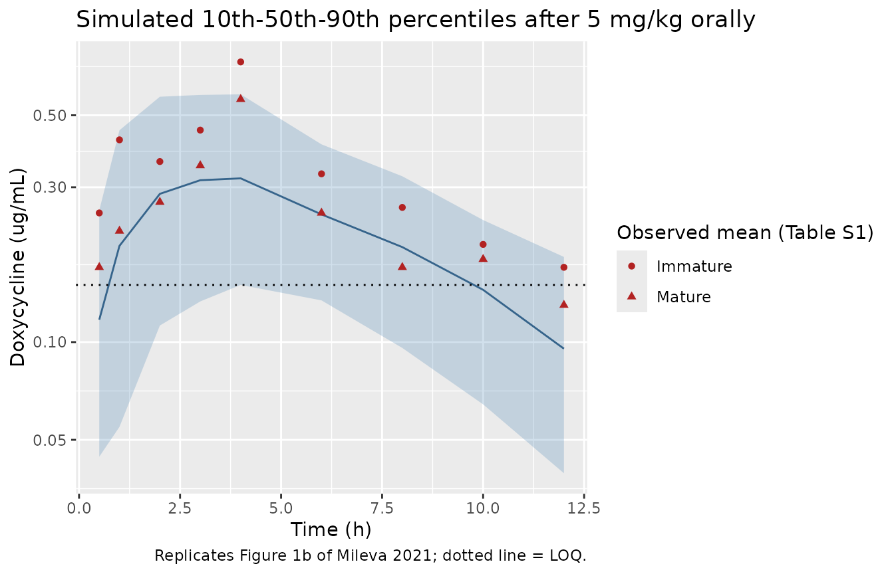

# Doxycycline rabbit (Mileva 2021)

## Model and source

- Citation: Mileva R, Rusenov A, Milanova A. Population Pharmacokinetic
  Modelling of Orally Administered Doxycycline to Rabbits at Different
  Ages. Antibiotics (Basel). 2021;10(3):310.
  <doi:10.3390/antibiotics10030310>
- Description: Preclinical (rabbit). One-compartment population PK model
  with first-order absorption and elimination for doxycycline hyclate
  given as a single 5 mg/kg oral dose in hard gelatin capsules to mature
  (5-month-old) and immature (70-day-old) New Zealand x Californian
  broiler rabbits, parameterised per kg body weight with no covariates
  (Mileva 2021)
- Article: <https://doi.org/10.3390/antibiotics10030310> (open access)
- Supplement (Tables S1-S2):
  <https://www.mdpi.com/2079-6382/10/3/310/s1>

Mileva et al. gave a single oral dose of doxycycline hyclate (5 mg/kg,
powder weighed into a hard gelatin capsule) to mature and immature
rabbits and fitted a one-compartment model with first-order absorption
and elimination in Phoenix NLME 8.3 (FOCE-ELS). Body weight, age and the
pre-dose biochemistry (total protein, albumin, ALT, AST, LDH) were
screened as covariates and none was retained, so the final model has no
covariates. All structural parameters are per kg body weight and
apparent (V/F, CL/F), because no intravenous reference was given.

## Population

Eighteen clinically healthy crossbred New Zealand x Californian broiler
rabbits were enrolled (Methods section 4.2): six mature 5-month-old
animals (3.55 +/- 0.30 kg) and twelve immature 70-day-old animals (2.03
+/- 0.21 kg). Two immature rabbits expelled a damaged capsule and were
excluded, leaving 16 animals (6 mature, 10 immature) in the analysis.
Mature rabbits were sampled at 0.5, 1, 2, 3, 4, 6, 8, 10, 12 and 24 h;
the immature animals were split into two sub-groups sampled at 0.5, 2,
4, 8, 12 h or at 1, 3, 6, 10, 24 h (Methods section 4.3). Free plasma
doxycycline was measured by HPLC-PDA after TFA protein precipitation
(LOQ 0.15 ug/mL); samples below the LOQ were not used in the fit. Sex
was not reported.

The same information is available programmatically via
`readModelDb("Mileva_2021_doxycycline_rabbit")()$population`.

## Source trace

| Equation / parameter | Value | Source location |
|----|----|----|
| `lka` (ka) | log(0.257) 1/h | Table 1, `tvka` |
| `lcl` (CL/F per kg) | log(1.473) L/kg/h | Table 1, `tVCl` |
| `lvc` (V/F per kg) | log(4.429) L/kg | Table 1, `tvV` |
| `etalka` | 0.103 | Table 2, variance of eta ka (BSV 32.96%) |
| `etalcl` | 0.033 | Table 2, variance of eta Cl (BSV 18.18%) |
| `etalvc` | 0.392 | Table 2, variance of eta V (BSV 69.30%) |
| `propSd` | 0.368 | Table 1, `stdev0`; multiplicative error `Ct = f(theta, Time) x (1 + epsilon)`, Equation 8 |
| `P_i = tvP x exp(eta_i)` | n/a | Equation 5 (stated for V; “the other two parameters were calculated with the same algorithm”) |
| One compartment, first-order absorption and elimination | n/a | Results section 2; Methods section 4.5 |
| `kel = cl / vc` | n/a | Equation 2 (`k10 = tvCl/tvV`) |
| No covariates | n/a | Results section 2; Methods section 4.5 (“a model without covariates was chosen”) |
| Dose 5 mg/kg into `depot` | n/a | Methods section 4.1 and 4.3 |

The paper’s own secondary parameters are internally consistent with the
primary estimates, which cross-checks the transcription:
`k10 = 1.473 / 4.429 = 0.3326` 1/h (Table 1: 0.332),
`t1/2 = log(2) / k10 = 2.084` h (Table 1: 2.09),
`AUC = Dose / CL = 5 / 1.473 = 3.394` ug\*h/mL (Table 1: 3.40), and
`100 x sqrt(exp(omega^2) - 1)` returns the printed BSV of 32.96% and
69.30% for ka and V (Equation 6). For CL it gives 18.3% against the
printed 18.18%, which corresponds to an unrounded variance of about
0.0325 printed as 0.033.

## Typical-value checks

``` r

mod <- readModelDb("Mileva_2021_doxycycline_rabbit")
mod_typical <- rxode2::zeroRe(mod)
#> ℹ parameter labels from comments will be replaced by 'label()'

dose <- 5 # mg/kg
ka <- 0.257
cl <- 1.473
vc <- 4.429
kel <- cl / vc

ev_typ <- rxode2::et(amt = dose, cmt = "depot") |>
  rxode2::et(c(seq(0, 12, by = 0.05), seq(12.5, 48, by = 0.5)))
sim_typ <- rxode2::rxSolve(
  mod_typical,
  events = ev_typ,
  rtol = 1e-10,
  atol = 1e-12
) |>
  as.data.frame()
#> ℹ omega/sigma items treated as zero: 'etalka', 'etalcl', 'etalvc'

# Closed-form one-compartment oral solution with the same parameters.
closed_form <- dose / vc * ka / (ka - kel) *
  (exp(-kel * sim_typ$time) - exp(-ka * sim_typ$time))
stopifnot(max(abs(sim_typ$Cc - closed_form)) < 1e-6 * max(closed_form))

# Secondary parameters of Table 1 and the typical time of the peak.
tmax_typ <- log(ka / kel) / (ka - kel)
typical_checks <- tibble::tribble(
  ~Quantity, ~Model, ~Published,
  "k10 (1/h)", kel, 0.332,
  "Half-life log(2)/k10 (h)", log(2) / kel, 2.09,
  "AUC0-inf = Dose/CL (ug*h/mL)", dose / cl, 3.40
) |>
  mutate(`% diff` = 100 * (Model / Published - 1))
knitr::kable(
  typical_checks,
  digits = c(0, 3, 3, 2),
  caption = "Table 1 secondary parameters recomputed from the packaged typical values."
)
```

| Quantity                      | Model | Published | % diff |
|:------------------------------|------:|----------:|-------:|
| k10 (1/h)                     | 0.333 |     0.332 |   0.17 |
| Half-life log(2)/k10 (h)      | 2.084 |     2.090 |  -0.28 |
| AUC0-inf = Dose/CL (ug\*h/mL) | 3.394 |     3.400 |  -0.16 |

Table 1 secondary parameters recomputed from the packaged typical
values. {.table}

``` r

stopifnot(all(abs(typical_checks$`% diff`) < 0.5))
```

The typical profile peaks at 3.41 h at 0.363 ug/mL. Because `ka` (0.257
1/h) is smaller than `k10` (0.333 1/h), the model is in flip-flop: the
terminal slope of the concentration-time curve is set by absorption, so
the terminal half-life is `log(2) / ka` = 2.7 h, not the 2.09 h `k10`
half-life reported in Table 1. The PKNCA half-life below therefore sits
near 2.7 h.

## Virtual cohort and simulation

Each simulated animal receives 5 mg/kg into `depot` and is observed on
the study’s sampling schedule. Because the final model has no
covariates, the mature and immature arms differ only in their sampling
design: 200 mature animals sampled at all ten times, and 200 immature
animals split into the two sampling sub-groups. As in the paper, samples
below the 0.15 ug/mL LOQ are removed before the observed-style
summaries.

``` r

set.seed(2021)
rxode2::rxSetSeed(2021)

make_cohort <- function(n, times, group, id_offset) {
  ids <- id_offset + seq_len(n)
  doses <- tibble(
    id = ids,
    time = 0,
    amt = dose,
    evid = 1L,
    cmt = "depot",
    group = group
  )
  obs <- tidyr::expand_grid(id = ids, time = times) |>
    mutate(amt = 0, evid = 0L, cmt = "central", group = group)
  bind_rows(doses, obs) |>
    arrange(id, time, desc(evid))
}

events <- bind_rows(
  make_cohort(200, c(0.5, 1, 2, 3, 4, 6, 8, 10, 12, 24), "Mature", 0L),
  make_cohort(100, c(0.5, 2, 4, 8, 12), "Immature", 200L),
  make_cohort(100, c(1, 3, 6, 10, 24), "Immature", 300L)
)
stopifnot(!anyDuplicated(unique(events[, c("id", "time", "evid")])))

sim <- rxode2::rxSolve(mod, events = events, keep = "group") |>
  as.data.frame()
#> ℹ parameter labels from comments will be replaced by 'label()'

# `sim` carries the residual-error draw (the observation); `Cc` is the
# individual prediction.
loq <- 0.15
sim_obs <- sim |>
  filter(time > 0) |>
  rename(Cobs = sim)
```

## Replicate published figures

Supplementary Table S1 gives the observed mean +/- SD concentration per
age group; the 12-h mature value is the mean of the quantifiable samples
only.

``` r

observed <- tibble::tribble(
  ~time, ~Mature, ~Immature,
  0.5, 0.17, 0.25,
  1, 0.22, 0.42,
  2, 0.27, 0.36,
  3, 0.35, 0.45,
  4, 0.56, 0.73,
  6, 0.25, 0.33,
  8, 0.17, 0.26,
  10, 0.18, 0.20,
  12, 0.13, 0.17
) |>
  pivot_longer(-time, names_to = "group", values_to = "mean_obs")
```

``` r

# Replicates Figure 1b of Mileva 2021: VPC with 10th, 50th and 90th
# percentiles of simulated observations over 0-12 h (both age groups pooled,
# as in the paper).
vpc <- sim_obs |>
  filter(time <= 12) |>
  group_by(time) |>
  summarise(
    p10 = quantile(Cobs, 0.10),
    p50 = quantile(Cobs, 0.50),
    p90 = quantile(Cobs, 0.90),
    .groups = "drop"
  )

ggplot(vpc, aes(time)) +
  geom_ribbon(aes(ymin = p10, ymax = p90), alpha = 0.25, fill = "steelblue") +
  geom_line(aes(y = p50), colour = "steelblue4") +
  geom_point(
    data = observed,
    aes(y = mean_obs, shape = group),
    colour = "firebrick"
  ) +
  geom_hline(yintercept = loq, linetype = "dotted") +
  scale_y_log10() +
  labs(
    x = "Time (h)",
    y = "Doxycycline (ug/mL)",
    shape = "Observed mean (Table S1)",
    title = "Simulated 10th-50th-90th percentiles after 5 mg/kg orally",
    caption = "Replicates Figure 1b of Mileva 2021; dotted line = LOQ."
  )
```



The paper’s Figure 1b predicted median, read from the figure by the
maintainers, is about 0.34 ug/mL at 3.5 h and 0.10 ug/mL at 12 h.

``` r

fig1b_median <- tibble::tribble(
  ~time, ~digitised,
  3.5, 0.34,
  12, 0.10
)
typ_at <- approx(sim_typ$time, sim_typ$Cc, xout = fig1b_median$time)$y
fig1b_median <- fig1b_median |>
  mutate(typical = typ_at, pct_diff = 100 * (typical / digitised - 1))
knitr::kable(
  fig1b_median,
  digits = c(1, 2, 3, 1),
  caption = "Typical-value prediction vs the predicted median read from Figure 1b."
)
```

| time | digitised | typical | pct_diff |
|-----:|----------:|--------:|---------:|
|  3.5 |      0.34 |   0.363 |      6.7 |
| 12.0 |      0.10 |   0.105 |      4.8 |

Typical-value prediction vs the predicted median read from Figure 1b.
{.table}

``` r

# The digitised values are read by eye from a log axis (about 10% reading
# error); 20% still fails for a two-fold error in V/F, CL/F or the dose.
stopifnot(all(abs(fig1b_median$pct_diff) < 20))
```

The simulated median follows the paper’s predicted median closely. The
simulated 10th-90th percentile band (about 0.11-0.58 ug/mL at 2-4 h)
also agrees with the paper’s **observed** 10th and 90th percentiles in
Figure 1b (about 0.12-0.16 and 0.4-0.8 ug/mL). It is, however, much
narrower than the paper’s **predicted** 10th and 90th percentiles, which
in Figure 1b reach about 1.1-1.6 ug/mL at the top and fall to about
0.002-0.005 ug/mL at 10-12 h at the bottom. Those bands cannot be
produced from the variances printed in Tables 1 and 2, whose internal
consistency is shown above; see Assumptions and deviations.

## PKNCA validation

Two NCA runs feed one comparison table. The **typical value** row uses
the deterministic typical profile and compares against the Table 1
secondary parameters. The **Mature** and **Immature** rows use the
simulated observations (residual error included, samples below LOQ
removed) on the study’s sampling schedule and compare against the
observed Cmax and Tmax the paper reports in Results section 2.

``` r

# Typical-value profile. Concentrations decayed into solver noise are floored
# (pattern: a negative undershoot of order atol would make PKNCA return NaN).
stopifnot(all(sim_typ$Cc >= -1e-6 * max(sim_typ$Cc)))
typ_conc <- sim_typ |>
  filter(!is.na(Cc)) |>
  mutate(Cc = pmax(Cc, 0), id = 1L, treatment = "Typical value") |>
  select(id, time, Cc, treatment)
typ_dose <- tibble(id = 1L, time = 0, amt = dose, treatment = "Typical value")
typ_nca <- PKNCA::pk.nca(PKNCA::PKNCAdata(
  PKNCA::PKNCAconc(typ_conc, Cc ~ time | treatment + id),
  PKNCA::PKNCAdose(typ_dose, amt ~ time | treatment + id),
  intervals = data.frame(
    start = 0,
    end = Inf,
    aucinf.obs = TRUE,
    half.life = TRUE
  )
))

# Observed-style cohort: quantifiable simulated observations only.
coh_conc <- sim_obs |>
  mutate(Cobs = if_else(Cobs >= loq, Cobs, NA_real_)) |>
  filter(!is.na(Cobs)) |>
  transmute(id, time, Cc = Cobs, treatment = group)
coh_conc <- bind_rows(
  coh_conc,
  coh_conc |> distinct(id, treatment) |> mutate(time = 0, Cc = 0)
) |>
  distinct(id, treatment, time, .keep_all = TRUE) |>
  arrange(id, treatment, time)
coh_dose <- events |>
  filter(evid == 1, id %in% coh_conc$id) |>
  transmute(id, time, amt, treatment = group)
coh_nca <- PKNCA::pk.nca(PKNCA::PKNCAdata(
  PKNCA::PKNCAconc(coh_conc, Cc ~ time | treatment + id),
  PKNCA::PKNCAdose(coh_dose, amt ~ time | treatment + id),
  intervals = data.frame(start = 0, end = 24, cmax = TRUE, tmax = TRUE)
))

nca_long <- bind_rows(
  as.data.frame(typ_nca$result),
  as.data.frame(coh_nca$result)
) |>
  select(treatment, PPTESTCD, PPORRES)
```

``` r

published <- tibble::tribble(
  ~treatment, ~cmax, ~tmax, ~aucinf.obs, ~half.life,
  "Typical value", NA, NA, 3.40, 2.09,
  "Mature", 0.58, 3.40, NA, NA,
  "Immature", 0.60, 3.63, NA, NA
)

# Compare only the (group, parameter) pairs the paper reports.
published_long <- published |>
  pivot_longer(-treatment, names_to = "PPTESTCD", values_to = "PPORRES") |>
  filter(!is.na(PPORRES))
stopifnot(nrow(published_long) == 6L)

cmp <- nlmixr2lib::ncaComparisonTable(
  simulated = semi_join(nca_long, published_long, by = c("treatment", "PPTESTCD")),
  reference = published_long,
  by = "treatment",
  params = c("cmax", "tmax", "aucinf.obs", "half.life"),
  units = c(
    cmax = "ug/mL",
    tmax = "h",
    aucinf.obs = "ug*h/mL",
    half.life = "h"
  ),
  tolerance_pct = 20
)
stopifnot(nrow(cmp) == 6L)
knitr::kable(
  cmp,
  caption = paste(
    "Simulated (median across animals) vs published NCA.",
    "* differs from the reference by >20%.",
    "Published Cmax and Tmax are the observed means (Results section 2);",
    "published AUC and half-life are the Table 1 secondary parameters."
  )
)
```

| NCA parameter           | treatment     | Reference | Simulated | % diff   |
|:------------------------|:--------------|:----------|:----------|:---------|
| Cmax (ug/mL)            | Mature        | 0.58      | 0.419     | -27.7%\* |
| Cmax (ug/mL)            | Immature      | 0.6       | 0.382     | -36.3%\* |
| Tmax (h)                | Mature        | 3.4       | 4         | +17.6%   |
| Tmax (h)                | Immature      | 3.63      | 4         | +10.2%   |
| AUC0-∞ (obs) (ug\*h/mL) | Typical value | 3.4       | 3.39      | -0.2%    |
| t½ (h)                  | Typical value | 2.09      | 2.78      | +33.0%\* |

Simulated (median across animals) vs published NCA. \* differs from the
reference by \>20%. Published Cmax and Tmax are the observed means
(Results section 2); published AUC and half-life are the Table 1
secondary parameters. {.table}

``` r


nca_val <- function(grp, code) {
  v <- nca_long$PPORRES[nca_long$treatment == grp & nca_long$PPTESTCD == code]
  if (length(v) == 1L) {
    return(v)
  }
  v <- v[!is.na(v)]
  if (length(v) == 0L) {
    stop("no NCA value for ", grp, " / ", code)
  }
  median(v)
}
auc_typ <- nca_val("Typical value", "aucinf.obs")
hl_typ <- nca_val("Typical value", "half.life")
cmax_mat <- nca_val("Mature", "cmax")
cmax_imm <- nca_val("Immature", "cmax")
tmax_mat <- nca_val("Mature", "tmax")
tmax_imm <- nca_val("Immature", "tmax")

stopifnot(
  # Deterministic: AUC0-inf of the typical profile is Dose/CL (Table 1).
  abs(auc_typ / 3.40 - 1) < 0.01,
  # Deterministic: terminal half-life is absorption-limited (flip-flop).
  # PKNCA's best-fit window starts near 19 h, where the k10 exponential still
  # contributes a little, so it returns about 2.78 h against log(2)/ka = 2.70 h;
  # the k10 half-life (2.09 h) is far outside this bound.
  abs(hl_typ / (log(2) / ka) - 1) < 0.05,
  # Cohort medians (robust to which animals land in the tails): Tmax sits on
  # the 3-4 h sampling times, and Cmax is within a factor of two of the
  # observed means. A two-fold error in V/F or the dose breaks the Cmax bound.
  tmax_mat >= 2, tmax_mat <= 6,
  tmax_imm >= 2, tmax_imm <= 6,
  cmax_mat > 0.29, cmax_mat < 1.16,
  cmax_imm > 0.30, cmax_imm < 1.20
)
```

`AUC0-inf` reproduces Table 1 exactly. The half-life row is starred by
design: Table 1 reports the `k10` half-life, whereas PKNCA estimates the
terminal half-life, which here is the absorption half-life (flip-flop,
see above).

The simulated median Cmax is 28% (mature) and 36% (immature) below the
observed mean Cmax. The Table S1 means show a sharp peak at 4 h (0.56
and 0.73 ug/mL) between 0.35-0.45 ug/mL at 3 h and 0.25-0.33 ug/mL at 6
h, a shape a one-compartment model with a slow first-order absorption
(`ka` \< `k10`) cannot reproduce; the paper’s own predicted median in
Figure 1b (about 0.34 ug/mL at the peak) and its Figure 1a individual
curves (mostly below 0.5 ug/mL) show the same under-prediction of the
peak. This is a property of the published model, not of the
transcription; the parameters were not adjusted.

## %fT \> MIC

The paper reports that a 5 mg/kg dose gives %fT \> MIC of 35% for an
assumed MIC of 0.18 ug/mL and a 12-h dosing interval, using Equation 9,
`%fT>MIC = ln(Cmax / MIC) x (1 / k10) x 100 / tau`. That value is
reproduced exactly when the Cmax entered is the highest observed mean
concentration in Table S1 (0.73 ug/mL, immature rabbits at 4 h), which
appears to be the value the authors used.

``` r

mic <- 0.18
tau <- 12
ftmic_eq9 <- function(cmax) log(cmax / mic) / 0.332 * 100 / tau
ftmic <- tibble::tribble(
  ~`Cmax used`, ~Cmax,
  "Highest Table S1 mean (immature, 4 h)", 0.73,
  "Observed mean Cmax, mature (Results)", 0.58,
  "Observed mean Cmax, immature (Results)", 0.60,
  "Typical-value model Cmax", max(sim_typ$Cc)
) |>
  mutate(`%fT>MIC (Equation 9)` = ftmic_eq9(Cmax))

# Time above MIC from the typical-value profile itself (single dose, 0-12 h).
above <- sim_typ |> filter(time <= tau)
pct_above_typ <- 100 * mean(above$Cc > mic)
knitr::kable(
  ftmic,
  digits = c(0, 3, 1),
  caption = "Equation 9 of Mileva 2021 evaluated at different Cmax values."
)
```

| Cmax used                              |  Cmax | %fT\>MIC (Equation 9) |
|:---------------------------------------|------:|----------------------:|
| Highest Table S1 mean (immature, 4 h)  | 0.730 |                  35.1 |
| Observed mean Cmax, mature (Results)   | 0.580 |                  29.4 |
| Observed mean Cmax, immature (Results) | 0.600 |                  30.2 |
| Typical-value model Cmax               | 0.363 |                  17.6 |

Equation 9 of Mileva 2021 evaluated at different Cmax values. {.table}

``` r

stopifnot(abs(ftmic_eq9(0.73) - 35) < 0.5)
```

Equation 9 assumes an intravenous-bolus-like decline from Cmax. Read
directly from the typical-value profile, the single-dose concentration
stays above 0.18 ug/mL for about 70% of the first 12 h, because the slow
absorption keeps the profile near its plateau for several hours.

## Assumptions and deviations

- **Per-kg dosing.** Dose (mg/kg), V/F (L/kg) and CL/F (L/kg/h) are kept
  per kg body weight exactly as published; enter the dose in mg/kg.
  Whole-animal V/F and CL/F are proportional to body weight, which was
  screened as a covariate and not retained.
- **Residual error unit.** Table 1 lists `stdev0 = 0.368` with the unit
  “ug/mL”, but its footnote and Equation 8
  (`Ct = f(theta, Time) x (1 + epsilon)`) define it as the standard
  deviation of a multiplicative error, so it is dimensionless and is
  encoded as `propSd = 0.368`.
- **IIV structure.** Equation 5 is exponential BSV on V, with ka and CL
  “calculated with the same algorithm”. Table 2 lists only the three
  variances, so the omega matrix is diagonal.
- **Figure 1b prediction interval.** The paper’s predicted 10th and 90th
  percentile bands are much wider than a simulation from Tables 1 and 2
  gives (and wider than the paper’s own observed 10th and 90th
  percentiles). The printed estimates are self-consistent (k10,
  half-life, AUC and the BSV percentages all recompute from them), so
  the tables were used as printed and only the predicted median of
  Figure 1b is used as a check. The cause of the wide published band is
  not stated.
- **Peak under-prediction.** The model under-predicts the observed mean
  Cmax by roughly 25-40% (see the NCA table); this is inherent to the
  published one-compartment model and is visible in the paper’s own
  figures.
- **Screened covariates.** Body weight, age, total protein, albumin,
  ALT, AST and LDH were tested and not retained; they are recorded in
  `covariatesDataExcluded` for provenance. The paper does not state
  which parameter each covariate was tested on.
- **Sampling footnote.** The Table S1 footnote says six immature rabbits
  were sampled at each time, whereas Methods section 4.3 describes two
  sub-groups of five; the simulation follows the Methods.
- **Errata.** No correction notice for this article was found on Europe
  PMC or the publisher’s page as of 2026-09-28.
