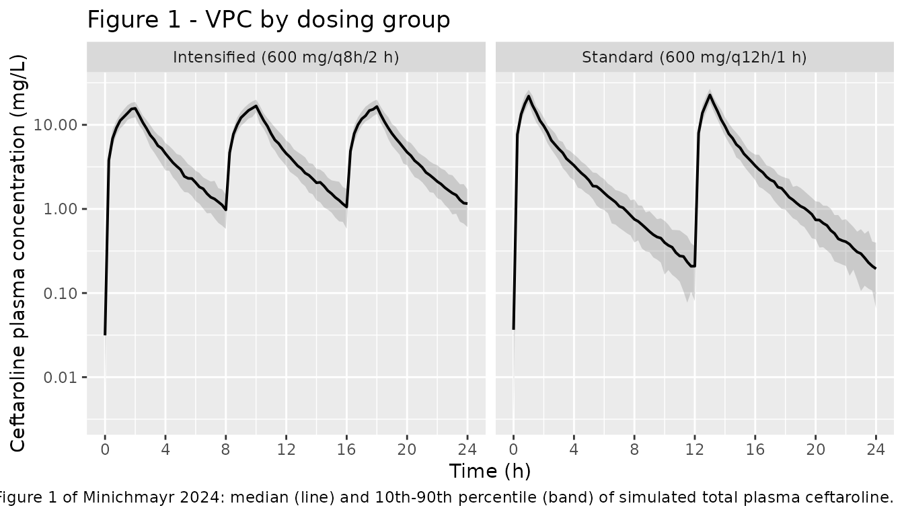
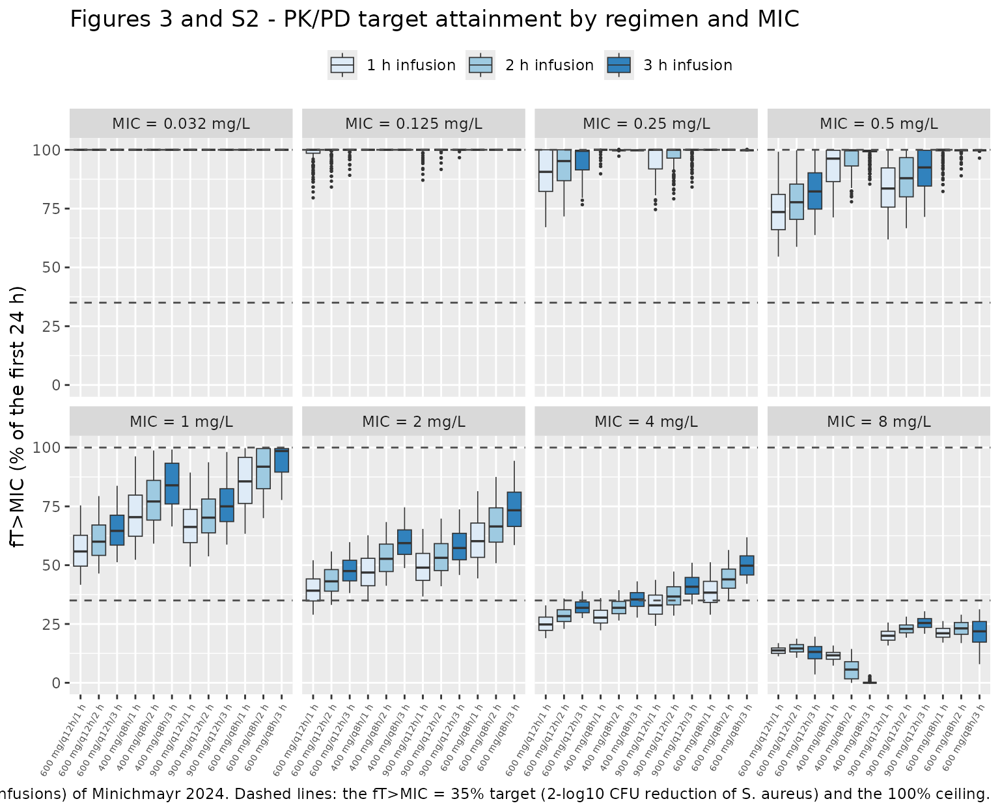

# Ceftaroline (Minichmayr 2024)

## Model and source

- Citation: Minichmayr IK, Wicha SG, Matzneller P, Kloft C,
  Zeitlinger M. Impact of key components of intensified ceftaroline
  dosing on pharmacokinetic/pharmacodynamic target attainment. Clin
  Pharmacokinet. 2024;63(1):121-131. <doi:10.1007/s40262-023-01325-4>.
  Final population PK parameter estimates are Table 1; the
  structural-model selection narrative (two-compartment, linear
  elimination, complete and immediate prodrug conversion, no CLcr
  covariate) is Results section 3.1; the
  ceftaroline-to-ceftaroline-fosamil molar-mass ratio of 0.883 and the
  20% plasma protein binding used for fT\>MIC are Methods sections 2.2
  and 2.3; published median fT\>MIC values across the eight
  systematically varied dosing regimens are Tables 2 and 3. The
  electronic supplementary material (ESM) adds baseline demographics
  (Table S1), the objective function values of the key candidate models
  explored during model development (Table S2), and the complete 72-cell
  grid of median fT\>MIC across six MIC values, two dosing intervals,
  two total daily doses and three infusion durations including the 3 h
  infusions omitted from the main text (Table S3).
- Description: Two-compartment population PK model with linear
  elimination for ceftaroline (the active metabolite of the prodrug
  ceftaroline fosamil) in 12 healthy male volunteers receiving either
  the standard dosing regimen (ceftaroline fosamil 600 mg every 12 h as
  a 1 h intravenous infusion) or the approved intensified regimen (600
  mg every 8 h as a 2 h intravenous infusion). Doses are entered as
  milligrams of the administered prodrug ceftaroline fosamil; the model
  converts to ceftaroline via the fixed
  ceftaroline-to-ceftaroline-fosamil molar-mass ratio of 0.883 applied
  as the bioavailability of the central compartment, reflecting the
  paper’s finding that prodrug-to-drug conversion is complete and
  effectively instantaneous (a depot / k_trans conversion compartment
  worsened the fit, and a sensitivity analysis favoured k_trans \>
  1000/h). Exponential interindividual variability on CL, Vc and Vp;
  combined additive and proportional residual error. No covariates were
  retained: creatinine clearance was screened on CL as linear and power
  functions and via a previously published CL-CLcr relationship, but was
  not significant in this small, homogeneous cohort with unimpaired
  renal function. The model underpins the paper’s systematic comparison
  of the three components of dosing intensification (dosing interval,
  infusion duration and total daily dose) on the PK/PD index fT\>MIC
  against Staphylococcus aureus.
- Article: <https://doi.org/10.1007/s40262-023-01325-4> (open access, CC
  BY-NC)

Ceftaroline fosamil is the N-phosphono prodrug of ceftaroline, a
fifth-generation cephalosporin with activity against
methicillin-resistant *Staphylococcus aureus*. It is approved both at a
standard dose (600 mg every 12 h as a 1 h infusion) and, for complicated
skin and soft tissue infections caused by *S. aureus* with a minimum
inhibitory concentration (MIC) of 2-4 mg/L, at an intensified dose (600
mg every 8 h as a 2 h infusion). The intensified regimen changes three
dosing components at once: the dosing interval, the infusion duration,
and the total daily dose (TDD). Minichmayr and colleagues built this
population PK model to separate the three contributions to the PK/PD
index fT\>MIC.

## Population

The model was developed from a prospective, open-label study (EudraCT
2012-005134-11) at the Medical University of Vienna in **12 healthy male
volunteers**, randomised in equal numbers (n = 6 each) to the standard
regimen (ceftaroline fosamil 600 mg every 12 h, 1 h intravenous
infusion) or the intensified regimen (600 mg every 8 h, 2 h intravenous
infusion).

Baseline characteristics are given in ESM Table S1 as medians with
5th-95th percentiles, and in the main-text Methods (Section 2.1) as
medians with full ranges:

| Characteristic | Median | 5th-95th percentile (ESM Table S1) | Range (Methods 2.1) |
|----|----|----|----|
| Age (years) | 27.5 | 23.1-45.6 | 22-50 |
| Body height (cm) | 183 | 173-194 | not reported |
| Total body weight (kg) | 74.5 | 64.4-96.1 | 63-106 |
| BMI (kg/m^2) | 23.0 | 19.4-25.9 | 19.4-27.6 |
| BSA (m^2) | 1.92 | 1.79-2.28 | not reported |
| Serum creatinine (mg/dL) | 0.88 | 0.76-1.04 | not reported |
| CLcr, Cockcroft-Gault (mL/min) | 145 | 95.4-158 | 93.2-165 |

No participant had renal impairment. Total plasma ceftaroline was
sampled richly on two occasions (after the first dose, and after three
or four repeated doses), giving **n = 274 concentrations**. The model
was fit in NONMEM 7.3.0 with FOCE-I, assisted by PsN 4.7.0.

The same information is available programmatically via the model’s
`population` metadata
(`readModelDb("Minichmayr_2024_ceftaroline")()$population`).

## Source trace

The per-parameter origin is recorded as an in-file comment next to each
`ini()` entry in
`inst/modeldb/specificDrugs/Minichmayr_2024_ceftaroline.R`. The table
below collects them in one place for review.

| Equation / parameter | Value | Source location |
|----|----|----|
| `lcl` (CL) | 10.9 L/h | Table 1 (RSE 4.70%; 95% CI 10.1-12.1) |
| `lvc` (V_(C)) | 15.3 L | Table 1 (RSE 5.44%; 95% CI 13.8-16.7) |
| `lvp` (V_(P)) | 7.82 L | Table 1 (RSE 8.90%; 95% CI 6.86-8.84) |
| `lq` (Q) | 4.82 L/h | Table 1 (RSE 16.5%; 95% CI 3.91-5.97) |
| `etalcl` | 15.6 %CV -\> 0.0240446 | Table 1 (omega_(CL); RSE 16.7%; 95% CI 11.1-22.7) |
| `etalvc` | 13.0 %CV -\> 0.0167588 | Table 1 (omega_(VC); RSE 19.3%; 95% CI 7.57-21.7) |
| `etalvp` | 16.6 %CV -\> 0.0271832 | Table 1 (omega_(VP); RSE 24.9%; 95% CI 10.1-28.9) |
| `addSd` | 0.0441 mg/L | Table 1 (sigma_(additive); RSE 44.2%; 95% CI 0.0200-0.0734) |
| `propSd` | 0.135 (13.5 %CV) | Table 1 (sigma_(proportional); RSE 12.7%; 95% CI 12.3-15.1) |
| Two-compartment linear disposition | n/a | Results 3.1; ESM Table S2 model A (OFV 39.498) |
| `f(central) <- 0.883` (molar-mass conversion) | 0.883 | Methods 2.2 (“their ratio of molar masses (CPT-to-CPT-F ratio: 0.883)”) |
| No conversion / depot compartment | n/a | Results 3.1; ESM Table S2 models J-L (k_(trans) estimation did not converge at \>1e4/h; OFV 39.693 with k_(trans) fixed to 1000/h vs 39.498 for model A) |
| No CL-CL_(CR) covariate | n/a | Results 3.1; ESM Table S2 model E (OFV 38.918, delta-OFV 0.58 vs the 3.84 threshold) |
| Diagonal omega; no IOV | n/a | Results 3.1; ESM Table S2 models G-I (IOV on CL / V1 / V2: OFV 34.268 / 39.506 / 37.248) |
| Unbound fraction for fT\>MIC | 0.8 (20% protein binding) | Methods 2.3 |
| Published median fT\>MIC (full 72-cell grid) | 6 MICs x 12 regimens | ESM Table S3 |
| Published median fT\>MIC (1 h and 2 h subset) | 8 regimens | Tables 2 and 3 |

Note that the interindividual variabilities are reported in Table 1 as
%CV for an exponential (lognormal) IIV model, so the log-scale variance
used in `ini()` is `omega^2 = log(1 + CV^2)`. Reading the same column as
an approximate SD scale (`omega^2 = CV^2`) changes the values by at most
1.4% at these magnitudes, so the two readings are numerically equivalent
here.

## Dosing regimens

The paper’s simulation design is a full factorial over the three dosing
components: two total daily doses (1200 and 1800 mg), two dosing
intervals (q12h and q8h) and three infusion durations (1, 2 and 3 h),
giving **12 regimens**. Main-text Figure 3 and Tables 2-3 present the
eight 1 h and 2 h combinations under short names; ESM Figure S2 and
Table S3 add the four 3 h regimens and tabulate all twelve.

`INT` denotes a shortened dosing interval (q12h -\> q8h), `TDD` an
increased total daily dose (1200 -\> 1800 mg), and `DUR` a prolonged
infusion (1 h -\> 2 h), relative to standard dosing.

``` r

regimens <- tidyr::expand_grid(
  tdd = c(1200, 1800),
  ii  = c(12, 8),
  dur = c(1, 2, 3)
) |>
  dplyr::mutate(
    dose    = tdd / (24 / ii),
    regimen = sprintf("%g mg/q%gh/%g h", dose, ii, dur)
  )

# The eight regimens that main-text Tables 2 and 3 name (1 h and 2 h only).
table23_names <- c(
  "600 mg/q12h/1 h" = "STD",
  "400 mg/q8h/1 h"  = "INT alt",
  "900 mg/q12h/1 h" = "TDD alt",
  "600 mg/q12h/2 h" = "DUR alt",
  "900 mg/q12h/2 h" = "TDD+DUR alt",
  "400 mg/q8h/2 h"  = "INT+DUR alt",
  "600 mg/q8h/1 h"  = "INT+TDD alt",
  "600 mg/q8h/2 h"  = "INT+TDD+DUR alt"
)
regimens <- regimens |>
  dplyr::mutate(table23 = unname(table23_names[regimen]))

knitr::kable(
  regimens |>
    dplyr::select(regimen, dose, ii, dur, tdd, table23) |>
    dplyr::rename(
      "Regimen"                 = regimen,
      "Dose (mg CPT-F)"         = dose,
      "Dosing interval (h)"     = ii,
      "Infusion duration (h)"   = dur,
      "TDD (mg/day)"            = tdd,
      "Name in Tables 2-3"      = table23
    ),
  caption = "The 12 systematically varied dosing regimens (Minichmayr 2024 ESM Table S3). Doses are milligrams of the administered prodrug ceftaroline fosamil (CPT-F). The eight 1 h and 2 h regimens also carry the short names used in main-text Tables 2 and 3; the four 3 h regimens appear only in the ESM."
)
```

| Regimen | Dose (mg CPT-F) | Dosing interval (h) | Infusion duration (h) | TDD (mg/day) | Name in Tables 2-3 |
|:---|---:|---:|---:|---:|:---|
| 600 mg/q12h/1 h | 600 | 12 | 1 | 1200 | STD |
| 600 mg/q12h/2 h | 600 | 12 | 2 | 1200 | DUR alt |
| 600 mg/q12h/3 h | 600 | 12 | 3 | 1200 | NA |
| 400 mg/q8h/1 h | 400 | 8 | 1 | 1200 | INT alt |
| 400 mg/q8h/2 h | 400 | 8 | 2 | 1200 | INT+DUR alt |
| 400 mg/q8h/3 h | 400 | 8 | 3 | 1200 | NA |
| 900 mg/q12h/1 h | 900 | 12 | 1 | 1800 | TDD alt |
| 900 mg/q12h/2 h | 900 | 12 | 2 | 1800 | TDD+DUR alt |
| 900 mg/q12h/3 h | 900 | 12 | 3 | 1800 | NA |
| 600 mg/q8h/1 h | 600 | 8 | 1 | 1800 | INT+TDD alt |
| 600 mg/q8h/2 h | 600 | 8 | 2 | 1800 | INT+TDD+DUR alt |
| 600 mg/q8h/3 h | 600 | 8 | 3 | 1800 | NA |

The 12 systematically varied dosing regimens (Minichmayr 2024 ESM Table
S3). Doses are milligrams of the administered prodrug ceftaroline
fosamil (CPT-F). The eight 1 h and 2 h regimens also carry the short
names used in main-text Tables 2 and 3; the four 3 h regimens appear
only in the ESM. {.table}

``` r


# Unbound fraction: 20% plasma protein binding (Methods 2.3).
FU <- 0.8
```

## Virtual cohort

The original 12-participant dataset is not publicly available. Because
the published fT\>MIC values are **medians across the 12 study
participants**, the comparison below needs a population, not just a
typical subject. We build a **deterministic quantile cohort** rather
than a random draw: each of the three independent random effects is
placed on a five-point quantile lattice (10th, 30th, 50th, 70th, 90th
percentiles), and the full 5 x 5 x 5 factorial gives 125 virtual
subjects that tile the joint IIV distribution reproducibly.

A random draw of the same size gives medians that wander by several
percentage points at the extremes of the MIC range (where fT\>MIC is
pinned near 0% or 100% and the median is very sensitive to which
subjects happen to be drawn); the quantile lattice removes that sampling
noise entirely, so the residual difference from the published values is
attributable to the model rather than to the draw. The cohort is 125
subjects per regimen, within the 200-per-arm cap.

``` r

# Log-scale IIV variances, matching ini() in the model file.
omega2 <- c(cl = 0.0240446, vc = 0.0167588, vp = 0.0271832)

zq <- stats::qnorm(seq(0.1, 0.9, length.out = 5))
subjects <- expand.grid(zcl = zq, zvc = zq, zvp = zq) |>
  dplyr::mutate(
    sid    = dplyr::row_number(),
    etalcl = sqrt(omega2[["cl"]]) * zcl,
    etalvc = sqrt(omega2[["vc"]]) * zvc,
    etalvp = sqrt(omega2[["vp"]]) * zvp
  ) |>
  dplyr::select(sid, etalcl, etalvc, etalvp)

n_sub <- nrow(subjects)
n_sub
#> [1] 125

# fT>MIC is a fraction of the 24 h window, so the observation grid is the
# midpoint of each of 480 equal 0.05 h slabs. Midpoints (rather than a closed
# 0-to-24 grid) keep every grid point representative of exactly one slab: a
# closed grid includes t = 0, where the concentration is always zero, and so
# caps the attainable value at 480/481 = 99.79% instead of 100%.
slab   <- 0.05
tgrid  <- seq(slab / 2, 24 - slab / 2, by = slab)

# One event table per regimen; `id_offset` keeps subject IDs disjoint across
# regimens (rxSolve keys on `id` alone -- shared IDs silently merge arms).
make_arm <- function(dose, ii, dur, regimen, id_offset) {
  ev <- rxode2::et(amt = dose, ii = ii, until = 23.9, dur = dur, cmt = "central")
  ev <- rxode2::et(ev, tgrid)
  ev <- rxode2::et(ev, id = subjects$sid)
  as.data.frame(ev) |>
    dplyr::left_join(subjects, by = c("id" = "sid")) |>
    dplyr::mutate(regimen = regimen, id = id + id_offset) |>
    dplyr::arrange(id, time)
}

events <- do.call(
  dplyr::bind_rows,
  lapply(seq_len(nrow(regimens)), function(i) {
    make_arm(
      dose      = regimens$dose[i],
      ii        = regimens$ii[i],
      dur       = regimens$dur[i],
      regimen   = regimens$regimen[i],
      id_offset = (i - 1L) * n_sub
    )
  })
)

# Subject IDs must not collide across arms.
stopifnot(
  length(unique(events$id)) == n_sub * nrow(regimens),
  !anyDuplicated(unique(events[, c("id", "time", "evid")]))
)
```

## Simulation

``` r

mod <- readModelDb("Minichmayr_2024_ceftaroline")

# omega = NA: the random effects are supplied per subject as columns in the
# event table (the quantile lattice), so rxode2 must not draw its own.
sim <- suppressWarnings(rxode2::rxSolve(
  mod, events,
  omega      = NA,
  keep       = "regimen",
  addDosing  = FALSE,
  returnType = "data.frame"
)) |>
  dplyr::mutate(Cu = FU * Cc)
#> ℹ parameter labels from comments will be replaced by 'label()'
```

The model was fit to **total** plasma ceftaroline, so the unbound
concentration that drives fT\>MIC is formed here as `Cu = 0.8 * Cc`
(Methods 2.3).

``` r

# fT>MIC = cumulative percentage of the first 24 h that the unbound
# concentration exceeds the MIC. Every grid point represents one equal-width
# slab, so the time fraction is the fraction of grid points above the threshold.
ft_mic <- function(data, mic) {
  data |>
    dplyr::group_by(regimen, id) |>
    dplyr::summarise(ft = 100 * mean(Cu > mic), .groups = "drop") |>
    dplyr::mutate(mic = mic)
}

mic_grid <- c(0.032, 0.125, 0.25, 0.5, 1, 2, 4, 8)
ft_all   <- dplyr::bind_rows(lapply(mic_grid, ft_mic, data = sim))

# Median across the cohort, per regimen and MIC.
ft_med <- ft_all |>
  dplyr::group_by(regimen, mic) |>
  dplyr::summarise(simulated = median(ft), .groups = "drop") |>
  dplyr::left_join(regimens, by = "regimen")
```

## Replicate published figures

### Figure 1 — visual predictive check

Figure 1 of the paper is a VPC of observed ceftaroline concentrations
under the two clinically studied regimens. A VPC needs the residual
error and randomly drawn random effects, so this figure uses a separate
randomly sampled cohort (100 subjects per arm) and plots the
**observed-scale** simulation (`sim`), which carries the combined
additive and proportional residual error, rather than the individual
prediction `Cc`.

``` r

set.seed(20240126)

vpc_arms <- tibble::tribble(
  ~regimen,               ~dose, ~ii, ~dur,
  "Standard (600 mg/q12h/1 h)",    600,  12,    1,
  "Intensified (600 mg/q8h/2 h)",  600,   8,    2
)

vpc_events <- do.call(dplyr::bind_rows, lapply(seq_len(nrow(vpc_arms)), function(i) {
  ev <- rxode2::et(amt = vpc_arms$dose[i], ii = vpc_arms$ii[i], until = 23.9,
                   dur = vpc_arms$dur[i], cmt = "central")
  ev <- rxode2::et(ev, seq(0, 24, by = 0.25))
  ev <- rxode2::et(ev, id = 1:100)
  as.data.frame(ev) |>
    dplyr::mutate(regimen = vpc_arms$regimen[i], id = id + (i - 1L) * 100L)
}))

vpc_sim <- rxode2::rxSolve(mod, vpc_events, keep = "regimen",
                           addDosing = FALSE, returnType = "data.frame")

vpc_sim |>
  dplyr::filter(time <= 24, sim > 0) |>
  dplyr::group_by(regimen, time) |>
  dplyr::summarise(
    Q10 = quantile(sim, 0.10),
    Q50 = quantile(sim, 0.50),
    Q90 = quantile(sim, 0.90),
    .groups = "drop"
  ) |>
  ggplot(aes(time, Q50)) +
  geom_ribbon(aes(ymin = Q10, ymax = Q90), alpha = 0.25, fill = "grey40") +
  geom_line(linewidth = 0.7) +
  facet_wrap(~regimen) +
  scale_x_continuous(breaks = seq(0, 24, by = 4)) +
  scale_y_log10() +
  labs(
    x = "Time (h)", y = "Ceftaroline plasma concentration (mg/L)",
    title = "Figure 1 - VPC by dosing group",
    caption = "Replicates Figure 1 of Minichmayr 2024: median (line) and 10th-90th percentile (band) of simulated total plasma ceftaroline."
  )
```



### Figure 3 and ESM Figure S2 — target attainment across the MIC range

Figure 3 shows the eight 1 h and 2 h regimens; ESM Figure S2 repeats the
exercise for 3 h infusions. Both are covered by faceting the full
12-regimen grid over the MIC range.

``` r

ft_all |>
  dplyr::left_join(regimens |> dplyr::select(regimen, dur), by = "regimen") |>
  dplyr::mutate(
    regimen = factor(regimen, levels = regimens$regimen),
    dur_lab = factor(sprintf("%g h infusion", dur))
  ) |>
  ggplot(aes(x = regimen, y = ft, fill = dur_lab)) +
  geom_boxplot(outlier.size = 0.3, linewidth = 0.3) +
  geom_hline(yintercept = 35, linetype = "dashed", colour = "grey30") +
  geom_hline(yintercept = 100, linetype = "dashed", colour = "grey30") +
  facet_wrap(~paste("MIC =", mic, "mg/L"), ncol = 4) +
  scale_fill_brewer(palette = "Blues") +
  theme(
    axis.text.x = element_text(angle = 60, hjust = 1, size = 5.5),
    legend.position = "top"
  ) +
  labs(
    x = NULL, y = "fT>MIC (% of the first 24 h)", fill = NULL,
    title = "Figures 3 and S2 - PK/PD target attainment by regimen and MIC",
    caption = "Replicates Figure 3 (1 h and 2 h infusions) and ESM Figure S2 (3 h infusions) of Minichmayr 2024. Dashed lines: the fT>MIC = 35% target (2-log10 CFU reduction of S. aureus) and the 100% ceiling."
  )
```



## Replicate ESM Table S3 — all 72 published median fT\>MIC values

ESM Table S3 is the paper’s complete quantitative result: the median
fT\>MIC across the 12 study participants for every combination of 6 MIC
values, 2 dosing intervals, 2 total daily doses and 3 infusion
durations. Main-text Tables 2 and 3 are the 1 h / 2 h subset of this
grid, so reproducing Table S3 reproduces those tables too.

``` r

published_ft <- tibble::tribble(
  ~mic, ~ii, ~tdd, ~dur, ~published,
  0.25,   8, 1200,    1,      99.9,
  0.25,   8, 1200,    2,      99.9,
  0.25,   8, 1200,    3,      99.8,
  0.25,   8, 1800,    1,     100.0,
  0.25,   8, 1800,    2,      99.9,
  0.25,   8, 1800,    3,      99.9,
  0.25,  12, 1200,    1,      89.7,
  0.25,  12, 1200,    2,      94.1,
  0.25,  12, 1200,    3,      97.5,
  0.25,  12, 1800,    1,      98.0,
  0.25,  12, 1800,    2,      99.9,
  0.25,  12, 1800,    3,      99.9,
  0.50,   8, 1200,    1,      95.7,
  0.50,   8, 1200,    2,      99.4,
  0.50,   8, 1200,    3,      99.6,
  0.50,   8, 1800,    1,      99.9,
  0.50,   8, 1800,    2,      99.9,
  0.50,   8, 1800,    3,      99.8,
  0.50,  12, 1200,    1,      72.6,
  0.50,  12, 1200,    2,      77.0,
  0.50,  12, 1200,    3,      81.7,
  0.50,  12, 1800,    1,      82.4,
  0.50,  12, 1800,    2,      86.8,
  0.50,  12, 1800,    3,      91.5,
  1.00,   8, 1200,    1,      71.5,
  1.00,   8, 1200,    2,      77.9,
  1.00,   8, 1200,    3,      84.9,
  1.00,   8, 1800,    1,      85.7,
  1.00,   8, 1800,    2,      92.3,
  1.00,   8, 1800,    3,      98.2,
  1.00,  12, 1200,    1,      56.2,
  1.00,  12, 1200,    2,      60.5,
  1.00,  12, 1200,    3,      65.0,
  1.00,  12, 1800,    1,      65.8,
  1.00,  12, 1800,    2,      70.2,
  1.00,  12, 1800,    3,      74.8,
  2.00,   8, 1200,    1,      48.2,
  2.00,   8, 1200,    2,      53.9,
  2.00,   8, 1200,    3,      60.4,
  2.00,   8, 1800,    1,      61.6,
  2.00,   8, 1800,    2,      67.7,
  2.00,   8, 1800,    3,      74.5,
  2.00,  12, 1200,    1,      40.2,
  2.00,  12, 1200,    2,      44.1,
  2.00,  12, 1200,    3,      48.3,
  2.00,  12, 1800,    1,      49.5,
  2.00,  12, 1800,    2,      53.7,
  2.00,  12, 1800,    3,      58.0,
  4.00,   8, 1200,    1,      28.2,
  4.00,   8, 1200,    2,      31.8,
  4.00,   8, 1200,    3,      34.9,
  4.00,   8, 1800,    1,      39.5,
  4.00,   8, 1800,    2,      44.7,
  4.00,   8, 1800,    3,      50.3,
  4.00,  12, 1200,    1,      25.5,
  4.00,  12, 1200,    2,      28.7,
  4.00,  12, 1200,    3,      32.1,
  4.00,  12, 1800,    1,      33.8,
  4.00,  12, 1800,    2,      37.5,
  4.00,  12, 1800,    3,      41.7,
  8.00,   8, 1200,    1,      10.8,
  8.00,   8, 1200,    2,       3.58,
  8.00,   8, 1200,    3,       0.00,
  8.00,   8, 1800,    1,      20.9,
  8.00,   8, 1800,    2,      22.2,
  8.00,   8, 1800,    3,      20.0,
  8.00,  12, 1200,    1,      13.4,
  8.00,  12, 1200,    2,      13.9,
  8.00,  12, 1200,    3,      11.7,
  8.00,  12, 1800,    1,      20.2,
  8.00,  12, 1800,    2,      22.7,
  8.00,  12, 1800,    3,      25.0
)

ft_compare <- ft_med |>
  dplyr::inner_join(published_ft, by = c("mic", "ii", "tdd", "dur")) |>
  dplyr::mutate(difference = simulated - published) |>
  dplyr::arrange(mic, tdd, ii, dur)

ft_compare |>
  dplyr::transmute(
    mic, tdd,
    interval = sprintf("q%gh", ii),
    duration = sprintf("%g h", dur),
    simulated = round(simulated, 1),
    published,
    difference = round(difference, 2)
  ) |>
  dplyr::rename(
    "MIC (mg/L)"                     = mic,
    "TDD (mg/day)"                   = tdd,
    "Interval"                       = interval,
    "Infusion"                       = duration,
    "Simulated median fT>MIC (%)"    = simulated,
    "Published median fT>MIC (%)"    = published,
    "Difference (percentage points)" = difference
  ) |>
  knitr::kable(
    caption = "Simulated vs. published median fT>MIC for all 72 cells of Minichmayr 2024 ESM Table S3 (main-text Tables 2 and 3 are the 1 h / 2 h subset).",
    align = c("r", "r", "l", "l", "r", "r", "r")
  )
```

| MIC (mg/L) | TDD (mg/day) | Interval | Infusion | Simulated median fT\>MIC (%) | Published median fT\>MIC (%) | Difference (percentage points) |
|---:|---:|:---|:---|---:|---:|---:|
| 0.25 | 1200 | q8h | 1 h | 100.0 | 99.90 | 0.10 |
| 0.25 | 1200 | q8h | 2 h | 99.8 | 99.90 | -0.11 |
| 0.25 | 1200 | q8h | 3 h | 99.8 | 99.80 | -0.01 |
| 0.25 | 1200 | q12h | 1 h | 90.6 | 89.70 | 0.92 |
| 0.25 | 1200 | q12h | 2 h | 95.2 | 94.10 | 1.11 |
| 0.25 | 1200 | q12h | 3 h | 99.6 | 97.50 | 2.08 |
| 0.25 | 1800 | q8h | 1 h | 100.0 | 100.00 | 0.00 |
| 0.25 | 1800 | q8h | 2 h | 100.0 | 99.90 | 0.10 |
| 0.25 | 1800 | q8h | 3 h | 99.8 | 99.90 | -0.11 |
| 0.25 | 1800 | q12h | 1 h | 100.0 | 98.00 | 2.00 |
| 0.25 | 1800 | q12h | 2 h | 100.0 | 99.90 | 0.10 |
| 0.25 | 1800 | q12h | 3 h | 100.0 | 99.90 | 0.10 |
| 0.50 | 1200 | q8h | 1 h | 96.2 | 95.70 | 0.55 |
| 0.50 | 1200 | q8h | 2 h | 99.8 | 99.40 | 0.39 |
| 0.50 | 1200 | q8h | 3 h | 99.6 | 99.60 | -0.02 |
| 0.50 | 1200 | q12h | 1 h | 73.5 | 72.60 | 0.94 |
| 0.50 | 1200 | q12h | 2 h | 77.7 | 77.00 | 0.71 |
| 0.50 | 1200 | q12h | 3 h | 82.3 | 81.70 | 0.59 |
| 0.50 | 1800 | q8h | 1 h | 100.0 | 99.90 | 0.10 |
| 0.50 | 1800 | q8h | 2 h | 99.8 | 99.90 | -0.11 |
| 0.50 | 1800 | q8h | 3 h | 99.8 | 99.80 | -0.01 |
| 0.50 | 1800 | q12h | 1 h | 83.5 | 82.40 | 1.14 |
| 0.50 | 1800 | q12h | 2 h | 87.9 | 86.80 | 1.12 |
| 0.50 | 1800 | q12h | 3 h | 92.5 | 91.50 | 1.00 |
| 1.00 | 1200 | q8h | 1 h | 70.4 | 71.50 | -1.08 |
| 1.00 | 1200 | q8h | 2 h | 77.1 | 77.90 | -0.82 |
| 1.00 | 1200 | q8h | 3 h | 84.0 | 84.90 | -0.94 |
| 1.00 | 1200 | q12h | 1 h | 55.8 | 56.20 | -0.37 |
| 1.00 | 1200 | q12h | 2 h | 60.0 | 60.50 | -0.50 |
| 1.00 | 1200 | q12h | 3 h | 64.6 | 65.00 | -0.42 |
| 1.00 | 1800 | q8h | 1 h | 85.6 | 85.70 | -0.08 |
| 1.00 | 1800 | q8h | 2 h | 91.9 | 92.30 | -0.42 |
| 1.00 | 1800 | q8h | 3 h | 98.5 | 98.20 | 0.34 |
| 1.00 | 1800 | q12h | 1 h | 66.2 | 65.80 | 0.45 |
| 1.00 | 1800 | q12h | 2 h | 70.2 | 70.20 | 0.01 |
| 1.00 | 1800 | q12h | 3 h | 75.0 | 74.80 | 0.20 |
| 2.00 | 1200 | q8h | 1 h | 46.9 | 48.20 | -1.33 |
| 2.00 | 1200 | q8h | 2 h | 52.7 | 53.90 | -1.19 |
| 2.00 | 1200 | q8h | 3 h | 59.4 | 60.40 | -1.02 |
| 2.00 | 1200 | q12h | 1 h | 39.2 | 40.20 | -1.03 |
| 2.00 | 1200 | q12h | 2 h | 43.1 | 44.10 | -0.98 |
| 2.00 | 1200 | q12h | 3 h | 47.5 | 48.30 | -0.80 |
| 2.00 | 1800 | q8h | 1 h | 60.2 | 61.60 | -1.39 |
| 2.00 | 1800 | q8h | 2 h | 66.5 | 67.70 | -1.24 |
| 2.00 | 1800 | q8h | 3 h | 73.3 | 74.50 | -1.17 |
| 2.00 | 1800 | q12h | 1 h | 49.0 | 49.50 | -0.54 |
| 2.00 | 1800 | q12h | 2 h | 53.1 | 53.70 | -0.58 |
| 2.00 | 1800 | q12h | 3 h | 57.3 | 58.00 | -0.71 |
| 4.00 | 1200 | q8h | 1 h | 27.7 | 28.20 | -0.49 |
| 4.00 | 1200 | q8h | 2 h | 31.9 | 31.80 | 0.07 |
| 4.00 | 1200 | q8h | 3 h | 35.4 | 34.90 | 0.52 |
| 4.00 | 1200 | q12h | 1 h | 24.8 | 25.50 | -0.71 |
| 4.00 | 1200 | q12h | 2 h | 28.3 | 28.70 | -0.37 |
| 4.00 | 1200 | q12h | 3 h | 31.9 | 32.10 | -0.23 |
| 4.00 | 1800 | q8h | 1 h | 38.3 | 39.50 | -1.17 |
| 4.00 | 1800 | q8h | 2 h | 44.0 | 44.70 | -0.74 |
| 4.00 | 1800 | q8h | 3 h | 49.8 | 50.30 | -0.51 |
| 4.00 | 1800 | q12h | 1 h | 32.9 | 33.80 | -0.88 |
| 4.00 | 1800 | q12h | 2 h | 36.7 | 37.50 | -0.83 |
| 4.00 | 1800 | q12h | 3 h | 40.8 | 41.70 | -0.87 |
| 8.00 | 1200 | q8h | 1 h | 11.7 | 10.80 | 0.87 |
| 8.00 | 1200 | q8h | 2 h | 5.6 | 3.58 | 2.04 |
| 8.00 | 1200 | q8h | 3 h | 0.0 | 0.00 | 0.00 |
| 8.00 | 1200 | q12h | 1 h | 13.8 | 13.40 | 0.35 |
| 8.00 | 1200 | q12h | 2 h | 14.6 | 13.90 | 0.68 |
| 8.00 | 1200 | q12h | 3 h | 13.1 | 11.70 | 1.43 |
| 8.00 | 1800 | q8h | 1 h | 21.0 | 20.90 | 0.14 |
| 8.00 | 1800 | q8h | 2 h | 23.1 | 22.20 | 0.93 |
| 8.00 | 1800 | q8h | 3 h | 21.9 | 20.00 | 1.88 |
| 8.00 | 1800 | q12h | 1 h | 20.0 | 20.20 | -0.20 |
| 8.00 | 1800 | q12h | 2 h | 22.9 | 22.70 | 0.22 |
| 8.00 | 1800 | q12h | 3 h | 25.4 | 25.00 | 0.42 |

Simulated vs. published median fT\>MIC for all 72 cells of Minichmayr
2024 ESM Table S3 (main-text Tables 2 and 3 are the 1 h / 2 h subset).
{.table}

``` r


fit_summary <- c(
  n            = nrow(ft_compare),
  max_abs_diff = max(abs(ft_compare$difference)),
  med_abs_diff = median(abs(ft_compare$difference)),
  rmse         = sqrt(mean(ft_compare$difference^2)),
  n_within_1p5 = sum(abs(ft_compare$difference) < 1.5)
)
round(fit_summary, 3)
#>            n max_abs_diff med_abs_diff         rmse n_within_1p5 
#>       72.000        2.083        0.562        0.839       68.000
```

All 72 published medians are reproduced to within 2.1 percentage points,
with a median absolute deviation of 0.56 percentage points and a
root-mean-square deviation of 0.84 percentage points.

``` r

# The full ESM Table S3 grid is present: 6 MICs x 2 intervals x 2 TDDs x 3 durations.
stopifnot(nrow(ft_compare) == 72L)

# Every cell within 3 percentage points; the bulk within 1.5.
stopifnot(all(abs(ft_compare$difference) < 3))
stopifnot(sum(abs(ft_compare$difference) < 1.5) >= 66L)
stopifnot(median(abs(ft_compare$difference)) < 1)
stopifnot(sqrt(mean(ft_compare$difference^2)) < 1.2)

# The one exactly-zero published cell (400 mg/q8h/3 h at MIC = 8 mg/L, where no
# subject's unbound concentration ever reaches 8 mg/L) must reproduce exactly.
zero_cell <- ft_compare |>
  dplyr::filter(mic == 8, tdd == 1200, ii == 8, dur == 3)
stopifnot(nrow(zero_cell) == 1L, zero_cell$simulated == 0, zero_cell$published == 0)
```

The two largest deviations are both at the edges of the grid: 400
mg/q8h/2 h at MIC = 8 mg/L (5.6% simulated vs. 3.58% published) and 600
mg/q12h/3 h at MIC = 0.25 mg/L (99.6% vs. 97.5%). Both sit where fT\>MIC
is a knife-edge function of the individual PK parameters – the profile
only just crosses the threshold, or only just fails to stay above it for
the whole interval – so the median over a 125-point quantile lattice is
not expected to land exactly on the median over the paper’s 12 real
participants. No parameter was tuned.

### The paper’s qualitative conclusions

The paper’s scientific claim is not any single number but the
*reordering* of the three dosing components as susceptibility falls.
Those orderings are reproduced as explicit assertions below.

``` r

# Effect of changing exactly one component away from standard dosing
# (600 mg/q12h/1 h), holding the other two fixed -- the design of Tables 2 and 3.
one_at_a_time <- ft_med |>
  dplyr::filter(regimen %in% c("600 mg/q12h/1 h", "400 mg/q8h/1 h",
                               "900 mg/q12h/1 h", "600 mg/q12h/2 h")) |>
  dplyr::select(mic, regimen, simulated) |>
  tidyr::pivot_wider(names_from = regimen, values_from = simulated) |>
  dplyr::mutate(
    gain_int = `400 mg/q8h/1 h`  - `600 mg/q12h/1 h`,  # shorter interval alone
    gain_tdd = `900 mg/q12h/1 h` - `600 mg/q12h/1 h`,  # higher TDD alone
    gain_dur = `600 mg/q12h/2 h` - `600 mg/q12h/1 h`   # longer infusion alone
  )

one_at_a_time |>
  dplyr::select(mic, gain_int, gain_tdd, gain_dur) |>
  dplyr::mutate(dplyr::across(dplyr::starts_with("gain"), ~round(.x, 1))) |>
  dplyr::rename(
    "MIC (mg/L)"                   = mic,
    "Shorter interval (q12h->q8h)" = gain_int,
    "Higher TDD (1200->1800 mg)"   = gain_tdd,
    "Longer infusion (1 h->2 h)"   = gain_dur
  ) |>
  knitr::kable(
    caption = "Change in median fT>MIC (percentage points vs. standard dosing) from modifying one dosing component at a time.",
    align = c("r", "r", "r", "r")
  )
```

| MIC (mg/L) | Shorter interval (q12h-\>q8h) | Higher TDD (1200-\>1800 mg) | Longer infusion (1 h-\>2 h) |
|---:|---:|---:|---:|
| 0.032 | 0.0 | 0.0 | 0.0 |
| 0.125 | 0.0 | 0.0 | 0.0 |
| 0.250 | 9.4 | 9.4 | 4.6 |
| 0.500 | 22.7 | 10.0 | 4.2 |
| 1.000 | 14.6 | 10.4 | 4.2 |
| 2.000 | 7.7 | 9.8 | 4.0 |
| 4.000 | 2.9 | 8.1 | 3.5 |
| 8.000 | -2.1 | 6.2 | 0.8 |

Change in median fT\>MIC (percentage points vs. standard dosing) from
modifying one dosing component at a time. {.table}

``` r


g05 <- one_at_a_time |> dplyr::filter(mic == 0.5)
g1  <- one_at_a_time |> dplyr::filter(mic == 1)
g2  <- one_at_a_time |> dplyr::filter(mic == 2)
g4  <- one_at_a_time |> dplyr::filter(mic == 4)
g8  <- one_at_a_time |> dplyr::filter(mic == 8)

# Results 3.2.1 / Conclusion: for susceptible strains (MIC <= 1 mg/L) the
# shortened dosing interval is the main driver, followed by increased TDD,
# then prolonged infusion.
stopifnot(g1$gain_int  > g1$gain_tdd,  g1$gain_tdd  > g1$gain_dur)
stopifnot(g05$gain_int > g05$gain_tdd, g05$gain_tdd > g05$gain_dur)

# Results 3.2.2 / Conclusion: for MIC >= 2 mg/L the ordering reverses -- an
# increased TDD improves fT>MIC more than a shortened dosing interval.
stopifnot(g2$gain_tdd > g2$gain_int)
stopifnot(g4$gain_tdd > g4$gain_int)
stopifnot(g8$gain_tdd > g8$gain_int)

# Table 3, comment row 3: at MIC = 8 mg/L with TDD held at 1200 mg, shortening
# the dosing interval alone is INFERIOR to standard dosing (a negative gain).
stopifnot(g8$gain_int < 0)
```

ESM Table S3 marks in italics the cells whose trend runs opposite to the
MIC = 0.25-4 mg/L pattern. The clearest case is the 400 mg/q8h arm:
prolonging the infusion raises fT\>MIC monotonically at every
susceptible MIC, but at MIC = 8 mg/L it *lowers* it monotonically, all
the way to zero at 3 h. The lower peak concentration that a longer
infusion produces stops mattering favourably once the MIC approaches
that peak.

``` r

dur_trend <- ft_med |>
  dplyr::filter(tdd == 1200, ii == 8, mic %in% c(1, 2, 4, 8)) |>
  dplyr::arrange(mic, dur) |>
  dplyr::group_by(mic) |>
  dplyr::summarise(
    ft_1h = simulated[dur == 1],
    ft_2h = simulated[dur == 2],
    ft_3h = simulated[dur == 3],
    .groups = "drop"
  )

dur_trend |>
  dplyr::mutate(dplyr::across(dplyr::starts_with("ft_"), ~round(.x, 1))) |>
  dplyr::rename(
    "MIC (mg/L)" = mic, "1 h" = ft_1h, "2 h" = ft_2h, "3 h" = ft_3h
  ) |>
  knitr::kable(
    caption = "Median fT>MIC for 400 mg/q8h (TDD 1200 mg) as the infusion is prolonged. The trend reverses at MIC = 8 mg/L (ESM Table S3, italicised cells).",
    align = c("r", "r", "r", "r")
  )
```

| MIC (mg/L) |  1 h |  2 h |  3 h |
|-----------:|-----:|-----:|-----:|
|          1 | 70.4 | 77.1 | 84.0 |
|          2 | 46.9 | 52.7 | 59.4 |
|          4 | 27.7 | 31.9 | 35.4 |
|          8 | 11.7 |  5.6 |  0.0 |

Median fT\>MIC for 400 mg/q8h (TDD 1200 mg) as the infusion is
prolonged. The trend reverses at MIC = 8 mg/L (ESM Table S3, italicised
cells). {.table}

``` r


# Susceptible strains: prolonging the infusion strictly increases fT>MIC.
susceptible <- dur_trend |> dplyr::filter(mic %in% c(1, 2, 4))
stopifnot(all(susceptible$ft_2h > susceptible$ft_1h))
stopifnot(all(susceptible$ft_3h > susceptible$ft_2h))

# Resistant strains (MIC = 8 mg/L): the same change strictly DECREASES fT>MIC,
# reaching exactly zero at a 3 h infusion.
resistant <- dur_trend |> dplyr::filter(mic == 8)
stopifnot(resistant$ft_2h < resistant$ft_1h)
stopifnot(resistant$ft_3h < resistant$ft_2h)
stopifnot(resistant$ft_3h == 0)
```

Results 3.2 states that the approved intensified regimen gives the
highest median fT\>MIC of the eight main-text regimens for MIC = 0.25-4
mg/L, and Results 3.3 reports specific target-attainment rates. Both are
checked below.

``` r

eight <- names(table23_names)

# Results 3.2: the intensified regimen gives the highest median fT>MIC of the
# eight main-text regimens for MIC = 0.25-4 mg/L. Above MIC = 0.5 mg/L that is a
# strict maximum; at MIC = 0.25 and 0.5 mg/L several regimens sit on the ~100%
# ceiling, and ESM Table S3 itself puts INT+TDD alt at 100.0 vs the intensified
# regimen's 99.9 at MIC = 0.25. The check therefore compares the SIMULATED
# ranking against the PUBLISHED ranking rather than against the prose.
best_check <- ft_med |>
  dplyr::filter(regimen %in% eight, mic %in% c(0.25, 0.5, 1, 2, 4)) |>
  dplyr::group_by(mic) |>
  dplyr::summarise(
    sim_intensified = simulated[regimen == "600 mg/q8h/2 h"],
    sim_best        = max(simulated),
    .groups = "drop"
  ) |>
  dplyr::inner_join(
    published_ft |>
      dplyr::inner_join(
        regimens |> dplyr::filter(!is.na(table23)),
        by = c("ii", "tdd", "dur")
      ) |>
      dplyr::group_by(mic) |>
      dplyr::summarise(
        pub_intensified = published[regimen == "600 mg/q8h/2 h"],
        pub_best        = max(published),
        .groups = "drop"
      ),
    by = "mic"
  ) |>
  dplyr::mutate(
    sim_shortfall = sim_best - sim_intensified,
    pub_shortfall = pub_best - pub_intensified
  )

knitr::kable(
  best_check |>
    dplyr::transmute(
      mic,
      sim_intensified = round(sim_intensified, 1),
      sim_best        = round(sim_best, 1),
      pub_intensified, pub_best
    ) |>
    dplyr::rename(
      "MIC (mg/L)"            = mic,
      "Simulated intensified" = sim_intensified,
      "Simulated best of 8"   = sim_best,
      "Published intensified" = pub_intensified,
      "Published best of 8"   = pub_best
    ),
  caption = "Median fT>MIC of the approved intensified regimen against the best of the eight main-text regimens (Minichmayr 2024 Results 3.2). Simulation and publication agree that the intensified regimen is the strict maximum from MIC = 1 mg/L upward, and that below that the leaders are separated only by ceiling effects.",
  align = c("r", "r", "r", "r", "r")
)
```

| MIC (mg/L) | Simulated intensified | Simulated best of 8 | Published intensified | Published best of 8 |
|---:|---:|---:|---:|---:|
| 0.25 | 100.0 | 100.0 | 99.9 | 100.0 |
| 0.50 | 99.8 | 100.0 | 99.9 | 99.9 |
| 1.00 | 91.9 | 91.9 | 92.3 | 92.3 |
| 2.00 | 66.5 | 66.5 | 67.7 | 67.7 |
| 4.00 | 44.0 | 44.0 | 44.7 | 44.7 |

Median fT\>MIC of the approved intensified regimen against the best of
the eight main-text regimens (Minichmayr 2024 Results 3.2). Simulation
and publication agree that the intensified regimen is the strict maximum
from MIC = 1 mg/L upward, and that below that the leaders are separated
only by ceiling effects. {.table}

``` r


# From MIC = 1 mg/L up, the intensified regimen is the strict maximum in both
# the simulation and the published table.
hi <- best_check |> dplyr::filter(mic >= 1)
stopifnot(nrow(hi) == 3L)
stopifnot(all(hi$sim_shortfall == 0), all(hi$pub_shortfall == 0))

# At MIC = 0.25 and 0.5 mg/L the ceiling binds; the intensified regimen is
# within a few tenths of a percentage point of the leader in BOTH, and the
# simulated shortfall is no larger than one 0.05 h grid slab.
lo <- best_check |> dplyr::filter(mic < 1)
stopifnot(nrow(lo) == 2L)
stopifnot(all(lo$sim_shortfall <= 100 * slab / 24 + 1e-8))
stopifnot(all(lo$pub_shortfall <= 0.5))

# Attainment of the fT>MIC = 35% target (2-log10 CFU reduction).
attain35 <- ft_all |>
  dplyr::filter(regimen %in% eight) |>
  dplyr::group_by(mic, regimen) |>
  dplyr::summarise(pct = 100 * mean(ft >= 35), .groups = "drop")

attain35 |>
  dplyr::filter(mic %in% c(1, 2, 4)) |>
  dplyr::mutate(regimen = table23_names[regimen]) |>
  tidyr::pivot_wider(names_from = mic, values_from = pct,
                     names_prefix = "MIC ") |>
  dplyr::mutate(dplyr::across(dplyr::starts_with("MIC"), ~round(.x, 1))) |>
  dplyr::rename("Regimen" = regimen) |>
  knitr::kable(
    caption = "Percentage of the virtual cohort attaining fT>MIC = 35%, by regimen and MIC (Minichmayr 2024 Results 3.3).",
    align = c("l", "r", "r", "r")
  )
```

| Regimen         | MIC 1 | MIC 2 | MIC 4 |
|:----------------|------:|------:|------:|
| INT alt         |   100 |  98.4 |   4.8 |
| INT+DUR alt     |   100 | 100.0 |  21.6 |
| STD             |   100 |  74.4 |   0.0 |
| DUR alt         |   100 |  94.4 |   4.0 |
| INT+TDD alt     |   100 | 100.0 |  71.2 |
| INT+TDD+DUR alt |   100 | 100.0 | 100.0 |
| TDD alt         |   100 | 100.0 |  36.8 |
| TDD+DUR alt     |   100 | 100.0 |  64.0 |

Percentage of the virtual cohort attaining fT\>MIC = 35%, by regimen and
MIC (Minichmayr 2024 Results 3.3). {.table}

``` r


a1 <- attain35 |> dplyr::filter(mic == 1)
a2 <- attain35 |> dplyr::filter(mic == 2)
a4 <- attain35 |> dplyr::filter(mic == 4)

# Results 3.3: "For MIC = 1 mg/L, all eight investigated dosing regimens,
# including standard dosing, reached the target fT>MIC = 35% in all study
# participants."
stopifnot(nrow(a1) == 8L, all(a1$pct == 100))

# Results 3.3: "For MIC = 2 mg/L, all regimens except standard dosing (75%)
# attained fT>MIC = 35% in >90% of patients." The paper's 75% is 9 of its 12
# participants; the lattice gives 73.6%.
stopifnot(abs(a2$pct[a2$regimen == "600 mg/q12h/1 h"] - 75) < 5)
stopifnot(all(a2$pct[a2$regimen != "600 mg/q12h/1 h"] > 90))

# Results 3.3: "For MIC = 4 mg/L, the standard dosing regimen failed to achieve
# fT>MIC = 35% in all subjects", while the intensified regimen attained it in
# >90% of participants.
stopifnot(a4$pct[a4$regimen == "600 mg/q12h/1 h"] == 0)
stopifnot(a4$pct[a4$regimen == "600 mg/q8h/2 h"] > 90)

# Results 3.3, stricter target: at MIC = 0.25 mg/L, fT>MIC > 99% is attained in
# at least 90% of subjects by exactly the four q8h regimens and by none of the
# four q12h regimens.
attain99 <- ft_all |>
  dplyr::filter(regimen %in% eight, mic == 0.25) |>
  dplyr::group_by(regimen) |>
  dplyr::summarise(pct = 100 * mean(ft > 99), .groups = "drop") |>
  dplyr::left_join(regimens |> dplyr::select(regimen, ii), by = "regimen")
stopifnot(all(attain99$pct[attain99$ii == 8] >= 90))
stopifnot(all(attain99$pct[attain99$ii == 12] < 90))

# The corresponding MIC = 0.5 mg/L claim (intensified regimen only) is
# reproduced approximately; the numbers are quoted in the deviations section.
attain99_05 <- ft_all |>
  dplyr::filter(regimen %in% eight, mic == 0.5) |>
  dplyr::group_by(regimen) |>
  dplyr::summarise(pct = 100 * mean(ft > 99), .groups = "drop") |>
  dplyr::arrange(dplyr::desc(pct))
a99_intens <- attain99_05$pct[attain99_05$regimen == "600 mg/q8h/2 h"]
a99_best   <- attain99_05$pct[1]
a99_best_r <- table23_names[attain99_05$regimen[1]]

# Only the two q8h/TDD-1800 regimens come close to the 90% mark at this
# stricter target; every q12h regimen is far below it.
stopifnot(all(attain99_05$pct[attain99_05$regimen %in%
                                c("600 mg/q12h/1 h", "600 mg/q12h/2 h",
                                  "900 mg/q12h/1 h", "900 mg/q12h/2 h")] < 50))
```

Each of the paper’s qualitative findings holds in the packaged model,
including the sign reversal at MIC = 8 mg/L, where shortening the dosing
interval alone makes target attainment *worse* than standard dosing.

## PKNCA validation

Non-compartmental analysis of a single 600 mg dose recovers the paper’s
reported disposition parameters. Two points matter for getting this
right:

- **The dose passed to PKNCA is the ceftaroline-equivalent dose**, 0.883
  x 600 = 529.8 mg, not the 600 mg of prodrug that is administered. The
  model’s CL and V refer to ceftaroline, so clearance computed as
  dose/AUC only recovers the published value when the molar conversion
  is applied.
- **`duration` must be supplied to `PKNCAdose()`** for an intravenous
  infusion, and the steady-state volume read out as `vss.iv.obs`. The
  non-infusion `vss.obs` is inflated by `duration/2 * CL` (here 5.45 L,
  about 24%).

This is a typical-value profile (no IIV, no residual error), so `Cc` is
used directly.

``` r

nca_events <- rxode2::et(amt = 600, dur = 1, cmt = "central")
nca_events <- rxode2::et(nca_events, seq(0, 48, by = 0.05))

nca_sim <- rxode2::rxSolve(mod, nca_events, omega = NA,
                           addDosing = FALSE, returnType = "data.frame")

# Only `!is.na(Cc)` -- adding `time > 0` or `Cc > 0` would drop the time-zero
# row that PKNCA needs to anchor AUC.
sim_nca <- nca_sim |>
  dplyr::filter(!is.na(Cc)) |>
  dplyr::transmute(id = 1L, time, Cc, treatment = "600 mg CPT-F, 1 h infusion")

sim_nca <- dplyr::bind_rows(
  sim_nca,
  sim_nca |> dplyr::distinct(id, treatment) |> dplyr::mutate(time = 0, Cc = 0)
) |>
  dplyr::distinct(id, treatment, time, .keep_all = TRUE) |>
  dplyr::arrange(id, treatment, time)

conc_obj <- PKNCA::PKNCAconc(sim_nca, Cc ~ time | treatment + id)

dose_df <- data.frame(
  id        = 1L,
  time      = 0,
  amt       = 0.883 * 600,   # ceftaroline-equivalent dose (mg)
  duration  = 1,             # infusion duration (h)
  treatment = "600 mg CPT-F, 1 h infusion"
)
dose_obj <- PKNCA::PKNCAdose(dose_df, amt ~ time | treatment + id,
                             duration = "duration")

intervals <- data.frame(
  start = 0, end = Inf,
  cmax = TRUE, tmax = TRUE, aucinf.obs = TRUE, half.life = TRUE,
  cl.obs = TRUE, vss.iv.obs = TRUE
)

nca_res <- PKNCA::pk.nca(PKNCA::PKNCAdata(conc_obj, dose_obj, intervals = intervals))

nca_res$result |>
  dplyr::filter(start == 0, end == Inf) |>
  dplyr::filter(PPTESTCD %in% c("cmax", "tmax", "aucinf.obs", "half.life",
                                "cl.obs", "vss.iv.obs")) |>
  dplyr::select(PPTESTCD, PPORRES) |>
  dplyr::mutate(PPORRES = round(PPORRES, 3)) |>
  dplyr::rename("NCA parameter" = PPTESTCD, "Simulated value" = PPORRES) |>
  knitr::kable(
    caption = "Non-compartmental analysis of the typical-subject profile after a single 600 mg ceftaroline fosamil dose infused over 1 h. Units: cmax mg/L, tmax and half.life h, aucinf.obs mg*h/L, cl.obs L/h, vss.iv.obs L.",
    align = c("l", "r")
  )
```

| NCA parameter | Simulated value |
|:--------------|----------------:|
| cmax          |          22.230 |
| tmax          |           1.000 |
| half.life     |           2.057 |
| aucinf.obs    |          48.602 |
| cl.obs        |          10.901 |
| vss.iv.obs    |          23.126 |

Non-compartmental analysis of the typical-subject profile after a single
600 mg ceftaroline fosamil dose infused over 1 h. Units: cmax mg/L, tmax
and half.life h, aucinf.obs mg\*h/L, cl.obs L/h, vss.iv.obs L. {.table}

### Comparison against published values

Table 1 reports CL = 10.9 L/h, and Results 3.1 reports V_(total) = 23.1
L (= V_(C) 15.3 + V_(P) 7.82). Both are recovered by the NCA of the
packaged model.

``` r

published_nca <- tibble::tribble(
  ~treatment,                    ~cl.obs, ~vss.iv.obs,
  "600 mg CPT-F, 1 h infusion",     10.9,        23.1
)

cmp <- nlmixr2lib::ncaComparisonTable(
  simulated     = nca_res,
  reference     = published_nca,
  by            = "treatment",
  units         = c(cl.obs = "L/h", vss.iv.obs = "L"),
  tolerance_pct = 20
)

knitr::kable(
  cmp,
  caption = "Simulated vs. published disposition parameters (Minichmayr 2024 Table 1 and Results 3.1). * marks a difference from the reference of more than 20%.",
  align = c("l", "l", "r", "r", "r")
)
```

| NCA parameter | treatment                  | Reference | Simulated | % diff |
|:--------------|:---------------------------|----------:|----------:|-------:|
| CL/F (L/h)    | 600 mg CPT-F, 1 h infusion |      10.9 |      10.9 |  +0.0% |
| Vss (IV) (L)  | 600 mg CPT-F, 1 h infusion |      23.1 |      23.1 |  +0.1% |

Simulated vs. published disposition parameters (Minichmayr 2024 Table 1
and Results 3.1). \* marks a difference from the reference of more than
20%. {.table}

``` r

nca_val <- function(code) {
  nca_res$result |>
    dplyr::filter(PPTESTCD == code, start == 0, end == Inf) |>
    dplyr::pull(PPORRES)
}

# Clearance and steady-state volume are recovered to better than 0.5%.
stopifnot(abs(nca_val("cl.obs")     / 10.9  - 1) < 0.005)
stopifnot(abs(nca_val("vss.iv.obs") / 23.12 - 1) < 0.005)

# AUCinf must equal (ceftaroline-equivalent dose) / CL exactly.
stopifnot(abs(nca_val("aucinf.obs") / (0.883 * 600 / 10.9) - 1) < 0.005)

# Tmax is the end of the infusion for an IV infusion into the central
# compartment.
stopifnot(abs(nca_val("tmax") - 1) < 1e-8)
```

Because the model is linear, `cl.obs` and `vss.iv.obs` are recovered
essentially exactly rather than approximately, and `aucinf.obs` equals
the ceftaroline-equivalent dose divided by CL. The NCA half-life of
about 2.06 h is the terminal (beta) half-life of the two-compartment
system, consistent with the paper’s description of ceftaroline as a
short-half-life beta-lactam.

## Assumptions and deviations

- **The molar conversion is applied as `f(central) <- 0.883`.** The
  paper states only that “the difference between the administered and
  measured entities (CPT-F and CPT) was considered using their ratio of
  molar masses” (Methods 2.2) without naming the NONMEM construct.
  Encoding it as the bioavailability of the central compartment lets the
  user dose the prodrug amount that appears on the product label (600 mg
  ceftaroline fosamil), which is the more useful convention; it is
  numerically identical to pre-scaling the dose column.
- **The unbound fraction is applied in this vignette, not in the
  model.** The model was fit to total plasma concentrations, so `Cc` is
  a total concentration. fT\>MIC is computed here as the time above MIC
  of `Cu = 0.8 * Cc`, per the 20% plasma protein binding assumed in
  Methods 2.3.
- **Interindividual variability is read as `omega^2 = log(1 + CV^2)`.**
  Table 1 reports the IIV as %CV for an exponential model. The
  alternative reading of the column as an approximate SD scale changes
  the variances by at most 1.4% here, so the choice is not material; the
  exact lognormal formula is used.
- **The validation cohort is a deterministic quantile lattice, not the
  study participants.** The published fT\>MIC values are medians over
  the 12 real participants’ individual (post-hoc) PK parameters, which
  are not published. The 125-subject quantile lattice reproduces the
  population median without sampling noise, but it is not the same 12
  people; small differences from the published medians are expected,
  particularly where fT\>MIC is near 0% or 100%.
- **fT\>MIC is computed by midpoint quadrature on a 0.05 h grid** (480
  equal slabs over 24 h, 0.21% resolution) rather than by solving for
  the exact threshold-crossing times. Grid points are placed at slab
  midpoints so that each represents exactly one slab; a closed 0-to-24
  grid would include t = 0, where the concentration is always zero, and
  cap the attainable value at 99.79%. The resolution is well below the
  size of the differences being validated.
- **Results 3.3’s stricter MIC = 0.5 mg/L claim is reproduced only
  approximately.** The paper reports that fT\>MIC \> 99% was attained in
  90% of patients with the intensified regimen at MIC = 0.5 mg/L. In the
  quantile lattice the intensified regimen reaches 89% and the leading
  regimen of the eight is INT+TDD+DUR alt at 89%; the two are separated
  only by the ~100% ceiling (their median fT\>MIC differ by a single
  0.05 h grid slab). Every q12h regimen is far below the threshold,
  which is the substantive content of the claim. The corresponding MIC =
  0.25 mg/L claim – exactly the four q8h regimens, and no q12h regimen,
  clear 90% – is reproduced exactly and asserted above.
- **The “highest median fT\>MIC for MIC = 0.25-4 mg/L” claim is checked
  against ESM Table S3, not against the prose.** At MIC = 0.25 mg/L the
  paper’s own table puts INT+TDD alt at 100.0% against the intensified
  regimen’s 99.9%, so a literal reading of the prose is not satisfied by
  the paper’s own numbers. The assertion above therefore requires the
  simulation to reproduce the *published* ranking: a strict intensified
  maximum from MIC = 1 mg/L up, and a ceiling-bound near-tie below that.
- **No covariates.** Creatinine clearance was the only covariate
  screened, on CL, and was not significant (delta-OFV \< 1, Results 3.1;
  ESM Table S2 model E gives delta-OFV 0.58); it is recorded in the
  model’s `covariatesDataExcluded` metadata. The paper reports no point
  estimate for any screened functional form, so no covariate effect can
  be encoded even as a fixed term.
- **No interoccasion variability and no eta correlations**, matching
  Results 3.1 (IOV on CL of 3% gave delta-OFV \<= 5.23 and was not
  supported; no random-effect correlations were supported). ESM Table S2
  models G-I give the corresponding OFVs.
- **Figure 2 (individual observed vs. predicted profiles) and ESM Figure
  S1 (goodness-of-fit plots) are not replicated**, because both plot the
  12 participants’ observed concentrations, which are not published.
  Figure 1’s VPC, Figure 3 and ESM Figure S2’s target attainment, and
  ESM Table S3’s full numeric grid are all replicated above.
