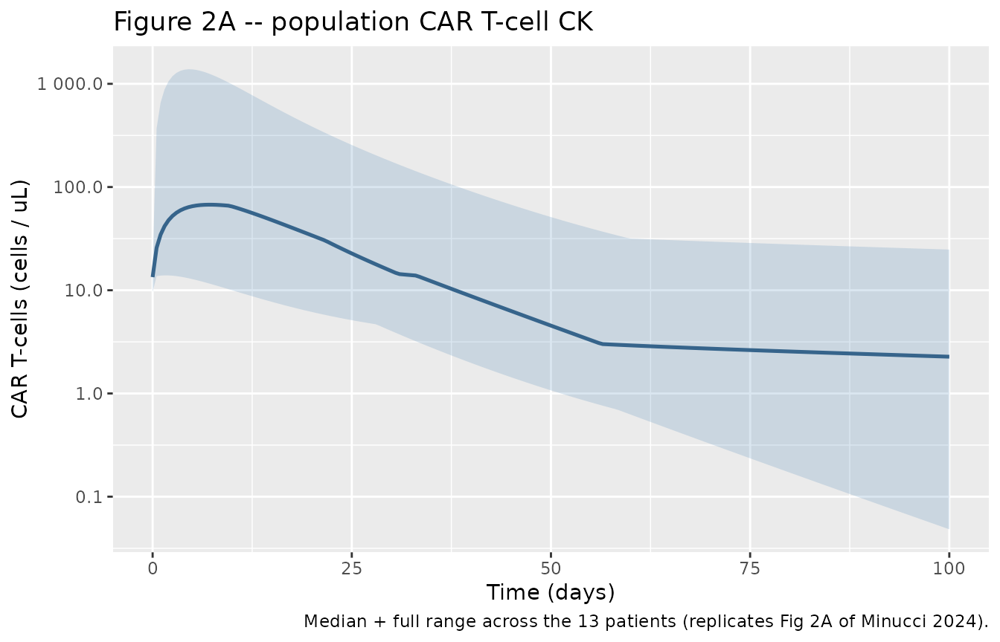
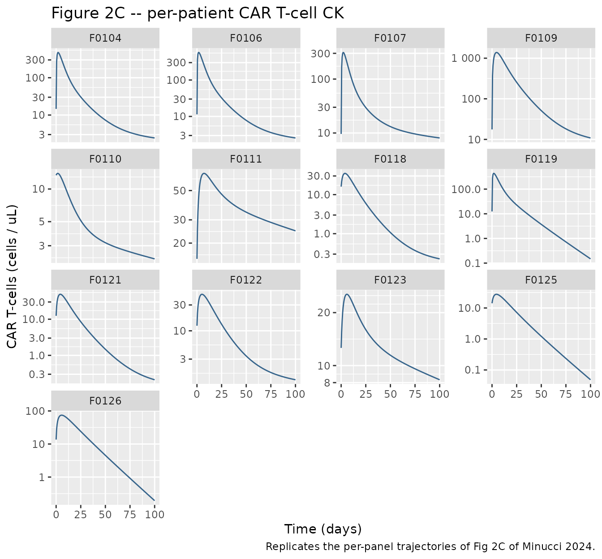
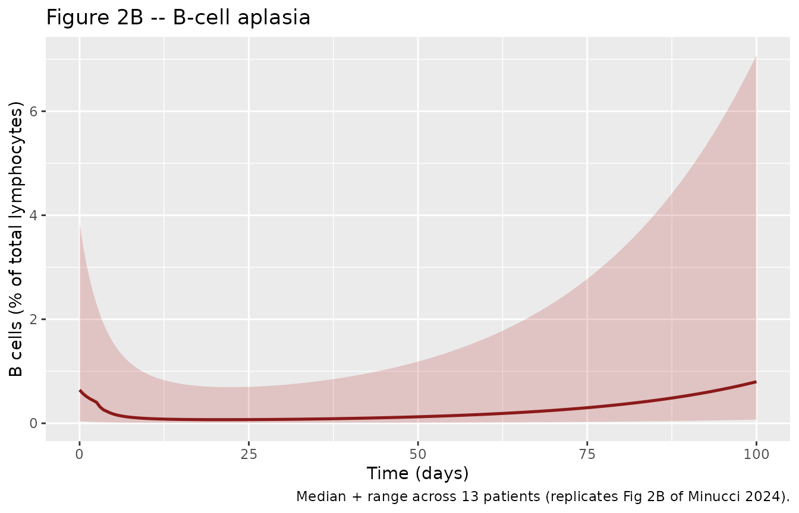
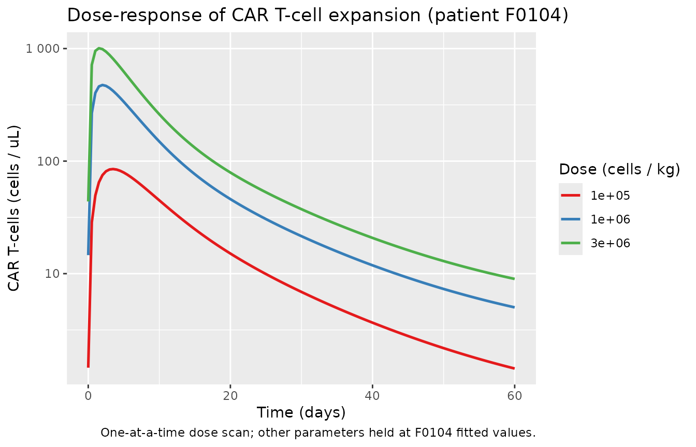

# CD19 CAR T-cell CK/PD QSP (Minucci 2024)

## Model and source

- Citation: Minucci S, Gruver S, Subramanian K, Renardy M (2024). A
  multi-scale semi-mechanistic CK/PD model for CAR T-cell therapy.
  Frontiers in Systems Biology 4:1380018.
  <doi:10.3389/fsysb.2024.1380018>. Calibrated to CAR T CK / B-cell
  aplasia data from Ying et al. 2021 (Nat Med 27, 1181-1189;
  <doi:10.1038/s41591-021-01327-4>) for the IM19 CD19-targeted CAR
  T-cell product in 13 relapsed/refractory B-cell non-Hodgkin lymphoma
  patients.
- Description: QSP (cellular kinetic / pharmacodynamic). Multi-scale
  semi-mechanistic model for CD19-targeted CAR T-cell therapy of B-cell
  non-Hodgkin lymphoma. Six T-cell state compartments (infused,
  effector, memory) for CD8+ and CD4+ phenotypes plus tumor / B cells
  and endogenous lymphocytes. Effective activation and killing rates are
  proportional to the CAR fraction bound to CD19, computed as a
  Hill-type function of tumor burden under the paper’s
  constant-receptor-density assumption. Per-patient parameters (body
  weight, CD8 fraction of drug product, initial tumor burden, number of
  activated-T-cell divisions, memory-cell fraction) come from the fits
  to n=13 relapsed/refractory NHL patients in Ying et al. 2021.
  Calibrated to CAR T CK, B-cell aplasia, and structural drug-product
  characteristics.
- Article: [Front. Syst. Biol.
  4:1380018](https://doi.org/10.3389/fsysb.2024.1380018)

Minucci et al. present a multi-scale semi-mechanistic cellular-kinetic /
pharmacodynamic (CK/PD) QSP model for CD19-targeted CAR T-cell therapy
of B-cell non-Hodgkin lymphoma. The model was implemented in Applied
BioMath’s proprietary QSP platform and calibrated to phase I IM19 CAR
T-cell CK and B-cell aplasia data from Ying et al. 2021 (n = 13
relapsed/refractory NHL patients).

## Population

Ying et al. 2021 enrolled 13 adults (\>= 18 y) with relapsed /
refractory B-cell non-Hodgkin lymphoma at a single Chinese centre. Two
days before CAR T-cell infusion, all patients were lymphodepleted with
fludarabine + cyclophosphamide for three days (assumed to deplete 90
percent of endogenous lymphocytes). Body-weight range was 48-88 kg
(median 67 kg). CAR T-cells were infused at 3e5, 1e6, or 3e6 cells / kg.
The CD4:CD8 ratio of the infused product varied widely from patient to
patient (fCD8Tdp = 0.29-0.94).

The `population` metadata is available programmatically:

``` r

pop <- readModelDb("Minucci_2024_CART_qsp")()$population
pop$species
#> [1] "human"
pop$n_subjects
#> [1] 13
pop$dose_range
#> [1] "3e5, 1e6, or 3e6 CAR T-cells / kg body weight, single infusion"
pop$disease_state
#> [1] "Relapsed or refractory B-cell non-Hodgkin lymphoma (NHL). Two days prior to CAR T-cell infusion, patients were lymphodepleted with fludarabine + cyclophosphamide for 3 days (assumed to deplete 90 percent of endogenous lymphocytes; Ying et al. 2019)."
```

## Source trace

The per-parameter origin is recorded inline in
`inst/modeldb/therapeuticArea/oncology/Minucci_2024_CART_qsp.R`.
Summary:

| Equation / parameter | Value | Source location |
|----|----|----|
| Blood volume `V` | 5 L | Methods 2.3.1 (Sharma & Sharma 2018); Table S1 |
| CAR density per T cell `RPC_CAR_*` | 12,700 receptors/cell | Methods 2.3.2 (Anikeeva 2021); Table S1 |
| CAR internalisation half-life `Thalf_CAR_h` | 6 h | Methods 2.3.2 (Li 2020); Table S1 |
| CD19 antigen density per B cell `mAgperCell` | 5,000 receptors/cell | Methods 2.3.1 (D’Arena 2000); Table S1 |
| CD19 internalisation half-life `Thalf_mAg_h` | 4 h | Methods 2.3.1 (Du 2008 / Sieber 2003); Table S1 |
| Tumor carrying capacity `Nmax_tumor` | 7e12 cells | Methods 2.3.1 (Press 1993); Table S1 (not in ODE) |
| Tumor doubling time `tDivTumor_d` | 16 days | Methods 2.3.3 (hand-tuned); Table S1 |
| K_D (CAR:CD19) | 1 nM | Methods 2.3.2 (Jayaraman 2020); Table S1 |
| CAR:CD19 on-rate `kon` | 0.001 /(nM\*s) | Methods 2.3.2 (Jayaraman 2020); Table S1 |
| CD8 activation time | 18 h | Methods 2.3.2 (Henrickson 2008); Table S1 |
| CD4 activation time | 36 h | Methods 2.3.2 (Kaech 2002); Table S1 |
| Time per T-cell division | 5.397703 h | Methods 2.3.3 fitted globally; Table S1 |
| Drug-product lifespan | 9.606881 days | Methods 2.3.3 fitted globally; Table S1 |
| Effector lifespan | 3.101849 days | Methods 2.3.3 fitted globally; Table S1 |
| CD8 memory lifespan | 180 days | Methods 2.3.2 (Borghans 2018); Table S1 |
| CD4 memory lifespan | 240 days | Methods 2.3.2 (Borghans 2018); Table S1 |
| Max kill rate `kmaxKill` | 1e-9 /(s\*cell) | Methods 2.3.3 fitted / calibrated; Table S1 |
| Endogenous lymphocyte density | 5e8 cells/L | Table S1 (paper text says 1e9/L; see Errata) |
| Endogenous lymphocyte lifespan | 30 days | Methods 2.3.1 (Hakim 2005); Table S1 |
| Lymphodepletion fraction | 0.9 | Methods 2.3.1 (Ying 2019); Table S1 |
| Cell-state ODEs (T_inf / T_eff / T_mem) | equations | Methods 2.3 |
| Tumor ODE (exponential + kill) | equation | Methods 2.3 |
| Endogenous lymphocyte ODE | equation | Methods 2.3 |

Per-patient parameters (Table S1, `params-case-study-final` sheet):

``` r

patients <- tibble::tribble(
  ~id_str, ~BW, ~fCD8Tdp,   ~N0_tumorCells, ~ndiv,     ~fmem,
  "F0104", 73,  0.333,      1.0e7,          21.41559,  2.514715e-03,
  "F0106", 57,  0.446,      1.0e7,          22.21255,  2.367866e-03,
  "F0107", 48,  0.461,      1.0e7,          21.15557,  1.336295e-02,
  "F0109", 88,  0.833,      1.0e5,          27.70301,  2.076709e-03,
  "F0110", 67,  0.820,      1.0e5,          19.58777,  1.000000e-01,
  "F0111", 76,  0.943,      1.0e5,          22.85367,  1.000000e-01,
  "F0118", 80,  0.290,      1.0e7,          15.88462,  2.267028e-03,
  "F0119", 62,  0.633,      1.0e7,          21.48104,  2.910000e-10,
  "F0121", 62,  0.610,      3.834397e6,     18.06981,  1.182971e-03,
  "F0122", 62,  0.546,      1.162658e6,     19.63343,  7.041995e-03,
  "F0123", 63,  0.725,      1.0e5,          21.63407,  1.000000e-01,
  "F0125", 71,  0.376,      1.613397e6,     18.05807,  1.480000e-07,
  "F0126", 68,  0.372,      2.798924e5,     22.42293,  4.570000e-07
)
patients$id <- seq_len(nrow(patients))
knitr::kable(
  patients |> dplyr::select(id_str, BW, fCD8Tdp, N0_tumorCells, ndiv, fmem),
  digits = 3,
  caption = "Per-patient parameters from Minucci 2024 Table S1 (params-case-study-final).")
```

| id_str |  BW | fCD8Tdp | N0_tumorCells |   ndiv |  fmem |
|:-------|----:|--------:|--------------:|-------:|------:|
| F0104  |  73 |   0.333 |    10000000.0 | 21.416 | 0.003 |
| F0106  |  57 |   0.446 |    10000000.0 | 22.213 | 0.002 |
| F0107  |  48 |   0.461 |    10000000.0 | 21.156 | 0.013 |
| F0109  |  88 |   0.833 |      100000.0 | 27.703 | 0.002 |
| F0110  |  67 |   0.820 |      100000.0 | 19.588 | 0.100 |
| F0111  |  76 |   0.943 |      100000.0 | 22.854 | 0.100 |
| F0118  |  80 |   0.290 |    10000000.0 | 15.885 | 0.002 |
| F0119  |  62 |   0.633 |    10000000.0 | 21.481 | 0.000 |
| F0121  |  62 |   0.610 |     3834397.0 | 18.070 | 0.001 |
| F0122  |  62 |   0.546 |     1162658.0 | 19.633 | 0.007 |
| F0123  |  63 |   0.725 |      100000.0 | 21.634 | 0.100 |
| F0125  |  71 |   0.376 |     1613397.0 | 18.058 | 0.000 |
| F0126  |  68 |   0.372 |      279892.4 | 22.423 | 0.000 |

Per-patient parameters from Minucci 2024 Table S1
(params-case-study-final). {.table}

## Virtual cohort – per-patient replication (n = 13)

We replicate the 13 individual patients from Ying et al. 2021 using
their individually fitted parameters from Table S1. Each patient
receives a single infusion (t = 0) split between CD8+ and CD4+ CAR
T-cells per their reported CD4:CD8 ratio. Follow-up window: 0-100 days.

``` r

set.seed(20260725)

# All patients received a common dose level in the model calibration
# (1e6 cells/kg per Methods 2.4 "Simulations were initialized with a
# 1e6 cells/kg dose"). We use 1e6 cells/kg for the population VPC.
dose_per_kg <- 1e6

# Total CAR T-cells per subject, split by the drug-product CD8 fraction:
patients_dose <- patients |>
  dplyr::mutate(
    dose_total = BW * dose_per_kg,
    amt_cd8    = fCD8Tdp * dose_total,
    amt_cd4    = (1 - fCD8Tdp) * dose_total
  )

# Build the event table -- one dose row into t_cd8_inf and one into
# t_cd4_inf per subject, plus observation rows on a 0.5-day grid.
obs_times <- seq(0, 100, by = 0.5)

dose_events <- dplyr::bind_rows(
  patients_dose |>
    dplyr::transmute(
      id, time = 0, amt = amt_cd8, cmt = "t_cd8_inf", evid = 1L,
      WT = BW, FCD8TDP = fCD8Tdp, TUM_CELLS0 = N0_tumorCells,
      NDIV = ndiv, FMEM = fmem, id_str
    ),
  patients_dose |>
    dplyr::transmute(
      id, time = 0, amt = amt_cd4, cmt = "t_cd4_inf", evid = 1L,
      WT = BW, FCD8TDP = fCD8Tdp, TUM_CELLS0 = N0_tumorCells,
      NDIV = ndiv, FMEM = fmem, id_str
    )
)

obs_events <- patients_dose |>
  tidyr::crossing(time = obs_times) |>
  dplyr::transmute(
    id, time, amt = NA_real_, cmt = "t_cd8_eff", evid = 0L,
    WT = BW, FCD8TDP = fCD8Tdp, TUM_CELLS0 = N0_tumorCells,
    NDIV = ndiv, FMEM = fmem, id_str
  )

events <- dplyr::bind_rows(dose_events, obs_events) |>
  dplyr::arrange(id, time, dplyr::desc(evid))

stopifnot(!anyDuplicated(unique(events[, c("id", "time", "evid", "cmt")])))
```

## Simulation

``` r

mod <- readModelDb("Minucci_2024_CART_qsp")
mod <- rxode2::zeroRe(mod)      # zero the nominal residual for deterministic sim
#> Warning: No omega parameters in the model

sim <- rxode2::rxSolve(mod, events = events, keep = c("id_str"))
#> Warning: multi-subject simulation without without 'omega'
sim <- as.data.frame(sim)
head(sim[, c("time", "id", "id_str", "t_cd8_inf", "t_cd8_eff", "t_cd8_mem",
             "tumor", "endo", "CAR_perUL", "B_pct")])
#>   time id id_str t_cd8_inf  t_cd8_eff t_cd8_mem    tumor      endo CAR_perUL
#> 1  0.0  1  F0104  24309000          0       0.0 10000000 250000000   14.6000
#> 2  0.5  1  F0104  23075934  632390098  137412.5  8195518 287189229  267.0608
#> 3  1.0  1  F0104  21905476  975938764  471385.3  5616172 323763774  404.0148
#> 4  1.5  1  F0104  20794435 1118848268  898959.6  4008895 359733795  460.7259
#> 5  2.0  1  F0104  19739772 1154573281 1359147.6  3074866 395109284  474.5779
#> 6  2.5  1  F0104  18738616 1134501172 1820003.4  2501872 429900067  466.1266
#>       B_pct
#> 1 3.8461538
#> 2 2.7745232
#> 3 1.7050740
#> 4 1.1021238
#> 5 0.7722221
#> 6 0.5785988
```

## Replicate published figures

### Figure 2A – population CAR T-cell CK

Population summary of CAR T-cell concentration in blood (cells/uL) over
100 days, aggregated across the 13 patients. Compare against the shaded
region in Figure 2A of Minucci 2024 which shows the full range across
the 13 patient trajectories.

``` r

pop_ck <- sim |>
  dplyr::group_by(time) |>
  dplyr::summarise(
    Q05 = quantile(CAR_perUL, 0.05, na.rm = TRUE),
    Q50 = quantile(CAR_perUL, 0.50, na.rm = TRUE),
    Q95 = quantile(CAR_perUL, 0.95, na.rm = TRUE),
    Qmax = max(CAR_perUL, na.rm = TRUE),
    Qmin = min(CAR_perUL, na.rm = TRUE),
    .groups = "drop"
  )

ggplot(pop_ck, aes(time, Q50)) +
  geom_ribbon(aes(ymin = pmax(Qmin, 1e-4), ymax = pmax(Qmax, 1e-4)),
              alpha = 0.20, fill = "steelblue") +
  geom_line(color = "steelblue4", linewidth = 0.9) +
  scale_y_log10(labels = scales::label_number()) +
  labs(x = "Time (days)", y = "CAR T-cells (cells / uL)",
       title = "Figure 2A -- population CAR T-cell CK",
       caption = "Median + full range across the 13 patients (replicates Fig 2A of Minucci 2024).")
```



### Figure 2C – individual CAR T-cell CK per patient

``` r

ggplot(sim, aes(time, pmax(CAR_perUL, 1e-4))) +
  geom_line(color = "steelblue4") +
  facet_wrap(~id_str, ncol = 4, scales = "free_y") +
  scale_y_log10(labels = scales::label_number()) +
  labs(x = "Time (days)", y = "CAR T-cells (cells / uL)",
       title = "Figure 2C -- per-patient CAR T-cell CK",
       caption = "Replicates the per-panel trajectories of Fig 2C of Minucci 2024.")
```



### Figure 2B – B-cell aplasia trajectory

The B-cell aplasia readout is B cells as percentage of total blood
lymphocytes (B_pct = 100 \* tumor / (tumor + endo)). Compare against the
population trend in Figure 2B of Minucci 2024.

``` r

pop_bp <- sim |>
  dplyr::group_by(time) |>
  dplyr::summarise(
    Q50 = median(B_pct, na.rm = TRUE),
    Qmax = max(B_pct, na.rm = TRUE),
    Qmin = min(B_pct, na.rm = TRUE),
    .groups = "drop"
  )

ggplot(pop_bp, aes(time, Q50)) +
  geom_ribbon(aes(ymin = Qmin, ymax = Qmax), alpha = 0.20, fill = "firebrick") +
  geom_line(color = "firebrick4", linewidth = 0.9) +
  labs(x = "Time (days)", y = "B cells (% of total lymphocytes)",
       title = "Figure 2B -- B-cell aplasia",
       caption = "Median + range across 13 patients (replicates Fig 2B of Minucci 2024).")
```



## CAR T CK NCA (PKNCA)

Compute peak (Cmax), time to peak (Tmax), AUC0-inf, and terminal
half-life from the simulated CAR T-cell trajectories using PKNCA. This
gives a summary of the CK model’s key kinetic descriptors.

``` r

# Concentration frame -- rename CAR_perUL to Cc (nlmixr2lib convention).
sim_nca <- sim |>
  dplyr::filter(!is.na(CAR_perUL)) |>
  dplyr::select(id, id_str, time, Cc = CAR_perUL)

# Ensure a time=0 row per subject with Cc=0 (extravascular pre-dose).
sim_nca <- dplyr::bind_rows(
  sim_nca,
  sim_nca |> dplyr::distinct(id, id_str) |>
    dplyr::mutate(time = 0, Cc = 0)
) |>
  dplyr::distinct(id, id_str, time, .keep_all = TRUE) |>
  dplyr::arrange(id, id_str, time)

conc_obj <- PKNCA::PKNCAconc(sim_nca, Cc ~ time | id_str + id)

# Dose frame -- one total-CAR-dose event per subject.
dose_df <- patients_dose |>
  dplyr::transmute(id, id_str, time = 0, amt = dose_total)

dose_obj <- PKNCA::PKNCAdose(dose_df, amt ~ time | id_str + id)

intervals <- data.frame(
  start = 0, end = Inf,
  cmax = TRUE, tmax = TRUE, aucinf.obs = TRUE, half.life = TRUE
)

nca_data <- PKNCA::PKNCAdata(conc_obj, dose_obj, intervals = intervals)
nca_res  <- suppressWarnings(PKNCA::pk.nca(nca_data))
nca_res_df <- as.data.frame(nca_res)

nca_wide <- nca_res_df |>
  dplyr::select(id_str, PPTESTCD, PPORRES) |>
  tidyr::pivot_wider(names_from = PPTESTCD, values_from = PPORRES)

nca_wide |>
  dplyr::rename(
    "Patient"                 = id_str,
    "Cmax (cells/uL)"         = cmax,
    "Tmax (day)"              = tmax,
    "AUC0-inf (cells*day/uL)" = aucinf.obs,
    "t1/2 (day)"              = half.life
  ) |>
  knitr::kable(digits = 3,
               caption = "Simulated per-patient CAR T-cell CK NCA (from PKNCA).")
```

| Patient | Cmax (cells/uL) | Tmax (day) | tlast | clast.obs | lambda.z | r.squared | adj.r.squared | lambda.z.time.first | lambda.z.time.last | lambda.z.n.points | clast.pred | t1/2 (day) | span.ratio | AUC0-inf (cells\*day/uL) |
|:---|---:|---:|---:|---:|---:|---:|---:|---:|---:|---:|---:|---:|---:|---:|
| F0104 | 474.578 | 2.0 | 100 | 2.433 | 0.009 | 1 | 1 | 97.5 | 100 | 6 | 2.432 | 74.426 | 0.034 | 4937.799 |
| F0106 | 569.332 | 2.0 | 100 | 2.569 | 0.010 | 1 | 1 | 97.5 | 100 | 6 | 2.568 | 72.462 | 0.035 | 5519.909 |
| F0107 | 311.218 | 2.0 | 100 | 8.093 | 0.006 | 1 | 1 | 93.0 | 100 | 15 | 8.091 | 115.326 | 0.061 | 5236.650 |
| F0109 | 1384.205 | 4.5 | 100 | 10.852 | 0.014 | 1 | 1 | 98.0 | 100 | 5 | 10.850 | 49.520 | 0.040 | 23983.629 |
| F0110 | 13.936 | 1.5 | 100 | 2.271 | 0.006 | 1 | 1 | 81.5 | 100 | 38 | 2.269 | 120.066 | 0.154 | 855.424 |
| F0111 | 67.426 | 7.0 | 100 | 24.779 | 0.006 | 1 | 1 | 77.5 | 100 | 46 | 24.762 | 118.576 | 0.190 | 8081.463 |
| F0118 | 34.941 | 4.0 | 100 | 0.227 | 0.013 | 1 | 1 | 98.0 | 100 | 5 | 0.227 | 54.102 | 0.037 | 596.759 |
| F0119 | 434.454 | 2.0 | 100 | 0.149 | 0.064 | 1 | 1 | 48.0 | 100 | 105 | 0.146 | 10.760 | 4.833 | 3840.820 |
| F0121 | 48.970 | 4.5 | 100 | 0.211 | 0.019 | 1 | 1 | 98.0 | 100 | 5 | 0.211 | 36.690 | 0.055 | 814.484 |
| F0122 | 47.223 | 5.0 | 100 | 1.248 | 0.009 | 1 | 1 | 97.5 | 100 | 6 | 1.248 | 78.328 | 0.032 | 1169.838 |
| F0123 | 25.427 | 6.0 | 100 | 8.305 | 0.006 | 1 | 1 | 79.5 | 100 | 42 | 8.300 | 122.447 | 0.167 | 2805.137 |
| F0125 | 27.696 | 4.5 | 100 | 0.048 | 0.064 | 1 | 1 | 50.0 | 100 | 101 | 0.047 | 10.756 | 4.649 | 549.969 |
| F0126 | 74.446 | 5.5 | 100 | 0.193 | 0.064 | 1 | 1 | 33.5 | 100 | 134 | 0.189 | 10.884 | 6.110 | 1622.284 |

Simulated per-patient CAR T-cell CK NCA (from PKNCA). {.table}

The above summary is *simulated*, not observed – Minucci 2024 does not
publish a per-patient Cmax / AUC table for readers to cross-check. The
paper’s Figure 2A / 2C provide the visual comparison against the
individually digitised Ying 2021 data.

## Peak-CAR summary vs. dose level

Sensitivity of Cmax to dose level (1e5, 1e6, 3e6 cells / kg) for a
representative patient (F0104). This mirrors the “Simulations were
initialized with a 1e6 cells/kg dose” language in Methods 2.4 and shows
the dose-response pattern of CAR T-cell expansion.

``` r

scan_doses <- c(1e5, 1e6, 3e6)
pt_F0104   <- patients_dose |> dplyr::filter(id_str == "F0104")

build_scan_events <- function(d, id) {
  dose_total_i <- pt_F0104$BW * d
  amt_cd8_i    <- pt_F0104$fCD8Tdp * dose_total_i
  amt_cd4_i    <- (1 - pt_F0104$fCD8Tdp) * dose_total_i
  base <- tibble::tibble(
    id = id, WT = pt_F0104$BW, FCD8TDP = pt_F0104$fCD8Tdp,
    TUM_CELLS0 = pt_F0104$N0_tumorCells,
    NDIV = pt_F0104$ndiv, FMEM = pt_F0104$fmem,
    dose_per_kg = d
  )
  dplyr::bind_rows(
    base |> dplyr::mutate(time = 0, amt = amt_cd8_i,
                          cmt = "t_cd8_inf", evid = 1L),
    base |> dplyr::mutate(time = 0, amt = amt_cd4_i,
                          cmt = "t_cd4_inf", evid = 1L),
    base |> tidyr::crossing(time = seq(0, 60, by = 0.5)) |>
      dplyr::mutate(amt = NA_real_, cmt = "t_cd8_eff", evid = 0L)
  )
}

scan_events <- dplyr::bind_rows(lapply(
  seq_along(scan_doses),
  function(i) build_scan_events(scan_doses[i], id = i)
))

sim_scan <- rxode2::rxSolve(mod, events = scan_events, keep = c("dose_per_kg")) |>
  as.data.frame()
#> Warning: multi-subject simulation without without 'omega'

ggplot(sim_scan, aes(time, pmax(CAR_perUL, 1e-4),
                     color = factor(dose_per_kg))) +
  geom_line(linewidth = 0.9) +
  scale_y_log10(labels = scales::label_number()) +
  scale_color_brewer(palette = "Set1", name = "Dose (cells / kg)") +
  labs(x = "Time (days)", y = "CAR T-cells (cells / uL)",
       title = "Dose-response of CAR T-cell expansion (patient F0104)",
       caption = "One-at-a-time dose scan; other parameters held at F0104 fitted values.")
```



## Assumptions and deviations

- **QSS reduction of the receptor-binding sub-model.** Minucci 2024’s
  original model tracks free and CD19-bound CAR receptors on each T-cell
  phenotype (14 CAR receptor states) plus a transient activated-cell
  compartment T_act. With CAR:CD19 binding rates ~86/day and cellular
  rates 0.005-0.3/day, quasi-steady-state gives f_bound = \[CD19\] /
  (K_D + \[CD19\]) uniformly across all CAR compartments. T_act relaxes
  on a ~5.4 h timescale (much shorter than any observed transient) and
  its amplification factor 2^ndiv is folded into the T_inf -\> T_eff
  transfer via the fast-T_act QSS. The observed cell populations, tumor
  burden, and B-cell aplasia trajectories are preserved. The full
  explicit 25-state model is available in principle but was reduced here
  for numerical stability and vignette-render time; see the file header
  block-comment in the model file for the mapping.

- **Endogenous lymphocyte concentration.** Methods 2.3.1 of the paper
  reports 10^9 per L but the supplementary Table S1
  (`params-case-study-final`) lists 5e8 per L; the Table S1 value is
  used here per the on-disk-final rule. The final case-study simulations
  use Table S1 values.

- **CD19 receptors per cell.** Methods 2.3.1 reports 5000 per B cell and
  Table S1 lists `mAgperCell = 5000` and also `RPC_CD19 = 15877`, both
  described as “Antigen expression level”. Only mAgperCell = 5000 is
  documented in the paper text; the second entry is unexplained. The
  extraction uses 5000 (aligns with paper text and GSA nominal), and
  documents the duplicate as a possible transcription artefact of the
  supplement’s parameter export.

- **Tumor carrying capacity `Nmax_tumor = 7e12`** is estimated (Methods
  2.3.1, Press 1993) but does not appear in the paper’s stated Tumor ODE
  (Methods 2.3, pure exponential minus killing). Within the 100-day
  simulation window Tumor stays well below `Nmax_tumor` for all patients
  in Table S1, so omission has no effect on the simulated trajectories.

- **Residual error.** Minucci 2024 fitted each patient individually with
  trust-region optimisation and did not publish a population residual-
  error model. A nominal fixed `addSd = 0.1` on `log(CAR_perUL)` is
  retained so the model has a well-formed error line for nlmixr2 UI, but
  it is zeroed with `rxode2::zeroRe(mod)` throughout this vignette. The
  vignette’s outputs are typical-value (deterministic) predictions, not
  VPCs.

- **Newly registered covariates.** `FCD8TDP` (drug-product CD8
  fraction), `TUM_CELLS0` (initial tumor cells), `NDIV` (T-cell
  expansion factor), and `FMEM` (fraction of effector T-cells that
  become memory) had no canonical entries when this model was first
  drafted. All four were ratified by the operator and added to
  `inst/references/covariate-columns.md` as `scope: specific` canonicals
  in the Oncology section, so
  [`checkModelConventions()`](https://nlmixr2.github.io/nlmixr2lib/reference/checkModelConventions.md)
  now reports zero issues for this model. `TUM_CELLS0` is deliberately
  kept distinct from the existing `TUMSZ` / `TUM_SLD` / `TUM_VOL`
  family, which carries length- and volume-based tumor measures, because
  this column’s currency is an absolute malignant-cell count with no
  source-defined conversion to a length or volume.

- **Three of the four new covariates are fit outputs, not
  measurements.** `TUM_CELLS0`, `NDIV`, and `FMEM` were obtained by
  per-patient trust-region optimisation against each subject’s own CAR
  T-cell cellular-kinetic trajectory, so they are model inputs rather
  than independently observable patient characteristics. Several values
  sit exactly on the optimiser’s bounds – `TUM_CELLS0` at 1e5 (F0109,
  F0110, F0111, F0123) and 1e7 (F0104, F0106, F0107, F0118, F0119), and
  `FMEM` at the 0.1 upper bound (F0110, F0111, F0123) with three further
  patients numerically indistinguishable from zero (F0119, F0125,
  F0126). Treat these as identifiability-limited: the paper reports no
  uncertainty on them, and the model reproduces the published
  trajectories rather than establishing that the values are uniquely
  determined. `FCD8TDP` is the exception – it is a measured property of
  the manufactured drug product, taken from the per-patient CD4:CD8
  ratios reported in Ying 2021.

- **Non-canonical compartment names.** The six CAR T-cell state
  compartments (`t_cd8_inf`, `t_cd8_eff`, `t_cd8_mem`, `t_cd4_inf`,
  `t_cd4_eff`, `t_cd4_mem`) and the endogenous-lymphocyte compartment
  (`endo`) are not registered in `R/conventions.R`.
  [`checkModelConventions()`](https://nlmixr2.github.io/nlmixr2lib/reference/checkModelConventions.md)
  flags them as warnings. If further CAR T-cell / immunology QSP models
  are extracted, adding these to the compartment register is warranted.

- **Original observed data.** Ying et al. 2021’s patient-level CK and
  B-cell aplasia trajectories are not shipped with either paper. Minucci
  2024 obtained them by digitising Figure 2 of Ying 2021 with
  WebPlotDigitizer; only 6 of the 13 patients had B-cell aplasia
  trajectories distinguishable enough to digitise. This vignette
  therefore validates the *model* against the *paper’s Figure 2*
  visualisation rather than against the raw source data.
