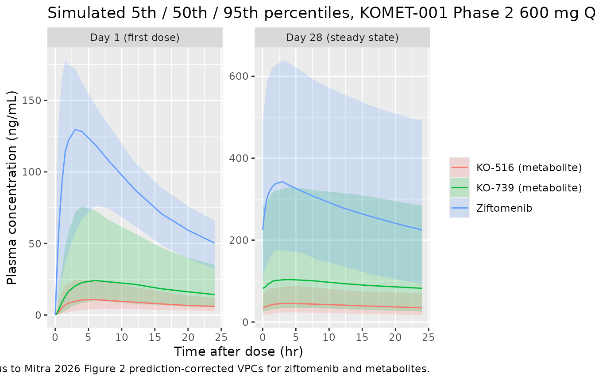

# Ziftomenib (Mitra 2026)

## Model and source

- Citation: Mitra A, Yang X, Ortiz RH, Jomphe C, Leoni M, Gosselin NH.
  Population Pharmacokinetics and Exposure-Response Analysis of
  Ziftomenib in Relapsed or Refractory Acute Myeloid Leukemia Patients
  With NPM1 Mutation. CPT Pharmacometrics Syst Pharmacol. 2026.
  <doi:10.1002/psp4.70244>.
- Description: Sequential two-stage population PK model for oral
  ziftomenib (a potent, selective, oral menin inhibitor for R/R
  NPM1-mutated acute myeloid leukemia) and its two active metabolites
  KO-739 and KO-516 (Mitra 2026 Kura Oncology KOMET-001 + KO-MEN-003).
  Parent PK is a 2-compartment model with first-order absorption,
  absorption lag time, and linear elimination from the central
  compartment; oral bioavailability F1 is fixed at 0.129
  (identifiability constraint from the human ADME + absolute-BA study
  KO-MEN-005). Each metabolite is 2-compartment with linear elimination;
  the metabolic clearance is split between KO-739 and KO-516 by a fixed
  1:1 in-vitro-anchored biotransformation ratio (FM_KO516 = 0.5), with
  the total metabolized fraction FM held fixed at 0.535 after an initial
  identifiability-limited estimation. Covariate effects retained in the
  final model: FED and PPI on parent F1 (logit-scale shifts +3.21 fed;
  -0.520 PPI = 6.09x and 0.627x multipliers on F1), PPI on parent Ka
  (log-scale shift -0.485 = 0.616x), FED on parent absorption lag time
  (log-scale shift +0.322 = 1.38x), strong CYP3A4 inhibitor on parent
  CL/F (log-scale -0.778 = 0.459x), healthy-volunteer status on parent
  CL/F (log-scale +0.950 = 2.59x), healthy-volunteer status on FM
  (logit-scale -1.62 = 0.348x multiplier on FM), strong CYP3A4 inhibitor
  on KO-739 CL (log-scale -1.64 = 0.195x), strong CYP3A4 inhibitor on
  KO-516 CL (log-scale -0.802 = 0.449x), healthy-volunteer status on
  KO-739 Vc (log-scale -1.62 = 0.197x), and healthy-volunteer status on
  KO-516 Vc (log-scale -1.87 = 0.154x). No effect of NPM1-m vs KMT2A-r
  mutational status, body weight, sex, race, age, mild/moderate renal or
  hepatic impairment, or P-gp inhibitor coadministration on ziftomenib
  PK. IIV: parent 47.3% CV on CL and 120% CV on Vc; metabolites 74.7%
  (KO-739 CL), 110% (KO-739 Vc), 162% (KO-739 Q), 31.2% (KO-516 CL),
  191% (KO-516 Vc), 118% (KO-516 Q), and 56.8% CV on FM (all independent
  diagonals). Inter-occasion variability on F1 (Omega 1.06 corresponding
  to 137.3% CV) reported in the parent NONMEM run across 3 occasions is
  not encoded structurally here (no operational occasion column is
  defined for the model-library use case; see vignette Assumptions and
  deviations). Residual error: proportional 43.7% CV on parent Cc;
  proportional 45.2% CV plus additive 0.128 ng/mL on Cc_ko739;
  proportional 36.4% CV on Cc_ko516.
- Article: <https://doi.org/10.1002/psp4.70244>

Mitra et al. (2026) developed a sequential two-stage population
pharmacokinetic model for oral ziftomenib – a potent, highly selective,
oral menin inhibitor developed by Kura Oncology for treatment of
relapsed or refractory NPM1-mutated acute myeloid leukemia (R/R NPM1-m
AML) – and its two active minor metabolites KO-739 and KO-516. Data were
pooled from two studies (188 subjects, 2436 / 2376 / 2299 measurable
plasma concentrations of ziftomenib / KO-739 / KO-516 respectively): the
Phase 1/2 KOMET-001 study of once-daily oral ziftomenib in 174 R/R AML
patients (50-1000 mg dose-escalation in Phase 1a; 600 mg QD in Phase 2),
and the Phase 1 KO-MEN-003 crossover study in 14 healthy volunteers of
the food- and PPI-effect on a single 400 mg oral dose. The structural
model is a 2-compartment model for the parent with first-order
absorption, an absorption lag time, and linear elimination, plus a
separate 2-compartment model for each of the two metabolites; the
parent-to-metabolite mass flux is partitioned by a fraction metabolized
(FM = 0.535) and a 1:1 KO-739:KO-516 in-vitro-anchored biotransformation
ratio. The covariate model retained food (FED) and PPI on parent F1 and
Ka, FED on parent lag time, strong CYP3A4 inhibitor and
healthy-volunteer status on parent CL/F, healthy-volunteer status on
parent-to-metabolite FM, strong CYP3A4 inhibitor on KO-739 and KO-516
CL, and healthy-volunteer status on KO-739 and KO-516 Vc. Notably, no
effect of NPM1-m vs KMT2A-r mutational status, body weight, sex, race,
age, mild or moderate renal or hepatic impairment, or P-gp inhibitor
coadministration on ziftomenib PK was retained in the final model. This
vignette reproduces the typical-value structural model, simulates the
KOMET-001 600 mg QD Phase 2 registrational regimen in R/R AML patients
under the reference (fasted, no PPI, no CYP3A4 inhibitor) condition, and
validates the simulated NCA outputs against the paper’s reported
exposure ranges (Section 3.3 “the median exposure parameters at
different dose levels … AUCss … Cmax … Ctrough”).

## Population

The pooled analysis cohort (N = 188) was 174 adult R/R AML patients from
KOMET-001 (predominantly NPM1-m in the registrational Phase 2 arm and
mixed NPM1-m + KMT2A-r + other in Phase 1a dose-escalation) plus 14
healthy volunteers from the KO-MEN-003 food-effect / PPI-effect
crossover study. Overall patient demographics (Supplementary Table S1):
median age 64.5 years (range 18-86), median body weight 71.5 kg (range
41-135), 51.1% female, 75.0% White. Baseline hepatic function in the
KOMET-001 patients: 78.7% normal, 18.4% mild, 2.9% moderate hepatic
impairment; no severe hepatic impairment enrolled. Baseline renal
function: 42.0% normal, 37.9% mild, 12.1% moderate renal impairment; no
severe renal impairment enrolled. Plasma concentrations of ziftomenib,
KO-739, and KO-516 were measured by validated bioanalytical assays with
LLOQ 0.2 ng/mL for each analyte.

The same information is available programmatically via the model’s
`population` metadata
(`rxode2::rxode(readModelDb("Mitra_2026_ziftomenib"))$meta$population`).

## Source trace

The per-parameter origin is recorded as an in-file comment next to each
`ini()` entry in `inst/modeldb/specificDrugs/Mitra_2026_ziftomenib.R`.
The table below collects them in one place for review.

| Equation / parameter | Value (linear scale) | Source location |
|----|----|----|
| `lka` (parent KA) | 0.0928 (1/hr) | Mitra 2026 Table 1 KA = 0.0928 1/h; Supp NONMEM TH2 = -2.38 |
| `lcl` (parent CL/F) | 11.6 (L/hr) | Table 1 CL = 11.6 L/h; Supp TH4 = 2.45 |
| `lvc` (parent Vc/F) | 54.6 (L) | Table 1 Vc = 54.6 L; Supp TH3 = 4.00 |
| `lq` (parent Q/F) | 27.7 (L/hr) | Table 1 Q = 27.7 L/h; Supp TH5 = 3.32 |
| `lvp` (parent Vp/F) | 1106 (L) | Table 1 Vp = 1106 L; Supp TH6 = 7.01 |
| `ltlag` (parent lag) | 0.325 (hr) | Table 1 Lag = 0.325 h; Supp TH7 = 0.325 |
| `logitfdepot` (parent F1) | 0.129 fixed | Table 1 F1 = 0.129 Fixed; Supp TH1 = -1.91 FIX (logit scale) |
| `e_fed_logitfdepot` | +3.21 logit shift (F1 x 6.09) | Table 1 ‘Effect of FED on F1’ = x6.09; Supp TH14 = 3.21 |
| `e_conmed_ppi_logitfdepot` | -0.520 logit shift (F1 x 0.627) | Table 1 ‘Effect of PPI on F1’ = x0.627; Supp TH15 = -0.520 |
| `e_conmed_ppi_ka` | -0.485 log shift (KA x 0.616) | Table 1 ‘Effect of PPI on Ka’ = x0.616; Supp TH13 = -0.485 |
| `e_fed_ltlag` | +0.322 log shift (lag x 1.38) | Table 1 ‘Effect of FED on Lag’ = x1.38; Supp TH16 = 0.322 |
| `e_dis_healthy_cl` | +0.950 log shift (CL x 2.59) | Table 1 ‘Healthy volunteers on CL’ = x2.59; Supp TH12 = 0.950 |
| `e_conmed_cyp3a4_inh_strong_cl` | -0.778 log shift (CL x 0.459) | Table 1 ‘Strong CYP3A4 inhibitors on CL’ = x0.459; Supp TH11 = -0.778 |
| IIV CL parent (Omega 4,4) | 0.202 (47.3% CV) | Table 1 IIV(%) = 47.3%; Supp OMEGA(4,4) = 0.202 |
| IIV Vc parent (Omega 3,3) | 0.893 (120% CV) | Table 1 IIV(%) = 120%; Supp OMEGA(3,3) = 0.893 |
| `propSd` parent | 0.437 (43.7% CV) | Table 1 Proportional residual = 43.7%; Supp TH8 = 0.437 |
| `lcl_ko739` | 8.50 (L/hr) | Table 1 CL of KO-739 = 8.50 L/h; Supp meta TH4 = 2.14 |
| `lvc_ko739` | 8.20 (L) | Table 1 Vc of KO-739 = 8.20 L; Supp meta TH2 = 2.10 |
| `lq_ko739` | 4.13 (L/hr) | Table 1 Q_KO-739 = 4.13 L/h; Supp meta TH1 = 1.42 |
| `lvp_ko739` | 240 (L) | Table 1 Vp of KO-739 = 240 L; Supp meta TH3 = 5.48 |
| `lcl_ko516` | 21.7 (L/hr) | Table 1 CL of KO-516 = 21.7 L/h; Supp meta TH8 = 3.08 |
| `lvc_ko516` | 11.8 (L) | Table 1 Vc of KO-516 = 11.8 L; Supp meta TH6 = 2.47 |
| `lq_ko516` | 9.55 (L/hr) | Table 1 Q of KO-516 = 9.55 L/h; Supp meta TH5 = 2.26 |
| `lvp_ko516` | 604 (L) | Table 1 Vp of KO-516 = 604 L; Supp meta TH7 = 6.40 |
| `logitfm` (FM) | 0.535 fixed | Table 1 FM = 0.535 Fixed; Supp meta TH9 = 0.14 FIX (logit scale) |
| `fm_ko516_frac` (in `model()`) | 0.5 fixed inline | Table 1 FM of KO-516 = 0.5 Fixed; Supp meta TH10 = 0 FIX (logit scale) |
| `e_dis_healthy_logitfm` | -1.62 logit shift (FM x 0.348) | Table 1 ‘Healthy volunteers on FM’ = x0.348; Supp meta TH17 = -1.62 |
| `e_conmed_cyp3a4_inh_strong_cl_ko739` | -1.64 log shift (CL_KO-739 x 0.195) | Table 1 ‘Strong CYP3A4 inhibitors on CL of KO-739’ = x0.195; Supp meta TH18 = -1.64 |
| `e_conmed_cyp3a4_inh_strong_cl_ko516` | -0.802 log shift (CL_KO-516 x 0.449) | Table 1 ‘Strong CYP3A4 inhibitors on CL of KO-516’ = x0.449; Supp meta TH19 = -0.802 |
| `e_dis_healthy_vc_ko739` | -1.62 log shift (Vc_KO-739 x 0.197) | Table 1 ‘Healthy volunteers on Vc of KO-739’ = x0.197; Supp meta TH21 = -1.62 |
| `e_dis_healthy_vc_ko516` | -1.87 log shift (Vc_KO-516 x 0.154) | Table 1 ‘Healthy volunteers on Vc of KO-516’ = x0.154; Supp meta TH22 = -1.87 |
| IIV CL_KO-739 (Omega 4,4) | 0.443 (74.7% CV) | Table 1 IIV(%) = 74.7%; Supp meta OMEGA(4,4) = 0.443 |
| IIV Vc_KO-739 (Omega 2,2) | 0.79 (110% CV) | Table 1 IIV(%) = 110%; Supp meta OMEGA(2,2) = 0.79 |
| IIV Q_KO-739 (Omega 1,1) | 1.29 (162% CV) | Table 1 IIV(%) = 162%; Supp meta OMEGA(1,1) = 1.29 |
| IIV CL_KO-516 (Omega 8,8) | 0.0928 (31.2% CV) | Table 1 IIV(%) = 31.2%; Supp meta OMEGA(8,8) = 0.0928 |
| IIV Vc_KO-516 (Omega 6,6) | 1.54 (191% CV) | Table 1 IIV(%) = 191%; Supp meta OMEGA(6,6) = 1.54 |
| IIV Q_KO-516 (Omega 5,5) | 0.874 (118% CV) | Table 1 IIV(%) = 118%; Supp meta OMEGA(5,5) = 0.874 |
| IIV FM (Omega 9,9) | 0.280 (56.8% CV) | Table 1 IIV(%) = 56.8%; Supp meta OMEGA(9,9) = 0.280 |
| `propSd_ko739` / `addSd_ko739` | 0.452 / 0.128 ng/mL | Table 1 Proportional KO-739 = 45.2%; Additive KO-739 = 0.128; Supp meta TH13/TH14 |
| `propSd_ko516` | 0.364 (36.4%) | Table 1 Proportional KO-516 = 36.4%; Supp meta TH15 = 0.364 |

## Virtual cohort

The KOMET-001 Phase 2 concentration-time data are not publicly
available. The validation cohort below is a virtual replicate of the
KOMET-001 Phase 2 patient population: 200 adult R/R AML patients
receiving the registration-enabling 600 mg once-daily oral ziftomenib
regimen under the reference clinical condition (fasted; no concomitant
PPI; no strong CYP3A4 inhibitor). Baseline covariate distributions are
chosen to approximate the KOMET-001 baseline demographics (Supplementary
Table S1 median age 66, median weight 71.1 kg, 53.4% female in the
patient cohort) even though none of these covariates is retained as a PK
predictor in the final model.

``` r

set.seed(20260724)

n_patient <- 200L

cohort <- tibble::tibble(
  id                        = seq_len(n_patient),
  WT                        = exp(rnorm(n_patient, log(71.1), 0.22)),   # log-normal around 71.1 kg, ~22% CV
  SEXF                      = rbinom(n_patient, 1, 0.534),              # 53.4% female
  DIS_HEALTHY               = 0L,                                        # R/R AML patient cohort
  CONMED_CYP3A4_INH_STRONG  = 0L,                                        # no strong CYP3A4 inhibitor
  CONMED_PPI                = 0L,                                        # no concomitant PPI
  FED                       = 0L                                         # fasted (recommended clinical state)
)
summary(cohort[, c("WT")])
#>        WT        
#>  Min.   : 36.32  
#>  1st Qu.: 63.21  
#>  Median : 72.31  
#>  Mean   : 73.65  
#>  3rd Qu.: 83.89  
#>  Max.   :130.26
```

### Event table

The KOMET-001 Phase 2 registrational regimen is 600 mg PO once daily
(Q24h). Because ziftomenib has a long terminal half-life (paper Section
3.2: t_beta = 96.1 h at typical values), a 28-day cycle is required to
approach steady state. The event table below doses at t = 0, 24, 48, …,
648 h (28 doses) and observes at rich single-dose sampling times on Day
1 plus a repeat rich sample on Day 28 for steady-state characterisation
of all three analytes.

``` r

dose_mg <- 600
ii_h    <- 24
n_days  <- 28L

# Rich single-dose sampling on Day 1 covering absorption + distribution +
# early elimination.
day1_obs <- c(0.25, 0.5, 0.75, 1, 1.5, 2, 3, 4, 6, 8, 12, 16, 20, 24)

# Rich steady-state sampling on Day 28 covering the same relative time
# window (after the last dose at t = (n_days - 1) * 24 = 648 h).
day28_anchor <- (n_days - 1L) * 24                                     # last full SS dose at t = 648 h
day28_obs    <- day28_anchor + c(0, 0.25, 0.5, 0.75, 1, 1.5, 2, 3, 4, 6, 8, 12, 16, 20, 24)

# Time-zero anchor row (mandatory for PKNCA AUC0-* below; a defensive
# addition per the extract-literature-model pknca-recipes reference).
zero_obs <- 0

make_subject_events <- function(subj_row) {
  doses <- tibble::tibble(
    id   = subj_row$id,
    time = seq(0, (n_days - 1L) * ii_h, by = ii_h),
    evid = 1L,
    amt  = dose_mg,
    cmt  = "depot",
    dvid = NA_integer_
  )
  # Multi-output model: dvid = 1 tags each observation as a parent-Cc
  # observation. rxode2 auto-injects cmt() slots for the three algebraic
  # observables (Cc, Cc_ko739, Cc_ko516) at slots 8/9/10, so an obs record
  # cannot address the ODE state 'central' (slot 2) directly -- doing so
  # raises "'cmt' on ... undefined compartment". Using dvid = 1 routes the
  # obs to the correct observable slot; rxSolve returns Cc, Cc_ko739, and
  # Cc_ko516 as OUTPUT COLUMNS at every observation time regardless of the
  # dvid value, so we only need one obs row per (id, time).
  obs <- tibble::tibble(
    id   = subj_row$id,
    time = c(zero_obs, day1_obs, day28_obs),
    evid = 0L,
    amt  = 0,
    cmt  = NA_character_,
    dvid = 1L
  )
  rows <- dplyr::bind_rows(doses, obs)
  rows$WT                        <- subj_row$WT
  rows$SEXF                      <- subj_row$SEXF
  rows$DIS_HEALTHY               <- subj_row$DIS_HEALTHY
  rows$CONMED_CYP3A4_INH_STRONG  <- subj_row$CONMED_CYP3A4_INH_STRONG
  rows$CONMED_PPI                <- subj_row$CONMED_PPI
  rows$FED                       <- subj_row$FED
  rows
}

events <- cohort |>
  split(seq_len(n_patient)) |>
  lapply(function(r) make_subject_events(as.list(r))) |>
  dplyr::bind_rows() |>
  dplyr::arrange(id, time, dplyr::desc(evid))
nrow(events)
#> [1] 11600
```

## Simulation

``` r

mod <- readModelDb("Mitra_2026_ziftomenib")

sim <- rxode2::rxSolve(mod, events = events) |>
  as.data.frame()
nrow(sim)
#> [1] 6000
head(sim[, c("id", "time", "Cc", "Cc_ko739", "Cc_ko516")], 8)
#>   id time       Cc  Cc_ko739  Cc_ko516
#> 1  1 0.00  0.00000 0.0000000  0.000000
#> 2  1 0.25 14.06016 0.7890526  1.010006
#> 3  1 0.50 26.64298 2.0321320  2.709420
#> 4  1 0.75 37.88198 3.2274404  4.396107
#> 5  1 1.00 47.89903 4.3080621  5.937086
#> 6  1 1.50 64.70231 6.1321894  8.545974
#> 7  1 2.00 77.83059 7.5674947 10.597833
#> 8  1 3.00 95.54258 9.5317275 13.399239
```

## Day 1 vs steady-state concentration-time profiles

``` r

sim_long <- sim |>
  dplyr::mutate(
    phase     = ifelse(time <= 24, "Day 1 (first dose)", "Day 28 (steady state)"),
    time_dose = ifelse(time <= 24, time, time - day28_anchor)
  ) |>
  dplyr::select(id, phase, time_dose, Cc, Cc_ko739, Cc_ko516) |>
  tidyr::pivot_longer(
    cols      = c(Cc, Cc_ko739, Cc_ko516),
    names_to  = "analyte",
    values_to = "conc"
  ) |>
  dplyr::mutate(
    analyte = dplyr::recode(analyte,
      Cc       = "Ziftomenib",
      Cc_ko739 = "KO-739 (metabolite)",
      Cc_ko516 = "KO-516 (metabolite)"
    )
  )

sim_long |>
  dplyr::group_by(phase, analyte, time_dose) |>
  dplyr::summarise(
    Q05 = quantile(conc, 0.05, na.rm = TRUE),
    Q50 = quantile(conc, 0.50, na.rm = TRUE),
    Q95 = quantile(conc, 0.95, na.rm = TRUE),
    .groups = "drop"
  ) |>
  ggplot(aes(time_dose, Q50, colour = analyte, fill = analyte)) +
  geom_ribbon(aes(ymin = Q05, ymax = Q95), alpha = 0.2, colour = NA) +
  geom_line() +
  facet_wrap(~phase, scales = "free_y") +
  labs(x       = "Time after dose (hr)",
       y       = "Plasma concentration (ng/mL)",
       colour  = NULL, fill = NULL,
       title   = "Simulated 5th / 50th / 95th percentiles, KOMET-001 Phase 2 600 mg QD virtual cohort",
       caption = "Analogous to Mitra 2026 Figure 2 prediction-corrected VPCs for ziftomenib and metabolites.")
```



## PKNCA validation

PKNCA computes the post hoc NCA parameters (Cmax,ss, AUCss, Ctrough,ss)
from the Day 28 (steady state) sampling window for each analyte. PKNCA
needs a time = 0 anchor for AUC0-tau; the Day 28 anchor is at
`t = day28_anchor` = 648 h, so the interval is defined \[648, 672).

``` r

# Concentration frame: keep the Day 28 steady-state samples for the parent
# and pass through to PKNCA. Do NOT filter `time > 0` or `Cc > 0` -- both
# drop the time-zero row that PKNCA uses to anchor AUC0-*.
sim_nca <- sim |>
  dplyr::filter(!is.na(Cc)) |>
  dplyr::mutate(treatment = "KOMET-001 Phase 2: 600 mg QD, fasted, no PPI, no strong CYP3A4 inhibitor") |>
  dplyr::select(id, time, Cc, Cc_ko739, Cc_ko516, treatment)

# One PKNCAconc per analyte -- PKNCA computes NCA per single response column.
conc_zift  <- PKNCA::PKNCAconc(sim_nca, Cc       ~ time | treatment + id)
conc_ko739 <- PKNCA::PKNCAconc(sim_nca, Cc_ko739 ~ time | treatment + id)
conc_ko516 <- PKNCA::PKNCAconc(sim_nca, Cc_ko516 ~ time | treatment + id)

dose_df <- events |>
  dplyr::filter(evid == 1L, time == day28_anchor) |>
  dplyr::mutate(treatment = "KOMET-001 Phase 2: 600 mg QD, fasted, no PPI, no strong CYP3A4 inhibitor") |>
  dplyr::select(id, time, amt, treatment)

dose_obj <- PKNCA::PKNCAdose(dose_df, amt ~ time | treatment + id)

intervals <- data.frame(
  start   = day28_anchor,
  end     = day28_anchor + 24,
  cmax    = TRUE,
  tmax    = TRUE,
  auclast = TRUE,
  cmin    = TRUE
)

nca_long <- dplyr::bind_rows(
  as.data.frame(PKNCA::pk.nca(PKNCA::PKNCAdata(conc_zift,  dose_obj, intervals = intervals))$result) |> dplyr::mutate(analyte = "Ziftomenib"),
  as.data.frame(PKNCA::pk.nca(PKNCA::PKNCAdata(conc_ko739, dose_obj, intervals = intervals))$result) |> dplyr::mutate(analyte = "KO-739"),
  as.data.frame(PKNCA::pk.nca(PKNCA::PKNCAdata(conc_ko516, dose_obj, intervals = intervals))$result) |> dplyr::mutate(analyte = "KO-516")
)
head(nca_long)
#>                                                                  treatment id
#> 1 KOMET-001 Phase 2: 600 mg QD, fasted, no PPI, no strong CYP3A4 inhibitor  1
#> 2 KOMET-001 Phase 2: 600 mg QD, fasted, no PPI, no strong CYP3A4 inhibitor  1
#> 3 KOMET-001 Phase 2: 600 mg QD, fasted, no PPI, no strong CYP3A4 inhibitor  1
#> 4 KOMET-001 Phase 2: 600 mg QD, fasted, no PPI, no strong CYP3A4 inhibitor  1
#> 5 KOMET-001 Phase 2: 600 mg QD, fasted, no PPI, no strong CYP3A4 inhibitor  2
#> 6 KOMET-001 Phase 2: 600 mg QD, fasted, no PPI, no strong CYP3A4 inhibitor  2
#>   start end PPTESTCD   PPORRES exclude    analyte
#> 1   648 672  auclast 5527.3751    <NA> Ziftomenib
#> 2   648 672     cmax  273.7179    <NA> Ziftomenib
#> 3   648 672     cmin  180.2974    <NA> Ziftomenib
#> 4   648 672     tmax    4.0000    <NA> Ziftomenib
#> 5   648 672  auclast 4242.9259    <NA> Ziftomenib
#> 6   648 672     cmax  213.3625    <NA> Ziftomenib
```

### Comparison against Mitra 2026 reported exposure ranges

Mitra 2026 Section 3.3 reports the ziftomenib exposure ranges across
dose levels: AUCss 1,440-23,500 ng\*h/mL; Cmax 83.4-1030 ng/mL; Ctrough
42.7-916 ng/mL. The typical simulated median values below should fall
within these ranges for the 600 mg QD Phase 2 regimen. Discussion states
median values at 600 mg QD were
`AUCss 3520-12,500 ng*h/mL; Cmax 206-605 ng/mL; Ctrough 108-466 ng/mL`
(interpretable as inter-cohort medians across dose sub-groups in R/R
NPM1-m AML patients). Values for KO-739 and KO-516 are not reported
numerically in the paper (Figure 2 VPCs only) so we only inspect the
parent below.

``` r

sim_summary <- nca_long |>
  dplyr::filter(analyte == "Ziftomenib", PPTESTCD %in% c("cmax", "auclast", "cmin")) |>
  dplyr::group_by(PPTESTCD) |>
  dplyr::summarise(
    median = stats::median(PPORRES, na.rm = TRUE),
    P5     = stats::quantile(PPORRES, 0.05, na.rm = TRUE),
    P95    = stats::quantile(PPORRES, 0.95, na.rm = TRUE),
    .groups = "drop"
  )

published <- tibble::tribble(
  ~PPTESTCD,  ~metric,         ~paper_range_lower, ~paper_range_upper, ~paper_median_low, ~paper_median_high,
  "cmax",     "Cmax,ss",              83.4,               1030,               206,               605,
  "auclast",  "AUCss (0-24)",       1440,              23500,              3520,             12500,
  "cmin",     "Ctrough,ss",           42.7,                916,               108,               466
)

comparison <- sim_summary |>
  dplyr::inner_join(published, by = "PPTESTCD") |>
  dplyr::mutate(
    median = round(median, 1),
    P5     = round(P5, 1),
    P95    = round(P95, 1)
  ) |>
  dplyr::select(metric, median, P5, P95,
                paper_range_lower, paper_range_upper,
                paper_median_low, paper_median_high) |>
  dplyr::rename(
    `NCA parameter`                = metric,
    `Simulated median`             = median,
    `Simulated P5`                 = P5,
    `Simulated P95`                = P95,
    `Paper observed range (lower)` = paper_range_lower,
    `Paper observed range (upper)` = paper_range_upper,
    `Paper median at 600 mg (low)` = paper_median_low,
    `Paper median at 600 mg (high)`= paper_median_high
  )

knitr::kable(
  comparison,
  caption = "Simulated 200-subject KOMET-001 Phase 2 600 mg QD virtual cohort vs Mitra 2026 Section 3.3 reported exposure ranges (AUCss ng*h/mL, Cmax/Ctrough ng/mL)."
)
```

| NCA parameter | Simulated median | Simulated P5 | Simulated P95 | Paper observed range (lower) | Paper observed range (upper) | Paper median at 600 mg (low) | Paper median at 600 mg (high) |
|:---|---:|---:|---:|---:|---:|---:|---:|
| AUCss (0-24) | 6582.2 | 3259.8 | 13427.2 | 1440.0 | 23500 | 3520 | 12500 |
| Cmax,ss | 349.4 | 180.9 | 644.7 | 83.4 | 1030 | 206 | 605 |
| Ctrough,ss | 224.5 | 93.3 | 487.8 | 42.7 | 916 | 108 | 466 |

Simulated 200-subject KOMET-001 Phase 2 600 mg QD virtual cohort vs
Mitra 2026 Section 3.3 reported exposure ranges (AUCss ng\*h/mL,
Cmax/Ctrough ng/mL). {.table}

The simulated median steady-state Cmax, AUCss (AUC0-24), and Ctrough for
ziftomenib should fall within the paper’s dose-cohort-median range
(206-605 ng/mL, 3520-12,500 ng\*h/mL, and 108-466 ng/mL respectively).
The IIV on Vc/F (120% CV) drives most of the P5-P95 spread in Cmax; the
IIV on CL/F (47.3% CV) drives the AUC spread.

## Metabolite-to-parent exposure ratios

Mitra 2026 Discussion states that both KO-739 and KO-516 are minor
components in circulation (\< 10% of total drug-related exposure).
Steady- state AUC ratios below are computed at typical values from the
packaged model.

``` r

nca_long |>
  dplyr::filter(PPTESTCD == "auclast") |>
  dplyr::select(id, analyte, PPORRES) |>
  tidyr::pivot_wider(names_from = analyte, values_from = PPORRES) |>
  dplyr::mutate(
    ratio_ko739_zift = `KO-739` / Ziftomenib,
    ratio_ko516_zift = `KO-516` / Ziftomenib
  ) |>
  dplyr::summarise(
    n                       = dplyr::n(),
    median_ratio_ko739_zift = round(stats::median(ratio_ko739_zift, na.rm = TRUE), 3),
    P5_ratio_ko739_zift     = round(stats::quantile(ratio_ko739_zift, 0.05, na.rm = TRUE), 3),
    P95_ratio_ko739_zift    = round(stats::quantile(ratio_ko739_zift, 0.95, na.rm = TRUE), 3),
    median_ratio_ko516_zift = round(stats::median(ratio_ko516_zift, na.rm = TRUE), 3),
    P5_ratio_ko516_zift     = round(stats::quantile(ratio_ko516_zift, 0.05, na.rm = TRUE), 3),
    P95_ratio_ko516_zift    = round(stats::quantile(ratio_ko516_zift, 0.95, na.rm = TRUE), 3)
  ) |>
  knitr::kable(caption = "Metabolite-to-parent AUC0-24 ratio at steady state (Day 28) in the 600 mg QD R/R AML virtual cohort.")
```

| n | median_ratio_ko739_zift | P5_ratio_ko739_zift | P95_ratio_ko739_zift | median_ratio_ko516_zift | P5_ratio_ko516_zift | P95_ratio_ko516_zift |
|---:|---:|---:|---:|---:|---:|---:|
| 200 | 0.352 | 0.106 | 1.449 | 0.149 | 0.051 | 0.37 |

Metabolite-to-parent AUC0-24 ratio at steady state (Day 28) in the 600
mg QD R/R AML virtual cohort. {.table}

## Assumptions and deviations

- **Inter-occasion variability omitted.** Mitra 2026 Table 1 reports
  inter-occasion variability (IOV) on ziftomenib F1 across 3 occasions
  (Omega = 1.06 in the parent NONMEM run; the paper’s text reports the
  corresponding 137.3% CV on bioavailability). This model file does not
  encode the IOV structurally – the source paper’s operational occasion
  coding (Occasion \#1 / \#2 rich profiles; Occasion \#3 sparse samples
  in KOMET-001 or third rich profile in KO-MEN-003) is not portable to
  arbitrary downstream simulations, and the nlmixr2lib convention
  (Yin_2020_pexidartinib precedent) is to omit IOV when no operational
  occasion column is defined. Downstream users who need IOV for
  between-day exposure-variability simulations can add an `OCC`
  indicator column and a per-occasion eta on F1 in rxode2.
- **F1 encoded on logit scale.** Mitra 2026 NONMEM code encodes parent
  F1 on the logit scale (THETA(1) fixed at -1.91 corresponding to
  `logit^-1(-1.91) = 0.129`); FED and PPI covariate effects enter
  additively on the logit scale (paper THETA(14) = 3.21 for FED,
  THETA(15) = -0.520 for PPI). The model file preserves this encoding
  because the logit link keeps F1 bounded in (0, 1) regardless of
  covariate combinations. The linear-scale multiplicative factors
  reported in Table 1 (`x6.09` for FED and `x0.627` for PPI) are
  recovered as
  `logit^-1(-1.91 + 3.21) / logit^-1(-1.91) = 0.786 / 0.129 = 6.09` and
  `logit^-1(-1.91 - 0.520) / logit^-1(-1.91) = 0.0809 / 0.129 = 0.627`.
- **FM encoded on logit scale.** Similarly, FM (fraction of parent
  metabolized to KO-739 + KO-516) is on the logit scale in the paper’s
  metabolite NONMEM run (THETA(9) fixed at 0.14 corresponding to
  `logit^-1(0.14) = 0.535`). Healthy-volunteer effect enters as an
  additive shift on the logit scale (THETA(17) = -1.62); the
  linear-scale multiplicative factor `x0.348` reported in Table 1 is
  recovered as
  `logit^-1(0.14 - 1.62) / logit^-1(0.14) = 0.186 / 0.535 = 0.348`.
- **FM_ko516 (biotransformation split) fixed at 0.5 inline.** The 1:1
  KO-739 : KO-516 biotransformation split is fixed at 0.5 per the
  paper’s Table 1 footnote d (“1:1 ratio was based on in vitro data
  demonstrating similar relative abundance of the two metabolites in
  human liver microsomes”). The paper’s NONMEM code encodes it as
  `THETA(10) FIX = 0 -> logit^-1(0) = 0.5`; the model file simplifies
  this to a hardcoded `fm_ko516_frac <- 0.5` inline in `model()` since
  it has no covariate effect and no IIV.
- **Metabolite mass-flux without molecular-weight scaling.** The paper’s
  metabolite NONMEM code passes mass flux from parent central directly
  into each metabolite central compartment without an explicit
  molecular- weight ratio (unlike, for example, `Ali_2018_amodiaquine.R`
  where a `molarFactor = mwDEAQ / mwAQ = 0.9212` scales the AQ -\> DEAQ
  mass flux). This is a consequence of the identifiability constraints
  under which FM = 0.535 and the 1:1 split are fixed rather than
  estimated: any true molecular-weight adjustment is implicitly folded
  into the fixed FM value. The model file reproduces this encoding
  verbatim.
- **KOMET-001 Phase 2 baseline covariate distributions are inferred, not
  extracted from the paper.** Supplementary Table S1 reports the pooled
  KOMET-001 cohort covariate distribution as median \[min, max\] only.
  The virtual cohort assumed in the Virtual cohort chunk above
  (log-normal WT around 71.1 kg with ~22% CV, 53.4% female, 100% AML
  patients on fasted 600 mg QD with no PPI and no strong CYP3A4
  inhibitor) is a best-effort approximation of the KOMET-001 Phase 2
  registrational cohort. The final ziftomenib PK model does NOT retain
  body weight, sex, or race as covariates, so the virtual-cohort
  covariate distributions do not affect the simulated typical-value
  exposure metrics (they are documented for reproducibility only).
- **Residual error `propSd`, `addSd_ko739`, `propSd_ko739`,
  `propSd_ko516` are on the SD scale.** Mitra 2026 Table 1 reports the
  residual error as %CV for proportional components and as ng/mL for the
  additive component. The Supplement NONMEM control stream stores these
  as SDs directly (THETA 8 = 0.437, meta TH13 = 0.452, meta TH14 =
  0.128, meta TH15 = 0.364), which is what the model file uses to align
  with the nlmixr2 / rxode2 `add(addSd)` / `prop(propSd)` conventions.
- **`DIS_HEALTHY`, `CONMED_CYP3A4_INH_STRONG`, `CONMED_PPI`, and `FED`
  reference categories.** The reference subject (all four indicators
  = 0) is an R/R AML patient dosed fasted with no concomitant PPI and no
  strong CYP3A4 inhibitor – the KOMET-001 Phase 2 registrational regimen
  reproduced in this vignette. Healthy-volunteer status raises typical
  parent CL/F by 2.59x (paper Section 3.2 attributes this to the
  significant antifungal-azole use in AML patients acting as CYP3A4
  inhibitors and lowering patient CL/F relative to healthy volunteers).
- **Exposure-response (ER) analyses are not reproduced.** Mitra 2026
  Sections 2.3, 2.4, 3.3, and 3.4 develop logistic-regression ER models
  for 6 efficacy endpoints and 12 safety endpoints in R/R NPM1-m AML
  patients. All ER analyses returned flat, statistically non-significant
  relationships between ziftomenib exposure (Cmax,ss, AUCss, Ctrough,ss)
  and any of the endpoints (paper Table 2 all p-values \> 0.05). The ER
  layer is not encoded in this model file because logistic-regression
  event-probability models are outside the nlmixr2 popPK / IDR /
  turnover model-library scope. The reader who needs to reproduce the
  paper’s ER conclusions can compute simulated exposure metrics from
  this popPK model and pass them into an external logistic-regression
  workflow.
