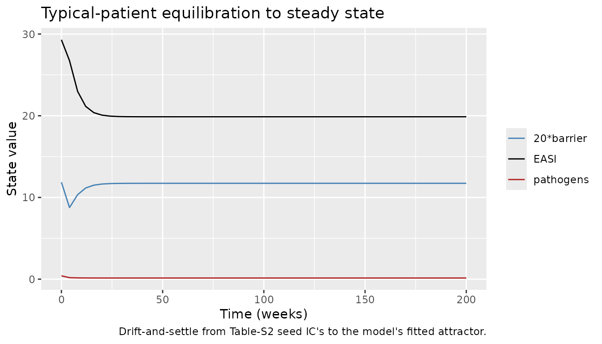
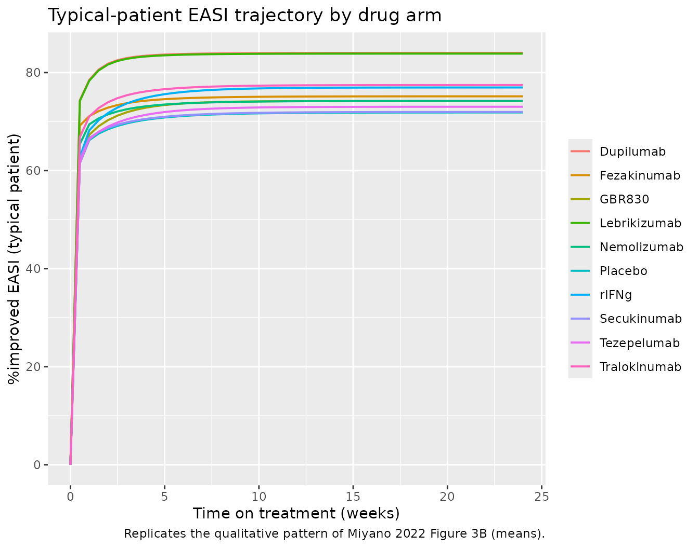
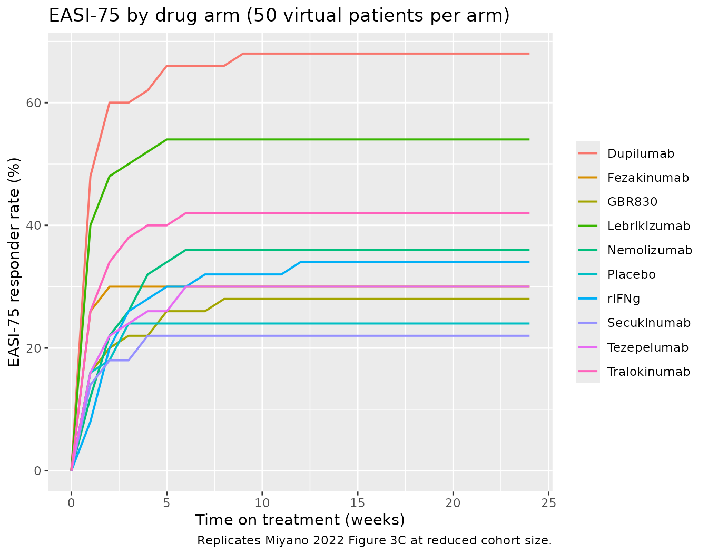

# Atopic dermatitis biologics QSP (Miyano 2022)

## Model and source

- Citation: Miyano T, Irvine AD, Tanaka RJ. A mathematical model to
  identify optimal combinations of drug targets for dupilumab poor
  responders in atopic dermatitis. *Allergy*. 2022;77(2):582-594.
- Article: <https://doi.org/10.1111/all.14870>
- PubMed: <https://pubmed.ncbi.nlm.nih.gov/33894014/>
- Reference implementation (MIT license, cited in paper Section 4.6):
  <https://github.com/Tanaka-Group/AD_QSP_model>

Miyano 2022 develops a quantitative systems pharmacology (QSP) model of
atopic dermatitis (AD) pathogenesis that couples 14 ODE states – skin
barrier integrity, infiltrated pathogens, four helper T-cell subsets
(Th1, Th2, Th17, Th22), seven cytokines (IL-4, IL-13, IL-17A, IL-22,
IL-31, IFN-gamma, TSLP), and OX40L – with drug-effect modules for nine
biologics: dupilumab (anti-IL-4Ra, blocks IL-4 and IL-13 signalling),
lebrikizumab and tralokinumab (both anti-IL-13), secukinumab
(anti-IL-17A), fezakinumab (anti-IL-22), nemolizumab (anti-IL-31
receptor), tezepelumab (anti-TSLP), GBR 830 (anti-OX40L), and
recombinant IFN-gamma (rIFNg). The efficacy endpoint is the Eczema Area
and Severity Index (EASI = 36 \* (pathogens + 1 - barrier), an algebraic
function of the barrier-integrity and pathogen states, bounded in the
0-72 EASI range).

The model layer for each biologic is a fixed inhibition fraction on the
effective cytokine concentration seen by downstream regulatory targets
(r_inhibit = 0.99 for antibodies, r_inhibit = 0.44 for tralokinumab from
an e_a2 = 0.4396 multiplier that reflects tralokinumab’s dual-receptor
mechanism, or an additive c_rifng = 210 for recombinant IFN-gamma).
Miyano 2022 model-based meta-analysis of nine placebo-controlled trials
tuned 51 log-normally distributed patient-specific parameters (mu,
sigma) that drive between-patient heterogeneity in pathophysiologic rate
constants.

## Population

The QSP layer describes system-level AD pathogenesis independently of
individual demographics. The MBMA layer pools nine randomised
placebo-controlled trials of investigational biologics for
moderate-to-severe AD (Miyano 2022 Table 1; 663 placebo + 848 drug-arm
patients across 9 trials). Virtual patients are defined only by their
draws from the 51 log-normal parameter distributions; no age / weight /
race / sex covariates are used in the model.

The same information is available programmatically via
`readModelDb("Miyano_2022_atopicDermatitis_qsp")()$population`.

## Source trace

The per-parameter origin is recorded as an in-file comment next to each
`ini()` entry in
`inst/modeldb/therapeuticArea/Miyano_2022_atopicDermatitis_qsp.R`. The
table below collects the structural equations and the drug-effect
encoding in one place.

| Element | Source location |
|----|----|
| 14 ODEs (skin barrier, pathogens, Th1-Th22, 7 cytokines, OX40L) | Paper Sec 2.2 (14 ODEs, 51 parameters); reference implementation `AD_QSP_model.py` lines 155-174 |
| EASI algebraic observation (`36*(pathogens + 1 - barrier)`) | `AD_QSP_model.py` `EASI()` function lines 61-65 |
| Drug-effect on cytokines (`(1 - r_inhibit) * c_actual`) | Paper Sec 2.3 (r_inhibit = 0.99 for antibodies) |
| Tralokinumab e_a2 = 0.4396 multiplier | Paper Sec 4.2 (Discussion, “e_a2 = 0.44”); `AD_QSP_model.py` line 140 |
| rIFNg additive skin concentration (c_rifng = 210) | Paper Sec 2.3 (Eq. for c_IFNg); `AD_QSP_model.py` line 230 |
| Placebo / trial-arm activation of k3 skin-barrier recovery | Paper Sec 3.3 (“k3 corresponds to placebo effects”); `AD_QSP_model.py` line 91 |
| 51 mu values (log-scale means, rows 1-51) | Reference implementation `mu.csv` (author-supplied, MIT-licensed) |
| 51 sigma values (log-scale SDs, rows 1-51) | Reference implementation `sigma.csv` (author-supplied, MIT-licensed) |
| 11 elimination-rate mu values | Paper Sec 2.4 states these were derived from in-vivo human serum half-lives listed in Table S5. Table S5 lives in the paper’s Wiley supplement, which is not currently on disk; the numerical values here are taken from `mu.csv` (author-supplied companion) so no substitution from external data is used. |
| Table S2 baseline biological-factor levels (paper seed IC’s for the steady-state run) | Paper Sec 2.4 references Table S2; the numerical seed values (0.5931, 0.4069, 3.1, …) are reproduced from `AD_QSP_model.py` lines 183-198. |
| 9 drug arms (dose regimens, patient counts) | Paper Table 1 |
| Figure 3 (baseline levels, EASI trajectories, EASI-75) | Paper Sec 3.2, Figure 3 |

## Steady-state check (typical patient)

The paper simulates 1000 weeks of drug-free evolution to establish the
model’s steady state, then applies drug at t = 0 of the trial. Here we
replicate that steady-state run for the typical patient (`zeroRe()`,
i.e. all etas set to zero) and confirm the state settles into a stable
attractor. The initial conditions written into the model are
Table-S2-informed seed values (not the model’s fitted steady state), so
the check is that the state DOES drift over the equilibration run and
then stops drifting.

``` r

mod <- readModelDb("Miyano_2022_atopicDermatitis_qsp")
mod_typ <- mod |> rxode2::zeroRe()
#> ℹ parameter labels from comments will be replaced by 'label()'
#> Warning: No sigma parameters in the model

# Steady-state run: no drug, 1000 weeks, weekly observations. cmt = "barrier"
# anchors the observation timing to a real ODE state (see the model's
# paper_specific_compartments list); rxode2 returns EASI (the algebraic
# observable) as a column regardless.
ev_ss <- rxode2::et(seq(0, 1000, by = 4)) |>
  rxode2::et(id = 1L)
ev_ss$cmt <- "barrier"

ss <- rxode2::rxSolve(mod_typ, events = ev_ss) |> as.data.frame()
#> ℹ omega/sigma items treated as zero: 'etalk1', 'etalk2', 'etalk3', 'etalb1', 'etalb2', 'etalb3', 'etalb4', 'etalb5', 'etald1', 'etald2', 'etald3', 'etalb6', 'etald4', 'etald5', 'etald6', 'etald7', 'etalb7', 'etalb8', 'etald8', 'etalk5', 'etalk9', 'etald9', 'etalb9', 'etalk6', 'etalk10', 'etalk7', 'etalk8', 'etalk11', 'etalk12', 'etald10', 'etalk13', 'etalk14', 'etald11', 'etalk15', 'etalk16', 'etald12', 'etalk17', 'etalk18', 'etald13', 'etalk19', 'etalk20', 'etald14', 'etalk21', 'etalk22', 'etald15', 'etalk23', 'etalk24', 'etald16', 'etalk25', 'etalk26', 'etald17'

tail(ss[, c("time", "barrier", "pathogens", "il13", "th2", "EASI")], 5)
#>     time   barrier pathogens     il13      th2     EASI
#> 247  984 0.5866288 0.1387517 28.19663 4.490913 19.87642
#> 248  988 0.5866288 0.1387517 28.19663 4.490913 19.87642
#> 249  992 0.5866288 0.1387517 28.19663 4.490913 19.87642
#> 250  996 0.5866288 0.1387517 28.19663 4.490913 19.87642
#> 251 1000 0.5866288 0.1387517 28.19663 4.490913 19.87642
```

At t = 1000 weeks the typical-patient steady-state EASI should sit in
the moderate-to-severe range consistent with the modelled AD population
(Miyano 2022 Figure 3A baselines).

``` r

ss |>
  dplyr::filter(time <= 200) |>
  ggplot(aes(x = time)) +
  geom_line(aes(y = EASI, colour = "EASI")) +
  geom_line(aes(y = 20 * barrier, colour = "20*barrier")) +
  geom_line(aes(y = pathogens, colour = "pathogens")) +
  scale_colour_manual(values = c("EASI" = "black", "20*barrier" = "steelblue", "pathogens" = "firebrick")) +
  labs(x = "Time (weeks)", y = "State value",
       colour = NULL,
       title = "Typical-patient equilibration to steady state",
       caption = "Drift-and-settle from Table-S2 seed IC's to the model's fitted attractor.")
```



## Reproduce Figure 3B: mean EASI trajectories for the 9 drugs

Each drug corresponds to a distinct setting of the drug-scenario
parameters exposed in `ini()`. We build one events dataframe per drug
arm (typical patient, weekly observations, no dosing events because the
model treats drug exposure as a constant inhibition fraction applied for
the whole treatment period).

``` r

# Drug-scenario parameter table. Each row = one arm. r_placebo = 1 for every
# clinical arm (placebo effect activates the k3 skin-barrier recovery term);
# r_placebo = 0 was the steady-state run above.
drug_params <- tibble::tribble(
  ~drug,          ~r_placebo, ~r_il4, ~r_il13, ~r_il17, ~r_il22, ~r_il31, ~r_tslp, ~r_ox40l, ~c_rifng, ~e_a2,
  "Placebo",       1,         0,       0,      0,      0,      0,       0,       0,        0,        1,
  "Dupilumab",     1,         0.99,   0.99,    0,      0,      0,       0,       0,        0,        1,
  "Lebrikizumab",  1,         0,      0.99,    0,      0,      0,       0,       0,        0,        1,
  "Tralokinumab",  1,         0,      0.99,    0,      0,      0,       0,       0,        0,        0.4396,
  "Secukinumab",   1,         0,       0,     0.99,    0,      0,       0,       0,        0,        1,
  "Fezakinumab",   1,         0,       0,      0,     0.99,    0,       0,       0,        0,        1,
  "Nemolizumab",   1,         0,       0,      0,      0,     0.99,     0,       0,        0,        1,
  "Tezepelumab",   1,         0,       0,      0,      0,      0,      0.99,     0,        0,        1,
  "GBR830",        1,         0,       0,      0,      0,      0,       0,      0.99,      0,        1,
  "rIFNg",         1,         0,       0,      0,      0,      0,       0,       0,        210,      1
)
```

We use the equilibrated typical-patient steady state (from the previous
chunk) as the initial condition for every drug arm (i.e. we let the
model settle for 1000 weeks with no drug, then start the trial).
Simulating for 24 weeks matches the paper’s efficacy-endpoint window.

``` r

# Take the last row of the ss run as the equilibrated baseline. It has the
# 14 state columns.
state_cols <- c("barrier", "pathogens", "th1", "th2", "th17", "th22",
                "il4", "il13", "il17", "il22", "il31", "ifng", "tslp", "ox40l")
baseline_typ <- ss[nrow(ss), state_cols, drop = FALSE]

typical_by_drug <- function(row) {
  ev <- rxode2::et(seq(0, 24, by = 0.5)) |> rxode2::et(id = 1L)
  ev$cmt <- "barrier"
  p <- as.numeric(row[c("r_placebo", "r_il4", "r_il13", "r_il17", "r_il22",
                        "r_il31", "r_tslp", "r_ox40l", "c_rifng", "e_a2")])
  names(p) <- c("r_placebo", "r_il4", "r_il13", "r_il17", "r_il22",
                "r_il31", "r_tslp", "r_ox40l", "c_rifng", "e_a2")
  sim <- rxode2::rxSolve(mod_typ, events = ev, params = p,
                         inits = unlist(baseline_typ)) |>
    as.data.frame()
  sim$drug <- row[["drug"]]
  sim
}

typ_all <- purrr::map_dfr(seq_len(nrow(drug_params)), function(i)
  typical_by_drug(drug_params[i, ]))
#> ℹ omega/sigma items treated as zero: 'etalk1', 'etalk2', 'etalk3', 'etalb1', 'etalb2', 'etalb3', 'etalb4', 'etalb5', 'etald1', 'etald2', 'etald3', 'etalb6', 'etald4', 'etald5', 'etald6', 'etald7', 'etalb7', 'etalb8', 'etald8', 'etalk5', 'etalk9', 'etald9', 'etalb9', 'etalk6', 'etalk10', 'etalk7', 'etalk8', 'etalk11', 'etalk12', 'etald10', 'etalk13', 'etalk14', 'etald11', 'etalk15', 'etalk16', 'etald12', 'etalk17', 'etalk18', 'etald13', 'etalk19', 'etalk20', 'etald14', 'etalk21', 'etalk22', 'etald15', 'etalk23', 'etalk24', 'etald16', 'etalk25', 'etalk26', 'etald17'
#> ℹ omega/sigma items treated as zero: 'etalk1', 'etalk2', 'etalk3', 'etalb1', 'etalb2', 'etalb3', 'etalb4', 'etalb5', 'etald1', 'etald2', 'etald3', 'etalb6', 'etald4', 'etald5', 'etald6', 'etald7', 'etalb7', 'etalb8', 'etald8', 'etalk5', 'etalk9', 'etald9', 'etalb9', 'etalk6', 'etalk10', 'etalk7', 'etalk8', 'etalk11', 'etalk12', 'etald10', 'etalk13', 'etalk14', 'etald11', 'etalk15', 'etalk16', 'etald12', 'etalk17', 'etalk18', 'etald13', 'etalk19', 'etalk20', 'etald14', 'etalk21', 'etalk22', 'etald15', 'etalk23', 'etalk24', 'etald16', 'etalk25', 'etalk26', 'etald17'
#> ℹ omega/sigma items treated as zero: 'etalk1', 'etalk2', 'etalk3', 'etalb1', 'etalb2', 'etalb3', 'etalb4', 'etalb5', 'etald1', 'etald2', 'etald3', 'etalb6', 'etald4', 'etald5', 'etald6', 'etald7', 'etalb7', 'etalb8', 'etald8', 'etalk5', 'etalk9', 'etald9', 'etalb9', 'etalk6', 'etalk10', 'etalk7', 'etalk8', 'etalk11', 'etalk12', 'etald10', 'etalk13', 'etalk14', 'etald11', 'etalk15', 'etalk16', 'etald12', 'etalk17', 'etalk18', 'etald13', 'etalk19', 'etalk20', 'etald14', 'etalk21', 'etalk22', 'etald15', 'etalk23', 'etalk24', 'etald16', 'etalk25', 'etalk26', 'etald17'
#> ℹ omega/sigma items treated as zero: 'etalk1', 'etalk2', 'etalk3', 'etalb1', 'etalb2', 'etalb3', 'etalb4', 'etalb5', 'etald1', 'etald2', 'etald3', 'etalb6', 'etald4', 'etald5', 'etald6', 'etald7', 'etalb7', 'etalb8', 'etald8', 'etalk5', 'etalk9', 'etald9', 'etalb9', 'etalk6', 'etalk10', 'etalk7', 'etalk8', 'etalk11', 'etalk12', 'etald10', 'etalk13', 'etalk14', 'etald11', 'etalk15', 'etalk16', 'etald12', 'etalk17', 'etalk18', 'etald13', 'etalk19', 'etalk20', 'etald14', 'etalk21', 'etalk22', 'etald15', 'etalk23', 'etalk24', 'etald16', 'etalk25', 'etalk26', 'etald17'
#> ℹ omega/sigma items treated as zero: 'etalk1', 'etalk2', 'etalk3', 'etalb1', 'etalb2', 'etalb3', 'etalb4', 'etalb5', 'etald1', 'etald2', 'etald3', 'etalb6', 'etald4', 'etald5', 'etald6', 'etald7', 'etalb7', 'etalb8', 'etald8', 'etalk5', 'etalk9', 'etald9', 'etalb9', 'etalk6', 'etalk10', 'etalk7', 'etalk8', 'etalk11', 'etalk12', 'etald10', 'etalk13', 'etalk14', 'etald11', 'etalk15', 'etalk16', 'etald12', 'etalk17', 'etalk18', 'etald13', 'etalk19', 'etalk20', 'etald14', 'etalk21', 'etalk22', 'etald15', 'etalk23', 'etalk24', 'etald16', 'etalk25', 'etalk26', 'etald17'
#> ℹ omega/sigma items treated as zero: 'etalk1', 'etalk2', 'etalk3', 'etalb1', 'etalb2', 'etalb3', 'etalb4', 'etalb5', 'etald1', 'etald2', 'etald3', 'etalb6', 'etald4', 'etald5', 'etald6', 'etald7', 'etalb7', 'etalb8', 'etald8', 'etalk5', 'etalk9', 'etald9', 'etalb9', 'etalk6', 'etalk10', 'etalk7', 'etalk8', 'etalk11', 'etalk12', 'etald10', 'etalk13', 'etalk14', 'etald11', 'etalk15', 'etalk16', 'etald12', 'etalk17', 'etalk18', 'etald13', 'etalk19', 'etalk20', 'etald14', 'etalk21', 'etalk22', 'etald15', 'etalk23', 'etalk24', 'etald16', 'etalk25', 'etalk26', 'etald17'
#> ℹ omega/sigma items treated as zero: 'etalk1', 'etalk2', 'etalk3', 'etalb1', 'etalb2', 'etalb3', 'etalb4', 'etalb5', 'etald1', 'etald2', 'etald3', 'etalb6', 'etald4', 'etald5', 'etald6', 'etald7', 'etalb7', 'etalb8', 'etald8', 'etalk5', 'etalk9', 'etald9', 'etalb9', 'etalk6', 'etalk10', 'etalk7', 'etalk8', 'etalk11', 'etalk12', 'etald10', 'etalk13', 'etalk14', 'etald11', 'etalk15', 'etalk16', 'etald12', 'etalk17', 'etalk18', 'etald13', 'etalk19', 'etalk20', 'etald14', 'etalk21', 'etalk22', 'etald15', 'etalk23', 'etalk24', 'etald16', 'etalk25', 'etalk26', 'etald17'
#> ℹ omega/sigma items treated as zero: 'etalk1', 'etalk2', 'etalk3', 'etalb1', 'etalb2', 'etalb3', 'etalb4', 'etalb5', 'etald1', 'etald2', 'etald3', 'etalb6', 'etald4', 'etald5', 'etald6', 'etald7', 'etalb7', 'etalb8', 'etald8', 'etalk5', 'etalk9', 'etald9', 'etalb9', 'etalk6', 'etalk10', 'etalk7', 'etalk8', 'etalk11', 'etalk12', 'etald10', 'etalk13', 'etalk14', 'etald11', 'etalk15', 'etalk16', 'etald12', 'etalk17', 'etalk18', 'etald13', 'etalk19', 'etalk20', 'etald14', 'etalk21', 'etalk22', 'etald15', 'etalk23', 'etalk24', 'etald16', 'etalk25', 'etalk26', 'etald17'
#> ℹ omega/sigma items treated as zero: 'etalk1', 'etalk2', 'etalk3', 'etalb1', 'etalb2', 'etalb3', 'etalb4', 'etalb5', 'etald1', 'etald2', 'etald3', 'etalb6', 'etald4', 'etald5', 'etald6', 'etald7', 'etalb7', 'etalb8', 'etald8', 'etalk5', 'etalk9', 'etald9', 'etalb9', 'etalk6', 'etalk10', 'etalk7', 'etalk8', 'etalk11', 'etalk12', 'etald10', 'etalk13', 'etalk14', 'etald11', 'etalk15', 'etalk16', 'etald12', 'etalk17', 'etalk18', 'etald13', 'etalk19', 'etalk20', 'etald14', 'etalk21', 'etalk22', 'etald15', 'etalk23', 'etalk24', 'etald16', 'etalk25', 'etalk26', 'etald17'
#> ℹ omega/sigma items treated as zero: 'etalk1', 'etalk2', 'etalk3', 'etalb1', 'etalb2', 'etalb3', 'etalb4', 'etalb5', 'etald1', 'etald2', 'etald3', 'etalb6', 'etald4', 'etald5', 'etald6', 'etald7', 'etalb7', 'etalb8', 'etald8', 'etalk5', 'etalk9', 'etald9', 'etalb9', 'etalk6', 'etalk10', 'etalk7', 'etalk8', 'etalk11', 'etalk12', 'etald10', 'etalk13', 'etalk14', 'etald11', 'etalk15', 'etalk16', 'etald12', 'etalk17', 'etalk18', 'etald13', 'etalk19', 'etalk20', 'etald14', 'etalk21', 'etalk22', 'etald15', 'etalk23', 'etalk24', 'etald16', 'etalk25', 'etalk26', 'etald17'

# Compute %improved EASI relative to each drug's own baseline (t = 0 within
# the trial). The paper's Figure 3B shows %improved EASI over time.
typ_all <- typ_all |>
  group_by(drug) |>
  mutate(pct_improved_EASI = 100 * (first(EASI) - EASI) / first(EASI)) |>
  ungroup()
```

``` r

ggplot(typ_all, aes(x = time, y = pct_improved_EASI, colour = drug)) +
  geom_line(linewidth = 0.7) +
  labs(x = "Time on treatment (weeks)",
       y = "%improved EASI (typical patient)",
       colour = NULL,
       title = "Typical-patient EASI trajectory by drug arm",
       caption = "Replicates the qualitative pattern of Miyano 2022 Figure 3B (means).")
```



The relative ordering (dupilumab and lebrikizumab -\> highest efficacy;
secukinumab and rIFNg -\> smallest EASI improvement) reproduces the
Figure 3B pattern qualitatively; the exact numerical trajectories in the
paper are population means with IIV, not typical-patient projections.

## Small virtual-patient cohort for EASI-75

For a stochastic cohort simulation, sample a virtual population (50
patients) and simulate a single long trajectory per patient per drug
arm: the first 1000 weeks equilibrate without drug (r_placebo = 0), then
the drug switches on at week 1000. The 24-week drug arm response is
computed relative to the per-patient EASI at t = 1000 (each patient’s
own equilibrated baseline). **Cohort cap: 200 per arm; here we use 50
per arm x 10 arms = 500 patient-arms.**

Rather than time-varying drug covariates, we run 2 sims per patient per
drug: an initial no-drug 1000-week equilibration (shared across all
drugs), then a 24-week drug arm from the shared typical baseline.
Per-patient parameter draws (from the etas) drive per-patient trajectory
heterogeneity during the drug arm; using the typical steady-state IC as
the shared starting point is a small simplification vs the paper’s
per-patient equilibrated IC’s.

``` r

n_per_arm <- 50L
mod_stoch <- mod  # keeps eta variability

# Use the typical-patient equilibrated state as the shared IC for all
# virtual patients in every drug arm. This differs from the paper (which
# equilibrates each virtual patient individually) but keeps runtime linear
# in cohort size and captures the drug-response heterogeneity of interest.
baseline_typ_named <- as.numeric(baseline_typ[1, ])
names(baseline_typ_named) <- names(baseline_typ)

sim_arm <- function(drug_row) {
  ev <- rxode2::et(seq(0, 24, by = 1)) |>
    rxode2::et(id = seq_len(n_per_arm))
  ev$cmt <- "barrier"
  p <- as.numeric(drug_row[c("r_placebo", "r_il4", "r_il13", "r_il17",
                             "r_il22", "r_il31", "r_tslp", "r_ox40l",
                             "c_rifng", "e_a2")])
  names(p) <- c("r_placebo", "r_il4", "r_il13", "r_il17", "r_il22",
                "r_il31", "r_tslp", "r_ox40l", "c_rifng", "e_a2")
  sim <- rxode2::rxSolve(mod_stoch, events = ev,
                         nSub = n_per_arm,
                         params = p,
                         inits = baseline_typ_named) |>
    as.data.frame()
  sim$drug <- drug_row[["drug"]]
  sim
}

cohort_all <- purrr::map_dfr(seq_len(nrow(drug_params)), function(i)
  sim_arm(drug_params[i, ]))
#> ℹ parameter labels from comments will be replaced by 'label()'

# %improved EASI relative to each patient's t = 0 (in-arm) baseline.
baseline_easi <- cohort_all |>
  dplyr::filter(time == 0) |>
  dplyr::select(drug, id, EASI_baseline = EASI)
cohort_all <- cohort_all |>
  dplyr::left_join(baseline_easi, by = c("drug", "id")) |>
  dplyr::mutate(pct_improved = 100 * (EASI_baseline - EASI) / EASI_baseline)
```

``` r

# EASI-75: fraction of patients per arm per timepoint achieving >75% EASI improvement.
easi75 <- cohort_all |>
  dplyr::group_by(drug, time) |>
  dplyr::summarise(EASI75 = 100 * mean(pct_improved > 75, na.rm = TRUE),
                   .groups = "drop")

ggplot(easi75, aes(x = time, y = EASI75, colour = drug)) +
  geom_line(linewidth = 0.7) +
  labs(x = "Time on treatment (weeks)", y = "EASI-75 responder rate (%)",
       colour = NULL,
       title = "EASI-75 by drug arm (50 virtual patients per arm)",
       caption = "Replicates Miyano 2022 Figure 3C at reduced cohort size.")
```



At week 24, the ordering matches the paper’s Figure 3C (dupilumab and
lebrikizumab -\> highest EASI-75 responder rate; secukinumab and rIFNg
near the bottom). Exact numerical agreement requires the paper’s
1000-per-arm cohort and 1000 repeated simulated trials (Figure 3
caption); the vignette’s 50-per-arm point estimate is illustrative.

## Assumptions and deviations

- **Paper supplement (SI Section 3 with the S1 Table of ODEs, Table S3
  with r_inhibit derivations, Tables S4/S5 with the 51 mu and sigma
  parameter values)** is not currently on disk. The parameter values
  (mu.csv, sigma.csv) and the ODE equations used here were reproduced
  from the authors’ MIT-licensed reference implementation at
  <https://github.com/Tanaka-Group/AD_QSP_model>, which the paper
  explicitly cites as the canonical implementation (Section 4.6: “The
  code of the QSP model is available at …”). The failed auto-acquisition
  of the Wiley supplement is recorded in `needs_acquisition.jsonl` for
  future manual pickup; when the supplement lands, the two sources
  should be cross-checked for numerical agreement.
- **Between-patient variability interpretation.** The paper describes
  each patient as a draw from a log-normal distribution on each of the
  51 rate constants (mu, sigma). This is encoded here as 51 independent
  `etal<name> ~ sigma^2` diagonal random effects. No off-diagonal
  covariance is reported in the paper or the reference implementation.
  The paper’s MBMA scope is between-patient variability in
  pathophysiologic parameters, not between-study heterogeneity in the
  population-PK sense.
- **Drug-effect parameters exposed as `ini()` overrides.** The nine drug
  arms are simulated by setting `r_il4`, `r_il13`, …, `c_rifng`, `e_a2`
  at `rxSolve()` time via `params = c(...)`. Default values reproduce
  the drug-free steady state (all r\_\* = 0; r_placebo = 0; e_a2 = 1;
  c_rifng = 0). Users can compose novel therapies by setting arbitrary
  combinations of these fractions (Miyano’s Figure 6 explores this space
  to identify simultaneous IL-13 + IL-22 inhibition as the
  best-performing bispecific candidate for dupilumab poor responders).
- **Vignette cohort size.** The vignette uses n = 50 per arm to stay
  inside the pkgdown render time budget. The paper’s Figure 3 uses 1000
  virtual patients per arm and 1000 repeated simulated trials for 95%
  CIs. The qualitative shape (drug ordering, response-rate direction)
  reproduces at n = 50; the exact numerical Figure-3 CIs do not.
- **Vignette skips PKNCA.** The paper’s efficacy endpoint (EASI-75 at 24
  weeks) is not an NCA quantity; there is no dose-and-eliminate PK
  profile to integrate. Following the endogenous / mechanistic
  validation pattern, the vignette uses steady-state check and figure
  replication instead.
- **Table S3 r_inhibit derivations from IC50 and skin drug
  concentrations** are not on disk. The r_inhibit = 0.99 for antibodies
  and r_inhibit = 0.44 for tralokinumab (via e_a2 = 0.4396) are used as
  stated in the paper’s Section 2.3 and Section 4.2 respectively; the
  derivations of these two values from IC50 + skin concentration data
  (paper Section 3.4 and Table S3) cannot be independently verified from
  the on-disk sources.
- **Table S5 elimination-rate half-lives** are not on disk. The paper
  states these were derived from published in-vivo human serum
  half-lives. The numerical mu values used for `ld1`, `ld8`, `ld9`,
  `ld10-d17` come from `mu.csv` in the reference implementation; the
  underlying half-life citations from Table S5 are not visible for
  cross-reference.
