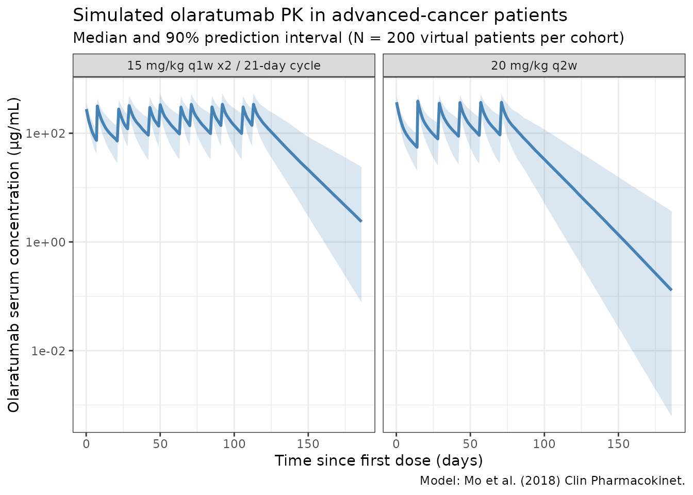
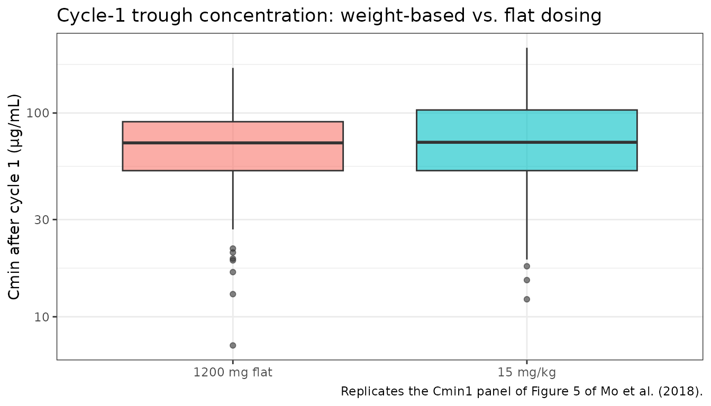
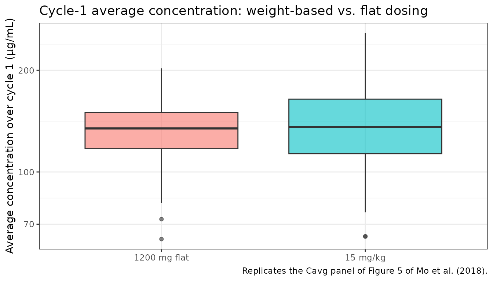

# Mo_2018_olaratumab

``` r
library(nlmixr2lib)
library(rxode2)
#> rxode2 5.0.2 using 2 threads (see ?getRxThreads)
#>   no cache: create with `rxCreateCache()`
library(dplyr)
#> 
#> Attaching package: 'dplyr'
#> The following objects are masked from 'package:stats':
#> 
#>     filter, lag
#> The following objects are masked from 'package:base':
#> 
#>     intersect, setdiff, setequal, union
library(tidyr)
library(ggplot2)
library(PKNCA)
#> 
#> Attaching package: 'PKNCA'
#> The following object is masked from 'package:stats':
#> 
#>     filter
```

## Olaratumab population PK simulation

Simulate olaratumab (anti-PDGFRα human IgG1 monoclonal antibody) serum
concentrations using the final two-compartment population PK model from
Mo et al. (2018). The pooled analysis included 1501 serum concentration
observations from 171 patients across four phase II studies in advanced
or metastatic cancer: soft tissue sarcoma (STS, n = 95), nonsmall cell
lung cancer (NSCLC, n = 50), gastrointestinal stromal tumor (GIST, n =
19), and glioblastoma multiforme (GBM, n = 7).

The structural model is a two-compartment IV model with linear
clearance. The final covariates are body weight (on CL and V1, power)
and baseline tumor size (on CL, linear deviation from the population
median). Target- mediated drug disposition was tested as a
Michaelis-Menten approximation but rejected due to model instability;
treatment-emergent anti-drug antibodies (TE-ADA, 5% of patients) had no
effect on CL and were not included.

- Citation: Mo G, Baldwin JR, Luffer-Atlas D, et al. *Clin
  Pharmacokinet*
  2018. 57:355-365.
- Article: <https://doi.org/10.1007/s40262-017-0562-0>

### Source trace

| Element                 | Source location                       | Value / form                                                 |
|-------------------------|---------------------------------------|--------------------------------------------------------------|
| CL, V1, V2, Q           | Mo 2018 Table 3 (Final PK model)      | 0.0233 L/h, 4.16 L, 3.58 L, 0.0315 L/h                       |
| WT on CL                | Mo 2018 Table 3 footnote a (WTE_CL)   | Power: (WT / 79.7)^0.431                                     |
| WT on V1                | Mo 2018 Table 3 footnote b (WTE_V1)   | Power: (WT / 79.7)^0.610                                     |
| TUMSZ on CL             | Mo 2018 Table 3 footnote a (TUMR_CL)  | Linear: 1 + 0.00158 × (TUMSZ - 86.5)                         |
| IIV CL                  | Mo 2018 Table 3 (Final PK model)      | 33.3% CV (omega² = log(CV² + 1) = 0.1052)                    |
| IIV V1                  | Mo 2018 Table 3 (Final PK model)      | 15.6% CV (omega² = log(CV² + 1) = 0.0240)                    |
| CL / V1 IIV correlation | Mo 2018 Base Model Development (text) | None (“no significant correlation between IPV of V1 and CL”) |
| V2 and Q IIV            | Mo 2018 Table 3 (Final PK model)      | Not estimated (“–” in table)                                 |
| Residual error          | Mo 2018 Table 3 (Final PK model)      | Additive 10.1 μg/mL + proportional 22.5%                     |
| Reference weight        | Mo 2018 Table 2 (median WTE)          | 79.7 kg                                                      |
| Reference tumor size    | Mo 2018 Table 2 (median TUMR)         | 86.5 mm                                                      |

### Covariate column naming

| Source column                                                  | Canonical column used here                              |
|----------------------------------------------------------------|---------------------------------------------------------|
| `WTE` (body weight at study entry, kg)                         | `WT` (Mo 2018 covariates are time-fixed at study entry) |
| `TUMR` (baseline tumor size, mm; RECIST v1.1 sum of diameters) | `TUMSZ`                                                 |

See `inst/references/covariate-columns.md` for the canonical register.

### Population

Approximate the Mo 2018 Table 2 distributions for the pooled 171-patient
cohort (medians, ranges, and marginal counts only — the paper does not
publish individual-level covariate data).

``` r
set.seed(2018)
n_subj <- 200

# Weight (kg): log-normal around median 79.7, clipped to observed range 37.3-151
WT <- pmin(pmax(rlnorm(n_subj, log(79.7), 0.27), 37.3), 151)

# Tumor size (mm): log-normal around median 86.5, clipped to observed range 12-571.
# Table 2 n=164 with tumor size (7 GBM patients had none); in simulation every subject
# gets a value, which is conservative for the CL covariate effect.
TUMSZ <- pmin(pmax(rlnorm(n_subj, log(86.5), 0.9), 12), 571)

pop <- data.frame(
  ID    = seq_len(n_subj),
  WT    = WT,
  TUMSZ = TUMSZ
)
```

### Dosing dataset

Two regimens are simulated to span the dose range used in the analysis:

- **15 mg/kg on days 1 and 8 of a 21-day cycle** (STS and NSCLC
  studies), ≥ 8 cycles.
- **20 mg/kg every 14 days** (GBM and GIST studies).

Infusion duration is taken as 60 min (the STS-study protocol); time is
in hours throughout.

``` r
hour_per_day   <- 24
cycle_h_21     <- 21 * hour_per_day
cycle_h_14     <- 14 * hour_per_day
n_cycles       <- 6
inf_h          <- 1   # 60-min IV infusion

dose_times_15 <- as.numeric(outer(
  c(0, 7 * hour_per_day),             # days 1 and 8 within a cycle
  seq_len(n_cycles) - 1,              # cycle index 0..n_cycles-1
  FUN = function(doy, cy) doy + cy * cycle_h_21
))

dose_times_20 <- seq(0, (n_cycles - 1) * cycle_h_14, by = cycle_h_14)

obs_times <- sort(unique(c(
  seq(0, 7 * hour_per_day, by = 4),              # rich through day 7
  seq(7 * hour_per_day, cycle_h_21, by = 12),    # pre/post dose through cycle 1
  seq(cycle_h_21, n_cycles * cycle_h_21, by = 24),
  seq(n_cycles * cycle_h_21,
      n_cycles * cycle_h_21 + 60 * hour_per_day, by = 24)
)))

make_cohort <- function(dose_mg_per_kg, dose_times, cohort_label,
                        id_offset, pop_sub) {
  n <- nrow(pop_sub)
  d_dose <- pop_sub |>
    tidyr::crossing(TIME = dose_times) |>
    dplyr::mutate(
      AMT     = dose_mg_per_kg * WT,
      EVID    = 1,
      CMT     = "central",
      DUR     = inf_h,
      DV      = NA_real_,
      cohort  = cohort_label,
      ID      = id_offset + ID
    )
  d_obs <- pop_sub |>
    tidyr::crossing(TIME = obs_times) |>
    dplyr::mutate(
      AMT     = NA_real_,
      EVID    = 0,
      CMT     = "central",
      DUR     = NA_real_,
      DV      = NA_real_,
      cohort  = cohort_label,
      ID      = id_offset + ID
    )
  dplyr::bind_rows(d_dose, d_obs)
}

events <- dplyr::bind_rows(
  make_cohort(15, dose_times_15, "15 mg/kg q1w x2 / 21-day cycle",
              id_offset = 0L,   pop_sub = pop),
  make_cohort(20, dose_times_20, "20 mg/kg q2w",
              id_offset = 1000L, pop_sub = pop)
) |>
  dplyr::arrange(ID, TIME, dplyr::desc(EVID)) |>
  as.data.frame()

stopifnot(!anyDuplicated(events[, c("ID", "TIME", "EVID")]))
```

### Simulate

``` r
mod <- readModelDb("Mo_2018_olaratumab")
set.seed(20180301)
sim <- rxSolve(mod, events,
               keep = c("cohort"),
               returnType = "data.frame")
#> ℹ parameter labels from comments will be replaced by 'label()'
```

### Concentration-time profile (replicates Fig. 2)

Replicates the shape of Figure 2 of Mo et al. (2018) — full time course
of olaratumab serum concentrations after the first dose with rich
cycle-1 sampling. The simulated median and 90% prediction interval
capture the typical Cmax near end-of-infusion, rapid distribution, and
sustained exposure across repeat dosing.

``` r
sim_summary <- sim |>
  dplyr::filter(time > 0) |>
  dplyr::group_by(time, cohort) |>
  dplyr::summarise(
    median = median(Cc, na.rm = TRUE),
    lo     = quantile(Cc, 0.05, na.rm = TRUE),
    hi     = quantile(Cc, 0.95, na.rm = TRUE),
    .groups = "drop"
  )

ggplot(sim_summary, aes(x = time / 24)) +
  geom_ribbon(aes(ymin = lo, ymax = hi), alpha = 0.2, fill = "steelblue") +
  geom_line(aes(y = median), color = "steelblue", linewidth = 1) +
  facet_wrap(~cohort, scales = "free_x") +
  scale_y_log10() +
  labs(
    x        = "Time since first dose (days)",
    y        = "Olaratumab serum concentration (μg/mL)",
    title    = "Simulated olaratumab PK in advanced-cancer patients",
    subtitle = "Median and 90% prediction interval (N = 200 virtual patients per cohort)",
    caption  = "Model: Mo et al. (2018) Clin Pharmacokinet."
  ) +
  theme_bw()
```



### Body-weight-based vs. flat dosing (replicates Fig. 5)

Replicates the comparison in Figure 5 of Mo et al. (2018): weight-based
15 mg/kg vs. a flat 1200 mg dose administered on days 1 and 8 of a
21-day cycle. The paper reports that the distributions of cycle-1 trough
concentration (Cmin1) and average concentration (Cavg) overlap almost
completely between the two strategies, with the weight-based regimen
producing slightly lower inter-patient spread at the weight extremes.

``` r
flat_mg <- 1200
events_flat <- pop |>
  tidyr::crossing(TIME = dose_times_15) |>
  dplyr::mutate(
    AMT     = flat_mg,
    EVID    = 1,
    CMT     = "central",
    DUR     = inf_h,
    DV      = NA_real_,
    cohort  = "1200 mg flat q1w x2 / 21-day cycle"
  ) |>
  dplyr::bind_rows(
    pop |>
      tidyr::crossing(TIME = obs_times) |>
      dplyr::mutate(
        AMT     = NA_real_,
        EVID    = 0,
        CMT     = "central",
        DUR     = NA_real_,
        DV      = NA_real_,
        cohort  = "1200 mg flat q1w x2 / 21-day cycle"
      )
  ) |>
  dplyr::arrange(ID, TIME, dplyr::desc(EVID)) |>
  as.data.frame()

sim_flat <- rxSolve(mod, events_flat,
                    keep = c("cohort"),
                    returnType = "data.frame")
#> ℹ parameter labels from comments will be replaced by 'label()'

sim_wt_c1 <- sim |>
  dplyr::filter(cohort == "15 mg/kg q1w x2 / 21-day cycle",
                time > 0, time <= cycle_h_21)
sim_flat_c1 <- sim_flat |>
  dplyr::filter(time > 0, time <= cycle_h_21)

cmin1 <- dplyr::bind_rows(
  sim_wt_c1   |> dplyr::group_by(id) |> dplyr::slice_min(abs(time - cycle_h_21), n = 1, with_ties = FALSE) |> dplyr::ungroup() |> dplyr::mutate(regimen = "15 mg/kg"),
  sim_flat_c1 |> dplyr::group_by(id) |> dplyr::slice_min(abs(time - cycle_h_21), n = 1, with_ties = FALSE) |> dplyr::ungroup() |> dplyr::mutate(regimen = "1200 mg flat")
)

cavg <- dplyr::bind_rows(
  sim_wt_c1   |> dplyr::group_by(id) |>
    dplyr::summarise(Cavg = mean(Cc, na.rm = TRUE), .groups = "drop") |>
    dplyr::mutate(regimen = "15 mg/kg"),
  sim_flat_c1 |> dplyr::group_by(id) |>
    dplyr::summarise(Cavg = mean(Cc, na.rm = TRUE), .groups = "drop") |>
    dplyr::mutate(regimen = "1200 mg flat")
)
```

``` r
ggplot(cmin1, aes(x = regimen, y = Cc, fill = regimen)) +
  geom_boxplot(alpha = 0.6) +
  scale_y_log10() +
  labs(
    x = NULL, y = "Cmin after cycle 1 (μg/mL)",
    title = "Cycle-1 trough concentration: weight-based vs. flat dosing",
    caption = "Replicates the Cmin1 panel of Figure 5 of Mo et al. (2018)."
  ) +
  theme_bw() +
  theme(legend.position = "none")
```



``` r

ggplot(cavg, aes(x = regimen, y = Cavg, fill = regimen)) +
  geom_boxplot(alpha = 0.6) +
  scale_y_log10() +
  labs(
    x = NULL, y = "Average concentration over cycle 1 (μg/mL)",
    title = "Cycle-1 average concentration: weight-based vs. flat dosing",
    caption = "Replicates the Cavg panel of Figure 5 of Mo et al. (2018)."
  ) +
  theme_bw() +
  theme(legend.position = "none")
```



### PKNCA validation

Cycle 1 single-dose interval (day 0 to end-of-cycle, 504 h = 21 days)
per dosing regimen. Terminal half-life is computed from the
post-distribution data; the two-compartment model with CL = 0.0233 L/h,
V1 = 4.16 L, V2 = 3.58 L, Q = 0.0315 L/h at reference covariates yields
a typical terminal half-life of approximately 11 days.

``` r
sim_nca <- sim |>
  dplyr::filter(!is.na(Cc), Cc > 0, time >= 0, time <= cycle_h_21) |>
  dplyr::rename(treatment = cohort) |>
  dplyr::select(id, time, Cc, treatment)

dose_df <- events |>
  dplyr::filter(EVID == 1, TIME == 0) |>
  dplyr::transmute(id = ID, time = TIME, amt = AMT, treatment = cohort)

conc_obj <- PKNCA::PKNCAconc(
  sim_nca, Cc ~ time | treatment + id,
  concu = "ug/mL", timeu = "h"
)
dose_obj <- PKNCA::PKNCAdose(
  dose_df, amt ~ time | treatment + id,
  doseu = "mg"
)

intervals <- data.frame(
  start     = 0,
  end       = cycle_h_21,
  cmax      = TRUE,
  tmax      = TRUE,
  auclast   = TRUE,
  half.life = TRUE
)

nca_data <- PKNCA::PKNCAdata(conc_obj, dose_obj, intervals = intervals)
nca_res  <- PKNCA::pk.nca(nca_data)
#> Warning: Requesting an AUC range starting (0) before the first measurement (4) is not allowed
#> Requesting an AUC range starting (0) before the first measurement (4) is not allowed
#> Requesting an AUC range starting (0) before the first measurement (4) is not allowed
#> Requesting an AUC range starting (0) before the first measurement (4) is not allowed
#> Requesting an AUC range starting (0) before the first measurement (4) is not allowed
#> Requesting an AUC range starting (0) before the first measurement (4) is not allowed
#> Requesting an AUC range starting (0) before the first measurement (4) is not allowed
#> Requesting an AUC range starting (0) before the first measurement (4) is not allowed
#> Requesting an AUC range starting (0) before the first measurement (4) is not allowed
#> Requesting an AUC range starting (0) before the first measurement (4) is not allowed
#> Requesting an AUC range starting (0) before the first measurement (4) is not allowed
#> Requesting an AUC range starting (0) before the first measurement (4) is not allowed
#> Requesting an AUC range starting (0) before the first measurement (4) is not allowed
#> Requesting an AUC range starting (0) before the first measurement (4) is not allowed
#> Requesting an AUC range starting (0) before the first measurement (4) is not allowed
#> Requesting an AUC range starting (0) before the first measurement (4) is not allowed
#> Requesting an AUC range starting (0) before the first measurement (4) is not allowed
#> Requesting an AUC range starting (0) before the first measurement (4) is not allowed
#> Requesting an AUC range starting (0) before the first measurement (4) is not allowed
#> Requesting an AUC range starting (0) before the first measurement (4) is not allowed
#> Requesting an AUC range starting (0) before the first measurement (4) is not allowed
#> Requesting an AUC range starting (0) before the first measurement (4) is not allowed
#> Requesting an AUC range starting (0) before the first measurement (4) is not allowed
#> Requesting an AUC range starting (0) before the first measurement (4) is not allowed
#> Requesting an AUC range starting (0) before the first measurement (4) is not allowed
#> Requesting an AUC range starting (0) before the first measurement (4) is not allowed
#> Requesting an AUC range starting (0) before the first measurement (4) is not allowed
#> Requesting an AUC range starting (0) before the first measurement (4) is not allowed
#> Requesting an AUC range starting (0) before the first measurement (4) is not allowed
#> Requesting an AUC range starting (0) before the first measurement (4) is not allowed
#> Requesting an AUC range starting (0) before the first measurement (4) is not allowed
#> Requesting an AUC range starting (0) before the first measurement (4) is not allowed
#> Requesting an AUC range starting (0) before the first measurement (4) is not allowed
#> Requesting an AUC range starting (0) before the first measurement (4) is not allowed
#> Requesting an AUC range starting (0) before the first measurement (4) is not allowed
#> Requesting an AUC range starting (0) before the first measurement (4) is not allowed
#> Requesting an AUC range starting (0) before the first measurement (4) is not allowed
#> Requesting an AUC range starting (0) before the first measurement (4) is not allowed
#> Requesting an AUC range starting (0) before the first measurement (4) is not allowed
#> Requesting an AUC range starting (0) before the first measurement (4) is not allowed
#> Requesting an AUC range starting (0) before the first measurement (4) is not allowed
#> Requesting an AUC range starting (0) before the first measurement (4) is not allowed
#> Requesting an AUC range starting (0) before the first measurement (4) is not allowed
#> Requesting an AUC range starting (0) before the first measurement (4) is not allowed
#> Requesting an AUC range starting (0) before the first measurement (4) is not allowed
#> Requesting an AUC range starting (0) before the first measurement (4) is not allowed
#> Requesting an AUC range starting (0) before the first measurement (4) is not allowed
#> Requesting an AUC range starting (0) before the first measurement (4) is not allowed
#> Requesting an AUC range starting (0) before the first measurement (4) is not allowed
#> Requesting an AUC range starting (0) before the first measurement (4) is not allowed
#> Requesting an AUC range starting (0) before the first measurement (4) is not allowed
#> Requesting an AUC range starting (0) before the first measurement (4) is not allowed
#> Requesting an AUC range starting (0) before the first measurement (4) is not allowed
#> Requesting an AUC range starting (0) before the first measurement (4) is not allowed
#> Requesting an AUC range starting (0) before the first measurement (4) is not allowed
#> Requesting an AUC range starting (0) before the first measurement (4) is not allowed
#> Requesting an AUC range starting (0) before the first measurement (4) is not allowed
#> Requesting an AUC range starting (0) before the first measurement (4) is not allowed
#> Requesting an AUC range starting (0) before the first measurement (4) is not allowed
#> Requesting an AUC range starting (0) before the first measurement (4) is not allowed
#> Requesting an AUC range starting (0) before the first measurement (4) is not allowed
#> Requesting an AUC range starting (0) before the first measurement (4) is not allowed
#> Requesting an AUC range starting (0) before the first measurement (4) is not allowed
#> Requesting an AUC range starting (0) before the first measurement (4) is not allowed
#> Requesting an AUC range starting (0) before the first measurement (4) is not allowed
#> Requesting an AUC range starting (0) before the first measurement (4) is not allowed
#> Requesting an AUC range starting (0) before the first measurement (4) is not allowed
#> Requesting an AUC range starting (0) before the first measurement (4) is not allowed
#> Requesting an AUC range starting (0) before the first measurement (4) is not allowed
#> Requesting an AUC range starting (0) before the first measurement (4) is not allowed
#> Requesting an AUC range starting (0) before the first measurement (4) is not allowed
#> Requesting an AUC range starting (0) before the first measurement (4) is not allowed
#> Requesting an AUC range starting (0) before the first measurement (4) is not allowed
#> Requesting an AUC range starting (0) before the first measurement (4) is not allowed
#> Requesting an AUC range starting (0) before the first measurement (4) is not allowed
#> Requesting an AUC range starting (0) before the first measurement (4) is not allowed
#>  ■■■■■■■                           19% |  ETA: 10s
#> Warning: Requesting an AUC range starting (0) before the first measurement (4) is not allowed
#> Requesting an AUC range starting (0) before the first measurement (4) is not allowed
#> Requesting an AUC range starting (0) before the first measurement (4) is not allowed
#> Requesting an AUC range starting (0) before the first measurement (4) is not allowed
#> Requesting an AUC range starting (0) before the first measurement (4) is not allowed
#> Requesting an AUC range starting (0) before the first measurement (4) is not allowed
#> Requesting an AUC range starting (0) before the first measurement (4) is not allowed
#> Requesting an AUC range starting (0) before the first measurement (4) is not allowed
#> Requesting an AUC range starting (0) before the first measurement (4) is not allowed
#> Requesting an AUC range starting (0) before the first measurement (4) is not allowed
#> Requesting an AUC range starting (0) before the first measurement (4) is not allowed
#> Requesting an AUC range starting (0) before the first measurement (4) is not allowed
#> Requesting an AUC range starting (0) before the first measurement (4) is not allowed
#> Requesting an AUC range starting (0) before the first measurement (4) is not allowed
#> Requesting an AUC range starting (0) before the first measurement (4) is not allowed
#> Requesting an AUC range starting (0) before the first measurement (4) is not allowed
#> Requesting an AUC range starting (0) before the first measurement (4) is not allowed
#> Requesting an AUC range starting (0) before the first measurement (4) is not allowed
#> Requesting an AUC range starting (0) before the first measurement (4) is not allowed
#> Requesting an AUC range starting (0) before the first measurement (4) is not allowed
#> Requesting an AUC range starting (0) before the first measurement (4) is not allowed
#> Requesting an AUC range starting (0) before the first measurement (4) is not allowed
#> Requesting an AUC range starting (0) before the first measurement (4) is not allowed
#> Requesting an AUC range starting (0) before the first measurement (4) is not allowed
#> Requesting an AUC range starting (0) before the first measurement (4) is not allowed
#> Requesting an AUC range starting (0) before the first measurement (4) is not allowed
#> Requesting an AUC range starting (0) before the first measurement (4) is not allowed
#> Requesting an AUC range starting (0) before the first measurement (4) is not allowed
#> Requesting an AUC range starting (0) before the first measurement (4) is not allowed
#> Requesting an AUC range starting (0) before the first measurement (4) is not allowed
#> Requesting an AUC range starting (0) before the first measurement (4) is not allowed
#> Requesting an AUC range starting (0) before the first measurement (4) is not allowed
#> Requesting an AUC range starting (0) before the first measurement (4) is not allowed
#> Requesting an AUC range starting (0) before the first measurement (4) is not allowed
#> Requesting an AUC range starting (0) before the first measurement (4) is not allowed
#> Requesting an AUC range starting (0) before the first measurement (4) is not allowed
#> Requesting an AUC range starting (0) before the first measurement (4) is not allowed
#> Requesting an AUC range starting (0) before the first measurement (4) is not allowed
#> Requesting an AUC range starting (0) before the first measurement (4) is not allowed
#> Requesting an AUC range starting (0) before the first measurement (4) is not allowed
#> Requesting an AUC range starting (0) before the first measurement (4) is not allowed
#> Requesting an AUC range starting (0) before the first measurement (4) is not allowed
#> Requesting an AUC range starting (0) before the first measurement (4) is not allowed
#> Requesting an AUC range starting (0) before the first measurement (4) is not allowed
#> Requesting an AUC range starting (0) before the first measurement (4) is not allowed
#> Requesting an AUC range starting (0) before the first measurement (4) is not allowed
#> Requesting an AUC range starting (0) before the first measurement (4) is not allowed
#> Requesting an AUC range starting (0) before the first measurement (4) is not allowed
#> Requesting an AUC range starting (0) before the first measurement (4) is not allowed
#> Requesting an AUC range starting (0) before the first measurement (4) is not allowed
#> Requesting an AUC range starting (0) before the first measurement (4) is not allowed
#> Requesting an AUC range starting (0) before the first measurement (4) is not allowed
#> Requesting an AUC range starting (0) before the first measurement (4) is not allowed
#> Requesting an AUC range starting (0) before the first measurement (4) is not allowed
#> Requesting an AUC range starting (0) before the first measurement (4) is not allowed
#> Requesting an AUC range starting (0) before the first measurement (4) is not allowed
#> Requesting an AUC range starting (0) before the first measurement (4) is not allowed
#> Requesting an AUC range starting (0) before the first measurement (4) is not allowed
#> Requesting an AUC range starting (0) before the first measurement (4) is not allowed
#> Requesting an AUC range starting (0) before the first measurement (4) is not allowed
#> Requesting an AUC range starting (0) before the first measurement (4) is not allowed
#> Requesting an AUC range starting (0) before the first measurement (4) is not allowed
#> Requesting an AUC range starting (0) before the first measurement (4) is not allowed
#> Requesting an AUC range starting (0) before the first measurement (4) is not allowed
#> Requesting an AUC range starting (0) before the first measurement (4) is not allowed
#> Requesting an AUC range starting (0) before the first measurement (4) is not allowed
#> Requesting an AUC range starting (0) before the first measurement (4) is not allowed
#> Requesting an AUC range starting (0) before the first measurement (4) is not allowed
#> Requesting an AUC range starting (0) before the first measurement (4) is not allowed
#> Requesting an AUC range starting (0) before the first measurement (4) is not allowed
#> Requesting an AUC range starting (0) before the first measurement (4) is not allowed
#> Requesting an AUC range starting (0) before the first measurement (4) is not allowed
#> Requesting an AUC range starting (0) before the first measurement (4) is not allowed
#> Requesting an AUC range starting (0) before the first measurement (4) is not allowed
#> Requesting an AUC range starting (0) before the first measurement (4) is not allowed
#> Requesting an AUC range starting (0) before the first measurement (4) is not allowed
#> Requesting an AUC range starting (0) before the first measurement (4) is not allowed
#> Requesting an AUC range starting (0) before the first measurement (4) is not allowed
#> Requesting an AUC range starting (0) before the first measurement (4) is not allowed
#> Requesting an AUC range starting (0) before the first measurement (4) is not allowed
#> Requesting an AUC range starting (0) before the first measurement (4) is not allowed
#> Requesting an AUC range starting (0) before the first measurement (4) is not allowed
#> Requesting an AUC range starting (0) before the first measurement (4) is not allowed
#> Requesting an AUC range starting (0) before the first measurement (4) is not allowed
#> Requesting an AUC range starting (0) before the first measurement (4) is not allowed
#> Requesting an AUC range starting (0) before the first measurement (4) is not allowed
#> Requesting an AUC range starting (0) before the first measurement (4) is not allowed
#> Requesting an AUC range starting (0) before the first measurement (4) is not allowed
#> Requesting an AUC range starting (0) before the first measurement (4) is not allowed
#> Requesting an AUC range starting (0) before the first measurement (4) is not allowed
#> Requesting an AUC range starting (0) before the first measurement (4) is not allowed
#> Requesting an AUC range starting (0) before the first measurement (4) is not allowed
#> Requesting an AUC range starting (0) before the first measurement (4) is not allowed
#> Requesting an AUC range starting (0) before the first measurement (4) is not allowed
#> Requesting an AUC range starting (0) before the first measurement (4) is not allowed
#> Requesting an AUC range starting (0) before the first measurement (4) is not allowed
#> Requesting an AUC range starting (0) before the first measurement (4) is not allowed
#> Requesting an AUC range starting (0) before the first measurement (4) is not allowed
#> Requesting an AUC range starting (0) before the first measurement (4) is not allowed
#> Requesting an AUC range starting (0) before the first measurement (4) is not allowed
#> Requesting an AUC range starting (0) before the first measurement (4) is not allowed
#> Requesting an AUC range starting (0) before the first measurement (4) is not allowed
#> Requesting an AUC range starting (0) before the first measurement (4) is not allowed
#> Requesting an AUC range starting (0) before the first measurement (4) is not allowed
#> Requesting an AUC range starting (0) before the first measurement (4) is not allowed
#> Requesting an AUC range starting (0) before the first measurement (4) is not allowed
#> Requesting an AUC range starting (0) before the first measurement (4) is not allowed
#>  ■■■■■■■■■■■■■■■                   46% |  ETA:  6s
#> Warning: Requesting an AUC range starting (0) before the first measurement (4) is not allowed
#> Requesting an AUC range starting (0) before the first measurement (4) is not allowed
#> Requesting an AUC range starting (0) before the first measurement (4) is not allowed
#> Requesting an AUC range starting (0) before the first measurement (4) is not allowed
#> Requesting an AUC range starting (0) before the first measurement (4) is not allowed
#> Requesting an AUC range starting (0) before the first measurement (4) is not allowed
#> Requesting an AUC range starting (0) before the first measurement (4) is not allowed
#> Requesting an AUC range starting (0) before the first measurement (4) is not allowed
#> Requesting an AUC range starting (0) before the first measurement (4) is not allowed
#> Requesting an AUC range starting (0) before the first measurement (4) is not allowed
#> Requesting an AUC range starting (0) before the first measurement (4) is not allowed
#> Requesting an AUC range starting (0) before the first measurement (4) is not allowed
#> Requesting an AUC range starting (0) before the first measurement (4) is not allowed
#> Requesting an AUC range starting (0) before the first measurement (4) is not allowed
#> Requesting an AUC range starting (0) before the first measurement (4) is not allowed
#> Requesting an AUC range starting (0) before the first measurement (4) is not allowed
#> Requesting an AUC range starting (0) before the first measurement (4) is not allowed
#> Requesting an AUC range starting (0) before the first measurement (4) is not allowed
#> Requesting an AUC range starting (0) before the first measurement (4) is not allowed
#> Requesting an AUC range starting (0) before the first measurement (4) is not allowed
#> Requesting an AUC range starting (0) before the first measurement (4) is not allowed
#> Requesting an AUC range starting (0) before the first measurement (4) is not allowed
#> Requesting an AUC range starting (0) before the first measurement (4) is not allowed
#> Requesting an AUC range starting (0) before the first measurement (4) is not allowed
#> Requesting an AUC range starting (0) before the first measurement (4) is not allowed
#> Requesting an AUC range starting (0) before the first measurement (4) is not allowed
#> Requesting an AUC range starting (0) before the first measurement (4) is not allowed
#> Requesting an AUC range starting (0) before the first measurement (4) is not allowed
#> Requesting an AUC range starting (0) before the first measurement (4) is not allowed
#> Requesting an AUC range starting (0) before the first measurement (4) is not allowed
#> Requesting an AUC range starting (0) before the first measurement (4) is not allowed
#> Requesting an AUC range starting (0) before the first measurement (4) is not allowed
#> Requesting an AUC range starting (0) before the first measurement (4) is not allowed
#> Requesting an AUC range starting (0) before the first measurement (4) is not allowed
#> Requesting an AUC range starting (0) before the first measurement (4) is not allowed
#> Requesting an AUC range starting (0) before the first measurement (4) is not allowed
#> Requesting an AUC range starting (0) before the first measurement (4) is not allowed
#> Requesting an AUC range starting (0) before the first measurement (4) is not allowed
#> Requesting an AUC range starting (0) before the first measurement (4) is not allowed
#> Requesting an AUC range starting (0) before the first measurement (4) is not allowed
#> Requesting an AUC range starting (0) before the first measurement (4) is not allowed
#> Requesting an AUC range starting (0) before the first measurement (4) is not allowed
#> Requesting an AUC range starting (0) before the first measurement (4) is not allowed
#> Requesting an AUC range starting (0) before the first measurement (4) is not allowed
#> Requesting an AUC range starting (0) before the first measurement (4) is not allowed
#> Requesting an AUC range starting (0) before the first measurement (4) is not allowed
#> Requesting an AUC range starting (0) before the first measurement (4) is not allowed
#> Requesting an AUC range starting (0) before the first measurement (4) is not allowed
#> Requesting an AUC range starting (0) before the first measurement (4) is not allowed
#> Requesting an AUC range starting (0) before the first measurement (4) is not allowed
#> Requesting an AUC range starting (0) before the first measurement (4) is not allowed
#> Requesting an AUC range starting (0) before the first measurement (4) is not allowed
#> Requesting an AUC range starting (0) before the first measurement (4) is not allowed
#> Requesting an AUC range starting (0) before the first measurement (4) is not allowed
#> Requesting an AUC range starting (0) before the first measurement (4) is not allowed
#> Requesting an AUC range starting (0) before the first measurement (4) is not allowed
#> Requesting an AUC range starting (0) before the first measurement (4) is not allowed
#> Requesting an AUC range starting (0) before the first measurement (4) is not allowed
#> Requesting an AUC range starting (0) before the first measurement (4) is not allowed
#> Requesting an AUC range starting (0) before the first measurement (4) is not allowed
#> Requesting an AUC range starting (0) before the first measurement (4) is not allowed
#> Requesting an AUC range starting (0) before the first measurement (4) is not allowed
#> Requesting an AUC range starting (0) before the first measurement (4) is not allowed
#> Requesting an AUC range starting (0) before the first measurement (4) is not allowed
#> Requesting an AUC range starting (0) before the first measurement (4) is not allowed
#> Requesting an AUC range starting (0) before the first measurement (4) is not allowed
#> Requesting an AUC range starting (0) before the first measurement (4) is not allowed
#> Requesting an AUC range starting (0) before the first measurement (4) is not allowed
#> Requesting an AUC range starting (0) before the first measurement (4) is not allowed
#> Requesting an AUC range starting (0) before the first measurement (4) is not allowed
#> Requesting an AUC range starting (0) before the first measurement (4) is not allowed
#> Requesting an AUC range starting (0) before the first measurement (4) is not allowed
#> Requesting an AUC range starting (0) before the first measurement (4) is not allowed
#> Requesting an AUC range starting (0) before the first measurement (4) is not allowed
#> Requesting an AUC range starting (0) before the first measurement (4) is not allowed
#> Requesting an AUC range starting (0) before the first measurement (4) is not allowed
#> Requesting an AUC range starting (0) before the first measurement (4) is not allowed
#> Requesting an AUC range starting (0) before the first measurement (4) is not allowed
#> Requesting an AUC range starting (0) before the first measurement (4) is not allowed
#> Requesting an AUC range starting (0) before the first measurement (4) is not allowed
#> Requesting an AUC range starting (0) before the first measurement (4) is not allowed
#> Requesting an AUC range starting (0) before the first measurement (4) is not allowed
#> Requesting an AUC range starting (0) before the first measurement (4) is not allowed
#> Requesting an AUC range starting (0) before the first measurement (4) is not allowed
#> Requesting an AUC range starting (0) before the first measurement (4) is not allowed
#> Requesting an AUC range starting (0) before the first measurement (4) is not allowed
#> Requesting an AUC range starting (0) before the first measurement (4) is not allowed
#> Requesting an AUC range starting (0) before the first measurement (4) is not allowed
#> Requesting an AUC range starting (0) before the first measurement (4) is not allowed
#> Requesting an AUC range starting (0) before the first measurement (4) is not allowed
#> Requesting an AUC range starting (0) before the first measurement (4) is not allowed
#> Requesting an AUC range starting (0) before the first measurement (4) is not allowed
#> Requesting an AUC range starting (0) before the first measurement (4) is not allowed
#> Requesting an AUC range starting (0) before the first measurement (4) is not allowed
#> Requesting an AUC range starting (0) before the first measurement (4) is not allowed
#>  ■■■■■■■■■■■■■■■■■■■■■■            70% |  ETA:  4s
#> Warning: Requesting an AUC range starting (0) before the first measurement (4) is not allowed
#> Requesting an AUC range starting (0) before the first measurement (4) is not allowed
#> Requesting an AUC range starting (0) before the first measurement (4) is not allowed
#> Requesting an AUC range starting (0) before the first measurement (4) is not allowed
#> Requesting an AUC range starting (0) before the first measurement (4) is not allowed
#> Requesting an AUC range starting (0) before the first measurement (4) is not allowed
#> Requesting an AUC range starting (0) before the first measurement (4) is not allowed
#> Requesting an AUC range starting (0) before the first measurement (4) is not allowed
#> Requesting an AUC range starting (0) before the first measurement (4) is not allowed
#> Requesting an AUC range starting (0) before the first measurement (4) is not allowed
#> Requesting an AUC range starting (0) before the first measurement (4) is not allowed
#> Requesting an AUC range starting (0) before the first measurement (4) is not allowed
#> Requesting an AUC range starting (0) before the first measurement (4) is not allowed
#> Requesting an AUC range starting (0) before the first measurement (4) is not allowed
#> Requesting an AUC range starting (0) before the first measurement (4) is not allowed
#> Requesting an AUC range starting (0) before the first measurement (4) is not allowed
#> Requesting an AUC range starting (0) before the first measurement (4) is not allowed
#> Requesting an AUC range starting (0) before the first measurement (4) is not allowed
#> Requesting an AUC range starting (0) before the first measurement (4) is not allowed
#> Requesting an AUC range starting (0) before the first measurement (4) is not allowed
#> Requesting an AUC range starting (0) before the first measurement (4) is not allowed
#> Requesting an AUC range starting (0) before the first measurement (4) is not allowed
#> Requesting an AUC range starting (0) before the first measurement (4) is not allowed
#> Requesting an AUC range starting (0) before the first measurement (4) is not allowed
#> Requesting an AUC range starting (0) before the first measurement (4) is not allowed
#> Requesting an AUC range starting (0) before the first measurement (4) is not allowed
#> Requesting an AUC range starting (0) before the first measurement (4) is not allowed
#> Requesting an AUC range starting (0) before the first measurement (4) is not allowed
#> Requesting an AUC range starting (0) before the first measurement (4) is not allowed
#> Requesting an AUC range starting (0) before the first measurement (4) is not allowed
#> Requesting an AUC range starting (0) before the first measurement (4) is not allowed
#> Requesting an AUC range starting (0) before the first measurement (4) is not allowed
#> Requesting an AUC range starting (0) before the first measurement (4) is not allowed
#> Requesting an AUC range starting (0) before the first measurement (4) is not allowed
#> Requesting an AUC range starting (0) before the first measurement (4) is not allowed
#> Requesting an AUC range starting (0) before the first measurement (4) is not allowed
#> Requesting an AUC range starting (0) before the first measurement (4) is not allowed
#> Requesting an AUC range starting (0) before the first measurement (4) is not allowed
#> Requesting an AUC range starting (0) before the first measurement (4) is not allowed
#> Requesting an AUC range starting (0) before the first measurement (4) is not allowed
#> Requesting an AUC range starting (0) before the first measurement (4) is not allowed
#> Requesting an AUC range starting (0) before the first measurement (4) is not allowed
#> Requesting an AUC range starting (0) before the first measurement (4) is not allowed
#> Requesting an AUC range starting (0) before the first measurement (4) is not allowed
#> Requesting an AUC range starting (0) before the first measurement (4) is not allowed
#> Requesting an AUC range starting (0) before the first measurement (4) is not allowed
#> Requesting an AUC range starting (0) before the first measurement (4) is not allowed
#> Requesting an AUC range starting (0) before the first measurement (4) is not allowed
#> Requesting an AUC range starting (0) before the first measurement (4) is not allowed
#> Requesting an AUC range starting (0) before the first measurement (4) is not allowed
#> Requesting an AUC range starting (0) before the first measurement (4) is not allowed
#> Requesting an AUC range starting (0) before the first measurement (4) is not allowed
#> Requesting an AUC range starting (0) before the first measurement (4) is not allowed
#> Requesting an AUC range starting (0) before the first measurement (4) is not allowed
#> Requesting an AUC range starting (0) before the first measurement (4) is not allowed
#> Requesting an AUC range starting (0) before the first measurement (4) is not allowed
#> Requesting an AUC range starting (0) before the first measurement (4) is not allowed
#> Requesting an AUC range starting (0) before the first measurement (4) is not allowed
#> Requesting an AUC range starting (0) before the first measurement (4) is not allowed
#> Requesting an AUC range starting (0) before the first measurement (4) is not allowed
#> Requesting an AUC range starting (0) before the first measurement (4) is not allowed
#> Requesting an AUC range starting (0) before the first measurement (4) is not allowed
#> Requesting an AUC range starting (0) before the first measurement (4) is not allowed
#> Requesting an AUC range starting (0) before the first measurement (4) is not allowed
#> Requesting an AUC range starting (0) before the first measurement (4) is not allowed
#> Requesting an AUC range starting (0) before the first measurement (4) is not allowed
#> Requesting an AUC range starting (0) before the first measurement (4) is not allowed
#> Requesting an AUC range starting (0) before the first measurement (4) is not allowed
#> Requesting an AUC range starting (0) before the first measurement (4) is not allowed
#> Requesting an AUC range starting (0) before the first measurement (4) is not allowed
#> Requesting an AUC range starting (0) before the first measurement (4) is not allowed
#> Requesting an AUC range starting (0) before the first measurement (4) is not allowed
#> Requesting an AUC range starting (0) before the first measurement (4) is not allowed
#> Requesting an AUC range starting (0) before the first measurement (4) is not allowed
#> Requesting an AUC range starting (0) before the first measurement (4) is not allowed
#> Requesting an AUC range starting (0) before the first measurement (4) is not allowed
#> Requesting an AUC range starting (0) before the first measurement (4) is not allowed
#> Requesting an AUC range starting (0) before the first measurement (4) is not allowed
#> Requesting an AUC range starting (0) before the first measurement (4) is not allowed
#> Requesting an AUC range starting (0) before the first measurement (4) is not allowed
#> Requesting an AUC range starting (0) before the first measurement (4) is not allowed
#> Requesting an AUC range starting (0) before the first measurement (4) is not allowed
#> Requesting an AUC range starting (0) before the first measurement (4) is not allowed
#> Requesting an AUC range starting (0) before the first measurement (4) is not allowed
#> Requesting an AUC range starting (0) before the first measurement (4) is not allowed
#> Requesting an AUC range starting (0) before the first measurement (4) is not allowed
#> Requesting an AUC range starting (0) before the first measurement (4) is not allowed
#> Requesting an AUC range starting (0) before the first measurement (4) is not allowed
#> Requesting an AUC range starting (0) before the first measurement (4) is not allowed
#> Requesting an AUC range starting (0) before the first measurement (4) is not allowed
#> Requesting an AUC range starting (0) before the first measurement (4) is not allowed
#> Requesting an AUC range starting (0) before the first measurement (4) is not allowed
#> Requesting an AUC range starting (0) before the first measurement (4) is not allowed
#> Requesting an AUC range starting (0) before the first measurement (4) is not allowed
#> Requesting an AUC range starting (0) before the first measurement (4) is not allowed
#> Requesting an AUC range starting (0) before the first measurement (4) is not allowed
#> Requesting an AUC range starting (0) before the first measurement (4) is not allowed
#> Requesting an AUC range starting (0) before the first measurement (4) is not allowed
#> Requesting an AUC range starting (0) before the first measurement (4) is not allowed
#> Requesting an AUC range starting (0) before the first measurement (4) is not allowed
#> Requesting an AUC range starting (0) before the first measurement (4) is not allowed
#> Requesting an AUC range starting (0) before the first measurement (4) is not allowed
#> Requesting an AUC range starting (0) before the first measurement (4) is not allowed
#>  ■■■■■■■■■■■■■■■■■■■■■■■■■■■■■■    95% |  ETA:  1s
#> Warning: Requesting an AUC range starting (0) before the first measurement (4) is not allowed
#> Requesting an AUC range starting (0) before the first measurement (4) is not allowed
#> Requesting an AUC range starting (0) before the first measurement (4) is not allowed
#> Requesting an AUC range starting (0) before the first measurement (4) is not allowed
#> Requesting an AUC range starting (0) before the first measurement (4) is not allowed
#> Requesting an AUC range starting (0) before the first measurement (4) is not allowed
#> Requesting an AUC range starting (0) before the first measurement (4) is not allowed
#> Requesting an AUC range starting (0) before the first measurement (4) is not allowed
#> Requesting an AUC range starting (0) before the first measurement (4) is not allowed
#> Requesting an AUC range starting (0) before the first measurement (4) is not allowed
#> Requesting an AUC range starting (0) before the first measurement (4) is not allowed
#> Requesting an AUC range starting (0) before the first measurement (4) is not allowed
#> Requesting an AUC range starting (0) before the first measurement (4) is not allowed
#> Requesting an AUC range starting (0) before the first measurement (4) is not allowed
#> Requesting an AUC range starting (0) before the first measurement (4) is not allowed
#> Requesting an AUC range starting (0) before the first measurement (4) is not allowed
#> Requesting an AUC range starting (0) before the first measurement (4) is not allowed
#> Requesting an AUC range starting (0) before the first measurement (4) is not allowed
#> Requesting an AUC range starting (0) before the first measurement (4) is not allowed

knitr::kable(
  summary(nca_res),
  digits  = 3,
  caption = "Cycle-1 NCA summary (0-21 days post first dose) by dosing regimen."
)
```

| Interval Start | Interval End | treatment                      | N   | AUClast (h\*ug/mL) | Cmax (ug/mL) | Tmax (h)          | Half-life (h) |
|---------------:|-------------:|:-------------------------------|:----|:-------------------|:-------------|:------------------|:--------------|
|              0 |          504 | 15 mg/kg q1w x2 / 21-day cycle | 200 | NC                 | 320 \[19.8\] | 180 \[4.00, 180\] | 270 \[81.2\]  |
|              0 |          504 | 20 mg/kg q2w                   | 200 | NC                 | 393 \[17.8\] | 348 \[4.00, 348\] | 176 \[49.2\]  |

Cycle-1 NCA summary (0-21 days post first dose) by dosing regimen.

### Typical-subject check at reference covariates

At reference covariates (WT = 79.7 kg, TUMSZ = 86.5 mm) the individual
PK parameters reduce to the typical values in Table 3. Steady-state
volume (Vss = V1 + V2) and typical terminal half-life are useful sanity
checks.

``` r
cl_ref <- 0.0233
v1_ref <- 4.16
v2_ref <- 3.58
q_ref  <- 0.0315

vss    <- v1_ref + v2_ref
k10    <- cl_ref / v1_ref
k12    <- q_ref  / v1_ref
k21    <- q_ref  / v2_ref
apb    <- k10 + k12 + k21
atb    <- k10 * k21
beta   <- (apb - sqrt(apb^2 - 4 * atb)) / 2
t_half <- log(2) / beta

cat(sprintf("Typical-subject Vss     = %.2f L\n", vss))
#> Typical-subject Vss     = 7.74 L
cat(sprintf("Typical-subject t1/2,z  = %.1f h (%.1f days)\n",
            t_half, t_half / 24))
#> Typical-subject t1/2,z  = 273.4 h (11.4 days)
```

### Assumptions and deviations

Mo 2018 does not publish individual PK or individual-level covariate
tables, so the virtual population approximates Table 2 marginals:

- **Weight**: log-normal, median 79.7 kg, clipped to 37.3–151 kg (Table
  2).
- **Tumor size**: log-normal, median 86.5 mm, clipped to 12–571 mm
  (Table 2). The 7 GBM patients in the original analysis had no tumor
  size recorded; every simulated subject is assigned a TUMSZ value,
  which conservatively activates the small linear CL effect on all
  subjects rather than replicating the Table-2 7/171 missing fraction.
- **No covariate correlation** between WT and TUMSZ is imposed; the
  paper does not report one.
- **Infusion duration** is fixed at 60 minutes; the source reports 30-60
  min (STS, NSCLC) or 60-90 min (GBM, GIST) depending on study. Over the
  simulation grid (hourly through day 7), the exact infusion length has
  a small effect on Cmax and is invisible in AUC.
- **Observation grid** is dense through day 7 and coarsens afterwards;
  the half-life estimate from PKNCA is based on the post-peak points
  within the 0-504 h interval.
- **Chemotherapy combination** (doxorubicin, paclitaxel/carboplatin) and
  ADA status are omitted from the simulated cohort: the paper concludes
  neither has an effect on olaratumab CL or V1 and neither is retained
  as a covariate in the final model.

### Notes on the model

- **Structure**: two-compartment IV with linear elimination. The authors
  tested a Michaelis-Menten TMDD term in base-model development but
  dropped it due to instability and poor parameter precision.
- **Reference covariates**: WT = 79.7 kg, TUMSZ = 86.5 mm (Table 2
  medians, used as the centering values in the Table 3 footnotes).
- **IIV**: log-normal on CL (33.3% CV) and V1 (15.6% CV); no correlation
  retained. IIV on V2 and Q was not estimated in the final model.
- **Residual error**: combined additive (10.1 μg/mL) + proportional
  (22.5%).
- **Time units**: hours. The paper reports CL in L/h and the population
  is dosed per day-of-cycle. Convert to days downstream by dividing time
  by 24.

### Reference

- Mo G, Baldwin JR, Luffer-Atlas D, et al. Population Pharmacokinetic
  Modeling of Olaratumab, an Anti-PDGFRα Human Monoclonal Antibody, in
  Patients with Advanced and/or Metastatic Cancer. Clin Pharmacokinet.
  2018;57(3):355-365. <doi:10.1007/s40262-017-0562-0>
