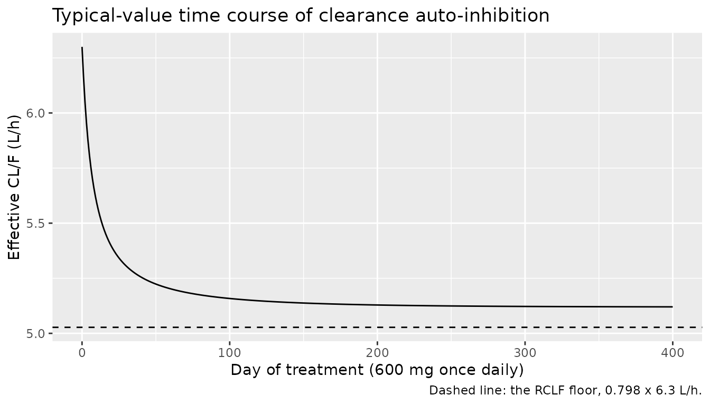
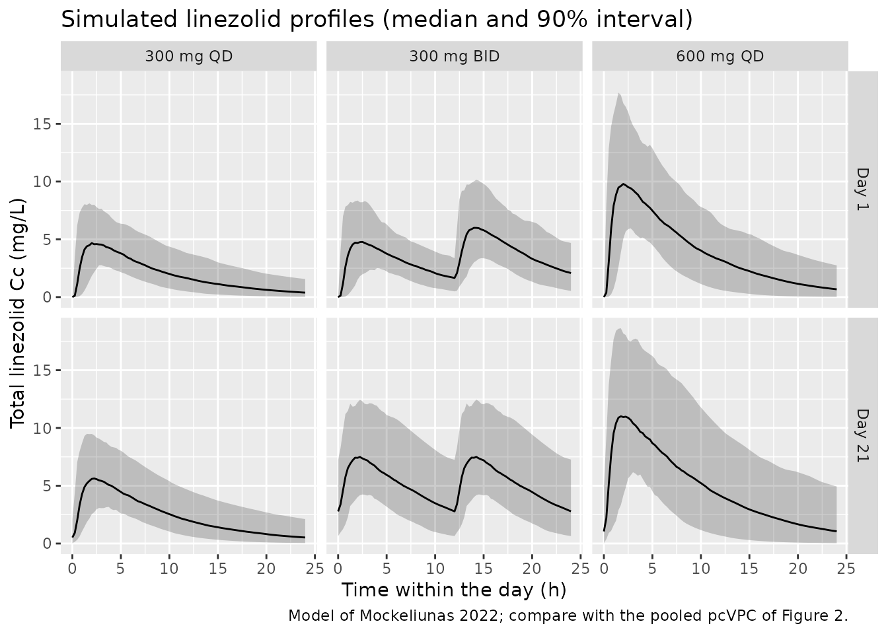

# Linezolid (Mockeliunas 2022)

## Model and source

- Citation: Mockeliunas L, Keutzer L, Sturkenboom MGG, Bolhuis MS,
  Hulskotte LMG, Akkerman OW, Simonsson USH (2022). Model-Informed
  Precision Dosing of Linezolid in Patients with Drug-Resistant
  Tuberculosis. Pharmaceutics 14(4):753.
  <doi:10.3390/pharmaceutics14040753>.
- Description: One-compartment population PK model for oral linezolid in
  adults with multidrug- and extensively drug-resistant tuberculosis
  (Mockeliunas 2022), with transit absorption (the dose passes through
  five transit compartments at ktr = 6/MTT into an absorption
  compartment emptied at first-order ka) and concentration- and
  time-dependent auto-inhibition of elimination after Plock et al.: an
  empirical inhibition compartment equilibrates with the plasma
  concentration at rate kIC and scales the uninhibited apparent
  clearance by RCLF + (1 - RCLF) \* IC50 / (IC50 + Ci), with kIC (0.0005
  /h) and IC50 (0.38 mg/L) fixed to literature values from Keel et
  al. Body weight enters allometrically (exponents 0.75 on CL/F and 1 on
  V/F, reference 70 kg). HIV co-infection raises CL/F, female sex raises
  ka, and concomitant P-glycoprotein inhibitors lengthen MTT.
  Inter-individual variability on CL/F and MTT; inter-occasion
  variability over seven sampling occasions on CL/F, V/F, ka and MTT;
  combined additive and proportional residual error.
- Article: <https://doi.org/10.3390/pharmaceutics14040753> (open access)
- Supplement (NONMEM control stream as Text S1; Tables S1-S2):
  <https://www.mdpi.com/article/10.3390/pharmaceutics14040753/s1>

Mockeliunas et al. fitted a population PK model to routine therapeutic
drug monitoring (TDM) data from adults treated with linezolid for
multidrug- or extensively drug-resistant tuberculosis. They then used it
in a model-informed precision dosing (MIPD) algorithm. The algorithm
targets an unbound AUC0-24h / MIC above 119 for efficacy and an unbound
trough concentration below 1.38 mg/L for safety.

The model has three parts:

- Absorption passes through five transit compartments into an absorption
  compartment.
- Disposition is one-compartment.
- Clearance auto-inhibits over time and with concentration. The
  mechanism is the empirical inhibition compartment of Plock et al.: a
  slowly equilibrating concentration `Ci` scales the uninhibited
  clearance by `RCLF + (1 - RCLF) * IC50 / (IC50 + Ci)`.

The inhibition parameters `kIC` and `IC50` could not be identified from
data collected mostly at steady state. They were therefore fixed to
literature values.

## Population

The analysis used 70 patients (811 plasma concentrations). They were
treated at the Tuberculosis Center Beatrixoord (University Medical
Center Groningen, the Netherlands) between 2007 and 2019. Table 1 of the
paper reports the demographics:

- Weight: mean 61.2 kg (range 35.3-88.9).
- Age: mean 32 years (range 15-70).
- Sex: 38 men (54.5% as printed; 38/70 is 54.3%).
- Cockcroft-Gault creatinine clearance: mean 116.1 mL/min, truncated at
  150 mL/min.
- Comorbidities: HIV co-infection 5 (7.1%), diabetes 9 (12.9%).
- Origin of birth spanned all six WHO regions.

Linezolid was given orally once or twice daily at 150-1200 mg per day,
for up to 542 days. The commonest regimens (Table S1) were 300 mg BID
(34% of sampling occasions), 600 mg QD (22%) and 300 mg QD (21%).
Concentrations came from up to seven sampling occasions per patient.

The same information is available programmatically:

``` r

str(readModelDb("Mockeliunas_2022_linezolid")()$population, max.level = 1)
#> Warning: some etas defaulted to non-mu referenced, possible parsing error: etaiov_cl_1, etaiov_cl_2, etaiov_cl_3, etaiov_cl_4, etaiov_cl_5, etaiov_cl_6, etaiov_cl_7, etaiov_vc_1, etaiov_vc_2, etaiov_vc_3, etaiov_vc_4, etaiov_vc_5, etaiov_vc_6, etaiov_vc_7, etaiov_ka_1, etaiov_ka_2, etaiov_ka_3, etaiov_ka_4, etaiov_ka_5, etaiov_ka_6, etaiov_ka_7, etaiov_mtt_1, etaiov_mtt_2, etaiov_mtt_3, etaiov_mtt_4, etaiov_mtt_5, etaiov_mtt_6, etaiov_mtt_7
#> as a work-around try putting the mu-referenced expression on a simple line
#> List of 16
#>  $ species       : chr "human"
#>  $ n_subjects    : int 70
#>  $ n_studies     : int 1
#>  $ age_range     : chr "15-70 years"
#>  $ age_mean      : chr "32 years"
#>  $ weight_range  : chr "35.3-88.9 kg"
#>  $ weight_mean   : chr "61.2 kg"
#>  $ height_mean   : chr "1.70 m (range 1.50-1.93)"
#>  $ bmi_mean      : chr "21.2 kg/m^2 (range 15.5-32.6)"
#>  $ sex_female_pct: num 45.7
#>  $ race_ethnicity: chr "Origin of birth by WHO region (Table 1): African 10 (14.3%), Americas 2 (2.9%), South-East Asia 6 (8.6%), Europ"| __truncated__
#>  $ disease_state : chr "Multidrug- or extensively drug-resistant tuberculosis. HIV co-infection 5 (7.1%), diabetes 9 (12.9%), smoking 2"| __truncated__
#>  $ renal_function: chr "Cockcroft-Gault creatinine clearance mean 116.1 mL/min (range 40.7-150.0), using lean body weight when BMI > 25"| __truncated__
#>  $ dose_range    : chr "Oral linezolid 150-1200 mg per day, once or twice daily, for up to 542 days in combination with other anti-TB d"| __truncated__
#>  $ regions       : chr "The Netherlands (Tuberculosis Center Beatrixoord, University Medical Center Groningen)."
#>  $ notes         : chr "Retrospective routine therapeutic-drug-monitoring data collected 2007-2019: 811 total plasma linezolid concentr"| __truncated__
```

## Source trace

Every `ini()` value carries an in-file comment pointing at its source.
The final estimates come from Table 2. The structure and covariate
parameterisation come from the NONMEM control stream in Text S1, whose
`$THETA` and `$OMEGA` values are initial estimates and were not used.

| Equation / parameter | Value | Source location |
|----|----|----|
| `lcl` (CL/F, uninhibited, 70 kg) | log(6.3) L/h | Table 2; THETA(1) |
| `lvc` (V/F, 70 kg) | log(50.6) L | Table 2; THETA(2) |
| `lka` (ka, males) | log(1.8) 1/h | Table 2; THETA(3) |
| `lmtt` (MTT) | log(0.53) h | Table 2; THETA(6) |
| `lke0` (kIC) | fixed(log(0.0005)) 1/h | Table 2 (FIX, Keel et al.); Results 3.1 |
| `lic50` (IC50) | fixed(log(0.38)) mg/L | Table 2 (FIX, Keel et al.); Results 3.1 |
| `lfcl_noinh` (RCLF) | log(0.798) | Table 2; THETA(8) |
| `e_wt_cl`, `e_wt_vc` | fixed(0.75), fixed(1) | Methods 2.2.3; Text S1 TVCL / TVV |
| `e_hiv_pos_cl` | 0.43 | Table 2; Text S1 `CLHIV = (1 + THETA(10))` |
| `e_sexf_ka` | 0.95 | Table 2; Text S1 `KASEX = (1 + THETA(11))`, SEX = 1 female (Discussion) |
| `e_conmed_pgp_inh_mtt` | 0.96 | Table 2; Text S1 `MTTPGP_INH = (1 + THETA(12))` |
| `etalcl`, `etalmtt` | 0.26^2, 0.62^2 | Table 2 IIV rows, footnote a (SD) |
| `etaiov_cl_1..7` | 0.27^2 | Table 2 IOV row, footnote b (SD); Text S1 BLOCK(1) SAME x 7 |
| `etaiov_vc_1..7` | 0.26^2 | Table 2 IOV row; Text S1 |
| `etaiov_ka_1..7` | 0.93^2 | Table 2 IOV row; Text S1 |
| `etaiov_mtt_1..7` | 0.69^2 | Table 2 IOV row; Text S1 |
| `propSd`, `addSd` | 0.054, 0.53 mg/L | Table 2; Text S1 `W = SQRT((THETA(4)*IPRED)**2 + THETA(5)**2)` |
| Transit chain, `ktr = (NN + 1) / MTT`, NN = 5 | n/a | Methods 2.2.1 Equations (1)-(2); Results 3.1; Text S1 `$DES` |
| `d/dt(central)` with inhibition factor | n/a | Equation (6); Text S1 `DADT(2)` |
| `d/dt(effect) <- ke0 * (Cc - effect)` | n/a | Equation (7); Text S1 `DADT(8)` |

## Typical-value checks

The checks in this section are deterministic. Every random effect is
suppressed with `omega = NA`, and the typical patient is a 70-kg
HIV-negative man on no P-gp inhibitor.

``` r

mod <- readModelDb("Mockeliunas_2022_linezolid")

typical_events <- function(dose, tau, n_doses, obs_times) {
  dose_times <- tau * (seq_len(n_doses) - 1)
  dplyr::bind_rows(
    data.frame(time = dose_times, evid = 1L, amt = dose, cmt = "depot"),
    data.frame(time = obs_times, evid = 0L, amt = 0, cmt = "central")
  ) |>
    dplyr::mutate(
      id = 1L, WT = 70, SEXF = 0, HIV_POS = 0, CONMED_PGP_INH = 0, OCC = 1
    ) |>
    dplyr::arrange(time, dplyr::desc(evid))
}
```

### Mass balance of the absorption chain

The inhibition factor can be switched off by setting `RCLF = 1`
(`lfcl_noinh = 0`). The model is then linear, and the AUC0-inf of a
single dose must equal `Dose / CL` exactly, whatever the transit-chain
and absorption constants are. This checks that the six-compartment
absorption path loses no drug and that clearance is wired correctly.

``` r

ev_sd <- typical_events(600, 24, 1, c(seq(0, 12, by = 0.05), seq(12.5, 240, by = 0.5)))
sim_noinh <- rxode2::rxSolve(
  mod, events = ev_sd, params = c(lfcl_noinh = 0),
  omega = NA, sigma = NA, rtol = 1e-10, atol = 1e-12
) |> as.data.frame()
#> Warning: some etas defaulted to non-mu referenced, possible parsing error: etaiov_cl_1, etaiov_cl_2, etaiov_cl_3, etaiov_cl_4, etaiov_cl_5, etaiov_cl_6, etaiov_cl_7, etaiov_vc_1, etaiov_vc_2, etaiov_vc_3, etaiov_vc_4, etaiov_vc_5, etaiov_vc_6, etaiov_vc_7, etaiov_ka_1, etaiov_ka_2, etaiov_ka_3, etaiov_ka_4, etaiov_ka_5, etaiov_ka_6, etaiov_ka_7, etaiov_mtt_1, etaiov_mtt_2, etaiov_mtt_3, etaiov_mtt_4, etaiov_mtt_5, etaiov_mtt_6, etaiov_mtt_7
#> as a work-around try putting the mu-referenced expression on a simple line
stopifnot(isTRUE(all.equal(unique(sim_noinh$inh), 1)))

auc_trap <- function(t, y) sum(diff(t) * (head(y, -1) + tail(y, -1)) / 2)
auc_noinh <- auc_trap(sim_noinh$time, sim_noinh$Cc) +
  tail(sim_noinh$Cc, 1) / tail(sim_noinh$kel, 1)
auc_expected <- 600 / 6.3
c(simulated = auc_noinh, expected = auc_expected)
#> simulated  expected 
#>  95.24585  95.23810
# Measured 8e-5 relative error (trapezoidal error on the 0.05-h grid), so
# the bound keeps more than 10x headroom and still fails on any lost drug.
stopifnot(abs(auc_noinh / auc_expected - 1) < 1e-3)
```

With inhibition on, the first dose is barely affected: `kIC` is 0.0005
1/h, so `Ci` fills with a half-life of `log(2) / 0.0005` = 1386 h, about
58 days.

``` r

sim_sd <- rxode2::rxSolve(
  mod, events = ev_sd, omega = NA, sigma = NA, rtol = 1e-10, atol = 1e-12
) |> as.data.frame()
auc_sd <- auc_trap(sim_sd$time, sim_sd$Cc)
c(auc_0_240 = auc_sd, dose_over_cl = auc_expected,
  inh_at_240h = tail(sim_sd$inh, 1))
#>    auc_0_240 dose_over_cl  inh_at_240h 
#>   96.3806481   95.2380952    0.9794939
# Inhibition raises the single-dose AUC by a few percent at most.
stopifnot(auc_sd > 0.99 * auc_expected, auc_sd < 1.10 * auc_expected)
```

### Long-term auto-inhibition

Under repeated dosing, `Ci` approaches the average steady-state
concentration `Cavg = Dose / (tau * CL * inh)`. At the same time the
inhibition factor is `inh = RCLF + (1 - RCLF) * IC50 / (IC50 + Ci)`.
Solving these two equations together gives the fully inhibited steady
state. A 400-day simulation of 600 mg once daily, about seven half-lives
of `Ci`, must converge to that solution.

``` r

rclf <- 0.798
ic50 <- 0.38
cl_typ <- 6.3
inh_fixed_point <- uniroot(
  function(inh) {
    cavg <- 600 / (24 * cl_typ * inh)
    rclf + (1 - rclf) * ic50 / (ic50 + cavg) - inh
  },
  c(rclf, 1), tol = 1e-12
)$root

n_days <- 400
ev_md <- typical_events(
  600, 24, n_days,
  sort(unique(c(seq(0, n_days * 24, by = 24), seq((n_days - 1) * 24, n_days * 24, by = 0.1))))
)
sim_md <- rxode2::rxSolve(
  mod, events = ev_md, omega = NA, sigma = NA, maxsteps = 1e6
) |> as.data.frame()

inh_end <- tail(sim_md$inh, 1)
last <- sim_md |> dplyr::filter(time >= (n_days - 1) * 24)
auc_tau_end <- auc_trap(last$time, last$Cc)
c(inh_simulated = inh_end, inh_fixed_point = inh_fixed_point,
  auc_tau_day400 = auc_tau_end,
  dose_over_cl_inh = 600 / (cl_typ * inh_fixed_point))
#>    inh_simulated  inh_fixed_point   auc_tau_day400 dose_over_cl_inh 
#>        0.8127360        0.8125834      117.1855523      117.2040805
# exp(-0.0005 * 9600) = 0.8% of the initial gap in Ci is left at day 400.
stopifnot(
  abs(inh_end / inh_fixed_point - 1) < 0.005,
  abs(auc_tau_end / (600 / (cl_typ * inh_fixed_point)) - 1) < 0.01
)
```

The typical uninhibited clearance of 6.3 L/h falls to 5.12 L/h at full
inhibition, a 19% reduction. That is close to the largest reduction the
model allows, `1 - RCLF` = 20.2%.

``` r

sim_md |>
  dplyr::filter(time %% 24 == 0) |>
  dplyr::mutate(day = time / 24, cl_eff = cl * inh) |>
  ggplot(aes(day, cl_eff)) +
  geom_line() +
  geom_hline(yintercept = cl_typ * rclf, linetype = "dashed") +
  labs(
    x = "Day of treatment (600 mg once daily)",
    y = "Effective CL/F (L/h)",
    title = "Typical-value time course of clearance auto-inhibition",
    caption = "Dashed line: the RCLF floor, 0.798 x 6.3 L/h."
  )
```



## Virtual cohort

The observed data are not public. The cohort below samples covariates to
match Table 1:

- Weight: normal, mean 61.2 kg, truncated to the observed 35.3-88.9 kg
  range.
- Female sex: 45.7% (32 of 70).
- HIV co-infection: 7.1%.
- Concomitant P-gp inhibitors: none, because the paper does not report
  how common they were.

Three of the regimens in Table S1 are simulated, with 200 patients each,
for 21 days. The occasion index follows the sampling design of the
paper’s MIPD algorithm, with occasions on days 1, 8 and 15. Occasion 1
covers days 1-7, occasion 2 days 8-14 and occasion 3 days 15-21. The
occasion switches on a dose record, so each week draws its own
inter-occasion random effects.

``` r

rxode2::rxSetSeed(20220330)
set.seed(20220330)

n_per_arm <- 200
regimens <- data.frame(
  regimen = c("300 mg QD", "300 mg BID", "600 mg QD"),
  dose = c(300, 300, 600),
  tau = c(24, 12, 24)
)

r_trunc_norm <- function(n, mean, sd, lo, hi) {
  x <- rnorm(n, mean, sd)
  while (any(out <- x < lo | x > hi)) x[out] <- rnorm(sum(out), mean, sd)
  x
}

make_cohort <- function(regimen, dose, tau, n, id_offset) {
  subj <- data.frame(
    id = id_offset + seq_len(n),
    WT = r_trunc_norm(n, 61.2, 11, 35.3, 88.9),
    SEXF = rbinom(n, 1, 32 / 70),
    HIV_POS = rbinom(n, 1, 0.071),
    CONMED_PGP_INH = 0
  )
  dose_times <- seq(0, 21 * 24 - tau, by = tau)
  # Dense sampling over the first dosing day and over day 21; troughs daily.
  obs_times <- sort(unique(c(
    seq(0, 24, by = 0.25),
    seq(20 * 24, 21 * 24, by = 0.25),
    seq(0, 21 * 24, by = 24)
  )))
  rows <- dplyr::bind_rows(
    data.frame(time = dose_times, evid = 1L, amt = dose, cmt = "depot"),
    data.frame(time = obs_times, evid = 0L, amt = 0, cmt = "central")
  )
  tidyr::crossing(subj, rows) |>
    dplyr::mutate(
      OCC = pmin(floor(time / (7 * 24)) + 1, 3),
      regimen = regimen,
      ii = 0
    ) |>
    dplyr::arrange(id, time, dplyr::desc(evid))
}

events <- dplyr::bind_rows(lapply(seq_len(nrow(regimens)), function(i) {
  make_cohort(
    regimens$regimen[i], regimens$dose[i], regimens$tau[i],
    n_per_arm, id_offset = (i - 1L) * n_per_arm
  )
}))
stopifnot(!anyDuplicated(unique(events[, c("id", "time", "evid")])))
stopifnot(all(tapply(events$regimen, events$id, function(x) length(unique(x))) == 1))
```

## Simulation

``` r

sim <- rxode2::rxSolve(
  mod, events = events,
  keep = c("regimen", "WT", "SEXF", "HIV_POS"),
  maxsteps = 1e6
) |> as.data.frame()
stopifnot(!anyNA(sim$Cc))
# Numerical undershoot at a trough is bounded relative to the peak.
stopifnot(all(sim$Cc >= -1e-6 * max(sim$Cc)))
sim$regimen <- factor(sim$regimen, levels = regimens$regimen)
```

## Concentration-time profiles

The paper’s Figure 2 is a prediction-corrected VPC of the pooled TDM
data. That cannot be rebuilt without the observed concentrations. The
figure below shows the simulated 5th, 50th and 95th percentiles of total
plasma linezolid on day 1 and on day 21 of each regimen.

``` r

sim |>
  dplyr::filter(time <= 24 | time >= 20 * 24) |>
  dplyr::mutate(
    day = ifelse(time <= 24, "Day 1", "Day 21"),
    tad_day = ifelse(time <= 24, time, time - 20 * 24)
  ) |>
  dplyr::group_by(regimen, day, tad_day) |>
  dplyr::summarise(
    Q05 = quantile(Cc, 0.05), Q50 = median(Cc), Q95 = quantile(Cc, 0.95),
    .groups = "drop"
  ) |>
  ggplot(aes(tad_day, Q50)) +
  geom_ribbon(aes(ymin = Q05, ymax = Q95), alpha = 0.25) +
  geom_line() +
  facet_grid(day ~ regimen) +
  labs(
    x = "Time within the day (h)", y = "Total linezolid Cc (mg/L)",
    title = "Simulated linezolid profiles (median and 90% interval)",
    caption = "Model of Mockeliunas 2022; compare with the pooled pcVPC of Figure 2."
  )
```



## PKNCA validation

NCA runs over the first dosing interval and over the last dosing
interval on day 21. The paper reports no NCA table. Instead, the check
is a per-subject identity that holds at steady state: over a dosing
interval, `AUC0-tau = Dose / (CL * inh)`. On day 21 each subject has
been on the same occasion (occasion 3) for six days, more than 20
elimination half-lives. The inhibition factor drifts by well under 1%
within a day.

``` r

sim_nca <- sim |>
  dplyr::filter(!is.na(Cc)) |>
  dplyr::mutate(Cc = pmax(Cc, 0)) |>
  dplyr::select(id, time, Cc, regimen)

dose_df <- events |>
  dplyr::filter(evid == 1) |>
  dplyr::select(id, time, amt, regimen)

conc_obj <- PKNCA::PKNCAconc(sim_nca, Cc ~ time | regimen + id)
dose_obj <- PKNCA::PKNCAdose(dose_df, amt ~ time | regimen + id)

intervals <- dplyr::bind_rows(lapply(seq_len(nrow(regimens)), function(i) {
  tau <- regimens$tau[i]
  data.frame(
    regimen = regimens$regimen[i],
    start = c(0, 21 * 24 - tau),
    end = c(tau, 21 * 24),
    cmax = TRUE, tmax = TRUE, auclast = TRUE, cmin = TRUE
  )
}))

nca_res <- PKNCA::pk.nca(PKNCA::PKNCAdata(conc_obj, dose_obj, intervals = intervals))

nca_summary <- as.data.frame(nca_res$result) |>
  dplyr::filter(PPTESTCD %in% c("cmax", "tmax", "auclast", "cmin")) |>
  dplyr::mutate(interval = ifelse(start == 0, "First dose", "Day 21")) |>
  dplyr::group_by(regimen, interval, PPTESTCD) |>
  dplyr::summarise(median = signif(median(PPORRES), 3), .groups = "drop") |>
  tidyr::pivot_wider(names_from = PPTESTCD, values_from = median) |>
  dplyr::arrange(regimen, dplyr::desc(interval))

nca_summary |>
  dplyr::rename(
    "Regimen" = regimen, "Interval" = interval,
    "Cmax (mg/L)" = cmax, "Tmax (h)" = tmax,
    "AUCtau (mg*h/L)" = auclast, "Cmin (mg/L)" = cmin
  ) |>
  knitr::kable(caption = "Median simulated NCA parameters by regimen and dosing interval.")
```

| Regimen    | Interval   | AUCtau (mg\*h/L) | Cmax (mg/L) | Cmin (mg/L) | Tmax (h) |
|:-----------|:-----------|-----------------:|------------:|------------:|---------:|
| 300 mg BID | First dose |             37.3 |        5.20 |       0.000 |     2.00 |
| 300 mg BID | Day 21     |             62.4 |        7.82 |       2.770 |     2.00 |
| 300 mg QD  | First dose |             47.3 |        5.26 |       0.000 |     2.00 |
| 300 mg QD  | Day 21     |             58.3 |        6.05 |       0.521 |     2.00 |
| 600 mg QD  | First dose |             96.6 |       10.80 |       0.000 |     1.75 |
| 600 mg QD  | Day 21     |            116.0 |       12.40 |       1.020 |     2.00 |

Median simulated NCA parameters by regimen and dosing interval. {.table}

``` r

auc_day21 <- as.data.frame(nca_res$result) |>
  dplyr::filter(PPTESTCD == "auclast", start > 0) |>
  dplyr::select(id, regimen, auc = PPORRES)

cl_day21 <- sim |>
  dplyr::filter(time >= 20 * 24) |>
  dplyr::group_by(id) |>
  dplyr::summarise(cl_eff = mean(cl * inh), .groups = "drop")

chk <- auc_day21 |>
  dplyr::inner_join(cl_day21, by = "id") |>
  dplyr::left_join(
    dplyr::mutate(regimens, regimen = factor(regimen, levels = regimen)),
    by = "regimen"
  ) |>
  dplyr::mutate(pct_diff = 100 * (auc / (dose / cl_eff) - 1))
stopifnot(nrow(chk) == 3 * n_per_arm)
summary(chk$pct_diff)
#>     Min.  1st Qu.   Median     Mean  3rd Qu.     Max. 
#> -1.82234 -0.11317 -0.07536 -0.09222 -0.04178  0.17475
# Both sides use each subject's own drawn parameters, so the difference is
# trapezoidal error on the 0.25-h grid plus the residual non-stationarity
# of the previous occasion. The latter is largest for the rare subjects
# whose occasion-3 ka and MTT make absorption very slow.
stopifnot(
  abs(median(chk$pct_diff)) < 1,
  quantile(abs(chk$pct_diff), 0.95) < 3
)
```

## Safety-target attainment under flat dosing

Figure 4 of the paper reports the proportions for 600 mg once daily. The
paper converts total exposure to unbound exposure with a fraction
unbound of 0.69, so the safety limit fCmin \< 1.38 mg/L is a total
trough below 2.0 mg/L. Of the simulated patients, 67.2% met both
targets, 17.6% met only the efficacy target, 14.0% met only the safety
target and 1.2% met neither. That puts 18.8% of patients above the
safety limit.

The efficacy target also needs each patient’s MIC. The MIC values were
bootstrapped from the study data and are not reported, so only the
safety half of Figure 4 is compared here.

``` r

fu <- 0.69
troughs <- sim |>
  dplyr::filter(time %in% c(8 * 24, 15 * 24, 21 * 24)) |>
  dplyr::mutate(day = time / 24, fCmin = fu * Cc) |>
  dplyr::group_by(regimen, day) |>
  dplyr::summarise(
    pct_unsafe = 100 * mean(fCmin >= 1.38),
    median_fCmin = median(fCmin),
    .groups = "drop"
  )
troughs |>
  dplyr::mutate(pct_unsafe = round(pct_unsafe, 1), median_fCmin = signif(median_fCmin, 3)) |>
  dplyr::rename(
    "Regimen" = regimen, "Day (pre-dose)" = day,
    "% with fCmin >= 1.38 mg/L" = pct_unsafe, "Median fCmin (mg/L)" = median_fCmin
  ) |>
  knitr::kable(caption = "Simulated safety-target failure by regimen and trough day.")
```

| Regimen    | Day (pre-dose) | % with fCmin \>= 1.38 mg/L | Median fCmin (mg/L) |
|:-----------|---------------:|---------------------------:|--------------------:|
| 300 mg QD  |              8 |                        4.5 |               0.306 |
| 300 mg QD  |             15 |                        5.5 |               0.342 |
| 300 mg QD  |             21 |                        8.0 |               0.361 |
| 300 mg BID |              8 |                       65.0 |               1.750 |
| 300 mg BID |             15 |                       68.5 |               1.850 |
| 300 mg BID |             21 |                       69.5 |               1.920 |
| 600 mg QD  |              8 |                       20.0 |               0.603 |
| 600 mg QD  |             15 |                       26.5 |               0.703 |
| 600 mg QD  |             21 |                       28.5 |               0.729 |

Simulated safety-target failure by regimen and trough day. {.table}

``` r


unsafe_600 <- troughs$pct_unsafe[troughs$regimen == "600 mg QD" & troughs$day == 15]
stopifnot(length(unsafe_600) == 1L)
unsafe_600
#> [1] 26.5
```

With full variability, meaning between-subject plus a fresh
inter-occasion draw each week, the simulated failure rate is higher than
the 18.8% of Figure 4. A 2000-patient run gave 30.4%.

The paper derived its reference exposures from “true individual PK
parameters”. Individual parameters of that kind carry the
between-subject random effects, not an occasion-specific draw.
Re-solving the same 600 mg QD patients with the inter-occasion variances
set to zero brings the failure rate close to the published value. The
2000-patient run gave 20.3%.

``` r

ui <- rxode2::rxode(mod)
#> Warning: some etas defaulted to non-mu referenced, possible parsing error: etaiov_cl_1, etaiov_cl_2, etaiov_cl_3, etaiov_cl_4, etaiov_cl_5, etaiov_cl_6, etaiov_cl_7, etaiov_vc_1, etaiov_vc_2, etaiov_vc_3, etaiov_vc_4, etaiov_vc_5, etaiov_vc_6, etaiov_vc_7, etaiov_ka_1, etaiov_ka_2, etaiov_ka_3, etaiov_ka_4, etaiov_ka_5, etaiov_ka_6, etaiov_ka_7, etaiov_mtt_1, etaiov_mtt_2, etaiov_mtt_3, etaiov_mtt_4, etaiov_mtt_5, etaiov_mtt_6, etaiov_mtt_7
#> as a work-around try putting the mu-referenced expression on a simple line
omega_iiv <- ui$omega
iov_names <- grep("^etaiov_", rownames(omega_iiv), value = TRUE)
omega_iiv[iov_names, ] <- 0
omega_iiv[, iov_names] <- 0
diag(omega_iiv)[match(iov_names, rownames(omega_iiv))] <- 1e-12

ev_600 <- events |>
  dplyr::filter(regimen == "600 mg QD", time <= 15 * 24)
sim_iiv <- rxode2::rxSolve(
  mod, events = ev_600, omega = omega_iiv, keep = "regimen", maxsteps = 1e6
) |> as.data.frame()
stopifnot(all(abs(sim_iiv$iov_cl) < 1e-4), length(unique(sim_iiv$id)) == n_per_arm)

unsafe_600_iiv <- 100 * mean(fu * sim_iiv$Cc[sim_iiv$time == 15 * 24] >= 1.38)
c(full_variability = unsafe_600, iiv_only = unsafe_600_iiv, published = 17.6 + 1.2)
#> full_variability         iiv_only        published 
#>             26.5             14.5             18.8
```

With 200 patients the binomial standard error of a proportion near 20%
is about 2.8 percentage points, and near 30% it is about 3.2. Both
assertions allow more than three standard errors either side of the
long-run value. They still fail if the clearance, volume, dose or unit
were mis-transcribed, since any of those moves the trough distribution
by tens of percent.

``` r

stopifnot(
  abs(unsafe_600_iiv - 18.8) < 10,
  unsafe_600 > 15, unsafe_600 < 45
)
```

## Assumptions and deviations

- **Final estimates from Table 2, structure from Text S1.** The `$THETA`
  and `$OMEGA` records of the supplementary control stream hold initial
  estimates. For example, CL is 6.11 there and 6.3 in Table 2, and the
  proportional error is 0.268 there and 0.054 in Table 2. Only the
  structure, the covariate parameterisation and the number of occasions
  were taken from Text S1.
- **IIV and IOV are standard deviations.** Table 2 labels the IIV and
  IOV rows “(%CV)”, but footnotes a and b state they are “expressed as
  the standard deviation”. The etas enter exponentially, so each
  variance is the printed value squared. For MTT, the control-stream
  initial IIV of 0.403 is closer to 0.62^2 = 0.384 than to the %CV
  reading, log(1 + 0.62^2) = 0.325, which supports the footnotes.
- **Proportional error.** Table 2 prints the proportional error as
  “0.054” under a “(%)” heading. The control stream uses it as the SD of
  a proportional term (`THETA(4) * IPRED` with `$SIGMA 1` held
  constant), so it is encoded as the fraction 0.054 (5.4%).
- **Transit-chain sign.** Equation (2) of the paper prints the transit
  inflow as `-ktr * A(n-1)`. The control stream (`DADT(3)` to `DADT(6)`)
  uses the physically correct `+ktr * A(n-1)`, and that form is
  implemented.
- **Compartment mapping.** Text S1 numbers the first transit compartment
  1 (the dose compartment), the central compartment 2, transit
  compartments 2-5 as 3-6, the absorption compartment 7 and the
  inhibition compartment 8. The model uses `depot`,
  `transit1`-`transit4`, `transit5` (the absorption compartment, emptied
  at `ka`), `central` and `effect` (holding `Ci` in mg/L). Doses go to
  `depot`.
- **Inhibition-compartment naming.** `kIC` is encoded as `lke0` and RCLF
  as `lfcl_noinh`, following the same Plock-type auto-inhibition in
  `Kim_2019_voriconazole`. In this paper `Ci` equilibrates with plasma
  (`dCi/dt = kIC * (Cc - Ci)`), which is the standard effect-compartment
  form.
- **Occasions.** Seven occasions are encoded, as in Text S1. Records
  with `OCC` outside 1-7 carry no IOV. The weekly occasion schedule in
  the cohort follows the day 1, 8 and 15 sampling design of the paper’s
  MIPD algorithm. It is an illustration, not the study’s occasion
  structure.
- **Virtual cohort.** Weight is drawn from a normal distribution with an
  assumed SD of 11 kg, since Table 1 gives only the mean and range. No
  patient receives a P-gp inhibitor, because the paper does not report
  how many did.
- **Target attainment.** The paper’s MIPD simulations bootstrapped
  covariates and MIC values from the study data and do not say on which
  day the flat-dose exposures were evaluated. The safety comparison uses
  the day-15 trough. The published 18.8% is reproduced when
  inter-occasion variability is left out of the simulated exposures.
  With it included, the model predicts about 30%. This reading of how
  the paper built its reference exposures is the maintainers’ inference;
  the paper does not state it. Efficacy-target attainment is not
  reproduced, because the MIC distribution is not reported.
- **Errata.** No correction notice for this article was found on Europe
  PMC as of 2026-09-30.
