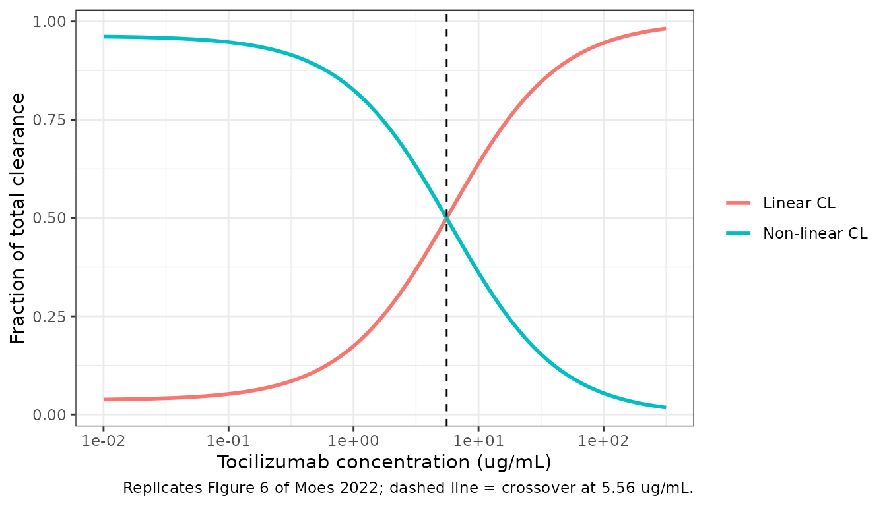
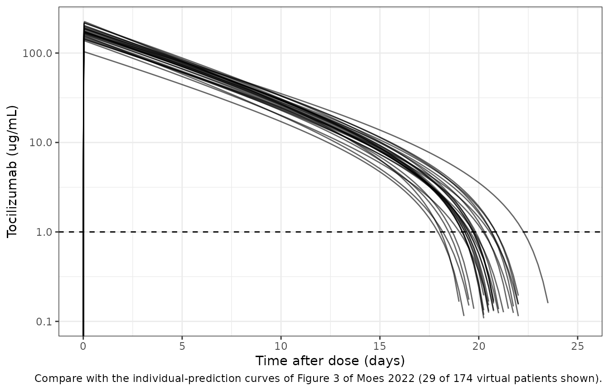
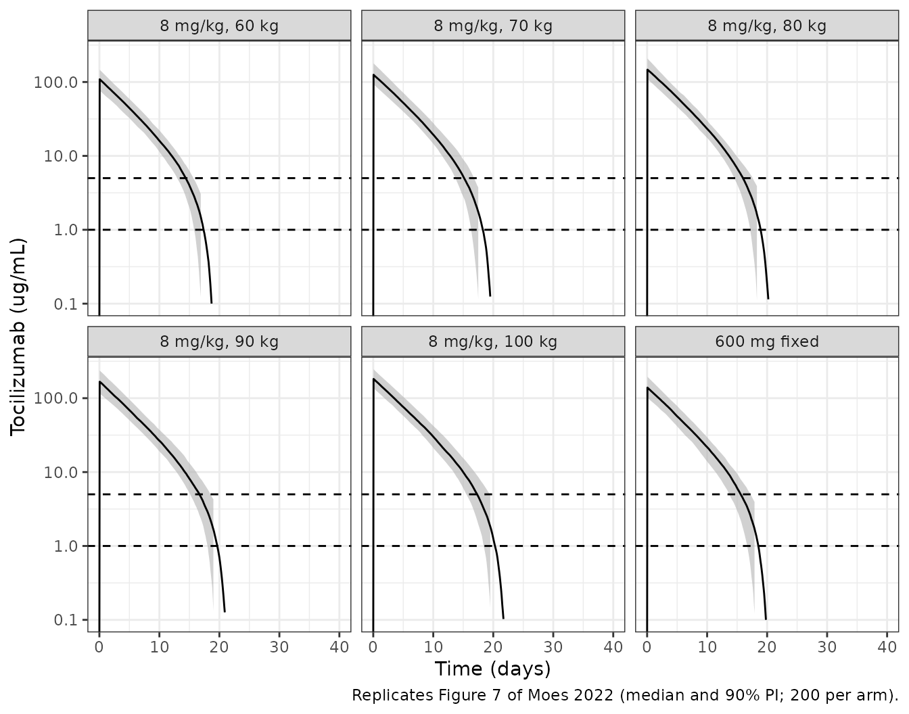
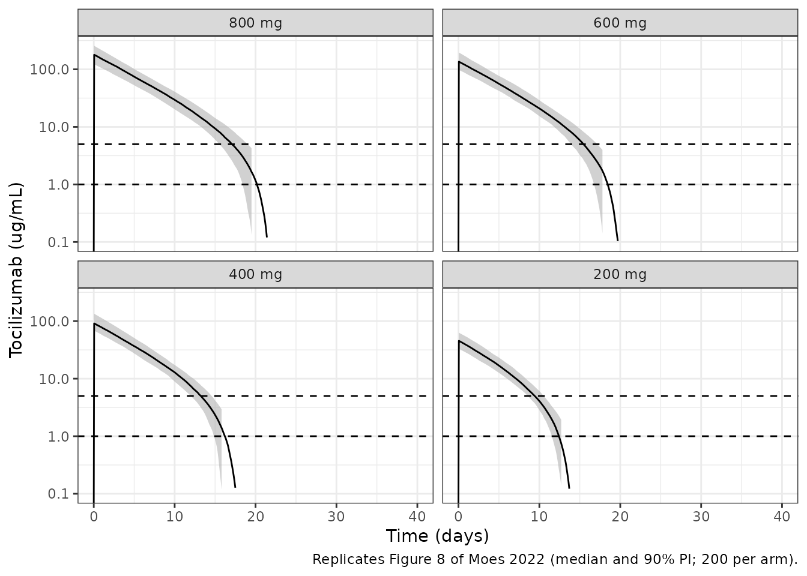
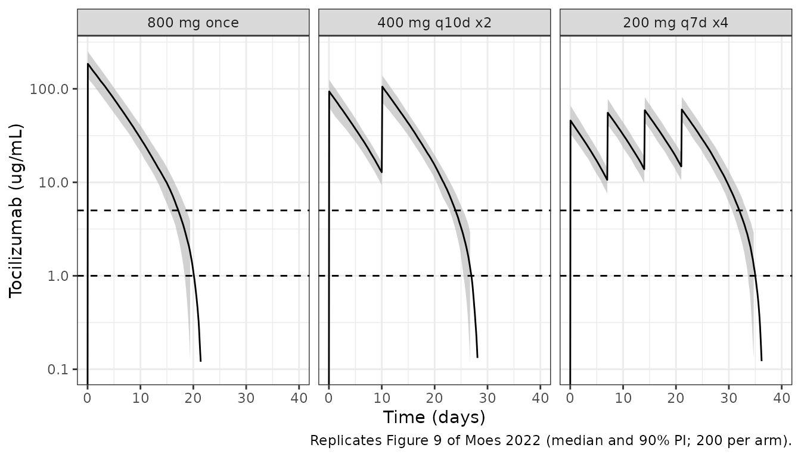

# Tocilizumab in ICU-admitted COVID-19 (Moes 2022)

## Model and source

- Citation: Moes DJAR, van Westerloo DJ, Arend SM, Swen JJ, de Vries A,
  Guchelaar HJ, Joosten SA, de Boer MGJ, van Gelder T, van Paassen J.
  Towards Fixed Dosing of Tocilizumab in ICU-Admitted COVID-19 Patients:
  Results of an Observational Population Pharmacokinetic and Descriptive
  Pharmacodynamic Study. Clin Pharmacokinet. 2022;61(2):231-247.
  <doi:10.1007/s40262-021-01074-2>
- Description: One-compartment population PK model for intravenous
  tocilizumab in ICU-admitted adults with COVID-19 co-treated with
  dexamethasone (Moes 2022), with parallel first-order linear and
  Michaelis-Menten elimination from the central compartment and
  correlated IIV on CL and V; no covariates retained.
- Article: [Clin Pharmacokinet.
  2022;61(2):231-247](https://doi.org/10.1007/s40262-021-01074-2) (open
  access, PMC8502793). Electronic supplementary material (ESM) 1
  contains the final NONMEM control stream, which this extraction uses
  to settle the units of Vmax and the IIV block.

## Population

Moes 2022 is a single-centre, open-label, observational PK study at the
Leiden University Medical Center (December 2020 to March 2021). It
enrolled 29 adults with PCR-confirmed COVID-19 who were admitted to the
ICU with respiratory organ support (82.8% mechanically ventilated).
Every patient received dexamethasone 6 mg once daily for up to 10 days
and a single intravenous tocilizumab dose of 8 mg/kg (maximum 800 mg)
within 24 h of starting organ support.

Baseline characteristics (Moes 2022 Table 1): mean age 64 years (45-80),
72.4% male, mean body weight 96.4 kg (58-130), mean BMI 30.9 kg/m^2
(20.1-46.1), mean albumin 32 g/L, and mean CRP 146 mg/L. The
administered doses ranged from 472 to 1552 mg (mean 781 mg). One patient
received a double dose by accident. A total of 139 free-tocilizumab
plasma concentrations (ELISA, LLOQ 0.2 ug/mL) were collected from day 1
to day 20 after the dose, with 1-11 samples per patient.

The same information is available programmatically via
`readModelDb("Moes_2022_tocilizumab")$population`.

## Source trace

The final model is a one-compartment model with parallel first-order and
Michaelis-Menten elimination (Moes 2022 Fig. 1). No covariate was
retained: body weight entered as a power function on CL gave an exponent
of 0.002 (Section 3.5).

| Quantity | Value | Source |
|----|----|----|
| Structure: `d/dt(central) = -(CL/V) * central - Vmax * C / (Km + C)` | – | Fig. 1; ESM 1 `$DES` |
| CL (L/day) | 0.725 | Table 3; ESM 1 `$THETA` |
| Vd (L) | 4.34 | Table 3; ESM 1 `$THETA` |
| Vmax (mg/day) | 4.19 | Table 3; ESM 1 `$THETA` (amount rate in `$DES`) |
| Km (mg/L = ug/mL) | 0.22 | Table 3; ESM 1 `$THETA` |
| omega^2 CL | 0.0351 (18.9% CV) | ESM 1 `$OMEGA BLOCK(2)`; CV in Table 3 |
| cov(CL, Vd) | 0.0355 (r = 0.914) | ESM 1 `$OMEGA BLOCK(2)` (not printed in Table 3) |
| omega^2 Vd | 0.043 (21.0% CV) | ESM 1 `$OMEGA BLOCK(2)`; CV in Table 3 |
| IIV on Vmax, Km | none | Table 2; ESM 1 `$OMEGA 0 FIX` |
| Proportional residual error | 0.171 | Table 3; ESM 1 `$THETA` |
| Additive residual error (ug/mL) | 0.139 | Table 3; ESM 1 `$THETA` |
| Residual-error form | combined2, `sqrt(prop^2 * IPRED^2 + add^2)` | ESM 1 `$ERROR` |

The stored variances reproduce the Table 3 CVs as
`sqrt(exp(omega^2) - 1)`:

``` r

mod <- readModelDb("Moes_2022_tocilizumab")
ui <- rxode2::rxode2(mod)
om <- ui$omega
cv <- 100 * sqrt(exp(diag(om)) - 1)
cv
#>   etalcl   etalvc 
#> 18.90060 20.96137
stopifnot(
  abs(cv[["etalcl"]] - 18.9) < 0.05,
  abs(cv[["etalvc"]] - 21.0) < 0.05
)
```

## Structural checks

### The Michaelis-Menten arm is active

The model has variables named `cl` and `vc`. The check below confirms
that rxode2 integrates the explicit ODE, including the saturable arm,
rather than replacing it with an analytical linear solution. The typical
AUC0-inf must drop below `Dose/CL` when Vmax is non-zero.

``` r

stopifnot(is.null(ui$linCmt))
mod_typ <- rxode2::zeroRe(ui)
dose_mean <- 21879 / 29 # mg, mean first dose (ESM Table S3 total / 29 patients)
ev_typ <- rxode2::et(amt = dose_mean, cmt = "central", rate = dose_mean * 24) |>
  rxode2::et(c(seq(0, 1, by = 0.01), seq(1.05, 60, by = 0.05)))
trap <- function(x, y) sum(diff(x) * (head(y, -1) + tail(y, -1)) / 2)
s_mm <- rxode2::rxSolve(mod_typ, ev_typ, returnType = "data.frame")
#> ℹ omega/sigma items treated as zero: 'etalcl', 'etalvc'
s_lin <- rxode2::rxSolve(
  rxode2::ini(mod_typ, lvmax = log(1e-12)),
  ev_typ,
  returnType = "data.frame"
)
#> ℹ change initial estimate of `lvmax` to `-27.6310211159285`
#> ℹ omega/sigma items treated as zero: 'etalcl', 'etalvc'
auc_typ <- c(
  with_mm = trap(s_mm$time, s_mm$Cc),
  linear_only = trap(s_lin$time, s_lin$Cc),
  dose_over_cl = dose_mean / 0.725
)
auc_typ
#>      with_mm  linear_only dose_over_cl 
#>     922.8392    1040.5478    1040.6183
stopifnot(
  # linear-only solve equals the closed form Dose/CL
  abs(auc_typ[["linear_only"]] / auc_typ[["dose_over_cl"]] - 1) < 0.005,
  # the saturable arm removes roughly 10% of the exposure at this dose
  auc_typ[["with_mm"]] < 0.95 * auc_typ[["linear_only"]]
)
```

### Linear versus non-linear clearance (Figure 6)

The non-linear clearance at concentration `C` is `Vmax / (Km + C)`. It
exceeds the linear CL below `C* = Vmax / CL - Km`. Moes 2022 reports
this crossover as approximately 5 ug/mL (Section 3.4, Fig. 6). The value
follows from Table 3 alone, and it holds only if Vmax is an amount rate
(mg/day). If Vmax were a concentration rate (mg/L/day), as in some other
tocilizumab models, the crossover would be `Vmax * V / CL - Km` = 24.9
ug/mL.

``` r

p <- c(cl = 0.725, v = 4.34, vmax = 4.19, km = 0.22)
c_star <- p[["vmax"]] / p[["cl"]] - p[["km"]]
c_star
#> [1] 5.55931
stopifnot(abs(c_star - 5.56) < 0.01)

fig6 <- tibble(conc = 10^seq(-2, 2.5, length.out = 300)) |>
  mutate(
    cl_nonlin = p[["vmax"]] / (p[["km"]] + conc),
    cl_total = p[["cl"]] + cl_nonlin,
    `Linear CL` = p[["cl"]] / cl_total,
    `Non-linear CL` = cl_nonlin / cl_total
  ) |>
  pivot_longer(c(`Linear CL`, `Non-linear CL`), names_to = "pathway", values_to = "fraction")

ggplot(fig6, aes(conc, fraction, colour = pathway)) +
  geom_line(linewidth = 1) +
  geom_vline(xintercept = c_star, linetype = "dashed") +
  scale_x_log10() +
  labs(
    x = "Tocilizumab concentration (ug/mL)",
    y = "Fraction of total clearance",
    colour = NULL,
    caption = "Replicates Figure 6 of Moes 2022; dashed line = crossover at 5.56 ug/mL."
  ) +
  theme_bw()
```



## Virtual cohort

The observed cohort is re-used directly. ESM Table S3 lists the dose
prescribed to each of the 29 patients (472-800 mg, mean 754 mg). Table 1
reports a mean administered dose of 781 mg with a maximum of 1552 mg.
That summary is reproduced exactly when the patient prescribed 776 mg
received it twice, which is the accidental double dose described in
Section 3.1: (21879 + 776) / 29 = 781.2 mg. The published exposure
metric is the AUC0-inf of the *first* dose, so the virtual cohort gives
each patient their Table S3 dose once. Each of the 29 doses is
replicated 6 times, giving 174 virtual patients. Each dose is given as a
1-h intravenous infusion.

``` r

dose_s3 <- c(
  760, 800, 640, 664, 640, 799, 472, 800, 776, 640, 800, 688, 800, 800, 800,
  800, 800, 600, 800, 800, 800, 800, 800, 800, 800, 800, 800, 800, 800
)
stopifnot(length(dose_s3) == 29L, sum(dose_s3) == 21879)
# Table 1 mean and maximum administered dose, with patient 9's dose given twice
dose_admin <- dose_s3
dose_admin[9] <- 2 * dose_s3[9]
stopifnot(abs(mean(dose_admin) - 781) < 0.5, max(dose_admin) == 1552)

n_rep <- 6L
cohort <- tibble(
  id = seq_len(29L * n_rep),
  dose = rep(dose_s3, times = n_rep)
)
obs_times <- c(seq(0, 1, by = 0.02), seq(1.1, 10, by = 0.1), seq(10.25, 40, by = 0.25))
```

## Simulation

``` r

rxode2::rxSetSeed(20211011)
ev_cohort <- bind_rows(
  cohort |> mutate(time = 0, amt = dose, rate = dose * 24, evid = 1L, cmt = "central"),
  tidyr::crossing(cohort, time = obs_times) |>
    mutate(amt = 0, rate = 0, evid = 0L, cmt = "central")
) |>
  arrange(id, time, desc(evid)) |>
  select(id, time, amt, rate, evid, cmt, dose)

sim_cohort <- rxode2::rxSolve(
  mod, ev_cohort,
  keep = "dose", returnType = "data.frame"
) |>
  mutate(treatment = "Observed-cohort doses")
```

The individual predictions (`ipredSim`, no residual error) are plotted,
matching the individual-prediction curves in Figure 3 of Moes 2022.

``` r

sim_cohort |>
  filter(id <= 29) |>
  ggplot(aes(time, ipredSim, group = id)) +
  geom_line(alpha = 0.6) +
  geom_hline(yintercept = 1, linetype = "dashed") +
  scale_y_log10(limits = c(0.1, NA)) +
  coord_cartesian(xlim = c(0, 25)) +
  labs(
    x = "Time after dose (days)",
    y = "Tocilizumab (ug/mL)",
    caption = "Compare with the individual-prediction curves of Figure 3 of Moes 2022 (29 of 174 virtual patients shown)."
  ) +
  theme_bw()
#> Warning in scale_y_log10(limits = c(0.1, NA)): log-10 transformation introduced
#> infinite values.
#> Warning: Removed 2226 rows containing missing values or values outside the scale range
#> (`geom_line()`).
```



## PKNCA validation

``` r

# After the saturable arm clears the drug, the ODE solver returns values of
# order -1e-11 ug/mL (integration round-off around zero). Confirm that is all
# they are, then set them to zero so PKNCA's log-down trapezoid is defined.
stopifnot(min(sim_cohort$ipredSim) > -1e-8)
conc_df <- sim_cohort |>
  filter(!is.na(ipredSim)) |>
  transmute(id, time, conc = pmax(ipredSim, 0), treatment)
dose_df <- cohort |>
  transmute(id, time = 0, dose, treatment = "Observed-cohort doses")

conc_obj <- PKNCA::PKNCAconc(conc_df, conc ~ time | treatment + id)
dose_obj <- PKNCA::PKNCAdose(dose_df, dose ~ time | treatment + id)
intervals <- data.frame(
  start = 0, end = Inf,
  cmax = TRUE, tmax = TRUE, clast.obs = TRUE, auclast = TRUE
)
nca_res <- PKNCA::pk.nca(PKNCA::PKNCAdata(conc_obj, dose_obj, intervals = intervals))
nca_wide <- as.data.frame(nca_res) |>
  select(id, treatment, PPTESTCD, PPORRES) |>
  pivot_wider(names_from = PPTESTCD, values_from = PPORRES)
summary(nca_wide[, c("cmax", "clast.obs", "auclast")])
#>       cmax          clast.obs            auclast      
#>  Min.   : 80.84   Min.   :0.000e+00   Min.   : 439.7  
#>  1st Qu.:148.15   1st Qu.:0.000e+00   1st Qu.: 808.0  
#>  Median :177.31   Median :0.000e+00   Median : 940.9  
#>  Mean   :178.29   Mean   :3.160e-12   Mean   : 944.5  
#>  3rd Qu.:203.75   3rd Qu.:0.000e+00   3rd Qu.:1065.5  
#>  Max.   :306.15   Max.   :8.903e-11   Max.   :1513.9
```

Below about 1 ug/mL the saturable pathway dominates elimination. The
concentration then falls so quickly (effective half-life about 0.2 day)
that by day 40 it is numerically zero in every virtual patient. A
log-linear terminal fit is not meaningful on that tail, so AUC0-40 d
(`auclast`) is used as AUC0-inf. The first assertion below checks that
the tail is negligible.

Moes 2022 reports the mean (SD) first-dose AUC0-inf across the 29
patients as 938 (190) ug/mL\*day (Section 3.4; ESM Tables S1 and S2).
The same tables report an “average concentration” of 44.0 ug/mL. The ESM
1 control stream defines this quantity as `CAV1 = (DOSE/CL)/24`,
i.e. the linear-only `Dose/CL` averaged over 24 days.

``` r

stopifnot(
  !anyNA(nca_wide$auclast),
  max(nca_wide$clast.obs) < 1e-3
)
published <- data.frame(treatment = "Observed-cohort doses", auclast = 938)
sim_mean <- nca_wide |>
  group_by(treatment) |>
  summarise(auclast = mean(auclast), .groups = "drop")

cmp <- nlmixr2lib::ncaComparisonTable(
  simulated = sim_mean,
  reference = published,
  by = "treatment",
  units = c(auclast = "ug*day/mL"),
  tolerance_pct = 20
)
knitr::kable(
  cmp,
  caption = "Cohort-mean AUC0-40 d (equal to AUC0-inf; concentrations are zero by day 40) of the simulated cohort vs the published mean AUC0-inf of Moes 2022 (938 ug/mL*day). * marks rows differing by >20%."
)
```

| NCA parameter        | treatment             | Reference | Simulated | % diff |
|:---------------------|:----------------------|:----------|:----------|:-------|
| AUClast (ug\*day/mL) | Observed-cohort doses | 938       | 945       | +0.7%  |

Cohort-mean AUC0-40 d (equal to AUC0-inf; concentrations are zero by day
40) of the simulated cohort vs the published mean AUC0-inf of Moes 2022
(938 ug/mL*day).* marks rows differing by \>20%. {.table}

``` r


# Cavg as defined in the control stream: mean over subjects of (Dose/CL_i)/24.
cl_i <- sim_cohort |> distinct(id, cl, dose)
cavg_sim <- mean(cl_i$dose / cl_i$cl) / 24
c(cavg_sim = cavg_sim, cavg_paper = 44.0)
#>   cavg_sim cavg_paper 
#>   44.36243   44.00000

stopifnot(
  # Centre of the distribution: a mis-transcribed CL, Vmax or dose unit
  # would move the mean AUC by tens of percent.
  abs(mean(nca_wide$auclast) / 938 - 1) < 0.10,
  abs(cavg_sim / 44.0 - 1) < 0.10,
  # Deterministic typical value at the mean dose (no random draws).
  abs(auc_typ[["with_mm"]] / 938 - 1) < 0.03
)
```

The simulated SD of AUC0-inf across the virtual patients is 196
ug/mL\*day, compared with the published 190. The published SD comes from
individual (post hoc) estimates of 29 patients. The simulated SD comes
from 174 random draws from the population distribution.

## Dosing scenarios (Figures 7-9)

The helper below simulates one arm of 200 virtual patients (the per-arm
cap) and summarises the median and 90% prediction interval. It also
returns, for each patient, the last time the concentration is above 1
and 5 ug/mL.

``` r

sim_arm <- function(regimen, label, n = 200L, t_end = 40, seed = 1) {
  rxode2::rxSetSeed(seed)
  doses <- regimen |> tidyr::crossing(id = seq_len(n))
  obs <- tidyr::crossing(
    id = seq_len(n),
    time = c(seq(0, 1, by = 0.05), seq(1.1, t_end, by = 0.1))
  )
  ev <- bind_rows(
    doses |> mutate(rate = amt * 24, evid = 1L, cmt = "central"),
    obs |> mutate(amt = 0, rate = 0, evid = 0L, cmt = "central")
  ) |>
    arrange(id, time, desc(evid)) |>
    select(id, time, amt, rate, evid, cmt)
  rxode2::rxSolve(mod, ev, returnType = "data.frame") |>
    mutate(treatment = label)
}

time_above <- function(sim, thr) {
  sim |>
    group_by(treatment, id) |>
    summarise(t_above = max(c(0, time[ipredSim > thr])), .groups = "drop") |>
    mutate(threshold = thr)
}

pi_summary <- function(sim) {
  sim |>
    group_by(treatment, time) |>
    summarise(
      med = median(ipredSim),
      lo = quantile(ipredSim, 0.05),
      hi = quantile(ipredSim, 0.95),
      .groups = "drop"
    )
}

plot_pi <- function(summ, caption) {
  ggplot(summ, aes(time, med)) +
    geom_ribbon(aes(ymin = lo, ymax = hi), fill = "grey70", alpha = 0.6) +
    geom_line() +
    geom_hline(yintercept = c(1, 5), linetype = "dashed") +
    facet_wrap(~treatment) +
    scale_y_log10(limits = c(0.1, NA)) +
    labs(x = "Time (days)", y = "Tocilizumab (ug/mL)", caption = caption) +
    theme_bw()
}
```

### 8 mg/kg versus 600 mg fixed dose (Figure 7)

Figure 7 simulated patients of 60, 70, 80, 90 and 100 kg receiving 8
mg/kg, compared with 600 mg for all. Because the model has no
body-weight covariate, each 8 mg/kg arm is simply a fixed dose of
480-800 mg.

``` r

fig7_arms <- tibble(
  label = c(paste0("8 mg/kg, ", c(60, 70, 80, 90, 100), " kg"), "600 mg fixed"),
  amt = c(8 * c(60, 70, 80, 90, 100), 600)
)
sim7 <- bind_rows(lapply(seq_len(nrow(fig7_arms)), function(i) {
  sim_arm(
    tibble(time = 0, amt = fig7_arms$amt[i]),
    fig7_arms$label[i],
    seed = 700 + i
  )
})) |>
  mutate(treatment = factor(treatment, levels = fig7_arms$label))
plot_pi(pi_summary(sim7), "Replicates Figure 7 of Moes 2022 (median and 90% PI; 200 per arm).")
#> Warning in scale_y_log10(limits = c(0.1, NA)): log-10 transformation introduced infinite values.
#> log-10 transformation introduced infinite values.
#> log-10 transformation introduced infinite values.
#> log-10 transformation introduced infinite values.
#> Warning: Removed 1309 rows containing missing values or values outside the scale range
#> (`geom_ribbon()`).
#> Warning: Removed 1192 rows containing missing values or values outside the scale range
#> (`geom_line()`).
```



### Alternative fixed doses (Figure 8)

``` r

fig8_doses <- c(800, 600, 400, 200)
sim8 <- bind_rows(lapply(seq_along(fig8_doses), function(i) {
  sim_arm(
    tibble(time = 0, amt = fig8_doses[i]),
    paste(fig8_doses[i], "mg"),
    seed = 800 + i
  )
})) |>
  mutate(treatment = factor(treatment, levels = paste(fig8_doses, "mg")))
plot_pi(pi_summary(sim8), "Replicates Figure 8 of Moes 2022 (median and 90% PI; 200 per arm).")
#> Warning in scale_y_log10(limits = c(0.1, NA)): log-10 transformation introduced infinite values.
#> log-10 transformation introduced infinite values.
#> log-10 transformation introduced infinite values.
#> log-10 transformation introduced infinite values.
#> Warning: Removed 942 rows containing missing values or values outside the scale range
#> (`geom_ribbon()`).
#> Warning: Removed 877 rows containing missing values or values outside the scale range
#> (`geom_line()`).
```



``` r


ta8 <- bind_rows(time_above(sim8, 1), time_above(sim8, 5))
ta8_tbl <- ta8 |>
  group_by(treatment, threshold) |>
  summarise(
    median_days = median(t_above),
    p05_days = quantile(t_above, 0.05),
    .groups = "drop"
  )
ta8_tbl |>
  dplyr::rename(
    "Regimen" = treatment,
    "Threshold (ug/mL)" = threshold,
    "Median days above" = median_days,
    "5th percentile days above" = p05_days
  ) |>
  knitr::kable(digits = 1)
```

| Regimen | Threshold (ug/mL) | Median days above | 5th percentile days above |
|:--------|------------------:|------------------:|--------------------------:|
| 800 mg  |                 1 |              20.1 |                      18.3 |
| 800 mg  |                 5 |              17.0 |                      15.5 |
| 600 mg  |                 1 |              18.4 |                      16.7 |
| 600 mg  |                 5 |              15.4 |                      13.9 |
| 400 mg  |                 1 |              16.2 |                      14.8 |
| 400 mg  |                 5 |              13.2 |                      12.0 |
| 200 mg  |                 1 |              12.4 |                      11.5 |
| 200 mg  |                 5 |               9.4 |                       8.5 |

Moes 2022 reports that the 600 mg fixed dose keeps the concentration
above both thresholds for about 15 days or longer, and that even 200 mg
keeps it above them for at least 7 days (Section 3.5). The gate below
checks the median and the 5th percentile, not the minimum of a random
draw.

``` r

get_ta <- function(tbl, trt, thr, col) {
  tbl[[col]][tbl$treatment == trt & tbl$threshold == thr]
}
stopifnot(
  get_ta(ta8_tbl, "600 mg", 5, "median_days") > 14,
  get_ta(ta8_tbl, "200 mg", 5, "median_days") > 7,
  get_ta(ta8_tbl, "200 mg", 1, "p05_days") > 7
)
```

### Split dosing with the same cumulative dose (Figure 9)

``` r

sim9 <- bind_rows(
  sim_arm(tibble(time = 0, amt = 800), "800 mg once", seed = 901),
  sim_arm(tibble(time = c(0, 10), amt = 400), "400 mg q10d x2", seed = 902),
  sim_arm(tibble(time = c(0, 7, 14, 21), amt = 200), "200 mg q7d x4", seed = 903)
) |>
  mutate(treatment = factor(treatment, levels = c("800 mg once", "400 mg q10d x2", "200 mg q7d x4")))
plot_pi(pi_summary(sim9), "Replicates Figure 9 of Moes 2022 (median and 90% PI; 200 per arm).")
#> Warning in scale_y_log10(limits = c(0.1, NA)): log-10 transformation introduced infinite values.
#> log-10 transformation introduced infinite values.
#> log-10 transformation introduced infinite values.
#> log-10 transformation introduced infinite values.
#> Warning: Removed 392 rows containing missing values or values outside the scale range
#> (`geom_ribbon()`).
#> Warning: Removed 343 rows containing missing values or values outside the scale range
#> (`geom_line()`).
```



``` r


ta9 <- time_above(sim9, 1) |>
  group_by(treatment) |>
  summarise(median_days_above_1 = median(t_above), .groups = "drop")
knitr::kable(ta9, digits = 1)
```

| treatment      | median_days_above_1 |
|:---------------|--------------------:|
| 800 mg once    |                20.1 |
| 400 mg q10d x2 |                26.9 |
| 200 mg q7d x4  |                35.0 |

Moes 2022 concludes that repeated lower doses keep the concentration
above the saturation thresholds for longer than one 800 mg dose (Section
3.6). The typical-value solve below checks this without random draws.

``` r

typ_above <- function(regimen) {
  ev <- rxode2::et(amt = regimen$amt[1], cmt = "central", rate = regimen$amt[1] * 24)
  for (k in seq_len(nrow(regimen))[-1]) {
    ev <- rxode2::et(ev, time = regimen$time[k], amt = regimen$amt[k], cmt = "central", rate = regimen$amt[k] * 24)
  }
  ev <- rxode2::et(ev, seq(0, 60, by = 0.05))
  s <- rxode2::rxSolve(mod_typ, ev, returnType = "data.frame")
  max(s$time[s$Cc > 1])
}
typ9 <- c(
  once_800 = typ_above(tibble(time = 0, amt = 800)),
  q10d_400 = typ_above(tibble(time = c(0, 10), amt = 400)),
  q7d_200 = typ_above(tibble(time = c(0, 7, 14, 21), amt = 200))
)
#> ℹ omega/sigma items treated as zero: 'etalcl', 'etalvc'
#> ℹ omega/sigma items treated as zero: 'etalcl', 'etalvc'
#> ℹ omega/sigma items treated as zero: 'etalcl', 'etalvc'
typ9
#> once_800 q10d_400  q7d_200 
#>    20.20    26.95    34.90
stopifnot(typ9[["q10d_400"]] > typ9[["once_800"]], typ9[["q7d_200"]] > typ9[["q10d_400"]])
```

## Assumptions and deviations

- **IIV block.** Table 3 reports only the CVs of the CL and Vd random
  effects. The final control stream in ESM 1 estimates them as a
  `BLOCK(2)` with a covariance of 0.0355 (correlation 0.914), and its
  variances reproduce the Table 3 CVs exactly. The packaged model uses
  that block.
- **Vmax units.** The abstract prints Vmax as “4.19 ug/day”. The Results
  text, Table 3, and the ESM 1 `$DES` block (where Vmax is subtracted
  from an amount rate) all give mg/day, and the 5 ug/mL crossover in
  Fig. 6 holds only for mg/day. The abstract unit is treated as a
  typographical error.
- **Infusion duration.** The paper does not state the infusion duration.
  All simulations use a 1-h intravenous infusion, as in the tocilizumab
  label. The exposure summaries used here are insensitive to this
  choice.
- **Accidental double dose.** The prescribed doses in ESM Table S3
  average 754 mg. Table 1 reports a mean administered dose of 781 mg
  with a maximum of 1552 mg. These reconcile exactly if the patient
  prescribed 776 mg received that dose twice. The published AUC is of
  the first dose, so the virtual cohort gives every patient their Table
  S3 dose once. The patient whose dose was split into two infusions
  within 12 h is modelled as one infusion. When the double dose was
  instead simulated as one 1552 mg infusion, the cohort-mean AUC was 5%
  above the published value and the SD was 315 ug/mL\*day instead
  of 190. With the first-dose convention both match closely.
- **AUC summary statistic.** The published 938 (190) ug/mL\*day is a
  mean of individual (post hoc) AUCs. It is compared here with the mean
  over the simulated cohort and with the deterministic typical value at
  the mean dose.
- **Pharmacodynamics.** CRP and sIL-6R were described only descriptively
  (Figures 3-5). No PK/PD model was estimated, so none is packaged.
- **Screened covariates.** Body weight, age, sex, BMI, BSA, height, and
  the laboratory covariates were screened and not retained. They are
  listed in the model’s `covariatesDataExcluded` metadata for
  provenance.
- **Errata.** A literature check (Europe PMC, 2026-09-29) found no
  published erratum or correction; the only linked record is the
  preprint.
