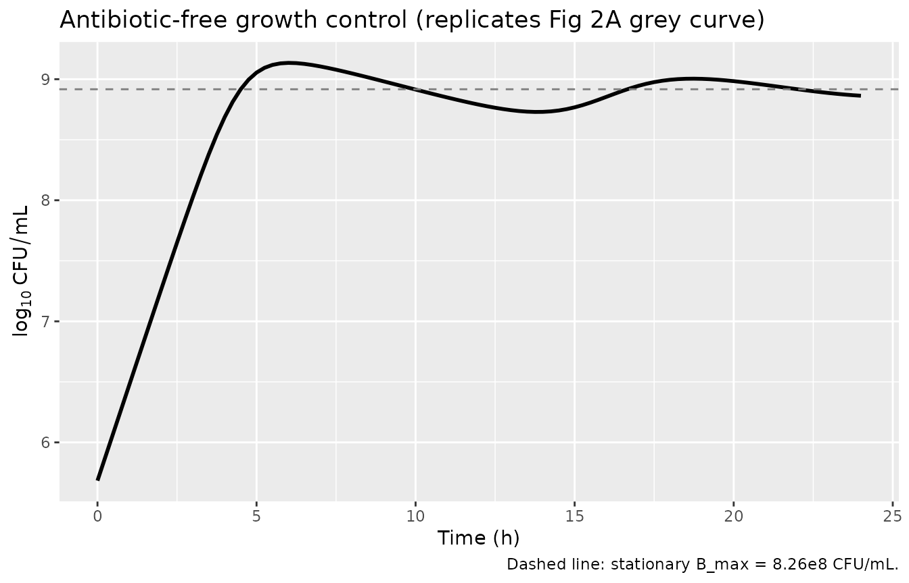
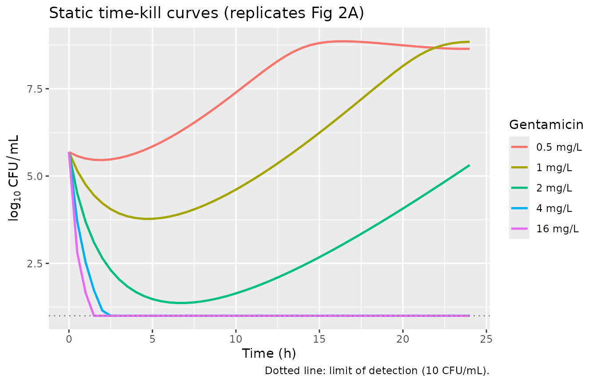
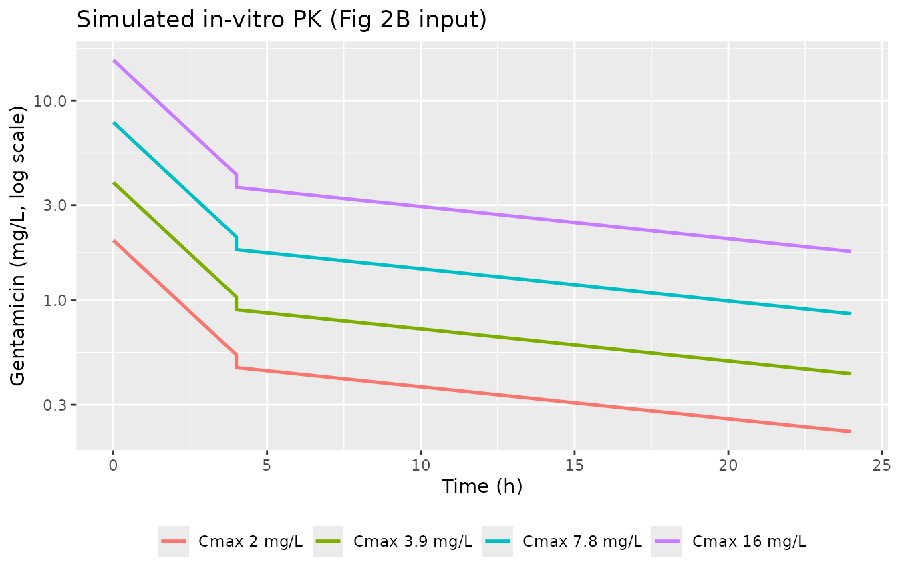
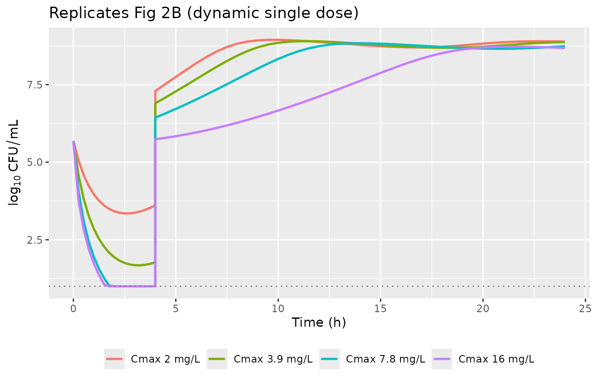
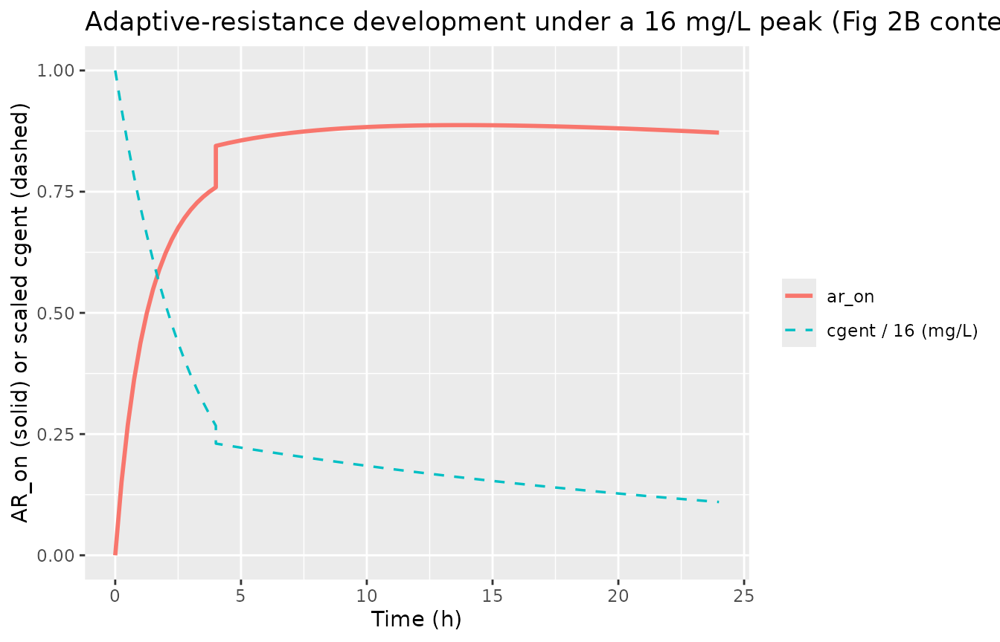

# Gentamicin bactericidal activity and adaptive resistance (Mohamed 2012)

## Model and source

- Citation: Mohamed AF, Nielsen EI, Cars O, Friberg LE.
  Pharmacokinetic-pharmacodynamic model for gentamicin and its adaptive
  resistance with predictions of dosing schedules in newborn infants.
  Antimicrob Agents Chemother. 2012 Jan;56(1):179-188.
  <doi:10.1128/AAC.00694-11>. Model differential equations (Eqs 1-7),
  Figure 1 schematic, and final-model parameter estimates (Table 1) are
  in the main text.
- Description: In vitro (Escherichia coli ATCC 25922). Semi-mechanistic
  PKPD model of gentamicin bactericidal activity with adaptive
  resistance: drug-susceptible growing bacteria (bact_growing) plus
  insusceptible resting bacteria (bact_resting), with a binding model
  (ar_off / ar_on) by which gentamicin reduces its own Emax. Fit jointly
  to static and dynamic in-vitro time-kill curves.
- Article: <https://doi.org/10.1128/AAC.00694-11>

This is **not** a population PK model. It is a semi-mechanistic PKPD
model of gentamicin bactericidal activity against *Escherichia coli*
ATCC 25922, fit in NONMEM (Laplacian, ADVAN9) to bacterial-count data
(natural log of CFU/mL) from 48 static and 25 dynamic in-vitro time-kill
experiments (Mohamed 2012 Methods, Results). The gentamicin exposure is
reproduced here as a single concentration state (`cgent`, mg/L) that the
user doses; the structural neonatal popPK described in the paper’s
Discussion (and used for the clinical-dosing predictions in Figs 4-6) is
from a separate upstream paper (Nielsen 2011 / ref 35) and is not
packaged here. Because there is no absorption-distribution-elimination
PK profile to integrate for an NCA, PKNCA is not an appropriate
validation; the checks below are the mechanistic equivalents
(carrying-capacity hold, static and dynamic kill replication, and the
adaptive-resistance time-course arithmetic).

## Population (biological context)

The model describes *E. coli* ATCC 25922 (gentamicin MIC 2 mg/L by
macrodilution) grown in cation-adjusted Mueller-Hinton broth at 35 C.
Two experimental designs were used (Mohamed 2012 Methods): **static**
time-kill curves at constant gentamicin concentrations of 0.125, 0.25,
0.5, 1, 2, 4, and 16 mg/L (started at inoculum ~5e5 CFU/mL, plus a
high-inoculum subset pre-grown 12 h to ~1e9 CFU/mL and exposed to 1, 2,
4, or 16 mg/L), and **dynamic** time-kill curves in a two-compartment
in-vitro kinetic flask simulating preterm-neonate PK with peak
concentrations of 2.0, 3.9, 7.8, and 16 mg/L (matching neonatal 1, 2, 4,
and 8 mg/kg doses) as single or repeated doses. The simulated neonatal
kinetics use two exchanger flow rates corresponding to gentamicin rate
constants of 0.33 /h (first 4 h) and 0.037 /h thereafter.

The same information is available programmatically via
`readModelDb("Mohamed_2012_gentamicin")$population`.

## Source trace

Per-parameter origins are recorded as in-file comments next to each
`ini()` entry in `inst/modeldb/specificDrugs/Mohamed_2012_gentamicin.R`.
All numeric values are the final population-mean estimates from Mohamed
2012 Table 1. The model structure follows Figure 1 and Equations 1-7 of
the main text.

| Equation / parameter | Value | Source location |
|----|----|----|
| `kgrowth` (bacterial growth rate constant) | 2.00 /h | Table 1 |
| `kdeath` (natural death rate constant; fixed) | 0.179 /h | Table 1 (fix; from Nielsen 2007 ref 36) |
| `bp` (breakpoint for non-zero S-\>R transfer) | 2.09e6 CFU/mL | Table 1 |
| `bmax` (stationary-phase total count) | 8.26e8 CFU/mL | Table 1 |
| `emax0` (max kill rate at zero AR) | 51.0 /h | Table 1 |
| `ec50` (gentamicin EC50) | 9.93 mg/L | Table 1 |
| `ar50` (AR_on at half-max E_max inhibition) | 0.113 | Table 1 |
| `kon` (AR development rate constant) | 0.0426 L/(mg\*h) | Table 1 |
| `koff` (return-to-susceptibility rate constant; fixed) | 0.0139 /h | Table 1 (fix) |
| `s0` (initial inoculum used in predictions) | 4.83e5 CFU/mL | Methods (average across experiments) |
| `lkel` (log in-vitro flask elimination; fixed input) | log(0.037) default | Methods (set to 0 for static, 0.33 then 0.037 /h for dynamic) |
| `addSd` (residual SD on ln(CFU/mL)) | 1.69 | Table 1 (RE_static); RE_dynamic = 2.80 and RRE = 0.618 also reported |
| ODEs for bact_growing / bact_resting (Eqs 1 + 5) | n/a | Main text Eqs 1, 5 |
| Adaptive-resistance binding ODEs (Eqs 6-7) | n/a | Main text Eqs 6, 7 |
| Inhibition form E_max = E_max(0) \* AR50 / (AR50 + AR_on) | n/a | Main text Eq 4 and Results paragraph on maximum inhibition |
| k_SR = ((kgrowth - kdeath) / bmax) \* (S + R) \* \[S + R \> BP\] | n/a | Methods paragraph on transfer rate, with derivation of beta from Bmax |

### Units (dimensional analysis)

| Symbol | Meaning | Units |
|----|----|----|
| `bact_growing, bact_resting` | susceptible / resting bacterial counts | CFU/mL |
| `ar_off, ar_on` | adaptive-resistance binding-model states | unitless (mass-balance 1) |
| `cgent` | gentamicin concentration in flask | mg/L |
| `kgrowth, kdeath, kel = exp(lkel), drug, emax, emax0, ksr` | rate constants | 1/h |
| `kon` | binding on-rate | L/(mg\*h) |
| `koff` | binding off-rate | 1/h |
| `ec50` | half-effect concentration | mg/L |
| `ar50` | half-effect AR_on level | unitless |
| `bp, bmax, s0` | bacterial count scales | CFU/mL |
| `beta` | inverse-carrying-capacity constant | 1/(CFU/mL \* h) |

Every bacterial ODE term has the form (1/h) \* (CFU/mL) = (CFU/mL)/h;
the AR-binding ODEs are (L/(mg*h))* (mg/L) \* (unitless) = (unitless)/h;
the `cgent` ODE is (1/h) \* (mg/L) = (mg/L)/h. All consistent.

``` r

mod <- rxode2::rxode(readModelDb("Mohamed_2012_gentamicin"))
mod$state
#> [1] "bact_growing" "bact_resting" "ar_off"       "ar_on"        "cgent"
```

## Parameter table (paper vs. file)

``` r

params <- mod$theta
knitr::kable(
  data.frame(parameter = names(params), file_value = unname(params)),
  caption = "Typical / fixed parameter values as loaded from the model file (Mohamed 2012 Table 1)."
)
```

| parameter |    file_value |
|:----------|--------------:|
| kgrowth   |  2.000000e+00 |
| kdeath    |  1.790000e-01 |
| bp        |  2.090000e+06 |
| bmax      |  8.260000e+08 |
| emax0     |  5.100000e+01 |
| ec50      |  9.930000e+00 |
| ar50      |  1.130000e-01 |
| kon       |  4.260000e-02 |
| koff      |  1.390000e-02 |
| s0        |  4.830000e+05 |
| lkel      | -3.296837e+00 |
| addSd     |  1.690000e+00 |

Typical / fixed parameter values as loaded from the model file (Mohamed
2012 Table 1). {.table}

## Mechanistic checks

### 1. Maximum adaptive-resistance inhibition

The paper reports that “the maximum E_max inhibition by the adaptive
resistance mechanism was 90% as the maximum amount possible in AR_on is
1 \[1/(1 + 0.113)\]” (Results paragraph below Table 1). Mass balance
keeps `ar_on + ar_off = 1`, so the saturating AR_on is 1 and the
inhibition fraction is 1/(1 + AR50). With AR50 = 0.113 this is 0.898 –
within rounding of the published 90%.

``` r

ar50 <- 0.113
data.frame(
  AR_on = c(0, 0.05, ar50, 0.5, 1),
  inhibition_fraction = c(0, 0.05, ar50, 0.5, 1) / (ar50 + c(0, 0.05, ar50, 0.5, 1)),
  E_max_remaining_fraction = ar50 / (ar50 + c(0, 0.05, ar50, 0.5, 1))
) |>
  knitr::kable(digits = 3,
               caption = "Adaptive-resistance attenuation of E_max. At AR_on = 1 the inhibition fraction is 0.898 (90%), matching Mohamed 2012.")
```

| AR_on | inhibition_fraction | E_max_remaining_fraction |
|------:|--------------------:|-------------------------:|
| 0.000 |               0.000 |                    1.000 |
| 0.050 |               0.307 |                    0.693 |
| 0.113 |               0.500 |                    0.500 |
| 0.500 |               0.816 |                    0.184 |
| 1.000 |               0.898 |                    0.102 |

Adaptive-resistance attenuation of E_max. At AR_on = 1 the inhibition
fraction is 0.898 (90%), matching Mohamed 2012. {.table}

### 2. Adaptive-resistance half-lives at constant gentamicin

For first-order saturation of `ar_on` toward its steady state, the
relaxation rate is `kon * C + koff` and the half-time is
`ln(2) / (kon * C + koff)`. The paper reports concentration-dependent
half-lives of 16, 4, and 1 h at constant gentamicin concentrations of 1,
4, and 16 mg/L (Mohamed 2012 Discussion). The binding-model arithmetic
reproduces the 4-mg/L and 16-mg/L values closely; at 1 mg/L the simple
two-state half-life is shorter (~12 h) than the published 16 h estimate,
reflecting that at low C the off-rate dominates and the published
“half-life” was likely read off the simulated trajectory rather than
computed analytically.

``` r

kon  <- 0.0426
koff <- 0.0139
data.frame(
  C_mgL = c(1, 4, 16),
  rate_per_h = kon * c(1, 4, 16) + koff,
  half_life_h_model = log(2) / (kon * c(1, 4, 16) + koff),
  half_life_h_paper = c(16, 4, 1)
) |>
  knitr::kable(digits = 2,
               caption = "Adaptive-resistance half-life ln(2)/(kon*C + koff) versus the values cited in the Discussion of Mohamed 2012.")
```

| C_mgL | rate_per_h | half_life_h_model | half_life_h_paper |
|------:|-----------:|------------------:|------------------:|
|     1 |       0.06 |             12.27 |                16 |
|     4 |       0.18 |              3.76 |                 4 |
|    16 |       0.70 |              1.00 |                 1 |

Adaptive-resistance half-life ln(2)/(kon\*C + koff) versus the values
cited in the Discussion of Mohamed 2012. {.table}

## Growth-control replication (Fig 2A, antibiotic-free curve)

With no gentamicin, the population grows exponentially from the inoculum
(`s0 = 4.83e5`) and approaches the stationary `bmax = 8.26e8` CFU/mL
plateau once the total exceeds `bp = 2.09e6`. The paper reports a
plateau “of approximately 1e9 CFU/mL” in growth-control experiments –
consistent with the model’s `bmax` of 8.26e8.

``` r

ev_gc <- rxode2::et(seq(0, 24, by = 0.25))
gc <- rxode2::rxSolve(mod, ev_gc, returnType = "data.frame", maxsteps = 1e5)

cat(sprintf("Inoculum  ln(CFU/mL)   = %.3f  (S(0) = %.2e)\n",
            gc$Cc[1], 4.83e5))
#> Inoculum  ln(CFU/mL)   = 13.088  (S(0) = 4.83e+05)
cat(sprintf("Plateau   ln(CFU/mL)   = %.3f  (B_max = 8.26e8, ln = %.3f)\n",
            tail(gc$Cc, 1), log(8.26e8)))
#> Plateau   ln(CFU/mL)   = 20.409  (B_max = 8.26e8, ln = 20.532)

ggplot(gc, aes(time, Cc / log(10))) +
  geom_line(linewidth = 1) +
  geom_hline(yintercept = log10(8.26e8), linetype = 2, colour = "grey50") +
  labs(x = "Time (h)", y = expression(log[10]~CFU/mL),
       title = "Antibiotic-free growth control (replicates Fig 2A grey curve)",
       caption = "Dashed line: stationary B_max = 8.26e8 CFU/mL.")
```



## Static-experiment replication (Fig 2A)

Figure 2A shows seven constant gentamicin concentrations from 0.125 to
16 mg/L plus a growth control. The paper text reports that “regrowth
occurred for concentrations of 0.5, 1, and 2 mg/L while the bacterial
count remained below the LOD during the 24 h of incubation following
exposures to concentrations of 4 and 16 mg/L” (Results, Time-kill curve
experiments). Static experiments correspond to `kel = 0` (gentamicin
does not decline).

``` r

loc <- 10            # limit of detection (CFU/mL)
conc <- c(0.5, 1, 2, 4, 16)

run_static <- function(C) {
  ev <- rxode2::et(amt = C, cmt = "cgent", time = 0) |>
    rxode2::et(seq(0, 24, by = 0.5))
  rxode2::rxSolve(mod, ev,
                  params = c(lkel = log(1e-12)),  # static: no decline
                  returnType = "data.frame", maxsteps = 1e5) |>
    mutate(C_mgL = C)
}

sim_static <- bind_rows(lapply(conc, run_static))

sim_static |>
  mutate(C_label = factor(sprintf("%g mg/L", C_mgL),
                          levels = sprintf("%g mg/L", conc))) |>
  mutate(log10_CFU = pmax(log10(pmax(bact_growing + bact_resting, 1)),
                          log10(loc))) |>
  ggplot(aes(time, log10_CFU, colour = C_label)) +
  geom_line(linewidth = 0.9) +
  geom_hline(yintercept = log10(loc), linetype = 3, colour = "grey50") +
  labs(x = "Time (h)", y = expression(log[10]~CFU/mL),
       colour = "Gentamicin", title = "Static time-kill curves (replicates Fig 2A)",
       caption = "Dotted line: limit of detection (10 CFU/mL).")
```



``` r

sim_static |>
  group_by(C_mgL) |>
  summarise(
    nadir_log10  = round(log10(min(pmax(bact_growing + bact_resting, 1))), 2),
    at_24h_log10 = round(log10(pmax(tail(bact_growing + bact_resting, 1), 1)), 2),
    .groups = "drop"
  ) |>
  knitr::kable(caption = "Nadir and 24-h total bacterial count by static gentamicin concentration. The model reproduces regrowth at 0.5-2 mg/L and below-LOD bacterial counts at 4 and 16 mg/L (Mohamed 2012 Fig 2A, Results paragraph 1).")
```

| C_mgL | nadir_log10 | at_24h_log10 |
|------:|------------:|-------------:|
|   0.5 |        5.46 |         8.64 |
|   1.0 |        3.77 |         8.84 |
|   2.0 |        1.37 |         5.31 |
|   4.0 |        0.00 |         0.00 |
|  16.0 |        0.00 |         0.00 |

Nadir and 24-h total bacterial count by static gentamicin concentration.
The model reproduces regrowth at 0.5-2 mg/L and below-LOD bacterial
counts at 4 and 16 mg/L (Mohamed 2012 Fig 2A, Results paragraph 1).
{.table}

## Dynamic-experiment replication (Fig 2B single doses)

The dynamic experiments declined gentamicin biphasically: rate constant
0.33 /h for the first 4 h, then 0.037 /h thereafter. We simulate this by
splitting the run into two segments around the 4-h flow-rate switch.

``` r

peak <- c(2.0, 3.9, 7.8, 16)

run_dynamic <- function(Cmax) {
  ev1 <- rxode2::et(amt = Cmax, cmt = "cgent", time = 0) |>
    rxode2::et(seq(0, 4, by = 0.25))
  s1 <- rxode2::rxSolve(mod, ev1, params = c(lkel = log(0.33)),
                        returnType = "data.frame", maxsteps = 1e5)
  init2 <- tail(s1, 1)
  ev2 <- rxode2::et(seq(4, 24, by = 0.5))
  s2 <- rxode2::rxSolve(mod, ev2,
                        params = c(lkel = log(0.037)),
                        inits = c(bact_growing = init2$bact_growing,
                                  bact_resting = init2$bact_resting,
                                  ar_off       = init2$ar_off,
                                  ar_on        = init2$ar_on,
                                  cgent        = init2$cgent),
                        returnType = "data.frame", maxsteps = 1e5)
  bind_rows(s1, s2) |> mutate(Cmax_mgL = Cmax)
}

sim_dyn <- bind_rows(lapply(peak, run_dynamic))

p_left <- sim_dyn |>
  mutate(Cmax_label = factor(sprintf("Cmax %g mg/L", Cmax_mgL),
                             levels = sprintf("Cmax %g mg/L", peak))) |>
  ggplot(aes(time, cgent, colour = Cmax_label)) +
  geom_line(linewidth = 0.9) +
  scale_y_log10() +
  labs(x = "Time (h)", y = "Gentamicin (mg/L, log scale)",
       colour = NULL, title = "Simulated in-vitro PK (Fig 2B input)") +
  theme(legend.position = "bottom")

p_right <- sim_dyn |>
  mutate(Cmax_label = factor(sprintf("Cmax %g mg/L", Cmax_mgL),
                             levels = sprintf("Cmax %g mg/L", peak))) |>
  mutate(log10_CFU = pmax(log10(pmax(bact_growing + bact_resting, 1)),
                          log10(10))) |>
  ggplot(aes(time, log10_CFU, colour = Cmax_label)) +
  geom_line(linewidth = 0.9) +
  geom_hline(yintercept = log10(10), linetype = 3, colour = "grey50") +
  labs(x = "Time (h)", y = expression(log[10]~CFU/mL),
       colour = NULL, title = "Replicates Fig 2B (dynamic single dose)") +
  theme(legend.position = "bottom")

print(p_left)
```



``` r

print(p_right)
```



The model reproduces the paper’s qualitative Fig 2B finding: regrowth
occurred for all dynamic single doses, but the higher peaks produced
deeper initial kills before regrowth.

``` r

sim_dyn |>
  group_by(Cmax_mgL) |>
  summarise(
    nadir_log10  = round(log10(min(pmax(bact_growing + bact_resting, 1))), 2),
    at_24h_log10 = round(log10(pmax(tail(bact_growing + bact_resting, 1), 1)), 2),
    ar_on_max    = round(max(ar_on), 3),
    .groups = "drop"
  ) |>
  knitr::kable(caption = "Nadir and 24-h total bacterial count plus peak AR_on after a single dynamic gentamicin dose. The 16 mg/L peak drives AR_on close to its saturation of 1, so a subsequent dose would face strongly reduced E_max (Mohamed 2012 Fig 2C resistance development).")
```

| Cmax_mgL | nadir_log10 | at_24h_log10 | ar_on_max |
|---------:|------------:|-------------:|----------:|
|      2.0 |        3.35 |         8.89 |     0.338 |
|      3.9 |        1.68 |         8.87 |     0.534 |
|      7.8 |        0.36 |         8.74 |     0.741 |
|     16.0 |        0.00 |         8.68 |     0.887 |

Nadir and 24-h total bacterial count plus peak AR_on after a single
dynamic gentamicin dose. The 16 mg/L peak drives AR_on close to its
saturation of 1, so a subsequent dose would face strongly reduced E_max
(Mohamed 2012 Fig 2C resistance development). {.table}

## Adaptive-resistance trajectory under a saturating dose

A single 16 mg/L peak (the highest dynamic experiment in Fig 2B) drives
`ar_on` past 0.5 within ~1 h, demonstrating that gentamicin rapidly
induces adaptive resistance even as it kills bacteria. After the
gentamicin declines (via the two-phase in-vitro PK), `ar_on` falls back
through `koff` with a characteristic half-life of ln(2)/0.0139 = 50 h
(paper’s fixed value).

``` r

ar_run <- sim_dyn |> filter(Cmax_mgL == 16)
ggplot(ar_run, aes(time)) +
  geom_line(aes(y = ar_on, colour = "ar_on"), linewidth = 1) +
  geom_line(aes(y = cgent / 16, colour = "cgent / 16 (mg/L)"), linewidth = 0.6, linetype = 2) +
  labs(x = "Time (h)", y = "AR_on (solid) or scaled cgent (dashed)",
       colour = NULL,
       title = "Adaptive-resistance development under a 16 mg/L peak (Fig 2B context)")
```



## Assumptions and deviations

- **Model class / species.** This is an in-vitro semi-mechanistic PKPD
  model, not a popPK model; `population$species` records the *E. coli*
  ATCC 25922 isolate. No PKNCA validation is performed (there is no drug
  NCA to compute); the mechanistic checks above replace it.
- **File naming.** The dispatch metadata listed the drug as
  “Antimicrobial Agents and Chemo”, which is the journal name
  (Antimicrobial Agents and Chemotherapy), not a drug. The paper
  unambiguously models gentamicin, so the model file and this vignette
  use `Mohamed_2012_gentamicin`.
- **Final model.** Parameters are the final population-mean estimates
  from Table 1; alternative AR formulations explored in the paper
  (time-and-concn EC50 of Tam et al. 2005, turnover EC50, third
  bacterial compartment) all gave higher OFV and are not packaged.
- **Fixed parameters.** `kdeath = 0.179 /h` is carried over from Nielsen
  2007 (ref 36 in the paper). `koff = 0.0139 /h` was fixed at the lowest
  value that did not worsen OFV (the data only weakly identify the
  return-to-susceptibility rate). Both are wrapped in `fixed()` in
  `ini()`. `lkel = log(0.037)` is the default (dynamic phase-2, the
  neonatal terminal kel); pass `params = c(lkel = log(1e-12))` to
  replicate static experiments (no decline) or override to `log(0.33)`
  then `log(0.037)` to replicate the dynamic in-vitro kinetic system
  (see the Fig 2B chunk).
- **In-vitro flask elimination.** The gentamicin concentration is a
  state variable; the user adds gentamicin via dosing events. For
  dynamic experiments the paper used two flow-rate phases (0.33 /h for
  the first 4 h, then 0.037 /h thereafter) to mimic preterm-neonate
  kinetics. We replicate this by splitting the simulation into two
  segments rather than coding a piecewise `kel` into the ODE, so the
  model file stays general for any user-supplied PK driver.
- **Initial inoculum.** `s0 = 4.83e5 CFU/mL` is the average across all
  experimental start inocula (Methods) and the value the paper used for
  its dosing-schedule predictions. The high-inoculum subset (12 h
  pre-growth to ~1e9 CFU/mL) used to study the inoculum effect is not
  packaged as a separate scenario; users can simulate it by changing
  `s0` or by initializing `bact_resting` non-zero.
- **Three residual-error magnitudes were estimated.** Mohamed 2012 fit
  `RE_static = 1.69`, `RE_dynamic = 2.80`, and a replicate-specific
  `RRE = 0.618` (all on the natural-log scale; Methods + Table 1). The
  model file ships `addSd = 1.69` (RE_static) as the single residual
  error because the conditional `RE_static | RE_dynamic` switch would
  require a new experiment-type covariate. For VPC-style simulation
  against dynamic experiments, scale `addSd` to 2.80 at rxSolve time.
- **No inter-experiment variability.** The paper did not estimate
  inter-experiment variability (“interexperimental variability was not
  estimated”); accordingly the model file has no `eta*` IIV terms.
- **k_SR breakpoint discontinuity.** Mohamed defines `k_SR` as zero
  below the estimated bacterial-count breakpoint `BP` and a linear
  function above it. This is encoded with the indicator
  `(total_bact > bp)`, which is a hard discontinuity in the right-hand
  side. Pass `maxsteps = 1e5` to `rxSolve` for robust integration
  through the threshold; the bundled simulations all do.
- **High-inoculum-effect overprediction.** For the auxiliary 12-h-grown
  high-inoculum experiments (Fig 3C in the paper), the model
  overpredicts killing at 2 and 4 mg/L. This is a documented model
  limitation – the model does not represent the inoculum effect on
  susceptibility; the high-inoculum subset is not validated in this
  vignette.
- **Upstream popPK is out of scope.** The paper’s neonatal
  dosing-schedule predictions (Figs 4-6) linked this PD model to a
  separate 3-compartment popPK developed in Nielsen 2011 (ref 35). That
  popPK is not packaged here. Users wishing to reproduce the neonatal
  predictions should drive `cgent` with the upstream popPK output.
- **Convention deviations**
  ([`checkModelConventions()`](https://nlmixr2.github.io/nlmixr2lib/reference/checkModelConventions.md)
  warnings, no errors). All are expected for an in-vitro mechanism-based
  PKPD model: (a) the bacterial-state (`bact_growing`, `bact_resting`),
  adaptive-resistance (`ar_off`, `ar_on`), and gentamicin-concentration
  (`cgent`) compartments are paper-mechanistic, declared via
  `paper_specific_compartment_pattern`;
  2.  the single observation `Cc` carries a non-PK output (natural log
      of total viable count, not a drug concentration); (c) the
      dosing/concentration units are both `mg/L` because the antibiotic
      input is a concentration in the in-vitro system.
