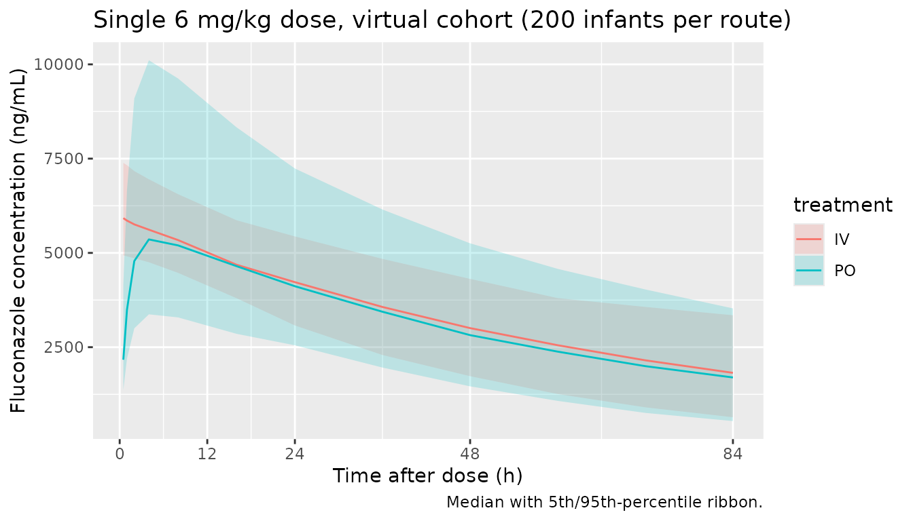
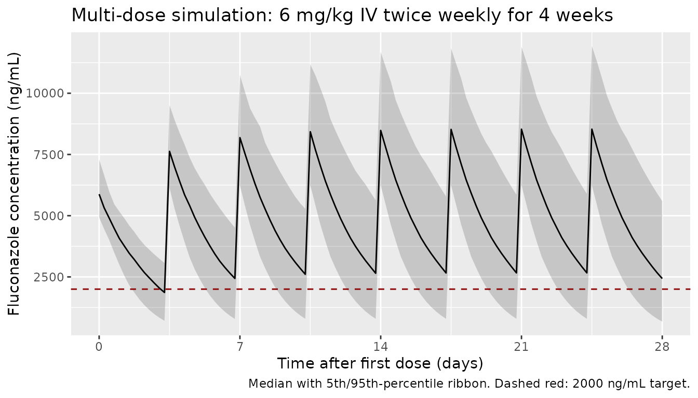

# Fluconazole (Momper 2016)

## Model and source

- Citation: Momper JD, Capparelli EV, Wade KC, Kantak A, Dhanireddy R,
  Cummings JJ, Nedrelow JH, Hudak ML, Mundakel GT, Natarajan G, Gao J,
  Laughon M, Smith PB, Benjamin DK Jr; Fluconazole Prophylaxis Study
  Team. Population pharmacokinetics of fluconazole in premature infants
  with birth weights less than 750 grams. Antimicrob Agents Chemother.
  2016;60(9):5539-5545.
- Article: <https://doi.org/10.1128/AAC.00963-16>

The packaged structural model is loaded via
[`readModelDb()`](https://nlmixr2.github.io/nlmixr2lib/reference/readModelDb.md):

``` r

mod <- readModelDb("Momper_2016_fluconazole")
```

## Population

The model was developed from 141 premature infants with birth weights
below 750 g enrolled in a multicenter randomized placebo-controlled
trial of fluconazole prophylaxis for invasive candidiasis (Momper 2016
Table 1). At the first PK evaluation, infants had a median postnatal age
of 23 days (range 3-47), gestational age at birth 24.7 weeks
(22.6-28.7), postmenstrual age 28.3 weeks (23.7-35.1), and body weight
0.71 kg (0.345-2.680). Median serum creatinine was 0.7 mg/dL (0.1-3.6);
subjects with serum creatinine above 2 mg/dL or transaminase elevations
above 250 U/L at randomization were excluded. The cohort was 60% female;
race distribution was 53% Black or African American, 40% White, 5%
American Indian or Alaska Native, and 1% Asian. Sixty-seven percent were
delivered by Cesarean section and 81% were intubated at enrollment. Each
infant received fluconazole 6 mg/kg intravenously over approximately one
hour or orally, twice weekly (Tuesdays and Fridays) for up to 42 days.

A total of 604 plasma samples (619 collected, 15 excluded) entered the
population PK analysis; 368 samples (61%) were scavenged residual
specimens from routine clinical laboratory draws and the remainder were
timed PK samples. The paper notes that scavenged samples were as
informative as scheduled samples and did not bias parameter estimates
(CL estimated from timed samples alone differed by only 6%).

The same metadata is available programmatically via
`rxode2::rxode(readModelDb(...))$population` (the `population` field is
attached to the rxode model object built by `nlmixr2lib`).

## Source trace

Per-parameter origin is recorded as an in-file comment next to each
`ini()` entry in `inst/modeldb/specificDrugs/Momper_2016_fluconazole.R`.
The table below collects them in one place.

| Equation / parameter | Value | Source location |
|----|----|----|
| `lka` (absorption rate, 1/h) | log(0.96) | Table 3, theta_KA |
| `lcl` (CL, L/h/kg^0.75) | log(0.0127) | Table 3, theta_CL |
| `lvc` (V, L/kg) | log(1.00) | Table 3, theta_V |
| `lfdepot` (F1, fraction) | log(1.00) | Table 3, theta_F1 |
| `e_wt_cl` (allometric on CL, fixed) | 0.75 | Methods: “Clearance was scaled by allometric weight (WT^0.75)” |
| `e_wt_vc` (allometric on V, fixed) | 1.00 | Methods: “volume of distribution was scaled by weight (WT^1.0)” |
| `e_creat_cl` (SCR power exponent on CL) | -0.41 | Table 3, theta_SCR |
| `e_page_cl` (PMA power exponent on CL) | 2.05 | Table 3, theta_PMA |
| Final CL equation | `CL = theta_CL * WT^0.75 * (SCR/0.8)^-0.41 * (PMA/28)^2.05` | Results paragraph 4 and Table 2 final row |
| `etalcl` (omega^2, CL CV 23%) | 0.05153 | Table 3 omega^2_CL |
| `etalvc` (omega^2, V CV 13%) | 0.01676 | Table 3 omega^2_V |
| `etalfdepot` (omega^2, F1 CV 31%) | 0.09175 | Table 3 omega^2_F1 |
| `propSd` (proportional residual, CV%) | 0.46 | Table 3 sigma proportional |
| `addSd` (additive residual, ng/mL) | 505 | Table 3 sigma additive |
| Structural model: 1-compartment first-order absorption | n/a | Methods: “1-compartment model (ADVAN2, TRANS2) and first-order conditional estimation (FOCE with interaction)” |

The IIV variances above were derived from the published log-normal CV%s
via `omega^2 = log(CV^2 + 1)`. The absorption rate constant `ka` was
reported without BSV in the source (“Due to limited numbers of early
samples after oral administration in the data set, between-subject
variability (BSV) was not estimated for the absorption rate constant”),
so the model does not include `etalka`.

## Virtual cohort

The original PK data are not publicly available. We simulate a virtual
cohort whose covariate distributions approximate Table 1 of Momper 2016,
holding covariates time-fixed at the first-PK-evaluation values reported
there. The model itself supports time-varying weight, postmenstrual age,
and serum creatinine; users with a longitudinal demographic table can
replace `make_cohort()` with their own builder.

``` r

set.seed(2026)
n_sub <- 200

# Per Table 1: WT median 710 g, range 345-2680. Use a truncated log-normal anchored
# at the median with bounds approximating the reported range.
sim_wt_kg <- function(n) {
  wt <- exp(stats::rnorm(n, mean = log(0.71), sd = 0.45))
  pmin(pmax(wt, 0.345), 2.680)
}

# PMA in weeks centered on median 28.3 (range 23.7-35.1).
sim_pma_wk <- function(n) {
  pma <- stats::rnorm(n, mean = 28.3, sd = 2.4)
  pmin(pmax(pma, 23.7), 35.1)
}

# Serum creatinine (mg/dL) median 0.7, range 0.1-3.6; right-skewed.
sim_scr <- function(n) {
  scr <- exp(stats::rnorm(n, mean = log(0.7), sd = 0.55))
  pmin(pmax(scr, 0.1), 3.6)
}

cohort <- tibble(
  id    = seq_len(n_sub),
  WT    = sim_wt_kg(n_sub),
  PMA_w = sim_pma_wk(n_sub),
  PAGE  = PMA_w / 4.35,
  CREAT = sim_scr(n_sub)
)

knitr::kable(
  cohort |>
    summarise(
      WT_median    = stats::median(WT),
      WT_min       = min(WT),
      WT_max       = max(WT),
      PMA_median_w = stats::median(PMA_w),
      PMA_min_w    = min(PMA_w),
      PMA_max_w    = max(PMA_w),
      CREAT_median = stats::median(CREAT),
      CREAT_min    = min(CREAT),
      CREAT_max    = max(CREAT)
    ),
  caption = "Simulated cohort summary (compare against Momper 2016 Table 1)."
)
```

| WT_median | WT_min | WT_max | PMA_median_w | PMA_min_w | PMA_max_w | CREAT_median | CREAT_min | CREAT_max |
|---:|---:|---:|---:|---:|---:|---:|---:|---:|
| 0.7095438 | 0.345 | 2.32781 | 28.33749 | 23.7 | 33.48795 | 0.7823157 | 0.1757441 | 3.6 |

Simulated cohort summary (compare against Momper 2016 Table 1). {.table}

## Single-dose IV simulation and NCA validation

The first simulation administers a single 6 mg/kg IV dose (treatment =
“IV”) and a separate single 6 mg/kg oral dose (treatment = “PO”) to the
same 200 virtual infants and follows them for one twice-weekly dosing
interval (84 h).

``` r

make_dose_events <- function(cohort, route, tau_h = 84) {
  dose_mg <- 6 * cohort$WT  # 6 mg/kg
  cmt     <- if (route == "IV") "central" else "depot"
  sample_times <- c(0.5, 1, 2, 4, 8, 16, 24, 36, 48, 60, 72, 84)
  bind_rows(
    cohort |>
      transmute(id, time = 0, amt = dose_mg, cmt = cmt,
                evid = 1, WT, CREAT, PAGE,
                treatment = route),
    expand_grid(id = cohort$id, time = sample_times) |>
      left_join(cohort |> select(id, WT, CREAT, PAGE), by = "id") |>
      mutate(amt = 0, cmt = "central", evid = 0,
             treatment = route)
  ) |>
    arrange(id, time, desc(evid))
}

events_iv <- make_dose_events(cohort, "IV")
events_po <- make_dose_events(cohort |> mutate(id = id + 1000L), "PO")
events_sd <- bind_rows(events_iv, events_po)
stopifnot(!anyDuplicated(unique(events_sd[, c("id", "time", "evid")])))
```

``` r

sim_sd <- rxode2::rxSolve(mod, events = events_sd,
                          keep = c("treatment", "WT", "CREAT", "PAGE"),
                          returnType = "data.frame")
#> ℹ parameter labels from comments will be replaced by 'label()'
sim_sd <- sim_sd |> dplyr::filter(!is.na(Cc))
```

``` r

sim_sd |>
  group_by(time, treatment) |>
  summarise(Q05 = stats::quantile(Cc, 0.05, na.rm = TRUE),
            Q50 = stats::quantile(Cc, 0.50, na.rm = TRUE),
            Q95 = stats::quantile(Cc, 0.95, na.rm = TRUE),
            .groups = "drop") |>
  ggplot(aes(time, Q50, fill = treatment, colour = treatment)) +
  geom_ribbon(aes(ymin = Q05, ymax = Q95), alpha = 0.20, colour = NA) +
  geom_line() +
  scale_y_continuous(name = "Fluconazole concentration (ng/mL)") +
  scale_x_continuous(name = "Time after dose (h)", breaks = c(0, 12, 24, 48, 84)) +
  labs(title = "Single 6 mg/kg dose, virtual cohort (200 infants per route)",
       caption = "Median with 5th/95th-percentile ribbon.")
```



``` r

conc_df <- sim_sd |>
  dplyr::filter(!is.na(Cc), time > 0) |>
  dplyr::transmute(id, time, Cc, treatment)

dose_df <- bind_rows(events_iv, events_po) |>
  dplyr::filter(evid == 1) |>
  dplyr::transmute(id, time, amt, treatment)

conc_obj <- PKNCA::PKNCAconc(conc_df, Cc ~ time | treatment + id,
                             concu = "ng/mL", timeu = "h")
dose_obj <- PKNCA::PKNCAdose(dose_df, amt ~ time | treatment + id,
                             doseu = "mg")

intervals <- data.frame(
  start      = 0,
  end        = 84,
  cmax       = TRUE,
  tmax       = TRUE,
  auclast    = TRUE,
  half.life  = TRUE
)

nca_res <- PKNCA::pk.nca(PKNCA::PKNCAdata(conc_obj, dose_obj, intervals = intervals))
#> Warning: Requesting an AUC range starting (0) before the first measurement (0.5) is not allowed
#> Requesting an AUC range starting (0) before the first measurement (0.5) is not allowed
#> Requesting an AUC range starting (0) before the first measurement (0.5) is not allowed
#> Requesting an AUC range starting (0) before the first measurement (0.5) is not allowed
#> Requesting an AUC range starting (0) before the first measurement (0.5) is not allowed
#> Requesting an AUC range starting (0) before the first measurement (0.5) is not allowed
#> Requesting an AUC range starting (0) before the first measurement (0.5) is not allowed
#> Requesting an AUC range starting (0) before the first measurement (0.5) is not allowed
#> Requesting an AUC range starting (0) before the first measurement (0.5) is not allowed
#> Requesting an AUC range starting (0) before the first measurement (0.5) is not allowed
#> Requesting an AUC range starting (0) before the first measurement (0.5) is not allowed
#> Requesting an AUC range starting (0) before the first measurement (0.5) is not allowed
#> Requesting an AUC range starting (0) before the first measurement (0.5) is not allowed
#> Requesting an AUC range starting (0) before the first measurement (0.5) is not allowed
#> Requesting an AUC range starting (0) before the first measurement (0.5) is not allowed
#> Requesting an AUC range starting (0) before the first measurement (0.5) is not allowed
#> Requesting an AUC range starting (0) before the first measurement (0.5) is not allowed
#> Requesting an AUC range starting (0) before the first measurement (0.5) is not allowed
#> Requesting an AUC range starting (0) before the first measurement (0.5) is not allowed
#> Requesting an AUC range starting (0) before the first measurement (0.5) is not allowed
#> Requesting an AUC range starting (0) before the first measurement (0.5) is not allowed
#> Requesting an AUC range starting (0) before the first measurement (0.5) is not allowed
#> Requesting an AUC range starting (0) before the first measurement (0.5) is not allowed
#> Requesting an AUC range starting (0) before the first measurement (0.5) is not allowed
#> Requesting an AUC range starting (0) before the first measurement (0.5) is not allowed
#> Requesting an AUC range starting (0) before the first measurement (0.5) is not allowed
#> Requesting an AUC range starting (0) before the first measurement (0.5) is not allowed
#> Requesting an AUC range starting (0) before the first measurement (0.5) is not allowed
#> Requesting an AUC range starting (0) before the first measurement (0.5) is not allowed
#> Requesting an AUC range starting (0) before the first measurement (0.5) is not allowed
#> Requesting an AUC range starting (0) before the first measurement (0.5) is not allowed
#> Requesting an AUC range starting (0) before the first measurement (0.5) is not allowed
#> Requesting an AUC range starting (0) before the first measurement (0.5) is not allowed
#> Requesting an AUC range starting (0) before the first measurement (0.5) is not allowed
#> Requesting an AUC range starting (0) before the first measurement (0.5) is not allowed
#> Requesting an AUC range starting (0) before the first measurement (0.5) is not allowed
#> Requesting an AUC range starting (0) before the first measurement (0.5) is not allowed
#> Requesting an AUC range starting (0) before the first measurement (0.5) is not allowed
#> Requesting an AUC range starting (0) before the first measurement (0.5) is not allowed
#> Requesting an AUC range starting (0) before the first measurement (0.5) is not allowed
#> Requesting an AUC range starting (0) before the first measurement (0.5) is not allowed
#> Requesting an AUC range starting (0) before the first measurement (0.5) is not allowed
#> Requesting an AUC range starting (0) before the first measurement (0.5) is not allowed
#> Requesting an AUC range starting (0) before the first measurement (0.5) is not allowed
#> Requesting an AUC range starting (0) before the first measurement (0.5) is not allowed
#> Requesting an AUC range starting (0) before the first measurement (0.5) is not allowed
#> Requesting an AUC range starting (0) before the first measurement (0.5) is not allowed
#> Requesting an AUC range starting (0) before the first measurement (0.5) is not allowed
#> Requesting an AUC range starting (0) before the first measurement (0.5) is not allowed
#> Requesting an AUC range starting (0) before the first measurement (0.5) is not allowed
#> Requesting an AUC range starting (0) before the first measurement (0.5) is not allowed
#> Requesting an AUC range starting (0) before the first measurement (0.5) is not allowed
#> Requesting an AUC range starting (0) before the first measurement (0.5) is not allowed
#> Requesting an AUC range starting (0) before the first measurement (0.5) is not allowed
#> Requesting an AUC range starting (0) before the first measurement (0.5) is not allowed
#> Requesting an AUC range starting (0) before the first measurement (0.5) is not allowed
#> Requesting an AUC range starting (0) before the first measurement (0.5) is not allowed
#> Requesting an AUC range starting (0) before the first measurement (0.5) is not allowed
#> Requesting an AUC range starting (0) before the first measurement (0.5) is not allowed
#> Requesting an AUC range starting (0) before the first measurement (0.5) is not allowed
#> Requesting an AUC range starting (0) before the first measurement (0.5) is not allowed
#> Requesting an AUC range starting (0) before the first measurement (0.5) is not allowed
#> Requesting an AUC range starting (0) before the first measurement (0.5) is not allowed
#> Requesting an AUC range starting (0) before the first measurement (0.5) is not allowed
#> Requesting an AUC range starting (0) before the first measurement (0.5) is not allowed
#> Requesting an AUC range starting (0) before the first measurement (0.5) is not allowed
#> Requesting an AUC range starting (0) before the first measurement (0.5) is not allowed
#> Requesting an AUC range starting (0) before the first measurement (0.5) is not allowed
#> Requesting an AUC range starting (0) before the first measurement (0.5) is not allowed
#> Requesting an AUC range starting (0) before the first measurement (0.5) is not allowed
#> Requesting an AUC range starting (0) before the first measurement (0.5) is not allowed
#> Requesting an AUC range starting (0) before the first measurement (0.5) is not allowed
#> Requesting an AUC range starting (0) before the first measurement (0.5) is not allowed
#> Requesting an AUC range starting (0) before the first measurement (0.5) is not allowed
#> Requesting an AUC range starting (0) before the first measurement (0.5) is not allowed
#> Requesting an AUC range starting (0) before the first measurement (0.5) is not allowed
#> Requesting an AUC range starting (0) before the first measurement (0.5) is not allowed
#> Requesting an AUC range starting (0) before the first measurement (0.5) is not allowed
#> Requesting an AUC range starting (0) before the first measurement (0.5) is not allowed
#> Requesting an AUC range starting (0) before the first measurement (0.5) is not allowed
#> Requesting an AUC range starting (0) before the first measurement (0.5) is not allowed
#> Requesting an AUC range starting (0) before the first measurement (0.5) is not allowed
#> Requesting an AUC range starting (0) before the first measurement (0.5) is not allowed
#> Requesting an AUC range starting (0) before the first measurement (0.5) is not allowed
#> Requesting an AUC range starting (0) before the first measurement (0.5) is not allowed
#> Requesting an AUC range starting (0) before the first measurement (0.5) is not allowed
#> Requesting an AUC range starting (0) before the first measurement (0.5) is not allowed
#> Requesting an AUC range starting (0) before the first measurement (0.5) is not allowed
#> Requesting an AUC range starting (0) before the first measurement (0.5) is not allowed
#> Requesting an AUC range starting (0) before the first measurement (0.5) is not allowed
#> Requesting an AUC range starting (0) before the first measurement (0.5) is not allowed
#> Requesting an AUC range starting (0) before the first measurement (0.5) is not allowed
#> Requesting an AUC range starting (0) before the first measurement (0.5) is not allowed
#> Requesting an AUC range starting (0) before the first measurement (0.5) is not allowed
#> Requesting an AUC range starting (0) before the first measurement (0.5) is not allowed
#> Requesting an AUC range starting (0) before the first measurement (0.5) is not allowed
#> Requesting an AUC range starting (0) before the first measurement (0.5) is not allowed
#> Requesting an AUC range starting (0) before the first measurement (0.5) is not allowed
#> Requesting an AUC range starting (0) before the first measurement (0.5) is not allowed
#> Requesting an AUC range starting (0) before the first measurement (0.5) is not allowed
#> Requesting an AUC range starting (0) before the first measurement (0.5) is not allowed
#> Requesting an AUC range starting (0) before the first measurement (0.5) is not allowed
#> Requesting an AUC range starting (0) before the first measurement (0.5) is not allowed
#> Requesting an AUC range starting (0) before the first measurement (0.5) is not allowed
#> Requesting an AUC range starting (0) before the first measurement (0.5) is not allowed
#> Requesting an AUC range starting (0) before the first measurement (0.5) is not allowed
#> Requesting an AUC range starting (0) before the first measurement (0.5) is not allowed
#> Requesting an AUC range starting (0) before the first measurement (0.5) is not allowed
#> Requesting an AUC range starting (0) before the first measurement (0.5) is not allowed
#> Requesting an AUC range starting (0) before the first measurement (0.5) is not allowed
#> Requesting an AUC range starting (0) before the first measurement (0.5) is not allowed
#> Requesting an AUC range starting (0) before the first measurement (0.5) is not allowed
#> Requesting an AUC range starting (0) before the first measurement (0.5) is not allowed
#> Requesting an AUC range starting (0) before the first measurement (0.5) is not allowed
#> Requesting an AUC range starting (0) before the first measurement (0.5) is not allowed
#> Requesting an AUC range starting (0) before the first measurement (0.5) is not allowed
#> Requesting an AUC range starting (0) before the first measurement (0.5) is not allowed
#> Requesting an AUC range starting (0) before the first measurement (0.5) is not allowed
#> Requesting an AUC range starting (0) before the first measurement (0.5) is not allowed
#> Requesting an AUC range starting (0) before the first measurement (0.5) is not allowed
#> Requesting an AUC range starting (0) before the first measurement (0.5) is not allowed
#> Requesting an AUC range starting (0) before the first measurement (0.5) is not allowed
#> Requesting an AUC range starting (0) before the first measurement (0.5) is not allowed
#> Requesting an AUC range starting (0) before the first measurement (0.5) is not allowed
#> Requesting an AUC range starting (0) before the first measurement (0.5) is not allowed
#> Requesting an AUC range starting (0) before the first measurement (0.5) is not allowed
#> Requesting an AUC range starting (0) before the first measurement (0.5) is not allowed
#> Requesting an AUC range starting (0) before the first measurement (0.5) is not allowed
#> Requesting an AUC range starting (0) before the first measurement (0.5) is not allowed
#> Requesting an AUC range starting (0) before the first measurement (0.5) is not allowed
#> Requesting an AUC range starting (0) before the first measurement (0.5) is not allowed
#> Requesting an AUC range starting (0) before the first measurement (0.5) is not allowed
#> Requesting an AUC range starting (0) before the first measurement (0.5) is not allowed
#> Requesting an AUC range starting (0) before the first measurement (0.5) is not allowed
#> Requesting an AUC range starting (0) before the first measurement (0.5) is not allowed
#> Requesting an AUC range starting (0) before the first measurement (0.5) is not allowed
#> Requesting an AUC range starting (0) before the first measurement (0.5) is not allowed
#> Requesting an AUC range starting (0) before the first measurement (0.5) is not allowed
#> Requesting an AUC range starting (0) before the first measurement (0.5) is not allowed
#> Requesting an AUC range starting (0) before the first measurement (0.5) is not allowed
#> Requesting an AUC range starting (0) before the first measurement (0.5) is not allowed
#> Requesting an AUC range starting (0) before the first measurement (0.5) is not allowed
#> Requesting an AUC range starting (0) before the first measurement (0.5) is not allowed
#> Requesting an AUC range starting (0) before the first measurement (0.5) is not allowed
#> Requesting an AUC range starting (0) before the first measurement (0.5) is not allowed
#> Requesting an AUC range starting (0) before the first measurement (0.5) is not allowed
#> Requesting an AUC range starting (0) before the first measurement (0.5) is not allowed
#> Requesting an AUC range starting (0) before the first measurement (0.5) is not allowed
#> Requesting an AUC range starting (0) before the first measurement (0.5) is not allowed
#> Requesting an AUC range starting (0) before the first measurement (0.5) is not allowed
#> Requesting an AUC range starting (0) before the first measurement (0.5) is not allowed
#> Requesting an AUC range starting (0) before the first measurement (0.5) is not allowed
#> Requesting an AUC range starting (0) before the first measurement (0.5) is not allowed
#> Requesting an AUC range starting (0) before the first measurement (0.5) is not allowed
#> Requesting an AUC range starting (0) before the first measurement (0.5) is not allowed
#> Requesting an AUC range starting (0) before the first measurement (0.5) is not allowed
#> Requesting an AUC range starting (0) before the first measurement (0.5) is not allowed
#> Requesting an AUC range starting (0) before the first measurement (0.5) is not allowed
#> Requesting an AUC range starting (0) before the first measurement (0.5) is not allowed
#> Requesting an AUC range starting (0) before the first measurement (0.5) is not allowed
#> Requesting an AUC range starting (0) before the first measurement (0.5) is not allowed
#> Requesting an AUC range starting (0) before the first measurement (0.5) is not allowed
#> Requesting an AUC range starting (0) before the first measurement (0.5) is not allowed
#> Requesting an AUC range starting (0) before the first measurement (0.5) is not allowed
#> Requesting an AUC range starting (0) before the first measurement (0.5) is not allowed
#> Requesting an AUC range starting (0) before the first measurement (0.5) is not allowed
#> Requesting an AUC range starting (0) before the first measurement (0.5) is not allowed
#> Requesting an AUC range starting (0) before the first measurement (0.5) is not allowed
#> Requesting an AUC range starting (0) before the first measurement (0.5) is not allowed
#> Requesting an AUC range starting (0) before the first measurement (0.5) is not allowed
#> Requesting an AUC range starting (0) before the first measurement (0.5) is not allowed
#> Requesting an AUC range starting (0) before the first measurement (0.5) is not allowed
#> Requesting an AUC range starting (0) before the first measurement (0.5) is not allowed
#> Requesting an AUC range starting (0) before the first measurement (0.5) is not allowed
#> Requesting an AUC range starting (0) before the first measurement (0.5) is not allowed
#> Requesting an AUC range starting (0) before the first measurement (0.5) is not allowed
#> Requesting an AUC range starting (0) before the first measurement (0.5) is not allowed
#> Requesting an AUC range starting (0) before the first measurement (0.5) is not allowed
#> Requesting an AUC range starting (0) before the first measurement (0.5) is not allowed
#> Requesting an AUC range starting (0) before the first measurement (0.5) is not allowed
#> Requesting an AUC range starting (0) before the first measurement (0.5) is not allowed
#> Requesting an AUC range starting (0) before the first measurement (0.5) is not allowed
#> Requesting an AUC range starting (0) before the first measurement (0.5) is not allowed
#> Requesting an AUC range starting (0) before the first measurement (0.5) is not allowed
#> Requesting an AUC range starting (0) before the first measurement (0.5) is not allowed
#> Requesting an AUC range starting (0) before the first measurement (0.5) is not allowed
#> Requesting an AUC range starting (0) before the first measurement (0.5) is not allowed
#> Requesting an AUC range starting (0) before the first measurement (0.5) is not allowed
#> Requesting an AUC range starting (0) before the first measurement (0.5) is not allowed
#> Requesting an AUC range starting (0) before the first measurement (0.5) is not allowed
#> Requesting an AUC range starting (0) before the first measurement (0.5) is not allowed
#> Requesting an AUC range starting (0) before the first measurement (0.5) is not allowed
#> Requesting an AUC range starting (0) before the first measurement (0.5) is not allowed
#> Requesting an AUC range starting (0) before the first measurement (0.5) is not allowed
#> Requesting an AUC range starting (0) before the first measurement (0.5) is not allowed
#> Requesting an AUC range starting (0) before the first measurement (0.5) is not allowed
#> Requesting an AUC range starting (0) before the first measurement (0.5) is not allowed
#> Requesting an AUC range starting (0) before the first measurement (0.5) is not allowed
#> Requesting an AUC range starting (0) before the first measurement (0.5) is not allowed
#> Requesting an AUC range starting (0) before the first measurement (0.5) is not allowed
#> Requesting an AUC range starting (0) before the first measurement (0.5) is not allowed
#> Requesting an AUC range starting (0) before the first measurement (0.5) is not allowed
#> Requesting an AUC range starting (0) before the first measurement (0.5) is not allowed
#> Requesting an AUC range starting (0) before the first measurement (0.5) is not allowed
#> Requesting an AUC range starting (0) before the first measurement (0.5) is not allowed
#> Requesting an AUC range starting (0) before the first measurement (0.5) is not allowed
#> Requesting an AUC range starting (0) before the first measurement (0.5) is not allowed
#> Requesting an AUC range starting (0) before the first measurement (0.5) is not allowed
#> Requesting an AUC range starting (0) before the first measurement (0.5) is not allowed
#> Requesting an AUC range starting (0) before the first measurement (0.5) is not allowed
#> Requesting an AUC range starting (0) before the first measurement (0.5) is not allowed
#> Requesting an AUC range starting (0) before the first measurement (0.5) is not allowed
#> Requesting an AUC range starting (0) before the first measurement (0.5) is not allowed
#> Requesting an AUC range starting (0) before the first measurement (0.5) is not allowed
#> Requesting an AUC range starting (0) before the first measurement (0.5) is not allowed
#> Requesting an AUC range starting (0) before the first measurement (0.5) is not allowed
#> Requesting an AUC range starting (0) before the first measurement (0.5) is not allowed
#> Requesting an AUC range starting (0) before the first measurement (0.5) is not allowed
#> Requesting an AUC range starting (0) before the first measurement (0.5) is not allowed
#> Requesting an AUC range starting (0) before the first measurement (0.5) is not allowed
#> Requesting an AUC range starting (0) before the first measurement (0.5) is not allowed
#> Requesting an AUC range starting (0) before the first measurement (0.5) is not allowed
#> Requesting an AUC range starting (0) before the first measurement (0.5) is not allowed
#> Requesting an AUC range starting (0) before the first measurement (0.5) is not allowed
#> Requesting an AUC range starting (0) before the first measurement (0.5) is not allowed
#> Requesting an AUC range starting (0) before the first measurement (0.5) is not allowed
#> Requesting an AUC range starting (0) before the first measurement (0.5) is not allowed
#> Requesting an AUC range starting (0) before the first measurement (0.5) is not allowed
#> Requesting an AUC range starting (0) before the first measurement (0.5) is not allowed
#> Requesting an AUC range starting (0) before the first measurement (0.5) is not allowed
#> Requesting an AUC range starting (0) before the first measurement (0.5) is not allowed
#> Requesting an AUC range starting (0) before the first measurement (0.5) is not allowed
#> Requesting an AUC range starting (0) before the first measurement (0.5) is not allowed
#> Requesting an AUC range starting (0) before the first measurement (0.5) is not allowed
#> Requesting an AUC range starting (0) before the first measurement (0.5) is not allowed
#> Requesting an AUC range starting (0) before the first measurement (0.5) is not allowed
#> Requesting an AUC range starting (0) before the first measurement (0.5) is not allowed
#> Requesting an AUC range starting (0) before the first measurement (0.5) is not allowed
#> Requesting an AUC range starting (0) before the first measurement (0.5) is not allowed
#> Requesting an AUC range starting (0) before the first measurement (0.5) is not allowed
#> Requesting an AUC range starting (0) before the first measurement (0.5) is not allowed
#> Requesting an AUC range starting (0) before the first measurement (0.5) is not allowed
#> Requesting an AUC range starting (0) before the first measurement (0.5) is not allowed
#> Requesting an AUC range starting (0) before the first measurement (0.5) is not allowed
#> Requesting an AUC range starting (0) before the first measurement (0.5) is not allowed
#> Requesting an AUC range starting (0) before the first measurement (0.5) is not allowed
#> Requesting an AUC range starting (0) before the first measurement (0.5) is not allowed
#> Requesting an AUC range starting (0) before the first measurement (0.5) is not allowed
#> Requesting an AUC range starting (0) before the first measurement (0.5) is not allowed
#> Requesting an AUC range starting (0) before the first measurement (0.5) is not allowed
#> Requesting an AUC range starting (0) before the first measurement (0.5) is not allowed
#> Requesting an AUC range starting (0) before the first measurement (0.5) is not allowed
#> Requesting an AUC range starting (0) before the first measurement (0.5) is not allowed
#> Requesting an AUC range starting (0) before the first measurement (0.5) is not allowed
#> Requesting an AUC range starting (0) before the first measurement (0.5) is not allowed
#> Requesting an AUC range starting (0) before the first measurement (0.5) is not allowed
#> Requesting an AUC range starting (0) before the first measurement (0.5) is not allowed
#> Requesting an AUC range starting (0) before the first measurement (0.5) is not allowed
#> Requesting an AUC range starting (0) before the first measurement (0.5) is not allowed
#> Requesting an AUC range starting (0) before the first measurement (0.5) is not allowed
#> Requesting an AUC range starting (0) before the first measurement (0.5) is not allowed
#> Requesting an AUC range starting (0) before the first measurement (0.5) is not allowed
#> Requesting an AUC range starting (0) before the first measurement (0.5) is not allowed
#> Requesting an AUC range starting (0) before the first measurement (0.5) is not allowed
#> Requesting an AUC range starting (0) before the first measurement (0.5) is not allowed
#> Requesting an AUC range starting (0) before the first measurement (0.5) is not allowed
#> Requesting an AUC range starting (0) before the first measurement (0.5) is not allowed
#> Requesting an AUC range starting (0) before the first measurement (0.5) is not allowed
#> Requesting an AUC range starting (0) before the first measurement (0.5) is not allowed
#> Requesting an AUC range starting (0) before the first measurement (0.5) is not allowed
#> Requesting an AUC range starting (0) before the first measurement (0.5) is not allowed
#> Requesting an AUC range starting (0) before the first measurement (0.5) is not allowed
#> Requesting an AUC range starting (0) before the first measurement (0.5) is not allowed
#> Requesting an AUC range starting (0) before the first measurement (0.5) is not allowed
#> Requesting an AUC range starting (0) before the first measurement (0.5) is not allowed
#> Requesting an AUC range starting (0) before the first measurement (0.5) is not allowed
#> Requesting an AUC range starting (0) before the first measurement (0.5) is not allowed
#> Requesting an AUC range starting (0) before the first measurement (0.5) is not allowed
#> Requesting an AUC range starting (0) before the first measurement (0.5) is not allowed
#> Requesting an AUC range starting (0) before the first measurement (0.5) is not allowed
#> Requesting an AUC range starting (0) before the first measurement (0.5) is not allowed
#> Requesting an AUC range starting (0) before the first measurement (0.5) is not allowed
#> Requesting an AUC range starting (0) before the first measurement (0.5) is not allowed
#> Requesting an AUC range starting (0) before the first measurement (0.5) is not allowed
#> Requesting an AUC range starting (0) before the first measurement (0.5) is not allowed
#> Requesting an AUC range starting (0) before the first measurement (0.5) is not allowed
#> Requesting an AUC range starting (0) before the first measurement (0.5) is not allowed
#> Requesting an AUC range starting (0) before the first measurement (0.5) is not allowed
#> Requesting an AUC range starting (0) before the first measurement (0.5) is not allowed
#> Requesting an AUC range starting (0) before the first measurement (0.5) is not allowed
#> Requesting an AUC range starting (0) before the first measurement (0.5) is not allowed
#> Requesting an AUC range starting (0) before the first measurement (0.5) is not allowed
#> Requesting an AUC range starting (0) before the first measurement (0.5) is not allowed
#> Requesting an AUC range starting (0) before the first measurement (0.5) is not allowed
#> Requesting an AUC range starting (0) before the first measurement (0.5) is not allowed
#> Requesting an AUC range starting (0) before the first measurement (0.5) is not allowed
#> Requesting an AUC range starting (0) before the first measurement (0.5) is not allowed
#> Requesting an AUC range starting (0) before the first measurement (0.5) is not allowed
#> Requesting an AUC range starting (0) before the first measurement (0.5) is not allowed
#> Requesting an AUC range starting (0) before the first measurement (0.5) is not allowed
#> Requesting an AUC range starting (0) before the first measurement (0.5) is not allowed
#> Requesting an AUC range starting (0) before the first measurement (0.5) is not allowed
#> Requesting an AUC range starting (0) before the first measurement (0.5) is not allowed
#> Requesting an AUC range starting (0) before the first measurement (0.5) is not allowed
#> Requesting an AUC range starting (0) before the first measurement (0.5) is not allowed
#> Requesting an AUC range starting (0) before the first measurement (0.5) is not allowed
#> Requesting an AUC range starting (0) before the first measurement (0.5) is not allowed
#> Requesting an AUC range starting (0) before the first measurement (0.5) is not allowed
#> Requesting an AUC range starting (0) before the first measurement (0.5) is not allowed
#> Requesting an AUC range starting (0) before the first measurement (0.5) is not allowed
#> Requesting an AUC range starting (0) before the first measurement (0.5) is not allowed
#> Requesting an AUC range starting (0) before the first measurement (0.5) is not allowed
#> Requesting an AUC range starting (0) before the first measurement (0.5) is not allowed
#> Requesting an AUC range starting (0) before the first measurement (0.5) is not allowed
#> Requesting an AUC range starting (0) before the first measurement (0.5) is not allowed
#> Requesting an AUC range starting (0) before the first measurement (0.5) is not allowed
#> Requesting an AUC range starting (0) before the first measurement (0.5) is not allowed
#> Requesting an AUC range starting (0) before the first measurement (0.5) is not allowed
#> Requesting an AUC range starting (0) before the first measurement (0.5) is not allowed
#> Requesting an AUC range starting (0) before the first measurement (0.5) is not allowed
#> Requesting an AUC range starting (0) before the first measurement (0.5) is not allowed
#> Requesting an AUC range starting (0) before the first measurement (0.5) is not allowed
#> Requesting an AUC range starting (0) before the first measurement (0.5) is not allowed
#> Requesting an AUC range starting (0) before the first measurement (0.5) is not allowed
#> Requesting an AUC range starting (0) before the first measurement (0.5) is not allowed
#> Requesting an AUC range starting (0) before the first measurement (0.5) is not allowed
#> Requesting an AUC range starting (0) before the first measurement (0.5) is not allowed
#> Requesting an AUC range starting (0) before the first measurement (0.5) is not allowed
#> Requesting an AUC range starting (0) before the first measurement (0.5) is not allowed
#> Requesting an AUC range starting (0) before the first measurement (0.5) is not allowed
#> Requesting an AUC range starting (0) before the first measurement (0.5) is not allowed
#> Requesting an AUC range starting (0) before the first measurement (0.5) is not allowed
#> Requesting an AUC range starting (0) before the first measurement (0.5) is not allowed
#> Requesting an AUC range starting (0) before the first measurement (0.5) is not allowed
#> Requesting an AUC range starting (0) before the first measurement (0.5) is not allowed
#> Requesting an AUC range starting (0) before the first measurement (0.5) is not allowed
#> Requesting an AUC range starting (0) before the first measurement (0.5) is not allowed
#> Requesting an AUC range starting (0) before the first measurement (0.5) is not allowed
#> Requesting an AUC range starting (0) before the first measurement (0.5) is not allowed
#> Requesting an AUC range starting (0) before the first measurement (0.5) is not allowed
#> Requesting an AUC range starting (0) before the first measurement (0.5) is not allowed
#> Requesting an AUC range starting (0) before the first measurement (0.5) is not allowed
#> Requesting an AUC range starting (0) before the first measurement (0.5) is not allowed
#> Requesting an AUC range starting (0) before the first measurement (0.5) is not allowed
#> Requesting an AUC range starting (0) before the first measurement (0.5) is not allowed
#> Requesting an AUC range starting (0) before the first measurement (0.5) is not allowed
#> Requesting an AUC range starting (0) before the first measurement (0.5) is not allowed
#> Requesting an AUC range starting (0) before the first measurement (0.5) is not allowed
#> Requesting an AUC range starting (0) before the first measurement (0.5) is not allowed
#> Requesting an AUC range starting (0) before the first measurement (0.5) is not allowed
#> Requesting an AUC range starting (0) before the first measurement (0.5) is not allowed
#> Requesting an AUC range starting (0) before the first measurement (0.5) is not allowed
#> Requesting an AUC range starting (0) before the first measurement (0.5) is not allowed
#> Requesting an AUC range starting (0) before the first measurement (0.5) is not allowed
#> Requesting an AUC range starting (0) before the first measurement (0.5) is not allowed
#> Requesting an AUC range starting (0) before the first measurement (0.5) is not allowed
#> Requesting an AUC range starting (0) before the first measurement (0.5) is not allowed
#> Requesting an AUC range starting (0) before the first measurement (0.5) is not allowed
#> Requesting an AUC range starting (0) before the first measurement (0.5) is not allowed
#> Requesting an AUC range starting (0) before the first measurement (0.5) is not allowed
#> Requesting an AUC range starting (0) before the first measurement (0.5) is not allowed
#> Requesting an AUC range starting (0) before the first measurement (0.5) is not allowed
#> Requesting an AUC range starting (0) before the first measurement (0.5) is not allowed
#> Requesting an AUC range starting (0) before the first measurement (0.5) is not allowed
#> Requesting an AUC range starting (0) before the first measurement (0.5) is not allowed
#> Requesting an AUC range starting (0) before the first measurement (0.5) is not allowed
#> Requesting an AUC range starting (0) before the first measurement (0.5) is not allowed
#> Requesting an AUC range starting (0) before the first measurement (0.5) is not allowed
#> Requesting an AUC range starting (0) before the first measurement (0.5) is not allowed
#> Requesting an AUC range starting (0) before the first measurement (0.5) is not allowed
#> Requesting an AUC range starting (0) before the first measurement (0.5) is not allowed
#> Requesting an AUC range starting (0) before the first measurement (0.5) is not allowed
#> Requesting an AUC range starting (0) before the first measurement (0.5) is not allowed
#> Requesting an AUC range starting (0) before the first measurement (0.5) is not allowed
#> Requesting an AUC range starting (0) before the first measurement (0.5) is not allowed
#> Requesting an AUC range starting (0) before the first measurement (0.5) is not allowed
#> Requesting an AUC range starting (0) before the first measurement (0.5) is not allowed
#> Requesting an AUC range starting (0) before the first measurement (0.5) is not allowed
#> Requesting an AUC range starting (0) before the first measurement (0.5) is not allowed
#> Requesting an AUC range starting (0) before the first measurement (0.5) is not allowed
#> Requesting an AUC range starting (0) before the first measurement (0.5) is not allowed
#> Requesting an AUC range starting (0) before the first measurement (0.5) is not allowed
#> Requesting an AUC range starting (0) before the first measurement (0.5) is not allowed
#> Requesting an AUC range starting (0) before the first measurement (0.5) is not allowed
#> Requesting an AUC range starting (0) before the first measurement (0.5) is not allowed
#> Requesting an AUC range starting (0) before the first measurement (0.5) is not allowed
#> Requesting an AUC range starting (0) before the first measurement (0.5) is not allowed
#> Requesting an AUC range starting (0) before the first measurement (0.5) is not allowed
#> Requesting an AUC range starting (0) before the first measurement (0.5) is not allowed
#> Requesting an AUC range starting (0) before the first measurement (0.5) is not allowed
#> Requesting an AUC range starting (0) before the first measurement (0.5) is not allowed
#> Requesting an AUC range starting (0) before the first measurement (0.5) is not allowed
#> Requesting an AUC range starting (0) before the first measurement (0.5) is not allowed
#> Requesting an AUC range starting (0) before the first measurement (0.5) is not allowed
#> Requesting an AUC range starting (0) before the first measurement (0.5) is not allowed
#> Requesting an AUC range starting (0) before the first measurement (0.5) is not allowed
#> Requesting an AUC range starting (0) before the first measurement (0.5) is not allowed
#> Requesting an AUC range starting (0) before the first measurement (0.5) is not allowed
#> Requesting an AUC range starting (0) before the first measurement (0.5) is not allowed
#> Requesting an AUC range starting (0) before the first measurement (0.5) is not allowed

nca_tbl <- as.data.frame(nca_res$result) |>
  dplyr::group_by(treatment, PPTESTCD) |>
  dplyr::summarise(median = stats::median(PPORRES, na.rm = TRUE),
                   q05    = stats::quantile(PPORRES, 0.05, na.rm = TRUE),
                   q95    = stats::quantile(PPORRES, 0.95, na.rm = TRUE),
                   n_obs  = sum(!is.na(PPORRES)),
                   .groups = "drop") |>
  dplyr::arrange(treatment, PPTESTCD)
knitr::kable(nca_tbl, digits = 2,
             caption = "PKNCA single-dose summary, virtual cohort (median, 5th/95th percentile).")
```

| treatment | PPTESTCD            |  median |     q05 |      q95 | n_obs |
|:----------|:--------------------|--------:|--------:|---------:|------:|
| IV        | adj.r.squared       |    1.00 |    1.00 |     1.00 |   200 |
| IV        | auclast             |      NA |      NA |       NA |     0 |
| IV        | clast.pred          | 1819.19 |  642.08 |  3346.91 |   200 |
| IV        | cmax                | 5921.61 | 4935.14 |  7389.71 |   200 |
| IV        | half.life           |   48.23 |   25.31 |    94.04 |   200 |
| IV        | lambda.z            |    0.01 |    0.01 |     0.03 |   200 |
| IV        | lambda.z.n.points   |   11.00 |   11.00 |    11.00 |   200 |
| IV        | lambda.z.time.first |    1.00 |    1.00 |     1.00 |   200 |
| IV        | lambda.z.time.last  |   84.00 |   84.00 |    84.00 |   200 |
| IV        | r.squared           |    1.00 |    1.00 |     1.00 |   200 |
| IV        | span.ratio          |    1.72 |    0.88 |     3.28 |   200 |
| IV        | tlast               |   84.00 |   84.00 |    84.00 |   200 |
| IV        | tmax                |    0.50 |    0.50 |     0.50 |   200 |
| PO        | adj.r.squared       |    1.00 |    1.00 |     1.00 |   200 |
| PO        | auclast             |      NA |      NA |       NA |     0 |
| PO        | clast.pred          | 1697.09 |  540.40 |  3528.79 |   200 |
| PO        | cmax                | 5357.89 | 3371.07 | 10108.93 |   200 |
| PO        | half.life           |   49.43 |   25.06 |    87.48 |   200 |
| PO        | lambda.z            |    0.01 |    0.01 |     0.03 |   200 |
| PO        | lambda.z.n.points   |    8.00 |    8.00 |     8.00 |   200 |
| PO        | lambda.z.time.first |    8.00 |    8.00 |     8.00 |   200 |
| PO        | lambda.z.time.last  |   84.00 |   84.00 |    84.00 |   200 |
| PO        | r.squared           |    1.00 |    1.00 |     1.00 |   200 |
| PO        | span.ratio          |    1.54 |    0.87 |     3.03 |   200 |
| PO        | tlast               |   84.00 |   84.00 |    84.00 |   200 |
| PO        | tmax                |    4.00 |    4.00 |     4.00 |   200 |

PKNCA single-dose summary, virtual cohort (median, 5th/95th percentile).
{.table}

The paper does not tabulate classical NCA parameters directly, but a
sanity check against the typical-subject prediction confirms internal
consistency. For a typical infant at the covariate references (WT 0.71
kg, SCR 0.8 mg/dL, PMA 28 weeks), CL = 0.0127 \* 0.71^0.75 ~ 0.0098 L/h
and V = 1.0 \* 0.71 = 0.71 L; the elimination rate constant is therefore
CL/V ~ 0.0138 1/h, corresponding to a half-life of approximately 50 h.
This agrees with the paper’s narrative that “fluconazole CL is low and
is associated with a long half-life, which allows infrequent
administration.”

## Multi-dose simulation and trough validation

Momper 2016 reports that the 6 mg/kg twice-weekly regimen maintains
trough fluconazole concentrations above the 2000 ng/mL target in 80% of
simulated infants at week 1 and 59% at week 4 (Results paragraph 6 and
Figure 3). We reproduce this Monte Carlo experiment.

``` r

# Twice-weekly schedule: dose every 84 h. End-of-week troughs are observed
# just before the corresponding next-dose time (~24 h on each side of the
# weekly midpoint). Simulate 4 weeks of dosing (8 doses) and follow troughs
# through week 4.
dose_times   <- 84 * (0:7)                # 0, 84, 168, ..., 588 h
trough_times <- 168 * (1:4) - 0.001       # just before t = 168, 336, 504, 672
obs_times    <- sort(unique(c(
  seq(0, 672, by = 6),                    # PK profile grid
  trough_times                            # weekly troughs
)))

events_md <- bind_rows(
  expand_grid(id = cohort$id, time = dose_times) |>
    left_join(cohort |> dplyr::select(id, WT, CREAT, PAGE), by = "id") |>
    mutate(amt = 6 * WT, cmt = "central", evid = 1, treatment = "IV_6mgkg_2wk"),
  expand_grid(id = cohort$id, time = obs_times) |>
    left_join(cohort |> dplyr::select(id, WT, CREAT, PAGE), by = "id") |>
    mutate(amt = 0, cmt = "central", evid = 0, treatment = "IV_6mgkg_2wk")
) |>
  arrange(id, time, desc(evid))

sim_md <- rxode2::rxSolve(mod, events = events_md,
                          keep = c("treatment", "WT", "CREAT", "PAGE"),
                          returnType = "data.frame")
#> ℹ parameter labels from comments will be replaced by 'label()'
sim_md <- sim_md |> dplyr::filter(!is.na(Cc))
```

``` r

sim_md |>
  dplyr::filter(time %in% setdiff(obs_times, trough_times)) |>
  group_by(time) |>
  summarise(Q05 = stats::quantile(Cc, 0.05, na.rm = TRUE),
            Q50 = stats::quantile(Cc, 0.50, na.rm = TRUE),
            Q95 = stats::quantile(Cc, 0.95, na.rm = TRUE),
            .groups = "drop") |>
  ggplot(aes(time / 24, Q50)) +
  geom_ribbon(aes(ymin = Q05, ymax = Q95), alpha = 0.20) +
  geom_line() +
  geom_hline(yintercept = 2000, linetype = "dashed", colour = "darkred") +
  scale_x_continuous(name = "Time after first dose (days)", breaks = seq(0, 28, by = 7)) +
  scale_y_continuous(name = "Fluconazole concentration (ng/mL)") +
  labs(title = "Multi-dose simulation: 6 mg/kg IV twice weekly for 4 weeks",
       caption = "Median with 5th/95th-percentile ribbon. Dashed red: 2000 ng/mL target.")
```



``` r

trough_tbl <- sim_md |>
  dplyr::filter(time %in% trough_times) |>
  dplyr::mutate(week = round(time / 168 + 0.001, 0)) |>
  dplyr::group_by(week) |>
  dplyr::summarise(
    n_above_target = sum(Cc > 2000, na.rm = TRUE),
    n_total        = sum(!is.na(Cc)),
    pct_above      = 100 * n_above_target / n_total,
    .groups        = "drop"
  )
knitr::kable(trough_tbl, digits = 1,
             caption = "Percentage of simulated trough concentrations above the 2000 ng/mL MIC target.")
```

| week | n_above_target | n_total | pct_above |
|-----:|---------------:|--------:|----------:|
|    1 |            113 |     200 |      56.5 |
|    2 |            120 |     200 |      60.0 |
|    3 |            120 |     200 |      60.0 |
|    4 |            120 |     200 |      60.0 |

Percentage of simulated trough concentrations above the 2000 ng/mL MIC
target. {.table}

The paper reports 80% of simulated troughs above the 2000 ng/mL target
at week 1, falling to 59% at week 4. The downward trend in the paper
reflects time-varying maturation of clearance: as postmenstrual age
advances, the `(PMA / 28)^2.05` factor multiplies CL by approximately
1.6 over four weeks at this age range, accelerating fluconazole
elimination. The virtual cohort in this vignette holds PMA constant at
the first-PK-evaluation value so the trough proportions instead approach
steady state without reflecting maturation. Users who want to reproduce
the paper’s Monte Carlo simulation should supply per-time-point `PAGE`
and `CREAT` covariates (e.g., advancing PAGE by `1/4.35` months per
simulated week) and pass them through
`rxSolve(..., covsInterpolation = "locf")`.

## Assumptions and deviations

- **Covariate distributions.** Table 1 of Momper 2016 reports median and
  range for each continuous covariate (WT, PMA, SCR) but not the
  parametric distribution. We assume right-skewed log-normal forms
  truncated to the reported ranges. The actual data set is sparser at
  the extremes than this parametric form suggests.
- **Time-varying covariates held constant.** The published model uses
  time-varying SCR and PMA (the paper applies “carry-forward / backfill
  imputation” for missing values). For simulation simplicity the virtual
  cohort holds covariates fixed at the first-PK-evaluation values
  reported in Table 1. Users who want the published time-varying
  behaviour can pass per-time-point covariate columns through
  `rxSolve(..., events = ..., covsInterpolation = "locf")`.
- **`ka` IIV omitted.** The paper does not estimate BSV on `ka`
  (Discussion: limited oral early-absorption samples). The model file
  accordingly does not include `etalka`. Users who add `etalka` for
  downstream simulation should source the value externally.
- **Postmenstrual age conventions.** The paper expresses PMA in weeks
  with reference 28. The nlmixr2lib canonical `PAGE` column stores
  months, so the model rescales the reference to `28 / 4.35 = 6.4368`
  months. The numerical effect on CL is identical because both forms
  enter as a ratio.
- **Race / sex / ethnicity / intubation / mode-of-delivery covariates.**
  Tested in the univariable screen (Table 2 and Results paragraph 5) but
  not retained in the final model. They are not included in
  `covariateData`.
- **Bioavailability anchor.** F1 is reported as a point estimate of 1.00
  with SE 0.065 (Table 3, theta_F1). It is encoded as estimated, not
  fixed, with the published IIV CV 31%; users who require a structural
  bound at 1.0 can re-estimate after wrapping `lfdepot` in
  `fixed(log(1))`.
