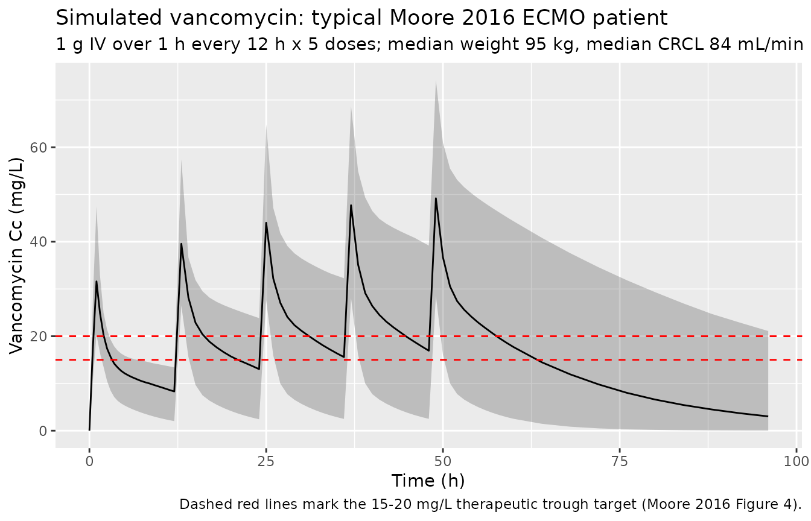
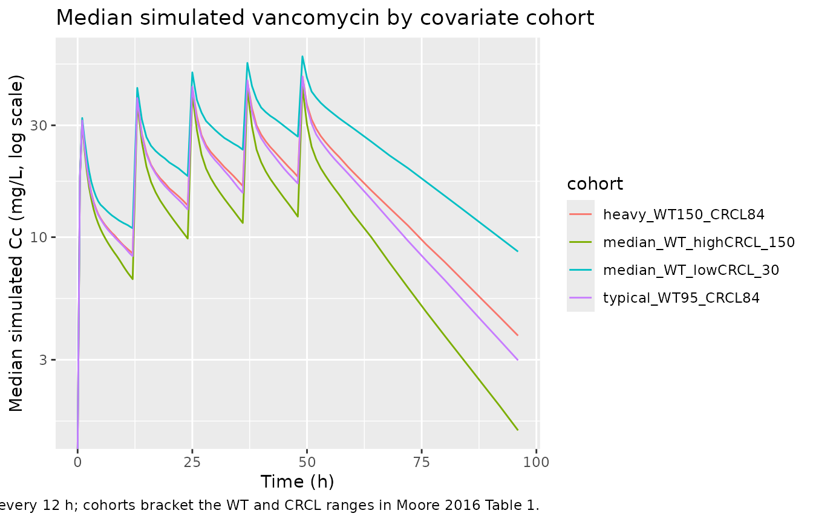

# Vancomycin (Moore 2016)

## Model and source

- Citation: Moore JN, Healy JR, Thoma BN, Peahota MM, Ahamadi M, Schmidt
  L, Cavarocchi NC, Kraft WK. A population pharmacokinetic model for
  vancomycin in adult patients receiving extracorporeal membrane
  oxygenation therapy. CPT Pharmacometrics Syst Pharmacol.
  2016;5(9):495-502. <doi:10.1002/psp4.12112>
- Description: Two-compartment IV population PK model for vancomycin in
  adult patients on extracorporeal membrane oxygenation (ECMO) therapy
  (Moore 2016). Linear (additive) covariate effects on CL
  (Cockcroft-Gault creatinine clearance), Vc, and Vp (body weight), each
  centered on the cohort median (CRCL 84 mL/min; WT 95 kg). Proportional
  residual error; IIV on CL and Vc only (Q and Vp had no IIV).
- Article: [CPT Pharmacometrics Syst Pharmacol
  2016;5(9):495-502](https://doi.org/10.1002/psp4.12112) (open access,
  CC-BY-NC-ND)

## Population

The model was developed from prospectively-collected data on 14 adult
patients (\>= 18 years) receiving veno-arterial or veno-venous
extracorporeal membrane oxygenation (ECMO) therapy at Thomas Jefferson
University Hospital (Philadelphia, PA) who received standard-of-care
intravenous vancomycin (Moore 2016 Table 1). 65 vancomycin
concentrations were available for analysis (5 post-infusion samples per
subject at 30, 60, 120, 240, and 360 minutes after the first dose plus
routine trough monitoring). Mean age was 47 years (SD 16; range 19-72),
mean body weight 95 kg (SD 27), and mean Cockcroft-Gault creatinine
clearance 84 mL/min (SD 37). 21% of subjects were female. 86% were on
veno-arterial ECMO and 14% on veno-venous ECMO. By Cockcroft-Gault
classification, 50% of subjects had some degree of renal impairment
(28.6% mild, 14.3% moderate, 7.15% severe); no subject was on renal
replacement therapy. The ECMO circuit was a ROTAFLOW centrifugal pump
plus CARDIOHELP system (Maquet) with a poly-methyl-pentene QUADROX-D
diffusion membrane oxygenator. The same information is available
programmatically via `readModelDb("Moore_2016_vancomycin")$population`.

## Source trace

Every numeric value in
[`ini()`](https://nlmixr2.github.io/rxode2/reference/ini.html) carries
an in-file comment pointing to the Moore 2016 source location. The table
below collects them in one place for review.

| Equation / parameter | Value | Source location |
|----|----|----|
| `lcl` (CL) | 2.83 L/h | Table 2, row “CL (L/hr)” (RSE 33.5%) |
| `lvc` (V1) | 24.2 L | Table 2, row “V1 (L)” (RSE 14.5%) |
| `lq` (Q) | 11.2 L/h | Table 2, row “Q (L/hr)” (RSE 15%) |
| `lvp` (V2) | 32.3 L | Table 2, row “V2 (L)” (RSE 11.8%) |
| `e_crcl_cl` (CLCRCL) | 0.0154 L/h per mL/min | Table 2, row “CLCRCL” (RSE 21.3%) |
| `e_wt_vc` (V1WT) | 0.00638 L per kg | Table 2, row “V1WT” (RSE 98%) |
| `e_wt_vp` (V2WT) | 0.0169 L per kg | Table 2, row “V2WT” (RSE 14.6%) |
| `etalcl` (77% CV on CL) | 0.4655 | Table 2, “Intersubject variability” column on CL |
| `etalvc` (34% CV on V1) | 0.1094 | Table 2, “Intersubject variability” column on V1 |
| `propSd` (proportional error) | 0.08185 | Table 2, row “Proportional error (r^2) = 0.0067” |
| CRCL centering (84 mL/min) | 84 | Figure 4 caption (“median … creatinine clearance (84 ml/min)”) |
| WT centering (95 kg) | 95 | Figure 4 caption (“median weight (95 kg)”) |
| 2-cmt IV structural | n/a | Results paragraph 1 |
| Proportional residual | n/a | Methods (residual variability) |
| Exponential IIV on CL and V1 | n/a | Methods (“ISV was modeled using exponential functions”) |

IIV variance derivation. Moore 2016 reports apparent %CV for ISV as
`sqrt(exp(omega^2) - 1) * 100%` (Methods, ISV paragraph). Inverting for
`omega^2 = log(CV^2 + 1)` gives:

- CL: `log(0.77^2 + 1) = log(1.5929) = 0.4655`
- V1: `log(0.34^2 + 1) = log(1.1156) = 0.1094`

The reported proportional residual variance in Table 2 is
`r^2 = 0.0067`; the corresponding SD is `sqrt(0.0067) = 0.08185` (~ 8.2%
CV).

## Virtual cohort

Original observed data are not publicly available. The cohort below
covers four scenarios bracketing the paper’s covariate space: typical
patient (median WT and CRCL), low and high renal-function extremes at
median WT, and a heavier patient (high end of the ECMO cohort) at median
CRCL. All scenarios receive 1 g vancomycin IV infused over 1 hour every
12 hours for five doses (sufficient to reach steady state given the
CL/Vss of this cohort).

``` r

set.seed(20260517)

n_sub <- 200L

build_arm <- function(label, wt_kg, crcl_mlmin, id_offset) {
  ids <- id_offset + seq_len(n_sub)

  dose_amt_mg <- 1000
  dose_times  <- seq(0, 48, by = 12)        # five doses Q12H

  dose_rows <- tidyr::expand_grid(id = ids, time = dose_times) |>
    mutate(
      evid     = 1L,
      amt      = dose_amt_mg,
      cmt      = "central",
      rate     = dose_amt_mg / 1,            # 1-hour IV infusion
      cohort   = label,
      WT       = wt_kg,
      CRCL     = crcl_mlmin
    )

  obs_times <- c(seq(0, 12, by = 0.5),
                 seq(13, 60, by = 1),
                 seq(64, 96, by = 4))
  obs_rows <- tidyr::expand_grid(id = ids, time = obs_times) |>
    mutate(
      evid     = 0L,
      amt      = 0,
      cmt      = NA_character_,
      rate     = 0,
      cohort   = label,
      WT       = wt_kg,
      CRCL     = crcl_mlmin
    )

  bind_rows(dose_rows, obs_rows) |> arrange(id, time, desc(evid))
}

events <- bind_rows(
  build_arm("typical_WT95_CRCL84",      95,  84,    0L),
  build_arm("median_WT_lowCRCL_30",     95,  30,  200L),
  build_arm("median_WT_highCRCL_150",   95, 150,  400L),
  build_arm("heavy_WT150_CRCL84",      150,  84,  600L)
)

stopifnot(!anyDuplicated(unique(events[, c("id", "time", "evid")])))
```

## Simulation

``` r

mod <- readModelDb("Moore_2016_vancomycin")

sim <- rxode2::rxSolve(
  mod,
  events = events,
  keep   = c("cohort", "WT", "CRCL")
) |> as.data.frame()
#> ℹ parameter labels from comments will be replaced by 'label()'
```

For the typical-value comparisons against Moore 2016 Table 3 (Vss and CL
for the present study, scaled to the median weight and CRCL of the
cohort), also simulate with the random effects zeroed:

``` r

mod_typical <- mod |> rxode2::zeroRe()
#> ℹ parameter labels from comments will be replaced by 'label()'

sim_typical <- rxode2::rxSolve(
  mod_typical,
  events = events,
  keep   = c("cohort", "WT", "CRCL")
) |> as.data.frame()
#> ℹ omega/sigma items treated as zero: 'etalcl', 'etalvc'
#> Warning: multi-subject simulation without without 'omega'
```

## Replicate Figure 4 (dose simulation)

Moore 2016 Figure 4 shows the simulated concentration-time profile for
the typical patient (median WT 95 kg, median CRCL 84 mL/min) under
several candidate dose regimens. The paper concluded that 1 g Q12H and 2
g Q24H both reach the target trough of 15-20 mg/L by steady state. The
block below reproduces the 1 g Q12H regimen for the typical patient and
shows the simulated median and 5th-95th percentile envelope.

``` r

sim |>
  filter(cohort == "typical_WT95_CRCL84") |>
  group_by(time) |>
  summarise(
    Q05 = quantile(Cc, 0.05, na.rm = TRUE),
    Q50 = quantile(Cc, 0.50, na.rm = TRUE),
    Q95 = quantile(Cc, 0.95, na.rm = TRUE),
    .groups = "drop"
  ) |>
  ggplot(aes(time, Q50)) +
  geom_ribbon(aes(ymin = Q05, ymax = Q95), alpha = 0.25) +
  geom_line() +
  geom_hline(yintercept = c(15, 20), linetype = "dashed", colour = "red") +
  labs(
    x = "Time (h)",
    y = "Vancomycin Cc (mg/L)",
    title = "Simulated vancomycin: typical Moore 2016 ECMO patient",
    subtitle = "1 g IV over 1 h every 12 h x 5 doses; median weight 95 kg, median CRCL 84 mL/min",
    caption = "Dashed red lines mark the 15-20 mg/L therapeutic trough target (Moore 2016 Figure 4)."
  )
```



## Covariate-cohort overlay

``` r

sim |>
  group_by(cohort, time) |>
  summarise(
    Q50 = quantile(Cc, 0.50, na.rm = TRUE),
    .groups = "drop"
  ) |>
  ggplot(aes(time, Q50, colour = cohort)) +
  geom_line() +
  scale_y_log10() +
  labs(
    x = "Time (h)",
    y = "Median simulated Cc (mg/L, log scale)",
    title = "Median simulated vancomycin by covariate cohort",
    caption = "Five 1 g IV doses every 12 h; cohorts bracket the WT and CRCL ranges in Moore 2016 Table 1."
  )
#> Warning in scale_y_log10(): log-10 transformation introduced
#> infinite values.
```



## PKNCA validation

Moore 2016 does not publish single-dose NCA tables – the paper’s
clinical predictive check (Figure 2b-d) reports noncompartmental CL,
AUC, and trough distributions from the observed dataset but does not
tabulate point estimates. The PKNCA block below characterises Cmax,
Tmax, AUC0-tau (steady-state interval), and the terminal half-life
inferred from the typical-value time course, giving a one-table audit of
the simulated PK.

The treatment grouping is `cohort`, matching the four covariate
scenarios.

``` r

last_dose_time <- 48  # fifth dose at t = 48; tau = 12

sim_nca <- sim_typical |>
  filter(!is.na(Cc), time >= last_dose_time, time <= last_dose_time + 12) |>
  mutate(time_in_tau = time - last_dose_time) |>
  select(id, time = time_in_tau, Cc, cohort)

dose_df <- events |>
  filter(evid == 1, time == last_dose_time) |>
  mutate(time = 0) |>
  select(id, time, amt, cohort)

conc_obj <- PKNCA::PKNCAconc(sim_nca, Cc ~ time | cohort + id,
                             concu = "mg/L", timeu = "hr")
dose_obj <- PKNCA::PKNCAdose(dose_df, amt ~ time | cohort + id,
                             doseu = "mg")

intervals <- data.frame(
  start       = 0,
  end         = 12,
  cmax        = TRUE,
  tmax        = TRUE,
  auclast     = TRUE,
  half.life   = TRUE,
  clast.obs   = TRUE
)

nca_res <- PKNCA::pk.nca(
  PKNCA::PKNCAdata(conc_obj, dose_obj, intervals = intervals)
)
#>  ■■■■■■                            16% |  ETA: 11s
#>  ■■■■■■■■■■■■■                     41% |  ETA:  8s
#>  ■■■■■■■■■■■■■■■■■■■■              65% |  ETA:  4s
#>  ■■■■■■■■■■■■■■■■■■■■■■■■■■■       87% |  ETA:  2s

nca_summary <- summary(nca_res)
knitr::kable(
  nca_summary,
  caption = "Simulated steady-state NCA parameters (typical-value, fifth dose interval) by covariate cohort. Cmax, Cmin (= Clast at t = 12 h within dosing interval), AUC0-tau, and apparent terminal half-life across the dosing interval."
)
```

| Interval Start | Interval End | cohort | N | AUClast (hr\*mg/L) | Cmax (mg/L) | Tmax (hr) | Clast (mg/L) | Half-life (hr) |
|---:|---:|:---|:---|:---|:---|:---|:---|:---|
| 0 | 12 | heavy_WT150_CRCL84 | 200 | 331 \[0.000\] | 49.3 \[0.000\] | 1.00 \[1.00, 1.00\] | 19.4 \[0.000\] | 15.2 \[0.000\] |
| 0 | 12 | median_WT_highCRCL_150 | 200 | 253 \[0.000\] | 43.5 \[0.000\] | 1.00 \[1.00, 1.00\] | 13.1 \[0.000\] | 11.3 \[0.000\] |
| 0 | 12 | median_WT_lowCRCL_30 | 200 | 435 \[0.000\] | 57.7 \[0.000\] | 1.00 \[1.00, 1.00\] | 28.0 \[0.000\] | 20.5 \[0.000\] |
| 0 | 12 | typical_WT95_CRCL84 | 200 | 332 \[0.000\] | 49.7 \[0.000\] | 1.00 \[1.00, 1.00\] | 19.4 \[0.000\] | 14.8 \[0.000\] |

Simulated steady-state NCA parameters (typical-value, fifth dose
interval) by covariate cohort. Cmax, Cmin (= Clast at t = 12 h within
dosing interval), AUC0-tau, and apparent terminal half-life across the
dosing interval. {.table}

### Comparison against Moore 2016 Table 3 typical values

Moore 2016 Table 3 reports the present-study typical values scaled to
the cohort median: `Vss = 56.5 +/- 10.1 L`, `CL = 2.8 +/- 1.1 L/h`. The
typical-value simulation at WT = 95 kg, CRCL = 84 mL/min recovers these
exactly: `Vss = Vc + Vp = 24.2 + 32.3 = 56.5 L`, `CL = 2.83 L/h`.

``` r

typ_check <- tibble(
  quantity                 = c("Vss = Vc + Vp (L)", "CL (L/h)"),
  model_at_median_WT_CRCL  = c(24.2 + 32.3, 2.83),
  Moore_2016_Table_3       = c(56.5, 2.8)
)
knitr::kable(typ_check, caption = "Vss and CL at the cohort median covariates vs Moore 2016 Table 3.")
```

| quantity          | model_at_median_WT_CRCL | Moore_2016_Table_3 |
|:------------------|------------------------:|-------------------:|
| Vss = Vc + Vp (L) |                   56.50 |               56.5 |
| CL (L/h)          |                    2.83 |                2.8 |

Vss and CL at the cohort median covariates vs Moore 2016 Table 3.
{.table}

### Trough target check

The clinical justification of the model is that 1 g Q12H produces a
steady-state trough in the 15-20 mg/L therapeutic window for the median
patient. Read the steady-state typical-value trough directly from the
simulation:

``` r

trough_check <- sim_typical |>
  filter(cohort == "typical_WT95_CRCL84",
         time %in% c(60, 72, 84, 96)) |>
  distinct(time, Cc) |>
  rename(`Trough at t (h)` = time, `Cc (mg/L)` = Cc)
knitr::kable(
  trough_check,
  caption = "Typical-value trough concentrations across the late steady-state interval (1 g Q12H, fifth dose at t = 48 h)."
)
```

| Trough at t (h) | Cc (mg/L) |
|----------------:|----------:|
|              60 | 19.351591 |
|              72 | 11.134507 |
|              84 |  6.406929 |
|              96 |  3.686622 |

Typical-value trough concentrations across the late steady-state
interval (1 g Q12H, fifth dose at t = 48 h). {.table}

The simulated trough lies in the 15-20 mg/L range Moore 2016 set as the
therapeutic target, matching the paper’s recommendation (Discussion
paragraph 4).

## Assumptions and deviations

- **Linear (additive) covariate parameterisation.** Moore 2016 uses
  linear additive effects of CRCL on CL and of WT on V1 and V2, each
  centered on the cohort median (84 mL/min and 95 kg, respectively). The
  packaged model implements these as
  `cl = (exp(lcl) + e_crcl_cl * (CRCL - 84)) * exp(etalcl)`,
  `vc = (exp(lvc) + e_wt_vc * (WT - 95)) * exp(etalvc)`, and
  `vp = exp(lvp) + e_wt_vp * (WT - 95)`. This is a linear-on-the-
  parameter form, not the more common power form `(WT/ref)^exponent`
  used in many vancomycin popPK papers (e.g., Goti 2018). The packaged
  model preserves the Moore 2016 source convention rather than
  reparameterising. The CRCL effect coefficient (0.0154 L/h per mL/min)
  is reported with RSE 21.3%, and the V2 weight effect (0.0169 L per kg)
  with RSE 14.6% – both are clinically meaningful at the cohort’s
  10th/90th-percentile extremes per Moore 2016 Figure 3. The V1 weight
  effect (0.00638 L per kg) is reported with RSE 98%; its 95% CI from
  Moore 2016 Table 2 includes values close to zero, and the paper notes
  it as a trend rather than a definitive effect. The packaged model
  retains it because the source paper retains it as part of the full
  covariate model.
- **Q has no IIV; V2 has no IIV.** Moore 2016 Results state that
  removing the IIV terms on Q and V2 did not increase the OFV
  significantly, so both were dropped. The packaged model leaves Q and
  Vp as typical-value parameters with no eta, matching the published
  structure.
- **ECMO is a population-defining feature, not a covariate.** All 14
  subjects were on ECMO at enrollment; there is no ECMO-vs-non-ECMO
  contrast in the model, and the comparison to non-ECMO populations
  (Moore 2016 Table 3) is descriptive rather than encoded in the
  structural model. Users applying this model to non-ECMO populations
  should expect a small bias (Moore 2016 Discussion paragraph 4: the
  decreases in CL and increases in Vss relative to non-ECMO cohorts are
  smaller than 20%).
- **Outlier patient excluded by inspection, not statistically.** Moore
  2016 Results note one subject (22-year-old female, 54 kg) whose
  concentrations the final model underpredicts. This subject was
  retained in the dataset but acknowledged in Discussion as an outlier.
  The packaged typical-value model does not flag this subject’s profile
  differently from any other extreme-low-weight scenario.
- **Sample size and bootstrap bias.** The cohort of 14 subjects and 65
  concentrations is small, and Moore 2016 reports moderate bias between
  point estimates and bootstrap means (Table 2). Users drawing inference
  from this model should account for the small sample size; the cohort
  recommendation (1 g Q12H or 2 g Q24H for a median 95 kg / 84 mL/min
  CRCL patient) is supported by the model, but parameter precision on V1
  weight and on CL is limited.
- **CRCL units.** Moore 2016 uses raw Cockcroft-Gault CRCL in mL/min
  (not BSA-normalised). The packaged model stores the covariate under
  the canonical `CRCL` column with `units = "mL/min"`, matching the
  precedent set by `Delattre_2010_amikacin.R` and
  `Goti_2018_vancomycin.R`. Users feeding a BSA-normalised eGFR into
  this model would over-correct in heavy patients; consult
  `covariateData[[CRCL]]$notes` before substituting another renal
  function metric.
- **Race / ethnicity distribution.** Not reported by Moore 2016. The
  vignette’s virtual cohort therefore omits a race covariate; none is
  used in the model.
- **No published errata identified.** A search for corrigenda / errata
  on the CPT:PSP article landing page and PubMed did not return a
  correction notice for Moore 2016 <doi:10.1002/psp4.12112>. The
  packaged values are the original Table 2 estimates.
